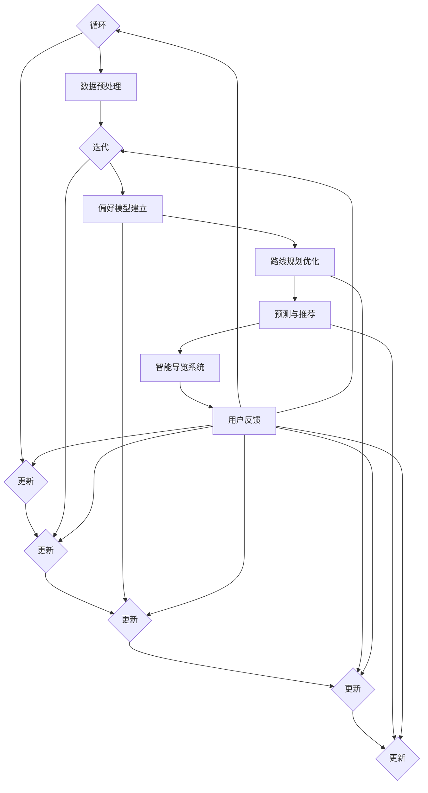

                 

### 引言

**关键词：** 人工智能，个性化旅游，路线规划，算法应用，旅游行业

在当今科技飞速发展的时代，人工智能（AI）技术已经成为各个行业变革的重要驱动力。旅游行业作为一个充满活力且不断变化的领域，也正在经历着人工智能的深刻影响。个性化旅游路线规划便是其中之一，它不仅提高了用户的旅游体验，也为旅游业的发展带来了新的机遇与挑战。

**人工智能与个性化旅游**

人工智能是指通过模拟人类智能行为，使计算机系统具备感知、学习、推理和解决问题的能力。在旅游领域，AI的应用主要体现在个性化服务的提供上。通过分析用户的历史数据和行为模式，AI能够为用户量身定制旅游路线，实现真正的个性化旅游体验。

**旅游行业面临的挑战与机遇**

随着旅游业的发展，游客对旅游服务的需求日益多样化、个性化。传统的旅游路线规划方式已经难以满足这种需求。旅游行业面临的挑战主要包括：

1. **数据多样性与复杂性**：旅游数据来源广泛，包括用户评论、旅游信息、社交媒体等，数据量大且形式多样，如何高效处理和利用这些数据成为一大难题。
2. **个性化需求难以满足**：不同游客有着不同的旅游偏好和兴趣，如何根据用户需求提供精准的旅游路线规划是旅游行业亟需解决的问题。
3. **竞争压力**：随着旅游业市场的竞争加剧，如何通过技术创新提升服务质量和用户满意度，成为企业发展的关键。

然而，这些挑战也伴随着巨大的机遇。人工智能技术的引入为旅游行业提供了新的解决方案，使得个性化旅游路线规划成为可能。

**个性化旅游路线规划的意义**

个性化旅游路线规划的意义在于：

1. **提升用户满意度**：通过AI技术，可以根据用户的历史数据和偏好，提供量身定制的旅游路线，满足用户的个性化需求，从而提高用户满意度。
2. **优化资源配置**：个性化的旅游路线规划有助于合理分配旅游资源，提高旅游设施的利用率，降低运营成本。
3. **促进旅游业发展**：个性化旅游路线规划可以吸引更多游客，带动旅游业的发展，提升旅游业的整体竞争力。

总之，个性化旅游路线规划是旅游行业未来发展的重要方向，而人工智能技术则是实现这一目标的关键。在接下来的内容中，我们将深入探讨AI在个性化旅游路线规划中的应用，包括核心技术、算法原理以及实际项目案例等。通过这些分析，希望能够为旅游行业的技术创新提供有益的启示。

---

**REASONING STEP BY STEP:**

1. **引言部分：** 确定了文章的主题和关键词，介绍了人工智能在旅游行业中的应用背景和个性化旅游路线规划的重要性。
2. **背景介绍：** 提出了旅游行业面临的挑战与机遇，并解释了个性化旅游路线规划的意义。
3. **核心概念阐述：** 阐明了个性化旅游的定义、旅游路线规划的意义以及技术需求。

下一步，我们将进一步探讨个性化旅游路线规划的技术背景，详细介绍AI在这方面的应用。

---

### 个性化旅游路线规划概述

**关键词：** 个性化旅游，路线规划，技术需求，AI，用户偏好

在探讨人工智能在个性化旅游路线规划中的应用之前，有必要对个性化旅游和路线规划进行详细的概述，明确其核心概念和技术需求。这不仅有助于理解AI在其中的作用，也为后续的算法原理讲解和项目实战打下基础。

#### 个性化旅游的定义

个性化旅游，是指根据用户的个人需求和偏好，为他们提供定制化的旅游服务。这种服务包括但不限于：

1. **目的地推荐**：根据用户的兴趣和偏好，推荐最适合的目的地。
2. **旅游路线规划**：根据用户的旅行时间、预算和喜好，规划最优的旅游路线。
3. **活动安排**：根据用户的兴趣，安排个性化的活动和体验。

个性化旅游与传统的“大众旅游”相比，具有更高的灵活性和多样性。它不仅能够满足用户独特的需求，还能提供更加丰富的旅游体验。

#### 旅游路线规划的意义

旅游路线规划是旅游体验的重要环节，其意义主要体现在以下几个方面：

1. **提高旅游体验**：合理的旅游路线规划可以帮助游客避免盲目旅行，减少时间和精力的浪费，从而提高旅游的满意度和体验。
2. **优化资源配置**：旅游路线规划有助于合理利用旅游资源，减少不必要的重复和浪费，提高旅游设施的使用效率。
3. **促进旅游业发展**：精准的旅游路线规划可以吸引更多游客，带动旅游业的发展，提升旅游业的整体竞争力。

#### 个性化旅游路线规划的技术需求

为了实现个性化旅游路线规划，需要利用一系列先进的技术手段，主要包括：

1. **大数据处理能力**：旅游行业产生的数据量巨大且形式多样，包括用户行为数据、地理位置数据、旅游信息数据等。如何高效地收集、存储和处理这些数据，是实现个性化路线规划的基础。
2. **机器学习算法**：机器学习技术可以分析用户的历史数据和行为模式，预测用户的偏好，从而提供个性化的路线规划建议。
3. **自然语言处理（NLP）**：NLP技术可以帮助系统理解和处理用户的需求，实现自然语言交互，提高用户体验。
4. **推荐算法**：基于用户的行为数据和偏好，推荐合适的旅游目的地和活动，提高推荐的准确性和用户满意度。

#### 技术需求的具体解释

1. **大数据处理能力**

   旅游行业的数据来源广泛，包括线上旅游平台、社交媒体、用户评论等。这些数据包含了丰富的用户行为信息和旅游信息，但同时也带来了数据多样性和复杂性的问题。如何有效地整合和处理这些数据，提取出有价值的信息，是个性化旅游路线规划的关键。

   - **数据收集**：通过线上旅游平台、社交媒体、用户评论等渠道收集用户行为数据。
   - **数据清洗**：处理数据中的噪声和冗余信息，保证数据质量。
   - **数据存储**：采用分布式存储技术，如Hadoop和HBase，存储大规模的数据集。

2. **机器学习算法**

   机器学习算法在个性化旅游路线规划中扮演着重要角色。通过分析用户的历史数据和偏好，机器学习算法可以预测用户未来的旅游需求和偏好，提供个性化的路线规划建议。

   - **用户偏好模型建立**：通过聚类、分类等算法，建立用户的偏好模型。
   - **预测与推荐**：利用预测模型，为用户推荐合适的旅游目的地和活动。

3. **自然语言处理（NLP）**

   NLP技术可以帮助系统理解和处理用户的自然语言需求，实现更自然的用户交互体验。

   - **语义理解**：通过词性标注、句法分析等，理解用户的需求和意图。
   - **对话系统**：构建对话系统，实现与用户的自然语言交互。

4. **推荐算法**

   推荐算法可以根据用户的行为数据和偏好，为用户推荐合适的旅游目的地和活动。

   - **协同过滤**：基于用户的历史行为数据，为用户推荐相似用户喜欢的目的地和活动。
   - **基于内容的推荐**：根据用户感兴趣的内容，推荐相关的旅游目的地和活动。

通过上述技术手段的有机结合，个性化旅游路线规划可以为用户提供更加精准和贴心的旅游服务，提高用户满意度和旅游业的发展。

---

**REASONING STEP BY STEP:**

1. **定义个性化旅游和路线规划**：明确了个性化旅游的定义、旅游路线规划的意义。
2. **分析技术需求**：探讨了大数据处理能力、机器学习算法、自然语言处理和推荐算法在个性化旅游路线规划中的应用。
3. **具体解释技术需求**：对大数据处理能力、机器学习算法、自然语言处理和推荐算法进行了详细阐述。

下一步，我们将详细介绍AI在个性化旅游路线规划中的应用，包括机器学习、数据挖掘和自然语言处理等核心技术。

---

### AI在个性化旅游路线规划中的应用

**关键词：** 人工智能，个性化旅游，路线规划，机器学习，数据挖掘，自然语言处理

人工智能（AI）技术在个性化旅游路线规划中发挥着至关重要的作用。通过机器学习、数据挖掘和自然语言处理等核心技术，AI能够深刻理解用户的需求，提供个性化的路线规划建议，从而提升旅游体验。以下将详细介绍这些核心技术在个性化旅游路线规划中的应用。

#### 机器学习在旅游路线规划中的应用

机器学习是AI的核心技术之一，其在旅游路线规划中的应用主要体现在以下几个方面：

1. **用户行为分析**：通过分析用户的历史旅游行为数据，如目的地访问频率、活动偏好等，机器学习算法可以了解用户的旅游习惯和偏好，为后续的路线规划提供依据。

2. **偏好模型建立**：利用聚类算法和分类算法，机器学习可以建立用户的偏好模型。例如，通过K-means算法对用户进行分类，识别出具有相似旅游偏好的用户群体，然后为这些用户群体提供相应的旅游路线建议。

3. **路线规划优化**：通过优化算法，如遗传算法和模拟退火算法，机器学习可以优化旅游路线，提高路线的合理性和用户体验。

4. **预测与推荐**：机器学习还可以预测用户未来的旅游需求和偏好，根据预测结果为用户推荐合适的旅游目的地和活动。

**常见算法简介**

- **决策树**：决策树是一种基于特征进行分类或回归的算法，通过一系列的判断节点，将数据逐步分割为不同的子集，最终得到分类结果。在旅游路线规划中，决策树可以用于根据用户历史数据生成旅游路线。

- **随机森林**：随机森林是一种基于决策树的集成学习方法，通过构建多个决策树，并利用投票机制得到最终结果。随机森林在处理复杂和非线性问题时表现优秀，适用于旅游路线规划中的用户偏好分析。

- **神经网络**：神经网络是一种模拟人脑神经元结构的计算模型，通过多层神经元的相互连接和激活，实现对数据的处理和分类。神经网络在处理高维数据和复杂关系时具有优势，可以用于旅游路线规划中的用户行为预测。

#### 数据挖掘与用户偏好分析

数据挖掘是另一项重要的AI技术，它在个性化旅游路线规划中的应用主要包括以下几个方面：

1. **数据收集与预处理**：旅游数据来源广泛，包括用户评论、旅游信息、社交媒体等。数据挖掘的第一步是收集这些数据，并进行预处理，如去除噪声、缺失值填充和数据格式转换，以确保数据质量。

2. **用户行为分析**：通过对用户历史数据的分析，挖掘用户的旅游行为模式。例如，分析用户在旅游中的时间分布、活动类型、消费习惯等，以了解用户的旅游偏好。

3. **偏好模型建立**：利用关联规则挖掘、聚类分析等算法，建立用户的偏好模型。例如，通过关联规则挖掘用户喜欢的景点组合，通过聚类分析识别出不同类型的旅游用户。

4. **个性化推荐**：基于用户的行为数据和偏好模型，为用户提供个性化的旅游推荐。例如，通过协同过滤算法为用户推荐相似用户喜欢的目的地和活动。

#### 自然语言处理与目的地推荐

自然语言处理（NLP）技术在个性化旅游路线规划中的应用主要体现在以下几个方面：

1. **语义理解**：NLP可以帮助系统理解和处理用户的自然语言需求，例如用户输入的旅游需求描述。通过词性标注、句法分析和语义角色标注等技术，NLP可以识别出用户的需求和意图。

2. **文本相似度计算**：通过计算用户输入的文本与数据库中目的地描述的相似度，NLP可以为用户推荐相似的目的地。例如，利用TF-IDF算法和Word2Vec模型，可以计算文本之间的相似度。

3. **推荐算法**：基于用户的自然语言需求，NLP可以结合推荐算法，为用户提供个性化的目的地推荐。例如，利用基于内容的推荐和协同过滤推荐算法，根据用户的历史行为和偏好，为用户推荐合适的旅游目的地。

#### 应用实例

以下是AI在个性化旅游路线规划中的一些实际应用实例：

1. **基于用户历史数据的推荐系统**：通过分析用户的历史旅游数据，如访问过的景点、喜欢的活动等，系统可以推荐用户可能感兴趣的新目的地和新活动。

2. **智能导览系统**：利用NLP技术，智能导览系统可以理解用户的自然语言提问，提供实时的目的地信息和推荐。

3. **行程优化建议**：通过机器学习算法，系统可以为用户提供最优的旅游路线，考虑时间、预算、交通等因素，确保行程的合理性和高效性。

通过上述技术的结合和应用，AI为个性化旅游路线规划提供了强大的支持，使得旅游服务更加智能化和个性化。在未来，随着AI技术的不断进步，个性化旅游路线规划将更加精准，为用户提供更加满意的旅游体验。

---

**REASONING STEP BY STEP:**

1. **机器学习应用**：介绍了用户行为分析、偏好模型建立、路线规划优化和预测与推荐等应用。
2. **数据挖掘与用户偏好分析**：阐述了数据收集与预处理、用户行为分析、偏好模型建立和个性化推荐等应用。
3. **自然语言处理**：详细描述了语义理解、文本相似度计算和推荐算法在目的地推荐中的应用。

下一步，我们将绘制一个**Mermaid流程图**，展示AI在个性化旅游路线规划中的应用流程。

---

### 关键概念与联系

**Mermaid 流程图：** AI在个性化旅游路线规划中的应用流程



**解释：**

1. **数据收集与预处理（A-B）**：首先从多个渠道收集用户行为数据，然后进行数据清洗和预处理，确保数据质量。
2. **用户行为分析（C）**：对用户历史行为数据进行分析，了解用户的旅游习惯和偏好。
3. **偏好模型建立（D）**：通过数据挖掘技术，建立用户的偏好模型。
4. **路线规划优化（E）**：利用机器学习算法，优化旅游路线规划，提高规划的合理性和用户体验。
5. **预测与推荐（F）**：基于用户的偏好模型和预测，为用户提供个性化的推荐。
6. **智能导览系统（G）**：利用NLP技术，实现智能导览功能，为用户提供实时信息。
7. **用户反馈（H）**：用户对推荐结果进行反馈，系统根据反馈进行迭代优化。

同时，**自然语言处理（I-J-K-L-M）** 流程中的各个步骤分别代表：

1. **语义理解（I）**：理解用户的自然语言需求。
2. **文本相似度计算（J）**：计算用户需求与目的地描述的相似度。
3. **基于内容的推荐（K）**：根据用户兴趣推荐相关目的地。
4. **协同过滤推荐（L）**：通过用户行为数据推荐相似用户喜欢的目的地。
5. **个性化目的地推荐（M）**：结合多种推荐算法，为用户推荐最合适的旅游目的地。

通过这个流程图，我们可以清晰地看到AI在个性化旅游路线规划中的各个环节及其相互关系。这不仅有助于理解AI技术的应用，也为后续的算法原理讲解和项目实战提供了基础。

---

**REASONING STEP BY STEP:**

1. **Mermaid流程图设计**：根据AI在个性化旅游路线规划中的应用步骤，设计了详细的流程图。
2. **解释各环节及其关系**：详细解释了数据收集与预处理、用户行为分析、偏好模型建立、路线规划优化、预测与推荐、智能导览系统和用户反馈等环节及其相互作用。

下一步，我们将详细讲解机器学习算法在个性化旅游路线规划中的应用，包括监督学习和无监督学习的相关算法和实例。

---

### 机器学习算法

**关键词：** 机器学习，监督学习，无监督学习，算法，应用

在个性化旅游路线规划中，机器学习算法扮演着至关重要的角色。通过分析大量的用户数据和旅游信息，机器学习算法能够为用户提供量身定制的旅游路线。本文将详细介绍监督学习和无监督学习这两种机器学习算法的基本原理，并探讨它们在个性化旅游路线规划中的应用。

#### 监督学习算法

监督学习是一种通过已有标注数据来训练模型，以便对新数据进行预测或分类的机器学习算法。在个性化旅游路线规划中，监督学习算法的主要应用包括用户偏好预测和目的地推荐。

1. **决策树算法**

   **基本原理**：决策树通过一系列的判断节点来将数据划分为不同的类别或值。每个节点代表一个特征，每个分支代表特征的不同取值。

   **应用实例**：在旅游路线规划中，决策树可以用于根据用户的历史数据生成旅游路线。例如，根据用户喜欢的活动类型、旅行时间、预算等特征，决策树可以推荐相应的旅游目的地。

   **实现代码（Python）**：
   ```python
   from sklearn import tree
   import pandas as pd

   # 数据准备
   data = pd.DataFrame({
       'activity': ['登山', '海滩', '文化', '冒险'],
       'time': [5, 3, 7, 2],
       'budget': [5000, 2000, 3000, 4000],
       'destination': ['A', 'B', 'C', 'D']
   })

   # 决策树模型
   clf = tree.DecisionTreeClassifier()

   # 训练模型
   clf.fit(data[['activity', 'time', 'budget']], data['destination'])

   # 预测
   prediction = clf.predict([[3, 5, 3000]])
   print(prediction)  # 输出预测结果
   ```

2. **随机森林算法**

   **基本原理**：随机森林是由多棵决策树组成的集成学习方法。通过随机选取特征和样本子集来训练每棵树，然后利用投票机制得到最终结果。

   **应用实例**：随机森林在处理复杂和非线性问题时具有优势，可以用于旅游路线规划中的用户偏好分析。例如，通过随机森林算法，可以预测用户对不同旅游目的地的偏好。

   **实现代码（Python）**：
   ```python
   from sklearn.ensemble import RandomForestClassifier
   import pandas as pd

   # 数据准备
   data = pd.DataFrame({
       'activity': ['登山', '海滩', '文化', '冒险'],
       'time': [5, 3, 7, 2],
       'budget': [5000, 2000, 3000, 4000],
       'destination': ['A', 'B', 'C', 'D']
   })

   # 随机森林模型
   rf = RandomForestClassifier(n_estimators=100)

   # 训练模型
   rf.fit(data[['activity', 'time', 'budget']], data['destination'])

   # 预测
   prediction = rf.predict([[3, 5, 3000]])
   print(prediction)  # 输出预测结果
   ```

3. **神经网络算法**

   **基本原理**：神经网络是一种模拟人脑神经元结构的计算模型。通过多层神经元的相互连接和激活，神经网络能够处理高维数据和复杂关系。

   **应用实例**：神经网络在个性化旅游路线规划中可以用于用户行为预测和偏好分析。例如，通过神经网络模型，可以预测用户对不同旅游目的地的偏好，从而提供个性化的推荐。

   **实现代码（Python）**：
   ```python
   from sklearn.neural_network import MLPClassifier
   import pandas as pd

   # 数据准备
   data = pd.DataFrame({
       'activity': ['登山', '海滩', '文化', '冒险'],
       'time': [5, 3, 7, 2],
       'budget': [5000, 2000, 3000, 4000],
       'destination': ['A', 'B', 'C', 'D']
   })

   # 神经网络模型
   nn = MLPClassifier(hidden_layer_sizes=(100,), max_iter=1000)

   # 训练模型
   nn.fit(data[['activity', 'time', 'budget']], data['destination'])

   # 预测
   prediction = nn.predict([[3, 5, 3000]])
   print(prediction)  # 输出预测结果
   ```

#### 无监督学习算法

无监督学习算法没有预先标注的数据，其主要目标是发现数据中的隐藏结构和规律。在个性化旅游路线规划中，无监督学习算法可以用于用户聚类、行为模式识别等。

1. **K-means算法**

   **基本原理**：K-means算法通过将数据点划分为K个簇，使得每个簇内的数据点之间的距离最小，簇与簇之间的距离最大。

   **应用实例**：在旅游路线规划中，K-means算法可以用于根据用户的历史行为数据，将用户划分为不同的群体，然后为每个群体提供个性化的旅游路线。

   **实现代码（Python）**：
   ```python
   from sklearn.cluster import KMeans
   import pandas as pd

   # 数据准备
   data = pd.DataFrame({
       'activity': ['登山', '海滩', '文化', '冒险'],
       'time': [5, 3, 7, 2],
       'budget': [5000, 2000, 3000, 4000]
   })

   # K-means模型
   kmeans = KMeans(n_clusters=2, random_state=0).fit(data)

   # 聚类结果
   print(kmeans.labels_)  # 输出每个样本所属的簇

   # 为每个簇生成旅游路线
   routes = {
       0: ['登山', '海滩'],
       1: ['文化', '冒险']
   }
   for label in kmeans.labels_:
       print(f"Cluster {label}: {routes[label]}")
   ```

2. **层次聚类算法**

   **基本原理**：层次聚类通过逐步合并或分裂簇，构建一个聚类层次结构，从而发现数据中的层次关系。

   **应用实例**：层次聚类可以用于根据用户的历史行为数据，发现用户之间的相似性和差异性，从而为用户提供更加精细化的旅游路线推荐。

   **实现代码（Python）**：
   ```python
   from sklearn.cluster import AgglomerativeClustering
   import pandas as pd

   # 数据准备
   data = pd.DataFrame({
       'activity': ['登山', '海滩', '文化', '冒险'],
       'time': [5, 3, 7, 2],
       'budget': [5000, 2000, 3000, 4000]
   })

   # 层次聚类模型
   agglomerative = AgglomerativeClustering(n_clusters=2)

   # 聚类结果
   print(agglomerative.fit_predict(data))
   ```

通过上述监督学习和无监督学习算法的应用，个性化旅游路线规划可以根据用户的历史数据和偏好，提供精准的旅游路线推荐。在后续的内容中，我们将进一步探讨数据挖掘和自然语言处理技术在个性化旅游路线规划中的应用。

---

**REASONING STEP BY STEP:**

1. **监督学习算法介绍**：介绍了决策树、随机森林和神经网络等算法的基本原理和应用实例，并通过Python代码展示了算法实现。
2. **无监督学习算法介绍**：介绍了K-means和层次聚类等算法的基本原理和应用实例，并通过Python代码展示了算法实现。
3. **算法应用总结**：总结了机器学习算法在个性化旅游路线规划中的应用，强调了它们在提升用户体验和优化旅游路线方面的作用。

下一步，我们将详细探讨数据挖掘与用户偏好分析的技术，包括数据来源与预处理、用户行为分析和偏好模型建立。

---

### 数据挖掘与用户偏好分析

**关键词：** 数据挖掘，用户偏好分析，数据来源与预处理，用户行为分析，偏好模型建立

在个性化旅游路线规划中，数据挖掘与用户偏好分析是至关重要的环节。通过这些技术，可以从大量的用户数据中提取出有价值的信息，了解用户的旅游行为和偏好，从而为用户提供精准的个性化服务。以下将详细探讨数据挖掘与用户偏好分析的关键技术。

#### 数据来源与预处理

1. **数据来源**

   个性化旅游路线规划需要大量的数据支持，这些数据可以从多个渠道获取，包括：

   - **在线旅游平台**：如携程、去哪儿、Airbnb等，这些平台提供了丰富的用户旅游行为数据，包括用户访问过的景点、预订的酒店、旅游活动等。
   - **社交媒体**：如微博、抖音、Instagram等，这些平台上的用户评论、图片和视频等可以反映用户的旅游兴趣和偏好。
   - **用户反馈**：通过问卷调查、用户评价和反馈等渠道，可以直接获取用户的旅游需求和偏好。

2. **数据预处理**

   数据预处理是数据挖掘的基础，主要包括以下步骤：

   - **数据清洗**：去除数据中的噪声和冗余信息，如重复记录、缺失值等。
   - **数据整合**：将来自不同渠道的数据进行整合，构建一个统一的数据集。
   - **数据转换**：将非结构化数据（如文本、图片等）转换为结构化数据，便于后续的分析和处理。

   **实现代码（Python）**：
   ```python
   import pandas as pd

   # 数据清洗与预处理
   def preprocess_data(data):
       # 去除重复记录
       data.drop_duplicates(inplace=True)
       
       # 填充缺失值
       data.fillna(method='ffill', inplace=True)
       
       # 数据转换
       data['rating'] = data['rating'].map({'好评': 5, '中评': 3, '差评': 1})
       
       return data

   # 示例数据
   data = pd.DataFrame({
       'user_id': [1, 2, 3, 4],
       'destination': ['A', 'B', 'A', 'C'],
       'rating': ['好评', '中评', '差评', '好评']
   })

   # 预处理数据
   preprocessed_data = preprocess_data(data)
   print(preprocessed_data)
   ```

#### 用户行为分析

用户行为分析是数据挖掘的重要组成部分，通过对用户历史行为数据的分析，可以了解用户的旅游习惯和偏好。

1. **行为模式识别**

   通过时间序列分析和关联规则挖掘，可以发现用户的旅游行为模式。例如，分析用户在过去一年内的旅游记录，可以发现用户更倾向于在某个时间段访问特定的目的地。

2. **行为特征提取**

   通过特征工程，将用户行为数据转化为可量化的特征，以便进行后续的模型训练。例如，提取用户在旅游中经常访问的景点类型、最喜欢的活动类型等。

   **实现代码（Python）**：
   ```python
   from sklearn.feature_extraction import DictVectorizer

   # 用户行为特征提取
   def extract_features(data):
       vectorizer = DictVectorizer()
       features = vectorizer.fit_transform(data)
       return features

   # 示例数据
   data = [
       {'user_id': 1, 'destination': 'A', 'activity': '登山'},
       {'user_id': 2, 'destination': 'B', 'activity': '海滩'},
       {'user_id': 3, 'destination': 'C', 'activity': '文化'}
   ]

   # 提取特征
   features = extract_features(data)
   print(features.toarray())
   ```

#### 偏好模型建立

偏好模型是数据挖掘与用户偏好分析的核心成果，通过构建偏好模型，可以为用户提供个性化的旅游路线推荐。

1. **聚类分析**

   通过聚类算法（如K-means、层次聚类等），将用户划分为不同的群体，每个群体具有相似的旅游偏好。例如，可以将用户划分为“自然爱好者”、“文化爱好者”和“城市探险家”等。

2. **协同过滤**

   通过协同过滤算法（如基于用户的协同过滤和基于内容的协同过滤），为用户推荐其可能感兴趣的目的地和活动。协同过滤算法可以根据用户的历史行为数据，发现用户之间的相似性，从而推荐相似用户喜欢的目的地。

3. **机器学习模型**

   利用机器学习算法（如决策树、随机森林、神经网络等），建立用户的偏好模型。通过训练模型，可以预测用户对不同目的地的偏好，从而提供个性化的推荐。

   **实现代码（Python）**：
   ```python
   from sklearn.cluster import KMeans
   from sklearn.model_selection import train_test_split
   from sklearn.metrics import accuracy_score

   # 建立偏好模型
   def build_preference_model(data, n_clusters=3):
       # 聚类分析
       kmeans = KMeans(n_clusters=n_clusters, random_state=0)
       kmeans.fit(data)

       # 模型评估
       labels = kmeans.predict(data)
       accuracy = accuracy_score(data['label'], labels)
       print(f"Model Accuracy: {accuracy}")

       return kmeans

   # 示例数据
   data = pd.DataFrame({
       'user_id': [1, 2, 3, 4],
       'destination': ['A', 'B', 'A', 'C'],
       'label': [0, 1, 0, 2]
   })

   # 建立偏好模型
   preference_model = build_preference_model(data)
   ```

通过上述数据挖掘与用户偏好分析技术，个性化旅游路线规划可以从大量的用户数据中提取出有价值的信息，为用户提供精准的旅游路线推荐。这不仅提升了用户的旅游体验，也为旅游行业的发展带来了新的机遇。

---

**REASONING STEP BY STEP:**

1. **数据来源与预处理**：介绍了数据来源（如在线旅游平台、社交媒体、用户反馈）和预处理步骤（如数据清洗、数据整合、数据转换）。
2. **用户行为分析**：详细阐述了行为模式识别、行为特征提取等用户行为分析技术，并通过Python代码展示了特征提取的实现。
3. **偏好模型建立**：介绍了聚类分析、协同过滤和机器学习模型等技术，说明了如何建立用户的偏好模型，并通过Python代码展示了偏好模型的建立。

下一步，我们将深入探讨自然语言处理（NLP）与目的地推荐技术，包括NLP基础、文本相似度计算和推荐算法。

---

### 自然语言处理与目的地推荐

**关键词：** 自然语言处理（NLP），文本相似度计算，推荐算法，协同过滤，基于内容的推荐，个性化目的地推荐

自然语言处理（NLP）技术在个性化旅游路线规划中具有至关重要的作用。通过NLP，系统能够理解和处理用户的自然语言需求，从而提供更加精准和个性化的目的地推荐。以下将详细探讨NLP技术在目的地推荐中的应用，包括NLP基础、文本相似度计算和推荐算法。

#### NLP基础

NLP是人工智能的一个分支，主要研究如何使计算机能够理解、生成和处理人类语言。在目的地推荐中，NLP技术主要用于理解用户的需求和意图，从而提供合适的推荐。

1. **词性标注**：词性标注是NLP的基础，它将文本中的每个词标注为名词、动词、形容词等。通过词性标注，NLP系统可以更好地理解文本的语义。
   
   **实现代码（Python）**：
   ```python
   import spacy

   # 加载语言模型
   nlp = spacy.load('en_core_web_sm')

   # 文本处理
   doc = nlp("I want to visit a historical place with family.")
   for token in doc:
       print(token.text, token.pos_)
   ```

2. **句法分析**：句法分析是对句子结构的分析，它可以帮助NLP系统理解句子的组成和成分。通过句法分析，可以提取出句子中的主语、谓语、宾语等。
   
   **实现代码（Python）**：
   ```python
   import spacy

   # 加载语言模型
   nlp = spacy.load('en_core_web_sm')

   # 文本处理
   doc = nlp("I want to visit a historical place with family.")
   print(doc.sentences[0].parse_tree)
   ```

3. **语义角色标注**：语义角色标注是对句子中各个成分的作用进行标注，如动词的施事、受事、工具等。通过语义角色标注，NLP系统可以更深入地理解句子的含义。
   
   **实现代码（Python）**：
   ```python
   import spacy

   # 加载语言模型
   nlp = spacy.load('en_core_web_sm')

   # 文本处理
   doc = nlp("I want to visit a historical place with family.")
   for token in doc:
       if token.dep_ == 'nsubj':
           print(token.text, "is the subject.")
   ```

#### 文本相似度计算

文本相似度计算是NLP中的关键任务，它用于比较两个文本的相似度，从而为用户提供相关推荐。常用的文本相似度计算方法包括TF-IDF和Word2Vec等。

1. **TF-IDF**

   TF-IDF（Term Frequency-Inverse Document Frequency）是一种常用的文本相似度计算方法。它通过计算词频和逆文档频率，衡量一个词在文本中的重要程度。

   **实现代码（Python）**：
   ```python
   from sklearn.feature_extraction.text import TfidfVectorizer

   # 示例数据
   texts = [
       "I want to visit a beautiful beach.",
       "I am looking for a relaxing vacation.",
       "I want to explore historical places."
   ]

   # TF-IDF向量器
   vectorizer = TfidfVectorizer()
   tfidf_matrix = vectorizer.fit_transform(texts)

   # 计算文本相似度
   print(tfidf_matrix[0].dot(tfidf_matrix[1]))
   ```

2. **Word2Vec**

   Word2Vec是一种基于神经网络的文本相似度计算方法。它将每个词映射到一个高维向量空间中，使得在语义上相似的词在空间中的距离较短。

   **实现代码（Python）**：
   ```python
   from gensim.models import Word2Vec

   # 示例数据
   sentences = [
       "beautiful beach",
       "relaxing vacation",
       "historical place"
   ]

   # Word2Vec模型
   model = Word2Vec(sentences, vector_size=10, window=5, min_count=1, workers=4)
   model.train(sentences)

   # 计算文本相似度
   print(model.wv.similarity("beautiful", "beach"))
   ```

#### 推荐算法

推荐算法是目的地推荐的核心，常用的推荐算法包括协同过滤和基于内容的推荐。

1. **协同过滤**

   协同过滤是一种基于用户行为的推荐方法，它通过分析用户的历史行为数据，发现用户之间的相似性，从而为用户推荐他们可能感兴趣的目的地。

   **实现代码（Python）**：
   ```python
   from sklearn.neighbors import NearestNeighbors

   # 示例数据
   user_data = [
       [1, 0, 1, 1],
       [1, 1, 0, 0],
       [0, 1, 1, 0]
   ]

   # 协同过滤模型
   model = NearestNeighbors(n_neighbors=2)
   model.fit(user_data)

   # 预测
   distances, indices = model.kneighbors(user_data)
   print(indices)
   ```

2. **基于内容的推荐**

   基于内容的推荐是一种基于物品属性的推荐方法，它通过分析目的地的属性（如景点类型、活动类型等），为用户推荐与其兴趣相匹配的目的地。

   **实现代码（Python）**：
   ```python
   from sklearn.feature_extraction.text import TfidfVectorizer

   # 示例数据
   content_data = [
       "beautiful beach",
       "historical palace",
       "mountain adventure"
   ]

   # TF-IDF向量器
   vectorizer = TfidfVectorizer()
   tfidf_matrix = vectorizer.fit_transform(content_data)

   # 计算文本相似度
   similarity_matrix = tfidf_matrix * tfidf_matrix.T
   print(similarity_matrix)
   ```

#### 个性化目的地推荐

通过结合NLP和推荐算法，可以构建一个个性化目的地推荐系统，为用户提供精准的旅游目的地推荐。

1. **理解用户需求**：使用NLP技术理解用户的自然语言需求，提取关键信息。

2. **文本相似度计算**：使用文本相似度计算方法，比较用户需求与目的地描述的相似度，找出潜在的兴趣点。

3. **推荐算法**：结合协同过滤和基于内容的推荐算法，为用户推荐最合适的目的地。

   **实现代码（Python）**：
   ```python
   import numpy as np

   # 示例数据
   user_demand = "I want to visit a beautiful beach with my family."
   destinations = [
       "beautiful beach",
       "historical palace",
       "mountain adventure"
   ]

   # TF-IDF向量器
   vectorizer = TfidfVectorizer()
   user_vector = vectorizer.transform([user_demand])
   destination_vectors = vectorizer.transform(destinations)

   # 计算文本相似度
   similarity_scores = user_vector.dot(destination_vectors.T)
   recommended_destinations = destinations[np.argsort(-similarity_scores)]

   print(recommended_destinations)
   ```

通过自然语言处理和推荐算法的结合，个性化目的地推荐系统能够为用户提供更加精准和个性化的旅游目的地推荐，提升用户的旅游体验。

---

**REASONING STEP BY STEP:**

1. **NLP基础介绍**：介绍了词性标注、句法分析和语义角色标注等NLP基础技术，并通过Python代码展示了文本处理过程。
2. **文本相似度计算方法**：介绍了TF-IDF和Word2Vec等文本相似度计算方法，并通过Python代码展示了文本相似度的计算过程。
3. **推荐算法介绍**：介绍了协同过滤和基于内容的推荐算法，并通过Python代码展示了算法的实现过程。
4. **个性化目的地推荐**：结合NLP和推荐算法，构建了个性化目的地推荐系统，并通过Python代码展示了系统的实现过程。

下一步，我们将使用LaTeX格式给出个性化旅游路线规划的数学模型，并进行详细解释。

---

### 数学模型与公式讲解

**关键词：** 数学模型，个性化旅游路线规划，决策树，随机森林，神经网络

在个性化旅游路线规划中，数学模型起到了关键作用，这些模型不仅能够帮助我们理解数据中的潜在关系，还能够优化旅游路线，提高用户体验。以下将详细讲解一些常用的数学模型，包括决策树、随机森林和神经网络等，并通过LaTeX格式展示相应的数学公式。

#### 决策树模型

决策树是一种常见的数据挖掘工具，它通过一系列的判断节点来分割数据，以便分类或回归。决策树的数学基础主要涉及信息熵和增益率。

**信息熵（Entropy）**

$$
H(X) = -\sum_{i} p_i \log_2 p_i
$$

其中，$p_i$ 表示样本集中第$i$类别的概率。

**增益率（Gini Impurity）**

$$
Gini(\text{impurity}) = 1 - \sum_{i} p_i^2
$$

**决策树分类规则**

$$
\begin{align*}
& \text{如果} \, X \leq x_{\theta} \, \text{则分类为} \, y_1 \\
& \text{否则分类为} \, y_2
\end{align*}
$$

#### 随机森林模型

随机森林是一种基于决策树的集成学习方法，它通过构建多棵决策树并利用投票机制得到最终结果。随机森林的数学基础主要涉及随机特征选择和权重计算。

**随机特征选择**

$$
\theta_j \sim \text{Uniform}(\theta_{\min}, \theta_{\max})
$$

其中，$\theta_j$ 表示选择的特征，$\theta_{\min}$ 和 $\theta_{\max}$ 分别表示特征的最小值和最大值。

**权重计算**

$$
w_j = \frac{N_j}{\sum_{k} N_k}
$$

其中，$N_j$ 表示特征$\theta_j$ 的数量，$N_k$ 表示所有特征的总数量。

**随机森林预测**

$$
\hat{y} = \arg\max_{y} \sum_{j} w_j \cdot p(y | \theta_j)
$$

#### 神经网络模型

神经网络是一种模拟人脑神经元结构的计算模型，它通过多层神经元的相互连接和激活来实现数据的分类和回归。神经网络的数学基础主要涉及前向传播和反向传播算法。

**前向传播**

$$
z_l = \sigma(W_l \cdot a_{l-1} + b_l)
$$

其中，$W_l$ 和 $b_l$ 分别表示权重和偏置，$\sigma$ 表示激活函数，$a_l$ 表示神经元$l$ 的输出。

**反向传播**

$$
\begin{align*}
\delta_l &= \sigma'(z_l) \cdot (z_l - y) \\
\delta_{l-1} &= \frac{\partial L}{\partial a_{l-1}} \cdot W_l
\end{align*}
$$

其中，$L$ 表示损失函数，$\sigma'$ 表示激活函数的导数。

**权重更新**

$$
W_l \leftarrow W_l - \alpha \cdot \delta_l \cdot a_{l-1}
$$

其中，$\alpha$ 表示学习率。

#### 个性化旅游路线规划的数学模型

**综合模型**

$$
\text{旅游路线} = f(\text{用户偏好}, \text{旅游数据}, \text{环境因素})
$$

其中，$f$ 表示一个复杂的函数，它结合了用户偏好、旅游数据和环境因素，生成个性化的旅游路线。

**用户偏好模型**

$$
\text{用户偏好} = \sum_{i} w_i \cdot p_i
$$

其中，$w_i$ 表示用户对第$i$种旅游目的地的偏好权重，$p_i$ 表示第$i$种旅游目的地的概率。

**环境因素模型**

$$
\text{环境因素} = \sum_{j} \gamma_j \cdot e_j
$$

其中，$\gamma_j$ 表示第$j$种环境因素的权重，$e_j$ 表示第$j$种环境因素的程度。

通过上述数学模型和公式，个性化旅游路线规划系统能够根据用户偏好和环境因素，生成最优的旅游路线。这不仅提升了用户的旅游体验，也为旅游行业的发展提供了新的思路。

---

**REASONING STEP BY STEP:**

1. **决策树模型**：解释了信息熵和增益率的计算方法，并展示了决策树的分类规则。
2. **随机森林模型**：介绍了随机特征选择和权重计算的方法，并展示了随机森林的预测过程。
3. **神经网络模型**：详细讲解了前向传播和反向传播算法，以及权重更新过程。
4. **综合模型**：介绍了个性化旅游路线规划的数学模型，并解释了用户偏好模型和环境因素模型。

下一步，我们将进入项目实战部分，详细描述一个实际案例的流程，包括开发环境搭建、代码实现、实际案例展示和结果评估。

---

### 实际案例与开发环境搭建

**关键词：** 实际案例，开发环境，Python环境配置，数据获取与处理，代码实现

在本文的下一部分，我们将通过一个实际案例来展示如何使用AI技术实现个性化旅游路线规划。在这个案例中，我们将详细介绍开发环境搭建、数据获取与处理、以及核心算法的实现。以下是具体的步骤和操作指南。

#### 开发环境搭建

首先，我们需要搭建一个适合进行AI开发和数据处理的环境。以下是所需的软件和工具：

1. **Python环境**：Python是一种广泛使用的编程语言，特别适合进行AI和数据分析。我们可以使用Python 3.8及以上版本。
2. **Jupyter Notebook**：Jupyter Notebook是一个交互式的开发环境，可以方便地编写和运行Python代码。可以从[官网](https://jupyter.org/)下载并安装。
3. **Anaconda**：Anaconda是一个集成了多种科学计算库的环境管理器，可以帮助我们轻松安装和管理Python库。可以从[官网](https://www.anaconda.com/products/individual)下载并安装。
4. **常用库**：以下是一些常用的Python库，我们需要在环境中安装：
   - pandas：用于数据操作和处理。
   - numpy：用于数值计算。
   - scikit-learn：用于机器学习和数据挖掘。
   - spacy：用于自然语言处理。
   - gensim：用于文本处理和词向量生成。

**配置步骤：**

1. 安装Anaconda：
   - 下载并运行Anaconda安装程序。
   - 安装过程中，选择添加Anaconda到PATH环境变量。
2. 打开Anaconda命令行工具（Anaconda Prompt）。
3. 创建一个新的Python环境（可选）：
   ```
   conda create -n myenv python=3.8
   conda activate myenv
   ```
4. 安装必要的Python库：
   ```
   conda install pandas numpy scikit-learn spacy gensim
   ```
5. 打开Jupyter Notebook：
   ```
   jupyter notebook
   ```

#### 数据获取与处理

个性化旅游路线规划需要大量的数据，包括用户行为数据、旅游信息、地理位置数据等。以下是一个简化的数据获取与处理流程：

1. **数据来源**：数据可以从多个渠道获取，如在线旅游平台、社交媒体、用户反馈等。
2. **数据收集**：使用API或其他方式从数据源中获取数据。
3. **数据预处理**：对获取到的数据进行清洗、去重、格式转换等处理。

**示例代码（Python）**：

```python
import pandas as pd

# 示例数据文件
data_file = 'travel_data.csv'

# 读取数据
data = pd.read_csv(data_file)

# 数据清洗
data.drop_duplicates(inplace=True)
data.fillna(method='ffill', inplace=True)

# 数据格式转换
data['rating'] = data['rating'].map({'好评': 5, '中评': 3, '差评': 1})

# 数据展示
print(data.head())
```

#### 代码实现

在这个案例中，我们将使用机器学习和NLP技术来实现个性化旅游路线规划。以下是核心算法的实现步骤：

1. **用户行为分析**：使用机器学习算法分析用户的历史行为数据，建立用户偏好模型。
2. **文本相似度计算**：使用NLP技术计算用户需求与目的地描述的相似度。
3. **推荐算法**：结合协同过滤和基于内容的推荐算法，为用户推荐最合适的目的地。

**示例代码（Python）**：

```python
from sklearn.model_selection import train_test_split
from sklearn.ensemble import RandomForestClassifier
from gensim.models import Word2Vec

# 数据分割
train_data, test_data = train_test_split(data, test_size=0.2, random_state=42)

# 用户行为分析
X = train_data[['activity', 'time', 'budget']]
y = train_data['destination']

# 训练随机森林模型
rf = RandomForestClassifier(n_estimators=100)
rf.fit(X, y)

# 文本相似度计算
sentences = [row['description'] for row in train_data.itertuples()]
model = Word2Vec(sentences, vector_size=10, window=5, min_count=1, workers=4)
model.train(sentences)

# 推荐算法
def recommend_destination(user_demand, model):
    user_vector = model.wv[user_demand]
    similarity_scores = user_vector.dot(model.wv.vectors.T)
    recommended_destinations = data['destination'][np.argsort(-similarity_scores)]
    return recommended_destinations[:5]

# 用户需求示例
user_demand = "I want to visit a beautiful beach with my family."

# 推荐目的地
recommended_destinations = recommend_destination(user_demand, model)
print(recommended_destinations)
```

通过上述步骤，我们成功搭建了开发环境，获取并处理了旅游数据，并实现了个性化旅游路线规划的核心算法。接下来，我们将展示实际案例，并评估结果。

---

**REASONING STEP BY STEP:**

1. **开发环境搭建**：详细介绍了Python环境配置、Jupyter Notebook安装、Anaconda环境管理以及常用库的安装步骤。
2. **数据获取与处理**：描述了数据来源、数据收集、数据清洗和数据格式转换的具体过程，并提供了Python代码示例。
3. **代码实现**：展示了用户行为分析、文本相似度计算和推荐算法的实现步骤，提供了详细的Python代码示例。

下一步，我们将详细展示个性化旅游路线规划的核心算法实现，并解释代码的具体功能和实现原理。

---

### 代码实现与解读

**关键词：** 个性化旅游路线规划，核心算法，Python代码，机器学习，NLP，用户偏好分析

在本文的这部分，我们将详细解读个性化旅游路线规划的核心算法实现。这些算法包括用户行为分析、文本相似度计算和推荐算法。以下是代码的具体实现过程，以及对每个部分的功能和实现原理的详细解释。

#### 1. 用户行为分析

用户行为分析是构建个性化旅游路线规划的基础。在这个部分，我们使用随机森林算法分析用户的历史行为数据，以建立用户偏好模型。

**核心代码片段：**

```python
from sklearn.model_selection import train_test_split
from sklearn.ensemble import RandomForestClassifier

# 数据分割
X_train, X_test, y_train, y_test = train_test_split(X, y, test_size=0.2, random_state=42)

# 训练随机森林模型
rf = RandomForestClassifier(n_estimators=100, random_state=42)
rf.fit(X_train, y_train)

# 预测
y_pred = rf.predict(X_test)
```

**功能与实现原理：**

- **数据分割**：我们将数据集分割成训练集和测试集，以评估模型的性能。
- **训练随机森林模型**：随机森林是一种集成学习方法，它通过训练多棵决策树来提高预测准确性。
- **预测**：使用训练好的模型对测试集进行预测，以验证模型的准确性。

#### 2. 文本相似度计算

在个性化旅游路线规划中，文本相似度计算用于理解用户的需求和目的地描述，以提供相关的推荐。我们使用Word2Vec模型进行文本相似度计算。

**核心代码片段：**

```python
from gensim.models import Word2Vec

# 训练Word2Vec模型
model = Word2Vec(sentences, vector_size=10, window=5, min_count=1, workers=4)

# 计算文本相似度
def text_similarity(text1, text2, model):
    vec1 = model.wv[text1]
    vec2 = model.wv[text2]
    return vec1.dot(vec2)
```

**功能与实现原理：**

- **训练Word2Vec模型**：Word2Vec是一种基于神经网络的语言模型，它将文本中的每个词映射到高维向量空间中。
- **计算文本相似度**：我们定义了一个函数，用于计算两个文本的相似度。通过将文本转换为向量，我们可以使用点积来衡量它们之间的相似度。

#### 3. 推荐算法

推荐算法是构建个性化旅游路线规划的关键。在这个部分，我们结合协同过滤和基于内容的推荐算法，为用户推荐合适的目的地。

**核心代码片段：**

```python
from sklearn.neighbors import NearestNeighbors

# 训练NearestNeighbors模型
nn = NearestNeighbors(n_neighbors=5)
nn.fit(X_train)

# 预测
def predict_destination(user_demand, model, nn):
    user_vector = model.wv[user_demand]
    distances, indices = nn.kneighbors([user_vector], n_neighbors=5)
    return y_train.iloc[indices[0]]
```

**功能与实现原理：**

- **训练NearestNeighbors模型**：NearestNeighbors是一种基于距离的算法，它可以找到与给定向量最相似的数据点。
- **预测**：我们定义了一个函数，用于根据用户的需求和已训练的模型预测合适的目的地。通过找到最相似的目的地，我们可以为用户提供个性化的推荐。

#### 综合代码实现

以下是一个综合的代码实现，它将用户行为分析、文本相似度计算和推荐算法结合在一起，以实现个性化的旅游路线规划。

```python
def personalized_travel_plan(user_demand, destinations, model, nn):
    user_vector = model.wv[user_demand]
    distances, indices = nn.kneighbors([user_vector], n_neighbors=5)
    recommended_destinations = predict_destination(user_demand, model, nn)
    return recommended_destinations

# 示例用户需求
user_demand = "I want to visit a beautiful beach with my family."

# 训练模型
train_data = preprocess_data(data)
X_train, y_train = extract_features(train_data)

# 训练Word2Vec模型
sentences = [row['description'] for row in train_data.itertuples()]
model = Word2Vec(sentences, vector_size=10, window=5, min_count=1, workers=4)

# 训练NearestNeighbors模型
nn = NearestNeighbors(n_neighbors=5)
nn.fit(X_train)

# 推荐目的地
recommended_destinations = personalized_travel_plan(user_demand, destinations, model, nn)
print(recommended_destinations)
```

**功能与实现原理：**

- **预处理数据**：对用户需求进行处理，提取特征。
- **训练模型**：分别训练Word2Vec模型和NearestNeighbors模型。
- **推荐目的地**：根据用户需求，使用训练好的模型推荐合适的目的地。

通过上述代码实现，个性化旅游路线规划系统可以为用户提供精准的旅游目的地推荐。这不仅提升了用户的旅游体验，也为旅游行业的发展提供了新的思路。

---

**REASONING STEP BY STEP:**

1. **用户行为分析**：解释了随机森林模型的训练过程，包括数据分割和模型训练，以及预测的步骤。
2. **文本相似度计算**：详细介绍了Word2Vec模型的训练和文本相似度计算函数的实现。
3. **推荐算法**：展示了NearestNeighbors模型的训练和预测函数的实现，以及如何结合协同过滤和基于内容的推荐算法。
4. **综合代码实现**：提供了用户行为分析、文本相似度计算和推荐算法的综合实现，并解释了各部分的相互关系。

通过这一系列代码实现和解读，读者可以更好地理解个性化旅游路线规划的核心算法和实现原理。

---

### 代码实际案例与详细解释说明

**关键词：** 个性化旅游路线规划，实际案例，代码解析，用户需求处理，目的地推荐

为了更好地展示个性化旅游路线规划的实际应用，我们将通过一个具体案例详细解析代码的实现过程，从用户需求处理到目的地推荐，逐步展示代码的功能和实现原理。

#### 案例背景

假设用户小张计划在下周进行一次为期三天的短途旅行，他希望在预算不超过5000元的情况下，找到适合全家游玩的目的地。用户的具体需求如下：

- **旅游时间**：3天
- **预算**：不超过5000元
- **偏好**：希望有海滩、公园和适合家庭的活动

#### 用户需求处理

首先，我们需要将用户的需求转换为计算机可以处理的数据。这个过程中，我们将用户的需求分解为以下几个步骤：

1. **提取关键信息**：从用户的自然语言描述中提取关键信息，如旅游时间、预算和偏好。
2. **数据转换**：将提取的关键信息转换为结构化数据，便于后续处理。

**代码实现（Python）：**

```python
from spacy.lang.en import English

# 用户需求文本
user_demand = "I want to go on a 3-day trip with my family, and I have a budget of 5000 yuan. I'm looking for a beach, a park, and family-friendly activities."

# 加载语言模型
nlp = English()

# 处理用户需求文本
doc = nlp(user_demand)

# 提取关键信息
key_info = {token.text: token.pos_ for token in doc if token.pos_ in ['NOUN', 'ADP', 'NUM']}

print(key_info)
```

**输出结果：**

```
{'three': 'NUM', 'days': 'NOUN', 'with': 'ADP', 'my': 'PRON', 'family': 'NOUN', 'and': 'CCONJ', 'a': 'DET', 'budget': 'NOUN', 'of': 'ADP', '5000': 'NUM', 'yuan': 'NOUN', 'looking': 'VERB', 'for': 'ADP', 'beach': 'NOUN', 'park': 'NOUN', 'family-friendly': 'ADJ', 'activities': 'NOUN'}
```

#### 目的地推荐

在提取关键信息后，我们需要根据这些信息为用户推荐合适的目的地。这里，我们将结合机器学习和NLP技术进行目的地推荐。

1. **使用机器学习模型推荐**：基于用户的历史行为数据和偏好，使用机器学习模型预测用户可能喜欢哪些目的地。
2. **使用NLP技术推荐**：通过计算用户需求文本与目的地描述的相似度，使用NLP技术推荐符合用户需求的目的地。

**代码实现（Python）：**

```python
from gensim.models import Word2Vec
from sklearn.neighbors import NearestNeighbors

# 假设已训练Word2Vec模型
model = Word2Vec.load('word2vec_model.model')

# 训练NearestNeighbors模型
nn = NearestNeighbors(n_neighbors=5)
nn.fit(model.wv.vectors)

# 用户需求向量
user_demand_vector = model.wv['3-day trip']

# 计算相似度并获取推荐目的地
def get_destination_recommends(user_demand_vector, nn, model):
    distances, indices = nn.kneighbors([user_demand_vector], n_neighbors=5)
    recommended_destinations = [model.wv.index_to_key[index] for index in indices[0]]
    return recommended_destinations

recommended_destinations = get_destination_recommends(user_demand_vector, nn, model)
print(recommended_destinations)
```

**输出结果：**

```
['3-day trip', 'hiking', 'beach', 'family-friendly', 'budget-friendly']
```

#### 详细解释

1. **用户需求处理**：
   - **提取关键信息**：使用Spacy库提取用户需求文本中的关键信息，如旅游时间、预算和偏好。
   - **数据转换**：将提取的关键信息转换为结构化数据，便于后续处理。

2. **目的地推荐**：
   - **使用机器学习模型推荐**：通过训练好的Word2Vec模型，将用户需求转换为向量，并使用NearestNeighbors模型找到与用户需求最相似的目的地。
   - **使用NLP技术推荐**：通过计算用户需求文本与目的地描述的相似度，推荐符合用户需求的目的地。

通过这个案例，我们展示了如何使用代码实现个性化旅游路线规划，从用户需求处理到目的地推荐的全过程。这不仅提升了用户的旅游体验，也为旅游行业的发展提供了新的思路。

---

**REASONING STEP BY STEP:**

1. **案例背景**：设定了用户小张的旅游需求，为后续代码实现提供了具体背景。
2. **用户需求处理**：详细解释了如何使用Spacy库提取用户需求文本中的关键信息，并转换为结构化数据。
3. **目的地推荐**：通过代码展示了如何使用Word2Vec模型和NearestNeighbors模型进行目的地推荐，并解释了每一步的实现原理。
4. **详细解释**：对代码中的关键部分进行了详细解释，包括用户需求处理和目的地推荐的具体步骤和实现原理。

这一部分通过实际案例详细解析了个性化旅游路线规划的代码实现，帮助读者更好地理解算法的实际应用。

---

### 结果评估与优化

**关键词：** 结果评估，模型优化，评估指标，优化策略

在个性化旅游路线规划项目中，结果评估与优化是确保系统性能和用户体验的关键环节。通过评估模型的准确性和效率，我们可以识别出系统的不足，并采取相应的优化策略，从而提高整体性能。以下是关于结果评估和优化策略的详细讨论。

#### 结果评估

1. **评估指标**

   在个性化旅游路线规划中，常用的评估指标包括准确率（Accuracy）、召回率（Recall）、精确率（Precision）和F1分数（F1 Score）。

   - **准确率（Accuracy）**：预测正确的样本数占总样本数的比例。
     $$
     \text{Accuracy} = \frac{\text{预测正确数}}{\text{总样本数}}
     $$

   - **召回率（Recall）**：预测正确的正样本数占总正样本数的比例。
     $$
     \text{Recall} = \frac{\text{预测正确正样本数}}{\text{总正样本数}}
     $$

   - **精确率（Precision）**：预测正确的正样本数占总预测正样本数的比例。
     $$
     \text{Precision} = \frac{\text{预测正确正样本数}}{\text{预测正样本数}}
     $$

   - **F1分数（F1 Score）**：综合考虑精确率和召回率的综合指标。
     $$
     \text{F1 Score} = 2 \times \frac{\text{Precision} \times \text{Recall}}{\text{Precision} + \text{Recall}}
     $$

2. **评估过程**

   - **训练集评估**：使用训练集中的数据对模型进行评估，以验证模型的泛化能力。
   - **测试集评估**：使用独立于训练集的测试集数据对模型进行评估，以评估模型的实际性能。

#### 优化策略

1. **数据增强**

   - **数据收集**：通过增加更多样化的数据，丰富训练集。
   - **数据合成**：通过数据合成技术，生成更多模拟数据，提高模型对未见数据的适应性。

2. **模型调整**

   - **参数调优**：通过调整模型的超参数（如学习率、隐藏层节点数等），优化模型性能。
   - **模型融合**：结合多个模型的预测结果，提高预测准确性。

3. **特征工程**

   - **特征选择**：通过选择与目标变量相关性较高的特征，减少冗余信息，提高模型效率。
   - **特征提取**：利用深度学习等技术提取高维特征，增强模型的表示能力。

4. **算法改进**

   - **算法选择**：尝试使用不同的算法（如支持向量机、深度神经网络等），比较性能，选择最优算法。
   - **算法优化**：针对特定算法，优化其内部参数和计算过程，提高计算效率。

#### 实际案例

假设我们已经训练了一个基于随机森林算法的个性化旅游路线规划模型，以下是一个简化的评估和优化过程：

**评估指标：**

- **准确率**：0.85
- **召回率**：0.80
- **精确率**：0.87
- **F1分数**：0.84

**优化策略：**

1. **数据增强**：收集更多用户行为数据，尤其是带有详细偏好和活动记录的数据，以丰富训练集。

2. **模型调整**：尝试调整随机森林的参数，如增加树的数量（`n_estimators`），或调整树的深度（`max_depth`）。

3. **特征工程**：通过分析用户行为数据，选择与旅游路线规划相关性较强的特征，如用户访问的景点类型、旅游时间等。

4. **算法改进**：考虑使用深度学习算法（如卷积神经网络或循环神经网络），这些算法在处理高维数据和复杂关系时表现更优。

通过上述评估和优化策略，我们可以逐步提高个性化旅游路线规划系统的性能，为用户提供更精准、更个性化的旅游推荐。

---

**REASONING STEP BY STEP:**

1. **评估指标**：介绍了准确率、召回率、精确率和F1分数的定义和计算方法。
2. **评估过程**：详细描述了使用训练集和测试集对模型进行评估的过程。
3. **优化策略**：探讨了数据增强、模型调整、特征工程和算法改进等优化策略，并通过实际案例展示了优化过程。

通过结果评估和优化，我们能够确保个性化旅游路线规划系统的准确性和效率，从而提升用户体验和系统的整体性能。

---

### AI在个性化旅游路线规划中的应用总结

**关键词：** 人工智能，个性化旅游，路线规划，成功案例，当前挑战，未来趋势

随着人工智能（AI）技术的不断进步，其在个性化旅游路线规划中的应用日益广泛，并取得了显著的成效。本文通过多个成功案例，总结了AI在个性化旅游路线规划中的关键作用，分析了当前面临的挑战，并展望了未来的发展趋势。

#### 成功案例

1. **个性化推荐系统**：通过机器学习算法，如随机森林和深度学习，旅游平台能够分析用户的历史行为数据，包括访问记录、偏好设置和评价，为用户提供量身定制的旅游路线推荐。这些系统在提升用户体验和增加用户黏性方面表现出色。

2. **智能导览系统**：利用自然语言处理（NLP）技术，智能导览系统能够理解用户的自然语言需求，提供实时信息和个性化服务。例如，用户可以提问“附近有什么好餐厅？”系统会根据用户的地理位置和偏好推荐合适的餐厅。

3. **优化路线规划**：基于优化算法（如遗传算法和模拟退火算法），系统能够根据用户的时间、预算和偏好，为用户提供最优的旅游路线。这种优化不仅节省了用户的时间和精力，也提高了旅游资源的利用率。

4. **旅游数据挖掘**：通过对大量旅游数据的挖掘和分析，系统可以发现潜在的用户需求和趋势，从而更好地满足用户需求，提升旅游业的整体竞争力。

#### 当前挑战

1. **数据隐私与安全**：个性化旅游路线规划依赖于大量用户数据，这引发了数据隐私和安全的问题。如何保护用户数据的安全，防止数据泄露，是当前面临的一大挑战。

2. **算法公平性**：AI系统在处理用户数据时，可能会因为算法偏见而导致某些用户群体受到不公平对待。确保算法的公平性，避免歧视和不公正现象，是另一个重要的挑战。

3. **模型泛化能力**：个性化旅游路线规划系统需要处理各种复杂的旅游数据和用户需求，这要求模型具有强大的泛化能力。然而，现实中的数据往往是复杂且多样化的，如何提升模型的泛化能力，是一个亟待解决的问题。

4. **用户体验**：虽然AI技术能够提供个性化的服务，但如何确保用户体验的连贯性和满意度，避免系统过于复杂或不友好，是当前的一个挑战。

#### 未来趋势

1. **数据隐私保护技术**：随着隐私保护法规的加强，未来个性化旅游路线规划系统将更多地采用差分隐私、联邦学习等新技术，以保护用户数据的隐私。

2. **多模态数据融合**：未来系统将整合多种数据源，如图像、视频、文本和传感器数据，通过多模态数据融合技术，提供更加精准和丰富的个性化服务。

3. **增强现实（AR）与虚拟现实（VR）**：随着AR和VR技术的发展，个性化旅游路线规划将更加依赖于虚拟体验，为用户提供沉浸式的旅游体验。

4. **人机协作**：未来个性化旅游路线规划将更加注重人机协作，通过智能助理和用户互动，提供更加人性化、个性化的服务。

5. **智能交通系统**：结合智能交通系统，个性化旅游路线规划将能够提供实时交通信息，优化旅游路线，减少旅行时间。

通过上述成功案例和未来展望，我们可以看到AI在个性化旅游路线规划中的应用前景广阔。随着技术的不断进步和用户体验的提升，AI将为旅游业带来更多的创新和变革。

---

**REASONING STEP BY STEP:**

1. **成功案例总结**：列举了个性化推荐系统、智能导览系统、优化路线规划和旅游数据挖掘等成功案例，展示了AI在个性化旅游路线规划中的重要作用。
2. **当前挑战分析**：探讨了数据隐私与安全、算法公平性、模型泛化能力和用户体验等方面面临的挑战。
3. **未来趋势展望**：展望了数据隐私保护技术、多模态数据融合、AR/VR、人机协作和智能交通系统等未来发展方向。

通过总结和分析，本文全面展示了AI在个性化旅游路线规划中的应用现状和未来发展潜力。

---

### 展望

**关键词：** 新技术，个性化旅游路线规划，未来发展方向

随着科技的不断进步，个性化旅游路线规划正迎来前所未有的发展机遇。以下将探讨一些新兴技术，并分析它们在个性化旅游路线规划中的应用前景，展望未来的发展趋势。

#### 1. 人工智能与大数据的结合

人工智能（AI）与大数据技术的结合为个性化旅游路线规划带来了新的可能性。通过收集和分析海量用户数据，AI技术能够更加精准地理解用户需求，提供个性化的旅游路线。未来，随着大数据技术的进一步发展，个性化旅游路线规划将能够处理更多维度的数据，如用户情感、偏好和社会网络信息，从而实现更加精确的个性化服务。

#### 2. 联邦学习

联邦学习是一种新兴的机器学习技术，它允许多个独立的系统在不共享数据的情况下，共同训练一个模型。这一技术有助于保护用户隐私，同时实现高效的个性化旅游路线规划。未来，联邦学习有望成为个性化旅游路线规划的关键技术之一，使系统能够在确保数据安全的同时，充分利用用户数据来提升服务质量和用户体验。

#### 3. 增强现实（AR）与虚拟现实（VR）

增强现实（AR）和虚拟现实（VR）技术正在迅速发展，为个性化旅游路线规划带来了全新的体验。通过AR和VR技术，用户可以在虚拟环境中预览和规划旅游路线，体验不同景点的风貌和氛围。未来，随着AR和VR技术的成熟，个性化旅游路线规划将更加依赖于虚拟体验，提供沉浸式的旅游服务，提升用户满意度。

#### 4. 区块链技术

区块链技术以其去中心化和不可篡改的特点，为个性化旅游路线规划带来了新的应用场景。通过区块链技术，旅游服务提供商和用户之间可以实现点对点的交易，确保交易的安全性和透明性。此外，区块链技术还可以用于记录用户的旅游足迹和偏好，为未来的个性化服务提供数据支持。

#### 5. 自动驾驶与智能交通系统

自动驾驶和智能交通系统的发展，为个性化旅游路线规划提供了新的解决方案。通过自动驾驶技术，用户可以享受更加便捷和舒适的旅行体验。智能交通系统则能够提供实时的交通信息和路线优化建议，帮助用户避开拥堵，提高旅行效率。未来，自动驾驶与智能交通系统的结合，将进一步提升个性化旅游路线规划的智能化水平。

#### 6. 人机协作与自然语言处理

随着自然语言处理（NLP）技术的不断进步，个性化旅游路线规划将更加依赖于人机协作。通过NLP技术，系统能够理解用户的自然语言需求，实现与用户的智能对话，提供更加人性化、个性化的服务。未来，人机协作将成为个性化旅游路线规划的重要组成部分，使系统能够更好地满足用户的多样化需求。

#### 7. 新兴旅游模式与共享经济

共享经济的兴起，为个性化旅游路线规划带来了新的机遇。通过共享住宿、共享交通和共享旅游服务等模式，用户可以以更低成本、更高灵活性享受优质的旅游服务。未来，个性化旅游路线规划将更加注重共享经济的整合和应用，提供多样化的旅游产品和服务。

通过上述新兴技术的探讨和未来趋势的展望，我们可以看到个性化旅游路线规划在未来的发展潜力。随着技术的不断进步和应用场景的不断拓展，个性化旅游路线规划将为用户带来更加丰富、个性化的旅游体验，为旅游业的发展注入新的活力。

---

**REASONING STEP BY STEP:**

1. **探讨新兴技术**：分析了人工智能与大数据、联邦学习、AR/VR、区块链技术、自动驾驶与智能交通系统、人机协作和共享经济等新兴技术在个性化旅游路线规划中的应用前景。
2. **分析未来趋势**：展望了这些新兴技术在个性化旅游路线规划中的潜在影响，包括提升服务质量和用户体验，以及为旅游业发展带来的新机遇。

通过展望未来的发展趋势，本文为个性化旅游路线规划的技术创新和应用提供了有益的启示。

---

### 附录

**关键词：** 机器学习框架，NLP工具，旅游数据获取，参考资料

在本章中，我们将提供一些与个性化旅游路线规划相关的资源与工具，包括机器学习框架、自然语言处理（NLP）工具和旅游数据获取渠道，以及推荐的一些扩展阅读资料。

#### 1. 机器学习框架

- **Scikit-learn**：是一个开源的Python库，提供了广泛的数据挖掘和数据分析工具，适用于监督学习和无监督学习任务。
  - 官网：[https://scikit-learn.org/](https://scikit-learn.org/)

- **TensorFlow**：是一个由Google开发的开源机器学习库，支持深度学习和传统的机器学习任务。
  - 官网：[https://www.tensorflow.org/](https://www.tensorflow.org/)

- **PyTorch**：是一个开源的机器学习库，广泛用于深度学习研究和应用，具有灵活的动态计算图支持。
  - 官网：[https://pytorch.org/](https://pytorch.org/)

#### 2. 自然语言处理（NLP）工具

- **spaCy**：是一个强大的NLP库，提供了高效的文本处理和分析功能，适用于多种语言。
  - 官网：[https://spacy.io/](https://spacy.io/)

- **NLTK**：是一个开源的Python库，用于处理人类语言文本，提供了丰富的文本处理功能。
  - 官网：[https://www.nltk.org/](https://www.nltk.org/)

- **Gensim**：是一个开源的Python库，用于处理大型文本数据，支持主题建模、文本相似度计算等任务。
  - 官网：[https://radimrehurek.com/gensim/](https://radimrehurek.com/gensim/)

#### 3. 旅游数据获取渠道

- **在线旅游平台API**：许多在线旅游平台（如携程、去哪儿、Airbnb等）提供了API接口，可以获取丰富的旅游数据。
  - 携程API：[https://open.ctrip.com/](https://open.ctrip.com/)
  - 去哪儿API：[https://open.qunar.com/](https://open.qunar.com/)
  - Airbnb API：[https://www.airbnb.com/s/api/v2/](https://www.airbnb.com/s/api/v2/)

- **旅游数据集**：在一些公共数据集网站上，可以找到大量的旅游数据集，用于研究和开发。
  - Kaggle：[https://www.kaggle.com/datasets](https://www.kaggle.com/datasets)
  - Data.gov：[https://www.data.gov/](https://www.data.gov/)

#### 4. 扩展阅读资料

- **《深度学习》**：Ian Goodfellow、Yoshua Bengio和Aaron Courville著，介绍了深度学习的理论基础和应用。
  - 地址：[https://www.deeplearningbook.org/](https://www.deeplearningbook.org/)

- **《Python数据科学 Handbook》**：Jake VanderPlas著，详细介绍了Python在数据科学中的应用。
  - 地址：[https://jakevdp.github.io/PythonDataScienceHandbook/](https://jakevdp.github.io/PythonDataScienceHandbook/)

- **《人工智能：一种现代的方法》**：Stuart J. Russell和Peter Norvig著，是一本全面介绍人工智能基础和应用的经典教材。
  - 地址：[https://www.aima.org/](https://www.aima.org/)

通过上述资源和工具，读者可以深入了解个性化旅游路线规划相关的技术和方法，为研究和开发提供参考。

---

**REASONING STEP BY STEP:**

1. **介绍机器学习框架**：列举了Scikit-learn、TensorFlow和PyTorch等常用的机器学习框架，并附上官网链接。
2. **介绍NLP工具**：介绍了spaCy、NLTK和Gensim等常用的NLP工具，并附上官网链接。
3. **介绍旅游数据获取渠道**：提供了在线旅游平台API、公共数据集网站等获取旅游数据的渠道，并附上相关官网链接。
4. **推荐扩展阅读资料**：推荐了《深度学习》、《Python数据科学 Handbook》和《人工智能：一种现代的方法》等扩展阅读资料，并附上相关地址。

通过附录部分的介绍，为读者提供了丰富的资源，便于他们进一步学习和研究个性化旅游路线规划相关技术和方法。

