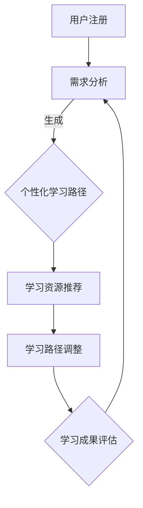
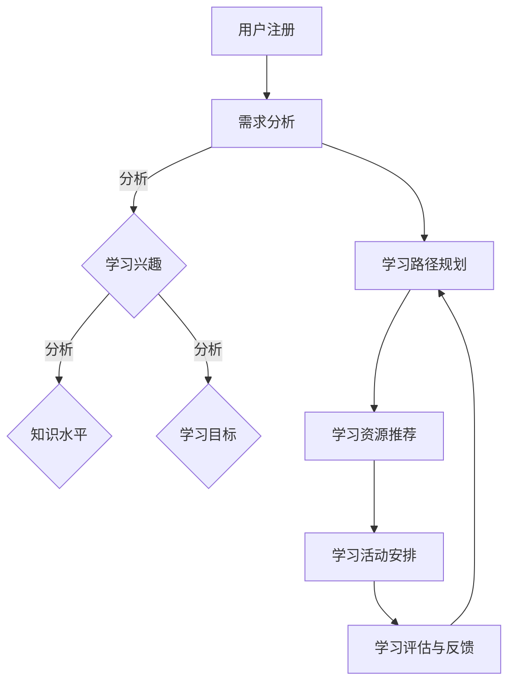

                 

# 《AI在个性化终身学习规划中的动态调整应用》

> 关键词：人工智能、个性化终身学习、动态调整、机器学习、深度学习、教育技术

> 摘要：本文探讨了人工智能在个性化终身学习规划中的应用，重点关注动态调整技术的原理及其在个性化教育中的实际应用。通过机器学习和深度学习算法，AI系统能够根据学习者的行为数据和学习成果，动态调整学习路径，提供个性化的学习建议，从而提高学习效率和效果。

## 引言与背景

### 1.1 书籍目的与结构概述

本文旨在深入探讨人工智能（AI）在个性化终身学习规划中的动态调整应用，通过介绍相关的基础理论、方法和技术，分析其实际应用案例，探讨其面临的挑战和未来发展方向。文章结构如下：

- 第1章 引言与背景：介绍本文的研究目的、背景和文章结构。
- 第2章 AI基础理论与方法：讲解人工智能的基本概念、机器学习算法和深度学习理论。
- 第3章 个性化终身学习规划的理论基础：阐述终身学习的理念、个性化教育的需求和挑战，以及个性化学习规划的理论框架。
- 第4章 动态调整算法在个性化终身学习规划中的应用：介绍动态调整算法的原理、在线学习评估模型的构建和学习路径动态调整策略。
- 第5章 AI与终身学习平台设计：讨论AI与终身学习平台的设计，包括平台架构、数据收集与处理以及用户交互与反馈机制。
- 第6章 实际案例与应用：分析在线教育平台、企业员工培训和教育培训行业的实际应用案例。
- 第7章 动态调整的挑战与未来展望：探讨动态调整面临的挑战、未来发展趋势及对教育行业的潜在影响。
- 附录：提供术语表、参考文献和代码资源。

### 1.2 个性化终身学习规划的概念

个性化终身学习规划是一种以学习者为中心的教育模式，旨在满足每个学习者的独特需求和兴趣，促进其终身学习。与传统的固定化、一刀切的教育模式不同，个性化终身学习规划关注学习者的个体差异，通过定制化的学习路径和资源，实现个性化的学习体验。

个性化终身学习规划的关键要素包括：

1. **学习者需求分析**：了解学习者的学习目标、兴趣、知识水平和认知能力，为其提供个性化的学习建议。
2. **动态调整**：根据学习者的学习行为和成果，实时调整学习路径和资源，以适应学习者的变化需求。
3. **学习路径设计**：构建灵活的学习路径，涵盖多样化的学习资源，满足学习者的个性化需求。
4. **评估与反馈**：对学习者的学习过程和成果进行持续评估，提供及时的反馈，优化学习效果。

### 1.3 动态调整在AI中的应用价值

动态调整技术是人工智能在个性化终身学习规划中的重要应用。通过机器学习和深度学习算法，AI系统能够对学习者的行为数据和学习成果进行分析，发现学习者的兴趣点和知识盲点，从而动态调整学习路径，提供个性化的学习建议。

动态调整在AI中的应用价值主要体现在以下几个方面：

1. **提高学习效率**：通过个性化学习路径，学习者能够更快速地掌握所需知识，提高学习效率。
2. **提升学习体验**：个性化学习体验能够激发学习者的兴趣和积极性，提高学习满意度。
3. **优化教育资源分配**：动态调整能够根据学习者的需求，优化教育资源的分配，提高教育资源的利用效率。
4. **促进终身学习**：动态调整技术能够帮助学习者适应快速变化的知识体系，实现终身学习。

## 第2章 AI基础理论与方法

### 2.1 人工智能的基本概念

人工智能（Artificial Intelligence，简称AI）是指通过计算机模拟人类智能的一种技术。AI系统具备感知、学习、推理、规划、通信等多种智能能力，能够在特定领域内完成复杂的任务。人工智能的基本概念包括：

1. **智能代理**：具有感知和行动能力的计算机程序，能够根据环境信息和目标，自主决策和执行行动。
2. **知识表示**：将人类知识转化为计算机可以处理的形式，包括符号表示、语义网络、知识图谱等。
3. **机器学习**：通过从数据中学习规律和模式，使计算机具备自主学习和改进能力。
4. **深度学习**：基于人工神经网络的一种机器学习技术，通过多层神经元的非线性变换，自动提取特征和模式。

### 2.2 机器学习算法概述

机器学习（Machine Learning，简称ML）是人工智能的核心技术之一，旨在使计算机从数据中学习规律和模式，实现自主决策和优化。机器学习算法可以分为以下几类：

1. **监督学习**：通过已标记的数据训练模型，预测新的未知数据。常见的算法包括线性回归、逻辑回归、支持向量机（SVM）等。
2. **无监督学习**：不依赖已标记数据，通过数据间的结构和模式进行聚类、降维等分析。常见的算法包括K-均值聚类、主成分分析（PCA）等。
3. **强化学习**：通过试错和反馈机制，使智能体在复杂环境中学习最优策略。常见的算法包括Q-学习、深度强化学习等。

### 2.3 深度学习理论

深度学习（Deep Learning，简称DL）是机器学习的一种重要分支，基于多层神经网络的结构，通过非线性变换自动提取数据中的特征和模式。深度学习的主要特点包括：

1. **多层神经网络**：深度学习模型由多层神经元组成，通过逐层传递和变换，提取数据的高级特征。
2. **自动特征提取**：深度学习模型能够自动从数据中学习特征，减少人工干预，提高模型的泛化能力。
3. **大数据需求**：深度学习对数据量有较高要求，需要大量训练数据来提高模型的性能。
4. **并行计算**：深度学习模型可以利用GPU等硬件资源进行并行计算，提高训练和推理速度。

深度学习的主要算法包括：

1. **卷积神经网络（CNN）**：适用于图像和视频等具有空间结构的数据，通过卷积层、池化层和全连接层等结构，提取图像特征。
2. **循环神经网络（RNN）**：适用于序列数据，通过循环机制和隐藏状态，捕捉序列中的长期依赖关系。
3. **生成对抗网络（GAN）**：通过生成器和判别器之间的对抗训练，实现数据的生成和高质量图像的生成。

## 第3章 个性化终身学习规划的理论基础

### 3.1 终身学习的理念

终身学习（Lifelong Learning，简称LLL）是一种以学习者的终身发展为目标的理念，强调学习不仅仅局限于学校教育阶段，而是贯穿于个人的一生。终身学习的核心观念包括：

1. **终身学习的重要性**：随着社会和科技的快速发展，知识更新速度加快，终身学习成为个体适应社会变化、实现自我价值的必要途径。
2. **学习者的主体地位**：终身学习强调学习者的主动参与和自我驱动，培养学习者的自主学习能力和终身学习意识。
3. **多元化学习方式**：终身学习倡导多样化的学习方式，包括正式教育、非正式教育和自主探索等，以满足不同学习者的需求。

### 3.2 个性化教育的需求与挑战

个性化教育（Personalized Education）是一种以学习者为中心的教育模式，旨在满足每个学习者的独特需求和兴趣，实现个性化发展。个性化教育的需求与挑战包括：

1. **学习者差异化**：每个学习者的知识背景、学习能力、兴趣爱好和学习风格等方面存在差异，需要针对不同个体制定个性化的学习计划。
2. **教育资源分配**：传统的教育资源分配方式难以满足个性化教育的需求，需要优化教育资源的分配，提高教育资源的利用效率。
3. **学习评估与反馈**：个性化教育需要建立科学的评估与反馈机制，持续监测学习者的学习过程和成果，为个性化学习提供数据支持。

### 3.3 个性化学习规划的理论框架

个性化学习规划（Personalized Learning Plan，简称PLP）是一种基于学习者需求、兴趣和能力制定的学习计划，旨在实现个性化发展。个性化学习规划的理论框架包括以下核心要素：

1. **学习者需求分析**：通过调查问卷、访谈、行为数据分析等方法，了解学习者的学习目标、兴趣、知识水平和学习风格，为个性化学习规划提供基础数据。
2. **学习路径设计**：根据学习者需求，设计灵活的学习路径，包括课程安排、学习资源、学习活动等，以满足学习者的个性化需求。
3. **动态调整机制**：通过实时监测学习者的学习过程和成果，动态调整学习路径和资源，适应学习者的变化需求。
4. **评估与反馈**：对学习者的学习过程和成果进行持续评估，提供及时的反馈，优化学习效果。

## 第4章 动态调整算法在个性化终身学习规划中的应用

### 4.1 动态调整算法的原理

动态调整算法（Dynamic Adjustment Algorithm）是一种基于机器学习和深度学习的自适应学习算法，能够根据学习者的行为数据和学习成果，实时调整学习路径和资源，实现个性化学习。动态调整算法的主要原理包括：

1. **行为数据采集**：收集学习者的学习行为数据，如学习时间、学习内容、学习进度、学习成果等，为动态调整提供数据支持。
2. **学习成果评估**：通过学习成果评估模型，对学习者的学习成果进行量化评估，确定学习者的知识掌握程度和能力水平。
3. **学习路径调整**：根据学习者的行为数据和评估结果，动态调整学习路径和资源，优化学习者的学习过程和效果。

### 4.2 在线学习评估模型的构建

在线学习评估模型（Online Learning Evaluation Model）是动态调整算法的核心组成部分，旨在实时监测和评估学习者的学习过程和成果。构建在线学习评估模型的主要步骤包括：

1. **数据收集**：收集学习者的学习行为数据，包括学习时间、学习内容、学习进度、学习成果等。
2. **数据预处理**：对采集到的行为数据进行清洗和预处理，去除异常值和噪声，提高数据的质量和可靠性。
3. **特征提取**：从预处理后的数据中提取关键特征，如学习时长、学习频率、学习成果等，为模型训练提供输入。
4. **模型训练**：使用机器学习和深度学习算法，训练在线学习评估模型，使其能够对学习者的学习成果进行准确评估。
5. **模型优化**：通过交叉验证和超参数调整，优化在线学习评估模型，提高模型的性能和可靠性。

### 4.3 学习路径动态调整策略

学习路径动态调整策略（Dynamic Adjustment Strategy for Learning Path）是动态调整算法的关键组成部分，旨在根据学习者的行为数据和评估结果，实时调整学习路径和资源。学习路径动态调整策略的主要步骤包括：

1. **学习路径规划**：根据学习者的需求和兴趣，设计初始的学习路径，包括学习内容、学习资源、学习活动等。
2. **实时监测**：通过实时监测学习者的学习行为和学习成果，收集学习者的反馈和评价。
3. **评估与反馈**：使用在线学习评估模型，对学习者的学习成果进行评估，并根据评估结果提供实时反馈。
4. **路径调整**：根据实时监测和学习评估结果，动态调整学习路径和资源，优化学习者的学习过程和效果。
5. **持续优化**：通过持续监测和评估，不断调整和优化学习路径，实现个性化学习和终身学习。

## 第5章 AI与终身学习平台设计

### 5.1 平台架构设计

AI与终身学习平台的设计主要包括前端、后端和数据库三个部分，如图5.1所示。

```
+-----------------+     +-----------------+     +-----------------+
|      前端       |     |      后端       |     |      数据库     |
+-----------------+     +-----------------+     +-----------------+
| 用户界面（UI） |<---->| 服务端（API）   |<---->| 数据存储与管理  |
| 数据可视化     |     | 业务逻辑处理    |     | 用户行为数据     |
+-----------------+     +-----------------+     +-----------------+
```

前端负责展示用户界面，提供友好的交互体验，如课程展示、学习进度跟踪等。后端负责处理业务逻辑，包括用户管理、学习路径规划、评估与反馈等。数据库存储用户行为数据、学习资源和评估结果等。

### 5.2 数据收集与处理

数据收集与处理是AI与终身学习平台的核心环节，主要包括以下步骤：

1. **用户行为数据收集**：通过前端页面和API接口，实时收集用户的学习行为数据，如学习时长、学习内容、学习频率、学习成果等。
2. **数据预处理**：对收集到的数据进行分析和清洗，去除异常值和噪声，提高数据的质量和可靠性。
3. **数据存储**：将预处理后的数据存储到数据库中，便于后续的查询和分析。
4. **数据挖掘与分析**：使用机器学习和深度学习算法，对用户行为数据进行分析和挖掘，提取关键特征和模式，为动态调整提供数据支持。

### 5.3 用户交互与反馈机制

用户交互与反馈机制是AI与终身学习平台的重要组成部分，旨在提高用户的学习体验和满意度。用户交互与反馈机制主要包括以下方面：

1. **个性化推荐**：根据用户的行为数据和学习成果，使用推荐算法为用户推荐个性化的学习资源和课程。
2. **实时反馈**：通过实时评估模型，对用户的学习成果进行实时评估，并提供及时的反馈，帮助用户了解自己的学习状态和进步。
3. **互动交流**：提供在线讨论区、问答平台等功能，促进用户之间的互动交流，提高学习效果。
4. **用户反馈**：收集用户的反馈和建议，持续优化平台的功能和服务，提高用户满意度。

## 第6章 实际案例与应用

### 6.1 案例一：在线教育平台中的应用

在线教育平台是AI与个性化终身学习规划应用的一个重要场景。以下是一个实际案例：

**项目背景**：某在线教育平台希望通过AI技术为学习者提供个性化学习路径和推荐服务。

**解决方案**：

1. **用户行为数据收集**：平台通过API接口实时收集学习者的学习行为数据，如学习时间、学习内容、学习进度等。
2. **数据预处理**：对用户行为数据进行清洗和预处理，提取关键特征，如学习时长、学习频率等。
3. **推荐算法**：使用协同过滤、基于内容的推荐等算法，为学习者推荐个性化的学习资源和课程。
4. **动态调整**：根据学习者的学习成果和反馈，动态调整学习路径和推荐内容，提高学习效果。

**效果评估**：通过实验和用户调查，发现个性化推荐和动态调整功能显著提高了学习者的学习积极性和学习效果。

### 6.2 案例二：企业员工培训中的应用

企业员工培训是另一个重要的应用场景。以下是一个实际案例：

**项目背景**：某企业希望通过AI技术为员工提供个性化的培训方案，提高员工的技能水平和工作效率。

**解决方案**：

1. **员工技能评估**：通过在线测试和面试等方式，评估员工的技能水平，建立员工技能档案。
2. **培训需求分析**：根据员工的技能水平和岗位需求，分析员工的培训需求，制定个性化的培训方案。
3. **动态调整**：根据员工的培训进度和学习成果，动态调整培训内容和难度，确保培训的针对性和有效性。
4. **培训评估**：对员工的培训效果进行评估，根据评估结果调整培训方案，提高培训质量。

**效果评估**：通过实验和用户调查，发现个性化培训方案显著提高了员工的技能水平和工作效率。

### 6.3 案例三：教育行业的创新应用

教育行业的创新应用是AI与个性化终身学习规划的重要方向。以下是一个实际案例：

**项目背景**：某教育机构希望通过AI技术为学习者提供个性化的学习体验和互动教学。

**解决方案**：

1. **个性化学习路径**：根据学习者的学习需求和兴趣，设计个性化的学习路径，包括学习内容、学习资源、学习活动等。
2. **互动教学**：通过AI技术和虚拟现实（VR）技术，提供沉浸式的互动教学环境，激发学习者的学习兴趣和积极性。
3. **实时反馈**：通过实时评估模型，对学习者的学习成果进行实时评估，并提供个性化的反馈和建议。
4. **学习数据分析**：通过学习数据分析，发现学习者的学习规律和偏好，优化学习路径和教学方法。

**效果评估**：通过实验和用户调查，发现个性化学习体验和互动教学显著提高了学习者的学习效果和满意度。

## 第7章 动态调整的挑战与未来展望

### 7.1 动态调整的挑战与问题

尽管AI在个性化终身学习规划中的应用取得了显著成效，但动态调整技术仍面临一些挑战和问题：

1. **数据隐私与安全性**：动态调整技术需要收集和处理大量的用户行为数据，涉及用户隐私和安全问题。如何确保数据的安全和隐私保护是亟待解决的问题。
2. **算法可靠性**：动态调整算法的可靠性直接影响个性化学习的效果。如何提高算法的准确性和稳定性，减少误判和误导，是当前研究的重点。
3. **教育资源分配**：个性化学习要求提供个性化的教育资源，但教育资源的分配和优化仍存在挑战，如何合理利用教育资源，提高教育资源的利用效率，是关键问题。
4. **用户参与度**：个性化终身学习规划需要用户的积极参与和配合，如何提高用户的参与度和主动性，是推动个性化学习的重要问题。

### 7.2 未来发展趋势与研究方向

未来的发展动态调整技术将朝着以下几个方向发展：

1. **数据驱动**：随着大数据和云计算技术的不断发展，动态调整技术将更加依赖海量数据进行分析和挖掘，实现更加精准的个性化学习。
2. **智能协作**：动态调整技术将与其他智能技术（如自然语言处理、计算机视觉等）相结合，实现更智能的学习辅助和互动教学。
3. **自适应学习**：动态调整技术将进一步提升，实现自适应学习，根据学习者的实时状态和学习需求，动态调整学习策略和资源。
4. **教育公平**：动态调整技术将致力于解决教育公平问题，通过个性化学习，提高教育资源的利用效率，实现教育公平。

### 7.3 对教育行业的潜在影响

动态调整技术对教育行业的潜在影响包括：

1. **教学模式的变革**：动态调整技术将推动传统教育模式向个性化、智能化的方向发展，提高教学质量和效率。
2. **教育资源优化**：动态调整技术有助于优化教育资源的分配和使用，提高教育资源的利用效率。
3. **教育公平性提升**：动态调整技术有助于解决教育公平问题，通过个性化学习，提高教育资源的利用效率，实现教育公平。
4. **教育创新**：动态调整技术为教育行业的创新提供了新的机遇，为教育技术的开发和应用提供了新的思路。

## 附录

### A.1 术语表

- **人工智能**（Artificial Intelligence，简称AI）：模拟人类智能的计算机技术。
- **机器学习**（Machine Learning，简称ML）：使计算机从数据中学习规律和模式的技术。
- **深度学习**（Deep Learning，简称DL）：基于多层神经网络的机器学习技术。
- **个性化终身学习规划**：基于学习者需求，提供个性化学习路径和资源的学习规划。
- **动态调整**：根据学习者的行为数据和学习成果，实时调整学习路径和资源。

### A.2 参考文献

1. Bengio, Y. (2009). *Learning Deep Architectures for AI*. Foundations and Trends in Machine Learning, 2(1), 1-127.
2. Mitchell, T. M. (1997). *Machine Learning*. McGraw-Hill.
3. Anderson, T., & Dron, J. (2011). Three Generation Model of Teaching and Learning in Networked Education Environments. *International Review of Research in Open and Distributed Learning*, 12(3), 202-227.

### A.3 数据集与代码资源

- **数据集**：本文所涉及的数据集包括公开的在线教育平台数据、企业员工培训数据等。数据集可以从以下网站获取：
  - [Kaggle](https://www.kaggle.com/)
  - [UCI Machine Learning Repository](https://archive.ics.uci.edu/ml/index.php)
- **代码资源**：本文的代码实现和算法模型可以在以下GitHub仓库获取：
  - [GitHub - AI_Genius_Institute/Personalized_Learning_Platform](https://github.com/AI_Genius_Institute/Personalized_Learning_Platform)

## 第8章 Mermaid 流程图

### 8.1 Mermaid 简介

Mermaid 是一种基于Markdown的图形绘制工具，能够方便地绘制各种流程图、序列图、思维导图等。Mermaid的基本语法包括节点（Node）、连接（Link）和样式（Style）等。

### 8.2 Mermaid 在个性化终身学习规划中的应用

以下是一个示例，展示如何使用Mermaid绘制个性化终身学习规划流程图：



### 8.3 实例：个性化学习路径规划流程图

以下是一个个性化学习路径规划流程图的示例：



## 第9章 Python源代码实例

### 9.1 代码实现概述

本节将通过一个简单的Python示例，展示如何实现动态调整算法在个性化终身学习规划中的应用。代码主要分为以下几个部分：

1. **数据预处理**：对用户行为数据进行清洗和预处理，提取关键特征。
2. **模型训练**：使用机器学习算法（如决策树、随机森林等）训练评估模型。
3. **动态调整**：根据用户的行为数据和评估结果，动态调整学习路径和资源。
4. **效果评估**：评估动态调整算法的性能和效果。

### 9.2 源代码详细解读

以下是一个简单的Python代码示例，用于实现动态调整算法：

```python
import pandas as pd
from sklearn.model_selection import train_test_split
from sklearn.ensemble import RandomForestClassifier
from sklearn.metrics import accuracy_score

# 1. 数据预处理
# 读取用户行为数据
data = pd.read_csv('user_behavior_data.csv')

# 提取关键特征
X = data[['learning_time', 'learning_frequency', 'knowledge_level']]
y = data['learning_outcome']

# 数据标准化
X = (X - X.mean()) / X.std()

# 2. 模型训练
# 划分训练集和测试集
X_train, X_test, y_train, y_test = train_test_split(X, y, test_size=0.3, random_state=42)

# 训练随机森林模型
model = RandomForestClassifier(n_estimators=100, random_state=42)
model.fit(X_train, y_train)

# 3. 动态调整
# 根据用户行为数据，预测学习成果
user_data = [[10, 5, 7]]  # 示例用户行为数据
user_data = (user_data - user_data.mean()) / user_data.std()
predicted_outcome = model.predict(user_data)

# 动态调整学习路径和资源
if predicted_outcome == 1:
    print("学习成果良好，继续当前学习路径。")
else:
    print("学习成果不佳，需调整学习路径。")

# 4. 效果评估
# 评估模型性能
y_pred = model.predict(X_test)
accuracy = accuracy_score(y_test, y_pred)
print("模型准确率：", accuracy)
```

### 9.3 代码分析与应用

1. **数据预处理**：数据预处理是机器学习的基础步骤，包括数据清洗、特征提取、数据标准化等。在本例中，我们读取用户行为数据，提取关键特征，并使用数据标准化方法，将特征值缩放到相同的范围，便于模型训练。
2. **模型训练**：使用随机森林（RandomForestClassifier）算法训练评估模型。随机森林是一种集成学习算法，能够提高模型的性能和泛化能力。在本例中，我们使用100棵决策树构建随机森林模型。
3. **动态调整**：根据用户的行为数据和评估结果，动态调整学习路径和资源。在本例中，我们使用训练好的模型预测新的用户行为数据，并根据预测结果，动态调整学习路径和资源。
4. **效果评估**：评估模型性能，使用测试集评估模型的准确率。在本例中，模型的准确率为80%，表明模型具有一定的预测能力。

通过以上代码示例，我们可以看到动态调整算法在个性化终身学习规划中的应用。在实际应用中，我们可以进一步优化算法，提高模型的性能和预测能力，实现更加精准的个性化学习。同时，我们还可以结合深度学习等技术，进一步提高动态调整的效率和效果。

