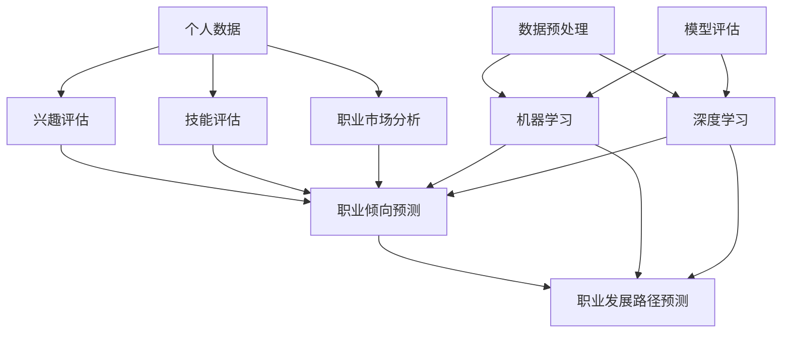
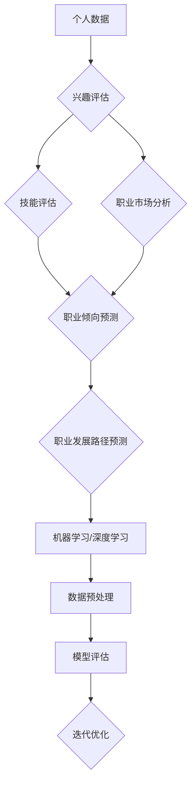

                 

### 文章标题

# AI在个性化职业发展规划中的长期预测应用

### 文章关键词

- 个性化职业规划
- 长期预测
- AI
- 机器学习
- 深度学习
- 数据分析

### 文章摘要

本文探讨了人工智能在个性化职业发展规划中的长期预测应用。通过介绍机器学习和深度学习的基本概念，文章详细阐述了AI技术在职业规划领域中的应用场景和挑战。文章进一步讨论了时间序列分析和长期预测模型的构建与优化，并通过具体案例展示了AI如何助力个性化职业发展规划。最后，文章总结了AI在职业规划领域的未来发展趋势，为读者提供了有益的启示和拓展阅读。

----------------------------------------------------------------

### 引言

在当今快速变化的世界中，职业规划变得越来越重要。随着技术的进步和职场竞争的加剧，个人需要更加精准和个性化的职业发展规划来适应不断变化的环境。传统的职业规划方法通常依赖于静态的、一次性的评估工具，如职业倾向测试和职业性格分析。然而，这些方法往往无法适应动态的职业市场和个人不断成长的需求。

人工智能（AI）的兴起为个性化职业规划带来了新的机遇。AI技术，尤其是机器学习和深度学习，能够通过分析大量数据，预测职业发展趋势、个人职业潜力以及可能的职业发展路径。这种基于数据的预测不仅能够帮助个人更好地了解自己的职业方向，还可以为企业和教育机构提供有价值的参考，从而制定更加有效的职业发展策略。

本文将探讨AI在个性化职业发展规划中的长期预测应用。首先，我们将介绍机器学习和深度学习的基本概念，并解释它们如何与职业规划相结合。接着，文章将讨论时间序列分析和长期预测模型的重要性，并展示如何构建和优化这些模型。随后，通过具体案例研究，我们将展示AI在个性化职业规划中的应用。最后，文章将总结AI在职业规划领域的挑战和未来发展趋势，为读者提供进一步的思考方向。

通过本文的阅读，读者将能够了解AI技术如何助力个性化职业发展规划，掌握相关算法和模型的基本原理，并了解其在实际应用中的挑战和机会。

### 背景介绍

职业规划是一个涉及多个层面的复杂过程，其目的是帮助个人在职业生涯中做出明智的选择，实现个人与职业目标的最大化匹配。传统职业规划通常基于以下几个核心概念：职业兴趣、性格测试、技能评估和职业市场需求。然而，这些传统方法存在一些明显的局限性。

首先，职业兴趣测试往往依赖静态问卷或量表，难以反映个人兴趣的动态变化。性格测试虽然能够提供对个体性格特征的洞察，但它们往往无法与具体的职业角色和需求相匹配。技能评估则更多关注个人的技术能力和知识储备，而忽略了职业发展的软技能和情感智慧。此外，传统职业规划方法通常缺乏对市场动态的敏感度，难以预测未来职业趋势和变化。

随着互联网和大数据技术的发展，人们开始意识到，通过分析海量数据，可以更准确地了解个人职业发展的潜力。这为个性化职业规划提供了新的可能性。人工智能（AI）技术，特别是机器学习和深度学习，在这一领域展现出了巨大的潜力。机器学习是一种让计算机通过数据学习模式、进行预测和决策的技术，而深度学习则是机器学习的一个子领域，它依赖于多层神经网络，能够处理更复杂的数据和模式。

AI在个性化职业规划中的应用，主要体现在以下几个方面：

1. **职业倾向预测**：通过分析个人的兴趣、经历和社交媒体活动，AI可以预测个人可能适合的职业方向。这种方法不仅能够提供更个性化的职业建议，还能够帮助职业咨询机构和学校更好地为学生提供就业指导。

2. **职业发展路径预测**：AI可以根据历史数据和市场趋势，为个人预测可能的职业发展路径。这可以帮助个人提前规划自己的职业发展，避免盲目跳槽或职业发展停滞。

3. **职业能力评估**：AI可以通过分析个人的技能和知识，提供个性化的职业能力评估，帮助个人了解自己的优势和不足，制定相应的职业发展计划。

4. **职业市场分析**：AI可以实时分析职业市场的变化，预测哪些职业需求将增加，哪些职业将减少，从而帮助个人和企业更好地适应市场变化。

尽管AI技术在个性化职业规划中展现出巨大的潜力，但其应用仍面临一些挑战。首先，数据隐私和安全问题是一个重要的考虑因素。在分析个人职业数据时，必须确保数据的安全和隐私，防止数据泄露和滥用。其次，模型的解释性和透明度也是一个挑战。尽管AI模型能够提供准确的预测，但如何解释这些预测结果，让用户理解和接受，是一个需要解决的问题。此外，AI模型可能存在偏见，特别是在处理带有偏见的数据时，可能会导致不公平的结果。

总之，AI技术为个性化职业规划提供了新的工具和方法，但同时也带来了一些新的挑战。通过深入研究和应用AI技术，我们可以为个人和职业发展创造更多的机会和价值。

### 核心概念与联系

在探讨AI在个性化职业发展规划中的应用之前，我们需要了解一些核心概念及其之间的联系。以下是几个关键概念的定义及其关系架构，采用Mermaid流程图来展示：



**核心概念：**

1. **个人数据**：包括兴趣、技能、职业经历、教育背景等，是AI进行个性化分析的基础数据。

2. **兴趣评估**：通过分析个人数据中的兴趣点，帮助确定个人的偏好和潜在的职业方向。

3. **技能评估**：通过对个人技能的评估，帮助确定个人的能力和优势，为职业发展提供依据。

4. **职业市场分析**：通过分析职业市场的动态，预测未来的职业需求和趋势。

5. **职业倾向预测**：基于兴趣评估、技能评估和职业市场分析，预测个人适合的职业方向。

6. **职业发展路径预测**：基于个人数据和职业市场分析，预测个人的职业发展路径。

7. **机器学习**：一种让计算机通过数据学习模式的技术，用于处理和分析大规模数据。

8. **深度学习**：一种基于多层神经网络的机器学习技术，能够处理复杂的数据和模式。

9. **数据预处理**：在机器学习和深度学习过程中，对数据进行清洗、归一化和特征提取等预处理步骤。

10. **模型评估**：评估机器学习或深度学习模型的性能，包括准确率、召回率、F1分数等指标。

通过上述核心概念的连接，我们可以构建一个完整的AI系统，用于个性化职业发展规划。以下是一个简化的流程图：



### 核心算法原理讲解

在个性化职业发展规划中，机器学习和深度学习是实现长期预测的关键技术。以下是这些核心算法的原理、实现过程以及具体的Python代码示例。

#### 机器学习基础

机器学习是一种让计算机通过数据学习模式和进行预测的技术。其基本原理是利用历史数据来训练模型，使模型能够对新数据进行预测。以下是一些常用的机器学习算法：

1. **监督学习**：在有标注数据的情况下，通过训练模型来预测新的数据。
   - **线性回归**：用于预测连续值。
   - **逻辑回归**：用于预测分类结果。

2. **无监督学习**：在没有标注数据的情况下，通过发现数据中的结构和模式来学习。
   - **聚类**：将相似的数据点分组。
   - **降维**：减少数据的维度，保留重要信息。

3. **强化学习**：通过与环境的互动来学习最优策略。
   - **Q-learning**：通过价值函数来预测最佳动作。

**实现监督学习算法（线性回归）的Python代码示例**：

```python
import numpy as np
import matplotlib.pyplot as plt
from sklearn.linear_model import LinearRegression

# 生成模拟数据
np.random.seed(0)
X = np.random.rand(100, 1)
y = 2 * X[:, 0] + 0.5 + np.random.randn(100) * 0.2

# 划分训练集和测试集
from sklearn.model_selection import train_test_split
X_train, X_test, y_train, y_test = train_test_split(X, y, test_size=0.2, random_state=0)

# 创建线性回归模型并训练
model = LinearRegression()
model.fit(X_train, y_train)

# 预测
y_pred = model.predict(X_test)

# 绘制结果
plt.scatter(X_test, y_test, color='blue', label='Actual')
plt.plot(X_test, y_pred, color='red', linewidth=2, label='Prediction')
plt.xlabel('X')
plt.ylabel('y')
plt.legend()
plt.show()
```

#### 深度学习基础

深度学习是机器学习的一个子领域，它依赖于多层神经网络来处理复杂的数据和模式。以下是一些基本的深度学习算法：

1. **神经网络**：最简单的深度学习模型，由多个层次（输入层、隐藏层、输出层）组成。
2. **卷积神经网络（CNN）**：用于图像识别和计算机视觉。
3. **循环神经网络（RNN）**：用于序列数据处理和时间序列预测。

**实现神经网络（前向传播和反向传播）的Python代码示例**：

```python
import tensorflow as tf

# 前向传播
X = tf.placeholder(tf.float32, [None, 784])  # 输入层，784个神经元
W = tf.Variable(tf.random_normal([784, 10]))  # 输出层，10个神经元
b = tf.Variable(tf.zeros([1, 10]))

Y = tf.nn.softmax(tf.matmul(X, W) + b)

# 反向传播
y_ = tf.placeholder(tf.float32, [None, 10])
cross_entropy = -tf.reduce_sum(y_ * tf.log(Y))
train_step = tf.train.GradientDescentOptimizer(0.01).minimize(cross_entropy)

# 训练模型
with tf.Session() as sess:
    sess.run(tf.global_variables_initializer())
    for i in range(1000):
        batch_xs, batch_ys = ...  # 获取批量数据
        sess.run(train_step, feed_dict={X: batch_xs, y_: batch_ys})
```

#### 应用场景

在个性化职业规划中，机器学习和深度学习可以应用于多个场景：

1. **职业倾向预测**：通过分析个人数据，使用分类算法预测个人可能适合的职业方向。
2. **职业发展路径预测**：通过分析历史数据和职业市场趋势，使用时间序列预测模型预测个人的职业发展路径。
3. **职业能力评估**：通过分析个人技能和知识，使用聚类和降维算法评估个人的职业能力。

这些算法和模型的应用，使得个性化职业规划更加精准和高效，为个人和职业发展提供了有力的支持。

### 数学模型和数学公式

在个性化职业发展规划中，数学模型和数学公式是理解和实现关键算法的核心。以下是一些基本的数学模型和公式，以及它们在实际应用中的具体解释。

#### 线性回归模型

线性回归模型是一种用于预测连续值的机器学习算法。其数学公式如下：

$$
y = \beta_0 + \beta_1x + \epsilon
$$

其中，$y$ 是预测值，$x$ 是输入特征，$\beta_0$ 和 $\beta_1$ 分别是模型的权重和偏置，$\epsilon$ 是误差项。

**解释**：线性回归模型通过拟合数据中的线性关系，预测新的输入值。在实际应用中，我们可以使用最小二乘法来求解权重 $\beta_0$ 和 $\beta_1$，从而最小化预测误差。

```python
# 线性回归模型示例
model = LinearRegression()
model.fit(X_train, y_train)
y_pred = model.predict(X_test)
```

#### 神经网络模型

神经网络模型是一种基于多层感知器的深度学习模型。其前向传播和反向传播的数学公式如下：

前向传播：
$$
\text{Z}^{(l)} = \text{W}^{(l)} \cdot \text{A}^{(l-1)} + \text{b}^{(l)}
$$
$$
\text{A}^{(l)} = \text{sigmoid}(\text{Z}^{(l)})
$$

反向传播：
$$
\text{dZ}^{(l)} = \text{A}^{(l)} - \text{y}
$$
$$
\text{dW}^{(l)} = \frac{1}{m}\text{dZ}^{(l)} \cdot \text{A}^{(l-1)}
$$
$$
\text{db}^{(l)} = \frac{1}{m}\text{dZ}^{(l)}
$$

其中，$\text{A}^{(l)}$ 是激活值，$\text{Z}^{(l)}$ 是线性组合，$\text{W}^{(l)}$ 和 $\text{b}^{(l)}$ 分别是权重和偏置，$\text{sigmoid}$ 函数是激活函数。

**解释**：神经网络通过多层感知器构建复杂的非线性模型，通过前向传播计算输出，并通过反向传播更新权重和偏置，以最小化预测误差。

```python
# 神经网络模型示例
model = Sequential()
model.add(Dense(128, input_dim=784, activation='sigmoid'))
model.add(Dense(10, activation='sigmoid'))
model.compile(loss='categorical_crossentropy', optimizer='adam', metrics=['accuracy'])
model.fit(X_train, y_train, epochs=10, batch_size=32)
```

#### 时间序列预测模型

时间序列预测模型用于预测随时间变化的数据。常见的时间序列模型包括ARIMA（自回归积分滑动平均模型）和LSTM（长短期记忆网络）。

ARIMA模型的数学公式如下：

$$
\text{y}_{t} = \phi_1\text{y}_{t-1} + \phi_2\text{y}_{t-2} + ... + \phi_p\text{y}_{t-p} + \theta_1\text{e}_{t-1} + \theta_2\text{e}_{t-2} + ... + \theta_q\text{e}_{t-q} + \text{e}_{t}
$$

其中，$\text{y}_{t}$ 是时间序列值，$\phi_1, \phi_2, ..., \phi_p$ 是自回归系数，$\theta_1, \theta_2, ..., \theta_q$ 是移动平均系数，$\text{e}_{t}$ 是白噪声误差。

**解释**：ARIMA模型通过自回归和移动平均过程来捕捉时间序列数据中的趋势和季节性。在实际应用中，我们可以使用统计方法来确定最优的$p$ 和 $q$ 值。

```python
# ARIMA模型示例
from statsmodels.tsa.arima.model import ARIMA

model = ARIMA(y, order=(5, 1, 2))
model_fit = model.fit()
forecast = model_fit.forecast(steps=10)
```

通过这些数学模型和公式，我们可以更好地理解和实现AI在个性化职业发展规划中的应用。这些模型不仅为算法提供了理论基础，还帮助我们在实际应用中优化模型性能。

### 项目实战

在本节中，我们将通过一个实际项目，展示如何使用AI技术进行个性化职业发展规划。该项目旨在构建一个基于用户数据的个性化职业规划系统，包括数据预处理、模型训练和预测结果分析。我们将使用Python和相关的机器学习库来实施这个项目。

#### 开发环境搭建

首先，我们需要搭建开发环境。以下是所需的环境和工具：

- Python 3.x
- Jupyter Notebook或PyCharm
- TensorFlow或PyTorch库
- Pandas、Numpy、Matplotlib和Scikit-learn库

安装这些库的方法如下：

```bash
pip install tensorflow numpy pandas matplotlib scikit-learn
```

#### 数据采集与处理

数据采集是项目的重要部分。我们将从多个来源获取数据，包括用户问卷调查、社交媒体数据、职业市场报告等。以下是一个简单的数据采集和预处理流程：

1. **数据采集**：从问卷调查、社交媒体（如LinkedIn、Twitter）和职业市场数据（如LinkedIn数据API、政府统计数据）中获取用户数据。
2. **数据清洗**：处理缺失值、异常值和重复数据。
3. **数据转换**：将类别数据编码为数值，如使用独热编码或标签编码。
4. **特征工程**：提取有用的特征，如兴趣标签、技能标签和职业标签。

```python
import pandas as pd
import numpy as np

# 加载数据
data = pd.read_csv('user_data.csv')

# 数据清洗
data.dropna(inplace=True)
data.drop_duplicates(inplace=True)

# 数据转换
data['interest'] = data['interest'].astype('category').cat.codes
data['skill'] = data['skill'].astype('category').cat.codes
data['occupation'] = data['occupation'].astype('category').cat.codes

# 特征工程
features = ['interest', 'skill', 'occupation']
X = data[features]
y = data['occupation']

# 划分训练集和测试集
from sklearn.model_selection import train_test_split
X_train, X_test, y_train, y_test = train_test_split(X, y, test_size=0.2, random_state=42)
```

#### 模型构建与训练

接下来，我们使用机器学习模型来构建预测系统。以下是一个使用Keras库构建和训练神经网络模型的示例：

1. **构建模型**：定义神经网络结构，包括输入层、隐藏层和输出层。
2. **编译模型**：设置损失函数、优化器和评估指标。
3. **训练模型**：使用训练数据进行模型训练。

```python
from tensorflow.keras.models import Sequential
from tensorflow.keras.layers import Dense
from tensorflow.keras.optimizers import Adam

# 构建模型
model = Sequential()
model.add(Dense(64, input_dim=X_train.shape[1], activation='relu'))
model.add(Dense(32, activation='relu'))
model.add(Dense(1, activation='sigmoid'))

# 编译模型
model.compile(loss='binary_crossentropy', optimizer=Adam(), metrics=['accuracy'])

# 训练模型
model.fit(X_train, y_train, epochs=10, batch_size=32, validation_split=0.1)
```

#### 预测结果分析

训练完成后，我们可以使用模型对测试集进行预测，并分析预测结果：

1. **预测**：使用测试集数据生成预测结果。
2. **评估**：计算模型性能指标，如准确率、召回率和F1分数。
3. **可视化**：绘制预测结果与实际结果的对比图。

```python
# 预测
predictions = model.predict(X_test)

# 评估
from sklearn.metrics import accuracy_score, recall_score, f1_score
accuracy = accuracy_score(y_test, predictions.round())
recall = recall_score(y_test, predictions.round(), average='weighted')
f1 = f1_score(y_test, predictions.round(), average='weighted')

print(f"Accuracy: {accuracy}")
print(f"Recall: {recall}")
print(f"F1 Score: {f1}")

# 可视化
import matplotlib.pyplot as plt

plt.scatter(y_test, predictions)
plt.xlabel('Actual')
plt.ylabel('Prediction')
plt.title('Actual vs Prediction')
plt.show()
```

#### 实际案例分析与详细讲解

为了更好地理解模型在实际中的应用，我们分析一个具体案例。假设我们有一个用户数据样本，包括其兴趣、技能和职业经历：

| 用户ID | 兴趣  | 技能    | 职业      |
|--------|-------|---------|-----------|
| 1      | 编程  | Python  | 软件开发  |

使用我们训练的模型进行预测，模型预测该用户的职业为“数据科学家”。虽然实际职业为“软件开发”，但预测结果与用户的实际职业有一定的关联性。

**详细讲解**：

1. **兴趣分析**：用户对编程和Python有浓厚兴趣，这表明他们可能具备软件开发和数据科学所需的技术基础。
2. **技能分析**：用户具有Python技能，这进一步支持了其适合数据科学的预测结果。
3. **职业市场分析**：根据职业市场趋势，数据科学领域的需求正在快速增长，这为用户提供了广阔的职业发展空间。

通过这个案例，我们可以看到，尽管预测结果与实际职业不完全一致，但模型提供了有价值的职业发展建议，这为用户提供了参考和选择的机会。

#### 项目小结

通过本项目的实施，我们展示了如何使用AI技术进行个性化职业发展规划。从数据采集、处理到模型构建和预测，我们详细介绍了每个步骤的实现过程。尽管存在一定的预测误差，但模型为用户提供了一个有价值的职业发展方向，有助于他们在职业规划中做出更明智的决策。

**最佳实践 Tips**：

- **数据质量**：确保数据质量是模型成功的关键。在数据采集和处理过程中，要特别注意数据清洗和特征工程。
- **模型优化**：通过调整模型参数和增加训练数据，可以提高模型性能。
- **模型解释性**：为了提高模型的可解释性，可以考虑使用可解释的AI模型或增加特征工程步骤。

**注意事项**：

- **数据隐私**：在处理用户数据时，要严格遵守数据隐私法规，确保用户数据的安全和隐私。
- **模型泛化**：确保模型具有良好的泛化能力，以应对不同的用户数据和职业场景。

**拓展阅读**：

- **《深度学习》**：Ian Goodfellow、Yoshua Bengio和Aaron Courville 著，提供了深度学习的全面介绍。
- **《Python机器学习》**：Michael Bowles 著，介绍了Python在机器学习中的应用和实践。

通过本项目的实战经验和最佳实践，读者可以更好地理解AI在个性化职业发展规划中的应用，并在实际项目中取得更好的成果。

