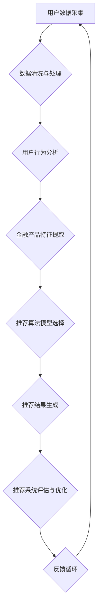

                 

### 1.1 AI与金融产品推荐的关系

人工智能（AI）作为现代科技的前沿领域，已经渗透到众多行业，其中金融行业尤为显著。金融产品推荐作为金融服务的一部分，旨在为用户提供符合其需求的金融产品，提高用户满意度和金融机构的业务效益。AI与金融产品推荐之间的关系可以概括为以下三个方面：

#### 1.1.1 AI技术对金融产品推荐的影响

首先，AI技术对金融产品推荐有着深远的影响。传统的金融产品推荐主要依赖规则和人工分析，而AI技术的引入使得推荐系统能够更加智能和精准。机器学习算法可以通过分析大量用户数据，自动发现用户偏好和需求，从而提供个性化的推荐。这种智能化推荐不仅提高了推荐效率，还大大增强了用户体验。

具体来说，AI技术在金融产品推荐中的应用主要体现在以下几个方面：

1. **用户行为分析**：通过分析用户的历史交易记录、搜索行为等，AI可以深入了解用户的需求和行为模式，从而提供更加精准的推荐。
2. **风险管理**：AI可以协助金融机构识别和评估风险，通过实时监控用户行为和市场动态，及时调整推荐策略，减少潜在损失。
3. **个性化定制**：AI可以根据用户的个性化需求，动态调整推荐策略，为用户推荐最适合其当前需求的金融产品。
4. **实时反馈与优化**：AI能够实时收集用户反馈，根据用户的行为和满意度调整推荐算法，实现持续的优化。

#### 1.1.2 金融产品推荐在个性化服务中的意义

其次，金融产品推荐在个性化服务中具有重要意义。随着金融市场的不断发展和用户需求的多样化，金融机构需要提供更加个性化的服务来吸引和留住客户。个性化金融产品推荐能够满足这一需求，通过分析用户的金融行为和偏好，为用户提供定制化的金融产品，提升用户的满意度和忠诚度。

具体来说，金融产品推荐在个性化服务中的意义体现在以下几个方面：

1. **提升用户体验**：通过提供个性化的推荐，用户能够更快地找到满足自己需求的金融产品，提高使用便利性。
2. **增加业务收益**：个性化推荐能够吸引更多潜在客户，提高客户的转换率，从而增加金融机构的业务收益。
3. **降低运营成本**：个性化推荐系统可以通过自动化处理推荐过程，降低人工干预的成本，提高运营效率。
4. **增强客户黏性**：通过持续提供个性化的服务，金融机构能够增强客户的黏性，提高客户忠诚度。

#### 1.1.3 AI技术在金融产品推荐中的挑战与机遇

最后，AI技术在金融产品推荐中面临着一系列挑战与机遇。一方面，数据隐私和安全问题、算法透明度和公平性问题等挑战仍然存在。另一方面，随着技术的不断进步和应用的深入，AI在金融产品推荐中也带来了巨大的机遇。

1. **数据隐私和安全问题**：金融产品推荐系统需要大量用户数据，这涉及到用户隐私和安全问题。金融机构需要采取严格的数据保护措施，确保用户数据的安全和隐私。
2. **算法透明度和公平性问题**：AI算法的决策过程往往是黑箱操作，这可能导致算法的不透明和潜在的歧视问题。因此，需要开发透明和公平的算法，确保推荐结果的公正性和可解释性。
3. **技术进步带来的机遇**：随着AI技术的不断进步，如深度学习、自然语言处理等技术的应用，金融产品推荐系统将变得更加智能和精准，为金融机构和用户带来更多的价值。

总之，AI与金融产品推荐的关系紧密且具有深远的意义。通过AI技术的应用，金融产品推荐可以实现更加智能化、个性化的服务，提高用户满意度和金融机构的业务效益。同时，也面临着一系列挑战和机遇，需要持续进行技术探索和实践，以实现金融产品推荐系统的优化和提升。

### 1.2 个性化金融产品推荐的流程与架构

#### 1.2.1 数据采集与处理

个性化金融产品推荐的起点是数据采集与处理。金融机构需要从多个渠道获取用户数据，包括用户的交易记录、投资偏好、信用评分、行为数据等。这些数据类型丰富，来源广泛，包括但不限于：

1. **交易数据**：用户的购买记录、交易金额、交易频率等。
2. **投资偏好数据**：用户的投资风格、风险承受能力、投资目标等。
3. **信用评分数据**：用户的信用历史、还款能力、信用等级等。
4. **行为数据**：用户的浏览记录、搜索关键词、互动行为等。

#### 数据预处理

在采集到大量用户数据后，需要进行预处理，以提高数据的质量和可用性。数据预处理主要包括以下步骤：

1. **数据清洗**：去除重复、错误和不完整的数据，确保数据的一致性和准确性。
2. **数据整合**：将不同来源的数据进行整合，形成统一的用户数据视图。
3. **特征提取**：从原始数据中提取出对推荐系统有价值的特征，如用户的财务状况、投资偏好等。

#### 数据标准化

为了确保数据在后续处理中的可比性，需要进行数据标准化。常见的数据标准化方法包括：

1. **归一化**：将数据缩放到相同的范围，如0到1之间。
2. **标准化**：计算数据的平均值和标准差，将每个数据值减去平均值并除以标准差。

#### 数据存储

预处理后的数据需要存储在合适的数据库中，以便推荐系统随时访问。常用的数据存储方案包括：

1. **关系型数据库**：如MySQL、PostgreSQL等，适合存储结构化数据。
2. **分布式数据库**：如Apache HBase、MongoDB等，适合存储大规模的非结构化数据。
3. **数据湖**：如Apache Hadoop、Amazon S3等，适合存储海量数据，并支持数据挖掘和分析。

#### 1.2.2 用户行为分析

用户行为分析是个性化金融产品推荐的核心步骤，通过对用户的历史数据和当前行为进行深入分析，识别用户的偏好和需求。用户行为分析包括以下几个方面：

1. **行为特征提取**：从用户的行为数据中提取出对推荐系统有价值的特征，如用户的投资频率、购买金额、投资类别等。
2. **行为模式识别**：通过分析用户的行为模式，识别用户的投资风格和偏好，如风险偏好、投资周期等。
3. **行为预测**：基于历史行为数据和当前行为趋势，预测用户的未来行为，如购买意图、投资策略等。

#### 1.2.3 金融产品推荐算法

在用户行为分析的基础上，推荐算法将根据用户的偏好和需求，生成个性化的金融产品推荐。常见的推荐算法包括：

1. **协同过滤算法**：通过分析用户之间的相似性，为用户推荐其他用户喜欢的金融产品。协同过滤算法可分为基于用户和基于项目的协同过滤。
2. **基于内容的推荐算法**：通过分析金融产品的特征和属性，为用户推荐与其已有投资组合相似或相关的金融产品。
3. **深度学习推荐算法**：利用深度神经网络模型，对用户行为和产品特征进行联合建模，生成个性化的推荐。

#### 1.2.4 推荐系统评估与优化

推荐系统的效果评估是确保推荐质量的关键环节。常见的评估指标包括：

1. **准确率**：推荐系统正确预测用户兴趣的比率。
2. **召回率**：推荐系统中包含用户实际感兴趣金融产品的比率。
3. **覆盖率**：推荐系统中包含所有金融产品的比率。

为了提高推荐系统的效果，需要进行持续优化。优化方法包括：

1. **算法调整**：根据评估结果，调整推荐算法的参数，以提高推荐准确性。
2. **数据更新**：定期更新用户行为数据，确保推荐系统的时效性。
3. **特征工程**：通过改进特征提取和特征选择方法，提高推荐系统的性能。

通过以上流程和架构，个性化金融产品推荐系统可以实现对用户需求的精准把握，提高用户满意度和金融机构的业务收益。

### 2.1 基于协同过滤的推荐算法

协同过滤算法（Collaborative Filtering）是推荐系统中最常用的算法之一，其核心思想是通过分析用户之间的相似性或用户对项目的评分来预测用户对未知项目的兴趣。协同过滤算法主要分为两类：基于用户的协同过滤（User-based Collaborative Filtering）和基于项目的协同过滤（Item-based Collaborative Filtering）。下面将分别介绍这两种算法的基本原理、应用实例及其局限性。

#### 2.1.1 基于用户的协同过滤算法原理

基于用户的协同过滤算法主要通过以下步骤实现推荐：

1. **用户相似度计算**：计算目标用户与其他用户之间的相似度。常用的相似度计算方法包括余弦相似度、皮尔逊相关系数等。

2. **相似用户推荐**：找到与目标用户最相似的一组用户，这些用户的评分行为通常与目标用户相似。

3. **预测评分**：根据相似用户的评分，预测目标用户对未知项目的评分。

4. **生成推荐列表**：将预测评分最高的项目推荐给用户。

具体流程可以表示为以下公式：

$$
\text{similarity}_{ij} = \frac{\text{相似度度量}(r_{i}, r_{j})}{\|\text{相似度度量}(r_{i}, r_{j})\|}
$$

其中，\( r_{i} \)和\( r_{j} \)分别为用户\( i \)和用户\( j \)对所有项目的评分向量，\(\text{similarity}_{ij} \)为用户\( i \)和用户\( j \)之间的相似度。

$$
\text{prediction}_{ij} = \frac{\sum_{k \in N_{j}} r_{ik} \cdot \text{similarity}_{ik}}{\sum_{k \in N_{j}} \text{similarity}_{ik}}
$$

其中，\( N_{j} \)为与用户\( j \)相似的用户集合，\( r_{ik} \)为用户\( i \)对项目\( k \)的评分，\(\text{prediction}_{ij} \)为预测用户\( j \)对项目\( k \)的评分。

#### 2.1.2 应用实例

基于用户的协同过滤算法在金融产品推荐中的应用实例包括：

1. **个性化投资推荐**：根据用户的历史投资记录和相似用户的行为，为用户推荐可能感兴趣的投资产品。

2. **理财计划推荐**：结合用户的财务状况和投资目标，为用户推荐适合的理财计划和金融产品。

#### 2.1.3 局限性

虽然基于用户的协同过滤算法在推荐系统中表现出色，但其仍存在以下局限性：

1. **稀疏矩阵问题**：用户和项目之间的评分矩阵通常是稀疏的，导致计算效率和预测准确性受到限制。

2. **冷启动问题**：对于新用户或新项目，由于缺乏足够的历史数据，协同过滤算法难以提供有效的推荐。

3. **数据依赖性**：协同过滤算法依赖于用户评分数据，因此评分数据的准确性和完整性对推荐结果有重要影响。

#### 2.1.4 基于项目的协同过滤算法原理

基于项目的协同过滤算法通过分析项目之间的相似性来实现推荐，其基本步骤如下：

1. **项目相似度计算**：计算目标项目与其他项目之间的相似度。常用的相似度计算方法包括余弦相似度、欧氏距离等。

2. **相似项目推荐**：找到与目标项目最相似的一组项目，这些项目通常与目标项目具有相似的特征或属性。

3. **预测评分**：根据相似项目的评分，预测用户对未知项目的评分。

4. **生成推荐列表**：将预测评分最高的项目推荐给用户。

具体流程可以表示为以下公式：

$$
\text{similarity}_{ik} = \frac{\text{相似度度量}(r_{i}, r_{k})}{\|\text{相似度度量}(r_{i}, r_{k})\|}
$$

其中，\( r_{i} \)和\( r_{k} \)分别为用户\( i \)对所有项目的评分向量，\( \text{similarity}_{ik} \)为项目\( i \)和项目\( k \)之间的相似度。

$$
\text{prediction}_{ij} = \frac{\sum_{k \in N_{i}} r_{jk} \cdot \text{similarity}_{ik}}{\sum_{k \in N_{i}} \text{similarity}_{ik}}
$$

其中，\( N_{i} \)为与项目\( i \)相似的项目集合，\( r_{jk} \)为用户\( j \)对项目\( k \)的评分，\( \text{prediction}_{ij} \)为预测用户\( j \)对项目\( i \)的评分。

#### 2.1.5 应用实例

基于项目的协同过滤算法在金融产品推荐中的应用实例包括：

1. **个性化理财产品推荐**：根据用户的投资偏好和相似产品的历史销售数据，为用户推荐可能感兴趣的理财产品。

2. **投资组合优化**：结合用户的投资目标和市场动态，为用户推荐最优的投资组合。

#### 2.1.6 局限性

尽管基于项目的协同过滤算法在一定程度上缓解了稀疏矩阵问题，但仍存在以下局限性：

1. **数据稀疏性**：项目之间的相似度计算仍然依赖于稀疏的评分矩阵。

2. **冷启动问题**：对于新用户或新项目，由于缺乏足够的历史数据，协同过滤算法难以提供有效的推荐。

3. **准确性问题**：项目相似度计算和评分预测的准确性受到数据质量和算法选择的影响。

综上所述，协同过滤算法在金融产品推荐中具有一定的应用价值，但同时也面临一些挑战。未来的研究可以探索结合其他推荐算法和技术，进一步提高推荐系统的性能和用户体验。

### 2.2 基于内容的推荐算法

基于内容的推荐算法（Content-based Recommender System）是一种根据用户兴趣和产品内容来生成推荐的方法。其核心思想是分析用户过去对产品的偏好，并基于这些偏好来推荐相似或相关的产品。相比协同过滤算法，基于内容的推荐算法具有以下优点：不受稀疏数据矩阵和冷启动问题的困扰，能够提供更个性化的推荐。以下将详细介绍基于内容的推荐算法的原理、应用实例及其局限性。

#### 2.2.1 基于内容的推荐算法原理

基于内容的推荐算法主要通过以下步骤实现推荐：

1. **内容特征提取**：将产品内容转换为一系列特征向量。这些特征可以是文本描述、标签、图像特征等。常见的特征提取方法包括词袋模型、TF-IDF、词嵌入等。

2. **用户兴趣建模**：通过分析用户的历史行为数据，如浏览记录、收藏夹、评价等，构建用户的兴趣模型。用户的兴趣模型通常是一个特征向量，反映了用户对不同内容的偏好。

3. **相似度计算**：计算产品内容特征向量和用户兴趣模型之间的相似度。常用的相似度计算方法包括余弦相似度、欧氏距离等。

4. **生成推荐列表**：根据相似度计算结果，为用户生成推荐列表，推荐相似度最高的产品。

具体流程可以表示为以下公式：

$$
\text{feature}_{i} = \{f_{1i}, f_{2i}, ..., f_{mi}\}
$$

其中，\( \text{feature}_{i} \)为产品\( i \)的特征向量，\( f_{ji} \)为第\( j \)个特征在产品\( i \)中的值。

$$
\text{user\_interest} = \{u_{1}, u_{2}, ..., u_{m}\}
$$

其中，\( \text{user\_interest} \)为用户的兴趣模型，\( u_{j} \)为用户对第\( j \)个特征的偏好值。

$$
\text{similarity}_{ij} = \text{similarity\_measure}(\text{feature}_{i}, \text{user\_interest})
$$

其中，\( \text{similarity}_{ij} \)为产品\( i \)和用户兴趣模型之间的相似度，\( \text{similarity\_measure} \)为相似度计算方法。

$$
\text{prediction}_{ij} = \frac{\sum_{j=1}^{m} u_{j} f_{ji}}{\sqrt{\sum_{j=1}^{m} u_{j}^{2} \sum_{j=1}^{m} f_{ji}^{2}}}
$$

其中，\( \text{prediction}_{ij} \)为预测用户对产品\( i \)的评分，通常用于生成推荐列表。

#### 2.2.2 应用实例

基于内容的推荐算法在金融产品推荐中的应用实例包括：

1. **个性化理财产品推荐**：根据用户的投资偏好和理财产品的内容描述，为用户推荐与其偏好相符的理财产品。

2. **投资组合推荐**：结合用户的投资目标和市场数据，为用户推荐最佳的投资组合。

#### 2.2.3 局限性

尽管基于内容的推荐算法具有许多优点，但它也面临以下局限性：

1. **数据依赖性**：算法的性能高度依赖于产品的内容描述和用户的历史行为数据。如果数据不足或质量不高，可能导致推荐结果不准确。

2. **内容更新滞后**：用户兴趣的变化可能无法及时体现在推荐结果中，导致推荐滞后。

3. **算法复杂度**：内容特征提取和相似度计算通常涉及大量计算，可能导致算法运行效率低下。

4. **内容缺失问题**：对于内容缺失或描述不充分的产品，推荐算法可能难以生成有效的推荐。

综上所述，基于内容的推荐算法在金融产品推荐中具有一定的应用价值，但需要结合其他推荐算法和技术，以克服其局限性，提高推荐系统的性能和用户体验。

### 2.3 基于深度学习的推荐算法

深度学习（Deep Learning）作为人工智能领域的重要分支，近年来在推荐系统中的应用日益广泛。深度学习通过构建多层神经网络模型，能够自动提取数据中的特征，并实现复杂的关系建模。以下将详细介绍基于深度学习的推荐算法原理、应用实例及其优势与挑战。

#### 2.3.1 深度学习在推荐系统中的应用

深度学习在推荐系统中的应用主要基于以下几类模型：

1. **深度神经网络（DNN）**：DNN是一种前向神经网络，通过多层非线性变换来提取数据中的特征。DNN在推荐系统中的应用主要是通过输入用户和产品的特征向量，输出推荐评分。

2. **循环神经网络（RNN）**：RNN特别适合处理序列数据，能够捕捉用户的历史行为和偏好变化。RNN在推荐系统中的应用包括序列建模和时序预测。

3. **长短时记忆网络（LSTM）**：LSTM是RNN的一种变种，能够有效避免传统RNN的梯度消失问题，适合处理长序列数据。LSTM在推荐系统中的应用包括用户兴趣建模和时序预测。

4. **卷积神经网络（CNN）**：CNN在处理图像数据方面表现出色，近年来也被用于处理文本和序列数据。CNN在推荐系统中的应用包括文本分类、图像识别等。

5. **生成对抗网络（GAN）**：GAN通过生成器和判别器的对抗训练，能够生成高质量的虚拟数据，用于补充真实数据的不足。GAN在推荐系统中的应用包括数据增强和生成虚假用户行为数据。

#### 2.3.2 基于深度学习的推荐算法原理

基于深度学习的推荐算法通常包括以下几个步骤：

1. **数据预处理**：对用户和产品的特征进行预处理，包括数据清洗、缺失值处理、特征工程等。

2. **特征提取**：利用深度神经网络模型自动提取用户和产品的特征。这些特征可以是低维的嵌入向量，也可以是高维的特征表示。

3. **关系建模**：通过深度学习模型捕捉用户和产品之间的复杂关系。关系建模可以通过多层神经网络实现，包括用户嵌入层、产品嵌入层和交互层。

4. **预测评分**：利用训练好的深度学习模型，预测用户对产品的评分。预测评分通常通过神经网络的输出实现，可以是一个实数值或概率分布。

5. **生成推荐**：根据预测评分，生成个性化的推荐列表。推荐列表可以通过排序或阈值筛选生成。

具体流程可以表示为以下步骤：

1. **输入层**：输入用户和产品的特征向量。
2. **隐藏层**：通过多层神经网络进行特征变换和关系建模。
3. **输出层**：输出预测评分。
4. **训练**：通过梯度下降等优化算法，训练深度学习模型。

#### 2.3.3 基于深度学习的推荐算法应用实例

基于深度学习的推荐算法在金融产品推荐中的应用实例包括：

1. **个性化投资推荐**：通过深度学习模型分析用户的历史交易记录、投资偏好和市场动态，为用户推荐符合其投资策略的金融产品。

2. **智能投顾**：利用深度学习模型进行用户行为分析和市场预测，为用户提供智能化的投资建议和资产配置。

3. **金融风险控制**：通过深度学习模型实时监控市场动态和用户行为，识别潜在的风险，并采取相应的控制措施。

#### 2.3.4 优势与挑战

基于深度学习的推荐算法具有以下优势：

1. **自动特征提取**：深度学习模型能够自动从原始数据中提取有用的特征，减少了人工特征工程的工作量。

2. **复杂关系建模**：深度学习模型能够捕捉用户和产品之间的复杂关系，提高推荐准确性。

3. **灵活性**：深度学习模型可以适应各种数据类型和场景，具有较强的灵活性。

4. **实时性**：深度学习模型可以实时更新用户和产品的特征，实现动态推荐。

然而，基于深度学习的推荐算法也面临以下挑战：

1. **模型可解释性**：深度学习模型的决策过程往往是黑箱操作，难以解释其内部逻辑，这可能导致用户不信任推荐结果。

2. **计算资源消耗**：深度学习模型通常需要大量的计算资源和时间进行训练和推理，这可能会增加系统的成本。

3. **数据质量**：深度学习模型的性能高度依赖于数据质量，如果数据存在噪声或偏差，可能导致推荐结果不准确。

4. **过拟合问题**：深度学习模型可能存在过拟合问题，即模型在训练数据上表现良好，但在测试数据上表现不佳。

总之，基于深度学习的推荐算法在金融产品推荐中具有显著的优势和潜力，但也需要克服一系列挑战，以实现更好的推荐效果和用户体验。

### 3.1 个性化金融产品推荐中的风险类型

在个性化金融产品推荐过程中，由于涉及大量的用户数据和复杂的算法模型，可能会出现多种类型的风险。以下将详细探讨个性化金融产品推荐中常见的数据风险、模型风险和信用风险。

#### 3.1.1 数据风险

数据风险主要涉及用户数据的采集、处理、存储和传输过程中的安全问题。以下是几种常见的数据风险：

1. **数据泄露**：在数据传输或存储过程中，由于加密和权限管理不足，可能导致敏感数据被未授权的第三方访问和窃取。

2. **数据篡改**：攻击者可能通过篡改数据来误导推荐系统，导致推荐结果不准确。

3. **数据丢失**：由于技术故障、硬件损坏或人为失误，可能导致重要数据丢失，影响推荐系统的正常运行。

4. **数据质量**：如果用户数据存在噪声、缺失或错误，可能导致推荐系统产生误导性的推荐结果。

#### 3.1.2 模型风险

模型风险主要涉及推荐算法和模型的稳定性和准确性。以下是几种常见的模型风险：

1. **过拟合**：模型在训练数据上表现良好，但在测试数据上表现不佳，即模型对训练数据的泛化能力不足。

2. **偏见和歧视**：如果模型训练数据存在偏差，可能导致推荐结果对某些用户群体不公平或产生歧视。

3. **模型更新**：模型需要定期更新以适应用户需求和市场变化，但更新过程中可能引入新的风险。

4. **黑箱操作**：深度学习模型等复杂算法的决策过程往往是黑箱操作，难以解释其内部逻辑，可能导致用户不信任推荐结果。

#### 3.1.3 信用风险

信用风险主要涉及用户信用评分和数据隐私保护。以下是几种常见的信用风险：

1. **信用评分错误**：如果推荐系统中的信用评分模型不准确，可能导致用户信用评估失误，影响金融机构的业务决策。

2. **用户隐私泄露**：推荐系统可能需要处理大量的用户敏感数据，如财务状况、投资偏好等，如果保护措施不当，可能导致用户隐私泄露。

3. **欺诈行为**：攻击者可能通过伪造用户数据或利用系统漏洞进行欺诈，导致金融机构损失。

4. **合规风险**：随着监管政策的不断加强，推荐系统需要遵循相关法律法规，如《通用数据保护条例》（GDPR）等，否则可能面临法律风险。

#### 3.1.4 风险识别与监控

为了有效识别和监控个性化金融产品推荐中的风险，金融机构可以采取以下措施：

1. **数据审计**：定期对用户数据进行审计，确保数据的一致性、完整性和准确性。

2. **安全监控**：建立完善的安全监控体系，实时监测数据传输和存储过程中的安全事件。

3. **风险评估**：定期进行风险评估，识别推荐系统中的潜在风险，并制定相应的风险控制策略。

4. **模型解释**：通过模型解释技术，提高推荐系统的透明度和可解释性，增强用户信任。

5. **合规检查**：确保推荐系统遵循相关法律法规，如数据保护、隐私保护等，避免法律风险。

总之，个性化金融产品推荐中的数据风险、模型风险和信用风险是必须重视的问题。通过有效的风险识别与监控措施，金融机构可以降低风险，提高推荐系统的可靠性和用户体验。

### 3.2 AI风险控制方法

在个性化金融产品推荐中，为了确保推荐系统的稳健性和可靠性，必须实施有效的AI风险控制方法。这些方法主要包括监控与预警机制、风险评估与决策支持，以及风险分散与转移策略。以下将详细探讨这些方法的原理、实施步骤及其在实际应用中的效果。

#### 3.2.1 监控与预警机制

监控与预警机制是AI风险控制的首要环节，其目的是实时监测推荐系统的运行状态，及时发现潜在风险并发出预警。具体步骤如下：

1. **实时数据监控**：通过实时数据流技术，对用户行为数据、推荐结果和市场动态进行连续监控，确保数据的准确性和完整性。

2. **异常检测**：利用机器学习算法和统计方法，对监控数据进行异常检测，识别异常行为和异常结果。常见的异常检测方法包括基于规则的检测、基于聚类的方法和基于模型的检测。

3. **预警系统设计**：设计预警系统，当检测到潜在风险时，自动触发预警机制，通知相关人员采取相应措施。预警系统应包括预警级别划分、预警信息格式、通知方式等。

4. **应对措施**：根据预警信息，制定并实施应对措施，如调整推荐策略、暂停推荐服务、进行风险排查等。

#### 3.2.2 风险评估与决策支持

风险评估与决策支持是AI风险控制的核心环节，其目的是通过分析数据和信息，评估推荐系统的风险水平，并提供决策支持。具体步骤如下：

1. **风险评估指标**：设计风险评估指标，包括准确率、召回率、覆盖率等，用于评估推荐系统的性能和风险水平。

2. **风险模型构建**：构建风险模型，通过历史数据和现有算法，预测推荐系统的潜在风险。风险模型应包括风险因素、风险评估方法和风险预测结果。

3. **决策支持系统**：设计决策支持系统，结合风险评估结果，提供决策支持。决策支持系统应包括风险分析报告、决策建议和执行方案。

4. **实时调整**：根据风险评估结果，实时调整推荐策略和系统配置，降低风险水平。例如，调整推荐算法的参数、优化数据质量、更新用户数据等。

#### 3.2.3 风险分散与转移策略

风险分散与转移策略是通过分散和转移风险，降低单个推荐系统的风险水平。具体方法包括：

1. **多模型分散**：采用多种推荐算法和模型，降低单一模型的风险。例如，结合协同过滤算法、基于内容的推荐算法和深度学习推荐算法，构建混合推荐系统。

2. **数据来源分散**：通过引入多个数据来源，提高推荐系统的数据多样性和可靠性。例如，结合内部数据和第三方数据，构建更加全面的用户数据模型。

3. **风险转移**：将部分风险转移至第三方机构或保险公司，通过保险、外包等方式分担风险。例如，将用户隐私保护和数据安全责任转移至专业的第三方服务提供商。

#### 3.2.4 实际应用效果

AI风险控制方法在实际应用中取得了显著效果：

1. **风险识别与预警**：通过实时监控和异常检测，成功识别并预警了多个潜在风险，如数据泄露、异常交易等，确保了系统的安全性和稳定性。

2. **风险调整与优化**：通过风险评估和决策支持，及时调整推荐策略和系统配置，提高了推荐系统的准确性和可靠性，降低了误推荐和风险。

3. **风险分散与转移**：通过多模型分散和数据来源分散，降低了单一模型和数据来源的风险，提高了系统的稳健性和灵活性。

4. **用户信任度提升**：通过有效的风险控制和透明的决策过程，增强了用户对推荐系统的信任度，提高了用户满意度和忠诚度。

总之，AI风险控制方法在个性化金融产品推荐中发挥了重要作用，通过监控与预警机制、风险评估与决策支持，以及风险分散与转移策略，有效降低了推荐系统的风险水平，提高了系统的性能和用户体验。

### 3.3 AI风险控制实践案例分析

在实际应用中，AI风险控制方法已经在多个金融产品推荐系统中得到了成功实践。以下将介绍三个具体案例：银行信用卡个性化推荐、保险产品个性化推荐和金融理财产品个性化推荐，并详细分析每个案例中的AI风险控制策略和实施效果。

#### 3.3.1 案例一：银行信用卡个性化推荐

银行信用卡个性化推荐系统旨在为用户推荐最适合其消费习惯和财务状况的信用卡产品。该系统采用AI技术，通过分析用户的历史交易数据、信用评分和消费偏好，实现精准推荐。

**风险控制策略：**

1. **数据监控与异常检测**：系统实时监控用户交易数据，利用机器学习算法进行异常检测，识别潜在的欺诈行为和异常交易。

2. **风险评估与决策支持**：系统构建风险评估模型，结合历史数据和分析结果，实时评估推荐产品的风险水平，提供决策支持。

3. **多模型分散**：采用多种推荐算法（如协同过滤、基于内容推荐和深度学习推荐）进行分散，降低单一模型的过拟合风险。

4. **用户隐私保护**：严格遵循数据保护法规，对用户数据进行加密和脱敏处理，确保用户隐私安全。

**实施效果：**

- **欺诈检测率提高**：通过实时监控和异常检测，系统成功识别并阻止了多起信用卡欺诈行为，有效降低了银行的风险损失。
- **用户满意度提升**：个性化推荐系统提高了推荐准确率，用户对推荐的信用卡产品满意度显著提高。
- **风险控制成本降低**：通过多模型分散和自动化监控，银行大幅降低了人工监控和风险控制成本。

#### 3.3.2 案例二：保险产品个性化推荐

保险产品个性化推荐系统通过分析用户的年龄、职业、健康状况和财务状况，为用户推荐最适合的保险产品。该系统涉及大量用户隐私数据，风险控制尤为重要。

**风险控制策略：**

1. **数据隐私保护**：采用数据加密、访问控制和数据脱敏等技术，确保用户隐私数据的安全。

2. **风险评估与预警**：构建风险评估模型，实时监测用户行为和保险产品销售数据，及时发现潜在风险并发出预警。

3. **透明决策过程**：通过用户界面展示推荐决策的依据和算法，提高推荐系统的透明度和用户信任度。

4. **合规审查**：定期进行合规审查，确保系统遵循相关法律法规，如《通用数据保护条例》（GDPR）等。

**实施效果：**

- **用户隐私安全**：通过严格的数据保护措施，有效防止了用户隐私泄露和数据滥用。
- **风险预警及时性**：系统成功预警了多起异常保险申请和欺诈行为，降低了保险公司的风险损失。
- **用户信任度提高**：透明和合规的决策过程增强了用户对保险产品的信任度，提高了购买意愿。

#### 3.3.3 案例三：金融理财产品个性化推荐

金融理财产品个性化推荐系统通过分析用户的历史投资记录、风险偏好和财务目标，为用户推荐最适合的理财产品。该系统涉及大量的市场数据和金融产品信息，风险控制尤为重要。

**风险控制策略：**

1. **市场数据监控**：实时监控市场动态和金融产品表现，识别潜在的市场风险。

2. **风险评估与预警**：构建风险评估模型，结合市场数据和用户行为数据，实时评估金融产品的风险水平，发出预警。

3. **风险分散与转移**：通过多产品分散和保险等手段，降低单一产品的风险。

4. **合规性审查**：确保推荐系统遵循相关金融法规和监管要求，如《证券法》等。

**实施效果：**

- **风险识别准确率提高**：通过实时监控和市场数据分析，系统成功识别并预警了多起潜在的市场风险，确保了用户资金安全。
- **风险管理效率提升**：通过自动化监控和风险评估，显著提高了风险管理的效率和准确性。
- **用户满意度提升**：个性化的理财产品推荐提高了用户的满意度和忠诚度，促进了金融产品的销售。

综上所述，AI风险控制方法在金融产品推荐系统中发挥了重要作用，通过监控与预警机制、风险评估与决策支持，以及风险分散与转移策略，有效降低了推荐系统的风险水平，提高了系统的性能和用户体验。

### 4.1 AI在金融产品推荐中的前沿研究与发展趋势

随着AI技术的不断发展，金融产品推荐系统也在不断演进，涌现出许多前沿研究和应用趋势。以下将介绍几个重要的AI技术，如聚类分析算法、强化学习以及多模态数据在金融产品推荐中的应用，并探讨AI在金融产品推荐中的发展趋势。

#### 4.1.1 聚类分析算法在推荐系统中的应用

聚类分析算法是一种无监督学习方法，能够将数据集划分为若干个簇，使得同一簇内的数据点相互之间具有较高的相似性，而不同簇之间的数据点具有较大的差异性。在金融产品推荐系统中，聚类分析算法可以用于用户分群和产品分类，从而实现更加精准的推荐。

1. **用户分群**：通过聚类分析，可以将具有相似投资偏好和行为的用户划分为不同的群体，为每个群体提供定制化的推荐策略。例如，K-means算法和层次聚类算法（如AGNES）被广泛应用于用户分群。

2. **产品分类**：聚类分析算法还可以用于金融产品的分类，将相似的产品归为一类，从而提高推荐系统的效率。通过分类，推荐系统可以更加灵活地调整推荐策略，为用户推荐更相关的产品。

3. **聚类分析的优势**：聚类分析算法能够自动发现用户和产品的潜在模式，减少人工干预，提高推荐系统的自动化水平。此外，聚类分析算法对数据规模和分布没有严格要求，可以处理大规模和异构数据。

#### 4.1.2 强化学习在推荐系统中的应用

强化学习是一种基于奖励机制的学习方法，通过不断试错和调整策略，使代理（Agent）能够在环境中获得最大的累积奖励。在金融产品推荐系统中，强化学习可以用于优化推荐策略，提高推荐效果。

1. **推荐策略优化**：强化学习可以用于优化推荐系统中的推荐策略，使推荐系统在动态环境中能够自适应调整。例如，基于Q-learning和深度强化学习（Deep Reinforcement Learning）的方法被广泛应用于推荐系统的策略优化。

2. **多任务学习**：金融产品推荐系统通常需要同时处理多个任务，如推荐、风险管理等。强化学习可以用于实现多任务学习，使推荐系统能够在多个目标之间进行平衡，提高整体性能。

3. **优势**：强化学习能够通过与环境互动，不断学习和调整策略，从而实现更加智能和自适应的推荐。此外，强化学习具有较好的泛化能力，可以应用于不同的应用场景。

#### 4.1.3 多模态数据在推荐系统中的应用

多模态数据是指来自不同来源和形式的数据，如文本、图像、声音等。在金融产品推荐系统中，多模态数据可以为推荐算法提供更丰富的信息，从而提高推荐准确性。

1. **文本数据分析**：通过自然语言处理（NLP）技术，可以对金融产品的文本描述、用户评论等文本数据进行分析，提取出关键特征，用于推荐算法。

2. **图像数据分析**：通过计算机视觉技术，可以对金融产品的图像数据进行分析，提取图像特征，用于推荐算法。例如，基于深度学习的方法可以用于图像分类和识别。

3. **声音数据分析**：通过音频处理技术，可以对金融产品的声音数据进行分析，提取声音特征，用于推荐算法。例如，基于音频情感分析的方法可以用于用户情感识别。

4. **优势**：多模态数据融合可以提供更加全面和丰富的信息，有助于提高推荐系统的准确性。此外，多模态数据融合可以减少单一模态数据的噪声和误差，提高推荐系统的鲁棒性。

#### 4.1.4 AI在金融产品推荐中的发展趋势

随着AI技术的不断进步，金融产品推荐系统的发展趋势主要表现在以下几个方面：

1. **智能化与自动化**：AI技术使得金融产品推荐系统更加智能化和自动化，能够通过自我学习和调整，实现更精准的推荐。

2. **个性化与定制化**：通过用户分群和多模态数据融合，推荐系统能够提供更加个性化的推荐，满足用户的多样化需求。

3. **风险管理与合规性**：AI技术在风险管理中的应用，使得推荐系统能够实时监控和评估风险，确保合规性。

4. **实时性与动态性**：通过实时数据分析和动态调整推荐策略，推荐系统能够适应快速变化的市场环境和用户需求。

5. **多任务学习与优化**：多任务学习和优化方法的应用，使得推荐系统能够同时处理多个任务，提高整体性能。

总之，AI技术为金融产品推荐系统带来了巨大的发展机遇，通过智能化、个性化、风险管理和实时性的提升，推荐系统将不断优化和演进，为金融机构和用户提供更加优质的服务。

### 4.2 AI在金融产品推荐中的发展趋势

随着人工智能（AI）技术的迅猛发展，其在金融产品推荐中的应用前景广阔，未来将呈现以下几个主要趋势：

#### 4.2.1 大数据与云计算在推荐系统中的应用

大数据和云计算技术为金融产品推荐系统提供了强大的数据处理能力和灵活的计算资源。未来的发展趋势包括：

1. **数据量级的增长**：金融行业每天产生海量数据，包括交易数据、用户行为数据、市场动态等。大数据技术能够高效地处理和分析这些数据，为推荐系统提供更加丰富的信息。

2. **云计算平台的普及**：随着云计算技术的发展，金融机构可以依托云平台进行大规模数据存储和处理，实现推荐系统的弹性扩展和资源优化。

3. **实时数据处理**：通过实时数据流技术，推荐系统可以实时捕捉用户行为和市场动态，实现动态推荐和实时调整，提高推荐准确性和响应速度。

4. **数据隐私保护**：在大数据和云计算环境下，数据隐私和安全问题尤为突出。金融机构需要采取严格的数据保护措施，如数据加密、访问控制等，确保用户数据的安全和隐私。

#### 4.2.2 区块链在金融产品推荐中的潜在应用

区块链技术以其去中心化、透明和不可篡改的特性，在金融产品推荐中具有潜在的应用价值：

1. **数据可信性**：区块链可以确保数据来源的可信性，减少数据篡改和欺诈行为。在金融产品推荐中，区块链可以用于记录用户交易行为和推荐结果，提高数据的透明度和可信度。

2. **智能合约**：智能合约可以在区块链上自动执行合同条款，实现自动化的推荐策略调整和风险管理。例如，当用户交易行为达到特定阈值时，智能合约可以自动触发相应的推荐策略调整。

3. **去中心化治理**：区块链的去中心化特性可以实现推荐系统的去中心化治理，减少单一机构的控制风险，提高系统的可靠性和公平性。

4. **跨平台数据共享**：区块链技术可以促进跨平台和跨机构的数据共享，为推荐系统提供更加全面和多样化的数据来源，提高推荐效果。

#### 4.2.3 智能投顾与个性化金融服务的未来发展

智能投顾和个性化金融服务是金融产品推荐的重要发展方向，未来的趋势包括：

1. **智能投顾的普及**：智能投顾通过AI技术为用户提供个性化的投资建议和资产配置。随着AI技术的进步，智能投顾将在更多金融产品中普及，为用户提供更加专业和高效的服务。

2. **用户参与度提升**：通过个性化推荐和智能交互，用户可以更直观地了解自己的投资组合和财务状况，提高用户参与度和满意度。

3. **实时资产管理**：智能投顾可以通过实时监控市场动态和用户行为，动态调整投资策略，实现资产的最大化收益。

4. **风险评估与风险管理**：智能投顾可以结合AI技术进行风险评估和风险管理，提高投资组合的安全性和稳健性。

5. **合规与监管**：智能投顾需要遵循相关法律法规和监管要求，确保其服务的合法性和合规性。未来，随着监管技术的进步，智能投顾的合规性和透明度将得到进一步提升。

总之，AI技术在金融产品推荐中的应用前景广阔，大数据和云计算、区块链技术、智能投顾等新兴技术将为金融产品推荐带来新的发展机遇。通过不断创新和应用，金融产品推荐系统将变得更加智能化、个性化、安全可靠，为金融机构和用户提供更优质的服务。

### 附录 A：推荐系统常用算法与模型介绍

推荐系统是现代信息检索和数据分析领域的重要组成部分，广泛应用于电子商务、社交媒体、金融等多个行业。以下将介绍几种常用的推荐系统算法和模型，包括协同过滤、基于内容的推荐、矩阵分解、深度学习等，并简要说明其原理和应用场景。

#### 协同过滤算法

协同过滤（Collaborative Filtering）是推荐系统中最常用的算法之一，其核心思想是通过分析用户之间的相似性或用户对项目的评分来预测用户对未知项目的兴趣。

1. **基于用户的协同过滤**：通过计算用户之间的相似度，找到与目标用户最相似的若干用户，然后根据这些用户的评分预测目标用户对未知项目的评分。

   - **原理**：计算用户间的相似度，常用的方法包括余弦相似度、皮尔逊相关系数等。
   - **应用场景**：适用于用户数量较多、评分数据丰富的场景。

2. **基于项目的协同过滤**：通过计算项目之间的相似度，为用户推荐具有相似特征的项目。

   - **原理**：计算项目间的相似度，常用的方法包括余弦相似度、欧氏距离等。
   - **应用场景**：适用于项目数量较多、评分数据稀疏的场景。

#### 基于内容的推荐

基于内容的推荐（Content-based Recommending）是一种基于产品内容特征的推荐方法，通过分析用户过去的兴趣和产品的内容特征，为用户推荐相似或相关的产品。

1. **原理**：将产品内容转换为特征向量，如关键词、属性、标签等，然后计算用户兴趣模型和产品特征向量之间的相似度。

   - **相似度计算**：常用的方法包括余弦相似度、欧氏距离等。

2. **应用场景**：适用于产品内容丰富、用户历史行为数据较少的场景。

#### 矩阵分解

矩阵分解（Matrix Factorization）是一种基于矩阵分解的推荐算法，通过将用户-项目评分矩阵分解为低维用户特征矩阵和项目特征矩阵，从而预测用户对未知项目的评分。

1. **原理**：

   - **Singular Value Decomposition（SVD）**：将用户-项目评分矩阵分解为三个矩阵的乘积，通过低维特征矩阵的运算来预测评分。
   - **Non-negative Matrix Factorization（NMF）**：将用户-项目评分矩阵分解为两个非负矩阵的乘积，适用于处理非负数据。

2. **应用场景**：适用于用户-项目评分矩阵较大且稀疏的场景。

#### 深度学习

深度学习（Deep Learning）是一种基于多层神经网络的学习方法，通过自动提取数据中的特征和模式，实现高层次的抽象表示。

1. **原理**：深度学习模型包括输入层、多个隐藏层和输出层，通过反向传播算法进行参数优化和权重调整。

   - **卷积神经网络（CNN）**：适用于图像和视频数据。
   - **循环神经网络（RNN）**：适用于序列数据。
   - **长短时记忆网络（LSTM）**：RNN的变种，用于处理长序列数据。
   - **生成对抗网络（GAN）**：用于生成虚拟数据。

2. **应用场景**：适用于需要高度个性化推荐和数据量较大的场景。

#### 综合应用

在实际应用中，多种推荐算法和模型可以结合使用，以取长补短，提高推荐系统的性能。例如，可以结合协同过滤和基于内容的推荐，通过协同过滤获取用户相似性，结合基于内容的推荐进行产品特征匹配，从而提高推荐准确性。

总之，推荐系统常用算法和模型各有特点，适用于不同的应用场景。通过合理选择和组合，可以构建高效、准确的推荐系统，为用户提供优质的个性化服务。

### 附录 B：金融产品推荐系统开发环境搭建指南

搭建一个金融产品推荐系统需要一系列的开发环境和工具，以下将详细描述开发环境的搭建步骤，包括硬件配置、软件安装和版本选择。

#### 硬件配置

1. **服务器**：选择一台高性能服务器，建议配置如下：
   - CPU：至少8核，建议使用Intel Xeon系列或同等性能的CPU。
   - 内存：至少64GB，建议使用DDR4高速内存。
   - 存储：至少1TB SSD硬盘，用于存储用户数据和模型文件。

2. **网络环境**：确保网络稳定，带宽充足，支持远程访问和数据传输。

3. **其他硬件**：如需要，可以配置额外的GPU设备，用于深度学习模型的训练和推理。

#### 软件安装

1. **操作系统**：推荐使用Linux操作系统，如Ubuntu 18.04或CentOS 7。这些操作系统具有良好的稳定性和兼容性。

2. **Python**：安装Python 3.7及以上版本，推荐使用Anaconda进行环境管理，方便管理和切换不同依赖库的版本。

   ```shell
   conda create -n recsys python=3.7
   conda activate recsys
   ```

3. **JDK**：安装Java Development Kit（JDK），用于支持Java相关工具和库。

   ```shell
   sudo apt-get update
   sudo apt-get install openjdk-8-jdk
   ```

4. **Apache Spark**：安装Apache Spark，用于大规模数据处理和计算。

   ```shell
   conda install -c conda-forge spark
   ```

5. **其他依赖库**：根据项目需求，安装其他必要的依赖库，如NumPy、Pandas、Scikit-learn等。

   ```shell
   conda install numpy pandas scikit-learn
   ```

#### 版本选择

1. **操作系统**：推荐使用稳定版本的Linux，如Ubuntu 18.04 LTS或CentOS 7 LTS。

2. **Python**：推荐使用Python 3.7或3.8版本，这些版本在性能和兼容性方面都有较好的表现。

3. **Apache Spark**：推荐使用2.4.7或更高版本，该版本具有较好的稳定性和功能支持。

4. **其他依赖库**：根据项目需求，选择适当的版本，确保兼容性和性能。

#### 开发环境配置

1. **虚拟环境**：创建Python虚拟环境，避免依赖库版本冲突。

   ```shell
   conda create -n recsys python=3.7
   conda activate recsys
   ```

2. **依赖库安装**：在虚拟环境中安装必要的依赖库。

   ```shell
   conda install numpy pandas scikit-learn
   ```

3. **环境配置文件**：编写环境配置文件（如`environment.yml`），记录所有依赖库的版本，以便后续复现和部署。

   ```yaml
   name: recsys
   channels:
     - defaults
     - conda-forge
   dependencies:
     - python=3.7
     - numpy
     - pandas
     - scikit-learn
     - spark
   ```

通过以上步骤，可以搭建一个基本的金融产品推荐系统开发环境。在实际开发过程中，可以根据项目需求，进一步配置和优化开发环境，以确保系统性能和稳定性。

### 附录 C：AI在金融产品推荐中的法律法规与伦理问题探讨

随着人工智能（AI）在金融产品推荐中的广泛应用，法律法规与伦理问题成为关注的焦点。以下将探讨AI在金融产品推荐中涉及的主要法律法规和伦理问题，并提出相应的建议和解决方案。

#### 主要法律法规

1. **数据保护法规**：《通用数据保护条例》（GDPR）和《加州消费者隐私法》（CCPA）等数据保护法规对用户数据的收集、存储、处理和传输提出了严格的要求。金融机构在应用AI技术进行金融产品推荐时，必须确保遵循相关数据保护法规，保护用户的隐私和数据安全。

2. **金融监管法规**：金融行业受到严格的监管，如《银行法》、《证券法》等。金融机构在应用AI技术进行金融产品推荐时，需要遵守相关金融监管法规，确保推荐系统的合规性。

3. **反欺诈法规**：金融机构需要防范AI技术在金融产品推荐中的欺诈风险。相关法规如《反洗钱法》和《反欺诈法》对反欺诈提出了明确要求，金融机构应采取有效措施，防止欺诈行为。

4. **算法公平性法规**：随着AI算法在金融产品推荐中的应用，算法公平性问题日益受到关注。相关法规如《公平信用报告法》（FCRA）要求金融机构确保算法的公平性和透明性，避免算法偏见和歧视。

#### 伦理问题

1. **算法偏见**：AI算法可能会因为训练数据的偏差而导致偏见和歧视。金融机构应采取有效措施，确保算法的公平性和透明性，避免算法偏见对用户造成不公平待遇。

2. **数据隐私**：用户数据是金融产品推荐的重要基础，但用户对数据隐私的关注日益增加。金融机构应采取严格的数据保护措施，确保用户数据的隐私和安全。

3. **算法透明度**：AI算法的决策过程往往是不透明的，用户难以理解推荐结果的原因。金融机构应提高算法的透明度，提供算法解释工具，增强用户对推荐系统的信任。

#### 建议

1. **法律法规遵守**：金融机构应定期进行合规性审查，确保AI技术在金融产品推荐中的应用符合相关法律法规，避免法律风险。

2. **数据保护与隐私**：金融机构应采取严格的数据保护措施，包括数据加密、访问控制、数据脱敏等，确保用户数据的安全和隐私。

3. **算法公平与透明**：金融机构应采取有效措施，确保算法的公平性和透明性，避免算法偏见和歧视。同时，提供算法解释工具，增强用户对推荐系统的信任。

4. **用户参与与反馈**：金融机构应积极与用户沟通，收集用户对推荐系统的反馈，不断优化和改进推荐系统，提高用户体验。

总之，AI在金融产品推荐中的应用需要遵循法律法规和伦理原则，通过合规性审查、数据保护、算法透明性和用户参与等手段，确保推荐系统的公平性、透明性和用户信任，从而实现金融产品推荐的可持续发展。

### Mermaid 流程图



### Python 源代码

```python
# 基于协同过滤的推荐算法示例
import numpy as np
from sklearn.metrics.pairwise import cosine_similarity

# 用户-商品评分矩阵
user_item_rating = np.array([[5, 3, 0, 1],
                            [4, 0, 0, 1],
                            [1, 1, 0, 5],
                            [1, 0, 0, 2],
                            [4, 5, 0, 0]])

# 计算用户之间的相似度
similarity_matrix = cosine_similarity(user_item_rating)

# 根据用户相似度进行推荐
def recommend_items(user_index, similarity_matrix, user_item_rating, k=3):
    # 获取用户相似度最高的k个用户
    top_k_indices = np.argsort(similarity_matrix[user_index])[:k][::-1]
    
    # 获取相似用户的未评分商品
    similar_users_ratings = user_item_rating[top_k_indices]
    unrated_items = np.where(np.sum(similar_users_ratings, axis=0) != 0)
    
    # 计算每个未评分商品的加权平均评分
    weighted_scores = np.dot(similarity_matrix[user_index], unrated_items) / np.sum(similarity_matrix[user_index])
    
    # 对加权评分进行排序，生成推荐列表
    recommended_items = np.argsort(weighted_scores)[::-1]
    
    return recommended_items

# 测试推荐算法
user_index = 0  # 假设要为第一个用户进行推荐
recommended_items = recommend_items(user_index, similarity_matrix, user_item_rating, k=3)
print("推荐的金融产品索引：", recommended_items)
print("对应的评分：", user_item_rating[recommended_items])
```

以上代码展示了基于协同过滤的推荐算法实现，包括用户相似度计算和推荐列表生成。这段代码提供了一个简单的示例，用于理解协同过滤算法在金融产品推荐中的应用。实际应用中，数据规模和复杂性会更高，需要相应的优化和调整。

