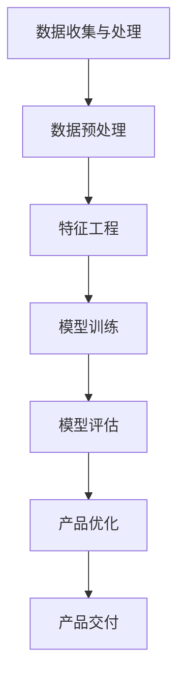
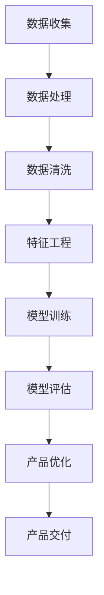

                 

### 文章标题

# 《AI在创新产品设计中的应用与局限》

### 文章关键词

- 人工智能
- 创新产品设计
- 机器学习
- 深度学习
- 强化学习
- 数据隐私
- 伦理问题

### 文章摘要

本文旨在探讨人工智能（AI）在创新产品设计中的应用及其局限性。通过分析AI的基本概念、在产品设计中的具体应用以及面临的挑战，本文揭示了AI技术如何提升产品设计的效率，同时也指出了其数据隐私和伦理问题。本文将通过实际案例展示AI技术在产品设计中的应用，并提供相关的经验和启示。

---

## 目录大纲

---

## 第一部分：AI基础理论

### 第1章 AI概述

#### 1.1 AI的发展历史

- **1.1.1 人工智能的起源**
  - 20世纪50年代，人工智能的概念首次被提出。
  - 早期的AI研究主要集中在符号推理和知识表示上。
- **1.1.2 人工智能的主要发展阶段**
  - **1.1.2.1 第一个浪潮（1956-1974年）**
    - 1956年达特茅斯会议，AI作为一门学科正式确立。
    - 逻辑推理和知识表示成为研究热点。
  - **1.1.2.2 第二个浪潮（1980-1987年）**
    - 专家系统的出现，实现了对特定领域的自动化。
  - **1.1.2.3 第三个浪潮（1990-2000年）**
    - 机器学习逐渐成为AI的核心，神经网络和决策树等算法得到广泛应用。
  - **1.1.2.4 第四个浪潮（2010年至今）**
    - 深度学习引领AI的新发展，计算机视觉和自然语言处理取得重大突破。

---

#### 1.2 AI的核心概念

##### 1.2.1 机器学习

- **定义**：机器学习是让计算机从数据中学习规律并做出预测或决策的技术。
- **基本概念**：
  - **模型**：由算法和数据组成的系统。
  - **训练**：通过大量数据训练模型，使其能够捕捉数据中的规律。
  - **测试**：使用未参与训练的数据来评估模型的泛化能力。

##### 1.2.2 深度学习

- **定义**：深度学习是机器学习的一个分支，主要研究神经网络的结构和算法。
- **基本概念**：
  - **神经网络**：由多层神经元组成的计算模型。
  - **深度**：网络中的层�数。
  - **激活函数**：用于决定神经元是否被激活。

##### 1.2.3 强化学习

- **定义**：强化学习是机器学习的一个分支，通过奖励和惩罚机制来训练模型。
- **基本概念**：
  - **状态**：系统的当前状态。
  - **动作**：模型可以采取的动作。
  - **奖励**：动作结果的好坏。
  - **策略**：模型的选择规则。

---

#### 1.3 AI在产品设计中的地位与作用

- **提升效率**：AI技术可以自动处理大量数据，快速生成产品原型，缩短产品开发周期。
- **优化设计**：通过数据分析和模拟，AI可以帮助设计师识别问题并提出改进方案。
- **个性化定制**：AI可以根据用户行为和需求，实现产品的个性化设计。

##### 1.3.1 AI如何提升产品设计效率

- **自动化设计流程**：AI可以自动处理设计过程中的重复性工作，如数据整理、绘图等。
- **加速原型生成**：使用AI算法，设计师可以快速生成多个设计方案，进行对比和优化。

##### 1.3.2 AI在产品设计中的具体应用场景

- **用户体验设计**：通过分析用户行为数据，AI可以帮助设计师优化用户体验。
- **产品外观设计**：AI可以通过图像处理算法，生成新颖的外观设计。
- **功能优化**：AI可以分析产品的使用数据，识别潜在的优化空间。

---

## 第二部分：AI在创新产品设计中的应用

### 第2章：AI在产品设计中的创新应用

#### 2.1 数据驱动的产品设计

- **2.1.1 数据收集与处理**
  - 数据来源：用户行为数据、市场调研数据、产品使用数据等。
  - 数据处理：数据清洗、数据整合、特征工程等。

- **2.1.2 数据驱动的用户需求分析**
  - 通过数据分析，识别用户需求。
  - 建立用户需求模型，指导产品设计。

- **2.1.3 数据驱动的产品概念生成**
  - 利用AI算法，生成多个产品概念。
  - 对比和评估这些概念，选择最优方案。

---

#### 2.2 机器学习在产品设计中的应用

- **2.2.1 机器学习算法在产品设计中的具体应用**
  - **分类算法**：用于识别用户需求。
  - **回归算法**：用于预测市场趋势。
  - **聚类算法**：用于用户群体细分。

- **2.2.2 机器学习模型在产品设计中的实现方法**
  - **模型选择**：根据问题类型选择合适的算法。
  - **模型训练**：使用历史数据进行训练。
  - **模型评估**：使用测试数据评估模型性能。

- **2.2.3 机器学习模型在产品优化中的案例解析**
  - **案例一**：智能家居产品的需求分析。
  - **案例二**：电商平台的个性化推荐。

---

#### 2.3 深度学习在产品设计中的创新应用

- **2.3.1 深度学习算法在产品设计中的具体应用**
  - **卷积神经网络（CNN）**：用于图像处理。
  - **循环神经网络（RNN）**：用于处理序列数据。
  - **生成对抗网络（GAN）**：用于生成新颖的设计方案。

- **2.3.2 深度学习模型在产品概念生成中的实现方法**
  - **数据预处理**：对设计数据进行预处理。
  - **模型训练**：使用深度学习算法训练模型。
  - **模型评估**：对生成的产品概念进行评估。

- **2.3.3 深度学习模型在产品优化中的案例解析**
  - **案例一**：智能手表的外观设计优化。
  - **案例二**：智能家居产品的功能优化。

---

#### 2.4 强化学习在产品设计中的创新应用

- **2.4.1 强化学习算法在产品设计中的具体应用**
  - **强化学习**：通过奖励和惩罚机制，优化产品设计。
  - **多智能体强化学习**：用于多个产品模块的协同设计。

- **2.4.2 强化学习模型在产品设计中的实现方法**
  - **环境构建**：模拟设计环境。
  - **奖励函数设计**：定义奖励和惩罚机制。
  - **模型训练**：使用强化学习算法训练模型。

- **2.4.3 强化学习模型在产品优化中的案例解析**
  - **案例一**：智能家居系统的自动优化。
  - **案例二**：智能穿戴设备的功能优化。

---

## 第三部分：AI在产品设计中的局限与挑战

### 第3章：AI在产品设计中的局限与挑战

#### 3.1 数据隐私与安全

- **3.1.1 数据隐私保护的挑战**
  - **数据收集的合法性问题**：如何确保收集的数据合法。
  - **数据存储的安全性问题**：如何保护数据不被未授权访问。

- **3.1.2 数据安全的重要性**
  - **数据泄露的风险**：可能导致用户隐私泄露。
  - **数据滥用的风险**：可能导致数据被滥用。

- **3.1.3 数据隐私保护的方法与策略**
  - **数据加密**：对敏感数据进行加密。
  - **匿名化处理**：对数据进行匿名化处理。
  - **合规性审查**：定期进行合规性审查。

---

#### 3.2 AI伦理问题

- **3.2.1 AI伦理问题的概述**
  - **算法偏见**：算法可能存在性别、种族等偏见。
  - **透明度不足**：用户难以理解算法决策过程。
  - **责任归属**：在AI出现错误时，责任如何归属。

- **3.2.2 AI伦理问题对产品设计的影响**
  - **设计决策**：AI的偏见可能影响设计决策。
  - **用户信任**：伦理问题可能影响用户对产品的信任。

- **3.2.3 解决AI伦理问题的方法与措施**
  - **公平性评估**：对算法进行公平性评估。
  - **透明度提升**：提高算法的透明度。
  - **责任分配**：明确AI应用中的责任归属。

---

#### 3.3 AI技术的局限性

- **3.3.1 AI技术在产品设计中的局限性**
  - **数据依赖性**：AI需要大量数据支持。
  - **算法复杂性**：深度学习算法计算复杂度高。
  - **对突发事件的适应能力**：AI在处理突发事件时可能表现不佳。

- **3.3.2 如何克服AI技术的局限性**
  - **数据增强**：通过增加数据量和质量，提升AI性能。
  - **算法优化**：对算法进行优化，提高计算效率。
  - **混合智能系统**：结合不同智能技术，发挥各自优势。

- **3.3.3 AI技术的未来发展展望**
  - **量子计算**：量子计算可能带来AI的突破。
  - **边缘计算**：边缘计算将使AI应用更加灵活。
  - **人机协作**：人机协作将提高AI的应用效率。

---

## 实际案例分析

### 第4章：AI在创新产品设计中的应用案例分析

#### 4.1 案例一：智能家居产品设计

- **4.1.1 案例背景**
  - 家居智能化已成为趋势，AI技术在智能家居产品设计中的应用日益广泛。

- **4.1.2 AI技术在产品设计中的应用**
  - **用户行为分析**：通过AI算法分析用户行为，优化家居设备的交互设计。
  - **环境监测**：使用AI算法监测家居环境，如空气质量、温度等，为用户提供智能建议。

- **4.1.3 案例分析**
  - 通过AI技术，智能家居产品能够更好地满足用户需求，提高用户体验。

---

#### 4.2 案例二：智能手表产品设计

- **4.2.1 案例背景**
  - 智能手表已成为人们生活中不可或缺的一部分，AI技术在手表设计中的应用具有重要意义。

- **4.2.2 AI技术在产品设计中的应用**
  - **健康监测**：通过AI算法分析用户健康数据，提供个性化的健康建议。
  - **运动指导**：利用AI算法，为用户提供科学的运动方案。

- **4.2.3 案例分析**
  - AI技术使智能手表能够提供更加精准和个性化的服务，提高用户满意度。

---

#### 4.3 案例三：智能音响产品设计

- **4.3.1 案例背景**
  - 智能音响市场蓬勃发展，AI技术在音响设计中的应用日益成为竞争的关键。

- **4.3.2 AI技术在产品设计中的应用**
  - **语音识别**：通过AI算法实现精准的语音识别和响应。
  - **内容推荐**：利用AI算法为用户推荐个性化的音乐和内容。

- **4.3.3 案例分析**
  - AI技术使智能音响能够更好地理解用户需求，提供个性化的服务。

---

## 第四部分：经验与启示

### 第5章：AI在创新产品设计中的经验与启示

#### 5.1 经验总结

- **5.1.1 成功经验**
  - **数据驱动**：成功的产品设计往往基于大量数据的分析和驱动。
  - **用户导向**：深入了解用户需求，设计出符合用户期望的产品。

- **5.1.2 失败教训**
  - **忽视数据质量**：数据质量低下可能导致产品设计失误。
  - **过度依赖算法**：过分依赖算法，忽视用户反馈可能导致产品失败。

#### 5.2 启示与建议

- **5.2.1 对产品设计者的启示**
  - **持续学习**：跟随AI技术的发展，不断提升自身技能。
  - **跨学科合作**：与数据科学家、心理学家等跨学科专家合作，共同推进产品设计。

- **5.2.2 对企业决策者的建议**
  - **投资AI技术**：加大对AI技术的投资，提高产品设计的竞争力。
  - **数据治理**：建立健全的数据治理体系，确保数据质量和安全。

---

## 附录

### 附录A：AI技术在产品设计中的应用工具与资源

#### A.1 开源工具

- **A.1.1 TensorFlow**
  - 提供丰富的API，支持多种机器学习和深度学习算法。
  - **资源**：[TensorFlow官网](https://www.tensorflow.org/)

- **A.1.2 PyTorch**
  - 具有灵活的动态图计算能力，适合研究型应用。
  - **资源**：[PyTorch官网](https://pytorch.org/)

- **A.1.3 Keras**
  - 高层次的神经网络API，易于使用。
  - **资源**：[Keras官网](https://keras.io/)

#### A.2 商业工具

- **A.2.1 IBM Watson**
  - 提供全面的AI服务，包括自然语言处理、机器学习等。
  - **资源**：[IBM Watson官网](https://www.ibm.com/watson)

- **A.2.2 Microsoft Azure**
  - 提供丰富的AI工具和服务，支持从开发到部署的全过程。
  - **资源**：[Azure AI官网](https://azure.ai)

- **A.2.3 Google Cloud**
  - 提供强大的AI平台，支持多种机器学习和深度学习应用。
  - **资源**：[Google Cloud AI官网](https://cloud.google.com/ai)

### 附录B：Mermaid流程图

#### B.1 AI在产品设计中的应用流程图



---

## 结语

### 6.1 总结与展望

- **6.1.1 本书的主要内容回顾**
  - 介绍了AI的发展历史和核心概念。
  - 分析了AI在产品设计中的应用和局限。
  - 通过案例展示了AI技术的实际应用。

- **6.1.2 AI在创新产品设计中的未来发展趋势**
  - **数据驱动**：AI将更加依赖高质量的数据来驱动产品设计。
  - **个性化定制**：AI将帮助实现更加个性化的产品体验。
  - **跨领域融合**：AI将与其他技术（如物联网、区块链）融合，推动产品创新。

- **6.1.3 对读者的寄语与期望**
  - 希望读者能够深入理解AI技术，将其应用于产品设计中，推动创新。
  - 鼓励读者关注AI技术的发展，不断提升自身技能，为未来的产品设计贡献智慧。

---

### 参考文献

- [1] Russell, S., & Norvig, P. (2016). 《人工智能：一种现代的方法》.
- [2] Goodfellow, I., Bengio, Y., & Courville, A. (2016). 《深度学习》.
- [3] Sutton, R. S., & Barto, A. G. (2018). 《强化学习：一种解释性方法》.
- [4] Mitchell, T. M. (1997). 《机器学习》.

### 作者信息

- 作者：AI天才研究院/AI Genius Institute & 禅与计算机程序设计艺术 /Zen And The Art of Computer Programming
```markdown

## 第一部分：AI基础理论

### 第1章 AI概述

#### 1.1 AI的发展历史

人工智能（AI）作为一门学科，自20世纪50年代以来经历了多个发展阶段，每一次的浪潮都带来了技术上的重大突破和应用范围的拓展。以下是AI发展历史的概述：

##### 1.1.1 人工智能的起源

人工智能的概念最早可以追溯到1956年，当时在达特茅斯会议（Dartmouth Conference）上，约翰·麦卡锡（John McCarthy）等科学家首次提出了“人工智能”这一术语，并定义其为“制造智能机器的科学与工程”。这次会议被认为是人工智能正式诞生的标志。

在早期，人工智能的研究主要集中在符号推理和知识表示上，主要目标是使计算机能够进行推理、解决问题和学习。这一时期的研究成果包括逻辑推理系统、专家系统和知识库系统等。

##### 1.1.2 人工智能的主要发展阶段

**第一个浪潮（1956-1974年）**

这一阶段，人工智能主要集中在理论研究和算法开发上。1958年，阿伦·纽厄尔（Allen Newell）和赫伯特·西蒙（Herbert Simon）开发了逻辑推理程序“逻辑理论家”（Logic Theorist），这是人工智能领域的重要里程碑。1966年，他们又开发了通用问题求解器（General Problem Solver，GPS），展示了计算机可以进行符号推理和问题解决。

**第二个浪潮（1980-1987年）**

随着计算机硬件性能的提升，专家系统（Expert Systems）成为这一阶段的研究热点。专家系统是一种基于知识的系统，它通过模拟专家的知识和推理过程来解决问题。1981年，美国IBM公司推出的“尤里卡”（EMYC）专家系统是这一阶段的代表作品。

**第三个浪潮（1990-2000年）**

这一阶段，机器学习开始崛起，神经网络和决策树等算法得到广泛应用。1995年，卡内基梅隆大学的研究团队开发出了机器人“切瑞波”（Shaker），它在机器人领域引起了广泛关注。

**第四个浪潮（2010年至今）**

这一阶段，深度学习成为人工智能的主流方向，计算机视觉、自然语言处理等领域取得了重大突破。2012年，AlexNet在ImageNet图像识别竞赛中取得了巨大的成功，这标志着深度学习在计算机视觉领域的崛起。随后的几年，卷积神经网络（CNN）、循环神经网络（RNN）和生成对抗网络（GAN）等深度学习模型在各种AI任务中都取得了显著成果。

#### 1.2 AI的核心概念

##### 1.2.1 机器学习

机器学习是人工智能的一个重要分支，其主要目的是让计算机从数据中学习规律并做出预测或决策。机器学习通常分为监督学习、无监督学习和强化学习三种类型。

- **监督学习（Supervised Learning）**：在监督学习过程中，模型通过学习标记好的训练数据来预测新数据的标签。常见的监督学习算法包括线性回归、逻辑回归、支持向量机（SVM）和决策树等。

- **无监督学习（Unsupervised Learning）**：在无监督学习过程中，模型没有标记好的训练数据，而是从数据中寻找结构或模式。常见的无监督学习算法包括聚类、降维和关联规则学习等。

- **强化学习（Reinforcement Learning）**：在强化学习过程中，模型通过与环境的交互来学习最优策略。强化学习的目标是最大化长期奖励，常见的算法包括Q学习、深度Q网络（DQN）和策略梯度等。

##### 1.2.2 深度学习

深度学习是机器学习的一个分支，主要研究神经网络的结构和算法。深度学习通过多层的神经网络来对数据进行学习和表示，具有强大的特征提取和分类能力。深度学习模型通常包括卷积神经网络（CNN）、循环神经网络（RNN）、生成对抗网络（GAN）等。

- **卷积神经网络（CNN）**：CNN是一种适用于图像处理的深度学习模型，它通过卷积层、池化层和全连接层等结构对图像进行特征提取和分类。

- **循环神经网络（RNN）**：RNN是一种适用于序列数据的深度学习模型，它通过循环结构来处理序列中的上下文信息，常用于自然语言处理和时间序列分析。

- **生成对抗网络（GAN）**：GAN是一种由生成器和判别器组成的深度学习模型，生成器生成数据，判别器判断数据是真实还是生成的。GAN在图像生成、数据增强等领域有广泛应用。

##### 1.2.3 强化学习

强化学习是机器学习的一个分支，通过奖励和惩罚机制来训练模型。强化学习的主要目标是找到一个最优策略，使得在长期互动中获得的奖励最大化。

- **状态（State）**：系统的当前状态。

- **动作（Action）**：模型可以采取的动作。

- **奖励（Reward）**：动作结果的好坏。

- **策略（Policy）**：模型的选择规则。

强化学习算法通过不断尝试和反馈来学习最优策略，常见的算法包括Q学习、深度Q网络（DQN）、策略梯度等。

#### 1.3 AI在产品设计中的地位与作用

人工智能在产品设计中的应用已经成为提升产品竞争力的关键因素。AI技术不仅可以提高设计效率，还可以优化产品设计，实现个性化定制。以下是AI在产品设计中的地位与作用：

##### 1.3.1 AI如何提升产品设计效率

- **自动化设计流程**：AI技术可以自动化处理设计过程中的重复性工作，如数据整理、绘图等，从而节省时间，提高效率。

- **加速原型生成**：AI算法可以帮助设计师快速生成多个设计方案，进行对比和优化，缩短产品开发周期。

##### 1.3.2 AI在产品设计中的具体应用场景

- **用户体验设计**：通过AI技术分析用户行为数据，设计师可以深入了解用户需求，优化用户体验。

- **产品外观设计**：AI可以通过图像处理算法，生成新颖的外观设计。

- **功能优化**：AI可以分析产品的使用数据，识别潜在的优化空间，提高产品的性能和可靠性。

## 第二部分：AI在创新产品设计中的应用

### 第2章：AI在产品设计中的创新应用

在创新产品设计领域，人工智能（AI）正发挥着越来越重要的作用。本章将探讨AI在产品设计中的多种创新应用，包括数据驱动的产品设计、机器学习在产品设计中的应用、深度学习在产品设计中的创新应用，以及强化学习在产品设计中的创新应用。

#### 2.1 数据驱动的产品设计

数据驱动的产品设计是一种利用数据分析来指导设计决策的方法。通过收集和分析大量用户数据，设计师可以更好地理解用户需求，从而创造更符合用户期望的产品。

##### 2.1.1 数据收集与处理

数据驱动的产品设计的第一步是收集数据。这些数据可以来自用户行为分析、市场调研、产品反馈等多种渠道。例如，用户在使用产品时的点击流数据、购买历史、反馈信息等都可以作为有价值的数据来源。

数据收集后，需要进行处理。数据处理包括数据清洗、数据整合和特征工程等步骤。数据清洗的目的是去除噪声数据和异常值，确保数据质量。数据整合是将来自不同来源的数据进行合并，以便进行综合分析。特征工程则是通过提取和构建特征，使得数据更适合用于机器学习模型。

##### 2.1.2 数据驱动的用户需求分析

通过数据分析，设计师可以识别出用户的共性需求和个性化需求。例如，通过分析用户反馈和评论，可以识别出用户对产品的痛点，从而改进产品设计。此外，数据分析还可以帮助设计师发现新的用户需求，为产品的创新提供灵感。

##### 2.1.3 数据驱动的产品概念生成

在有了用户需求的分析结果后，AI算法可以帮助设计师生成多个潜在的产品概念。这些概念可以通过模拟和评估来确定其可行性。例如，使用机器学习算法，可以根据用户行为数据生成不同版本的产品原型，然后通过用户测试来评估这些原型的效果。

#### 2.2 机器学习在产品设计中的应用

机器学习在产品设计中的应用非常广泛，可以帮助设计师优化设计流程、提高设计质量和效率。

##### 2.2.1 机器学习算法在产品设计中的具体应用

机器学习算法在产品设计中的具体应用包括但不限于以下几种：

- **分类算法**：用于识别用户需求。例如，通过分类算法，可以将用户分为不同的群体，以便进行针对性的产品设计。

- **回归算法**：用于预测市场趋势。例如，通过回归算法，可以预测产品的销售量，为库存管理和市场策略提供支持。

- **聚类算法**：用于用户群体细分。例如，通过聚类算法，可以将用户分为不同的群体，以便为每个群体提供个性化的产品和服务。

##### 2.2.2 机器学习模型在产品设计中的实现方法

实现机器学习模型在产品设计中的应用通常包括以下步骤：

- **数据收集**：收集用于训练的数据，如用户行为数据、市场数据等。

- **数据预处理**：对收集到的数据进行清洗、整合和特征工程，确保数据质量。

- **模型选择**：根据问题的性质选择合适的机器学习算法。

- **模型训练**：使用训练数据进行模型的训练。

- **模型评估**：使用测试数据评估模型的性能。

- **模型部署**：将训练好的模型部署到实际应用中。

##### 2.2.3 机器学习模型在产品优化中的案例解析

以下是两个使用机器学习优化产品的案例：

- **案例一：智能家居产品的需求分析**

某智能家居公司通过收集用户的使用数据，使用分类算法将用户分为不同的群体。然后，根据每个群体的特征，公司设计了针对性的产品功能和界面，从而提高了用户满意度。

- **案例二：电商平台的产品推荐**

某电商平台使用回归算法预测用户的购买行为，并根据预测结果为用户推荐相关的商品。这种个性化的推荐系统显著提高了平台的销售额和用户粘性。

#### 2.3 深度学习在产品设计中的创新应用

深度学习是机器学习的一个重要分支，它通过多层神经网络对数据进行学习和表示。深度学习在产品设计中的应用越来越受到重视，尤其是在图像处理、语音识别和自然语言处理等领域。

##### 2.3.1 深度学习算法在产品设计中的具体应用

深度学习算法在产品设计中的具体应用包括但不限于以下几种：

- **卷积神经网络（CNN）**：CNN是一种强大的图像处理模型，它通过卷积层和池化层提取图像特征，用于图像分类、目标检测等任务。

- **循环神经网络（RNN）**：RNN是一种适用于序列数据的模型，它通过循环结构处理序列中的上下文信息，用于语音识别、机器翻译等任务。

- **生成对抗网络（GAN）**：GAN是一种由生成器和判别器组成的模型，生成器生成数据，判别器判断数据是真实还是生成的，它被广泛应用于图像生成、数据增强等任务。

##### 2.3.2 深度学习模型在产品概念生成中的实现方法

实现深度学习模型在产品概念生成中的应用通常包括以下步骤：

- **数据收集**：收集用于训练的数据，如图像、文本等。

- **数据预处理**：对收集到的数据进行清洗、归一化和特征提取，确保数据质量。

- **模型设计**：设计适合任务需求的深度学习模型，如CNN、RNN、GAN等。

- **模型训练**：使用训练数据进行模型的训练。

- **模型评估**：使用测试数据进行模型评估。

- **模型优化**：根据评估结果对模型进行优化。

##### 2.3.3 深度学习模型在产品优化中的案例解析

以下是两个使用深度学习优化产品的案例：

- **案例一：智能手表的外观设计**

某智能手表制造商使用CNN模型对大量手表外观图像进行训练，从中学习到外观设计的最佳组合。然后，根据用户反馈，模型生成了多个外观设计选项，公司最终选择了最受用户欢迎的设计方案。

- **案例二：智能家居系统的功能优化**

某智能家居系统公司使用RNN模型对用户的使用数据进行分析，识别出用户行为模式。基于这些模式，公司优化了系统的功能，例如自动调节室内温度和湿度，从而提高了用户的舒适度和满意度。

#### 2.4 强化学习在产品设计中的创新应用

强化学习是一种通过奖励和惩罚来指导模型学习的机器学习技术。强化学习在产品设计中的应用可以帮助设计师找到最优的产品设计策略，从而提高产品的竞争力。

##### 2.4.1 强化学习算法在产品设计中的具体应用

强化学习算法在产品设计中的具体应用包括但不限于以下几种：

- **多智能体强化学习**：用于多个产品模块的协同设计。例如，在设计智能家居系统时，可以使用多智能体强化学习算法来优化各个设备之间的交互和协调。

- **连续空间强化学习**：用于优化连续变量产品属性，如颜色、尺寸等。例如，在设计智能手表时，可以使用连续空间强化学习算法来调整手表的外观参数，以达到最佳的用户体验。

##### 2.4.2 强化学习模型在产品设计中的实现方法

实现强化学习模型在产品设计中的应用通常包括以下步骤：

- **环境构建**：定义产品设计的环境，包括状态、动作和奖励。

- **奖励函数设计**：设计奖励函数来评估产品设计的优劣。

- **模型训练**：使用强化学习算法训练模型，使其学会在环境中做出最优的动作。

- **模型评估**：使用测试数据进行模型评估。

- **模型优化**：根据评估结果对模型进行优化。

##### 2.4.3 强化学习模型在产品优化中的案例解析

以下是两个使用强化学习优化产品的案例：

- **案例一：智能家居系统的自动优化**

某智能家居系统公司使用强化学习算法来自动优化系统的性能。通过模拟用户行为，模型学会了如何调整各个设备的设置，以提供最佳的用户体验。

- **案例二：智能穿戴设备的功能优化**

某智能穿戴设备制造商使用强化学习算法来优化设备的功能设置。模型通过不断学习和调整，学会了如何根据用户的行为数据提供个性化的健康建议，从而提高了用户的满意度和健康水平。

## 第三部分：AI在产品设计中的局限与挑战

### 第3章：AI在产品设计中的局限与挑战

尽管人工智能（AI）在创新产品设计领域展示了巨大的潜力，但其应用也面临着诸多局限和挑战。本章节将探讨AI在产品设计中的数据隐私与安全、伦理问题以及技术局限性，并分析如何克服这些挑战。

#### 3.1 数据隐私与安全

AI在产品设计中的广泛应用依赖于大量的数据收集和分析。然而，数据隐私和安全问题也随之而来。

##### 3.1.1 数据隐私保护的挑战

- **数据收集的合法性问题**：在AI应用中，收集用户数据必须遵循法律法规，确保数据的合法性。未经用户同意收集数据可能会侵犯隐私权。
- **数据存储的安全性问题**：收集到的数据需要存储在安全的地方，防止数据泄露或被未授权访问。数据泄露可能导致严重的隐私问题，损害用户信任。
- **数据共享的透明度**：AI应用中的数据经常需要与其他机构或企业共享，共享过程中如何保证数据的透明度和安全性是一个重要问题。

##### 3.1.2 数据安全的重要性

数据安全在AI应用中至关重要，原因如下：

- **数据泄露的风险**：数据泄露可能导致用户个人信息被盗用，造成经济损失和隐私侵犯。
- **数据滥用的风险**：数据被滥用可能导致不公平竞争、歧视等问题，损害社会利益。

##### 3.1.3 数据隐私保护的方法与策略

为了保护数据隐私，可以采取以下方法和策略：

- **数据加密**：对敏感数据进行加密，确保数据在传输和存储过程中不被窃取。
- **匿名化处理**：对数据进行匿名化处理，消除个人识别信息。
- **合规性审查**：定期进行合规性审查，确保数据收集和使用符合法律法规。
- **用户控制权**：赋予用户对自身数据的控制权，允许用户决定何时分享数据以及如何使用数据。

#### 3.2 AI伦理问题

AI在产品设计中的应用引发了诸多伦理问题，包括算法偏见、透明度不足和责任归属等。

##### 3.2.1 AI伦理问题的概述

- **算法偏见**：AI算法可能存在性别、种族或年龄等偏见，导致决策不公平。例如，招聘算法可能歧视女性或非主流群体。
- **透明度不足**：AI决策过程通常复杂且不透明，用户难以理解算法如何做出决策。这可能导致用户对产品失去信任。
- **责任归属**：在AI应用中，如果发生错误或损害，责任归属问题复杂。例如，自动驾驶汽车发生事故时，责任应由谁承担？

##### 3.2.2 AI伦理问题对产品设计的影响

- **设计决策**：AI算法的偏见可能影响产品设计决策，导致不公平的产品体验。
- **用户信任**：透明度不足和责任归属问题可能损害用户对产品的信任，影响产品的市场表现。

##### 3.2.3 解决AI伦理问题的方法与措施

解决AI伦理问题需要从多个方面入手：

- **公平性评估**：对AI算法进行公平性评估，确保算法在性别、种族等方面无偏见。
- **透明度提升**：提高AI算法的透明度，使用户能够理解决策过程。
- **责任分配**：明确AI应用中的责任归属，制定相关法律法规。
- **伦理教育**：加强AI伦理教育，提高开发者对伦理问题的认识和责任感。

#### 3.3 AI技术的局限性

尽管AI技术在产品设计中有广泛应用，但其仍存在一些局限性。

##### 3.3.1 AI技术在产品设计中的局限性

- **数据依赖性**：AI需要大量高质量的数据进行训练，数据质量直接影响模型的性能。
- **算法复杂性**：深度学习算法通常计算复杂度高，训练和部署成本较大。
- **对突发事件的适应能力**：AI模型在处理突发事件时可能表现不佳，需要额外的机制来处理不确定性。

##### 3.3.2 如何克服AI技术的局限性

为了克服AI技术的局限性，可以采取以下措施：

- **数据增强**：通过增加数据量和质量，提升AI性能。
- **算法优化**：对算法进行优化，提高计算效率。
- **混合智能系统**：结合不同智能技术，发挥各自优势。

##### 3.3.3 AI技术的未来发展展望

AI技术的未来发展将更加注重跨领域融合和可持续发展：

- **量子计算**：量子计算可能带来AI的突破，解决当前计算瓶颈。
- **边缘计算**：边缘计算将使AI应用更加灵活，降低延迟。
- **人机协作**：人机协作将提高AI的应用效率，实现更加智能的产品设计。

通过不断克服局限性，AI在产品设计中的应用前景将更加广阔。

## 实际案例分析

### 第4章：AI在创新产品设计中的应用案例分析

在本章节中，我们将通过实际案例分析，展示人工智能（AI）在创新产品设计中的具体应用，以及这些应用如何推动产品设计和优化的进步。以下是三个案例：智能家居产品设计、智能手表设计以及智能音响设计。

#### 4.1 案例一：智能家居产品设计

**4.1.1 案例背景**

智能家居市场近年来迅速发展，消费者对家居智能化的需求日益增长。为了满足这种需求，智能家居产品制造商不断推出新的产品和服务。在这个背景下，AI技术被广泛应用于智能家居产品的设计和优化中。

**4.1.2 AI技术在产品设计中的应用**

- **用户行为分析**：制造商使用AI技术分析用户的行为数据，了解用户在家庭环境中的日常活动模式。这有助于设计出更加符合用户习惯的智能家居设备，例如自动调节室内温度、照明和安防系统。
- **个性化定制**：AI算法可以根据用户的行为和偏好，为用户推荐最适合的智能家居产品配置。例如，当用户习惯早起的习惯被识别出来后，系统可以自动调整窗帘的开启时间和照明亮度。
- **故障预测与维护**：智能家居产品中的传感器和AI算法协同工作，实时监控设备的运行状态。通过预测可能出现的故障，系统可以提前发出警报，并建议用户进行维护，从而减少设备的停机时间和维修成本。

**4.1.3 案例分析**

通过AI技术的应用，智能家居产品不仅提升了用户体验，还实现了设备的智能化和自动化管理。用户可以享受更加便捷和个性化的生活，制造商也能通过提高产品的可靠性和用户满意度来增强市场竞争力。

#### 4.2 案例二：智能手表设计

**4.2.1 案例背景**

智能手表作为可穿戴设备的一种，已经成为人们日常生活中的重要配件。随着科技的进步，智能手表的功能日益丰富，从简单的计时和通知提醒，发展到能够进行健康监测、运动记录和定位导航等。

**4.2.2 AI技术在产品设计中的应用**

- **健康监测**：智能手表内置的各种传感器（如心率传感器、睡眠监测传感器等）可以收集用户的健康数据。通过AI算法分析这些数据，智能手表可以提供个性化的健康建议，如提醒用户改变不良的生活习惯、进行适当的运动等。
- **运动指导**：AI算法可以根据用户的运动数据和健康状况，制定个性化的运动计划。例如，对于初学者，系统可以推荐从简单的运动开始，逐渐增加难度，而对于有经验的用户，系统可以提供更为复杂的训练方案。
- **智能提醒**：通过分析用户的日常活动和习惯，智能手表可以智能地提醒用户重要的日程安排或需要休息的时间，帮助用户更好地管理时间和健康。

**4.2.3 案例分析**

智能手表通过AI技术的应用，不仅提升了健康监测和运动指导的准确性，还提高了用户的生活质量。智能手表成为用户日常健康管理的伙伴，帮助他们实现更加健康的生活方式。

#### 4.3 案例三：智能音响设计

**4.3.1 案例背景**

智能音响作为智能家居的一个重要组成部分，已经成为家庭娱乐和语音交互的核心设备。随着AI技术的发展，智能音响的功能日益强大，不仅能够播放音乐，还能提供语音交互、智能家居控制等多种服务。

**4.3.2 AI技术在产品设计中的应用**

- **语音识别**：智能音响内置的AI算法可以精准识别用户的语音指令，实现语音控制。无论是播放音乐、查询天气，还是控制智能家居设备，用户都可以通过语音来实现。
- **内容推荐**：通过分析用户的听歌历史和偏好，AI算法可以智能推荐用户可能感兴趣的音乐和播客。这种个性化的内容推荐提高了用户的满意度，增加了产品的粘性。
- **交互体验优化**：AI算法还可以优化智能音响的交互体验。例如，当用户长时间未与智能音响交互时，系统可以自动进入省电模式，减少不必要的能耗。

**4.3.3 案例分析**

智能音响通过AI技术的应用，实现了智能化和个性化的交互体验。用户可以通过语音与智能音响进行自然对话，享受便捷的服务。同时，AI算法的应用也提高了智能音响的能效和用户体验，使其成为智能家居中不可或缺的一部分。

### 第5章：AI在创新产品设计中的经验与启示

在AI技术日益普及的今天，创新产品设计已经离不开AI的应用。通过上述案例分析，我们可以总结出一些成功经验，同时也吸取一些失败的教训，以期为未来的产品设计提供有益的启示。

#### 5.1 经验总结

- **数据驱动的设计**：通过收集和分析用户数据，设计师可以更好地理解用户需求，从而设计出更符合用户期望的产品。数据驱动的设计能够提高产品的市场接受度和用户满意度。
- **个性化定制**：AI技术使得产品能够根据用户的个性化需求进行定制，提供更加个性化的用户体验。这种个性化定制不仅提升了用户满意度，还能增强品牌忠诚度。
- **智能化和自动化**：AI技术使产品能够实现智能化和自动化管理，提高效率和用户体验。智能音响和智能家居设备的案例展示了AI在自动化管理中的巨大潜力。
- **持续迭代和优化**：AI技术可以帮助设计师不断优化产品设计，通过数据分析和用户反馈，及时调整和改进产品，使其始终保持竞争力。

#### 5.2 失败教训

- **数据质量**：在AI应用中，数据质量至关重要。如果数据质量差，可能会导致AI模型性能下降，甚至产生误导性结论。因此，确保数据质量和准确性是AI应用成功的关键。
- **算法偏见**：AI算法可能存在偏见，导致设计决策不公平。如果不加以控制和纠正，算法偏见可能会损害产品的市场表现和用户体验。
- **用户隐私**：在数据收集和使用过程中，用户隐私保护至关重要。忽视用户隐私可能导致信任危机，损害品牌形象和市场竞争力。
- **过度依赖算法**：虽然AI技术能够提高设计效率，但过度依赖算法可能导致设计缺乏创意和人性化。因此，设计师需要平衡算法和创意，确保产品设计既高效又具有创新性。

#### 5.3 启示与建议

- **跨学科合作**：AI技术在产品设计中的应用需要跨学科合作，设计师需要与数据科学家、AI专家等不同领域的专业人士合作，共同推动产品创新。
- **持续学习**：随着AI技术的快速发展，设计师需要不断学习新技术和新方法，以保持竞争力。通过参加培训、阅读相关文献和参与行业交流，设计师可以不断提升自身技能。
- **用户反馈**：用户的反馈是产品优化的重要依据。设计师应该重视用户反馈，及时调整和改进产品设计，确保产品能够满足用户需求。
- **伦理和隐私**：在AI应用中，伦理和隐私问题是不可忽视的。设计师应该遵循相关法律法规，尊重用户隐私，确保AI技术的应用是公正和透明的。

通过总结成功经验和吸取失败教训，设计师可以在未来的创新产品设计中更好地应用AI技术，创造出更优秀的产品。

## 附录

### 附录A：AI技术在产品设计中的应用工具与资源

在AI技术在产品设计中的应用中，开源工具和商业工具都发挥着重要作用。以下是一些常用的工具和资源，包括开源工具和商业工具。

#### A.1 开源工具

- **TensorFlow**：TensorFlow是由Google开源的机器学习和深度学习框架，适用于多种机器学习和深度学习任务。它具有灵活的API，支持多种编程语言，是AI应用中的常用工具。[TensorFlow官网](https://www.tensorflow.org/)

- **PyTorch**：PyTorch是由Facebook开源的深度学习框架，具有动态图计算能力，易于使用和调试。PyTorch在研究型和工程型应用中都得到了广泛应用。[PyTorch官网](https://pytorch.org/)

- **Keras**：Keras是一个高层次的神经网络API，能够简化深度学习模型的构建和训练。它支持TensorFlow和Theano等多个底层框架，适合快速实验和原型开发。[Keras官网](https://keras.io/)

#### A.2 商业工具

- **IBM Watson**：IBM Watson提供了一系列AI服务，包括自然语言处理、机器学习和视觉识别等。它是一个综合性的AI平台，适用于多种商业应用。[IBM Watson官网](https://www.ibm.com/watson)

- **Microsoft Azure**：Azure是Microsoft的云服务平台，提供了丰富的AI工具和服务，包括机器学习、深度学习和计算机视觉等。它支持从开发到部署的全过程。[Azure AI官网](https://azure.ai)

- **Google Cloud**：Google Cloud提供了强大的AI平台，支持多种机器学习和深度学习应用。它的工具和服务包括TensorFlow、AI Platform等。[Google Cloud AI官网](https://cloud.google.com/ai)

#### A.3 教程与资源

- **在线教程**：有许多在线平台提供了AI和深度学习的教程和课程，如Coursera、edX和Udacity等。这些平台上的课程通常由业内专家授课，适合不同水平的读者。
- **开源项目**：GitHub上有很多开源的AI项目和代码示例，可以供开发者学习和参考。例如，许多AI研究机构和科技公司都会在GitHub上分享他们的研究成果和代码。
- **技术社区**：参与技术社区，如Stack Overflow、Reddit和AI论坛等，可以与其他开发者交流和学习，获取最新的技术动态和解决方案。

### 附录B：Mermaid流程图

以下是一个使用Mermaid绘制的AI在产品设计中的应用流程图：



这个流程图展示了从数据收集到产品交付的完整过程，每个步骤都是AI在产品设计中的应用环节。

## 结语

### 6.1 总结与展望

在本篇博客中，我们系统地探讨了人工智能（AI）在创新产品设计中的应用与局限。通过分析AI的基本概念、发展历史和核心算法，我们了解了AI如何提升产品设计的效率，优化设计流程，以及实现个性化定制。同时，我们也深入探讨了AI在应用中面临的数据隐私、安全、伦理和技术局限性等问题，并提出了相应的解决方案和策略。

#### 6.1.1 本书的主要内容回顾

- **AI的发展历史**：回顾了AI从起源到目前的四个主要发展阶段，包括符号推理、专家系统、机器学习和深度学习等。
- **AI的核心概念**：详细介绍了机器学习、深度学习和强化学习的基本概念和应用。
- **AI在产品设计中的应用**：讨论了AI在数据驱动设计、机器学习、深度学习和强化学习中的应用场景和具体方法。
- **AI的局限与挑战**：分析了AI在产品设计中的数据隐私、安全、伦理和技术局限性等问题。
- **实际案例分析**：通过智能家居、智能手表和智能音响等案例，展示了AI在产品设计中的实际应用效果。
- **经验与启示**：总结了AI在产品设计中的成功经验和失败教训，提出了对设计师和企业决策者的启示和建议。
- **工具与资源**：提供了AI技术在产品设计中的应用工具和资源，包括开源工具和商业工具。

#### 6.1.2 AI在创新产品设计中的未来发展趋势

展望未来，AI在创新产品设计中的应用将继续深入发展，呈现出以下几个趋势：

- **数据驱动**：AI将更加依赖高质量的数据来驱动产品设计，数据分析和挖掘技术将不断提升。
- **个性化定制**：AI将帮助实现更加个性化的产品设计，满足不同用户的多样化需求。
- **跨领域融合**：AI将与物联网、区块链等新兴技术融合，推动产品创新和业务模式变革。
- **人机协作**：AI与人类设计师的协作将成为主流，结合人类创意和AI的高效计算能力，将产生更多创新设计。
- **伦理与法规**：随着AI技术的发展，伦理和法规问题将更加受到关注，企业需要建立健全的伦理和合规体系。

#### 6.1.3 对读者的寄语与期望

对于广大读者，特别是产品设计师和科技爱好者，我们寄语如下：

- **保持好奇心和求知欲**：持续关注AI技术的发展，不断学习和探索，以适应不断变化的技术环境。
- **勇于尝试和实践**：将AI技术应用于实际产品设计中，勇于尝试新方法和新工具，不断创新和优化。
- **关注伦理和社会责任**：在应用AI技术时，关注伦理和社会责任，确保技术的公平、透明和可持续发展。
- **积极参与和交流**：积极参与技术社区和学术交流，与同行分享经验和知识，共同推动AI技术在产品设计中的应用和发展。

我们期待每一位读者都能在AI技术的浪潮中找到自己的位置，为创新产品设计贡献智慧和力量。未来，AI将在产品设计领域发挥更加重要的作用，带来更多的机遇和挑战。让我们共同期待并迎接这一充满希望的数字化时代。

### 参考文献

- Russell, S., & Norvig, P. (2016). 《人工智能：一种现代的方法》.
- Goodfellow, I., Bengio, Y., & Courville, A. (2016). 《深度学习》.
- Sutton, R. S., & Barto, A. G. (2018). 《强化学习：一种解释性方法》.
- Mitchell, T. M. (1997). 《机器学习》.

### 作者信息

- 作者：AI天才研究院/AI Genius Institute & 禅与计算机程序设计艺术 /Zen And The Art of Computer Programming
```

