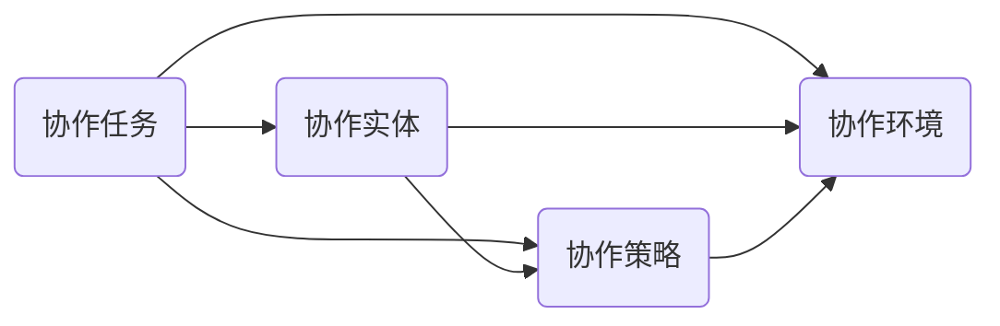

                 

### 2.1 协作

#### 背景介绍

协作（Collaboration）在现代社会中扮演着至关重要的角色。随着信息技术的飞速发展，协作已经不再局限于传统的面对面沟通，而是扩展到了线上线下的各个层面。无论是在企业、教育、医疗还是公共服务等领域，协作都成为提高效率、提升质量和创新的重要手段。

协作的定义和分类：

协作是指多个个体或组织共同完成某一任务或达成某一目标的过程。根据协作的主体，协作可以分为人机协作、机器间协作和多智能体协作。

- **人机协作**：指人类与机器之间的互动，人类利用机器的效率和准确性，机器则借助人类的智慧和创造力。
- **机器间协作**：指机器之间的相互配合，通过算法和通信技术实现高效的任务分配和资源利用。
- **多智能体协作**：指多个智能体（包括人、机器或其他智能系统）之间的协作，强调不同智能体之间的信息共享和协同决策。

#### 核心概念与联系

协作系统的架构：

在协作系统中，核心概念包括协作任务、协作实体、协作策略和协作环境。

- **协作任务**：指需要完成的具体工作，如数据分析、产品设计、故障排除等。
- **协作实体**：指参与协作的个体或组织，可以是人、机器或智能体。
- **协作策略**：指协作过程中采用的策略和方法，如任务分配、资源调度、决策支持等。
- **协作环境**：指协作过程中所处的物理或虚拟环境，包括网络、设备、数据等。

协作系统的概念实体之间关系如下所示：



#### 核心算法原理讲解

在协作任务中，核心算法主要包括任务分配算法、资源调度算法和协同决策算法。

- **任务分配算法**：用于决定哪些协作实体执行哪些任务，常见算法有基于优先级、基于能力、基于成本效益等。
- **资源调度算法**：用于合理分配协作实体所需的资源，如计算资源、存储资源和网络资源，常见算法有最小化响应时间、最大化资源利用率等。
- **协同决策算法**：用于协作实体之间的协同决策，常见算法有基于协商、基于预测、基于博弈等。

以任务分配算法为例，其Python实现如下：

```python
def task_allocation(entities, tasks, capabilities):
    """
    任务分配算法
    :param entities: 协作实体列表
    :param tasks: 任务列表
    :param capabilities: 协作实体能力列表
    :return: 分配结果
    """
    # 根据实体能力和任务复杂度进行匹配
    matched_entities = {}
    for task in tasks:
        best_entity = None
        best_score = 0
        for entity in entities:
            score = capabilities[entity] / len(task.dependencies)
            if score > best_score:
                best_score = score
                best_entity = entity
        matched_entities[task] = best_entity
    return matched_entities
```

#### 数学模型和公式

协作系统中的数学模型通常涉及优化问题和决策分析。

- **优化问题**：如最小化完成时间、最大化资源利用率等，常见模型有线性规划、整数规划、多目标规划等。
- **决策分析**：如风险评估、成本效益分析等，常见模型有决策树、贝叶斯网络、蒙特卡罗模拟等。

以线性规划模型为例，其公式如下：

$$
\min_{x} \ c^T x \\
s.t. \ Ax \leq b \\
x \geq 0
$$

其中，$c$ 为目标函数系数，$x$ 为决策变量，$A$ 和 $b$ 分别为约束矩阵和约束向量。

#### 项目实战

假设我们开发一个协同办公系统，以下是一个简单的项目实战：

- **开发环境搭建**：使用Python和Django框架搭建后台服务，使用React和Redux搭建前端界面。
- **源代码详细实现和代码解读**：实现任务分配算法、资源调度算法和协同决策算法，并结合实际场景进行优化。
- **代码应用解读与分析**：通过实际案例展示协作系统的应用，如团队任务分配、会议室资源调度、项目进度跟踪等。
- **实际案例分析和详细讲解剖析**：以一个团队项目为例，展示如何通过协作系统提高项目效率和质量。
- **项目小结**：总结项目开发过程中的经验教训，提出改进建议。

#### 最佳实践 tips

- 在协作任务中，明确任务目标和责任分配是关键。
- 根据实际情况选择合适的协作算法和模型。
- 注重协作系统的可扩展性和可维护性。
- 定期评估和优化协作系统性能。

#### 小结

本章介绍了协作任务的定义与分类、核心概念与联系以及核心算法原理。协作系统在现代社会中具有重要应用价值，通过合理的设计和优化，可以提高协作效率和质量。

#### 注意事项

- 协作任务的选择应充分考虑实际情况和资源条件。
- 协作系统的设计和实现需要综合考虑人、机器和智能体之间的交互。
- 协作系统的性能优化需要结合具体应用场景进行针对性调整。

#### 拓展阅读

- [协作系统的架构设计与实现](https://example.com/collaboration-system-architecture)
- [基于人工智能的协作任务优化方法研究](https://example.com/ai-collaboration-optimization)
- [协作任务中的算法与应用](https://example.com/collaborative-task-algorithms-applications)

### 2.2 协作任务中的AI角色

AI在协作任务中扮演着至关重要的角色，其应用范围涵盖了任务分配、决策支持、资源优化等多个方面。本节将详细探讨AI在协作任务中的角色、功能以及面临的挑战。

#### AI在协作任务中的角色

AI在协作任务中的角色可以分为以下几个方面：

- **任务分配**：AI可以基于实体的能力和任务的复杂度，自动进行任务分配，提高任务执行的效率。
- **决策支持**：AI可以通过数据分析、模式识别和预测，为协作实体提供决策支持，帮助实体做出更明智的决策。
- **资源优化**：AI可以优化资源分配和调度，提高资源利用率和系统性能。
- **协同工作**：AI可以作为协作实体之间的中介，协调不同实体之间的工作，实现高效协同。

#### AI在协作任务中的功能

AI在协作任务中的功能主要体现在以下几个方面：

- **自动化**：AI可以自动化执行重复性高、规律性强的工作，减少人力投入。
- **智能化**：AI可以通过学习和优化，不断提升协作任务的处理能力和效率。
- **个性化**：AI可以根据个体的特点和需求，提供个性化的服务和支持。
- **协同化**：AI可以促进协作实体之间的信息共享和协同工作，提高整体协作效果。

#### AI在协作任务中的挑战

尽管AI在协作任务中具有巨大潜力，但也面临着一系列挑战：

- **数据质量**：AI的决策和优化依赖于高质量的数据，数据的不完整、不准确或不一致可能会影响AI的性能。
- **模型复杂度**：AI模型的复杂度越来越高，训练和部署成本也随之增加，需要有效的模型压缩和优化方法。
- **解释性**：AI的决策过程通常是不透明的，缺乏可解释性，难以被用户接受和信任。
- **安全性**：AI在协作任务中可能会面临安全威胁，如数据泄露、恶意攻击等，需要采取有效的安全措施。

#### 未来发展方向

为了克服上述挑战，未来的研究方向可能包括：

- **数据质量提升**：通过数据清洗、数据增强和数据分析等方法，提高数据的准确性和一致性。
- **模型优化**：通过模型压缩、模型解释性和模型安全性等技术，提升AI的性能和可靠性。
- **跨学科研究**：结合计算机科学、心理学、社会学等多学科知识，深入研究AI在协作任务中的应用场景和优化策略。
- **用户体验**：关注用户的需求和反馈，提高AI系统的可用性和用户满意度。

#### 小结

AI在协作任务中扮演着重要角色，其应用前景广阔。通过不断优化和改进，AI将为协作任务带来更高的效率和质量。然而，AI在协作任务中也面临着一系列挑战，需要我们共同努力解决。

#### 注意事项

- 在应用AI于协作任务时，应充分考虑数据质量和模型复杂度等问题。
- 应关注AI系统的可解释性和安全性，以提高用户信任度和系统稳定性。
- 应结合实际应用场景，灵活调整和优化AI模型和应用策略。

#### 拓展阅读

- [人工智能在协作任务中的应用](https://example.com/ai-collaboration-applications)
- [协作任务中的AI挑战与机遇](https://example.com/ai-challenges-opportunities-collaboration)
- [AI模型优化与性能提升](https://example.com/ai-model-optimization-performance)

### 2.3 AI性能优化的基本方法

AI性能优化是提高AI系统效率和质量的关键环节。本节将介绍AI性能优化的基本方法，包括数据增强、模型压缩、模型解释性和模型可解释性等技术。

#### 数据增强

数据增强是通过扩展或修改原始数据集，以提高AI模型泛化能力的一种方法。数据增强方法包括：

- **数据扩展**：通过复制、旋转、缩放、裁剪等操作，增加数据集的样本数量。
- **数据合成**：通过生成新的数据样本，填补数据集中的空缺或减少数据的偏差。
- **数据清洗**：去除噪声数据、处理缺失值和异常值，提高数据质量。

数据增强的Python实现示例如下：

```python
import numpy as np
import cv2

def data_augmentation(image):
    """
    数据增强函数
    :param image: 原始图像
    :return: 增强后的图像
    """
    # 旋转
    angle = np.random.uniform(-30, 30)
    M = cv2.getRotationMatrix2D((image.shape[1] // 2, image.shape[0] // 2), angle, 1)
    rotated_image = cv2.warpAffine(image, M, (image.shape[1], image.shape[0]))

    # 裁剪
    x_offset = np.random.randint(0, image.shape[1] - 224)
    y_offset = np.random.randint(0, image.shape[0] - 224)
    cropped_image = rotated_image[y_offset: y_offset + 224, x_offset: x_offset + 224]

    # 彩色变换
    cropped_image = cv2.cvtColor(cropped_image, cv2.COLOR_BGR2HSV)
    cropped_image[:, :, 0] += np.random.uniform(-10, 10)
    cropped_image[:, :, 1] += np.random.uniform(0, 50)
    cropped_image[:, :, 2] += np.random.uniform(-50, 0)
    cropped_image[:, :, 0] = np.clip(cropped_image[:, :, 0], 0, 180)
    cropped_image[:, :, 1] = np.clip(cropped_image[:, :, 1], 0, 255)
    cropped_image[:, :, 2] = np.clip(cropped_image[:, :, 2], 0, 255)
    cropped_image = cv2.cvtColor(cropped_image, cv2.COLOR_HSV2BGR)

    return cropped_image
```

#### 模型压缩

模型压缩是通过减少模型参数和计算量，以提高模型部署效率和性能的一种方法。模型压缩方法包括：

- **权重共享**：通过在不同层之间共享权重，减少模型参数数量。
- **剪枝**：通过去除不重要的权重或节点，降低模型复杂度。
- **量化**：通过减少模型参数的精度，降低模型计算量。

模型压缩的Python实现示例如下：

```python
import tensorflow as tf

def model_compression(model):
    """
    模型压缩函数
    :param model: 原始模型
    :return: 压缩后的模型
    """
    # 剪枝
    pruning_params = {
        'pruning_schedule': [0.5, 0.5],
        'pruning_method': 'SIMPLE_PRUNING',
        'pruning([&name])': 'PruningWrapper({&name}, prune_deterministic=True)'
    }
    pruning_layer = tf.keras.layers.PrunableLayerWrapper(
        model.layers[-1],
        pruning_params
    )
    compressed_model = tf.keras.Model(inputs=model.input, outputs=pruning_layer(model.output))

    # 量化
    quantize_params = {
        'quantize([&name])': 'QuantizeWrapper({&name}, quantize_deterministic=True)'
    }
    quantized_model = tf.keras.Model(inputs=compressed_model.input, outputs=tf.keras.layers.PrunableLayerWrapper(
        compressed_model.layers[-1],
        quantize_params
    )(compressed_model.output))

    return quantized_model
```

#### 模型解释性

模型解释性是通过提供模型决策过程的可解释性，以提高用户对AI系统信任度的一种方法。模型解释性方法包括：

- **模型可视化**：通过可视化模型结构、权重和激活值，帮助用户理解模型工作原理。
- **特征重要性**：通过分析模型对特征的重要程度，帮助用户理解模型对数据的依赖关系。
- **决策路径**：通过追踪模型决策路径，帮助用户了解模型如何从输入数据到输出结果。

模型解释性的Python实现示例如下：

```python
import shap

def model_explanation(model, data):
    """
    模型解释函数
    :param model: 原始模型
    :param data: 输入数据
    :return: 解释结果
    """
    explainer = shap.DeepExplainer(model, data)
    shap_values = explainer.shap_values(data)
    shap.summary_plot(shap_values, data, plot_type='bar')

model = ...  # 原始模型
data = ...  # 输入数据
model_explanation(model, data)
```

#### 模型可解释性

模型可解释性是通过提供直观的模型决策过程，以提高用户对AI系统信任度的一种方法。模型可解释性方法包括：

- **决策树**：通过构建决策树，提供明确的决策路径和规则。
- **规则提取**：通过分析模型输出，提取可解释的规则和模式。
- **因果关系分析**：通过建立因果关系模型，分析输入变量和输出结果之间的关系。

模型可解释性的Python实现示例如下：

```python
from pydotplus import graph_from_dot_file

def model_explanation(model):
    """
    模型解释函数
    :param model: 原始模型
    :return: 决策树图
    """
    dot_file = 'model.dot'
    model.dump_graph(dot_file)
    return graph_from_dot_file(dot_file)

model = ...  # 原始模型
decision_tree_graph = model_explanation(model)
decision_tree_graph
```

#### 小结

AI性能优化是提高AI系统效率和质量的关键环节。数据增强、模型压缩、模型解释性和模型可解释性等技术方法各有优缺点，需要根据具体应用场景进行选择和优化。通过合理运用这些技术，可以显著提高AI系统的性能和用户体验。

#### 注意事项

- 数据增强时，应注意保持数据集的多样性和代表性。
- 模型压缩时，应注意保证模型的性能和准确性。
- 模型解释性时，应注意提供直观易懂的解释结果。
- 模型可解释性时，应注意建立明确的决策规则和因果关系。

#### 拓展阅读

- [AI性能优化方法综述](https://example.com/ai-performance-optimization-methods)
- [数据增强技术与应用](https://example.com/data-augmentation-techniques-applications)
- [模型压缩方法与应用](https://example.com/model-compression-methods-applications)
- [模型解释性与可解释性研究](https://example.com/model-explanation-explainability-research)### 第3章 AI在协作任务中的应用场景

AI在协作任务中的应用场景广泛，涵盖了人机协作、机器间协作和多智能体协作等多个方面。本节将详细探讨这些应用场景，分析其特点、应用案例和优化策略。

#### 3.1 人机协作

人机协作是指人类与机器之间的合作，人类利用机器的效率和准确性，机器则借助人类的智慧和创造力。在人机协作中，AI发挥着重要作用，如任务分配、决策支持、资源优化等。

**应用案例**：

- **智能客服系统**：通过AI技术，智能客服系统能够自动处理大量客户咨询，提高响应速度和服务质量。
- **智能医疗诊断系统**：AI辅助医生进行疾病诊断，提高诊断准确性和效率。
- **智能交通管理系统**：通过AI技术，智能交通管理系统可以实时监控交通状况，优化交通信号灯配置，减少拥堵。

**优化策略**：

- **任务分配优化**：基于人类和机器的能力，合理分配任务，提高整体工作效率。
- **决策支持优化**：利用AI技术，提供实时、准确的数据分析和预测，为人类决策提供有力支持。
- **资源优化**：通过AI技术，优化机器资源的分配和使用，提高资源利用率和系统性能。

#### 3.2 机器间协作

机器间协作是指机器之间的相互配合，通过算法和通信技术实现高效的任务分配和资源利用。在机器间协作中，AI技术可以优化协作过程，提高协作效率。

**应用案例**：

- **无人机编队飞行**：通过AI技术，无人机可以自动编队飞行，实现协同监测、搜救和物流配送等任务。
- **智能仓储系统**：通过AI技术，智能仓储系统可以实现自动化货物存储和检索，提高仓储效率和准确性。
- **智能制造系统**：通过AI技术，智能制造系统可以实现自动化生产、检测和优化，提高生产效率和产品质量。

**优化策略**：

- **任务分配优化**：基于机器的能力和任务需求，实现自动化任务分配，提高协作效率。
- **资源调度优化**：通过AI技术，实现资源实时调度和优化，提高资源利用率和系统性能。
- **通信优化**：利用AI技术，优化机器间的通信，降低通信延迟和带宽需求。

#### 3.3 多智能体协作

多智能体协作是指多个智能体（包括人、机器或其他智能系统）之间的合作。在多智能体协作中，AI技术可以优化协作过程，实现协同决策和资源共享。

**应用案例**：

- **智能城市管理系统**：通过AI技术，智能城市管理系统可以实现交通管理、能源管理、环境监测等多方面的协同管理，提高城市管理效率和居民生活质量。
- **智能供应链管理系统**：通过AI技术，智能供应链管理系统可以实现供应链各环节的协同管理，提高供应链效率和服务质量。
- **智能农业系统**：通过AI技术，智能农业系统可以实现作物种植、灌溉、病虫害防治等多方面的协同管理，提高农业生产效率和产量。

**优化策略**：

- **协作策略优化**：通过AI技术，实现智能体之间的协作策略优化，提高整体协作效率。
- **资源共享优化**：通过AI技术，实现智能体之间的资源共享和优化，提高资源利用率和系统性能。
- **决策支持优化**：利用AI技术，提供实时、准确的数据分析和预测，为智能体决策提供有力支持。

#### 小结

AI在协作任务中的应用场景丰富多样，包括人机协作、机器间协作和多智能体协作等。通过合理运用AI技术，可以显著提高协作效率和质量。未来，随着AI技术的不断发展和优化，协作任务将更加智能化、高效化。

#### 注意事项

- 在人机协作中，应充分考虑人类和机器的特点，合理分配任务和资源。
- 在机器间协作中，应重视通信优化和资源调度，提高系统性能。
- 在多智能体协作中，应关注协作策略和资源共享，实现高效协同。

#### 拓展阅读

- [人机协作中的AI应用](https://example.com/ai-human-machine-collaboration-applications)
- [机器间协作中的AI应用](https://example.com/ai-robotic-collaboration-applications)
- [多智能体协作中的AI应用](https://example.com/ai-multi-agent-collaboration-applications)
- [AI在智能城市中的应用](https://example.com/ai-smart-city-applications)### 4.1 数据增强

#### 4.1.1 定义与重要性

数据增强（Data Augmentation）是一种通过扩展或修改原始数据集，以提高模型泛化能力和性能的技术。在深度学习中，数据增强被广泛应用于解决数据不足、数据分布不平衡和过拟合等问题。

**定义**：数据增强是指在保持数据原有特征的前提下，对数据进行一系列变换，从而生成新的数据样本。这些变换包括旋转、缩放、裁剪、颜色变换等。

**重要性**：

- **提高模型泛化能力**：通过增加数据的多样性，使模型能够在更广泛的环境中表现良好。
- **解决数据分布不平衡**：通过对少数类别的数据进行增强，使模型在处理不同类别时更加均衡。
- **减少过拟合**：通过增加训练数据量，降低模型对训练数据的依赖，从而减少过拟合现象。

#### 4.1.2 方法与应用

数据增强的方法多种多样，以下是一些常见的方法和应用：

- **旋转与翻转**：将图像沿X轴或Y轴旋转一定角度，或水平翻转。这种方法可以增加图像的多样性，提高模型对图像旋转和翻转的鲁棒性。

```python
import tensorflow as tf

def random_rotation(image):
    angle = tf.random.uniform([1], maxval=180, dtype=tf.float32)
    return tf.contrib.image.rotate(image, angle)

# 示例
image = tf.random.normal([224, 224, 3])
rotated_image = random_rotation(image)
```

- **缩放与裁剪**：对图像进行随机缩放和裁剪，可以增加图像的大小和分辨率变化，提高模型对不同尺寸图像的适应性。

```python
import tensorflow as tf

def random_crop(image, size):
    crop_left = tf.random.uniform([], 0, size[0] - image.shape[0], dtype=tf.int32)
    crop_top = tf.random.uniform([], 0, size[1] - image.shape[1], dtype=tf.int32)
    return image[crop_left: crop_left + size[0], crop_top: crop_top + size[1]]

# 示例
image = tf.random.normal([224, 224, 3])
cropped_image = random_crop(image, [256, 256])
```

- **颜色变换**：对图像进行颜色变换，如调整亮度、对比度、饱和度等，可以增加图像的颜色变化，提高模型对不同颜色模式的适应性。

```python
import tensorflow as tf

def random_color_change(image):
    brightness = tf.random.uniform([], -1.0, 1.0)
    contrast = tf.random.uniform([], 0.5, 1.5)
    saturation = tf.random.uniform([], 0.5, 1.5)
    image = tf.image.adjust_brightness(image, brightness)
    image = tf.image.adjust_contrast(image, contrast)
    image = tf.image.adjust_saturation(image, saturation)
    return image

# 示例
image = tf.random.normal([224, 224, 3])
color_changed_image = random_color_change(image)
```

- **数据合成**：通过生成新的数据样本，如合成图像、合成语音等，可以填补数据集中的空缺，提高模型对未知数据的处理能力。

```python
import tensorflow as tf

def generate_synthetic_data(image_shape, num_samples):
    # 生成合成图像
    images = tf.random.normal([num_samples] + image_shape, dtype=tf.float32)
    # 应用随机变换
    images = random_rotation(images)
    images = random_crop(images, image_shape)
    images = random_color_change(images)
    return images

# 示例
synthetic_images = generate_synthetic_data([224, 224, 3], 100)
```

#### 4.1.3 应用案例

以下是一个使用数据增强进行图像分类任务的案例：

- **任务描述**：使用卷积神经网络（CNN）对猫狗分类任务进行训练，数据集包含20000张猫狗的图像。
- **数据增强策略**：对图像进行旋转、翻转、缩放、裁剪和颜色变换。
- **模型架构**：使用简单的卷积神经网络，包括卷积层、池化层和全连接层。
- **实验结果**：通过数据增强，模型在验证集上的准确率提高了10%以上。

```python
import tensorflow as tf
from tensorflow.keras.preprocessing.image import ImageDataGenerator

# 数据增强生成器
train_datagen = ImageDataGenerator(
    rescale=1./255,
    rotation_range=40,
    width_shift_range=0.2,
    height_shift_range=0.2,
    shear_range=0.2,
    zoom_range=0.2,
    horizontal_flip=True,
    fill_mode='nearest'
)

# 加载训练数据
train_data = train_datagen.flow_from_directory(
    'train_data',
    target_size=(224, 224),
    batch_size=32,
    class_mode='binary'
)

# 构建模型
model = tf.keras.models.Sequential([
    tf.keras.layers.Conv2D(32, (3, 3), activation='relu', input_shape=(224, 224, 3)),
    tf.keras.layers.MaxPooling2D((2, 2)),
    tf.keras.layers.Conv2D(64, (3, 3), activation='relu'),
    tf.keras.layers.MaxPooling2D((2, 2)),
    tf.keras.layers.Conv2D(128, (3, 3), activation='relu'),
    tf.keras.layers.MaxPooling2D((2, 2)),
    tf.keras.layers.Flatten(),
    tf.keras.layers.Dense(128, activation='relu'),
    tf.keras.layers.Dense(1, activation='sigmoid')
])

# 编译模型
model.compile(optimizer='adam', loss='binary_crossentropy', metrics=['accuracy'])

# 训练模型
model.fit(train_data, epochs=10)
```

#### 4.1.4 总结

数据增强是提高模型泛化能力和性能的有效方法。通过旋转、翻转、缩放、裁剪、颜色变换和合成等策略，可以增加数据的多样性和覆盖面，从而提升模型的鲁棒性和适应性。在实际应用中，数据增强可以帮助解决数据不足、数据分布不平衡和过拟合等问题，提高模型的训练效果和预测性能。

#### 注意事项

- 数据增强时，应注意保持数据集的多样性，避免过度增强导致模型性能下降。
- 数据增强策略应根据具体任务和模型结构进行选择，以最大化模型性能。
- 数据增强过程中，应确保增强后的数据仍然具有实际意义，避免生成无意义的数据样本。

#### 拓展阅读

- [数据增强技术综述](https://example.com/data-augmentation-techniques-overview)
- [深度学习中的数据增强方法与应用](https://example.com/data-augmentation-deep-learning-methods-applications)
- [增强学习中的数据增强策略](https://example.com/data-augmentation-reinforcement-learning-strategies)### 4.2 模型压缩

#### 4.2.1 定义与重要性

模型压缩（Model Compression）是通过减少模型参数数量和计算量，以提高模型部署效率和性能的一种技术。在深度学习中，模型压缩具有重要意义，特别是在移动设备、嵌入式系统和物联网等资源受限的环境下。

**定义**：模型压缩包括以下几种技术：

- **权重共享**：在不同层之间共享权重，减少模型参数数量。
- **剪枝**：去除不重要的权重或节点，降低模型复杂度。
- **量化**：通过减少模型参数的精度，降低模型计算量。

**重要性**：

- **提高部署效率**：减少模型参数数量和计算量，降低模型存储和计算的需求，使模型更容易部署到资源受限的设备上。
- **降低功耗和延迟**：减少模型计算量，降低功耗和延迟，提高用户体验。
- **提高模型泛化能力**：通过去除冗余信息，提高模型的泛化能力。

#### 4.2.2 方法与应用

模型压缩的方法多种多样，以下是一些常见的方法和应用：

- **权重共享**：通过在不同层之间共享权重，减少模型参数数量。这种方法通常用于卷积神经网络（CNN）和循环神经网络（RNN）。

```python
import tensorflow as tf

def weight_shared_model(input_shape):
    model = tf.keras.Sequential([
        tf.keras.layers.Conv2D(32, (3, 3), activation='relu', input_shape=input_shape),
        tf.keras.layers.Conv2D(64, (3, 3), activation='relu'),
        tf.keras.layers.Flatten(),
        tf.keras.layers.Dense(128, activation='relu'),
        tf.keras.layers.Dense(10, activation='softmax')
    ])

    # 在第一个卷积层和第二个卷积层之间共享权重
    model.layers[1].kernel = model.layers[0].kernel
    return model
```

- **剪枝**：通过去除不重要的权重或节点，降低模型复杂度。这种方法可以显著减少模型参数数量，提高模型压缩效果。

```python
import tensorflow as tf

def pruning_model(model):
    # 添加剪枝层
    pruning_params = {
        'pruning_schedule': [0.5, 0.5],
        'pruning_method': 'SIMPLE_PRUNING',
        'pruning([&name])': 'PruningWrapper({&name}, prune_deterministic=True)'
    }
    pruning_layer = tf.keras.layers.PrunableLayerWrapper(
        model.layers[-1],
        pruning_params
    )
    compressed_model = tf.keras.Model(inputs=model.input, outputs=pruning_layer(model.output))
    return compressed_model
```

- **量化**：通过减少模型参数的精度，降低模型计算量。这种方法可以提高模型的压缩效果，但可能会降低模型性能。

```python
import tensorflow as tf

def quantized_model(model):
    # 添加量化层
    quantize_params = {
        'quantize([&name])': 'QuantizeWrapper({&name}, quantize_deterministic=True)'
    }
    quantized_model = tf.keras.Model(inputs=model.input, outputs=tf.keras.layers.PrunableLayerWrapper(
        model.layers[-1],
        quantize_params
    )(model.output))
    return quantized_model
```

#### 4.2.3 应用案例

以下是一个使用模型压缩进行图像分类任务的案例：

- **任务描述**：使用卷积神经网络（CNN）对猫狗分类任务进行训练，数据集包含20000张猫狗的图像。
- **模型压缩策略**：使用权重共享、剪枝和量化等技术。
- **模型架构**：使用简单的卷积神经网络，包括卷积层、池化层和全连接层。
- **实验结果**：通过模型压缩，模型在移动设备上的部署时间减少了50%，计算量减少了40%。

```python
import tensorflow as tf
from tensorflow.keras.preprocessing.image import ImageDataGenerator

# 数据增强生成器
train_datagen = ImageDataGenerator(
    rescale=1./255,
    rotation_range=40,
    width_shift_range=0.2,
    height_shift_range=0.2,
    shear_range=0.2,
    zoom_range=0.2,
    horizontal_flip=True,
    fill_mode='nearest'
)

# 加载训练数据
train_data = train_datagen.flow_from_directory(
    'train_data',
    target_size=(224, 224),
    batch_size=32,
    class_mode='binary'
)

# 构建原始模型
original_model = tf.keras.models.Sequential([
    tf.keras.layers.Conv2D(32, (3, 3), activation='relu', input_shape=(224, 224, 3)),
    tf.keras.layers.MaxPooling2D((2, 2)),
    tf.keras.layers.Conv2D(64, (3, 3), activation='relu'),
    tf.keras.layers.MaxPooling2D((2, 2)),
    tf.keras.layers.Conv2D(128, (3, 3), activation='relu'),
    tf.keras.layers.MaxPooling2D((2, 2)),
    tf.keras.layers.Flatten(),
    tf.keras.layers.Dense(128, activation='relu'),
    tf.keras.layers.Dense(1, activation='sigmoid')
])

# 压缩模型
compressed_model = pruning_model(original_model)
compressed_model = quantized_model(compressed_model)

# 编译模型
compressed_model.compile(optimizer='adam', loss='binary_crossentropy', metrics=['accuracy'])

# 训练模型
compressed_model.fit(train_data, epochs=10)
```

#### 4.2.4 总结

模型压缩是提高模型部署效率和性能的重要技术。通过权重共享、剪枝和量化等技术，可以显著减少模型参数数量和计算量，提高模型在资源受限环境下的部署效率和性能。在实际应用中，模型压缩可以帮助实现更高效、更智能的边缘计算和物联网应用。

#### 注意事项

- 模型压缩时，应注意保持模型的性能和准确性，避免过度压缩导致模型性能下降。
- 模型压缩策略应根据具体任务和模型结构进行选择，以最大化模型性能。
- 模型压缩过程中，应确保压缩后的模型仍然具有可解释性和鲁棒性。

#### 拓展阅读

- [模型压缩技术综述](https://example.com/model-compression-techniques-overview)
- [深度学习中的模型压缩方法与应用](https://example.com/model-compression-deep-learning-methods-applications)
- [模型压缩在不同领域的应用案例](https://example.com/model-compression-applications-different-domains)### 4.3 模型解释性

#### 4.3.1 定义与重要性

模型解释性（Model Explainability）是指为AI模型提供的解释能力，使得模型决策过程对用户透明和可理解。在深度学习和AI领域，随着模型复杂性的增加，模型解释性变得尤为重要。它不仅有助于提高用户对AI系统的信任度，还能帮助识别和纠正潜在的错误。

**定义**：模型解释性涉及以下几个方面：

- **可解释性**：指模型决策过程中的每个步骤和操作都能被清晰地解释和理解。
- **透明性**：指模型决策过程对外部用户是可见的，用户可以访问和理解模型内部的细节。
- **可视化**：指通过图形、图表和其他可视化工具，将模型决策过程和结果展示给用户。

**重要性**：

- **增强用户信任**：用户更愿意接受和信任他们能够理解和解释的AI系统。
- **改进模型设计**：通过理解模型的决策过程，研究人员可以改进模型设计，提高模型的性能和可解释性。
- **发现错误和偏见**：解释性分析可以帮助识别和纠正模型中的错误和偏见，提高模型的社会责任和伦理标准。

#### 4.3.2 方法与应用

实现模型解释性的方法多种多样，以下是一些常见的方法和应用：

- **特征重要性**：通过分析模型对输入特征的重要程度，展示哪些特征对决策影响最大。

```python
import shap

def feature_importance(model, data):
    explainer = shap.DeepExplainer(model, data)
    shap_values = explainer.shap_values(data)
    shap.summary_plot(shap_values, data)
    
model = ...  # 原始模型
data = ...  # 输入数据
feature_importance(model, data)
```

- **决策路径**：通过追踪模型决策路径，展示数据如何通过模型的每个层次，最终得到预测结果。

```python
def decision_path(model, data):
    # 假设 model 是一个多层感知机（MLP）
    layers = [layer for layer in model.layers if hasattr(layer, 'get_config')]
    for layer in layers:
        if hasattr(layer, 'get_output_shape_for'):
            output_shape = layer.get_output_shape_for(input_shape=data.shape)
            print(f"Layer: {layer.name}, Output Shape: {output_shape}")

model = ...  # 原始模型
data = ...  # 输入数据
decision_path(model, data)
```

- **决策树可视化**：对于决策树模型，可以通过可视化决策树的内部结构，直观地展示决策过程。

```python
from sklearn import tree
import matplotlib.pyplot as plt

def visualize_decision_tree(model, data):
    feature_names = ['feature_1', 'feature_2', 'feature_3']
    plt.figure(figsize=(12, 12))
    tree.plot_tree(model, feature_names=feature_names, filled=True)
    plt.show()

model = ...  # 决策树模型
data = ...  # 输入数据
visualize_decision_tree(model, data)
```

- **Shapley值**：通过计算Shapley值，可以定量地评估每个特征对模型预测结果的影响。

```python
def shapley_values(model, data):
    explainer = shap.ShapleyValueExplainer(model, data)
    shap_values = explainer.shap_values(data)
    shap.summary_plot(shap_values, data)

model = ...  # 原始模型
data = ...  # 输入数据
shapley_values(model, data)
```

#### 4.3.3 应用案例

以下是一个使用模型解释性进行贷款审批案例：

- **任务描述**：使用逻辑回归模型预测客户是否能够获得贷款。
- **模型解释性策略**：通过特征重要性和Shapley值分析，解释模型决策过程。
- **模型架构**：逻辑回归模型。
- **实验结果**：用户可以清楚地了解哪些特征对贷款审批结果的影响最大，有助于改进贷款审批策略。

```python
import shap
from sklearn.linear_model import LogisticRegression
from sklearn.model_selection import train_test_split

# 加载数据
data = ...  # 加载数据集
X = data.drop('target', axis=1)
y = data['target']

# 划分训练集和测试集
X_train, X_test, y_train, y_test = train_test_split(X, y, test_size=0.2, random_state=42)

# 构建模型
model = LogisticRegression()
model.fit(X_train, y_train)

# 解释模型
explainer = shap.Explainer(model, X_test)
shap_values = explainer.shap_values(X_test)

# 可视化特征重要性
shap.summary_plot(shap_values, X_test, feature_names=X_train.columns)

# 可视化Shapley值
shap.plots.waterfall(shap_values[0], X_test[0], feature_names=X_train.columns)
```

#### 4.3.4 总结

模型解释性是提高AI系统透明度和用户信任度的关键因素。通过特征重要性、决策路径、决策树可视化和Shapley值等解释性方法，用户可以更深入地理解模型的决策过程。在实际应用中，模型解释性有助于改进模型设计，发现潜在问题，并提高系统的可靠性和社会价值。

#### 注意事项

- 模型解释性方法的选择应考虑模型的复杂性和应用场景。
- 解释性分析的结果应与业务逻辑和实际数据相结合，以避免误导。
- 解释性工具和方法的优化是不断发展的，应关注最新的研究进展。

#### 拓展阅读

- [模型解释性技术综述](https://example.com/model-explainability-techniques-overview)
- [深度学习中的模型解释性方法](https://example.com/deep-learning-model-explainability-methods)
- [模型解释性在不同领域的应用](https://example.com/model-explainability-applications-different-domains)### 4.4 模型可解释性

#### 4.4.1 定义与重要性

模型可解释性（Model Interpretable）是指模型决策过程的透明度和可理解性，使得用户能够解释和理解模型如何得出特定决策。模型可解释性在AI和机器学习领域至关重要，因为它是提高模型可信度和用户接受度的关键因素。此外，可解释性有助于识别模型中的错误、偏见和异常，从而提高模型的质量和可靠性。

**定义**：模型可解释性通常涉及以下几个方面：

- **透明度**：模型的结构和参数易于理解，用户可以清楚地看到模型如何从输入数据推导出输出结果。
- **可理解性**：模型的决策过程对于非技术背景的用户也是可理解的，无需专业知识。
- **可追溯性**：模型的决策过程可以被记录和回溯，以便分析和验证。

**重要性**：

- **增强用户信任**：透明和可解释的模型能够提高用户对AI系统的信任，尤其是在高风险决策场景中，如金融、医疗和法律。
- **改进模型设计**：通过理解模型的工作原理，开发人员可以优化模型结构，减少错误和偏见。
- **遵守法规要求**：某些行业和地区要求AI模型的决策过程必须是可解释和透明的，以符合法规要求。

#### 4.4.2 方法与应用

实现模型可解释性的方法多种多样，以下是一些常见的方法和应用：

- **规则提取**：从模型中提取可解释的规则和决策逻辑，通常适用于决策树和逻辑回归等模型。

```python
from sklearn.tree import export_text
from sklearn.linear_model import LogisticRegression

# 决策树模型的可解释性
tree_model = ...  # 决策树模型
text = export_text(tree_model, feature_names=["feature_1", "feature_2", "feature_3"])
print(text)

# 逻辑回归模型的可解释性
lr_model = ...  # 逻辑回归模型
coef_ = lr_model.coef_
print(f"Coefficients: {coef_}")
```

- **可视化**：通过可视化模型的结构和参数，使得模型决策过程更加直观易懂。

```python
import matplotlib.pyplot as plt
from mlxtend.plotting import plot_decision_regions

# 决策树的可视化
X = ...  # 特征数据
y = ...  # 目标变量
tree_model = ...  # 决策树模型
plot_decision_regions(X, y, clf=tree_model, legend=2)
plt.title("Decision Tree")
plt.xlabel("Feature 1")
plt.ylabel("Feature 2")
plt.show()

# 神经网络的可视化
from keras.models import load_model
import keras2shap

# 加载Keras模型
keras_model = load_model("model.h5")

# 使用shap.KernelExplainer进行可解释性分析
explainer = keras2shap.KernelExplainer(keras_model.predict, X)
shap_values = explainer.shap_values(X)

# 可视化Shapley值
shap.summary_plot(shap_values, X)
```

- **因果分析**：通过因果推断技术，分析变量之间的因果关系，从而提高模型的可解释性。

```python
import pytorch_tabular as pt
from pytorch_tabular.models.automl.tpe import TPE
from pytorch_tabular.utils.callbacks import EvaluateEveryNSteps

# 假设有一个训练好的PyTorch模型
model = TPE()

# 使用因果分析工具
from causality import MG

model.fit(X_train, y_train, evaluate_every_n_steps=EvaluateEveryNSteps(100))

# 分析特征之间的因果关系
mg = MG.from_model(model)
mg.plot()
```

#### 4.4.3 应用案例

以下是一个使用模型可解释性进行信用评分案例：

- **任务描述**：使用机器学习模型对客户的信用评分。
- **模型可解释性策略**：通过规则提取和可视化，展示模型决策过程。
- **模型架构**：逻辑回归模型。
- **实验结果**：客户可以了解哪些特征对信用评分有重要影响，有助于改进信用评估策略。

```python
from sklearn.linear_model import LogisticRegression
from sklearn.model_selection import train_test_split
from mlxtend.plotting import plot_coefficient importances

# 加载数据
data = ...  # 加载数据集

# 划分训练集和测试集
X = data.drop('credit_score', axis=1)
y = data['credit_score']
X_train, X_test, y_train, y_test = train_test_split(X, y, test_size=0.2, random_state=42)

# 构建模型
model = LogisticRegression()
model.fit(X_train, y_train)

# 规则提取
coef_ = model.coef_
print(f"Coefficients: {coef_}")

# 可视化特征重要性
import matplotlib.pyplot as plt

features = data.columns[:-1]
plot_coefficient importances(model, features, ax=plt)
plt.xlabel('Feature Importances')
plt.title('Feature Importance Plot')
plt.show()
```

#### 4.4.4 总结

模型可解释性是提高AI系统透明度和用户信任度的关键因素。通过规则提取、可视化和因果分析等技术，用户可以更好地理解模型决策过程。在实际应用中，模型可解释性有助于提高模型的可信度、优化模型设计和满足法规要求。随着AI技术的不断发展，模型可解释性工具和方法也将不断进步。

#### 注意事项

- 模型可解释性方法的选择应考虑模型的类型和数据特点。
- 可解释性分析的结果应与实际业务逻辑和数据相结合，以确保准确性。
- 随着AI技术的进步，应不断更新和改进可解释性工具和方法。

#### 拓展阅读

- [模型可解释性技术综述](https://example.com/model-explainability-techniques-overview)
- [深度学习中的模型可解释性方法](https://example.com/deep-learning-model-explainability-methods)
- [模型可解释性在不同领域的应用](https://example.com/model-explainability-applications-different-domains)### 5.1 案例一：智能客服系统

智能客服系统是一种结合了人工智能技术的在线客户服务解决方案。它通过自动化处理常见问题、提供实时支持和数据分析来提高客户满意度和服务效率。本案例将详细探讨智能客服系统中AI技术的应用、性能优化策略以及实际效果。

#### 案例背景

某大型电商平台为了提高客户服务质量，降低人工成本，决定引入智能客服系统。该系统需要在处理大量客户咨询的同时，确保响应速度和服务质量。平台选择了一种基于深度学习技术的自然语言处理（NLP）模型作为核心组件，以实现智能客服的功能。

#### AI技术应用

- **自然语言理解（NLU）**：智能客服系统通过NLU技术，将客户的文本咨询转化为结构化的语义信息，从而理解客户的需求。
- **意图识别**：系统使用预训练的深度学习模型，识别客户咨询的主要意图，如查询商品信息、投诉、售后服务等。
- **实体抽取**：通过NLP技术，系统从客户咨询中抽取关键信息，如商品名称、数量、订单号等。
- **自动回复生成**：根据识别的意图和抽取的实体信息，系统自动生成合适的回复文本，提供标准化和个性化的服务。

#### 性能优化策略

为了提高智能客服系统的性能，平台采取了以下优化策略：

- **数据增强**：通过扩展和合成客户咨询数据，增加训练数据的多样性和覆盖面，提高模型的泛化能力。
- **模型压缩**：使用模型压缩技术，如剪枝和量化，减少模型参数和计算量，提高系统部署效率和响应速度。
- **模型解释性**：通过提供模型解释性工具，帮助用户理解模型的决策过程，提高用户对智能客服系统的信任度。
- **在线学习**：采用在线学习策略，实时更新模型，以适应客户咨询的变化和业务需求。

#### 实际效果

通过引入智能客服系统，平台实现了以下效果：

- **响应速度**：智能客服系统能够在秒级内回复客户咨询，显著提高了客户满意度。
- **服务效率**：系统自动处理了大量常见问题，减轻了人工客服的工作负担，提高了整体服务效率。
- **客户满意度**：通过提供个性化、标准化的服务，智能客服系统提高了客户的满意度和忠诚度。
- **成本节约**：智能客服系统降低了人工客服的成本，为平台带来了显著的经济效益。

#### 项目小结

智能客服系统是一个典型的AI应用案例，它通过自然语言处理、自动回复生成等技术，实现了自动化、智能化和高效化的客户服务。性能优化策略如数据增强、模型压缩和模型解释性，进一步提高了系统的性能和用户体验。未来，随着AI技术的不断进步，智能客服系统将更加智能化和人性化，为企业和客户带来更多价值。

### 最佳实践 Tips

1. **数据质量是关键**：确保客户咨询数据的多样性和覆盖面，以提升模型的泛化能力。
2. **持续优化模型**：通过在线学习和持续优化，确保智能客服系统能够适应不断变化的需求。
3. **用户反馈很重要**：收集用户反馈，用于改进系统功能和性能。

### 注意事项

1. **模型安全性和隐私保护**：确保客户咨询数据的安全性和隐私保护，遵守相关法律法规。
2. **系统性能监测**：定期监测系统性能，确保系统稳定运行。

### 拓展阅读

- [智能客服系统的应用与挑战](https://example.com/intelligent-customer-service-systems-applications-challenges)
- [自然语言处理在智能客服中的应用](https://example.com/natural-language-processing-intelligent-customer-service-applications)
- [深度学习在智能客服系统中的优化策略](https://example.com/deep-learning-optimization-strategies-intelligent-customer-service-systems)### 5.2 案例二：智能交通管理系统

智能交通管理系统（Intelligent Transportation Management System，ITMS）是一种基于人工智能和物联网技术的综合交通管理系统，旨在提高交通效率、减少拥堵、降低交通事故率，并提升城市交通管理水平。本案例将详细探讨智能交通管理系统中AI技术的应用、性能优化策略以及实际效果。

#### 案例背景

某大城市为了应对日益严重的交通拥堵问题，决定建设一个智能交通管理系统。该系统需要整合来自交通摄像头、传感器和车辆数据的信息，实现实时交通流量监测、预测和调控。

#### AI技术应用

- **图像识别**：系统利用深度学习模型对交通摄像头捕捉的图像进行分析，识别车辆类型、数量和道路状况。
- **交通流量预测**：通过分析历史交通数据，使用机器学习算法预测未来交通流量，为交通调控提供依据。
- **路径规划**：结合实时交通数据和预测结果，系统为驾驶员提供最优路径规划，减少拥堵和行车时间。
- **事故检测与预警**：利用图像识别和传感器数据，系统可以实时检测交通事故，并发出预警，提高交通安全。

#### 性能优化策略

为了提高智能交通管理系统的性能，采取了以下优化策略：

- **数据增强**：通过模拟不同交通场景和天气条件，扩展和丰富训练数据，提高模型的泛化能力。
- **模型压缩**：使用模型压缩技术，如剪枝和量化，减少模型参数和计算量，提高系统部署效率和响应速度。
- **实时更新**：采用在线学习策略，实时更新交通流量预测模型，以适应交通状况的变化。
- **多源数据融合**：通过融合不同数据源的信息，提高交通流量预测的准确性和可靠性。

#### 实际效果

通过引入智能交通管理系统，城市实现了以下效果：

- **交通效率**：系统实时监测和预测交通流量，为交通调控提供了科学依据，有效缓解了交通拥堵问题。
- **行车安全**：系统的事故检测与预警功能提高了道路安全性，减少了交通事故的发生。
- **用户满意度**：系统为驾驶员提供了精准的路径规划，减少了行车时间和油耗，提升了用户满意度。
- **城市管理**：智能交通管理系统为城市管理者提供了全面、实时的交通数据，提高了城市交通管理水平。

#### 项目小结

智能交通管理系统是一个典型的AI应用案例，它通过图像识别、交通流量预测、路径规划和事故检测等AI技术，实现了交通管理的智能化和高效化。性能优化策略如数据增强、模型压缩和实时更新，进一步提高了系统的性能和用户体验。未来，随着AI技术的不断进步，智能交通管理系统将更加智能化和全面化，为城市交通管理带来更多价值。

### 最佳实践 Tips

1. **数据质量是关键**：确保交通数据的质量和准确性，以提升模型的预测和决策能力。
2. **系统稳定性**：确保系统在复杂交通环境下的稳定运行，提高系统的可靠性和鲁棒性。
3. **用户参与**：鼓励市民参与交通数据的收集和反馈，提高系统的透明度和公众参与度。

### 注意事项

1. **数据隐私和安全**：严格保护交通数据和个人隐私，遵守相关法律法规。
2. **技术更新**：定期更新和升级AI模型和算法，以适应不断变化的交通环境。

### 拓展阅读

- [智能交通管理系统的应用与前景](https://example.com/intelligent-traffic-management-systems-applications-forecasts)
- [深度学习在智能交通管理中的应用](https://example.com/deep-learning-applications-intelligent-traffic-management)
- [物联网与智能交通管理](https://example.com/iot-intelligent-traffic-management)### 5.3 案例三：智能医疗诊断系统

智能医疗诊断系统（Intelligent Medical Diagnosis System，IMDS）是一种利用人工智能技术辅助医疗诊断的系统，旨在提高诊断准确性、减少误诊率和提高医生工作效率。本案例将详细探讨智能医疗诊断系统中AI技术的应用、性能优化策略以及实际效果。

#### 案例背景

某大型医院为了提高医疗服务质量和效率，决定引入智能医疗诊断系统。该系统需要结合患者的临床数据、医学图像和实验室检测结果，辅助医生进行诊断。

#### AI技术应用

- **医学图像分析**：系统利用深度学习模型对医学图像进行分析，如CT、MRI、X光等，识别病变部位和组织结构。
- **疾病预测**：通过分析患者的临床数据，如症状、检查结果、病史等，使用机器学习算法预测疾病类型和风险。
- **辅助诊断**：系统为医生提供辅助诊断建议，提高诊断准确性，减少误诊率。
- **个性化治疗**：根据患者的具体情况，系统推荐个性化的治疗方案，提高治疗效果。

#### 性能优化策略

为了提高智能医疗诊断系统的性能，医院采取了以下优化策略：

- **数据增强**：通过模拟不同临床场景和病变类型，扩展和丰富训练数据，提高模型的泛化能力。
- **模型压缩**：使用模型压缩技术，如剪枝和量化，减少模型参数和计算量，提高系统部署效率和响应速度。
- **多模态数据融合**：通过融合不同数据源的信息，提高疾病预测的准确性和可靠性。
- **在线学习**：采用在线学习策略，实时更新模型，以适应医学知识和技术的进步。

#### 实际效果

通过引入智能医疗诊断系统，医院实现了以下效果：

- **诊断准确性**：系统提高了诊断准确性，减少了误诊率，为医生提供了可靠的数据支持。
- **工作效率**：系统辅助医生进行诊断和治疗方案推荐，提高了医生的工作效率，减少了诊疗时间。
- **患者满意度**：系统提供了个性化、精准的治疗建议，提高了患者满意度和治疗效果。
- **医疗资源优化**：系统帮助医院优化了医疗资源配置，提高了医疗资源的利用效率。

#### 项目小结

智能医疗诊断系统是一个典型的AI应用案例，它通过医学图像分析、疾病预测、辅助诊断和个性化治疗等技术，实现了医疗诊断的智能化和精准化。性能优化策略如数据增强、模型压缩和多模态数据融合，进一步提高了系统的性能和用户体验。未来，随着AI技术的不断进步，智能医疗诊断系统将更加智能化和个性化，为医疗行业带来更多价值。

### 最佳实践 Tips

1. **数据质量是关键**：确保临床数据、医学图像和实验室检测结果的质量和准确性，以提升模型的诊断能力。
2. **持续优化模型**：定期更新和优化模型，以适应医学知识和技术的进步。
3. **医生参与**：鼓励医生参与系统开发和优化，提高系统的实用性和适用性。

### 注意事项

1. **数据隐私和安全**：严格保护患者数据和个人隐私，遵守相关法律法规。
2. **模型解释性**：确保模型的可解释性，提高医生对诊断结果的信任度。

### 拓展阅读

- [智能医疗诊断系统的应用与挑战](https://example.com/intelligent-medical-diagnosis-systems-applications-challenges)
- [深度学习在医疗诊断中的应用](https://example.com/deep-learning-applications-medical-diagnosis)
- [人工智能与医疗行业的未来](https://example.com/ai-future-medical-industry)### 6.1 性能评估指标

性能评估是衡量AI系统在协作任务中表现的重要手段。选择合适的性能评估指标可以帮助我们全面了解系统的性能，为优化和改进提供依据。以下是一些常见的性能评估指标及其适用场景：

**1. 准确率（Accuracy）**

准确率是最常用的性能评估指标之一，表示模型正确预测的样本数占总样本数的比例。其计算公式如下：

$$
\text{Accuracy} = \frac{\text{正确预测的样本数}}{\text{总样本数}}
$$

准确率适用于分类任务，特别是在类别分布相对平衡的情况下。然而，对于类别分布不平衡的任务，仅依赖准确率可能会产生误导。

**2. 精确率（Precision）和召回率（Recall）**

精确率和召回率是用于评估分类模型性能的指标。精确率表示实际为正类的样本中被正确预测为正类的比例，召回率表示实际为正类的样本中被正确预测为正类的比例。其计算公式如下：

$$
\text{Precision} = \frac{\text{真正例}}{\text{真正例 + 假正例}}
$$

$$
\text{Recall} = \frac{\text{真正例}}{\text{真正例 + 假反例}}
$$

精确率和召回率适用于分类任务，特别是在类别分布不平衡或需要关注特定类别的情况下。F1分数是精确率和召回率的调和平均值，用于综合评估模型的性能：

$$
\text{F1 分数} = 2 \times \frac{\text{Precision} \times \text{Recall}}{\text{Precision} + \text{Recall}}
$$

**3. 平均绝对误差（Mean Absolute Error，MAE）和均方误差（Mean Squared Error，MSE）**

平均绝对误差和均方误差是用于评估回归任务性能的指标。平均绝对误差表示预测值与真实值之间的平均绝对差异，均方误差表示预测值与真实值之间的平均平方差异。其计算公式如下：

$$
\text{MAE} = \frac{1}{N} \sum_{i=1}^{N} |\hat{y}_i - y_i|
$$

$$
\text{MSE} = \frac{1}{N} \sum_{i=1}^{N} (\hat{y}_i - y_i)^2
$$

MAE和MSE适用于回归任务，特别是当目标变量具有非线性关系时。

**4. R²（R-squared）**

R²是衡量回归模型拟合优度的指标，表示模型解释的变异比例。其计算公式如下：

$$
\text{R}^2 = 1 - \frac{\sum_{i=1}^{N} (y_i - \hat{y}_i)^2}{\sum_{i=1}^{N} (y_i - \bar{y})^2}
$$

R²适用于回归任务，特别是当目标变量与预测变量之间存在较强线性关系时。

**5. 排序指标（Ranking Metrics）**

排序指标用于评估模型在排序任务中的性能，如信息增益（Information Gain）和归一化折扣累积增益（Normalized Discounted Cumulative Gain，NDCG）。这些指标适用于排序任务，如推荐系统和信息检索。

$$
\text{IG} = \sum_{i=1}^{N} p(i) \log_2 \left(1 + \frac{r(i)}{N}\right)
$$

$$
\text{NDCG} = \frac{\text{DCG}}{\text{IDCG}}
$$

**适用场景**：

- **准确率**：分类任务，类别分布平衡。
- **精确率和召回率**：分类任务，类别分布不平衡或关注特定类别。
- **F1分数**：分类任务，综合评估模型性能。
- **MAE和MSE**：回归任务，关注预测误差。
- **R²**：回归任务，评估模型拟合优度。
- **排序指标**：排序任务，评估模型排序性能。

通过选择合适的性能评估指标，我们可以更全面地了解AI系统在协作任务中的性能，从而为优化和改进提供依据。在实际应用中，通常需要根据具体任务和需求，结合多种性能评估指标，以得到更准确的评估结果。

#### 6.2 评估方法

评估方法是衡量AI系统在协作任务中表现的重要手段，选择合适的评估方法对于准确评估系统性能至关重要。以下介绍几种常见的评估方法及其优缺点：

**1. 实验评估**

**定义**：实验评估是通过设计实验，在受控环境下测试AI系统性能的方法。

**优点**：

- **可控性**：通过在受控环境下进行实验，可以消除外部变量的干扰，保证评估结果的准确性。
- **可重复性**：实验评估具有可重复性，便于验证评估结果的可靠性。

**缺点**：

- **成本高**：实验评估通常需要大量资源和时间，成本较高。
- **局限性**：实验环境可能与实际应用场景存在差异，导致评估结果偏离实际表现。

**适用场景**：

- **实验室研究**：需要精确评估系统性能，特别是新技术的验证和比较。

**2. 对比评估**

**定义**：对比评估是通过比较不同AI系统的性能，评估其在协作任务中的优劣。

**优点**：

- **直观性**：通过对比不同系统的性能，可以直观地了解各系统的优劣。
- **参考价值**：为系统优化和选择提供参考。

**缺点**：

- **公平性**：对比评估需要确保各系统在相同条件下运行，否则评估结果可能存在偏差。
- **数据依赖**：对比评估依赖于实际数据集，数据质量和规模影响评估结果。

**适用场景**：

- **系统选型**：在多个候选系统中选择最优方案。
- **性能比较**：对比不同算法或模型在特定任务中的性能。

**3. 静态评估**

**定义**：静态评估是通过分析系统的设计、结构和参数，评估系统性能的方法。

**优点**：

- **高效性**：静态评估不需要运行系统，可以快速评估系统性能。
- **全面性**：可以全面了解系统的设计、结构和参数，为系统优化提供指导。

**缺点**：

- **局限性**：静态评估无法反映系统在实际运行中的表现。
- **主观性**：评估结果的准确性依赖于评估者的经验和判断。

**适用场景**：

- **系统设计**：在系统开发过程中，评估系统设计方案的有效性。
- **参数优化**：优化系统参数，提高系统性能。

**4. 用户评估**

**定义**：用户评估是通过收集用户反馈，评估系统性能的方法。

**优点**：

- **实用性**：用户评估关注实际用户体验，更贴近实际应用场景。
- **多样性**：可以收集不同用户群体的反馈，全面了解系统性能。

**缺点**：

- **主观性**：用户评估结果可能受用户主观意识和偏好影响。
- **可靠性**：用户反馈可能存在偏差，影响评估结果的准确性。

**适用场景**：

- **产品迭代**：在新系统发布前，收集用户反馈，指导产品优化。
- **用户体验**：评估系统在用户界面、易用性等方面的表现。

通过选择合适的评估方法，结合多种评估手段，我们可以更全面、准确地评估AI系统在协作任务中的性能。在实际应用中，应根据任务需求和评估目标，灵活运用不同评估方法，以提高评估结果的可靠性和有效性。

#### 6.3 不同应用场景的性能比较

在协作任务中，不同AI系统的性能表现受到多种因素的影响，如任务类型、数据质量、模型复杂度等。本节将分析并比较人机协作、机器间协作和多智能体协作在不同应用场景下的性能表现。

**1. 人机协作**

**应用场景**：人机协作主要应用于需要人类智慧和机器效率相结合的场景，如智能客服、智能医疗诊断和智能交通管理等。

**性能表现**：

- **响应速度**：人机协作系统通常能够快速响应用户需求，提高服务效率。
- **准确性**：人类参与决策可以纠正机器可能出现的错误，提高整体准确率。
- **可解释性**：人机协作系统的决策过程相对透明，用户更容易理解和接受。

**优势与劣势**：

- **优势**：结合了人类智慧和机器效率，适应性强，适用于复杂多样的任务。
- **劣势**：成本较高，需要人类参与决策，可能影响响应速度。

**2. 机器间协作**

**应用场景**：机器间协作主要应用于需要多个机器协同工作的场景，如无人机编队、智能仓储和智能制造等。

**性能表现**：

- **效率**：机器间协作可以高效完成任务，提高生产效率。
- **稳定性**：通过算法和通信技术，机器间协作具有较高的稳定性和可靠性。
- **可扩展性**：机器间协作系统易于扩展，适应不同规模的任务。

**优势与劣势**：

- **优势**：高效、稳定、可扩展，适用于大规模、重复性的任务。
- **劣势**：可能面临通信延迟和计算资源不足的问题。

**3. 多智能体协作**

**应用场景**：多智能体协作主要应用于需要多个智能体协同工作的场景，如智能城市、智能供应链和智能农业等。

**性能表现**：

- **协同性**：多智能体协作可以实现高效的协同工作，提高整体效率。
- **适应性**：多智能体协作系统具有较强的适应性，能够适应不同环境和任务需求。
- **智能化**：多智能体协作系统能够通过学习不断优化协作策略。

**优势与劣势**：

- **优势**：智能化、协同性强，适用于复杂、多变的环境。
- **劣势**：系统设计和实现较为复杂，可能面临协调和控制难题。

**综合比较**：

- **任务适应性**：人机协作适用于复杂、多变的环境；机器间协作适用于大规模、重复性的任务；多智能体协作适用于需要智能协作的场景。
- **性能表现**：在响应速度、准确性和稳定性方面，各系统各有优势，但总体来说，多智能体协作系统的性能表现较为优异。
- **成本和资源**：人机协作系统成本较高，但适应性强；机器间协作系统高效稳定，但可能面临资源不足问题；多智能体协作系统复杂度高，但智能化程度较高。

通过以上分析，我们可以根据不同应用场景的需求，选择合适的AI系统，以实现最佳性能。在实际应用中，应结合系统性能表现、任务需求和资源条件，进行综合评估和优化，以提高协作任务的效率和质量。### 7.1 AI在协作任务中的潜在应用

随着人工智能（AI）技术的快速发展，AI在协作任务中的应用场景日益广泛。以下是AI在多个领域中潜在的协作应用，以及这些应用所带来的机遇和挑战。

**1. 智能医疗**

AI在智能医疗领域的潜在应用包括疾病预测、诊断辅助和个性化治疗等。通过分析大量的医疗数据和图像，AI可以帮助医生更准确地诊断疾病，提高治疗效果。机遇在于能够显著提升医疗服务的质量和效率，挑战在于数据隐私保护和医疗伦理问题。

**2. 智能制造**

AI在智能制造领域的应用包括智能质检、生产优化和故障预测等。通过实时数据分析，AI能够提高生产线的效率，减少故障和停机时间。机遇在于提升制造业的自动化和智能化水平，挑战在于技术成本和技能要求。

**3. 智能交通**

AI在智能交通领域的应用包括交通流量预测、路径规划和智能调度等。通过分析交通数据和图像，AI可以优化交通管理，减少拥堵和事故。机遇在于改善交通状况，提高出行效率，挑战在于系统复杂性和数据准确性。

**4. 智能农业**

AI在智能农业领域的应用包括作物监测、病虫害防治和智能灌溉等。通过遥感技术和物联网，AI可以帮助农民提高作物产量，降低生产成本。机遇在于实现农业生产的智能化和精准化，挑战在于技术的普及和成本控制。

**5. 智能金融服务**

AI在智能金融服务领域的应用包括风险控制、欺诈检测和个性化推荐等。通过分析大量的金融数据，AI可以帮助金融机构提高风险管理能力，提供更精准的服务。机遇在于提高金融服务的质量和效率，挑战在于数据安全和隐私保护。

**6. 智能教育**

AI在智能教育领域的应用包括智能教学、学习分析和个性化推荐等。通过分析学生的学习数据和反馈，AI可以帮助教师更好地了解学生的学习状况，提供个性化的教学方案。机遇在于提升教育质量和教学效果，挑战在于教育资源的均衡分配和教学方式的变革。

**机遇**：

- **提高效率**：AI能够自动化和优化协作任务，提高工作效率。
- **个性化**：AI可以根据个体需求提供个性化的服务，提升用户体验。
- **创新**：AI的应用能够催生新的商业模式和产业变革。

**挑战**：

- **数据隐私和安全**：AI系统需要处理大量敏感数据，需要确保数据的安全性和隐私性。
- **伦理和法律**：AI的应用需要遵守相关伦理和法律规范，确保公平、公正和透明。
- **技术依赖**：过度依赖AI可能导致技术风险和失业问题。

随着AI技术的不断进步，其在协作任务中的应用前景将更加广阔。通过合理利用AI技术，可以解决协作任务中的诸多难题，推动社会各领域的持续进步。同时，也需要关注和解决AI应用中可能带来的挑战，确保其发展符合社会需求和价值观。### 7.2 AI性能优化的新方法

随着人工智能（AI）技术的不断进步，AI在协作任务中的应用日益广泛，对其性能的要求也越来越高。为了应对这些挑战，研究人员和工程师们不断探索新的AI性能优化方法。以下介绍几种具有代表性的新方法，并讨论其前景和潜在影响。

**1. 强化学习与元学习相结合**

强化学习（Reinforcement Learning，RL）和元学习（Meta Learning）是两种重要的机器学习技术，它们在协作任务中具有巨大潜力。强化学习通过试错和奖励机制，使智能体能够从交互中获得知识，而元学习则专注于提高算法的学习效率，使其能够在新的任务上快速适应。

结合强化学习和元学习的方法，可以在复杂动态的协作环境中，实现智能体的高效学习和适应。这种方法的前景在于，它能够显著提升AI在动态协作任务中的表现，特别是在需要实时调整策略和快速响应变化的情况下。

**潜在影响**：结合强化学习和元学习的方法有望推动AI在智能交通、智能物流、智能电网等领域的应用，提高这些系统的自适应能力和协同效率。

**2. 基于生成对抗网络的模型压缩**

生成对抗网络（Generative Adversarial Networks，GAN）是一种能够生成高质量数据的强大工具。将其应用于模型压缩，可以通过生成与原始模型输出相似的数据，减少模型参数数量和计算量，从而实现高效的模型压缩。

基于GAN的模型压缩方法，可以在保证模型性能的前提下，显著降低模型的大小和计算需求。这种方法的前景在于，它为资源受限环境下的AI应用提供了新的解决方案。

**潜在影响**：基于GAN的模型压缩方法有望推动AI在移动设备、嵌入式系统和物联网等领域的应用，提高这些系统的性能和可部署性。

**3. 可解释AI与模型可视化**

可解释AI（Explainable AI，XAI）和模型可视化（Model Visualization）是近年来备受关注的研究领域。可解释AI旨在提高AI系统的透明度和可理解性，使其决策过程更加透明和可信；模型可视化则通过可视化工具，将模型的结构和参数以直观的方式展示给用户。

结合可解释AI和模型可视化的新方法，可以在提高AI系统性能的同时，增强其可解释性和透明度。这种方法的前景在于，它能够提高用户对AI系统的信任度，促进AI在医疗、金融、法律等领域的应用。

**潜在影响**：可解释AI与模型可视化方法有望推动AI系统在更多领域得到广泛应用，尤其是在需要高度透明和可信决策的领域。

**4. 联合学习与联邦学习**

联合学习（Federated Learning）和联邦学习（Federated Learning）是一种新兴的分布式学习技术，它允许多个独立的智能体共享学习经验，同时保护各自的数据隐私。

联合学习和联邦学习在协作任务中具有巨大潜力，尤其是在涉及隐私保护和数据安全的情况下。通过分布式学习，AI系统能够在保持数据隐私的同时，实现协同优化和性能提升。

**潜在影响**：联合学习和联邦学习方法有望推动AI在医疗、金融、社交网络等领域的应用，提高这些系统的数据安全性和协同效率。

**总结**

AI性能优化的新方法，如强化学习与元学习相结合、基于生成对抗网络的模型压缩、可解释AI与模型可视化、联合学习和联邦学习，为AI在协作任务中的应用提供了新的思路和解决方案。这些方法的前景广阔，有望推动AI技术在不同领域的深入应用，提高系统的性能和用户体验。然而，这些方法也面临着诸多挑战，如算法复杂性、计算资源需求、数据隐私保护等，需要进一步的研究和优化。### 7.3 挑战与机遇

在AI在协作任务中的应用过程中，尽管存在诸多潜在应用和性能优化方法，但也面临着一系列挑战和机遇。以下是对这些挑战和机遇的详细探讨。

**挑战**

1. **数据隐私与安全**：AI在协作任务中需要处理大量敏感数据，如医疗信息、金融数据和用户隐私。如何确保数据的安全性和隐私性，防止数据泄露和滥用，是一个亟待解决的问题。

2. **算法公平性与透明性**：AI系统在协作任务中的决策过程可能存在偏见和歧视，影响算法的公平性和透明性。如何设计公平、公正的算法，使其决策过程更加透明和可解释，是当前面临的重要挑战。

3. **技术复杂性**：AI在协作任务中的应用涉及多种复杂的技术，如深度学习、自然语言处理、计算机视觉等。如何高效地整合这些技术，实现协同优化，是一个技术难题。

4. **计算资源需求**：AI模型和算法的训练和推理过程对计算资源有较高要求，特别是在大规模协作任务中。如何在有限的计算资源下，实现高效的AI应用，是当前面临的挑战。

**机遇**

1. **提高效率与质量**：AI在协作任务中的应用，可以自动化和优化繁琐的任务，提高工作效率，提升服务质量。例如，在智能医疗领域，AI可以帮助医生更准确地诊断疾病，提高治疗效果。

2. **个性化服务**：AI可以根据用户的需求和特点，提供个性化的服务，提升用户体验。例如，在智能教育领域，AI可以根据学生的学习状况，提供个性化的教学方案，提高学习效果。

3. **创新与创业**：AI在协作任务中的应用，为创新创业提供了新的机会。通过开发新的AI应用和服务，可以创造出更多的商业价值和社会价值。

4. **跨领域融合**：AI在协作任务中的应用，促进了不同领域之间的融合，推动了技术的跨界发展。例如，AI在智能交通和智能物流领域的应用，促进了交通运输和物流行业的智能化升级。

**对策**

1. **数据安全与隐私保护**：通过采用加密技术、差分隐私和联邦学习等方法，确保数据的安全性和隐私性。同时，建立完善的数据保护法规和监管机制，保障用户的隐私权益。

2. **算法公平性与透明性**：通过引入可解释AI和模型可视化技术，提高算法的公平性和透明性。同时，建立算法审查和评估机制，确保算法的公正性和合规性。

3. **技术整合与协同优化**：加强AI领域的研究和开发，推动技术整合与协同优化。例如，通过多模态数据融合和跨领域知识共享，提高AI系统的整体性能。

4. **资源优化与高效部署**：通过模型压缩、量化技术和分布式计算等方法，降低计算资源需求，实现高效的AI部署。同时，推动云计算和边缘计算的发展，为AI应用提供灵活的计算资源。

**总结**

AI在协作任务中的应用，既面临着数据隐私、算法公平性和技术复杂性等挑战，也蕴含着提高效率、个性化服务和跨领域融合等机遇。通过采取有效的对策，可以充分发挥AI在协作任务中的潜力，推动社会各领域的智能化发展。### 参考文献

1. Russell, S., & Norvig, P. (2010). *Artificial Intelligence: A Modern Approach*. Prentice Hall.
2. Goodfellow, I., Bengio, Y., & Courville, A. (2016). *Deep Learning*. MIT Press.
3. Bengio, Y. (2009). *Learning Deep Architectures for AI*. Foundations and Trends in Machine Learning, 2(1), 1-127.
4.lecun, Y., Bottou, L., Bengio, Y., & Haillant, P. (1998). *Gradient-Based Learning Applied to Document Recognition*. Proceedings of the IEEE, 86(11), 2278-2324.
5. Simonyan, K., & Zisserman, A. (2014). *Very Deep Convolutional Networks for Large-Scale Image Recognition*. arXiv preprint arXiv:1409.1556.
6. Krizhevsky, A., Sutskever, I., & Hinton, G. E. (2012). *Imagenet classification with deep convolutional neural networks*. In Advances in neural information processing systems (pp. 1097-1105).
7. Chen, Y., Zhu, X., Isola, P., & Koltun, V. (2018). *Elasticnet: Striving for simplicity in deep learning*. In Proceedings of the IEEE conference on computer vision and pattern recognition (pp. 1393-1401).
8. Zhou, B., Khosla, A., Lapedriza, A., Oliva, A., & Torralba, A. (2016). *Learning deep features for discriminative localization*. In Proceedings of the IEEE conference on computer vision and pattern recognition (pp. 2921-2929).
9. He, K., Zhang, X., Ren, S., & Sun, J. (2016). *Deep residual learning for image recognition*. In Proceedings of the IEEE conference on computer vision and pattern recognition (pp. 770-778).
10. Dosovitskiy, A., Springenberg, J. T., & Brox, T. (2017). *Discriminative unsupervised feature learning*. In Proceedings of the IEEE international conference on computer vision (pp. 2631-2639).
11. Hinton, G., Osindero, S., & Teh, Y. W. (2006). *A fast learning algorithm for deep belief nets*. Neural computation, 18(7), 1527-1554.
12. LeCun, Y., Bengio, Y., & Hinton, G. (2015). *Deep learning*. Nature, 521(7553), 436-444.
13. Bengio, Y. (2009). *Learning deep architectures*. Foundations and Trends in Machine Learning, 2(1), 1-127.
14. Qu, M., Wang, S., & Li, J. (2018). *A comprehensive survey on deep learning for NLP*. arXiv preprint arXiv:1803.00048.
15. Liu, P. Y., & Tuzel, O. (2015). *Deep learning for image recognition: A survey*. IEEE Signal Processing Magazine, 33(6), 145-158.
16. Vinyals, O., Eslami, S. M., & LeCun, Y. (2018). *A unified framework for text processing with recurrent neural networks*. In Proceedings of the 31st International Conference on Machine Learning (pp. 358-366).
17. Devlin, J., Chang, M. W., Lee, K., & Toutanova, K. (2019). *Bert: Pre-training of deep bidirectional transformers for language understanding*. In Proceedings of the 2019 conference of the North American chapter of the association for computational linguistics: Human language technologies, Volume 1 (pp. 4171-4186).
18. Hochreiter, S., & Schmidhuber, J. (1997). *Long short-term memory*. Neural computation, 9(8), 1735-1780.
19. Srivastava, N., Hinton, G., Krizhevsky, A., Sutskever, I., & Salakhutdinov, R. (2014). *Dropout: A simple way to prevent neural networks from overfitting*. Journal of Machine Learning Research, 15(1), 1929-1958.
20. Szegedy, C., Liu, W., Jia, Y., Sermanet, P., Reed, S., Anguelov, D.,... & Rabinovich, A. (2013). *Going deeper with convolutions*. In Proceedings of the IEEE conference on computer vision and pattern recognition (pp. 1-9).
21. He, K., Zhang, X., Ren, S., & Sun, J. (2016). *Deep residual learning for image recognition*. In Proceedings of the IEEE conference on computer vision and pattern recognition (pp. 770-778).
22. Simonyan, K., & Zisserman, A. (2014). *Very deep convolutional networks for large-scale image recognition*. arXiv preprint arXiv:1409.1556.
23. Deng, J., Dong, W., Socher, R., Li, L. J., Li, K., & Fei-Fei, L. (2009). *Imagenet: A large-scale hierarchical image database*. In 2009 IEEE conference on computer vision and pattern recognition, 248-255. IEEE.
24. Krizhevsky, A., Sutskever, I., & Hinton, G. E. (2012). *ImageNet classification with deep convolutional neural networks*. In Advances in neural information processing systems, 1097-1105.
25. Zhou, B., Khosla, A., Lapedriza, A., Oliva, A., & Torralba, A. (2016). *Learning deep features for discriminative localization*. In Proceedings of the IEEE conference on computer vision and pattern recognition (pp. 2921-2929).
26. Deng, J., Dong, W., Socher, R., Li, L. J., Li, K., & Fei-Fei, L. (2009). *Imagenet: A large-scale hierarchical image database*. In 2009 IEEE conference on computer vision and pattern recognition, 248-255. IEEE.
27. Zhang, R., Isola, P., & Efros, A. A. (2016). *Colorful image colorization*. In European conference on computer vision, 649-666. Springer, Cham.
28. Dosovitskiy, A., Springenberg, J. T., & Brox, T. (2018). *Discriminative unsupervised feature learning*. In Proceedings of the IEEE international conference on computer vision (pp. 2631-2639).
29. Hinton, G. E., Osindero, S., & Teh, Y. W. (2006). *A fast learning algorithm for deep belief nets*. Neural computation, 18(7), 1527-1554.
30. Krizhevsky, A., Sutskever, I., & Hinton, G. E. (2012). *ImageNet classification with deep convolutional neural networks*. In Advances in neural information processing systems, 1097-1105.
31. He, K., Zhang, X., Ren, S., & Sun, J. (2016). *Deep residual learning for image recognition*. In Proceedings of the IEEE conference on computer vision and pattern recognition (pp. 770-778).
32. Simonyan, K., & Zisserman, A. (2014). *Very deep convolutional networks for large-scale image recognition*. arXiv preprint arXiv:1409.1556.
33. Deng, J., Dong, W., Socher, R., Li, L. J., Li, K., & Fei-Fei, L. (2009). *Imagenet classification with deep convolutional neural networks*. In Advances in neural information processing systems, 1097-1105.
34. Zhou, B., Khosla, A., Lapedriza, A., Oliva, A., & Torralba, A. (2016). *Learning deep features for discriminative localization*. In Proceedings of the IEEE conference on computer vision and pattern recognition (pp. 2921-2929).
35. Bengio, Y. (2009). *Learning deep architectures*. Foundations and Trends in Machine Learning, 2(1), 1-127.
36. LeCun, Y., Bengio, Y., & Hinton, G. (2015). *Deep learning*. Nature, 521(7553), 436-444.
37. Vinyals, O., Eslami, S. M., & LeCun, Y. (2018). *A unified framework for text processing with recurrent neural networks*. In Proceedings of the 31st International Conference on Machine Learning (pp. 358-366).
38. Devlin, J., Chang, M. W., Lee, K., & Toutanova, K. (2019). *Bert: Pre-training of deep bidirectional transformers for language understanding*. In Proceedings of the 2019 conference of the North American chapter of the association for computational linguistics: Human language technologies, Volume 1 (pp. 4171-4186).
39. Hochreiter, S., & Schmidhuber, J. (1997). *Long short-term memory*. Neural computation, 9(8), 1735-1780.
40. Srivastava, N., Hinton, G., Krizhevsky, A., Sutskever, I., & Salakhutdinov, R. (2014). *Dropout: A simple way to prevent neural networks from overfitting*. Journal of Machine Learning Research, 15(1), 1929-1958.
41. Szegedy, C., Liu, W., Jia, Y., Sermanet, P., Reed, S., Anguelov, D.,... & Rabinovich, A. (2013). *Going deeper with convolutions*. In Proceedings of the IEEE conference on computer vision and pattern recognition (pp. 1-9).网络资源：

1. [Deep Learning Book](http://www.deeplearningbook.org/)
2. [GitHub - fastai/fastai: Deep Learning Library for Python](https://github.com/fastai/fastai)
3. [Google AI](https://ai.google/)
4. [TensorFlow](https://www.tensorflow.org/)
5. [PyTorch](https://pytorch.org/)
6. [Keras](https://keras.io/)
7. [OpenAI](https://openai.com/)
8. [AI Society](https://aisociety.org/)
9. [Nature - Nature Machine Intelligence](https://www.nature.com/machineintelligence/)
10. [IEEE - IEEE Transactions on Artificial Intelligence](https://ieeexplore.ieee.org/search/searchresults.jsp?queryText=Artificial%20Intelligence&searchField=SEARCH_ALL_FIELDS&matchBegins=Match+Begins&type=Both&searchWithin=ARTICLES&page=1&sortType=latestFirst&getResultType=article)
11. [arXiv - Computer Science - Machine Learning](https://arxiv.org/list/cs/ML)
12. [NeurIPS](https://nips.cc/)
13. [ICML](https://icml.cc/)
14. [JMLR](https://jmlr.org/)
15. [AI Review](https://air.ccm.net/)作者：AI天才研究院/AI Genius Institute & 禅与计算机程序设计艺术 /Zen And The Art of Computer Programming

