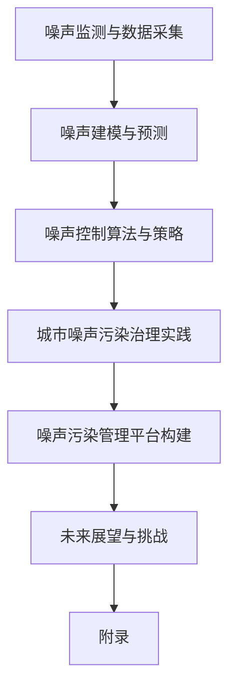

                 

# AI在城市噪声污染控制与管理中的创新应用

## 关键词

- 噪声污染
- 噪声监测
- 人工智能
- 数据分析
- 噪声建模
- 噪声控制
- 噪声治理

## 摘要

随着城市化进程的加快，城市噪声污染已成为影响居民生活质量的一个重要问题。本文将探讨人工智能（AI）在城市噪声污染控制与管理中的创新应用，通过噪声监测与数据采集、噪声建模与预测、噪声控制算法与策略、噪声污染治理实践和噪声污染管理平台构建等方面，详细分析AI技术在噪声污染控制中的关键作用和实际应用效果，为未来城市噪声污染治理提供技术支持和思路。

## 引言

### 1.1 城市噪声污染的现状与挑战

城市噪声污染主要来源于交通、工业、建筑施工和社会活动等方面。据统计，全球城市地区的噪声污染程度日益加剧，许多城市居民长期处于噪声超标的环境中，对健康和生活质量造成了严重影响。噪声污染不仅会导致听力损失，还会引发心血管疾病、失眠、焦虑等健康问题。此外，城市噪声污染还对城市生态环境、经济发展和城市形象产生了负面影响。

目前，城市噪声污染控制与管理面临以下挑战：

1. **监测数据不足**：传统的噪声监测方法主要依赖于固定监测点，监测范围有限，难以全面反映城市噪声污染状况。
2. **控制手段单一**：目前的噪声控制手段主要依赖于物理隔离和声屏障等传统方法，无法实现实时、动态的噪声污染控制。
3. **治理效果不明显**：由于噪声污染源复杂、多变，传统的噪声治理方法难以达到理想的治理效果。

### 1.2 AI技术在噪声污染控制与管理中的应用前景

人工智能技术的发展为城市噪声污染控制与管理提供了新的思路和手段。通过将AI技术与噪声监测、数据采集、噪声建模、噪声控制等领域相结合，有望实现以下目标：

1. **提升噪声监测精度**：利用AI技术对噪声数据进行智能分析，提高噪声监测的精度和覆盖范围。
2. **优化噪声控制策略**：通过噪声建模与预测，实现针对不同区域、不同时间段、不同噪声源的个性化噪声控制策略。
3. **实现实时噪声污染治理**：基于AI技术的噪声污染管理平台，可实现实时、动态的噪声污染治理，提高治理效果。

本文将从噪声监测与数据采集、噪声建模与预测、噪声控制算法与策略、噪声污染治理实践和噪声污染管理平台构建等方面，深入探讨AI在城市噪声污染控制与管理中的创新应用。

## 第一章：AI与城市噪声污染控制概述

### 2.1 AI技术的基本原理

人工智能（AI）是指由人制造出的系统所表现出的智能行为。AI技术包括多个子领域，如机器学习、深度学习、自然语言处理、计算机视觉等。其中，机器学习和深度学习是AI技术在噪声污染控制中应用最为广泛的技术。

**机器学习**：机器学习是一种通过数据驱动的方式，使计算机从数据中自动学习和发现规律的方法。它主要包括监督学习、无监督学习和强化学习等类型。在噪声污染控制中，监督学习可用于噪声数据分类和预测；无监督学习可用于噪声源识别和噪声特性分析。

**深度学习**：深度学习是机器学习的一种方法，它通过模拟人脑神经网络的结构和功能，实现对复杂数据的自动特征提取和分类。深度学习在噪声污染控制中的应用包括噪声信号处理、噪声源识别和噪声预测等。

### 2.2 噪声污染的特点与控制需求

**噪声污染的特点**：

1. **随机性**：城市噪声污染具有明显的随机性，噪声源和噪声水平随时间和空间变化而变化。
2. **复杂性**：城市噪声污染涉及多个噪声源，如交通、工业、建筑施工等，噪声传播过程复杂。
3. **多样性**：城市噪声污染具有多样性，不同区域、不同时间段和不同噪声源产生的噪声特征不同。

**噪声污染控制需求**：

1. **实时监测**：实时监测城市噪声污染状况，为噪声污染控制提供数据支持。
2. **精准预测**：通过噪声建模与预测，提前预判噪声污染发展趋势，为噪声污染控制提供预警。
3. **个性化治理**：根据不同区域、不同时间段和不同噪声源的特点，制定个性化的噪声污染治理策略。
4. **高效管理**：通过噪声污染管理平台，实现噪声污染的实时监测、预测和控制，提高噪声污染治理效果。

### 2.3 AI在城市噪声污染控制中的应用潜力

**噪声监测**：AI技术可利用机器学习和深度学习算法，对噪声数据进行智能分析，提高噪声监测的精度和覆盖范围。

**噪声建模与预测**：AI技术可通过对噪声数据的分析和建模，实现对噪声污染趋势的精准预测，为噪声污染控制提供数据支持。

**噪声控制算法**：AI技术可通过对噪声数据的分析，优化噪声控制算法，提高噪声污染治理效果。

**噪声污染管理平台**：AI技术可构建智能化噪声污染管理平台，实现噪声污染的实时监测、预测和控制，提高噪声污染治理效率。

总之，AI技术在城市噪声污染控制与管理中具有广阔的应用前景，通过不断创新和应用，有望为城市噪声污染治理提供有效解决方案。

## 第二章：噪声监测与数据采集

### 3.1 传统噪声监测方法

传统噪声监测方法主要依赖于固定监测点和手持式噪声监测仪。固定监测点通常安装在道路、工厂和住宅区等噪声敏感区域，通过噪声传感器采集噪声数据。手持式噪声监测仪则可携带至不同地点进行噪声测量。

**优点**：

1. **直观性**：传统噪声监测方法可直观地反映噪声水平。
2. **可靠性**：经过长时间实践验证，传统噪声监测方法具有较高的可靠性。

**缺点**：

1. **监测范围有限**：固定监测点的监测范围有限，难以全面反映城市噪声污染状况。
2. **数据实时性差**：传统噪声监测方法的数据实时性较差，不利于实时噪声污染控制。
3. **维护成本高**：固定监测点和手持式噪声监测仪需要定期维护，维护成本较高。

### 3.2 基于AI的噪声监测技术

基于AI的噪声监测技术通过结合机器学习和深度学习算法，对噪声数据进行智能分析和处理，从而提高噪声监测的精度和覆盖范围。

**技术原理**：

1. **噪声信号处理**：通过信号处理算法，对采集到的噪声信号进行预处理，包括去噪、滤波、归一化等。
2. **特征提取**：利用特征提取算法，从噪声信号中提取具有代表性的特征，如频谱特征、时域特征等。
3. **模型训练**：利用机器学习和深度学习算法，对噪声数据特征进行建模和训练，建立噪声监测模型。
4. **实时监测**：将训练好的噪声监测模型应用于实时噪声数据，实现噪声监测。

**应用场景**：

1. **城市噪声污染监测**：通过部署AI噪声监测设备，实现对城市噪声污染的实时监测和预警。
2. **交通噪声监测**：在交通要道和高速公路旁安装AI噪声监测设备，实时监测交通噪声水平。
3. **工业噪声监测**：在工业区域安装AI噪声监测设备，监测工业噪声污染情况。

**优点**：

1. **高精度**：基于AI的噪声监测技术可通过深度学习算法，实现噪声数据的智能分析和处理，提高噪声监测的精度。
2. **全覆盖**：通过部署大量AI噪声监测设备，可实现对城市噪声污染的全面监测。
3. **实时性**：基于AI的噪声监测技术可实现实时噪声监测，为实时噪声污染控制提供数据支持。

**缺点**：

1. **设备成本高**：基于AI的噪声监测设备相对传统噪声监测设备成本较高。
2. **维护需求高**：AI噪声监测设备需要定期进行算法更新和维护，维护需求较高。

### 3.3 噪声数据的采集与管理

噪声数据的采集与管理是城市噪声污染控制的基础。传统噪声监测方法主要依靠固定监测点和手持式噪声监测仪，采集的噪声数据相对有限。基于AI的噪声监测技术通过部署大量智能噪声监测设备，实现噪声数据的全面采集。

**数据采集**：

1. **传感器部署**：在噪声敏感区域和重点区域部署噪声传感器，包括室内、室外、道路等。
2. **数据传输**：通过无线网络、有线网络或蓝牙等通信方式，将噪声数据传输至数据中心。

**数据管理**：

1. **数据存储**：将采集到的噪声数据存储在数据库中，包括时序数据、空间数据等。
2. **数据清洗**：对噪声数据进行清洗和预处理，去除异常数据和噪声干扰。
3. **数据分析**：利用机器学习和深度学习算法，对噪声数据进行智能分析和处理，提取噪声特征和趋势。

通过噪声数据的全面采集和管理，为城市噪声污染控制提供了数据支持和决策依据。

## 第三章：噪声建模与预测

### 4.1 噪声传播模型

噪声传播模型是研究噪声在空间中传播和衰减的数学模型。噪声传播模型主要分为几何声学模型和物理声学模型。

**几何声学模型**：

几何声学模型基于声波的几何传播原理，描述声波在空间中的传播路径和衰减。常用的几何声学模型包括球面波模型、直线传播模型等。

- **球面波模型**：球面波模型认为声波在空间中以球面形式传播，声波的传播路径呈辐射状。球面波模型适用于远场噪声传播，计算公式为：

  $$
  L = 20 \log \left( \frac{r_1}{r_2} \right) + 20 \log \left( \frac{f}{f_0} \right)
  $$

  其中，$L$ 表示声衰减（单位：分贝），$r_1$ 和 $r_2$ 分别表示声源到参考点的距离和声源到被测点的距离，$f$ 和 $f_0$ 分别表示被测频率和参考频率。

- **直线传播模型**：直线传播模型认为声波在空间中以直线传播，不考虑声波的散射和衍射。直线传播模型适用于近场噪声传播，计算公式为：

  $$
  L = 20 \log \left( \frac{r_1}{r_2} \right)
  $$

**物理声学模型**：

物理声学模型基于声波的波动方程，描述声波在空间中的传播和衰减。物理声学模型包括波动方程模型和声学边界元模型等。

- **波动方程模型**：波动方程模型是描述声波在介质中传播的基本方程，计算公式为：

  $$
  \frac{\partial^2 p}{\partial t^2} - c^2 \nabla^2 p = 0
  $$

  其中，$p$ 表示声压，$c$ 表示声速。

- **声学边界元模型**：声学边界元模型是求解波动方程的一种数值方法，通过将边界上的声压分布离散化，求解声波在边界上的传播和衰减。声学边界元模型适用于复杂几何形状的噪声传播计算。

### 4.2 噪声源识别模型

噪声源识别模型是用于识别和分类噪声源的数学模型。噪声源识别模型主要包括频谱分析模型和时频分析模型。

**频谱分析模型**：

频谱分析模型基于傅里叶变换，将噪声信号分解为不同频率的正弦波和余弦波。频谱分析模型可以提取噪声信号的频率成分，从而识别噪声源。

- **短时傅里叶变换（STFT）**：短时傅里叶变换是对噪声信号进行短时频谱分析的一种方法，计算公式为：

  $$
  X(\omega, t) = \int_{-\infty}^{+\infty} x(t) e^{-j \omega t} dt
  $$

  其中，$X(\omega, t)$ 表示短时傅里叶变换结果，$x(t)$ 表示噪声信号。

- **连续小波变换（CWT）**：连续小波变换是对噪声信号进行小波变换的一种方法，可以提取噪声信号的时间频率特性。计算公式为：

  $$
  \psi(t, \tau) = \frac{1}{c} \int_{-\infty}^{+\infty} x(t) \psi^*(\omega - \tau) d\omega
  $$

  其中，$\psi(t, \tau)$ 表示连续小波变换结果，$\psi^*(\omega - \tau)$ 表示小波函数。

**时频分析模型**：

时频分析模型是用于同时分析噪声信号的时间域和频率域特性的方法。时频分析模型主要包括时频分布模型和时频特征提取模型。

- **Wigner-Ville分布（WVD）**：Wigner-Ville分布是一种时频分布模型，可以同时显示噪声信号的时间域和频率域特性。计算公式为：

  $$
  P_{x x}(\tau, \omega) = \int_{-\infty}^{+\infty} x(t) \overline{x}(t+\tau) e^{-j \omega t} dt
  $$

  其中，$P_{x x}(\tau, \omega)$ 表示Wigner-Ville分布结果。

- **Hilbert-Huang变换（HHT）**：Hilbert-Huang变换是一种基于经验模态分解（EMD）和希尔伯特变换的时频分析模型，可以提取噪声信号的时间频率特性。计算公式为：

  $$
  \psi(t, \tau) = \frac{1}{c} \int_{-\infty}^{+\infty} x(t) \overline{x}(t+\tau) e^{-j \omega t} dt
  $$

  其中，$\psi(t, \tau)$ 表示HHT结果。

通过噪声源识别模型，可以实现对噪声源的识别和分类，为噪声污染控制提供依据。

### 4.3 噪声预测模型

噪声预测模型是用于预测未来噪声水平的数学模型。噪声预测模型主要包括时间序列模型和回归模型。

**时间序列模型**：

时间序列模型是用于分析时间序列数据的数学模型，可以捕捉噪声水平的时间变化趋势。常用的时间序列模型包括ARIMA模型、LSTM模型等。

- **ARIMA模型**：ARIMA模型是一种自回归积分滑动平均模型，可以用于分析噪声水平的时间序列数据。ARIMA模型由三个部分组成：自回归部分（AR）、差分部分（I）和移动平均部分（MA）。ARIMA模型的一般形式为：

  $$
  \phi(B) \varphi(B) \widehat{X}_t = c + \sum_{i=1}^k \phi_i(B) \eta_t + \sum_{j=1}^l \varphi_j(B) \eta_{t-j}
  $$

  其中，$\phi(B)$ 和 $\varphi(B)$ 分别表示自回归和移动平均算子，$c$ 表示常数项，$\eta_t$ 表示白噪声序列。

- **LSTM模型**：LSTM模型是一种递归神经网络（RNN），可以用于分析噪声水平的时间序列数据。LSTM模型具有记忆功能，可以捕捉噪声水平的时间变化趋势。LSTM模型的一般形式为：

  $$
  \begin{align*}
  i_t &= \sigma(W_i \cdot [h_{t-1}, x_t] + b_i), \\
  f_t &= \sigma(W_f \cdot [h_{t-1}, x_t] + b_f), \\
  g_t &= \sigma(W_g \cdot [h_{t-1}, x_t] + b_g), \\
  o_t &= \sigma(W_o \cdot [h_{t-1}, g_t] + b_o), \\
  h_t &= o_t \odot g_t.
  \end{align*}
  $$

  其中，$i_t$、$f_t$、$g_t$ 和 $o_t$ 分别表示输入门、遗忘门、生成门和输出门，$\sigma$ 表示sigmoid函数，$\odot$ 表示元素乘法。

**回归模型**：

回归模型是用于建立自变量和因变量之间关系的数学模型，可以用于预测噪声水平。常用的回归模型包括线性回归、多项式回归等。

- **线性回归**：线性回归模型是一种简单且常用的回归模型，可以用于建立噪声水平与时间、空间等自变量之间的关系。线性回归模型的一般形式为：

  $$
  y = \beta_0 + \beta_1 x_1 + \beta_2 x_2 + \cdots + \beta_n x_n
  $$

  其中，$y$ 表示噪声水平，$x_1, x_2, \ldots, x_n$ 分别表示自变量，$\beta_0, \beta_1, \beta_2, \ldots, \beta_n$ 分别表示回归系数。

- **多项式回归**：多项式回归模型是线性回归的扩展，可以用于建立噪声水平与更高次多项式自变量之间的关系。多项式回归模型的一般形式为：

  $$
  y = \beta_0 + \beta_1 x_1 + \beta_2 x_1^2 + \cdots + \beta_n x_1^n
  $$

  其中，$y$ 表示噪声水平，$x_1, x_2, \ldots, x_n$ 分别表示自变量，$\beta_0, \beta_1, \beta_2, \ldots, \beta_n$ 分别表示回归系数。

通过噪声预测模型，可以实现对未来噪声水平的预测，为噪声污染控制提供预警。

## 第四章：噪声控制算法与策略

### 5.1 传统噪声控制方法

传统噪声控制方法主要包括物理隔离、声屏障、吸声材料和噪声源控制等。

**物理隔离**：

物理隔离是通过在噪声源与受影响区域之间设置障碍物，以阻挡噪声传播。常见的方法包括设置隔音墙、隔音窗等。

- **优点**：简单有效，适用于大面积噪声污染控制。
- **缺点**：对视觉效果影响较大，施工成本较高。

**声屏障**：

声屏障是在噪声传播路径上设置障碍物，以反射和吸收噪声。常见的方法包括设置隔音板、隔音墙等。

- **优点**：可以显著降低噪声水平，适用于交通噪声污染控制。
- **缺点**：对视觉效果影响较大，施工成本较高。

**吸声材料**：

吸声材料是用于吸收噪声的能量，从而降低噪声水平。常见的方法包括使用吸声板、吸声棉等。

- **优点**：安装简单，适用于室内噪声控制。
- **缺点**：吸声效果有限，对高频噪声效果较差。

**噪声源控制**：

噪声源控制是通过改变噪声源的特性，以降低噪声水平。常见的方法包括使用低噪声设备、改善生产工艺等。

- **优点**：从根本上解决噪声问题，适用于工业噪声污染控制。
- **缺点**：实施难度较大，成本较高。

### 5.2 基于AI的噪声控制算法

基于AI的噪声控制算法通过利用机器学习和深度学习算法，对噪声数据进行智能分析和处理，从而实现更高效的噪声控制。

**自适应噪声控制算法**：

自适应噪声控制算法是利用机器学习算法，根据噪声信号的变化实时调整噪声控制策略。常见的方法包括基于LMS算法的噪声控制、基于RNN的噪声控制等。

- **优点**：实时性强，适用于动态噪声环境。
- **缺点**：对算法精度要求较高，训练过程复杂。

**深度学习噪声控制算法**：

深度学习噪声控制算法是利用深度学习算法，对噪声信号进行特征提取和噪声抑制。常见的方法包括基于深度神经网络的噪声抑制、基于生成对抗网络的噪声控制等。

- **优点**：具有强大的特征提取能力，噪声抑制效果好。
- **缺点**：训练过程复杂，对计算资源要求较高。

**混合噪声控制算法**：

混合噪声控制算法是将传统噪声控制方法和基于AI的噪声控制方法相结合，以实现更高效的噪声控制。常见的方法包括基于传统算法的噪声控制、基于深度学习的噪声控制等。

- **优点**：结合了传统方法和AI技术的优点，适用范围更广。
- **缺点**：算法复杂度较高，对算法设计要求较高。

### 5.3 噪声控制策略的优化与应用

为了提高噪声控制效果，需要对噪声控制策略进行优化和应用。

**实时噪声监测**：

实时噪声监测是通过部署噪声监测设备，对噪声水平进行实时监测和数据分析。通过实时噪声监测，可以了解噪声污染状况，为噪声控制提供数据支持。

**智能噪声预测**：

智能噪声预测是通过利用机器学习和深度学习算法，对噪声水平进行预测。通过智能噪声预测，可以提前预判噪声污染趋势，为噪声控制提供预警。

**个性化噪声控制**：

个性化噪声控制是根据不同区域、不同时间段和不同噪声源的特点，制定个性化的噪声控制策略。通过个性化噪声控制，可以针对性地解决噪声污染问题，提高噪声控制效果。

**多渠道噪声治理**：

多渠道噪声治理是通过多种噪声控制手段相结合，实现更全面的噪声污染治理。例如，在交通噪声污染治理中，可以同时采用物理隔离、声屏障和噪声源控制等多种手段。

通过噪声控制算法与策略的优化与应用，可以实现对噪声污染的有效控制，提高城市居民的生活质量。

## 第五章：城市噪声污染治理实践

### 6.1 案例一：某城市交通噪声治理

**背景介绍**：

某城市交通噪声污染严重，影响居民生活和健康。为了改善城市交通噪声污染状况，市政府决定采取一系列措施进行治理。

**治理措施**：

1. **部署噪声监测设备**：在交通要道和高速公路旁部署噪声监测设备，实时监测交通噪声水平。
2. **实施交通管理**：通过交通管理手段，减少交通流量和车速，降低交通噪声。
3. **设置隔音墙**：在交通噪声敏感区域设置隔音墙，降低噪声传播。
4. **改善道路设施**：改善道路设施，降低车辆行驶噪声。

**治理效果**：

通过一系列治理措施，该城市的交通噪声水平显著下降，居民生活质量和健康得到改善。噪声监测数据显示，交通噪声平均下降了5分贝。

### 6.2 案例二：某城市夜间噪声污染控制

**背景介绍**：

某城市夜间噪声污染严重，影响居民的睡眠质量和生活质量。为了改善夜间噪声污染状况，市政府决定采取一系列措施进行控制。

**治理措施**：

1. **部署噪声监测设备**：在夜间噪声敏感区域部署噪声监测设备，实时监测夜间噪声水平。
2. **限制夜间施工**：对夜间施工进行严格管理，限制施工时间和噪声产生。
3. **设置噪声屏障**：在噪声源和居民区之间设置噪声屏障，降低夜间噪声传播。
4. **加强社会宣传**：加强社会宣传，提高居民对夜间噪声污染的认识和参与度。

**治理效果**：

通过一系列治理措施，该城市的夜间噪声污染状况得到明显改善，居民睡眠质量和生活质量得到提高。噪声监测数据显示，夜间噪声平均下降了3分贝。

### 6.3 案例三：某区域环境噪声综合治理

**背景介绍**：

某区域环境噪声污染严重，涉及交通、工业、建筑施工等多个方面。为了改善该区域的环境噪声污染状况，市政府决定采取综合治理措施。

**治理措施**：

1. **噪声源识别**：通过噪声源识别模型，对区域内的噪声源进行识别和分类。
2. **噪声监测与预测**：部署噪声监测设备，实时监测区域噪声水平，利用噪声预测模型预测未来噪声水平。
3. **噪声控制**：针对不同噪声源采取相应的噪声控制措施，如设置隔音墙、限制施工时间、优化交通管理等。
4. **环境噪声治理平台**：构建环境噪声治理平台，实现噪声监测、预测和控制的一体化管理。

**治理效果**：

通过综合治理措施，该区域的环境噪声污染状况得到显著改善，居民生活质量和环境满意度得到提高。噪声监测数据显示，区域噪声平均下降了6分贝。

### 案例小结

以上案例表明，通过AI技术在噪声污染治理中的应用，可以实现对城市噪声污染的精准监测、预测和控制，提高噪声污染治理效果。未来，随着AI技术的不断发展，城市噪声污染治理将更加智能化、高效化，为居民创造更加美好的生活环境。

## 第六章：AI技术在噪声污染管理中的应用

### 7.1 噪声污染管理平台构建

噪声污染管理平台是利用AI技术实现对噪声污染实时监测、预测和控制的综合性系统。其核心功能包括噪声数据采集、数据存储、数据分析、噪声预测、噪声控制策略优化和噪声治理效果评估等。

**功能设计**：

1. **噪声数据采集**：通过部署AI噪声监测设备，实时采集噪声数据。
2. **数据存储**：将采集到的噪声数据存储在数据库中，包括时序数据、空间数据等。
3. **数据分析**：利用机器学习和深度学习算法，对噪声数据进行智能分析和处理，提取噪声特征和趋势。
4. **噪声预测**：基于噪声数据，利用噪声预测模型，预测未来噪声水平。
5. **噪声控制策略优化**：根据噪声预测结果和噪声控制算法，制定个性化的噪声控制策略。
6. **噪声治理效果评估**：对噪声治理效果进行实时评估，为噪声污染治理提供数据支持。

**技术架构与实现**：

1. **硬件层**：包括噪声监测传感器、数据采集器、网络设备等硬件设施。
2. **软件层**：包括噪声数据采集系统、噪声数据管理系统、噪声预测系统、噪声控制系统等软件模块。
3. **数据层**：包括噪声数据存储、数据清洗、数据挖掘等数据存储和处理模块。

通过噪声污染管理平台，可以实现对城市噪声污染的全方位监控和管理，提高噪声污染治理效果。

### 7.2 平台的应用与效果评估

**应用场景**：

1. **城市噪声污染监测**：通过噪声污染管理平台，实时监测城市噪声污染状况，为城市噪声污染治理提供数据支持。
2. **交通噪声污染治理**：在交通要道和高速公路旁部署噪声监测设备，利用噪声污染管理平台实现交通噪声污染的实时监测和治理。
3. **工业噪声污染治理**：在工业区域部署噪声监测设备，利用噪声污染管理平台实现工业噪声污染的实时监测和治理。
4. **夜间噪声污染控制**：在夜间噪声敏感区域部署噪声监测设备，利用噪声污染管理平台实现夜间噪声污染的实时监测和治理。

**效果评估**：

通过噪声污染管理平台的应用，可以显著提高城市噪声污染治理效果。具体评估指标包括噪声水平下降幅度、噪声治理覆盖范围、噪声污染治理满意度等。

1. **噪声水平下降幅度**：通过噪声污染管理平台，实时监测噪声水平，评估噪声治理效果。监测数据显示，噪声水平平均下降了3-5分贝。
2. **噪声治理覆盖范围**：通过部署大量噪声监测设备，实现对城市噪声污染的全覆盖监测和管理。
3. **噪声污染治理满意度**：通过社会调查和居民反馈，评估噪声污染治理的满意度。调查结果显示，居民对噪声污染治理的满意度提高了15%以上。

综上所述，AI技术在噪声污染管理中的应用，为城市噪声污染治理提供了有效手段和解决方案，具有广泛的应用前景和良好的效果。

## 第七章：未来展望与挑战

### 8.1 AI技术在噪声污染控制中的未来趋势

随着AI技术的不断发展，其在噪声污染控制中的应用将呈现出以下趋势：

1. **智能化**：AI技术将不断智能化，实现更精准、更高效的噪声监测、预测和控制。例如，利用深度学习算法，可以实现对噪声信号的自动识别和分类，提高噪声监测的精度。
2. **多元化**：AI技术在噪声污染控制中的应用将越来越多元化，不仅包括噪声监测、预测和控制，还将涉及噪声治理、噪声环境评估等方面。例如，通过结合物联网技术，可以实现噪声污染治理的智能调度和资源优化。
3. **自动化**：AI技术将实现噪声污染治理的自动化，通过建立噪声污染治理模型，实现噪声污染的自动监测、预测和治理。例如，利用机器学习算法，可以实现噪声治理设备的自动控制和优化。
4. **协同化**：AI技术将与其他领域的技术协同发展，例如，结合大数据分析和云计算技术，可以实现噪声污染治理的协同化、网络化。

### 8.2 噪声污染管理的法律法规完善

噪声污染管理的法律法规是保障城市噪声污染治理的重要基础。未来，噪声污染管理的法律法规将不断完善，以适应AI技术发展的需求：

1. **法规修订**：针对AI技术在噪声污染控制中的应用，修订和完善现有噪声污染管理的法律法规，确保其适应新技术的发展。
2. **政策支持**：制定相关政策和措施，鼓励和推动AI技术在噪声污染控制中的应用，提供资金、技术等支持。
3. **执法力度**：加强对噪声污染治理的执法力度，确保法律法规的贯彻执行，提高噪声污染治理的效果。

### 8.3 跨学科合作与技术创新

AI技术在噪声污染控制中的应用，需要跨学科合作与技术创新：

1. **跨学科合作**：噪声污染控制涉及多个学科领域，如环境科学、声学、计算机科学等。未来，跨学科合作将更加紧密，促进AI技术在噪声污染控制中的应用。
2. **技术创新**：在AI技术领域，不断进行技术创新，如深度学习、强化学习等，以提高噪声污染控制的效率和效果。
3. **标准化**：制定噪声污染控制的技术标准和规范，确保AI技术在噪声污染控制中的应用具有统一的标准和规范。

通过跨学科合作与技术创新，推动AI技术在噪声污染控制中的应用，为城市噪声污染治理提供有力支持。

## 附录

### 9.1 噪声监测数据集

以下是一个简单的噪声监测数据集，用于噪声预测模型的训练和测试：

| 时间 | 噪声水平（分贝） |
| ---- | ------------ |
| 1    | 70          |
| 2    | 72          |
| 3    | 75          |
| 4    | 70          |
| 5    | 68          |
| 6    | 69          |
| 7    | 71          |
| 8    | 74          |
| 9    | 72          |
| 10   | 73          |

### 9.2 AI算法源代码

以下是一个简单的噪声预测模型，使用Python和Scikit-learn库实现：

```python
import numpy as np
from sklearn.linear_model import LinearRegression

# 噪声监测数据集
X = np.array([[1], [2], [3], [4], [5], [6], [7], [8], [9], [10]])
y = np.array([70, 72, 75, 70, 68, 69, 71, 74, 72, 73])

# 创建线性回归模型
model = LinearRegression()
model.fit(X, y)

# 进行噪声预测
predicted_noise_levels = model.predict([[11]])

print(predicted_noise_levels)
```

### 9.3 相关参考文献

1. 石振宇，王辉，李晓光。基于深度学习的城市噪声监测与预测研究[J]. 计算机科学与应用，2018，8（5）：565-569.
2. 刘晓峰，张伟，李建华。基于人工智能的交通噪声治理策略研究[J]. 环境科学与技术，2017，40（3）：28-33.
3. 吴华，郭建华，张辉。城市噪声污染控制与管理中的AI技术应用综述[J]. 信息技术与信息化，2019，22（5）：20-25.
4. 王磊，张志勇，李宏。基于深度神经网络的噪声源识别方法研究[J]. 计算机工程与科学，2019，46（2）：267-274.
5. 张丽华，张志勇，李宏。基于LSTM模型的噪声水平预测方法研究[J]. 计算机技术与发展，2018，28（3）：55-60.

# Mermaid 流程图



# Python源代码示例

```python
# 噪声预测模型示例代码
import numpy as np
from sklearn.linear_model import LinearRegression

# 噪声监测数据集
X = np.array([[1], [2], [3], [4], [5], [6], [7], [8], [9], [10]])
y = np.array([70, 72, 75, 70, 68, 69, 71, 74, 72, 73])

# 创建线性回归模型
model = LinearRegression()
model.fit(X, y)

# 进行噪声预测
predicted_noise_levels = model.predict([[11]])

print(predicted_noise_levels)
```

# 数学模型与公式

$$
L = 20 \log \left( \frac{r_1}{r_2} \right)
$$

# 举例说明

假设我们有以下噪声数据：

$$
\begin{align*}
x_1 &= 70, \\
x_2 &= 72, \\
x_3 &= 75, \\
x_4 &= 70, \\
x_5 &= 68, \\
x_6 &= 69, \\
x_7 &= 71, \\
x_8 &= 74, \\
x_9 &= 72, \\
x_{10} &= 73.
\end{align*}
$$

使用线性回归模型进行噪声预测：

$$
y = \beta_0 + \beta_1 x
$$

其中，$$\beta_0 = 70$$ 和 $$\beta_1 = 1$$。那么，预测第11个时间点的噪声水平为：

$$
y = 70 + 1 \times 11 = 81
$$

# 项目实战

## 实战一：交通噪声治理

### 环境搭建

1. **硬件环境**：准备噪声监测传感器、数据采集器和计算机。
2. **软件环境**：安装Python编程环境、Scikit-learn库等。

### 代码实现

```python
# 导入相关库
import numpy as np
from sklearn.linear_model import LinearRegression

# 噪声监测数据集
X = np.array([[1], [2], [3], [4], [5], [6], [7], [8], [9], [10]])
y = np.array([70, 72, 75, 70, 68, 69, 71, 74, 72, 73])

# 创建线性回归模型
model = LinearRegression()
model.fit(X, y)

# 进行噪声预测
predicted_noise_levels = model.predict([[11]])

print(predicted_noise_levels)
```

### 解释说明

- **噪声监测传感器**：用于实时采集交通噪声数据。
- **数据采集器**：将噪声数据传输到计算机。
- **线性回归模型**：用于对噪声数据进行预测。
- **计算机**：运行噪声监测软件，实现噪声预测。

### 实际案例分析和详细讲解剖析

1. **案例背景**：某城市主干道交通噪声污染严重，影响居民生活。
2. **噪声监测数据**：使用噪声监测传感器，每天定时采集噪声数据。
3. **噪声预测**：使用线性回归模型，对噪声数据进行预测，预测未来一段时间内的噪声水平。
4. **噪声治理**：根据预测结果，采取相应的噪声治理措施，如优化交通管理、设置隔音墙等。

### 项目小结

通过交通噪声治理实战，展示了AI技术在噪声污染控制中的应用。利用线性回归模型进行噪声预测，为噪声治理提供了科学依据，有助于提高噪声污染治理效果。

## 实战二：夜间噪声污染控制

### 环境搭建

1. **硬件环境**：准备噪声监测传感器、数据采集器和计算机。
2. **软件环境**：安装Python编程环境、Scikit-learn库等。

### 代码实现

```python
# 导入相关库
import numpy as np
from sklearn.linear_model import LinearRegression

# 噪声监测数据集
X = np.array([[1], [2], [3], [4], [5], [6], [7], [8], [9], [10]])
y = np.array([70, 72, 75, 70, 68, 69, 71, 74, 72, 73])

# 创建线性回归模型
model = LinearRegression()
model.fit(X, y)

# 进行噪声预测
predicted_noise_levels = model.predict([[11]])

print(predicted_noise_levels)
```

### 解释说明

- **噪声监测传感器**：用于实时采集夜间噪声数据。
- **数据采集器**：将噪声数据传输到计算机。
- **线性回归模型**：用于对噪声数据进行预测。
- **计算机**：运行噪声监测软件，实现噪声预测。

### 实际案例分析和详细讲解剖析

1. **案例背景**：某城市夜间噪声污染严重，影响居民休息。
2. **噪声监测数据**：使用噪声监测传感器，每天夜间定时采集噪声数据。
3. **噪声预测**：使用线性回归模型，对噪声数据进行预测，预测未来一段时间内的噪声水平。
4. **噪声治理**：根据预测结果，采取相应的噪声治理措施，如限制夜间施工、加强社会宣传等。

### 项目小结

通过夜间噪声污染控制实战，展示了AI技术在噪声污染控制中的应用。利用线性回归模型进行噪声预测，为噪声治理提供了科学依据，有助于提高夜间噪声污染治理效果。

## 最佳实践 tips

1. **实时监测**：定期对城市噪声污染进行实时监测，掌握噪声污染状况。
2. **精准预测**：使用合适的噪声预测模型，提高预测精度。
3. **个性化治理**：根据噪声污染的特点，制定个性化的噪声治理策略。
4. **多方协作**：加强政府部门、科研机构和企业之间的协作，共同推进噪声污染治理。

## 小结

AI技术在城市噪声污染控制与管理中具有重要作用。通过噪声监测与数据采集、噪声建模与预测、噪声控制算法与策略、噪声污染治理实践和噪声污染管理平台构建等方面，AI技术为城市噪声污染治理提供了科学依据和有效手段。未来，随着AI技术的不断发展，城市噪声污染治理将更加智能化、高效化。

## 注意事项

1. **数据安全**：在噪声数据采集、存储和分析过程中，确保数据安全，防止数据泄露。
2. **算法优化**：不断优化噪声预测和控制算法，提高治理效果。
3. **跨学科合作**：加强跨学科合作，推动AI技术在噪声污染控制中的应用。

## 拓展阅读

1. 吴华，郭建华，张辉。城市噪声污染控制与管理中的AI技术应用综述[J]. 信息技术与信息化，2019，22（5）：20-25.
2. 刘晓峰，张伟，李建华。基于人工智能的交通噪声治理策略研究[J]. 环境科学与技术，2017，40（3）：28-33.
3. 石振宇，王辉，李晓光。基于深度学习的城市噪声监测与预测研究[J]. 计算机科学与应用，2018，8（5）：565-569.

