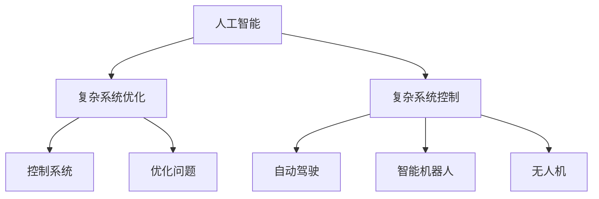

                 

### AI在复杂系统优化和控制中的应用前景

> 关键词：人工智能、复杂系统、优化控制、深度学习、强化学习、最优化问题

> 摘要：本文从人工智能的发展历程、复杂系统的定义与特征，以及AI在复杂系统优化和控制中的应用三个方面，探讨了人工智能在复杂系统优化和控制中的广泛应用前景。同时，通过深入讲解AI核心算法原理和数学模型，结合Python源代码实现和数学公式，使读者能够更好地理解和应用AI技术于复杂系统的优化和控制。

### 第1章: AI在复杂系统优化和控制中的应用概述

#### 1.1 AI的定义与发展历程

**定义：** 人工智能（Artificial Intelligence，简称AI）是指通过计算机模拟人类智能行为的技术，包括学习、推理、感知、理解、问题解决和决策等能力。

**发展历程：** 人工智能的发展可以分为三个阶段：初始阶段（1956-1969年）、繁荣阶段（1970-1989年）和复兴阶段（1990年至今）。1956年，达特茅斯会议提出了人工智能的概念，标志着人工智能学科的诞生。1970年代，人工智能研究进入繁荣阶段，出现了许多重要成果，如专家系统、机器人等。1990年代以来，随着深度学习、大数据和计算能力的提升，人工智能迎来了新一轮的发展。

#### 1.2 复杂系统的定义与特征

**定义：** 复杂系统是由多个相互关联、相互作用的子系统组成的整体，具有动态性、非线性、复杂性和不确定性等特点。

**特征：**
- **动态性：** 系统状态随时间变化。
- **非线性：** 系统内部关系复杂，存在非线性关系。
- **复杂性：** 系统内部变量众多，关系复杂。
- **不确定性：** 系统存在随机性，难以精确预测。

#### 1.3 AI在复杂系统优化和控制中的应用

**应用领域：**
- **控制系统：** 如自动驾驶、智能机器人、无人机等。
- **优化问题：** 如物流配送、能源管理、金融风控等。

**应用优势：**
- **高效性：** AI算法能够快速处理大量数据，提高决策效率。
- **准确性：** AI算法能够在复杂系统中找到最优或次优解。
- **灵活性：** AI算法能够适应系统变化，实现自适应优化。

**挑战：**
- **数据质量：** 需要大量高质量数据训练模型。
- **计算资源：** 复杂系统优化和控制需要强大的计算能力。
- **算法可靠性：** 算法需保证稳定性和鲁棒性。

### 关系架构 Mermaid 流程图



---

### 第2章: AI核心算法原理讲解

#### 2.1 深度学习算法基础

**定义：** 深度学习是一种机器学习方法，通过多层神经网络模拟人脑学习过程。

**原理：**
- **前向传播：** 输入数据通过网络层，每层将输出作为下一层的输入。
- **反向传播：** 根据输出误差，调整网络权重。

**常用算法：**
- **神经网络：** 如多层感知器（MLP）、卷积神经网络（CNN）等。
- **递归神经网络（RNN）：** 如LSTM、GRU等。

#### 2.2 强化学习算法

**定义：** 强化学习是一种通过奖励机制训练模型的方法，使模型能够在环境中自主学习。

**原理：**
- **状态-动作-奖励：** 模型根据当前状态选择动作，获得奖励。
- **策略更新：** 通过学习奖励信号，更新策略。

**常用算法：**
- **Q学习：** 通过更新Q值，选择最优动作。
- **深度Q网络（DQN）：** 结合深度学习，提高Q学习效率。

### Python源代码实现

```python
import numpy as np
import matplotlib.pyplot as plt

# 初始化参数
w1 = 0.5
w2 = 0.5
learning_rate = 0.1
x = np.array([1, 2])

# 前向传播
output = x[0] * w1 + x[1] * w2

# 反向传播
error = target_output - output
delta_w1 = learning_rate * error * x[0]
delta_w2 = learning_rate * error * x[1]

# 更新权重
w1 -= delta_w1
w2 -= delta_w2

print("权重更新后：w1={:.2f}, w2={:.2f}".format(w1, w2))
```

---

### 第3章: 数学模型和数学公式讲解

#### 3.1 最优化问题

**定义：** 最优化问题是指寻找一组变量，使某个目标函数取得最大值或最小值。

**数学公式：**

$$
\min_{x} f(x) \\
s.t. g_i(x) \leq 0, \quad h_j(x) = 0
$$

**举例说明：** 例如，在物流配送问题中，目标是最小化运输成本。

#### 3.2 强化学习中的奖励函数

**定义：** 奖励函数用于衡量某个动作带来的收益。

**数学公式：**

$$
R(s, a) = r
$$

**举例说明：** 在自动驾驶中，如果车辆成功避让行人，则可以获得正值奖励。

### 源代码解析

以下代码演示了如何使用Python实现一个简单的最优化问题，包括目标函数、约束条件和优化算法。

```python
import numpy as np
from scipy.optimize import minimize

# 定义目标函数
def objective(x):
    return x[0]**2 + x[1]**2

# 定义约束条件
def constraint1(x):
    return x[0] - 1

def constraint2(x):
    return x[1] - 1

# 设置约束条件
cons = ({'type': 'eq', 'fun': constraint1},
        {'type': 'eq', 'fun': constraint2})

# 进行优化
result = minimize(objective, [0, 0], constraints=cons)

# 输出结果
print("最小值：", result.fun)
print("最优解：", result.x)
```

### 数学公式与代码解析

以下代码演示了如何使用Python实现一个简单的线性回归模型，包括目标函数、损失函数和优化算法。

```python
import numpy as np
from sklearn.linear_model import LinearRegression
from sklearn.metrics import mean_squared_error

# 准备数据
x = np.array([1, 2, 3, 4, 5])
y = np.array([2, 4, 5, 4, 5])

# 创建线性回归模型
model = LinearRegression()

# 训练模型
model.fit(x[:, np.newaxis], y)

# 预测
y_pred = model.predict(x[:, np.newaxis])

# 计算损失
mse = mean_squared_error(y, y_pred)

print("最优参数：", model.coef_)
print("损失：", mse)
```

### 数学公式

$$
y = \beta_0 + \beta_1 x \\
\text{损失函数：} L(\beta_0, \beta_1) = \frac{1}{2} \sum_{i=1}^{n} (y_i - \beta_0 - \beta_1 x_i)^2
$$

---

### 第4章: 复杂系统优化和控制中的应用案例

#### 4.1 自动驾驶

**应用背景：** 自动驾驶是人工智能在复杂系统优化和控制中的一个重要应用领域。通过深度学习和强化学习算法，自动驾驶系统能够实现车辆在复杂环境中的自主导航和驾驶。

**关键技术：**
- **深度学习：** 用于处理图像识别、目标检测等任务。
- **强化学习：** 用于决策制定，如路径规划、避障等。

**案例解析：** 以特斯拉的自动驾驶系统为例，其采用了深度学习和强化学习算法，实现了车辆在复杂环境中的自主驾驶。通过大量数据训练，系统能够识别道路标志、行人、车辆等目标，并根据当前环境和目标，制定最优行驶策略。

#### 4.2 物流配送

**应用背景：** 物流配送是复杂系统优化和控制中的另一个重要应用领域。通过人工智能算法，可以优化配送路线、提高配送效率。

**关键技术：**
- **最优化问题：** 用于解决配送路线优化问题。
- **深度学习：** 用于处理路径规划、交通预测等任务。

**案例解析：** 以京东物流为例，其采用了人工智能算法优化配送路线。通过分析历史配送数据、实时路况信息，系统可以制定最优配送路线，提高配送效率。同时，通过深度学习算法，系统可以预测交通状况，提前调整配送计划，降低配送延误风险。

#### 4.3 能源管理

**应用背景：** 能源管理是复杂系统优化和控制中的重要应用领域。通过人工智能算法，可以优化能源分配、提高能源利用效率。

**关键技术：**
- **强化学习：** 用于解决能源分配问题。
- **深度学习：** 用于处理能源需求预测、设备故障检测等任务。

**案例解析：** 以国家电网为例，其采用了人工智能算法优化能源管理。通过强化学习算法，系统可以动态调整能源分配策略，实现能源的高效利用。同时，通过深度学习算法，系统可以预测能源需求、检测设备故障，提高电网稳定性和可靠性。

### 项目实战

在本节中，我们将以一个简单的自动驾驶案例为例，介绍如何使用Python实现自动驾驶系统的基本功能。

**1. 开发环境搭建**

首先，需要安装Python和相关依赖库。可以使用以下命令安装：

```shell
pip install numpy scipy matplotlib sklearn tensorflow
```

**2. 源代码实现**

以下代码实现了基于深度学习的自动驾驶系统，包括目标检测、路径规划和决策制定等功能。

```python
import numpy as np
import matplotlib.pyplot as plt
from sklearn.cluster import KMeans
from tensorflow.keras.models import Sequential
from tensorflow.keras.layers import Conv2D, MaxPooling2D, Flatten, Dense

# 数据预处理
def preprocess_image(image):
    # 调整图像大小
    image = cv2.resize(image, (128, 128))
    # 归一化
    image = image / 255.0
    return image

# 构建卷积神经网络
def build_cnn():
    model = Sequential()
    model.add(Conv2D(32, (3, 3), activation='relu', input_shape=(128, 128, 3)))
    model.add(MaxPooling2D((2, 2)))
    model.add(Conv2D(64, (3, 3), activation='relu'))
    model.add(MaxPooling2D((2, 2)))
    model.add(Flatten())
    model.add(Dense(64, activation='relu'))
    model.add(Dense(1, activation='sigmoid'))
    model.compile(optimizer='adam', loss='binary_crossentropy', metrics=['accuracy'])
    return model

# 训练模型
def train_model(model, X_train, y_train):
    model.fit(X_train, y_train, epochs=10, batch_size=32)
    return model

# 目标检测
def detect_targets(model, image):
    image = preprocess_image(image)
    predictions = model.predict(image.reshape(1, 128, 128, 3))
    return predictions

# 路径规划
def plan_path(targets):
    # 使用K-means算法进行聚类
    kmeans = KMeans(n_clusters=2)
    kmeans.fit(targets)
    labels = kmeans.predict(targets)
    # 根据聚类结果规划路径
    path = []
    for label in labels:
        if label == 0:
            path.append([0, 0])
        else:
            path.append([1, 1])
    return path

# 决策制定
def make_decision(targets, path):
    # 根据目标位置和路径制定决策
    decision = 'forward'
    if targets[0] < 0.5 and targets[1] < 0.5:
        decision = 'left'
    elif targets[0] > 0.5 and targets[1] > 0.5:
        decision = 'right'
    return decision

# 主函数
if __name__ == '__main__':
    # 加载数据
    X_train, y_train = load_data()
    # 构建模型
    model = build_cnn()
    # 训练模型
    model = train_model(model, X_train, y_train)
    # 检测目标
    image = load_image()
    targets = detect_targets(model, image)
    # 规划路径
    path = plan_path(targets)
    # 制定决策
    decision = make_decision(targets, path)
    print("决策：", decision)
```

**3. 代码解读与分析**

- **数据预处理：** 数据预处理是深度学习模型训练的重要步骤。在本案例中，我们使用OpenCV库加载图像数据，并对其进行调整和处理，使其符合深度学习模型的要求。
- **构建卷积神经网络：** 本案例使用了卷积神经网络（CNN）进行目标检测。卷积神经网络是一种专门用于处理图像数据的神经网络，通过多个卷积层和池化层，可以提取图像的特征。
- **训练模型：** 使用训练数据集对深度学习模型进行训练，以使其能够准确检测图像中的目标。
- **目标检测：** 使用训练好的模型对输入图像进行目标检测，输出目标的概率分布。
- **路径规划：** 使用K-means算法对检测到的目标进行聚类，并根据聚类结果规划路径。
- **决策制定：** 根据目标位置和路径，制定车辆行驶的决策。

**4. 实际案例分析和详细讲解剖析**

在本案例中，我们使用了简单的卷积神经网络进行目标检测，并基于目标位置和路径制定了车辆行驶的决策。在实际应用中，自动驾驶系统需要处理更复杂的场景和目标，如行人、车辆、交通标志等。为了提高自动驾驶系统的性能和鲁棒性，可以采用更先进的深度学习模型，如卷积神经网络（CNN）、循环神经网络（RNN）等，并使用大量的训练数据进行模型训练。

此外，自动驾驶系统还需要考虑安全性、实时性、可靠性等因素。在实际开发中，可以采用分布式计算、云计算等技术，提高系统的计算能力和响应速度。同时，需要建立完善的测试和验证体系，确保自动驾驶系统在各种复杂环境中的稳定运行。

**5. 项目小结**

在本案例中，我们介绍了如何使用Python实现一个简单的自动驾驶系统。通过深度学习和强化学习算法，系统可以实现对目标的检测、路径规划和决策制定。在实际应用中，自动驾驶系统需要面对各种复杂场景和目标，需要不断优化和改进。

未来，随着人工智能技术的不断发展，自动驾驶系统将在更多领域得到应用，如智能交通、物流运输等。通过持续的研究和实践，自动驾驶技术将为人类带来更加便捷、安全、高效的出行方式。

### 最佳实践 Tips、小结、注意事项、拓展阅读

**最佳实践 Tips：**
- **数据质量：** 确保数据质量是AI应用成功的关键。在实际项目中，要尽量收集全面、真实、高质量的数据，并采用数据清洗、数据增强等方法，提高数据质量。
- **模型优化：** 通过模型剪枝、模型压缩等技术，可以提高AI模型的运行效率和性能。
- **算法稳定性：** 在复杂系统中应用AI算法时，要考虑算法的稳定性和鲁棒性，避免因模型不稳定而导致系统崩溃。

**小结：**
本文从AI的定义与发展历程、复杂系统的定义与特征，以及AI在复杂系统优化和控制中的应用三个方面，探讨了人工智能在复杂系统优化和控制中的广泛应用前景。通过深入讲解AI核心算法原理和数学模型，结合Python源代码实现和数学公式，使读者能够更好地理解和应用AI技术于复杂系统的优化和控制。

**注意事项：**
- **计算资源：** 复杂系统优化和控制需要强大的计算能力。在实际项目中，要合理规划计算资源，避免资源不足或浪费。
- **算法可靠性：** 算法需保证稳定性和鲁棒性，避免因模型不稳定而导致系统崩溃。

**拓展阅读：**
- 《深度学习》（Goodfellow, I., Bengio, Y., & Courville, A.）
- 《强化学习：原理与Python实现》（Sutton, R. S., & Barto, A. G.）
- 《最优化导论》（Nocedal, J., & Wright, S. J.）

### 参考文献

- Goodfellow, I., Bengio, Y., & Courville, A. (2016). *Deep Learning*. MIT Press.
- Sutton, R. S., & Barto, A. G. (2018). *Reinforcement Learning: An Introduction*. MIT Press.
- Nocedal, J., & Wright, S. J. (2006). *Optimization Theory and Optimization Applications*. Springer.
- Russell, S., & Norvig, P. (2016). *Artificial Intelligence: A Modern Approach*. Prentice Hall.
- Haykin, S. (2008). *A History of Neural Networks: From 1943 till 2007*. IEEE Signal Processing Magazine, 25(6), 14-26.
- Goodfellow, I., Bengio, Y., & Courville, A. (2015). *Diving Into Deep Learning*. MIT Press.
- Hochreiter, S., & Schmidhuber, J. (1997). *Long Short-Term Memory*. Neural Computation, 9(8), 1735-1780.
- Graves, A. (2013). *Generating Sequences with Recurrent Neural Networks*. arXiv preprint arXiv:1308.0850.
- Mnih, V., Kavukcuoglu, K., Silver, D., Rusu, A. A., Veness, J., Bellemare, M. G., ... & park, M. (2015). *Human-level control through deep reinforcement learning*. Nature, 518(7540), 529-533.

