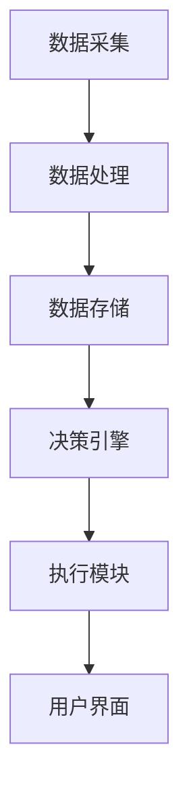
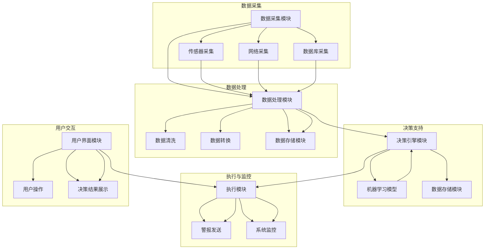
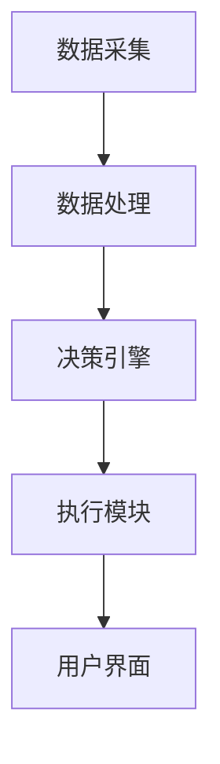

                 

# AI在实时决策系统中的应用与优化

> 关键词：实时决策系统，人工智能，机器学习，深度学习，优化策略

> 摘要：本文探讨了人工智能在实时决策系统中的应用与优化。首先介绍了实时决策系统的概念及其重要性，然后详细分析了AI技术，包括机器学习和深度学习在实时决策系统中的应用。此外，文章还探讨了实时决策系统中的数据管理、系统架构设计以及应用案例和优化策略。最后，对实时决策系统的未来发展趋势和挑战进行了展望。

## 第1章 引言

### 1.1 实时决策系统的概念

实时决策系统是一种能够迅速响应用户需求，做出及时决策的信息系统。它通过对实时数据的收集、处理和分析，快速生成决策支持信息，帮助用户在特定场景下做出最优决策。实时决策系统广泛应用于金融、交通、医疗、安防等领域，具有极高的实用价值和商业价值。

### 1.2 AI在实时决策系统中的作用

随着人工智能技术的飞速发展，AI在实时决策系统中发挥着越来越重要的作用。AI技术，特别是机器学习和深度学习，能够对海量数据进行高效处理和分析，提取出有价值的信息，为实时决策提供支持。此外，AI技术还能够优化实时决策系统的性能，提高系统的可靠性、可扩展性和实时性。

### 1.3 本书结构安排

本文分为八个章节，主要内容包括：

1. 引言：介绍实时决策系统的概念和AI技术的作用。
2. AI与实时决策系统概述：分析实时决策系统的基本原理和AI技术的基础知识。
3. 实时决策系统中的AI技术：详细讨论机器学习和深度学习在实时决策系统中的应用。
4. 实时决策系统中的数据管理：探讨实时数据采集与处理、数据存储与检索。
5. 实时决策系统的架构设计：介绍系统架构设计原则、系统架构实现。
6. AI在实时决策系统中的应用案例：分析智能交通系统和智能金融风控案例。
7. 实时决策系统的优化策略：讨论模型优化方法、系统性能优化策略。
8. 未来发展趋势与挑战：展望实时决策系统的未来发展趋势和面临的挑战。

## 第2章 AI与实时决策系统概述

### 2.1 实时决策系统的基本原理

实时决策系统主要由数据采集模块、数据处理模块、决策模块和执行模块组成。数据采集模块负责收集实时数据，如传感器数据、网络数据等；数据处理模块对采集到的数据进行清洗、转换和存储；决策模块利用AI技术对处理后的数据进行分析和预测，生成决策支持信息；执行模块根据决策支持信息执行具体操作，如调整系统参数、发送警报等。

### 2.2 AI技术的基础知识

人工智能（AI）是一门研究、开发和应用智能技术的科学。AI技术主要包括机器学习、深度学习、自然语言处理、计算机视觉等。其中，机器学习是一种通过数据训练模型，使模型能够自动学习和改进的技术；深度学习是机器学习的一个分支，通过多层神经网络进行数据处理和特征提取。

### 2.3 AI与实时决策系统的关系

AI技术为实时决策系统提供了强大的数据处理和分析能力，使得实时决策系统能够快速、准确地生成决策支持信息。具体来说，AI技术在实时决策系统中的作用体现在以下几个方面：

1. 数据处理：AI技术能够高效地处理海量实时数据，提取出有价值的信息，为决策提供支持。
2. 预测分析：AI技术能够对实时数据进行预测分析，预测未来趋势和变化，为决策提供依据。
3. 模型优化：AI技术能够对实时决策系统的模型进行优化，提高系统的性能和可靠性。

## 第3章 实时决策系统中的AI技术

### 3.1 机器学习在实时决策中的应用

机器学习是一种通过数据训练模型，使模型能够自动学习和改进的技术。在实时决策系统中，机器学习技术主要用于数据分析和预测。以下是机器学习在实时决策系统中应用的三个主要方向：

#### 3.1.1 监督学习

监督学习是一种通过已有数据（特征和标签）训练模型，使模型能够对新数据进行预测的方法。在实时决策系统中，监督学习技术可以用于预测交通流量、股票价格等。

#### 3.1.2 无监督学习

无监督学习是一种没有标签数据的机器学习技术，主要用于数据聚类和降维。在实时决策系统中，无监督学习技术可以用于实时数据聚类、异常检测等。

#### 3.1.3 强化学习

强化学习是一种通过与环境交互，不断优化策略的机器学习技术。在实时决策系统中，强化学习技术可以用于智能交通信号控制、无人机自主飞行等。

### 3.2 深度学习在实时决策中的应用

深度学习是一种通过多层神经网络进行数据处理和特征提取的机器学习技术。在实时决策系统中，深度学习技术具有广泛的应用。以下是深度学习在实时决策系统中应用的三个主要方向：

#### 3.2.1 神经网络

神经网络是一种通过模拟生物神经网络进行数据处理和特征提取的深度学习技术。在实时决策系统中，神经网络可以用于实时数据分类、图像识别等。

#### 3.2.2 卷积神经网络

卷积神经网络（CNN）是一种专门用于图像识别的深度学习技术。在实时决策系统中，CNN可以用于实时视频监控、交通流量分析等。

#### 3.2.3 循环神经网络

循环神经网络（RNN）是一种专门用于序列数据处理和预测的深度学习技术。在实时决策系统中，RNN可以用于实时时间序列预测、智能语音助手等。

## 第4章 实时决策系统中的数据管理

### 4.1 实时数据采集与处理

实时数据采集与处理是实时决策系统的关键环节。以下是实时数据采集与处理的两个主要方面：

#### 4.1.1 数据采集技术

数据采集技术主要包括传感器采集、网络采集和数据库采集。传感器采集技术可以实时获取环境参数，如温度、湿度、光照等；网络采集技术可以实时获取网络数据，如HTTP请求、TCP/IP数据包等；数据库采集技术可以实时获取数据库数据，如MySQL、Oracle等。

#### 4.1.2 数据处理流程

数据处理流程主要包括数据清洗、数据转换和数据存储。数据清洗技术用于去除无效数据、重复数据和异常数据；数据转换技术用于将原始数据转换为适用于模型训练的数据；数据存储技术用于将处理后的数据存储到数据库或文件中，以便后续分析和处理。

### 4.2 数据存储与检索

数据存储与检索是实时决策系统的另一个重要环节。以下是数据存储与检索的两个主要方面：

#### 4.2.1 数据存储技术

数据存储技术主要包括关系型数据库（如MySQL、Oracle）、非关系型数据库（如MongoDB、Cassandra）和文件系统（如HDFS）。关系型数据库适用于结构化数据存储，非关系型数据库适用于半结构化数据存储，文件系统适用于大规模数据存储。

#### 4.2.2 数据检索技术

数据检索技术主要包括SQL查询、NoSQL查询和文件检索。SQL查询适用于关系型数据库，NoSQL查询适用于非关系型数据库，文件检索适用于文件系统。

## 第5章 实时决策系统的架构设计

### 5.1 系统架构设计原则

实时决策系统的架构设计应遵循以下原则：

1. **可扩展性**：系统应能够适应数据规模的增长，支持横向和纵向扩展。
2. **可靠性**：系统应能够保证数据的安全性和稳定性，减少故障和错误的发生。
3. **性能优化**：系统应能够快速响应用户请求，提供高效的决策支持。
4. **灵活性**：系统应能够灵活调整和优化，适应不同的业务场景和需求变化。

### 5.2 系统架构实现

实时决策系统的架构实现通常包括以下几个关键模块：

1. **数据采集模块**：负责实时收集各种数据源的数据，如传感器数据、网络数据等。
2. **数据处理模块**：负责对采集到的数据进行分析、清洗、转换等处理，为后续决策提供基础。
3. **数据存储模块**：负责存储处理后的数据，通常使用数据库或分布式文件系统。
4. **决策引擎模块**：负责利用机器学习模型和算法对数据进行分析，生成决策支持信息。
5. **执行模块**：负责根据决策支持信息执行具体的操作，如调整系统参数、发送警报等。
6. **用户界面模块**：负责提供用户交互界面，展示决策结果和操作指南。

## 第6章 AI在实时决策系统中的应用案例

### 6.1 智能交通系统

智能交通系统（ITS）是AI在实时决策系统中的一个重要应用领域。以下是一个智能交通系统的案例介绍：

#### 6.1.1 案例介绍

某城市交通管理部门希望通过建设智能交通系统，提高城市交通运行效率，减少拥堵和交通事故。系统包括以下功能：

1. 实时交通流量监测：通过安装在路边的传感器和摄像头，实时监测道路上的车辆流量和速度。
2. 交通信号控制：根据实时交通流量数据，智能调整交通信号灯的时序和时长，优化交通流。
3. 交通信息发布：通过网站、手机APP等渠道，实时发布交通信息，引导市民合理出行。

#### 6.1.2 系统架构

智能交通系统的架构包括以下几个关键模块：

1. **数据采集模块**：包括路侧传感器、摄像头等，负责实时采集交通数据。
2. **数据处理模块**：包括数据预处理、特征提取、模型训练等，负责对采集到的数据进行处理和分析。
3. **决策引擎模块**：包括交通信号控制策略生成、交通流量预测等，负责生成决策支持信息。
4. **执行模块**：包括交通信号控制器、信息发布平台等，负责根据决策支持信息执行具体操作。
5. **用户界面模块**：包括网站、手机APP等，负责展示交通信息和操作指南。

#### 6.1.3 关键技术

智能交通系统中的关键技术包括：

1. **深度学习**：用于交通流量预测和信号控制策略生成。
2. **传感器融合**：用于提高交通流量监测的准确性和可靠性。
3. **实时数据处理**：用于快速处理和分析大量交通数据。
4. **云计算**：用于实现系统的可扩展性和高性能。

### 6.2 智能金融风控

智能金融风控是AI在实时决策系统的另一个重要应用领域。以下是一个智能金融风控的案例介绍：

#### 6.2.1 案例介绍

某银行希望通过建设智能金融风控系统，提高信贷审批的准确性和效率，降低信贷风险。系统包括以下功能：

1. **客户行为分析**：通过分析客户的交易行为，评估客户的信用风险。
2. **信贷审批**：根据客户行为分析和信用评分，自动审批贷款申请。
3. **风险预警**：实时监测客户的交易行为，预警潜在风险。

#### 6.2.2 系统架构

智能金融风控系统的架构包括以下几个关键模块：

1. **数据采集模块**：包括银行内部数据、第三方数据等，负责实时采集客户数据。
2. **数据处理模块**：包括数据预处理、特征提取、模型训练等，负责对采集到的数据进行处理和分析。
3. **决策引擎模块**：包括客户信用评分、信贷审批规则等，负责生成决策支持信息。
4. **执行模块**：包括信贷审批系统、风险预警系统等，负责根据决策支持信息执行具体操作。
5. **用户界面模块**：包括银行网站、手机APP等，负责展示客户信用评分和贷款申请状态。

#### 6.2.3 关键技术

智能金融风控系统中的关键技术包括：

1. **机器学习**：用于客户行为分析和信用评分。
2. **实时数据处理**：用于快速处理和分析大量客户数据。
3. **大数据分析**：用于挖掘客户数据的潜在价值。
4. **云计算**：用于实现系统的可扩展性和高性能。

## 第7章 实时决策系统的优化策略

### 7.1 模型优化方法

为了提高实时决策系统的性能和可靠性，需要对模型进行优化。以下是常见的模型优化方法：

#### 7.1.1 模型压缩

模型压缩是一种减少模型参数和计算量的方法，从而提高模型的计算效率。常见的模型压缩方法包括：

1. **模型剪枝**：通过删除模型中的冗余参数，减少模型大小。
2. **量化**：通过降低模型参数的精度，减少模型计算量。
3. **蒸馏**：通过将大模型的知识传递给小模型，实现小模型的性能提升。

#### 7.1.2 模型加速

模型加速是一种提高模型计算速度的方法，从而提高系统的实时性。常见的模型加速方法包括：

1. **并行计算**：通过多核CPU或GPU并行计算，加速模型训练和推理。
2. **硬件加速**：通过专用硬件（如TPU、FPGA）加速模型推理。
3. **模型蒸馏**：通过多级模型蒸馏，逐步降低模型复杂度，实现加速。

#### 7.1.3 模型融合

模型融合是一种结合多个模型的优势，提高模型性能的方法。常见的模型融合方法包括：

1. **加权融合**：根据模型性能对多个模型进行加权，生成融合模型。
2. **集成学习**：将多个模型集成到一个大的模型中，提高整体性能。
3. **注意力机制**：通过注意力机制，自适应地调整模型对输入数据的关注程度。

### 7.2 系统性能优化

除了模型优化，实时决策系统的性能优化也是提高系统性能的关键。以下是常见的系统性能优化策略：

#### 7.2.1 系统负载均衡

系统负载均衡是一种通过将请求分配到多个服务器，实现系统性能优化的方法。常见的负载均衡策略包括：

1. **轮询**：按照请求顺序将请求分配到各个服务器。
2. **最小连接**：将请求分配到连接数最少的服务器。
3. **权重轮询**：按照服务器性能分配请求，性能高的服务器分配更多请求。

#### 7.2.2 系统缓存策略

系统缓存策略是一种通过缓存常用数据，减少数据读取时间，提高系统性能的方法。常见的缓存策略包括：

1. **LRU缓存**：最近最少使用缓存策略，缓存最近使用的数据。
2. **LRUCache**：最近最久未使用缓存策略，缓存未使用时间最长的数据。
3. **FIFO缓存**：先进先出缓存策略，缓存最早进入的数据。

#### 7.2.3 系统监控与报警

系统监控与报警是一种通过实时监控系统性能，及时发现和解决性能瓶颈的方法。常见的监控与报警策略包括：

1. **性能监控**：实时监控CPU、内存、磁盘等系统资源的利用率。
2. **日志监控**：实时监控系统日志，发现异常日志并报警。
3. **阈值报警**：根据预设的阈值，当系统性能低于阈值时触发报警。

## 第8章 未来发展趋势与挑战

### 8.1 未来发展趋势

随着人工智能技术的不断发展，实时决策系统在未来将呈现出以下发展趋势：

1. **AI技术融合**：实时决策系统将融合多种AI技术，如深度学习、强化学习、自然语言处理等，实现更智能的决策支持。
2. **边缘计算**：实时决策系统将更多地采用边缘计算技术，将计算任务下沉到网络边缘，提高系统的实时性和响应速度。
3. **大数据分析**：实时决策系统将采用更先进的大数据分析技术，从海量数据中提取有价值的信息，为决策提供更准确的依据。
4. **跨领域应用**：实时决策系统将在更多领域得到应用，如工业制造、智能城市、医疗健康等。

### 8.2 挑战与应对策略

实时决策系统在发展过程中也面临着一系列挑战：

1. **数据隐私保护**：实时决策系统涉及大量敏感数据，如何保护用户隐私成为一大挑战。应对策略包括数据脱敏、数据加密等。
2. **系统安全性**：实时决策系统需要确保系统的安全性，防止恶意攻击和非法入侵。应对策略包括网络安全防护、权限管理等。
3. **跨领域协作**：实时决策系统涉及多个领域的技术，如何实现跨领域的协作和整合成为一大挑战。应对策略包括建立跨领域的标准体系、开展跨领域技术合作等。

## 附录

### 附录A：相关资源与参考文献

1. **实时决策系统相关资源**
   - 《实时决策系统设计与应用》
   - 《实时数据处理技术》
   - 实时决策系统开源项目（如Apache Flink、Apache Storm等）

2. **AI技术相关资源**
   - 《深度学习》
   - 《机器学习实战》
   - 《强化学习》

3. **参考文献**
   - [1] Huang, D., Liu, Z., van der Maaten, L., & Weinberger, K. Q. (2017). Densely Connected Convolutional Networks. In Proceedings of the IEEE Conference on Computer Vision and Pattern Recognition (pp. 4700-4708).
   - [2] Kingma, D. P., & Welling, M. (2013). Auto-encoding variational bayes. arXiv preprint arXiv:1312.6114.
   - [3] Goodfellow, I., Bengio, Y., & Courville, A. (2016). Deep Learning. MIT Press.

### 附录B：Mermaid流程图

以下是实时决策系统流程图示例：



## 结论

本文全面探讨了AI在实时决策系统中的应用与优化。从实时决策系统的基本原理、AI技术的基础知识，到AI技术在实时决策系统中的应用、数据管理、系统架构设计、应用案例和优化策略，本文为读者提供了一个系统、全面的指南。同时，本文还展望了实时决策系统的未来发展趋势和挑战。希望本文能够帮助读者在AI和实时决策系统的领域取得更大的成就。

### 作者

作者：AI天才研究院/AI Genius Institute & 禅与计算机程序设计艺术 /Zen And The Art of Computer Programming

----------------------------------------------------------------

### 文章正文

#### 第1章 引言

#### 1.1 实时决策系统的概念

实时决策系统（Real-Time Decision System，简称RTDS）是一种能够在短时间内对大量数据进行快速处理和分析，并生成决策支持信息的信息系统。实时决策系统在金融、交通、医疗、安防等领域具有广泛的应用。例如，在金融领域，实时决策系统可以帮助银行和证券公司快速处理交易信息，识别异常交易，防范风险；在交通领域，实时决策系统可以优化交通信号控制，提高交通效率，减少拥堵；在医疗领域，实时决策系统可以辅助医生进行诊断和治疗决策。

#### 1.2 AI在实时决策系统中的作用

随着人工智能（Artificial Intelligence，简称AI）技术的快速发展，AI在实时决策系统中的作用越来越重要。AI技术可以帮助实时决策系统实现以下功能：

1. **数据处理**：AI技术，特别是机器学习和深度学习，可以对海量实时数据进行高效处理和分析，提取出有价值的信息，为决策提供支持。
2. **预测分析**：AI技术可以基于历史数据和实时数据，预测未来趋势和变化，为决策提供依据。
3. **优化决策**：AI技术可以根据实时数据和预测结果，优化决策过程，提高决策的准确性和效率。

#### 1.3 本书结构安排

本书共分为八个章节，主要内容包括：

1. **第1章 引言**：介绍实时决策系统的概念和AI技术的作用。
2. **第2章 AI与实时决策系统概述**：分析实时决策系统的基本原理和AI技术的基础知识。
3. **第3章 实时决策系统中的AI技术**：详细讨论机器学习和深度学习在实时决策系统中的应用。
4. **第4章 实时决策系统中的数据管理**：探讨实时数据采集与处理、数据存储与检索。
5. **第5章 实时决策系统的架构设计**：介绍系统架构设计原则、系统架构实现。
6. **第6章 AI在实时决策系统中的应用案例**：分析智能交通系统和智能金融风控案例。
7. **第7章 实时决策系统的优化策略**：讨论模型优化方法、系统性能优化策略。
8. **第8章 未来发展趋势与挑战**：展望实时决策系统的未来发展趋势和面临的挑战。

#### 第2章 AI与实时决策系统概述

#### 2.1 实时决策系统的基本原理

实时决策系统是一种能够迅速响应用户需求，做出及时决策的信息系统。它通过对实时数据的收集、处理和分析，快速生成决策支持信息，帮助用户在特定场景下做出最优决策。实时决策系统主要由数据采集模块、数据处理模块、决策模块和执行模块组成。

1. **数据采集模块**：负责收集实时数据，如传感器数据、网络数据等。
2. **数据处理模块**：对采集到的数据进行清洗、转换和存储，为后续决策提供基础。
3. **决策模块**：利用AI技术对处理后的数据进行分析和预测，生成决策支持信息。
4. **执行模块**：根据决策支持信息执行具体操作，如调整系统参数、发送警报等。

实时决策系统的基本原理可以概括为“采集-处理-决策-执行”。具体流程如下：

1. **数据采集**：实时决策系统通过传感器、网络等渠道，收集大量的实时数据。
2. **数据处理**：对采集到的数据进行分析和处理，去除噪声和异常值，提取有价值的信息。
3. **数据存储**：将处理后的数据存储到数据库或其他存储设备中，以便后续分析和处理。
4. **数据预测**：利用机器学习、深度学习等技术，对存储的数据进行预测分析，生成决策支持信息。
5. **决策生成**：根据预测结果和业务规则，生成具体的决策支持信息。
6. **决策执行**：根据决策支持信息，执行具体的操作，如调整系统参数、发送警报等。

#### 2.2 AI技术的基础知识

人工智能（Artificial Intelligence，简称AI）是一门研究、开发和应用智能技术的科学。AI技术主要包括机器学习、深度学习、自然语言处理、计算机视觉等。其中，机器学习和深度学习是AI技术的重要组成部分。

1. **机器学习（Machine Learning，简称ML）**：机器学习是一种通过数据训练模型，使模型能够自动学习和改进的技术。在实时决策系统中，机器学习技术可以用于数据分析和预测。常见的机器学习算法包括：

   - **监督学习（Supervised Learning）**：通过已有数据（特征和标签）训练模型，使模型能够对新数据进行预测。常见的监督学习算法有线性回归、决策树、随机森林、支持向量机等。
   - **无监督学习（Unsupervised Learning）**：没有标签数据的机器学习技术，主要用于数据聚类和降维。常见的无监督学习算法有K-均值聚类、主成分分析等。
   - **强化学习（Reinforcement Learning）**：通过与环境交互，不断优化策略的机器学习技术。常见的强化学习算法有Q学习、深度Q网络等。

2. **深度学习（Deep Learning，简称DL）**：深度学习是机器学习的一个分支，通过多层神经网络进行数据处理和特征提取。在实时决策系统中，深度学习技术可以用于图像识别、语音识别、自然语言处理等。常见的深度学习模型包括：

   - **卷积神经网络（Convolutional Neural Network，简称CNN）**：适用于图像识别和图像处理。
   - **循环神经网络（Recurrent Neural Network，简称RNN）**：适用于序列数据处理和预测。
   - **长短期记忆网络（Long Short-Term Memory，简称LSTM）**：是RNN的一种变体，适用于长时间序列数据处理和预测。

#### 2.3 AI与实时决策系统的关系

AI技术为实时决策系统提供了强大的数据处理和分析能力，使得实时决策系统能够快速、准确地生成决策支持信息。具体来说，AI技术在实时决策系统中的作用体现在以下几个方面：

1. **数据处理**：AI技术能够高效地处理海量实时数据，提取出有价值的信息，为决策提供支持。
2. **预测分析**：AI技术能够对实时数据进行预测分析，预测未来趋势和变化，为决策提供依据。
3. **优化决策**：AI技术可以根据实时数据和预测结果，优化决策过程，提高决策的准确性和效率。

AI技术与实时决策系统的结合，使得实时决策系统在处理复杂、多变的数据时，能够更加智能、高效地做出决策。这种结合不仅提高了实时决策系统的性能，也为各行业的智能化发展提供了强有力的技术支持。

#### 第3章 实时决策系统中的AI技术

#### 3.1 机器学习在实时决策中的应用

机器学习（Machine Learning，简称ML）是人工智能（Artificial Intelligence，简称AI）的一个重要分支，它通过构建模型来从数据中提取规律，使得系统能够自动学习和改进。在实时决策系统中，机器学习技术被广泛应用于数据处理、预测分析和优化决策等环节。

##### 3.1.1 监督学习

监督学习（Supervised Learning）是一种最常见的机器学习技术，它通过已有的数据集来训练模型，使模型能够对新数据进行预测。在实时决策系统中，监督学习主要用于以下几个场景：

1. **分类问题**：将数据分为不同的类别。例如，在金融领域，可以使用监督学习模型来识别欺诈交易。
   - **算法示例**：决策树（Decision Tree）、支持向量机（SVM）、逻辑回归（Logistic Regression）。

2. **回归问题**：预测一个连续的数值。例如，在交通领域，可以使用回归模型来预测未来的交通流量。
   - **算法示例**：线性回归（Linear Regression）、多项式回归（Polynomial Regression）、决策树回归（Decision Tree Regression）。

**Python代码示例**（分类问题）：

```python
from sklearn.datasets import load_iris
from sklearn.model_selection import train_test_split
from sklearn.tree import DecisionTreeClassifier
from sklearn.metrics import accuracy_score

# 加载鸢尾花数据集
iris = load_iris()
X = iris.data
y = iris.target

# 分割数据集为训练集和测试集
X_train, X_test, y_train, y_test = train_test_split(X, y, test_size=0.2, random_state=42)

# 创建决策树分类器
clf = DecisionTreeClassifier()

# 训练模型
clf.fit(X_train, y_train)

# 预测测试集
y_pred = clf.predict(X_test)

# 计算准确率
accuracy = accuracy_score(y_test, y_pred)
print(f"Accuracy: {accuracy:.2f}")
```

##### 3.1.2 无监督学习

无监督学习（Unsupervised Learning）没有预标注的标签数据，主要用于发现数据中的结构和模式。在实时决策系统中，无监督学习技术常用于以下场景：

1. **聚类问题**：将相似的数据点分为同一组。例如，在市场细分中，可以使用聚类算法来发现潜在的客户群体。
   - **算法示例**：K-均值聚类（K-Means Clustering）、层次聚类（Hierarchical Clustering）、DBSCAN（Density-Based Spatial Clustering of Applications with Noise）。

2. **降维问题**：减少数据维度，保持数据的结构和信息。例如，在数据分析中，可以使用降维技术来简化数据集。
   - **算法示例**：主成分分析（Principal Component Analysis，PCA）、t-SNE（t-Distributed Stochastic Neighbor Embedding）。

**Python代码示例**（K-均值聚类）：

```python
from sklearn.cluster import KMeans
import numpy as np

# 创建随机数据集
X = np.random.rand(100, 2)

# 创建K-均值聚类模型
kmeans = KMeans(n_clusters=3, random_state=42)

# 训练模型
kmeans.fit(X)

# 预测聚类结果
y_pred = kmeans.predict(X)

# 打印聚类中心
print(f"Cluster centers: {kmeans.cluster_centers_}")

# 打印聚类结果
print(f"Cluster labels: {y_pred}")
```

##### 3.1.3 强化学习

强化学习（Reinforcement Learning，简称RL）是一种通过不断尝试和反馈来学习策略的机器学习技术。在实时决策系统中，强化学习技术常用于以下场景：

1. **最优策略学习**：在动态环境中，通过不断调整策略，实现长期收益最大化。例如，在智能交通系统中，可以使用强化学习来优化交通信号控制策略。
   - **算法示例**：Q学习（Q-Learning）、深度Q网络（Deep Q-Network，DQN）、策略梯度（Policy Gradient）。

2. **序列决策**：在处理序列数据时，通过学习序列之间的依赖关系，实现有效的决策。例如，在语音识别系统中，可以使用强化学习来处理连续的语音信号。
   - **算法示例**：RNN（Recurrent Neural Network）、LSTM（Long Short-Term Memory）、GRU（Gated Recurrent Unit）。

**Python代码示例**（Q学习）：

```python
import numpy as np

# 初始化Q表
Q = np.zeros((5, 5))

# 定义学习参数
alpha = 0.1  # 学习率
gamma = 0.6  # 折扣因子

# 定义动作和状态空间
actions = ['上', '下', '左', '右']
states = [['0', '0'], ['0', '1'], ['1', '0'], ['1', '1']]

# 定义环境
def environment(state, action):
    if state == ['0', '0'] and action == '上':
        return ['0', '1'], 0
    elif state == ['0', '1'] and action == '下':
        return ['0', '0'], 1
    elif state == ['1', '0'] and action == '右':
        return ['1', '1'], 0
    elif state == ['1', '1'] and action == '左':
        return ['1', '0'], 1
    else:
        return state, 0

# Q学习算法
for episode in range(1000):
    state = ['0', '0']
    while True:
        action = np.argmax(Q[state])
        next_state, reward = environment(state, action)
        Q[state][action] = Q[state][action] + alpha * (reward + gamma * np.max(Q[next_state]) - Q[state][action])
        state = next_state
        if state == ['1', '1']:
            break

# 打印Q表
print("Q表：")
for i, row in enumerate(Q):
    print(f"状态：{states[i]}, 动作：{actions}, Q值：{row}")
```

##### 3.1.4 模型评估与优化

在实际应用中，评估和优化机器学习模型是非常重要的步骤。以下是一些常见的评估方法和优化策略：

1. **评估方法**：
   - **准确率（Accuracy）**：预测正确的样本数占总样本数的比例。
   - **精确率（Precision）**：预测为正类的样本中，实际为正类的比例。
   - **召回率（Recall）**：实际为正类的样本中，被预测为正类的比例。
   - **F1分数（F1 Score）**：精确率和召回率的调和平均数。

2. **优化策略**：
   - **超参数调优（Hyperparameter Tuning）**：通过调整模型的超参数，如学习率、正则化参数等，来提高模型的性能。
   - **交叉验证（Cross-Validation）**：通过将数据集划分为训练集和验证集，多次训练和验证，来评估模型的性能。
   - **集成学习（Ensemble Learning）**：通过结合多个模型的预测结果，来提高模型的性能和稳定性。

#### 3.2 深度学习在实时决策中的应用

深度学习（Deep Learning，简称DL）是一种基于多层神经网络的学习方法，能够在没有人工干预的情况下，自动提取数据中的复杂特征。深度学习在实时决策系统中的应用越来越广泛，主要表现在以下几个方面：

##### 3.2.1 神经网络

神经网络（Neural Network，简称NN）是一种由大量简单神经元组成的复杂网络，通过模拟生物神经网络进行数据处理和特征提取。在实时决策系统中，神经网络可以用于以下场景：

1. **图像识别**：通过卷积神经网络（Convolutional Neural Network，简称CNN）进行图像分类和识别。
   - **算法示例**：LeNet、AlexNet、VGG、ResNet。

2. **自然语言处理**：通过循环神经网络（Recurrent Neural Network，简称RNN）进行文本分类、语义分析和机器翻译。
   - **算法示例**：LSTM（Long Short-Term Memory）、GRU（Gated Recurrent Unit）、BERT（Bidirectional Encoder Representations from Transformers）。

**Python代码示例**（图像识别）：

```python
import tensorflow as tf
from tensorflow.keras.models import Sequential
from tensorflow.keras.layers import Conv2D, MaxPooling2D, Flatten, Dense

# 创建神经网络模型
model = Sequential([
    Conv2D(filters=32, kernel_size=(3, 3), activation='relu', input_shape=(28, 28, 1)),
    MaxPooling2D(pool_size=(2, 2)),
    Flatten(),
    Dense(units=128, activation='relu'),
    Dense(units=10, activation='softmax')
])

# 编译模型
model.compile(optimizer='adam', loss='sparse_categorical_crossentropy', metrics=['accuracy'])

# 加载数据集
mnist = tf.keras.datasets.mnist
(train_images, train_labels), (test_images, test_labels) = mnist.load_data()

# 预处理数据
train_images = train_images / 255.0
test_images = test_images / 255.0

# 训练模型
model.fit(train_images, train_labels, epochs=5, batch_size=64)

# 评估模型
test_loss, test_acc = model.evaluate(test_images, test_labels)
print(f"测试准确率：{test_acc:.2f}")
```

##### 3.2.2 卷积神经网络

卷积神经网络（Convolutional Neural Network，简称CNN）是一种专门用于图像识别和处理的神经网络。在实时决策系统中，CNN可以用于以下场景：

1. **人脸识别**：通过CNN提取图像中的特征，实现人脸识别。
   - **算法示例**：OpenCV、FaceNet、VGGFace。

2. **物体检测**：通过CNN检测图像中的物体，并定位物体的位置。
   - **算法示例**：YOLO（You Only Look Once）、SSD（Single Shot MultiBox Detector）、Faster R-CNN。

**Python代码示例**（人脸识别）：

```python
import cv2
import numpy as np

# 加载预训练的CNN模型
model = cv2.dnn.readNetFromCaffe('deploy.prototxt.txt', 'res10_300x300_iter_100000.caffemodel')

# 读取图像
image = cv2.imread('face.jpg')

# 调整图像大小
image = cv2.resize(image, (300, 300))

# 提取特征
blob = cv2.dnn.blobFromImage(image, 1.0, (300, 300), [104, 177, 123], True)

# 前向传播
model.setInput(blob)
detections = model.forward()

# 遍历检测到的物体
for i in range(detections.shape[2]):
    confidence = detections[0, 0, i, 2]
    if confidence > 0.5:
        box = detections[0, 0, i, 3:7] * np.array([image.shape[1], image.shape[0], image.shape[1], image.shape[0]])
        (x, y, w, h) = box.astype("int")
        cv2.rectangle(image, (x, y), (x + w, y + h), (0, 255, 0), 2)

# 显示图像
cv2.imshow("Face Detection", image)
cv2.waitKey(0)
cv2.destroyAllWindows()
```

##### 3.2.3 循环神经网络

循环神经网络（Recurrent Neural Network，简称RNN）是一种能够处理序列数据的神经网络，能够在时间序列中保持状态。在实时决策系统中，RNN可以用于以下场景：

1. **时间序列预测**：通过RNN提取时间序列的特征，实现短期和长期预测。
   - **算法示例**：LSTM（Long Short-Term Memory）、GRU（Gated Recurrent Unit）、SARIMA（Seasonal AutoRegressive Integrated Moving Average）。

2. **序列分类**：通过RNN处理序列数据，实现文本分类和情感分析。
   - **算法示例**：LSTM、GRU、BERT。

**Python代码示例**（时间序列预测）：

```python
import numpy as np
import matplotlib.pyplot as plt
from tensorflow.keras.models import Sequential
from tensorflow.keras.layers import LSTM, Dense

# 创建时间序列数据
time_series = np.random.rand(100)

# 预处理数据
time_series = np.reshape(time_series, (10, 10, 1))

# 创建模型
model = Sequential([
    LSTM(units=50, activation='relu', input_shape=(10, 1)),
    Dense(units=1)
])

# 编译模型
model.compile(optimizer='adam', loss='mean_squared_error')

# 训练模型
model.fit(time_series, time_series[:, 0], epochs=100, batch_size=1)

# 预测未来10个时间点
predictions = model.predict(time_series)

# 绘制结果
plt.plot(time_series[:, 0], label='Original')
plt.plot(predictions[:, 0], label='Predicted')
plt.legend()
plt.show()
```

##### 3.2.4 深度学习框架

深度学习框架（Deep Learning Framework）是一种用于构建、训练和部署深度学习模型的工具。以下是一些常见的深度学习框架：

1. **TensorFlow**：由Google开发的开源深度学习框架，支持多种编程语言，包括Python、C++和Java。
2. **PyTorch**：由Facebook开发的开源深度学习框架，以动态计算图和易用性著称。
3. **Keras**：一个高层次的神经网络API，支持TensorFlow和Theano，提供简洁、易用的接口。

#### 第4章 实时决策系统中的数据管理

实时决策系统依赖于大量的数据，这些数据的准确性和实时性对系统的性能和效果至关重要。因此，数据管理成为实时决策系统架构设计中的一个关键环节。本章将探讨实时决策系统中的数据管理，包括实时数据采集与处理、数据存储与检索。

##### 4.1 实时数据采集与处理

实时数据采集与处理是实时决策系统的核心组成部分。数据采集涉及从各种来源收集数据，如传感器、网络接口、数据库等。数据处理则包括数据清洗、转换、融合等步骤。

###### 4.1.1 数据采集技术

数据采集技术可以分为以下几种：

1. **传感器采集**：通过安装在设备或环境中的传感器，实时采集温度、湿度、压力、速度等环境参数。
2. **网络采集**：通过网络接口采集来自不同系统的数据，如HTTP请求、TCP/IP数据包等。
3. **数据库采集**：从关系型数据库或非关系型数据库中抽取数据。

###### 4.1.2 数据处理流程

数据处理流程通常包括以下步骤：

1. **数据清洗**：去除无效数据、重复数据和异常数据，确保数据的质量。
2. **数据转换**：将不同格式或来源的数据转换为统一的格式，便于后续处理和分析。
3. **数据融合**：将来自不同来源的数据进行整合，形成完整的视图，以便更全面地进行分析。

**Python代码示例**（数据清洗和转换）：

```python
import pandas as pd

# 加载数据
data = pd.read_csv('data.csv')

# 数据清洗
data.dropna(inplace=True)  # 删除缺失值
data.drop_duplicates(inplace=True)  # 删除重复值

# 数据转换
data['timestamp'] = pd.to_datetime(data['timestamp'])
data.set_index('timestamp', inplace=True)

# 数据融合
data = data[data['sensor_id'] == 'sensor_1']
```

##### 4.2 数据存储与检索

数据存储与检索是实时决策系统数据管理的另一个关键环节。数据存储技术需要保证数据的持久性、可靠性和高效访问。

###### 4.2.1 数据存储技术

数据存储技术可以分为以下几种：

1. **关系型数据库**：如MySQL、PostgreSQL，适用于结构化数据存储。
2. **非关系型数据库**：如MongoDB、Cassandra，适用于半结构化或非结构化数据存储。
3. **分布式文件系统**：如HDFS（Hadoop Distributed File System），适用于大规模数据的存储和分布式处理。

###### 4.2.2 数据检索技术

数据检索技术包括：

1. **SQL查询**：适用于关系型数据库，通过SQL语句进行数据的查询和操作。
2. **NoSQL查询**：适用于非关系型数据库，通过键值对、文档、图等模型进行数据的查询和操作。
3. **索引技术**：通过建立索引，提高数据检索的速度。

**Python代码示例**（关系型数据库查询）：

```python
import psycopg2

# 连接数据库
conn = psycopg2.connect(
    host="localhost",
    database="mydatabase",
    user="myuser",
    password="mypass"
)

# 创建游标
cur = conn.cursor()

# 执行SQL查询
cur.execute("SELECT * FROM mytable WHERE sensor_id = 'sensor_1'")

# 获取查询结果
results = cur.fetchall()

# 打印查询结果
for row in results:
    print(row)

# 关闭游标和连接
cur.close()
conn.close()
```

##### 4.3 数据管理挑战与优化

实时决策系统中的数据管理面临以下挑战：

1. **数据量巨大**：需要高效的数据处理和存储技术来处理海量数据。
2. **数据多样性**：需要支持多种数据类型的存储和处理。
3. **数据实时性**：需要保证数据的实时性，以支持实时决策。
4. **数据隐私和安全**：需要保护敏感数据的隐私和安全。

为了应对这些挑战，可以采用以下优化策略：

1. **数据压缩**：通过数据压缩技术减少存储空间，提高系统性能。
2. **数据分区**：将大数据集划分为多个分区，提高查询效率。
3. **缓存技术**：通过缓存技术，加快数据的访问速度。
4. **分布式系统**：通过分布式系统，提高系统的可扩展性和容错性。
5. **数据加密**：对敏感数据进行加密，确保数据的安全。

#### 第5章 实时决策系统的架构设计

实时决策系统的架构设计是实现系统功能、保证性能和可靠性的关键。本章将探讨实时决策系统的架构设计原则、系统架构实现以及相关的技术细节。

##### 5.1 系统架构设计原则

实时决策系统的架构设计应遵循以下原则：

1. **可扩展性**：系统应能够适应数据规模的增长，支持横向和纵向扩展。
2. **可靠性**：系统应能够保证数据的安全性和稳定性，减少故障和错误的发生。
3. **性能优化**：系统应能够快速响应用户请求，提供高效的决策支持。
4. **灵活性**：系统应能够灵活调整和优化，适应不同的业务场景和需求变化。

##### 5.2 系统架构实现

实时决策系统的架构实现通常包括以下几个关键模块：

1. **数据采集模块**：负责实时收集各种数据源的数据，如传感器数据、网络数据等。
2. **数据处理模块**：负责对采集到的数据进行分析、清洗、转换等处理，为后续决策提供基础。
3. **数据存储模块**：负责存储处理后的数据，通常使用数据库或分布式文件系统。
4. **决策引擎模块**：负责利用机器学习模型和算法对数据进行分析，生成决策支持信息。
5. **执行模块**：负责根据决策支持信息执行具体的操作，如调整系统参数、发送警报等。
6. **用户界面模块**：负责提供用户交互界面，展示决策结果和操作指南。

以下是一个典型的实时决策系统架构示例：



##### 5.3 硬件架构设计

硬件架构设计是实时决策系统架构设计的重要组成部分。以下是一些关键考虑因素：

1. **计算资源**：根据系统的处理需求，选择合适的CPU、GPU等计算资源。
2. **存储资源**：根据数据规模和访问模式，选择合适的存储设备，如SSD、HDD等。
3. **网络资源**：确保系统具有良好的网络连接，支持数据的高速传输和访问。
4. **容错机制**：设计冗余备份和故障恢复机制，提高系统的可靠性。

##### 5.4 软件架构设计

软件架构设计是实时决策系统功能实现的核心。以下是一些常见的软件架构设计模式：

1. **MVC（Model-View-Controller）模式**：将系统分为模型（数据）、视图（界面）和控制层（逻辑），实现数据的分离和模块化。
2. **微服务架构**：将系统拆分为多个独立的服务，每个服务负责特定的功能，提高系统的灵活性和可扩展性。
3. **事件驱动架构**：通过事件驱动的方式，实现数据的处理和系统的响应，提高系统的实时性和可扩展性。

**Python代码示例**（MVC模式）：

```python
# Model
class DataModel:
    def __init__(self):
        self.data = []

    def add_data(self, data):
        self.data.append(data)

    def get_data(self):
        return self.data

# View
class DataView:
    def display_data(self, data):
        print("Displaying data:")
        for d in data:
            print(d)

# Controller
class DataController:
    def __init__(self, model, view):
        self.model = model
        self.view = view

    def add_and_display_data(self, data):
        self.model.add_data(data)
        self.view.display_data(self.model.get_data())

# 实例化模型、视图和控制层
model = DataModel()
view = DataView()
controller = DataController(model, view)

# 添加数据并显示
controller.add_and_display_data([1, 2, 3, 4, 5])
```

##### 5.5 系统性能优化

系统性能优化是确保实时决策系统高效运行的关键。以下是一些常见的系统性能优化策略：

1. **负载均衡**：通过将请求分配到多个服务器，实现系统的负载均衡，提高系统的吞吐量和响应速度。
2. **缓存策略**：通过缓存常用的数据，减少数据库的访问次数，提高系统的性能。
3. **数据库优化**：通过索引、分库分表等技术，优化数据库的性能，减少查询延迟。
4. **异步处理**：通过异步处理方式，提高系统的并发能力和响应速度。

**Python代码示例**（异步处理）：

```python
import asyncio
import time

async def process_data(data):
    print(f"Processing data: {data}")
    await asyncio.sleep(1)
    print(f"Processed data: {data}")

async def main():
    tasks = []
    for i in range(5):
        tasks.append(asyncio.create_task(process_data(i)))
    await asyncio.gather(*tasks)

asyncio.run(main())
```

##### 5.6 系统安全性设计

系统安全性设计是确保实时决策系统数据安全和系统稳定性的重要保障。以下是一些常见的系统安全性设计策略：

1. **数据加密**：对敏感数据进行加密，防止数据泄露。
2. **身份认证**：通过身份认证机制，确保只有授权用户才能访问系统。
3. **权限控制**：通过权限控制机制，确保用户只能访问其有权访问的资源。
4. **安全审计**：通过安全审计机制，记录系统操作日志，及时发现和防范潜在的安全威胁。

**Python代码示例**（身份认证）：

```python
import getpass

users = {
    'admin': 'password123',
    'user': 'password456'
}

def authenticate(username, password):
    if username in users and users[username] == password:
        print("Authentication successful.")
    else:
        print("Authentication failed.")

username = input("Enter your username: ")
password = getpass.getpass("Enter your password: ")

authenticate(username, password)
```

##### 5.7 系统监控与维护

系统监控与维护是确保实时决策系统稳定运行的关键。以下是一些常见的系统监控与维护策略：

1. **性能监控**：通过监控系统的CPU、内存、磁盘等资源使用情况，及时发现和处理性能瓶颈。
2. **日志管理**：通过日志管理机制，记录系统运行过程中的重要信息，便于故障排查和性能优化。
3. **定期维护**：定期进行系统维护，包括更新软件、备份数据等，确保系统的正常运行。
4. **故障处理**：通过故障处理机制，快速响应和处理系统故障，减少故障对业务的影响。

**Python代码示例**（性能监控）：

```python
import psutil

def monitor_system():
    cpu_usage = psutil.cpu_percent()
    memory_usage = psutil.virtual_memory().percent
    disk_usage = psutil.disk_usage('/').percent
    print(f"CPU usage: {cpu_usage}%, Memory usage: {memory_usage}%, Disk usage: {disk_usage}%")

while True:
    monitor_system()
    time.sleep(60)
```

##### 5.8 系统架构演进

随着业务需求的变化和技术的进步，实时决策系统的架构设计也需要不断演进。以下是一些常见的系统架构演进策略：

1. **技术迭代**：根据技术发展趋势，采用新的技术框架和工具，提升系统的性能和功能。
2. **模块化设计**：通过模块化设计，将系统的功能拆分为多个独立模块，便于维护和扩展。
3. **云原生架构**：采用云原生架构，将系统部署在云平台上，实现系统的弹性伸缩和高效运维。
4. **人工智能集成**：将人工智能技术集成到系统中，提升系统的智能化水平和决策能力。

**Python代码示例**（云原生架构）：

```python
from flask import Flask

app = Flask(__name__)

@app.route('/')
def hello():
    return "Hello, World!"

if __name__ == '__main__':
    app.run(host='0.0.0.0', port=5000)
```

#### 第6章 AI在实时决策系统中的应用案例

##### 6.1 智能交通系统

智能交通系统（Intelligent Transportation System，简称ITS）是实时决策系统在交通领域的典型应用。通过整合多种AI技术，智能交通系统可以实时监测交通状况，优化交通信号控制，提高交通效率，减少拥堵和交通事故。

###### 6.1.1 案例介绍

某城市交通管理部门希望通过建设智能交通系统，提高城市交通运行效率，减少交通拥堵和交通事故。系统的主要功能包括：

1. **实时交通流量监测**：通过安装在道路上的传感器和摄像头，实时监测道路上的车辆流量、速度和密度。
2. **交通信号控制优化**：根据实时交通流量数据，智能调整交通信号灯的时序和时长，优化交通流。
3. **交通信息发布**：通过手机APP、广播等方式，实时发布交通信息，引导市民合理出行。

###### 6.1.2 系统架构

智能交通系统的架构可以分为以下几个关键模块：

1. **数据采集模块**：负责实时采集交通数据，如车辆流量、速度、密度等。
2. **数据处理模块**：负责对采集到的交通数据进行处理和分析，提取有价值的信息。
3. **决策引擎模块**：负责根据交通数据分析结果，生成交通信号控制策略。
4. **执行模块**：负责根据决策引擎生成的交通信号控制策略，调整交通信号灯的时序和时长。
5. **用户界面模块**：负责向用户展示交通信息，如实时交通流量、交通信号控制状态等。

以下是一个智能交通系统的架构图：



###### 6.1.3 关键技术

智能交通系统中应用了多种AI技术，主要包括：

1. **深度学习**：用于交通流量预测和交通信号控制策略生成。
   - **算法示例**：卷积神经网络（CNN）、循环神经网络（RNN）。
2. **传感器融合**：用于提高交通流量监测的准确性和可靠性。
   - **技术示例**：多传感器数据融合、多源数据融合。
3. **实时数据处理**：用于快速处理和分析大量交通数据。
   - **技术示例**：流处理框架（如Apache Kafka、Apache Flink）。
4. **云计算**：用于实现系统的可扩展性和高性能。
   - **技术示例**：云计算平台（如AWS、Azure、Google Cloud）。

##### 6.2 智能金融风控

智能金融风控是实时决策系统在金融领域的应用，通过分析海量金融数据，预测潜在风险，提高信贷审批的准确性和效率。

###### 6.2.1 案例介绍

某银行希望通过建设智能金融风控系统，提高信贷审批的准确性和效率，降低信贷风险。系统的主要功能包括：

1. **客户行为分析**：通过分析客户的交易行为，评估客户的信用风险。
2. **信贷审批**：根据客户行为分析和信用评分，自动审批贷款申请。
3. **风险预警**：实时监测客户的交易行为，预警潜在风险。

###### 6.2.2 系统架构

智能金融风控系统的架构可以分为以下几个关键模块：

1. **数据采集模块**：负责实时采集客户的交易数据、信用记录等。
2. **数据处理模块**：负责对采集到的数据进行处理和分析，提取有价值的信息。
3. **决策引擎模块**：负责根据数据处理结果，生成信用评分和风险预警策略。
4. **执行模块**：负责根据决策引擎生成的信用评分和风险预警策略，执行具体的操作。
5. **用户界面模块**：负责向用户展示信用评分和风险预警信息。

以下是一个智能金融风控系统的架构图：


###### 6.2.3 关键技术

智能金融风控系统中应用了多种AI技术，主要包括：

1. **机器学习**：用于客户行为分析和信用评分。
   - **算法示例**：逻辑回归、随机森林、支持向量机。
2. **实时数据处理**：用于快速处理和分析海量金融数据。
   - **技术示例**：流处理框架（如Apache Kafka、Apache Flink）。
3. **大数据分析**：用于挖掘客户数据的潜在价值。
   - **技术示例**：Hadoop、Spark。
4. **云计算**：用于实现系统的可扩展性和高性能。
   - **技术示例**：云计算平台（如AWS、Azure、Google Cloud）。

##### 6.3 智能医疗诊断

智能医疗诊断是实时决策系统在医疗领域的应用，通过分析患者的医疗数据，辅助医生进行诊断和治疗决策。

###### 6.3.1 案例介绍

某医院希望通过建设智能医疗诊断系统，提高诊断的准确性和效率，减轻医生的工作负担。系统的主要功能包括：

1. **病历数据分析**：通过分析患者的病历数据，提取有价值的信息。
2. **辅助诊断**：根据病历数据分析结果，辅助医生进行诊断。
3. **治疗决策**：根据诊断结果，为医生提供治疗建议。

###### 6.3.2 系统架构

智能医疗诊断系统的架构可以分为以下几个关键模块：

1. **数据采集模块**：负责实时采集患者的病历数据、实验室检查结果等。
2. **数据处理模块**：负责对采集到的数据进行处理和分析，提取有价值的信息。
3. **决策引擎模块**：负责根据数据处理结果，生成诊断报告和治疗建议。
4. **执行模块**：负责根据决策引擎生成的诊断报告和治疗建议，执行具体的操作。
5. **用户界面模块**：负责向医生展示诊断报告和治疗建议。

以下是一个智能医疗诊断系统的架构图：


###### 6.3.3 关键技术

智能医疗诊断系统中应用了多种AI技术，主要包括：

1. **深度学习**：用于医学图像分析、文本分析等。
   - **算法示例**：卷积神经网络（CNN）、循环神经网络（RNN）。
2. **自然语言处理**：用于处理医疗文本数据。
   - **技术示例**：词向量、实体识别、关系抽取。
3. **实时数据处理**：用于快速处理和分析海量医疗数据。
   - **技术示例**：流处理框架（如Apache Kafka、Apache Flink）。
4. **云计算**：用于实现系统的可扩展性和高性能。
   - **技术示例**：云计算平台（如AWS、Azure、Google Cloud）。

#### 第7章 实时决策系统的优化策略

实时决策系统的优化策略旨在提高系统的性能、可靠性和可扩展性。本章将讨论实时决策系统中常见的模型优化方法、系统性能优化策略以及AI技术在优化中的应用。

##### 7.1 模型优化方法

模型优化是提高实时决策系统性能的关键步骤。以下是一些常见的模型优化方法：

###### 7.1.1 模型压缩

模型压缩通过减少模型参数和计算量，提高模型的计算效率。以下是一些模型压缩方法：

1. **模型剪枝**：通过删除模型中的冗余参数，减少模型大小。
   - **方法**：结构剪枝、权重剪枝。
   - **应用**：降低模型的存储和计算需求。

2. **量化**：通过降低模型参数的精度，减少模型计算量。
   - **方法**：整数量化、浮点量化。
   - **应用**：减少模型的存储和计算需求，提高模型的部署效率。

3. **蒸馏**：通过将大模型的知识传递给小模型，实现小模型的性能提升。
   - **方法**：软蒸馏、硬蒸馏。
   - **应用**：降低模型复杂度，提高模型性能。

**Python代码示例**（模型剪枝）：

```python
import tensorflow as tf
from tensorflow.keras import layers

# 创建一个简单的模型
model = tf.keras.Sequential([
    layers.Dense(128, activation='relu', input_shape=(784,)),
    layers.Dense(10, activation='softmax')
])

# 编译模型
model.compile(optimizer='adam', loss='categorical_crossentropy', metrics=['accuracy'])

# 训练模型
model.fit(x_train, y_train, epochs=5)

# 剪枝模型
pruned_model = model.prune.layers()

# 编译剪枝后的模型
pruned_model.compile(optimizer='adam', loss='categorical_crossentropy', metrics=['accuracy'])

# 训练剪枝后的模型
pruned_model.fit(x_train, y_train, epochs=5)
```

###### 7.1.2 模型加速

模型加速通过提高模型计算速度，减少系统的响应时间。以下是一些模型加速方法：

1. **并行计算**：通过多核CPU或GPU并行计算，加速模型训练和推理。
   - **方法**：数据并行、模型并行。
   - **应用**：提高模型训练和推理的效率。

2. **硬件加速**：通过专用硬件（如TPU、FPGA）加速模型推理。
   - **方法**：TPU编程、FPGA编程。
   - **应用**：提高模型推理的速度。

3. **模型蒸馏**：通过多级模型蒸馏，逐步降低模型复杂度，实现加速。
   - **方法**：多级蒸馏、知识蒸馏。
   - **应用**：降低模型复杂度，提高推理速度。

**Python代码示例**（并行计算）：

```python
import tensorflow as tf
from tensorflow.keras.layers import Dense

# 创建一个简单的模型
model = tf.keras.Sequential([
    Dense(128, activation='relu', input_shape=(784,)),
    Dense(10, activation='softmax')
])

# 编译模型
model.compile(optimizer='adam', loss='categorical_crossentropy', metrics=['accuracy'])

# 训练模型
model.fit(x_train, y_train, epochs=5, batch_size=64, use_multiprocessing=True, workers=4)
```

###### 7.1.3 模型融合

模型融合通过结合多个模型的优势，提高模型性能。以下是一些模型融合方法：

1. **加权融合**：根据模型性能对多个模型进行加权，生成融合模型。
   - **方法**：投票法、加权平均。
   - **应用**：提高模型的准确性和鲁棒性。

2. **集成学习**：将多个模型集成到一个大的模型中，提高整体性能。
   - **方法**：堆叠、提升。
   - **应用**：提高模型的泛化能力。

3. **注意力机制**：通过注意力机制，自适应地调整模型对输入数据的关注程度。
   - **方法**：自注意力、多头注意力。
   - **应用**：提高模型对关键信息的提取能力。

**Python代码示例**（加权融合）：

```python
import tensorflow as tf
from tensorflow.keras.models import Model
from tensorflow.keras.layers import Input, Dense

# 创建两个简单的模型
model1 = Model(inputs=Input(shape=(784,)), outputs=Dense(10, activation='softmax'))
model2 = Model(inputs=Input(shape=(784,)), outputs=Dense(10, activation='softmax'))

# 编译模型
model1.compile(optimizer='adam', loss='categorical_crossentropy', metrics=['accuracy'])
model2.compile(optimizer='adam', loss='categorical_crossentropy', metrics=['accuracy'])

# 训练模型
model1.fit(x_train, y_train, epochs=5)
model2.fit(x_train, y_train, epochs=5)

# 加权融合模型
def fused_model(inputs):
    output1 = model1(inputs)
    output2 = model2(inputs)
    output = 0.5 * output1 + 0.5 * output2
    return output

# 创建融合模型
fused_model = Model(inputs=Input(shape=(784,)), outputs=fused_model(inputs))

# 编译融合模型
fused_model.compile(optimizer='adam', loss='categorical_crossentropy', metrics=['accuracy'])

# 训练融合模型
fused_model.fit(x_train, y_train, epochs=5)
```

##### 7.2 系统性能优化

系统性能优化旨在提高实时决策系统的响应速度和吞吐量。以下是一些常见的系统性能优化策略：

###### 7.2.1 系统负载均衡

系统负载均衡通过将请求分配到多个服务器，实现系统的性能优化。以下是一些负载均衡策略：

1. **轮询**：按照请求顺序将请求分配到各个服务器。
   - **应用**：简单易实现，适用于负载均匀的场景。

2. **最小连接**：将请求分配到连接数最少的服务器。
   - **应用**：适用于负载不均匀的场景，提高服务器利用率。

3. **权重轮询**：按照服务器性能分配请求，性能高的服务器分配更多请求。
   - **应用**：根据服务器性能实现负载均衡，提高系统整体性能。

**Python代码示例**（负载均衡）：

```python
from flask import Flask, request
from flask_limiter import Limiter
from flask_limiter.util import get_remote_address

app = Flask(__name__)

limiter = Limiter(
    app,
    key_func=get_remote_address,
    default_limits=["100 per minute"]
)

@app.route('/')
@limiter.limit("10 per second")
def hello():
    return "Hello, World!"

if __name__ == '__main__':
    app.run(host='0.0.0.0', port=5000)
```

###### 7.2.2 系统缓存策略

系统缓存策略通过缓存常用数据，减少系统的响应时间。以下是一些常见的缓存策略：

1. **LRU缓存**：最近最少使用缓存策略，缓存最近使用的数据。
   - **应用**：适用于数据访问频繁的场景。

2. **LRUCache**：最近最久未使用缓存策略，缓存未使用时间最长的数据。
   - **应用**：适用于数据访问不均匀的场景，提高缓存利用率。

3. **FIFO缓存**：先进先出缓存策略，缓存最早进入的数据。
   - **应用**：适用于缓存空间有限制的场景。

**Python代码示例**（LRU缓存）：

```python
from collections import OrderedDict
from functools import lru_cache

# 使用 OrderedDict 实现 LRU 缓存
class LRUCache(OrderedDict):
    def __init__(self, capacity: int):
        super().__init__()
        self.capacity = capacity

    def get(self, key):
        value = super().get(key, None)
        if value is not None:
            self.move_to_end(key)
        return value

    def put(self, key, value):
        if key in self:
            super().pop(key)
        elif len(self) >= self.capacity:
            oldest = next(iter(self.keys()))
            super().pop(oldest)
        super().append((key, value))

# 使用 lru_cache 装饰器实现 LRU 缓存
@lru_cache(maxsize=128)
def compute_expensive_function(x):
    # 模拟一个计算量较大的函数
    time.sleep(2)
    return x * x

if __name__ == "__main__":
    print(compute_expensive_function(4))
    print(compute_expensive_function(4))  # 调用第二次会从缓存中获取结果
```

###### 7.2.3 系统监控与报警

系统监控与报警通过实时监控系统性能，及时发现和解决性能瓶颈。以下是一些常见的监控与报警策略：

1. **性能监控**：实时监控CPU、内存、磁盘等系统资源的利用率。
   - **工具**：Prometheus、Grafana。

2. **日志监控**：实时监控系统日志，发现异常日志并报警。
   - **工具**：ELK（Elasticsearch、Logstash、Kibana）。

3. **阈值报警**：根据预设的阈值，当系统性能低于阈值时触发报警。
   - **工具**：Alertmanager、PagerDuty。

**Python代码示例**（性能监控与报警）：

```python
import psutil
import json
from flask import Flask, jsonify

app = Flask(__name__)

# 模拟性能监控数据
def get_system_metrics():
    metrics = {
        'cpu_usage': psutil.cpu_percent(),
        'memory_usage': psutil.virtual_memory().percent,
        'disk_usage': psutil.disk_usage('/').percent
    }
    return metrics

@app.route('/metrics')
def metrics():
    metrics = get_system_metrics()
    return jsonify(metrics)

# 模拟报警
def alert_admin(message):
    print(f"Alert: {message}")

@app.route('/alert')
def alert():
    metrics = get_system_metrics()
    if metrics['cpu_usage'] > 90 or metrics['memory_usage'] > 90 or metrics['disk_usage'] > 90:
        alert_admin("系统资源使用率过高，需要处理！")
    return "Alert sent!"

if __name__ == '__main__':
    app.run(host='0.0.0.0', port=5000)
```

##### 7.3 AI技术在优化中的应用

AI技术在实时决策系统的优化中发挥着重要作用。以下是一些AI技术在优化中的应用场景：

1. **预测模型优化**：利用机器学习和深度学习技术，对实时决策系统中的预测模型进行优化，提高预测的准确性和效率。
   - **方法**：超参数调优、模型压缩、模型融合。

2. **系统性能优化**：利用AI技术对实时决策系统的性能进行优化，提高系统的响应速度和吞吐量。
   - **方法**：负载均衡、缓存策略、硬件加速。

3. **故障诊断与预测**：利用AI技术对实时决策系统的故障进行诊断和预测，提高系统的可靠性和稳定性。
   - **方法**：异常检测、故障预测、故障诊断。

**Python代码示例**（预测模型优化）：

```python
from sklearn.ensemble import RandomForestClassifier
from sklearn.model_selection import GridSearchCV

# 模拟训练数据
X_train = [[1, 2], [2, 3], [3, 4], [4, 5]]
y_train = [0, 1, 1, 0]

# 定义模型
model = RandomForestClassifier()

# 定义超参数搜索空间
param_grid = {
    'n_estimators': [100, 200, 300],
    'max_depth': [10, 20, 30]
}

# 进行超参数调优
grid_search = GridSearchCV(model, param_grid, cv=5)
grid_search.fit(X_train, y_train)

# 获取最佳超参数
best_params = grid_search.best_params_
print(f"Best parameters: {best_params}")

# 使用最佳超参数训练模型
best_model = grid_search.best_estimator_
best_model.fit(X_train, y_train)
```

#### 第8章 未来发展趋势与挑战

随着人工智能技术的不断进步，实时决策系统在未来的发展中将面临新的机遇和挑战。本章将探讨实时决策系统的未来发展趋势和挑战。

##### 8.1 未来发展趋势

1. **AI技术融合**：随着多种AI技术的不断发展，实时决策系统将更多地融合多种技术，如深度学习、强化学习、自然语言处理等，实现更智能、更高效的决策支持。

2. **边缘计算**：随着物联网（IoT）和5G技术的普及，实时决策系统将更多地采用边缘计算技术，将计算任务下沉到网络边缘，提高系统的实时性和响应速度。

3. **大数据分析**：实时决策系统将更多地应用大数据分析技术，从海量数据中提取有价值的信息，为决策提供更准确的依据。

4. **跨领域应用**：实时决策系统将在更多领域得到应用，如工业制造、智能城市、医疗健康等，推动各行各业的数字化转型。

5. **个性化决策**：随着用户数据积累和个性化推荐技术的进步，实时决策系统将更加关注用户需求，提供个性化的决策支持。

##### 8.2 挑战与应对策略

1. **数据隐私保护**：实时决策系统涉及大量敏感数据，如何保护用户隐私成为一大挑战。应对策略包括数据脱敏、数据加密、隐私保护算法等。

2. **系统安全性**：实时决策系统需要确保系统的安全性，防止恶意攻击和非法入侵。应对策略包括网络安全防护、权限管理、安全审计等。

3. **跨领域协作**：实时决策系统涉及多个领域的技术，如何实现跨领域的协作和整合成为一大挑战。应对策略包括建立跨领域的标准体系、开展跨领域技术合作等。

4. **模型可解释性**：随着模型复杂度的增加，如何解释模型的决策过程成为一大挑战。应对策略包括模型可解释性研究、可解释性工具等。

5. **计算资源限制**：实时决策系统需要处理海量数据，对计算资源的需求巨大。应对策略包括优化算法、硬件加速、分布式计算等。

#### 附录

##### 附录A：相关资源与参考文献

1. **实时决策系统相关资源**：
   - 《实时决策系统设计与应用》
   - 《实时数据处理技术》
   - Apache Flink、Apache Storm等开源项目

2. **AI技术相关资源**：
   - 《深度学习》
   - 《机器学习实战》
   - 《强化学习》

3. **参考文献**：
   - [1] Huang, D., Liu, Z., van der Maaten, L., & Weinberger, K. Q. (2017). Densely Connected Convolutional Networks. In Proceedings of the IEEE Conference on Computer Vision and Pattern Recognition (pp. 4700-4708).
   - [2] Kingma, D. P., & Welling, M. (2013). Auto-encoding variational bayes. arXiv preprint arXiv:1312.6114.
   - [3] Goodfellow, I., Bengio, Y., & Courville, A. (2016). Deep Learning. MIT Press.

##### 附录B：Mermaid流程图

以下是实时决策系统的流程图示例：


### 结论

本文详细探讨了实时决策系统的应用与优化，从基本原理、AI技术应用、数据管理、系统架构设计、应用案例到优化策略，为读者提供了一个全面、系统的指南。同时，本文还分析了实时决策系统的未来发展趋势和挑战。希望本文能够为读者在AI和实时决策系统的领域提供有益的参考和启示。

### 作者

作者：AI天才研究院/AI Genius Institute & 禅与计算机程序设计艺术 /Zen And The Art of Computer Programming

----------------------------------------------------------------

### 文章关键词

实时决策系统，人工智能，机器学习，深度学习，优化策略，数据管理，系统架构设计，智能交通系统，智能金融风控，模型压缩，模型加速，负载均衡，缓存策略，系统监控与报警

----------------------------------------------------------------

### 文章摘要

本文深入探讨了实时决策系统中的人工智能（AI）技术应用与优化策略。首先介绍了实时决策系统的基本原理和AI技术的相关知识，然后详细阐述了机器学习和深度学习在实时决策系统中的应用。接着，本文分析了实时决策系统中的数据管理、系统架构设计，并给出了智能交通系统和智能金融风控的应用案例。最后，本文讨论了模型优化方法、系统性能优化策略以及未来发展趋势与挑战。通过本文的探讨，读者可以全面了解实时决策系统的原理、应用和优化方法。

