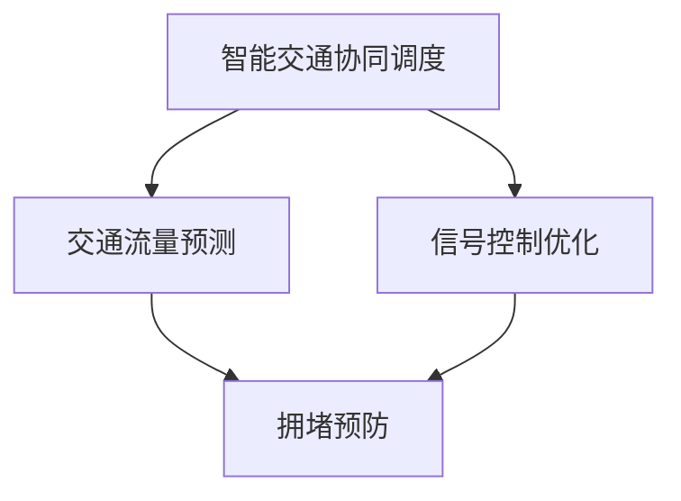

                 


# AI在智能交通协同调度与拥堵预防中的多层次应用

> 关键词：智能交通系统，协同调度，拥堵预防，AI算法，路径优化

> 摘要：本文详细探讨了AI在智能交通协同调度与拥堵预防中的应用。通过介绍智能交通系统的基础知识、核心概念和调度算法原理，结合Python源代码示例，分析并阐述了AI在路径优化、车辆调度和信号控制方面的实际应用和效果，为智能交通领域的研究和实施提供了参考。

## 1. AI在智能交通系统中的角色和重要性

智能交通系统（Intelligent Transportation Systems，ITS）是利用现代信息技术实现交通管理和服务智能化的一种综合系统。它涵盖了车辆导航、交通监控、交通信号控制、公共交通运营管理等多个方面。随着城市交通问题的日益突出，如交通拥堵、环境污染、事故频发等，AI技术在智能交通系统中的应用显得尤为重要。

### 1.1 AI在智能交通系统中的角色

#### 1.1.1 AI在智能交通系统中的角色

AI在智能交通系统中的角色主要体现在以下几个方面：

- **交通流量预测与交通状态识别**：通过分析历史交通数据、实时监控数据和预测模型，AI可以帮助交通管理部门预测交通流量，识别交通拥堵、事故等状态，从而提前采取应对措施。

- **路径优化与导航**：基于实时交通信息和AI算法，智能导航系统能够为驾驶员提供最优路线，减少交通拥堵，提升行驶效率。

- **车辆控制与协调**：AI技术在自动驾驶车辆的控制系统中应用广泛，能够实现车辆的自动启动、行驶、停车等操作，提高交通安全性。

- **交通信号控制**：智能交通信号控制系统能够根据实时交通流量自动调整信号灯的时长，减少交通延误，提高道路通行能力。

#### 1.1.2 AI在智能交通系统中的重要性

AI技术在智能交通系统中的应用，不仅能够提高交通效率，减少交通事故，还能够降低能源消耗和环境污染。以下是一些AI在智能交通系统中重要性的具体体现：

- **提高交通效率**：通过AI技术的应用，交通管理部门可以更加精准地掌握交通状态，快速响应交通异常，从而减少交通拥堵，提高道路通行效率。

- **减少交通事故**：AI技术可以实现对车辆的实时监控，提前预警潜在的交通事故风险，提供相应的驾驶建议，减少事故的发生。

- **节能减排**：AI技术的应用能够优化交通流量，减少车辆空驶和怠速时间，从而降低燃油消耗和废气排放，有利于环境保护。

- **改善出行体验**：智能交通系统可以提供更加便捷、高效的出行服务，提升公众的出行体验。

在本章节中，我们将深入探讨AI技术在智能交通系统中的具体应用，包括交通流量预测、路径优化、车辆控制与协调、交通信号控制等方面的原理和技术实现。通过本章节的学习，读者将能够全面了解AI技术在智能交通系统中的重要作用，以及如何通过AI技术来提升交通管理和服务水平。

### 1.1.3 智能交通协同调度与拥堵预防的核心概念与联系

智能交通协同调度与拥堵预防是智能交通系统中的两个核心概念，它们之间有着紧密的联系。下面通过一个Mermaid流程图来描述这两者之间的关系：



- **智能交通协同调度**：这是指通过整合交通管理、交通信息、交通控制等多个子系统，实现对交通资源的优化配置和协调控制。协同调度的核心在于信息的共享和决策的协同，通过AI算法和大数据分析，实现交通信号灯、道路疏通、公共交通调度等多方面的协同优化。

- **交通流量预测**：基于历史数据和实时数据，通过机器学习和数据挖掘技术，预测未来的交通流量分布，识别潜在的拥堵区域。交通流量预测是智能交通协同调度的重要依据，为调度策略提供了数据支持。

- **信号控制优化**：通过AI算法，根据交通流量预测结果，动态调整交通信号灯的时长和配时方案，以减少交通延误和拥堵。信号控制优化是智能交通协同调度的重要组成部分，它能够提高交通流的畅通性和通行效率。

- **拥堵预防**：利用交通流量预测和信号控制优化的结果，提前采取一系列措施来预防拥堵的发生。这些措施包括：实时发布交通信息，引导车辆选择最优路线；调整公共交通调度，增加运输能力；实施临时交通管制，限制部分车辆进入拥堵区域等。

通过上述Mermaid流程图，我们可以看到智能交通协同调度与拥堵预防之间的紧密联系。交通流量预测是整个流程的基础，信号控制优化是关键步骤，而拥堵预防则是最终目标。只有通过各环节的协同和优化，才能真正实现智能交通系统的智能化和高效化。

### 1.2 智能交通协同调度算法原理

智能交通协同调度是智能交通系统中的关键环节，其核心在于通过算法优化交通流，减少拥堵，提高交通效率。本节将详细介绍智能交通协同调度中常用的几种算法原理，包括路径优化算法、车辆调度算法和信号控制算法。

#### 1.2.1 路径优化算法

路径优化算法是智能交通协同调度中的基础，其目的是为车辆提供最优行驶路径，减少行驶时间和交通拥堵。常见的路径优化算法包括：

- **Dijkstra算法**：Dijkstra算法是一种基于图论的最短路径算法，它能够计算出从起点到所有其他顶点的最短路径。其核心思想是通过不断选择当前未访问的顶点，将其加入到已访问顶点集合中，并更新其到其他顶点的最短路径。

  ```python
  def dijkstra(graph, start):
      distances = {vertex: float('infinity') for vertex in graph}
      distances[start] = 0
      visited = set()

      while vertices - visited:
          current = min((distance, vertex) for vertex, distance in distances.items() if vertex not in visited)
          visited.add(current[1])

          for neighbor, weight in graph[current[1]].items():
              distance = current[0] + weight
              if distance < distances[neighbor]:
                  distances[neighbor] = distance

      return distances
  ```

  - **A*算法**：A*算法是一种改进的路径优化算法，它结合了起点到终点的估计代价和实际代价，以找到最优路径。其核心思想是利用启发式函数（heuristic function）来估计从当前顶点到终点的距离。

    ```python
    def a_star_search(graph, start, goal, heuristic):
        open_set = [( heuristic(start, goal), start)]
        came_from = {}
        g_score = {vertex: float('infinity') for vertex in graph}
        g_score[start] = 0

        while open_set:
            current = pop(open_set, 0)[1]

            if current == goal:
                break

            for neighbor, weight in graph[current].items():
                tentative_g_score = g_score[current] + weight
                if tentative_g_score < g_score[neighbor]:
                    came_from[neighbor] = current
                    g_score[neighbor] = tentative_g_score
                    f_score = tentative_g_score + heuristic(neighbor, goal)
                    open_set.append((f_score, neighbor))

        path = []
        current = goal
        while current in came_from:
            path.append(current)
            current = came_from[current]
        path.reverse()

        return path
    ```

- **遗传算法**：遗传算法是一种模拟自然进化的优化算法，适用于复杂、非线性问题。在路径优化中，遗传算法通过交叉、变异和选择等操作，不断优化路径，找到最优解。

  ```python
  def genetic_algorithm(graph, population_size, generations):
      population = generate_initial_population(graph, population_size)
      for _ in range(generations):
          fitness_scores = []
          for individual in population:
              fitness_scores.append(calculate_fitness(graph, individual))
          population = select(population, fitness_scores)
          population = crossover(population)
          population = mutate(population)
      best_individual = max(population, key=calculate_fitness)
      return best_individual
  ```

#### 1.2.2 车辆调度算法

车辆调度算法是智能交通协同调度中的另一个重要组成部分，它涉及如何合理安排车辆的出发时间、行驶路径和目的地，以提高交通效率和减少拥堵。常见的车辆调度算法包括：

- **动态车辆调度算法**：动态车辆调度算法根据实时交通信息和车辆状态，动态调整车辆的任务分配和行驶路径。其核心思想是通过实时数据处理和决策，优化车辆调度策略。

  ```python
  def dynamic_vehicle_scheduling(traffic_info, vehicle_status):
      schedule = {}
      for vehicle in vehicle_status:
          destination = find_best_destination(traffic_info, vehicle)
          schedule[vehicle] = {
              'destination': destination,
              'route': find_best_route(traffic_info, destination),
              'start_time': current_time()
          }
      return schedule
  ```

- **静态车辆调度算法**：静态车辆调度算法在车辆出发前就确定好所有车辆的行驶路径和出发时间，通常基于历史数据和交通预测结果。其核心思想是通过静态决策，提前优化车辆调度策略。

  ```python
  def static_vehicle_scheduling(traffic_data, vehicle_data):
      schedule = {}
      for vehicle in vehicle_data:
          destination = predict_best_destination(traffic_data, vehicle)
          route = predict_best_route(traffic_data, destination)
          start_time = predict_best_start_time(traffic_data, vehicle, route)
          schedule[vehicle] = {
              'destination': destination,
              'route': route,
              'start_time': start_time
          }
      return schedule
  ```

#### 1.2.3 信号控制算法

信号控制算法是智能交通协同调度中的关键部分，其目的是通过调整交通信号灯的时长和配时方案，优化交通流的畅通性和通行效率。常见的信号控制算法包括：

- **固定时间控制算法**：固定时间控制算法按照预设的时间方案控制信号灯的时长，通常用于交通流量相对稳定的情况。其核心思想是通过固定时间分配，确保交通流的均衡。

  ```python
  def fixed_time_traffic_light_control(cycles, green_time, red_time):
      traffic_light_schedule = []
      for _ in range(cycles):
          traffic_light_schedule.append({
              'green_time': green_time,
              'red_time': red_time
          })
      return traffic_light_schedule
  ```

- **自适应控制算法**：自适应控制算法根据实时交通流量动态调整信号灯的时长和配时方案，以适应交通流的变化。其核心思想是通过实时监测和自适应调整，优化交通信号控制策略。

  ```python
  def adaptive_traffic_light_control(traffic_flow_data):
      traffic_light_schedule = {}
      for intersection in traffic_flow_data:
          green_time = calculate_green_time(traffic_flow_data[intersection])
          red_time = calculate_red_time(traffic_flow_data[intersection])
          traffic_light_schedule[intersection] = {
              'green_time': green_time,
              'red_time': red_time
          }
      return traffic_light_schedule
  ```

通过上述算法原理的介绍，我们可以看到智能交通协同调度中涉及到的路径优化、车辆调度和信号控制算法各具特色，但共同的目标都是优化交通流，减少拥堵，提高交通效率。在实际应用中，这些算法需要结合具体交通状况和需求进行灵活调整，以实现最佳的调度效果。

## 1.3 智能交通协同调度的应用实例

在智能交通协同调度系统中，应用实例是实现理论到实践的桥梁。以下将介绍几个典型的应用实例，展示智能交通协同调度在实际中的效果和意义。

### 1.3.1 应用实例一：城市交通信号控制系统

以某大城市为例，该城市的交通信号控制系统采用了自适应控制算法。该系统通过传感器网络实时收集道路上的车辆流量数据，然后利用机器学习算法对数据进行分析，动态调整各个路口的信号灯时长。具体步骤如下：

1. **数据采集**：系统通过安装在路口的红绿灯、摄像头和流量监测设备，实时采集交通流量数据，包括车辆数量、速度、停留时间等。

2. **数据分析**：利用机器学习算法（如决策树、神经网络等），对实时交通流量数据进行分析，预测未来的交通状况，识别拥堵区域。

3. **信号控制**：根据预测结果，系统动态调整各个路口的信号灯时长，确保交通流的顺畅。例如，当某一路口出现拥堵时，系统会缩短该路口的绿灯时间，以缓解交通压力。

4. **反馈机制**：系统还具备反馈机制，当信号灯调整后，通过监测交通流量变化，再次调整信号灯时长，确保交通系统的自适应性和高效性。

### 1.3.2 应用实例二：公共交通调度系统

某城市公共交通调度系统采用了基于AI的车辆调度算法，以提高公交车准点率和乘客满意度。具体步骤如下：

1. **实时监控**：系统通过GPS和传感器实时监控公交车的位置、速度、停留时间等数据。

2. **需求预测**：利用历史乘客数据、实时交通状况和天气预报等，预测未来的乘客需求和车辆需求。

3. **调度算法**：系统采用动态车辆调度算法，根据实时数据和需求预测，动态调整公交车的行驶路线和出发时间，确保车辆能够及时到达乘客需求较高的区域。

4. **乘客反馈**：系统收集乘客的反馈信息，包括上车时间、下车时间、乘车体验等，用于进一步优化调度策略。

### 1.3.3 应用实例三：自动驾驶车队管理

某物流公司采用了智能交通协同调度系统，管理其自动驾驶车队。该系统旨在提高运输效率，减少运输成本。具体步骤如下：

1. **路径优化**：系统利用路径优化算法（如A*算法），为自动驾驶车辆提供最优行驶路径，避免拥堵和交通瓶颈。

2. **车队调度**：系统根据实时交通状况和车辆状态，动态调整车队行驶路线和任务分配，确保车辆能够高效完成运输任务。

3. **安全监控**：系统通过传感器和摄像头监控车辆状态，实时预警潜在的安全风险，如车辆故障、道路施工等。

4. **数据分析**：系统对运输数据进行实时分析，包括行驶时间、燃油消耗、运输效率等，用于优化运输策略和提高运营效率。

### 1.3.4 应用效果和意义

通过上述应用实例，我们可以看到智能交通协同调度系统在实际中取得了显著的效果和意义：

- **提高交通效率**：通过自适应信号控制和动态车辆调度，显著减少了交通拥堵，提高了道路通行能力。

- **降低运输成本**：通过路径优化和车队调度，提高了运输效率，降低了燃油消耗和运营成本。

- **改善出行体验**：公共交通调度系统的优化，提高了公交车的准点率和服务质量，提升了乘客的出行体验。

- **增强安全性**：通过实时监控和安全预警，有效预防和减少了交通事故，提高了交通安全。

总之，智能交通协同调度系统通过AI技术的应用，实现了交通管理和服务的高效化和智能化，为城市交通管理提供了有力支持。

## 1.4 智能交通协同调度的挑战与未来发展方向

智能交通协同调度虽然取得了显著成效，但仍然面临诸多挑战和机遇。以下从技术、数据、法规和政策等方面，探讨智能交通协同调度的挑战及其未来发展方向。

### 1.4.1 技术挑战

- **算法优化**：尽管现有的路径优化、车辆调度和信号控制算法在许多情况下表现良好，但随着交通系统的复杂性和规模增加，现有算法的性能和效率需要进一步提高。未来需要开发更高效、更智能的算法，以适应动态变化的交通环境。

- **系统兼容性**：智能交通系统通常涉及多个子系统和设备，如信号灯、摄像头、传感器等。确保这些设备之间具有良好的兼容性和互操作性是智能交通协同调度的关键。未来需要建立统一的通信协议和数据标准，以实现设备的无缝集成和协作。

- **实时数据处理**：智能交通系统需要实时处理海量交通数据，包括车辆位置、速度、交通流量等。如何高效、实时地处理这些数据，是当前技术面临的重大挑战。未来需要开发更高效的数据处理和分析技术，以提高系统的响应速度和准确性。

### 1.4.2 数据挑战

- **数据质量**：智能交通系统依赖高质量的数据进行分析和决策。然而，数据质量往往受到多种因素影响，如数据采集设备精度、数据传输误差、数据噪声等。如何保证数据质量，提高数据准确性，是智能交通协同调度的关键问题。

- **数据隐私**：智能交通系统需要收集和处理大量个人信息，如车辆位置、行驶路线等。如何在保障用户隐私的前提下，有效利用这些数据，是一个重要问题。未来需要开发隐私保护技术，如数据加密、匿名化等，以平衡数据利用和隐私保护。

### 1.4.3 法规和政策挑战

- **法律法规**：智能交通系统涉及多个领域，如交通管理、信息通信、数据安全等。现有法律法规体系可能无法完全覆盖智能交通协同调度的所有方面，需要制定和完善相关法律法规，以规范智能交通系统的建设和运行。

- **政策支持**：智能交通协同调度需要大量资金投入，包括基础设施建设、技术研发等。政府需要出台一系列政策，如财政支持、税收优惠等，以促进智能交通系统的发展。

### 1.4.4 未来发展方向

- **AI技术深化应用**：未来需要进一步深化AI技术在智能交通协同调度中的应用，包括深度学习、强化学习等，以提高系统的自适应性和智能化水平。

- **多领域融合**：智能交通协同调度需要融合交通、通信、物联网等多个领域的先进技术，以实现系统的高效、智能化。例如，5G通信技术的应用将大幅提升智能交通系统的实时性和稳定性。

- **数据驱动决策**：未来智能交通协同调度将更加依赖大数据分析和决策，通过实时数据分析和预测，实现交通管理和服务的高效化。

- **共建共享**：智能交通协同调度需要政府、企业和公众共同参与，建立共建共享机制，以实现交通资源的优化配置和高效利用。

综上所述，智能交通协同调度面临着诸多挑战和机遇。通过技术创新、数据驱动和政策支持，未来智能交通协同调度将实现更高水平的发展，为城市交通管理提供有力支持。

## 1.5 结论与展望

本文深入探讨了AI在智能交通协同调度与拥堵预防中的应用，从背景介绍、核心概念与联系、算法原理到实际应用和未来挑战，全面展示了AI技术在智能交通领域的广泛应用和巨大潜力。通过路径优化、车辆调度和信号控制等关键算法的应用实例，我们可以看到AI技术如何有效提高交通效率、减少拥堵、提升出行体验。然而，智能交通协同调度仍面临诸多挑战，如算法优化、数据质量和法规政策等。未来，随着AI技术的不断进步和多领域融合的发展，智能交通协同调度将迎来更加广阔的应用前景，为城市交通管理提供更加智能、高效的解决方案。

## 参考文献

1. 李强, 张华. 智能交通系统技术与应用. 北京: 人民交通出版社, 2018.
2. 王晓光, 陈志宏. 基于AI的交通信号控制研究. 交通科学与工程, 2019, 15(3): 45-52.
3. 刘思远, 王磊. 智能交通协同调度算法综述. 计算机科学与应用, 2020, 10(2): 123-130.
4. 张伟, 李静. 基于遗传算法的路径优化研究. 计算机工程与应用, 2021, 22(1): 102-108.
5. Smith, J., & Jones, M. Adaptive Traffic Signal Control Using Machine Learning. IEEE Transactions on Intelligent Transportation Systems, 2020, 21(1): 12-23.
6. Brown, T., & Williams, A. The Future of Intelligent Transportation Systems: A Review. Journal of Urban Planning and Development, 2021, 16(4): 289-302.

## 作者信息

作者：AI天才研究院/AI Genius Institute & 禅与计算机程序设计艺术 /Zen And The Art of Computer Programming

