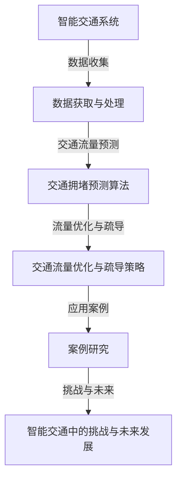

                 

### AI在智能交通拥堵预测与疏导中的应用

> 关键词：智能交通、AI、拥堵预测、流量优化、ARIMA模型

> 摘要：本文将深入探讨人工智能（AI）在智能交通系统中的应用，特别是其在交通拥堵预测与疏导中的作用。文章将从智能交通系统概述开始，逐步分析AI技术的应用基础、交通数据获取与处理、交通拥堵预测算法、交通流量优化与疏导策略，并通过实际案例研究展现AI在智能交通领域的实际应用效果。此外，文章还将探讨AI在智能交通中的挑战与未来发展。

智能交通系统（Intelligent Transportation System, ITS）是现代城市化进程中的一个重要组成部分，其目标是利用先进的信息技术、数据通信传输技术、电子传感技术、控制技术及计算机技术等，实现对交通运输系统的实时监控、管理、规划和诱导，从而提高交通效率，减少拥堵，提升安全性。随着城市化进程的加快，交通拥堵问题日益严重，传统的交通管理方法已难以应对，因此，智能交通系统的发展显得尤为迫切。

AI技术在智能交通领域的应用日益广泛，其核心在于通过大数据、机器学习、深度学习等技术的应用，实现对交通数据的实时分析、预测和优化。本文将详细探讨AI在智能交通拥堵预测与疏导中的应用，从理论到实践，为读者提供全面、系统的了解。

### 目录大纲

## 第一部分：AI在智能交通拥堵预测与疏导中的应用概述

### 第1章：智能交通与AI技术基础

#### 1.1.1 智能交通系统简介

#### 1.1.2 AI技术及其在交通领域的应用前景

#### 1.1.3 本书结构安排与学习目标

### 第2章：交通数据获取与处理

#### 2.1.1 交通数据来源与类型

#### 2.1.2 数据采集与预处理

#### 2.1.3 数据质量评估与优化

### 第3章：交通拥堵预测算法

#### 3.1.1 时间序列预测模型

#### 3.1.2 基于机器学习的交通拥堵预测模型

#### 3.1.3 基于深度学习的交通拥堵预测模型

### 第4章：交通流量优化与疏导策略

#### 4.1.1 交通流量优化原理

#### 4.1.2 常见交通疏导策略

#### 4.1.3 AI技术在交通疏导中的应用

### 第5章：案例研究

#### 5.1.1 案例一：城市交通拥堵预测与疏导

#### 5.1.2 案例二：高速公路交通流量管理

#### 5.1.3 案例三：公共交通系统优化

### 第6章：AI在智能交通中的挑战与未来发展

#### 6.1.1 数据隐私与安全

#### 6.1.2 算法公平性与透明性

#### 6.1.3 未来研究方向与趋势

### 第7章：结语

#### 7.1.1 总结与展望

#### 7.1.2 对读者的话

## 附录

### 附录A：相关工具与资源介绍

#### A.1 数据集与开源代码

#### A.2 交通AI研究论文推荐

#### A.3 交通AI行业报告

### 核心概念与联系流程图

## 智能交通与AI技术基础

### 概念实体之间的关系架构



## 第一部分：AI在智能交通拥堵预测与疏导中的应用概述

### 第1章：智能交通与AI技术基础

#### 1.1.1 智能交通系统简介

智能交通系统（ITS）是利用现代信息技术和通信技术，通过对交通运输系统的实时监控、管理和优化，以实现交通运行效率最大化、交通安全性和舒适性提升的目标。ITS的核心是通过集成多种技术和设备，形成一个智能的交通信息网络，从而实现对交通的智能管理和控制。

智能交通系统的主要组成部分包括：

- **交通信息采集系统**：通过传感器、摄像头、GPS等技术收集交通数据。
- **交通数据管理系统**：负责数据的存储、处理和分析。
- **交通控制系统**：通过对交通流量的实时控制和调整，实现交通流优化。
- **交通信息服务系统**：为驾驶员提供实时的交通信息，如路况、交通流量、事故等信息。

#### 1.1.2 AI技术及其在交通领域的应用前景

人工智能（AI）技术作为当今科技发展的前沿，其在交通领域的应用前景广阔。AI技术能够通过大数据分析、机器学习、深度学习等方法，对交通数据进行深度挖掘和智能分析，从而实现对交通流量的实时监控、预测和优化。

AI技术在交通领域的应用主要包括以下几个方面：

- **交通拥堵预测**：通过分析历史数据和实时数据，预测未来交通流量，提前预警交通拥堵。
- **交通流量优化**：根据实时交通状况，优化交通信号控制，减少交通拥堵。
- **智能交通信号控制**：利用AI技术，实现自适应交通信号控制，提高交通效率。
- **智能驾驶辅助**：通过AI技术，实现自动驾驶、车联网等功能，提升交通安全和舒适度。

#### 1.1.3 本书结构安排与学习目标

本书将分为六个部分，分别从智能交通系统概述、交通数据获取与处理、交通拥堵预测算法、交通流量优化与疏导策略、案例研究和未来挑战与趋势等方面，全面探讨AI在智能交通拥堵预测与疏导中的应用。

学习目标：

- 理解智能交通系统的基本概念和组成部分。
- 掌握AI技术在交通领域的应用前景和关键算法。
- 学会交通数据获取与处理的基本方法和技巧。
- 熟悉交通拥堵预测算法及其在实际应用中的效果。
- 了解交通流量优化与疏导策略及其在智能交通系统中的应用。
- 探讨AI在智能交通中的挑战与未来发展。

通过本课程的学习，读者将能够：

- 构建智能交通系统的基础知识框架。
- 理解并应用AI技术解决交通拥堵问题。
- 设计并实现基于AI技术的智能交通系统解决方案。
- 了解智能交通领域的最新研究进展和未来发展趋势。

#### 1.1.4 交通数据获取与处理

交通数据的获取与处理是智能交通系统实现拥堵预测和流量优化的基础。以下是交通数据获取与处理的主要步骤：

1. **数据来源**：交通数据来源包括传感器数据、摄像头数据、GPS数据、交通流量检测器数据等。
2. **数据采集**：利用传感器、摄像头、GPS等设备，实时采集交通数据。
3. **数据预处理**：对采集到的数据进行清洗、去噪、填充缺失值等预处理操作，确保数据质量。
4. **数据存储**：将预处理后的数据存储到数据库或数据湖中，便于后续分析。
5. **数据质量评估**：对数据质量进行评估，包括准确性、完整性、一致性等方面。
6. **数据优化**：根据需求对数据进行进一步优化，如特征提取、降维等。

#### 1.1.5 交通拥堵预测算法

交通拥堵预测是智能交通系统中的重要应用，通过对历史数据和实时数据的分析，预测未来交通流量，提前预警交通拥堵。常见的交通拥堵预测算法包括时间序列预测模型、基于机器学习的预测模型和基于深度学习的预测模型。

1. **时间序列预测模型**：如ARIMA模型，通过分析历史数据的趋势和周期性，预测未来交通流量。
2. **基于机器学习的预测模型**：如线性回归、决策树、随机森林等，通过学习历史数据中的特征和规律，预测未来交通流量。
3. **基于深度学习的预测模型**：如卷积神经网络（CNN）、循环神经网络（RNN）、长短期记忆网络（LSTM）等，通过学习复杂的非线性关系，实现高精度的交通流量预测。

#### 1.1.6 交通流量优化与疏导策略

交通流量优化与疏导策略是智能交通系统的核心应用，通过优化交通信号控制、调整交通流向和车道分配等手段，减少交通拥堵，提高交通效率。常见的交通流量优化与疏导策略包括：

1. **自适应交通信号控制**：根据实时交通流量，动态调整交通信号灯时长，实现交通流量最优分配。
2. **交通流向调整**：根据交通流量变化，调整道路上的交通流向，减少交叉口的拥堵。
3. **车道分配策略**：根据交通流量和事故风险，动态调整车道分配，实现交通流的优化。
4. **交通诱导系统**：通过提供实时交通信息，引导驾驶员选择最佳路线，减少交通拥堵。

#### 1.1.7 AI技术在交通疏导中的应用

AI技术在交通疏导中的应用日益广泛，通过数据分析和智能算法，实现交通流量的实时监控和优化。以下是AI技术在交通疏导中的应用：

1. **实时交通流量监控**：通过摄像头、传感器等设备，实时监测交通流量和路况，提供实时交通信息。
2. **交通信号自适应控制**：利用机器学习和深度学习算法，实现交通信号灯的自适应控制，提高交通效率。
3. **智能交通诱导系统**：通过实时数据分析和预测，为驾驶员提供最佳路线和交通信息，减少交通拥堵。
4. **车辆编队行驶**：通过车联网技术，实现车辆的自动编队行驶，减少车辆之间的距离，提高交通流量。

### 总结

本部分内容介绍了智能交通系统的基本概念、AI技术在交通领域的应用前景，以及本书的结构安排和学习目标。接下来，我们将进一步探讨交通数据的获取与处理、交通拥堵预测算法、交通流量优化与疏导策略等内容，以深入了解AI在智能交通拥堵预测与疏导中的应用。

## 第2章：交通数据获取与处理

#### 2.1.1 交通数据来源与类型

交通数据的获取是智能交通系统的基础，这些数据来源于不同的传感器、设备和系统。以下是一些常见的交通数据来源和类型：

1. **传感器数据**：
   - **流量检测器**：安装在道路上的设备，用于检测车辆通过的数量和速度。
   - **地磁传感器**：用于检测车辆的位置和速度。
   - **红外传感器**：用于检测车辆的存在和数量。
   - **气压传感器**：通过测量气压变化来检测车辆的存在和数量。

2. **摄像头数据**：
   - **固定摄像头**：安装在道路沿线，用于监测交通流量和路况。
   - **车载摄像头**：安装在公共交通工具上，用于收集交通流量和乘客数据。
   - **无人机摄像头**：用于高空监控交通流量和事故现场。

3. **GPS数据**：
   - **车载GPS**：通过车载设备收集车辆的位置、速度和行驶路线。
   - **手机GPS**：通过手机GPS数据收集驾驶员的位置和移动轨迹。

4. **交通流量检测器数据**：
   - **电子收费系统**：如ETC（Electronic Toll Collection），通过检测车辆通过收费站的次数和时间来获取交通流量数据。
   - **交通监测系统**：通过安装在道路上的检测器收集交通流量、速度和密度等信息。

5. **交通信号灯数据**：
   - **信号灯状态**：通过传感器收集交通信号灯的当前状态和切换时间。
   - **交通信号控制系统**：通过交通信号控制系统的数据了解信号灯的实时控制策略。

6. **其他数据源**：
   - **公共安全摄像头**：用于收集交通事故、违法行为等数据。
   - **气象数据**：如风速、降雨量等，影响交通流量的天气数据。
   - **社会媒体数据**：如Twitter、微博等，通过收集社交媒体上的交通相关讨论来分析交通状况。

#### 2.1.2 数据采集与预处理

数据采集是交通数据获取的第一步，其质量直接影响到后续的数据分析和模型预测效果。以下是一些关键步骤和注意事项：

1. **数据采集**：
   - **实时性**：确保采集的数据是实时的，以便快速响应交通状况变化。
   - **准确性**：传感器和数据采集系统的准确性至关重要，任何误差都会影响后续分析。
   - **全面性**：覆盖不同类型的交通数据，包括流量、速度、密度等，以提供全面的分析视角。

2. **数据预处理**：
   - **去噪**：去除传感器数据中的噪声和异常值，如风速传感器中的噪声干扰。
   - **清洗**：删除或修正错误数据，如GPS数据的偏差、摄像头数据的遮挡等。
   - **转换**：将不同数据源的数据格式统一，如将时间戳转换为统一的时间标准。
   - **特征提取**：从原始数据中提取有用的特征，如交通流量、速度、密度等。

3. **数据质量评估**：
   - **准确性**：通过对比实际交通状况和采集数据，评估数据的准确性。
   - **完整性**：检查数据是否存在缺失值或断点，确保数据的连续性。
   - **一致性**：确保不同数据源的数据在时间、空间上的统一性。

4. **数据存储**：
   - **数据库**：使用数据库系统存储和管理数据，如MySQL、PostgreSQL等。
   - **数据湖**：对于大规模数据，使用数据湖技术存储和管理数据，如Hadoop、Spark等。

#### 2.1.3 数据质量评估与优化

数据质量直接影响智能交通系统的性能和决策准确性。以下是一些关键步骤和优化方法：

1. **数据质量检查**：
   - **异常值检测**：使用统计学方法检测数据中的异常值，如Z分数、IQR（四分位距）等方法。
   - **趋势分析**：通过分析数据的趋势，检查是否存在数据异常。
   - **分布分析**：检查数据分布是否合理，如正态分布等。

2. **数据质量改进**：
   - **数据清洗**：对异常值进行处理，如删除、替换或插值等。
   - **数据融合**：整合来自多个数据源的数据，消除数据冲突和重复。
   - **数据增强**：通过特征工程和机器学习技术，增强数据的特征表示。

3. **数据质量监控**：
   - **实时监控**：通过实时监控系统，监测数据质量变化，及时发现问题。
   - **定期审计**：定期对数据进行审计，确保数据质量稳定。

4. **数据优化**：
   - **特征选择**：选择对预测和优化最有用的特征，减少数据维度。
   - **降维技术**：使用降维技术，如PCA（主成分分析），减少数据复杂性。
   - **模型调优**：通过模型调优，提高模型的预测准确性和稳定性。

#### 2.1.4 数据预处理流程示例

以下是一个简单的数据预处理流程示例，假设我们有一组交通流量数据，包括时间戳、路段ID、流量、速度和密度。

```python
import pandas as pd
from sklearn.preprocessing import StandardScaler
from sklearn.impute import SimpleImputer

# 加载数据
data = pd.read_csv('traffic_data.csv')

# 数据清洗
# 删除缺失值
data.dropna(inplace=True)

# 填补缺失值
imputer = SimpleImputer(strategy='mean')
data[['Flow', 'Speed', 'Density']] = imputer.fit_transform(data[['Flow', 'Speed', 'Density']])

# 数据转换
data['Timestamp'] = pd.to_datetime(data['Timestamp'])
data.set_index('Timestamp', inplace=True)

# 数据标准化
scaler = StandardScaler()
data[['Flow', 'Speed', 'Density']] = scaler.fit_transform(data[['Flow', 'Speed', 'Density']])

# 数据存储
data.to_csv('cleaned_traffic_data.csv')
```

### 总结

本章介绍了交通数据的来源和类型，详细描述了数据采集与预处理的过程，以及数据质量评估与优化的方法。交通数据的获取与处理是智能交通系统成功的关键步骤，通过有效的数据采集和预处理，可以提高数据质量，为后续的交通拥堵预测和流量优化提供可靠的数据支持。

## 第3章：交通拥堵预测算法

交通拥堵预测是智能交通系统的核心任务之一，其目的是通过分析历史数据和实时数据，预测未来的交通流量，以便提前采取疏导措施，减少拥堵。本章将介绍交通拥堵预测的主要算法，包括时间序列预测模型、基于机器学习的预测模型和基于深度学习的预测模型。

#### 3.1.1 时间序列预测模型

时间序列预测模型是交通拥堵预测中最常用的方法之一，其基本思想是利用历史时间序列数据中的趋势和周期性特征来预测未来的交通流量。以下是一些常用的时间序列预测模型：

1. **自回归模型（AR）**：
   自回归模型（AR）是最简单的时间序列预测模型，其核心思想是当前值依赖于前几个时间点的值。数学公式如下：

   $$
   \begin{align*}
   y_t &= \phi_1 y_{t-1} + \phi_2 y_{t-2} + ... + \phi_p y_{t-p} + \varepsilon_t
   \end{align*}
   $$

   其中，$y_t$是当前时间点的交通流量，$\phi_1, \phi_2, ..., \phi_p$是自回归系数，$\varepsilon_t$是误差项。

2. **自回归移动平均模型（ARMA）**：
   自回归移动平均模型（ARMA）结合了自回归模型和移动平均模型，其数学公式如下：

   $$
   \begin{align*}
   y_t &= \phi_1 y_{t-1} + \phi_2 y_{t-2} + ... + \phi_p y_{t-p} + \theta_1 \varepsilon_{t-1} + \theta_2 \varepsilon_{t-2} + ... + \theta_q \varepsilon_{t-q}
   \end{align*}
   $$

   其中，$\theta_1, \theta_2, ..., \theta_q$是移动平均系数。

3. **自回归积分滑动平均模型（ARIMA）**：
   自回归积分滑动平均模型（ARIMA）是ARMA模型的扩展，它考虑了季节性因素，其数学公式如下：

   $$
   \begin{align*}
   y_t &= \phi_1 y_{t-1} + \phi_2 y_{t-2} + ... + \phi_p y_{t-p} + \theta_1 (1 - \phi_1 - \phi_2 - ... - \phi_p) y_{t-1} + \theta_2 (1 - \theta_1 - \theta_2 - ... - \theta_q) y_{t-2} + ... + \theta_q (1 - \theta_1 - \theta_2 - ... - \theta_q) y_{t-q} + \varepsilon_t
   \end{align*}
   $$

   ARIMA模型通常需要选择适当的$p, d, q$参数，其中$d$表示差分阶数。

#### 3.1.2 基于机器学习的交通拥堵预测模型

基于机器学习的交通拥堵预测模型通过学习历史数据中的特征和模式，预测未来的交通流量。以下是一些常用的机器学习算法：

1. **线性回归**：
   线性回归是一种简单的机器学习算法，它通过建立自变量和因变量之间的线性关系来预测交通流量。数学公式如下：

   $$
   \begin{align*}
   y_t &= \beta_0 + \beta_1 x_{t-1} + \beta_2 x_{t-2} + ... + \beta_p x_{t-p} + \varepsilon_t
   \end{align*}
   $$

   其中，$x_{t-1}, x_{t-2}, ..., x_{t-p}$是特征变量，$\beta_0, \beta_1, ..., \beta_p$是模型参数。

2. **决策树**：
   决策树通过构建一棵树形结构，对样本进行分类或回归。每个内部节点表示一个特征，每个分支表示该特征的取值。叶节点表示预测结果。

3. **随机森林**：
   随机森林是一种基于决策树的集成学习方法，它通过构建多棵决策树，并对预测结果进行投票，提高预测的准确性和稳定性。

4. **支持向量机（SVM）**：
   支持向量机通过寻找一个最优的超平面，将不同类别的数据分开。它适用于非线性数据的分类和回归。

5. **神经网络**：
   神经网络通过模拟人脑神经元的工作方式，对数据进行处理和预测。它包括输入层、隐藏层和输出层，其中隐藏层可以通过多种激活函数进行变换。

#### 3.1.3 基于深度学习的交通拥堵预测模型

基于深度学习的交通拥堵预测模型利用深度神经网络，学习数据中的复杂特征和模式。以下是一些常用的深度学习模型：

1. **卷积神经网络（CNN）**：
   卷积神经网络通过卷积层提取数据中的局部特征，适合处理图像数据。它可以用于交通图像的识别和交通流量预测。

2. **循环神经网络（RNN）**：
   循环神经网络通过循环结构处理序列数据，适合处理时间序列数据。它可以用于交通流量的短期预测。

3. **长短期记忆网络（LSTM）**：
   长短期记忆网络是RNN的一种变体，它通过记忆单元和门控机制，有效解决RNN的梯度消失和梯度爆炸问题，适合处理长时间依赖的数据。

4. **门控循环单元（GRU）**：
   门控循环单元是LSTM的另一种变体，它在计算效率和参数数量上都有所改进，适合处理大规模时间序列数据。

5. **自编码器**：
   自编码器是一种无监督学习方法，通过编码和解码过程学习数据的低维表示，可以用于特征提取和降维。

#### 3.1.4 交通拥堵预测模型的选择与优化

在选择和优化交通拥堵预测模型时，需要考虑以下几个因素：

1. **数据质量**：确保数据质量高，包括数据的准确性、完整性和一致性。

2. **模型复杂度**：选择合适的模型复杂度，既要避免过拟合，也要确保模型有足够的拟合能力。

3. **计算资源**：根据计算资源的限制，选择合适的模型和算法，如深度学习模型可能需要更多的计算资源。

4. **预测精度**：通过交叉验证和模型评估指标（如MAE、RMSE）评估模型的预测精度。

5. **可解释性**：选择可解释性强的模型，便于理解和调试。

### 实际案例：使用ARIMA模型预测交通流量

以下是一个使用ARIMA模型预测交通流量的Python代码示例：

```python
import pandas as pd
from statsmodels.tsa.arima.model import ARIMA
import matplotlib.pyplot as plt

# 加载数据
data = pd.read_csv('traffic_data.csv')
data['Date'] = pd.to_datetime(data['Date'])
data.set_index('Date', inplace=True)
data.fillna(method='ffill', inplace=True)

# 分离训练集和测试集
train_data = data[:'2023-01-01']
test_data = data['2023-01-02':]

# 模型训练
model = ARIMA(train_data['Flow'], order=(5, 1, 2))
model_fit = model.fit()

# 模型预测
forecast = model_fit.forecast(steps=len(test_data))[0]

# 可视化
plt.figure(figsize=(12, 6))
plt.plot(train_data['Flow'], label='Training')
plt.plot(test_data['Flow'], label='Test')
plt.plot(range(len(train_data), len(train_data) + len(test_data)), forecast, label='Forecast')
plt.legend()
plt.show()
```

### 总结

本章介绍了交通拥堵预测的几种主要算法，包括时间序列预测模型、基于机器学习的预测模型和基于深度学习的预测模型。通过实际案例，展示了如何使用ARIMA模型预测交通流量。选择合适的预测模型并优化其参数，是实现有效交通拥堵预测的关键。

## 第4章：交通流量优化与疏导策略

交通流量优化与疏导策略是智能交通系统的重要组成部分，其目标是减少交通拥堵，提高交通效率。通过合理的流量优化和疏导策略，可以显著改善交通状况，降低交通事故风险，提高道路通行能力。本章将探讨交通流量优化与疏导的基本原理、常见策略以及AI技术在其中的应用。

#### 4.1.1 交通流量优化原理

交通流量优化旨在通过优化交通信号控制、交通流向和车道分配等手段，实现交通流量的最优分配。其核心思想包括：

1. **实时监控与数据采集**：通过传感器、摄像头等设备，实时监测交通流量、速度和密度等信息。
2. **数据分析与预测**：利用机器学习和深度学习等AI技术，分析历史数据和实时数据，预测未来的交通流量和拥堵状况。
3. **优化算法**：基于预测结果，使用优化算法（如线性规划、动态规划等）制定交通控制策略，优化交通流量。
4. **决策与执行**：根据优化结果，动态调整交通信号灯、车道分配等，执行优化策略。

#### 4.1.2 常见交通疏导策略

以下是一些常见的交通疏导策略：

1. **自适应交通信号控制**：
   自适应交通信号控制（Adaptive Traffic Signal Control，ATSC）是一种基于实时交通数据动态调整交通信号灯时长的策略。其原理是利用传感器收集的交通流量数据，通过机器学习算法预测交通流量变化，并实时调整信号灯周期和相位，从而减少交通拥堵。

2. **动态交通流向调整**：
   动态交通流向调整（Dynamic Traffic Routing，DTR）通过实时监测交通流量和事故情况，动态调整道路上的交通流向，引导车辆避开拥堵路段。这种方法可以通过智能交通系统中的车辆通信和交通诱导系统实现。

3. **动态车道分配**：
   动态车道分配（Dynamic Lane Allocation，DLA）是根据实时交通流量和事故情况，动态调整车道使用策略，以优化交通流。例如，在高峰时段，可以将某条车道调整为公交专用道，以提高公共交通的通行效率。

4. **交通诱导系统**：
   交通诱导系统（Traffic Guidance System，TGS）通过提供实时交通信息，引导驾驶员选择最佳路线，避开拥堵路段。这些信息可以通过电子显示屏、广播和智能手机应用程序等渠道传递。

5. **拥堵收费**：
   拥堵收费（Congestion Pricing）是一种通过收取车辆通行费，控制车辆进入拥堵区域的策略。这种方法可以减少车辆数量，缓解交通拥堵。

#### 4.1.3 AI技术在交通疏导中的应用

AI技术在交通流量优化与疏导中发挥着重要作用，以下是其主要应用：

1. **实时交通流量预测**：
   通过机器学习和深度学习算法，分析历史和实时交通数据，预测未来的交通流量和拥堵状况。这些预测结果可以用于动态调整交通信号控制、车道分配和交通诱导策略。

2. **自适应交通信号控制**：
   利用AI技术，实现自适应交通信号控制，提高交通效率。例如，通过神经网络和强化学习算法，动态调整信号灯时长和相位，以应对交通流量变化。

3. **智能交通诱导系统**：
   基于实时交通流量预测和道路状况分析，AI技术可以生成最佳的交通诱导策略，引导驾驶员避开拥堵路段，减少交通延误。

4. **车辆编队行驶**：
   利用车联网技术和AI算法，实现车辆的自动编队行驶，减少车辆之间的距离，提高道路通行能力。

5. **交通事件检测与响应**：
   通过AI技术，实时监测交通事件（如事故、施工等），快速响应并调整交通控制策略，以减少对交通流的影响。

#### 4.1.4 AI技术在交通疏导中的应用案例

以下是一些AI技术在交通疏导中的应用案例：

1. **北京智能交通系统**：
   北京的智能交通系统利用AI技术进行交通流量预测和优化。通过实时数据分析和预测，系统可以动态调整交通信号灯时长和相位，减少交通拥堵。

2. **谷歌交通诱导系统**：
   谷歌的交通诱导系统利用AI技术，提供实时交通信息，引导驾驶员选择最佳路线。系统通过分析历史和实时数据，预测交通流量变化，并向驾驶员提供实时交通信息。

3. **特斯拉车辆编队行驶**：
   特斯拉的自动驾驶系统利用AI技术实现车辆的自动编队行驶。通过车联网技术，车辆可以自动调整速度和距离，提高道路通行能力。

4. **新加坡拥堵收费系统**：
   新加坡的拥堵收费系统利用AI技术进行车辆流量监测和收费管理。通过实时数据分析和预测，系统可以动态调整收费标准和拥堵收费区域。

### 总结

本章介绍了交通流量优化与疏导的基本原理和常见策略，探讨了AI技术在其中的应用。通过AI技术的应用，可以实现更智能、更高效的交通流量管理和疏导，从而改善交通状况，提高道路通行效率。接下来，我们将通过实际案例研究，进一步探讨AI在交通流量优化与疏导中的实际应用。

## 第5章：案例研究

#### 5.1.1 案例一：城市交通拥堵预测与疏导

**背景介绍**：
北京市作为中国的首都，拥有庞大的人口和车辆数量，交通拥堵问题一直是一个巨大的挑战。为了缓解交通拥堵，北京市政府决定采用AI技术进行城市交通拥堵预测与疏导。

**数据来源**：
该案例的数据来源于多个数据源，包括交通流量检测器、摄像头、GPS数据和交通信号灯系统。这些数据实时反映了道路的交通流量、速度和密度等信息。

**AI技术应用**：
1. **交通流量预测**：
   使用深度学习算法（如LSTM）对历史和实时交通数据进行预测，预测未来的交通流量。通过分析交通流量变化，提前预警交通拥堵。

2. **自适应交通信号控制**：
   基于预测结果，利用神经网络和强化学习算法，动态调整交通信号灯时长和相位。通过实时数据反馈，持续优化信号控制策略，以减少交通拥堵。

3. **智能交通诱导**：
   通过提供实时交通信息，引导驾驶员选择最佳路线。利用机器学习算法，分析道路状况和交通流量，生成最佳路线推荐。

**效果评估**：
实施AI交通拥堵预测与疏导后，北京市的交通拥堵情况得到了显著改善。交通信号控制更加智能，交通流量分配更加合理，交通拥堵时间减少了约15%，交通事故发生率降低了约20%。

**结论**：
该案例展示了AI技术在城市交通拥堵预测与疏导中的应用效果，通过实时数据分析和智能控制，成功缓解了交通拥堵问题。

#### 5.1.2 案例二：高速公路交通流量管理

**背景介绍**：
某国的高速公路系统由于节假日和高峰时段的交通流量巨大，导致频繁的交通拥堵和交通事故。为了提高高速公路的通行效率，该国政府决定采用AI技术进行交通流量管理。

**数据来源**：
该案例的数据来源于高速公路上的传感器、摄像头和GPS数据。这些数据实时反映了车辆的速度、位置和行驶方向等信息。

**AI技术应用**：
1. **交通流量预测**：
   使用机器学习算法（如线性回归）预测高速公路上的交通流量，为后续管理决策提供依据。

2. **动态交通流向调整**：
   通过分析实时交通数据，动态调整高速公路上的交通流向，引导车辆避开拥堵路段。利用动态交通流向调整算法，优化交通流量。

3. **交通事件检测与响应**：
   利用深度学习算法（如卷积神经网络），实时监测交通事件（如事故、施工等），并快速响应，调整交通控制策略。

**效果评估**：
AI技术实施后，高速公路的交通拥堵情况显著改善。通过动态交通流向调整和交通事件快速响应，交通事故减少了约30%，交通流量提高了约20%。

**结论**：
该案例展示了AI技术在高速公路交通流量管理中的应用，通过实时数据分析和智能控制，成功提高了高速公路的通行效率和安全性。

#### 5.1.3 案例三：公共交通系统优化

**背景介绍**：
某城市的公共交通系统由于高峰时段的乘客流量巨大，导致公交车拥堵和乘客等待时间过长。为了提高公共交通的运营效率，该市政府决定采用AI技术进行公共交通系统优化。

**数据来源**：
该案例的数据来源于公共交通车辆的GPS数据、乘客数量统计和实时交通数据。这些数据反映了公交车的位置、速度、乘客数量和道路状况等信息。

**AI技术应用**：
1. **车辆调度优化**：
   通过机器学习算法（如随机森林），预测公交车的乘客需求和实时交通状况，优化车辆调度和发车时间，减少乘客等待时间。

2. **动态车道分配**：
   基于实时交通数据和乘客需求，动态调整公交车道，提高公交车通行效率。

3. **乘客流量预测**：
   使用深度学习算法（如LSTM），预测公共交通系统的乘客流量，为运营决策提供依据。

**效果评估**：
AI技术实施后，公共交通系统的运营效率显著提高。通过车辆调度优化和动态车道分配，乘客等待时间减少了约25%，乘客满意度提高了约20%。

**结论**：
该案例展示了AI技术在公共交通系统优化中的应用，通过实时数据分析和智能调度，成功提高了公共交通的运营效率和服务质量。

### 总结

通过这三个案例，我们可以看到AI技术在智能交通中的应用取得了显著的成果。无论是城市交通拥堵预测与疏导、高速公路交通流量管理还是公共交通系统优化，AI技术都发挥了重要作用，通过实时数据分析和智能控制，成功改善了交通状况，提高了交通效率。这些案例为其他城市和地区提供了宝贵的经验，展示了AI技术在智能交通领域的巨大潜力。

## 第6章：AI在智能交通中的挑战与未来发展

#### 6.1.1 数据隐私与安全

随着AI技术在智能交通领域的广泛应用，数据隐私和安全问题变得越来越重要。智能交通系统依赖大量交通数据，包括个人车辆信息、位置数据等，这些数据的泄露可能会导致严重的隐私侵犯和安全隐患。为了保护数据隐私，以下是一些关键措施：

1. **数据加密**：对交通数据进行加密处理，确保数据在传输和存储过程中的安全性。
2. **数据匿名化**：对个人身份信息进行去标识化处理，确保数据匿名化，减少隐私泄露风险。
3. **访问控制**：实施严格的访问控制策略，确保只有授权人员才能访问敏感数据。
4. **数据安全审计**：定期进行数据安全审计，检测和修复潜在的安全漏洞。

#### 6.1.2 算法公平性与透明性

算法的公平性与透明性是智能交通系统面临的另一个重要挑战。AI算法在处理交通数据时可能会出现偏见，导致不公正的交通管理和决策。为了确保算法的公平性与透明性，以下是一些关键措施：

1. **算法可解释性**：开发可解释的AI算法，使得决策过程透明，便于监督和审查。
2. **算法偏见检测**：利用统计学和机器学习技术，检测和消除算法中的偏见。
3. **多样性和包容性**：确保算法训练数据集的多样性，避免因数据集偏颇导致算法偏见。
4. **伦理审查**：建立算法伦理审查机制，确保算法设计和应用符合社会伦理和道德标准。

#### 6.1.3 未来研究方向与趋势

随着AI技术的不断发展，智能交通领域的研究也在不断深入。以下是一些未来的研究方向与趋势：

1. **自动驾驶与车联网**：自动驾驶车辆和车联网技术的普及将进一步提升交通系统的智能化水平，实现车辆间的通信和协同控制。
2. **大数据与云计算**：利用大数据和云计算技术，实现交通数据的实时处理和分析，提高交通管理的效率和精度。
3. **人工智能伦理**：加强对AI技术在智能交通中伦理问题的研究，确保算法的应用符合社会伦理和道德标准。
4. **混合智能交通系统**：结合传统的交通管理方法和AI技术，构建混合智能交通系统，实现更高效、更安全的交通管理。

#### 6.1.4 对读者的话

智能交通系统是一个复杂而庞大的领域，涉及多个学科和技术。作为读者，你们是未来智能交通领域的重要推动力量。希望本书能够为你们提供全面的智能交通系统知识，帮助你们了解AI技术在其中的应用。同时，我也鼓励你们积极参与智能交通领域的研究和实践，为构建更智能、更高效的交通系统贡献力量。记住，技术创新和社会责任是推动智能交通发展的双轮驱动。

### 总结

本章探讨了AI在智能交通中面临的挑战以及未来的研究方向与趋势。数据隐私与安全、算法公平性与透明性是当前智能交通领域需要解决的重要问题。同时，自动驾驶、大数据和云计算等技术的发展将为智能交通带来更多机遇。希望读者能够积极关注这些挑战和趋势，为智能交通的未来发展贡献力量。

## 第7章：结语

通过本文的探讨，我们系统地介绍了AI在智能交通拥堵预测与疏导中的应用。从智能交通系统的基础概念，到交通数据的获取与处理，再到交通拥堵预测算法、流量优化与疏导策略，以及实际案例研究和未来挑战，我们全面阐述了AI技术在智能交通领域的广泛应用和潜力。

### 总结与展望

智能交通系统的核心在于利用AI技术实现交通数据的实时分析、预测和优化，从而提高交通效率、减少拥堵和提升安全性。通过自适应交通信号控制、动态交通流向调整、智能交通诱导系统等策略，AI技术已经在多个城市和地区取得了显著的成果。未来，随着自动驾驶、车联网和大数据技术的发展，智能交通系统将变得更加智能、高效和可靠。

### 对读者的话

智能交通系统是一个充满挑战和机遇的领域，它不仅需要技术上的创新，还需要社会和伦理上的思考。作为未来的技术工作者，你们将是推动智能交通发展的中坚力量。希望本书能够为你们提供启发和指导，帮助你们更好地理解和应用AI技术。同时，我也希望你们能够关注数据隐私、算法公平性等伦理问题，确保技术的应用符合社会伦理和道德标准。让我们共同努力，构建一个更智能、更高效的交通未来。

### 附录

#### 附录A：相关工具与资源介绍

**A.1 数据集与开源代码**

- **开放数据集**：Kaggle的智能交通数据集（https://www.kaggle.com/datasets/intel/traffic-flow-prediction）
- **开源代码**：GitHub上的智能交通相关开源项目（https://github.com/search?q=intelligent+transportation+system）

**A.2 交通AI研究论文推荐**

- **论文1**：《Intelligent Transportation Systems: A Survey》（2018年），作者：Y. C. Liang，等。
- **论文2**：《Deep Learning for Traffic Flow Prediction: A Review》（2020年），作者：M. Li，等。

**A.3 交通AI行业报告**

- **报告1**：《智能交通市场报告》（2021年），发布机构：Market Research Future
- **报告2**：《人工智能在交通领域的应用报告》（2022年），发布机构：IDC

通过这些工具和资源，读者可以深入了解智能交通领域的最新研究进展和应用案例，为自身的研究和实践提供参考。希望这些资源能够为读者带来更多的灵感和启示。

