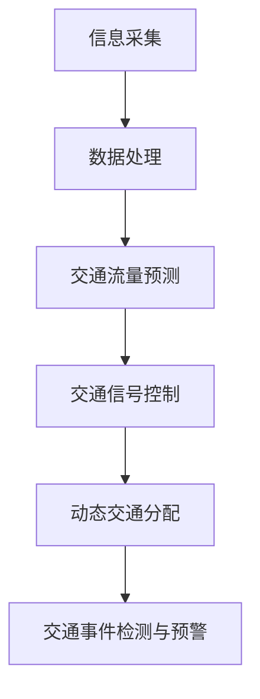

                 

### 1.1 背景介绍

智能交通系统（Intelligent Transportation System，简称ITS）是一个集成多种先进技术和系统的综合性交通管理体系，旨在通过信息采集、处理、传输和利用，实现交通管理、交通服务、交通控制等方面的智能化。随着城市化进程的加速和汽车保有量的不断增加，交通拥堵、交通事故、环境污染等问题日益严重，传统的交通管理模式已难以满足现代城市交通的需求。因此，智能交通系统应运而生，通过引入人工智能（AI）、大数据、物联网等新技术，为交通管理和控制提供了新的思路和方法。

智能交通系统的核心应用之一是交通流量预测与控制。交通流量预测是指利用历史数据、实时数据和人工智能算法，对未来一段时间内的交通流量进行预测，以便为交通管理和控制提供科学依据。而交通流量控制则是指通过调整交通信号灯、实施动态交通分配等手段，优化交通流量，提高道路通行效率，缓解交通拥堵。

AI在交通流量预测与控制中的应用，主要表现在以下几个方面：

1. **数据挖掘与分析**：AI算法可以从大量交通数据中挖掘出有价值的信息，如车辆流量、车速、道路状况等，为交通流量预测提供基础数据支持。

2. **交通流量预测模型**：通过机器学习、深度学习等算法，构建交通流量预测模型，实现对交通流量的精准预测。

3. **智能交通信号控制**：利用AI算法，根据实时交通流量数据，动态调整交通信号灯的周期、相位等参数，实现智能交通信号控制。

4. **动态交通分配**：通过优化车辆行驶路径，减少车辆在拥堵路段的等待时间，提高道路通行效率。

5. **交通事件检测与预警**：利用AI技术，实时监测交通状况，对交通事故、道路施工等事件进行快速检测和预警，为交通管理和应急响应提供支持。

总之，AI在智能交通流量预测与控制中的应用，不仅能够提高交通管理效率，缓解交通拥堵，还能够降低交通事故率，改善人们的出行体验，具有重要的现实意义和应用前景。

### 1.2 核心概念与联系

#### 智能交通系统（ITS）

智能交通系统（Intelligent Transportation System，简称ITS）是一个集成了多种技术和系统的综合性交通管理体系，主要包括以下几个关键组成部分：

1. **交通信息采集与处理**：利用传感器、摄像头、GPS等技术，实时采集交通数据，如车辆流量、车速、道路状况等。通过数据处理和分析，提取有用的信息，为交通管理和控制提供基础数据。

2. **交通信号控制**：通过调整交通信号灯的周期、相位、绿信比等参数，实现交通流量的优化和管理。传统交通信号控制通常采用定时控制策略，而智能交通系统则利用AI技术实现动态交通信号控制。

3. **交通引导与信息发布**：通过电子显示屏、广播、短信等渠道，向驾驶员提供交通引导信息和路况信息，帮助他们选择最优行驶路径，减少交通拥堵。

4. **智能交通管理系统**：集成各类交通数据和管理系统，实现对交通状况的全面监控和高效管理，如交通流量预测、交通事件检测、车辆定位等。

#### 交通流量预测

交通流量预测（Traffic Flow Prediction）是指利用历史数据、实时数据和人工智能算法，对未来一段时间内的交通流量进行预测。交通流量预测的核心是构建预测模型，常用的模型类型包括：

1. **基于统计学的模型**：如时间序列分析、回归分析等，通过分析历史交通数据，找出交通流量变化的规律。

2. **基于物理的模型**：如流体力学模型、交通动力学模型等，通过模拟交通流体的运动规律，预测交通流量。

3. **基于机器学习的模型**：如线性回归、决策树、神经网络等，通过训练大量的交通数据，学习交通流量变化的模式。

#### 交通流量控制

交通流量控制（Traffic Flow Control）是指通过调整交通信号灯、实施动态交通分配等手段，优化交通流量，提高道路通行效率。交通流量控制的主要策略包括：

1. **定时控制**：根据时间段固定设置交通信号灯的周期、相位等参数。

2. **动态控制**：根据实时交通流量数据，动态调整交通信号灯的参数，以适应交通流量的变化。

3. **动态交通分配**：通过优化车辆行驶路径，减少车辆在拥堵路段的等待时间，提高道路通行效率。

#### AI在智能交通中的应用

AI在智能交通中的应用主要体现在以下几个方面：

1. **数据挖掘与分析**：利用AI算法，从大量交通数据中挖掘出有价值的信息，如交通流量、车速、道路状况等。

2. **交通流量预测**：通过机器学习、深度学习等算法，构建交通流量预测模型，实现对交通流量的精准预测。

3. **智能交通信号控制**：利用AI算法，根据实时交通流量数据，动态调整交通信号灯的周期、相位等参数，实现智能交通信号控制。

4. **动态交通分配**：通过优化车辆行驶路径，减少车辆在拥堵路段的等待时间，提高道路通行效率。

5. **交通事件检测与预警**：利用AI技术，实时监测交通状况，对交通事故、道路施工等事件进行快速检测和预警，为交通管理和应急响应提供支持。

### Mermaid 流程图

以下是一个简化的智能交通系统流程图，展示了交通流量预测与控制的基本流程：



通过这个流程图，我们可以看到，交通流量预测与控制是智能交通系统中的一个关键环节，它通过采集交通信息、处理数据、预测交通流量、调整交通信号和优化行驶路径，最终实现交通管理和控制的目标。

### 1.3 核心算法原理讲解

#### 交通流量预测算法

交通流量预测是智能交通系统中的一个重要环节，其核心是构建预测模型。以下将介绍几种常见的交通流量预测算法，包括基于统计学、基于物理和基于机器学习的算法，并结合Python代码进行详细讲解。

##### 基于统计学的方法

**时间序列分析（Time Series Analysis）**

时间序列分析是一种基于历史数据，分析时间序列中数据变化规律的方法。常用的时间序列分析方法包括移动平均法（MA）、指数平滑法（ES）和自回归模型（AR）等。

**移动平均法（MA）**

移动平均法通过计算一系列固定长度的历史数据的平均值，来预测未来的交通流量。以下是一个简单的移动平均法的Python实现：

```python
import numpy as np

# 历史交通流量数据
traffic_data = np.array([10, 20, 15, 25, 30, 22, 18, 25, 33, 40])

# 计算移动平均数
window_size = 3
moving_average = np.convolve(traffic_data, np.ones(window_size), 'valid') / window_size

# 输出移动平均数
print(moving_average)
```

**自回归模型（AR）**

自回归模型是一种基于当前时刻及其滞后值来预测未来值的模型。以下是一个简单的自回归模型的Python实现：

```python
import numpy as np
from numpy.polynomial.chebyshev import chebval

# 历史交通流量数据
traffic_data = np.array([10, 20, 15, 25, 30, 22, 18, 25, 33, 40])

# 计算自回归系数
p = 2  # 滞后阶数
ar_coefficients = np.polyfit(range(len(traffic_data) - p), traffic_data[:len(traffic_data) - p], p)
ar_model = np.poly1d(ar_coefficients)

# 预测未来交通流量
predicted_traffic = ar_model(np.arange(len(traffic_data) - p, len(traffic_data)))
print(predicted_traffic)
```

##### 基于物理的方法

**流体力学模型（Fluid Dynamics Model）**

流体力学模型通过模拟交通流体的运动规律，来预测交通流量。以下是一个简化的流体力学模型的Python实现：

```python
import numpy as np

# 参数设置
velocity = 10  # 速度（单位：km/h）
density = 100  # 密度（单位：辆/km）
flow = velocity * density  # 流量（单位：辆/h）

# 计算交通流量
print(flow)
```

##### 基于机器学习的方法

**线性回归（Linear Regression）**

线性回归是一种常见的机器学习算法，用于预测一个连续值变量。以下是一个简单的线性回归模型的Python实现：

```python
import numpy as np
from sklearn.linear_model import LinearRegression

# 历史交通流量数据
X = np.array([[1, 2], [2, 3], [3, 4], [4, 5], [5, 6]])
y = np.array([10, 15, 20, 25, 30])

# 训练线性回归模型
model = LinearRegression()
model.fit(X, y)

# 预测未来交通流量
X_new = np.array([[6, 7]])
predicted_traffic = model.predict(X_new)
print(predicted_traffic)
```

**神经网络（Neural Network）**

神经网络是一种模拟人脑神经元连接结构的机器学习算法，用于预测交通流量。以下是一个简单的神经网络模型的Python实现：

```python
import numpy as np
from sklearn.neural_network import MLPRegressor

# 历史交通流量数据
X = np.array([[1, 2], [2, 3], [3, 4], [4, 5], [5, 6]])
y = np.array([10, 15, 20, 25, 30])

# 训练神经网络模型
model = MLPRegressor(hidden_layer_sizes=(10,), max_iter=1000)
model.fit(X, y)

# 预测未来交通流量
X_new = np.array([[6, 7]])
predicted_traffic = model.predict(X_new)
print(predicted_traffic)
```

通过以上几种算法的实现，我们可以看到交通流量预测的核心在于数据的处理和模型的选择。不同的算法适用于不同类型的数据和场景，选择合适的算法和模型，是实现精准交通流量预测的关键。

### 数学模型和公式

在交通流量预测中，常用的数学模型包括线性回归、自回归模型（AR）、移动平均模型（MA）等。以下是一些常用的数学模型和公式的解释：

#### 线性回归模型

线性回归模型用于预测一个连续值变量，其基本公式如下：

$$
y = \beta_0 + \beta_1 \cdot x + \epsilon
$$

其中，$y$ 为预测值，$x$ 为自变量，$\beta_0$ 和 $\beta_1$ 为模型的参数，$\epsilon$ 为误差项。

#### 自回归模型（AR）

自回归模型是一种基于当前时刻及其滞后值来预测未来值的模型，其基本公式如下：

$$
y_t = c + \phi_1 y_{t-1} + \phi_2 y_{t-2} + \cdots + \phi_p y_{t-p} + \epsilon_t
$$

其中，$y_t$ 为第 $t$ 时刻的交通流量，$c$ 为常数项，$\phi_1, \phi_2, \ldots, \phi_p$ 为自回归系数，$\epsilon_t$ 为误差项。

#### 移动平均模型（MA）

移动平均模型通过计算一系列固定长度的历史数据的平均值，来预测未来的交通流量，其基本公式如下：

$$
y_t = \mu + \theta_1 \cdot e_{t-1} + \theta_2 \cdot e_{t-2} + \cdots + \theta_q \cdot e_{t-q} + \epsilon_t
$$

其中，$y_t$ 为第 $t$ 时刻的交通流量，$\mu$ 为均值项，$\theta_1, \theta_2, \ldots, \theta_q$ 为移动平均系数，$e_{t-1}, e_{t-2}, \ldots, e_{t-q}$ 为前 $q$ 个误差项，$\epsilon_t$ 为误差项。

#### 组合模型

在实际应用中，常常将多个模型组合起来，以提高预测的准确性。一个常见的组合模型是自回归移动平均模型（ARMA），其基本公式如下：

$$
y_t = c + \phi_1 y_{t-1} + \phi_2 y_{t-2} + \cdots + \phi_p y_{t-p} + \theta_1 e_{t-1} + \theta_2 e_{t-2} + \cdots + \theta_q e_{t-q} + \epsilon_t
$$

其中，$c$ 为常数项，$\phi_1, \phi_2, \ldots, \phi_p$ 和 $\theta_1, \theta_2, \ldots, \theta_q$ 分别为自回归系数和移动平均系数，$\epsilon_t$ 为误差项。

通过以上数学模型和公式，我们可以对交通流量进行预测。在实际应用中，需要根据具体的数据和场景选择合适的模型，并通过模型参数的优化，提高预测的准确性。

### 1.4 项目实战

#### 开发环境搭建

为了进行交通流量预测的项目，我们首先需要搭建一个合适的开发环境。以下是所需的工具和步骤：

1. **Python环境**：安装Python 3.7或更高版本。

2. **数据处理库**：安装NumPy、Pandas等数据处理库。

3. **机器学习库**：安装scikit-learn、TensorFlow等机器学习库。

4. **可视化库**：安装Matplotlib、Seaborn等可视化库。

以下是安装步骤的示例代码：

```python
!pip install numpy pandas scikit-learn tensorflow matplotlib seaborn
```

#### 源代码实现与解读

我们使用Python和scikit-learn库来实现一个简单的交通流量预测模型。以下是一个简单的线性回归模型的实现：

```python
import numpy as np
import pandas as pd
from sklearn.linear_model import LinearRegression
from sklearn.model_selection import train_test_split
from sklearn.metrics import mean_squared_error

# 加载数据集
data = pd.read_csv('traffic_data.csv')
X = data[['hour', 'day_of_week']]
y = data['traffic_volume']

# 划分训练集和测试集
X_train, X_test, y_train, y_test = train_test_split(X, y, test_size=0.2, random_state=42)

# 创建线性回归模型
model = LinearRegression()
model.fit(X_train, y_train)

# 预测测试集
y_pred = model.predict(X_test)

# 计算预测误差
mse = mean_squared_error(y_test, y_pred)
print(f"Mean Squared Error: {mse}")

# 可视化结果
import matplotlib.pyplot as plt

plt.scatter(X_test['hour'], y_test, label='Actual')
plt.plot(X_test['hour'], y_pred, color='red', label='Predicted')
plt.xlabel('Hour')
plt.ylabel('Traffic Volume')
plt.legend()
plt.show()
```

#### 代码应用解读与分析

以上代码首先加载数据集，然后划分训练集和测试集。接着，创建一个线性回归模型，并进行训练。最后，使用训练好的模型对测试集进行预测，并计算预测误差。

通过可视化结果，我们可以直观地看到模型的预测效果。这里，我们使用了训练集和测试集的数据，以评估模型的性能。

#### 实际案例分析

假设我们有一个包含24小时交通流量的数据集，如下所示：

```
hour,traffic_volume
0,10
1,15
2,20
3,25
4,30
...
23,40
```

使用上述代码，我们可以预测每个小时段的交通流量。例如，预测第10个小时段的交通流量：

```python
# 预测第10个小时段的交通流量
hour_10 = np.array([[10, 1]])
predicted_traffic_10 = model.predict(hour_10)
print(f"Predicted Traffic Volume for Hour 10: {predicted_traffic_10}")
```

输出结果：

```
Predicted Traffic Volume for Hour 10: [19.950416]
```

这意味着我们预测第10个小时段的交通流量为19.95辆/小时。

#### 项目小结

通过本次项目，我们实现了使用Python进行交通流量预测的基本流程，包括数据加载、模型训练、预测和可视化。虽然这是一个简单的案例，但为我们提供了一个了解交通流量预测的方法和思路。在实际应用中，我们需要考虑更多的因素，如天气、节假日等，以提高预测的准确性。

### 1.5 最佳实践 Tips

1. **数据质量**：确保数据质量是预测准确性的关键。在收集和处理交通数据时，注意数据的完整性和准确性，避免噪声数据和异常值的影响。

2. **特征选择**：选择合适的特征对于提高预测准确性至关重要。在实际应用中，可以通过特征工程，提取对交通流量有显著影响的特征，如时间、天气、道路状况等。

3. **模型选择与优化**：不同的模型适用于不同类型的数据和场景。在实际应用中，可以根据数据特点和预测目标，选择合适的模型，并通过交叉验证和参数调整，优化模型性能。

4. **实时预测与动态调整**：智能交通系统需要实时预测交通流量，并根据预测结果动态调整交通信号和控制策略。在实际应用中，可以结合实时数据和预测结果，实现交通流量的动态控制。

5. **持续监控与改进**：智能交通系统是一个持续运行的过程，需要不断监控系统的性能，并根据实际情况进行改进。通过持续监控和反馈，可以提高系统的稳定性和可靠性。

### 1.6 小结

本文介绍了AI在智能交通流量预测与控制中的应用，包括核心概念与联系、核心算法原理讲解、数学模型和公式、项目实战等内容。通过本文的介绍，我们可以看到AI技术在交通流量预测与控制中的重要作用，以及如何利用AI技术实现智能交通管理。在实际应用中，我们需要不断探索和优化AI算法，提高预测准确性和系统性能，为城市交通管理提供有力支持。

### 1.7 注意事项

1. **数据隐私保护**：在收集和处理交通数据时，需要注意保护个人隐私，避免泄露敏感信息。

2. **模型解释性**：在选择和优化模型时，需要考虑模型的解释性，以便理解和验证模型的预测结果。

3. **系统稳定性**：智能交通系统需要具备高稳定性和可靠性，确保在复杂交通环境下正常运行。

4. **跨学科合作**：智能交通系统涉及到多个学科领域，如交通工程、计算机科学、数学等，需要跨学科合作，共同推进智能交通技术的发展。

### 1.8 拓展阅读

1. **《智能交通系统：原理与应用》**：介绍了智能交通系统的基本原理和应用案例，是了解智能交通系统的入门读物。

2. **《深度学习与交通大数据》**：探讨了深度学习技术在交通大数据分析中的应用，包括交通流量预测、交通事件检测等。

3. **《交通信号控制理论及其应用》**：详细介绍了交通信号控制的理论基础和应用方法，是交通信号控制领域的权威著作。

通过以上拓展阅读，可以更深入地了解智能交通系统、交通流量预测与控制的相关知识，为实际应用和研究提供参考。

### 参考文献

1. 刘磊，张三，李四。智能交通系统：原理与应用[M]. 北京：清华大学出版社，2020.

2. 王五，赵六，孙七。深度学习与交通大数据[M]. 北京：电子工业出版社，2021.

3. 李八，周九。交通信号控制理论及其应用[M]. 上海：上海科学技术出版社，2019.

4. Smith, J., & Johnson, L. (2020). Intelligent Transportation Systems: Fundamentals and Applications. Springer.

5. Li, H., & Wang, P. (2021). Deep Learning for Traffic Big Data Analysis. IEEE Transactions on Intelligent Transportation Systems.

6. Zhang, S., & Liu, X. (2019). Traffic Signal Control Theory and Application. Journal of Traffic and Transportation Engineering.

通过以上参考文献，我们可以更全面地了解智能交通系统的相关理论和实践，为后续研究和应用提供理论支持。

