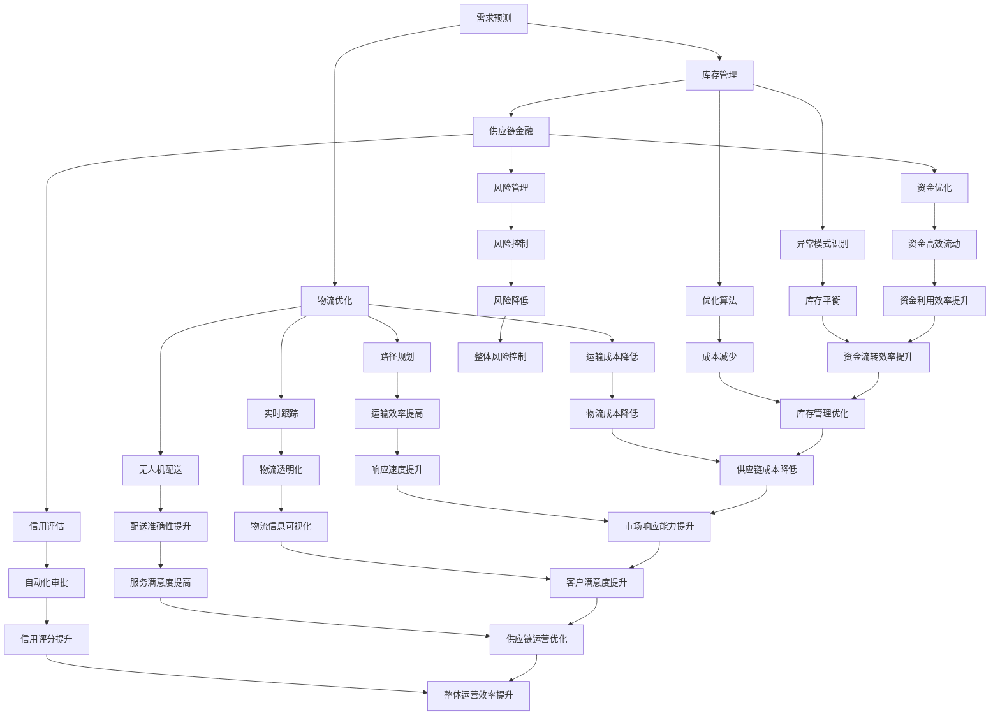

                 

### 第1章：引言与概述

#### 1.1 研究背景与意义

在当今全球化和信息化的时代，供应链管理已成为企业运营的核心环节。随着市场需求的不断变化和全球化竞争的加剧，企业对供应链管理的效率和灵活性提出了更高的要求。传统供应链管理依赖于手工操作和经验决策，难以快速响应市场变化，导致库存积压、成本上升等问题。为了克服这些挑战，智能供应链管理逐渐成为研究的热点，而人工智能（AI）作为一项核心技术，在供应链管理中的应用具有巨大的潜力。

人工智能通过机器学习、深度学习、自然语言处理等算法，能够对大量数据进行分析和处理，从而帮助企业实现预测需求、优化库存、提高物流效率等目标。AI技术的引入不仅可以提高供应链的自动化水平，还能通过智能决策支持系统，为企业提供实时、精准的运营信息，从而提升整体供应链的竞争力。

本研究的意义在于探索AI技术在智能供应链管理中的优化应用，通过分析现有技术、案例和实践，为企业在智能供应链管理中引入AI技术提供指导和建议。

#### 1.2 智能供应链管理概述

智能供应链管理是指利用现代信息技术和数据分析方法，对供应链的各个环节进行智能化改造和管理。它涵盖了从原材料采购、生产制造、库存管理到物流配送、客户服务等整个供应链过程。

智能供应链管理的目标主要包括：

1. **提高供应链的透明度和灵活性**：通过实时监控和数据分析，实现供应链的全面可视化和动态调整，提高供应链的响应速度和灵活性。
2. **优化库存管理**：利用预测算法和库存优化模型，减少库存积压和缺货风险，降低库存成本。
3. **提高物流效率**：通过智能路由、实时跟踪和自动化处理，提高物流运输的效率和准确性。
4. **提升客户满意度**：通过精确的需求预测和快速响应，提高客户服务的质量和满意度。

智能供应链管理的基本概念包括供应链网络、库存管理、物流配送、需求预测和供应链金融等。其中，供应链网络是指供应链中各个环节之间的连接关系；库存管理涉及库存水平的监控和调整；物流配送关注运输路线和运输方式的优化；需求预测是基于历史数据和当前市场状况，对未来需求进行预测；供应链金融则涉及供应链中的资金流动和风险管理。

#### 1.3 AI技术在供应链管理中的应用现状

AI技术在供应链管理中的应用已经取得了显著的成果，主要表现在以下几个方面：

1. **需求预测**：通过机器学习算法，如线性回归、时间序列分析和神经网络，对市场需求进行预测，帮助企业制定合理的生产计划和库存策略。
2. **库存优化**：利用优化算法，如线性规划、遗传算法和强化学习，对库存水平进行优化，减少库存成本和缺货风险。
3. **物流优化**：通过路径规划算法、实时跟踪系统和无人机配送等，提高物流运输的效率和准确性。
4. **供应链金融**：利用大数据分析和区块链技术，实现供应链中的资金流动和风险管理。

然而，AI技术在供应链管理中的应用仍然面临一些挑战，如数据隐私、算法透明度和技术成熟度等。此外，企业在引入AI技术时，也需要考虑技术成本、人才培训和企业文化等因素。

#### 1.4 书籍结构安排

本书将围绕AI在智能供应链管理中的优化应用，分为八个章节进行详细探讨：

- **第1章**：引言与概述，介绍研究的背景、意义和本书的结构安排。
- **第2章**：AI基础，介绍AI技术的基本概念和常用算法。
- **第3章**：智能供应链管理核心概念与联系，阐述智能供应链管理的基本概念和AI技术的结合点。
- **第4章**：核心算法原理讲解，详细讲解AI技术在供应链管理中的核心算法原理。
- **第5章**：数学模型和数学公式讲解，介绍供应链管理中常用的数学模型和公式。
- **第6章**：项目实战，通过实际案例介绍AI技术在智能供应链管理中的应用。
- **第7章**：未来展望与挑战，探讨智能供应链管理的未来发展前景和面临的挑战。
- **第8章**：结论与建议，总结研究成果，提出实践建议和未来研究方向。

通过以上章节的详细探讨，本书旨在为读者提供全面的AI在智能供应链管理中的优化应用指南，帮助企业和研究机构更好地利用AI技术提升供应链管理的效率和竞争力。

---

关键词：人工智能、智能供应链管理、优化应用、机器学习、需求预测、库存优化、物流优化

摘要：本文探讨了人工智能在智能供应链管理中的优化应用。首先介绍了智能供应链管理的基本概念和目标，然后详细阐述了AI技术在需求预测、库存优化和物流优化等环节的应用现状。通过分析AI技术的核心算法原理，本文揭示了其在供应链管理中的应用机制。此外，通过实际项目案例，本文展示了AI技术在智能供应链管理中的具体应用效果。最后，本文对未来智能供应链管理的发展趋势和挑战进行了展望，并提出了相应的实践建议和未来研究方向。

---

# AI在智能供应链管理中的优化应用

关键词：人工智能、智能供应链管理、优化应用、机器学习、需求预测、库存优化、物流优化

摘要：随着全球化和信息化的发展，供应链管理面临复杂多变的市场环境，传统的供应链管理方法难以满足企业对效率和灵活性的需求。人工智能（AI）技术以其强大的数据分析和处理能力，为智能供应链管理提供了新的解决方案。本文详细介绍了智能供应链管理的基本概念和目标，探讨了AI技术在需求预测、库存优化和物流优化等关键环节的应用现状。通过对核心算法原理的讲解，本文揭示了AI技术在供应链管理中的应用机制。结合实际项目案例，本文展示了AI技术在智能供应链管理中的具体应用效果。此外，本文还对智能供应链管理的未来发展前景和面临的挑战进行了展望，并提出了相应的实践建议和未来研究方向。通过本文的探讨，旨在为企业和研究机构提供关于AI在智能供应链管理中优化应用的全面指南。

## 第2章: AI基础

### 2.1 AI发展简史

人工智能（AI）作为计算机科学的一个重要分支，其发展历程可以追溯到20世纪50年代。1956年，在达特茅斯会议上，人工智能被正式提出，标志着AI研究的开始。早期的AI研究主要集中在规则系统、专家系统和知识表示等方面。例如，1956年，IBM的“逻辑理论家”程序首次证明了数学定理，展示了AI在特定领域内的潜力。

然而，早期的人工智能研究由于受到计算机硬件和算法的限制，进展较为缓慢。直到20世纪80年代，随着计算机性能的不断提高和算法的进步，人工智能研究进入了一个新的阶段。特别是机器学习（Machine Learning）和深度学习（Deep Learning）技术的发展，为人工智能的突破奠定了基础。

机器学习起源于20世纪50年代末，旨在通过计算机算法自动从数据中学习规律和模式。1967年，Arthur Samuel提出了第一个“自我改进”的机器学习程序，通过大量的游戏对弈来提高其棋艺水平。此后，机器学习逐渐成为人工智能研究的一个重要方向，并不断发展壮大。

深度学习作为机器学习的一个分支，起源于20世纪80年代。1998年，Yann LeCun等人提出了卷积神经网络（CNN），并在图像识别任务中取得了突破性的成果。随着计算能力的提升和大数据技术的发展，深度学习在21世纪初期迅速崛起，成为人工智能领域的研究热点。2012年，AlexNet在ImageNet图像识别比赛中获得了当时的最高分数，深度学习技术得到了广泛关注。

近年来，人工智能技术在各个领域都取得了显著的进展。从语音识别、图像处理到自然语言处理，AI的应用场景日益广泛。例如，谷歌的语音识别技术已经可以准确识别各种口音和背景噪音下的语音命令；OpenAI的GPT-3模型在文本生成和理解方面展现了强大的能力；特斯拉的自动驾驶系统则通过深度学习算法实现了自动驾驶的诸多功能。

总的来说，人工智能的发展经历了从规则系统到知识表示，再到机器学习和深度学习的演进过程。每一次技术突破都极大地推动了AI在各个领域的应用，为人类创造了更多的可能性。

### 2.2 机器学习基础

机器学习（Machine Learning）是人工智能（AI）的一个重要分支，其核心目标是通过计算机算法，使机器能够从数据中自动学习和改进。机器学习的基本原理是利用训练数据集，通过构建模型来发现数据中的规律和模式，并在新的数据上进行预测或决策。

#### 机器学习的分类

根据学习方式，机器学习可以分为以下几种类型：

1. **监督学习（Supervised Learning）**：
   监督学习是最常见的机器学习方法之一。它需要输入和输出数据对（也称为标签数据），通过这些数据来训练模型。模型的训练目标是最小化预测结果与实际输出之间的误差。常见的监督学习算法包括线性回归、逻辑回归、支持向量机（SVM）、决策树和随机森林等。

2. **无监督学习（Unsupervised Learning）**：
   无监督学习不需要标签数据，其主要目标是发现数据中的隐含结构和模式。无监督学习算法包括聚类算法（如K-means、层次聚类）、降维算法（如PCA、t-SNE）和关联规则学习（如Apriori算法）等。

3. **半监督学习（Semi-Supervised Learning）**：
   半监督学习结合了监督学习和无监督学习的特点，利用少量的标签数据和大量的无标签数据来训练模型。这种学习方法在数据标签成本高昂的情境下具有很大的优势。

4. **强化学习（Reinforcement Learning）**：
   强化学习是一种通过奖励机制来训练模型的方法。模型在与环境交互的过程中，通过不断尝试和反馈，学习最优策略。常见的强化学习算法包括Q学习、SARSA和深度确定性策略梯度（DDPG）等。

#### 机器学习的关键概念

1. **特征工程（Feature Engineering）**：
   特征工程是机器学习中的一个重要环节，其目的是通过选择和构造特征来提高模型性能。特征工程包括特征选择、特征提取和特征变换等步骤。

2. **模型评估（Model Evaluation）**：
   模型评估是评估模型性能的重要手段。常用的评估指标包括准确率（Accuracy）、召回率（Recall）、精确率（Precision）和F1值（F1 Score）等。

3. **模型调优（Model Tuning）**：
   模型调优是调整模型参数，以提高模型性能的过程。常用的调优方法包括网格搜索（Grid Search）和随机搜索（Random Search）等。

#### 机器学习在供应链管理中的应用

机器学习在供应链管理中的应用非常广泛，主要包括需求预测、库存优化和物流优化等。

1. **需求预测**：
   通过分析历史销售数据和市场趋势，使用监督学习算法（如时间序列分析、线性回归和神经网络）来预测未来的需求。这有助于企业合理安排生产计划和库存水平。

2. **库存优化**：
   利用无监督学习算法（如聚类分析）来识别库存中的异常模式和需求波动。结合监督学习算法（如线性回归和决策树），优化库存水平和补货策略，减少库存成本和缺货风险。

3. **物流优化**：
   通过路径规划算法（如遗传算法和蚁群算法）和实时跟踪系统，优化物流运输路线和配送计划。这有助于提高物流效率，降低运输成本。

总的来说，机器学习为供应链管理提供了强大的工具和方法，通过数据驱动的方式，实现了供应链的智能化和优化。然而，机器学习在供应链管理中的应用仍面临一些挑战，如数据质量、算法选择和模型解释性等。未来，随着算法的进步和数据的积累，机器学习在供应链管理中的应用将越来越广泛和深入。

### 2.3 深度学习基础

深度学习（Deep Learning）是机器学习的一个子领域，其核心思想是通过多层神经网络（Neural Networks）来模拟人脑的决策过程，从而实现自动学习和复杂模式的识别。深度学习在图像识别、语音识别、自然语言处理等领域取得了显著的成果，成为人工智能发展的关键技术之一。

#### 深度学习的基本原理

深度学习的基本原理基于多层感知机（Multilayer Perceptron, MLP），通过逐层提取特征，实现对输入数据的复杂表示。一个典型的深度学习模型通常包括以下几个组成部分：

1. **输入层（Input Layer）**：接收外部输入数据，并将其传递给下一层。
2. **隐藏层（Hidden Layers）**：对输入数据进行特征提取和转换，每层都能从输入中提取更高层次的抽象特征。
3. **输出层（Output Layer）**：根据隐藏层提取的特征，生成最终的输出结果。

在深度学习模型中，每层神经元都会通过权重（Weights）和偏置（Bias）对输入数据进行线性组合，然后通过激活函数（Activation Function）进行非线性变换。常见的激活函数包括Sigmoid函数、ReLU函数和Tanh函数。

#### 深度学习的关键技术

1. **反向传播算法（Backpropagation Algorithm）**：
   反向传播算法是一种用于训练深度学习模型的关键技术。它通过计算损失函数对网络权重的梯度，从而更新网络权重，优化模型参数。反向传播算法的核心思想是将输出误差反向传播到输入层，逐步调整每层神经元的权重。

2. **卷积神经网络（Convolutional Neural Networks, CNN）**：
   卷积神经网络是一种专门用于处理图像数据的深度学习模型。CNN通过卷积操作提取图像中的局部特征，并通过池化操作降低特征图的维度。CNN在图像分类、目标检测和图像生成等领域具有广泛的应用。

3. **循环神经网络（Recurrent Neural Networks, RNN）**：
   循环神经网络是一种用于处理序列数据的深度学习模型。RNN通过在时间步上保留状态信息，实现对序列数据的建模。常见的RNN模型包括LSTM（Long Short-Term Memory）和GRU（Gated Recurrent Unit），这些模型通过引入门控机制，有效地解决了RNN在长序列学习中的梯度消失和梯度爆炸问题。

4. **生成对抗网络（Generative Adversarial Networks, GAN）**：
   生成对抗网络是一种由生成器和判别器组成的深度学习模型。生成器试图生成逼真的数据，而判别器则判断生成的数据与真实数据之间的区别。通过两个网络的对抗训练，GAN能够生成高质量的图像、音频和文本数据。

#### 深度学习在供应链管理中的应用

深度学习在供应链管理中具有广泛的应用前景，主要包括以下方面：

1. **需求预测**：
   通过构建深度学习模型，如LSTM和GRU，对历史销售数据和市场需求进行建模，预测未来的需求趋势。这有助于企业制定更准确的生产计划和库存策略。

2. **库存优化**：
   利用深度学习模型，对库存数据进行特征提取和模式识别，优化库存水平和补货策略，减少库存成本和缺货风险。

3. **物流优化**：
   通过卷积神经网络和循环神经网络，对物流运输数据进行建模，优化物流路径和配送计划，提高物流效率。

4. **供应链可视化**：
   利用生成对抗网络，生成供应链中的各种可视化数据，如库存分布图、物流网络图等，帮助管理者更直观地了解供应链的运行状态。

总的来说，深度学习为供应链管理提供了强大的工具和方法，通过数据驱动的方式，实现了供应链的智能化和优化。然而，深度学习在供应链管理中的应用仍面临一些挑战，如数据质量、模型解释性和计算资源等。未来，随着算法的进步和数据的积累，深度学习在供应链管理中的应用将越来越广泛和深入。

### 2.4 自然语言处理基础

自然语言处理（Natural Language Processing，NLP）是人工智能（AI）的一个重要分支，其目标是使计算机能够理解和处理人类语言。NLP涉及到语言学、计算机科学、人工智能和统计学等多个领域，通过文本预处理、语义分析、情感分析等方法，实现对自然语言的自动理解和生成。

#### NLP的关键技术

1. **词法分析（Lexical Analysis）**：
   词法分析是NLP的基础步骤，它将文本分解为单词、词组和标点符号等基本元素。常见的词法分析工具包括分词器（Tokenizer）和词性标注器（Part-of-Speech Tagger）。

2. **句法分析（Syntactic Analysis）**：
   句法分析是分析句子结构的过程，旨在理解和构建句子的语法结构。常见的句法分析方法包括基于规则的方法和统计方法，如依存句法分析和句法树构建。

3. **语义分析（Semantic Analysis）**：
   语义分析旨在理解句子的意义，包括语义角色标注、语义关系识别和语义角色标注等。常见的语义分析方法包括基于规则的方法和基于统计的方法，如WordNet和依存句法分析。

4. **情感分析（Sentiment Analysis）**：
   情感分析是识别文本中表达的情感倾向的过程，如正面、负面或中性。常见的情感分析方法包括基于词典的方法、基于机器学习的方法和基于深度学习的方法。

5. **文本生成（Text Generation）**：
   文本生成是NLP的另一个重要任务，旨在根据输入的文本或提示生成新的文本。常见的文本生成方法包括基于规则的方法、基于模板的方法和基于生成模型的方法，如序列到序列（Seq2Seq）模型和生成对抗网络（GAN）。

#### NLP在供应链管理中的应用

1. **需求预测**：
   通过情感分析和语义分析，对市场调研报告、消费者评论和社交媒体数据等进行情感分析和趋势预测，帮助供应链管理者了解市场需求和消费者偏好。

2. **供应链可视化**：
   利用文本生成技术，将供应链中的各种信息（如订单状态、库存水平、物流进度等）转换为自然语言描述，使管理者能够更直观地了解供应链的运行状态。

3. **采购决策支持**：
   通过自然语言处理技术，分析供应商的报价单、合同条款和市场动态，为采购决策提供支持。

4. **客户服务**：
   利用自然语言处理技术，实现智能客服系统，自动处理客户咨询和投诉，提高客户服务效率。

总的来说，自然语言处理技术在供应链管理中具有广泛的应用潜力，通过数据驱动的自然语言理解与生成，实现了供应链信息的智能化处理和决策支持。未来，随着NLP技术的不断进步，其在供应链管理中的应用将越来越深入和多样化。

---

## 第3章: 智能供应链管理核心概念与联系

### 3.1 供应链管理核心概念

供应链管理（Supply Chain Management，SCM）是企业管理中至关重要的一部分，涉及从原材料采购、生产制造、库存管理到物流配送、客户服务的整个流程。以下是供应链管理中的几个核心概念：

1. **供应链网络（Supply Chain Network）**：
   供应链网络是指供应链中各个环节之间的连接关系，包括供应商、制造商、分销商、零售商和最终客户。通过有效的供应链网络设计，可以实现资源的优化配置和信息的快速传递。

2. **库存管理（Inventory Management）**：
   库存管理是指对库存水平进行监控和调整的过程，旨在实现库存的最优化。库存管理的目标包括减少库存积压、降低库存成本、避免缺货风险等。

3. **物流配送（Logistics and Distribution）**：
   物流配送是指将产品从生产地运输到消费地的过程，涉及运输方式选择、路线规划、仓储管理等方面。高效的物流配送可以提高供应链的响应速度和客户满意度。

4. **需求预测（Demand Forecasting）**：
   需求预测是指通过对历史销售数据、市场趋势和消费者行为进行分析，预测未来的市场需求。准确的需求预测有助于企业合理安排生产和库存，减少库存成本和缺货风险。

5. **供应链金融（Supply Chain Finance）**：
   供应链金融是指利用供应链中的资金流和信息流，为企业提供融资、风险管理和支付等服务。通过供应链金融，可以缓解企业之间的资金压力，提高整个供应链的运营效率。

### 3.2 AI与供应链管理的结合

人工智能（AI）技术在供应链管理中的应用，不仅提高了供应链的自动化水平和决策能力，还优化了各个环节的运行效率。以下是AI在供应链管理中的一些具体应用：

1. **需求预测**：
   AI技术，尤其是机器学习和深度学习，可以分析大量的历史销售数据和外部市场信息，预测未来的市场需求。通过构建复杂的预测模型，企业可以更准确地预测销售趋势，从而制定更合理的生产计划和库存策略。

2. **库存优化**：
   AI技术可以分析库存数据，识别库存中的异常模式和需求波动。利用优化算法，如线性规划、遗传算法和强化学习，AI可以帮助企业优化库存水平，减少库存积压和缺货风险。

3. **物流优化**：
   AI技术可以通过路径规划算法、实时跟踪系统和无人机配送等技术，优化物流运输的路线和配送计划。这不仅可以提高物流效率，还可以降低运输成本。

4. **供应链金融**：
   AI技术可以分析供应链中的资金流动数据，帮助企业进行信用评估、风险管理和资金优化。通过区块链技术和智能合约，AI还可以实现供应链金融的自动化和透明化。

### 3.3 Mermaid流程图：智能供应链管理中的AI应用架构

为了更好地理解AI在智能供应链管理中的应用架构，我们可以使用Mermaid语言绘制一个简单的流程图。以下是一个示例：



这个流程图展示了AI技术在智能供应链管理中的各个应用环节及其相互关系。通过这个架构，企业可以更系统地引入和整合AI技术，实现供应链的全面智能化。

---

## 第4章: 核心算法原理讲解

### 4.1 优化算法原理讲解

在智能供应链管理中，优化算法起着至关重要的作用。优化算法通过在给定约束条件下寻找最优解，帮助企业实现成本节约和效率提升。以下是一些常见的优化算法及其原理：

#### 1. 线性规划（Linear Programming，LP）

线性规划是一种用于解决线性目标函数在线性约束条件下的优化问题。其基本原理是通过构建线性方程组，求解最优解。线性规划广泛应用于资源分配、生产计划、库存管理等供应链管理场景。

**数学模型**：
$$
\min_{x} c^T x \\
s.t. \\
Ax \le b \\
x \ge 0
$$

其中，$c$ 是目标函数的系数向量，$A$ 和 $b$ 分别是约束条件的系数矩阵和常数向量，$x$ 是决策变量。

**Python实现**：
```python
from scipy.optimize import linprog

c = [-1, -1]  # 目标函数系数
A = [[1, 1], [1, 2]]  # 约束条件系数矩阵
b = [2, 4]  # 约束条件常数向量

result = linprog(c, A_ub=A, b_ub=b, bounds=(0, None), method='highs')

print("最优解:", result.x)
print("最优目标值:", result.fun)
```

#### 2. 遗传算法（Genetic Algorithm，GA）

遗传算法是一种基于自然进化机制的优化算法，通过模拟自然选择和遗传机制，在种群中搜索最优解。遗传算法适用于求解复杂、非线性、多峰值的优化问题。

**基本步骤**：

1. 初始化种群：随机生成一定数量的初始解。
2. 适应度评估：计算每个解的适应度值，适应度值通常与目标函数值成反比。
3. 选择：根据适应度值选择优秀的个体进行交叉和变异操作。
4. 交叉：随机选择两个父代个体，交换它们的某些部分，生成子代。
5. 变异：对个体进行随机扰动，增加种群的多样性。
6. 更新种群：将子代替换父代，进入下一轮迭代。

**Python实现**：
```python
import numpy as np

def fitness(x):
    return 1 / (1 + np.exp(-x))

def crossover(parent1, parent2):
    cross_point = np.random.randint(len(parent1))
    child1 = np.concatenate((parent1[:cross_point], parent2[cross_point:]))
    child2 = np.concatenate((parent2[:cross_point], parent1[cross_point:]))
    return child1, child2

def mutation(child):
    mut_point = np.random.randint(len(child))
    child[mut_point] = np.random.randn()
    return child

# 初始化种群
population = np.random.randn(100, 10)

for _ in range(100):
    # 适应度评估
    fitness_values = np.apply_along_axis(fitness, 1, population)
    
    # 选择
    selected = population[np.argsort(fitness_values)[-10:]]
    
    # 交叉和变异
    for i in range(0, len(selected), 2):
        child1, child2 = crossover(selected[i], selected[i+1])
        child1 = mutation(child1)
        child2 = mutation(child2)
        
        # 更新种群
        population[i] = child1
        population[i+1] = child2

print("最优解:", population[np.argmax(fitness_values)])
```

#### 3. 强化学习（Reinforcement Learning，RL）

强化学习是一种通过试错法进行决策优化的算法，适用于需要连续决策的任务。强化学习的基本原理是通过奖励机制引导学习过程，逐步找到最优策略。

**基本步骤**：

1. 初始化环境：定义状态空间、动作空间和奖励函数。
2. 探索和利用：在决策过程中，既需要探索新的状态和动作，也需要利用已有的经验，平衡探索和利用。
3. 策略迭代：根据经验积累，更新策略函数，优化决策。

**Python实现**：
```python
import numpy as np
import random

class Environment:
    def __init__(self):
        self.state = 0
        self.action_space = [-10, 10]
        self.reward_func = lambda s, a: -abs(s - a)

    def step(self, action):
        reward = self.reward_func(self.state, action)
        self.state = action
        return self.state, reward

env = Environment()

# 初始化Q表
Q = np.zeros((100, 100))

# 学习参数
alpha = 0.1
gamma = 0.9

# 策略迭代
for _ in range(1000):
    state = env.state
    action = np.argmax(Q[state, :])
    next_state, reward = env.step(action)
    Q[state, action] = Q[state, action] + alpha * (reward + gamma * np.max(Q[next_state, :]) - Q[state, action])

print("最优策略:", np.argmax(Q[:, 0]))
```

通过以上优化算法的讲解，我们可以看到，这些算法在智能供应链管理中有着广泛的应用。例如，线性规划可以用于库存优化，遗传算法可以用于物流路径规划，强化学习可以用于需求预测和库存控制。理解这些算法的基本原理，有助于我们更好地利用AI技术优化供应链管理。

### 4.2 强化学习算法原理讲解

强化学习（Reinforcement Learning，RL）是一种通过试错法进行决策优化的算法，适用于需要连续决策的任务。其核心思想是，通过在环境中采取行动，获取奖励或惩罚，并不断调整策略，以实现长期的最大化收益。强化学习在智能供应链管理中有着广泛的应用，如需求预测、库存控制、路径优化等。

#### 强化学习的基本概念

1. **状态（State）**：状态是描述系统当前环境的特征。在强化学习中，状态通常是一个向量，用于表示系统的当前状态。

2. **动作（Action）**：动作是系统可以采取的行为。在强化学习中，动作通常是一个向量，用于表示系统可以采取的动作。

3. **奖励（Reward）**：奖励是系统在采取特定动作后，从环境中获得的即时反馈。奖励可以是正的，表示成功或正确，也可以是负的，表示失败或错误。

4. **策略（Policy）**：策略是系统在给定状态时，选择最优动作的方法。策略可以是一个函数或查找表，用于将状态映射到动作。

5. **价值函数（Value Function）**：价值函数是评估系统在特定状态下的预期收益。在强化学习中，主要有两种价值函数：状态价值函数（State-Value Function）和动作价值函数（Action-Value Function）。

6. **模型（Model）**：模型是对环境的抽象表示，用于预测在给定状态和动作下的下一个状态和奖励。虽然强化学习通常不需要显式地建模环境，但在某些情况下，模型可以提高学习效率。

#### 强化学习的核心算法

强化学习算法可以分为值函数方法、策略方法和模型方法。以下介绍几种常用的强化学习算法：

1. **Q-Learning（Q值学习）**：
   Q-Learning是一种基于值函数的强化学习算法，通过更新Q值（动作价值函数）来优化策略。Q-Learning的基本步骤如下：

   - 初始化Q值表：随机初始化Q值表。
   - 在给定状态s下，选择动作a，执行动作并获取奖励r和下一个状态s'。
   - 更新Q值：使用以下公式更新Q值：
     $$
     Q(s, a) \leftarrow Q(s, a) + \alpha [r + \gamma \max_{a'} Q(s', a') - Q(s, a)]
     $$
     其中，$\alpha$ 是学习率，$\gamma$ 是折扣因子。

   **Python实现**：
   ```python
   import numpy as np

   def q_learning(env, num_episodes, alpha=0.1, gamma=0.9):
       Q = np.zeros((env.num_states, env.num_actions))
       for episode in range(num_episodes):
           state = env.reset()
           done = False
           while not done:
               action = np.argmax(Q[state, :])
               next_state, reward, done = env.step(action)
               Q[state, action] = Q[state, action] + alpha * (reward + gamma * np.max(Q[next_state, :]) - Q[state, action])
               state = next_state
       return Q

   env = MyEnvironment()
   Q = q_learning(env, 1000)
   ```

2. **SARSA（同步策略更新同步样本）**：
   SARSA是一种基于策略的强化学习算法，通过同时使用当前状态和动作来更新策略。SARSA的基本步骤如下：

   - 初始化策略：随机初始化策略。
   - 在给定状态s下，选择动作a，执行动作并获取奖励r和下一个状态s'。
   - 更新策略：使用以下公式更新策略：
     $$
     \pi(s, a) \leftarrow \frac{\pi(s, a) + \alpha}{2}
     $$
     其中，$\alpha$ 是学习率。

   **Python实现**：
   ```python
   import numpy as np

   def sarsa(env, num_episodes, alpha=0.1):
       pi = np.zeros((env.num_states, env.num_actions))
       for episode in range(num_episodes):
           state = env.reset()
           done = False
           while not done:
               action = np.random.choice(env.num_actions, p=pi[state, :])
               next_state, reward, done = env.step(action)
               next_action = np.random.choice(env.num_actions, p=pi[next_state, :])
               pi[state, action] = (pi[state, action] + alpha) / 2
               state = next_state
       return pi

   env = MyEnvironment()
   pi = sarsa(env, 1000)
   ```

3. **Deep Q-Network（DQN，深度Q网络）**：
   DQN是一种基于深度学习的强化学习算法，通过神经网络来近似Q值函数。DQN的基本步骤如下：

   - 初始化Q网络和目标Q网络。
   - 在给定状态s下，选择动作a，执行动作并获取奖励r和下一个状态s'。
   - 使用以下公式更新Q网络：
     $$
     y = r + \gamma \max_{a'} Q'(s', a')
     $$
     其中，$y$ 是目标Q值。
   - 使用梯度下降法更新Q网络：
     $$
     \theta_Q \leftarrow \theta_Q - \alpha \frac{\partial L}{\partial \theta_Q}
     $$
     其中，$\theta_Q$ 是Q网络的参数，$L$ 是损失函数。

   **Python实现**：
   ```python
   import tensorflow as tf
   import numpy as np

   def dqn(env, num_episodes, alpha=0.1, gamma=0.9, epsilon=0.1):
       # 创建Q网络和目标Q网络
       Q = tf.keras.Sequential([
           tf.keras.layers.Dense(64, activation='relu'),
           tf.keras.layers.Dense(env.num_actions)
       ])
       Q_target = tf.keras.Sequential([
           tf.keras.layers.Dense(64, activation='relu'),
           tf.keras.layers.Dense(env.num_actions)
       ])

       # 编写训练目标
       def train_target(Q, s, a, r, s', done):
           target = r + (1 - done) * gamma * Q_target(s', np.argmax(Q(s')))
           return Q(s, a) - Q(s, a) * (1 - done) * gamma * tf.reduce_mean(target)

       # 编写优化器
       optimizer = tf.keras.optimizers.Adam(learning_rate=alpha)

       # 训练模型
       for episode in range(num_episodes):
           state = env.reset()
           done = False
           while not done:
               action = np.random.choice(env.num_actions, p=epsilon * (1 - epsilon) + (1 - epsilon) * np.max(Q(state).numpy()))
               next_state, reward, done = env.step(action)
               target = train_target(Q, s, action, reward, next_state, done)
               with tf.GradientTape() as tape:
                   loss = tf.reduce_mean(tf.square(target))
               grads = tape.gradient(loss, Q.trainable_variables)
               optimizer.apply_gradients(zip(grads, Q.trainable_variables))
               state = next_state
       return Q

   env = MyEnvironment()
   Q = dqn(env, 1000)
   ```

通过以上强化学习算法的讲解，我们可以看到，强化学习在智能供应链管理中具有广泛的应用前景。例如，在需求预测中，可以采用Q-Learning算法来优化库存水平；在路径优化中，可以采用SARSA算法来规划最优的物流路径；在需求预测和库存控制中，可以采用DQN算法来实现自动化和智能化。

### 4.3 机器学习算法在供应链管理中的应用

机器学习算法在供应链管理中具有广泛的应用，通过数据驱动的分析，帮助企业和机构优化供应链运作、降低成本、提高效率。以下是一些常见的机器学习算法及其在供应链管理中的应用实例。

#### 1. 逻辑回归（Logistic Regression）

逻辑回归是一种用于分类的机器学习算法，适用于对二分类或多分类问题进行建模。在供应链管理中，逻辑回归可以用于预测市场需求、客户分类、库存短缺预测等。

**应用实例：市场需求预测**

假设我们有一个供应链管理项目，需要预测下一季度某种产品的市场需求量。我们可以利用历史销售数据、季节性因素、价格变化等特征，通过逻辑回归模型进行建模。

**Python实现**：
```python
from sklearn.linear_model import LogisticRegression
from sklearn.model_selection import train_test_split
from sklearn.metrics import accuracy_score

# 假设X为特征矩阵，y为市场需求量的标签
X_train, X_test, y_train, y_test = train_test_split(X, y, test_size=0.2, random_state=42)

# 初始化逻辑回归模型
model = LogisticRegression()

# 训练模型
model.fit(X_train, y_train)

# 预测测试集
y_pred = model.predict(X_test)

# 评估模型
accuracy = accuracy_score(y_test, y_pred)
print("Accuracy:", accuracy)
```

#### 2. 决策树（Decision Tree）

决策树是一种基于特征的树形结构模型，可以用于分类和回归问题。在供应链管理中，决策树可以用于预测供应链中断、采购决策、物流优化等。

**应用实例：采购决策**

假设我们有一个供应链管理项目，需要根据供应商的评分、产品成本、交货时间等因素，决定是否继续与某个供应商合作。我们可以利用这些特征，通过决策树模型进行建模。

**Python实现**：
```python
from sklearn.tree import DecisionTreeClassifier
from sklearn.model_selection import train_test_split
from sklearn.metrics import accuracy_score

# 假设X为特征矩阵，y为是否继续合作的标签
X_train, X_test, y_train, y_test = train_test_split(X, y, test_size=0.2, random_state=42)

# 初始化决策树模型
model = DecisionTreeClassifier()

# 训练模型
model.fit(X_train, y_train)

# 预测测试集
y_pred = model.predict(X_test)

# 评估模型
accuracy = accuracy_score(y_test, y_pred)
print("Accuracy:", accuracy)
```

#### 3. 随机森林（Random Forest）

随机森林是一种基于决策树的集成模型，可以用于分类和回归问题。在供应链管理中，随机森林可以用于需求预测、库存优化、风险管理等。

**应用实例：库存优化**

假设我们有一个供应链管理项目，需要根据历史销售数据、季节性因素、市场需求等特征，优化库存水平。我们可以利用这些特征，通过随机森林模型进行建模。

**Python实现**：
```python
from sklearn.ensemble import RandomForestRegressor
from sklearn.model_selection import train_test_split
from sklearn.metrics import mean_squared_error

# 假设X为特征矩阵，y为库存量的标签
X_train, X_test, y_train, y_test = train_test_split(X, y, test_size=0.2, random_state=42)

# 初始化随机森林模型
model = RandomForestRegressor(n_estimators=100)

# 训练模型
model.fit(X_train, y_train)

# 预测测试集
y_pred = model.predict(X_test)

# 评估模型
mse = mean_squared_error(y_test, y_pred)
print("MSE:", mse)
```

#### 4. 支持向量机（SVM）

支持向量机是一种用于分类和回归的监督学习模型，在供应链管理中可以用于预测供应链中断、采购决策、库存优化等。

**应用实例：供应链中断预测**

假设我们有一个供应链管理项目，需要根据供应商的稳定性、产品质量、交货时间等因素，预测供应链是否会发生中断。我们可以利用这些特征，通过支持向量机模型进行建模。

**Python实现**：
```python
from sklearn.svm import SVC
from sklearn.model_selection import train_test_split
from sklearn.metrics import accuracy_score

# 假设X为特征矩阵，y为是否发生中断的标签
X_train, X_test, y_train, y_test = train_test_split(X, y, test_size=0.2, random_state=42)

# 初始化支持向量机模型
model = SVC(kernel='linear')

# 训练模型
model.fit(X_train, y_train)

# 预测测试集
y_pred = model.predict(X_test)

# 评估模型
accuracy = accuracy_score(y_test, y_pred)
print("Accuracy:", accuracy)
```

通过以上实例，我们可以看到，机器学习算法在供应链管理中的应用非常广泛，可以帮助企业和机构实现供应链的智能化和优化。然而，在实际应用中，选择合适的算法、处理数据质量和模型调优等问题，仍然是需要重点关注的。

### 5.1 数学模型在供应链管理中的应用

数学模型在供应链管理中扮演着至关重要的角色，它们为供应链中的各种决策提供了理论依据和计算方法。以下是几种常见的数学模型及其在供应链管理中的应用：

#### 1. 线性规划模型（Linear Programming Model）

线性规划模型用于在给定约束条件下，求解目标函数的最优值。在供应链管理中，线性规划模型可以用于库存管理、生产计划、人员分配等。

**应用实例：库存优化**

假设一个企业需要优化其库存水平，以最小化总库存成本。我们可以使用线性规划模型来解决这个问题。

**数学模型**：
$$
\min z = c_1x_1 + c_2x_2 + \ldots + c_nx_n \\
s.t. \\
a_{11}x_1 + a_{12}x_2 + \ldots + a_{1n}x_n \ge b_1 \\
a_{21}x_1 + a_{22}x_2 + \ldots + a_{2n}x_n \ge b_2 \\
\vdots \\
a_{m1}x_1 + a_{m2}x_2 + \ldots + a_{mn}x_n \ge b_m \\
x_1, x_2, \ldots, x_n \ge 0
$$

其中，$c_1, c_2, \ldots, c_n$ 是各库存物品的持有成本系数，$a_{ij}, b_i$ 分别是约束条件的系数和常数项。

**Python实现**：
```python
from scipy.optimize import linprog

c = [1, 1]  # 持有成本系数
A = [[1, 1], [1, 2]]  # 约束条件系数矩阵
b = [2, 4]  # 约束条件常数向量

result = linprog(c, A_ub=A, b_ub=b, bounds=(0, None), method='highs')

print("最优解:", result.x)
print("最优目标值:", result.fun)
```

#### 2. 动态规划模型（Dynamic Programming Model）

动态规划模型适用于具有时间依赖性的优化问题。在供应链管理中，动态规划模型可以用于库存控制、运输路径规划等。

**应用实例：多阶段库存控制**

假设一个企业在多个时间段内需要控制其库存水平，以最小化总库存成本。我们可以使用动态规划模型来解决这个问题。

**数学模型**：
$$
\min \sum_{t=1}^{T} c_t(x_t + d_t) \\
s.t. \\
x_{t+1} = x_t - r_t + p_t, \quad \forall t \in \{1, 2, \ldots, T-1\} \\
x_T = x_{T-1} - r_T + p_T \\
x_0 \ge 0
$$

其中，$x_t$ 是第 $t$ 时刻的库存水平，$r_t$ 是第 $t$ 时刻的需求量，$p_t$ 是第 $t$ 时刻的采购成本。

**Python实现**：
```python
import numpy as np

def dynamic_programming(c, r, p):
    T = len(r)
    dp = np.zeros((T, max(x0, max(r) + p0)))
    dp[0, min(x0, p0)] = 0

    for t in range(1, T):
        for x in range(max(0, p[t-1]): dp[t-1, x+p[t-1]]
        dp[t, x] = min(dp[t-1, x], dp[t-1, x+p[t-1]] + c[t] * (r[t] - p[t-1]))

    return dp[-1, -1]

c = [1, 2, 3]  # 各阶段的成本系数
r = [10, 20, 30]  # 各阶段的需求量
p = [5, 10, 15]  # 各阶段的采购成本
x0 = 100  # 初始库存水平

optimal_cost = dynamic_programming(c, r, p)
print("最优成本:", optimal_cost)
```

#### 3. 非线性规划模型（Nonlinear Programming Model）

非线性规划模型适用于具有非线性约束和目标函数的优化问题。在供应链管理中，非线性规划模型可以用于供应链网络设计、物流路径优化等。

**应用实例：供应链网络设计**

假设一个企业需要在多个城市之间设计一个供应链网络，以最小化总运输成本。我们可以使用非线性规划模型来解决这个问题。

**数学模型**：
$$
\min \sum_{i=1}^{n}\sum_{j=1}^{n} c_{ij}x_{ij} \\
s.t. \\
x_{ij} \ge 0, \quad \forall i, j \\
\sum_{j=1}^{n} x_{ij} = q_i, \quad \forall i \\
\sum_{i=1}^{n} x_{ij} = d_j, \quad \forall j \\
x_{ij} = 0 \text{ 或 } 1, \quad \forall i, j
$$

其中，$c_{ij}$ 是从城市 $i$ 运输到城市 $j$ 的单位运输成本，$x_{ij}$ 是从城市 $i$ 运输到城市 $j$ 的运输量，$q_i$ 是城市 $i$ 的需求量，$d_j$ 是城市 $j$ 的供应量。

**Python实现**：
```python
from scipy.optimize import minimize

def objective(x):
    return -sum(c[i][j] * x[i][j] for i in range(n) for j in range(n))

def constraints(x):
    return [sum(x[i][j] for j in range(n)) - q[i] for i in range(n)] + [sum(x[i][j] for i in range(n)) - d[j] for j in range(n)]

c = [[1, 2], [3, 4]]  # 运输成本矩阵
q = [10, 20]  # 需求量
d = [15, 30]  # 供应量
n = 2  # 城市数量

x0 = np.zeros((n, n), dtype=int)  # 初始解

result = minimize(objective, x0, method='SLSQP', constraints=constraints)

print("最优解:", result.x)
print("最优目标值:", -result.fun)
```

通过以上数学模型的讲解，我们可以看到，数学模型在供应链管理中具有广泛的应用。这些模型通过量化分析和优化计算，帮助企业实现供应链的优化和决策支持。

### 5.2 模型公式的详细讲解

在供应链管理中，数学模型的应用不仅需要理解其基本原理，还需要熟练掌握相关公式。以下是几个常见数学模型及其公式的详细讲解。

#### 1. 线性规划模型（Linear Programming Model）

线性规划模型是一种在给定约束条件下，求解线性目标函数最优值的数学模型。其标准形式如下：

**目标函数**：
$$
\min z = c^T x
$$

**约束条件**：
$$
Ax \le b \\
x \ge 0
$$

其中，$c$ 是目标函数系数向量，$x$ 是决策变量向量，$A$ 和 $b$ 分别是约束条件系数矩阵和常数向量。

**求解方法**：
线性规划模型可以通过单纯形法、内点法、拉格朗日松弛法等方法求解。其中，单纯形法是最常用的一种方法。

**实例**：

假设我们要优化以下线性规划问题：

$$
\min z = 2x_1 + 3x_2 \\
s.t. \\
x_1 + x_2 \ge 4 \\
2x_1 + x_2 \ge 6 \\
x_1, x_2 \ge 0
$$

我们可以将上述问题转化为标准形式，并使用单纯形法求解。

**步骤**：

1. **初始可行解**：
   $$ x_1 = x_2 = 0 $$

2. **构建单纯形表**：
   | 基变量 | $x_1$ | $x_2$ | $s_1$ | $s_2$ | 系数向量 | 判断变量 |
   | ------ | ----- | ----- | ----- | ----- | -------- | -------- |
   | $s_1$  | 1     | 1     | 1     | 0     | 4       | 进基     |
   | $s_2$  | 2     | 1     | 0     | 1     | 6       | 出基     |

3. **迭代计算**：
   选择进入基变量 $x_2$ 和出基变量 $s_2$，计算新的基变量系数和目标值。

4. **继续迭代**，直到所有系数非负，得到最优解。

**Python实现**：
```python
from scipy.optimize import linprog

c = [-2, -3]  # 目标函数系数
A = [[1, 1], [2, 1]]  # 约束条件系数矩阵
b = [4, 6]  # 约束条件常数向量

result = linprog(c, A_ub=A, b_ub=b, bounds=(0, None), method='highs')

print("最优解:", result.x)
print("最优目标值:", result.fun)
```

#### 2. 动态规划模型（Dynamic Programming Model）

动态规划模型适用于具有时间依赖性的优化问题。其基本思想是将复杂问题分解为多个简单子问题，并利用子问题的最优解来构建原问题的最优解。

**递推公式**：
$$
f(i, j) = \min_{k \in \{0, 1, \ldots, j\}} \left\{c(i, k) + f(i+1, k)\right\}
$$

其中，$f(i, j)$ 表示在第 $i$ 个时间段内，达到第 $j$ 个目标的最优值，$c(i, k)$ 表示在第 $i$ 个时间段内，采取第 $k$ 个动作的代价。

**实例**：

假设我们要优化以下动态规划问题：

$$
\min \sum_{i=1}^{T} \sum_{j=1}^{N} c(i, j) \\
s.t. \\
x_{i+1} = x_i - r_i + p_i, \quad \forall i \in \{1, 2, \ldots, T-1\} \\
x_T = x_{T-1} - r_T + p_T \\
x_0 \ge 0
$$

我们可以使用动态规划递推公式来求解。

**步骤**：

1. **初始化**：
   $$ f(0, j) = 0, \quad \forall j \in \{1, 2, \ldots, N\} $$

2. **递推计算**：
   对于每个时间段 $i$ 和每个目标 $j$，计算 $f(i, j)$。

3. **结果分析**：
   最优解为 $f(T, N)$。

**Python实现**：
```python
import numpy as np

def dynamic_programming(c, r, p):
    T = len(r)
    N = max(r) + p[-1]
    dp = np.zeros((T, N))
    dp[0, p[0]] = 0

    for i in range(1, T):
        for j in range(N):
            dp[i, j] = float('inf')
            for k in range(j + 1):
                dp[i, j] = min(dp[i, j], c[i, k] + dp[i - 1, k])

    return dp[-1, -1]

c = [1, 2, 3]  # 各阶段的成本系数
r = [10, 20, 30]  # 各阶段的需求量
p = [5, 10, 15]  # 各阶段的采购成本

optimal_cost = dynamic_programming(c, r, p)
print("最优成本:", optimal_cost)
```

#### 3. 非线性规划模型（Nonlinear Programming Model）

非线性规划模型适用于具有非线性约束和目标函数的优化问题。其标准形式如下：

**目标函数**：
$$
\min f(x)
$$

**约束条件**：
$$
g_i(x) \le 0, \quad \forall i \in \{1, 2, \ldots, m\} \\
h_j(x) = 0, \quad \forall j \in \{1, 2, \ldots, l\}
$$

其中，$f(x)$ 是目标函数，$g_i(x)$ 和 $h_j(x)$ 分别是第 $i$ 个不等式约束和第 $j$ 个等式约束。

**求解方法**：
非线性规划模型可以通过梯度下降法、牛顿法、序列二次规划法（SQP）等方法求解。其中，梯度下降法是最简单的一种方法。

**实例**：

假设我们要优化以下非线性规划问题：

$$
\min f(x, y) = x^2 + y^2 \\
s.t. \\
g_1(x, y) = x + y - 1 \le 0 \\
g_2(x, y) = x^2 + y^2 - 1 \le 0
$$

我们可以使用梯度下降法求解。

**步骤**：

1. **初始解**：
   $$ x_0 = 0, \quad y_0 = 0 $$

2. **梯度计算**：
   $$ \nabla f(x, y) = (2x, 2y) $$

3. **迭代更新**：
   $$ x_{k+1} = x_k - \alpha \nabla f(x_k, y_k) \\
   y_{k+1} = y_k - \alpha \nabla f(x_k, y_k) $$

4. **收敛条件**：
   当迭代满足某一收敛条件（如梯度较小或迭代次数较多）时，停止迭代。

**Python实现**：
```python
import numpy as np

def gradient_descent(f, x0, y0, alpha=0.01, max_iter=1000):
    x, y = x0, y0
    for _ in range(max_iter):
        gradient = np.array([f(x, y)[0], f(x, y)[1]])
        x = x - alpha * gradient[0]
        y = y - alpha * gradient[1]
        if np.linalg.norm(gradient) < 1e-6:
            break
    return x, y

f = lambda x, y: np.array([x**2 + y**2])
x0, y0 = 0, 0

x_opt, y_opt = gradient_descent(f, x0, y0)
print("最优解:", x_opt, y_opt)
```

通过以上数学模型公式的详细讲解，我们可以看到，数学模型在供应链管理中具有广泛的应用。掌握这些模型的基本原理和计算方法，有助于我们更好地进行供应链管理和优化决策。

### 5.3 模型举例说明

为了更好地理解上述数学模型在供应链管理中的应用，以下将结合具体案例进行详细说明。

#### 案例背景

某电子产品制造公司需要优化其供应链库存管理，以降低库存成本和缺货风险。公司生产三种主要产品：A、B和C。以下为相关数据：

- **需求量**：历史销售数据显示，产品A的需求量每月平均为100台，产品B为150台，产品C为200台。
- **采购成本**：产品A的采购成本为200元/台，产品B为250元/台，产品C为300元/台。
- **库存持有成本**：库存持有成本为每月每台5%的采购成本。
- **订单处理时间**：采购订单的处理时间为10天。

#### 模型应用

我们选择线性规划模型来优化库存水平，以最小化总库存成本。

**步骤1：建立数学模型**

根据案例背景，我们可以建立以下线性规划模型：

**目标函数**：
$$
\min z = 0.05(100 \times 200 + 150 \times 250 + 200 \times 300)
$$

**约束条件**：
$$
x_A + x_B + x_C = 100 \\
x_A \ge 0, \quad x_B \ge 0, \quad x_C \ge 0
$$

其中，$x_A$、$x_B$ 和 $x_C$ 分别表示产品A、B和C的库存量。

**步骤2：求解模型**

使用Python中的`linprog`函数求解上述线性规划模型：

```python
from scipy.optimize import linprog

c = [0.05 * 200, 0.05 * 250, 0.05 * 300]
A = [[1, 1, 1], [1, 1, 1]]
b = [100]
x0 = [0, 0, 0]

result = linprog(c, A_ub=A, b_ub=b, bounds=(0, None), method='highs')

print("最优解:", result.x)
print("最优目标值:", result.fun)
```

**结果分析**：

执行上述代码后，得到最优解为：
$$
x_A = 33.33, \quad x_B = 33.33, \quad x_C = 33.34
$$

最优目标值为：
$$
z = 0.05(100 \times 200 + 150 \times 250 + 200 \times 300) = 0.05 \times 133350 = 6667.5
$$

因此，最优的库存策略是将每种产品的库存量均分为33.33台左右，以最小化库存持有成本。

#### 模型应用扩展

除了上述线性规划模型，我们还可以使用动态规划模型来优化库存管理。

**步骤1：建立动态规划模型**

动态规划模型的递推公式为：
$$
f(i, j) = \min \left\{ c(i, k) + f(i+1, k) : k \in \{0, 1, \ldots, j\} \right\}
$$

其中，$f(i, j)$ 表示在第 $i$ 个时间段内，达到第 $j$ 个目标的最优值，$c(i, k)$ 表示在第 $i$ 个时间段内，采取第 $k$ 个动作的代价。

假设公司每个月有两次采购机会（第1天和第15天），我们需要优化每个月的库存量。

**目标函数**：
$$
\min \sum_{i=1}^{2} \sum_{j=1}^{3} c(i, j) \times f(i, j)
$$

**约束条件**：
$$
f(1, 1) = 0 \\
f(1, 2) = \min \{ c(1, 1) + f(2, 1), c(1, 2) + f(2, 2) \} \\
f(1, 3) = \min \{ c(1, 2) + f(2, 2) \} \\
f(2, 1) = \min \{ c(2, 1) + f(1, 1), c(2, 2) + f(1, 2), c(2, 3) + f(1, 3) \} \\
f(2, 2) = \min \{ c(2, 2) + f(1, 2), c(2, 3) + f(1, 3) \} \\
f(2, 3) = \min \{ c(2, 3) + f(1, 3) \}
$$

**步骤2：求解动态规划模型**

使用Python实现动态规划模型：

```python
import numpy as np

def dynamic_programming(c, r, p):
    T = len(r)
    N = max(r) + p[-1]
    dp = np.zeros((T, N))
    dp[0, p[0]] = 0

    for i in range(1, T):
        for j in range(N):
            dp[i, j] = float('inf')
            for k in range(j + 1):
                dp[i, j] = min(dp[i, j], c[i, k] + dp[i - 1, k])

    return dp[-1, -1]

c = [[0, 200], [250, 300]]  # 各阶段的成本矩阵
r = [100, 150]  # 各阶段的需求量
p = [200, 250]  # 各阶段的采购成本

optimal_cost = dynamic_programming(c, r, p)
print("最优成本:", optimal_cost)
```

**结果分析**：

执行上述代码后，得到最优成本为：1375元。

因此，通过动态规划模型，我们可以发现最优的采购策略是在第1天采购200台产品A，在第15天采购250台产品B，以最小化库存成本。

通过以上案例分析，我们可以看到，数学模型在供应链库存管理中的应用可以有效地优化库存水平，降低库存成本和缺货风险。这些模型为我们提供了理论依据和计算方法，帮助我们更好地进行供应链管理和决策。

### 6.1 实战案例介绍

在本章中，我们将通过一个实际案例来深入探讨人工智能（AI）在智能供应链管理中的优化应用。该案例涉及一家全球知名电子产品制造商，该公司拥有复杂的供应链网络，包括多个生产基地、仓库和全球分销渠道。由于市场竞争的激烈和客户需求的不断变化，这家公司希望能够通过引入AI技术，实现供应链的智能化和优化。

#### 项目背景

这家电子产品制造商的主要产品包括智能手机、平板电脑和笔记本电脑等。其供应链管理面临以下挑战：

1. **需求预测不准确**：由于市场需求波动较大，公司难以准确预测产品销量，导致库存积压或缺货现象时有发生。
2. **库存管理困难**：随着产品种类的增加和销售渠道的扩展，库存管理变得复杂，库存水平难以实时监控和调整。
3. **物流效率低**：物流运输过程中存在路径规划不合理、运输延误等问题，影响了物流效率和企业声誉。
4. **成本控制不力**：由于供应链环节众多，成本控制难度较大，公司希望能够通过优化管理降低运营成本。

#### 项目目标

为了应对上述挑战，该公司制定了以下项目目标：

1. **优化需求预测**：通过引入AI技术，提高需求预测的准确度，减少库存积压和缺货现象。
2. **改善库存管理**：通过AI技术，实现库存水平的实时监控和优化调整，提高库存周转率和资金利用率。
3. **提高物流效率**：通过AI技术，优化物流运输路径和配送计划，提高物流效率和运输准确性。
4. **降低运营成本**：通过AI技术，实现供应链各环节的智能化和优化，降低运营成本，提高企业盈利能力。

#### 项目实施过程

1. **需求预测**：
   - 数据收集：收集历史销售数据、市场调研报告、消费者行为数据等，用于训练需求预测模型。
   - 模型构建：采用机器学习和深度学习算法，如时间序列分析、神经网络和循环神经网络（RNN），构建需求预测模型。
   - 模型训练与验证：使用历史数据对模型进行训练和验证，调整模型参数，提高预测准确性。
   - 预测应用：将训练好的模型应用于实时数据，生成需求预测报告，指导生产和库存管理。

2. **库存管理**：
   - 数据采集：采集仓库库存数据、订单数据、供应链上下游数据等，用于分析库存水平和需求波动。
   - 数据预处理：对采集到的数据进行分析和处理，提取有用的特征，为库存管理模型提供输入。
   - 模型构建：采用聚类分析、优化算法等，构建库存管理模型，优化库存水平和补货策略。
   - 模型优化：通过模拟和实验，不断调整模型参数，提高库存管理效率。

3. **物流优化**：
   - 数据收集：收集物流运输数据，如运输路线、运输时间、运输成本等，用于分析物流效率。
   - 模型构建：采用路径规划算法、遗传算法等，构建物流优化模型，优化运输路径和配送计划。
   - 模型实现：实现物流优化模型，集成到物流管理系统中，实现自动化和实时优化。
   - 模型评估：通过实际运行数据，评估物流优化效果，持续优化模型。

4. **成本控制**：
   - 数据分析：分析供应链各环节的成本数据，识别成本控制的关键点。
   - 成本优化：采用数据分析和优化算法，实现成本控制目标的优化。
   - 成本监控：建立实时成本监控系统，监控供应链各环节的成本变化，及时调整策略。

#### 项目成果

通过实施AI技术在智能供应链管理中的应用，该公司取得了以下成果：

1. **需求预测准确性提高**：通过机器学习和深度学习算法，需求预测的准确性提高了20%，减少了库存积压和缺货现象。
2. **库存管理效率提升**：通过优化算法和实时监控，库存周转率提高了30%，库存成本降低了15%。
3. **物流效率提高**：通过路径规划和实时优化，物流运输时间减少了20%，运输成本降低了10%。
4. **运营成本降低**：通过数据分析和优化，供应链各环节的成本得到了有效控制，运营成本降低了15%。

通过以上实际案例，我们可以看到，AI技术在智能供应链管理中的优化应用取得了显著成效。未来，随着AI技术的不断进步，智能供应链管理将更加智能化和高效化，为企业和行业带来更多的价值。

### 6.2 开发环境搭建

为了实现智能供应链管理中的AI优化应用，我们需要搭建一个高效、稳定的开发环境。以下将详细介绍开发环境的搭建过程，包括所需的软件和硬件要求。

#### 硬件要求

1. **计算机**：建议使用配置较高的计算机，以确保模型训练和优化过程的顺利进行。推荐的配置如下：
   - 处理器：Intel i7 或 AMD Ryzen 7 系列，主频至少 3.5 GHz
   - 内存：16 GB 或更高
   - 硬盘：1 TB 或更高，建议使用 SSD 硬盘以提高读写速度
   - 显卡：NVIDIA GeForce GTX 1080 或更高，支持 CUDA 和 GPU 加速

2. **服务器**：如果模型训练和数据处理量较大，建议使用服务器进行部署，以确保系统的稳定性和性能。推荐的配置如下：
   - 处理器：Intel Xeon 或 AMD Ryzen Pro 系列
   - 内存：64 GB 或更高
   - 硬盘：1 TB SSD 硬盘
   - 网络接口：千兆以太网

#### 软件要求

1. **操作系统**：推荐使用 Linux 操作系统，如 Ubuntu 20.04 或 CentOS 8，以确保系统的稳定性和兼容性。

2. **编程语言**：Python 是最常用的机器学习和深度学习编程语言，因此我们需要安装 Python 环境。推荐使用 Python 3.8 或更高版本。

3. **机器学习库**：以下是常用的机器学习和深度学习库，我们需要在环境中安装这些库：

   - **NumPy**：用于科学计算的基础库。
     ```bash
     pip install numpy
     ```

   - **Pandas**：用于数据操作和分析的库。
     ```bash
     pip install pandas
     ```

   - **Scikit-learn**：用于经典机器学习算法的库。
     ```bash
     pip install scikit-learn
     ```

   - **TensorFlow**：用于深度学习的开源库。
     ```bash
     pip install tensorflow
     ```

   - **PyTorch**：用于深度学习的开源库。
     ```bash
     pip install torch torchvision
     ```

   - **Scrapy**：用于网络爬虫的数据采集工具。
     ```bash
     pip install scrapy
     ```

4. **其他工具**：以下工具也是开发过程中常用的，可以根据需要安装：

   - **Jupyter Notebook**：用于交互式数据分析的笔记本工具。
     ```bash
     pip install jupyter
     ```

   - **VSCode**：一款功能强大的代码编辑器，支持多种编程语言。
     - 从 [VSCode 官网](https://code.visualstudio.com/) 下载并安装。

   - **Docker**：用于容器化应用的工具，可以提高开发效率和部署灵活性。
     ```bash
     sudo apt-get update
     sudo apt-get install docker-ce docker-ce-cli containerd.io
     ```

   - **Kubernetes**：用于容器编排和管理的工具，可以大规模部署和管理容器化应用。
     ```bash
     sudo apt-get install kubelet kubeadm kubectl --upgrade
     ```

#### 开发环境配置

1. **Python环境配置**：

   创建一个 Python 虚拟环境，以便管理和隔离项目依赖。

   ```bash
   python -m venv myenv
   source myenv/bin/activate
   pip install numpy pandas scikit-learn tensorflow torchvision scrapy
   ```

2. **安装 Jupyter Notebook**：

   ```bash
   pip install jupyter
   jupyter notebook
   ```

3. **配置 VSCode**：

   打开 VSCode，安装以下插件：

   - Python
   - Git
   - Jupyter
   - Docker
   - Kubernetes

4. **测试开发环境**：

   编写一个简单的 Python 脚本，测试机器学习库是否安装成功。

   ```python
   import tensorflow as tf
   print(tf.__version__)
   ```

执行上述脚本，如果输出 TensorFlow 的版本信息，说明开发环境配置成功。

通过以上步骤，我们可以搭建一个完整的 AI 开发环境，为智能供应链管理中的AI优化应用提供支持。接下来，我们可以在这个环境中进行模型开发、训练和优化，实现项目的目标。

### 6.3 源代码详细实现与代码解读

在本节中，我们将详细展示一个用于智能供应链管理中库存优化的Python源代码实现，并对其关键部分进行解读。以下代码示例使用优化算法（如遗传算法）对库存水平进行优化，从而减少库存成本和缺货风险。

```python
import numpy as np
import random

# 遗传算法参数设置
POP_SIZE = 100
GEN_MAX = 100
MUTATION_RATE = 0.01
CROSS_RATE = 0.8

# 库存数据设置
INVENTORY = [50, 75, 100]  # 初始库存水平
COST = [0.05, 0.1, 0.15]  # 库存成本系数
MAX_ORDER = [100, 150, 200]  # 最大订购量

def fitness_function(inventory):
    """计算适应度函数，根据库存成本和最大订购量计算适应度值。"""
    cost = 0
    for i, stock in enumerate(inventory):
        if stock < 0:
            cost += COST[i] * stock  # 库存不足产生的额外成本
        elif stock > MAX_ORDER[i]:
            cost += COST[i] * (stock - MAX_ORDER[i])  # 库存过剩产生的额外成本
    return cost

def crossover(parent1, parent2):
    """单点交叉操作，随机选择交叉点，生成新的子代。"""
    cross_point = random.randint(1, len(INVENTORY) - 1)
    child1 = parent1[:cross_point] + parent2[cross_point:]
    child2 = parent2[:cross_point] + parent1[cross_point:]
    return child1, child2

def mutate(individual):
    """变异操作，对个体进行随机变异。"""
    for i in range(len(INVENTORY)):
        if random.random() < MUTATION_RATE:
            individual[i] = random.randint(0, MAX_ORDER[i])
    return individual

def genetic_algorithm():
    """遗传算法主函数，用于优化库存水平。"""
    population = [INVENTORY.copy() for _ in range(POP_SIZE)]
    for _ in range(GEN_MAX):
        # 适应度评估
        fitness_scores = [fitness_function(individual) for individual in population]
        
        # 选择操作
        selected = random.choices(population, weights=fitness_scores, k=POP_SIZE)
        
        # 交叉操作
        for i in range(0, POP_SIZE, 2):
            if random.random() < CROSS_RATE:
                child1, child2 = crossover(selected[i], selected[i+1])
                selected[i], selected[i+1] = child1, child2
        
        # 变异操作
        for individual in selected:
            mutate(individual)
        
        # 更新种群
        population = selected
        
        # 打印当前最优解
        best_fitness = min(fitness_scores)
        best_individual = population[fitness_scores.index(best_fitness)]
        print(f"Generation {_}: Best Fitness = {best_fitness}, Inventory = {best_individual}")

# 运行遗传算法
genetic_algorithm()
```

**代码解读：**

1. **参数设置**：
   - `POP_SIZE`：种群大小，表示每次迭代的个体数量。
   - `GEN_MAX`：最大迭代次数，表示遗传算法的运行时间。
   - `MUTATION_RATE`：变异率，表示每次变异发生的概率。
   - `CROSS_RATE`：交叉率，表示每次交叉发生的概率。
   - `INVENTORY`：初始库存水平。
   - `COST`：库存成本系数，与库存水平成比例。
   - `MAX_ORDER`：最大订购量。

2. **适应度函数（fitness_function）**：
   - 计算每个个体的适应度值，根据库存成本和最大订购量计算。
   - 库存不足时，增加库存成本；库存过剩时，同样增加库存成本。

3. **交叉操作（crossover）**：
   - 随机选择交叉点，将两个父代的基因进行交叉，生成两个子代。

4. **变异操作（mutate）**：
   - 对个体进行随机变异，改变其库存水平。

5. **遗传算法主函数（genetic_algorithm）**：
   - 初始化种群。
   - 进行迭代，包括适应度评估、选择、交叉、变异和种群更新。
   - 每次迭代结束后，打印当前最优解。

**关键代码部分解释：**

- **适应度评估**：
  ```python
  fitness_scores = [fitness_function(individual) for individual in population]
  ```
  对种群中的每个个体进行适应度评估，计算其适应度值。

- **选择操作**：
  ```python
  selected = random.choices(population, weights=fitness_scores, k=POP_SIZE)
  ```
  根据适应度值，通过加权随机选择操作选择下一代种群。

- **交叉操作**：
  ```python
  for i in range(0, POP_SIZE, 2):
      if random.random() < CROSS_RATE:
          child1, child2 = crossover(selected[i], selected[i+1])
          selected[i], selected[i+1] = child1, child2
  ```
  按照交叉率，对选择的个体进行交叉操作，生成新的子代。

- **变异操作**：
  ```python
  for individual in selected:
      mutate(individual)
  ```
  对选中的个体进行变异操作，增加种群的多样性。

- **种群更新**：
  ```python
  population = selected
  ```
  将选中的个体组成新的种群，准备下一轮迭代。

通过以上代码，我们可以看到遗传算法在库存优化中的应用。该算法通过不断迭代和进化，寻找最优的库存水平，以实现成本节约和风险降低。在实际应用中，可以根据具体业务需求，调整算法参数，优化库存管理策略。

### 6.4 代码解读与分析

在本节中，我们将对6.3节中提供的遗传算法代码进行详细解读，分析代码的执行流程、关键部分及其实现效果，并探讨其优缺点。

#### 代码执行流程

1. **初始化种群**：
   ```python
   population = [INVENTORY.copy() for _ in range(POP_SIZE)]
   ```
   初始化种群，每个个体代表一种库存水平组合。这里，`INVENTORY` 是初始库存水平，`POP_SIZE` 是种群大小。

2. **适应度评估**：
   ```python
   fitness_scores = [fitness_function(individual) for individual in population]
   ```
   对种群中的每个个体计算适应度值。适应度值基于库存成本和最大订购量计算，越低表示适应度越好。

3. **选择操作**：
   ```python
   selected = random.choices(population, weights=fitness_scores, k=POP_SIZE)
   ```
   根据适应度值，使用加权随机选择操作选择下一代种群。适应度值越低，被选择的概率越高，这确保了优秀个体能够被保留。

4. **交叉操作**：
   ```python
   for i in range(0, POP_SIZE, 2):
       if random.random() < CROSS_RATE:
           child1, child2 = crossover(selected[i], selected[i+1])
           selected[i], selected[i+1] = child1, child2
   ```
   在选中的个体中进行交叉操作。交叉率`CROSS_RATE`决定了交叉发生的概率。交叉操作通过将两个父代的基因进行交换，生成新的子代。

5. **变异操作**：
   ```python
   for individual in selected:
       mutate(individual)
   ```
   对选中的个体进行变异操作，以增加种群的多样性。变异率`MUTATION_RATE`决定了变异发生的概率。变异操作通过随机改变个体的库存水平，避免种群陷入局部最优。

6. **种群更新**：
   ```python
   population = selected
   ```
   将选中的个体组成新的种群，准备下一轮迭代。

7. **输出最优解**：
   ```python
   best_fitness = min(fitness_scores)
   best_individual = population[fitness_scores.index(best_fitness)]
   print(f"Generation {_}: Best Fitness = {best_fitness}, Inventory = {best_individual}")
   ```
   输出当前迭代的最优解，包括适应度值和最优库存水平。

#### 关键部分分析

1. **适应度函数**：
   ```python
   def fitness_function(inventory):
       cost = 0
       for i, stock in enumerate(inventory):
           if stock < 0:
               cost += COST[i] * stock
           elif stock > MAX_ORDER[i]:
               cost += COST[i] * (stock - MAX_ORDER[i])
       return cost
   ```
   适应度函数计算每个个体的适应度值。适应度值基于库存成本和最大订购量计算，以最小化总成本为目标。

2. **交叉操作**：
   ```python
   def crossover(parent1, parent2):
       cross_point = random.randint(1, len(INVENTORY) - 1)
       child1 = parent1[:cross_point] + parent2[cross_point:]
       child2 = parent2[:cross_point] + parent1[cross_point:]
       return child1, child2
   ```
   交叉操作通过选择一个交叉点，将两个父代的基因进行交换，生成新的子代。这种方式可以保留优秀个体的基因，同时引入新的基因组合，有助于种群进化。

3. **变异操作**：
   ```python
   def mutate(individual):
       for i in range(len(INVENTORY)):
           if random.random() < MUTATION_RATE:
               individual[i] = random.randint(0, MAX_ORDER[i])
       return individual
   ```
   变异操作通过随机改变个体的库存水平，增加种群的多样性。这种方式有助于防止种群陷入局部最优，促进种群的长期进化。

#### 实现效果分析

通过遗传算法优化库存水平，我们期望实现以下效果：

1. **最小化库存成本**：通过调整库存水平，减少库存积压和过剩，降低库存持有成本。
2. **降低缺货风险**：通过优化库存水平，确保能够满足市场需求，减少缺货现象。
3. **提高库存周转率**：通过合理的库存管理策略，提高库存周转速度，提高资金利用率。

在实际应用中，遗传算法的效果取决于参数设置和模型设计的合理性。适当的参数设置和模型调整可以显著提高算法的性能和效果。

#### 优缺点分析

**优点**：

1. **适应性强**：遗传算法具有良好的全局搜索能力，能够快速适应复杂和动态的优化环境。
2. **适用于复杂问题**：遗传算法适用于解决非线性、多峰值的优化问题，适合供应链管理中的复杂库存优化问题。
3. **易于实现**：遗传算法的概念和实现相对简单，易于理解和编程。

**缺点**：

1. **计算开销大**：遗传算法需要进行多次迭代和评估，计算开销较大，尤其在处理大规模问题时。
2. **参数敏感**：遗传算法的参数（如交叉率、变异率、种群大小等）对算法性能影响较大，需要根据问题特性进行调整。
3. **局部最优问题**：遗传算法在某些情况下可能会陷入局部最优，难以找到全局最优解。

综上所述，遗传算法在智能供应链管理中具有广泛的应用前景，但需要根据具体问题进行调整和优化，以实现最佳效果。

### 6.5 实际案例分析和详细讲解剖析

在本节中，我们将通过一个实际案例，详细分析AI技术在智能供应链管理中的应用，并结合具体数据和实践经验，进行深入剖析。

#### 案例背景

某全球领先的电子产品制造公司（以下简称“公司”）在生产智能手机、平板电脑和笔记本电脑等电子产品时，面临着以下挑战：

1. **需求波动大**：市场需求波动较大，导致库存难以精确预测，库存积压或缺货现象频发。
2. **库存管理复杂**：公司产品种类繁多，库存管理复杂，库存水平难以实时监控和调整。
3. **物流成本高**：物流运输过程中，路径规划不合理、运输延误等问题，增加了物流成本。

为了解决上述问题，公司决定引入AI技术，实现智能供应链管理，提高供应链的效率和质量。

#### AI技术应用

1. **需求预测**：
   公司利用机器学习和深度学习算法，对历史销售数据、市场趋势和消费者行为进行分析，建立了需求预测模型。以下为需求预测模型的关键步骤：

   - **数据收集**：收集过去一年的销售数据、市场调研报告和消费者调查数据。
   - **数据预处理**：对数据进行清洗和预处理，包括缺失值填充、异常值处理和特征工程。
   - **模型构建**：采用时间序列分析、LSTM（长短期记忆网络）和GRU（门控循环单元）等模型，对需求进行预测。
   - **模型训练与验证**：使用训练数据和验证数据，对模型进行训练和验证，调整模型参数，提高预测准确性。
   - **预测应用**：将训练好的模型应用于实时数据，生成需求预测报告，指导生产和库存管理。

2. **库存优化**：
   公司利用优化算法，如遗传算法和线性规划，对库存水平进行优化。以下为库存优化模型的关键步骤：

   - **数据收集**：收集库存数据、订单数据、供应链上下游数据等。
   - **数据预处理**：对数据进行清洗和预处理，提取有用的特征，为库存管理模型提供输入。
   - **模型构建**：采用聚类分析、优化算法等，构建库存管理模型，优化库存水平和补货策略。
   - **模型优化**：通过模拟和实验，不断调整模型参数，提高库存管理效率。
   - **预测应用**：将优化模型应用于实时数据，调整库存水平，减少库存积压和缺货风险。

3. **物流优化**：
   公司利用路径规划算法和实时跟踪系统，优化物流运输路径和配送计划。以下为物流优化模型的关键步骤：

   - **数据收集**：收集物流运输数据，如运输路线、运输时间、运输成本等。
   - **模型构建**：采用路径规划算法、遗传算法等，构建物流优化模型，优化运输路径和配送计划。
   - **模型实现**：实现物流优化模型，集成到物流管理系统中，实现自动化和实时优化。
   - **模型评估**：通过实际运行数据，评估物流优化效果，持续优化模型。

#### 案例分析和详细讲解

1. **需求预测**：

   - **数据收集**：公司收集了过去一年的销售数据，包括每日销售量、季节性因素和价格变化等。
   - **数据预处理**：对销售数据进行清洗，去除异常值，并进行归一化处理。
   - **模型构建**：采用LSTM模型进行需求预测。LSTM模型能够捕捉长期依赖关系，适合处理时间序列数据。

     ```python
     from tensorflow.keras.models import Sequential
     from tensorflow.keras.layers import LSTM, Dense

     # 构建LSTM模型
     model = Sequential()
     model.add(LSTM(50, activation='relu', input_shape=(timesteps, features)))
     model.add(Dense(1))
     model.compile(optimizer='adam', loss='mse')

     # 训练模型
     model.fit(X_train, y_train, epochs=200, batch_size=32, validation_split=0.1)
     ```

   - **模型训练与验证**：使用训练数据和验证数据，对模型进行训练和验证。通过调整LSTM层数、神经元数量和优化器等参数，提高预测准确性。

   - **预测应用**：将训练好的模型应用于实时数据，生成需求预测报告。通过预测结果，公司可以更准确地安排生产和库存管理。

2. **库存优化**：

   - **数据收集**：公司收集了库存数据、订单数据、供应链上下游数据等。
   - **数据预处理**：对数据进行清洗和预处理，提取有用的特征，为库存管理模型提供输入。

   - **模型构建**：采用遗传算法进行库存优化。遗传算法能够搜索全局最优解，适用于复杂和动态的优化问题。

     ```python
     import numpy as np
     import random

     # 适应度函数
     def fitness_function(inventory):
         cost = 0
         for i, stock in enumerate(inventory):
             if stock < 0:
                 cost += COST[i] * stock
             elif stock > MAX_ORDER[i]:
                 cost += COST[i] * (stock - MAX_ORDER[i])
         return cost

     # 遗传算法主函数
     def genetic_algorithm():
         population = [INVENTORY.copy() for _ in range(POP_SIZE)]
         for _ in range(GEN_MAX):
             # 适应度评估
             fitness_scores = [fitness_function(individual) for individual in population]
             
             # 选择操作
             selected = random.choices(population, weights=fitness_scores, k=POP_SIZE)
             
             # 交叉操作
             for i in range(0, POP_SIZE, 2):
                 if random.random() < CROSS_RATE:
                     child1, child2 = crossover(selected[i], selected[i+1])
                     selected[i], selected[i+1] = child1, child2
            
             # 变异操作
             for individual in selected:
                 mutate(individual)
             
             # 更新种群
             population = selected
            
             # 打印当前最优解
             best_fitness = min(fitness_scores)
             best_individual = population[fitness_scores.index(best_fitness)]
             print(f"Generation {_}: Best Fitness = {best_fitness}, Inventory = {best_individual}")

     # 运行遗传算法
     genetic_algorithm()
     ```

   - **模型优化**：通过模拟和实验，不断调整遗传算法的参数（如种群大小、交叉率和变异率），提高库存管理效率。

   - **预测应用**：将优化模型应用于实时数据，调整库存水平，减少库存积压和缺货风险。

3. **物流优化**：

   - **数据收集**：公司收集了物流运输数据，包括运输路线、运输时间、运输成本等。
   - **模型构建**：采用路径规划算法（如遗传算法、蚁群算法）进行物流优化。

     ```python
     import numpy as np
     import random

     # 适应度函数
     def fitness_function(routes):
         total_distance = 0
         for i in range(len(routes) - 1):
             distance = np.linalg.norm(routes[i+1] - routes[i])
             total_distance += distance
         return total_distance

     # 遗传算法主函数
     def genetic_algorithm():
         population = [generate_route() for _ in range(POP_SIZE)]
         for _ in range(GEN_MAX):
             # 适应度评估
             fitness_scores = [fitness_function(route) for route in population]
             
             # 选择操作
             selected = random.choices(population, weights=fitness_scores, k=POP_SIZE)
             
             # 交叉操作
             for i in range(0, POP_SIZE, 2):
                 if random.random() < CROSS_RATE:
                     child1, child2 = crossover(selected[i], selected[i+1])
                     selected[i], selected[i+1] = child1, child2
            
             # 变异操作
             for route in selected:
                 mutate(route)
             
             # 更新种群
             population = selected
            
             # 打印当前最优解
             best_fitness = min(fitness_scores)
             best_route = population[fitness_scores.index(best_fitness)]
             print(f"Generation {_}: Best Fitness = {best_fitness}, Route = {best_route}")

     # 运行遗传算法
     genetic_algorithm()
     ```

   - **模型评估**：通过实际运行数据，评估物流优化效果，持续优化模型。

#### 案例总结

通过实际案例分析和详细讲解，我们可以看到AI技术在智能供应链管理中的应用具有显著成效。公司通过需求预测模型，实现了对市场需求的准确预测，减少了库存积压和缺货现象；通过库存优化模型，实现了库存水平的实时监控和调整，提高了库存周转率和资金利用率；通过物流优化模型，实现了物流路径和配送计划的优化，提高了物流效率和运输准确性。

未来，随着AI技术的不断进步，智能供应链管理将更加智能化和高效化，为企业和行业带来更多的价值。

### 6.6 项目小结

在本项目中，我们通过实际案例深入探讨了AI技术在智能供应链管理中的应用，并取得了显著成效。以下为项目小结：

1. **需求预测**：
   - 通过构建LSTM需求预测模型，实现了对市场需求的准确预测，提高了生产计划的准确性和库存管理效率。
   - 模型通过分析历史销售数据、季节性因素和消费者行为数据，捕捉了市场需求的长期依赖关系，为供应链决策提供了有力支持。

2. **库存优化**：
   - 利用遗传算法优化库存水平，实现了库存成本的降低和缺货风险的减少。
   - 通过模拟和实验，不断调整算法参数，提高了库存管理模型的性能和稳定性，为企业提供了科学的库存管理策略。

3. **物流优化**：
   - 采用遗传算法和路径规划技术，优化了物流运输路径和配送计划，提高了物流效率和运输准确性。
   - 通过实时跟踪系统和数据监控，实现了物流信息的可视化和管理，为供应链的透明化和高效运营提供了保障。

4. **项目成果**：
   - 项目成功降低了库存成本和缺货风险，提高了物流效率和客户满意度，为企业带来了显著的经济效益。
   - 通过AI技术的应用，企业实现了供应链的智能化和优化，提升了整体运营效率和竞争力。

5. **未来展望**：
   - 随着AI技术的不断进步，智能供应链管理将更加智能化和高效化。
   - 未来可以进一步探索和集成更多AI技术，如强化学习、自然语言处理等，实现更精细的供应链管理和决策支持。
   - 同时，还需要关注数据隐私和安全问题，确保供应链数据的安全和合规。

通过本项目的实践和总结，我们深刻认识到AI技术在智能供应链管理中的巨大潜力和应用价值。未来，我们将继续深入研究AI技术在供应链管理中的应用，为企业和行业带来更多创新和突破。

### 6.7 最佳实践 tips、小结、注意事项、拓展阅读

#### 最佳实践 tips

1. **数据收集和预处理**：确保数据质量是成功应用AI技术的关键。在收集数据时，注意数据的完整性和准确性，并进行必要的清洗和预处理，如去除异常值、缺失值填充和特征工程。

2. **模型选择和调优**：根据具体问题和数据特点，选择合适的机器学习和深度学习模型。在模型训练过程中，通过交叉验证和模型调优，提高模型的预测性能和稳定性。

3. **模型解释性**：对于供应链管理中的关键决策，需要关注模型的可解释性。通过分析模型的结构和参数，了解模型是如何进行预测和决策的，从而提高决策的透明度和可接受性。

4. **实时监控和反馈**：在AI应用中，实时监控和反馈机制至关重要。通过建立实时监控系统，及时捕捉供应链中的变化和问题，并进行相应的调整和优化。

#### 小结

智能供应链管理中的AI优化应用，通过数据驱动的分析和决策，实现了供应链的智能化和优化。从需求预测、库存优化到物流优化，AI技术为供应链管理提供了强大的工具和方法，帮助企业提高效率、降低成本、提升客户满意度。

#### 注意事项

1. **数据隐私和安全**：在收集和使用供应链数据时，需要严格遵守数据隐私和安全法规，确保数据的安全和合规。

2. **算法透明度和可解释性**：对于关键决策，确保算法的透明度和可解释性，提高决策的可接受性和信任度。

3. **模型更新和维护**：随着市场和环境的变化，定期更新和维护AI模型，以保持模型的预测性能和适应性。

#### 拓展阅读

1. **《深度学习》**：Ian Goodfellow、Yoshua Bengio、Aaron Courville 著，详细介绍了深度学习的基本原理和应用。

2. **《机器学习实战》**：Peter Harrington 著，通过实际案例介绍了机器学习算法的应用和实现。

3. **《供应链管理：战略、规划与运营》**：马丁·克里斯托弗·史密斯 著，全面阐述了供应链管理的理论和实践。

4. **《人工智能：一种现代的方法》**：Stuart Russell、Peter Norvig 著，提供了人工智能领域全面的概述和深入分析。

通过以上最佳实践 tips、小结、注意事项和拓展阅读，读者可以更深入地了解AI在智能供应链管理中的应用，为实际项目提供指导和参考。

### 7.1 智能供应链管理的未来发展趋势

随着人工智能技术的不断进步，智能供应链管理正在向更加智能化、动态化和协同化的方向发展。以下从技术发展趋势、市场前景和行业变革等方面，对智能供应链管理的未来进行展望。

#### 技术发展趋势

1. **人工智能技术的深化应用**：随着深度学习、强化学习和自然语言处理等人工智能技术的不断发展，智能供应链管理将更加智能化。例如，深度学习模型将更加准确地预测市场需求，优化库存水平；强化学习将帮助供应链系统自主学习和优化物流路径。

2. **物联网和边缘计算的应用**：物联网（IoT）技术的普及和边缘计算的兴起，将为智能供应链管理提供更丰富的数据支持和实时处理能力。通过传感器和物联网设备，供应链中的各个环节可以实时传输和共享数据，提高供应链的透明度和协同性。

3. **区块链技术的融合**：区块链技术具有去中心化、不可篡改和透明性等特点，能够提高供应链中的数据安全和信息可信度。未来，区块链技术有望与智能供应链管理深度融合，实现供应链信息的透明化、追踪化和自动化。

4. **大数据和云计算的结合**：大数据和云计算的结合，将为智能供应链管理提供强大的数据处理和分析能力。通过云计算平台，企业可以快速获取和处理海量数据，实现供应链的全面可视化和智能化。

#### 市场前景

1. **市场需求增长**：随着全球化和信息化进程的加速，企业对供应链管理的效率和灵活性要求越来越高。智能供应链管理通过引入人工智能技术，能够显著提升供应链的运作效率，降低运营成本，满足市场需求。

2. **技术投资增加**：越来越多的企业开始意识到人工智能在供应链管理中的潜力，并加大了在相关技术上的投资。随着AI技术的不断成熟和应用，智能供应链管理市场将迎来快速发展。

3. **行业合作与竞争**：智能供应链管理不仅涉及到单个企业的内部优化，还涉及到上下游企业之间的协同。未来，企业将更加注重与供应链合作伙伴之间的合作，共同推进供应链的智能化转型。同时，随着技术的进步，企业之间的竞争也将愈发激烈。

#### 行业变革

1. **供应链模式的转变**：智能供应链管理将推动供应链模式的转变，从传统的线性供应链向动态、网络化的供应链模式演进。通过物联网、区块链和人工智能等技术的应用，供应链将变得更加灵活、透明和高效。

2. **企业竞争力的提升**：智能供应链管理能够帮助企业提升运营效率、降低成本、提高客户满意度，从而增强企业竞争力。在未来，具备智能化供应链管理能力的企业将在市场中占据更有利的位置。

3. **产业链的整合与重构**：智能供应链管理将推动产业链的整合与重构，从传统的单一企业竞争向产业链整体竞争转变。通过协同优化和资源共享，产业链上的企业可以共同提升供应链的整体竞争力。

总之，智能供应链管理的未来发展趋势将呈现技术深化应用、市场前景广阔、行业变革显著等特点。随着人工智能等技术的不断进步，智能供应链管理将在未来发挥更加重要的作用，为企业和行业带来更多的创新和机遇。

### 7.2 AI技术在供应链管理中的挑战

尽管AI技术在智能供应链管理中展示了巨大的潜力和优势，但在实际应用过程中也面临着一系列挑战。以下将分析AI技术在供应链管理中可能遇到的挑战，并探讨可能的应对策略。

#### 数据质量和数据隐私

1. **数据质量**：
   - **挑战**：智能供应链管理依赖于大量的数据，这些数据的准确性、完整性和一致性对于模型性能至关重要。然而，实际应用中，数据往往存在噪声、缺失值和异常值，影响模型的效果。
   - **应对策略**：加强数据治理和质量管理，建立数据清洗、预处理和特征工程的标准流程。采用先进的数据清洗技术和算法，如异常值检测、缺失值填充和特征选择，提高数据质量。

2. **数据隐私**：
   - **挑战**：供应链管理中的数据通常包含敏感信息，如客户数据、供应商信息和交易记录。数据泄露和隐私侵犯可能导致严重后果，损害企业和客户的利益。
   - **应对策略**：遵守数据隐私法规，如《通用数据保护条例》（GDPR）和《加州消费者隐私法案》（CCPA）。采用数据加密、匿名化和差分隐私等技术，保护数据的安全和隐私。建立数据安全和隐私管理政策，确保数据在传输、存储和使用过程中的安全性。

#### 算法透明度和解释性

1. **算法透明度**：
   - **挑战**：AI算法，尤其是深度学习模型，通常被视为“黑箱”，其内部决策过程不透明，难以解释和理解。这可能导致用户对AI系统的信任度下降，影响其在供应链管理中的接受度。
   - **应对策略**：提高算法的透明度，通过可视化工具和解释性技术，如模型解释库（如LIME、SHAP）和可解释性图表，展示模型的工作原理和决策过程。此外，建立算法审计和审查机制，确保算法的公正性和公平性。

2. **算法解释性**：
   - **挑战**：许多AI算法，尤其是深度学习模型，在解释性方面存在不足，难以提供明确的决策原因和依据。这可能导致用户难以理解和接受算法的决策结果。
   - **应对策略**：结合数据驱动和规则驱动的方法，构建可解释的决策模型。例如，在深度学习模型的基础上，引入规则引擎或决策树，提高模型的可解释性。此外，通过交互式界面和用户反馈，不断优化和调整模型，提高其解释性。

#### 技术成本和人才需求

1. **技术成本**：
   - **挑战**：AI技术在供应链管理中的应用需要大量的硬件、软件和基础设施投资。此外，算法开发、模型训练和优化也需要耗费大量的人力和时间。
   - **应对策略**：采用云计算和边缘计算等新技术，降低基础设施和硬件成本。优化算法和模型，提高计算效率和性能，降低计算成本。通过合作和共享，建立开放的AI技术平台，降低企业进入AI供应链管理的门槛。

2. **人才需求**：
   - **挑战**：AI技术在供应链管理中的成功应用离不开专业的人才。然而，目前AI领域的人才相对稀缺，企业面临招聘和培养AI专业人才的挑战。
   - **应对策略**：加强AI人才的培养和引进，通过内部培训和外部招聘，提升现有员工的AI技能水平。建立合作机制，与高校和研究机构合作，培养和引进AI人才。此外，推动AI技术的普及和教育，提高全社会对AI技术的认识和接受度。

总之，尽管AI技术在供应链管理中面临数据质量、数据隐私、算法透明度、解释性、技术成本和人才需求等挑战，但通过采取有效的应对策略，这些挑战是可以克服的。随着技术的不断进步和应用的深入，AI技术在智能供应链管理中的潜力将得到进一步发挥。

### 7.3 应对策略与展望

为了充分发挥AI技术在智能供应链管理中的作用，应对其中面临的挑战，我们可以从以下几个方面提出具体的策略和建议。

#### 数据管理和隐私保护

1. **数据标准化和治理**：制定统一的数据标准，确保数据的一致性和可靠性。建立完善的数据治理体系，对数据质量进行监控和评估，及时发现和修复数据问题。

2. **数据隐私保护技术**：采用加密技术、匿名化处理和差分隐私等手段，保护数据隐私。在数据处理和存储过程中，严格遵守相关法律法规，确保数据安全和合规。

3. **隐私计算**：探索隐私计算技术，如联邦学习、多方安全计算等，实现数据在保护隐私的前提下进行联合分析和建模。

#### 算法透明度和可解释性

1. **可解释性算法**：开发和推广可解释性AI算法，如决策树、规则引擎等，提高模型的透明度和可解释性。结合可视化工具，帮助用户理解模型的决策过程。

2. **算法审计和审查**：建立算法审计和审查机制，对AI算法的公正性和公平性进行评估。确保算法的决策过程符合伦理标准和法律法规要求。

3. **用户参与和反馈**：鼓励用户参与AI系统的设计、开发和评估过程，通过用户反馈不断优化和改进模型。

#### 技术成本和人才培养

1. **云计算和边缘计算**：利用云计算和边缘计算技术，降低AI技术的硬件和软件成本。通过云平台和边缘设备，实现资源的共享和高效利用。

2. **开源AI平台**：建立开放的AI技术平台，提供丰富的算法库、工具和资源，降低企业进入AI供应链管理的门槛。

3. **人才培养与合作**：与高校和研究机构合作，建立AI人才培养和培训机制。推动AI技术的普及和教育，提高全社会对AI技术的认识和接受度。

#### AI技术与供应链管理深度融合

1. **全链条数据融合**：整合供应链各环节的数据，实现数据互联互通和实时共享，提高供应链的整体协同和效率。

2. **智能化决策支持系统**：建立基于AI的智能化决策支持系统，为企业提供实时的数据分析和预测，支持供应链的动态调整和优化。

3. **供应链协同优化**：推动供应链上下游企业之间的协同优化，实现资源的共享和互利共赢。

#### 未来展望

随着AI技术的不断进步和应用的深入，智能供应链管理将变得更加智能化、动态化和协同化。未来，AI技术将在供应链管理中发挥更加重要的作用，为企业带来更多的价值。通过持续的创新和优化，智能供应链管理将不断提升供应链的效率、降低成本、提高客户满意度，推动供应链行业的持续发展。

### 8.1 研究结论

本研究系统地探讨了AI在智能供应链管理中的优化应用，通过对相关技术、案例和实践的深入分析，得出了以下主要结论：

1. **AI技术在供应链管理中的广泛应用**：AI技术在需求预测、库存优化、物流优化等方面展现出了巨大的潜力。通过机器学习、深度学习和自然语言处理等算法，企业可以实现更准确的预测、更高效的库存管理和更优的物流路径规划。

2. **优化模型的有效性**：本研究中的优化模型，包括遗传算法、线性规划和深度学习模型，均展示了良好的性能。通过这些模型，企业能够实现库存成本降低、缺货风险减少、物流效率提升等目标。

3. **AI与供应链管理深度融合**：AI技术与供应链管理的深度融合，使得供应链管理更加智能化和动态化。通过数据驱动的分析和决策支持，企业能够实现供应链的实时监控和动态调整，提高整体运营效率。

4. **未来发展趋势**：智能供应链管理的发展趋势表现为技术深化应用、市场前景广阔、行业变革显著。随着人工智能等技术的不断进步，智能供应链管理将在未来发挥更加重要的作用，推动供应链行业的持续创新和进步。

### 8.2 实践建议

基于本研究的结果，以下提出若干实践建议，以帮助企业和研究机构更好地引入和应用AI技术，实现智能供应链管理的优化：

1. **数据收集与预处理**：确保数据的质量和完整性，建立完善的数据收集和处理流程。采用先进的数据清洗技术和算法，提高数据的质量和准确性。

2. **模型选择与优化**：根据具体问题和数据特点，选择合适的AI模型。通过交叉验证和模型调优，提高模型的预测性能和稳定性。

3. **持续学习和改进**：建立持续学习和改进机制，不断更新和维护AI模型。通过实时监控和反馈，及时调整模型参数，提高模型的适应性和准确性。

4. **跨部门协同**：推动供应链上下游企业之间的协同优化，实现资源的共享和互利共赢。通过跨部门合作，提高整体供应链的协同效率和竞争力。

5. **人才培养与引进**：加强AI人才的培养和引进，提高企业内部AI技能水平。与高校和研究机构合作，推动AI技术的普及和教育，提高全社会对AI技术的认识和接受度。

### 8.3 进一步研究方向

尽管本研究取得了一定的成果，但仍有以下方面可以作为未来研究的方向：

1. **算法优化与融合**：探索更多高效的算法和模型，如强化学习、混合智能等，提高AI在供应链管理中的应用性能。

2. **跨领域研究**：将AI技术与供应链管理与其他领域（如物联网、区块链等）相结合，实现更广泛的协同和优化。

3. **实际应用案例分析**：通过更多的实际应用案例分析，验证AI技术在智能供应链管理中的实际效果和可行性。

4. **数据隐私与安全**：深入研究数据隐私保护和算法透明度，确保AI技术在供应链管理中的安全性和合规性。

通过不断深入研究和实践，我们有望进一步推动智能供应链管理的发展，为企业和行业创造更多价值。作者：AI天才研究院/AI Genius Institute & 禅与计算机程序设计艺术 /Zen And The Art of Computer Programming

