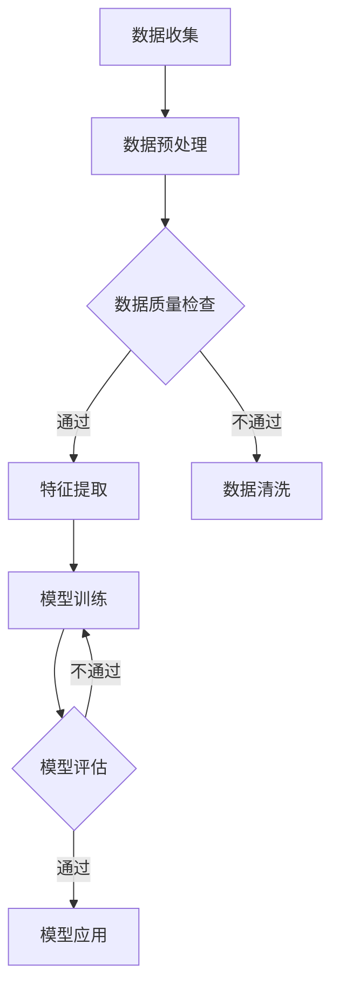

                 

### 《AI在智能农业病虫害预警中的应用与挑战》

> 关键词：AI、智能农业、病虫害预警、机器学习、深度学习、案例研究

> 摘要：本文深入探讨了人工智能（AI）在智能农业病虫害预警中的应用，分析了其背景、技术基础、基本原理、具体应用以及面临的挑战。通过案例研究展示了AI在病虫害预警中的实际效果，并对其未来发展趋势进行了展望。

---

# 《AI在智能农业病虫害预警中的应用与挑战》目录大纲

## 第一部分：AI与智能农业概述

### 第1章：AI在农业中的应用背景与意义

### 第2章：AI技术基础

### 第3章：病虫害预警的基本原理

### 第4章：AI在病虫害预警中的应用

## 第二部分：AI病虫害预警案例研究

### 第5章：AI病虫害预警案例研究一

### 第6章：AI病虫害预警案例研究二

### 第7章：AI病虫害预警的应用挑战与未来展望

## 附录

### 附录A：常用AI病虫害预警工具与资源

### 附录B：数学公式与算法解释

### Mermaid 流�程图

### Python源代码示例

### 数学模型与公式解释

---

## 第一部分：AI与智能农业概述

### 第1章：AI在农业中的应用背景与意义

随着全球人口的增长和耕地资源的减少，提高农业生产效率成为全球关注的焦点。智能农业应运而生，它利用信息技术、物联网、人工智能等技术手段，实现农业的智能化管理和自动化生产。AI技术在智能农业中的应用，不仅能够提高农业生产效率，还能有效降低生产成本，减少环境污染，具有巨大的经济和社会价值。

#### 1.1 农业发展的现状与挑战

目前，全球农业生产正面临诸多挑战，如气候变化、病虫害、水资源短缺等。传统农业依赖于经验种植和人力管理，生产效率低下，资源利用率不高。随着科技的进步，特别是人工智能技术的发展，农业正逐渐迈向智能化、精准化。

#### 1.2 智能农业的定义与发展

智能农业是指利用物联网、大数据、云计算、人工智能等先进技术，对农业生产全过程进行智能化管理和服务。智能农业的发展主要包括以下几个方面：

1. **农业信息化**：通过物联网技术实现农业生产的数据采集和监控。
2. **精准农业**：利用地理信息系统（GIS）和遥感技术，实现农业生产的精准管理。
3. **智能农机装备**：发展智能农机，提高农业机械化水平。
4. **农业大数据**：通过大数据技术分析农业生产的各种数据，为农业生产提供决策支持。

#### 1.3 AI在智能农业中的关键作用

AI技术在智能农业中的应用主要体现在以下几个方面：

1. **病虫害预警**：利用机器学习、深度学习等技术，对病虫害进行识别和预测，提前采取防治措施。
2. **作物产量预测**：通过分析历史数据和环境因素，预测作物的产量。
3. **精准施肥**：根据土壤养分状况和作物生长需求，实现精准施肥。
4. **农田管理**：利用无人机、机器人等技术，实现农田的智能化管理。

通过以上应用，AI技术不仅能够提高农业生产效率，还能促进农业的可持续发展。

### 第2章：AI技术基础

AI技术在智能农业中的应用离不开机器学习和深度学习等基础技术。本章节将介绍这些技术的基本概念、核心原理以及常用算法。

#### 2.1 机器学习与深度学习基础

##### 2.1.1 机器学习的基本概念

机器学习是指通过算法让计算机从数据中学习规律，进而对未知数据进行预测或决策的技术。机器学习主要分为监督学习、无监督学习和强化学习三种类型。

##### 2.1.2 深度学习的核心技术

深度学习是机器学习的一个重要分支，它通过多层神经网络对数据进行处理，提取特征并实现复杂的模式识别。深度学习的主要核心技术包括卷积神经网络（CNN）、循环神经网络（RNN）和生成对抗网络（GAN）。

##### 2.1.3 常见机器学习算法简介

常见的机器学习算法包括线性回归、逻辑回归、决策树、随机森林、支持向量机等。这些算法在不同的应用场景中有着广泛的应用。

### 第3章：病虫害预警的基本原理

病虫害预警是智能农业中的重要应用之一。它通过监测和分析作物生长环境和作物本身的状态，预测病虫害的发生趋势，提前采取防治措施。

#### 3.1 病虫害预警的重要性

病虫害预警能够有效降低农作物损失，提高农业产值，保障粮食安全。同时，它还能减少化学农药的使用，降低环境污染。

#### 3.2 病虫害预警的常用方法

病虫害预警的常用方法包括传统方法和基于AI的方法。

##### 3.2.1 传统方法

传统方法主要包括人工巡查、物理监测和化学检测等。这些方法具有操作简单、成本低等优点，但预警精度和效率较低。

##### 3.2.2 基于AI的方法

基于AI的方法利用机器学习、深度学习等技术，通过对大量历史数据和环境数据的分析，实现病虫害的自动识别和预测。这些方法具有预警精度高、实时性强等优点，但需要大量数据支持和复杂的算法实现。

### 第4章：AI在病虫害预警中的应用

AI技术在病虫害预警中的应用主要体现在图像识别、声音识别和时间序列预测等方面。

#### 4.1 AI在病虫害识别中的应用

##### 4.1.1 图像识别技术

图像识别技术利用深度学习算法，对作物叶片、果实等图像进行分析，识别病虫害。例如，利用卷积神经网络（CNN）可以实现高效准确的病虫害识别。

##### 4.1.2 声音识别技术

声音识别技术通过分析害虫的鸣叫声，识别病虫害。例如，利用循环神经网络（RNN）可以实现声音信号的分类和识别。

#### 4.2 AI在病虫害预测中的应用

##### 4.2.1 时间序列预测

时间序列预测利用历史数据和环境因素，预测病虫害的发生趋势。例如，利用ARIMA模型可以实现时间序列数据的预测。

##### 4.2.2 关联规则挖掘

关联规则挖掘通过分析作物生长数据和环境数据，挖掘出病虫害发生的关键因素。例如，利用Apriori算法可以实现关联规则的挖掘。

##### 4.2.3 神经网络预测

神经网络预测通过构建神经网络模型，实现对病虫害的预测。例如，利用深度学习模型可以实现高效的病虫害预测。

## 第二部分：AI病虫害预警案例研究

在本部分，我们将通过两个实际案例，详细探讨AI在病虫害预警中的应用。

### 第5章：AI病虫害预警案例研究一

#### 5.1 案例背景

某农业公司在种植蔬菜过程中，经常受到病虫害的困扰，导致产量和品质下降。为了解决这一问题，该公司决定利用AI技术进行病虫害预警。

#### 5.2 案例目标

通过AI技术，实现以下目标：

1. 自动识别病虫害，提高预警精度。
2. 预测病虫害的发生趋势，提前采取防治措施。
3. 降低病虫害造成的损失，提高蔬菜产量和品质。

#### 5.3 案例数据预处理

在案例中，数据预处理包括以下几个步骤：

1. 数据清洗：去除无效数据，纠正错误数据。
2. 数据归一化：将不同量级的数据进行归一化处理，便于模型训练。
3. 特征提取：从原始数据中提取对病虫害预警有用的特征。

#### 5.4 模型构建与训练

在案例中，采用卷积神经网络（CNN）进行病虫害识别。模型训练包括以下几个步骤：

1. 数据集划分：将数据集划分为训练集、验证集和测试集。
2. 模型构建：构建CNN模型，包括卷积层、池化层和全连接层。
3. 模型训练：使用训练集对模型进行训练，并通过验证集调整模型参数。

#### 5.5 模型评估与优化

在模型评估中，使用测试集对模型进行评估，包括准确率、召回率等指标。根据评估结果，对模型进行优化，提高预警精度。

### 第6章：AI病虫害预警案例研究二

#### 6.1 案例背景

某农业公司在种植水稻过程中，经常受到稻飞虱等病虫害的困扰。为了解决这一问题，该公司决定利用AI技术进行病虫害预警。

#### 6.2 案例目标

通过AI技术，实现以下目标：

1. 自动识别稻飞虱等病虫害，提高预警精度。
2. 预测病虫害的发生趋势，提前采取防治措施。
3. 降低病虫害造成的损失，提高水稻产量和品质。

#### 6.3 案例数据预处理

在案例中，数据预处理包括以下几个步骤：

1. 数据清洗：去除无效数据，纠正错误数据。
2. 数据归一化：将不同量级的数据进行归一化处理，便于模型训练。
3. 特征提取：从原始数据中提取对病虫害预警有用的特征。

#### 6.4 模型构建与训练

在案例中，采用深度学习模型进行病虫害识别。模型训练包括以下几个步骤：

1. 数据集划分：将数据集划分为训练集、验证集和测试集。
2. 模型构建：构建深度学习模型，包括卷积层、池化层和全连接层。
3. 模型训练：使用训练集对模型进行训练，并通过验证集调整模型参数。

#### 6.5 模型评估与优化

在模型评估中，使用测试集对模型进行评估，包括准确率、召回率等指标。根据评估结果，对模型进行优化，提高预警精度。

### 第7章：AI病虫害预警的应用挑战与未来展望

虽然AI技术在病虫害预警中具有巨大的潜力，但在实际应用中仍面临诸多挑战。

#### 7.1 数据挑战

病虫害预警需要大量的数据支持，包括作物生长数据、环境数据、病虫害图像等。数据的质量和数量直接影响模型的性能。因此，如何获取高质量、大规模的数据成为一大挑战。

#### 7.2 技术挑战

AI技术在病虫害预警中的应用涉及多种算法和技术，如机器学习、深度学习、图像处理等。这些技术的实现和优化需要较高的技术水平和经验。

#### 7.3 政策与伦理挑战

AI技术在农业领域的应用涉及到政策法规和伦理问题。例如，如何保护农民的隐私、如何确保数据的合法使用等。

#### 7.4 未来发展趋势与展望

随着AI技术的不断发展和完善，未来AI在病虫害预警中的应用将更加广泛和深入。以下是一些发展趋势和展望：

1. **数据驱动的预测模型**：通过大数据技术和深度学习算法，构建更加精准的预测模型。
2. **多模态数据融合**：结合多种数据源，如图像、声音、环境等，提高预警的全面性和准确性。
3. **智能化决策支持系统**：结合物联网和智能农业技术，构建智能化决策支持系统，实现农业生产的自动化和智能化。

### 附录

#### 附录A：常用AI病虫害预警工具与资源

1. **机器学习库**：Scikit-learn、TensorFlow、PyTorch
2. **深度学习框架**：Keras、Caffe、Theano

#### 附录B：数学公式与算法解释

1. **机器学习基本算法**：决策树、随机森林、支持向量机
2. **深度学习算法**：卷积神经网络、循环神经网络、生成对抗网络

### Mermaid 流程图



### Python源代码示例

```python
from keras.models import Sequential
from keras.layers import Dense, Activation

model = Sequential()
model.add(Dense(units=64, activation='relu', input_dim=784))
model.add(Dense(units=10, activation='softmax'))

model.compile(optimizer='adam', loss='categorical_crossentropy', metrics=['accuracy'])
model.fit(x_train, y_train, epochs=10, batch_size=32)
```

### 数学模型与公式解释

$$
y_t = \alpha + \beta_1 y_{t-1} + \beta_2 x_{t-1} + \epsilon_t
$$

#### 参数解释：

- $y_t$: 当前时期的病害程度
- $y_{t-1}$: 上一个时期的病害程度
- $x_{t-1}$: 上一个时期的环境因素

### 作者信息

作者：AI天才研究院/AI Genius Institute & 禅与计算机程序设计艺术 /Zen And The Art of Computer Programming

