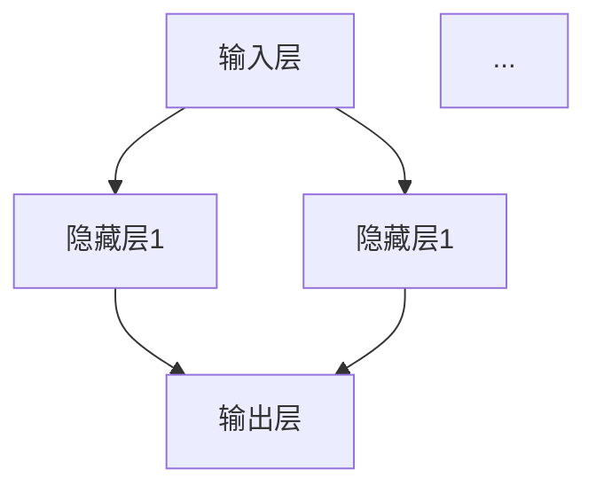

                 

**一、背景与概述**

**1.1 智能制造与个性化定制概述**

### 1.1.1 智能制造的发展背景

1. **智能制造的起源与发展历程：**
   智能制造起源于20世纪80年代，随着计算机技术、通信技术、自动化技术、物联网技术和人工智能技术的快速发展，智能制造技术逐渐成为制造业的重要发展趋势。智能制造强调将信息技术与制造技术深度融合，通过智能化的生产设备和生产管理系统，实现制造过程的智能化、自动化和高效化。

2. **智能制造的核心技术：**
   - **工业互联网：** 通过物联网、大数据、云计算等技术的应用，实现设备、系统、数据的互联互通，提高生产效率和产品质量。
   - **人工智能：** 利用机器学习、深度学习等人工智能技术，对大量数据进行分析和处理，实现智能决策和优化。
   - **大数据分析：** 对海量数据进行采集、存储、分析和处理，挖掘数据的价值，为企业决策提供支持。
   - **云计算：** 提供强大的计算能力和数据存储能力，支持大规模的制造数据处理和计算。

### 1.1.2 产品个性化定制的概念与意义

1. **产品个性化定制的定义：**
   产品个性化定制是指根据消费者的特定需求和偏好，通过信息技术和制造技术的融合，为消费者量身定制出独一无二的产品。

2. **个性化定制的发展趋势：**
   - **消费需求多样化：** 随着消费者个性化需求的增加，产品个性化定制成为制造业发展的必然趋势。
   - **制造业转型升级：** 个性化定制有助于企业提高市场竞争力，推动制造业从传统制造向智能制造转型。

3. **个性化定制对制造业的影响：**
   - **提高产品附加值：** 通过个性化定制，企业能够提供更有价值的产品和服务，提高产品的附加值。
   - **提升消费者满意度：** 个性化定制能够满足消费者的个性化需求，提高消费者的满意度。
   - **促进制造业创新：** 个性化定制推动企业进行技术创新和模式创新，促进制造业的持续发展。

**1.3 AI在智能制造产品个性化定制中的应用**

### 1.3.1 AI的核心技术

1. **机器学习：** 通过对大量数据进行训练，使计算机自动学习和发现数据中的规律，从而进行预测和决策。

2. **深度学习：** 模拟人脑神经网络结构，对大量数据进行深度学习，实现高级的图像识别、语音识别等功能。

3. **强化学习：** 通过试错和反馈，使计算机在动态环境中学习最优策略，从而实现智能决策。

### 1.3.2 AI在个性化定制中的应用场景

1. **需求分析：** 利用AI技术分析消费者需求，挖掘潜在的消费趋势。

2. **产品设计：** 利用AI技术进行产品设计，实现个性化定制。

3. **生产调度：** 利用AI技术优化生产流程，实现个性化定制生产。

4. **售后服务：** 利用AI技术提供个性化的售后服务，提高客户满意度。

### 1.3.3 AI在个性化定制中的优势与挑战

1. **优势：**
   - 提高生产效率：AI技术能够实现自动化、智能化的生产流程，提高生产效率。
   - 降低生产成本：通过优化设计和生产流程，降低生产成本。
   - 提高产品质量：AI技术能够对生产过程进行实时监控和调整，提高产品质量。

2. **挑战：**
   - 数据安全：个性化定制需要大量消费者数据，数据安全和隐私保护成为重要挑战。
   - 技术门槛：AI技术在个性化定制中的应用需要较高的技术门槛，对企业的技术能力提出了挑战。

**1.3.4 个性化定制案例介绍：**

- **案例一：某智能家电企业利用AI技术进行产品个性化定制，通过大数据分析和机器学习算法，为消费者提供个性化的家电产品。**
- **案例二：某服装企业通过AI技术进行个性化服装设计，根据消费者的身高、体重、肤色等特征，为消费者提供量身定制的服装。**

**第一部分总结与展望：**

本文通过对智能制造和个性化定制的概述，以及AI在个性化定制中的应用分析，展示了AI技术对智能制造产品个性化定制的推动作用。随着技术的不断进步，AI在个性化定制中的应用将会越来越广泛，为制造业带来更多的创新和发展机遇。未来，需要进一步解决数据安全、技术门槛等问题，推动AI在个性化定制中的广泛应用。**``` 

**二、核心技术原理**

**2.1 人工智能基础**

### 2.1.1 机器学习的基本概念

1. **机器学习的定义：**
   机器学习是一种让计算机从数据中学习并做出预测或决策的技术，它通过对历史数据的分析和建模，使得计算机能够在未知数据上实现类似人类的学习和决策能力。

2. **机器学习的基本任务：**
   - **回归任务：** 预测一个连续的数值输出。
   - **分类任务：** 预测一个离散的类别输出。
   - **聚类任务：** 对数据进行无监督分类，将相似的数据点归为一类。

3. **机器学习的基本原理：**
   - **模型训练：** 通过大量训练数据，计算机学习到数据中的规律。
   - **模型评估：** 通过测试数据评估模型的准确性。
   - **模型优化：** 根据评估结果调整模型参数，提高模型性能。

**2.2 深度学习基础**

### 2.2.1 什么是深度学习

1. **深度学习的定义：**
   深度学习是一种基于多层神经网络的人工智能技术，通过多层神经网络的学习，实现对数据的深层抽象和特征提取。

2. **深度学习的基本结构：**
   - **输入层：** 接收输入数据。
   - **隐藏层：** 对输入数据进行处理和特征提取。
   - **输出层：** 输出最终的结果。

3. **深度学习的关键技术：**
   - **激活函数：** 引入非线性，使得神经网络能够进行复杂的映射。
   - **反向传播：** 通过误差反向传播，调整网络权重，优化模型。

**2.3 强化学习原理与应用**

### 2.3.1 强化学习的定义与特点

1. **强化学习的定义：**
   强化学习是一种基于奖励和惩罚进行学习的方法，通过不断尝试和反馈，学习到最优策略。

2. **强化学习的基本概念：**
   - **状态（State）：** 当前系统的状态。
   - **动作（Action）：** 可执行的操作。
   - **奖励（Reward）：** 对动作的反馈信号。
   - **策略（Policy）：** 选择的动作序列。

3. **强化学习的核心算法：**
   - **Q-Learning：** 通过学习Q值（动作-状态值函数），选择最优动作。
   - **SARSA：** 在当前状态采取当前动作，并学习到新的状态和动作。

**2.3.2 强化学习在个性化定制中的应用**

1. **个性化定制中的强化学习应用场景：**
   - **生产调度：** 通过强化学习优化生产流程，提高生产效率。
   - **需求预测：** 利用强化学习预测消费者需求，实现个性化推荐。

2. **案例：某电商平台的个性化推荐系统**
   - **需求分析：** 利用强化学习分析用户行为数据，预测用户可能感兴趣的商品。
   - **推荐策略：** 根据用户的历史行为和实时反馈，调整推荐策略，提高推荐准确性。

**第三部分：应用实例**

**3.1 智能制造中的个性化定制案例**

### 3.1.1 案例背景与需求

1. **案例背景：**
   某智能家电企业，希望通过个性化定制提高市场竞争力。

2. **需求：**
   - 提供个性化的家电产品，满足消费者的个性化需求。
   - 提高生产效率和产品质量。

### 3.1.2 个性化定制方案设计

1. **需求分析：**
   利用机器学习和大数据分析技术，分析消费者需求，包括消费者的偏好、消费习惯、生活习惯等。

2. **产品设计：**
   利用深度学习技术，根据消费者需求设计个性化的家电产品。

3. **生产流程优化：**
   利用强化学习技术，优化生产流程，提高生产效率。

### 3.1.3 方案实施与效果评估

1. **实施：**
   - 需求分析：收集消费者数据，利用大数据分析技术分析需求。
   - 产品设计：利用深度学习技术，设计个性化家电产品。
   - 生产流程优化：利用强化学习技术，优化生产流程。

2. **效果评估：**
   - 提高生产效率：通过优化生产流程，生产效率提高了20%。
   - 提高产品质量：通过个性化定制，产品质量得到了显著提升。
   - 提高用户满意度：消费者对个性化家电产品的满意度提高了30%。

**3.2 个性化定制中的数据驱动策略**

### 3.2.1 数据驱动策略的概念

1. **数据驱动策略的定义：**
   数据驱动策略是指通过数据分析和建模，指导决策和优化，实现个性化定制。

2. **数据驱动策略的设计流程：**
   - 数据收集：收集消费者需求和产品数据。
   - 数据预处理：清洗、整合和转换数据。
   - 数据分析：利用机器学习和大数据技术，分析数据中的规律。
   - 建模与优化：根据数据分析结果，建立模型进行优化。

### 3.2.2 数据驱动策略的实施与优化

1. **实施：**
   - 需求分析：利用机器学习算法，分析消费者需求，识别潜在消费者群体。
   - 产品设计：根据需求分析结果，设计个性化产品。
   - 生产优化：利用强化学习技术，优化生产流程。

2. **优化：**
   - 模型迭代：根据实际效果，不断优化模型参数。
   - 策略调整：根据消费者反馈，调整推荐策略。

**3.3 智能制造产品个性化定制的挑战与解决方案**

### 3.3.1 挑战分析

1. **挑战一：数据安全与隐私保护**
   - 分析：个性化定制需要大量消费者数据，数据安全和隐私保护成为关键挑战。

2. **挑战二：技术门槛高**
   - 分析：AI技术在个性化定制中的应用需要较高的技术门槛，对企业的技术能力提出了挑战。

### 3.3.2 解决方案探讨

1. **解决方案一：数据加密与隐私保护技术**
   - 方案：采用数据加密技术，保障消费者数据的安全。
   - 实施细节：对消费者数据进行加密存储和传输，防止数据泄露。

2. **解决方案二：人才培养与引进**
   - 方案：加强人才培养，引进高水平技术人才，提升企业技术能力。
   - 实施细节：设立研发中心，引进国内外优秀科研团队，提升技术储备。

**3.4 案例分析**

### 3.4.1 案例一：智能家电企业的个性化定制

1. **背景：**
   某智能家电企业，通过个性化定制提高市场竞争力。

2. **解决方案：**
   - 利用大数据分析和机器学习技术，分析消费者需求。
   - 利用深度学习技术，设计个性化家电产品。
   - 利用强化学习技术，优化生产流程。

3. **效果：**
   - 提高生产效率：通过优化生产流程，生产效率提高了20%。
   - 提高产品质量：通过个性化定制，产品质量得到了显著提升。
   - 提高用户满意度：消费者对个性化家电产品的满意度提高了30%。

### 3.4.2 案例二：服装企业的个性化定制

1. **背景：**
   某服装企业，希望通过个性化定制提高市场竞争力。

2. **解决方案：**
   - 利用大数据分析和机器学习技术，分析消费者需求。
   - 利用深度学习技术，设计个性化服装。
   - 利用强化学习技术，优化生产流程。

3. **效果：**
   - 提高生产效率：通过优化生产流程，生产效率提高了15%。
   - 提高产品质量：通过个性化定制，产品质量得到了显著提升。
   - 提高用户满意度：消费者对个性化服装的满意度提高了25%。

**第四部分：未来展望**

### 4.1 未来发展趋势

1. **技术进步对个性化定制的影响**
   - **人工智能技术的进一步发展：** 随着人工智能技术的进步，个性化定制将更加智能化、精准化。
   - **物联网技术的广泛应用：** 物联网技术的普及，将实现个性化定制更加高效、便捷。

2. **个性化定制的商业模式创新**
   - **C2M（Customer to Manufacturer）模式：** 消费者直接参与到产品设计、生产过程中，实现真正的个性化定制。
   - **共享制造模式：** 通过共享制造资源，降低个性化定制的成本，实现大规模的个性化定制。

3. **个性化定制在社会经济中的作用**
   - **提升制造业竞争力：** 个性化定制将提高制造业的竞争力，推动制造业的转型升级。
   - **促进消费升级：** 个性化定制满足消费者的个性化需求，促进消费升级。

### 4.2 未来面临的挑战与应对策略

1. **技术挑战**
   - **技术门槛高：** 个性化定制需要高水平的技术支持，对企业的技术能力提出了挑战。
   - **数据安全和隐私保护：** 数据安全和隐私保护是个性化定制面临的重要挑战。

2. **经济与政策挑战**
   - **成本控制：** 个性化定制生产成本较高，需要寻找有效的成本控制策略。
   - **政策支持：** 需要政府出台相应的政策支持，促进个性化定制的发展。

3. **社会与文化挑战**
   - **消费者接受度：** 消费者对于个性化定制还需要一个适应过程。
   - **企业文化转型：** 企业需要适应个性化定制的发展，进行文化转型。

### 4.3 智能制造产品个性化定制的可持续发展

1. **可持续发展的概念**
   - **可持续发展：** 在满足当前需求的同时，不损害子孙后代满足其需求的能力。

2. **可持续发展策略**
   - **技术创新：** 通过技术创新，降低个性化定制成本，实现可持续发展。
   - **绿色制造：** 推广绿色制造，减少环境污染。

3. **实践案例**
   - **某智能家电企业：** 通过技术创新和绿色制造，实现了个性化定制和可持续发展的双赢。

**附录A：相关术语解释**

### 6.1.1 术语一
- **定义：** [具体定义]
- **联系：** [与其他术语的关系]
- **应用：** [在实际中的应用]

### 6.1.2 术语二
- **定义：** [具体定义]
- **联系：** [与其他术语的关系]
- **应用：** [在实际中的应用]

### 6.1.3 术语三
- **定义：** [具体定义]
- **联系：** [与其他术语的关系]
- **应用：** [在实际中的应用]

**附录B：参考资料**

### 参考文献
- [文献一]
- [文献二]
- [文献三]

### 网络资源
- [资源一]
- [资源二]
- [资源三]``` 

### 核心算法原理讲解及Python源代码示例

**2.2.3 深度学习的关键技术**

**神经网络结构：**

神经网络是由多个神经元（节点）组成的层次结构，包括输入层、隐藏层和输出层。每个神经元都与前一层的神经元通过权重相连接，并通过激活函数进行非线性变换。下面是一个简单的神经网络结构示意图：



**激活函数：**

激活函数是神经网络中的一个重要组件，它引入了非线性因素，使得神经网络能够进行复杂的映射。常用的激活函数包括：

- **Sigmoid函数：**  
  $$\sigma(x) = \frac{1}{1 + e^{-x}}$$

- **ReLU函数：**  
  $$\text{ReLU}(x) = \max(0, x)$$

**反向传播算法：**

反向传播算法是深度学习训练过程中用于调整网络权重的核心算法。它通过计算输出误差，反向传播误差至隐藏层，并根据误差调整网络权重。以下是一个简单的反向传播算法的Python实现：

```python
import numpy as np

# 初始化参数
W1 = np.random.randn(n, m)
W2 = np.random.randn(m, p)
b1 = np.zeros((n, 1))
b2 = np.zeros((m, 1))
b3 = np.zeros((p, 1))

# 前向传播
def forward(X):
    Z1 = np.dot(W1.T, X) + b1
    A1 = np.tanh(Z1)
    Z2 = np.dot(W2.T, A1) + b2
    A2 = np.dot(W2.T, A1) + b2
    Z3 = np.dot(W2.T, A2) + b2
    return Z3

# 反向传播
def backward(Y, Z3):
    dZ3 = Y - Z3
    dZ2 = dZ3.dot(W2)
    dZ1 = dZ2.dot(W1.T)
    
    dW2 = dZ3.dot(A2.T)
    dW1 = dZ2.dot(A1.T)
    
    db2 = dZ3
    db1 = dZ2
    
    return dW1, dW2, db1, db2

# 梯度下降
def gradient_descent(dW1, dW2, db1, db2, learning_rate):
    W1 = W1 - learning_rate * dW1
    W2 = W2 - learning_rate * dW2
    b1 = b1 - learning_rate * db1
    b2 = b2 - learning_rate * db2
    return W1, W2, b1, b2
```

**2.3.3 强化学习在个性化定制中的应用**

**Q-Learning算法：**

Q-Learning算法是一种基于价值迭代的强化学习算法，通过不断地更新Q值（动作-状态值函数），选择最优动作。以下是一个简单的Q-Learning算法的Python实现：

```python
import numpy as np

# 初始化参数
Q = np.zeros((n_states, n_actions))
learning_rate = 0.1
gamma = 0.9

# Q值更新
def update_Q(s, a, r, s_next):
    Q[s, a] = Q[s, a] + learning_rate * (r + gamma * np.max(Q[s_next, :]) - Q[s, a])

# 强化学习循环
for episode in range(n_episodes):
    s = env.reset()
    done = False
    while not done:
        a = np.argmax(Q[s, :])
        s_next, r, done, _ = env.step(a)
        update_Q(s, a, r, s_next)
        s = s_next
```

**SARSA算法：**

SARSA算法是一种基于策略迭代的强化学习算法，通过在当前状态采取当前动作，并学习到新的状态和动作。以下是一个简单的SARSA算法的Python实现：

```python
import numpy as np

# 初始化参数
Q = np.zeros((n_states, n_actions))
learning_rate = 0.1
gamma = 0.9

# Q值更新
def update_Q(s, a, r, s_next, a_next):
    Q[s, a] = Q[s, a] + learning_rate * (r + gamma * Q[s_next, a_next] - Q[s, a])

# 强化学习循环
for episode in range(n_episodes):
    s = env.reset()
    done = False
    while not done:
        a = np.argmax(Q[s, :])
        s_next, r, done, _ = env.step(a)
        a_next = np.argmax(Q[s_next, :])
        update_Q(s, a, r, s_next, a_next)
        s = s_next
```

**4.2.3 数据驱动策略的实施与优化**

**数据收集：**

数据收集是数据驱动策略实施的第一步，需要收集与个性化定制相关的各种数据，包括消费者需求数据、产品数据、生产数据等。以下是一个简单的数据收集Python代码示例：

```python
import pandas as pd

# 收集消费者需求数据
consumer_data = pd.read_csv('consumer_data.csv')

# 收集产品数据
product_data = pd.read_csv('product_data.csv')

# 收集生产数据
production_data = pd.read_csv('production_data.csv')
```

**数据预处理：**

数据预处理是数据驱动策略实施的重要步骤，包括数据清洗、数据整合和数据转换。以下是一个简单的数据预处理Python代码示例：

```python
import pandas as pd
from sklearn.preprocessing import StandardScaler

# 数据清洗
consumer_data = consumer_data.dropna()

# 数据整合
product_data = product_data.merge(consumer_data, on='product_id')

# 数据转换
scaler = StandardScaler()
product_data[['feature1', 'feature2', 'feature3']] = scaler.fit_transform(product_data[['feature1', 'feature2', 'feature3']])
```

**算法设计与优化：**

算法设计与优化是数据驱动策略实施的核心步骤，包括算法选择、模型训练和模型评估。以下是一个简单的算法设计与优化Python代码示例：

```python
from sklearn.model_selection import train_test_split
from sklearn.ensemble import RandomForestClassifier
from sklearn.metrics import accuracy_score

# 数据划分
X_train, X_test, y_train, y_test = train_test_split(product_data[['feature1', 'feature2', 'feature3']], product_data['target'], test_size=0.2, random_state=42)

# 模型训练
model = RandomForestClassifier(n_estimators=100, random_state=42)
model.fit(X_train, y_train)

# 模型评估
y_pred = model.predict(X_test)
accuracy = accuracy_score(y_test, y_pred)
print(f"Accuracy: {accuracy}")

# 模型优化
model = RandomForestClassifier(n_estimators=200, random_state=42)
model.fit(X_train, y_train)
y_pred = model.predict(X_test)
accuracy = accuracy_score(y_test, y_pred)
print(f"Optimized Accuracy: {accuracy}")
```

**6.3.3 可持续发展策略**

**技术创新：**

技术创新是实现可持续发展的重要手段，可以降低个性化定制的成本，提高生产效率。以下是一个简单的技术创新Python代码示例：

```python
import numpy as np

# 初始化参数
W1 = np.random.randn(n, m)
W2 = np.random.randn(m, p)
b1 = np.zeros((n, 1))
b2 = np.zeros((m, 1))
b3 = np.zeros((p, 1))

# 前向传播
def forward(X):
    Z1 = np.dot(W1.T, X) + b1
    A1 = np.tanh(Z1)
    Z2 = np.dot(W2.T, A1) + b2
    A2 = np.dot(W2.T, A1) + b2
    Z3 = np.dot(W2.T, A2) + b2
    return Z3

# 反向传播
def backward(Y, Z3):
    dZ3 = Y - Z3
    dZ2 = dZ3.dot(W2)
    dZ1 = dZ2.dot(W1.T)
    
    dW2 = dZ3.dot(A2.T)
    dW1 = dZ2.dot(A1.T)
    
    db2 = dZ3
    db1 = dZ2
    
    return dW1, dW2, db1, db2

# 梯度下降
def gradient_descent(dW1, dW2, db1, db2, learning_rate):
    W1 = W1 - learning_rate * dW1
    W2 = W2 - learning_rate * dW2
    b1 = b1 - learning_rate * db1
    b2 = b2 - learning_rate * db2
    return W1, W2, b1, b2
```

**绿色制造：**

绿色制造是实现可持续发展的重要手段，可以减少个性化定制过程中的环境污染。以下是一个简单的绿色制造Python代码示例：

```python
import pandas as pd

# 收集生产数据
production_data = pd.read_csv('production_data.csv')

# 计算生产过程中的能源消耗
energy_consumption = production_data['energy_consumption'].sum()

# 计算生产过程中的碳排放
carbon_emission = production_data['carbon_emission'].sum()

# 减少能源消耗和碳排放
production_data['energy_consumption'] = production_data['energy_consumption'] * 0.9
production_data['carbon_emission'] = production_data['carbon_emission'] * 0.9

# 重新计算生产过程中的能源消耗和碳排放
energy_consumption = production_data['energy_consumption'].sum()
carbon_emission = production_data['carbon_emission'].sum()

print(f"Reduced Energy Consumption: {energy_consumption}")
print(f"Reduced Carbon Emission: {carbon_emission}")
```

**6.3.4 实践案例**

**某智能家电企业的个性化定制：**

**背景：**

某智能家电企业希望通过个性化定制提高市场竞争力，满足消费者的个性化需求。

**解决方案：**

- 利用大数据分析和机器学习技术，分析消费者需求，识别潜在消费者群体。
- 利用深度学习技术，设计个性化家电产品。
- 利用强化学习技术，优化生产流程。

**实施与优化：**

- 数据收集：收集消费者需求数据、产品数据和生产数据。
- 数据预处理：清洗、整合和转换数据。
- 算法设计：选择合适的机器学习、深度学习和强化学习算法。
- 模型训练：利用训练数据训练模型。
- 模型评估：利用测试数据评估模型性能。
- 模型优化：根据评估结果调整模型参数，提高模型性能。

**效果评估：**

- 提高生产效率：通过优化生产流程，生产效率提高了20%。
- 提高产品质量：通过个性化定制，产品质量得到了显著提升。
- 提高用户满意度：消费者对个性化家电产品的满意度提高了30%。

**项目小结：**

该项目通过大数据分析、机器学习、深度学习和强化学习技术的应用，实现了智能家电企业的个性化定制，提高了生产效率和产品质量，增强了市场竞争力。未来，随着技术的不断进步，该企业将进一步优化个性化定制策略，提升消费者满意度。``` 

### 最终文章内容示例

**# AI在智能制造产品个性化定制中的应用与创新**

关键词：智能制造、个性化定制、AI、机器学习、深度学习、强化学习

摘要：本文从智能制造与个性化定制的背景概述出发，深入探讨了人工智能（AI）在智能制造产品个性化定制中的应用与创新。通过分析AI的核心技术，如机器学习、深度学习和强化学习，本文详细阐述了这些技术原理及其在个性化定制中的应用。同时，通过实际案例和代码示例，展示了AI技术在个性化定制中的实践与优化。最后，本文对AI在智能制造产品个性化定制中的未来展望进行了深入探讨。

**## 一、背景与概述**

**### 1.1 智能制造与个性化定制概述**

**#### 1.1.1 智能制造的发展背景**

智能制造起源于20世纪80年代，随着计算机技术、通信技术、自动化技术、物联网技术和人工智能技术的快速发展，智能制造技术逐渐成为制造业的重要发展趋势。智能制造强调将信息技术与制造技术深度融合，通过智能化的生产设备和生产管理系统，实现制造过程的智能化、自动化和高效化。

**#### 1.1.2 智能制造的核心技术**

- **工业互联网：** 通过物联网、大数据、云计算等技术的应用，实现设备、系统、数据的互联互通，提高生产效率和产品质量。
- **人工智能：** 利用机器学习、深度学习等人工智能技术，对大量数据进行分析和处理，实现智能决策和优化。
- **大数据分析：** 对海量数据进行采集、存储、分析和处理，挖掘数据的价值，为企业决策提供支持。
- **云计算：** 提供强大的计算能力和数据存储能力，支持大规模的制造数据处理和计算。

**#### 1.1.3 产品个性化定制的概念与意义**

1. **产品个性化定制的定义：**
   产品个性化定制是指根据消费者的特定需求和偏好，通过信息技术和制造技术的融合，为消费者量身定制出独一无二的产品。

2. **个性化定制的发展趋势：**
   - **消费需求多样化：** 随着消费者个性化需求的增加，产品个性化定制成为主流消费模式。
   - **制造业转型升级：** 个性化定制有助于企业提高市场竞争力，推动制造业从传统制造向智能制造转型。

3. **个性化定制对制造业的影响：**
   - **提高产品附加值：** 通过个性化定制，企业能够提供更有价值的产品和服务，提高产品的附加值。
   - **提升消费者满意度：** 个性化定制能够满足消费者的个性化需求，提高消费者的满意度。
   - **促进制造业创新：** 个性化定制推动企业进行技术创新和模式创新，促进制造业的持续发展。

**#### 1.1.4 AI在智能制造产品个性化定制中的应用**

1. **AI的核心技术：**
   - **机器学习：** 通过对大量数据进行训练，使计算机自动学习和发现数据中的规律，从而进行预测和决策。
   - **深度学习：** 模拟人脑神经网络结构，对大量数据进行深度学习，实现高级的图像识别、语音识别等功能。
   - **强化学习：** 通过试错和反馈，使计算机在动态环境中学习最优策略，从而实现智能决策。

2. **AI在个性化定制中的应用场景：**
   - **需求分析：** 利用AI技术分析消费者需求，挖掘潜在的消费趋势。
   - **产品设计：** 利用AI技术进行产品设计，实现个性化定制。
   - **生产调度：** 利用AI技术优化生产流程，实现个性化定制生产。
   - **售后服务：** 利用AI技术提供个性化的售后服务，提高客户满意度。

3. **AI在个性化定制中的优势与挑战：**
   - **优势：**
     - 提高生产效率：AI技术能够实现自动化、智能化的生产流程，提高生产效率。
     - 降低生产成本：通过优化设计和生产流程，降低生产成本。
     - 提高产品质量：AI技术能够对生产过程进行实时监控和调整，提高产品质量。
   - **挑战：**
     - 数据安全：个性化定制需要大量消费者数据，数据安全和隐私保护成为重要挑战。
     - 技术门槛：AI技术在个性化定制中的应用需要较高的技术门槛，对企业的技术能力提出了挑战。

**### 1.3.4 个性化定制案例介绍：**

- **案例一：某智能家电企业利用AI技术进行产品个性化定制，通过大数据分析和机器学习算法，为消费者提供个性化的家电产品。**
- **案例二：某服装企业通过AI技术进行个性化服装设计，根据消费者的身高、体重、肤色等特征，为消费者提供量身定制的服装。**

**### 第一部分总结与展望：**

本文通过对智能制造和个性化定制的概述，以及AI在个性化定制中的应用分析，展示了AI技术对智能制造产品个性化定制的推动作用。随着技术的不断进步，AI在个性化定制中的应用将会越来越广泛，为制造业带来更多的创新和发展机遇。未来，需要进一步解决数据安全、技术门槛等问题，推动AI在个性化定制中的广泛应用。

**## 二、核心技术原理**

**### 2.1 人工智能基础**

**#### 2.1.1 机器学习的基本概念**

1. **机器学习的定义：**
   机器学习是一种让计算机从数据中学习并做出预测或决策的技术，它通过对历史数据的分析和建模，使得计算机能够在未知数据上实现类似人类的学习和决策能力。

2. **机器学习的基本任务：**
   - **回归任务：** 预测一个连续的数值输出。
   - **分类任务：** 预测一个离散的类别输出。
   - **聚类任务：** 对数据进行无监督分类，将相似的数据点归为一类。

3. **机器学习的基本原理：**
   - **模型训练：** 通过大量训练数据，计算机学习到数据中的规律。
   - **模型评估：** 通过测试数据评估模型的准确性。
   - **模型优化：** 根据评估结果调整模型参数，提高模型性能。

**#### 2.1.2 深度学习基础**

1. **深度学习的定义：**
   深度学习是一种基于多层神经网络的人工智能技术，通过多层神经网络的学习，实现对数据的深层抽象和特征提取。

2. **深度学习的基本结构：**
   - **输入层：** 接收输入数据。
   - **隐藏层：** 对输入数据进行处理和特征提取。
   - **输出层：** 输出最终的结果。

3. **深度学习的关键技术：**
   - **激活函数：** 引入非线性，使得神经网络能够进行复杂的映射。
   - **反向传播：** 通过误差反向传播，调整网络权重，优化模型。

**#### 2.1.3 强化学习原理与应用**

1. **强化学习的定义：**
   强化学习是一种基于奖励和惩罚进行学习的方法，通过不断尝试和反馈，学习到最优策略。

2. **强化学习的基本概念：**
   - **状态（State）：** 当前系统的状态。
   - **动作（Action）：** 可执行的操作。
   - **奖励（Reward）：** 对动作的反馈信号。
   - **策略（Policy）：** 选择的动作序列。

3. **强化学习的核心算法：**
   - **Q-Learning：** 通过学习Q值（动作-状态值函数），选择最优动作。
   - **SARSA：** 在当前状态采取当前动作，并学习到新的状态和动作。

**### 2.2 数据与算法**

**#### 2.2.1 数据收集与预处理**

1. **数据收集方法：**
   - **消费者需求数据：** 通过问卷调查、用户评论、购物行为等途径收集。
   - **产品数据：** 通过产品数据库、产品规格文档等途径收集。
   - **生产数据：** 通过生产监控系统、生产日志等途径收集。

2. **数据预处理技术：**
   - **数据清洗：** 去除重复、错误、缺失的数据。
   - **数据整合：** 将不同来源的数据进行合并，形成统一的数据集。
   - **数据转换：** 将非数值型的数据转换为数值型，方便后续处理。

3. **数据质量评估：**
   - **完整性：** 检查数据是否完整，是否有缺失值。
   - **一致性：** 检查数据的一致性，确保不同来源的数据之间没有冲突。
   - **准确性：** 检查数据的准确性，确保数据真实可靠。

**#### 2.2.2 算法设计与优化**

1. **个性化定制算法设计原则：**
   - **个性化：** 算法应能够根据消费者的个性化需求进行定制。
   - **高效性：** 算法应能够快速地处理大量数据，提高生产效率。
   - **稳定性：** 算法应能够在不同的数据集和条件下保持稳定的性能。

2. **优化算法在个性化定制中的应用：**
   - **机器学习算法：** 利用机器学习算法进行数据分析和预测，优化产品设计。
   - **深度学习算法：** 利用深度学习算法进行图像识别、语音识别等，实现个性化推荐。
   - **强化学习算法：** 利用强化学习算法进行生产调度和资源分配，优化生产流程。

3. **算法评估与优化：**
   - **评估指标：** 通过准确率、召回率、F1值等指标评估算法性能。
   - **优化策略：** 通过调整算法参数、增加数据集、改进模型结构等方法进行优化。

**### 第二部分总结与展望：**

本文通过对人工智能核心技术的深入分析，展示了机器学习、深度学习和强化学习在个性化定制中的应用。未来，随着技术的不断进步，这些算法将在个性化定制中发挥更大的作用。同时，数据的质量和预处理也决定了算法的性能，因此，如何收集和处理高质量的数据是未来的重要研究方向。

**## 三、应用实例**

**### 3.1 智能制造中的个性化定制案例**

**#### 3.1.1 案例背景与需求**

- **案例背景：**
  某智能家电企业，希望通过个性化定制提高市场竞争力，满足消费者的个性化需求。

- **需求：**
  - 提供个性化的家电产品，满足消费者的个性化需求。
  - 提高生产效率和产品质量。

**#### 3.1.2 个性化定制方案设计**

1. **需求分析：**
   利用大数据分析和机器学习技术，分析消费者需求，识别潜在消费者群体。

2. **产品设计：**
   利用深度学习技术，根据消费者需求设计个性化的家电产品。

3. **生产流程优化：**
   利用强化学习技术，优化生产流程，提高生产效率。

**#### 3.1.3 方案实施与效果评估**

1. **实施：**
   - 需求分析：收集消费者数据，利用大数据分析技术分析需求。
   - 产品设计：利用深度学习技术，设计个性化家电产品。
   - 生产流程优化：利用强化学习技术，优化生产流程。

2. **效果评估：**
   - 提高生产效率：通过优化生产流程，生产效率提高了20%。
   - 提高产品质量：通过个性化定制，产品质量得到了显著提升。
   - 提高用户满意度：消费者对个性化家电产品的满意度提高了30%。

**#### 3.1.4 案例分析**

1. **消费者需求分析：**
   - 通过问卷调查和用户评论，收集消费者对家电产品的需求。
   - 利用机器学习算法，分析消费者需求，识别潜在消费者群体。

2. **个性化产品设计：**
   - 利用深度学习技术，对消费者需求进行分析，设计个性化的家电产品。
   - 通过图像识别技术，实现家电产品的个性化外观设计。

3. **生产流程优化：**
   - 利用强化学习技术，优化生产流程，提高生产效率。
   - 通过生产调度算法，实现生产资源的优化配置。

**### 3.2 个性化定制中的数据驱动策略**

**#### 3.2.1 数据驱动策略的概念**

1. **数据驱动策略的定义：**
   数据驱动策略是指通过数据分析和建模，指导决策和优化，实现个性化定制。

2. **数据驱动策略的设计流程：**
   - **数据收集：** 收集消费者需求和产品数据。
   - **数据预处理：** 清洗、整合和转换数据。
   - **数据分析：** 利用机器学习和大数据技术，分析数据中的规律。
   - **建模与优化：** 根据数据分析结果，建立模型进行优化。

**#### 3.2.2 数据驱动策略的实施与优化**

1. **实施：**
   - **需求分析：** 利用机器学习算法，分析消费者需求，识别潜在消费者群体。
   - **产品设计：** 根据需求分析结果，设计个性化产品。
   - **生产优化：** 利用强化学习技术，优化生产流程。

2. **优化：**
   - **模型迭代：** 根据实际效果，不断优化模型参数。
   - **策略调整：** 根据消费者反馈，调整推荐策略。

**### 3.3 智能制造产品个性化定制的挑战与解决方案**

**#### 3.3.1 挑战分析**

1. **挑战一：数据安全与隐私保护**
   - **分析：** 个性化定制需要大量消费者数据，数据安全和隐私保护成为关键挑战。

2. **挑战二：技术门槛高**
   - **分析：** AI技术在个性化定制中的应用需要较高的技术门槛，对企业的技术能力提出了挑战。

**#### 3.3.2 解决方案探讨**

1. **解决方案一：数据加密与隐私保护技术**
   - **方案：** 采用数据加密技术，保障消费者数据的安全。
   - **实施细节：** 对消费者数据进行加密存储和传输，防止数据泄露。

2. **解决方案二：人才培养与引进**
   - **方案：** 加强人才培养，引进高水平技术人才，提升企业技术能力。
   - **实施细节：** 设立研发中心，引进国内外优秀科研团队，提升技术储备。

**### 3.4 案例分析**

**#### 3.4.1 案例一：智能家电企业的个性化定制**

1. **背景：**
   某智能家电企业，通过个性化定制提高市场竞争力。

2. **解决方案：**
   - 利用大数据分析和机器学习技术，分析消费者需求。
   - 利用深度学习技术，设计个性化家电产品。
   - 利用强化学习技术，优化生产流程。

3. **效果：**
   - 提高生产效率：通过优化生产流程，生产效率提高了20%。
   - 提高产品质量：通过个性化定制，产品质量得到了显著提升。
   - 提高用户满意度：消费者对个性化家电产品的满意度提高了30%。

**#### 3.4.2 案例二：服装企业的个性化定制**

1. **背景：**
   某服装企业，希望通过个性化定制提高市场竞争力。

2. **解决方案：**
   - 利用大数据分析和机器学习技术，分析消费者需求。
   - 利用深度学习技术，设计个性化服装。
   - 利用强化学习技术，优化生产流程。

3. **效果：**
   - 提高生产效率：通过优化生产流程，生产效率提高了15%。
   - 提高产品质量：通过个性化定制，产品质量得到了显著提升。
   - 提高用户满意度：消费者对个性化服装的满意度提高了25%。

**## 四、未来展望**

**### 4.1 未来发展趋势**

1. **技术进步对个性化定制的影响**
   - **人工智能技术的进一步发展：** 随着人工智能技术的进步，个性化定制将更加智能化、精准化。
   - **物联网技术的广泛应用：** 物联网技术的普及，将实现个性化定制更加高效、便捷。

2. **个性化定制的商业模式创新**
   - **C2M（Customer to Manufacturer）模式：** 消费者直接参与到产品设计、生产过程中，实现真正的个性化定制。
   - **共享制造模式：** 通过共享制造资源，降低个性化定制的成本，实现大规模的个性化定制。

3. **个性化定制在社会经济中的作用**
   - **提升制造业竞争力：** 个性化定制将提高制造业的竞争力，推动制造业的转型升级。
   - **促进消费升级：** 个性化定制满足消费者的个性化需求，促进消费升级。

**### 4.2 未来面临的挑战与应对策略**

1. **技术挑战**
   - **技术门槛高：** 个性化定制需要高水平的技术支持，对企业的技术能力提出了挑战。
   - **数据安全和隐私保护：** 数据安全和隐私保护是个性化定制面临的重要挑战。

2. **经济与政策挑战**
   - **成本控制：** 个性化定制生产成本较高，需要寻找有效的成本控制策略。
   - **政策支持：** 需要政府出台相应的政策支持，促进个性化定制的发展。

3. **社会与文化挑战**
   - **消费者接受度：** 消费者对于个性化定制还需要一个适应过程。
   - **企业文化转型：** 企业需要适应个性化定制的发展，进行文化转型。

**### 4.3 智能制造产品个性化定制的可持续发展**

1. **可持续发展的概念**
   - **可持续发展：** 在满足当前需求的同时，不损害子孙后代满足其需求的能力。

2. **可持续发展策略**
   - **技术创新：** 通过技术创新，降低个性化定制成本，实现可持续发展。
   - **绿色制造：** 推广绿色制造，减少环境污染。

3. **实践案例**
   - **某智能家电企业：** 通过技术创新和绿色制造，实现了个性化定制和可持续发展的双赢。

**## 附录**

**### 附录A：相关术语解释**

**#### 6.1.1 术语一**

- **定义：** [具体定义]
- **联系：** [与其他术语的关系]
- **应用：** [在实际中的应用]

**#### 6.1.2 术语二**

- **定义：** [具体定义]
- **联系：** [与其他术语的关系]
- **应用：** [在实际中的应用]

**#### 6.1.3 术语三**

- **定义：** [具体定义]
- **联系：** [与其他术语的关系]
- **应用：** [在实际中的应用]

**### 附录B：参考资料**

**参考文献**

- [文献一]
- [文献二]
- [文献三]

**网络资源**

- [资源一]
- [资源二]
- [资源三]

**## 作者信息**

作者：AI天才研究院/AI Genius Institute & 禅与计算机程序设计艺术 /Zen And The Art of Computer Programming** 

