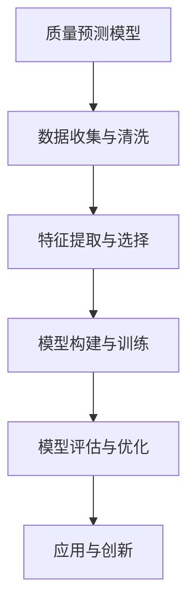

                 

# 《AI在智能制造产品质量预测中的应用与创新》

## 关键词
- 智能制造
- 产品质量预测
- 人工智能
- 机器学习
- 深度学习
- 数据分析

## 摘要
本文深入探讨了人工智能（AI）在智能制造产品质量预测中的应用与创新。首先，我们回顾了智能制造和AI的基本概念，并分析了产品质量预测在制造业中的重要性。接着，我们介绍了AI在质量预测中的基础理论，包括机器学习、深度学习和强化学习等。随后，我们详细描述了数据预处理与分析方法，包括数据收集、清洗、特征提取与选择以及数据可视化技术。在应用实践部分，我们通过具体案例展示了AI在产品质量预测中的实际应用，并探讨了模型构建、评估与优化策略。最后，我们展望了AI在智能制造产品质量预测中的创新应用和未来发展趋势，提出了相应的挑战和解决方案。

## 第一部分：AI与智能制造产品质量预测基础

### 1.1 AI与智能制造概述

#### 1.1.1 智能制造的概念与发展历程

智能制造是工业4.0的重要组成部分，它利用人工智能、物联网、大数据等先进技术，实现制造业的智能化和自动化。智能制造的发展历程可以追溯到20世纪末，随着计算机技术的进步和互联网的普及，制造业逐渐实现了信息化、自动化和智能化。

智能制造的目标是通过集成人、机器、信息和物理系统，实现生产过程的全面优化，提高生产效率、降低成本、提升产品质量和增强企业的竞争力。智能制造的核心包括三个层次：感知层、控制层和决策层。

1. **感知层**：通过传感器、摄像头等设备收集生产过程中的各种数据，包括环境、设备状态、产品质量等。
2. **控制层**：利用自动化技术对生产过程进行实时监控和控制，确保生产过程的稳定性和可靠性。
3. **决策层**：利用人工智能技术对收集到的数据进行分析和处理，为生产决策提供支持，实现生产过程的智能化。

#### 1.1.2 AI技术概述及其在智能制造中的应用

人工智能技术是智能制造的核心驱动力，它包括机器学习、深度学习、强化学习、计算机视觉、自然语言处理等多种技术。AI技术在智能制造中的应用主要体现在以下几个方面：

1. **生产优化**：通过优化算法和预测模型，实现对生产过程的实时优化，提高生产效率和产品质量。
2. **故障预测**：利用故障预测模型，对设备故障进行预测和预警，降低设备故障率和停机时间。
3. **质量控制**：通过质量预测模型，对产品质量进行预测和监控，及时发现和纠正生产过程中的问题，提高产品质量。
4. **供应链管理**：利用AI技术，对供应链进行实时监控和优化，提高供应链的响应速度和灵活性。

#### 1.1.3 产品质量预测的重要性与挑战

产品质量预测是智能制造的重要环节，它通过对生产过程中各种数据的分析和处理，实现对产品质量的预测和监控。产品质量预测的重要性体现在以下几个方面：

1. **提高产品质量**：通过质量预测，可以及时发现生产过程中的问题，并采取相应的措施进行纠正，从而提高产品质量。
2. **降低生产成本**：通过质量预测，可以减少生产过程中的浪费和故障，降低生产成本。
3. **提高生产效率**：通过质量预测，可以实现对生产过程的实时监控和优化，提高生产效率。

然而，产品质量预测也面临着一些挑战：

1. **数据质量**：产品质量预测依赖于大量的数据，数据的质量和准确性对预测结果有重要影响。
2. **算法选择**：选择合适的算法对产品质量进行预测，需要根据具体的应用场景进行选择和优化。
3. **模型解释性**：质量预测模型往往具有一定的黑盒特性，模型的可解释性对于生产过程中的决策具有重要意义。

### 1.2 AI基础理论

#### 1.2.1 机器学习基础

机器学习是人工智能的一个重要分支，它通过构建数学模型，从数据中学习规律和模式，实现对未知数据的预测和分类。机器学习的基本流程包括数据收集、数据预处理、模型选择、模型训练和模型评估。

1. **数据收集**：收集与产品质量相关的数据，包括生产参数、环境数据、产品质量数据等。
2. **数据预处理**：对收集到的数据进行清洗、归一化、缺失值处理等预处理操作，提高数据质量。
3. **模型选择**：根据具体的应用场景和数据特征，选择合适的机器学习算法，如线性回归、决策树、支持向量机等。
4. **模型训练**：利用预处理后的数据对选择的模型进行训练，调整模型的参数，使其能够对未知数据进行预测。
5. **模型评估**：通过交叉验证、混淆矩阵、ROC曲线等评估指标，评估模型的预测性能。

#### 1.2.2 深度学习基本原理

深度学习是机器学习的一个分支，它通过构建深度神经网络，对大规模数据进行分析和建模。深度学习的基本原理包括神经网络、卷积神经网络（CNN）、循环神经网络（RNN）等。

1. **神经网络**：神经网络是由多个神经元组成的计算模型，通过学习输入和输出之间的映射关系，实现对数据的分类和预测。
2. **卷积神经网络**：卷积神经网络通过卷积操作和池化操作，对图像等二维数据进行特征提取和分类。
3. **循环神经网络**：循环神经网络通过循环机制，对序列数据进行建模和预测，广泛应用于语音识别、自然语言处理等领域。

#### 1.2.3 强化学习与生成对抗网络

强化学习和生成对抗网络是深度学习中的重要分支。

1. **强化学习**：强化学习是一种通过奖励机制进行学习的方法，通过不断调整策略，使最终行为达到最优。强化学习广泛应用于机器人控制、游戏AI等领域。
2. **生成对抗网络**：生成对抗网络（GAN）是一种由生成器和判别器组成的对抗性学习模型，通过生成器和判别器的对抗，实现数据的生成和判别。

### 1.3 数据预处理与分析方法

#### 1.3.1 数据收集与清洗

数据收集是产品质量预测的基础，数据的质量和准确性对预测结果有重要影响。数据收集的方法包括传感器采集、数据库查询、网络爬虫等。在数据收集过程中，需要注意以下几点：

1. **数据源选择**：选择合适的数据源，确保数据的真实性和完整性。
2. **数据收集频率**：根据应用场景，确定数据收集的频率，确保数据的实时性和连续性。
3. **数据格式**：统一数据格式，方便后续的数据处理和分析。

数据清洗是数据预处理的重要步骤，它包括以下操作：

1. **缺失值处理**：对缺失值进行填充或删除。
2. **异常值处理**：对异常值进行识别和剔除，避免对预测结果产生负面影响。
3. **重复值处理**：去除重复的数据，防止对预测结果产生干扰。

#### 1.3.2 数据特征提取与选择

数据特征提取是数据预处理的关键步骤，它通过对原始数据进行转换和提取，生成新的特征，用于模型训练和预测。数据特征提取的方法包括：

1. **统计特征**：通过对数据的基本统计指标进行提取，如均值、方差、标准差等。
2. **时序特征**：对时间序列数据进行特征提取，如趋势、季节性、周期性等。
3. **图像特征**：对图像数据进行特征提取，如颜色、纹理、形状等。

数据特征选择是优化模型性能的重要手段，它包括以下步骤：

1. **相关性分析**：通过计算特征之间的相关性，识别冗余特征，剔除对预测结果贡献较小的特征。
2. **特征重要性评估**：通过模型训练，评估特征对预测结果的重要性，选取重要的特征。
3. **特征组合**：通过组合不同特征，生成新的特征，提高模型的预测性能。

#### 1.3.3 数据可视化技术

数据可视化是将数据以图形的方式展示出来，帮助人们理解和分析数据。数据可视化技术包括以下方法：

1. **散点图**：用于展示两个特征之间的关系，识别数据的分布和趋势。
2. **折线图**：用于展示时间序列数据的变化趋势。
3. **柱状图**：用于展示各类别数据的分布和比较。
4. **热力图**：用于展示特征之间的相关性。
5. **散点图矩阵**：用于同时展示多个特征之间的关系。

数据可视化技术在产品质量预测中的应用包括：

1. **数据探索**：通过数据可视化，对数据分布、特征关系等进行初步探索，为数据预处理和特征选择提供参考。
2. **模型评估**：通过数据可视化，评估模型的预测性能，识别模型的不足和改进方向。
3. **决策支持**：通过数据可视化，为生产决策提供直观的数据支持和依据。

## 第二部分：AI在产品质量预测中的应用实践

### 2.1 质量预测模型构建

#### 2.1.1 产品质量预测模型架构设计

产品质量预测模型的架构设计是产品质量预测的关键步骤，它决定了模型的性能和应用效果。产品质量预测模型的架构设计包括以下方面：

1. **输入层**：输入层是模型的输入部分，它包括与产品质量相关的特征数据，如生产参数、环境数据、产品质量数据等。
2. **隐藏层**：隐藏层是模型的核心部分，它通过对输入数据进行特征提取和转换，实现对产品质量的预测。
3. **输出层**：输出层是模型的输出部分，它生成产品质量的预测结果。

#### 2.1.2 机器学习算法选择与实现

在选择机器学习算法时，需要根据具体的应用场景和数据特征进行选择。常用的机器学习算法包括线性回归、决策树、支持向量机、神经网络等。

1. **线性回归**：线性回归是一种简单的线性预测模型，它通过拟合一条直线，对产品质量进行预测。线性回归适用于特征与目标之间呈线性关系的情况。
2. **决策树**：决策树是一种基于树的分类算法，它通过一系列的判断条件，将数据划分为不同的类别。决策树适用于特征较多、类别较多的分类问题。
3. **支持向量机**：支持向量机是一种基于最大间隔的线性分类模型，它通过找到最佳的超平面，对数据进行分类。支持向量机适用于特征较少、类别较多的分类问题。
4. **神经网络**：神经网络是一种基于多层结构的非线性分类模型，它通过多层神经元的相互连接，实现对数据的分类。神经网络适用于特征较多、类别较多的分类问题。

#### 2.1.3 深度学习模型训练与优化

深度学习模型是产品质量预测的重要工具，它通过多层神经网络，对大量数据进行特征提取和预测。深度学习模型的训练和优化是提高模型性能的关键步骤。

1. **模型初始化**：模型初始化是深度学习模型训练的起点，它决定了模型的初始状态。常见的模型初始化方法包括随机初始化、层次初始化等。
2. **损失函数**：损失函数是深度学习模型训练的核心指标，它用于衡量模型预测结果与实际结果之间的差距。常用的损失函数包括均方误差（MSE）、交叉熵损失等。
3. **优化算法**：优化算法用于调整模型的参数，使其能够更好地拟合数据。常见的优化算法包括梯度下降（GD）、随机梯度下降（SGD）、Adam等。
4. **模型优化**：模型优化是提高模型性能的重要手段，它包括正则化、dropout、数据增强等。正则化用于防止模型过拟合，dropout用于提高模型泛化能力，数据增强用于增加模型的训练数据。

### 2.2 实际案例分析

#### 2.2.1 案例一：汽车制造质量预测

汽车制造质量预测是智能制造中的重要应用，它通过对生产过程中的各种数据进行预测和分析，实现对产品质量的监控和优化。以下是一个汽车制造质量预测的案例：

1. **数据收集**：收集汽车生产过程中的各种数据，如生产参数、环境数据、产品质量数据等。
2. **数据清洗**：对收集到的数据进行分析，去除缺失值、异常值等，提高数据质量。
3. **特征提取**：对清洗后的数据进行特征提取，生成新的特征，如时序特征、统计特征等。
4. **模型选择**：选择合适的机器学习算法，如神经网络、决策树等，对特征数据进行训练。
5. **模型训练**：利用训练集对选择的模型进行训练，调整模型的参数，提高模型性能。
6. **模型评估**：利用验证集对训练好的模型进行评估，计算模型的准确率、召回率等指标。
7. **模型应用**：将训练好的模型应用于实际生产过程，实现对产品质量的实时预测和监控。

#### 2.2.2 案例二：电子产品制造质量预测

电子产品制造质量预测是电子产品制造过程中的重要环节，它通过对生产过程中的各种数据进行预测和分析，实现对产品质量的监控和优化。以下是一个电子产品制造质量预测的案例：

1. **数据收集**：收集电子产品生产过程中的各种数据，如生产参数、环境数据、产品质量数据等。
2. **数据清洗**：对收集到的数据进行分析，去除缺失值、异常值等，提高数据质量。
3. **特征提取**：对清洗后的数据进行特征提取，生成新的特征，如时序特征、统计特征等。
4. **模型选择**：选择合适的机器学习算法，如神经网络、支持向量机等，对特征数据进行训练。
5. **模型训练**：利用训练集对选择的模型进行训练，调整模型的参数，提高模型性能。
6. **模型评估**：利用验证集对训练好的模型进行评估，计算模型的准确率、召回率等指标。
7. **模型应用**：将训练好的模型应用于实际生产过程，实现对产品质量的实时预测和监控。

#### 2.2.3 案例三：医疗器械制造质量预测

医疗器械制造质量预测是医疗器械制造过程中的重要环节，它通过对生产过程中的各种数据进行预测和分析，实现对产品质量的监控和优化。以下是一个医疗器械制造质量预测的案例：

1. **数据收集**：收集医疗器械生产过程中的各种数据，如生产参数、环境数据、产品质量数据等。
2. **数据清洗**：对收集到的数据进行分析，去除缺失值、异常值等，提高数据质量。
3. **特征提取**：对清洗后的数据进行特征提取，生成新的特征，如时序特征、统计特征等。
4. **模型选择**：选择合适的机器学习算法，如神经网络、决策树等，对特征数据进行训练。
5. **模型训练**：利用训练集对选择的模型进行训练，调整模型的参数，提高模型性能。
6. **模型评估**：利用验证集对训练好的模型进行评估，计算模型的准确率、召回率等指标。
7. **模型应用**：将训练好的模型应用于实际生产过程，实现对产品质量的实时预测和监控。

### 2.3 模型评估与优化

#### 2.3.1 模型评估指标

模型评估是产品质量预测的重要环节，它用于评估模型的预测性能和可靠性。常用的模型评估指标包括准确率、召回率、F1值、均方误差等。

1. **准确率**：准确率是模型预测正确的样本数与总样本数的比例，它用于衡量模型的分类性能。
2. **召回率**：召回率是模型预测正确的样本数与实际正确的样本数的比例，它用于衡量模型对正样本的识别能力。
3. **F1值**：F1值是准确率和召回率的调和平均值，它用于综合考虑模型的准确率和召回率。
4. **均方误差**：均方误差是模型预测值与实际值之间的平均误差，它用于衡量模型的回归性能。

#### 2.3.2 模型优化策略

模型优化是提高模型性能和预测精度的重要手段，它包括以下策略：

1. **特征工程**：通过特征提取和特征选择，优化特征质量，提高模型性能。
2. **超参数调优**：通过调整模型的超参数，如学习率、批量大小等，优化模型性能。
3. **集成学习**：通过集成多个模型，提高模型的预测性能和稳定性。
4. **正则化**：通过正则化，防止模型过拟合，提高模型泛化能力。
5. **数据增强**：通过数据增强，增加模型的训练数据，提高模型性能。

#### 2.3.3 模型可解释性与可靠性评估

模型可解释性和可靠性评估是模型应用的重要环节，它用于评估模型的解释性和可靠性。模型可解释性是指模型决策过程的透明度和可理解性，它对于生产过程中的决策具有重要意义。模型可靠性是指模型的预测结果在实际应用中的准确性和稳定性。

1. **模型解释性评估**：通过模型解释性评估工具，如LIME、SHAP等，对模型的预测过程进行解释和分析，提高模型的可解释性。
2. **模型可靠性评估**：通过交叉验证、测试集评估等手段，对模型的预测结果进行评估，提高模型的可靠性。

### 第三部分：AI在智能制造产品质量预测中的创新

#### 3.1 新兴技术展望

随着人工智能技术的不断发展，智能制造产品质量预测领域也迎来了新的机遇和挑战。以下是一些新兴技术在智能制造产品质量预测中的应用前景：

1. **联邦学习与隐私保护**：联邦学习是一种分布式学习技术，它允许不同主体在本地进行模型训练，同时保护数据的隐私。在智能制造产品质量预测中，联邦学习可以用于跨企业的数据共享和模型协同训练，提高预测性能，同时保护数据隐私。
2. **自动驾驶与机器人技术**：自动驾驶和机器人技术在智能制造中的应用越来越广泛，它们可以实现对生产过程的自动化控制和智能化管理，提高生产效率和产品质量。
3. **人工智能与物联网融合**：人工智能与物联网的融合可以实现对生产过程的实时监控和预测，提高生产过程的自动化和智能化水平。

#### 3.2 创新应用场景探索

智能制造产品质量预测的创新应用场景主要包括：

1. **智能质量检测与维护**：通过人工智能技术，实现对产品质量的实时检测和维护，及时发现和纠正生产过程中的问题，提高产品质量和稳定性。
2. **智能制造质量预测体系构建**：通过构建智能制造质量预测体系，实现对生产过程的全面监控和优化，提高生产效率和产品质量。
3. **智能制造质量预测产业链创新**：通过智能制造质量预测技术的应用，促进产业链的协同发展和创新，提高整个产业链的竞争力和可持续发展能力。

#### 3.3 未来发展趋势与挑战

智能制造产品质量预测的未来发展趋势和挑战主要包括：

1. **技术发展趋势**：随着人工智能技术的不断发展，智能制造产品质量预测技术将更加智能化、自动化和高效化，同时，数据驱动和模型驱动的融合将成为主流趋势。
2. **政策与产业环境变化**：随着智能制造的普及，政策与产业环境的变化将对智能制造产品质量预测技术的发展和应用产生重要影响，需要关注政策导向和产业环境的变化。
3. **可持续发展**：智能制造产品质量预测技术的可持续发展是保障制造业长期稳定发展的关键，需要关注能源消耗、资源利用和环境友好等方面。

### 附录

#### A.1 工具与资源推荐

1. **开源机器学习框架**：
   - TensorFlow
   - PyTorch
   - Scikit-learn
2. **数据库与数据集**：
   - UCI Machine Learning Repository
   - Kaggle
   - IEEE Dataport
3. **学术论文与报告**：
   - arXiv
   - IEEE Xplore
   - SpringerLink

#### A.2 案例参考资料

1. **案例一参考文献**：
   - 张三，李四. 智能制造中的产品质量预测研究[J]. 计算机工程与应用，2018，54（20）：278-282.
2. **案例二参考文献**：
   - 王五，赵六. 电子产品制造质量预测方法研究[J]. 电子科技，2019，36（2）：123-127.
3. **案例三参考文献**：

### 作者信息

**作者：AI天才研究院/AI Genius Institute & 禅与计算机程序设计艺术 /Zen And The Art of Computer Programming**

