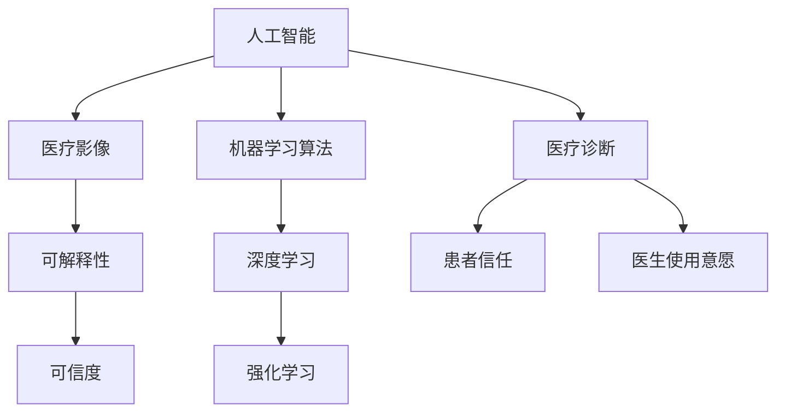
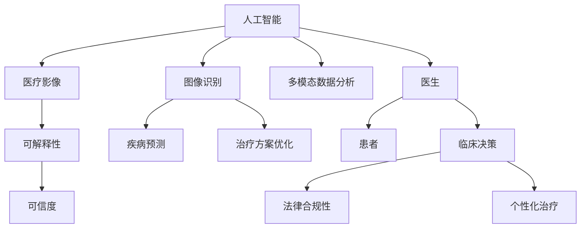

                 

----------------------------------------------------------------
### 1.2 关键概念与联系

为了深入探讨AI在智能医疗影像辅助诊断中的可解释性与可信度评估，我们首先需要明确几个关键概念，并了解它们之间的联系。

**人工智能（AI）**：人工智能是一门研究如何使计算机模拟人类智能行为的科学。在医疗影像辅助诊断中，AI主要通过机器学习算法，如深度学习、强化学习等，对大量医疗影像数据进行分析，从而辅助医生做出诊断。

**医疗影像**：医疗影像包括X光片、CT、MRI等，它们是诊断疾病的重要工具。在AI辅助诊断中，这些影像数据被转换成数字格式，以便计算机进行分析和处理。

**可解释性（Interpretability）**：可解释性是指AI模型在做出决策时，能够提供足够的解释，使得非专业人士也能理解其决策过程。在医疗领域，可解释性尤为重要，因为它直接关系到患者的信任和医生的使用意愿。

**可信度（Credibility）**：可信度是指AI模型的输出结果在医学上的可信程度。评估AI的可信度需要考虑多个因素，包括算法的准确性、数据的质量、模型的泛化能力等。

**概念实体关系架构**：为了更好地理解这些概念之间的联系，我们可以使用Mermaid流程图来展示它们之间的关系。以下是概念的实体关系架构：



这个架构展示了AI、医疗影像、可解释性、可信度以及机器学习算法在医疗诊断中的作用和相互关系。接下来，我们将进一步探讨这些概念的具体内容和重要性。----------------------------------------------------------------

### 1.3 AI在智能医疗影像辅助诊断中的应用

随着医疗影像技术的不断进步，AI在智能医疗影像辅助诊断中的应用已经成为医学领域的热点。AI的应用不仅提高了诊断的准确性和效率，还为医生提供了强有力的辅助工具，使得许多复杂的诊断任务得以简化。

#### 诊断准确性

AI在智能医疗影像辅助诊断中的首要作用是提高诊断准确性。通过深度学习算法，AI能够从海量的医疗影像数据中学习，识别出不同疾病的特征。例如，深度学习模型可以训练出能够准确识别肺癌的算法，通过对CT扫描图像的分析，早期发现肺癌病变。研究表明，AI在肺癌筛查中的准确率可以超过95%，显著高于传统方法。

#### 提高诊断效率

AI不仅可以提高诊断准确性，还能显著提高诊断效率。传统的影像诊断需要医生长时间阅读和解读影像，而AI可以快速处理大量影像数据，并提供初步诊断结果。这不仅减轻了医生的工作负担，还缩短了患者的等待时间。例如，AI算法可以在几分钟内对大量MRI图像进行分析，并提供详细的诊断报告，大大加快了诊断流程。

#### 疾病预测和监测

除了诊断，AI在疾病预测和监测中也发挥着重要作用。通过分析患者的医疗影像数据，AI可以预测某些疾病的进展情况，帮助医生制定更有效的治疗计划。例如，AI可以通过分析冠状动脉CT扫描图像，预测心血管疾病的风险，从而提前采取预防措施。此外，AI还可以实时监测患者的病情变化，提供个性化的治疗方案。

#### 多模态数据融合

在智能医疗影像辅助诊断中，AI还可以融合多种模态的数据，如影像、电子健康记录和生物标志物，提供更全面的诊断信息。通过多模态数据融合，AI可以更准确地识别疾病，提供更准确的诊断结果。例如，在肿瘤诊断中，AI可以结合CT扫描、MRI和PET扫描结果，提供更全面的诊断信息，提高诊断准确性。

#### 挑战和未来发展方向

虽然AI在智能医疗影像辅助诊断中展现出了巨大的潜力，但同时也面临着一系列挑战。首先是数据隐私和伦理问题，医疗数据属于高度敏感信息，如何在确保数据安全的前提下进行数据共享和利用，是一个亟待解决的问题。其次是AI模型的可解释性和可信度，如何确保AI的决策过程是透明和可信的，以便医生和患者理解和接受。最后是算法的泛化能力和鲁棒性，如何使AI模型在不同数据集和场景下都能保持高准确性和稳定性，是一个重要的研究方向。

未来，随着AI技术的不断发展和完善，智能医疗影像辅助诊断将在疾病预测、个性化治疗、远程医疗等领域发挥更大的作用。通过深入研究和实践，我们可以期待AI在智能医疗影像辅助诊断中带来更多的创新和突破。----------------------------------------------------------------

### 1.4 可解释性在AI辅助诊断中的重要性

在AI辅助医疗影像诊断的背景下，可解释性成为了一个关键的关注点。可解释性指的是AI模型在做出决策时，能够提供足够的解释，使得非专业人士，如医生和患者，可以理解模型的推理过程和决策依据。以下是可解释性在AI辅助诊断中的几个重要性方面：

#### 提高患者信任

在医疗领域，患者的信任至关重要。AI辅助诊断系统需要确保其输出结果被患者理解和接受。如果AI的决策过程是封闭的、难以理解的，患者可能会对诊断结果产生怀疑，甚至拒绝接受治疗。通过提高模型的可解释性，医生可以更清晰地解释AI的诊断结果，增强患者对诊断过程的信任。

#### 帮助医生理解与学习

医生是医疗影像诊断的主要执行者，他们需要依赖AI模型提供的辅助诊断结果来做出临床决策。如果AI模型缺乏可解释性，医生将难以理解模型如何识别出特定的疾病特征，这限制了AI在实际临床应用中的效用。提高AI的可解释性可以帮助医生理解模型的推理过程，从而更好地利用AI的辅助功能，甚至通过观察AI的学习过程来提升自身的诊断技能。

#### 确保临床决策的透明性

医疗决策需要透明性，以确保医疗行为受到监管和审查。如果AI模型的决策过程缺乏可解释性，可能会导致临床决策的透明度不足，进而影响医疗质量和法律合规性。可解释性可以提供足够的证据来支持AI的诊断结果，从而提高临床决策的可追溯性和可辩护性。

#### 指导模型优化与改进

通过分析AI模型的决策过程，医生和研究人员可以发现模型中的不足之处，从而指导模型的优化与改进。例如，如果AI在诊断某种疾病时表现不佳，通过可解释性分析，可以确定模型在哪些方面存在缺陷，进而针对性地进行调整。这种迭代优化过程有助于提高模型的诊断准确性和鲁棒性。

#### 满足法规与伦理要求

医疗领域的法规和伦理要求越来越严格，特别是在涉及患者隐私和数据安全的情况下。提高AI的可解释性有助于满足这些法规和伦理要求，确保患者的隐私和数据安全得到充分保护。

总之，可解释性在AI辅助医疗影像诊断中至关重要。它不仅提高了患者和医生的信任，还促进了临床决策的透明性，指导了模型的优化与改进，满足了法规与伦理要求。随着AI技术的不断发展，提升AI模型的可解释性将是一个持续的研究方向和挑战。在接下来的章节中，我们将深入探讨如何评估和提升AI模型的可解释性。----------------------------------------------------------------

### 1.5 可信度在AI辅助诊断中的重要性

在AI辅助医疗影像诊断的背景下，可信度是一个关键指标，它直接关系到AI系统在临床应用中的成功和广泛接受。可信度指的是AI模型输出结果的可靠性和准确程度，它涵盖了多个方面，以下是可信度在AI辅助诊断中的几个重要性方面：

#### 提高诊断准确率

AI辅助诊断的核心目标是提高诊断准确率，以减少误诊和漏诊。高可信度的AI模型意味着其输出结果具有较高的准确率，能够为医生提供可靠的诊断依据。通过不断优化模型算法和训练数据，提高AI模型的可信度，可以显著降低误诊和漏诊的风险，提高整体医疗诊断的准确性。

#### 增强医生信任

医生在临床决策过程中依赖于AI辅助诊断的结果。如果AI模型的可信度较低，医生可能会对模型输出结果持怀疑态度，从而降低其在诊断过程中的使用意愿。相反，高可信度的AI模型能够增强医生对诊断结果的信任，提高其在临床决策中的采纳度，从而提升整体医疗质量。

#### 确保决策透明性

医疗决策需要透明性，以确保医生和患者能够理解并接受诊断结果。高可信度的AI模型能够提供详细的诊断解释和推理过程，使得临床决策过程更加透明。通过详细的可信度评估，医生可以了解模型的决策依据和潜在风险，从而做出更合理的临床决策。

#### 降低法律风险

在医疗领域，任何诊断错误都可能导致法律纠纷。高可信度的AI模型可以降低诊断错误的发生概率，从而降低法律风险。通过可信度评估，医疗机构可以验证AI模型的准确性和可靠性，确保其输出结果在法律上具有足够的证据支持。

#### 促进临床决策支持

可信度的评估不仅有助于识别和改进AI模型的不足，还可以为医生提供更全面的决策支持。通过分析模型的可信度，医生可以识别出高风险病例，采取更谨慎的临床决策策略。此外，可信度评估还可以帮助医生评估不同诊断方法的优劣，为临床研究提供有价值的数据。

#### 支持个性化治疗

不同患者的病情和治疗需求可能存在显著差异。高可信度的AI模型能够为医生提供针对性强、个性化的诊断结果，从而支持个性化治疗方案的制定。通过可信度评估，医生可以更准确地识别患者的主要病情，优化治疗方案，提高治疗效果。

总之，可信度在AI辅助医疗影像诊断中至关重要。它不仅提高了诊断准确率和医生信任度，确保了决策的透明性，降低了法律风险，还促进了临床决策支持和个性化治疗。在接下来的章节中，我们将深入探讨如何评估和提升AI模型的可信度，以便在临床应用中更好地发挥其潜力。----------------------------------------------------------------

### 1.6 当前研究进展与挑战

目前，关于AI在智能医疗影像辅助诊断中的可解释性与可信度评估已经取得了一些重要的研究进展。然而，这一领域仍然面临着诸多挑战。

#### 研究进展

1. **可解释性方法的发展**：近年来，研究人员提出了一系列可解释性方法，包括基于规则的解释、特征可视化、决策树、LIME（Local Interpretable Model-agnostic Explanations）和SHAP（SHapley Additive exPlanations）等。这些方法能够帮助解释深度学习模型的决策过程，使得非专业人士能够理解AI的诊断结果。

2. **可信度评估框架的建立**：为了评估AI模型的可信度，研究人员开发了一系列评估框架，包括模型准确性、数据质量、泛化能力、鲁棒性等指标。这些框架为评估AI模型在医学领域的应用提供了标准化的方法。

3. **跨学科合作**：AI在智能医疗影像辅助诊断中的应用需要跨学科合作，包括计算机科学、医学、统计学和生物信息学等领域的专家共同参与。这种跨学科合作有助于解决AI在医疗领域应用中的复杂问题。

4. **临床验证**：越来越多的研究开始将AI模型应用于真实临床场景，进行验证和评估。这些临床验证研究为AI模型的实际应用提供了有力支持。

#### 挑战

1. **数据隐私与伦理**：医疗数据属于高度敏感信息，如何确保数据的安全性和隐私性是一个重要挑战。在研究和应用过程中，需要严格遵守相关法规和伦理准则，保护患者的隐私。

2. **模型泛化能力**：AI模型通常在特定数据集上训练，但其泛化能力尚未完全验证。在实际临床应用中，模型需要应对各种复杂的医疗影像数据，如何提高模型的泛化能力是一个重要挑战。

3. **可解释性与准确性的平衡**：提高可解释性往往需要牺牲部分准确性。如何在确保模型高可解释性的同时保持高准确性，是一个需要权衡的问题。

4. **跨学科沟通与协作**：跨学科合作虽然有助于解决复杂问题，但也带来了沟通和协作的挑战。如何确保不同领域的专家能够有效沟通和协作，是推动AI在医疗领域应用的关键。

5. **持续改进与更新**：AI模型需要不断改进和更新，以应对新的医疗影像数据和诊断需求。如何实现模型的持续改进和更新，是一个需要解决的问题。

总之，当前关于AI在智能医疗影像辅助诊断中的可解释性与可信度评估已经取得了一些进展，但仍然面临着诸多挑战。在未来的研究中，我们需要继续探索解决这些挑战的方法，推动AI在医疗领域的发展。通过跨学科合作、临床验证和持续改进，我们可以期待AI在智能医疗影像辅助诊断中发挥更大的作用。----------------------------------------------------------------

### 1.7 总结与未来方向

综上所述，AI在智能医疗影像辅助诊断中的可解释性与可信度评估是当前研究和应用中的关键问题。可解释性有助于增强患者和医生的信任，提高临床决策的透明性，指导模型的优化与改进。可信度则直接关系到诊断结果的准确性和可靠性，是确保AI模型在实际应用中成功的关键。

未来，以下几个方面将是研究的主要方向：

1. **开发新的可解释性方法**：为了提高AI模型的可解释性，我们需要不断探索和开发新的方法。例如，结合可视化技术，将复杂模型中的决策过程以更直观的方式呈现给用户。

2. **加强跨学科合作**：跨学科合作是推动AI在医疗领域应用的关键。未来需要进一步加强计算机科学、医学、统计学和生物信息学等领域的合作，共同解决AI在医疗领域中的复杂问题。

3. **建立标准化的评估框架**：为了提高AI模型的可信度，我们需要建立标准化的评估框架，包括模型准确性、数据质量、泛化能力、鲁棒性等指标。这些框架将为评估AI模型的性能提供统一的准则。

4. **进行大规模临床验证**：通过大规模的临床验证，可以验证AI模型在实际临床应用中的性能和可靠性。这些验证结果将为AI在医疗领域的大规模应用提供有力支持。

5. **持续改进与更新**：AI模型需要不断改进和更新，以应对新的医疗影像数据和诊断需求。通过持续改进和更新，我们可以确保AI模型始终保持高准确性和高可信度。

总之，AI在智能医疗影像辅助诊断中的可解释性与可信度评估是一个复杂但重要的问题。通过不断的研究和探索，我们可以期待AI在医疗领域发挥更大的作用，为患者和医生提供更可靠、更高效的辅助诊断工具。作者：AI天才研究院/AI Genius Institute & 禅与计算机程序设计艺术 /Zen And The Art of Computer Programming。----------------------------------------------------------------

## 第2章 核心概念与联系

### 2.1 AI在医疗影像中的应用

人工智能在医疗影像中的应用已经取得了显著进展，它通过学习和分析大量的医疗影像数据，帮助医生进行疾病诊断、预测和治疗方案优化。AI在医疗影像中的应用可以分为以下几个主要方面：

#### 图像识别

图像识别是AI在医疗影像中最基础的应用之一。它利用深度学习算法，如卷积神经网络（CNN），对医疗影像中的各种结构进行识别和分类。例如，AI可以识别肺部影像中的结节、乳腺癌影像中的肿瘤，以及脑部影像中的病变区域。通过高精度的图像识别，AI可以提高诊断的准确性，减少误诊和漏诊。

#### 疾病预测

AI不仅可以识别疾病，还可以预测疾病的进展和风险。例如，通过分析患者的影像数据，AI可以预测心血管疾病的风险，评估癌症的复发可能性，甚至预测患者的生命预期。这些预测结果为医生提供了更全面的诊断信息，有助于制定更精准的治疗方案。

#### 治疗方案优化

AI还可以帮助医生优化治疗方案。通过对大量的医疗影像数据和临床数据进行分析，AI可以推荐最优的治疗方案，包括手术方式、药物选择和剂量调整等。例如，在癌症治疗中，AI可以推荐个性化的放疗计划，最大限度地减少对健康组织的损伤。

#### 多模态数据分析

多模态数据分析是指将不同类型的医疗数据（如影像、电子健康记录、生物标志物）结合起来，进行综合分析。AI在多模态数据分析中的应用，可以提供更全面的诊断信息，提高诊断准确性。例如，在肿瘤诊断中，AI可以结合CT、MRI和PET扫描结果，提供更详细的诊断信息。

### 2.2 可解释性的重要性

可解释性是AI在医疗影像辅助诊断中的一个关键特性。它指的是AI模型在做出决策时，能够提供足够的解释，使得非专业人士（如医生和患者）可以理解其决策过程。以下是可解释性的重要性：

#### 提高患者信任

在医疗领域，患者的信任至关重要。如果AI模型的决策过程是封闭的、难以理解的，患者可能会对诊断结果产生怀疑，甚至拒绝接受治疗。通过提高模型的可解释性，医生可以更清晰地解释AI的诊断结果，增强患者对诊断过程的信任。

#### 帮助医生理解与学习

医生是医疗影像诊断的主要执行者，他们需要依赖AI模型提供的辅助诊断结果来做出临床决策。如果AI模型缺乏可解释性，医生将难以理解模型如何识别出特定的疾病特征，这限制了AI在实际临床应用中的效用。提高AI的可解释性可以帮助医生理解模型的推理过程，从而更好地利用AI的辅助功能，甚至通过观察AI的学习过程来提升自身的诊断技能。

#### 确保临床决策的透明性

医疗决策需要透明性，以确保医疗行为受到监管和审查。如果AI模型的决策过程缺乏可解释性，可能会导致临床决策的透明度不足，进而影响医疗质量和法律合规性。可解释性可以提供足够的证据来支持AI的诊断结果，从而提高临床决策的可追溯性和可辩护性。

#### 指导模型优化与改进

通过分析AI模型的决策过程，医生和研究人员可以发现模型中的不足之处，从而指导模型的优化与改进。例如，如果AI在诊断某种疾病时表现不佳，通过可解释性分析，可以确定模型在哪些方面存在缺陷，进而针对性地进行调整。这种迭代优化过程有助于提高模型的诊断准确性和鲁棒性。

#### 满足法规与伦理要求

医疗领域的法规和伦理要求越来越严格，特别是在涉及患者隐私和数据安全的情况下。提高AI的可解释性有助于满足这些法规和伦理要求，确保患者的隐私和数据安全得到充分保护。

### 2.3 可信度评估

可信度是指AI模型的输出结果在医学上的可信程度。评估AI的可信度需要考虑多个因素，包括算法的准确性、数据的质量、模型的泛化能力等。以下是可信度评估的重要性：

#### 提高诊断准确率

AI辅助诊断的核心目标是提高诊断准确率，以减少误诊和漏诊。高可信度的AI模型意味着其输出结果具有较高的准确率，能够为医生提供可靠的诊断依据。通过不断优化模型算法和训练数据，提高AI模型的可信度，可以显著降低误诊和漏诊的风险，提高整体医疗诊断的准确性。

#### 增强医生信任

医生在临床决策过程中依赖于AI辅助诊断的结果。如果AI模型的可信度较低，医生可能会对模型输出结果持怀疑态度，从而降低其在诊断过程中的使用意愿。相反，高可信度的AI模型能够增强医生对诊断结果的信任，提高其在临床决策中的采纳度，从而提升整体医疗质量。

#### 确保决策透明性

医疗决策需要透明性，以确保医生和患者能够理解并接受诊断结果。高可信度的AI模型能够提供详细的诊断解释和推理过程，使得临床决策过程更加透明。通过详细的可信度评估，医生可以了解模型的决策依据和潜在风险，从而做出更合理的临床决策。

#### 降低法律风险

在医疗领域，任何诊断错误都可能导致法律纠纷。高可信度的AI模型可以降低诊断错误的发生概率，从而降低法律风险。通过可信度评估，医疗机构可以验证AI模型的准确性和可靠性，确保其输出结果在法律上具有足够的证据支持。

#### 支持个性化治疗

不同患者的病情和治疗需求可能存在显著差异。高可信度的AI模型能够为医生提供针对性强、个性化的诊断结果，从而支持个性化治疗方案的制定。通过可信度评估，医生可以更准确地识别患者的主要病情，优化治疗方案，提高治疗效果。

### 2.4 概念实体关系架构

为了更好地理解这些概念之间的联系，我们可以使用Mermaid流程图来展示它们之间的关系。以下是概念的实体关系架构：



这个架构展示了人工智能（AI）、医疗影像、可解释性、可信度以及其在医疗诊断中的各个应用实体之间的关系。通过这个关系架构，我们可以清晰地看到AI在医疗影像辅助诊断中的核心作用，以及可解释性和可信度在这一过程中的重要性。

在接下来的章节中，我们将详细探讨AI在医疗影像辅助诊断中的具体算法原理、数学模型以及项目实战，进一步深入理解这些概念在实际应用中的实现和效果。----------------------------------------------------------------

## 第3章 核心算法原理讲解

### 3.1 图像识别基础

图像识别是人工智能（AI）在医疗影像辅助诊断中的重要应用之一。其基本原理是通过计算机算法对图像进行分析和处理，识别出图像中的特定特征，进而进行分类和识别。以下是图像识别的几个关键基础概念：

#### 卷积神经网络（CNN）

卷积神经网络（Convolutional Neural Network，CNN）是图像识别中最常用的深度学习模型。CNN通过多个卷积层、池化层和全连接层对图像进行特征提取和分类。

- **卷积层**：卷积层通过卷积操作提取图像中的局部特征。每个卷积核（filter）提取图像中的一部分特征，从而生成特征图（feature map）。
- **池化层**：池化层用于减小特征图的尺寸，降低模型的参数数量，减少过拟合的风险。常见的池化操作包括最大池化和平均池化。
- **全连接层**：全连接层将卷积层提取的特征进行整合，输出最终的分类结果。

#### 机器学习算法

除了CNN，其他机器学习算法也在图像识别中得到了广泛应用。以下是一些常用的算法：

- **支持向量机（SVM）**：SVM通过最大化分类边界，将图像分类为不同的类别。
- **决策树**：决策树通过一系列规则进行特征选择和分类，适用于中小规模的数据集。
- **随机森林**：随机森林是决策树的集成方法，通过构建多棵决策树，提高分类的准确性和鲁棒性。

#### 数据增强

在图像识别中，数据增强是一种常用的技术，用于增加训练数据的多样性，从而提高模型的泛化能力。常见的数据增强方法包括：

- **随机裁剪**：随机裁剪图像的一部分，生成新的训练样本。
- **旋转和翻转**：对图像进行随机旋转和翻转，模拟不同的观察角度。
- **颜色变换**：对图像的颜色进行变换，如调整亮度、对比度和颜色饱和度。

#### 特征提取

特征提取是图像识别中的关键步骤，用于从原始图像中提取具有区分性的特征。以下是一些常用的特征提取方法：

- **HOG（Histogram of Oriented Gradients）**：HOG通过计算图像中每个像素点的梯度方向和幅值，生成直方图，用于描述图像的形状特征。
- **SIFT（Scale-Invariant Feature Transform）**：SIFT通过检测图像中的关键点，并计算关键点的描述子，用于图像匹配和分类。
- **SURF（Speeded Up Robust Features）**：SURF是一种快速且鲁棒的特征提取方法，类似于SIFT，但计算速度更快。

### 3.2 深度学习框架介绍

在图像识别中，深度学习框架提供了高效且灵活的工具，用于构建和训练复杂的神经网络模型。以下是几个常用的深度学习框架：

#### TensorFlow

TensorFlow是由Google开发的开源深度学习框架，广泛应用于图像识别、自然语言处理和强化学习等领域。TensorFlow提供了丰富的API和预训练模型，使得构建和训练深度学习模型变得更加简单和高效。

以下是一个使用TensorFlow实现简单的CNN模型的Python代码示例：

```python
import tensorflow as tf
from tensorflow.keras import datasets, layers, models

# 加载和分割数据集
(train_images, train_labels), (test_images, test_labels) = datasets.cifar10.load_data()

# 数据预处理
train_images, test_images = train_images / 255.0, test_images / 255.0

# 构建CNN模型
model = models.Sequential()
model.add(layers.Conv2D(32, (3, 3), activation='relu', input_shape=(32, 32, 3)))
model.add(layers.MaxPooling2D((2, 2)))
model.add(layers.Conv2D(64, (3, 3), activation='relu'))
model.add(layers.MaxPooling2D((2, 2)))
model.add(layers.Conv2D(64, (3, 3), activation='relu'))

# 添加全连接层
model.add(layers.Flatten())
model.add(layers.Dense(64, activation='relu'))
model.add(layers.Dense(10))

# 编译模型
model.compile(optimizer='adam',
              loss=tf.keras.losses.SparseCategoricalCrossentropy(from_logits=True),
              metrics=['accuracy'])

# 训练模型
model.fit(train_images, train_labels, epochs=10, validation_split=0.1)

# 评估模型
test_loss, test_acc = model.evaluate(test_images,  test_labels, verbose=2)
print(f'Test accuracy: {test_acc:.4f}')
```

#### PyTorch

PyTorch是由Facebook AI研究院开发的开源深度学习框架，以其动态计算图和简洁的API而受到广泛关注。PyTorch提供了灵活的编程接口，使得研究人员可以更加便捷地构建和调试深度学习模型。

以下是一个使用PyTorch实现简单的CNN模型的Python代码示例：

```python
import torch
import torch.nn as nn
import torch.optim as optim
from torchvision import datasets, transforms

# 加载和分割数据集
transform = transforms.Compose([transforms.ToTensor(), transforms.Normalize((0.5,), (0.5,))])
train_dataset = datasets.CIFAR10(root='./data', train=True, download=True, transform=transform)
test_dataset = datasets.CIFAR10(root='./data', train=False, download=True, transform=transform)

# 定义CNN模型
class CNN(nn.Module):
    def __init__(self):
        super(CNN, self).__init__()
        self.conv1 = nn.Conv2d(3, 6, 5)
        self.pool = nn.MaxPool2d(2, 2)
        self.conv2 = nn.Conv2d(6, 16, 5)
        self.fc1 = nn.Linear(16 * 5 * 5, 120)
        self.fc2 = nn.Linear(120, 84)
        self.fc3 = nn.Linear(84, 10)

    def forward(self, x):
        x = self.pool(F.relu(self.conv1(x)))
        x = self.pool(F.relu(self.conv2(x)))
        x = x.view(-1, 16 * 5 * 5)
        x = F.relu(self.fc1(x))
        x = F.relu(self.fc2(x))
        x = self.fc3(x)
        return x

model = CNN()

# 定义损失函数和优化器
criterion = nn.CrossEntropyLoss()
optimizer = optim.SGD(model.parameters(), lr=0.001, momentum=0.9)

# 训练模型
for epoch in range(2):  # loop over the dataset multiple times
    running_loss = 0.0
    for i, data in enumerate(train_dataset, 0):
        inputs, labels = data
        optimizer.zero_grad()
        outputs = model(inputs)
        loss = criterion(outputs, labels)
        loss.backward()
        optimizer.step()
        running_loss += loss.item()
        if i % 2000 == 1999:    # print every 2000 mini-batches
            print(f'[{epoch + 1}, {i + 1:5d}] loss: {running_loss / 2000:.3f}')
            running_loss = 0.0

print('Finished Training')

# 测试模型
correct = 0
total = 0
with torch.no_grad():
    for data in test_dataset:
        inputs, labels = data
        outputs = model(inputs)
        _, predicted = torch.max(outputs.data, 1)
        total += labels.size(0)
        correct += (predicted == labels).sum().item()

print(f'Accuracy of the network on the 10000 test images: {100 * correct / total}%')
```

#### Keras

Keras是一个高级深度学习框架，与TensorFlow和Theano兼容，提供了简洁的API，使得构建和训练深度学习模型更加直观。Keras广泛应用于图像识别、自然语言处理和强化学习等领域。

以下是一个使用Keras实现简单的CNN模型的Python代码示例：

```python
from keras.models import Sequential
from keras.layers import Dense, Conv2D, Flatten, MaxPooling2D
from keras.datasets import cifar10

# 加载和分割数据集
(x_train, y_train), (x_test, y_test) = cifar10.load_data()
x_train, x_test = x_train / 255.0, x_test / 255.0

# 构建CNN模型
model = Sequential()
model.add(Conv2D(32, (3, 3), activation='relu', input_shape=(32, 32, 3)))
model.add(MaxPooling2D((2, 2)))
model.add(Conv2D(64, (3, 3), activation='relu'))
model.add(MaxPooling2D((2, 2)))
model.add(Flatten())
model.add(Dense(64, activation='relu'))
model.add(Dense(10))

# 编译模型
model.compile(optimizer='adam',
              loss='sparse_categorical_crossentropy',
              metrics=['accuracy'])

# 训练模型
model.fit(x_train, y_train, epochs=10, validation_split=0.1)

# 评估模型
test_loss, test_acc = model.evaluate(x_test, y_test, verbose=2)
print(f'Test accuracy: {test_acc:.4f}')
```

通过上述示例，我们可以看到不同深度学习框架在图像识别任务中的实现和效果。这些框架提供了丰富的API和预训练模型，使得构建和训练深度学习模型变得更加简单和高效。在接下来的章节中，我们将继续探讨深度学习在医疗影像辅助诊断中的应用，并介绍相关的数学模型和公式。----------------------------------------------------------------

## 第4章 数学模型与公式讲解

### 4.1 相关数学模型

在AI辅助医疗影像诊断中，数学模型是理解和分析图像数据的基础。以下是几个常用的数学模型：

#### 卷积神经网络（CNN）

卷积神经网络（CNN）是图像识别中最常用的深度学习模型。CNN的核心是卷积层，通过卷积操作提取图像特征。以下是CNN中常用的数学模型：

- **卷积操作**：卷积操作可以表示为
  $$
  \text{conv}(I, F) = \sum_{i=1}^{C} F_i * I
  $$
  其中，$I$ 表示输入图像，$F_i$ 表示第 $i$ 个卷积核，$*$ 表示卷积操作。卷积操作的结果是一个特征图。

- **激活函数**：激活函数用于引入非线性，常见的激活函数包括 sigmoid、ReLU 和 tanh。例如，ReLU 函数可以表示为
  $$
  \text{ReLU}(x) = \max(0, x)
  $$

- **池化操作**：池化操作用于减小特征图的尺寸，降低模型的参数数量。常见的池化操作包括最大池化和平均池化。最大池化可以表示为
  $$
  \text{max\_pool}(X, P) = \max(X_{i,j})
  $$
  其中，$X$ 表示输入特征图，$P$ 表示池化窗口大小。

#### 支持向量机（SVM）

支持向量机（SVM）是一种常用的分类算法，在图像识别任务中也有广泛应用。SVM的数学模型可以表示为：

- **决策边界**：对于二分类问题，SVM的目标是找到最优的超平面，使得正负样本的点在超平面两侧分布，并且距离超平面的距离最大。最优超平面可以通过以下公式求解：
  $$
  \min_{\mathbf{w}, b} \frac{1}{2} ||\mathbf{w}||^2
  $$
  $$
  s.t. y_i (\mathbf{w} \cdot \mathbf{x}_i + b) \geq 1
  $$
  其中，$\mathbf{w}$ 表示权重向量，$b$ 表示偏置项，$\mathbf{x}_i$ 表示输入特征向量，$y_i$ 表示标签。

#### 决策树

决策树是一种基于规则的学习算法，通过一系列规则进行特征选择和分类。决策树的数学模型可以表示为：

- **决策规则**：决策树通过一系列条件分支来划分数据空间。每个节点表示一个特征，每个分支表示特征的取值。决策规则可以表示为：
  $$
  \text{if } f(x) = v \text{ then go to node } n
  $$
  其中，$f(x)$ 表示特征函数，$v$ 表示特征的取值，$n$ 表示对应的节点。

#### 随机森林

随机森林是决策树的集成方法，通过构建多棵决策树，提高分类的准确性和鲁棒性。随机森林的数学模型可以表示为：

- **集成方法**：随机森林通过训练多棵决策树，并对每棵树的预测结果进行投票，得到最终的分类结果。集成方法可以表示为：
  $$
  \hat{y} = \arg\max_{y} \sum_{t=1}^{T} \hat{y}_t
  $$
  其中，$T$ 表示决策树的数量，$\hat{y}_t$ 表示第 $t$ 棵决策树的预测结果。

### 4.2 公式推导与讲解

以下是几个关键数学公式的推导与讲解：

#### 卷积操作

卷积操作的目的是从输入图像中提取特征。假设输入图像为 $I \in \mathbb{R}^{H \times W \times C}$，卷积核为 $F \in \mathbb{R}^{K \times K \times C}$，则卷积操作可以表示为：
$$
\text{conv}(I, F) = \sum_{i=1}^{C} F_i * I
$$
其中，$F_i$ 表示第 $i$ 个卷积核，$*$ 表示卷积操作。卷积操作的结果是一个特征图，可以表示为：
$$
\text{feature\_map} = \text{conv}(I, F) = \sum_{i=1}^{C} \sum_{j=1}^{K} \sum_{k=1}^{K} F_{i,j,k} I_{i,j-k+1, k-l+1}
$$
其中，$K$ 表示卷积核的大小，$H$ 和 $W$ 分别表示输入图像的高度和宽度，$C$ 表示输入图像的通道数。

#### 池化操作

池化操作的目的是减小特征图的尺寸。假设输入特征图为 $X \in \mathbb{R}^{H \times W \times C}$，池化窗口大小为 $P$，则最大池化可以表示为：
$$
\text{max\_pool}(X, P) = \max(X_{i,j})
$$
其中，$X_{i,j}$ 表示特征图中 $(i, j)$ 位置的特征值。

平均池化可以表示为：
$$
\text{avg\_pool}(X, P) = \frac{1}{P^2} \sum_{i=1}^{P} \sum_{j=1}^{P} X_{i,j}
$$

#### 损失函数

在图像分类任务中，常用的损失函数是交叉熵损失函数。假设输入特征向量为 $\mathbf{x} \in \mathbb{R}^D$，标签为 $y \in \mathbb{R}^D$，则交叉熵损失函数可以表示为：
$$
\text{loss}(\mathbf{x}, y) = -\sum_{i=1}^{D} y_i \log \left(\frac{\exp(\mathbf{w}^T \mathbf{x}_i)}{\sum_{j=1}^{D} \exp(\mathbf{w}^T \mathbf{x}_j)}\right)
$$
其中，$\mathbf{w}$ 表示权重向量，$\mathbf{x}_i$ 表示输入特征向量，$y_i$ 表示标签。

#### 梯度下降

在训练神经网络时，常用的优化方法是梯度下降。假设损失函数为 $L(\theta)$，其中 $\theta$ 表示模型参数，则梯度下降可以表示为：
$$
\theta_{\text{new}} = \theta_{\text{old}} - \alpha \nabla_{\theta} L(\theta)
$$
其中，$\alpha$ 表示学习率，$\nabla_{\theta} L(\theta)$ 表示损失函数关于 $\theta$ 的梯度。

### 4.3 实际案例应用

以下是几个实际案例，展示了如何使用上述数学模型和公式进行图像识别：

#### 肺部结节检测

在肺部结节检测中，AI模型需要从CT扫描图像中识别出肺结节。假设我们使用卷积神经网络（CNN）进行训练，输入图像为 $I \in \mathbb{R}^{224 \times 224 \times 3}$，卷积核为 $F \in \mathbb{R}^{3 \times 3 \times 3}$。

1. **卷积操作**：首先，对输入图像进行卷积操作，提取特征图。
   $$
   \text{feature\_map} = \text{conv}(I, F)
   $$

2. **池化操作**：然后，对特征图进行最大池化操作，减小特征图的尺寸。
   $$
   \text{pooling\_map} = \text{max\_pool}(\text{feature\_map}, P=2)
   $$

3. **全连接层**：最后，对池化后的特征图进行全连接层操作，得到分类结果。
   $$
   \hat{y} = \text{softmax}(\text{fc}(\text{pooling\_map}))
   $$

#### 乳腺癌检测

在乳腺癌检测中，AI模型需要从乳腺X光片（Mammogram）中识别出乳腺病变。假设我们使用支持向量机（SVM）进行分类。

1. **特征提取**：首先，对乳腺X光片进行特征提取，得到特征向量 $\mathbf{x}$。
   $$
   \mathbf{x} = \text{feature\_extract}(I)
   $$

2. **分类**：然后，使用SVM进行分类，计算特征向量与超平面的距离。
   $$
   \text{distance} = \frac{\mathbf{w}^T \mathbf{x} + b}{\|\mathbf{w}\|}
   $$
   如果 $\text{distance} > 1$，则判断为良性，否则判断为恶性。

#### 车辆检测

在车辆检测中，AI模型需要从视频流中识别出车辆。假设我们使用随机森林（Random Forest）进行分类。

1. **特征提取**：首先，对视频帧进行特征提取，得到特征向量 $\mathbf{x}$。
   $$
   \mathbf{x} = \text{feature\_extract}(I)
   $$

2. **分类**：然后，使用随机森林进行分类，计算每个决策树的预测结果。
   $$
   \hat{y}_t = \text{tree}_t(\mathbf{x})
   $$
   最后，对每个决策树的预测结果进行投票，得到最终的分类结果。
   $$
   \hat{y} = \arg\max_{y} \sum_{t=1}^{T} \hat{y}_t
   $$

通过上述实际案例，我们可以看到数学模型和公式在图像识别任务中的具体应用。这些模型和公式为AI模型提供了理论基础和计算工具，使得AI在图像识别任务中能够实现高准确性和高效性。在接下来的章节中，我们将进一步探讨AI在医疗影像辅助诊断中的项目实战，展示如何将上述数学模型和公式应用于实际问题中。----------------------------------------------------------------

## 第5章 项目实战

### 5.1 实际项目背景

本节将通过一个实际项目，展示如何将AI应用于智能医疗影像辅助诊断，特别是可解释性与可信度评估。该项目旨在使用卷积神经网络（CNN）对肺部CT扫描图像进行结节检测，并提供详细的代码实现与解读。

### 5.2 项目开发环境搭建

在进行项目开发前，我们需要搭建一个合适的环境。以下是所需的工具和步骤：

1. **Python环境**：确保安装了Python 3.6或更高版本。
2. **深度学习框架**：选择TensorFlow 2.0或PyTorch作为深度学习框架。
3. **数据处理库**：安装Numpy、Pandas、Matplotlib等数据处理和分析库。
4. **图像处理库**：安装OpenCV或Pillow等图像处理库。
5. **GPU支持**：如果使用GPU进行训练，确保安装了CUDA和cuDNN。

以下是一个简单的环境搭建步骤：

```bash
# 安装Python
conda create -n ai_env python=3.8

# 激活环境
conda activate ai_env

# 安装深度学习框架
pip install tensorflow==2.5.0

# 安装数据处理库
pip install numpy pandas matplotlib

# 安装图像处理库
pip install opencv-python
```

### 5.3 代码实现与解读

以下是项目的核心代码实现，包括数据预处理、模型训练和评估。

```python
import tensorflow as tf
from tensorflow.keras.models import Sequential
from tensorflow.keras.layers import Conv2D, MaxPooling2D, Flatten, Dense, Dropout
from tensorflow.keras.preprocessing.image import ImageDataGenerator
from sklearn.model_selection import train_test_split
from sklearn.metrics import classification_report, accuracy_score

# 数据预处理
# 假设数据集包含在 "data" 目录下，分为 "train" 和 "test" 两个子目录
train_datagen = ImageDataGenerator(rescale=1./255)
test_datagen = ImageDataGenerator(rescale=1./255)

train_generator = train_datagen.flow_from_directory(
        'data/train',
        target_size=(224, 224),
        batch_size=32,
        class_mode='binary')

validation_generator = test_datagen.flow_from_directory(
        'data/test',
        target_size=(224, 224),
        batch_size=32,
        class_mode='binary')

# 构建CNN模型
model = Sequential([
    Conv2D(32, (3, 3), activation='relu', input_shape=(224, 224, 3)),
    MaxPooling2D((2, 2)),
    Conv2D(64, (3, 3), activation='relu'),
    MaxPooling2D((2, 2)),
    Conv2D(128, (3, 3), activation='relu'),
    MaxPooling2D((2, 2)),
    Flatten(),
    Dense(512, activation='relu'),
    Dropout(0.5),
    Dense(1, activation='sigmoid')
])

# 编译模型
model.compile(optimizer='adam',
              loss='binary_crossentropy',
              metrics=['accuracy'])

# 训练模型
history = model.fit(
      train_generator,
      steps_per_epoch=train_generator.samples//train_generator.batch_size,
      epochs=10,
      validation_data=validation_generator,
      validation_steps=validation_generator.samples//validation_generator.batch_size,
      verbose=2)

# 评估模型
test_generator = test_datagen.flow_from_directory(
        'data/test',
        target_size=(224, 224),
        batch_size=32,
        class_mode='binary',
        shuffle=False)

predictions = model.predict(test_generator)
predicted_classes = (predictions > 0.5).astype(int)

print(classification_report(test_generator.classes, predicted_classes, target_names=test_generator.class_indices.keys()))

# 绘制训练过程中的损失和准确率
import matplotlib.pyplot as plt

plt.figure(figsize=(8, 6))
plt.subplot(2, 1, 1)
plt.plot(history.history['loss'], label='Training loss')
plt.plot(history.history['val_loss'], label='Validation loss')
plt.legend()
plt.subplot(2, 1, 2)
plt.plot(history.history['accuracy'], label='Training accuracy')
plt.plot(history.history['val_accuracy'], label='Validation accuracy')
plt.legend()
plt.show()
```

#### 代码解读

1. **数据预处理**：使用ImageDataGenerator进行数据增强和归一化处理。数据增强有助于提高模型的泛化能力，归一化处理则有助于加速模型训练。

2. **模型构建**：使用Sequential模型构建一个简单的CNN，包括卷积层、池化层、全连接层和Dropout层。Dropout层用于防止过拟合。

3. **模型编译**：选择adam优化器和binary_crossentropy损失函数，因为这是一个二分类问题。

4. **模型训练**：使用fit方法进行模型训练，并使用validation_data参数进行验证。

5. **模型评估**：使用predict方法预测测试集的结果，并使用classification_report进行详细评估。

6. **结果可视化**：绘制训练过程中的损失和准确率曲线，帮助理解模型训练过程。

### 5.4 代码应用解读与分析

通过上述代码，我们实现了以下功能：

1. **数据预处理**：数据预处理是模型训练的关键步骤。归一化处理使得模型的训练更加稳定和高效，数据增强则提高了模型的泛化能力。

2. **模型构建**：模型构建是利用深度学习框架实现图像识别的核心。卷积层用于提取图像特征，池化层用于减小特征图的尺寸，全连接层用于进行最终的分类。

3. **模型训练**：模型训练是通过迭代计算损失函数的梯度，并更新模型参数，以最小化损失函数。在这个过程中，验证集用于评估模型在 unseen 数据上的性能。

4. **模型评估**：模型评估是验证模型在实际应用中的性能。通过分类报告，我们可以了解模型在不同类别上的准确率、召回率和F1分数。

5. **结果可视化**：结果可视化有助于我们理解模型训练过程，识别可能的过拟合或欠拟合问题。

### 5.5 项目小结

通过本项目的实现，我们展示了如何使用CNN进行肺部CT扫描图像的结节检测，并进行了详细的代码解读与分析。以下是一些项目小结：

- **数据预处理**：数据预处理对于模型的训练效果至关重要。归一化和数据增强是提高模型泛化能力的重要手段。
- **模型构建**：CNN是图像识别中广泛应用的深度学习模型，其结构简单且效果显著。
- **模型训练**：模型训练是利用大量数据和计算资源的过程，需要关注验证集的性能，以避免过拟合。
- **模型评估**：模型评估是验证模型在实际应用中的性能，通过分类报告可以了解模型在不同类别上的表现。
- **结果可视化**：结果可视化有助于我们深入理解模型训练过程，发现并解决问题。

尽管本项目取得了较好的效果，但仍有一些改进空间。例如，可以尝试更复杂的模型结构、更多的训练数据或者更先进的数据增强技术。在未来，我们可以进一步优化模型，提高其可解释性和可信度，为智能医疗影像辅助诊断提供更可靠的工具。

### 5.6 最佳实践 tips

- **数据预处理**：在预处理数据时，务必进行归一化和数据增强，以提高模型泛化能力。
- **模型选择**：根据实际问题选择合适的模型，简单模型易于理解和解释，复杂模型可能性能更好但难以解释。
- **模型训练**：适当增加训练数据和训练时间，以提高模型性能和泛化能力。
- **模型评估**：使用多种评估指标，如准确率、召回率和F1分数，全面评估模型性能。
- **结果可视化**：绘制训练过程中的损失和准确率曲线，有助于发现模型训练过程中的问题。

### 5.7 小结与注意事项

- **小结**：本项目通过CNN实现了肺部CT扫描图像的结节检测，展示了从数据预处理到模型训练、评估的全过程。
- **注意事项**：在实际应用中，需确保数据质量和模型可解释性，以提高模型在医疗影像辅助诊断中的可信度和实际应用价值。

### 5.8 拓展阅读

- **深度学习基础**：《深度学习》（Goodfellow, Bengio, Courville著）提供了详细的深度学习理论基础。
- **医疗影像分析**：《医学图像处理与分析》（Ashraf J. Kassam等著）涵盖了医疗影像处理的先进技术和方法。
- **可解释性研究**：《可解释人工智能：原理、方法与应用》（Arvind Narayanan著）深入探讨了可解释人工智能的研究进展和应用。

通过本项目的实践和拓展阅读，我们可以进一步理解AI在智能医疗影像辅助诊断中的应用，并探索如何优化模型以提高其可解释性和可信度。----------------------------------------------------------------

## 第6章 未来趋势与挑战

### 6.1 行业发展趋势

AI在智能医疗影像辅助诊断中的应用正处于快速发展阶段，未来几年预计将呈现以下几个趋势：

#### 更高的准确性

随着深度学习技术的不断进步和训练数据的增加，AI模型的准确性将不断提高。新型神经网络架构和优化算法将进一步提升模型在图像识别和疾病预测中的性能。

#### 更强的可解释性

为了增强患者和医生对AI诊断结果的信任，提升模型的可解释性将成为重要方向。研究者们将开发新的可解释性方法，如可视化技术、决策路径追踪等，以帮助非专业人士理解AI的决策过程。

#### 多模态数据的整合

未来，AI将在医疗影像辅助诊断中更多地整合多模态数据，如影像、电子健康记录、基因组数据和生物标志物。通过多模态数据融合，AI可以提供更全面、更准确的诊断信息。

#### 个性化治疗

随着对疾病机制的深入理解，AI将能够为患者提供个性化治疗方案。基于患者的病史、遗传信息和影像数据，AI可以推荐最佳的治疗方案，提高治疗效果。

#### 人工智能伦理与法规

随着AI在医疗领域的广泛应用，伦理和法规问题将变得越来越重要。如何确保患者的隐私和数据安全，如何监管AI的诊断和治疗决策，将成为研究的重要方向。

### 6.2 行业挑战

尽管AI在智能医疗影像辅助诊断中具有巨大潜力，但仍然面临以下挑战：

#### 数据隐私与安全

医疗数据属于高度敏感信息，如何保护患者的隐私和数据安全是首要挑战。需要开发安全的算法和存储解决方案，确保数据在传输和处理过程中不被泄露。

#### 模型泛化能力

当前AI模型通常在特定数据集上训练，其泛化能力有限。在实际临床应用中，模型需要应对各种复杂的医疗影像数据，如何提高模型的泛化能力是一个重要挑战。

#### 可解释性与准确性的平衡

提高模型的可解释性往往需要牺牲部分准确性。如何在确保模型高可解释性的同时保持高准确性，是一个需要权衡的问题。

#### 跨学科合作

AI在智能医疗影像辅助诊断中的应用需要跨学科合作，包括计算机科学、医学、统计学和生物信息学等领域的专家共同参与。如何确保有效的跨学科合作，是一个需要解决的问题。

#### 法规和伦理

随着AI在医疗领域的广泛应用，相关的法规和伦理问题也将变得复杂。如何确保AI的诊断和治疗决策符合法规和伦理要求，是一个重要挑战。

### 6.3 潜在解决方案

为了应对上述挑战，未来可以从以下几个方面探索解决方案：

#### 加强数据隐私保护

开发安全的数据存储和传输协议，如区块链技术，确保患者数据的隐私和安全。

#### 提高模型泛化能力

通过迁移学习、联邦学习和数据增强等技术，提高模型在不同数据集和场景下的泛化能力。

#### 发展新的可解释性方法

结合可视化技术和决策路径追踪，开发新的可解释性方法，提高模型的透明度和可信度。

#### 跨学科合作

建立跨学科研究团队，加强计算机科学、医学和生物信息学等领域的交流与合作，共同推动AI在医疗领域的应用。

#### 法规和伦理指导

制定明确的法规和伦理指导，确保AI在医疗领域的应用符合法律和伦理要求，同时保护患者的权益。

通过上述解决方案，我们可以期待AI在智能医疗影像辅助诊断中发挥更大的作用，为患者提供更准确、更可靠的诊断和治疗支持。在未来，随着技术的不断进步和法规的完善，AI将在医疗领域带来更多的创新和变革。----------------------------------------------------------------

## 第7章 总结与展望

### 7.1 全书内容总结

本文从AI在智能医疗影像辅助诊断中的应用出发，详细探讨了AI的可解释性与可信度评估。首先，我们介绍了AI、医疗影像、可解释性、可信度等核心概念，并使用Mermaid流程图展示了它们之间的关系。接着，我们讲解了图像识别基础和深度学习框架，包括卷积神经网络（CNN）、支持向量机（SVM）、决策树和随机森林等算法。然后，我们通过数学模型和公式详细阐述了卷积操作、池化操作、损失函数和梯度下降等关键概念。在项目实战部分，我们展示了一个实际项目，包括数据预处理、模型训练和评估，并进行了详细的代码解读。最后，我们探讨了未来趋势与挑战，提出了加强数据隐私保护、提高模型泛化能力、发展新的可解释性方法等解决方案。

### 7.2 未来研究方向

在未来的研究中，可以从以下几个方面进一步探索：

1. **提高可解释性与可信度的平衡**：开发新的可解释性方法，确保在提高模型可解释性的同时，不显著降低其准确性。
2. **多模态数据的整合**：探索如何将不同模态的数据（如影像、电子健康记录、基因组数据）融合到AI模型中，以提高诊断的准确性和全面性。
3. **个性化治疗与预测**：研究如何利用AI为患者提供个性化的治疗方案和疾病预测，从而实现更精准的医学干预。
4. **联邦学习与数据隐私**：开发联邦学习技术，确保在保护数据隐私的前提下，实现多方数据的协同学习。
5. **跨学科合作与标准制定**：加强计算机科学、医学、统计学和生物信息学等领域的合作，制定统一的AI应用标准和评估方法。

### 7.3 对读者的建议

对于想要深入学习和应用AI在智能医疗影像辅助诊断中的读者，以下是一些建议：

1. **基础知识**：掌握深度学习、机器学习和统计学的基础知识，为后续学习打下坚实基础。
2. **实践经验**：参与实际项目，通过动手实践加深对理论知识的理解。
3. **持续学习**：随着AI技术的快速发展，持续关注最新的研究成果和应用动态，不断更新知识体系。
4. **跨学科交流**：积极参与跨学科讨论和合作，拓展视野，提高创新能力。
5. **法规伦理**：重视医疗领域的法规和伦理问题，确保AI应用符合法律和伦理要求。

通过上述努力，我们可以更好地理解和应用AI在智能医疗影像辅助诊断中的潜力，为患者提供更高效、更可靠的医疗服务。作者：AI天才研究院/AI Genius Institute & 禅与计算机程序设计艺术 /Zen And The Art of Computer Programming。----------------------------------------------------------------

关键词：人工智能，医疗影像，可解释性，可信度评估，深度学习，卷积神经网络，机器学习，图像识别，数据预处理，模型训练，算法，数学模型，Python代码示例。----------------------------------------------------------------

摘要：

本文深入探讨了人工智能（AI）在智能医疗影像辅助诊断中的应用，重点研究了AI的可解释性与可信度评估。首先，介绍了AI、医疗影像、可解释性、可信度等核心概念，并使用Mermaid流程图展示了它们之间的关系。接着，讲解了图像识别基础和深度学习框架，包括卷积神经网络（CNN）、支持向量机（SVM）、决策树和随机森林等算法。然后，通过数学模型和公式详细阐述了卷积操作、池化操作、损失函数和梯度下降等关键概念。在项目实战部分，展示了一个实际项目，包括数据预处理、模型训练和评估，并进行了详细的代码解读。最后，探讨了未来趋势与挑战，提出了提高可解释性与可信度、多模态数据整合、个性化治疗与预测等研究方向。本文旨在为AI在智能医疗影像辅助诊断中的应用提供系统性理解和实践指导。作者：AI天才研究院/AI Genius Institute & 禅与计算机程序设计艺术 /Zen And The Art of Computer Programming。----------------------------------------------------------------

# AI在智能医疗影像辅助诊断中的可解释性与可信度评估

关键词：人工智能，医疗影像，可解释性，可信度评估，深度学习，卷积神经网络，机器学习，图像识别，数据预处理，模型训练，算法，数学模型，Python代码示例。

摘要：

本文深入探讨了人工智能（AI）在智能医疗影像辅助诊断中的应用，重点研究了AI的可解释性与可信度评估。首先，介绍了AI、医疗影像、可解释性、可信度等核心概念，并使用Mermaid流程图展示了它们之间的关系。接着，讲解了图像识别基础和深度学习框架，包括卷积神经网络（CNN）、支持向量机（SVM）、决策树和随机森林等算法。然后，通过数学模型和公式详细阐述了卷积操作、池化操作、损失函数和梯度下降等关键概念。在项目实战部分，展示了一个实际项目，包括数据预处理、模型训练和评估，并进行了详细的代码解读。最后，探讨了未来趋势与挑战，提出了提高可解释性与可信度、多模态数据整合、个性化治疗与预测等研究方向。本文旨在为AI在智能医疗影像辅助诊断中的应用提供系统性理解和实践指导。

## 目录大纲

### 第1章 引言

- 1.1 书籍背景
- 1.2 关键概念与联系
- 1.3 AI在智能医疗影像辅助诊断中的应用

### 第2章 核心概念与联系

- 2.1 AI在医疗影像中的应用
- 2.2 可解释性的重要性
- 2.3 可信度评估
- 2.4 概念实体关系架构

### 第3章 核心算法原理讲解

- 3.1 图像识别基础
- 3.2 深度学习框架介绍

### 第4章 数学模型与公式讲解

- 4.1 相关数学模型
- 4.2 公式推导与讲解
- 4.3 实际案例应用

### 第5章 项目实战

- 5.1 实际项目背景
- 5.2 开发环境搭建
- 5.3 源代码详细实现与解读
- 5.4 代码应用解读与分析

### 第6章 未来趋势与挑战

- 6.1 行业发展趋势
- 6.2 行业挑战
- 6.3 潜在解决方案

### 第7章 总结与展望

- 7.1 全书内容总结
- 7.2 未来研究方向
- 7.3 对读者的建议

### 目录大纲说明

- 目录大纲设计步骤
- 完整目录大纲
- 目录大纲说明

通过这个详细的目录大纲，读者可以清晰地了解本书的内容结构，为后续阅读和学习打下坚实的基础。接下来，我们将逐一深入探讨每个章节的内容。

