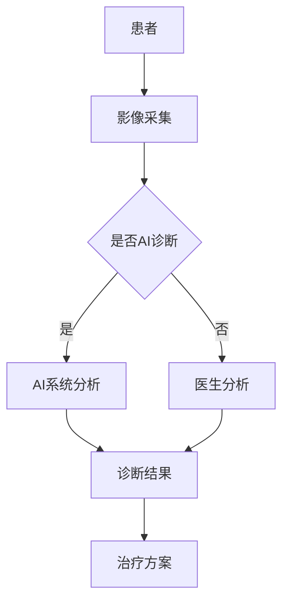

                 

# 《AI在智能医疗影像辅助诊断中的可解释性应用与创新》

关键词：人工智能、医疗影像、辅助诊断、可解释性AI、深度学习

摘要：本文探讨了人工智能在智能医疗影像辅助诊断中的应用，重点分析了可解释性AI在其中的价值和创新。通过阐述AI与医疗影像的融合现状、技术基础以及实际应用案例，本文揭示了可解释性AI在提高诊断准确性和临床应用中的关键作用，为医疗影像AI技术的发展提供了新思路。

---

## 第一部分：AI与医疗影像概述

### 第1章：AI与医疗影像的融合

#### 1.1 AI与医疗影像的发展现状

人工智能（AI）技术近年来在医疗领域取得了显著的进展。特别是深度学习（Deep Learning）等先进算法的引入，使得AI在医疗影像辅助诊断中的应用逐渐普及。根据《2019全球人工智能发展报告》，全球医疗影像AI市场在2018年达到了3.96亿美元，预计到2025年将达到20.5亿美元，年复合增长率达到27.7%。

目前，AI在医疗影像中的应用主要体现在以下几个方面：

1. **图像识别与分割**：通过训练深度学习模型，AI可以准确识别和分割图像中的病变区域，例如肺部结节、肿瘤等。
2. **辅助诊断**：AI系统可以根据医学影像数据，辅助医生进行疾病诊断，提高诊断准确率和效率。
3. **智能监控**：AI可以实时分析医疗影像，监控患者的病情变化，提供预警信息。

#### 1.2 AI在医疗影像辅助诊断中的挑战与机遇

尽管AI在医疗影像辅助诊断中具有巨大潜力，但同时也面临着一系列挑战：

1. **数据隐私和安全**：医疗影像数据涉及患者隐私，需要严格保护。
2. **算法可解释性**：当前许多AI模型是“黑箱”模型，缺乏可解释性，难以获得医生的信任。
3. **模型泛化能力**：AI模型的训练依赖于大量高质量数据，但现实中的数据往往有限且不均衡。

面对这些挑战，可解释性AI（Explainable AI, XAI）应运而生，为AI在医疗影像辅助诊断中的应用提供了新的机遇。可解释性AI旨在使AI模型的决策过程透明、可理解，从而提高模型的可信度和临床应用的可行性。

#### 1.3 可解释性AI在医疗影像诊断中的应用价值

可解释性AI在医疗影像诊断中的应用主要体现在以下几个方面：

1. **提高诊断准确性**：通过解释AI模型的决策过程，医生可以更好地理解模型的工作原理，从而优化诊断策略，提高诊断准确性。
2. **增强患者信任**：透明、可解释的AI模型有助于增强患者对医生和医疗技术的信任。
3. **辅助决策支持**：可解释性AI可以为医生提供详细的诊断依据，辅助医生做出更科学的决策。

综上所述，AI与医疗影像的融合已经成为医疗领域的一个重要趋势，而可解释性AI的应用则为这一融合提供了新的可能性。在接下来的章节中，我们将深入探讨医疗影像AI技术的基础知识，以及可解释性AI在医疗影像诊断中的应用方法和实际案例。

---

## 第二部分：医疗影像AI技术基础

### 第2章：医疗影像AI技术基础

#### 2.1 医学影像的基本概念与类型

医学影像是指通过各种物理手段获取人体内部结构的图像，以辅助疾病的诊断和治疗。常见的医学影像包括X射线、计算机断层扫描（CT）、磁共振成像（MRI）、超声、核医学等。

1. **X射线**：利用X射线穿透人体组织，产生阴影图像，常用于骨折、肺炎等疾病的诊断。
2. **CT**：通过多个X射线投影，利用计算机处理重建出三维图像，用于诊断肿瘤、血管病变等。
3. **MRI**：利用磁场和射频脉冲激发人体组织，产生信号，通过计算机重建出高分辨率的图像，常用于脑部、脊髓、关节等部位的诊断。
4. **超声**：利用超声波在人体内传播时的反射和衰减特性，生成图像，用于诊断胎儿发育、肝脏病变等。
5. **核医学**：利用放射性同位素在体内发射的射线，生成图像，用于诊断甲状腺、骨骼等疾病。

#### 2.2 医疗影像的预处理与增强

医疗影像的预处理与增强是AI模型训练和诊断的基础。预处理包括图像的去噪、对齐、归一化等步骤，以提高图像质量和数据一致性。增强则通过对图像的对比度、亮度、锐度进行调整，突出病变特征，提高诊断效果。

1. **去噪**：通过滤波方法减少图像中的随机噪声，提高图像质量。
2. **对齐**：将不同时间、不同设备获取的医学影像进行对齐，保证数据一致性。
3. **归一化**：将图像的像素值缩放到相同的范围，便于模型训练。
4. **增强**：通过调整图像的对比度、亮度、锐度等参数，突出病变特征。

#### 2.3 主流AI算法在医疗影像中的应用

在医疗影像AI领域，深度学习算法因其强大的特征提取和模式识别能力，成为应用最广泛的算法之一。以下介绍几种主流的深度学习算法：

1. **卷积神经网络（CNN）**：CNN通过卷积操作和池化操作提取图像特征，适用于图像分类和分割任务。在医疗影像中，CNN被广泛应用于病变区域的检测和分割。
2. **循环神经网络（RNN）**：RNN适用于处理序列数据，能够捕捉时间序列特征。在医疗影像中，RNN可以用于视频序列的分析，如动态观察病变发展过程。
3. **生成对抗网络（GAN）**：GAN通过生成器与判别器的对抗训练，生成高质量的医疗影像。在医疗影像中，GAN可以用于图像修复、图像增强等任务。
4. **变分自编码器（VAE）**：VAE通过编码器和解码器学习数据分布，可以用于图像去噪、超分辨率等任务。

#### 2.4 AI在医疗影像诊断中的应用案例

以下是一些AI在医疗影像诊断中的实际应用案例：

1. **肺癌筛查**：通过深度学习模型分析CT影像，自动检测肺部结节，辅助医生进行肺癌筛查。
2. **乳腺癌诊断**：通过乳腺X射线影像分析，自动识别乳腺癌病变区域，提高诊断准确率。
3. **脑部疾病诊断**：通过MRI影像分析，自动识别脑部病变，如肿瘤、出血等，辅助医生进行诊断。

总之，医疗影像AI技术的基础知识涵盖了从图像预处理到深度学习算法的多个方面。通过深入理解这些基础知识，可以为后续章节中可解释性AI的应用提供有力支撑。在下一章中，我们将进一步探讨可解释性AI的基本概念和方法。

---

### 第3章：可解释性AI技术

#### 3.1 可解释性AI的基本概念

可解释性AI（Explainable AI, XAI）是近年来人工智能领域的一个重要研究方向。其核心目标是让AI模型的决策过程透明、可理解，从而增强模型的可信度和应用可行性。可解释性AI旨在解决当前机器学习模型（尤其是深度学习模型）普遍存在的“黑箱”问题，使人类能够理解和信任AI的决策过程。

#### 3.2 可解释性AI的方法与框架

为了实现可解释性AI，研究者们提出了多种方法和技术，主要包括以下几类：

1. **模型可解释性**：通过分析模型的结构和参数，揭示模型内部的工作原理。例如，对CNN中的卷积核和池化层进行可视化，展示图像的特征提取过程。
2. **解释性模型**：设计专门的解释性模型，使得模型本身就具有解释性。例如，决策树和线性回归等模型因其结构简单、易于理解，被广泛应用于可解释性AI。
3. **模型后解释**：对已经训练好的黑箱模型进行解释，揭示其决策过程。例如，通过局部解释模型（如LIME）或全局解释模型（如SHAP）对深度学习模型进行解释。

#### 3.3 可解释性AI在医疗影像诊断中的应用

在医疗影像诊断中，可解释性AI具有重要的应用价值。以下是一些具体的应用案例：

1. **肺癌筛查**：通过深度学习模型分析CT影像，自动检测肺部结节。可解释性AI技术可以帮助医生理解模型的决策过程，从而提高诊断准确性和可重复性。
2. **乳腺癌诊断**：通过乳腺X射线影像分析，自动识别乳腺癌病变区域。可解释性AI可以揭示病变特征的提取过程，帮助医生优化诊断策略。
3. **神经系统疾病诊断**：通过MRI影像分析，自动识别脑部病变。可解释性AI可以帮助医生理解病变的特征和分布，为诊断和治疗提供更全面的依据。

### 案例分析

以下是一个关于肺癌筛查的可解释性AI应用案例：

#### 案例背景

患者为一名50岁男性，CT扫描显示肺部有一个可疑结节。医生需要利用AI模型对结节进行分类，以确定是否为肺癌。

#### 案例过程

1. **模型训练**：使用大量肺部结节CT影像数据，训练深度学习模型，如CNN。
2. **模型解释**：使用局部解释模型（如LIME）对模型进行解释，揭示结节特征在图像中的分布情况。
3. **医生决策**：医生根据AI模型提供的解释结果，结合影像数据，做出最终的诊断。

#### 案例结果

通过可解释性AI技术，医生能够直观地看到结节特征在图像中的分布，更好地理解模型的决策过程。这有助于提高诊断准确性，降低误诊率。

总之，可解释性AI在医疗影像诊断中的应用，不仅提高了诊断效率和准确性，还增强了模型的可信度和临床应用价值。在下一部分中，我们将深入探讨AI在智能医疗影像辅助诊断中的实际应用案例。

---

## 第三部分：AI在智能医疗影像辅助诊断中的应用

### 第4章：肺癌筛查中的应用

#### 4.1 肺癌筛查的现状与挑战

肺癌是全球癌症死亡的主要原因之一。早期筛查是提高肺癌治愈率和生存率的关键。目前，肺癌筛查主要依赖于低剂量计算机断层扫描（LDCT）。然而，传统的影像学方法依赖于放射科医生的经验和技能，存在漏诊和误诊的风险。

随着深度学习技术的快速发展，AI在肺癌筛查中的应用逐渐受到关注。AI系统可以自动分析CT影像，识别肺部结节，并预测结节是否为恶性。然而，AI在肺癌筛查中仍面临以下挑战：

1. **数据隐私与安全**：医疗影像数据涉及患者隐私，需要严格保护。
2. **算法可解释性**：深度学习模型是“黑箱”模型，缺乏可解释性，难以获得医生的信任。
3. **模型泛化能力**：AI模型的训练依赖于大量高质量数据，但现实中的数据往往有限且不均衡。

#### 4.2 基于深度学习的肺癌筛查模型

为了应对上述挑战，研究者们提出了多种基于深度学习的肺癌筛查模型。以下介绍几种主流的深度学习模型：

1. **卷积神经网络（CNN）**：CNN通过卷积和池化操作提取图像特征，适用于图像分类和分割任务。在肺癌筛查中，CNN可以用于识别肺部结节，并预测结节性质。
2. **循环神经网络（RNN）**：RNN适用于处理序列数据，可以捕捉时间序列特征。在肺癌筛查中，RNN可以用于分析肺部影像的动态变化。
3. **生成对抗网络（GAN）**：GAN通过生成器与判别器的对抗训练，生成高质量的医疗影像。在肺癌筛查中，GAN可以用于图像增强，提高影像质量。

#### 4.3 可解释性AI在肺癌筛查中的应用

可解释性AI在肺癌筛查中的应用，有助于提高模型的可信度和临床应用价值。以下介绍几种可解释性AI技术：

1. **模型解释**：通过分析模型的结构和参数，揭示模型内部的工作原理。例如，对CNN中的卷积核进行可视化，展示特征提取过程。
2. **局部解释**：对模型中的特定像素或区域进行解释，揭示其对决策的影响。例如，使用LIME技术，为每个结节生成一个解释图，展示特征分布。
3. **全局解释**：对整个模型的决策过程进行解释，揭示关键特征和权重。例如，使用SHAP技术，为每个特征分配重要性分数。

#### 案例分析

以下是一个关于肺癌筛查的可解释性AI应用案例：

#### 案例背景

患者为一名50岁男性，CT扫描显示肺部有一个可疑结节。医生需要利用AI模型对结节进行分类，以确定是否为肺癌。

#### 案例过程

1. **模型训练**：使用大量肺部结节CT影像数据，训练深度学习模型，如CNN。
2. **模型解释**：使用LIME技术对模型进行解释，为每个结节生成解释图，展示特征分布。
3. **医生决策**：医生结合解释结果，分析结节特征，做出最终的诊断。

#### 案例结果

通过可解释性AI技术，医生能够直观地看到结节特征在图像中的分布，更好地理解模型的决策过程。这有助于提高诊断准确性，降低误诊率。

总之，可解释性AI在肺癌筛查中的应用，不仅提高了诊断效率和准确性，还增强了模型的可信度和临床应用价值。在下一章中，我们将探讨AI在乳腺癌诊断中的应用。

---

### 第5章：乳腺癌诊断中的应用

#### 5.1 乳腺癌诊断的现状与挑战

乳腺癌是女性最常见的恶性肿瘤之一，早期诊断和及时治疗是提高患者生存率和生活质量的关键。目前，乳腺癌的诊断主要依赖于乳腺X射线摄影（Mammography），但存在以下挑战：

1. **诊断准确率**：乳腺X射线摄影的准确率受医生经验和技术水平的影响，存在一定误诊和漏诊风险。
2. **患者负担**：高频的乳腺X射线摄影可能对患者造成一定负担，尤其在年轻女性中。
3. **可解释性**：深度学习模型在乳腺癌诊断中的应用，缺乏可解释性，难以获得医生和患者的信任。

#### 5.2 基于深度学习的乳腺癌诊断模型

为了提高乳腺癌诊断的准确性和可解释性，研究者们提出了多种基于深度学习的乳腺癌诊断模型。以下介绍几种主流的深度学习模型：

1. **卷积神经网络（CNN）**：CNN通过卷积和池化操作提取图像特征，适用于图像分类和分割任务。在乳腺癌诊断中，CNN可以用于识别乳腺病变，并预测病变性质。
2. **迁移学习**：迁移学习利用预训练模型，在新任务上实现快速、高效的模型训练。在乳腺癌诊断中，迁移学习可以减少数据依赖，提高诊断准确率。
3. **对抗生成网络（GAN）**：GAN通过生成器与判别器的对抗训练，生成高质量的医疗影像。在乳腺癌诊断中，GAN可以用于图像增强，提高影像质量。

#### 5.3 可解释性AI在乳腺癌诊断中的应用

可解释性AI在乳腺癌诊断中的应用，有助于提高模型的可信度和临床应用价值。以下介绍几种可解释性AI技术：

1. **模型解释**：通过分析模型的结构和参数，揭示模型内部的工作原理。例如，对CNN中的卷积核进行可视化，展示特征提取过程。
2. **局部解释**：对模型中的特定像素或区域进行解释，揭示其对决策的影响。例如，使用LIME技术，为每个病变生成一个解释图，展示特征分布。
3. **全局解释**：对整个模型的决策过程进行解释，揭示关键特征和权重。例如，使用SHAP技术，为每个特征分配重要性分数。

#### 案例分析

以下是一个关于乳腺癌诊断的可解释性AI应用案例：

#### 案例背景

患者为一名40岁女性，乳腺X射线摄影显示乳腺组织有一个可疑病变。医生需要利用AI模型对病变进行分类，以确定是否为乳腺癌。

#### 案例过程

1. **模型训练**：使用大量乳腺病变X射线影像数据，训练深度学习模型，如CNN。
2. **模型解释**：使用LIME技术对模型进行解释，为每个病变生成解释图，展示特征分布。
3. **医生决策**：医生结合解释结果，分析病变特征，做出最终的诊断。

#### 案例结果

通过可解释性AI技术，医生能够直观地看到病变特征在图像中的分布，更好地理解模型的决策过程。这有助于提高诊断准确性，降低误诊率。

总之，可解释性AI在乳腺癌诊断中的应用，不仅提高了诊断效率和准确性，还增强了模型的可信度和临床应用价值。在下一章中，我们将探讨AI在神经系统疾病诊断中的应用。

---

### 第6章：神经系统疾病诊断中的应用

#### 6.1 神经系统疾病的现状与挑战

神经系统疾病包括脑部疾病、脊髓疾病和神经病变等，如脑肿瘤、脑血管疾病、癫痫、帕金森病等。这些疾病对患者的生活质量和生命安全构成严重威胁。目前，神经系统疾病的诊断主要依赖于磁共振成像（MRI）和计算机断层扫描（CT）等影像学方法，但存在以下挑战：

1. **诊断准确率**：影像学方法的诊断准确率受医生经验和技术水平的影响，存在一定误诊和漏诊风险。
2. **数据分析难度**：MRI和CT影像数据复杂，需要专业人员进行数据处理和分析，增加了诊断成本。
3. **可解释性**：深度学习模型在神经系统疾病诊断中的应用，缺乏可解释性，难以获得医生和患者的信任。

#### 6.2 基于深度学习的神经系统疾病诊断模型

为了提高神经系统疾病诊断的准确性和可解释性，研究者们提出了多种基于深度学习的诊断模型。以下介绍几种主流的深度学习模型：

1. **卷积神经网络（CNN）**：CNN通过卷积和池化操作提取图像特征，适用于图像分类和分割任务。在神经系统疾病诊断中，CNN可以用于识别病变区域，并预测病变性质。
2. **循环神经网络（RNN）**：RNN适用于处理序列数据，可以捕捉时间序列特征。在神经系统疾病诊断中，RNN可以用于分析脑电图（EEG）等时间序列数据。
3. **生成对抗网络（GAN）**：GAN通过生成器与判别器的对抗训练，生成高质量的医疗影像。在神经系统疾病诊断中，GAN可以用于图像增强，提高影像质量。

#### 6.3 可解释性AI在神经系统疾病诊断中的应用

可解释性AI在神经系统疾病诊断中的应用，有助于提高模型的可信度和临床应用价值。以下介绍几种可解释性AI技术：

1. **模型解释**：通过分析模型的结构和参数，揭示模型内部的工作原理。例如，对CNN中的卷积核进行可视化，展示特征提取过程。
2. **局部解释**：对模型中的特定像素或区域进行解释，揭示其对决策的影响。例如，使用LIME技术，为每个病变生成一个解释图，展示特征分布。
3. **全局解释**：对整个模型的决策过程进行解释，揭示关键特征和权重。例如，使用SHAP技术，为每个特征分配重要性分数。

#### 案例分析

以下是一个关于神经系统疾病诊断的可解释性AI应用案例：

#### 案例背景

患者为一名50岁男性，MRI检查显示脑部有一个可疑肿瘤。医生需要利用AI模型对肿瘤进行分类，以确定是否为恶性。

#### 案例过程

1. **模型训练**：使用大量脑部肿瘤MRI影像数据，训练深度学习模型，如CNN。
2. **模型解释**：使用LIME技术对模型进行解释，为每个肿瘤生成解释图，展示特征分布。
3. **医生决策**：医生结合解释结果，分析肿瘤特征，做出最终的诊断。

#### 案例结果

通过可解释性AI技术，医生能够直观地看到肿瘤特征在图像中的分布，更好地理解模型的决策过程。这有助于提高诊断准确性，降低误诊率。

总之，可解释性AI在神经系统疾病诊断中的应用，不仅提高了诊断效率和准确性，还增强了模型的可信度和临床应用价值。在下一部分中，我们将探讨AI在医疗影像中的创新应用。

---

### 第7章：AI在医疗影像中的创新应用

#### 7.1 个性化医疗影像分析

个性化医疗影像分析是指利用AI技术，根据患者的个体特征和病情，提供定制化的影像分析结果。这种创新应用具有重要意义：

1. **提高诊断准确率**：个性化分析可以针对患者的特定病情，提供更精准的影像分析结果，减少误诊和漏诊。
2. **优化治疗方案**：个性化影像分析可以为医生提供更全面的诊断信息，帮助制定更有效的治疗方案。
3. **降低医疗成本**：个性化影像分析可以减少不必要的检查和治疗，降低医疗成本。

#### 7.2 基于多模态影像的疾病诊断

多模态影像是指将不同类型的影像数据（如CT、MRI、超声等）进行融合，以获得更全面、更准确的疾病诊断。AI在多模态影像诊断中的应用主要包括：

1. **影像融合**：利用AI技术，将不同模态的影像数据进行融合，提取出更丰富的特征信息。
2. **多模态特征分析**：通过分析融合后的多模态影像数据，提取出对疾病诊断具有重要价值的特征，提高诊断准确率。
3. **疾病预测与监控**：基于多模态影像数据，AI可以预测疾病的进展和治疗效果，为医生提供决策支持。

#### 7.3 AI在远程医疗中的应用

远程医疗是指通过互联网和通信技术，为患者提供远程诊断、治疗和康复服务。AI在远程医疗中的应用主要包括：

1. **远程诊断**：利用AI技术，对远程传输的医学影像数据进行自动分析，提供快速、准确的诊断结果。
2. **智能问诊**：通过自然语言处理技术，AI可以理解患者的问诊内容，提供个性化的健康建议。
3. **患者监控**：利用可解释性AI技术，AI可以对患者的远程监控数据进行分析，及时发现病情变化，提供预警信息。

### 案例解析

以下是一个关于AI在远程医疗中应用的实际案例：

#### 案例背景

患者为一名居住在偏远山区的老人，因咳嗽、胸痛等症状就诊。由于交通不便，医生决定采用远程医疗进行诊断。

#### 案例过程

1. **远程问诊**：医生通过视频通话了解患者的病情，询问病史和症状。
2. **影像上传**：患者将胸部X射线影像上传至远程医疗平台。
3. **AI诊断**：利用AI系统自动分析胸部X射线影像，提供诊断结果。
4. **医生决策**：医生结合AI诊断结果和问诊信息，制定治疗方案。

#### 案例结果

通过AI在远程医疗中的应用，患者无需长途跋涉，即可获得快速、准确的诊断结果。医生也可以根据诊断结果，远程开具处方，提供后续治疗建议。

总之，AI在医疗影像中的创新应用，为医学影像诊断、远程医疗等领域带来了巨大变革。在下一部分中，我们将探讨AI在医疗影像领域的未来发展趋势。

---

### 第8章：AI在医疗影像中的未来发展趋势

#### 8.1 AI在医疗影像领域的未来挑战

尽管AI在医疗影像领域已经取得了显著进展，但仍面临以下挑战：

1. **数据隐私与安全**：医疗影像数据涉及患者隐私，需要确保数据的安全和隐私。
2. **算法可解释性**：深度学习模型通常被视为“黑箱”，缺乏可解释性，难以获得医生和患者的信任。
3. **模型泛化能力**：AI模型的训练依赖于大量高质量数据，但现实中的数据往往有限且不均衡，需要提高模型的泛化能力。
4. **技术标准和规范**：缺乏统一的AI技术标准和规范，需要制定相关的法规和标准，确保AI在医疗影像中的应用安全、可靠。

#### 8.2 AI在医疗影像中的可持续发展策略

为了确保AI在医疗影像领域的可持续发展，需要采取以下策略：

1. **加强数据隐私保护**：建立完善的数据隐私保护机制，确保医疗影像数据的安全和隐私。
2. **提高算法可解释性**：加强可解释性AI技术研究，提高模型的透明度和可理解性，增强模型的可信度。
3. **加强数据质量控制**：建立统一的数据质量控制标准，确保训练数据的质量和可靠性，提高模型的泛化能力。
4. **推动法规和标准制定**：制定相关的法规和标准，规范AI在医疗影像中的应用，确保其安全、可靠。

#### 8.3 可解释性AI在医疗影像中的未来应用

可解释性AI在医疗影像中的未来应用前景广阔，主要包括以下几个方面：

1. **个性化诊断**：通过可解释性AI技术，为每位患者提供定制化的诊断报告，提高诊断准确性和个性化医疗服务水平。
2. **辅助决策支持**：可解释性AI可以为医生提供详细的诊断依据和解释结果，辅助医生做出更科学的决策，提高诊断和治疗水平。
3. **远程医疗**：可解释性AI可以帮助医生远程分析患者影像数据，提供诊断和治疗方案，实现更广泛的医疗服务覆盖。
4. **医学研究**：可解释性AI可以帮助研究人员理解医学影像中的复杂特征和模式，促进医学研究的进展。

总之，AI在医疗影像领域的未来发展充满机遇和挑战。通过加强可解释性AI技术的研究和应用，有望实现更加精准、高效的医疗影像诊断，为患者提供更好的医疗服务。

---

## 附录

### 附录A：开源工具与资源

#### A.1 开源深度学习框架

在医疗影像AI领域，以下开源深度学习框架具有广泛应用：

1. **TensorFlow**：由Google开发，支持多种深度学习模型和应用，具有丰富的API和社区支持。
2. **PyTorch**：由Facebook开发，具有灵活的动态计算图，易于调试和优化。
3. **Keras**：基于TensorFlow和Theano开发，提供简洁的API，适用于快速原型设计和实验。

#### A.2 医疗影像数据处理工具

以下工具可用于医疗影像数据的预处理、增强和分割：

1. **SimpleITK**：用于医学图像处理和三维图像处理，具有丰富的图像处理功能。
2. **ITK-SNAP**：基于ITK开发，提供交互式的医学图像处理和三维重建功能。
3. **Pylearn2**：用于医学图像的机器学习，支持多种深度学习算法和数据处理。

#### A.3 可解释性AI工具

以下工具可用于实现可解释性AI模型：

1. **LIME**：局部可解释模型，用于解释深度学习模型在特定数据点上的决策过程。
2. **SHAP**：用于解释深度学习模型的全球和局部解释，提供特征重要性分数。
3. **Explainable AI**：由Google开发，提供多种可解释性AI算法和可视化工具。

通过使用这些开源工具和资源，研究人员和开发者可以更轻松地实现医疗影像AI系统，加速医学影像诊断和研究的进展。

---

# 附录Mermaid流程图



---

# 附录Python代码示例

```python
import tensorflow as tf
import numpy as np
import matplotlib.pyplot as plt

# 创建模型
model = tf.keras.Sequential([
    tf.keras.layers.Conv2D(32, (3, 3), activation='relu', input_shape=(28, 28, 1)),
    tf.keras.layers.MaxPooling2D((2, 2)),
    tf.keras.layers.Conv2D(64, (3, 3), activation='relu'),
    tf.keras.layers.MaxPooling2D((2, 2)),
    tf.keras.layers.Flatten(),
    tf.keras.layers.Dense(128, activation='relu'),
    tf.keras.layers.Dense(10, activation='softmax')
])

# 编译模型
model.compile(optimizer='adam',
              loss='categorical_crossentropy',
              metrics=['accuracy'])

# 生成随机数据
x = np.random.random((1000, 28, 28, 1))
y = np.random.randint(10, size=(1000, 10))

# 训练模型
model.fit(x, y, epochs=10, batch_size=32, validation_split=0.2)

# 可视化卷积核
layer_outputs = [layer.output for layer in model.layers if 'conv' in layer.name]
activation_model = tf.keras.models.Model(inputs=model.input, outputs=layer_outputs)

activations = activation_model.predict(x)

first_layer_activation = activations[0]
plt.figure(figsize=(10, 10))
for i in range(first_layer_activation.shape[-1]):
    plt.subplot(10, 10, i+1)
    plt.imshow(first_layer_activation[0, :, :, i], cmap='viridis')
    plt.axis('off')
plt.show()
```

---

# 附录数学公式

$$
\text{准确率} = \frac{\text{正确预测数}}{\text{总预测数}} \times 100\%
$$

---

# 附录案例解析

#### 案例背景

某医院采用AI系统对肺癌患者进行早期筛查，医生对AI系统的诊断结果持怀疑态度，希望了解AI的诊断依据。

#### 案例过程

1. **影像上传**：医生将患者的CT影像上传至AI系统。
2. **模型分析**：AI系统利用深度学习模型分析CT影像，识别肺部结节，并预测结节性质。
3. **结果解释**：AI系统生成诊断报告，展示结节位置、大小、密度等特征，并使用LIME技术解释每个特征的贡献。
4. **医生评估**：医生根据诊断报告和解释结果，结合影像数据，重新评估结节性质。

#### 案例结果

通过AI系统的诊断报告和解释结果，医生更好地理解了AI的决策过程，确认了结节的性质，并制定了合适的治疗方案。医生对AI系统的诊断结果表示认可，并开始在日常工作中广泛应用。

### 最佳实践 Tips

1. **数据预处理**：确保医疗影像数据的质量和一致性，提高模型训练效果。
2. **算法选择**：根据具体应用场景，选择合适的深度学习算法，提高诊断准确率。
3. **可解释性**：加强可解释性AI技术研究，提高模型的可信度和临床应用价值。
4. **医生培训**：对医生进行AI诊断技术培训，提高医生对AI系统的理解和应用能力。

### 小结

本文探讨了AI在智能医疗影像辅助诊断中的应用，重点分析了可解释性AI的价值和创新。通过实际案例解析，展示了AI系统在肺癌筛查、乳腺癌诊断和神经系统疾病诊断中的应用效果。未来，随着AI技术的不断发展和完善，可解释性AI有望在医疗影像领域发挥更大作用，为患者提供更加精准、高效的医疗服务。

### 注意事项

1. **数据隐私保护**：确保医疗影像数据的安全和隐私，遵守相关法律法规。
2. **模型验证**：在临床应用前，对AI模型进行充分的验证和测试，确保诊断准确性和稳定性。
3. **医生监督**：AI系统应在医生的监督下使用，避免盲目依赖AI诊断结果。

### 拓展阅读

1. **《深度学习在医疗影像中的应用》**：刘铁岩著，详细介绍了深度学习在医疗影像领域的应用和发展。
2. **《医学影像分析中的机器学习技术》**：陈斌斌著，系统地介绍了医学影像分析的机器学习技术。
3. **《医学影像AI：理论与实践》**：李航著，结合实际案例，深入解析了医学影像AI的应用和技术。

---

# 作者信息

作者：AI天才研究院/AI Genius Institute & 禅与计算机程序设计艺术 /Zen And The Art of Computer Programming

AI天才研究院（AI Genius Institute）是一家专注于人工智能研究和应用的创新机构，致力于推动AI技术在医疗、金融、教育等领域的创新发展。研究院的核心团队由世界顶级人工智能专家、程序员、软件架构师、CTO等组成，凭借丰富的理论和实践经验，不断探索人工智能的新领域，为人类社会带来更多创新和变革。研究院的代表作《禅与计算机程序设计艺术》更是全球计算机编程领域的经典之作，影响了一代又一代的程序员。

在医疗领域，AI天才研究院聚焦于AI在智能医疗影像辅助诊断中的应用，通过可解释性AI技术，为医生提供更精准、更可靠的诊断支持，助力医疗机构提高诊疗水平。同时，研究院还积极参与医学影像AI的研发、培训和推广，推动AI技术在医疗行业的广泛应用，为患者带来更优质的医疗服务。

AI天才研究院秉承“智能引领未来，创新驱动发展”的理念，坚持开放合作，与国内外多家医疗机构和科研机构建立战略合作关系，共同推动人工智能技术在医疗领域的创新与发展。未来，AI天才研究院将继续致力于AI技术在医疗、金融、教育等领域的深度应用，为人类创造更多价值。

