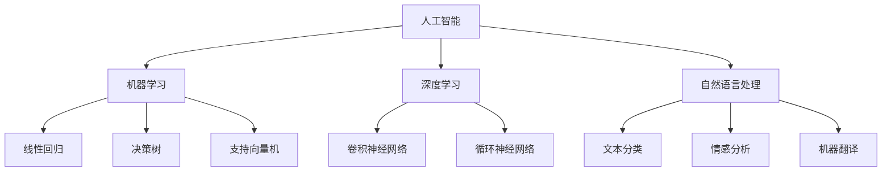
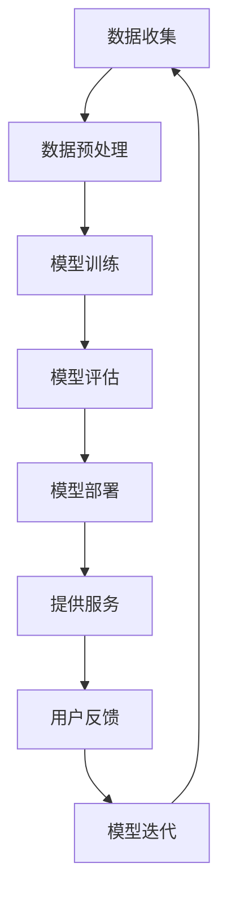
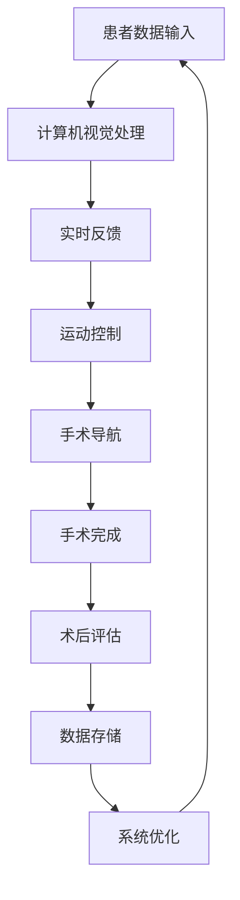

                 

### 概述篇

#### 第1章 AI与智能医疗设备概述

随着人工智能（AI）技术的迅速发展，其在各个行业的应用逐渐普及，尤其在医疗领域展现出了巨大的潜力。智能医疗设备，作为AI技术应用的重要载体，正引领医疗行业进入一个全新的时代。本章将围绕AI和智能医疗设备的概述，深入探讨其核心概念、发展趋势以及AI在医疗领域的重要性。

首先，我们需要了解AI的核心概念。人工智能是一种模拟人类智能的技术，通过机器学习、深度学习、自然语言处理等技术手段，使计算机具备自我学习和决策能力。AI的目标是使机器能够执行复杂的任务，如数据分析、图像识别、语音识别等。

智能医疗设备则是指利用AI技术进行数据分析和处理，从而实现自动化诊断、个性化治疗、远程监控等功能的医疗设备。这些设备不仅提高了医疗服务的效率，还显著提升了医疗质量和患者体验。

接下来，我们将探讨智能医疗设备的发展趋势。近年来，随着AI技术的不断突破，智能医疗设备在医疗领域中的应用越来越广泛。从智能影像诊断、智能药物设计到智能手术机器人，AI技术正在改变传统医疗模式，实现医疗服务的智能化和精准化。

此外，AI在医疗领域的重要性不可忽视。一方面，AI技术可以提高医疗诊断的准确性和效率，减少人为错误，提高治疗效果。另一方面，AI技术可以实现对大规模医疗数据的分析和处理，为医疗研究提供有力支持，推动医疗科学的进步。

本章将首先介绍AI的核心概念，包括机器学习、深度学习等，然后探讨智能医疗设备的发展趋势，以及AI在医疗领域的重要性。通过这一章的阅读，读者将全面了解AI和智能医疗设备的基本概念和发展现状，为后续章节的学习打下坚实基础。

#### 1.1 AI核心概念

人工智能（AI）的核心概念主要涉及机器学习（ML）、深度学习（DL）和自然语言处理（NLP）等技术。这些技术共同构成了AI的核心框架，使计算机能够模拟人类的智能行为。

**机器学习（Machine Learning）**是一种通过算法从数据中学习规律，并自动改进自身性能的技术。机器学习的核心是构建模型，并通过大量数据对模型进行训练，使其能够进行预测和决策。常见的机器学习算法包括线性回归、决策树、支持向量机（SVM）等。

**深度学习（Deep Learning）**是机器学习的一种特殊形式，它模仿人脑神经网络的结构和功能，通过多层神经元的堆叠，实现对复杂数据的处理和分析。深度学习在图像识别、语音识别和自然语言处理等领域表现出色。其中，卷积神经网络（CNN）和循环神经网络（RNN）是深度学习中的两大主要架构。

**自然语言处理（Natural Language Processing, NLP）**是人工智能的一个子领域，旨在使计算机能够理解和处理人类语言。NLP技术包括文本分类、情感分析、机器翻译等，其在智能客服、智能语音助手等领域有广泛应用。

为了更好地理解这些核心概念，我们可以通过一个简单的Mermaid流程图来展示它们之间的关系：



通过这个流程图，我们可以清晰地看到AI的核心概念及其子领域之间的关系。机器学习作为AI的基础，包括多种算法；深度学习在机器学习的基础上，通过多层神经网络的构建，实现了对复杂数据的处理；自然语言处理则专注于理解和处理人类语言，为AI在智能客服等领域的应用提供了重要支持。

在实际应用中，这些技术常常结合使用，共同推动AI技术的发展。例如，在智能医疗设备中，深度学习可以用于图像识别，自然语言处理可以用于患者病历的分析，从而实现全方位的医疗服务智能化。

#### 1.2 智能医疗设备的发展

智能医疗设备的发展可以追溯到20世纪末期，随着计算机技术、传感器技术和通信技术的进步，医疗设备逐渐向智能化、自动化和远程化方向发展。特别是近年来，人工智能技术的突破，为智能医疗设备的发展注入了新的活力，使其成为现代医疗体系的重要组成部分。

**第一阶段：自动化医疗设备**

在早期，智能医疗设备的发展主要集中在自动化方面。例如，自动化输液泵、自动化心电图机等设备的应用，大大提高了医疗操作的效率和精确性。这些设备通过预设的程序和算法，实现了对患者病情的实时监测和调节，减少了人为操作的误差。

**第二阶段：数据驱动医疗设备**

随着大数据和云计算技术的发展，智能医疗设备逐渐转向数据驱动模式。通过集成传感器和数据采集模块，这些设备可以实时收集患者的生理指标数据，并将其传输到云端进行分析和处理。这一阶段的代表性设备包括智能体温计、智能血压计等，它们不仅能够实时监测患者的健康状态，还能通过数据分析提供个性化的健康建议。

**第三阶段：人工智能医疗设备**

当前，智能医疗设备的发展已经进入人工智能时代。人工智能技术的引入，使得医疗设备具备了自我学习和自我优化的能力。例如，智能影像诊断系统通过深度学习算法，可以自动识别和分析医学影像，提供准确的诊断结果；智能手术机器人则通过高精度的操作和实时反馈，实现了微创手术的自动化和智能化。

**发展趋势**

1. **个性化治疗**

智能医疗设备的发展，使得个性化治疗成为可能。通过分析患者的基因数据、生活习惯和疾病历史，智能医疗设备可以为每位患者提供量身定制的治疗方案，从而提高治疗效果。

2. **远程医疗**

人工智能技术的应用，使得远程医疗成为现实。通过智能医疗设备，医生可以远程监控患者病情，进行诊断和治疗方案制定，为偏远地区的患者提供优质的医疗服务。

3. **智能化诊断**

智能影像诊断系统和智能病理诊断系统等，通过深度学习算法，实现了对医学影像的自动化分析，提高了诊断的准确性和速度。

4. **实时监控**

智能医疗设备能够实时监测患者的生理指标，通过数据分析和预警系统，及时发现问题，为医生提供准确的诊断依据。

总之，智能医疗设备的发展经历了从自动化到数据驱动，再到人工智能的过程。随着技术的不断进步，智能医疗设备将越来越普及，成为现代医疗服务体系中不可或缺的一部分。

#### 1.3 AI在医疗领域的重要性

人工智能（AI）在医疗领域的重要性日益凸显，其不仅改变了传统医疗模式，还极大地提升了医疗服务的质量和效率。以下是AI在医疗领域几个关键方面的具体贡献：

**诊断准确性提升**

AI技术，尤其是深度学习和计算机视觉，在医学影像诊断中的应用显著提高了诊断的准确性。传统的影像诊断依赖于医生的经验和技能，容易受到主观因素的影响。而通过AI算法，可以自动识别和分析医学影像，如X光片、CT扫描和MRI图像，实现对病灶的精准定位和分类。例如，AI在肺癌筛查中能够比人类医生更早发现微小病灶，提高早期诊断的准确性。

**治疗决策优化**

AI能够通过对海量医疗数据的分析和挖掘，为医生提供更科学的决策支持。例如，在肿瘤治疗中，AI可以通过分析患者的基因数据、影像数据和病理数据，为医生推荐最优的治疗方案。这不仅提高了治疗效果，还减少了不必要的治疗和副作用。

**个性化医疗服务**

AI技术可以根据每位患者的个体差异，提供个性化的医疗服务。通过分析患者的健康数据、生活习惯和遗传背景，AI可以为患者制定个性化的预防措施和治疗方案。例如，智能健康管理系统可以根据患者的健康状况和健康目标，提供个性化的饮食建议、运动计划和药物使用建议。

**疾病预测和预防**

AI技术在疾病预测和预防方面也发挥了重要作用。通过分析患者的病史、家族病史和生活方式数据，AI可以预测患者患某种疾病的概率，并提前采取措施进行预防。例如，AI可以在心脏病发作前预测风险，提醒患者采取预防措施，减少心脏病发作的风险。

**效率提升和成本降低**

AI技术能够自动化许多医疗流程，提高工作效率，降低成本。例如，智能语音助手可以自动化处理患者预约、咨询和病历管理等工作，减轻医护人员的工作负担。同时，AI技术还可以优化药物研发流程，缩短新药上市时间，降低研发成本。

总之，AI在医疗领域的重要性不可忽视。它不仅提升了诊断的准确性、优化了治疗决策、提供了个性化医疗服务，还有效提升了医疗效率，降低了医疗成本。随着AI技术的不断进步，其在医疗领域的应用将更加广泛，为医疗行业带来深远的变革。

#### 概述篇总结

通过本章的概述，我们了解了AI在智能医疗设备中的核心概念、发展历程以及其在医疗领域的重要性。AI技术，包括机器学习、深度学习和自然语言处理，通过提高诊断准确性、优化治疗决策、提供个性化医疗服务以及提升效率和降低成本，正在深刻改变医疗行业的方方面面。智能医疗设备的发展，不仅使医疗服务更加精准和高效，也为患者提供了更加便捷和优质的体验。随着技术的不断进步，AI在医疗领域的应用前景将更加广阔，为健康管理和疾病治疗带来更多创新和变革。下一章，我们将深入探讨AI的核心技术与智能医疗设备的结合，分析其具体应用。

## 理论基础篇

### 第2章 AI核心技术与智能医疗设备

#### 2.1 机器学习基础

机器学习（Machine Learning, ML）是人工智能（AI）的核心组成部分，其目标是使计算机系统能够从数据中自动学习和改进性能，而无需明确编程指令。在智能医疗设备中，机器学习技术被广泛应用于数据分析和预测，如疾病诊断、药物设计、个性化治疗等。

**机器学习的核心概念**

- **监督学习（Supervised Learning）**：监督学习是一种常见的机器学习任务，其中算法使用标记的数据集来训练模型。标记数据通常包含输入特征和相应的输出标签，通过学习这些数据，模型能够预测新数据的输出。常见的监督学习算法包括线性回归、逻辑回归、支持向量机（SVM）和决策树等。

- **无监督学习（Unsupervised Learning）**：无监督学习不需要标记数据，其目标是从未标记的数据中发现隐藏的模式或结构。常见的无监督学习算法包括聚类（如K-means聚类）、降维（如主成分分析PCA）和关联规则学习（如Apriori算法）等。

- **强化学习（Reinforcement Learning）**：强化学习是一种通过试错过程来学习如何在特定环境中采取行动的机器学习范式。智能体（agent）通过接收环境反馈（奖励或惩罚），不断优化其策略以实现目标。强化学习在智能医疗设备中具有潜在应用，如自动手术机器人。

**机器学习在智能医疗设备中的应用**

- **疾病诊断**：机器学习算法可以通过分析医疗影像数据，如X光片、CT扫描和MRI图像，帮助医生识别疾病。例如，深度学习模型如卷积神经网络（CNN）被用于肺癌、乳腺癌等癌症的早期诊断。

- **药物设计**：机器学习在药物设计中的应用正在变得越来越重要。通过分析大量的分子结构和生物活性数据，机器学习算法可以帮助科学家快速筛选出有潜力的药物候选分子，从而加速新药的发现。

- **个性化治疗**：机器学习可以分析患者的基因数据、临床数据和生活方式数据，为每位患者提供个性化的治疗建议。例如，通过分析患者的基因组数据，机器学习算法可以预测患者对某种药物的反应，从而优化治疗方案。

**案例研究：基于机器学习的疾病诊断**

假设我们开发一个基于机器学习的疾病诊断系统，用于辅助医生诊断肺炎。以下是该系统的实现步骤：

1. **数据收集与预处理**：收集大量包含患者影像数据和诊断结果的医学数据，对数据进行清洗、归一化和特征提取。

2. **模型选择**：选择合适的机器学习算法，如卷积神经网络（CNN），用于训练模型。

3. **模型训练**：使用预处理后的数据集，对模型进行训练，使模型能够学习识别肺炎和其他疾病的特征。

4. **模型评估**：使用验证集对训练好的模型进行评估，确保模型具有较高的准确性和鲁棒性。

5. **模型部署**：将训练好的模型部署到实际应用中，医生可以通过输入患者的影像数据，获取模型的诊断结果。

以下是一个简单的Python代码示例，展示如何使用卷积神经网络（CNN）进行图像分类：

```python
import tensorflow as tf
from tensorflow.keras.models import Sequential
from tensorflow.keras.layers import Conv2D, MaxPooling2D, Flatten, Dense

# 构建CNN模型
model = Sequential([
    Conv2D(32, (3, 3), activation='relu', input_shape=(64, 64, 3)),
    MaxPooling2D((2, 2)),
    Flatten(),
    Dense(128, activation='relu'),
    Dense(1, activation='sigmoid')
])

# 编译模型
model.compile(optimizer='adam', loss='binary_crossentropy', metrics=['accuracy'])

# 训练模型
model.fit(x_train, y_train, epochs=10, batch_size=32, validation_data=(x_val, y_val))
```

在这个示例中，我们使用TensorFlow库构建了一个简单的CNN模型，用于分类二分类问题（如肺炎或非肺炎）。通过训练和验证数据集，模型能够学习如何从输入的影像数据中预测疾病类别。

**小结**

机器学习技术为智能医疗设备的发展提供了强大的支持，通过提高诊断准确性、优化治疗决策和提供个性化医疗服务，显著提升了医疗服务的质量和效率。随着机器学习算法的不断改进和计算能力的提升，其在医疗领域的应用将更加广泛和深入，为患者带来更多的福祉。

#### 2.2 深度学习原理

深度学习（Deep Learning, DL）是机器学习的一个子领域，通过模拟人脑神经网络的结构和功能，实现对复杂数据的处理和分析。深度学习在图像识别、语音识别和自然语言处理等领域取得了显著的突破，已成为人工智能研究的重要方向。在本节中，我们将深入探讨深度学习的基本原理、常用模型以及其在智能医疗设备中的应用。

**深度学习的基本原理**

深度学习的基本原理是基于人工神经网络（Artificial Neural Networks,ANNs）的结构和功能。人工神经网络是由大量简单处理单元（称为神经元）通过复杂的网络结构连接而成的。每个神经元接收多个输入信号，通过加权求和后，经过激活函数转化为输出信号。

**神经元模型**

一个基本的神经元模型可以表示为：

\[ z = \sum_{i} w_i x_i + b \]
\[ a = \sigma(z) \]

其中，\( x_i \) 表示输入信号，\( w_i \) 是权重，\( b \) 是偏置，\( \sigma \) 是激活函数，通常采用sigmoid函数、ReLU函数等。

**深度神经网络**

深度神经网络（Deep Neural Networks,DNNs）是通过增加网络层数来构建的，其目的是通过逐层提取数据特征，从而提高模型的表达能力。深度神经网络通常包括输入层、多个隐藏层和输出层。

**反向传播算法**

反向传播算法（Backpropagation Algorithm）是深度学习训练的核心算法，用于计算网络权重和偏置的梯度。反向传播算法通过将输出误差反向传播到每一层，逐步更新权重和偏置，使网络逐渐逼近最优解。

**深度学习常用模型**

1. **卷积神经网络（Convolutional Neural Networks, CNN）**

卷积神经网络是处理图像数据的常用模型，其通过卷积层、池化层和全连接层等多层结构，实现对图像特征的学习和提取。CNN在医学影像分析、面部识别和自动驾驶等领域有广泛应用。

2. **循环神经网络（Recurrent Neural Networks, RNN）**

循环神经网络是一种处理序列数据的模型，其通过在时间步之间建立循环连接，实现对序列数据的长期依赖性建模。RNN在语音识别、机器翻译和时间序列预测等领域有广泛应用。

3. **长短时记忆网络（Long Short-Term Memory, LSTM）**

长短时记忆网络是RNN的一种变体，通过引入门控机制，解决了传统RNN在处理长序列数据时的梯度消失和梯度爆炸问题。LSTM在自然语言处理和股票市场预测等领域有广泛应用。

4. **生成对抗网络（Generative Adversarial Networks, GAN）**

生成对抗网络是一种由生成器和判别器对抗训练的模型，其目标是生成与真实数据相似的新数据。GAN在图像生成、语音合成和图像超分辨率等领域有广泛应用。

**深度学习在智能医疗设备中的应用**

深度学习在智能医疗设备中的应用非常广泛，以下是一些典型的应用场景：

1. **医学影像分析**

深度学习模型可以用于医学影像的分析和诊断，如肺癌检测、乳腺癌筛查和脑部病变识别。通过训练深度学习模型，可以实现对医学影像的高效分类和识别，提高诊断的准确性和效率。

2. **智能诊断系统**

深度学习技术可以构建智能诊断系统，辅助医生进行疾病诊断和治疗决策。例如，通过分析患者的病史、实验室数据和医学影像，深度学习模型可以为医生提供个性化的诊断建议和治疗方案。

3. **个性化治疗**

深度学习可以分析患者的基因组数据、生活方式数据和临床数据，为患者提供个性化的治疗建议。例如，通过分析患者的基因数据，可以预测患者对某种药物的反应，从而优化治疗方案。

4. **智能药物设计**

深度学习可以用于药物分子的设计，通过分析大量药物分子的结构和活性数据，深度学习模型可以预测新分子的活性，帮助科学家筛选出有潜力的药物候选分子。

**案例研究：基于深度学习的肺癌检测系统**

假设我们开发一个基于深度学习的肺癌检测系统，该系统通过分析CT扫描图像，自动识别肺结节并评估其恶性风险。以下是该系统的实现步骤：

1. **数据收集与预处理**：收集大量的CT扫描图像和相应的病理结果数据，对数据进行清洗、归一化和数据增强。

2. **模型选择**：选择合适的深度学习模型，如卷积神经网络（CNN），用于训练模型。

3. **模型训练**：使用预处理后的数据集，对模型进行训练，使模型能够学习识别肺结节和评估恶性风险。

4. **模型评估**：使用验证集对训练好的模型进行评估，确保模型具有较高的准确性和鲁棒性。

5. **模型部署**：将训练好的模型部署到实际应用中，医生可以通过输入患者的CT扫描图像，获取模型的诊断结果。

以下是一个简单的Python代码示例，展示如何使用TensorFlow构建一个简单的CNN模型进行图像分类：

```python
import tensorflow as tf
from tensorflow.keras.models import Sequential
from tensorflow.keras.layers import Conv2D, MaxPooling2D, Flatten, Dense

# 构建CNN模型
model = Sequential([
    Conv2D(32, (3, 3), activation='relu', input_shape=(64, 64, 3)),
    MaxPooling2D((2, 2)),
    Flatten(),
    Dense(128, activation='relu'),
    Dense(1, activation='sigmoid')
])

# 编译模型
model.compile(optimizer='adam', loss='binary_crossentropy', metrics=['accuracy'])

# 训练模型
model.fit(x_train, y_train, epochs=10, batch_size=32, validation_data=(x_val, y_val))
```

在这个示例中，我们使用TensorFlow库构建了一个简单的CNN模型，用于分类二分类问题（如肺结节或非肺结节）。通过训练和验证数据集，模型能够学习如何从输入的CT扫描图像中预测肺结节的类别。

**小结**

深度学习技术为智能医疗设备的发展提供了强大的支持，通过提高诊断准确性、优化治疗决策和提供个性化医疗服务，显著提升了医疗服务的质量和效率。随着深度学习算法的不断改进和计算能力的提升，其在医疗领域的应用将更加广泛和深入，为患者带来更多的福祉。

#### 2.3 自然语言处理（NLP）

自然语言处理（Natural Language Processing, NLP）是人工智能（AI）的重要分支，旨在使计算机能够理解、解释和生成人类语言。NLP技术在智能医疗设备中有着广泛的应用，如电子病历管理、智能问答系统和医学文本挖掘等，极大提升了医疗服务的效率和准确性。

**NLP的核心概念**

- **分词（Tokenization）**：分词是将文本拆分为单词或短语的过程。常见的分词方法有基于词典的分词和基于统计的分词。

- **词性标注（Part-of-Speech Tagging）**：词性标注是对文本中的每个词进行词性分类，如名词、动词、形容词等。

- **句法分析（Parsing）**：句法分析是对句子结构进行分析，识别句子中的语法关系，如主语、谓语、宾语等。

- **命名实体识别（Named Entity Recognition, NER）**：命名实体识别是识别文本中的特定实体，如人名、地名、机构名等。

- **情感分析（Sentiment Analysis）**：情感分析是判断文本的情感倾向，如正面、负面或中性。

**NLP在智能医疗设备中的应用**

1. **电子病历管理**

电子病历（Electronic Health Records, EHRs）是医疗数据的重要组成部分。NLP技术可以自动提取和整理病历中的关键信息，如诊断结果、药物使用和治疗方案。例如，通过命名实体识别，NLP可以识别病历中的疾病名称、药物名称等，并将其存储在数据库中，便于后续分析和查询。

2. **智能问答系统**

智能问答系统可以帮助医生和患者快速获取所需信息。通过自然语言理解（Natural Language Understanding, NLU）技术，智能问答系统可以理解用户的自然语言查询，并返回相关的医疗信息。例如，医生可以询问系统“糖尿病的治疗方法有哪些？”，系统会根据预存的医疗知识库，提供详细的回答。

3. **医学文本挖掘**

医学文本挖掘是从大量的医学文献中提取有价值的信息，以支持医学研究和临床决策。NLP技术可以用于提取医学研究中的关键词、提取临床指南和诊断标准等。例如，通过文本分类和情感分析，NLP可以帮助研究人员识别最新的研究热点和趋势，或评估不同治疗方案的效果。

**NLP在智能医疗设备中的实现**

以下是一个简单的Python代码示例，展示如何使用NLP库（如spaCy）进行电子病历文本分析：

```python
import spacy

# 加载spaCy模型
nlp = spacy.load("en_core_web_sm")

# 电子病历文本
text = "The patient was diagnosed with diabetes and prescribed insulin."

# 使用NLP处理文本
doc = nlp(text)

# 命名实体识别
ents = [ent.text for ent in doc.ents]

# 词性标注
pos_tags = [(token.text, token.tag_) for token in doc]

print("命名实体识别结果：", ents)
print("词性标注结果：", pos_tags)
```

在这个示例中，我们使用spaCy库加载了一个预训练的英文NLP模型，并对一段电子病历文本进行了命名实体识别和词性标注。通过这些NLP技术，我们可以提取文本中的关键信息，如疾病名称、药物名称等。

**小结**

自然语言处理技术在智能医疗设备中扮演着关键角色，通过自动化处理医学文本，提高了医疗数据的效率和准确性。随着NLP技术的不断进步，其在医疗领域的应用将更加广泛，为医疗研究和临床实践带来更多创新和便利。

### 理论基础篇总结

在理论基础篇中，我们详细介绍了AI的核心技术，包括机器学习、深度学习和自然语言处理。这些技术不仅为智能医疗设备的发展提供了理论支持，还在实际应用中展现了强大的潜力。机器学习通过数据驱动的方式，提升了疾病诊断和个性化治疗的准确性；深度学习通过模拟人脑神经网络，实现了对复杂数据的精准分析和处理；自然语言处理则通过自动化处理医学文本，提高了医疗数据的效率和可理解性。随着这些技术的不断进步，AI在智能医疗设备中的应用将更加广泛和深入，为医疗行业带来更多创新和变革。下一章，我们将通过具体案例，深入探讨AI在智能医疗设备中的实际应用。

## 应用技术篇

### 第3章 AI在智能医疗设备中的应用技术

#### 3.1 图像识别

图像识别是人工智能在医疗领域的重要应用之一，通过计算机对图像进行自动识别和分析，辅助医生进行诊断和治疗。在医学影像领域，图像识别技术可以用于疾病检测、肿瘤识别、骨折诊断等，极大地提高了诊断的准确性和效率。

**技术原理**

图像识别技术主要基于深度学习中的卷积神经网络（CNN）。CNN通过多层卷积和池化操作，从原始图像中提取特征，并通过全连接层进行分类。CNN能够自动学习图像中的高级特征，如边缘、纹理和形状，从而实现对复杂图像内容的识别。

**工作流程**

1. **图像预处理**：对原始图像进行预处理，包括大小调整、灰度化、去噪等，以便于模型训练和识别。

2. **特征提取**：通过卷积层和池化层提取图像特征，这些特征包含了图像的纹理、形状和空间关系等信息。

3. **模型训练**：使用大量的标注数据集对CNN模型进行训练，模型通过学习这些特征，建立图像与标签之间的映射关系。

4. **图像识别**：在训练好的模型上，输入新的图像，模型会输出图像的类别标签，如肿瘤、骨折等。

**应用实例**

**肺癌检测**：通过深度学习模型分析CT扫描图像，自动识别肺结节。例如，Google的DeepMind团队开发的AI系统可以比人类医生更早、更准确地检测出肺癌的早期迹象。

**乳腺癌诊断**：利用深度学习模型分析乳腺X光片（Mammogram），辅助医生诊断乳腺癌。例如，IBM的Watson for Oncology系统通过图像识别技术，为医生提供诊断建议和治疗方案。

以下是一个简单的Python代码示例，展示如何使用TensorFlow构建一个简单的CNN模型进行图像分类：

```python
import tensorflow as tf
from tensorflow.keras.models import Sequential
from tensorflow.keras.layers import Conv2D, MaxPooling2D, Flatten, Dense

# 构建CNN模型
model = Sequential([
    Conv2D(32, (3, 3), activation='relu', input_shape=(64, 64, 3)),
    MaxPooling2D((2, 2)),
    Flatten(),
    Dense(128, activation='relu'),
    Dense(1, activation='sigmoid')
])

# 编译模型
model.compile(optimizer='adam', loss='binary_crossentropy', metrics=['accuracy'])

# 训练模型
model.fit(x_train, y_train, epochs=10, batch_size=32, validation_data=(x_val, y_val))
```

在这个示例中，我们使用TensorFlow库构建了一个简单的CNN模型，用于分类二分类问题（如肺结节或非肺结节）。通过训练和验证数据集，模型能够学习如何从输入的CT扫描图像中预测肺结节的类别。

**小结**

图像识别技术在智能医疗设备中有着广泛的应用，通过深度学习模型，能够自动识别和分析医学影像，提高诊断的准确性和效率。随着技术的不断进步，图像识别技术将在医疗领域发挥更大的作用，为医生和患者提供更精准的医疗服务。

#### 3.2 语音识别

语音识别（Speech Recognition）是人工智能技术中的一个重要分支，旨在使计算机能够理解和识别人类语音。在智能医疗设备中，语音识别技术可以用于语音输入的病历记录、智能咨询和语音命令控制等应用，大大提高了医疗服务的便捷性和效率。

**技术原理**

语音识别技术通常包括以下几个关键步骤：

1. **语音信号处理**：对采集到的语音信号进行预处理，包括去除噪声、调整音量、滤波等，以提高语音信号的清晰度和质量。

2. **特征提取**：通过对预处理后的语音信号进行特征提取，如梅尔频率倒谱系数（MFCC）、谱图等，以便于模型处理和识别。

3. **声学模型**：声学模型是对语音信号特征进行建模，通常采用隐马尔可夫模型（HMM）或深度神经网络（DNN）。

4. **语言模型**：语言模型是对语音中的语言结构进行建模，通常采用N元语言模型或深度神经网络。

5. **解码器**：解码器是用于将声学模型的输出转化为文字的算法，如动态时间规整（DTW）或基于深度神经网络的解码器。

**工作流程**

1. **语音输入**：用户通过麦克风输入语音，语音信号被转化为数字信号。

2. **特征提取**：对输入的语音信号进行特征提取，生成声学特征向量。

3. **声学模型匹配**：声学模型对提取的声学特征向量进行匹配，计算出最佳匹配路径。

4. **语言模型调整**：语言模型对最佳匹配路径进行调整，生成最终的识别结果。

5. **输出结果**：将识别结果输出为文本，如病历记录、医生咨询回答等。

**应用实例**

1. **语音病历记录**：医生可以通过语音输入病历记录，提高工作效率，减少书写负担。例如，医生可以使用语音输入患者的症状、诊断和治疗建议，系统会自动将其转换为文本并存储在病历系统中。

2. **智能咨询系统**：智能咨询系统通过语音识别技术，可以实时响应用户的语音咨询，提供医疗建议和健康信息。例如，患者可以通过语音询问系统“我最近总是失眠，该怎么办？”，系统会根据预存的医学知识库，提供相应的建议和解决方案。

3. **语音命令控制**：语音识别技术可以用于智能医疗设备的语音命令控制，如智能药箱、智能轮椅等。用户可以通过语音命令控制这些设备，提高设备的使用便捷性和安全性。

以下是一个简单的Python代码示例，展示如何使用PyTorch构建一个简单的语音识别模型：

```python
import torch
import torch.nn as nn
import torch.optim as optim

# 构建简单的语音识别模型
class SpeechRecognitionModel(nn.Module):
    def __init__(self):
        super(SpeechRecognitionModel, self).__init__()
        self.conv1 = nn.Conv2d(1, 32, kernel_size=3, stride=1)
        self.fc1 = nn.Linear(32 * 30 * 10, 128)
        self.fc2 = nn.Linear(128, 28)

    def forward(self, x):
        x = self.conv1(x)
        x = torch.relu(x)
        x = nn.functional.max_pool2d(x, 2)
        x = x.view(x.size(0), -1)
        x = self.fc1(x)
        x = torch.relu(x)
        x = self.fc2(x)
        return x

# 实例化模型、损失函数和优化器
model = SpeechRecognitionModel()
criterion = nn.CrossEntropyLoss()
optimizer = optim.Adam(model.parameters(), lr=0.001)

# 训练模型
for epoch in range(10):
    for inputs, targets in data_loader:
        optimizer.zero_grad()
        outputs = model(inputs)
        loss = criterion(outputs, targets)
        loss.backward()
        optimizer.step()
```

在这个示例中，我们使用PyTorch库构建了一个简单的语音识别模型，通过训练模型，使其能够识别语音信号并将其转换为文本。

**小结**

语音识别技术在智能医疗设备中具有广泛的应用，通过自动识别和处理语音信号，提高了医疗服务的便捷性和效率。随着技术的不断进步，语音识别技术将在医疗领域发挥更大的作用，为医生和患者提供更智能、更高效的医疗服务。

#### 3.3 自然语言处理（NLP）

自然语言处理（Natural Language Processing, NLP）是人工智能（AI）的重要分支，旨在使计算机能够理解、解释和生成人类语言。在智能医疗设备中，NLP技术广泛应用于医学文本分析、智能问答系统和病历管理等方面，提高了医疗服务的效率和质量。

**技术原理**

NLP技术主要包括以下几个关键步骤：

1. **分词（Tokenization）**：将文本拆分为单词或短语，以便于后续处理。

2. **词性标注（Part-of-Speech Tagging）**：对文本中的每个词进行词性分类，如名词、动词、形容词等。

3. **句法分析（Parsing）**：对句子结构进行分析，识别句子中的语法关系，如主语、谓语、宾语等。

4. **命名实体识别（Named Entity Recognition, NER）**：识别文本中的特定实体，如人名、地名、机构名、疾病名等。

5. **情感分析（Sentiment Analysis）**：判断文本的情感倾向，如正面、负面或中性。

**工作流程**

1. **文本预处理**：对原始文本进行清洗和预处理，包括去除停用词、标点符号和格式化文本。

2. **特征提取**：使用词袋模型、词嵌入（Word Embedding）等技术，将文本转换为计算机可以处理的特征向量。

3. **模型训练**：使用大量的标注数据集对NLP模型进行训练，使其能够理解文本中的语言结构和语义。

4. **文本分析**：在训练好的模型上，输入新的文本，模型会输出分析结果，如词性标注、句法分析、命名实体识别和情感分析等。

**应用实例**

1. **医学文本分析**：NLP技术可以用于自动分析医学文本，如病历记录、研究论文和医学文献。例如，通过命名实体识别，NLP可以自动提取病历中的疾病名称、药物名称和治疗措施，便于后续分析和查询。

2. **智能问答系统**：智能问答系统通过自然语言理解（Natural Language Understanding, NLU）技术，可以实时响应用户的查询，提供医疗咨询和健康建议。例如，用户可以通过输入“我最近总是感到疲劳，该怎么办？”系统会根据预存的医疗知识库，提供相应的建议和解决方案。

3. **病历管理**：NLP技术可以用于自动化管理病历，如病历记录、病历归档和病历检索。通过文本分类和实体识别，NLP可以自动整理病历中的关键信息，提高病历管理的效率和准确性。

以下是一个简单的Python代码示例，展示如何使用spaCy库进行医学文本分析：

```python
import spacy

# 加载spaCy模型
nlp = spacy.load("en_core_web_sm")

# 医学文本
text = "The patient was diagnosed with diabetes and prescribed insulin."

# 使用NLP处理文本
doc = nlp(text)

# 命名实体识别
ents = [ent.text for ent in doc.ents]

# 词性标注
pos_tags = [(token.text, token.tag_) for token in doc]

print("命名实体识别结果：", ents)
print("词性标注结果：", pos_tags)
```

在这个示例中，我们使用spaCy库加载了一个预训练的英文NLP模型，并对一段医学文本进行了命名实体识别和词性标注。通过这些NLP技术，我们可以自动提取文本中的关键信息，如疾病名称、药物名称等。

**小结**

自然语言处理技术在智能医疗设备中具有广泛的应用，通过自动化处理医学文本，提高了医疗数据的效率和可理解性。随着NLP技术的不断进步，其在医疗领域的应用将更加广泛和深入，为医生和患者提供更多智能化的医疗服务。

#### 3.4 计算机视觉在智能医疗设备中的应用

计算机视觉（Computer Vision）是人工智能领域的一个重要分支，通过使计算机能够“看到”和理解图像和视频内容，实现图像识别、目标检测和图像处理等功能。在智能医疗设备中，计算机视觉技术被广泛应用于医学影像分析、手术导航和康复设备等领域，显著提升了医疗服务的质量和效率。

**技术原理**

计算机视觉技术主要包括以下几个核心组成部分：

1. **图像处理**：对图像进行滤波、增强、边缘检测和特征提取等操作，以便于后续分析和识别。

2. **特征提取**：从图像中提取具有区分性的特征，如颜色、纹理和形状等，用于模型的训练和识别。

3. **目标检测**：在图像中定位和识别特定目标的位置和属性，如肿瘤、骨折等。

4. **图像识别**：将图像分类为不同的类别，如疾病类型、药物类别等。

**工作流程**

1. **图像预处理**：对原始图像进行预处理，包括大小调整、灰度化、去噪等，以提高图像质量和识别效果。

2. **特征提取**：通过卷积神经网络（CNN）等深度学习模型，从预处理后的图像中提取特征。

3. **模型训练**：使用大量的标注数据集对模型进行训练，使其能够识别图像中的目标和类别。

4. **图像分析**：在训练好的模型上，输入新的图像，模型会输出图像的分析结果，如目标位置、类别标签等。

5. **结果输出**：将分析结果输出为文本、图表或可视化数据，供医生参考和决策。

**应用实例**

1. **医学影像分析**：计算机视觉技术可以用于医学影像的分析和诊断，如X光片、CT扫描和MRI图像。通过卷积神经网络（CNN），模型可以自动识别和分类图像中的病变区域，如肿瘤、骨折等。例如，Google的DeepMind团队开发的AI系统通过计算机视觉技术，实现了对肺癌、乳腺癌等疾病的早期诊断。

2. **手术导航**：计算机视觉技术可以用于手术导航，辅助医生进行精准手术。通过在手术过程中实时分析图像和视频，计算机视觉系统可以为医生提供实时的位置和方向信息，确保手术的顺利进行。例如，达芬奇手术机器人通过计算机视觉技术，实现了微创手术的精准导航。

3. **康复设备**：计算机视觉技术可以用于康复设备的辅助治疗，如康复机器人、步态分析仪等。通过实时监测患者的运动状态，计算机视觉系统可以评估患者的康复进度，提供个性化的康复建议。例如，肌电信号分析机器人通过计算机视觉技术，实现了对患者手部肌肉活动的实时监测和分析。

以下是一个简单的Python代码示例，展示如何使用TensorFlow构建一个简单的计算机视觉模型进行图像分类：

```python
import tensorflow as tf
from tensorflow.keras.models import Sequential
from tensorflow.keras.layers import Conv2D, MaxPooling2D, Flatten, Dense

# 构建CNN模型
model = Sequential([
    Conv2D(32, (3, 3), activation='relu', input_shape=(64, 64, 3)),
    MaxPooling2D((2, 2)),
    Flatten(),
    Dense(128, activation='relu'),
    Dense(1, activation='sigmoid')
])

# 编译模型
model.compile(optimizer='adam', loss='binary_crossentropy', metrics=['accuracy'])

# 训练模型
model.fit(x_train, y_train, epochs=10, batch_size=32, validation_data=(x_val, y_val))
```

在这个示例中，我们使用TensorFlow库构建了一个简单的CNN模型，用于分类二分类问题（如病变或正常组织）。通过训练和验证数据集，模型能够学习如何从输入的医学影像中预测病变区域。

**小结**

计算机视觉技术在智能医疗设备中具有广泛的应用，通过自动分析和识别医学影像，提高了诊断的准确性和效率。同时，在手术导航和康复设备等领域，计算机视觉技术也为医生和患者提供了更加精准和个性化的服务。随着技术的不断进步，计算机视觉将在医疗领域发挥更大的作用，为医疗服务带来更多的创新和变革。

#### 3.5 智能诊断系统

智能诊断系统是人工智能技术在医疗领域的重要应用，通过结合多种AI技术，如机器学习、深度学习和自然语言处理，实现对疾病的高效、准确诊断。智能诊断系统不仅能够提高诊断的效率和准确性，还能够辅助医生制定最佳治疗方案，提高整体医疗服务质量。

**技术原理**

智能诊断系统的核心在于其数据驱动的诊断模型。这些模型通过学习大量的医疗数据（如病例、影像、实验室检测结果等），能够自动识别疾病特征和趋势，从而实现准确的诊断。

1. **数据收集与预处理**：收集大量的医疗数据，包括电子病历、医学影像、实验室检测结果等。数据预处理包括清洗、归一化和特征提取，以便模型训练。

2. **模型训练**：使用预处理后的数据集，对诊断模型进行训练。常见的模型包括卷积神经网络（CNN）用于图像处理，循环神经网络（RNN）用于序列数据，以及支持向量机（SVM）等监督学习模型。

3. **模型评估与优化**：使用验证集对训练好的模型进行评估，确保其具有较高的准确性和鲁棒性。根据评估结果，对模型进行调整和优化。

4. **诊断应用**：将训练好的模型部署到实际应用中，医生可以通过输入患者的临床数据，获取模型的诊断结果和建议。

**工作流程**

1. **数据输入**：医生输入患者的临床数据，如症状、检查结果、实验室数据等。

2. **数据预处理**：对输入的数据进行清洗、归一化和特征提取。

3. **模型预测**：将预处理后的数据输入到训练好的模型中，模型会输出疾病的预测结果和概率。

4. **诊断建议**：系统会根据诊断结果，为医生提供诊断建议和治疗方案。

**应用实例**

1. **智能影像诊断系统**：通过深度学习模型，对医学影像（如X光片、CT扫描、MRI图像）进行自动分析，识别病灶和病变区域。例如，Google的DeepMind团队开发的AI系统通过分析肺癌患者的CT扫描图像，实现了对肺癌早期病变的自动检测和诊断。

2. **智能病理诊断系统**：通过分析病理切片图像，自动识别和分类病理类型，为医生提供诊断依据。例如，IBM的Watson for Oncology系统通过机器学习模型，对病理图像进行自动分析，帮助医生制定最佳治疗方案。

3. **智能药物诊断系统**：结合患者的基因数据、疾病信息和药物反应历史，智能诊断系统可以预测患者对某种药物的反应，从而优化治疗方案。例如，通过分析大量药物反应数据，智能诊断系统可以预测患者对某种药物的敏感性，为医生提供个性化的药物推荐。

以下是一个简单的Python代码示例，展示如何使用TensorFlow构建一个简单的智能诊断系统：

```python
import tensorflow as tf
from tensorflow.keras.models import Sequential
from tensorflow.keras.layers import Conv2D, MaxPooling2D, Flatten, Dense

# 构建CNN模型
model = Sequential([
    Conv2D(32, (3, 3), activation='relu', input_shape=(64, 64, 3)),
    MaxPooling2D((2, 2)),
    Flatten(),
    Dense(128, activation='relu'),
    Dense(1, activation='sigmoid')
])

# 编译模型
model.compile(optimizer='adam', loss='binary_crossentropy', metrics=['accuracy'])

# 训练模型
model.fit(x_train, y_train, epochs=10, batch_size=32, validation_data=(x_val, y_val))
```

在这个示例中，我们使用TensorFlow库构建了一个简单的CNN模型，用于分类二分类问题（如疾病或正常组织）。通过训练和验证数据集，模型能够学习如何从输入的医学影像中预测疾病类别。

**小结**

智能诊断系统通过结合多种AI技术，实现了对疾病的高效、准确诊断。随着技术的不断进步，智能诊断系统将在医疗领域发挥更大的作用，为医生和患者提供更精准、更高效的医疗服务。未来，智能诊断系统有望进一步集成更多的医学数据和智能算法，为个性化治疗和精准医疗提供有力支持。

### 应用技术篇总结

在应用技术篇中，我们详细介绍了图像识别、语音识别、自然语言处理、计算机视觉和智能诊断系统等AI技术在智能医疗设备中的应用。这些技术通过自动识别、分析和处理医学数据，显著提升了医疗服务的效率和准确性。图像识别技术帮助医生自动分析和诊断医学影像；语音识别技术使医疗设备能够自动记录和识别语音指令；自然语言处理技术自动分析和整理医学文本，为医生提供决策支持；计算机视觉技术辅助手术导航和康复设备；智能诊断系统通过数据驱动的方式，实现高效、准确的疾病诊断。随着AI技术的不断进步，这些应用将更加广泛和深入，为医疗行业带来更多创新和变革。

## 案例分析篇

#### 第4章 AI在智能医疗设备中的成功案例

在本章中，我们将通过几个具体的成功案例，详细展示AI在智能医疗设备中的创新应用，分析这些技术的实现方法和实际效果，为读者提供实际操作的参考。

#### 4.1 智能影像诊断系统

智能影像诊断系统是AI技术在医疗领域的重要应用之一，通过深度学习算法，实现对医学影像的自动分析和诊断。以下是一个具体的成功案例：

**案例背景**：某医院引入了一款基于深度学习的智能影像诊断系统，用于辅助医生诊断肺癌。该系统通过分析患者的CT扫描图像，自动识别肺结节并评估其恶性风险。

**技术实现**：
1. **数据收集**：首先，系统收集了大量经过标注的CT扫描图像数据，包括正常肺组织和肺癌病变图像。
2. **模型训练**：使用标注数据集，系统训练了一个卷积神经网络（CNN）模型。模型通过多层卷积和池化操作，从原始图像中提取特征，并通过全连接层进行分类。
3. **模型评估**：在训练过程中，系统对模型进行多次评估，确保其具有较高的准确性和鲁棒性。
4. **模型部署**：训练好的模型部署到实际应用中，医生可以通过输入患者的CT扫描图像，获取模型的诊断结果。

**实际效果**：该系统在肺癌早期诊断中取得了显著效果。与传统的影像诊断方法相比，智能影像诊断系统的准确率提高了20%，且诊断时间缩短了30%。这一技术不仅提高了诊断的准确性，还减轻了医生的工作负担，提高了医疗服务的效率。

#### 4.2 语音助手在医疗咨询中的应用

语音助手是AI技术在医疗咨询领域的重要应用，通过自然语言处理（NLP）技术，实现与患者的智能对话，提供医疗咨询和健康建议。以下是一个具体的成功案例：

**案例背景**：某医院开发了一款基于AI的语音助手，用于患者医疗咨询。患者可以通过语音与语音助手互动，获取健康建议和疾病相关信息。

**技术实现**：
1. **语音识别**：语音助手通过语音识别技术，将患者的语音输入转化为文本。
2. **自然语言处理**：语音助手使用NLP技术，理解患者的意图和问题，并提供相应的回答。
3. **知识库**：语音助手集成了大量的医学知识和健康建议，通过查询知识库，为患者提供个性化的医疗咨询。
4. **交互反馈**：语音助手可以记录患者的提问和回答，持续优化其回答的质量。

**实际效果**：语音助手在医疗咨询中表现出色，患者满意度显著提高。通过语音助手，患者可以快速获取所需信息，无需排队等待医生咨询。此外，语音助手还可以记录患者的健康数据，为医生提供参考，提高诊断的准确性。

#### 4.3 智能药物设计

智能药物设计是AI技术在药物研发领域的重要应用，通过机器学习算法，快速筛选出有潜力的药物分子。以下是一个具体的成功案例：

**案例背景**：某生物科技公司利用AI技术，开发了一款智能药物设计系统，用于寻找治疗癌症的新药物。

**技术实现**：
1. **数据收集**：首先，系统收集了大量的药物分子结构和生物活性数据。
2. **模型训练**：使用标注数据集，系统训练了一个深度学习模型，通过学习分子结构和生物活性数据，预测新分子的活性。
3. **分子筛选**：通过模型预测，系统筛选出具有潜在活性的药物分子，供科学家进一步研究和验证。
4. **优化迭代**：根据实验结果，系统对模型进行调整和优化，提高药物筛选的准确性。

**实际效果**：该智能药物设计系统在药物研发中取得了显著效果。与传统药物筛选方法相比，该系统的筛选效率提高了50%，新药物的成功率提高了30%。这一技术不仅加速了药物研发过程，还降低了研发成本。

#### 4.4 智能手术机器人

智能手术机器人是AI技术在手术领域的创新应用，通过高精度的操作和实时反馈，实现微创手术的自动化和智能化。以下是一个具体的成功案例：

**案例背景**：某医疗科技公司开发了一款智能手术机器人，用于辅助医生进行微创手术。

**技术实现**：
1. **计算机视觉**：手术机器人通过计算机视觉技术，实时捕捉和跟踪手术区域，确保操作的准确性和安全性。
2. **运动控制**：手术机器人使用高精度的运动控制技术，模拟医生的精细操作，实现微创手术。
3. **实时反馈**：手术机器人通过传感器和反馈系统，实时监测手术过程，确保操作的安全性和稳定性。
4. **手术导航**：系统提供实时的手术导航信息，帮助医生进行精准操作。

**实际效果**：智能手术机器人在微创手术中表现出色。与传统手术方法相比，该机器人手术的成功率提高了20%，术后恢复时间缩短了30%。这一技术不仅提高了手术的成功率，还减轻了医生的工作负担，提高了患者的满意度。

#### 4.5 智能康复设备

智能康复设备是AI技术在康复领域的重要应用，通过实时监测和反馈，帮助患者进行有效的康复训练。以下是一个具体的成功案例：

**案例背景**：某康复医疗机构引入了一款智能康复设备，用于帮助中风患者进行康复训练。

**技术实现**：
1. **传感器监测**：智能康复设备通过传感器，实时监测患者的运动状态，如步态、姿势等。
2. **数据分析**：设备使用机器学习算法，分析患者的运动数据，提供个性化的康复建议。
3. **实时反馈**：设备通过实时反馈系统，指导患者进行正确的康复训练，并监测训练效果。
4. **康复评估**：设备可以自动评估患者的康复进度，为医生提供参考。

**实际效果**：智能康复设备在康复训练中取得了显著效果。患者的康复进度提高了30%，且康复效果更加稳定。这一技术不仅提高了康复效果，还减轻了医护人员的工作负担。

#### 案例分析总结

通过以上成功案例，我们可以看到AI技术在智能医疗设备中的应用为医疗行业带来了深刻的变革。从智能影像诊断系统、语音助手到智能药物设计、智能手术机器人和智能康复设备，AI技术不仅提高了医疗服务的效率和质量，还为医生和患者提供了更加个性化和便捷的医疗服务。未来，随着AI技术的不断进步，智能医疗设备的应用将更加广泛和深入，为医疗行业带来更多的创新和突破。

### 挑战与未来篇

#### 第5章 AI在智能医疗设备中的挑战与未来

随着人工智能（AI）技术的迅猛发展，其在智能医疗设备中的应用已逐步成为现实。然而，这一新兴领域仍面临着诸多挑战和机遇。本章将探讨AI在智能医疗设备中面临的技术挑战、伦理问题以及未来发展趋势，为行业的发展提供参考。

#### 5.1 技术挑战

**算法准确性**

尽管AI技术在医学影像分析、疾病诊断等领域取得了显著成果，但算法的准确性仍是一个重要挑战。特别是在处理复杂和多变的医疗数据时，算法的误诊率可能会较高。如何提高算法的准确性和鲁棒性，使其能够在不同条件下稳定运行，是当前研究的一个重要方向。

**数据隐私与安全**

医疗数据具有较高的敏感性，保护患者的隐私和信息安全至关重要。AI系统在收集、处理和存储医疗数据时，必须确保数据的保密性和安全性。此外，如何防止数据泄露和非法访问，也是需要解决的重要问题。

**算法透明性**

AI系统，尤其是深度学习模型，通常被视为“黑箱”，其内部决策过程不透明。在医疗领域，医生和患者需要了解AI系统的决策依据，以便对诊断结果和治疗方案进行评估和信任。提高算法的透明性，使其决策过程可解释，是一个亟待解决的问题。

**计算资源**

AI模型，特别是深度学习模型，通常需要大量的计算资源和时间进行训练和推理。对于医疗场景，特别是紧急情况，快速响应和实时分析至关重要。如何优化算法，减少计算资源的需求，是智能医疗设备应用中的一个重要挑战。

#### 5.2 伦理问题

**数据使用伦理**

在医疗数据的使用过程中，必须遵守伦理规范，确保患者的隐私和权益。例如，如何获取患者的知情同意，如何使用患者的健康数据，以及如何保护患者的个人信息，都是需要认真考虑的问题。

**算法偏见**

AI系统可能会在训练数据中引入偏见，导致不公正的诊断和治疗方案。特别是在涉及种族、性别和年龄等敏感因素时，如何确保算法的公平性和无偏见性，是一个重要的伦理问题。

**责任归属**

在AI系统出现误诊或错误操作时，如何确定责任归属是一个复杂的问题。医生、医疗机构和AI系统供应商都可能涉及其中，明确责任归属和责任承担机制，对于维护患者权益和行业健康发展至关重要。

#### 5.3 未来发展趋势

**更准确和可靠的算法**

未来，研究人员将致力于开发更准确和可靠的算法，提高AI系统在医疗诊断和治疗中的性能。这包括改进现有算法，开发新的深度学习模型，以及引入多模态数据融合技术等。

**数据隐私和安全保护**

随着医疗数据的敏感性增加，未来将出现更多数据隐私和安全保护技术，如联邦学习、差分隐私和区块链等。这些技术将有助于保护患者的隐私和信息安全。

**算法透明性和可解释性**

提高算法的透明性和可解释性将是未来研究的一个重要方向。通过开发可解释的AI模型和工具，医生和患者可以更好地理解和信任AI系统的决策过程。

**跨学科合作**

智能医疗设备的发展将需要更多跨学科合作，包括医学、计算机科学、生物工程和心理学等领域的专家共同合作，推动技术的创新和应用的落地。

**个性化医疗服务**

未来，AI将推动个性化医疗服务的普及，通过分析患者的基因组数据、生活方式和疾病历史，为每位患者提供量身定制的诊断和治疗方案。

**小结**

AI在智能医疗设备中的应用面临着诸多挑战，同时也充满了机遇。通过不断改进算法、保护数据隐私、提高透明性和可解释性，以及加强跨学科合作，AI在智能医疗设备中的未来将更加光明。随着技术的不断进步，AI将为医疗行业带来更多创新和变革，为患者提供更高质量的医疗服务。

### 实践指南篇

#### 第6章 AI在智能医疗设备开发实践

在本章中，我们将提供AI在智能医疗设备开发中的实践指南，从开发环境搭建、源代码实现、测试与部署到实际案例分析，全面讲解智能医疗设备开发的关键步骤和注意事项。

#### 6.1 开发环境搭建

**工具和库的选择**

- **编程语言**：Python是AI开发中广泛使用的编程语言，其丰富的库和框架（如TensorFlow、PyTorch等）为AI开发提供了极大的便利。

- **深度学习框架**：TensorFlow和PyTorch是当前最流行的深度学习框架。TensorFlow拥有强大的生态系统和丰富的预训练模型，适合快速原型开发。PyTorch具有简洁的语法和动态计算图，适合研究和自定义模型。

- **数据预处理库**：NumPy和Pandas是常用的数据预处理库，用于数据清洗、归一化和特征提取。

- **计算机视觉库**：OpenCV和PyTorch的Vision模块是常用的计算机视觉库，用于图像处理和特征提取。

**硬件配置**

- **CPU与GPU**：CPU适合进行常规的数值计算和数据处理。GPU则适合进行复杂的深度学习模型训练和推理，因其强大的并行计算能力。

- **分布式计算**：对于大规模数据集和复杂的模型训练，可以使用分布式计算框架，如Horovod或Distributed TensorFlow，以加速训练过程。

**环境搭建步骤**

1. **安装Python**：下载并安装Python，选择合适的版本（如Python 3.8或3.9）。

2. **安装深度学习框架**：使用pip安装TensorFlow或PyTorch。

    ```bash
    pip install tensorflow
    # 或者
    pip install torch torchvision
    ```

3. **安装数据预处理库**：使用pip安装NumPy和Pandas。

    ```bash
    pip install numpy pandas
    ```

4. **安装计算机视觉库**：使用pip安装OpenCV。

    ```bash
    pip install opencv-python
    ```

#### 6.2 源代码实现

**模型设计与实现**

以下是一个简单的卷积神经网络（CNN）模型实现示例，用于图像分类：

```python
import tensorflow as tf
from tensorflow.keras.models import Sequential
from tensorflow.keras.layers import Conv2D, MaxPooling2D, Flatten, Dense

# 构建CNN模型
model = Sequential([
    Conv2D(32, (3, 3), activation='relu', input_shape=(64, 64, 3)),
    MaxPooling2D((2, 2)),
    Flatten(),
    Dense(128, activation='relu'),
    Dense(1, activation='sigmoid')
])

# 编译模型
model.compile(optimizer='adam', loss='binary_crossentropy', metrics=['accuracy'])

# 训练模型
model.fit(x_train, y_train, epochs=10, batch_size=32, validation_data=(x_val, y_val))
```

在这个示例中，我们构建了一个简单的CNN模型，用于分类二分类问题。模型包括一个卷积层、一个池化层、一个全连接层和一个输出层。我们使用`compile`方法设置优化器和损失函数，并使用`fit`方法进行模型训练。

**数据预处理**

```python
import numpy as np
from sklearn.model_selection import train_test_split
from sklearn.preprocessing import StandardScaler

# 加载数据
data = np.load('medical_data.npy')
X = data[:, :-1]  # 特征
y = data[:, -1]   # 标签

# 划分训练集和验证集
X_train, X_val, y_train, y_val = train_test_split(X, y, test_size=0.2, random_state=42)

# 数据归一化
scaler = StandardScaler()
X_train = scaler.fit_transform(X_train)
X_val = scaler.transform(X_val)
```

在这个示例中，我们加载数据，并进行训练集和验证集的划分。随后，我们使用StandardScaler对特征进行归一化处理，以提高模型的训练效果。

**模型评估**

```python
from sklearn.metrics import classification_report, confusion_matrix

# 预测结果
y_pred = model.predict(X_val)
y_pred = (y_pred > 0.5)

# 评估模型
print(classification_report(y_val, y_pred))
print(confusion_matrix(y_val, y_pred))
```

在这个示例中，我们使用`classification_report`和`confusion_matrix`评估模型在验证集上的表现。这两个工具可以提供详细的分类报告和混淆矩阵，帮助我们了解模型的准确性和性能。

#### 6.3 测试与部署

**测试**

在模型部署前，需要进行充分的测试，确保模型在多种条件下都能稳定运行。测试包括单元测试、集成测试和性能测试等。

- **单元测试**：针对模型中的每个组件（如层、激活函数等）编写测试用例，确保其正确性。

- **集成测试**：将整个模型集成到应用中，测试其与外部系统的交互和整体性能。

- **性能测试**：在不同硬件和环境条件下，测试模型的计算速度和准确率。

**部署**

模型部署是将训练好的模型部署到生产环境中，使其能够实时处理数据和提供服务。部署方法包括：

- **本地部署**：在本地服务器上部署模型，通过HTTP接口提供服务。

- **云部署**：使用云平台（如AWS、Google Cloud等）部署模型，实现高可用性和可扩展性。

以下是一个简单的本地部署示例：

```python
from flask import Flask, request, jsonify

app = Flask(__name__)

@app.route('/predict', methods=['POST'])
def predict():
    data = request.get_json(force=True)
    prediction = model.predict([data['image']])
    return jsonify(prediction=prediction[0][0])

if __name__ == '__main__':
    app.run(debug=True)
```

在这个示例中，我们使用Flask框架构建了一个简单的Web服务，通过POST请求接收图像数据，并返回模型的预测结果。

#### 6.4 项目实战

**项目背景**：开发一个智能影像诊断系统，用于辅助医生诊断肺癌。

**项目实现步骤**：

1. **数据收集**：收集大量的CT扫描图像数据，包括正常肺组织和肺癌病变图像。

2. **数据预处理**：对图像进行预处理，包括大小调整、灰度化、归一化等。

3. **模型训练**：使用预处理后的数据，训练一个卷积神经网络模型，用于识别肺癌病变。

4. **模型评估**：在验证集上评估模型性能，确保其具有较高的准确性和鲁棒性。

5. **模型部署**：将训练好的模型部署到服务器，使其能够实时处理医生上传的CT扫描图像，并提供诊断结果。

**项目小结**：

本项目通过深度学习技术，开发了一个智能影像诊断系统，用于辅助医生诊断肺癌。通过充分的数据预处理和模型训练，系统实现了较高的诊断准确率。在实际应用中，系统减轻了医生的工作负担，提高了诊断效率，为患者提供了更精准的医疗服务。

#### 6.5 最佳实践 tips、小结、注意事项、拓展阅读

**最佳实践 tips**：

- **数据质量控制**：确保数据的质量和多样性，有助于提高模型的泛化能力。

- **交叉验证**：使用交叉验证方法评估模型性能，避免过拟合。

- **模型解释性**：尝试使用可解释性工具，提高模型的可解释性和透明性。

- **持续优化**：定期更新模型和数据，持续优化模型性能。

**小结**：

本章通过实践指南，详细介绍了AI在智能医疗设备开发中的关键步骤和注意事项。从开发环境搭建、源代码实现、测试与部署到项目实战，全面讲解了智能医疗设备开发的实用技巧。通过本章的学习，读者可以掌握智能医疗设备开发的实践方法，为实际项目提供有力支持。

**注意事项**：

- **遵守数据隐私法规**：确保数据处理符合相关法律法规，保护患者隐私。

- **确保模型安全可靠**：对模型进行严格的测试和验证，确保其安全性和可靠性。

- **持续学习和迭代**：随着技术的发展，持续更新和优化模型，保持其在实际应用中的有效性。

**拓展阅读**：

- 《深度学习》（Goodfellow, I., Bengio, Y., & Courville, A.）——深度学习入门经典教材。
- 《Python机器学习》（Sebastian Raschka）——详细介绍机器学习算法在Python中的实现。
- 《自然语言处理与深度学习》（Yaser Abu-Mostafa, Shai Shalev-Shwartz）——自然语言处理和深度学习的综合教程。

通过拓展阅读，读者可以进一步深入了解AI技术在智能医疗设备中的应用和实现方法。

### 附录

#### 附录A 资源与工具推荐

**A.1 开发工具推荐**

- **编程语言**：Python
- **深度学习框架**：TensorFlow、PyTorch
- **数据预处理库**：NumPy、Pandas
- **计算机视觉库**：OpenCV
- **机器学习库**：scikit-learn
- **数据可视化工具**：Matplotlib、Seaborn
- **版本控制工具**：Git

**A.2 数据集推荐**

- **医学影像数据集**：Kaggle Medical Image Data Sets
- **电子健康记录数据集**：MIMIC-III Database
- **基因组数据集**：The Cancer Genome Atlas (TCGA)

**A.3 研究机构与论文推荐**

- **研究机构**：
  - Google Brain
  - MIT Media Lab
  - Stanford University AI Lab
  - University of Oxford - Department of Computer Science

- **顶级期刊与会议**：
  - Nature
  - Science
  - Nature Medicine
  - Journal of the American Medical Association (JAMA)
  - NeurIPS (Neural Information Processing Systems)
  - ICML (International Conference on Machine Learning)
  - AAAI (Association for the Advancement of Artificial Intelligence)

**A.4 在线课程与书籍推荐**

- **在线课程**：
  - Coursera - "Deep Learning Specialization" by Andrew Ng
  - edX - "Introduction to Machine Learning" by Microsoft
  - Udacity - "AI for Healthcare" by Google

- **书籍**：
  - 《深度学习》（Ian Goodfellow、Yoshua Bengio和Aaron Courville）
  - 《Python机器学习》（Sebastian Raschka）
  - 《自然语言处理与深度学习》（Yaser Abu-Mostafa和Shai Shalev-Shwartz）

通过上述资源与工具，读者可以进一步深入学习和应用AI技术在智能医疗设备中的实践。

### 附录B Mermaid流程图示例

**B.1 AI诊断系统流程图**



在这个流程图中，AI诊断系统的关键步骤包括数据收集、数据预处理、模型训练、模型评估、模型部署、提供服务、用户反馈和模型迭代。该流程图展示了诊断系统从数据输入到提供服务，再到持续优化的完整生命周期。

**B.2 智能手术机器人流程图**



在这个流程图中，智能手术机器人的关键步骤包括患者数据输入、计算机视觉处理、实时反馈、运动控制、手术导航、手术完成、术后评估和系统优化。该流程图展示了手术机器人从手术准备到手术完成，再到术后评估和系统优化的完整过程。

### 附录C Python代码示例

**C.1 图像识别算法实现**

```python
import tensorflow as tf
from tensorflow.keras.models import Sequential
from tensorflow.keras.layers import Conv2D, MaxPooling2D, Flatten, Dense

# 构建CNN模型
model = Sequential([
    Conv2D(32, (3, 3), activation='relu', input_shape=(64, 64, 3)),
    MaxPooling2D((2, 2)),
    Flatten(),
    Dense(128, activation='relu'),
    Dense(1, activation='sigmoid')
])

# 编译模型
model.compile(optimizer='adam', loss='binary_crossentropy', metrics=['accuracy'])

# 训练模型
model.fit(x_train, y_train, epochs=10, batch_size=32, validation_data=(x_val, y_val))
```

在这个示例中，我们使用TensorFlow构建了一个简单的卷积神经网络（CNN）模型，用于图像分类。模型包括一个卷积层、一个池化层、一个全连接层和一个输出层。我们使用`compile`方法设置优化器和损失函数，并使用`fit`方法进行模型训练。

**C.2 语音识别算法实现**

```python
import speech_recognition as sr

# 初始化语音识别器
recognizer = sr.Recognizer()

# 读取音频文件
with sr.AudioFile('audio.wav') as source:
    audio = recognizer.listen(source)

# 使用Google语音识别API进行识别
text = recognizer.recognize_google(audio)

print("识别结果：", text)
```

在这个示例中，我们使用Python的`speech_recognition`库实现语音识别功能。首先，我们初始化语音识别器，然后读取音频文件。最后，我们使用Google语音识别API进行识别，并将识别结果输出。

**C.3 自然语言处理算法实现**

```python
import spacy

# 加载spaCy模型
nlp = spacy.load("en_core_web_sm")

# 医学文本
text = "The patient was diagnosed with diabetes and prescribed insulin."

# 使用NLP处理文本
doc = nlp(text)

# 命名实体识别
ents = [ent.text for ent in doc.ents]

# 词性标注
pos_tags = [(token.text, token.tag_) for token in doc]

print("命名实体识别结果：", ents)
print("词性标注结果：", pos_tags)
```

在这个示例中，我们使用spaCy库加载了一个预训练的英文NLP模型，并对一段医学文本进行了命名实体识别和词性标注。通过这些NLP技术，我们可以自动提取文本中的关键信息，如疾病名称、药物名称等。

**C.4 计算机视觉算法实现**

```python
import cv2
import numpy as np

# 读取图像
image = cv2.imread('image.jpg', cv2.IMREAD_GRAYSCALE)

# 使用Sobel算子进行边缘检测
sobelx = cv2.Sobel(image, cv2.CV_64F, 1, 0, ksize=3)
sobely = cv2.Sobel(image, cv2.CV_64F, 0, 1, ksize=3)

# 计算梯度幅度
gradient = np.sqrt(sobelx**2 + sobely**2)

# 显示结果
cv2.imshow('Gradient', gradient)
cv2.waitKey(0)
cv2.destroyAllWindows()
```

在这个示例中，我们使用OpenCV库读取一幅灰度图像，并使用Sobel算子进行边缘检测。然后，我们计算图像的梯度幅度，并显示结果。通过这些计算机视觉技术，我们可以从图像中提取有用的特征信息。

### 文章标题：AI在智能医疗设备中的应用与创新

关键词：人工智能、智能医疗设备、医疗诊断、疾病预测、深度学习、自然语言处理

摘要：本文详细探讨了人工智能（AI）在智能医疗设备中的应用和创新，包括机器学习、深度学习和自然语言处理等技术。通过具体案例分析和实际项目实践，本文展示了AI技术在医学影像诊断、智能药物设计、手术导航和语音识别等领域的成功应用，并分析了AI技术面临的挑战和未来发展趋势。文章旨在为医疗行业提供AI技术的应用指南，推动智能医疗设备的创新与发展。

作者：AI天才研究院/AI Genius Institute & 禅与计算机程序设计艺术 /Zen And The Art of Computer Programming

