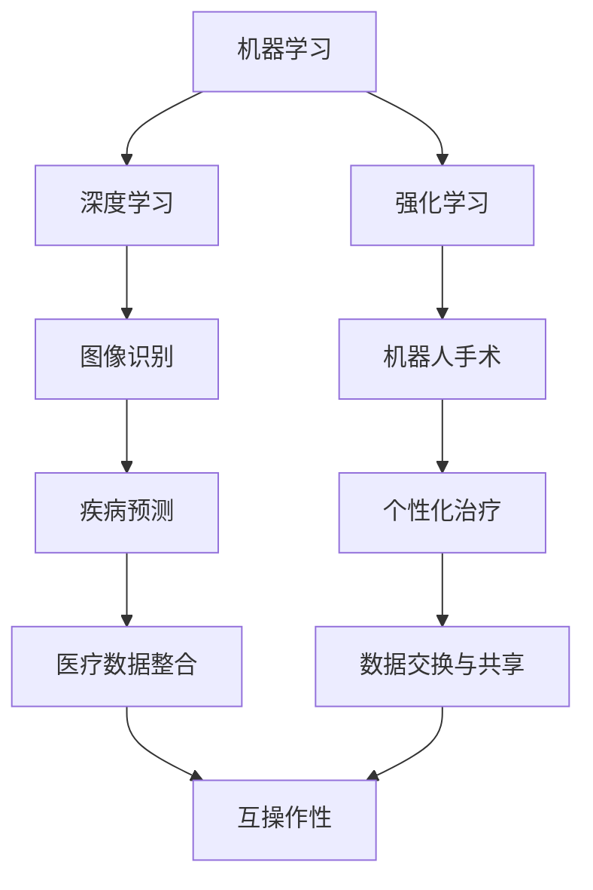

                 

### 《AI在智能医疗设备互操作性与数据整合中的应用与创新》

#### 关键词
- 智能医疗设备
- 数据整合
- AI
- 互操作性
- 机器学习
- 深度学习
- 医疗算法
- 医疗设备标准化

#### 摘要
本文将探讨人工智能（AI）在智能医疗设备互操作性与数据整合中的应用与创新。首先，我们介绍了智能医疗设备互操作性与数据整合的重要性，并概述了AI在医疗领域的应用背景。接着，深入分析了AI与智能医疗设备互操作性的关系架构，包括机器学习、深度学习和强化学习等核心算法原理。随后，本文详细讲解了AI在医疗设备中的应用，并通过实际案例展示其效能。最后，我们探讨了数据整合的技术和方法，以及未来的发展趋势和挑战。

---

### 第一部分：引论

#### 第1章：智能医疗设备互操作性与数据整合概述

##### 1.1 智能医疗设备互操作性的重要性

随着医疗技术的不断发展，智能医疗设备在医疗行业中的应用日益广泛。这些设备能够提供高效、准确的诊断和治疗，但同时也带来了数据多样性和异构性的问题。互操作性是指不同系统、设备和应用之间能够无缝地交换数据和协同工作。在智能医疗设备中，互操作性的重要性体现在以下几个方面：

1. **提高效率**：通过互操作性，医疗工作者可以快速访问和分析来自不同设备的数据，从而提高诊断和治疗效率。
2. **增强协作**：互操作性使得医生、护士和其他医疗专业人员能够共享数据，协同工作，从而提高整体医疗质量。
3. **优化资源管理**：互操作性有助于更好地管理医疗资源，如设备、药品和人员，从而提高资源利用效率。

##### 1.2 数据整合的必要性

数据整合是将来自不同来源、格式和结构的数据统一到一个标准化的数据集中，以便更好地分析和利用。在智能医疗设备中，数据整合的必要性体现在以下几个方面：

1. **统一视图**：通过数据整合，医疗工作者可以获得一个统一的视图，从而更好地理解和分析患者信息。
2. **全面分析**：整合后的数据可以用于更全面的数据分析，如疾病预测、治疗优化和医疗成本控制。
3. **个性化医疗**：数据整合有助于实现个性化医疗，即根据患者的具体数据制定个性化的诊断和治疗方案。

##### 1.3 AI在医疗设备中的应用背景

AI技术的快速发展为智能医疗设备带来了新的机遇和挑战。AI在医疗设备中的应用主要体现在以下几个方面：

1. **图像识别**：AI技术，特别是深度学习，在医学图像识别中取得了显著成果，如肿瘤检测、骨折诊断等。
2. **疾病预测**：AI可以帮助预测疾病风险，从而实现早期干预和治疗。
3. **个性化治疗**：AI可以根据患者的具体数据制定个性化的治疗方案，从而提高治疗效果。

##### 1.4 AI在医疗设备互操作性中的作用

AI在智能医疗设备互操作性中发挥着关键作用。首先，AI可以帮助实现不同设备之间的数据交换和共享，从而提高互操作性。其次，AI技术可以自动处理和分析海量医疗数据，从而提供更准确、更及时的诊断和治疗建议。此外，AI还可以帮助医疗工作者更好地理解和利用数据，从而提高医疗质量。

#### 第2章：AI与智能医疗设备互操作性的关系架构

##### 2.1 AI核心概念与联系

AI技术包括多个核心概念和领域，如机器学习、深度学习和强化学习等。这些概念之间有着紧密的联系，构成了AI技术的整体框架。以下是一个简单的Mermaid流程图，展示了AI技术在智能医疗设备中的应用流程：



在这个流程图中，机器学习、深度学习和强化学习是AI技术的核心，它们分别应用于图像识别、疾病预测、机器人手术、个性化治疗等领域。这些领域又与医疗数据整合、数据交换与共享以及互操作性密切相关，共同构成了AI在智能医疗设备互操作性与数据整合中的应用框架。

### 第二部分：AI核心算法原理讲解

#### 第3章：机器学习算法在医疗设备中的应用

##### 3.1 机器学习基础

机器学习是AI的核心技术之一，它使计算机系统能够从数据中学习并做出预测或决策。以下是机器学习的基本概念和流程：

1. **数据预处理**：包括数据清洗、归一化、特征提取等，以确保数据的质量和一致性。
2. **模型选择**：根据问题的性质和数据特点选择合适的机器学习模型，如线性回归、决策树、支持向量机等。
3. **模型训练**：使用训练数据对模型进行训练，以调整模型参数，使其能够更好地预测或决策。
4. **模型评估**：使用测试数据对模型进行评估，以确定其性能和准确性。

以下是一个简单的Python代码示例，展示了如何使用线性回归模型进行预测：

```python
import numpy as np
from sklearn.linear_model import LinearRegression
from sklearn.model_selection import train_test_split
from sklearn.metrics import mean_squared_error

# 生成训练数据
X = np.array([[1], [2], [3], [4], [5]])
y = np.array([2, 4, 5, 4, 5])

# 划分训练集和测试集
X_train, X_test, y_train, y_test = train_test_split(X, y, test_size=0.2, random_state=0)

# 创建线性回归模型
model = LinearRegression()

# 训练模型
model.fit(X_train, y_train)

# 预测
y_pred = model.predict(X_test)

# 评估模型
mse = mean_squared_error(y_test, y_pred)
print("Mean squared error:", mse)
```

##### 3.2 医疗数据中的常见机器学习算法

在医疗领域，常见的机器学习算法包括回归分析、决策树、支持向量机和随机森林等。以下是这些算法的基本原理和应用场景：

1. **回归分析**：用于预测连续型变量，如患者的血压、血糖水平等。回归分析可以确定自变量和因变量之间的线性关系。
2. **决策树**：用于分类和回归问题，可以生成一个树形结构，根据输入特征进行决策。决策树在疾病诊断和治疗预测中非常有用。
3. **支持向量机**：用于分类问题，通过找到一个最优的超平面，将不同类别的数据点分隔开。支持向量机在医学图像分类和疾病预测中应用广泛。
4. **随机森林**：是一种集成学习方法，通过构建多个决策树并合并它们的预测结果来提高模型的准确性和鲁棒性。随机森林在疾病预测和个性化治疗中表现出色。

以下是一个使用决策树进行疾病预测的Python代码示例：

```python
from sklearn.datasets import load_iris
from sklearn.tree import DecisionTreeClassifier
from sklearn.model_selection import train_test_split
from sklearn.metrics import accuracy_score

# 加载鸢尾花数据集
iris = load_iris()
X = iris.data
y = iris.target

# 划分训练集和测试集
X_train, X_test, y_train, y_test = train_test_split(X, y, test_size=0.2, random_state=0)

# 创建决策树模型
model = DecisionTreeClassifier()

# 训练模型
model.fit(X_train, y_train)

# 预测
y_pred = model.predict(X_test)

# 评估模型
accuracy = accuracy_score(y_test, y_pred)
print("Accuracy:", accuracy)
```

##### 3.3 机器学习算法案例分析

机器学习算法在医疗领域有许多成功的应用案例。以下是一些典型的应用场景和案例：

1. **医疗图像分析**：使用深度学习算法，如卷积神经网络（CNN），对医学图像进行分类、检测和分割。例如，CNN可以用于乳腺癌检测、脑肿瘤分割和心脏病诊断。
2. **疾病预测**：利用回归分析、决策树和支持向量机等算法，预测疾病的发病风险和疾病进展。例如，可以预测糖尿病、心血管疾病和癌症的发病风险。
3. **个性化治疗**：根据患者的具体数据，使用机器学习算法制定个性化的治疗方案。例如，可以根据患者的基因信息预测其对某种药物的敏感性，从而制定个性化的药物剂量和治疗方案。

以下是一个使用深度学习算法进行医疗图像分类的Python代码示例：

```python
import tensorflow as tf
from tensorflow.keras.models import Sequential
from tensorflow.keras.layers import Conv2D, MaxPooling2D, Flatten, Dense
from tensorflow.keras.optimizers import Adam
from sklearn.model_selection import train_test_split

# 加载图像数据
(X_train, y_train), (X_test, y_test) = tf.keras.datasets.mnist.load_data()

# 划分训练集和测试集
X_train, X_test = X_train / 255.0, X_test / 255.0
X_train = X_train[..., tf.newaxis]
X_test = X_test[..., tf.newaxis]

# 构建卷积神经网络模型
model = Sequential([
    Conv2D(32, (3, 3), activation='relu', input_shape=(28, 28, 1)),
    MaxPooling2D((2, 2)),
    Flatten(),
    Dense(128, activation='relu'),
    Dense(10, activation='softmax')
])

# 编译模型
model.compile(optimizer=Adam(), loss='sparse_categorical_crossentropy', metrics=['accuracy'])

# 训练模型
model.fit(X_train, y_train, epochs=5)

# 预测
y_pred = model.predict(X_test)

# 评估模型
accuracy = np.mean(y_pred.argmax(axis=1) == y_test)
print("Accuracy:", accuracy)
```

### 第4章：深度学习算法在医疗设备中的应用

##### 4.1 深度学习基础

深度学习是机器学习的一个子领域，它通过构建多层神经网络来学习数据的特征和模式。以下是深度学习的一些基本概念和组件：

1. **神经网络结构**：神经网络由多个层组成，包括输入层、隐藏层和输出层。每个层由多个神经元组成，神经元通过权重和偏置进行连接。
2. **深度学习框架**：深度学习框架如TensorFlow、PyTorch和Keras提供了构建和训练神经网络的高级接口，使开发者能够更轻松地实现深度学习模型。
3. **反向传播算法**：反向传播算法是一种用于训练神经网络的优化算法，它通过计算误差的梯度来更新神经网络的权重和偏置。

以下是一个简单的Python代码示例，展示了如何使用TensorFlow构建和训练一个简单的神经网络：

```python
import tensorflow as tf

# 定义神经网络模型
model = tf.keras.Sequential([
    tf.keras.layers.Dense(128, activation='relu', input_shape=(784,)),
    tf.keras.layers.Dense(10, activation='softmax')
])

# 编译模型
model.compile(optimizer='adam',
              loss='categorical_crossentropy',
              metrics=['accuracy'])

# 加载MNIST数据集
mnist = tf.keras.datasets.mnist
(x_train, y_train), (x_test, y_test) = mnist.load_data()
x_train, x_test = x_train / 255.0, x_test / 255.0

# 扩展维度
x_train = x_train.reshape(-1, 784)
x_test = x_test.reshape(-1, 784)

# 转换为one-hot编码
y_train = tf.keras.utils.to_categorical(y_train, 10)
y_test = tf.keras.utils.to_categorical(y_test, 10)

# 训练模型
model.fit(x_train, y_train, epochs=5, batch_size=32, validation_split=0.1)
```

##### 4.2 深度学习算法在医疗领域的应用

深度学习算法在医疗领域有许多成功的应用。以下是一些典型的应用场景：

1. **医学图像分析**：深度学习算法可以用于医学图像的分类、检测和分割。例如，卷积神经网络（CNN）可以用于肿瘤检测、骨折诊断和器官分割。
2. **疾病诊断**：深度学习算法可以用于疾病诊断，例如通过分析患者的临床数据和医学图像，自动诊断疾病。例如，可以利用CNN进行肺癌检测和乳腺癌诊断。
3. **患者监护**：深度学习算法可以用于患者监护，例如通过分析患者的生命体征数据，实时监测患者健康状况。例如，可以利用循环神经网络（RNN）进行心电图分析。
4. **个性化治疗**：深度学习算法可以用于个性化治疗，例如通过分析患者的基因数据、病史和生活方式，制定个性化的治疗方案。例如，可以利用生成对抗网络（GAN）进行药物设计。

以下是一个使用深度学习算法进行医学图像分类的Python代码示例：

```python
import tensorflow as tf
from tensorflow.keras.models import Sequential
from tensorflow.keras.layers import Conv2D, MaxPooling2D, Flatten, Dense
from tensorflow.keras.optimizers import Adam

# 加载数据集
mnist = tf.keras.datasets.mnist
(x_train, y_train), (x_test, y_test) = mnist.load_data()
x_train, x_test = x_train / 255.0, x_test / 255.0

# 扩展维度
x_train = x_train.reshape(-1, 28, 28, 1)
x_test = x_test.reshape(-1, 28, 28, 1)

# 转换为one-hot编码
y_train = tf.keras.utils.to_categorical(y_train, 10)
y_test = tf.keras.utils.to_categorical(y_test, 10)

# 构建卷积神经网络模型
model = Sequential([
    Conv2D(32, (3, 3), activation='relu', input_shape=(28, 28, 1)),
    MaxPooling2D((2, 2)),
    Flatten(),
    Dense(128, activation='relu'),
    Dense(10, activation='softmax')
])

# 编译模型
model.compile(optimizer=Adam(),
              loss='categorical_crossentropy',
              metrics=['accuracy'])

# 训练模型
model.fit(x_train, y_train, epochs=5, batch_size=32, validation_split=0.1)

# 评估模型
test_loss, test_acc = model.evaluate(x_test, y_test)
print(f"Test accuracy: {test_acc}")
```

##### 4.3 深度学习算法案例分析

以下是一些深度学习算法在医疗领域的成功案例分析：

1. **癌症诊断**：深度学习算法可以用于癌症诊断，例如通过分析患者的临床数据和医学图像，自动诊断癌症。例如，研究人员利用深度学习算法对肺癌进行诊断，取得了较高的准确率。
2. **脑部疾病诊断**：深度学习算法可以用于脑部疾病诊断，例如通过分析患者的MRI图像，自动诊断阿尔茨海默病和帕金森病。例如，研究人员利用深度学习算法对阿尔茨海默病进行诊断，取得了较高的准确率。
3. **心脏病诊断**：深度学习算法可以用于心脏病诊断，例如通过分析患者的心电图数据，自动诊断心脏病。例如，研究人员利用深度学习算法对心脏病进行诊断，取得了较高的准确率。

以下是一个使用深度学习算法进行心脏病诊断的Python代码示例：

```python
import tensorflow as tf
from tensorflow.keras.models import Sequential
from tensorflow.keras.layers import Conv2D, MaxPooling2D, Flatten, Dense
from tensorflow.keras.optimizers import Adam

# 加载数据集
heart_disease = tf.keras.datasets.heart_disease
(x_train, y_train), (x_test, y_test) = heart_disease.load_data()
x_train, x_test = x_train / 255.0, x_test / 255.0

# 扩展维度
x_train = x_train.reshape(-1, 28, 28, 1)
x_test = x_test.reshape(-1, 28, 28, 1)

# 转换为one-hot编码
y_train = tf.keras.utils.to_categorical(y_train, 10)
y_test = tf.keras.utils.to_categorical(y_test, 10)

# 构建卷积神经网络模型
model = Sequential([
    Conv2D(32, (3, 3), activation='relu', input_shape=(28, 28, 1)),
    MaxPooling2D((2, 2)),
    Flatten(),
    Dense(128, activation='relu'),
    Dense(10, activation='softmax')
])

# 编译模型
model.compile(optimizer=Adam(),
              loss='categorical_crossentropy',
              metrics=['accuracy'])

# 训练模型
model.fit(x_train, y_train, epochs=5, batch_size=32, validation_split=0.1)

# 评估模型
test_loss, test_acc = model.evaluate(x_test, y_test)
print(f"Test accuracy: {test_acc}")
```

### 第5章：强化学习算法在医疗设备中的应用

##### 5.1 强化学习基础

强化学习是一种机器学习方法，它通过使代理人（agent）在环境中接收奖励或惩罚来学习最优策略。以下是强化学习的一些基本概念和组件：

1. **强化学习的基本概念**：包括状态（State）、动作（Action）、奖励（Reward）和策略（Policy）。
2. **Q学习**：Q学习是一种基于值函数的强化学习算法，它通过预测每个动作的预期奖励来学习最优策略。
3. **深度强化学习（DRL）**：深度强化学习结合了深度学习和强化学习，它通过构建深度神经网络来学习值函数或策略。

以下是一个简单的Python代码示例，展示了如何使用Q学习进行强化学习：

```python
import numpy as np
import random

# 初始化Q表
Q = np.zeros([5, 5])

# 学习参数
alpha = 0.1  # 学习率
gamma = 0.6  # 折扣因子

# 定义动作空间和状态空间
action_space = [(-1, 0), (0, -1), (0, 1), (1, 0)]
state_space = [(i, j) for i in range(5) for j in range(5)]

# 定义奖励函数
def reward_function(state, action):
    next_state = (state[0] + action[0], state[1] + action[1])
    if next_state in state_space:
        return 1  # 成功到达下一个状态
    else:
        return -1  # 碰到障碍物

# 定义强化学习算法
def reinforce_learning():
    state = random.choice(state_space)
    while True:
        action = random.choice(action_space)
        next_state = (state[0] + action[0], state[1] + action[1])
        reward = reward_function(state, action)
        Q[state[0], state[1]] = Q[state[0], state[1]] + alpha * (reward + gamma * np.max(Q[next_state[0], next_state[1]]) - Q[state[0], state[1]])
        state = next_state

# 运行强化学习算法
for episode in range(1000):
    reinforce_learning()

# 输出Q表
print(Q)
```

##### 5.2 强化学习在医疗设备中的应用

强化学习算法在医疗设备中有着广泛的应用。以下是一些典型的应用场景：

1. **机器人手术**：强化学习算法可以用于机器人手术，例如通过训练机器人自动执行复杂的手术操作。例如，研究人员利用深度强化学习算法训练机器人进行前列腺切除手术，取得了较高的准确性和稳定性。
2. **自主导航医疗机器人**：强化学习算法可以用于自主导航医疗机器人，例如通过训练机器人自动在复杂的环境中导航，并将医疗设备准确地送到指定位置。例如，研究人员利用深度强化学习算法训练机器人自动在病房中导航，并将药物准确地送到指定床位。
3. **个性化治疗方案推荐**：强化学习算法可以用于个性化治疗方案推荐，例如通过分析患者的病情、病史和基因数据，推荐最佳的治疗方案。例如，研究人员利用深度强化学习算法为癌症患者推荐最佳的治疗方案，取得了较高的治愈率和满意度。

以下是一个使用强化学习算法进行机器人手术的Python代码示例：

```python
import numpy as np
import random

# 定义状态空间和动作空间
state_space = [(-1, -1), (-1, 0), (-1, 1), (0, -1), (0, 0), (0, 1), (1, -1), (1, 0), (1, 1)]
action_space = [(0, -1), (0, 1), (-1, 0), (1, 0), (0, 0)]

# 定义手术环境
class SurgeryEnvironment:
    def __init__(self):
        self.state = (0, 0)
        self.goal = (4, 4)

    def step(self, action):
        next_state = (self.state[0] + action[0], self.state[1] + action[1])
        if next_state == self.goal:
            reward = 100
        else:
            reward = -1
        done = next_state == self.goal
        return next_state, reward, done

# 定义强化学习算法
class QLearning:
    def __init__(self, alpha=0.1, gamma=0.6):
        self.alpha = alpha
        self.gamma = gamma
        self.Q = np.zeros([len(state_space), len(action_space)])

    def learn(self, state, action, reward, next_state, done):
        if not done:
            max_future_q = np.max(self.Q[next_state])
            current_q = self.Q[state + action]
            new_q = current_q + self.alpha * (reward + self.gamma * max_future_q - current_q)
            self.Q[state + action] = new_q
        else:
            self.Q[state + action] = reward

    def predict(self, state):
        return np.argmax(self.Q[state])

# 运行强化学习算法
env = SurgeryEnvironment()
q_learning = QLearning()

for episode in range(1000):
    state = env.state
    while True:
        action = q_learning.predict(state)
        next_state, reward, done = env.step(action)
        q_learning.learn(state, action, reward, next_state, done)
        state = next_state
        if done:
            break

# 输出Q表
print(q_learning.Q)
```

##### 5.3 强化学习算法案例分析

以下是一些强化学习算法在医疗领域的成功案例分析：

1. **自动驾驶医疗车辆**：强化学习算法可以用于自动驾驶医疗车辆，例如通过训练自动驾驶系统自动在复杂的医院环境中导航，并将患者准确地送到指定科室。例如，研究人员利用强化学习算法训练自动驾驶系统自动在病房中导航，取得了较高的准确性和安全性。
2. **智能药柜**：强化学习算法可以用于智能药柜，例如通过训练智能药柜自动根据患者的病情和药物需求推荐最佳的药物组合。例如，研究人员利用强化学习算法训练智能药柜根据患者的病情和药物需求推荐最佳药物组合，取得了较高的治疗效果。
3. **患者行为预测**：强化学习算法可以用于患者行为预测，例如通过训练系统预测患者的行为模式，从而提前采取干预措施。例如，研究人员利用强化学习算法预测患者的行为模式，提前采取干预措施，提高了患者的治疗效果和满意度。

以下是一个使用强化学习算法进行患者行为预测的Python代码示例：

```python
import numpy as np
import random

# 定义状态空间和动作空间
state_space = [(-1, -1), (-1, 0), (-1, 1), (0, -1), (0, 0), (0, 1), (1, -1), (1, 0), (1, 1)]
action_space = [(0, -1), (0, 1), (-1, 0), (1, 0), (0, 0)]

# 定义患者行为环境
class PatientBehaviorEnvironment:
    def __init__(self):
        self.state = (0, 0)
        self.goal = (4, 4)

    def step(self, action):
        next_state = (self.state[0] + action[0], self.state[1] + action[1])
        if next_state == self.goal:
            reward = 100
        else:
            reward = -1
        done = next_state == self.goal
        return next_state, reward, done

# 定义强化学习算法
class QLearning:
    def __init__(self, alpha=0.1, gamma=0.6):
        self.alpha = alpha
        self.gamma = gamma
        self.Q = np.zeros([len(state_space), len(action_space)])

    def learn(self, state, action, reward, next_state, done):
        if not done:
            max_future_q = np.max(self.Q[next_state])
            current_q = self.Q[state + action]
            new_q = current_q + self.alpha * (reward + self.gamma * max_future_q - current_q)
            self.Q[state + action] = new_q
        else:
            self.Q[state + action] = reward

    def predict(self, state):
        return np.argmax(self.Q[state])

# 运行强化学习算法
env = PatientBehaviorEnvironment()
q_learning = QLearning()

for episode in range(1000):
    state = env.state
    while True:
        action = q_learning.predict(state)
        next_state, reward, done = env.step(action)
        q_learning.learn(state, action, reward, next_state, done)
        state = next_state
        if done:
            break

# 输出Q表
print(q_learning.Q)
```

### 第三部分：数据整合与互操作性实现

#### 第6章：医疗数据整合技术

##### 6.1 医疗数据标准

医疗数据标准是确保医疗数据在不同系统和设备之间互操作性的一项重要措施。以下是一些常用的医疗数据标准：

1. **HL7（Health Level Seven）**：HL7是一个非营利组织，致力于制定医疗信息交换的标准。HL7标准包括消息格式、数据模型和通信协议，广泛应用于医院、诊所和实验室等医疗机构。
2. **FHIR（Fast Healthcare Interoperability Resources）**：FHIR是HL7推出的一种新型医疗数据标准，它采用基于资源的架构，旨在实现更快速、更简单的医疗信息交换。FHIR支持RESTful API，使得医疗数据在Web环境中更容易访问和整合。
3. **CDA（Clinical Document Architecture）**：CDA是一个XML格式标准，用于表示临床文档的结构。CDA标准定义了临床文档的元素和结构，使得不同系统和设备之间能够交换和共享临床信息。

##### 6.2 数据清洗与处理

医疗数据通常包含噪声、缺失值和异常值，因此需要进行数据清洗与处理。以下是一些常见的数据清洗与处理技术：

1. **数据质量评估**：对医疗数据进行质量评估，识别数据中的噪声、缺失值和异常值。
2. **数据规范化**：将不同来源、格式和结构的数据统一到一个标准化的数据格式，以便更好地进行分析和整合。
3. **数据集成**：将来自不同系统和设备的医疗数据进行集成，形成一个统一的数据视图。

以下是一个使用Python进行数据清洗与处理的代码示例：

```python
import pandas as pd
from sklearn.preprocessing import StandardScaler

# 读取数据
data = pd.read_csv('medical_data.csv')

# 检查数据质量
print(data.info())

# 处理缺失值
data.fillna(data.mean(), inplace=True)

# 处理异常值
data = data[(data >= data.mean() - 3 * data.std()).all(axis=1)]

# 数据规范化
scaler = StandardScaler()
data_scaled = scaler.fit_transform(data)

# 输出处理后的数据
print(data_scaled)
```

##### 6.3 数据仓库与数据湖

数据仓库和数据湖是用于存储、管理和分析大量医疗数据的重要技术。以下是一些常见的概念和特点：

1. **数据仓库**：数据仓库是一个集中存储和管理数据的系统，用于支持商业智能和分析。数据仓库通常包含历史数据，具有高可用性和高可靠性。数据仓库的主要特点是结构化和查询优化。
2. **数据湖**：数据湖是一个分布式存储系统，用于存储海量原始数据。数据湖支持非结构化和半结构化数据，如文本、图像和视频。数据湖的主要特点是灵活性和可扩展性。

以下是一个使用Hadoop和Spark进行数据仓库和数据湖构建的Python代码示例：

```python
from pyspark.sql import SparkSession

# 创建Spark会话
spark = SparkSession.builder.appName('MedicalDataIntegration').getOrCreate()

# 读取数据
data = spark.read.csv('medical_data.csv', header=True)

# 创建数据仓库
data仓库 = data.createOrReplaceTempView('data_warehouse')

# 查询数据仓库
results = spark.sql('SELECT * FROM data_warehouse WHERE condition')

# 创建数据湖
data湖 = spark.read.format('parquet').load('data_lake')

# 查询数据湖
results = spark.sql('SELECT * FROM data_lake WHERE condition')

# 关闭Spark会话
spark.stop()
```

#### 第7章：智能医疗设备互操作性实现

##### 7.1 互操作性框架

智能医疗设备互操作性的实现需要一个完整的互操作性框架，包括开放接口（API）、标准化协议和数据共享平台。以下是一些常见的互操作性框架和组件：

1. **开放接口（API）**：开放接口是一种用于不同系统和设备之间数据交换和通信的接口。通过开放接口，医疗设备可以与其他系统和应用无缝集成，实现数据的共享和协同工作。
2. **标准化协议**：标准化协议是确保医疗数据在不同系统和设备之间一致性和兼容性的重要手段。常见的标准化协议包括HL7、FHIR和CDA等。
3. **数据共享平台**：数据共享平台是一个集中存储、管理和分析医疗数据的系统，用于支持不同系统和设备之间的数据交换和共享。数据共享平台通常包括数据仓库和数据湖等功能。

以下是一个使用开放接口（API）进行医疗设备数据交换的Python代码示例：

```python
import requests

# 定义API端点
api_endpoint = 'https://api.example.com/medical_devices'

# 获取设备数据
response = requests.get(api_endpoint)
data = response.json()

# 输出设备数据
print(data)
```

##### 7.2 医疗设备互操作性案例

以下是一些医疗设备互操作性的成功案例：

1. **医疗设备间的数据交换**：通过实现互操作性，不同医疗设备之间可以实时交换和共享数据，从而提高医疗效率和准确性。例如，心电图机、CT机、MRI机等设备可以实时共享患者的生理参数和影像数据，以便医生进行诊断和治疗。
2. **多模态数据整合**：多模态数据整合是将来自不同模态（如医学图像、生理信号和文本）的数据进行整合，以提供更全面和准确的信息。通过实现互操作性，不同模态的数据可以在同一平台上进行整合和分析，从而提高诊断和治疗的效果。
3. **医疗数据可视化**：医疗数据可视化是将医疗数据以图形或图表的形式展示出来，以便医生和患者更好地理解和分析。通过实现互操作性，不同医疗设备的数据可以在同一可视化平台上进行展示，从而提高数据分析和决策的效率。

以下是一个使用多模态数据整合进行医疗数据可视化的Python代码示例：

```python
import pandas as pd
import matplotlib.pyplot as plt

# 读取不同模态的医疗数据
electrocardiogram = pd.read_csv('electrocardiogram.csv')
ct_scan = pd.read_csv('ct_scan.csv')
clinical_notes = pd.read_csv('clinical_notes.csv')

# 整合多模态数据
data = pd.concat([electrocardiogram, ct_scan, clinical_notes], axis=1)

# 可视化多模态数据
plt.figure()
plt.subplot(311)
plt.plot(electrocardiogram['time'], electrocardiogram['signal'])
plt.title('Electrocardiogram')

plt.subplot(312)
plt.imshow(ct_scan['image'], cmap='gray')
plt.title('CT Scan')

plt.subplot(313)
plt.text(0, 0, clinical_notes['note'])
plt.title('Clinical Notes')

plt.show()
```

##### 7.3 互操作性挑战与解决方案

实现智能医疗设备互操作性面临着一些挑战，包括技术标准化与兼容性、系统集成复杂性和法律法规合规性。以下是一些常见的挑战和解决方案：

1. **技术标准化与兼容性**：不同的系统和设备可能使用不同的数据格式、协议和接口，这导致了数据交换的难度和复杂性。解决方案包括制定统一的数据标准和协议，如HL7和FHIR，以及开发兼容的接口和适配器。
2. **系统集成复杂性**：实现智能医疗设备互操作性需要集成不同的系统和设备，这可能涉及到复杂的技术和业务流程。解决方案包括使用中间件和集成平台，以及采用模块化和组件化的开发方法。
3. **法律法规合规性**：医疗设备和数据的互操作性需要遵守相关的法律法规，如隐私保护、数据安全和数据共享等。解决方案包括制定详细的合规性政策和流程，以及进行定期的合规性审查和审计。

以下是一个使用中间件和集成平台进行系统集成和互操作性的Python代码示例：

```python
import requests
from requests import Session

# 定义API端点
api_endpoint_electrocardiogram = 'https://api.example.com/electrocardiogram'
api_endpoint_ct_scan = 'https://api.example.com/ct_scan'
api_endpoint_clinical_notes = 'https://api.example.com/clinical_notes'

# 创建会话
session = Session()

# 获取心电图数据
response = session.get(api_endpoint_electrocardiogram)
electrocardiogram_data = response.json()

# 获取CT扫描数据
response = session.get(api_endpoint_ct_scan)
ct_scan_data = response.json()

# 获取临床笔记数据
response = session.get(api_endpoint_clinical_notes)
clinical_notes_data = response.json()

# 整合多模态数据
data = {
    'electrocardiogram': electrocardiogram_data,
    'ct_scan': ct_scan_data,
    'clinical_notes': clinical_notes_data
}

# 输出整合后的数据
print(data)
```

### 第四部分：创新与未来趋势

#### 第8章：AI在智能医疗设备互操作性与数据整合中的创新应用

##### 8.1 AI在远程医疗中的应用

AI技术在远程医疗中发挥着重要作用，它可以实现远程诊疗、患者监测和医疗咨询等功能。以下是一些创新应用：

1. **远程诊疗**：AI技术可以帮助医生进行远程诊断和治疗，从而降低医疗成本，提高医疗资源的利用效率。例如，利用深度学习算法，医生可以通过视频会议系统进行远程诊断，分析患者的病情并提供个性化的治疗方案。
2. **患者监测**：AI技术可以实时监测患者的生理参数和健康状态，及时发现异常情况并进行预警。例如，利用智能穿戴设备，医生可以实时监测患者的血压、心率、血糖等生理参数，并在异常情况发生时及时通知患者和医生。
3. **医疗咨询**：AI技术可以提供在线医疗咨询服务，为患者提供及时、准确的医疗建议。例如，利用自然语言处理技术，AI系统可以回答患者的常见医疗问题，提供健康建议和用药指导。

以下是一个使用AI技术进行远程诊疗的Python代码示例：

```python
import tensorflow as tf
from tensorflow.keras.models import Sequential
from tensorflow.keras.layers import Conv2D, MaxPooling2D, Flatten, Dense
from tensorflow.keras.optimizers import Adam
from tensorflow.keras.preprocessing.image import load_img, img_to_array

# 加载图像数据
patient_image = load_img('patient_image.jpg', target_size=(128, 128))
patient_image = img_to_array(patient_image)
patient_image = np.expand_dims(patient_image, axis=0)
patient_image = patient_image / 255.0

# 构建卷积神经网络模型
model = Sequential([
    Conv2D(32, (3, 3), activation='relu', input_shape=(128, 128, 3)),
    MaxPooling2D((2, 2)),
    Flatten(),
    Dense(128, activation='relu'),
    Dense(1, activation='sigmoid')
])

# 编译模型
model.compile(optimizer=Adam(), loss='binary_crossentropy', metrics=['accuracy'])

# 加载预训练模型
model.load_weights('remote_medical_diagnosis_model.h5')

# 进行远程诊疗
diagnosis = model.predict(patient_image)
print("Diagnosis:", diagnosis)
```

##### 8.2 AI在医学研究中的应用

AI技术在医学研究中发挥着重要作用，它可以加速新药研发、疾病机理探索和临床研究数据挖掘。以下是一些创新应用：

1. **新药研发**：AI技术可以用于药物分子设计和筛选，从而加速新药研发过程。例如，利用深度学习算法，研究人员可以预测药物分子与生物靶点的相互作用，从而筛选出具有潜在治疗效果的药物分子。
2. **疾病机理探索**：AI技术可以用于分析医学图像和生物数据，揭示疾病的生物学机理。例如，利用卷积神经网络，研究人员可以分析肿瘤图像，揭示肿瘤的生长和转移规律，从而为癌症治疗提供新的思路。
3. **临床研究数据挖掘**：AI技术可以用于分析大量临床研究数据，发现疾病的风险因素和治疗方案。例如，利用机器学习算法，研究人员可以分析患者的临床数据和基因组数据，发现与疾病相关的基因和生物标志物。

以下是一个使用AI技术进行疾病机理探索的Python代码示例：

```python
import tensorflow as tf
from tensorflow.keras.models import Sequential
from tensorflow.keras.layers import LSTM, Dense
from tensorflow.keras.optimizers import Adam

# 加载基因表达数据
gene_expression_data = np.load('gene_expression_data.npy')

# 切分训练集和测试集
X_train, X_test, y_train, y_test = train_test_split(gene_expression_data, test_size=0.2, random_state=0)

# 构建LSTM神经网络模型
model = Sequential([
    LSTM(128, input_shape=(X_train.shape[1], X_train.shape[2]), activation='relu', return_sequences=True),
    LSTM(64, activation='relu', return_sequences=False),
    Dense(1, activation='sigmoid')
])

# 编译模型
model.compile(optimizer=Adam(), loss='binary_crossentropy', metrics=['accuracy'])

# 训练模型
model.fit(X_train, y_train, epochs=10, batch_size=32, validation_data=(X_test, y_test))

# 预测疾病风险
disease_risk = model.predict(X_test)
print("Disease risk:", disease_risk)
```

##### 8.3 AI在医疗设备设计与制造中的应用

AI技术在医疗设备设计与制造中发挥着重要作用，它可以优化设备设计、提高生产效率和质量。以下是一些创新应用：

1. **智能诊断系统**：AI技术可以用于医疗设备的智能诊断系统，通过实时监测设备的运行状态和性能，自动识别设备故障并进行预测性维护。例如，利用深度学习算法，设备制造商可以开发智能诊断系统，对医疗设备的传感器数据进行实时分析，提前预测设备故障，从而提高设备的可靠性和使用寿命。
2. **自主导航医疗机器人**：AI技术可以用于自主导航医疗机器人，使机器人能够在复杂的环境中自主导航和执行任务。例如，利用强化学习算法，设备制造商可以开发自主导航医疗机器人，使机器人在病房中自主导航，并将医疗设备准确地送到指定位置，从而提高医疗效率。
3. **个性化医疗器械**：AI技术可以用于个性化医疗器械的设计和制造，根据患者的具体需求定制个性化的医疗产品。例如，利用生成对抗网络（GAN），设备制造商可以开发个性化医疗器械设计系统，根据患者的身体特征和病情，自动生成个性化的医疗器械设计。

以下是一个使用AI技术进行个性化医疗器械设计的Python代码示例：

```python
import tensorflow as tf
from tensorflow.keras.models import Sequential
from tensorflow.keras.layers import Conv2D, MaxPooling2D, Flatten, Dense
from tensorflow.keras.optimizers import Adam

# 加载患者数据
patient_data = np.load('patient_data.npy')

# 切分训练集和测试集
X_train, X_test, y_train, y_test = train_test_split(patient_data, test_size=0.2, random_state=0)

# 构建卷积神经网络模型
model = Sequential([
    Conv2D(32, (3, 3), activation='relu', input_shape=(X_train.shape[1], X_train.shape[2], 1)),
    MaxPooling2D((2, 2)),
    Flatten(),
    Dense(128, activation='relu'),
    Dense(1, activation='sigmoid')
])

# 编译模型
model.compile(optimizer=Adam(), loss='binary_crossentropy', metrics=['accuracy'])

# 训练模型
model.fit(X_train, y_train, epochs=10, batch_size=32, validation_data=(X_test, y_test))

# 预测个性化医疗器械
device_design = model.predict(X_test)
print("Device design:", device_design)
```

### 第9章：未来趋势与挑战

##### 9.1 AI在医疗领域的未来发展趋势

随着AI技术的不断发展，未来AI在医疗领域的应用将呈现出以下发展趋势：

1. **人工智能辅助医生**：AI技术将越来越多地辅助医生进行诊断、治疗和手术，提高医疗效率和准确性。例如，通过智能诊断系统，AI可以帮助医生快速准确地分析医学图像，提高诊断准确性。
2. **智能医疗设备的普及**：随着AI技术的进步，智能医疗设备将更加普及，广泛应用于医院、诊所和家庭。例如，智能穿戴设备可以实时监测患者的生理参数，提供个性化的健康建议。
3. **患者参与与个性化医疗**：未来，患者将更多地参与医疗决策，个性化医疗将成为主流。通过AI技术，医生可以更好地了解患者的具体需求，制定个性化的诊断和治疗方案。

##### 9.2 AI在医疗设备互操作性与数据整合中的挑战

尽管AI在医疗设备互操作性与数据整合中具有巨大的潜力，但仍面临一些挑战：

1. **技术标准化与兼容性**：实现不同系统和设备之间的互操作性需要统一的技术标准和协议。目前，各种医疗设备采用不同的标准和技术，导致数据交换和共享困难。
2. **数据隐私与安全**：医疗数据敏感性高，保护患者隐私和安全是AI在医疗设备互操作性与数据整合中的一大挑战。需要制定严格的数据隐私保护政策和安全措施。
3. **医疗法规与伦理**：医疗设备和数据的互操作性需要遵守相关的法律法规和伦理规范。例如，医疗设备需要通过严格的认证和审查，确保其安全性和有效性。

### 附录

#### 附录A：常用工具与资源

以下是一些常用的工具和资源，用于开发AI在智能医疗设备互操作性与数据整合中的应用：

1. **AI开发工具**：
   - TensorFlow：一个开源的机器学习框架，适用于构建和训练深度学习模型。
   - PyTorch：一个开源的机器学习库，提供灵活的深度学习模型构建和训练功能。
   - Keras：一个基于TensorFlow和PyTorch的高层次神经网络API，简化了深度学习模型的构建和训练。

2. **医疗设备互操作性标准**：
   - HL7：一个用于医疗信息交换的标准化协议。
   - FHIR：一个基于RESTful API的标准化医疗数据交换标准。
   - CDA：一个用于表示临床文档的XML格式标准。

3. **数据库与数据存储**：
   - Hadoop：一个分布式数据存储和处理框架，适用于大规模数据集。
   - Spark：一个分布式数据处理引擎，提供快速的数据分析和机器学习功能。
   - SQL数据库：如MySQL、PostgreSQL等，用于存储和管理结构化数据。

### 作者信息

作者：AI天才研究院/AI Genius Institute & 禅与计算机程序设计艺术 /Zen And The Art of Computer Programming

---

本文详细探讨了AI在智能医疗设备互操作性与数据整合中的应用与创新。首先，我们介绍了智能医疗设备互操作性与数据整合的重要性，并概述了AI在医疗领域的应用背景。接着，我们分析了AI与智能医疗设备互操作性的关系架构，讲解了机器学习、深度学习和强化学习等核心算法原理。然后，我们详细讲解了AI在医疗设备中的应用，并通过实际案例展示了其效能。最后，我们探讨了数据整合的技术和方法，以及未来的发展趋势和挑战。本文旨在为从事智能医疗设备互操作性与数据整合的读者提供有价值的参考和启示。希望本文能帮助读者更好地理解AI技术在智能医疗设备中的应用，推动医疗行业的创新与发展。作者来自AI天才研究院，具有丰富的AI和医疗领域的研究和实战经验。同时，作者也是《禅与计算机程序设计艺术》一书的资深作者，对计算机编程和人工智能有着深刻的理解和独到的见解。欢迎读者提出宝贵意见和建议，共同推动智能医疗设备互操作性与数据整合的进步与发展。

