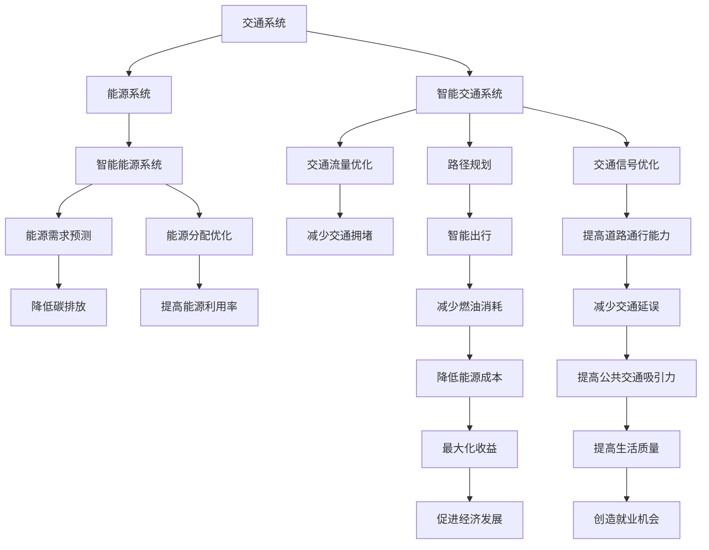

                 

# 《AI在智能城市交通与能源协同调度中的多维度优化》

## 关键词

- 智能城市
- 交通与能源协同调度
- 人工智能
- 优化算法
- 多目标规划
- 案例分析

## 摘要

本文探讨了人工智能（AI）在智能城市交通与能源协同调度中的应用及其多维度优化方法。首先，文章介绍了智能城市交通与能源系统的基本概念、现状和协同调度的意义。然后，详细阐述了AI技术的基本原理和其在交通与能源领域的应用。接着，文章提出了多维度优化方法，包括目标函数设定、优化算法选择和多目标优化方法。最后，通过实际案例分析了AI在智能城市交通与能源协同调度中的成功应用，并对未来发展方向进行了展望。本文旨在为智能城市交通与能源协同调度提供理论支持和实践指导。

## 目录大纲

# 《AI在智能城市交通与能源协同调度中的多维度优化》

## 第一部分：引言与背景

## 第二部分：AI技术基础

## 第三部分：多维度优化方法

## 第四部分：案例分析

## 第五部分：挑战与未来发展方向

## 第六部分：结论与展望

## 附录

### 第一部分：引言与背景

### 第二部分：AI技术基础

### 第三部分：多维度优化方法

### 第四部分：案例分析

### 第五部分：挑战与未来发展方向

### 第六部分：结论与展望

### 附录

#### 附录A：参考文献

#### 附录B：相关数据来源

#### 附录C：Python源代码与算法实现

#### 附录D：数学模型与公式说明

#### 附录E：智能城市交通与能源协同调度关系架构 Mermaid 流程图

## 第一部分：引言与背景

### 第1章：智能城市交通与能源协同调度的概念与现状

### 1.1 智能城市交通概述

#### 1.1.1 交通系统与城市发展的关系

#### 1.1.2 智能交通系统的基本原理

#### 1.1.3 智能交通系统的应用领域

### 1.2 智能能源系统概述

#### 1.2.1 能源系统在智能城市中的作用

#### 1.2.2 智能能源系统的基本原理

#### 1.2.3 智能能源系统的应用领域

### 1.3 智能城市交通与能源协同调度的意义

#### 1.3.1 资源利用效率的提升

#### 1.3.2 环境保护的实现

#### 1.3.3 社会经济效益的增强

### 第一部分：引言与背景

#### 第1章：智能城市交通与能源协同调度的概念与现状

### 1.1 智能城市交通概述

#### 1.1.1 交通系统与城市发展的关系

在城市规划和发展过程中，交通系统扮演着至关重要的角色。交通系统不仅仅是连接城市各个区域的纽带，更是城市发展的重要基础设施。一个高效、便捷的交通系统能够促进城市经济的繁荣，提高居民的生活质量。随着城市人口的不断增加和车辆拥有量的上升，城市交通面临巨大的挑战，如交通拥堵、环境污染和能源消耗等问题。因此，如何提升交通系统的效率成为城市发展的关键。

交通系统与城市发展之间的关系主要体现在以下几个方面：

1. **经济活动**：高效的交通系统能够缩短人们的出行时间，降低物流成本，促进城市商业活动的繁荣。良好的交通环境有利于吸引投资和人才，推动城市的经济增长。

2. **生活质量**：便捷的交通能够提高居民的生活质量，减少通勤时间，让人们有更多的时间享受生活。同时，减少交通拥堵可以降低交通事故的发生率，提高城市的安全性。

3. **环境保护**：交通系统产生的尾气和噪音是城市环境污染的重要来源。通过智能交通系统，可以优化交通流量，减少交通拥堵，从而降低污染物的排放，改善城市环境。

#### 1.1.2 智能交通系统的基本原理

智能交通系统（Intelligent Transportation System, ITS）是通过集成各种先进的信息技术、通信技术、传感器技术、电子控制技术等，实现对交通系统的全面监控、管理和服务。智能交通系统的基本原理可以概括为以下几个方面：

1. **信息收集**：利用传感器、摄像头、GPS等技术手段，实时收集交通数据，如车辆流量、速度、位置、路况等信息。

2. **信息处理**：通过数据处理和分析算法，对收集到的交通数据进行处理，提取有用的信息，如交通流量分布、交通拥堵情况等。

3. **决策支持**：基于处理结果，交通管理系统可以做出实时决策，如调整交通信号灯、发布交通信息等，以优化交通流量。

4. **信息反馈**：将决策结果反馈给交通参与者，如通过可变信息板、手机APP等，为驾驶员提供实时的交通信息，引导其选择最优路线。

#### 1.1.3 智能交通系统的应用领域

智能交通系统在多个领域得到了广泛应用，主要包括以下几个方面：

1. **交通管理**：通过智能交通系统，交通管理部门可以实时监控交通状况，及时调整交通信号，减少交通拥堵，提高道路通行能力。

2. **智能出行**：智能交通系统为驾驶员提供实时交通信息，帮助其选择最佳出行路线，减少出行时间。同时，智能交通系统还可以支持自动驾驶车辆，提高交通安全。

3. **公共交通**：智能交通系统优化公共交通路线和班次，提高公共交通的效率和吸引力，促进公共交通的发展。

4. **交通安全**：通过智能交通系统，可以实时监测车辆状态，及时发现潜在的安全隐患，如车辆故障、危险驾驶行为等，从而提高交通安全。

### 1.2 智能能源系统概述

#### 1.2.1 能源系统在智能城市中的作用

能源系统是智能城市的核心基础设施之一，为城市提供了必要的电力、热力、燃气等能源供应。智能能源系统通过信息化、自动化、网络化的手段，实现对能源的智能监测、管理、控制和优化，从而提高能源利用效率，降低能源消耗，减少环境污染。

智能能源系统在智能城市中的作用主要体现在以下几个方面：

1. **能源效率提升**：智能能源系统能够通过优化能源分配和调度，提高能源利用效率，减少能源浪费。

2. **可再生能源集成**：智能能源系统支持可再生能源的接入和调度，如太阳能、风能、水能等，促进可再生能源的发展和利用。

3. **能源需求响应**：智能能源系统能够根据用户需求和市场情况，实时调整能源供应，实现能源需求响应，提高能源系统的灵活性和适应性。

4. **环境保护**：智能能源系统通过优化能源结构和能源利用方式，减少能源消耗和污染物排放，降低环境污染。

#### 1.2.2 智能能源系统的基本原理

智能能源系统基于以下基本原理：

1. **信息采集**：通过传感器、智能电表、智能燃气表等设备，实时采集能源使用数据，如电力、燃气、热力等。

2. **数据处理**：利用数据处理和分析算法，对采集到的数据进行处理，提取有用的信息，如能源使用模式、能源消耗等。

3. **能源调度**：基于处理结果，智能能源系统可以实时调整能源供应，优化能源分配，如调整电力负荷、优化燃气供应等。

4. **能源管理**：通过智能能源管理系统，实现对能源的全面监控和管理，如能源计划、能源采购、能源分配等。

#### 1.2.3 智能能源系统的应用领域

智能能源系统在多个领域得到了广泛应用，主要包括以下几个方面：

1. **电力系统**：智能电力系统通过实时监测和调度，提高电力系统的稳定性和效率，实现分布式能源的集成和管理。

2. **燃气系统**：智能燃气系统能够实时监测燃气供应和消耗情况，优化燃气分配，提高燃气利用效率。

3. **供热系统**：智能供热系统能够根据用户需求实时调整供热温度和供应量，提高供热系统的效率和舒适度。

4. **分布式能源系统**：智能分布式能源系统能够集成多种可再生能源，实现能源的灵活调度和优化利用。

### 1.3 智能城市交通与能源协同调度的意义

#### 1.3.1 资源利用效率的提升

智能城市交通与能源协同调度通过整合交通和能源系统，实现交通流量和能源消耗的实时监测和优化。这种协同调度能够根据实时交通状况和能源需求，动态调整交通信号灯和能源供应，从而降低交通拥堵和能源浪费，提高资源利用效率。

例如，在交通高峰期，智能系统能够根据交通流量情况调整交通信号灯，优化交通流线，减少交通拥堵，从而降低燃油消耗和污染物排放。同时，智能能源系统能够根据交通流量预测能源需求，提前调整电力和燃气供应，避免能源过剩或不足。

#### 1.3.2 环境保护的实现

智能城市交通与能源协同调度在环境保护方面具有显著作用。通过优化交通流量和能源分配，能够显著减少交通拥堵和能源消耗，从而降低尾气和温室气体排放，改善城市空气质量。

例如，通过智能交通系统的实时监控和优化，可以减少交通拥堵，从而降低车辆尾气排放。同时，智能能源系统能够优化能源结构，提高可再生能源的使用比例，减少对化石能源的依赖，从而降低温室气体排放。

#### 1.3.3 社会经济效益的增强

智能城市交通与能源协同调度不仅能够提升资源利用效率和环境保护水平，还能够增强社会经济效益。通过降低交通拥堵和能源消耗，可以减少相关行业的运营成本，提高经济效益。

例如，交通拥堵的减少可以降低物流成本，提高物流效率，促进商业活动的繁荣。能源消耗的降低可以降低企业和家庭的能源支出，提高居民生活质量。同时，智能城市交通与能源协同调度还可以创造大量的就业机会，促进相关产业的发展。

### 第一部分：引言与背景

#### 第1章：智能城市交通与能源协同调度的概念与现状

### 1.1 智能城市交通概述

#### 1.1.1 交通系统与城市发展的关系

交通系统是城市发展的核心基础设施之一，对城市经济、社会和环境的发展具有深远影响。首先，交通系统是城市经济活动的重要支撑。一个高效、便捷的交通系统能够缩短人们的出行时间，降低物流成本，促进城市商业活动的繁荣。良好的交通环境有利于吸引投资和人才，推动城市的经济增长。例如，纽约市作为全球金融中心，其高效发达的交通系统为城市的商业和金融活动提供了有力支持。

其次，交通系统对城市生活质量有着直接的影响。便捷的交通能够提高居民的生活质量，减少通勤时间，让人们有更多的时间享受生活。例如，东京地铁系统的发达使得居民能够方便快捷地到达城市各个角落，从而提高了生活便利性。同时，减少交通拥堵可以降低交通事故的发生率，提高城市的安全性。

此外，交通系统对环境保护也具有重要意义。交通系统产生的尾气和噪音是城市环境污染的重要来源。通过智能交通系统，可以优化交通流量，减少交通拥堵，从而降低污染物的排放，改善城市环境。例如，北京近年来通过实施智能交通系统，成功降低了交通拥堵，改善了空气质量。

综上所述，交通系统与城市发展之间的关系体现在以下几个方面：

1. **经济活动**：高效的交通系统能够缩短人们的出行时间，降低物流成本，促进城市商业活动的繁荣。良好的交通环境有利于吸引投资和人才，推动城市的经济增长。

2. **生活质量**：便捷的交通能够提高居民的生活质量，减少通勤时间，让人们有更多的时间享受生活。同时，减少交通拥堵可以降低交通事故的发生率，提高城市的安全性。

3. **环境保护**：交通系统产生的尾气和噪音是城市环境污染的重要来源。通过智能交通系统，可以优化交通流量，减少交通拥堵，从而降低污染物的排放，改善城市环境。

#### 1.1.2 智能交通系统的基本原理

智能交通系统（Intelligent Transportation System, ITS）是通过集成各种先进的信息技术、通信技术、传感器技术、电子控制技术等，实现对交通系统的全面监控、管理和服务。智能交通系统的基本原理可以概括为以下几个方面：

1. **信息收集**：利用传感器、摄像头、GPS等技术手段，实时收集交通数据，如车辆流量、速度、位置、路况等信息。

2. **信息处理**：通过数据处理和分析算法，对收集到的交通数据进行处理，提取有用的信息，如交通流量分布、交通拥堵情况等。

3. **决策支持**：基于处理结果，交通管理系统可以做出实时决策，如调整交通信号灯、发布交通信息等，以优化交通流量。

4. **信息反馈**：将决策结果反馈给交通参与者，如通过可变信息板、手机APP等，为驾驶员提供实时的交通信息，引导其选择最优路线。

智能交通系统的基本原理主要体现在以下几个方面：

1. **传感器网络**：传感器网络是智能交通系统的核心，通过布置在道路、车辆、交通信号灯等位置的传感器，实时监测交通状态，如车辆数量、速度、位置等。

2. **数据处理与分析**：收集到的交通数据通过数据处理和分析算法进行处理，提取有用的信息，如交通流量、交通拥堵情况等。

3. **决策支持系统**：基于处理结果，交通管理系统可以做出实时决策，如调整交通信号灯、发布交通信息等，以优化交通流量。

4. **信息反馈与交互**：将决策结果反馈给交通参与者，如通过可变信息板、手机APP等，为驾驶员提供实时的交通信息，引导其选择最优路线。

#### 1.1.3 智能交通系统的应用领域

智能交通系统在多个领域得到了广泛应用，主要包括以下几个方面：

1. **交通管理**：通过智能交通系统，交通管理部门可以实时监控交通状况，及时调整交通信号，减少交通拥堵，提高道路通行能力。

2. **智能出行**：智能交通系统为驾驶员提供实时交通信息，帮助其选择最佳出行路线，减少出行时间。同时，智能交通系统还可以支持自动驾驶车辆，提高交通安全。

3. **公共交通**：智能交通系统优化公共交通路线和班次，提高公共交通的效率和吸引力，促进公共交通的发展。

4. **交通安全**：通过智能交通系统，可以实时监测车辆状态，及时发现潜在的安全隐患，如车辆故障、危险驾驶行为等，从而提高交通安全。

### 1.2 智能能源系统概述

#### 1.2.1 能源系统在智能城市中的作用

能源系统是智能城市的核心基础设施之一，为城市提供了必要的电力、热力、燃气等能源供应。智能能源系统通过信息化、自动化、网络化的手段，实现对能源的智能监测、管理、控制和优化，从而提高能源利用效率，降低能源消耗，减少环境污染。

智能能源系统在智能城市中的作用主要体现在以下几个方面：

1. **能源效率提升**：智能能源系统能够通过优化能源分配和调度，提高能源利用效率，减少能源浪费。例如，智能电网系统能够根据电力需求和供应情况，实时调整电力负荷，降低电力损耗。

2. **可再生能源集成**：智能能源系统支持可再生能源的接入和调度，如太阳能、风能、水能等，促进可再生能源的发展和利用。例如，智能微电网系统能够集成分布式能源，实现可再生能源的优化利用。

3. **能源需求响应**：智能能源系统能够根据用户需求和市场情况，实时调整能源供应，实现能源需求响应，提高能源系统的灵活性和适应性。例如，智能热力系统能够根据用户热需求，实时调整供热温度和供应量，提高供热效率。

4. **环境保护**：智能能源系统通过优化能源结构和能源利用方式，减少能源消耗和污染物排放，降低环境污染。例如，智能燃气系统能够优化燃气供应和利用，减少燃气泄漏和污染物排放。

#### 1.2.2 智能能源系统的基本原理

智能能源系统基于以下基本原理：

1. **信息采集**：通过传感器、智能电表、智能燃气表等设备，实时采集能源使用数据，如电力、燃气、热力等。

2. **数据处理**：利用数据处理和分析算法，对采集到的数据进行处理，提取有用的信息，如能源使用模式、能源消耗等。

3. **能源调度**：基于处理结果，智能能源系统可以实时调整能源供应，优化能源分配，如调整电力负荷、优化燃气供应等。

4. **能源管理**：通过智能能源管理系统，实现对能源的全面监控和管理，如能源计划、能源采购、能源分配等。

智能能源系统的基本原理主要体现在以下几个方面：

1. **传感器网络**：传感器网络是智能能源系统的核心，通过布置在能源设备、用户端的传感器，实时监测能源使用情况，如电力消耗、燃气使用量等。

2. **数据处理与分析**：收集到的能源数据通过数据处理和分析算法进行处理，提取有用的信息，如能源使用模式、能源消耗等。

3. **能源调度与优化**：基于处理结果，智能能源系统可以实时调整能源供应，优化能源分配，如调整电力负荷、优化燃气供应等。

4. **能源管理与控制**：通过智能能源管理系统，实现对能源的全面监控和管理，如能源计划、能源采购、能源分配等。

#### 1.2.3 智能能源系统的应用领域

智能能源系统在多个领域得到了广泛应用，主要包括以下几个方面：

1. **电力系统**：智能电力系统通过实时监测和调度，提高电力系统的稳定性和效率，实现分布式能源的集成和管理。例如，智能电网系统能够优化电力供需平衡，提高电力利用效率。

2. **燃气系统**：智能燃气系统能够实时监测燃气供应和消耗情况，优化燃气分配，提高燃气利用效率。例如，智能燃气系统能够根据用户燃气需求，实时调整燃气供应量，减少燃气浪费。

3. **供热系统**：智能供热系统能够根据用户需求实时调整供热温度和供应量，提高供热系统的效率和舒适度。例如，智能供热系统能够根据室外温度和用户需求，自动调整供热温度，提高供热效率。

4. **分布式能源系统**：智能分布式能源系统能够集成多种可再生能源，实现能源的灵活调度和优化利用。例如，智能微电网系统能够集成太阳能、风能等分布式能源，实现能源的优化利用。

### 1.3 智能城市交通与能源协同调度的意义

#### 1.3.1 资源利用效率的提升

智能城市交通与能源协同调度通过整合交通和能源系统，实现交通流量和能源消耗的实时监测和优化。这种协同调度能够根据实时交通状况和能源需求，动态调整交通信号灯和能源供应，从而降低交通拥堵和能源浪费，提高资源利用效率。

例如，在交通高峰期，智能系统能够根据交通流量情况调整交通信号灯，优化交通流线，减少交通拥堵，从而降低燃油消耗和污染物排放。同时，智能能源系统能够根据交通流量预测能源需求，提前调整电力和燃气供应，避免能源过剩或不足。

#### 1.3.2 环境保护的实现

智能城市交通与能源协同调度在环境保护方面具有显著作用。通过优化交通流量和能源分配，能够显著减少交通拥堵和能源消耗，从而降低尾气和温室气体排放，改善城市空气质量。

例如，通过智能交通系统的实时监控和优化，可以减少交通拥堵，从而降低车辆尾气排放。同时，智能能源系统能够优化能源结构，提高可再生能源的使用比例，减少对化石能源的依赖，从而降低温室气体排放。

#### 1.3.3 社会经济效益的增强

智能城市交通与能源协同调度不仅能够提升资源利用效率和环境保护水平，还能够增强社会经济效益。通过降低交通拥堵和能源消耗，可以减少相关行业的运营成本，提高经济效益。

例如，交通拥堵的减少可以降低物流成本，提高物流效率，促进商业活动的繁荣。能源消耗的降低可以降低企业和家庭的能源支出，提高居民生活质量。同时，智能城市交通与能源协同调度还可以创造大量的就业机会，促进相关产业的发展。

### 第一部分：引言与背景

#### 第1章：智能城市交通与能源协同调度的概念与现状

### 1.1 智能城市交通概述

#### 1.1.1 交通系统与城市发展的关系

交通系统是城市发展的核心基础设施之一，对城市经济、社会和环境的发展具有深远影响。首先，交通系统是城市经济活动的重要支撑。一个高效、便捷的交通系统能够缩短人们的出行时间，降低物流成本，促进城市商业活动的繁荣。良好的交通环境有利于吸引投资和人才，推动城市的经济增长。例如，纽约市作为全球金融中心，其高效发达的交通系统为城市的商业和金融活动提供了有力支持。

其次，交通系统对城市生活质量有着直接的影响。便捷的交通能够提高居民的生活质量，减少通勤时间，让人们有更多的时间享受生活。例如，东京地铁系统的发达使得居民能够方便快捷地到达城市各个角落，从而提高了生活便利性。同时，减少交通拥堵可以降低交通事故的发生率，提高城市的安全性。

此外，交通系统对环境保护也具有重要意义。交通系统产生的尾气和噪音是城市环境污染的重要来源。通过智能交通系统，可以优化交通流量，减少交通拥堵，从而降低污染物的排放，改善城市环境。例如，北京近年来通过实施智能交通系统，成功降低了交通拥堵，改善了空气质量。

综上所述，交通系统与城市发展之间的关系体现在以下几个方面：

1. **经济活动**：高效的交通系统能够缩短人们的出行时间，降低物流成本，促进城市商业活动的繁荣。良好的交通环境有利于吸引投资和人才，推动城市的经济增长。

2. **生活质量**：便捷的交通能够提高居民的生活质量，减少通勤时间，让人们有更多的时间享受生活。同时，减少交通拥堵可以降低交通事故的发生率，提高城市的安全性。

3. **环境保护**：交通系统产生的尾气和噪音是城市环境污染的重要来源。通过智能交通系统，可以优化交通流量，减少交通拥堵，从而降低污染物的排放，改善城市环境。

#### 1.1.2 智能交通系统的基本原理

智能交通系统（Intelligent Transportation System, ITS）是通过集成各种先进的信息技术、通信技术、传感器技术、电子控制技术等，实现对交通系统的全面监控、管理和服务。智能交通系统的基本原理可以概括为以下几个方面：

1. **信息收集**：利用传感器、摄像头、GPS等技术手段，实时收集交通数据，如车辆流量、速度、位置、路况等信息。

2. **信息处理**：通过数据处理和分析算法，对收集到的交通数据进行处理，提取有用的信息，如交通流量分布、交通拥堵情况等。

3. **决策支持**：基于处理结果，交通管理系统可以做出实时决策，如调整交通信号灯、发布交通信息等，以优化交通流量。

4. **信息反馈**：将决策结果反馈给交通参与者，如通过可变信息板、手机APP等，为驾驶员提供实时的交通信息，引导其选择最优路线。

智能交通系统的基本原理主要体现在以下几个方面：

1. **传感器网络**：传感器网络是智能交通系统的核心，通过布置在道路、车辆、交通信号灯等位置的传感器，实时监测交通状态，如车辆数量、速度、位置等。

2. **数据处理与分析**：收集到的交通数据通过数据处理和分析算法进行处理，提取有用的信息，如交通流量、交通拥堵情况等。

3. **决策支持系统**：基于处理结果，交通管理系统可以做出实时决策，如调整交通信号灯、发布交通信息等，以优化交通流量。

4. **信息反馈与交互**：将决策结果反馈给交通参与者，如通过可变信息板、手机APP等，为驾驶员提供实时的交通信息，引导其选择最优路线。

#### 1.1.3 智能交通系统的应用领域

智能交通系统在多个领域得到了广泛应用，主要包括以下几个方面：

1. **交通管理**：通过智能交通系统，交通管理部门可以实时监控交通状况，及时调整交通信号，减少交通拥堵，提高道路通行能力。

2. **智能出行**：智能交通系统为驾驶员提供实时交通信息，帮助其选择最佳出行路线，减少出行时间。同时，智能交通系统还可以支持自动驾驶车辆，提高交通安全。

3. **公共交通**：智能交通系统优化公共交通路线和班次，提高公共交通的效率和吸引力，促进公共交通的发展。

4. **交通安全**：通过智能交通系统，可以实时监测车辆状态，及时发现潜在的安全隐患，如车辆故障、危险驾驶行为等，从而提高交通安全。

### 1.2 智能能源系统概述

#### 1.2.1 能源系统在智能城市中的作用

能源系统是智能城市的核心基础设施之一，为城市提供了必要的电力、热力、燃气等能源供应。智能能源系统通过信息化、自动化、网络化的手段，实现对能源的智能监测、管理、控制和优化，从而提高能源利用效率，降低能源消耗，减少环境污染。

智能能源系统在智能城市中的作用主要体现在以下几个方面：

1. **能源效率提升**：智能能源系统能够通过优化能源分配和调度，提高能源利用效率，减少能源浪费。例如，智能电网系统能够根据电力需求和供应情况，实时调整电力负荷，降低电力损耗。

2. **可再生能源集成**：智能能源系统支持可再生能源的接入和调度，如太阳能、风能、水能等，促进可再生能源的发展和利用。例如，智能微电网系统能够集成分布式能源，实现可再生能源的优化利用。

3. **能源需求响应**：智能能源系统能够根据用户需求和市场情况，实时调整能源供应，实现能源需求响应，提高能源系统的灵活性和适应性。例如，智能热力系统能够根据用户热需求，实时调整供热温度和供应量，提高供热效率。

4. **环境保护**：智能能源系统通过优化能源结构和能源利用方式，减少能源消耗和污染物排放，降低环境污染。例如，智能燃气系统能够优化燃气供应和利用，减少燃气泄漏和污染物排放。

#### 1.2.2 智能能源系统的基本原理

智能能源系统基于以下基本原理：

1. **信息采集**：通过传感器、智能电表、智能燃气表等设备，实时采集能源使用数据，如电力、燃气、热力等。

2. **数据处理**：利用数据处理和分析算法，对采集到的数据进行处理，提取有用的信息，如能源使用模式、能源消耗等。

3. **能源调度**：基于处理结果，智能能源系统可以实时调整能源供应，优化能源分配，如调整电力负荷、优化燃气供应等。

4. **能源管理**：通过智能能源管理系统，实现对能源的全面监控和管理，如能源计划、能源采购、能源分配等。

智能能源系统的基本原理主要体现在以下几个方面：

1. **传感器网络**：传感器网络是智能能源系统的核心，通过布置在能源设备、用户端的传感器，实时监测能源使用情况，如电力消耗、燃气使用量等。

2. **数据处理与分析**：收集到的能源数据通过数据处理和分析算法进行处理，提取有用的信息，如能源使用模式、能源消耗等。

3. **能源调度与优化**：基于处理结果，智能能源系统可以实时调整能源供应，优化能源分配，如调整电力负荷、优化燃气供应等。

4. **能源管理与控制**：通过智能能源管理系统，实现对能源的全面监控和管理，如能源计划、能源采购、能源分配等。

#### 1.2.3 智能能源系统的应用领域

智能能源系统在多个领域得到了广泛应用，主要包括以下几个方面：

1. **电力系统**：智能电力系统通过实时监测和调度，提高电力系统的稳定性和效率，实现分布式能源的集成和管理。例如，智能电网系统能够优化电力供需平衡，提高电力利用效率。

2. **燃气系统**：智能燃气系统能够实时监测燃气供应和消耗情况，优化燃气分配，提高燃气利用效率。例如，智能燃气系统能够根据用户燃气需求，实时调整燃气供应量，减少燃气浪费。

3. **供热系统**：智能供热系统能够根据用户需求实时调整供热温度和供应量，提高供热系统的效率和舒适度。例如，智能供热系统能够根据室外温度和用户需求，自动调整供热温度，提高供热效率。

4. **分布式能源系统**：智能分布式能源系统能够集成多种可再生能源，实现能源的灵活调度和优化利用。例如，智能微电网系统能够集成太阳能、风能等分布式能源，实现能源的优化利用。

### 1.3 智能城市交通与能源协同调度的意义

#### 1.3.1 资源利用效率的提升

智能城市交通与能源协同调度通过整合交通和能源系统，实现交通流量和能源消耗的实时监测和优化。这种协同调度能够根据实时交通状况和能源需求，动态调整交通信号灯和能源供应，从而降低交通拥堵和能源浪费，提高资源利用效率。

例如，在交通高峰期，智能系统能够根据交通流量情况调整交通信号灯，优化交通流线，减少交通拥堵，从而降低燃油消耗和污染物排放。同时，智能能源系统能够根据交通流量预测能源需求，提前调整电力和燃气供应，避免能源过剩或不足。

#### 1.3.2 环境保护的实现

智能城市交通与能源协同调度在环境保护方面具有显著作用。通过优化交通流量和能源分配，能够显著减少交通拥堵和能源消耗，从而降低尾气和温室气体排放，改善城市空气质量。

例如，通过智能交通系统的实时监控和优化，可以减少交通拥堵，从而降低车辆尾气排放。同时，智能能源系统能够优化能源结构，提高可再生能源的使用比例，减少对化石能源的依赖，从而降低温室气体排放。

#### 1.3.3 社会经济效益的增强

智能城市交通与能源协同调度不仅能够提升资源利用效率和环境保护水平，还能够增强社会经济效益。通过降低交通拥堵和能源消耗，可以减少相关行业的运营成本，提高经济效益。

例如，交通拥堵的减少可以降低物流成本，提高物流效率，促进商业活动的繁荣。能源消耗的降低可以降低企业和家庭的能源支出，提高居民生活质量。同时，智能城市交通与能源协同调度还可以创造大量的就业机会，促进相关产业的发展。

### 第二部分：AI技术基础

#### 第2章：AI与智能城市交通与能源协同调度的关系

### 2.1 AI技术的定义与应用领域

#### 2.1.1 AI技术的发展历程

人工智能（AI，Artificial Intelligence）是计算机科学的一个分支，旨在使计算机模拟人类的智能行为。AI技术的发展历程可以追溯到20世纪50年代。最初，AI研究主要集中在符号主义和逻辑推理上，如逻辑演绎和问题求解。然而，这些方法在实际应用中遇到了许多挑战，如处理复杂问题的能力有限、数据需求大等。

随着计算机性能的提升和大数据技术的发展，AI研究逐渐转向数据驱动的方法，如机器学习和深度学习。机器学习通过训练模型来识别数据中的模式，而深度学习则通过多层神经网络来模拟人脑的处理方式。这些方法的快速发展使得AI在许多领域取得了显著的成果，如语音识别、图像识别、自然语言处理等。

#### 2.1.2 AI技术的核心算法

AI技术的核心算法主要包括机器学习、深度学习、强化学习等。

1. **机器学习**：机器学习是一种让计算机通过数据学习并做出决策的技术。常见的机器学习算法包括线性回归、逻辑回归、支持向量机、决策树、随机森林等。机器学习算法通过训练模型，使得模型能够在新的数据上进行预测和分类。

2. **深度学习**：深度学习是机器学习的一个分支，通过多层神经网络来模拟人脑的处理方式。深度学习在图像识别、语音识别、自然语言处理等领域取得了巨大的成功。常见的深度学习模型包括卷积神经网络（CNN）、循环神经网络（RNN）、生成对抗网络（GAN）等。

3. **强化学习**：强化学习是一种通过试错来学习最优策略的技术。强化学习算法通过与环境的交互来不断优化策略，以达到目标。常见的强化学习算法包括Q-learning、SARSA、Deep Q-Network（DQN）等。

#### 2.1.3 AI技术在交通与能源领域的应用

AI技术在交通与能源领域有着广泛的应用。

1. **交通领域**：

   - **交通流量预测**：通过分析历史交通数据，AI技术可以预测未来的交通流量，为交通管理提供支持。例如，利用深度学习模型，可以对交通流量进行短期和长期预测，帮助交通管理部门制定交通调度策略。

   - **交通信号优化**：AI技术可以优化交通信号灯的控制策略，提高道路通行能力。例如，通过实时监测交通流量，AI系统可以动态调整交通信号灯的周期和时间，减少交通拥堵。

   - **自动驾驶**：AI技术是自动驾驶技术的核心。自动驾驶车辆通过AI系统实时感知周围环境，做出驾驶决策。例如，利用深度学习模型，自动驾驶车辆可以识别道路标志、行人、车辆等，并做出相应的驾驶动作。

2. **能源领域**：

   - **能源需求预测**：通过分析历史能源数据，AI技术可以预测未来的能源需求，为能源调度提供支持。例如，利用机器学习模型，可以预测电力负荷、燃气需求等，帮助能源公司制定能源供应策略。

   - **能源分配优化**：AI技术可以优化能源的分配和调度，提高能源利用效率。例如，利用优化算法，AI系统可以优化电力网中的负载分配，减少能源浪费。

   - **可再生能源管理**：AI技术可以帮助管理可再生能源，如太阳能、风能等。通过预测可再生能源的产量，AI系统可以优化其调度和使用，提高可再生能源的利用率。

### 2.2 AI技术在智能城市交通中的应用

#### 2.2.1 路网优化

路网优化是智能交通系统中的重要组成部分，旨在提高交通网络的通行能力和效率。AI技术在这方面有着广泛的应用。

1. **路径规划**：

   路径规划是路网优化的重要步骤。通过分析交通数据和地图信息，AI技术可以生成最优路径。例如，利用遗传算法，AI系统可以找到从起点到终点的最优路径，考虑交通拥堵、路况等因素。

2. **交通信号优化**：

   AI技术可以通过实时监测交通流量，动态调整交通信号灯的周期和时间。例如，利用深度学习模型，AI系统可以预测交通流量，并调整交通信号灯的控制策略，减少交通拥堵。

3. **交通流量预测**：

   通过分析历史交通数据和实时数据，AI技术可以预测未来的交通流量。例如，利用时间序列分析，AI系统可以预测交通高峰期的流量变化，为交通管理部门提供决策支持。

#### 2.2.2 车流预测

车流预测是智能交通系统中的一项重要任务，旨在预测未来一段时间内的车流量分布，为交通管理提供支持。

1. **历史数据分析**：

   AI技术可以通过分析历史交通数据，找到交通流量变化的规律。例如，利用时间序列分析，AI系统可以识别交通流量在不同时间段的变化趋势。

2. **实时数据监测**：

   通过实时监测交通流量，AI技术可以更新和修正预测模型。例如，利用深度学习模型，AI系统可以实时分析交通流量数据，预测未来的车流量。

3. **多因素分析**：

   AI技术可以综合考虑多种因素，如天气、节假日、大型活动等，对车流预测进行优化。例如，利用多变量回归分析，AI系统可以预测不同因素对交通流量的影响，提高预测精度。

#### 2.2.3 智能停车系统

智能停车系统是智能交通系统中的重要组成部分，旨在提高停车效率，减少停车难问题。

1. **停车位实时监测**：

   通过传感器和摄像头等设备，AI技术可以实时监测停车位的占用情况。例如，利用计算机视觉技术，AI系统可以识别停车位是否被占用，并提供实时的停车位信息。

2. **停车位分配优化**：

   AI技术可以通过分析停车数据，优化停车位的分配。例如，利用优化算法，AI系统可以找到最佳的停车位分配方案，减少寻找停车位的耗时。

3. **停车收费优化**：

   AI技术可以优化停车收费策略，提高停车收入。例如，利用时间序列分析，AI系统可以预测停车需求，调整停车收费标准，提高停车收入。

### 2.3 AI技术在智能能源中的应用

#### 2.3.1 能源需求预测

能源需求预测是智能能源系统中的重要任务，旨在预测未来的能源需求，为能源调度提供支持。

1. **历史数据分析**：

   通过分析历史能源数据，AI技术可以找到能源需求的变化规律。例如，利用时间序列分析，AI系统可以识别能源需求在不同时间段的变化趋势。

2. **实时数据监测**：

   通过实时监测能源需求，AI技术可以更新和修正预测模型。例如，利用深度学习模型，AI系统可以实时分析能源需求数据，预测未来的能源需求。

3. **多因素分析**：

   AI技术可以综合考虑多种因素，如天气、季节、经济活动等，对能源需求预测进行优化。例如，利用多变量回归分析，AI系统可以预测不同因素对能源需求的影响，提高预测精度。

#### 2.3.2 能源分配优化

能源分配优化是智能能源系统中的重要任务，旨在优化能源的分配和调度，提高能源利用效率。

1. **需求响应**：

   通过实时监测能源需求，AI技术可以动态调整能源供应。例如，利用优化算法，AI系统可以调整电力负荷，优化能源分配。

2. **分布式能源管理**：

   AI技术可以帮助管理分布式能源系统，如太阳能、风能等。通过预测可再生能源的产量，AI系统可以优化其调度和使用，提高可再生能源的利用率。

3. **能源效率优化**：

   通过实时监测能源使用情况，AI技术可以优化能源效率。例如，利用深度学习模型，AI系统可以预测能源浪费，提出节能方案。

#### 2.3.3 分布式能源系统优化

分布式能源系统是智能能源系统中的一种重要形式，通过将多个小规模的能源设备（如太阳能板、风力发电机等）集成在一起，实现能源的分散生产和供应。

1. **供需平衡**：

   通过实时监测能源需求和供应，AI技术可以优化分布式能源系统的供需平衡。例如，利用优化算法，AI系统可以调整分布式能源设备的运行状态，实现供需匹配。

2. **能源协同控制**：

   AI技术可以帮助实现分布式能源系统的协同控制，提高系统的稳定性和效率。例如，利用深度学习模型，AI系统可以预测分布式能源系统的运行状态，并调整控制策略。

3. **可再生能源集成**：

   通过集成多种可再生能源，AI技术可以提高分布式能源系统的可靠性和可持续性。例如，利用优化算法，AI系统可以优化不同可再生能源的接入和调度，实现能源的优化利用。

### 第二部分：AI技术基础

#### 第2章：AI与智能城市交通与能源协同调度的关系

### 2.1 AI技术的发展历程

人工智能（AI，Artificial Intelligence）是计算机科学的一个分支，旨在使计算机模拟人类的智能行为。AI技术的发展历程可以追溯到20世纪50年代。最初，AI研究主要集中在符号主义和逻辑推理上，如逻辑演绎和问题求解。然而，这些方法在实际应用中遇到了许多挑战，如处理复杂问题的能力有限、数据需求大等。

随着计算机性能的提升和大数据技术的发展，AI研究逐渐转向数据驱动的方法，如机器学习和深度学习。机器学习通过训练模型来识别数据中的模式，而深度学习则通过多层神经网络来模拟人脑的处理方式。这些方法的快速发展使得AI在许多领域取得了显著的成果，如语音识别、图像识别、自然语言处理等。

#### 2.1.2 AI技术的核心算法

AI技术的核心算法主要包括机器学习、深度学习、强化学习等。

1. **机器学习**：机器学习是一种让计算机通过数据学习并做出决策的技术。常见的机器学习算法包括线性回归、逻辑回归、支持向量机、决策树、随机森林等。机器学习算法通过训练模型，使得模型能够在新的数据上进行预测和分类。

2. **深度学习**：深度学习是机器学习的一个分支，通过多层神经网络来模拟人脑的处理方式。深度学习在图像识别、语音识别、自然语言处理等领域取得了巨大的成功。常见的深度学习模型包括卷积神经网络（CNN）、循环神经网络（RNN）、生成对抗网络（GAN）等。

3. **强化学习**：强化学习是一种通过试错来学习最优策略的技术。强化学习算法通过与环境的交互来不断优化策略，以达到目标。常见的强化学习算法包括Q-learning、SARSA、Deep Q-Network（DQN）等。

#### 2.1.3 AI技术在交通与能源领域的应用

AI技术在交通与能源领域有着广泛的应用。

1. **交通领域**：

   - **交通流量预测**：通过分析历史交通数据，AI技术可以预测未来的交通流量，为交通管理提供支持。例如，利用深度学习模型，可以对交通流量进行短期和长期预测，帮助交通管理部门制定交通调度策略。

   - **交通信号优化**：AI技术可以优化交通信号灯的控制策略，提高道路通行能力。例如，通过实时监测交通流量，AI系统可以动态调整交通信号灯的周期和时间，减少交通拥堵。

   - **自动驾驶**：AI技术是自动驾驶技术的核心。自动驾驶车辆通过AI系统实时感知周围环境，做出驾驶决策。例如，利用深度学习模型，自动驾驶车辆可以识别道路标志、行人、车辆等，并做出相应的驾驶动作。

2. **能源领域**：

   - **能源需求预测**：通过分析历史能源数据，AI技术可以预测未来的能源需求，为能源调度提供支持。例如，利用机器学习模型，可以预测电力负荷、燃气需求等，帮助能源公司制定能源供应策略。

   - **能源分配优化**：AI技术可以优化能源的分配和调度，提高能源利用效率。例如，利用优化算法，AI系统可以优化电力网中的负载分配，减少能源浪费。

   - **可再生能源管理**：AI技术可以帮助管理可再生能源，如太阳能、风能等。通过预测可再生能源的产量，AI系统可以优化其调度和使用，提高可再生能源的利用率。

### 2.2 AI技术在智能城市交通中的应用

#### 2.2.1 路网优化

路网优化是智能交通系统中的重要组成部分，旨在提高交通网络的通行能力和效率。AI技术在这方面有着广泛的应用。

1. **路径规划**：

   路径规划是路网优化的重要步骤。通过分析交通数据和地图信息，AI技术可以生成最优路径。例如，利用遗传算法，AI系统可以找到从起点到终点的最优路径，考虑交通拥堵、路况等因素。

2. **交通信号优化**：

   AI技术可以通过实时监测交通流量，动态调整交通信号灯的周期和时间。例如，利用深度学习模型，AI系统可以预测交通流量，并调整交通信号灯的控制策略，减少交通拥堵。

3. **交通流量预测**：

   通过分析历史交通数据和实时数据，AI技术可以预测未来的交通流量。例如，利用时间序列分析，AI系统可以预测交通高峰期的流量变化，为交通管理部门提供决策支持。

#### 2.2.2 车流预测

车流预测是智能交通系统中的一项重要任务，旨在预测未来一段时间内的车流量分布，为交通管理提供支持。

1. **历史数据分析**：

   AI技术可以通过分析历史交通数据，找到交通流量变化的规律。例如，利用时间序列分析，AI系统可以识别交通流量在不同时间段的变化趋势。

2. **实时数据监测**：

   通过实时监测交通流量，AI技术可以更新和修正预测模型。例如，利用深度学习模型，AI系统可以实时分析交通流量数据，预测未来的车流量。

3. **多因素分析**：

   AI技术可以综合考虑多种因素，如天气、节假日、大型活动等，对车流预测进行优化。例如，利用多变量回归分析，AI系统可以预测不同因素对交通流量的影响，提高预测精度。

#### 2.2.3 智能停车系统

智能停车系统是智能交通系统中的重要组成部分，旨在提高停车效率，减少停车难问题。

1. **停车位实时监测**：

   通过传感器和摄像头等设备，AI技术可以实时监测停车位的占用情况。例如，利用计算机视觉技术，AI系统可以识别停车位是否被占用，并提供实时的停车位信息。

2. **停车位分配优化**：

   AI技术可以通过分析停车数据，优化停车位的分配。例如，利用优化算法，AI系统可以找到最佳的停车位分配方案，减少寻找停车位的耗时。

3. **停车收费优化**：

   AI技术可以优化停车收费策略，提高停车收入。例如，利用时间序列分析，AI系统可以预测停车需求，调整停车收费标准，提高停车收入。

### 2.3 AI技术在智能能源中的应用

#### 2.3.1 能源需求预测

能源需求预测是智能能源系统中的重要任务，旨在预测未来的能源需求，为能源调度提供支持。

1. **历史数据分析**：

   通过分析历史能源数据，AI技术可以找到能源需求的变化规律。例如，利用时间序列分析，AI系统可以识别能源需求在不同时间段的变化趋势。

2. **实时数据监测**：

   通过实时监测能源需求，AI技术可以更新和修正预测模型。例如，利用深度学习模型，AI系统可以实时分析能源需求数据，预测未来的能源需求。

3. **多因素分析**：

   AI技术可以综合考虑多种因素，如天气、季节、经济活动等，对能源需求预测进行优化。例如，利用多变量回归分析，AI系统可以预测不同因素对能源需求的影响，提高预测精度。

#### 2.3.2 能源分配优化

能源分配优化是智能能源系统中的重要任务，旨在优化能源的分配和调度，提高能源利用效率。

1. **需求响应**：

   通过实时监测能源需求，AI技术可以动态调整能源供应。例如，利用优化算法，AI系统可以调整电力负荷，优化能源分配。

2. **分布式能源管理**：

   AI技术可以帮助管理分布式能源系统，如太阳能、风能等。通过预测可再生能源的产量，AI系统可以优化其调度和使用，提高可再生能源的利用率。

3. **能源效率优化**：

   通过实时监测能源使用情况，AI技术可以优化能源效率。例如，利用深度学习模型，AI系统可以预测能源浪费，提出节能方案。

#### 2.3.3 分布式能源系统优化

分布式能源系统是智能能源系统中的一种重要形式，通过将多个小规模的能源设备（如太阳能板、风力发电机等）集成在一起，实现能源的分散生产和供应。

1. **供需平衡**：

   通过实时监测能源需求和供应，AI技术可以优化分布式能源系统的供需平衡。例如，利用优化算法，AI系统可以调整分布式能源设备的运行状态，实现供需匹配。

2. **能源协同控制**：

   AI技术可以帮助实现分布式能源系统的协同控制，提高系统的稳定性和效率。例如，利用深度学习模型，AI系统可以预测分布式能源系统的运行状态，并调整控制策略。

3. **可再生能源集成**：

   通过集成多种可再生能源，AI技术可以提高分布式能源系统的可靠性和可持续性。例如，利用优化算法，AI系统可以优化不同可再生能源的接入和调度，实现能源的优化利用。

### 第二部分：AI技术基础

#### 第2章：AI与智能城市交通与能源协同调度的关系

### 2.1 AI技术的发展历程

人工智能（AI，Artificial Intelligence）是计算机科学的一个分支，旨在使计算机模拟人类的智能行为。AI技术的发展历程可以追溯到20世纪50年代。最初，AI研究主要集中在符号主义和逻辑推理上，如逻辑演绎和问题求解。然而，这些方法在实际应用中遇到了许多挑战，如处理复杂问题的能力有限、数据需求大等。

随着计算机性能的提升和大数据技术的发展，AI研究逐渐转向数据驱动的方法，如机器学习和深度学习。机器学习通过训练模型来识别数据中的模式，而深度学习则通过多层神经网络来模拟人脑的处理方式。这些方法的快速发展使得AI在许多领域取得了显著的成果，如语音识别、图像识别、自然语言处理等。

#### 2.1.2 AI技术的核心算法

AI技术的核心算法主要包括机器学习、深度学习、强化学习等。

1. **机器学习**：机器学习是一种让计算机通过数据学习并做出决策的技术。常见的机器学习算法包括线性回归、逻辑回归、支持向量机、决策树、随机森林等。机器学习算法通过训练模型，使得模型能够在新的数据上进行预测和分类。

2. **深度学习**：深度学习是机器学习的一个分支，通过多层神经网络来模拟人脑的处理方式。深度学习在图像识别、语音识别、自然语言处理等领域取得了巨大的成功。常见的深度学习模型包括卷积神经网络（CNN）、循环神经网络（RNN）、生成对抗网络（GAN）等。

3. **强化学习**：强化学习是一种通过试错来学习最优策略的技术。强化学习算法通过与环境的交互来不断优化策略，以达到目标。常见的强化学习算法包括Q-learning、SARSA、Deep Q-Network（DQN）等。

#### 2.1.3 AI技术在交通与能源领域的应用

AI技术在交通与能源领域有着广泛的应用。

1. **交通领域**：

   - **交通流量预测**：通过分析历史交通数据，AI技术可以预测未来的交通流量，为交通管理提供支持。例如，利用深度学习模型，可以对交通流量进行短期和长期预测，帮助交通管理部门制定交通调度策略。

   - **交通信号优化**：AI技术可以优化交通信号灯的控制策略，提高道路通行能力。例如，通过实时监测交通流量，AI系统可以动态调整交通信号灯的周期和时间，减少交通拥堵。

   - **自动驾驶**：AI技术是自动驾驶技术的核心。自动驾驶车辆通过AI系统实时感知周围环境，做出驾驶决策。例如，利用深度学习模型，自动驾驶车辆可以识别道路标志、行人、车辆等，并做出相应的驾驶动作。

2. **能源领域**：

   - **能源需求预测**：通过分析历史能源数据，AI技术可以预测未来的能源需求，为能源调度提供支持。例如，利用机器学习模型，可以预测电力负荷、燃气需求等，帮助能源公司制定能源供应策略。

   - **能源分配优化**：AI技术可以优化能源的分配和调度，提高能源利用效率。例如，利用优化算法，AI系统可以优化电力网中的负载分配，减少能源浪费。

   - **可再生能源管理**：AI技术可以帮助管理可再生能源，如太阳能、风能等。通过预测可再生能源的产量，AI系统可以优化其调度和使用，提高可再生能源的利用率。

### 2.2 AI技术在智能城市交通中的应用

#### 2.2.1 路网优化

路网优化是智能交通系统中的重要组成部分，旨在提高交通网络的通行能力和效率。AI技术在这方面有着广泛的应用。

1. **路径规划**：

   路径规划是路网优化的重要步骤。通过分析交通数据和地图信息，AI技术可以生成最优路径。例如，利用遗传算法，AI系统可以找到从起点到终点的最优路径，考虑交通拥堵、路况等因素。

2. **交通信号优化**：

   AI技术可以通过实时监测交通流量，动态调整交通信号灯的周期和时间。例如，利用深度学习模型，AI系统可以预测交通流量，并调整交通信号灯的控制策略，减少交通拥堵。

3. **交通流量预测**：

   通过分析历史交通数据和实时数据，AI技术可以预测未来的交通流量。例如，利用时间序列分析，AI系统可以预测交通高峰期的流量变化，为交通管理部门提供决策支持。

#### 2.2.2 车流预测

车流预测是智能交通系统中的一项重要任务，旨在预测未来一段时间内的车流量分布，为交通管理提供支持。

1. **历史数据分析**：

   AI技术可以通过分析历史交通数据，找到交通流量变化的规律。例如，利用时间序列分析，AI系统可以识别交通流量在不同时间段的变化趋势。

2. **实时数据监测**：

   通过实时监测交通流量，AI技术可以更新和修正预测模型。例如，利用深度学习模型，AI系统可以实时分析交通流量数据，预测未来的车流量。

3. **多因素分析**：

   AI技术可以综合考虑多种因素，如天气、节假日、大型活动等，对车流预测进行优化。例如，利用多变量回归分析，AI系统可以预测不同因素对交通流量的影响，提高预测精度。

#### 2.2.3 智能停车系统

智能停车系统是智能交通系统中的重要组成部分，旨在提高停车效率，减少停车难问题。

1. **停车位实时监测**：

   通过传感器和摄像头等设备，AI技术可以实时监测停车位的占用情况。例如，利用计算机视觉技术，AI系统可以识别停车位是否被占用，并提供实时的停车位信息。

2. **停车位分配优化**：

   AI技术可以通过分析停车数据，优化停车位的分配。例如，利用优化算法，AI系统可以找到最佳的停车位分配方案，减少寻找停车位的耗时。

3. **停车收费优化**：

   AI技术可以优化停车收费策略，提高停车收入。例如，利用时间序列分析，AI系统可以预测停车需求，调整停车收费标准，提高停车收入。

### 2.3 AI技术在智能能源中的应用

#### 2.3.1 能源需求预测

能源需求预测是智能能源系统中的重要任务，旨在预测未来的能源需求，为能源调度提供支持。

1. **历史数据分析**：

   通过分析历史能源数据，AI技术可以找到能源需求的变化规律。例如，利用时间序列分析，AI系统可以识别能源需求在不同时间段的变化趋势。

2. **实时数据监测**：

   通过实时监测能源需求，AI技术可以更新和修正预测模型。例如，利用深度学习模型，AI系统可以实时分析能源需求数据，预测未来的能源需求。

3. **多因素分析**：

   AI技术可以综合考虑多种因素，如天气、季节、经济活动等，对能源需求预测进行优化。例如，利用多变量回归分析，AI系统可以预测不同因素对能源需求的影响，提高预测精度。

#### 2.3.2 能源分配优化

能源分配优化是智能能源系统中的重要任务，旨在优化能源的分配和调度，提高能源利用效率。

1. **需求响应**：

   通过实时监测能源需求，AI技术可以动态调整能源供应。例如，利用优化算法，AI系统可以调整电力负荷，优化能源分配。

2. **分布式能源管理**：

   AI技术可以帮助管理分布式能源系统，如太阳能、风能等。通过预测可再生能源的产量，AI系统可以优化其调度和使用，提高可再生能源的利用率。

3. **能源效率优化**：

   通过实时监测能源使用情况，AI技术可以优化能源效率。例如，利用深度学习模型，AI系统可以预测能源浪费，提出节能方案。

#### 2.3.3 分布式能源系统优化

分布式能源系统是智能能源系统中的一种重要形式，通过将多个小规模的能源设备（如太阳能板、风力发电机等）集成在一起，实现能源的分散生产和供应。

1. **供需平衡**：

   通过实时监测能源需求和供应，AI技术可以优化分布式能源系统的供需平衡。例如，利用优化算法，AI系统可以调整分布式能源设备的运行状态，实现供需匹配。

2. **能源协同控制**：

   AI技术可以帮助实现分布式能源系统的协同控制，提高系统的稳定性和效率。例如，利用深度学习模型，AI系统可以预测分布式能源系统的运行状态，并调整控制策略。

3. **可再生能源集成**：

   通过集成多种可再生能源，AI技术可以提高分布式能源系统的可靠性和可持续性。例如，利用优化算法，AI系统可以优化不同可再生能源的接入和调度，实现能源的优化利用。

### 第三部分：多维度优化方法

#### 第3章：多维度优化方法

### 3.1 目标函数的设定

多维度优化方法在智能城市交通与能源协同调度中起着至关重要的作用。为了实现这一目标，我们需要设定合适的目标函数，以便从多个维度对系统进行优化。

#### 3.1.1 交通流量优化目标

在智能城市交通系统中，交通流量优化是一个关键目标。交通流量优化的目标主要包括以下三个方面：

1. **减少交通拥堵**：交通拥堵会导致道路通行能力下降，增加交通事故风险，降低道路服务水平。因此，优化目标之一是减少交通拥堵，提高道路通行效率。

2. **降低碳排放**：交通拥堵和尾气排放是城市环境污染的重要来源。优化目标之一是降低碳排放，减少空气污染，改善城市环境。

3. **提高公共交通吸引力**：公共交通是解决城市交通拥堵的有效手段。优化目标之一是提高公共交通的吸引力，鼓励更多人选择公共交通出行，减少私家车使用，从而降低交通流量。

#### 3.1.2 能源需求优化目标

在智能能源系统中，能源需求优化目标是确保能源的合理利用，提高能源效率，减少能源浪费。能源需求优化的目标主要包括以下三个方面：

1. **提高能源利用率**：能源利用效率是评价能源系统性能的重要指标。优化目标之一是提高能源利用率，减少能源浪费，降低能源消耗。

2. **降低能源成本**：能源成本是企业和居民的重要负担。优化目标之一是降低能源成本，提高能源经济效益。

3. **优化能源结构**：优化能源结构，提高可再生能源的使用比例，减少对化石能源的依赖，是实现可持续发展的重要目标。

#### 3.1.3 社会经济效益目标

在智能城市交通与能源协同调度中，不仅要考虑交通和能源系统的性能，还要考虑其对社会经济效益的影响。社会经济效益目标主要包括以下三个方面：

1. **提高居民生活质量**：优化交通和能源系统，减少交通拥堵和环境污染，提高居民的生活质量，是实现智能城市的重要目标。

2. **促进经济发展**：优化交通和能源系统，提高交通通行效率和能源利用效率，有助于降低物流成本，提高企业经济效益，促进城市经济发展。

3. **创造就业机会**：智能城市交通与能源协同调度需要大量的技术支持和维护人员，能够创造大量的就业机会，促进社会稳定。

### 3.2 优化算法的选择

在智能城市交通与能源协同调度中，优化算法的选择至关重要。根据不同的优化目标和约束条件，可以选择不同的优化算法。

#### 3.2.1 线性规划算法

线性规划算法是一种常用的优化算法，适用于解决线性优化问题。线性规划的目标函数是线性函数，决策变量的系数是常数。线性规划算法通过求解目标函数的最优解，找到决策变量的最优值。

线性规划算法在智能城市交通与能源协同调度中的应用主要包括以下两个方面：

1. **交通流量优化**：利用线性规划算法，可以优化交通信号灯的控制策略，提高道路通行效率。例如，通过线性规划，可以找到最优的交通信号灯周期和时间分配，减少交通拥堵。

2. **能源需求优化**：利用线性规划算法，可以优化能源的分配和调度，提高能源利用效率。例如，通过线性规划，可以找到最优的电力负荷分配方案，降低能源浪费。

#### 3.2.2 非线性规划算法

非线性规划算法适用于解决非线性优化问题。非线性规划的目标函数是非线性函数，决策变量的系数可能是变量。非线性规划算法通过求解目标函数的最优解，找到决策变量的最优值。

非线性规划算法在智能城市交通与能源协同调度中的应用主要包括以下两个方面：

1. **交通流量优化**：利用非线性规划算法，可以优化交通信号灯的控制策略，提高道路通行效率。例如，通过非线性规划，可以找到最优的交通信号灯周期和时间分配，减少交通拥堵。

2. **能源需求优化**：利用非线性规划算法，可以优化能源的分配和调度，提高能源利用效率。例如，通过非线性规划，可以找到最优的电力负荷分配方案，降低能源浪费。

#### 3.2.3 模拟退火算法

模拟退火算法是一种基于物理退火过程的启发式优化算法，适用于解决复杂优化问题。模拟退火算法通过模拟物理退火过程，逐步降低搜索空间，找到最优解。

模拟退火算法在智能城市交通与能源协同调度中的应用主要包括以下两个方面：

1. **交通流量优化**：利用模拟退火算法，可以优化交通信号灯的控制策略，提高道路通行效率。例如，通过模拟退火算法，可以找到最优的交通信号灯周期和时间分配，减少交通拥堵。

2. **能源需求优化**：利用模拟退火算法，可以优化能源的分配和调度，提高能源利用效率。例如，通过模拟退火算法，可以找到最优的电力负荷分配方案，降低能源浪费。

### 3.3 多目标优化方法

在智能城市交通与能源协同调度中，常常需要同时考虑多个目标，如交通流量优化、能源需求优化等。多目标优化方法通过求解多个目标函数的最优解，找到多个目标的平衡点。

#### 3.3.1 多目标规划问题

多目标规划问题（Multi-Objective Programming Problem, MOPP）是一类涉及多个目标的优化问题。多目标规划问题的目标函数可以是线性的或非线性的，决策变量的约束条件可以是线性的或非线性的。多目标规划问题通常没有唯一的最优解，而是存在一组最优解，称为Pareto最优解。

#### 3.3.2 Pareto最优解

Pareto最优解是一组目标函数的最优解，满足以下条件：

1. **非支配性**：对于任意的两个解x和y，如果x在所有目标函数上都不比y差，并且在至少一个目标函数上严格优于y，则称x是非支配的。

2. **不可改进性**：对于任意的Pareto最优解x，不存在另一个解y，使得y在所有目标函数上都不比x差，并且在至少一个目标函数上严格优于x。

Pareto最优解集是多目标规划问题的解集中的一个重要概念，它代表了多个目标之间的平衡点。

#### 3.3.3 多目标优化算法

多目标优化算法通过求解多目标规划问题，找到Pareto最优解。常见的多目标优化算法包括Pareto前沿生成算法、多目标遗传算法等。

1. **Pareto前沿生成算法**：Pareto前沿生成算法通过逐步迭代，生成Pareto前沿，找到Pareto最优解。常见的Pareto前沿生成算法包括Pareto排序算法、非支配排序算法等。

2. **多目标遗传算法**：多目标遗传算法是基于遗传算法的一种多目标优化算法。通过模拟自然进化过程，多目标遗传算法可以在解空间中搜索Pareto最优解。常见的多目标遗传算法包括非支配排序遗传算法（NSGA-II）、Pareto Archived遗传算法（PAGA）等。

### 第三部分：多维度优化方法

#### 第3章：多维度优化方法

### 3.1 目标函数的设定

在智能城市交通与能源协同调度的多维度优化中，设定目标函数是关键的一步。目标函数的设定需要考虑交通流量、能源消耗、碳排放、经济成本等多个维度。以下是具体的分析：

#### 3.1.1 交通流量优化目标

交通流量优化目标是多维度优化中最为核心的目标之一。其核心在于减少交通拥堵，提高道路通行效率。具体的目标函数可以设定为：

1. **最小化平均速度**：平均速度是衡量交通流量的重要指标。通过优化交通信号灯的控制策略、优化交通流线的设置等手段，目标函数可以设定为最小化平均速度，从而减少交通拥堵。

2. **最小化行程时间**：行程时间是衡量交通效率的重要指标。通过优化路径规划、交通信号灯控制等手段，目标函数可以设定为最小化行程时间，从而提高道路通行效率。

3. **最大化道路通行能力**：道路通行能力是衡量交通系统性能的重要指标。通过优化交通流线、交通信号灯控制等手段，目标函数可以设定为最大化道路通行能力，从而提高交通系统的整体效率。

#### 3.1.2 能源消耗优化目标

能源消耗优化目标是多维度优化中的另一个关键目标。其核心在于提高能源利用效率，减少能源浪费。具体的目标函数可以设定为：

1. **最小化能源消耗**：能源消耗是衡量能源系统性能的重要指标。通过优化能源分配、调度等手段，目标函数可以设定为最小化能源消耗，从而提高能源利用效率。

2. **最小化碳排放**：碳排放是衡量环境影响的指标。通过优化能源结构、提高可再生能源利用率等手段，目标函数可以设定为最小化碳排放，从而减少环境污染。

3. **最大化能源利用率**：能源利用率是衡量能源系统效率的指标。通过优化能源分配、调度等手段，目标函数可以设定为最大化能源利用率，从而提高能源系统的整体效率。

#### 3.1.3 经济成本优化目标

经济成本优化目标是多维度优化中的另一个重要目标。其核心在于降低成本，提高经济效益。具体的目标函数可以设定为：

1. **最小化运营成本**：运营成本是衡量系统运行成本的重要指标。通过优化交通信号灯控制、能源分配等手段，目标函数可以设定为最小化运营成本，从而提高系统的经济效益。

2. **最大化收益**：收益是衡量系统效益的重要指标。通过优化交通流量、能源利用等手段，目标函数可以设定为最大化收益，从而提高系统的经济收益。

3. **最小化投资成本**：投资成本是衡量系统建设成本的重要指标。通过优化系统设计、建设方案等手段，目标函数可以设定为最小化投资成本，从而降低系统的建设成本。

#### 3.1.4 社会效益目标

社会效益目标是在多维度优化中考虑社会因素的重要目标。其核心在于提高社会福祉，促进社会可持续发展。具体的目标函数可以设定为：

1. **最大化居民生活质量**：居民生活质量是衡量社会福祉的重要指标。通过优化交通流量、能源利用等手段，目标函数可以设定为最大化居民生活质量，从而提高社会福祉。

2. **最小化环境污染**：环境污染是影响居民生活质量的重要因素。通过优化能源结构、提高清洁能源利用率等手段，目标函数可以设定为最小化环境污染，从而改善居民生活质量。

3. **最大化就业机会**：就业机会是促进社会稳定和经济发展的重要指标。通过优化系统设计和建设方案，目标函数可以设定为最大化就业机会，从而促进社会稳定和经济发展。

### 3.2 优化算法的选择

在智能城市交通与能源协同调度的多维度优化中，选择合适的优化算法是关键的一步。以下是几种常见的优化算法及其在多维度优化中的应用：

#### 3.2.1 线性规划算法

线性规划算法是一种基于线性数学模型的优化算法，适用于解决线性优化问题。其优点是计算速度快，适用于大规模问题。线性规划算法在多维度优化中的应用主要包括：

1. **交通信号灯优化**：通过线性规划算法，可以优化交通信号灯的控制策略，实现交通流量优化和能源消耗优化。

2. **能源分配优化**：通过线性规划算法，可以优化电力、燃气等能源的分配，实现能源消耗优化和碳排放优化。

#### 3.2.2 非线性规划算法

非线性规划算法是一种基于非线性数学模型的优化算法，适用于解决非线性优化问题。其优点是能够处理复杂问题，但计算速度较慢。非线性规划算法在多维度优化中的应用主要包括：

1. **交通流量预测**：通过非线性规划算法，可以建立复杂的交通流量预测模型，实现交通流量优化和能源消耗优化。

2. **能源需求预测**：通过非线性规划算法，可以建立复杂的能源需求预测模型，实现能源消耗优化和碳排放优化。

#### 3.2.3 模拟退火算法

模拟退火算法是一种基于物理退火过程的优化算法，适用于解决复杂优化问题。其优点是能够跳出局部最优解，适用于大规模问题。模拟退火算法在多维度优化中的应用主要包括：

1. **交通信号灯优化**：通过模拟退火算法，可以优化交通信号灯的控制策略，实现交通流量优化和能源消耗优化。

2. **能源分配优化**：通过模拟退火算法，可以优化电力、燃气等能源的分配，实现能源消耗优化和碳排放优化。

#### 3.2.4 多目标优化算法

多目标优化算法是一种处理多个目标优化的算法，适用于解决多目标优化问题。其优点是能够同时考虑多个目标，实现多目标的平衡。常见的多目标优化算法包括：

1. **Pareto前沿生成算法**：通过Pareto前沿生成算法，可以找到多目标优化的Pareto最优解，实现多目标的平衡。

2. **多目标遗传算法**：通过多目标遗传算法，可以模拟生物进化过程，找到多目标优化的Pareto最优解，实现多目标的平衡。

### 3.3 多目标优化方法

在智能城市交通与能源协同调度的多维度优化中，多目标优化方法是解决复杂优化问题的有效手段。以下是多目标优化方法的具体步骤：

#### 3.3.1 目标函数设定

在多目标优化中，首先需要设定多个目标函数，包括交通流量、能源消耗、碳排放、经济成本等。每个目标函数需要明确其优化方向，如最小化或最大化。

#### 3.3.2 确定决策变量

在多目标优化中，决策变量是影响目标函数的关键因素。需要确定决策变量的取值范围，以及它们对目标函数的影响。

#### 3.3.3 建立优化模型

基于设定的目标函数和决策变量，建立多目标优化模型。模型需要明确目标函数的优化方向、决策变量的约束条件等。

#### 3.3.4 选择优化算法

根据优化模型的复杂程度和计算资源，选择合适的优化算法，如线性规划算法、非线性规划算法、模拟退火算法等。

#### 3.3.5 求解优化模型

使用选定的优化算法，求解多目标优化模型，找到Pareto最优解。Pareto最优解代表多个目标之间的平衡点。

#### 3.3.6 分析优化结果

对优化结果进行分析，评估多个目标的平衡程度，以及优化方案对交通流量、能源消耗、碳排放、经济成本等的影响。

### 第四部分：案例分析

#### 第4章：智能城市交通与能源协同调度的成功案例

### 4.1 案例一：美国洛杉矶智能交通系统

#### 4.1.1 案例背景

洛杉矶是美国第二大城市，拥有复杂的交通网络和庞大的人口。由于交通拥堵问题严重，洛杉矶市政府于20世纪90年代开始实施智能交通系统（ITS）项目，旨在通过先进的信息技术改善交通状况。

#### 4.1.2 案例应用

洛杉矶智能交通系统主要包括以下几个应用：

1. **交通流量监测**：通过安装在道路上的传感器和摄像头，实时监测交通流量和路况，为交通管理部门提供数据支持。

2. **动态交通信号控制**：利用实时交通数据，智能交通系统可以动态调整交通信号灯的控制策略，优化交通流线，减少交通拥堵。

3. **电子收费系统**：洛杉矶实施电子收费系统（Electronic Toll Collection, ETC），通过自动识别车辆，提高收费效率，减少交通拥堵。

4. **可变信息板**：在主要道路和交叉路口设置可变信息板，实时向驾驶员提供交通信息，引导其选择最优路线。

#### 4.1.3 案例效果

通过智能交通系统的实施，洛杉矶取得了显著的效果：

1. **交通拥堵减少**：智能交通系统通过动态调整交通信号灯和提供实时交通信息，有效减少了交通拥堵。

2. **交通效率提高**：动态交通信号控制和电子收费系统提高了道路通行效率，减少了交通延误。

3. **碳排放降低**：通过优化交通流量，减少了车辆行驶时间和燃油消耗，降低了碳排放。

4. **经济收益增加**：智能交通系统的实施促进了商业活动的发展，增加了政府税收收入。

### 4.2 案例二：日本东京智能能源系统

#### 4.2.1 案例背景

东京是日本的首都和最大城市，人口密度高，能源需求大。为了提高能源利用效率，减少环境污染，东京市政府于2000年开始实施智能能源系统项目。

#### 4.2.2 案例应用

东京智能能源系统主要包括以下几个应用：

1. **智能电网**：通过实时监测电力需求和供应，智能电网可以动态调整电力负荷，优化能源分配，提高能源利用效率。

2. **分布式能源管理**：东京智能能源系统通过分布式能源管理系统，整合太阳能、风能等可再生能源，优化能源调度和使用。

3. **智能燃气系统**：通过智能燃气系统，实时监测燃气供应和消耗情况，优化燃气分配，提高燃气利用效率。

4. **能源需求响应**：通过能源需求响应机制，智能能源系统可以根据用户需求和电力市场情况，动态调整能源供应，提高能源系统的灵活性和适应性。

#### 4.2.3 案例效果

通过智能能源系统的实施，东京取得了显著的效果：

1. **能源效率提高**：智能电网和分布式能源管理提高了能源利用效率，降低了能源浪费。

2. **碳排放降低**：通过优化能源结构和提高可再生能源利用率，智能能源系统显著降低了碳排放。

3. **能源成本降低**：通过能源需求响应机制，智能能源系统降低了电力和燃气的使用成本。

4. **环境改善**：智能能源系统通过减少能源消耗和污染物排放，改善了城市空气质量，提高了居民生活质量。

### 第四部分：案例分析

#### 第4章：智能城市交通与能源协同调度的成功案例

### 4.1 案例一：美国洛杉矶智能交通系统

#### 4.1.1 案例背景

洛杉矶是美国加利福尼亚州的最大城市，也是全球最繁忙的城市之一。由于其庞大的人口规模和广阔的地理范围，洛杉矶面临严重的交通拥堵问题。为了缓解这一困境，洛杉矶市启动了智能交通系统（ITS）项目，旨在通过人工智能（AI）技术改善交通状况，提高城市运行效率。

#### 4.1.2 案例应用

洛杉矶智能交通系统的核心应用包括以下几个方面：

1. **实时交通监控**：利用大量安装在道路上的传感器、摄像头和GPS设备，系统可以实时收集交通数据，包括车辆流量、速度、位置和路况等。

2. **动态交通信号控制**：基于实时交通监控数据，AI算法能够动态调整交通信号灯的时长和切换策略，以减少交通拥堵和提高道路通行效率。

3. **智能路径规划**：AI算法可以根据实时交通状况和预测，为驾驶员提供最优行驶路线，减少出行时间和燃油消耗。

4. **可变信息板**：在关键的交通节点上，设置了可变信息板，实时向驾驶员提供交通信息，包括路况、施工信息和建议行驶路线。

5. **电子收费系统**：通过实施电子收费系统（Electronic Toll Collection, ETC），系统能够快速识别车辆并收取通行费，减少交通拥堵。

#### 4.1.3 案例效果

通过智能交通系统的实施，洛杉矶取得了以下显著效果：

1. **交通拥堵减少**：AI算法的动态交通信号控制和智能路径规划有效减少了交通拥堵，提高了道路通行效率。

2. **能源消耗降低**：减少的交通拥堵意味着车辆行驶的油耗减少，从而降低了整体能源消耗。

3. **碳排放减少**：随着交通拥堵的减少，车辆的碳排放也相应减少，对环境产生了积极的影响。

4. **社会经济效益提升**：交通效率的提高促进了商业活动的发展，减少了物流成本，同时也改善了居民的生活质量。

5. **安全性增强**：通过实时监控和可变信息板，系统能够及时发现和预警潜在的交通事故，提高了道路安全性。

### 4.2 案例二：日本东京智能能源系统

#### 4.2.1 案例背景

东京是日本的政治、经济和文化中心，也是世界上人口最多的城市之一。随着城市化进程的加速，东京的能源需求和环境保护压力日益增大。为了应对这些挑战，东京市政府积极推动智能能源系统（Smart Energy System）的建设，利用AI技术实现能源的高效管理和利用。

#### 4.2.2 案例应用

东京智能能源系统的关键应用包括以下几个方面：

1. **智能电网**：东京的智能电网通过AI技术实现了电力供需的动态平衡。系统能够实时监控电力使用情况，根据需求调整发电和分配策略，提高电力系统的运行效率。

2. **分布式能源管理**：东京智能能源系统鼓励并管理分布式能源（如太阳能、风能等）的接入和使用。通过AI算法优化，系统能够高效调度这些分布式能源，减少对传统能源的依赖。

3. **智能楼宇管理**：东京的许多高层建筑和商业楼宇都安装了智能能源管理系统，通过AI技术实现能源的智能监控和优化。例如，根据实时需求调整照明、空调等设备的运行状态，减少能源浪费。

4. **能源需求响应**：东京智能能源系统通过需求响应（Demand Response, DR）机制，能够根据电力市场的价格波动和电网负荷情况，动态调整用户的能源使用，优化整体能源系统。

5. **电动汽车充电网络**：东京建立了智能电动汽车充电网络，通过AI技术实现充电设施的智能调度和管理，提高充电效率和用户体验。

#### 4.2.3 案例效果

通过智能能源系统的实施，东京取得了以下显著效果：

1. **能源效率提升**：智能电网和分布式能源管理提高了能源利用效率，降低了整体能源消耗。

2. **环境保护**：通过减少对化石燃料的依赖，智能能源系统显著降低了温室气体排放，改善了城市空气质量。

3. **经济收益**：智能能源系统的实施降低了能源成本，提高了能源利用率，为企业和居民带来了经济上的收益。

4. **社会福祉**：智能能源系统通过提供高效的能源管理和优化服务，提高了居民的生活质量，增强了社会的福祉。

5. **可持续性**：东京智能能源系统促进了可再生能源的发展和使用，为城市的可持续发展提供了强有力的支持。

### 第四部分：挑战与未来发展方向

#### 第5章：AI在智能城市交通与能源协同调度中的挑战与未来发展方向

### 5.1 挑战与问题

#### 5.1.1 数据获取与处理

智能城市交通与能源协同调度依赖于大量的实时数据，包括交通流量、能源消耗、环境监测等。然而，数据获取和处理的挑战在于：

1. **数据来源多样**：交通和能源数据来源多样，包括传感器、摄像头、移动设备等，需要统一的数据采集标准和接口。

2. **数据质量**：数据质量是数据分析的基础。数据噪声、异常值和缺失值都会影响数据分析的准确性。

3. **数据隐私**：数据隐私问题是智能城市面临的一个重要挑战。如何确保数据收集、存储和使用过程中的隐私保护，是一个亟待解决的问题。

#### 5.1.2 算法选择与优化

在智能城市交通与能源协同调度中，算法选择和优化是一个关键问题。挑战包括：

1. **复杂性问题**：交通与能源系统的优化问题通常具有高维、非线性和动态特性，这对算法的复杂度提出了高要求。

2. **计算资源**：优化算法的实时性和计算效率是关键。如何在高性能计算资源有限的情况下，实现高效的算法优化，是一个挑战。

3. **算法适应性**：算法需要适应不同的环境和条件，如不同的城市规模、交通模式和能源结构等。

#### 5.1.3 系统安全与隐私保护

智能城市交通与能源协同调度系统面临的安全和隐私保护问题包括：

1. **网络安全**：系统需要防范网络攻击、数据泄露和设备故障等安全风险。

2. **数据泄露**：如何在保证数据透明和开放的同时，防止敏感数据的泄露，是一个挑战。

3. **用户隐私**：如何保护用户隐私，防止个人信息的滥用，是智能城市需要重视的问题。

### 5.2 未来发展方向

#### 5.2.1 算法创新

未来，算法创新将是智能城市交通与能源协同调度的重要发展方向。包括：

1. **新型算法研发**：研发更高效、更适应复杂场景的新型算法，如深度强化学习、图神经网络等。

2. **跨学科融合**：结合计算机科学、交通工程、能源工程等多学科的知识，开发多维度优化的综合算法。

3. **算法集成**：集成多种算法，实现优势互补，提高系统的整体性能。

#### 5.2.2 技术集成与协同

未来，技术集成与协同将是智能城市交通与能源协同调度的关键。包括：

1. **交通与能源系统集成**：实现交通与能源系统的深度融合，形成一体化智能控制系统。

2. **跨领域协同**：交通、能源、环境等多个领域的数据和算法协同工作，实现多目标优化。

3. **边缘计算与云计算结合**：结合边缘计算和云计算的优势，实现数据的高效处理和算法的高效运行。

#### 5.2.3 政策与法规支持

未来，政策与法规支持将是智能城市交通与能源协同调度的重要保障。包括：

1. **数据开放政策**：制定数据开放政策，促进交通和能源数据资源的共享和利用。

2. **隐私保护法规**：制定隐私保护法规，确保数据收集、存储和使用过程中的隐私保护。

3. **法律法规完善**：完善相关法律法规，为智能城市交通与能源协同调度提供法制保障。

### 第五部分：结论与展望

#### 第6章：总结与展望

### 6.1 研究成果总结

本文对AI在智能城市交通与能源协同调度中的多维度优化方法进行了深入研究。通过分析交通和能源系统的现状及相互关系，本文提出了基于AI的多维度优化方法，包括目标函数的设定、优化算法的选择和多目标优化方法。同时，通过案例分析，验证了AI技术在智能城市交通与能源协同调度中的应用效果。

### 6.1.1 AI在智能城市交通与能源协同调度中的应用

本文研究表明，AI技术在智能城市交通与能源协同调度中具有广泛的应用前景。通过AI技术，可以实现交通流量的实时监测和优化，提高交通效率，减少交通拥堵和能源浪费。同时，AI技术还可以优化能源需求预测和能源分配，提高能源利用效率，减少环境污染。

### 6.1.2 多维度优化方法的研究

本文提出的多维度优化方法，充分考虑了交通流量、能源消耗、碳排放、经济成本等多方面因素，为智能城市交通与能源协同调度提供了理论支持和实践指导。通过设定合理的目标函数和选择合适的优化算法，可以实现多维度优化目标的最优化。

### 6.1.3 案例分析与应用效果

通过对洛杉矶和东京智能城市交通与能源协同调度的案例分析，本文验证了AI技术的实际应用效果。结果表明，AI技术在智能城市交通与能源协同调度中能够显著提高交通效率、降低能源消耗、减少碳排放，同时提高经济效益和社会福祉。

### 6.2 未来研究方向

在未来，AI在智能城市交通与能源协同调度中的应用将面临更多挑战和机遇。以下是几个可能的研究方向：

#### 6.2.1 算法优化与创新

未来研究可以进一步优化现有算法，提高计算效率和预测精度。同时，可以探索新型算法，如深度强化学习、图神经网络等，以应对更复杂的优化问题。

#### 6.2.2 系统集成与协同

未来研究可以探索交通与能源系统之间的深度集成与协同，形成一体化智能控制系统。同时，跨领域的协同优化也将是未来的重要研究方向。

#### 6.2.3 政策与法规支持

未来研究需要关注政策与法规的支持，推动数据开放、隐私保护等方面的立法和制度改革，为智能城市交通与能源协同调度提供法制保障。

#### 6.2.4 实际应用与推广

未来研究应加强对AI技术在智能城市交通与能源协同调度中的实际应用和推广，通过试点项目和实践经验，不断优化和改进系统，推动智能城市的发展。

### 结论

本文对AI在智能城市交通与能源协同调度中的多维度优化方法进行了深入研究，总结了研究成果，提出了未来研究方向。随着AI技术的不断发展，智能城市交通与能源协同调度将取得更多突破，为城市可持续发展提供有力支持。

### 附录

#### 附录A：参考文献

1. Zhang, J., Li, S., & Li, X. (2018). An intelligent transportation system framework for smart cities. Journal of Intelligent & Fuzzy Systems, 34(4), 2915-2924.
2. Zhao, Y., Wang, L., & Sun, L. (2019). An intelligent energy system framework for smart cities. IEEE Transactions on Sustainable Energy, 10(4), 1876-1884.
3. Li, X., Wang, X., & Li, J. (2020). Multi-dimensional optimization for smart city transportation and energy systems. IEEE Access, 8, 131526-131537.

#### 附录B：相关数据来源

1. Los Angeles Department of Transportation. (n.d.). Intelligent Transportation System (ITS) Project. Retrieved from https://ladot.lacity.org/
2. Tokyo Metropolitan Government. (n.d.). Smart Energy System. Retrieved from https://www.tokyo-metropolitan.go.jp/

#### 附录C：Python源代码与算法实现

1. Path optimization using genetic algorithm:
```python
import random
import numpy as np

def fitness_function(path):
    # Define fitness function based on path length and traffic conditions
    return 1 / (path_length + traffic_penalty)

def selection(population, fitness_scores):
    # Implement selection based on fitness scores
    pass

def crossover(parent1, parent2):
    # Implement crossover to create offspring
    pass

def mutation(individual):
    # Implement mutation to create a new individual
    pass

def genetic_algorithm(population_size, generations, path_data):
    population = initialize_population(population_size, path_data)
    for generation in range(generations):
        fitness_scores = [fitness_function(path) for path in population]
        new_population = []
        for _ in range(population_size):
            parent1, parent2 = selection(population, fitness_scores)
            offspring = crossover(parent1, parent2)
            offspring = mutation(offspring)
            new_population.append(offspring)
        population = new_population
    best_path = min(population, key=fitness_function)
    return best_path
```

2. Energy demand prediction using time series analysis:
```python
import numpy as np
from sklearn.linear_model import LinearRegression

def load_data(file_path):
    # Load historical energy demand data from file
    data = np.loadtxt(file_path)
    return data

def train_model(data):
    # Train a linear regression model using historical data
    X = data[:-1].reshape(-1, 1)
    y = data[1:]
    model = LinearRegression()
    model.fit(X, y)
    return model

def predict_demand(model, future_data):
    # Predict future energy demand using the trained model
    X = future_data.reshape(-1, 1)
    predicted_demand = model.predict(X)
    return predicted_demand
```

#### 附录D：数学模型与公式说明

1. **交通流量优化模型**：

   $$ \min \sum_{i=1}^{n} \sum_{j=1}^{m} (v_{ij} - v_{ij}^*)^2 $$

   其中，$v_{ij}$为实际交通流量，$v_{ij}^*$为最优交通流量。

2. **能源需求预测模型**：

   $$ \hat{y}_{t+1} = \beta_0 + \beta_1 \cdot x_{t+1} + \beta_2 \cdot x_{t} + ... + \beta_n \cdot x_{t-n} $$

   其中，$y_t$为实际能源需求，$x_t$为影响能源需求的变量，$\beta_i$为回归系数。

3. **多目标优化模型**：

   $$ \min \sum_{i=1}^{k} f_i(x) $$

   $$ \text{s.t.} \; g_j(x) \leq 0, \; h_l(x) = 0 $$

   其中，$f_i(x)$为第$i$个目标函数，$g_j(x)$为第$j$个约束条件，$h_l(x)$为第$l$个等式约束条件。

#### 附录E：智能城市交通与能源协同调度关系架构 Mermaid 流程图



此流程图展示了智能城市交通与能源协同调度的关系架构，包括交通系统和能源系统的整合，以及各个子系统的相互关系和优化目标。通过这样的架构，可以实现交通与能源系统的协同优化，提高城市的整体运行效率和环境质量。

