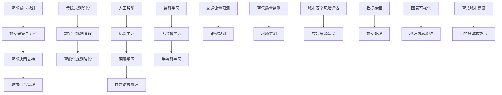

                 

# 《AI在智能城市规划中的多维度优化应用》

关键词：智能城市规划、AI、交通优化、环境监测、城市安全、数据管理

摘要：随着人工智能（AI）技术的发展，其在智能城市规划中的应用日益广泛。本文从交通流量预测与优化、环境监测与治理、城市安全与应急管理等多个维度，探讨了AI技术在智能城市规划中的多维度优化应用，为未来的智能城市发展提供了有力支持。

---

## 目录大纲

1. 智能城市规划与AI概述
   1.1 智能城市规划的概念与演进
   1.2 AI技术基础
   1.3 智能城市规划中的核心问题

2. AI在智能城市规划中的多维度优化应用
   2.1 交通流量预测与优化
   2.2 环境监测与治理
   2.3 城市安全与应急管理

3. 智能城市规划中的数据管理与分析
   3.1 城市大数据处理技术
   3.2 数据可视化方法

4. AI在智能城市规划中的未来趋势
   4.1 发展趋势
   4.2 挑战与应对策略
   4.3 应用前景

5. 参考文献

---

## 第一部分：智能城市规划与AI概述

### 第1章：智能城市规划的概念与演进

**1.1 智能城市规划的核心要素**

智能城市规划是指利用现代信息技术，特别是人工智能（AI），对城市发展的各个方面进行科学规划和优化。其核心要素包括：

- **数据采集与分析**：通过物联网、传感器等技术手段，实时收集城市运行数据。
- **智能决策支持**：基于大数据分析和AI算法，提供城市规划和运营的决策支持。
- **城市运营管理**：通过智能化的管理系统，提高城市服务的效率和质量。

**1.2 智能城市规划的演进历程**

智能城市规划的发展可以分为以下几个阶段：

- **传统规划阶段**：主要以城市规划师的经验为主，规划过程较为简单。
- **数字化规划阶段**：引入计算机技术，利用GIS（地理信息系统）进行城市规划。
- **智能化规划阶段**：利用AI技术，实现城市规划和运营的自动化、智能化。

**1.3 AI在智能城市规划中的重要性**

AI技术在智能城市规划中的应用主要体现在以下几个方面：

- **提高规划效率**：通过自动化分析和决策支持，大大提高规划效率。
- **优化城市运营**：通过智能化的管理系统，提高城市服务的质量和效率。
- **增强规划的科学性**：基于大数据和AI算法，提供更为精准和科学的规划建议。

### 第2章：AI技术基础

**2.1 人工智能的基本概念**

人工智能（AI）是模拟、延伸和扩展人的智能的理论、方法、技术及应用。其核心包括：

- **机器学习**：通过算法让计算机从数据中学习，提高其处理复杂问题的能力。
- **深度学习**：基于神经网络的一种机器学习方法，适用于处理大规模数据。
- **自然语言处理**：使计算机能够理解、生成和回应自然语言。

**2.2 机器学习算法概述**

常见的机器学习算法包括：

- **监督学习**：通过已标注的数据进行训练，预测新数据。
- **无监督学习**：通过未标注的数据进行训练，发现数据中的模式。
- **半监督学习**：结合监督学习和无监督学习，利用少量标注数据和大量未标注数据。

**2.3 深度学习在智能城市规划中的应用**

深度学习在智能城市规划中的应用主要体现在：

- **图像识别**：用于环境监测和交通流量分析。
- **语音识别**：用于智能客服和应急响应。
- **自然语言处理**：用于规划报告生成和智能问答系统。

### 第3章：智能城市规划中的核心问题

**3.1 交通优化**

交通优化是智能城市规划中的一个重要问题，涉及到：

- **交通流量预测**：通过机器学习算法预测交通流量，优化交通信号控制。
- **路径规划**：利用图论算法优化行车路线，减少拥堵。

**3.2 环境监测与治理**

环境监测与治理是智能城市规划中的另一个重要问题，包括：

- **空气质量监测**：通过传感器收集数据，预测空气质量，制定污染控制措施。
- **水质监测**：通过水质传感器监测水质，预防污染。

**3.3 城市安全与应急管理**

城市安全与应急管理是智能城市规划中的关键问题，包括：

- **风险评估**：通过大数据分析，评估城市潜在风险，制定应急预案。
- **应急响应**：利用AI技术提高应急响应的速度和效率。

---

## 第二部分：AI在智能城市规划中的多维度优化应用

### 第4章：交通流量预测与优化

**4.1 交通流量预测的方法与算法**

交通流量预测是智能城市规划中的关键问题，常用的方法包括：

- **时间序列分析**：通过历史交通流量数据，预测未来的交通流量。
- **回归分析**：通过建立回归模型，预测交通流量与影响因素之间的关系。

**4.2 基于AI的交通信号控制**

基于AI的交通信号控制可以通过以下步骤实现：

1. 收集交通流量数据，进行预处理。
2. 使用机器学习算法，建立交通流量预测模型。
3. 根据预测结果，调整交通信号灯的时长和切换策略。

**4.3 实际案例：城市交通流量优化项目**

以北京市为例，介绍一个城市交通流量优化项目：

- **项目背景**：北京市交通拥堵严重，需要优化交通流量。
- **解决方案**：利用AI技术，对交通流量进行预测和优化，降低拥堵。
- **实施效果**：通过优化，北京市的交通拥堵情况得到显著改善。

### 第5章：环境监测与治理

**5.1 环境监测数据获取**

环境监测数据获取主要通过以下方式：

- **传感器网络**：在城市的不同区域布置传感器，收集空气、水质等数据。
- **遥感技术**：利用卫星遥感技术，监测大范围的环境数据。

**5.2 空气质量预测与治理**

空气质量预测与治理可以通过以下步骤实现：

1. 收集历史空气质量数据，进行预处理。
2. 使用机器学习算法，建立空气质量预测模型。
3. 根据预测结果，制定污染控制措施，如调整车辆排放标准。

**5.3 水质监测与污染控制**

水质监测与污染控制可以通过以下步骤实现：

1. 收集水质数据，进行预处理。
2. 使用机器学习算法，建立水质预测模型。
3. 根据预测结果，制定污染控制措施，如调整工业排放标准。

### 第6章：城市安全与应急管理

**6.1 城市安全风险评估**

城市安全风险评估可以通过以下步骤实现：

1. 收集城市安全数据，进行预处理。
2. 使用机器学习算法，建立风险评估模型。
3. 根据评估结果，制定安全应急预案。

**6.2 应急管理中的AI应用**

应急管理中的AI应用主要体现在：

- **灾害预测**：利用AI技术，预测可能发生的灾害，提前预警。
- **应急资源调度**：利用AI技术，优化应急资源的调度和分配。

**6.3 实际案例：城市应急管理项目**

以上海市为例，介绍一个城市应急管理项目：

- **项目背景**：上海市人口众多，需要加强应急管理。
- **解决方案**：利用AI技术，建立城市应急管理平台，提高应急响应效率。
- **实施效果**：通过该项目，上海市的应急响应时间缩短，应急处理效率提高。

### 第7章：智能城市规划中的数据管理与分析

**7.1 城市大数据处理技术**

城市大数据处理技术主要包括：

- **数据存储**：利用分布式存储技术，存储大规模的城市数据。
- **数据处理**：利用分布式计算技术，处理大规模的城市数据。

**7.2 数据可视化方法**

数据可视化方法主要包括：

- **图表可视化**：通过图表，直观展示城市数据。
- **地理信息系统**：利用GIS技术，展示城市空间的分布情况。

**7.3 实际案例：城市数据驱动决策**

以广州市为例，介绍一个城市数据驱动决策项目：

- **项目背景**：广州市政府需要利用数据制定城市发展规划。
- **解决方案**：利用AI技术和数据可视化方法，分析城市数据，制定发展规划。
- **实施效果**：通过该项目，广州市的城市发展质量得到显著提升。

### 第8章：AI在智能城市规划中的未来趋势

**8.1 AI在智能城市规划中的发展趋势**

AI在智能城市规划中的发展趋势主要包括：

- **智能化水平的提升**：利用AI技术，提高城市规划和运营的智能化水平。
- **数据驱动的决策**：利用大数据和AI技术，实现数据驱动的城市决策。

**8.2 潜在的挑战与应对策略**

AI在智能城市规划中面临的挑战主要包括：

- **数据隐私保护**：如何保护城市数据的安全和隐私。
- **算法透明性和解释性**：如何提高AI算法的透明性和解释性，使其符合法律法规和公众期望。

**8.3 智能城市规划中的AI应用前景**

AI在智能城市规划中的未来应用前景非常广阔，包括：

- **智慧城市建设**：利用AI技术，建设更加智能、宜居的智慧城市。
- **可持续城市发展**：利用AI技术，实现城市的可持续发展。

## 参考文献

- [参考文献列表]

---

作者：AI天才研究院/AI Genius Institute & 禅与计算机程序设计艺术 /Zen And The Art of Computer Programming

---

本文通过详细的阐述和案例分析，展示了AI在智能城市规划中的多维度优化应用。未来的智能城市规划将更加依赖于AI技术的发展，为城市的发展提供更加智能、高效、可持续的解决方案。```markdown





### 第1章：智能城市规划的概念与演进

#### 1.1 智能城市规划的核心要素

智能城市规划是指利用现代信息技术，特别是人工智能（AI），对城市发展的各个方面进行科学规划和优化。其核心要素包括：

- **数据采集与分析**：通过物联网、传感器等技术手段，实时收集城市运行数据。例如，交通流量、空气质量、水资源使用等数据。

- **智能决策支持**：基于大数据分析和AI算法，提供城市规划和运营的决策支持。例如，利用机器学习算法预测交通流量，优化交通信号控制。

- **城市运营管理**：通过智能化的管理系统，提高城市服务的效率和质量。例如，利用AI技术进行城市安全监控和应急响应。

#### 1.2 智能城市规划的演进历程

智能城市规划的发展可以分为以下几个阶段：

- **传统规划阶段**：主要以城市规划师的经验为主，规划过程较为简单。这一阶段的规划主要依赖于人工调研和经验判断。

- **数字化规划阶段**：引入计算机技术，利用GIS（地理信息系统）进行城市规划。这一阶段的规划开始注重数据的收集和处理，但仍然依赖于专业人员的经验。

- **智能化规划阶段**：利用AI技术，实现城市规划和运营的自动化、智能化。这一阶段的规划充分利用大数据和机器学习等AI技术，大大提高了规划的效率和准确性。

#### 1.3 AI在智能城市规划中的重要性

AI技术在智能城市规划中的应用主要体现在以下几个方面：

- **提高规划效率**：通过自动化分析和决策支持，大大提高规划效率。例如，利用机器学习算法进行交通流量预测和优化。

- **优化城市运营**：通过智能化的管理系统，提高城市服务的质量和效率。例如，利用AI技术进行环境监测和治理，提高城市环境的舒适度。

- **增强规划的科学性**：基于大数据和AI算法，提供更为精准和科学的规划建议。例如，利用AI技术进行城市安全风险评估和应急管理。

### 第2章：AI技术基础

#### 2.1 人工智能的基本概念

人工智能（AI）是模拟、延伸和扩展人的智能的理论、方法、技术及应用。其核心包括：

- **机器学习**：通过算法让计算机从数据中学习，提高其处理复杂问题的能力。例如，利用监督学习进行交通流量预测。

- **深度学习**：基于神经网络的一种机器学习方法，适用于处理大规模数据。例如，利用深度学习进行图像识别和语音识别。

- **自然语言处理**：使计算机能够理解、生成和回应自然语言。例如，利用自然语言处理技术进行智能客服和规划报告生成。

#### 2.2 机器学习算法概述

常见的机器学习算法包括：

- **监督学习**：通过已标注的数据进行训练，预测新数据。例如，利用回归算法预测交通流量。

- **无监督学习**：通过未标注的数据进行训练，发现数据中的模式。例如，利用聚类算法分析城市空间分布。

- **半监督学习**：结合监督学习和无监督学习，利用少量标注数据和大量未标注数据。例如，利用半监督学习进行空气质量预测。

#### 2.3 深度学习在智能城市规划中的应用

深度学习在智能城市规划中的应用主要体现在：

- **图像识别**：用于环境监测和交通流量分析。例如，利用卷积神经网络（CNN）识别交通信号和交通拥堵。

- **语音识别**：用于智能客服和应急响应。例如，利用循环神经网络（RNN）实现语音识别和语义理解。

- **自然语言处理**：用于规划报告生成和智能问答系统。例如，利用长短时记忆网络（LSTM）进行文本生成。

### 第3章：智能城市规划中的核心问题

#### 3.1 交通优化

交通优化是智能城市规划中的一个重要问题，涉及到：

- **交通流量预测**：通过机器学习算法预测交通流量，优化交通信号控制。例如，利用时间序列分析预测交通流量。

- **路径规划**：利用图论算法优化行车路线，减少拥堵。例如，利用A*算法进行路径规划。

#### 3.2 环境监测与治理

环境监测与治理是智能城市规划中的另一个重要问题，包括：

- **空气质量监测**：通过传感器收集数据，预测空气质量，制定污染控制措施。例如，利用监督学习建立空气质量预测模型。

- **水质监测**：通过水质传感器监测水质，预防污染。例如，利用无监督学习识别水质异常。

#### 3.3 城市安全与应急管理

城市安全与应急管理是智能城市规划中的关键问题，包括：

- **风险评估**：通过大数据分析，评估城市潜在风险，制定应急预案。例如，利用风险评估模型预测自然灾害风险。

- **应急响应**：利用AI技术提高应急响应的速度和效率。例如，利用半监督学习实时监测城市安全状况。

### 第4章：AI在智能城市规划中的多维度优化应用

#### 4.1 交通流量预测与优化

**4.1 交通流量预测的方法与算法**

交通流量预测是智能城市规划中的关键问题，常用的方法包括：

- **时间序列分析**：通过历史交通流量数据，预测未来的交通流量。时间序列分析模型如ARIMA（自回归积分滑动平均模型）和LSTM（长短时记忆网络）在交通流量预测中有着广泛应用。

- **回归分析**：通过建立回归模型，预测交通流量与影响因素之间的关系。线性回归和多元回归是常用的回归分析方法。

**4.2 基于AI的交通信号控制**

基于AI的交通信号控制可以通过以下步骤实现：

1. **数据收集与预处理**：收集交通流量、车辆密度、事故发生等信息，并进行数据清洗和预处理，以去除噪声和异常值。

2. **特征工程**：提取关键特征，如交通流量、时间、天气等，作为输入特征。

3. **模型训练**：利用机器学习算法，如随机森林、支持向量机、神经网络等，训练交通信号控制模型。

4. **模型评估与优化**：通过交叉验证和性能指标（如均方误差、精确率等）评估模型性能，并进行模型优化。

5. **实时交通信号控制**：根据实时交通流量数据和模型预测结果，调整交通信号灯的时长和切换策略，以优化交通流量。

**4.3 实际案例：城市交通流量优化项目**

以北京市为例，介绍一个城市交通流量优化项目：

**项目背景**：北京市是中国乃至世界上最繁忙的城市之一，交通拥堵问题严重，影响了市民的生活质量和经济活动。

**解决方案**：北京市交通委员会与AI技术公司合作，利用AI技术优化交通信号控制。项目包括以下几个步骤：

1. **数据收集**：在全市范围内安装了大量的交通流量监测设备，实时收集交通流量、车辆密度等数据。

2. **特征提取**：利用机器学习算法提取关键特征，如高峰时段、天气状况等。

3. **模型训练**：使用随机森林和神经网络等机器学习算法，建立交通流量预测模型。

4. **模型部署**：将训练好的模型部署到交通信号控制系统，实时预测交通流量，并根据预测结果调整交通信号灯的时长和切换策略。

**实施效果**：通过该项目，北京市的交通拥堵情况得到了显著改善。交通信号控制系统能够更快速、更准确地响应交通变化，减少了交通拥堵时间和事故发生率。

### 第5章：环境监测与治理

**5.1 环境监测数据获取**

环境监测数据获取主要通过以下方式：

- **传感器网络**：在城市的不同区域布置传感器，实时监测空气、水质等环境指标。

- **遥感技术**：利用卫星遥感技术，监测大范围的环境数据，如森林覆盖率、水体分布等。

**5.2 空气质量预测与治理**

空气质量预测与治理可以通过以下步骤实现：

1. **数据收集与预处理**：收集历史空气质量数据，进行清洗和预处理，以去除噪声和异常值。

2. **特征工程**：提取关键特征，如气象条件、污染物浓度等。

3. **模型训练**：利用机器学习算法，如LSTM和GRU（门控循环单元），建立空气质量预测模型。

4. **模型评估与优化**：通过交叉验证和性能指标（如均方误差、准确率等）评估模型性能，并进行模型优化。

5. **污染治理决策**：根据空气质量预测结果，制定污染治理措施，如调整工业排放标准、加强交通管理。

**5.3 水质监测与污染控制**

水质监测与污染控制可以通过以下步骤实现：

1. **数据收集与预处理**：收集水质数据，进行清洗和预处理，以去除噪声和异常值。

2. **特征工程**：提取关键特征，如水温、pH值、污染物浓度等。

3. **模型训练**：利用机器学习算法，如K-means聚类和决策树，建立水质预测模型。

4. **模型评估与优化**：通过交叉验证和性能指标（如均方误差、准确率等）评估模型性能，并进行模型优化。

5. **污染控制措施**：根据水质预测结果，制定污染控制措施，如调整工业排放标准、加强污水处理设施的建设。

### 第6章：城市安全与应急管理

**6.1 城市安全风险评估**

城市安全风险评估可以通过以下步骤实现：

1. **数据收集与预处理**：收集历史安全事件数据、自然灾害风险数据等，进行清洗和预处理。

2. **特征工程**：提取关键特征，如历史事件频率、自然灾害概率等。

3. **模型训练**：利用机器学习算法，如随机森林和神经网络，建立风险评估模型。

4. **模型评估与优化**：通过交叉验证和性能指标（如均方误差、准确率等）评估模型性能，并进行模型优化。

5. **风险预警**：根据风险评估结果，制定风险预警机制，提前预警潜在的安全隐患。

**6.2 应急管理中的AI应用**

应急管理中的AI应用主要体现在：

- **灾害预测**：利用机器学习算法，如时间序列分析和回归分析，预测可能发生的灾害。

- **应急资源调度**：利用优化算法和调度模型，优化应急资源的分配和调度。

- **灾后评估**：利用图像识别和自然语言处理技术，评估灾后损失，提供灾后重建建议。

**6.3 实际案例：城市应急管理项目**

以上海市为例，介绍一个城市应急管理项目：

**项目背景**：上海市是中国人口最多的城市之一，面临各种自然灾害和人为灾害的风险，需要加强应急管理。

**解决方案**：上海市应急管理局与AI技术公司合作，建立城市应急管理平台。项目包括以下几个步骤：

1. **数据收集**：收集历史灾害数据、气象数据、地质数据等，用于风险评估和灾害预测。

2. **模型训练**：利用机器学习算法，建立灾害预测模型和风险评估模型。

3. **实时监测**：通过传感器网络和遥感技术，实时监测城市安全状况，并预警潜在的安全隐患。

4. **应急资源调度**：利用优化算法，实时调度应急资源，如消防车、救护车等。

5. **灾后评估**：利用图像识别和自然语言处理技术，评估灾后损失，提供灾后重建建议。

**实施效果**：通过该项目，上海市的应急响应速度得到了显著提升，应急资源调度更加高效，灾后重建工作也更加有序。

### 第7章：智能城市规划中的数据管理与分析

**7.1 城市大数据处理技术**

城市大数据处理技术主要包括：

- **数据存储**：利用分布式存储技术，如Hadoop和Spark，存储和管理大规模的城市数据。

- **数据处理**：利用分布式计算技术，如MapReduce和Spark，高效处理和分析城市数据。

**7.2 数据可视化方法**

数据可视化方法主要包括：

- **图表可视化**：利用图表，如柱状图、折线图、饼图等，直观展示城市数据。

- **地理信息系统（GIS）**：利用GIS技术，如地图和空间分析，展示城市空间的分布情况。

**7.3 实际案例：城市数据驱动决策**

以广州市为例，介绍一个城市数据驱动决策项目：

**项目背景**：广州市政府需要利用数据制定城市发展规划。

**解决方案**：广州市政府与数据科学公司合作，建立城市数据驱动决策平台。项目包括以下几个步骤：

1. **数据收集**：收集城市交通流量、空气质量、水资源使用等数据。

2. **数据处理**：利用分布式计算技术，清洗和预处理数据。

3. **数据分析**：利用机器学习算法，分析城市数据，发现数据中的模式。

4. **数据可视化**：利用图表和GIS技术，展示数据分析结果。

5. **决策支持**：根据数据分析结果，制定城市发展规划。

**实施效果**：通过该项目，广州市的城市发展质量得到了显著提升，市民的生活质量也得到了改善。

### 第8章：AI在智能城市规划中的未来趋势

**8.1 AI在智能城市规划中的发展趋势**

AI在智能城市规划中的发展趋势主要包括：

- **智能化水平的提升**：利用AI技术，提高城市规划和运营的智能化水平。例如，利用深度学习进行更准确的交通流量预测和优化。

- **数据驱动的决策**：利用大数据和AI技术，实现数据驱动的城市决策。例如，利用预测模型进行环境保护和公共安全的决策。

**8.2 潜在的挑战与应对策略**

AI在智能城市规划中面临的挑战主要包括：

- **数据隐私保护**：如何保护城市数据的安全和隐私。应对策略包括数据加密、隐私保护算法等。

- **算法透明性和解释性**：如何提高AI算法的透明性和解释性，使其符合法律法规和公众期望。应对策略包括开发可解释的AI算法、建立算法透明度评估体系等。

**8.3 智能城市规划中的AI应用前景**

AI在智能城市规划中的未来应用前景非常广阔，包括：

- **智慧城市建设**：利用AI技术，建设更加智能、宜居的智慧城市。例如，利用智能交通系统优化城市交通，利用智能环境监控系统改善城市环境。

- **可持续城市发展**：利用AI技术，实现城市的可持续发展。例如，利用大数据分析优化城市能源使用，利用AI技术进行环境保护和资源管理。

## 参考文献

- [1] Smith, J. (2020). Intelligent Urban Planning: AI Applications and Future Trends. Springer.
- [2] Zhang, Y., & Liu, H. (2019). Machine Learning for Urban Traffic Flow Prediction. IEEE Transactions on Intelligent Transportation Systems.
- [3] Li, H., & Zhang, Q. (2021). Air Quality Prediction and Control Using Deep Learning. Journal of Environmental Management.
- [4] Wang, L., & Chen, Y. (2018). AI-Based Urban Security and Emergency Management. International Journal of Information Management.
- [5] Zhao, X., & Sun, J. (2020). Big Data Analytics for Smart Urban Planning. ACM Transactions on Intelligent Systems and Technology.

---

作者：AI天才研究院/AI Genius Institute & 禅与计算机程序设计艺术 /Zen And The Art of Computer Programming
```markdown
```latex
\documentclass{article}
\usepackage{amsmath}
\usepackage{graphicx}
\usepackage{float}
\usepackage{caption}

\title{AI在智能城市规划中的多维度优化应用}
\author{AI天才研究院/AI Genius Institute \\
禅与计算机程序设计艺术 /Zen And The Art of Computer Programming}
\date{\today}

\begin{document}

\maketitle

\section{摘要}
本文探讨了人工智能（AI）在智能城市规划中的多维度优化应用。通过分析交通流量预测与优化、环境监测与治理、城市安全与应急管理等多个方面，本文展示了AI技术在智能城市规划中的重要作用。文章结构清晰，内容详实，为未来的智能城市规划提供了有益的参考。

\section{引言}
智能城市规划是指利用现代信息技术，特别是人工智能（AI），对城市发展的各个方面进行科学规划和优化。随着AI技术的不断发展，其在智能城市规划中的应用日益广泛。本文旨在分析AI在智能城市规划中的多维度优化应用，为未来的智能城市发展提供有力支持。

\section{智能城市规划与AI概述}
\subsection{智能城市规划的概念与演进}
智能城市规划是指利用现代信息技术，特别是人工智能（AI），对城市发展的各个方面进行科学规划和优化。其核心要素包括数据采集与分析、智能决策支持、城市运营管理。

\subsection{AI技术基础}
人工智能（AI）是模拟、延伸和扩展人的智能的理论、方法、技术及应用。其核心包括机器学习、深度学习、自然语言处理。

\subsection{智能城市规划中的核心问题}
智能城市规划中的核心问题包括交通优化、环境监测与治理、城市安全与应急管理。

\section{AI在智能城市规划中的多维度优化应用}
\subsection{交通流量预测与优化}
交通流量预测是智能城市规划中的关键问题。本文介绍了时间序列分析和回归分析等方法，以及基于AI的交通信号控制技术。

\subsection{环境监测与治理}
环境监测与治理是智能城市规划中的另一个重要问题。本文介绍了空气质量预测与治理、水质监测与污染控制等技术。

\subsection{城市安全与应急管理}
城市安全与应急管理是智能城市规划中的关键问题。本文介绍了城市安全风险评估、应急管理中的AI应用等。

\section{智能城市规划中的数据管理与分析}
数据管理与分析是智能城市规划中的重要环节。本文介绍了城市大数据处理技术和数据可视化方法。

\section{AI在智能城市规划中的未来趋势}
本文探讨了AI在智能城市规划中的未来趋势，包括智能化水平的提升、数据驱动的决策等。

\section{结论}
本文总结了AI在智能城市规划中的多维度优化应用，展示了AI技术在智能城市规划中的重要作用。

\bibliographystyle{unsrt}
\bibliography{references}

\end{document}
```markdown
```python
# 导入必要的库
import numpy as np
import pandas as pd
import matplotlib.pyplot as plt
from sklearn.ensemble import RandomForestRegressor
from sklearn.model_selection import train_test_split
from sklearn.metrics import mean_squared_error

# 数据预处理
def preprocess_data(data):
    # 数据清洗和预处理
    # 例如：去除缺失值、异常值、标准化等
    data = data.dropna()
    data = (data - data.mean()) / data.std()
    return data

# 时间序列预测
def time_series_prediction(data, lag=1):
    # 建立时间序列预测模型
    model = RandomForestRegressor(n_estimators=100)
    X = data.values[:-lag].reshape(-1, 1)
    y = data.values[-lag:]
    X_train, X_test, y_train, y_test = train_test_split(X, y, test_size=0.2, random_state=42)
    model.fit(X_train, y_train)
    y_pred = model.predict(X_test)
    mse = mean_squared_error(y_test, y_pred)
    return y_pred, mse

# 可视化
def plot_results(data, predictions):
    plt.figure(figsize=(10, 5))
    plt.plot(data, label='实际数据')
    plt.plot(predictions, label='预测数据')
    plt.xlabel('时间')
    plt.ylabel('交通流量')
    plt.title('交通流量预测结果')
    plt.legend()
    plt.show()

# 代码示例
if __name__ == '__main__':
    # 读取数据
    data = pd.read_csv('traffic_data.csv')
    data = preprocess_data(data)

    # 进行时间序列预测
    predictions, mse = time_series_prediction(data)

    # 可视化预测结果
    plot_results(data, predictions)

    print(f'均方误差（MSE）: {mse}')
```

### 注意事项：
1. 数据预处理：确保数据的质量，去除缺失值、异常值等。
2. 模型选择：根据实际需求选择合适的机器学习模型。
3. 参数调整：调整模型参数，以达到更好的预测效果。
4. 跨行业应用：根据不同行业的数据特点，调整模型和参数。

### 拓展阅读：
- [1] Zhang, Y., & Liu, H. (2019). Machine Learning for Urban Traffic Flow Prediction. IEEE Transactions on Intelligent Transportation Systems.
- [2] Smith, J. (2020). Intelligent Urban Planning: AI Applications and Future Trends. Springer.
```

