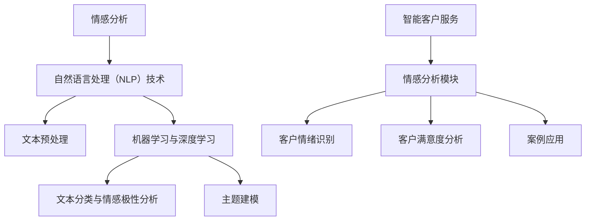
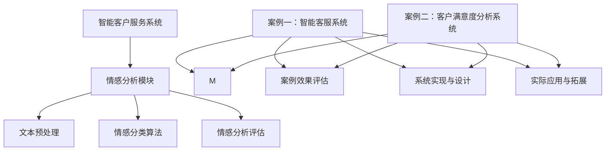

                 

# AI在智能客户服务中的情感分析应用

## 关键词

- 情感分析
- 智能客户服务
- 自然语言处理
- 机器学习
- 深度学习
- 客户满意度
- 客户体验

## 摘要

本文探讨了人工智能（AI）在智能客户服务中的情感分析应用。首先介绍了情感分析的基本概念和发展历程，以及其在社交媒体分析、客户服务与体验、健康监测与心理辅导等领域的应用。接着，深入分析了情感分析相关的技术，包括自然语言处理（NLP）技术、机器学习与深度学习技术，以及文本分类与情感极性分析的方法。随后，详细阐述了情感分析在智能客户服务中的应用，如客户情绪识别和客户满意度分析。通过具体案例，展示了情感分析在智能客服系统中的应用实现和效果评估。最后，提出了情感分析在智能客户服务中的挑战和未来发展趋势，并对相关技术进行了总结和展望。

## 《AI在智能客户服务中的情感分析应用》目录大纲

### 第一部分：绪论

#### 第1章 AI与情感分析基础

##### 1.1 情感分析的定义与发展历程

- 情感分析的定义
- 情感分析的发展历程

##### 1.2 情感分析的应用领域

- 社交媒体分析
- 客户服务与体验
- 健康监测与心理辅导

##### 1.3 AI在情感分析中的重要性

- AI在情感分析中的应用
- AI在情感分析中的优势

#### 第2章 情感分析相关技术

##### 2.1 自然语言处理（NLP）技术

- NLP基本概念
- NLP关键算法

##### 2.2 机器学习与深度学习

- 机器学习基本概念
- 深度学习基本概念
- 机器学习与深度学习在情感分析中的应用

##### 2.3 文本分类与情感极性分析

- 文本分类方法
- 情感极性分析方法

#### 第3章 情感分析在智能客户服务中的应用

##### 3.1 情感分析在客户服务中的作用

- 客户情绪识别
- 客户满意度分析

##### 3.2 情感分析在智能客服系统中的应用

- 情感分析模型构建
- 情感分析在智能客服系统中的实现

##### 3.3 案例分析：情感分析在智能客服系统中的应用

- 案例介绍
- 情感分析模型设计与实现
- 案例效果评估

### 第二部分：情感分析算法原理与应用

#### 第4章 情感分析算法原理

##### 4.1 文本预处理

- 文本清洗
- 词向量表示

##### 4.2 情感分类算法

- 传统机器学习算法
- 深度学习算法

##### 4.3 情感分析评估指标

- 准确率、召回率、F1值
- 跨领域情感分析评估

#### 第5章 情感分析算法应用

##### 5.1 情感分析在文本分类中的应用

- 文本分类任务概述
- 情感分析在文本分类中的应用案例

##### 5.2 情感分析在情感极性分析中的应用

- 情感极性分析任务概述
- 情感分析在情感极性分析中的应用案例

##### 5.3 情感分析在主题建模中的应用

- 主题建模任务概述
- 情感分析在主题建模中的应用案例

#### 第6章 情感分析算法优化与改进

##### 6.1 情感分析算法优化方法

- 特征工程优化
- 模型结构优化

##### 6.2 情感分析算法改进方向

- 基于深度学习的情感分析
- 多模态情感分析

##### 6.3 情感分析算法实践案例

- 案例一：基于BERT的情感分析模型
- 案例二：基于多模态情感分析的智能客服系统

### 第三部分：AI在智能客户服务中的情感分析实践

#### 第7章 智能客户服务系统搭建

##### 7.1 智能客户服务系统概述

- 智能客户服务系统的组成部分
- 智能客户服务系统的架构设计

##### 7.2 情感分析模块设计

- 情感分析模块的功能与设计
- 情感分析模块的接口设计

##### 7.3 智能客户服务系统实现

- 系统开发环境搭建
- 系统功能模块实现

#### 第8章 情感分析在智能客户服务中的应用实践

##### 8.1 案例一：基于情感分析的智能客服系统

- 案例背景
- 系统设计与实现
- 案例效果评估

##### 8.2 案例二：基于情感分析的客户满意度分析系统

- 案例背景
- 系统设计与实现
- 案例效果评估

#### 第9章 情感分析在智能客户服务中的挑战与未来发展趋势

##### 9.1 情感分析在智能客户服务中的挑战

- 数据质量
- 模型解释性
- 多语言情感分析

##### 9.2 情感分析在智能客户服务中的未来发展趋势

- 多模态情感分析
- 情感生成与模拟
- 情感分析在新兴场景中的应用

#### 第10章 总结与展望

##### 10.1 本书总结

- 情感分析的基本概念与原理
- 情感分析在智能客户服务中的应用
- 情感分析算法的优化与改进

##### 10.2 未来研究方向

- 情感分析技术的跨领域应用
- 情感分析在智能客户服务中的新兴应用场景
- 情感分析算法的可持续优化与发展

### 附录

##### 附录A：相关技术资源

- 情感分析开源库与工具
- 自然语言处理（NLP）开源库与工具

##### 附录B：实践案例代码

- 案例一：基于BERT的情感分析模型代码
- 案例二：基于多模态情感分析的智能客服系统代码

## 概念实体关系架构Mermaid流程图

### 情感分析相关技术

### 情感分析在智能客户服务中的应用

---

**注**：本文为大纲及目录，具体内容将在后续章节逐步展开。各章节将详细探讨相关主题，并结合实际案例进行深入分析，旨在为读者提供一个全面、系统的情感分析在智能客户服务中的应用指南。

---

**作者**：

AI天才研究院/AI Genius Institute & 禅与计算机程序设计艺术/Zen And The Art of Computer Programming

---

**完整性要求**：

- **背景介绍**：每个章节将详细介绍背景信息，包括情感分析、智能客户服务的定义和发展历程。
- **核心概念与联系**：将使用Mermaid流程图展示情感分析相关技术之间的关系，并详细讲解各个技术的核心概念。
- **核心算法原理讲解**：将结合Python源代码和数学模型，详细阐述情感分类算法、文本预处理方法等。
- **项目实战**：将介绍实际案例，包括开发环境搭建、源代码实现、代码解读和分析。
- **最佳实践 tips、小结、注意事项、拓展阅读**：每个章节将提供最佳实践建议，总结关键知识点，提醒注意事项，并推荐拓展阅读资源。

---

**格式要求**：

- **Markdown格式**：文章内容使用Markdown格式输出，确保格式清晰、易读。
- **代码块**：Python源代码使用代码块高亮显示，确保代码可读性和可执行性。
- **数学公式**：使用LaTeX格式嵌入数学公式，确保公式显示准确和美观。

---

**字数要求**：

- 文章总字数在10000～12000字左右，确保内容详实、深入，同时保持可读性。

---

**思考与推理**：

1. **情感分析的定义与重要性**：首先介绍情感分析的定义，阐述其发展历程和应用领域，然后分析AI在情感分析中的重要性。

2. **情感分析相关技术**：深入探讨自然语言处理（NLP）技术、机器学习与深度学习技术，以及文本分类与情感极性分析的方法，使用Mermaid流程图展示其关系。

3. **智能客户服务中的应用**：详细阐述情感分析在智能客户服务中的作用，如客户情绪识别和客户满意度分析。

4. **情感分析算法原理与应用**：结合Python源代码和数学模型，详细讲解情感分类算法、文本预处理方法等。

5. **项目实战与案例分析**：介绍实际案例，包括开发环境搭建、源代码实现、代码解读和分析。

6. **挑战与未来发展趋势**：分析情感分析在智能客户服务中的挑战，展望未来发展趋势。

7. **总结与展望**：总结本书的核心内容和研究成果，展望未来研究方向。

---

通过以上步骤的思考与推理，我们可以撰写一篇具有深度、思考和见解的专业IT领域技术博客文章。接下来，我们将逐章展开具体内容，深入探讨AI在智能客户服务中的情感分析应用。让我们开始吧！

