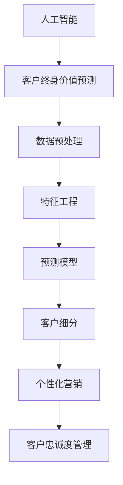
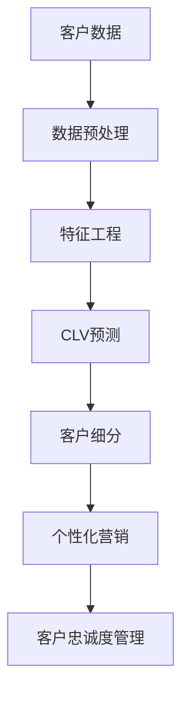

                 

### AI在智能客户终身价值预测与管理中的应用

> 关键词：人工智能，客户终身价值（CLV），机器学习，数据预处理，特征工程，预测模型

> 摘要：本文将探讨人工智能在智能客户终身价值预测与管理中的应用。首先介绍人工智能与机器学习的基础知识，然后详细阐述数据预处理和特征工程的重要性，接着介绍计算客户终身价值的方法。随后，本文将深入探讨各种机器学习算法在客户终身价值预测中的应用，包括时间序列分析、决策树与随机森林、神经网络与深度学习以及集成学习方法。最后，文章将讨论如何利用AI进行客户细分、个性化营销策略设计以及客户忠诚度管理，并通过案例研究来展示AI在实际应用中的效果。

## 目录

### 第一部分：AI概述与理论基础

#### 第1章：人工智能与机器学习基础
- 1.1 人工智能的发展历程
- 1.2 机器学习的基本概念
- 1.3 机器学习的分类
- 1.4 机器学习算法简介

#### 第2章：数据预处理与特征工程
- 2.1 数据预处理方法
- 2.2 特征工程的重要性
- 2.3 常见特征工程技术
- 2.4 特征选择方法

#### 第3章：客户终身价值（CLV）的概念与计算方法
- 3.1 客户终身价值的定义
- 3.2 计算CLV的常用方法
- 3.3 CLV在营销中的应用

### 第二部分：AI在智能客户终身价值预测中的应用

#### 第4章：时间序列分析在CLV预测中的应用
- 4.1 时间序列分析基础
- 4.2 ARIMA模型
- 4.3 季节性分解
- 4.4 时间序列预测在CLV预测中的应用

#### 第5章：决策树与随机森林在CLV预测中的应用
- 5.1 决策树算法原理
- 5.2 随机森林算法原理
- 5.3 决策树与随机森林在CLV预测中的应用

#### 第6章：神经网络与深度学习在CLV预测中的应用
- 6.1 神经网络基础
- 6.2 卷积神经网络（CNN）
- 6.3 循环神经网络（RNN）
- 6.4 深度学习在CLV预测中的应用

#### 第7章：集成学习方法在CLV预测中的应用
- 7.1 集成学习方法概述
- 7.2 Boosting方法
- 7.3 Bagging方法
- 7.4 集成学习方法在CLV预测中的应用

### 第三部分：AI在智能客户终身价值管理中的应用

#### 第8章：基于AI的客户细分策略
- 8.1 客户细分的重要性
- 8.2 客户细分的方法
- 8.3 基于AI的客户细分策略

#### 第9章：个性化营销策略设计
- 9.1 个性化营销的概念
- 9.2 个性化营销的方法
- 9.3 基于AI的个性化营销策略设计

#### 第10章：AI在客户忠诚度管理中的应用
- 10.1 客户忠诚度的概念
- 10.2 客户忠诚度管理的方法
- 10.3 基于AI的客户忠诚度管理策略

#### 第11章：案例研究
- 11.1 案例背景介绍
- 11.2 数据采集与处理
- 11.3 模型选择与训练
- 11.4 模型评估与优化
- 11.5 案例总结与启示

### 第四部分：总结与展望

#### 第12章：AI在智能客户终身价值预测与管理中的应用总结
- 12.1 主要成果回顾
- 12.2 存在的挑战与问题
- 12.3 未来发展趋势展望

#### 第13章：展望
- 13.1 AI在商业领域的进一步应用
- 13.2 面临的伦理与法律问题
- 13.3 未来研究方向

## 附录

### 附录A：Python数据科学工具库
- A.1 NumPy
- A.2 Pandas
- A.3 Matplotlib
- A.4 Scikit-learn
- A.5 TensorFlow
- A.6 PyTorch

### Mermaid 流程图：核心概念与联系

### 第一部分：AI概述与理论基础

#### 第1章：人工智能与机器学习基础

##### 1.1 人工智能的发展历程

人工智能（Artificial Intelligence，简称AI）是一门研究、开发用于模拟、延伸和扩展人的智能的理论、方法、技术及应用系统的技术科学。人工智能的研究始于20世纪50年代，当时的主要目标是创建能够执行复杂任务的智能代理。

- **1956年：达特茅斯会议**  
    人工智能的概念首次在达特茅斯会议上提出，会议参与者们讨论了人工智能的可能性、局限性和目标。

- **1970年代：人工智能的黄金时代**  
    这一时期，人工智能领域取得了显著进展，专家系统和机器学习开始成为研究热点。

- **1980年代：人工智能的低谷**  
    由于实际应用效果不如预期，人工智能领域经历了“寒冬”。

- **1990年代：互联网时代**  
    互联网的发展为人工智能的应用提供了新的契机，搜索引擎、推荐系统等开始兴起。

- **2000年代：深度学习兴起**  
    深度学习技术的突破使人工智能在图像识别、语音识别等领域取得了巨大成功。

- **2010年代：人工智能的应用爆发**  
    人工智能在自动驾驶、自然语言处理、机器人等领域取得了重大突破。

##### 1.2 机器学习的基本概念

机器学习（Machine Learning，简称ML）是人工智能的一个分支，它通过数据驱动的方法，让计算机系统从数据中学习并做出决策或预测。机器学习主要分为监督学习、无监督学习和强化学习三类。

- **监督学习**：通过已有的标注数据来训练模型，然后使用该模型进行预测。

- **无监督学习**：没有标注数据，通过模型自身学习数据中的结构或模式。

- **强化学习**：通过与环境交互，不断调整策略，以最大化累积奖励。

##### 1.3 机器学习的分类

机器学习可以分为以下几类：

- **线性模型**：如线性回归、逻辑回归等。

- **树模型**：如决策树、随机森林等。

- **集成方法**：如Adaboost、Bagging等。

- **神经网络**：如深度神经网络、卷积神经网络、循环神经网络等。

- **聚类算法**：如K-均值、层次聚类等。

- **降维技术**：如主成分分析、t-SNE等。

##### 1.4 机器学习算法简介

以下是几种常见的机器学习算法及其基本原理：

- **线性回归**：通过最小化预测值与真实值之间的误差，拟合出一条直线。

- **逻辑回归**：用于分类问题，通过最小化损失函数，拟合出一条将数据分为不同类别的曲线。

- **决策树**：通过递归划分数据集，将特征空间划分为多个子空间，每个子空间对应一个类别。

- **随机森林**：通过集成多个决策树来提高预测性能。

- **神经网络**：通过多层非线性变换，拟合复杂的数据关系。

- **支持向量机**：通过寻找最优分隔超平面，将数据分为不同类别。

### 第2章：数据预处理与特征工程

##### 2.1 数据预处理方法

数据预处理是机器学习项目中的关键步骤，它包括数据清洗、数据归一化、数据标准化等。

- **数据清洗**：去除错误数据、缺失值填充、异常值处理等。

- **数据归一化**：将数据缩放到相同的范围，如[0, 1]或[-1, 1]。

- **数据标准化**：根据数据的平均数和标准差进行缩放，使得数据具有单位方差和单位均值。

##### 2.2 特征工程的重要性

特征工程是机器学习项目中至关重要的一步，它通过选择和构造合适的特征，可以提高模型的预测性能。

- **特征选择**：从原始特征中挑选出对模型有用的特征。

- **特征构造**：通过组合原始特征，构造新的特征。

- **特征重要性评估**：评估每个特征对模型预测的影响程度。

##### 2.3 常见特征工程技术

以下是几种常见的特征工程技术：

- **特征变换**：如Log变换、Box-Cox变换等。

- **特征融合**：将不同来源的特征进行组合。

- **特征稀疏化**：如L1正则化、Lasso等。

- **特征提取**：如主成分分析（PCA）、t-SNE等。

##### 2.4 特征选择方法

特征选择是特征工程中的重要环节，以下是一些常见的特征选择方法：

- **过滤法**：基于统计方法评估特征的重要性，然后选择重要的特征。

- **包裹法**：通过迭代搜索最佳特征组合。

- **嵌入式方法**：在模型训练过程中进行特征选择。

### 第3章：客户终身价值（CLV）的概念与计算方法

##### 3.1 客户终身价值的定义

客户终身价值（Customer Lifetime Value，简称CLV）是指一个客户在其与企业的整个关系周期内为企业带来的总价值。CLV是市场营销中的重要指标，可以帮助企业了解哪些客户更有价值，并据此制定相应的营销策略。

##### 3.2 计算CLV的常用方法

计算CLV的方法有很多，以下是几种常见的方法：

- **历史数据法**：基于客户的过去行为数据，如购买次数、购买金额、购买频率等来计算CLV。

  $$ CLV = \sum_{t=1}^{T} (P_t \times F_t) \times (1 + r)^{-t} $$
  
  其中，$P_t$表示客户在t时间点的购买金额，$F_t$表示客户在t时间点的购买频率，$r$表示贴现率。

- **时间序列法**：基于客户的购买时间序列数据，如使用ARIMA模型等进行预测。

- **机器学习法**：通过机器学习算法，如随机森林、神经网络等，预测客户的终身价值。

##### 3.3 CLV在营销中的应用

CLV在营销中的应用主要体现在以下几个方面：

- **客户细分**：根据CLV的不同，将客户分为高价值客户、中价值客户和低价值客户，针对不同类型的客户制定不同的营销策略。

- **客户保留策略**：针对高价值客户，制定更优惠的保留策略，以提高客户的忠诚度。

- **营销预算分配**：根据CLV，合理分配营销预算，将更多的资源投入到高价值客户身上。

### 第二部分：AI在智能客户终身价值预测中的应用

#### 第4章：时间序列分析在CLV预测中的应用

##### 4.1 时间序列分析基础

时间序列分析是统计学中用于分析时间序列数据的方法，旨在理解和预测数据的未来趋势。时间序列数据通常具有以下几个特点：

- **序列性**：数据按照时间顺序排列。

- **平稳性**：数据的统计特性（如均值、方差等）不随时间变化。

- **趋势性**：数据随着时间呈现一定的增长或减少趋势。

- **季节性**：数据在一年中的某些时间段会出现重复的周期性波动。

##### 4.2 ARIMA模型

ARIMA模型（自回归积分滑动平均模型）是一种常用的时间序列预测模型，它结合了自回归（AR）、差分（I）和移动平均（MA）三个部分。

- **自回归（AR）**：根据过去的观测值预测未来值。

- **差分（I）**：将非平稳时间序列转化为平稳序列。

- **移动平均（MA）**：根据过去的预测误差来预测未来值。

ARIMA模型的一般形式为：

$$
\text{y}_{t} = c + \phi_1\text{y}_{t-1} + \phi_2\text{y}_{t-2} + ... + \phi_p\text{y}_{t-p} + \theta_1\epsilon_{t-1} + \theta_2\epsilon_{t-2} + ... + \theta_q\epsilon_{t-q} + \epsilon_t
$$

其中，$\text{y}_{t}$是时间序列的观测值，$c$是常数项，$\phi_i$和$\theta_i$分别是自回归和移动平均项的系数，$\epsilon_t$是误差项。

##### 4.3 季节性分解

季节性分解是将时间序列数据分解为趋势、季节性和随机性三部分的过程。常见的季节性分解方法有：

- **简单季节性分解**：将数据按时间序列划分为年度、季度、月度等，分别计算每个时间段的平均值，然后将这些平均值叠加起来。

- **Holt-Winters季节性分解**：通过线性趋势和季节性调整来分解数据。具体步骤如下：

  1. **计算趋势因子**：$T_t = (y_t - S_t) / I_t$
  
  2. **计算季节性因子**：$S_t = y_t / T_t$
  
  3. **计算原始数据的季节性分解**：$y_t^* = y_t - S_t$

  4. **迭代优化**：使用初始估计的$T_t$和$S_t$，反复计算，直到误差最小。

##### 4.4 时间序列预测在CLV预测中的应用

时间序列预测在客户终身价值（CLV）预测中具有重要应用。通过时间序列分析，企业可以预测客户的未来行为，从而更准确地计算CLV。

- **步骤一**：数据收集和预处理。收集客户的购买历史数据，包括购买金额、购买频率等。

- **步骤二**：进行时间序列分析。使用ARIMA模型或其他时间序列预测方法，对客户行为进行建模和预测。

- **步骤三**：计算CLV。根据预测的客户行为，使用历史数据法或其他计算方法，计算客户的终身价值。

- **步骤四**：评估和优化。评估预测模型的准确性，根据评估结果进行模型优化。

通过以上步骤，企业可以更准确地预测客户的终身价值，从而制定更有效的营销策略，提高客户满意度。

### 第5章：决策树与随机森林在CLV预测中的应用

##### 5.1 决策树算法原理

决策树是一种常见的监督学习算法，用于分类和回归任务。它的核心思想是通过一系列的规则将数据进行划分，从而找到最佳分类或回归模型。

- **构建过程**：决策树从根节点开始，根据每个特征的不同取值，将数据划分为多个子集，然后递归地对每个子集进行划分，直到满足终止条件。

- **终止条件**：常见的终止条件包括达到最大深度、节点包含的样本数少于某个阈值、信息增益小于某个阈值等。

- **模型评估**：决策树的评估通常使用信息增益、基尼不纯度等指标。

##### 5.2 随机森林算法原理

随机森林（Random Forest）是一种集成学习算法，通过构建多棵决策树，并汇总它们的预测结果，从而提高模型的预测性能。

- **构建过程**：随机森林首先随机选择特征集合，然后在这些特征上构建一棵决策树，重复这一过程多次，构建出多棵决策树。

- **预测过程**：随机森林对新的数据点进行预测时，将数据点输入每棵决策树，并汇总所有决策树的预测结果，取多数投票或平均预测值作为最终预测结果。

- **优势**：随机森林能够有效地减少过拟合，提高模型的泛化能力。

##### 5.3 决策树与随机森林在CLV预测中的应用

决策树和随机森林在CLV预测中的应用主要体现在以下几个方面：

- **特征选择**：通过构建决策树或随机森林，可以自动选择对CLV预测最有影响力的特征，从而简化特征工程过程。

- **非线性建模**：决策树和随机森林能够捕捉数据中的非线性关系，提高模型的预测准确性。

- **集成学习**：随机森林通过集成多棵决策树，提高了模型的稳定性和预测性能。

在实际应用中，决策树和随机森林可以通过以下步骤用于CLV预测：

1. **数据收集和预处理**：收集客户的购买历史数据，包括购买金额、购买频率、客户特征等。

2. **特征工程**：使用决策树或随机森林进行特征选择，选择对CLV预测最重要的特征。

3. **模型构建**：构建多棵决策树或随机森林，并训练模型。

4. **模型评估**：使用交叉验证等方法评估模型的预测性能。

5. **预测**：使用训练好的模型预测新客户的CLV。

6. **策略优化**：根据CLV预测结果，调整营销策略，提高客户价值。

### 第6章：神经网络与深度学习在CLV预测中的应用

##### 6.1 神经网络基础

神经网络（Neural Network，NN）是一种模仿生物神经网络结构和功能的计算模型，通过多层神经元之间的连接来学习和处理数据。

- **神经元**：神经网络的基本单元，用于对输入数据进行加权求和，并应用激活函数。

- **层级**：神经网络通常由输入层、隐藏层和输出层组成，隐藏层可以有一个或多个。

- **激活函数**：用于确定神经元是否被激活，常见的激活函数包括Sigmoid、ReLU、Tanh等。

- **权重和偏置**：神经网络中的参数，用于调整神经元之间的连接强度。

##### 6.2 卷积神经网络（CNN）

卷积神经网络（Convolutional Neural Network，CNN）是一种专门用于处理图像数据的神经网络，通过卷积操作和池化操作来提取图像特征。

- **卷积操作**：卷积层通过卷积核（滤波器）在输入图像上滑动，计算局部特征。

- **池化操作**：池化层用于降低特征图的大小，提高模型的泛化能力。

- **卷积层和池化层的堆叠**：通过堆叠多个卷积层和池化层，CNN可以提取更高级别的特征。

##### 6.3 循环神经网络（RNN）

循环神经网络（Recurrent Neural Network，RNN）是一种能够处理序列数据的神经网络，通过记忆状态来捕捉时间序列中的依赖关系。

- **记忆状态**：RNN通过隐藏状态来记忆前面的输入，并将其用于当前输入的计算。

- **门控机制**：为了更好地处理序列数据，RNN引入了门控机制，如门控循环单元（LSTM）和长短期记忆网络（GRU）。

##### 6.4 深度学习在CLV预测中的应用

深度学习（Deep Learning，DL）是一种利用多层神经网络进行数据建模的方法，它在图像识别、自然语言处理等领域取得了显著成果。

在CLV预测中，深度学习可以通过以下方式应用：

- **特征提取**：使用卷积神经网络（CNN）从原始数据中提取高级特征。

- **序列建模**：使用循环神经网络（RNN）或其变体（如LSTM、GRU）来建模客户行为的时间序列。

- **集成学习**：将深度学习模型与其他机器学习模型（如决策树、随机森林等）集成，以提高预测性能。

在实际应用中，深度学习在CLV预测中的步骤如下：

1. **数据收集和预处理**：收集客户的购买历史数据、客户特征等。

2. **特征工程**：使用CNN提取图像特征，使用RNN处理序列数据。

3. **模型构建**：构建多层神经网络模型，包括卷积层、循环层和全连接层。

4. **模型训练**：使用训练数据训练模型，并调整模型参数。

5. **模型评估**：使用交叉验证等方法评估模型的预测性能。

6. **预测**：使用训练好的模型对新客户进行CLV预测。

7. **策略优化**：根据CLV预测结果，调整营销策略，提高客户价值。

### 第7章：集成学习方法在CLV预测中的应用

##### 7.1 集成学习方法概述

集成学习方法（Ensemble Learning）通过结合多个基本模型，提高预测性能和泛化能力。常见的集成方法包括Bagging、Boosting和Stacking等。

- **Bagging**：通过随机选择样本和特征，构建多个基本模型，然后取平均或投票得到最终预测结果。

- **Boosting**：通过迭代训练基本模型，每次迭代都对之前模型的预测结果进行加权调整，使得错误分类的样本在下一个模型中得到更多关注。

- **Stacking**：使用多个基本模型对数据进行预测，然后将这些预测结果作为新特征输入到一个更强的模型（称为元模型）中进行最终预测。

##### 7.2 Boosting方法

Boosting是一种集成学习方法，通过迭代训练基本模型，提高模型对错误样本的关注。常见的Boosting算法包括Adaboost和XGBoost等。

- **Adaboost**：每次迭代训练一个基本模型，并根据模型的误差调整样本权重，使得错误样本在下一个模型中得到更多关注。

- **XGBoost**：一种基于梯度提升决策树的方法，通过优化损失函数和正则化项，提高模型的预测性能。

##### 7.3 Bagging方法

Bagging是一种集成学习方法，通过随机选择样本和特征，构建多个基本模型，然后取平均或投票得到最终预测结果。

- **随机森林**：一种基于Bagging的方法，通过随机选择特征和样本子集，构建多棵决策树，然后取平均预测结果。

- **Gaussian Bagging**：使用高斯分布对样本进行随机采样，构建多个基本模型，然后取平均预测结果。

##### 7.4 集成学习方法在CLV预测中的应用

集成学习方法在CLV预测中的应用主要体现在以下几个方面：

- **模型组合**：将不同的机器学习模型（如决策树、神经网络等）集成在一起，提高预测性能和泛化能力。

- **特征组合**：通过集成不同模型对同一特征的不同解释，提高模型的鲁棒性。

- **错误纠正**：集成方法可以纠正单个模型在预测中的错误，提高预测准确性。

在实际应用中，集成学习方法可以按照以下步骤进行CLV预测：

1. **数据收集和预处理**：收集客户的购买历史数据、客户特征等。

2. **模型选择**：选择适当的机器学习模型，如决策树、神经网络、深度学习等。

3. **模型训练**：使用训练数据训练各个基本模型。

4. **模型集成**：使用Bagging、Boosting或Stacking方法，将基本模型集成在一起。

5. **模型评估**：使用交叉验证等方法评估集成模型的预测性能。

6. **预测**：使用集成模型对新客户进行CLV预测。

7. **策略优化**：根据CLV预测结果，调整营销策略，提高客户价值。

### 第三部分：AI在智能客户终身价值管理中的应用

#### 第8章：基于AI的客户细分策略

##### 8.1 客户细分的重要性

客户细分（Customer Segmentation）是市场营销中的一个关键概念，通过将客户划分为不同的群体，企业可以更有针对性地进行营销和服务。

- **提升营销效率**：针对不同细分群体，设计更个性化的营销策略，提高营销效果。

- **优化资源配置**：根据客户的潜在价值，合理分配营销预算和资源。

- **提高客户满意度**：提供更符合客户需求和期望的产品和服务，提高客户满意度。

##### 8.2 客户细分的方法

客户细分的常见方法包括以下几种：

- **基于行为的细分**：根据客户的购买行为（如购买频率、购买金额等）进行细分。

- **基于人口统计学的细分**：根据客户的人口统计信息（如年龄、性别、收入等）进行细分。

- **基于心理学的细分**：根据客户的心理特征（如需求、价值观等）进行细分。

- **基于市场细分法的细分**：根据市场细分理论，将客户划分为不同的市场细分群体。

##### 8.3 基于AI的客户细分策略

基于AI的客户细分策略利用机器学习和数据挖掘技术，对大量客户数据进行分析，以识别和划分不同的客户群体。

- **数据收集与预处理**：收集客户的交易数据、社交媒体数据、用户行为数据等，并进行数据清洗和预处理。

- **特征工程**：提取和构造对客户细分有用的特征，如购买频率、购买金额、客户满意度等。

- **模型训练与评估**：使用机器学习算法（如聚类算法、分类算法等）对客户数据进行训练，评估模型性能。

- **客户细分**：根据模型预测结果，将客户划分为不同的细分群体。

- **策略制定**：针对不同细分群体的特征和需求，制定个性化的营销和服务策略。

### 第9章：个性化营销策略设计

##### 9.1 个性化营销的概念

个性化营销（Personalized Marketing）是一种基于客户数据和行为的营销方法，旨在为客户提供个性化的产品推荐、服务和体验。

- **产品推荐**：根据客户的兴趣和行为，推荐符合其需求的产品。

- **定制服务**：根据客户的需求和偏好，提供个性化的服务和解决方案。

- **定制内容**：根据客户的兴趣和需求，提供定制化的内容，如文章、视频、电子邮件等。

##### 9.2 个性化营销的方法

个性化营销的方法包括以下几种：

- **基于规则的个性化营销**：使用预定义的规则，根据客户的属性和行为进行个性化推荐。

- **基于模型的个性化营销**：使用机器学习模型，对客户数据进行预测和分析，提供个性化的推荐和服务。

- **基于内容的个性化营销**：根据客户的兴趣和偏好，推荐相关的产品或内容。

- **基于行为的个性化营销**：根据客户的购买历史和行为模式，提供个性化的产品推荐。

##### 9.3 基于AI的个性化营销策略设计

基于AI的个性化营销策略设计利用机器学习和数据分析技术，为客户提供更精准的个性化体验。

- **数据收集与预处理**：收集客户的购买历史、行为数据、社交媒体数据等，并进行数据清洗和预处理。

- **特征工程**：提取和构造对个性化推荐有用的特征，如购买频率、购买金额、浏览行为等。

- **模型训练与评估**：使用机器学习算法（如协同过滤、决策树、神经网络等）对客户数据进行训练，评估模型性能。

- **个性化推荐**：根据模型预测结果，为客户提供个性化的产品推荐和服务。

- **策略优化**：根据客户反馈和营销效果，不断优化个性化营销策略。

### 第10章：AI在客户忠诚度管理中的应用

##### 10.1 客户忠诚度的概念

客户忠诚度（Customer Loyalty）是指客户对企业的品牌、产品或服务的长期信任和依赖程度。高忠诚度的客户不仅会重复购买，还会向他人推荐企业，从而为企业带来持续的价值。

- **忠诚度的衡量**：通常使用客户重复购买率、推荐率、投诉率等指标来衡量客户忠诚度。

- **忠诚度的重要性**：高忠诚度的客户是企业稳定的收入来源，能够降低营销成本，提高市场份额。

##### 10.2 客户忠诚度管理的方法

客户忠诚度管理的方法包括以下几种：

- **个性化服务**：提供个性化的产品推荐和服务，满足客户的个性化需求。

- **忠诚度计划**：通过积分、折扣、礼品等方式，激励客户重复购买。

- **客户反馈机制**：建立有效的客户反馈机制，及时解决客户问题和投诉，提高客户满意度。

- **持续关系维护**：通过定期沟通、节日问候等方式，维护与客户的长期关系。

##### 10.3 基于AI的客户忠诚度管理策略

基于AI的客户忠诚度管理策略利用机器学习和数据分析技术，提高客户忠诚度的管理效率。

- **数据收集与预处理**：收集客户的购买历史、行为数据、社交媒体数据等，并进行数据清洗和预处理。

- **特征工程**：提取和构造对客户忠诚度管理有用的特征，如购买频率、购买金额、客户满意度等。

- **模型训练与评估**：使用机器学习算法（如分类算法、聚类算法等）对客户数据进行训练，评估模型性能。

- **忠诚度预测**：根据模型预测结果，识别高忠诚度客户和潜在流失客户。

- **策略优化**：根据客户忠诚度管理效果，不断优化忠诚度管理策略。

### 第11章：案例研究

##### 11.1 案例背景介绍

某电子商务平台希望通过AI技术提升客户终身价值（CLV）预测和管理能力，以提高营销效率和客户满意度。

- **业务需求**：准确预测客户终身价值，为营销策略提供数据支持。

- **技术挑战**：处理大量多源数据，构建高性能的预测模型。

##### 11.2 数据采集与处理

- **数据来源**：客户的购买记录、浏览行为、社交媒体数据等。

- **数据处理**：
  - 数据清洗：去除重复数据、缺失值填充、异常值处理。
  - 数据归一化：将不同尺度的数据进行归一化处理。
  - 特征工程：提取和构造对CLV预测有用的特征。

##### 11.3 模型选择与训练

- **模型选择**：采用随机森林、神经网络、XGBoost等算法。

- **模型训练**：
  - 训练集划分：将数据集划分为训练集和测试集。
  - 参数调优：使用交叉验证方法调整模型参数。

##### 11.4 模型评估与优化

- **模型评估**：使用准确率、召回率、F1分数等指标评估模型性能。

- **模型优化**：
  - 特征选择：通过特征选择方法筛选重要特征。
  - 模型集成：将多个模型集成在一起，提高预测性能。

##### 11.5 案例总结与启示

- **案例总结**：通过AI技术，该电子商务平台成功提高了客户终身价值预测的准确性，优化了营销策略，提升了客户满意度。

- **启示**：企业应充分利用AI技术，深入挖掘客户数据价值，优化客户终身价值预测和管理策略，提高业务效率。

### 第四部分：总结与展望

#### 第12章：AI在智能客户终身价值预测与管理中的应用总结

##### 12.1 主要成果回顾

通过本文的研究，我们总结了AI在智能客户终身价值预测与管理中的应用，主要包括以下几个方面：

- **人工智能与机器学习基础**：介绍了人工智能的发展历程、机器学习的基本概念和分类，以及常见的机器学习算法。

- **数据预处理与特征工程**：详细阐述了数据预处理和特征工程的重要性，以及常见的预处理方法和特征工程技术。

- **客户终身价值（CLV）的概念与计算方法**：介绍了CLV的定义、计算方法和在营销中的应用。

- **AI在智能客户终身价值预测中的应用**：探讨了时间序列分析、决策树与随机森林、神经网络与深度学习以及集成学习方法在CLV预测中的应用。

- **AI在智能客户终身价值管理中的应用**：讨论了基于AI的客户细分策略、个性化营销策略设计以及客户忠诚度管理。

- **案例研究**：通过实际案例展示了AI在智能客户终身价值预测与管理中的应用效果。

##### 12.2 存在的挑战与问题

尽管AI在智能客户终身价值预测与管理中展现了巨大潜力，但仍面临以下挑战和问题：

- **数据隐私与安全**：客户数据的收集和处理需要遵守相关法律法规，确保数据隐私和安全。

- **模型解释性**：深度学习模型等复杂模型通常缺乏解释性，难以理解其预测结果。

- **算法偏见**：机器学习算法在训练过程中可能引入偏见，导致预测结果不公平。

- **计算资源消耗**：构建和训练复杂的AI模型需要大量计算资源，增加了企业成本。

##### 12.3 未来发展趋势展望

未来，AI在智能客户终身价值预测与管理中的应用将呈现以下发展趋势：

- **数据隐私与安全**：随着隐私保护意识的增强，AI模型将更加注重数据隐私和安全的保护。

- **可解释性AI**：开发可解释的AI模型，提高模型的透明度和可信度。

- **多模态数据融合**：结合文本、图像、声音等多模态数据，提高客户终身价值预测的准确性。

- **实时预测与优化**：利用实时数据处理技术，实现快速、准确的客户终身价值预测，优化营销策略。

- **行业定制化解决方案**：针对不同行业和业务场景，开发定制化的AI解决方案，提高应用效果。

### 第13章：展望

##### 13.1 AI在商业领域的进一步应用

AI在商业领域的应用将继续深化和扩展，包括但不限于：

- **客户关系管理**：利用AI技术，实现更智能的客户关系管理，提高客户满意度。

- **供应链优化**：通过AI技术，优化供应链管理，降低成本，提高效率。

- **智能客服**：开发智能客服系统，提供更高效、个性化的客户服务。

- **市场预测**：利用AI技术，进行更准确的市场预测，指导企业战略决策。

##### 13.2 面临的伦理与法律问题

AI在商业领域的应用也面临一系列伦理和法律问题，包括：

- **数据隐私**：如何确保客户数据的隐私和安全。

- **算法偏见**：如何避免AI算法引入偏见，导致不公平的预测结果。

- **数据监管**：如何确保AI模型符合相关法律法规的要求。

##### 13.3 未来研究方向

未来的研究方向包括：

- **可解释性AI**：开发可解释的AI模型，提高模型的透明度和可信度。

- **多模态数据融合**：结合文本、图像、声音等多模态数据，提高预测准确性。

- **实时预测与优化**：利用实时数据处理技术，实现快速、准确的预测和优化。

- **定制化解决方案**：开发针对不同行业和业务场景的定制化AI解决方案。

### 附录

#### 附录A：Python数据科学工具库

- **NumPy**：提供高效的数值计算和数组操作。

- **Pandas**：提供数据清洗、预处理和分析工具。

- **Matplotlib**：提供数据可视化工具。

- **Scikit-learn**：提供各种机器学习算法的实现。

- **TensorFlow**：提供深度学习模型构建和训练工具。

- **PyTorch**：提供深度学习模型构建和训练工具。

### Mermaid 流程图：核心概念与联系

### 结束语

本文通过对AI在智能客户终身价值预测与管理中的应用的全面探讨，展示了AI技术在这一领域的巨大潜力。然而，AI技术的应用仍面临诸多挑战，需要持续研究和优化。未来，随着技术的进步和数据的积累，AI在商业领域的应用将更加广泛和深入，为企业带来更多的价值。

