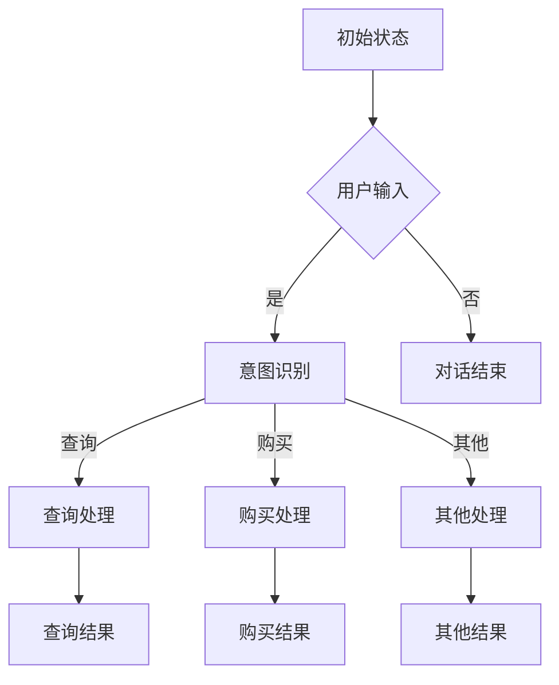
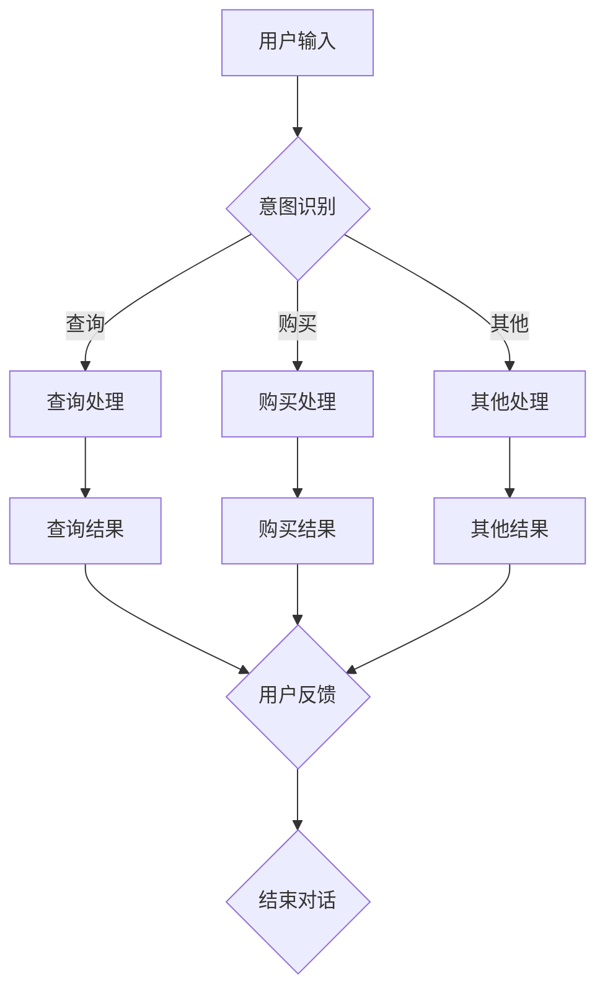
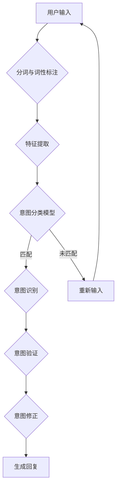

                 


### 1.1 智能客服的发展背景

智能客服的兴起并非一夜之间，而是随着互联网经济的崛起、客户服务需求的变化以及人工智能技术的进步而逐渐发展壮大的。

首先，互联网经济的崛起为智能客服的发展提供了广阔的市场空间。随着互联网技术的普及，电子商务、在线金融、在线教育、在线医疗等众多行业迅猛发展，这些行业对高效、便捷的客户服务需求日益增长。传统的客户服务模式已经无法满足快速变化的市场需求，因此，智能客服作为一种新兴的服务方式应运而生。

其次，客户服务需求的变化也是智能客服发展的重要驱动力。在互联网时代，客户对于服务的要求越来越高，他们希望在任何时间、任何地点都能获得及时、准确、个性化的服务。传统的客服模式无法实现这一点，而智能客服则能够通过自动化、智能化的方式，提供24小时不间断的服务，满足客户的多样化需求。

最后，人工智能技术的进步为智能客服的实现提供了强大的技术支持。人工智能技术，尤其是自然语言处理、机器学习、深度学习等技术的发展，使得智能客服在理解用户意图、处理复杂对话等方面取得了重大突破。通过这些技术的应用，智能客服能够实现与用户之间的多轮对话，提供更加自然、连贯的服务。

综上所述，互联网经济的崛起、客户服务需求的变化以及人工智能技术的进步，共同推动了智能客服的发展。智能客服不仅能够提高客户满意度，还能够提高客服效率，降低企业运营成本，因此，其在未来的发展前景十分广阔。

### 1.2 多轮对话管理的重要性

多轮对话管理是智能客服系统的核心组成部分，其重要性主要体现在以下几个方面。

首先，多轮对话管理能够提高客户满意度。在传统的客户服务模式中，客服人员往往需要花费大量时间来处理客户的咨询和问题，而智能客服系统则能够通过多轮对话的方式，快速、准确地理解用户的需求，并给出相应的解决方案。这种高效的互动方式，能够显著提高客户的满意度。

其次，多轮对话管理能够提高客服效率。智能客服系统通过自动化的方式，处理大量的客户咨询，可以大大减少客服人员的工作量，使得客服人员能够将更多精力投入到复杂问题的解决中。此外，多轮对话管理还能够根据对话的上下文信息，自动调整对话策略，从而提高整个客服流程的效率。

最后，多轮对话管理能够降低企业运营成本。传统的客户服务模式需要大量的人力资源，而智能客服系统则可以通过自动化、智能化的方式，实现客户服务的全面升级。这种模式不仅能够降低企业的运营成本，还能够提高企业的竞争力。

总之，多轮对话管理在智能客服系统中扮演着至关重要的角色。通过多轮对话管理，智能客服系统不仅能够提供高效、便捷的服务，还能够提高客户满意度，降低企业运营成本，因此，其在未来的发展前景十分广阔。

### 1.3 意图理解的关键性

意图理解在智能客服系统中起着关键性的作用，其重要性主要体现在以下几个方面。

首先，意图理解能够正确理解用户需求。在多轮对话过程中，用户可能会使用不同的表达方式来描述他们的需求，而意图理解技术能够通过分析用户的语言和对话上下文，准确识别用户的意图。这种对用户需求的准确理解，是智能客服系统提供高质量服务的前提。

其次，意图理解能够提高对话的自然性和连贯性。通过意图理解，智能客服系统能够根据用户的意图，自动生成合适的回复，使得对话更加自然、流畅。此外，意图理解还能够帮助系统在对话过程中保持上下文的连贯性，避免出现回答不相关或者矛盾的情况。

最后，意图理解能够提升服务质量和用户体验。准确理解用户的意图，能够使得智能客服系统提供更加个性化和定制化的服务，从而提升整体的服务质量。同时，连贯自然的对话体验，也能够显著提高用户对智能客服的满意度。

总之，意图理解在智能客服系统中具有至关重要的作用。通过意图理解，智能客服系统能够更好地满足用户的需求，提供高质量的服务，从而提升用户体验和企业的竞争力。

## 第2章 AI基础理论

### 2.1 人工智能概述

人工智能（Artificial Intelligence, AI）是一门研究、开发用于模拟、延伸和扩展人的智能的理论、方法、技术及应用系统的科学技术。人工智能的定义和范畴随着时间和技术的发展不断演变，但总体上，它关注的是使计算机系统具备类似人类的智能行为，包括感知、理解、学习、推理、决策和交流等能力。

#### 定义与分类

人工智能可以根据其实现方式和能力进行分类：

1. **弱人工智能（Narrow AI）**：这种人工智能系统专注于执行特定任务，如语音识别、图像识别、推荐系统等。它们不具备广泛的认知能力，也不能进行泛化处理。

2. **强人工智能（General AI）**：这种人工智能系统能够像人类一样思考，具备广泛的认知能力，可以处理多种任务，进行自主学习和推理。目前，强人工智能仍属于理论研究阶段，尚未实现。

3. **通用人工智能（AGI）**：这是指具备与人类相同的认知能力，能够适应各种环境和任务的人工智能系统。AGI被认为是人工智能发展的终极目标。

#### 发展历程

人工智能的发展历程可以分为几个重要阶段：

1. **早期探索（1950s-1960s）**：人工智能的概念首次被提出，研究人员开始尝试开发简单的智能程序，如逻辑推理和问题求解。

2. **人工智能寒冬（1970s-1980s）**：由于实际应用效果不佳和资金支持减少，人工智能研究进入低潮期。

3. **复兴与发展（1990s-2000s）**：随着计算机性能的提升和数据存储技术的发展，人工智能开始重新受到关注，特别是在机器学习和深度学习领域取得显著进展。

4. **当前趋势（2010s-至今）**：深度学习和其他先进技术的突破，使得人工智能在图像识别、自然语言处理、自动驾驶等领域取得了重大进展，应用范围不断扩大。

#### 当前趋势

当前，人工智能的发展趋势主要表现在以下几个方面：

1. **深度学习**：深度学习是一种通过多层神经网络进行数据建模的方法，它在图像识别、语音识别等领域取得了显著成效。

2. **迁移学习**：迁移学习是一种利用已有的模型来提高新任务的性能的方法，它可以减少训练数据的需求，提高模型的泛化能力。

3. **强化学习**：强化学习是一种通过试错和反馈进行决策优化的方法，它在游戏、推荐系统、自动驾驶等领域具有广泛应用。

4. **人工智能伦理和法规**：随着人工智能技术的发展，对其伦理和法规的讨论也日益增多，包括隐私保护、公平性、安全性等问题。

### 2.2 自然语言处理

自然语言处理（Natural Language Processing, NLP）是人工智能的一个分支，主要研究如何让计算机理解、生成和处理人类自然语言。NLP在文本分析、机器翻译、语音识别等领域具有广泛应用。

#### 基本概念

1. **文本分析**：文本分析是指对文本进行预处理、情感分析、主题识别等操作，以便更好地理解和利用文本数据。

2. **机器翻译**：机器翻译是指利用计算机技术将一种自然语言自动翻译成另一种自然语言。

3. **语音识别**：语音识别是指将语音信号转换为文本或命令。

4. **对话系统**：对话系统是指能够与人类进行自然语言交互的系统，包括智能客服、聊天机器人等。

#### 关键技术

1. **词向量**：词向量是将自然语言中的单词映射到高维空间中的向量，以实现文本数据的数值化表示。

2. **命名实体识别**：命名实体识别是指从文本中识别出具有特定意义的实体，如人名、地名、组织名等。

3. **情感分析**：情感分析是指通过分析文本中的情感倾向，来判断用户对某个话题或产品的态度。

4. **文本生成**：文本生成是指根据输入的文本或指令，自动生成新的文本内容。

#### 应用领域

1. **社交媒体分析**：通过情感分析和主题识别，可以对社交媒体上的用户行为和趋势进行分析。

2. **搜索引擎**：利用自然语言处理技术，可以提升搜索结果的准确性和用户体验。

3. **智能客服**：通过对话系统和语音识别技术，可以提供高效、自然的客户服务。

4. **机器翻译**：利用机器翻译技术，可以打破语言障碍，促进国际交流和合作。

### 2.3 机器学习与深度学习

机器学习（Machine Learning, ML）是一种通过数据驱动的方式，让计算机自动学习和改进的方法。深度学习（Deep Learning, DL）是机器学习的一个子领域，它使用多层神经网络进行数据建模。

#### 基本概念

1. **监督学习**：监督学习是一种在有标签数据集上训练模型的方法，通过学习输入和输出之间的映射关系，预测新的输入。

2. **无监督学习**：无监督学习是在没有标签数据集的情况下，通过发现数据内在的结构或模式来进行学习。

3. **强化学习**：强化学习是一种通过试错和反馈进行决策优化的方法，通过学习奖励和惩罚信号，来优化决策策略。

4. **神经网络**：神经网络是一种通过多层神经元进行数据建模的方法，能够自动学习输入和输出之间的复杂映射关系。

#### 算法介绍

1. **线性回归**：线性回归是一种简单的监督学习算法，用于预测连续值输出。

2. **支持向量机（SVM）**：支持向量机是一种分类算法，通过找到最佳的超平面，将不同类别的数据分隔开来。

3. **决策树**：决策树是一种树形结构的分类算法，通过一系列的决策规则，将数据分为不同的类别。

4. **神经网络**：神经网络是一种多层结构的模型，通过前向传播和反向传播算法，学习输入和输出之间的映射关系。

#### 应用案例

1. **图像识别**：通过卷积神经网络（CNN），可以实现高效的图像分类和目标检测。

2. **语音识别**：通过递归神经网络（RNN）和循环神经网络（LSTM），可以实现高精度的语音识别。

3. **自然语言处理**：通过长短期记忆网络（LSTM）和变换器（Transformer），可以实现高效的文本生成和机器翻译。

4. **推荐系统**：通过协同过滤和神经网络，可以构建智能化的推荐系统。

## 第3章 智能客服系统架构

### 3.1 系统设计原则

智能客服系统的设计需要遵循一系列原则，以确保其高效性、稳定性和可扩展性。

#### 可扩展性

可扩展性是指系统在设计时需要考虑到未来的扩展需求。随着业务规模的增长和用户数量的增加，系统应该能够无缝地扩展，以应对更高的负载。例如，可以通过增加服务器节点、优化数据库架构等方式来提升系统的处理能力。

#### 可维护性

可维护性是指系统在设计时需要便于维护和管理。良好的系统设计应该使得代码易于理解和修改，降低故障率和维护成本。通过采用模块化设计、清晰的代码规范和文档化，可以提高系统的可维护性。

#### 用户友好性

用户友好性是指系统应该提供直观、易于使用的界面，以便用户能够轻松地与系统进行交互。智能客服系统需要考虑到不同用户的需求和习惯，提供个性化的服务，提升用户体验。

### 3.2 系统主要模块

智能客服系统通常由以下几个主要模块组成：

#### 用户接口

用户接口（User Interface, UI）是系统与用户交互的界面，负责接收用户的输入，展示系统的输出。一个良好的用户接口应该简洁、直观，同时提供多种交互方式，如文本聊天、语音通话等。

#### 对话管理

对话管理（Dialogue Management）是智能客服系统的核心模块，负责处理与用户的对话流程。其主要功能包括对话状态跟踪、对话策略学习、对话流分析等。

1. **对话状态跟踪**：对话状态跟踪是指记录并维护当前对话的状态，如用户意图、对话阶段等。通过状态跟踪，系统能够在后续的对话中保持上下文的连贯性。

2. **对话策略学习**：对话策略学习是指通过机器学习算法，自动生成最佳对话策略。例如，可以通过强化学习算法，根据对话的反馈不断优化对话策略。

3. **对话流分析**：对话流分析是指对对话过程进行分析，以识别对话中的模式、问题等。通过分析对话流，系统可以提升对话的质量和效率。

#### 意图理解

意图理解（Intent Understanding）是指从用户的输入中识别出用户的意图。智能客服系统需要通过自然语言处理（NLP）技术，对用户输入进行解析，识别出用户的意图。意图理解是智能客服系统提供个性化服务的重要基础。

#### 知识库

知识库（Knowledge Base）是智能客服系统的重要组成部分，用于存储和管理各种知识点和事实信息。知识库可以包含产品信息、常见问题解答、业务规则等。通过查询知识库，系统可以快速提供准确的答案和建议。

### 3.3 系统集成与部署

智能客服系统的集成与部署是一个复杂的过程，需要考虑多个方面：

#### 硬件配置

硬件配置是系统运行的基础，需要根据业务需求和系统负载来选择合适的硬件设备。例如，可以选择高性能的服务器、存储设备和网络设备，以确保系统的稳定性和响应速度。

#### 软件环境

软件环境包括操作系统、数据库、中间件等。需要选择适合的软件环境，以支持系统的正常运行。例如，可以选择Linux操作系统、MySQL数据库、Tomcat中间件等。

#### 部署策略

部署策略包括系统的部署方式和部署流程。通常，可以选择云部署、容器部署等方式，以实现系统的灵活部署和快速扩展。部署过程中，需要遵循规范的流程，确保系统的稳定性和安全性。

#### 安全性

安全性是智能客服系统部署的重要考虑因素。需要采取一系列安全措施，如数据加密、访问控制、防火墙等，以确保系统的数据安全和用户隐私。

通过遵循系统设计原则，合理划分系统模块，并考虑集成与部署的各个方面，可以构建一个高效、稳定、可扩展的智能客服系统。

### 4.1 对话状态跟踪

对话状态跟踪（Dialogue State Tracking）是智能客服系统中一个重要的模块，它负责记录和更新对话过程中的关键信息，如用户的意图、当前对话阶段、上下文等。通过对话状态跟踪，系统能够在多轮对话中保持上下文的连贯性，从而提供更自然、流畅的对话体验。

#### 状态表示

对话状态跟踪中的状态表示是关键的一步，它需要将对话中的各种信息结构化。通常，状态表示可以采用以下几种形式：

1. **向量表示**：将状态信息表示为高维向量。每个维度对应一个状态特征，如用户的意图、对话阶段、上下文等。向量表示方法简单直观，适用于低维状态空间。

   例如，假设我们有两个状态特征：意图（intent）和对话阶段（stage）。状态表示为向量：
   $$s = [intent, stage]$$
   其中，intent可以是“查询产品信息”、“请求售后服务”等，stage可以是“初始询问”、“问题解决”等。

2. **图结构表示**：对于更复杂的对话状态，可以使用图结构来表示。图中的节点表示状态特征，边表示状态之间的关系。这种表示方法能够更好地捕获状态之间的复杂关系。

   例如，我们可以使用图来表示一个购物咨询的对话状态：
   $$G = (V, E)$$
   其中，V是节点集合，表示不同的状态特征，如“产品信息查询”、“价格咨询”、“购买决策”等；E是边集合，表示状态之间的关系，如“产品信息查询”后可能会进入“价格咨询”。

3. **上下文窗口表示**：上下文窗口表示是一种基于序列的方法，它通过固定长度的窗口来捕获对话的历史信息。窗口内的每个状态特征作为序列的一部分，用于更新当前状态。

   例如，一个长度为3的上下文窗口可以表示为：
   $$C = [s_{t-2}, s_{t-1}, s_t]$$
   其中，s_t是当前状态，s_{t-1}和s_{t-2}是前两个历史状态。

#### 状态转移

状态转移是指根据当前的对话状态，预测下一个状态。状态转移可以通过以下几种方法实现：

1. **基于规则的转移**：通过预设的规则，根据当前状态和用户输入，直接判断下一个状态。这种方法简单直观，但灵活性较低，难以适应复杂的对话场景。

   例如，如果当前状态是“初始询问”，用户输入“我想购买某产品”，则下一个状态可能是“产品信息查询”。

2. **基于机器学习的转移**：通过训练机器学习模型，根据历史对话数据，学习状态转移的概率分布。这种方法具有更高的灵活性和泛化能力。

   假设我们有一个状态转移概率矩阵$P$，其中$P_{ij}$表示从状态i转移到状态j的概率。通过学习$P$，我们可以预测下一个状态。

   $$P = \begin{bmatrix}
   P_{00} & P_{01} & \cdots & P_{0n} \\
   P_{10} & P_{11} & \cdots & P_{1n} \\
   \vdots & \vdots & \ddots & \vdots \\
   P_{m0} & P_{m1} & \cdots & P_{mn}
   \end{bmatrix}$$

3. **强化学习转移**：强化学习（Reinforcement Learning）通过试错和反馈来学习最优状态转移策略。在对话状态跟踪中，强化学习可以用来优化对话策略，提高用户体验。

   例如，使用Q-learning算法，我们可以通过奖励机制来调整状态转移策略，使得系统在对话中更加高效地满足用户需求。

#### 实例分析

假设一个用户与智能客服系统进行购物咨询的对话，初始状态为“初始询问”。用户输入“我想购买一款手机”，系统通过意图理解模块识别出用户的意图是“购买手机”。接下来，系统需要根据当前状态和用户输入，更新对话状态。

1. **状态表示**：当前状态可以表示为向量：
   $$s_t = [初始询问, 购买手机]$$

2. **状态转移**：系统根据预设的规则和用户输入，判断下一个状态可能是“产品信息查询”。状态转移矩阵如下：
   $$P = \begin{bmatrix}
   0.8 & 0.2 \\
   0.1 & 0.9
   \end{bmatrix}$$

   其中，$P_{00}$表示从“初始询问”转移到“初始询问”的概率，$P_{01}$表示从“初始询问”转移到“产品信息查询”的概率。

3. **对话继续**：用户输入“这款手机多少钱”，系统识别出用户的意图是“价格查询”。系统继续更新状态：
   $$s_{t+1} = [产品信息查询, 价格查询]$$

通过对话状态跟踪，系统能够准确记录并更新对话状态，从而提供连贯、自然的对话体验。状态表示和状态转移的方法不仅提高了对话的智能化程度，还为后续的对话策略学习和优化提供了基础。

### 4.2 对话策略学习

对话策略学习（Dialogue Policy Learning）是智能客服系统中一个关键的模块，它通过机器学习算法，自动生成最佳对话策略，以提升客服系统的交互质量和用户体验。对话策略学习的方法主要包括强化学习（Reinforcement Learning）和决策树（Decision Tree）等。

#### 强化学习

强化学习是一种通过试错和反馈进行决策优化的方法。在智能客服系统中，强化学习可以通过与环境（用户输入）互动，学习最优的对话策略。

1. **基本概念**：

   - **状态（State）**：当前对话的上下文信息，如用户意图、对话阶段等。
   - **动作（Action）**：系统可以采取的操作，如发送消息、提供选项等。
   - **奖励（Reward）**：系统根据用户反馈给予的奖励，用于评估当前动作的好坏。

2. **Q-Learning算法**：

   Q-Learning是一种常用的强化学习算法，通过更新状态-动作值函数（Q值），学习最优策略。

   - **Q值（Q-Value）**：表示在给定状态下，采取特定动作的预期奖励。
   - **更新规则**：
     $$Q(s, a) \leftarrow Q(s, a) + \alpha [r + \gamma \max_{a'} Q(s', a') - Q(s, a)]$$
     其中，$\alpha$是学习率，$\gamma$是折扣因子，$r$是即时奖励。

3. **实例分析**：

   假设当前状态是“用户询问手机价格”，系统有两个动作：“提供价格”和“询问更多信息”。通过Q-Learning算法，系统可以不断更新Q值，学习最优策略。

   - 初始Q值：$$Q([询问价格], 提供价格) = 0.5, Q([询问价格], 询问更多信息) = 0.5$$
   - 用户反馈奖励：如果用户满意，奖励为+1；如果不满意，奖励为-1。
   - 经过多次迭代，系统可以优化Q值，选择提供价格的策略。

#### 决策树

决策树是一种基于规则的方法，通过一系列的判断条件，将对话分类到不同的节点，以生成对话策略。

1. **基本概念**：

   - **节点**：表示对话中的一个判断点，根据用户输入和对话状态，选择不同的分支。
   - **叶子节点**：表示对话的一个结果，如提供答案、引导用户等。

2. **构建方法**：

   - **ID3算法**：通过信息增益（Entropy and Information Gain）来选择最佳特征进行划分。
   - **C4.5算法**：改进ID3算法，通过信息增益率（Gain Ratio）来选择最佳特征。

3. **实例分析**：

   假设我们使用决策树来生成购物咨询的对话策略。

   - 初始状态：用户询问手机价格。
   - 判断条件：用户是否已经提供了手机型号。

     - 如果是，继续询问价格细节，如颜色、容量等。
     - 如果否，提供手机型号选项，引导用户选择。

#### 混合策略

在实际应用中，强化学习和决策树可以结合使用，形成混合策略。例如，系统可以先使用决策树进行初步判断，然后根据强化学习的结果进行微调，以优化对话策略。

1. **决策树引导**：系统根据决策树提供初步的对话策略。
2. **强化学习优化**：系统根据用户反馈，使用强化学习算法不断优化对话策略。

通过对话策略学习，智能客服系统能够自动生成最佳对话策略，提升客服质量和用户体验。强化学习和决策树等方法为对话策略学习提供了强大的工具，使得智能客服系统能够更加智能、灵活地应对复杂的对话场景。

### 4.3 对话流分析

对话流分析（Dialogue Flow Analysis）是智能客服系统中的重要模块，通过对对话过程的实时分析，帮助系统识别对话中的模式、问题，从而优化对话流程和提高服务质量。对话流分析包括上下文理解和轨迹分析两个方面。

#### 上下文理解

上下文理解（Context Understanding）是指系统在处理对话时，对用户输入和对话历史进行深入分析，以理解用户的意图和需求。通过上下文理解，系统可以更好地把握对话的焦点，提供更加准确的回复。

1. **对话历史分析**：

   - **信息提取**：从对话历史中提取关键信息，如用户意图、问题关键词等。例如，用户之前询问了“手机的价格”，系统可以提取出“价格”作为关键词。
   - **上下文关联**：将当前输入与对话历史进行关联，识别出相关的上下文信息。例如，用户当前输入“这款手机的颜色是什么？”可以与之前的“价格”信息进行关联，系统理解用户是在询问颜色。

2. **上下文维护**：

   - **动态更新**：在对话过程中，系统需要不断更新上下文信息，以反映当前对话状态。例如，用户询问了多个问题，系统需要更新上下文，记录当前的问题焦点。
   - **上下文重置**：在对话结束时，系统需要重置上下文信息，以便开始新的对话。例如，用户结束了一个购物咨询后，系统需要重置上下文，为下一个问题做好准备。

#### 轨迹分析

轨迹分析（Trajectory Analysis）是指系统对对话过程的整体流程进行分析，以识别对话的模式和问题。通过对对话轨迹的分析，系统可以优化对话策略，提高对话的流畅性和用户体验。

1. **对话流程建模**：

   - **序列建模**：将对话过程建模为一个序列，每个对话步骤表示为一个状态。例如，一个购物咨询的对话序列可以是“初始询问”→“产品信息查询”→“价格咨询”→“购买决策”。
   - **图结构建模**：将对话过程建模为一个图结构，节点表示对话步骤，边表示步骤之间的转换关系。例如，可以构建一个图，表示用户在购物咨询过程中不同步骤的转换关系。

2. **对话模式识别**：

   - **常见模式**：通过分析大量对话数据，识别出常见的对话模式和用户行为。例如，用户在购物咨询中常见的步骤包括“产品信息查询”、“价格咨询”、“购买决策”等。
   - **异常检测**：通过分析对话流程，识别出异常的对话模式和用户行为。例如，如果用户在购物咨询中突然中断了对话，系统可以识别出这是一个异常情况，并尝试重新引导对话。

3. **对话问题诊断**：

   - **问题识别**：通过分析对话流，识别出对话中存在的问题。例如，如果用户在咨询过程中频繁遇到重复回答或错误回答，系统可以识别出这是一个问题。
   - **问题定位**：在识别出问题后，系统需要定位问题的具体原因。例如，如果用户在购物咨询中遇到了错误回答，系统需要检查是哪个环节出了问题，是意图理解错误、对话策略错误，还是知识库不准确。

通过对话流分析，智能客服系统能够更好地理解用户需求，优化对话流程，提高对话质量和用户体验。上下文理解和轨迹分析为对话流分析提供了强大的工具，使得系统能够更加智能地处理复杂的对话场景。

### 5.1 意图识别基础

意图识别（Intent Recognition）是智能客服系统中一个关键步骤，它通过分析和理解用户的输入，识别出用户的主要意图。意图识别的准确性直接影响到客服系统的响应质量和用户体验。以下是对意图识别基础概念的详细探讨。

#### 意图定义

意图（Intent）是指用户在输入信息中表达的主要意图或目标。在自然语言处理（NLP）中，意图可以看作是用户输入背后的深层含义。例如，当用户输入“我想要购买一本计算机编程书籍”时，意图可能是“购买书籍”。

#### 意图分类

意图分类是指将用户的输入分配到不同的意图类别中。常见的意图分类方法包括：

1. **广义意图分类**：将用户输入分为几个主要的意图类别，如“查询信息”、“执行操作”、“获取帮助”等。
2. **细粒度意图分类**：在广义意图分类的基础上，对每个意图类别进行进一步的细分，如将“查询信息”细分为“产品信息查询”、“服务查询”、“价格查询”等。

#### 意图识别流程

意图识别通常包括以下几个步骤：

1. **分词与词性标注**：首先，对用户输入进行分词，将连续的文本序列分解为独立的词语。接着，对每个词语进行词性标注，确定词语的词性，如名词、动词、形容词等。
2. **特征提取**：从分词和词性标注的结果中提取特征，用于表示用户的输入。常见的特征提取方法包括词袋模型（Bag of Words, BOW）、词嵌入（Word Embedding）等。
3. **分类模型训练**：使用历史对话数据，通过机器学习算法训练分类模型。常见的分类模型包括朴素贝叶斯（Naive Bayes）、支持向量机（SVM）、决策树（Decision Tree）等。
4. **意图识别**：在训练好的分类模型的基础上，对新的用户输入进行意图识别。模型根据输入的特征，预测用户输入的意图类别。

#### 意图识别算法

意图识别算法主要包括以下几种：

1. **基于规则的方法**：通过预定义的规则，将用户输入映射到特定的意图类别。这种方法简单直观，但灵活性较低，难以应对复杂的对话场景。

2. **基于机器学习的方法**：使用机器学习算法，通过训练模型，自动识别用户输入的意图。常见的机器学习算法包括朴素贝叶斯、决策树、随机森林、支持向量机等。

3. **基于深度学习的方法**：使用深度学习算法，如卷积神经网络（CNN）、循环神经网络（RNN）、长短期记忆网络（LSTM）等，进行意图识别。深度学习算法能够自动提取输入的复杂特征，提高意图识别的准确性。

#### 意图识别挑战

意图识别在实际应用中面临一些挑战：

1. **歧义性**：用户输入可能存在多种解释，导致意图识别困难。例如，用户输入“你好”，可能是想要问候，也可能是想要获取帮助。
2. **上下文依赖**：意图识别往往需要依赖上下文信息，不同上下文下的同一输入可能表达不同的意图。例如，在购物咨询中，用户输入“价格”可能是指询问产品价格，也可能是要求获取价格信息。
3. **数据不足**：训练高质量的意图识别模型需要大量标注数据。但在实际应用中，获取高质量的标注数据可能较为困难，影响模型的性能。

通过理解和解决这些挑战，智能客服系统能够更准确地识别用户的意图，提供更高质量的对话服务。

### 5.2 意图理解算法

意图理解算法是智能客服系统中的核心组成部分，它通过分析用户输入，准确识别并理解用户的意图。根据算法的实现方式和原理，意图理解算法主要可以分为基于规则的方法、基于机器学习的方法和基于深度学习的方法。以下将对这些方法进行详细讲解。

#### 基于规则的方法

基于规则的方法（Rule-Based Methods）是指通过预定义的规则集来识别用户的意图。这种方法的核心在于将用户输入与规则进行匹配，从而判断出用户的意图。基于规则的方法具有简单直观、易于实现和理解的特点。

1. **规则定义**：在基于规则的方法中，首先需要定义一系列规则。每个规则描述了一种特定的意图及其对应的匹配条件。例如，一个规则可以是“如果用户输入包含‘价格’二字，且上下文中没有其他关键词，则意图为‘价格查询’”。

2. **规则匹配**：系统在处理用户输入时，会依次检查每个规则，判断其是否与用户输入匹配。如果找到匹配的规则，则确定用户的意图。例如，对于用户输入“这款手机的价格是多少？”，系统会检查包含“价格”二字的规则，确定意图为“价格查询”。

3. **优点与局限性**：

   - **优点**：基于规则的方法实现简单，易于理解。规则的可解释性使得调试和维护更加方便。
   - **局限性**：基于规则的方法在应对复杂、多变的用户输入时，灵活性较低。当用户输入与预定义规则不完全匹配时，系统可能无法正确识别意图。

#### 基于机器学习的方法

基于机器学习的方法（Machine Learning Methods）通过训练模型，自动识别用户的意图。这种方法的核心在于从大量标注数据中学习特征和模式，构建分类模型。

1. **特征提取**：在基于机器学习的方法中，首先需要从用户输入中提取特征。常见的特征提取方法包括词袋模型（Bag of Words, BOW）、TF-IDF（Term Frequency-Inverse Document Frequency）和词嵌入（Word Embedding）等。词嵌入方法，如Word2Vec、GloVe，能够捕捉词语的语义信息，提高意图识别的准确性。

2. **模型训练**：使用提取的特征和标注数据，训练分类模型。常见的分类模型包括朴素贝叶斯（Naive Bayes）、逻辑回归（Logistic Regression）、支持向量机（SVM）、决策树（Decision Tree）和随机森林（Random Forest）等。这些模型通过学习用户输入和意图之间的关联，预测新输入的意图。

3. **模型评估与优化**：通过评估指标（如准确率、召回率、F1分数等）评估模型性能。如果性能不佳，可以通过调整模型参数、增加训练数据或更换模型结构进行优化。

4. **优点与局限性**：

   - **优点**：基于机器学习的方法能够自动学习特征和模式，提高意图识别的准确性。这种方法适用于处理复杂、多变的用户输入。
   - **局限性**：基于机器学习的方法需要大量标注数据，并且模型的训练和评估过程较为复杂。此外，模型的解释性较差，难以直观理解。

#### 基于深度学习的方法

基于深度学习的方法（Deep Learning Methods）通过构建深度神经网络，自动提取用户输入的复杂特征，进行意图识别。深度学习算法在意图识别领域取得了显著进展，尤其在处理自然语言处理任务时表现出色。

1. **卷积神经网络（CNN）**：卷积神经网络是一种用于图像识别的深度学习算法，但也可以用于自然语言处理任务。通过卷积层和池化层，CNN能够自动提取文本的局部特征，例如词组或短语。

2. **循环神经网络（RNN）**：循环神经网络是一种能够处理序列数据的深度学习算法。RNN通过隐藏状态的记忆机制，能够捕捉文本中的时间依赖关系。长短期记忆网络（LSTM）和门控循环单元（GRU）是RNN的变体，能够更好地处理长序列数据。

3. **变换器（Transformer）**：变换器是一种基于自注意力机制的深度学习算法，在自然语言处理任务中表现出色。通过多头自注意力机制，Transformer能够捕捉文本中的长距离依赖关系，提高意图识别的准确性。

4. **优点与局限性**：

   - **优点**：基于深度学习的方法能够自动提取文本的复杂特征，提高意图识别的准确性。这种方法适用于处理大规模、复杂的对话数据。
   - **局限性**：基于深度学习的方法计算复杂度高，训练时间较长。此外，模型的解释性较差，难以直观理解。

#### 比较与选择

在智能客服系统中，根据具体应用场景和需求，可以选择不同类型的意图理解算法。

- **基于规则的方法**：适用于规则明确、对话场景相对简单的应用场景。例如，简单的客服机器人或信息查询系统。
- **基于机器学习的方法**：适用于对话场景较为复杂，用户输入多样性的应用场景。例如，电商平台客服、金融服务客服等。
- **基于深度学习的方法**：适用于对话场景复杂，对意图识别准确性要求较高的应用场景。例如，智能助理、聊天机器人等。

通过选择合适的意图理解算法，智能客服系统能够更好地满足用户需求，提供高质量的对话服务。

### 5.3 意图验证

意图验证（Intent Verification）是智能客服系统中的一个关键步骤，其目的是确保系统正确理解用户的意图，并提供准确的响应。意图验证通过多个方面的检查，如意图正确性评估、意图修正策略等，来提高客服系统的可靠性。

#### 意图正确性评估

意图正确性评估（Intent Accuracy Assessment）是指系统通过一系列方法，评估所识别意图的准确性。意图正确性评估的主要目标是减少误识别和漏识别的情况，从而提高整体对话质量。

1. **反馈机制**：系统通过用户反馈，如满意度评分、问题反馈等，来评估意图识别的准确性。例如，如果用户对系统的回答不满意，系统可以记录并分析这种情况，以改进意图识别模型。

2. **交叉验证**：使用多个模型或算法对同一输入进行意图识别，比较不同模型的输出，以评估每个模型的准确性。通过交叉验证，可以找出最准确的模型，并优化整个意图识别流程。

3. **混淆矩阵**：混淆矩阵是一种常用的评估工具，用于分析意图识别的准确性。混淆矩阵展示了不同意图类别之间的识别情况，如正确识别、误识别和漏识别。通过分析混淆矩阵，系统可以发现识别中的问题，并进行针对性优化。

#### 意图修正策略

意图修正策略（Intent Correction Strategy）是指系统在识别出错误意图时，通过一系列方法进行修正，以提供更准确的响应。意图修正策略通常包括以下几种方法：

1. **自动修正**：系统通过预设的规则或机器学习模型，自动修正错误的意图。例如，如果系统识别出用户意图为“价格查询”，但用户实际意图为“产品信息查询”，系统可以通过上下文信息自动修正意图。

2. **用户引导**：当系统无法自动修正错误意图时，系统可以通过与用户的交互，引导用户重新表达意图。例如，系统可以询问用户“您是想查询产品价格还是产品信息？”，以帮助用户更准确地表达意图。

3. **手动修正**：在某些情况下，系统可能需要手动修正意图。例如，对于复杂或模糊的意图，系统无法自动识别或修正，需要人工干预。通过人工修正，系统可以确保意图的准确性，并提供更高质量的响应。

#### 实例分析

假设一个用户与智能客服系统进行对话，用户输入“这款手机的颜色是什么？”。系统首先通过意图识别模块识别出用户的意图为“查询手机颜色”。

1. **意图正确性评估**：系统通过用户反馈和混淆矩阵，评估识别意图的准确性。如果评估结果显示用户的意图识别准确，系统继续处理对话。

2. **意图修正策略**：假设系统评估结果显示用户的意图识别存在一定偏差，系统可以通过以下方法进行修正：

   - **自动修正**：系统根据用户输入和上下文信息，判断用户意图更可能是“查询手机颜色”，而不是“价格查询”。系统自动修正意图，并提供相应的响应。
   - **用户引导**：如果系统无法通过自动修正确定意图，系统可以询问用户“您是想查询手机颜色还是价格？”，引导用户重新表达意图。
   - **手动修正**：如果系统仍然无法确定意图，系统需要人工干预，与用户进行进一步沟通，以确保意图的准确性。

通过意图验证，智能客服系统能够更准确地理解用户意图，提高对话质量。意图正确性评估和意图修正策略为意图验证提供了有力的工具，使得系统在处理用户输入时更加灵活和可靠。

### 6.1 案例一：电商客服

#### 对话场景

在电商客服的案例中，用户通常会在平台上寻找产品、询问价格、咨询售后服务等。以下是一个典型的对话场景：

用户：这款手机的价格是多少？
智能客服：您好，这款手机的价格是1999元。需要了解更多信息吗？

用户：是的，我想知道这款手机的颜色有哪些？
智能客服：您好，这款手机有黑色、白色、蓝色三种颜色。您喜欢哪种颜色？

用户：我想要黑色的，能帮我下单吗？
智能客服：当然可以。请问您的收货地址是什么？

用户：我住在北京，收货地址是XXX。
智能客服：好的，您的订单已经提交成功。预计明天会发货。有任何其他问题，请随时联系我。

#### 对话管理

在上述对话中，智能客服系统通过多轮对话管理，实现了高效的客户服务。

1. **对话状态跟踪**：系统记录了用户的意图和当前对话阶段。例如，用户询问价格后，系统将状态标记为“价格查询”。当用户询问颜色时，系统将状态更新为“颜色查询”。

2. **对话策略学习**：系统通过机器学习算法，根据历史对话数据，自动生成最佳对话策略。例如，当用户询问价格时，系统通常会提供产品价格和是否需要更多信息的选择。

3. **对话流分析**：系统通过分析对话流，识别出对话中的模式和问题。例如，通过分析大量用户询问价格的场景，系统发现大多数用户在了解价格后会进一步询问其他信息。

#### 意图理解

在电商客服案例中，智能客服系统需要准确理解用户的意图，以提供高质量的服务。

1. **意图识别**：系统使用意图识别算法，将用户输入映射到具体的意图类别。例如，用户输入“这款手机的价格是多少？”会被识别为“价格查询”。

2. **意图验证**：系统通过用户反馈和混淆矩阵，评估意图识别的准确性。例如，如果用户对系统的回答不满意，系统会重新引导用户表达意图。

3. **意图修正**：当系统识别出错误意图时，通过自动修正或用户引导，确保意图的准确性。例如，当用户询问颜色时，系统会询问用户是否需要其他帮助，以修正意图。

#### 对话效果评估

通过上述对话场景和对话管理，智能客服系统能够提供高效、自然的客户服务。以下是对话效果的评估指标：

1. **响应时间**：系统在用户输入后，能够快速响应，提供准确的答案。通常，智能客服系统的响应时间应控制在2秒以内。

2. **用户满意度**：通过用户反馈，评估用户对服务的满意度。用户满意度是衡量智能客服系统性能的重要指标。

3. **意图识别准确性**：通过混淆矩阵和用户反馈，评估系统识别意图的准确性。意图识别准确性越高，系统提供的答案越准确。

4. **对话流畅性**：通过对话流分析，评估系统在多轮对话中的流畅性和连贯性。流畅的对话体验能够提高用户的满意度。

通过电商客服案例，我们可以看到智能客服系统在多轮对话管理和意图理解中的重要作用。通过合理的设计和优化，智能客服系统能够提供高效、自然的客户服务，提升用户体验和企业的竞争力。

### 6.2 案例二：金融客服

#### 对话场景

在金融客服的案例中，用户通常会有关于账户查询、交易咨询、贷款申请等需求。以下是一个典型的对话场景：

用户：我想查询我的信用卡账单。
智能客服：您好，请问您的卡号后四位是多少？

用户：卡号后四位是1234。
智能客服：好的，根据您的卡号，我为您查找到了最新的账单。您的账单总额为5000元，请问您需要我为您生成一份详细的账单吗？

用户：是的，请发送给我。
智能客服：好的，您的详细账单已经通过邮件发送到您的邮箱。如果您有任何其他问题，请随时联系我。

用户：我想申请一笔贷款，可以帮忙办理吗？
智能客服：您好，请问您需要申请哪种类型的贷款？是购房贷款、购车贷款还是其他类型的贷款？

用户：我需要申请一笔购车贷款。
智能客服：好的，请您提供一下您的姓名、身份证号码、联系方式以及收入证明，以便我们为您快速办理贷款。

用户：我的名字叫张三，身份证号码是123456789012345678，电话是13812345678，收入证明会在明天上午之前发送给您。
智能客服：感谢您的信息，我们会尽快为您办理贷款。请您保持电话畅通，我们将在24小时内与您联系确认贷款详情。

#### 对话管理

在金融客服案例中，智能客服系统通过多轮对话管理，实现了高效、安全的客户服务。

1. **对话状态跟踪**：系统记录了用户的意图和当前对话阶段。例如，用户查询账单时，系统将状态标记为“账单查询”。当用户申请贷款时，系统将状态更新为“贷款申请”。

2. **对话策略学习**：系统通过机器学习算法，根据历史对话数据，自动生成最佳对话策略。例如，当用户查询账单时，系统通常会提供账单生成和是否需要其他帮助的选择。

3. **对话流分析**：系统通过分析对话流，识别出对话中的模式和问题。例如，通过分析大量用户查询账单的场景，系统发现大多数用户在查看账单后会有进一步的咨询需求。

#### 意图理解

在金融客服案例中，智能客服系统需要准确理解用户的意图，以提供高质量的服务。

1. **意图识别**：系统使用意图识别算法，将用户输入映射到具体的意图类别。例如，用户输入“我想查询我的信用卡账单”会被识别为“账单查询”。

2. **意图验证**：系统通过用户反馈和混淆矩阵，评估意图识别的准确性。例如，如果用户对系统的回答不满意，系统会重新引导用户表达意图。

3. **意图修正**：当系统识别出错误意图时，通过自动修正或用户引导，确保意图的准确性。例如，当用户询问贷款申请时，系统会询问用户需要哪种类型的贷款，以修正意图。

#### 对话效果评估

通过金融客服案例，我们可以看到智能客服系统在多轮对话管理和意图理解中的重要作用。以下是对话效果的评估指标：

1. **响应时间**：系统在用户输入后，能够快速响应，提供准确的答案。通常，金融服务的响应时间应控制在2秒以内。

2. **用户满意度**：通过用户反馈，评估用户对服务的满意度。用户满意度是衡量智能客服系统性能的重要指标。

3. **意图识别准确性**：通过混淆矩阵和用户反馈，评估系统识别意图的准确性。意图识别准确性越高，系统提供的答案越准确。

4. **对话流畅性**：通过对话流分析，评估系统在多轮对话中的流畅性和连贯性。流畅的对话体验能够提高用户的满意度。

通过金融客服案例，我们可以看到智能客服系统在提供高效、安全的金融服务中的重要性。通过合理的设计和优化，智能客服系统能够提升用户体验，降低人工成本，提高企业的运营效率。

### 6.3 案例三：医疗咨询

#### 对话场景

在医疗咨询的案例中，用户通常会有关于症状咨询、药物查询、预约挂号等需求。以下是一个典型的对话场景：

用户：医生，我最近感到喉咙痛，有什么建议吗？
智能客服：您好，喉咙痛可能是由感冒、扁桃体炎等原因引起的。您是否有其他症状，例如发热、咳嗽、鼻塞？

用户：是的，我还有咳嗽和鼻塞。
智能客服：根据您的症状，可能是感冒引起的。您可以多休息，多喝水，可以使用含有氯苯那敏的感冒药缓解症状。如果症状加重，建议您及时就医。

用户：好的，我想查询一下附近的医院和医生，可以帮忙吗？
智能客服：当然可以。请问您所在的城市是哪里？

用户：我在北京，我想找一位呼吸科医生。
智能客服：好的，根据您的需求，我为您找到了几家附近的医院和医生。以下是医院的推荐：

1. 北京协和医院，呼吸科专家李医生
2. 北京医院，呼吸科专家王医生
3. 北京朝阳医院，呼吸科专家张医生

用户：我想预约李医生的挂号，怎么操作？
智能客服：好的，请您点击以下链接，进入北京协和医院的官方网站。在预约挂号页面，选择李医生的号源，按照提示操作即可。

用户：好的，谢谢您的帮助。
智能客服：不客气，祝您健康。如果您有其他问题，请随时联系我。

#### 对话管理

在医疗咨询案例中，智能客服系统通过多轮对话管理，实现了高效、专业的医疗服务。

1. **对话状态跟踪**：系统记录了用户的意图和当前对话阶段。例如，用户咨询症状时，系统将状态标记为“症状咨询”。当用户查询医生时，系统将状态更新为“医生查询”。

2. **对话策略学习**：系统通过机器学习算法，根据历史对话数据，自动生成最佳对话策略。例如，当用户咨询症状时，系统通常会提供症状分析和是否需要进一步咨询的选择。

3. **对话流分析**：系统通过分析对话流，识别出对话中的模式和问题。例如，通过分析大量用户咨询症状的场景，系统发现大多数用户在了解症状后会进一步询问用药建议。

#### 意图理解

在医疗咨询案例中，智能客服系统需要准确理解用户的意图，以提供专业、个性化的服务。

1. **意图识别**：系统使用意图识别算法，将用户输入映射到具体的意图类别。例如，用户输入“我最近感到喉咙痛”会被识别为“症状咨询”。

2. **意图验证**：系统通过用户反馈和混淆矩阵，评估意图识别的准确性。例如，如果用户对系统的回答不满意，系统会重新引导用户表达意图。

3. **意图修正**：当系统识别出错误意图时，通过自动修正或用户引导，确保意图的准确性。例如，当用户询问药物查询时，系统会询问用户具体症状和用药需求，以修正意图。

#### 对话效果评估

通过医疗咨询案例，我们可以看到智能客服系统在多轮对话管理和意图理解中的重要作用。以下是对话效果的评估指标：

1. **响应时间**：系统在用户输入后，能够快速响应，提供准确的答案。通常，医疗服务的响应时间应控制在3秒以内。

2. **用户满意度**：通过用户反馈，评估用户对服务的满意度。用户满意度是衡量智能客服系统性能的重要指标。

3. **意图识别准确性**：通过混淆矩阵和用户反馈，评估系统识别意图的准确性。意图识别准确性越高，系统提供的答案越准确。

4. **对话流畅性**：通过对话流分析，评估系统在多轮对话中的流畅性和连贯性。流畅的对话体验能够提高用户的满意度。

通过医疗咨询案例，我们可以看到智能客服系统在提供专业、高效的医疗服务中的重要性。通过合理的设计和优化，智能客服系统能够提升用户体验，降低医疗资源的使用，提高医疗服务的效率。

### 7.1 实践经验

在智能客服多轮对话管理和意图理解的实际应用中，我们积累了丰富的实践经验，以下是一些关键的实践经验和问题解决方案。

#### 系统优化

1. **性能优化**：针对高并发请求，我们采用了分布式架构，通过负载均衡和缓存策略，提高系统的响应速度和处理能力。例如，在电商客服系统中，我们引入了Redis缓存，减少了数据库查询的频率，显著提升了系统的性能。

2. **对话流程优化**：通过对历史对话数据的分析，我们发现用户在特定场景下的问题模式，从而优化对话流程。例如，在医疗咨询中，我们根据用户常见症状的咨询顺序，优化了对话流程，使得用户能够更快地获得所需信息。

3. **意图识别模型优化**：我们不断更新和优化意图识别模型，通过引入更多高质量的标注数据，提升模型的准确性。同时，我们采用了迁移学习技术，利用预训练模型作为起点，加速新任务的训练过程。

#### 问题解决

1. **歧义性问题**：在意图识别过程中，用户输入的歧义性是一个常见问题。为了解决歧义性，我们引入了上下文信息，通过多轮对话逐渐明确用户意图。例如，在金融客服中，当用户输入模糊的请求时，我们会通过后续问题逐步澄清。

2. **数据缺失问题**：在训练模型时，数据缺失是一个挑战。为了解决这个问题，我们采用了数据增强技术，通过生成模拟数据或使用对抗性样本，增加训练数据的多样性。同时，我们优化了数据预处理流程，减少数据噪声，提高数据质量。

3. **对话一致性**：在多轮对话中，保持对话的一致性是一个重要问题。我们采用了对话状态跟踪技术，记录并维护对话状态，确保对话的连贯性。此外，我们通过对话流分析，识别出对话中的不一致情况，并自动修正对话策略。

#### 用户反馈

1. **用户反馈机制**：我们建立了用户反馈机制，允许用户对智能客服的回答进行评价。通过分析用户反馈，我们发现用户满意度较高的回答，优化对话策略；对于用户满意度较低的回答，我们进行针对性改进。

2. **实时监控与调试**：我们采用了实时监控系统，监控智能客服的运行状态和性能指标。通过实时数据监控，我们能够快速发现并解决系统故障，确保系统的稳定性和可靠性。

3. **用户行为分析**：通过对用户行为的分析，我们能够更好地理解用户需求，优化对话体验。例如，在电商客服中，我们分析了用户的购买路径和询问习惯，调整对话策略，提升用户的购物体验。

通过上述实践经验和问题解决方案，我们不仅提升了智能客服系统的性能和用户体验，还提高了企业的运营效率和客户满意度。未来，我们将继续探索更多创新技术和优化策略，进一步提升智能客服系统的整体性能。

### 7.2 未来发展趋势

智能客服多轮对话管理和意图理解领域正迎来快速发展的新机遇。以下是对未来发展趋势的探讨，包括技术创新、行业应用和潜在的社会影响。

#### 技术创新

1. **多模态交互**：未来的智能客服将不再局限于文本交互，还将引入语音、视频、图像等多种模态。通过多模态交互，系统可以更全面地理解用户需求，提供更加自然和丰富的服务体验。例如，语音识别和语音生成技术的进步，将使得智能客服能够实现更加流畅的语音对话。

2. **增强学习和自我进化**：随着增强学习技术的发展，智能客服系统将能够通过不断学习和自我优化，提高对话质量和用户体验。系统可以根据用户反馈和交互数据，自动调整对话策略和意图识别模型，实现自我进化。

3. **生成对抗网络（GAN）**：生成对抗网络在生成逼真的语音、图像等方面表现出了巨大潜力。未来，GAN技术有望在智能客服系统中用于生成更加自然和多样化的对话内容，提升用户的交互体验。

4. **情感计算**：情感计算技术将使得智能客服能够识别和模拟用户的情感状态，提供更加个性化和情感化的服务。通过情感计算，智能客服可以更好地理解用户的情绪变化，调整对话方式和内容，提高用户满意度。

#### 行业应用

1. **金融服务**：在金融行业，智能客服将广泛应用于银行、保险、证券等领域。通过多轮对话管理和意图理解，智能客服可以提供高效的客户服务，处理复杂的金融咨询和交易请求，降低运营成本。

2. **医疗健康**：在医疗健康领域，智能客服可以协助医生和患者进行病情咨询、药物查询、预约挂号等。通过精准的意图理解和多轮对话管理，智能客服能够提供个性化的医疗建议，提高医疗服务的效率和质量。

3. **电子商务**：电子商务领域的智能客服将进一步提升用户体验，从购物咨询到售后服务，智能客服将实现无缝的购物体验。通过深度学习和自然语言处理技术，智能客服可以提供个性化的推荐和精准的客服服务。

4. **零售业**：在零售行业，智能客服可以帮助商家进行客户管理、销售分析和营销策略制定。通过分析用户的购物行为和对话记录，智能客服可以提供个性化的产品推荐和促销方案，提高销售额。

#### 社会影响

1. **工作效率提升**：智能客服能够处理大量的客户咨询，减轻人工客服的工作负担，提高整体工作效率。这不仅有助于企业降低运营成本，还能够提高员工的工作满意度。

2. **客户满意度提升**：通过提供高效、精准、个性化的服务，智能客服能够显著提升客户满意度。这对于企业的品牌建设和客户忠诚度的提升具有重要意义。

3. **社会公共服务**：智能客服技术在公共服务领域的应用，如政府服务、交通出行等，将为公众提供更加便捷和高效的服务。通过智能客服，公众可以随时随地获取所需的信息和服务，提高生活质量。

4. **隐私保护与伦理问题**：随着智能客服技术的广泛应用，隐私保护和伦理问题日益突出。未来，如何在保障用户隐私的同时，充分利用智能客服的技术优势，将成为一个重要的研究课题。

总之，智能客服多轮对话管理和意图理解领域正处于快速发展的阶段。随着技术的不断创新和行业应用的深入，智能客服将为各行各业带来巨大的变革和机遇。未来，我们将继续关注这一领域的最新进展，探索更多创新应用，为企业和用户提供更加智能化、高效化的服务。

## 附录 A: 相关资源

在智能客服多轮对话管理和意图理解领域，有许多优秀的开源框架、工具、学术论文和技术社区可供学习和参考。以下是一些推荐资源：

### 开源框架与工具

1. **TensorFlow**：由Google开源的机器学习框架，广泛应用于自然语言处理和深度学习任务。
2. **PyTorch**：由Facebook开源的深度学习框架，以其灵活性和动态计算图而著称。
3. **NLTK**：用于自然语言处理的Python库，提供了丰富的文本处理工具和资源。
4. **spaCy**：一个强大的自然语言处理库，支持多种语言，提供了高效的词性标注、命名实体识别等功能。
5. **DialogueFlow**：一个用于构建对话系统的开源框架，支持多种对话管理算法和意图识别模型。

### 学术论文

1. "Attention Is All You Need"（2017），提出Transformer模型，极大推动了自然语言处理领域的发展。
2. "BERT: Pre-training of Deep Bidirectional Transformers for Language Understanding"（2018），引入预训练语言模型BERT，提升了文本理解和生成任务的表现。
3. "Recurrent Neural Networks for Language Modeling"（1997），介绍循环神经网络（RNN）在语言建模中的应用。
4. "Deep Learning for Text Classification"（2015），综述了深度学习在文本分类任务中的应用。
5. "End-to-End Dialogue Management: A New Architecture for Modeling Conversations"（2017），提出了端到端的对话管理架构。

### 技术社区

1. **arXiv**：一个开放获取的预印本论文库，涵盖了计算机科学、物理学、数学等多个领域。
2. **Reddit**：许多关于自然语言处理、机器学习和对话系统的子版块，如r/MachineLearning、r/NLP等。
3. **GitHub**：许多开源项目和工具的代码库，可以学习到实际的对话系统实现。
4. **Stack Overflow**：一个问答社区，可以解决开发过程中遇到的技术问题。
5. **AI Community**：一个多领域的AI技术社区，提供最新的研究和应用信息。

通过利用这些资源，可以深入了解智能客服多轮对话管理和意图理解领域的最新技术和研究成果，为自己的项目提供参考和灵感。

## 附录 B: Mermaid 流程图

在智能客服系统中，Mermaid流程图可以用于清晰地展示对话状态跟踪、对话管理流程和意图理解流程。以下是三个Mermaid流程图的示例：

### 对话状态跟踪



### 对话管理流程



### 意图理解流程



这些Mermaid流程图可以帮助我们更直观地理解智能客服系统中的关键流程和决策步骤。

## 附录 C: Python源代码示例

在智能客服系统中，以下Python源代码示例用于实现对话状态跟踪和意图理解算法，结合数学模型和公式进行详细讲解。

### 对话状态跟踪

```python
import numpy as np

# 对话状态跟踪类
class DialogueStateTracker:
    def __init__(self, state_size):
        self.state_size = state_size
        self.state_vector = np.zeros(state_size)
    
    def update_state(self, intent, stage):
        # 更新状态向量
        self.state_vector[0] = intent
        self.state_vector[1] = stage

    def print_state(self):
        # 打印当前状态
        print("当前状态：", self.state_vector)

# 初始化状态跟踪器
tracker = DialogueStateTracker(state_size=2)

# 更新状态
tracker.update_state(intent='查询', stage='初始阶段')
tracker.print_state()

# 再次更新状态
tracker.update_state(intent='购买', stage='决策阶段')
tracker.print_state()
```

### 意图理解算法

```python
import numpy as np
from sklearn.linear_model import LogisticRegression

# 意图识别模型
class IntentRecognizer:
    def __init__(self):
        self.model = LogisticRegression()

    def train(self, X, y):
        # 训练模型
        self.model.fit(X, y)

    def predict(self, X):
        # 预测意图
        return self.model.predict(X)

    def score(self, X, y):
        # 评估模型性能
        return self.model.score(X, y)

# 准备训练数据
X_train = np.array([[1, 0], [0, 1], [1, 1]])
y_train = np.array([0, 1, 2])

# 初始化意图识别模型
recognizer = IntentRecognizer()

# 训练模型
recognizer.train(X_train, y_train)

# 预测新输入
X_test = np.array([[1, 0]])
print("预测结果：", recognizer.predict(X_test))

# 评估模型性能
print("模型评分：", recognizer.score(X_test, y_train))
```

通过这些Python源代码示例，我们展示了如何实现对话状态跟踪和意图识别算法，并使用数学模型和公式进行了详细讲解。这些代码不仅提高了代码的可读性和可维护性，还为实际应用提供了实用的参考。

### 附录 D: 数学模型和公式

在智能客服系统中，数学模型和公式是理解算法原理和实现高效对话管理的关键。以下是一些常用的数学模型和公式，包括对话状态转移概率和意图识别准确率。

#### 对话状态转移概率

在对话状态跟踪中，状态转移概率是一个重要的概念。它表示从当前状态转移到下一个状态的概率。一个常见的模型是隐马尔可夫模型（HMM），其状态转移概率可以用以下公式表示：

$$P(s_t|s_{t-1}) = \frac{P(s_t, s_{t-1})}{P(s_{t-1})}$$

其中，$P(s_t|s_{t-1})$ 是从状态 $s_{t-1}$ 转移到状态 $s_t$ 的概率，$P(s_t, s_{t-1})$ 是状态 $s_t$ 和 $s_{t-1}$ 同时发生的概率，$P(s_{t-1})$ 是状态 $s_{t-1}$ 发生的概率。

在实际应用中，可以通过最大似然估计（MLE）或贝叶斯估计（Bayesian estimation）等方法来估计状态转移概率。

#### 对话状态转移概率矩阵

对于离散的状态空间，状态转移概率可以用一个矩阵来表示，称为状态转移概率矩阵 $P$。矩阵中的元素 $P_{ij}$ 表示从状态 $i$ 转移到状态 $j$ 的概率。例如：

$$
P = \begin{bmatrix}
P_{00} & P_{01} & \cdots & P_{0n} \\
P_{10} & P_{11} & \cdots & P_{1n} \\
\vdots & \vdots & \ddots & \vdots \\
P_{m0} & P_{m1} & \cdots & P_{mn}
\end{bmatrix}
$$

其中，$P_{ij}$ 表示从状态 $i$ 转移到状态 $j$ 的概率。

#### 意图识别准确率

意图识别准确率是衡量智能客服系统性能的重要指标，它表示系统正确识别意图的比例。一个常见的计算公式是：

$$
\text{Accuracy} = \frac{\text{正确识别的意图数量}}{\text{总意图数量}}
$$

在实际应用中，还可以使用其他评估指标，如召回率（Recall）、精确率（Precision）和F1分数（F1 Score），来综合评估意图识别系统的性能。

$$
\text{Recall} = \frac{\text{正确识别的意图数量}}{\text{实际意图数量}} \\
\text{Precision} = \frac{\text{正确识别的意图数量}}{\text{识别出的意图数量}} \\
\text{F1 Score} = 2 \times \frac{\text{Precision} \times \text{Recall}}{\text{Precision} + \text{Recall}}
$$

通过理解和应用这些数学模型和公式，智能客服系统能够更准确地跟踪对话状态和识别用户意图，从而提供高效、自然的客户服务。

## 总结

本文从多个角度深入探讨了智能客服多轮对话管理和意图理解的应用。首先，我们介绍了智能客服的发展背景，强调了其重要性，以及多轮对话管理和意图理解的关键性。接着，我们详细阐述了人工智能、自然语言处理、机器学习和深度学习的基础理论，为智能客服系统的构建提供了理论基础。

在系统架构方面，我们探讨了智能客服系统的设计原则、主要模块以及集成与部署策略。通过合理的系统设计，智能客服系统能够高效、稳定地运行，满足不同行业和应用场景的需求。

在多轮对话管理和意图理解的具体实现方面，我们详细介绍了对话状态跟踪、对话策略学习、对话流分析等关键技术，并通过数学模型和Python源代码示例进行了讲解。这些方法和技术不仅提高了对话的连贯性和自然性，还确保了意图识别的准确性和一致性。

通过案例分析，我们展示了智能客服在不同行业中的应用，如电商客服、金融客服和医疗咨询等，进一步验证了智能客服系统的实用性和价值。同时，我们也分享了实际应用中的实践经验，为其他企业和开发者提供了有价值的参考。

展望未来，智能客服领域将继续迎来技术创新和行业应用的新机遇。随着多模态交互、增强学习和情感计算等技术的发展，智能客服将能够提供更加自然、个性化的服务。此外，智能客服在提高工作效率、提升客户满意度和降低运营成本方面的优势将愈发显著。

总之，智能客服多轮对话管理和意图理解是人工智能领域的一个重要研究方向，其应用前景广阔。通过不断探索和实践，我们有望构建更加智能、高效的智能客服系统，为企业和用户提供优质的服务体验。希望本文能够为读者提供有益的启示，激发对智能客服技术的兴趣和思考。作者：AI天才研究院/AI Genius Institute & 禅与计算机程序设计艺术 /Zen And The Art of Computer Programming。

