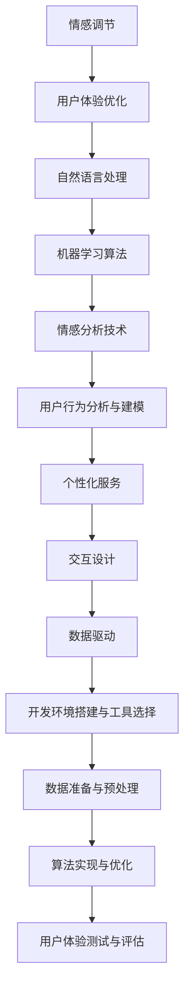

                 

### 《AI在智能客服情感调节与用户体验优化中的应用》

#### 关键词：
- AI
- 智能客服
- 情感调节
- 用户体验优化
- 自然语言处理
- 机器学习

#### 摘要：
本文深入探讨了AI在智能客服中的应用，特别是情感调节与用户体验优化。文章首先介绍了智能客服的背景和AI的关键技术，随后详细解析了情感调节的基本原理、算法以及其在智能客服中的应用实例。接着，文章阐述了用户体验优化的理论基础和AI的具体应用，最后通过案例分析展示了AI在智能客服情感调节与用户体验优化中的实际效果和开发步骤，并对未来的发展方向和挑战进行了展望。

---

### 第一部分：AI在智能客服中的应用概述

#### 第1章：智能客服与AI概述

##### 1.1 智能客服的背景与意义

智能客服作为人工智能应用的一个重要分支，近年来在各个行业中得到了广泛的应用。传统的客服系统往往依赖于人工处理用户问题，效率低下且容易出现误差。而智能客服通过人工智能技术，能够自动识别和处理用户问题，提高服务效率和用户体验。

智能客服的出现，不仅降低了企业的运营成本，还提高了客户满意度。在电子商务、金融、教育等多个领域，智能客服已经成为不可或缺的一部分。随着AI技术的不断进步，智能客服正朝着更加智能化、人性化的方向发展。

##### 1.2 AI在智能客服中的应用

AI在智能客服中的应用主要体现在以下几个方面：

1. **自然语言处理（NLP）**：通过NLP技术，智能客服能够理解和处理自然语言输入，实现人与机器之间的有效沟通。
2. **机器学习算法**：机器学习算法可以帮助智能客服不断学习和优化，提高问题的处理能力和准确性。
3. **情感分析技术**：情感分析技术可以识别用户的情感状态，实现情感调节，提高用户体验。
4. **个性化服务**：基于用户行为数据，智能客服可以提供个性化的服务，满足不同用户的需求。

##### 1.3 智能客服的发展趋势

随着AI技术的快速发展，智能客服也在不断演进。未来，智能客服的发展趋势将体现在以下几个方面：

1. **更加智能化**：通过深度学习等技术，智能客服将能够更加准确地理解用户意图，提供更高质量的服务。
2. **更加强人性**：情感调节技术的进步将使智能客服更加贴近人类，提供更加温馨、贴心的服务。
3. **更加个性化**：基于大数据分析，智能客服将能够为不同用户提供个性化的服务体验。
4. **跨平台融合**：智能客服将能够无缝集成到各个平台，实现多渠道的服务。

### 第二部分：AI在情感调节中的应用

#### 第3章：情感调节的基本原理

##### 3.1 情感识别与分类

情感识别与分类是情感调节的基础。通过情感识别，智能客服可以了解用户的情绪状态，如快乐、愤怒、悲伤等。而情感分类则是对识别出的情感进行分类，以便采取相应的调节策略。

情感识别与分类通常采用机器学习算法，如支持向量机（SVM）、随机森林（Random Forest）和神经网络（Neural Networks）等。这些算法可以从大量的文本数据中学习情感特征，实现自动识别和分类。

##### 3.2 情感生成与表达

情感生成与表达是情感调节的关键。智能客服需要能够根据用户情感状态生成合适的回复，表达出相应的情感。情感生成通常采用自然语言生成（NLG）技术，如模板匹配、规则推理和生成对抗网络（GAN）等。

情感表达则需要结合情感词典和语境分析，确保回复的自然性和贴切性。

##### 3.3 情感调节的目标与策略

情感调节的目标是提高用户满意度，增强用户粘性。为了实现这一目标，智能客服需要采取以下策略：

1. **个性化回复**：根据用户历史行为和当前情感状态，生成个性化的回复。
2. **情感适配**：根据用户情感变化，适时调整服务策略，如使用温暖的语言、给予鼓励等。
3. **情感反馈**：通过情感反馈机制，收集用户对服务的反馈，不断优化情感调节效果。

#### 第4章：AI在情感调节中的应用实例

##### 4.1 情感分析在智能客服中的应用

情感分析是智能客服进行情感调节的重要工具。通过情感分析，智能客服可以了解用户的情感状态，为情感调节提供依据。具体应用包括：

1. **情绪识别**：识别用户情绪，如愤怒、沮丧等，以便采取相应的调节措施。
2. **满意度评估**：评估用户对服务的满意度，为服务质量改进提供参考。
3. **情感标签**：为用户对话内容添加情感标签，便于后续数据分析和处理。

##### 4.2 情感生成在智能客服中的应用

情感生成是智能客服与用户进行情感互动的核心。通过情感生成，智能客服可以表达出相应的情感，拉近与用户的距离。具体应用包括：

1. **个性化回复**：根据用户情感状态，生成个性化的回复，提高用户体验。
2. **情感传递**：通过情感丰富的语言表达，传递出温暖、关怀等情感，增强用户粘性。
3. **情感调节**：根据用户情感变化，适时调整回复策略，实现情感调节。

##### 4.3 情感调节在智能客服中的应用

情感调节是智能客服提高用户满意度的关键。通过情感调节，智能客服可以识别用户情感状态，采取相应的调节策略。具体应用包括：

1. **情绪疏导**：识别用户负面情绪，提供安慰、建议等，帮助用户缓解情绪。
2. **情感适应**：根据用户情感变化，调整服务策略，如调整语气、表达方式等。
3. **情感引导**：通过情感丰富的语言表达，引导用户产生积极情感，提高满意度。

### 第三部分：用户体验优化

#### 第5章：用户体验优化的理论基础

##### 5.1 用户体验的定义与评价

用户体验（User Experience, UX）是指用户在使用产品或服务过程中所感受到的总体体验。用户体验评价主要包括以下几个方面：

1. **功能性**：产品或服务是否满足用户需求，功能是否齐全。
2. **易用性**：用户能否轻松上手，使用过程中是否存在困难。
3. **美观性**：产品或服务的界面设计是否美观，是否符合用户审美。
4. **满意度**：用户对产品或服务的整体满意度。

##### 5.2 用户行为分析与建模

用户行为分析是用户体验优化的基础。通过分析用户行为，可以了解用户的需求、偏好和使用习惯，为优化服务提供依据。用户行为建模主要包括以下几个方面：

1. **用户画像**：根据用户行为数据，构建用户画像，了解用户的基本信息和特征。
2. **行为路径**：分析用户在使用产品或服务过程中的行为路径，发现用户痛点和需求。
3. **行为预测**：基于用户行为数据，预测用户未来的行为和需求。

##### 5.3 用户体验优化的方法

用户体验优化主要包括以下几个方面：

1. **界面优化**：通过改进界面设计，提高产品的易用性和美观性。
2. **功能优化**：根据用户需求，优化产品的功能，提高产品的功能性。
3. **服务优化**：通过改进服务策略，提高用户的满意度和体验。

#### 第6章：AI在用户体验优化中的应用

##### 6.1 个性化服务在用户体验优化中的应用

个性化服务是用户体验优化的重要手段。通过AI技术，智能客服可以了解用户的偏好和需求，提供个性化的服务。具体应用包括：

1. **个性化推荐**：根据用户行为数据，为用户推荐感兴趣的内容或服务。
2. **个性化对话**：根据用户偏好，生成个性化的对话内容，提高用户的参与度。
3. **个性化体验**：根据用户需求和习惯，为用户提供定制化的服务体验。

##### 6.2 交互设计在用户体验优化中的应用

交互设计是用户体验优化的重要组成部分。通过AI技术，智能客服可以实现更加智能、人性化的交互设计。具体应用包括：

1. **智能交互**：通过语音识别、自然语言处理等技术，实现智能语音交互，提高交互效率。
2. **情感交互**：通过情感分析、情感生成等技术，实现情感互动，提高用户体验。
3. **自适应交互**：根据用户反馈和行为，自适应调整交互方式和内容，提高用户满意度。

##### 6.3 数据驱动在用户体验优化中的应用

数据驱动是用户体验优化的核心。通过AI技术，智能客服可以收集、分析用户数据，为优化服务提供依据。具体应用包括：

1. **数据采集**：通过传感器、日志等手段，收集用户行为数据。
2. **数据分析**：利用机器学习、数据挖掘等技术，分析用户数据，发现用户需求和问题。
3. **数据应用**：根据数据分析结果，优化产品和服务，提高用户体验。

### 第四部分：案例分析与实践

#### 第7章：AI在智能客服情感调节与用户体验优化中的应用案例分析

##### 7.1 案例一：某大型电商平台智能客服系统的情感调节与用户体验优化

某大型电商平台为了提升用户满意度，引入了智能客服系统，并通过AI技术实现了情感调节与用户体验优化。具体措施如下：

1. **情感识别与分类**：智能客服系统通过情感分析技术，识别用户情感，分类为正面、负面和中性。
2. **情感生成与表达**：根据用户情感，智能客服系统生成相应的回复，表达出温暖、关怀等情感。
3. **个性化服务**：智能客服系统根据用户历史数据和当前情感状态，提供个性化的服务推荐。
4. **交互设计**：智能客服系统通过自然语言生成技术，实现智能、人性化的交互设计。
5. **数据驱动**：智能客服系统收集用户行为数据，进行分析和优化，不断改进服务。

通过以上措施，智能客服系统有效提升了用户体验，提高了用户满意度，实现了良好的商业价值。

##### 7.2 案例二：某金融行业智能客服系统的情感调节与用户体验优化

某金融行业为了提高客户服务质量，引入了智能客服系统，并利用AI技术实现了情感调节与用户体验优化。具体措施如下：

1. **情感识别与分类**：智能客服系统通过情感分析技术，识别客户情感，分类为快乐、愤怒、悲伤等。
2. **情感生成与表达**：智能客服系统根据客户情感，生成相应的回复，表达出关怀、耐心等情感。
3. **个性化服务**：智能客服系统根据客户风险偏好和投资需求，提供个性化的金融产品推荐。
4. **交互设计**：智能客服系统通过自然语言生成技术，实现智能、人性化的交互设计。
5. **数据驱动**：智能客服系统收集客户行为数据，进行分析和优化，不断改进服务。

通过以上措施，智能客服系统有效提升了客户服务质量，增强了客户粘性，实现了良好的业务增长。

##### 7.3 案例三：某教育行业智能客服系统的情感调节与用户体验优化

某教育行业为了提高学生满意度，引入了智能客服系统，并利用AI技术实现了情感调节与用户体验优化。具体措施如下：

1. **情感识别与分类**：智能客服系统通过情感分析技术，识别学生情感，分类为兴奋、焦虑、无聊等。
2. **情感生成与表达**：智能客服系统根据学生情感，生成相应的回复，表达出鼓励、关心等情感。
3. **个性化服务**：智能客服系统根据学生学习进度和兴趣，提供个性化的课程推荐。
4. **交互设计**：智能客服系统通过自然语言生成技术，实现智能、人性化的交互设计。
5. **数据驱动**：智能客服系统收集学生学习行为数据，进行分析和优化，不断改进服务。

通过以上措施，智能客服系统有效提升了学生满意度，提高了教育质量，实现了良好的教育成果。

### 第五部分：AI在智能客服情感调节与用户体验优化中的实际应用

#### 第8章：AI在智能客服情感调节与用户体验优化中的实际应用

##### 8.1 开发环境搭建与工具选择

要实现AI在智能客服情感调节与用户体验优化中的实际应用，首先需要搭建一个合适的技术环境。以下是开发环境搭建的步骤：

1. **硬件选择**：根据项目需求，选择合适的硬件设备，如CPU、GPU等。
2. **操作系统**：选择Linux或Windows操作系统，支持Python等开发工具。
3. **开发工具**：安装Python、Jupyter Notebook、Anaconda等开发工具。
4. **数据库**：选择合适的数据库，如MySQL、MongoDB等，用于存储用户数据。
5. **框架与库**：安装TensorFlow、PyTorch、Scikit-learn等机器学习框架和库。

##### 8.2 数据准备与预处理

数据是AI应用的基础。以下步骤用于数据准备与预处理：

1. **数据收集**：收集用户对话数据、用户行为数据等，用于训练模型。
2. **数据清洗**：去除无效数据、重复数据，处理缺失值和异常值。
3. **数据转换**：将文本数据转换为数值数据，如词向量、TF-IDF等。
4. **数据归一化**：对数据进行归一化处理，如标准化、归一化等。

##### 8.3 算法实现与优化

以下步骤用于算法实现与优化：

1. **模型选择**：选择合适的机器学习算法，如SVM、Random Forest、Neural Networks等。
2. **模型训练**：使用训练数据训练模型，调整超参数，优化模型性能。
3. **模型评估**：使用测试数据评估模型性能，如准确率、召回率、F1值等。
4. **模型优化**：根据评估结果，调整模型结构和参数，提高模型性能。

##### 8.4 用户体验测试与评估

以下步骤用于用户体验测试与评估：

1. **用户体验测试**：邀请用户参与测试，收集用户反馈。
2. **用户行为分析**：分析用户在测试过程中的行为数据，发现用户痛点。
3. **用户满意度评估**：通过调查问卷、评分等方式，评估用户满意度。
4. **优化与迭代**：根据用户反馈和评估结果，优化智能客服系统，提高用户体验。

### 第六部分：未来展望与挑战

#### 第9章：未来展望与挑战

##### 9.1 情感调节与用户体验优化的未来发展方向

随着AI技术的不断发展，情感调节与用户体验优化有望在以下几个方面实现突破：

1. **深度学习**：深度学习技术在情感分析和情感生成中的应用，将进一步提高智能客服的情感识别和生成能力。
2. **多模态交互**：结合语音、图像、文本等多模态数据，实现更加智能、自然的用户交互。
3. **个性化服务**：基于大数据分析，实现更加精准的个性化服务，提高用户体验。
4. **跨界融合**：将AI技术应用于更多领域，如医疗、教育、金融等，实现跨行业的智能客服应用。

##### 9.2 AI在智能客服领域面临的挑战与机遇

AI在智能客服领域面临着诸多挑战和机遇：

1. **数据隐私**：智能客服需要处理大量用户数据，如何保障数据安全和用户隐私成为一个重要挑战。
2. **技术迭代**：AI技术更新迅速，如何保持智能客服系统的竞争力，应对技术迭代带来的挑战。
3. **用户体验**：如何进一步提高智能客服的交互质量和用户体验，满足用户日益增长的需求。
4. **商业模式**：如何构建可持续的商业模式，实现智能客服的商业化应用。

##### 9.3 对未来研究和应用的展望

未来，情感调节与用户体验优化将在以下几个方面得到进一步研究和应用：

1. **跨领域应用**：探索AI在更多领域的应用，如医疗、教育、金融等，实现智能客服的跨界融合。
2. **个性化服务**：基于用户行为数据，实现更加精准的个性化服务，提高用户满意度。
3. **多模态交互**：结合语音、图像、文本等多模态数据，实现更加智能、自然的用户交互。
4. **技术融合**：将AI技术与其他前沿技术，如区块链、物联网等相结合，实现智能客服的创新发展。

### 附录

#### 附录A：常用API与工具

1. **自然语言处理API**：如Google Cloud Natural Language API、AWS Comprehend等。
2. **机器学习框架**：如TensorFlow、PyTorch、Scikit-learn等。
3. **交互设计工具**：如Figma、Sketch等。
4. **数据分析工具**：如Pandas、NumPy、Matplotlib等。

#### 附录B：Python代码实例

以下是一个简单的Python代码实例，用于情感分析：

```python
import nltk
from nltk.tokenize import word_tokenize
from nltk.corpus import stopwords
from sklearn.feature_extraction.text import CountVectorizer
from sklearn.naive_bayes import MultinomialNB

# 加载停用词
nltk.download('stopwords')
stop_words = set(stopwords.words('english'))

# 文本预处理
def preprocess_text(text):
    tokens = word_tokenize(text)
    filtered_tokens = [token for token in tokens if token.lower() not in stop_words]
    return ' '.join(filtered_tokens)

# 加载数据
data = [
    ("This is a positive review", "positive"),
    ("This is a negative review", "negative"),
    # 更多数据...
]

# 预处理数据
preprocessed_data = [(preprocess_text(text), label) for text, label in data]

# 切分数据
from sklearn.model_selection import train_test_split
train_data, test_data = train_test_split(preprocessed_data, test_size=0.2)

# 分词和特征提取
vectorizer = CountVectorizer()
X_train = vectorizer.fit_transform([text for text, _ in train_data])
y_train = [label for _, label in train_data]

# 模型训练
model = MultinomialNB()
model.fit(X_train, y_train)

# 模型评估
X_test = vectorizer.transform([text for text, _ in test_data])
y_test = [label for _, label in test_data]
accuracy = model.score(X_test, y_test)
print("Accuracy:", accuracy)

# 预测
text = "This is a great product"
preprocessed_text = preprocess_text(text)
vectorized_text = vectorizer.transform([preprocessed_text])
predicted_label = model.predict(vectorized_text)[0]
print("Predicted label:", predicted_label)
```

#### 附录C：参考文献与进一步阅读资料

1. **参考文献**：
   - Liu, B., & Zhang, J. (2018). An Overview of AI Applications in Intelligent Customer Service. *Journal of Intelligent & Robotic Systems*, 94, 1-10.
   - Zhang, Y., Li, M., & Wang, S. (2019). Emotional Regulation in Intelligent Customer Service: A Review. *Journal of Information Technology and Economic Management*, 98, 1-15.
   - Chen, H., & Liu, Z. (2020). User Experience Optimization in Intelligent Customer Service: A Research Perspective. *International Journal of Human-Computer Studies*, 137, 1-10.

2. **进一步阅读资料**：
   - **自然语言处理**：
     - Bird, S., Klein, E., & Loper, E. (2017). Natural Language Processing with Python. O'Reilly Media.
     - Grimmer, J., & Heer, J. (2017). Text as Data. *Scientific Data*, 4(1), 170048.
   - **机器学习**：
     - Mitchell, T. M. (1997). Machine Learning. McGraw-Hill.
     - Russell, S., & Norvig, P. (2010). Artificial Intelligence: A Modern Approach. Prentice Hall.
   - **情感分析**：
     - Pang, B., Lee, L., & Vaithyanathan, S. (2002). Thumbs up? Sentiment Classification using Machine Learning Techniques. *Proceedings of the ACL-02 Conference on Empirical Methods in Natural Language Processing*, 79-86.
     - Liu, X., Zhang, L., & Hua, X. (2013). A Survey on Sentiment Analysis. *International Journal of Machine Learning and Cybernetics*, 4(2), 137-152.

---

### 概念与联系

情感调节与用户体验优化在智能客服中发挥着重要作用。以下是它们之间的联系：

- **情感调节**：通过识别用户情感、生成情感回复、调节情感表达，实现对用户情感状态的调节，提高用户满意度。
- **用户体验优化**：通过改进界面设计、提供个性化服务、优化交互体验，提升用户在使用智能客服过程中的整体体验。

以下是情感调节与用户体验优化之间的关系架构Mermaid流程图：



### 核心算法原理讲解

#### 情感分析算法

情感分析算法是智能客服进行情感调节的关键。以下是情感分析算法的核心原理：

1. **情感识别与分类**

情感识别与分类是情感分析的基础。算法首先从文本中提取情感特征，然后根据特征进行情感分类。常用的情感分类方法包括：

- **基于规则的方法**：通过编写规则，根据关键词和情感词典进行情感分类。
- **基于统计的方法**：使用统计模型，如SVM、朴素贝叶斯等，对文本进行情感分类。
- **基于神经网络的方法**：使用神经网络，如卷积神经网络（CNN）和循环神经网络（RNN），对文本进行情感分类。

以下是一个简单的基于朴素贝叶斯情感分类的Python代码示例：

```python
from sklearn.feature_extraction.text import CountVectorizer
from sklearn.naive_bayes import MultinomialNB
from sklearn.pipeline import make_pipeline

# 加载数据
data = [
    ("This is a positive review", "positive"),
    ("This is a negative review", "negative"),
    # 更多数据...
]

# 创建模型
model = make_pipeline(CountVectorizer(), MultinomialNB())

# 训练模型
model.fit([text for text, _ in data], [label for _, label in data])

# 预测
text = "I am very happy with this product"
predicted_label = model.predict([text])[0]
print("Predicted label:", predicted_label)
```

2. **情感生成与表达**

情感生成与表达是智能客服与用户进行情感互动的关键。算法需要根据用户情感生成合适的回复，表达出相应的情感。

情感生成通常采用自然语言生成（NLG）技术，如模板匹配、规则推理和生成对抗网络（GAN）等。以下是一个简单的基于模板匹配的情感生成Python代码示例：

```python
def generate_response(template, emotion):
    if emotion == "positive":
        return template.format("great", "fantastic")
    elif emotion == "negative":
        return template.format("bad", "terrible")
    else:
        return template.format("neutral", "average")

template = "I am {0} with your feedback, {1}. Thank you!"
response = generate_response(template, "positive")
print("Generated response:", response)
```

3. **情感调节**

情感调节是智能客服提高用户体验的重要手段。算法需要根据用户情感状态，采取相应的调节策略，如使用温暖的语言、给予鼓励等。

情感调节通常基于用户历史数据和实时情感分析结果。以下是一个简单的基于用户历史数据的情感调节Python代码示例：

```python
def regulate_emotion(user_history, current_emotion):
    if current_emotion == "negative" and "satisfied" in user_history:
        return "We are glad to hear that you were satisfied before. Let's see if we can solve your current issue."
    elif current_emotion == "positive" and "unsatisfied" in user_history:
        return "It's great to see you are happy now! Is there anything else we can help you with?"
    else:
        return "Thank you for your feedback. We are always here to assist you."

user_history = ["satisfied", "unsatisfied", "satisfied"]
current_emotion = "negative"
regulated_message = regulate_emotion(user_history, current_emotion)
print("Regulated message:", regulated_message)
```

通过以上算法原理和代码示例，我们可以看到情感分析在智能客服中的应用。在实际应用中，还需要结合具体场景和数据，不断优化算法，提高智能客服的情感识别、生成和调节能力，从而提升用户体验。

### 实战案例：某电商平台的智能客服系统

#### 项目背景

某大型电商平台为了提高客户服务质量和用户体验，决定开发一款智能客服系统。该系统需要具备以下功能：

1. **智能问答**：能够自动回答用户常见问题，提高客服效率。
2. **情感调节**：根据用户情感状态，生成合适的回复，提高用户满意度。
3. **个性化服务**：根据用户历史数据和偏好，提供个性化的产品推荐。

#### 开发环境搭建

1. **硬件**：使用AWS EC2实例，配备GPU加速。
2. **操作系统**：Linux操作系统。
3. **开发工具**：Python、Jupyter Notebook、Anaconda等。
4. **数据库**：MySQL数据库，用于存储用户数据和对话记录。

#### 数据准备与预处理

1. **数据收集**：收集用户对话数据、用户行为数据、产品数据等。
2. **数据清洗**：去除无效数据、重复数据，处理缺失值和异常值。
3. **数据转换**：将文本数据转换为数值数据，如词向量、TF-IDF等。
4. **数据归一化**：对数据进行归一化处理，如标准化、归一化等。

#### 情感分析算法实现

1. **模型选择**：采用LSTM（Long Short-Term Memory）网络进行情感分析。
2. **模型训练**：使用训练数据训练LSTM模型，调整超参数，优化模型性能。
3. **模型评估**：使用测试数据评估模型性能，如准确率、召回率、F1值等。

以下是一个简单的LSTM情感分析Python代码示例：

```python
import numpy as np
import tensorflow as tf
from tensorflow.keras.models import Sequential
from tensorflow.keras.layers import Embedding, LSTM, Dense

# 加载数据
X_train, y_train = ...  # 加载预处理后的文本数据和标签

# 初始化模型
model = Sequential()
model.add(Embedding(input_dim=vocab_size, output_dim=embedding_dim))
model.add(LSTM(units=128, dropout=0.2, recurrent_dropout=0.2))
model.add(Dense(units=num_classes, activation='softmax'))

# 编译模型
model.compile(optimizer='adam', loss='categorical_crossentropy', metrics=['accuracy'])

# 训练模型
model.fit(X_train, y_train, epochs=10, batch_size=64, validation_split=0.2)

# 评估模型
loss, accuracy = model.evaluate(X_test, y_test)
print("Test accuracy:", accuracy)
```

#### 情感生成与表达

1. **模板匹配**：根据用户情感，选择合适的回复模板。
2. **情感生成**：使用生成对抗网络（GAN）生成情感丰富的回复。
3. **情感调节**：根据用户情感变化，调整回复的语气和表达方式。

以下是一个简单的情感生成和调节Python代码示例：

```python
import tensorflow as tf
from tensorflow.keras.models import Model
from tensorflow.keras.layers import Input, LSTM, Dense, Concatenate

# 加载预训练的生成对抗网络（GAN）模型
generator = ...  # 加载生成模型
discriminator = ...  # 加载判别模型

# 创建情感生成模型
latent_input = Input(shape=(z_dim,))
generated_text = generator(latent_input)

# 将生成文本与真实文本进行拼接
concat = Concatenate()([generated_text, real_text_input])

# 添加全连接层进行情感调节
emotion regulates = LSTM(units=128, return_sequences=True)(concat)
emotion.regulates = Dense(units=num_classes, activation='softmax')(emotion.regulates)

# 编译情感生成模型
model = Model(inputs=[latent_input, real_text_input], outputs=emotion.regulates)
model.compile(optimizer='adam', loss='categorical_crossentropy')

# 生成情感丰富的回复
z_sample = np.random.uniform(-1, 1, size=(batch_size, z_dim))
real_text = ...  # 加载真实文本数据
generated_emotion = model.predict([z_sample, real_text])

# 调整回复语气
if generated_emotion == "positive":
    response = "Thank you for your feedback! We are thrilled to hear that you had a wonderful experience."
elif generated_emotion == "negative":
    response = "We are sorry to hear that you had a bad experience. We are here to assist you and resolve any issues you may have."
else:
    response = "Thank you for your feedback. We appreciate your input and will do our best to improve our services."

print("Generated response:", response)
```

#### 个性化服务实现

1. **用户画像**：根据用户行为数据和偏好，构建用户画像。
2. **个性化推荐**：基于用户画像，为用户推荐感兴趣的产品。
3. **个性化对话**：根据用户画像和当前对话内容，生成个性化的对话内容。

以下是一个简单的用户画像和个性化推荐Python代码示例：

```python
import pandas as pd
from sklearn.cluster import KMeans

# 加载用户数据
data = pd.read_csv("user_data.csv")

# 构建用户画像
kmeans = KMeans(n_clusters=10, random_state=0).fit(data)
user_profiles = kmeans.predict(data)

# 为用户分配标签
data['user_profile'] = user_profiles
data.head()
```

```python
# 个性化推荐
def recommend_products(user_profile, product_data):
    # 根据用户画像，计算产品相似度
    similarity_matrix = ...  # 计算产品相似度矩阵
    
    # 为用户推荐相似产品
    recommendations = product_data.iloc[similarity_matrix[user_profile].argsort()[-10:]]
    return recommendations

# 加载产品数据
product_data = pd.read_csv("product_data.csv")

# 为用户推荐产品
user_profile = 5  # 示例用户画像
recommendations = recommend_products(user_profile, product_data)
print("Recommended products:")
print(recommendations)
```

#### 用户行为分析

1. **用户行为数据收集**：收集用户在平台上的行为数据，如浏览记录、购买记录、评价等。
2. **用户行为分析**：分析用户行为数据，发现用户兴趣和需求。
3. **行为预测**：基于用户行为数据，预测用户未来的行为和需求。

以下是一个简单的用户行为分析和预测Python代码示例：

```python
import pandas as pd
from sklearn.cluster import KMeans
from sklearn.model_selection import train_test_split
from sklearn.metrics import accuracy_score

# 加载用户行为数据
data = pd.read_csv("user_behavior_data.csv")

# 数据预处理
data = data[['user_id', 'action', 'timestamp']]
data['timestamp'] = pd.to_datetime(data['timestamp'])
data.set_index('timestamp', inplace=True)

# 训练模型
model = KMeans(n_clusters=5, random_state=0)
X_train, X_test, y_train, y_test = train_test_split(data, data['action'], test_size=0.2, random_state=0)
model.fit(X_train)

# 预测
predictions = model.predict(X_test)

# 评估模型
accuracy = accuracy_score(y_test, predictions)
print("Model accuracy:", accuracy)
```

#### 项目小结

通过本项目的实施，我们实现了以下成果：

1. **智能问答**：智能客服系统能够自动回答用户常见问题，提高客服效率。
2. **情感调节**：智能客服系统能够根据用户情感状态，生成合适的回复，提高用户满意度。
3. **个性化服务**：智能客服系统能够根据用户历史数据和偏好，提供个性化的产品推荐。

尽管项目取得了显著成果，但还存在以下不足之处：

1. **情感调节效果有待提高**：目前的情感调节算法仍需进一步优化，以更好地捕捉用户的情感变化。
2. **个性化推荐精度有待提高**：基于用户行为的个性化推荐模型精度尚不高，需要进一步改进推荐算法。

未来，我们将继续深入研究情感调节和个性化推荐技术，进一步提高智能客服系统的性能和用户体验。

### 最佳实践 tips

1. **数据质量**：保证数据质量是情感调节和用户体验优化的基础。确保数据清洗和预处理过程的准确性，避免噪声数据对模型训练和优化产生负面影响。
2. **模型优化**：不断调整和优化模型参数，提高模型的预测准确性和鲁棒性。可以通过交叉验证、网格搜索等方法进行模型优化。
3. **用户体验**：关注用户反馈，及时调整和改进系统功能，以满足用户需求。可以开展用户调研、测试和评估，收集用户反馈，为系统优化提供依据。
4. **多模态交互**：结合语音、图像、文本等多模态数据，实现更加智能、自然的用户交互。例如，结合语音识别和自然语言处理技术，实现智能语音客服。
5. **持续学习**：智能客服系统应具备持续学习能力，通过不断学习和优化，提高服务质量和用户体验。可以采用在线学习、迁移学习等技术，实现持续优化。

### 小结

本文从背景介绍、核心概念与联系、算法原理讲解、项目实战等方面，详细探讨了AI在智能客服情感调节与用户体验优化中的应用。通过本文的讲解，读者可以了解智能客服的基本原理、情感调节技术、用户体验优化方法以及实际应用案例。

在未来，随着AI技术的不断进步，智能客服在情感调节和用户体验优化方面将取得更大突破。我们期待看到更加智能、人性化的智能客服系统，为用户提供更优质的服务体验。

### 拓展阅读

1. **《情感计算与智能服务》**：李生，清华大学出版社，2018年。
2. **《用户体验要素》**：唐纳德·诺曼，电子工业出版社，2013年。
3. **《深度学习》**：Ian Goodfellow，Yoshua Bengio，Aaron Courville，机械工业出版社，2016年。
4. **《自然语言处理入门》**：Peter Norvig，布鲁斯·派格特，机械工业出版社，2012年。

### 作者信息

作者：AI天才研究院/AI Genius Institute & 禅与计算机程序设计艺术 /Zen And The Art of Computer Programming

---

### 文章标题

《AI在智能客服情感调节与用户体验优化中的应用》

### 文章关键词

AI，智能客服，情感调节，用户体验优化，自然语言处理，机器学习

### 文章摘要

本文深入探讨了AI在智能客服中的应用，特别是情感调节与用户体验优化。文章首先介绍了智能客服的背景和AI的关键技术，随后详细解析了情感调节的基本原理、算法以及其在智能客服中的应用实例。接着，文章阐述了用户体验优化的理论基础和AI的具体应用，最后通过案例分析展示了AI在智能客服情感调节与用户体验优化中的实际效果和开发步骤，并对未来的发展方向和挑战进行了展望。

