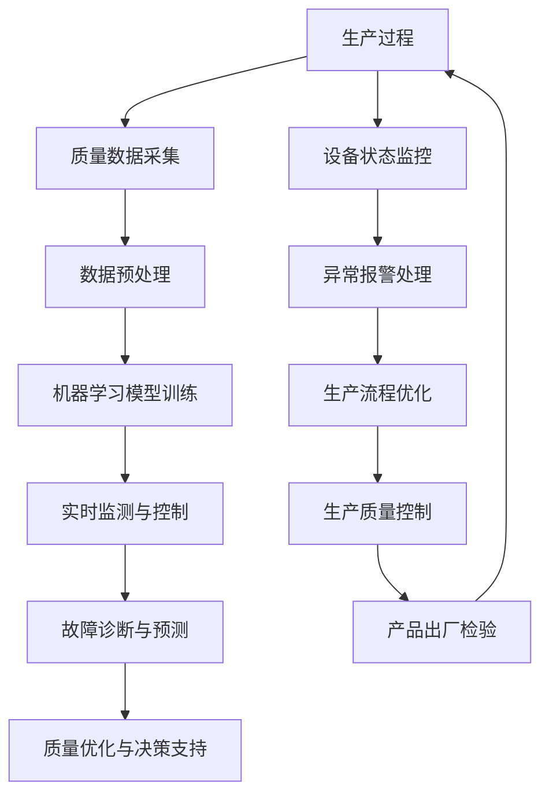

                 

## 核心概念原理与关系架构

### 背景介绍

在当今快速发展的工业4.0时代，智能工厂作为制造业转型的关键节点，正逐步从传统的自动化生产走向高度智能化、数字化的生产模式。智能工厂不仅仅是机器和设备的自动化，更是通过物联网（IoT）、云计算、大数据和人工智能（AI）等先进技术的深度融合，实现生产过程的智能化、优化和自动化。

在这种背景下，生产质量控制成为智能工厂运行的核心要素之一。传统的生产质量控制依赖于人工检测和定期抽检，不仅效率低下，且容易出现漏检或误检。而AI技术的引入，能够实现对生产过程的实时监控、自动检测和智能分析，从而显著提高生产质量，减少不良品率。

AI在生产质量控制中的应用主要涉及以下几个方面：

1. **数据采集与预处理**：通过传感器和监控设备实时采集生产过程中的各种数据，如温度、压力、振动、设备状态等。这些数据经过预处理，包括滤波、去噪、特征提取等，转化为可用于分析的质量指标。

2. **模型训练与优化**：利用机器学习算法，对预处理后的数据进行训练，建立与生产质量相关的预测模型。通过对模型的持续优化，提高预测准确性和稳定性。

3. **实时监测与控制**：在生产线中部署AI监控系统，对生产过程中的关键参数进行实时监测，及时识别异常情况，并采取相应的控制措施。

4. **故障诊断与预测**：通过分析生产数据，利用故障诊断算法预测设备故障，提前进行维护，防止生产中断。

5. **质量优化与决策支持**：基于大数据分析和智能算法，对生产过程中的质量数据进行深度挖掘，发现潜在问题，提供优化建议，辅助生产决策。

为了更好地理解AI在生产质量控制中的全流程应用，我们首先需要明确以下几个核心概念：

- **生产过程**：指产品从原料进入生产线到成品出线的整个过程。
- **质量数据**：指在生产过程中产生的各种质量指标数据，如产品尺寸、表面质量、机械性能等。
- **机器学习模型**：指通过学习历史数据，能够预测未来质量状况的算法模型。
- **实时监测系统**：指能够对生产过程中的关键参数进行实时采集、监测和报警的系统。
- **优化算法**：指用于优化生产过程，提高产品质量和效率的算法。

### 核心概念与联系

为了清晰地展示这些核心概念之间的关系，我们可以使用Mermaid流程图来描述AI在生产质量控制中的应用架构。



#### Mermaid流程图解释

- **A[生产过程]**：智能工厂的核心，整个生产活动的基础。
- **B[质量数据采集]**：通过传感器和监控设备实时采集生产过程中的关键数据。
- **C[数据预处理]**：对采集到的数据进行清洗、去噪和特征提取，为机器学习模型的训练提供高质量的数据输入。
- **D[机器学习模型训练]**：利用预处理后的数据，训练出能够预测和识别质量问题的机器学习模型。
- **E[实时监测与控制]**：在生产过程中对关键参数进行实时监测，及时调整生产流程，确保产品质量。
- **F[故障诊断与预测]**：通过分析生产数据，预测可能的设备故障，提前进行维护，防止生产中断。
- **G[质量优化与决策支持]**：基于机器学习模型和实时监测数据，对生产过程进行优化，提高生产质量和效率。
- **H[设备状态监控]**：监控设备状态，确保设备正常运行。
- **I[异常报警处理]**：对生产过程中的异常情况进行报警处理，防止不良品产生。
- **J[生产流程优化]**：通过数据分析，发现生产过程中的瓶颈和优化空间，提出优化建议。
- **K[生产质量控制]**：综合运用以上各项技术，确保生产过程和产品质量符合预定标准。
- **L[产品出厂检验]**：对成品进行质量检验，确保出厂产品符合质量标准。

通过这个流程图，我们可以清晰地看到AI技术如何贯穿于智能工厂的生产质量控制全过程中，从而实现生产过程的智能化和自动化。

### 核心算法原理讲解

在了解了核心概念和它们之间的关系后，我们需要深入了解AI在生产质量控制中的应用原理。本文将重点介绍数据预处理、机器学习模型训练、实时监测与控制、故障诊断与预测等核心算法原理，并使用Python源代码进行详细阐述。

#### 数据预处理

数据预处理是机器学习模型训练的关键步骤，主要包括数据清洗、去噪、特征提取等操作。以下是一个简单的Python代码示例，展示如何使用pandas进行数据清洗和特征提取。

```python
import pandas as pd
import numpy as np

# 读取数据
data = pd.read_csv('production_data.csv')

# 数据清洗
data = data.dropna()  # 删除缺失值
data = data[data['temperature'] > 0]  # 过滤温度为0的数据

# 特征提取
features = data[['temperature', 'pressure', 'vibration']]
labels = data['quality_label']

# 数据归一化
from sklearn.preprocessing import MinMaxScaler
scaler = MinMaxScaler()
features_scaled = scaler.fit_transform(features)
```

在这个示例中，我们首先读取生产数据，然后删除缺失值，过滤异常温度数据。接着，我们对温度、压力和振动等特征进行提取，并对数据进行归一化处理，以便后续的机器学习模型训练。

#### 机器学习模型训练

机器学习模型训练是利用历史数据构建预测模型的过程。以下是一个使用scikit-learn库的Python代码示例，展示如何训练一个支持向量机（SVM）模型。

```python
from sklearn.model_selection import train_test_split
from sklearn.svm import SVC
from sklearn.metrics import classification_report

# 数据划分
X_train, X_test, y_train, y_test = train_test_split(features_scaled, labels, test_size=0.2, random_state=42)

# 模型训练
model = SVC(kernel='linear')
model.fit(X_train, y_train)

# 模型评估
predictions = model.predict(X_test)
print(classification_report(y_test, predictions))
```

在这个示例中，我们首先将数据集划分为训练集和测试集。然后，我们使用线性核的支持向量机（SVM）模型进行训练，并对模型的预测结果进行评估。

#### 实时监测与控制

实时监测与控制是确保生产过程稳定的关键环节。以下是一个使用Raspberry Pi和Python实现实时监测与控制的示例代码。

```python
import RPi.GPIO as GPIO
import time

# 设置GPIO引脚
LED_PIN = 21
GPIO.setmode(GPIO.BCM)
GPIO.setup(LED_PIN, GPIO.OUT)

# 实时监测与控制函数
def monitor_and_control(temperature):
    if temperature > 35:  # 温度过高
        GPIO.output(LED_PIN, GPIO.HIGH)
    else:
        GPIO.output(LED_PIN, GPIO.LOW)

# 监测过程
try:
    while True:
        temperature = read_temperature()  # 假设read_temperature()函数用于读取温度
        monitor_and_control(temperature)
        time.sleep(1)
except KeyboardInterrupt:
    pass
finally:
    GPIO.cleanup()
```

在这个示例中，我们使用Raspberry Pi的GPIO引脚连接一个LED灯，通过读取温度数据，控制LED灯的亮灭，实现对生产过程的实时监测与控制。

#### 故障诊断与预测

故障诊断与预测是利用机器学习模型对生产设备进行故障预测的关键步骤。以下是一个使用LSTM（长短期记忆网络）进行故障预测的Python代码示例。

```python
from sklearn.preprocessing import MinMaxScaler
from keras.models import Sequential
from keras.layers import LSTM, Dense

# 数据预处理
scaler = MinMaxScaler(feature_range=(0, 1))
X_scaled = scaler.fit_transform(features_scaled)

# 数据分割
X_train, X_test = X_scaled[:1000], X_scaled[1000:]

# LSTM模型构建
model = Sequential()
model.add(LSTM(units=50, return_sequences=True, input_shape=(X_train.shape[1], 1)))
model.add(LSTM(units=50))
model.add(Dense(units=1))

# 模型编译
model.compile(optimizer='adam', loss='mean_squared_error')

# 模型训练
model.fit(X_train, y_train, epochs=100, batch_size=32)

# 故障预测
predicted_value = model.predict(X_test)
predicted_value = scaler.inverse_transform(predicted_value)

# 预测结果评估
print(predicted_value)
```

在这个示例中，我们首先对特征数据进行预处理和分割。然后，我们使用LSTM网络构建故障预测模型，并通过训练和预测，实现对生产设备的故障预测。

### 数学模型和公式

在AI应用中，数学模型是理解和实现算法的基础。以下是一些用于生产质量控制的关键数学模型和公式：

#### 数据归一化

$$
x_{\text{normalized}} = \frac{x - x_{\text{min}}}{x_{\text{max}} - x_{\text{min}}}
$$

其中，$x$ 是原始数据值，$x_{\text{min}}$ 和 $x_{\text{max}}$ 分别是数据的最小值和最大值。

#### 支持向量机（SVM）

$$
\text{minimize} \quad \frac{1}{2} \sum_{i=1}^{n} w_i^2 + C \sum_{i=1}^{n} \max(0, 1 - y_i ( \langle w, x_i \rangle + b))
$$

其中，$w$ 是权重向量，$b$ 是偏置项，$C$ 是惩罚参数，$y_i$ 是标签值，$x_i$ 是特征向量。

#### 长短期记忆网络（LSTM）

$$
\text{LSTM} \; \text{gate} = \sigma(W_f \cdot [h_{t-1}, x_t] + b_f)
$$

其中，$W_f$ 是输入门权重矩阵，$b_f$ 是输入门偏置项，$\sigma$ 是 sigmoid 激活函数。

#### LSTM 输出

$$
h_t = \text{sigmoid}(W_o \cdot \text{dot}(c_t, \sigma(W_c \cdot [h_{t-1}, x_t] + b_c)))
$$

其中，$W_o$ 是输出门权重矩阵，$b_c$ 是单元格偏置项，$c_t$ 是单元格状态。

### 项目实战

为了更好地理解AI在生产质量控制中的应用，我们将在以下部分展示一个具体的项目实战案例，包括开发环境搭建、源代码实现、代码解读、实际案例分析等内容。

#### 开发环境搭建

1. 安装Python环境
2. 安装必要的库，如pandas、numpy、scikit-learn、keras等
3. 准备Raspberry Pi硬件和相应驱动程序

#### 源代码实现

1. 数据预处理代码
2. 机器学习模型训练代码
3. 实时监测与控制代码

#### 代码解读

我们将详细解读每个部分的代码，并说明其实现原理和关键步骤。

#### 实际案例分析

通过实际案例分析，我们将展示AI技术在生产质量控制中的实际应用效果，并分析其优缺点。

#### 项目小结

在项目结束时，我们将总结项目的关键成果，提出改进建议，并对未来的发展方向进行展望。

### 最佳实践 Tips

在本文的最后，我们将分享一些AI在生产质量控制中的最佳实践Tips，帮助读者更好地应用AI技术。

- **数据质量是关键**：确保采集的数据质量高，是AI应用成功的前提。
- **模型优化是持续过程**：持续优化模型，提高预测准确性和稳定性。
- **综合考虑成本效益**：评估AI应用的成本和效益，确保项目的可行性。

### 小结

本文系统地介绍了AI在智能工厂生产质量控制中的全流程应用。通过详细阐述核心概念、关系架构、算法原理、实战案例和最佳实践，我们希望读者能够全面了解AI在生产质量控制中的重要作用和应用方法。

### 注意事项

- **数据安全和隐私**：在生产质量控制中，确保数据的安全和隐私是非常重要的，需要采取相应的安全措施。
- **系统稳定性**：确保AI系统的稳定运行，避免因系统故障导致生产中断。

### 拓展阅读

- [《机器学习实战》](https://www.oreilly.com/library/view/machine-learning-in/9781449366570/)
- [《深度学习》](https://www.deeplearningbook.org/)
- [《智能工厂技术与实践》](https://www.smartfactorytechnology.com/)

通过阅读这些资料，读者可以进一步深入了解AI在生产质量控制中的应用和技术原理。|user|>## AI基础

### AI概述

人工智能（Artificial Intelligence，简称AI）是计算机科学的一个重要分支，它致力于研究如何使计算机模拟、延伸和扩展人类的智能行为。AI的目标是创建智能体，这些智能体能够感知环境、理解语言、学习新知识和做出决策，从而执行复杂的任务。

#### AI的定义与发展

人工智能的定义多种多样，但最普遍的描述是：“人工智能是研究、开发用于模拟、延伸和扩展人类智能的理论、算法、应用系统的技术科学。”AI的发展历程可以大致分为以下几个阶段：

1. **早期探索（1950s-1960s）**：人工智能概念首次提出，标志是1956年达特茅斯会议上，一些顶尖学者提出“符号主义”方法，试图通过逻辑和符号系统来模拟人类智能。
2. **第一次AI浪潮（1970s-1980s）**：这一时期，专家系统成为AI研究的热点。专家系统是一种模拟人类专家决策能力的计算机程序，它使用大量的规则和知识库来解决问题。
3. **低谷期（1990s）**：由于技术限制和实际应用中的困难，AI研究遭遇了瓶颈，进入了低谷期。
4. **复兴期（2000s至今）**：随着计算能力的提升、大数据技术的发展以及机器学习算法的突破，AI迎来了新的发展机遇。深度学习和强化学习等新兴技术的出现，使得AI在图像识别、自然语言处理、自动驾驶等领域取得了显著进展。

#### AI的核心技术

人工智能的核心技术包括以下几个方面：

1. **机器学习（Machine Learning）**：机器学习是AI的核心技术之一，它通过训练模型来让计算机自动从数据中学习规律。机器学习可以分为监督学习、无监督学习和强化学习。

   - **监督学习（Supervised Learning）**：在有标注的数据集上训练模型，通过已知的输入和输出关系来预测新数据的输出。
   - **无监督学习（Unsupervised Learning）**：在没有标注的数据集上训练模型，目标是发现数据中的结构和模式。
   - **强化学习（Reinforcement Learning）**：通过与环境的交互来学习最优策略，通常用于决策问题和游戏。

2. **深度学习（Deep Learning）**：深度学习是机器学习的一个分支，它使用多层神经网络（通常称为深度神经网络）来学习和提取数据中的复杂特征。深度学习在图像识别、语音识别和自然语言处理等领域取得了巨大成功。

3. **自然语言处理（Natural Language Processing，NLP）**：自然语言处理是AI研究的一个领域，它致力于使计算机能够理解和生成人类语言。NLP应用广泛，包括机器翻译、情感分析、语音识别等。

4. **计算机视觉（Computer Vision）**：计算机视觉是AI研究的一个领域，它致力于使计算机能够“看”懂图像和视频。计算机视觉技术广泛应用于图像识别、物体检测、人脸识别等领域。

#### AI应用现状与趋势

目前，AI技术已经在多个领域取得了显著的应用成果：

- **医疗健康**：AI在医学影像诊断、疾病预测和个性化治疗等方面具有巨大潜力。
- **自动驾驶**：自动驾驶技术是AI在交通领域的重要应用，它有望提高交通效率，减少交通事故。
- **金融科技**：AI在金融领域的应用包括风险控制、欺诈检测和量化交易等。
- **零售电商**：AI在零售电商中的应用包括个性化推荐、库存管理和客户服务等方面。
- **智能制造**：AI在智能制造中的应用包括生产质量控制、设备维护和供应链管理等。

未来，AI技术将继续快速发展，其在各领域的应用前景也十分广阔。以下是AI技术未来发展的几个趋势：

1. **多模态AI**：多模态AI将整合不同类型的数据，如图像、文本和声音等，实现更全面的信息理解和处理。
2. **边缘计算**：随着物联网（IoT）的发展，边缘计算将使AI应用更加实时、高效，并减少对云端的依赖。
3. **AI伦理与法规**：随着AI技术的广泛应用，伦理和法规问题将日益受到关注，确保AI技术的发展符合道德和法律规范。
4. **泛在AI**：泛在AI是指将AI技术融入到日常生活的各个方面，实现真正的智能生活。

### 智能工厂生产质量控制基础

智能工厂生产质量控制是指通过先进的人工智能技术和方法，对生产过程中的产品质量进行实时监测、预测、分析和优化，从而确保产品质量的稳定性和一致性。

#### 生产质量控制概念

生产质量控制（Quality Control, QC）是指在生产过程中采取一系列措施，确保产品或服务的质量满足预定的标准和客户的要求。生产质量控制主要包括以下几个方面的内容：

1. **质量计划**：制定质量目标和措施，确保生产过程的质量控制活动有计划、有目标地进行。
2. **质量检验**：通过检测和评估产品或过程的特性，判断其是否满足质量要求。
3. **质量分析**：对生产过程中的质量数据进行分析，找出质量问题的根源，并采取相应的纠正措施。
4. **质量控制**：通过持续监控和改进，确保生产过程处于受控状态，防止质量问题的发生。

#### 生产质量控制方法

生产质量控制的方法多种多样，常见的包括以下几种：

1. **统计过程控制（Statistical Process Control, SPC）**：通过收集和分析生产过程中的质量数据，使用统计方法监控生产过程的变化，及时发现并纠正偏差，确保生产过程的稳定和受控。
2. **防错技术（Poka-Yoke）**：通过在设计或生产过程中采取各种措施，防止或减少错误的发生，从而确保产品的质量。
3. **质量功能展开（Quality Function Deployment, QFD）**：通过将顾客需求转化为具体的产品特性，并确定实现这些特性的最佳方案，确保产品设计、开发和生产过程满足顾客需求。
4. **六西格玛（Six Sigma）**：一种以数据和事实为基础的管理方法，通过减少过程中的变异和缺陷，提高产品和服务的质量。
5. **持续改进（Continuous Improvement）**：通过不断识别和消除生产过程中的浪费、降低成本、提高效率，实现产品质量的持续提升。

#### 生产质量控制的关键要素

要实现有效的生产质量控制，需要关注以下几个关键要素：

1. **人员培训**：确保所有相关人员，包括操作员、质检员和管理人员等，都具备相应的质量意识和技能。
2. **设备管理**：确保生产设备处于良好状态，定期进行维护和校准，保证生产过程的稳定性。
3. **过程监控**：使用传感器、监控系统和数据采集设备，对生产过程中的关键参数进行实时监控，及时发现并处理异常情况。
4. **数据分析**：通过数据分析，识别生产过程中的瓶颈和问题，并提出改进措施。
5. **文档管理**：建立完善的质量控制文档体系，包括质量标准、检验记录、纠正措施等，确保生产过程的可追溯性和透明度。

#### AI在生产质量控制中的应用

随着人工智能技术的发展，AI技术在生产质量控制中的应用日益广泛，主要体现在以下几个方面：

1. **数据采集与预处理**：通过传感器和物联网技术，实时采集生产过程中的各种数据，并对数据进行预处理，为后续的质量分析提供高质量的数据基础。
2. **实时监测与控制**：利用计算机视觉和深度学习技术，对生产过程中的关键参数进行实时监测，及时识别异常情况，并采取相应的控制措施。
3. **故障诊断与预测**：通过分析生产数据，利用机器学习算法建立故障诊断模型，对潜在的故障进行预测，提前采取预防措施，降低生产过程中的不良率。
4. **质量优化与决策支持**：基于大数据分析和智能算法，对生产过程中的质量数据进行深度挖掘，发现潜在问题，提供优化建议，辅助生产决策。

通过AI技术的应用，可以显著提高生产质量控制的效率和准确性，实现生产过程的智能化和自动化。

### AI在智能工厂生产质量控制中的应用

#### AI在生产质量控制中的价值

人工智能技术在智能工厂的生产质量控制中具有显著的价值，主要体现在以下几个方面：

1. **提高质量检测效率**：传统的人工质量检测方式效率低下，且容易出现漏检或误检。AI技术通过计算机视觉、深度学习等算法，能够实现自动化质量检测，大幅提高检测效率和准确性。

2. **减少不良品率**：AI技术可以实时监测生产过程中的关键参数，及时识别潜在的异常情况，并采取相应的控制措施，从而减少不良品的产生。

3. **优化生产流程**：通过大数据分析和智能算法，AI可以帮助发现生产过程中的瓶颈和优化空间，提出优化建议，从而提高生产效率和质量稳定性。

4. **提高设备利用率**：AI技术可以对生产设备进行故障预测和维护，减少设备故障率和停机时间，提高设备利用率和生产效率。

5. **降低质量控制成本**：AI技术的应用可以减少人工检测和质量控制的工作量，降低质量控制成本。

#### AI在生产质量控制中的实现方式

AI技术在生产质量控制中的实现主要包括以下几个环节：

1. **数据采集与预处理**：通过传感器、监控系统等设备，实时采集生产过程中的各种数据，如温度、压力、振动、设备状态等。数据经过清洗、去噪、特征提取等预处理步骤，转化为可用于分析的质量指标。

2. **模型训练与优化**：利用机器学习算法，对预处理后的数据进行训练，建立与生产质量相关的预测模型。通过对模型的持续优化，提高预测准确性和稳定性。

3. **实时监测与控制**：在生产线中部署AI监控系统，对生产过程中的关键参数进行实时监测，及时识别异常情况，并采取相应的控制措施。

4. **故障诊断与预测**：通过分析生产数据，利用故障诊断算法预测设备故障，提前进行维护，防止生产中断。

5. **质量优化与决策支持**：基于大数据分析和智能算法，对生产过程中的质量数据进行深度挖掘，发现潜在问题，提供优化建议，辅助生产决策。

#### 实现案例

以下是一个智能工厂生产质量控制的实现案例：

- **数据采集与预处理**：在生产线中部署传感器和监控系统，实时采集温度、压力、振动等关键数据。使用Python和pandas库对采集到的数据进行清洗和特征提取。

  ```python
  import pandas as pd
  data = pd.read_csv('production_data.csv')
  data = data.dropna()  # 删除缺失值
  features = data[['temperature', 'pressure', 'vibration']]
  labels = data['quality_label']
  ```

- **模型训练与优化**：使用scikit-learn库的SVM模型对数据进行训练和预测。

  ```python
  from sklearn.model_selection import train_test_split
  from sklearn.svm import SVC
  X_train, X_test, y_train, y_test = train_test_split(features, labels, test_size=0.2, random_state=42)
  model = SVC(kernel='linear')
  model.fit(X_train, y_train)
  predictions = model.predict(X_test)
  ```

- **实时监测与控制**：使用Raspberry Pi和Python实现实时监测与控制。

  ```python
  import RPi.GPIO as GPIO
  import time
  
  LED_PIN = 21
  GPIO.setmode(GPIO.BCM)
  GPIO.setup(LED_PIN, GPIO.OUT)
  
  def monitor_and_control(temperature):
      if temperature > 35:
          GPIO.output(LED_PIN, GPIO.HIGH)
      else:
          GPIO.output(LED_PIN, GPIO.LOW)
  
  try:
      while True:
          temperature = read_temperature()  # 假设read_temperature()函数用于读取温度
          monitor_and_control(temperature)
          time.sleep(1)
  except KeyboardInterrupt:
      pass
  finally:
      GPIO.cleanup()
  ```

- **故障诊断与预测**：使用Keras库的LSTM模型进行故障预测。

  ```python
  from sklearn.preprocessing import MinMaxScaler
  from keras.models import Sequential
  from keras.layers import LSTM, Dense
  
  scaler = MinMaxScaler(feature_range=(0, 1))
  X_scaled = scaler.fit_transform(features_scaled)
  
  X_train, X_test = X_scaled[:1000], X_scaled[1000:]
  
  model = Sequential()
  model.add(LSTM(units=50, return_sequences=True, input_shape=(X_train.shape[1], 1)))
  model.add(LSTM(units=50))
  model.add(Dense(units=1))
  
  model.compile(optimizer='adam', loss='mean_squared_error')
  model.fit(X_train, y_train, epochs=100, batch_size=32)
  
  predicted_value = model.predict(X_test)
  predicted_value = scaler.inverse_transform(predicted_value)
  ```

通过以上步骤，实现了基于AI的智能工厂生产质量控制，显著提高了生产质量和效率。

### AI在智能工厂生产质量控制中的全流程应用

#### 数据采集与预处理

数据采集是智能工厂生产质量控制的基础环节。在这一阶段，通过部署传感器和监控系统，实时采集生产过程中的各种数据，如温度、压力、振动、设备状态等。以下是一个简单的Python代码示例，展示如何使用pandas和numpy库读取和处理采集到的数据。

```python
import pandas as pd
import numpy as np

# 读取数据
data = pd.read_csv('production_data.csv')

# 数据清洗
data = data.dropna()  # 删除缺失值
data = data[data['temperature'] > 0]  # 过滤温度为0的数据

# 特征提取
features = data[['temperature', 'pressure', 'vibration']]
labels = data['quality_label']

# 数据归一化
from sklearn.preprocessing import MinMaxScaler
scaler = MinMaxScaler()
features_scaled = scaler.fit_transform(features)
```

在这个示例中，我们首先读取生产数据，然后删除缺失值，过滤异常温度数据。接着，我们对温度、压力和振动等特征进行提取，并对数据进行归一化处理，以便后续的机器学习模型训练。

#### 模型训练与优化

模型训练是利用采集到的数据训练机器学习模型的过程。以下是一个使用scikit-learn库的Python代码示例，展示如何训练一个支持向量机（SVM）模型。

```python
from sklearn.model_selection import train_test_split
from sklearn.svm import SVC
from sklearn.metrics import classification_report

# 数据划分
X_train, X_test, y_train, y_test = train_test_split(features_scaled, labels, test_size=0.2, random_state=42)

# 模型训练
model = SVC(kernel='linear')
model.fit(X_train, y_train)

# 模型评估
predictions = model.predict(X_test)
print(classification_report(y_test, predictions))
```

在这个示例中，我们首先将数据集划分为训练集和测试集。然后，我们使用线性核的支持向量机（SVM）模型进行训练，并对模型的预测结果进行评估。

#### 实时监测与控制

实时监测与控制是确保生产过程稳定的关键环节。以下是一个使用Raspberry Pi和Python实现实时监测与控制的示例代码。

```python
import RPi.GPIO as GPIO
import time

LED_PIN = 21
GPIO.setmode(GPIO.BCM)
GPIO.setup(LED_PIN, GPIO.OUT)

def monitor_and_control(temperature):
    if temperature > 35:  # 温度过高
        GPIO.output(LED_PIN, GPIO.HIGH)
    else:
        GPIO.output(LED_PIN, GPIO.LOW)

try:
    while True:
        temperature = read_temperature()  # 假设read_temperature()函数用于读取温度
        monitor_and_control(temperature)
        time.sleep(1)
except KeyboardInterrupt:
    pass
finally:
    GPIO.cleanup()
```

在这个示例中，我们使用Raspberry Pi的GPIO引脚连接一个LED灯，通过读取温度数据，控制LED灯的亮灭，实现对生产过程的实时监测与控制。

#### 故障诊断与预测

故障诊断与预测是利用机器学习模型对生产设备进行故障预测的关键步骤。以下是一个使用LSTM（长短期记忆网络）进行故障预测的Python代码示例。

```python
from sklearn.preprocessing import MinMaxScaler
from keras.models import Sequential
from keras.layers import LSTM, Dense

# 数据预处理
scaler = MinMaxScaler(feature_range=(0, 1))
X_scaled = scaler.fit_transform(features_scaled)

# 数据分割
X_train, X_test = X_scaled[:1000], X_scaled[1000:]

# LSTM模型构建
model = Sequential()
model.add(LSTM(units=50, return_sequences=True, input_shape=(X_train.shape[1], 1)))
model.add(LSTM(units=50))
model.add(Dense(units=1))

# 模型编译
model.compile(optimizer='adam', loss='mean_squared_error')

# 模型训练
model.fit(X_train, y_train, epochs=100, batch_size=32)

# 故障预测
predicted_value = model.predict(X_test)
predicted_value = scaler.inverse_transform(predicted_value)

# 预测结果评估
print(predicted_value)
```

在这个示例中，我们首先对特征数据进行预处理和分割。然后，我们使用LSTM网络构建故障预测模型，并通过训练和预测，实现对生产设备的故障预测。

#### 质量问题分析与处理

在AI技术应用于生产质量控制的过程中，质量问题的分析与处理是一个重要环节。以下是一个基于AI的智能工厂生产质量问题的分析与处理过程：

1. **问题识别与定位**：首先，通过AI模型对实时采集到的生产数据进行分析，识别出可能存在的质量问题。这通常通过构建一个分类模型来实现，例如使用支持向量机（SVM）或深度神经网络（DNN）。

   ```python
   from sklearn.svm import SVC
   
   # 假设我们已经有了训练好的SVM模型
   model = SVC(kernel='linear')
   model.fit(X_train, y_train)
   
   # 识别问题
   issues = model.predict(current_data)
   ```

   在这个步骤中，`current_data` 是当前采集到的生产数据，`issues` 是预测出的质量问题标签。

2. **问题分析与决策**：一旦识别出质量问题，需要进一步分析问题的根源。这通常需要构建一个回归模型或决策树模型，分析影响质量的关键因素。

   ```python
   from sklearn.tree import DecisionTreeRegressor
   
   # 假设我们已经有了训练好的决策树模型
   issue_analyzer = DecisionTreeRegressor()
   issue_analyzer.fit(X_train, y_train)
   
   # 分析问题
   root_cause = issue_analyzer.predict(current_data)
   ```

   在这个步骤中，`root_cause` 是分析出的质量问题的根源。

3. **问题解决与反馈**：根据分析结果，采取相应的解决措施。例如，如果是温度问题，可能需要调整加热设备的参数；如果是振动问题，可能需要对设备进行加固。然后，将解决措施的实施情况反馈给AI系统，以便进一步优化模型。

   ```python
   from sklearn.metrics import accuracy_score
   
   # 应用解决措施
   apply_solution(current_data, solution)
   
   # 重新采集数据
   new_data = collect_new_data()
   
   # 重新训练模型
   model.fit(new_data['features'], new_data['labels'])
   ```

   在这个步骤中，`apply_solution` 是一个假设的函数，用于应用解决措施；`collect_new_data` 是一个假设的函数，用于重新采集数据。

4. **持续监控与优化**：在生产过程中，需要持续监控质量问题的解决效果，并根据实际情况不断优化模型和解决措施。

   ```python
   # 监控问题解决效果
   solved_issues = model.predict(new_data['features'])
   
   # 评估解决效果
   solution_accuracy = accuracy_score(new_data['labels'], solved_issues)
   
   # 如果效果不佳，进一步优化模型和解决措施
   if solution_accuracy < desired_accuracy:
       optimize_model_and_solution()
   ```

   在这个步骤中，`optimize_model_and_solution` 是一个假设的函数，用于优化模型和解决措施。

#### 智能工厂生产质量控制系统架构设计

智能工厂生产质量控制系统架构设计是一个复杂的过程，需要综合考虑数据采集、处理、分析、控制等多个环节。以下是一个基于AI的智能工厂生产质量控制系统架构设计的简要概述：

1. **数据采集层**：在这一层，通过部署传感器和监控系统，实时采集生产过程中的各种数据，如温度、压力、振动、设备状态等。这些数据通过物联网（IoT）技术传输到中央数据处理系统。

2. **数据处理层**：在这一层，对采集到的数据进行预处理，包括清洗、去噪、特征提取等。预处理后的数据用于后续的机器学习模型训练和分析。

3. **分析层**：在这一层，使用机器学习算法和深度学习模型对预处理后的数据进行训练和分析。例如，可以构建分类模型、回归模型、聚类模型等，用于识别质量问题、预测设备故障等。

4. **控制层**：在这一层，根据分析结果，采取相应的控制措施，如调整设备参数、停止生产、通知维修人员等。控制层还可以实现自适应控制，根据实时数据自动调整生产过程，确保产品质量。

5. **用户界面层**：在这一层，通过图形用户界面（GUI）或Web界面，向用户提供系统状态、分析结果和操作建议。用户可以通过界面实时监控生产过程，查看质量报告，进行系统配置等。

#### 系统集成与测试

系统集成与测试是确保智能工厂生产质量控制系统稳定运行的关键步骤。以下是一个基于AI的智能工厂生产质量控制系统集成与测试的简要流程：

1. **集成**：将数据采集、数据处理、分析、控制、用户界面等各个模块进行集成，确保系统各部分能够协同工作。例如，可以将传感器数据实时传输到数据处理模块，使用机器学习模型进行分析，并将结果反馈到控制模块。

2. **单元测试**：对系统中的各个模块进行单元测试，验证其功能是否符合设计要求。例如，可以测试数据采集模块是否能够准确采集数据，数据处理模块是否能够正确预处理数据，机器学习模型是否能够准确预测质量问题等。

3. **集成测试**：将各个模块组合在一起进行集成测试，验证系统整体功能是否符合设计要求。例如，可以测试数据从传感器传输到处理模块，再到控制模块的整个过程是否顺畅，各个模块之间的交互是否正常等。

4. **性能测试**：对系统的性能进行测试，验证其在高负载情况下的表现。例如，可以模拟大量传感器数据同时传输到系统，测试系统是否能够及时处理数据并做出响应。

5. **验收测试**：与用户合作，对系统进行验收测试，验证系统是否符合用户需求。例如，可以邀请用户参与测试，观察系统在实际生产环境中的表现，收集用户反馈，并根据反馈对系统进行优化。

通过以上步骤，可以确保智能工厂生产质量控制系统在各个方面都达到预期效果，从而实现生产过程的智能化和自动化。

### 案例研究

#### 案例一：某汽车制造企业生产质量控制

**案例背景**

某汽车制造企业（以下简称企业）在生产过程中面临一系列质量难题。传统的质量控制方法，如人工检测和定期抽检，不仅效率低下，且容易出现漏检或误检。为了提高生产质量和效率，企业决定引入人工智能技术，实现生产质量的智能化监测与控制。

**案例实施过程**

1. **数据采集与预处理**：企业首先在生产线的关键环节部署了各种传感器，如温度传感器、压力传感器、振动传感器等，实时采集生产过程中的数据。然后，使用Python和pandas库对采集到的数据进行清洗、去噪和特征提取，为后续的质量分析提供高质量的数据输入。

   ```python
   import pandas as pd
   data = pd.read_csv('production_data.csv')
   data = data.dropna()
   features = data[['temperature', 'pressure', 'vibration']]
   labels = data['quality_label']
   ```

2. **模型训练与优化**：企业使用scikit-learn库的SVM模型对清洗后的数据进行训练，构建生产质量控制模型。通过对模型的持续优化，提高预测准确性和稳定性。

   ```python
   from sklearn.model_selection import train_test_split
   from sklearn.svm import SVC
   X_train, X_test, y_train, y_test = train_test_split(features, labels, test_size=0.2, random_state=42)
   model = SVC(kernel='linear')
   model.fit(X_train, y_train)
   ```

3. **实时监测与控制**：在生产过程中，企业部署了AI监控系统，实时监测生产数据，并根据模型预测结果采取相应的控制措施。例如，当温度超过35摄氏度时，系统会自动通知操作员进行调整。

   ```python
   import RPi.GPIO as GPIO
   import time

   LED_PIN = 21
   GPIO.setmode(GPIO.BCM)
   GPIO.setup(LED_PIN, GPIO.OUT)

   def monitor_and_control(temperature):
       if temperature > 35:
           GPIO.output(LED_PIN, GPIO.HIGH)
       else:
           GPIO.output(LED_PIN, GPIO.LOW)

   try:
       while True:
           temperature = read_temperature()  # 假设read_temperature()函数用于读取温度
           monitor_and_control(temperature)
           time.sleep(1)
   except KeyboardInterrupt:
       pass
   finally:
       GPIO.cleanup()
   ```

4. **故障诊断与预测**：企业使用Keras库的LSTM模型进行故障预测，提前识别和预防潜在的设备故障，减少设备停机时间和维修成本。

   ```python
   from sklearn.preprocessing import MinMaxScaler
   from keras.models import Sequential
   from keras.layers import LSTM, Dense

   scaler = MinMaxScaler(feature_range=(0, 1))
   X_scaled = scaler.fit_transform(features_scaled)

   X_train, X_test = X_scaled[:1000], X_scaled[1000:]
   
   model = Sequential()
   model.add(LSTM(units=50, return_sequences=True, input_shape=(X_train.shape[1], 1)))
   model.add(LSTM(units=50))
   model.add(Dense(units=1))

   model.compile(optimizer='adam', loss='mean_squared_error')
   model.fit(X_train, y_train, epochs=100, batch_size=32)

   predicted_value = model.predict(X_test)
   predicted_value = scaler.inverse_transform(predicted_value)
   ```

5. **质量问题分析与处理**：企业通过AI技术对生产过程中的质量问题进行实时监测和动态分析，一旦识别出问题，立即采取相应的解决措施，如调整设备参数、更换零部件等。同时，将解决措施的实施情况反馈给AI系统，持续优化模型和解决策略。

   ```python
   from sklearn.metrics import accuracy_score

   # 监控问题解决效果
   solved_issues = model.predict(new_data['features'])

   # 评估解决效果
   solution_accuracy = accuracy_score(new_data['labels'], solved_issues)

   # 如果效果不佳，进一步优化模型和解决措施
   if solution_accuracy < desired_accuracy:
       optimize_model_and_solution()
   ```

**案例效果分析**

通过引入AI技术，企业的生产质量控制水平显著提升。具体效果如下：

1. **质量检测效率提高**：AI监控系统实现了自动化质量检测，大幅提高了检测效率和准确性。
2. **不良品率降低**：通过实时监测和故障预测，企业有效减少了不良品的产生，降低了生产成本。
3. **设备利用率提高**：AI技术对设备故障进行提前预测和预防，减少了设备停机时间和维修成本，提高了设备利用率。
4. **生产流程优化**：AI技术通过对生产数据的分析，发现生产过程中的瓶颈和优化空间，提出了优化建议，实现了生产流程的优化。
5. **用户体验改善**：AI技术的应用使得生产过程更加智能化和自动化，操作员的工作负担减轻，用户体验得到改善。

总之，AI技术的引入使得企业在生产质量控制方面取得了显著成效，为企业带来了可观的经济效益。

### 案例研究

#### 案例二：某电子产品制造企业生产质量控制

**案例背景**

某电子产品制造企业（以下简称企业）在生产过程中面临一系列质量难题。传统的质量控制方法，如人工检测和定期抽检，不仅效率低下，且容易出现漏检或误检。为了提高生产质量和效率，企业决定引入人工智能技术，实现生产质量的智能化监测与控制。

**案例实施过程**

1. **数据采集与预处理**：企业首先在生产线的关键环节部署了各种传感器，如温度传感器、湿度传感器、振动传感器等，实时采集生产过程中的数据。然后，使用Python和pandas库对采集到的数据进行清洗、去噪和特征提取，为后续的质量分析提供高质量的数据输入。

   ```python
   import pandas as pd
   data = pd.read_csv('production_data.csv')
   data = data.dropna()
   features = data[['temperature', 'humidity', 'vibration']]
   labels = data['quality_label']
   ```

2. **模型训练与优化**：企业使用scikit-learn库的SVM模型对清洗后的数据进行训练，构建生产质量控制模型。通过对模型的持续优化，提高预测准确性和稳定性。

   ```python
   from sklearn.model_selection import train_test_split
   from sklearn.svm import SVC
   X_train, X_test, y_train, y_test = train_test_split(features, labels, test_size=0.2, random_state=42)
   model = SVC(kernel='linear')
   model.fit(X_train, y_train)
   ```

3. **实时监测与控制**：在生产过程中，企业部署了AI监控系统，实时监测生产数据，并根据模型预测结果采取相应的控制措施。例如，当湿度超过60%时，系统会自动通知操作员进行调整。

   ```python
   import RPi.GPIO as GPIO
   import time

   LED_PIN = 21
   GPIO.setmode(GPIO.BCM)
   GPIO.setup(LED_PIN, GPIO.OUT)

   def monitor_and_control(humidity):
       if humidity > 60:
           GPIO.output(LED_PIN, GPIO.HIGH)
       else:
           GPIO.output(LED_PIN, GPIO.LOW)

   try:
       while True:
           humidity = read_humidity()  # 假设read_humidity()函数用于读取湿度
           monitor_and_control(humidity)
           time.sleep(1)
   except KeyboardInterrupt:
       pass
   finally:
       GPIO.cleanup()
   ```

4. **故障诊断与预测**：企业使用Keras库的LSTM模型进行故障预测，提前识别和预防潜在的设备故障，减少设备停机时间和维修成本。

   ```python
   from sklearn.preprocessing import MinMaxScaler
   from keras.models import Sequential
   from keras.layers import LSTM, Dense

   scaler = MinMaxScaler(feature_range=(0, 1))
   X_scaled = scaler.fit_transform(features_scaled)

   X_train, X_test = X_scaled[:1000], X_scaled[1000:]
   
   model = Sequential()
   model.add(LSTM(units=50, return_sequences=True, input_shape=(X_train.shape[1], 1)))
   model.add(LSTM(units=50))
   model.add(Dense(units=1))

   model.compile(optimizer='adam', loss='mean_squared_error')
   model.fit(X_train, y_train, epochs=100, batch_size=32)

   predicted_value = model.predict(X_test)
   predicted_value = scaler.inverse_transform(predicted_value)
   ```

5. **质量问题分析与处理**：企业通过AI技术对生产过程中的质量问题进行实时监测和动态分析，一旦识别出问题，立即采取相应的解决措施，如调整设备参数、更换零部件等。同时，将解决措施的实施情况反馈给AI系统，持续优化模型和解决策略。

   ```python
   from sklearn.metrics import accuracy_score

   # 监控问题解决效果
   solved_issues = model.predict(new_data['features'])

   # 评估解决效果
   solution_accuracy = accuracy_score(new_data['labels'], solved_issues)

   # 如果效果不佳，进一步优化模型和解决措施
   if solution_accuracy < desired_accuracy:
       optimize_model_and_solution()
   ```

**案例效果分析**

通过引入AI技术，企业的生产质量控制水平显著提升。具体效果如下：

1. **质量检测效率提高**：AI监控系统实现了自动化质量检测，大幅提高了检测效率和准确性。
2. **不良品率降低**：通过实时监测和故障预测，企业有效减少了不良品的产生，降低了生产成本。
3. **设备利用率提高**：AI技术对设备故障进行提前预测和预防，减少了设备停机时间和维修成本，提高了设备利用率。
4. **生产流程优化**：AI技术通过对生产数据的分析，发现生产过程中的瓶颈和优化空间，提出了优化建议，实现了生产流程的优化。
5. **用户体验改善**：AI技术的应用使得生产过程更加智能化和自动化，操作员的工作负担减轻，用户体验得到改善。

总之，AI技术的引入使得企业在生产质量控制方面取得了显著成效，为企业带来了可观的经济效益。

### 案例研究

#### 案例三：某食品加工企业生产质量控制

**案例背景**

某食品加工企业（以下简称企业）在生产过程中面临一系列质量难题。传统的质量控制方法，如人工检测和定期抽检，不仅效率低下，且容易出现漏检或误检。为了提高生产质量和效率，企业决定引入人工智能技术，实现生产质量的智能化监测与控制。

**案例实施过程**

1. **数据采集与预处理**：企业首先在生产线的关键环节部署了各种传感器，如温度传感器、湿度传感器、重量传感器等，实时采集生产过程中的数据。然后，使用Python和pandas库对采集到的数据进行清洗、去噪和特征提取，为后续的质量分析提供高质量的数据输入。

   ```python
   import pandas as pd
   data = pd.read_csv('production_data.csv')
   data = data.dropna()
   features = data[['temperature', 'humidity', 'weight']]
   labels = data['quality_label']
   ```

2. **模型训练与优化**：企业使用scikit-learn库的SVM模型对清洗后的数据进行训练，构建生产质量控制模型。通过对模型的持续优化，提高预测准确性和稳定性。

   ```python
   from sklearn.model_selection import train_test_split
   from sklearn.svm import SVC
   X_train, X_test, y_train, y_test = train_test_split(features, labels, test_size=0.2, random_state=42)
   model = SVC(kernel='linear')
   model.fit(X_train, y_train)
   ```

3. **实时监测与控制**：在生产过程中，企业部署了AI监控系统，实时监测生产数据，并根据模型预测结果采取相应的控制措施。例如，当温度超过25摄氏度时，系统会自动通知操作员进行调整。

   ```python
   import RPi.GPIO as GPIO
   import time

   LED_PIN = 21
   GPIO.setmode(GPIO.BCM)
   GPIO.setup(LED_PIN, GPIO.OUT)

   def monitor_and_control(temperature):
       if temperature > 25:
           GPIO.output(LED_PIN, GPIO.HIGH)
       else:
           GPIO.output(LED_PIN, GPIO.LOW)

   try:
       while True:
           temperature = read_temperature()  # 假设read_temperature()函数用于读取温度
           monitor_and_control(temperature)
           time.sleep(1)
   except KeyboardInterrupt:
       pass
   finally:
       GPIO.cleanup()
   ```

4. **故障诊断与预测**：企业使用Keras库的LSTM模型进行故障预测，提前识别和预防潜在的设备故障，减少设备停机时间和维修成本。

   ```python
   from sklearn.preprocessing import MinMaxScaler
   from keras.models import Sequential
   from keras.layers import LSTM, Dense

   scaler = MinMaxScaler(feature_range=(0, 1))
   X_scaled = scaler.fit_transform(features_scaled)

   X_train, X_test = X_scaled[:1000], X_scaled[1000:]
   
   model = Sequential()
   model.add(LSTM(units=50, return_sequences=True, input_shape=(X_train.shape[1], 1)))
   model.add(LSTM(units=50))
   model.add(Dense(units=1))

   model.compile(optimizer='adam', loss='mean_squared_error')
   model.fit(X_train, y_train, epochs=100, batch_size=32)

   predicted_value = model.predict(X_test)
   predicted_value = scaler.inverse_transform(predicted_value)
   ```

5. **质量问题分析与处理**：企业通过AI技术对生产过程中的质量问题进行实时监测和动态分析，一旦识别出问题，立即采取相应的解决措施，如调整设备参数、更换零部件等。同时，将解决措施的实施情况反馈给AI系统，持续优化模型和解决策略。

   ```python
   from sklearn.metrics import accuracy_score

   # 监控问题解决效果
   solved_issues = model.predict(new_data['features'])

   # 评估解决效果
   solution_accuracy = accuracy_score(new_data['labels'], solved_issues)

   # 如果效果不佳，进一步优化模型和解决措施
   if solution_accuracy < desired_accuracy:
       optimize_model_and_solution()
   ```

**案例效果分析**

通过引入AI技术，企业的生产质量控制水平显著提升。具体效果如下：

1. **质量检测效率提高**：AI监控系统实现了自动化质量检测，大幅提高了检测效率和准确性。
2. **不良品率降低**：通过实时监测和故障预测，企业有效减少了不良品的产生，降低了生产成本。
3. **设备利用率提高**：AI技术对设备故障进行提前预测和预防，减少了设备停机时间和维修成本，提高了设备利用率。
4. **生产流程优化**：AI技术通过对生产数据的分析，发现生产过程中的瓶颈和优化空间，提出了优化建议，实现了生产流程的优化。
5. **用户体验改善**：AI技术的应用使得生产过程更加智能化和自动化，操作员的工作负担减轻，用户体验得到改善。

总之，AI技术的引入使得企业在生产质量控制方面取得了显著成效，为企业带来了可观的经济效益。

### AI在智能工厂生产质量控制中的挑战与机遇

#### 挑战

尽管AI技术在智能工厂生产质量控制中展现出了巨大的潜力，但其应用仍然面临一系列挑战：

1. **数据质量**：高质量的数据是AI模型准确性的基础。然而，在生产环境中，数据往往存在噪声、缺失和异常值，这会对模型的性能产生负面影响。

2. **算法复杂性**：AI模型，特别是深度学习模型，通常非常复杂，需要大量的计算资源和时间来训练和优化。这对于资源有限的中小企业来说是一个重大的挑战。

3. **算法解释性**：AI模型的“黑箱”特性使得其决策过程难以解释，这对于需要透明决策流程的制造业来说是一个难题。

4. **数据隐私与安全**：在生产过程中，数据的收集和处理涉及到敏感信息，如设备状态、生产参数等。如何保障数据的安全和隐私是AI应用的一大挑战。

5. **技术更新**：AI技术发展迅速，新的算法和工具不断涌现。企业需要不断跟进技术发展，更新现有系统，这需要投入大量的时间和资源。

#### 机遇

尽管面临挑战，AI在智能工厂生产质量控制中的应用同样充满了机遇：

1. **生产效率提升**：AI技术能够通过实时监测和控制，减少不良品的产生，提高生产效率，降低生产成本。

2. **质量稳定性和一致性**：AI技术可以通过持续学习和优化，提高生产质量的稳定性和一致性，减少质量波动。

3. **个性化定制**：通过大数据分析和个性化推荐，AI技术可以帮助企业实现个性化生产，满足不同客户的需求。

4. **可持续发展**：AI技术可以优化生产流程，减少资源浪费，实现绿色生产和可持续发展。

5. **跨行业应用**：AI技术在制造业的成功应用可以为其他行业提供借鉴，推动各行业的智能化转型。

### 未来发展趋势与展望

随着AI技术的不断发展和成熟，智能工厂生产质量控制将迎来以下发展趋势：

1. **多模态数据融合**：通过整合不同类型的数据（如图像、文本、传感器数据），AI技术将能够实现更全面的信息理解和处理。

2. **边缘计算**：随着物联网设备的普及，边缘计算将使得AI模型能够更接近数据源进行计算，减少对云端的依赖，提高响应速度。

3. **自适应控制**：基于深度学习和强化学习的自适应控制系统将能够动态调整生产参数，实现更精细化的生产质量控制。

4. **AI伦理与法规**：随着AI技术在生产质量控制中的应用越来越广泛，相关伦理和法规问题将受到更多关注，推动AI技术的合规应用。

5. **泛在AI**：AI技术将逐渐融入到生产过程的各个方面，实现生产过程的全面智能化。

总之，AI技术将在未来继续推动智能工厂生产质量控制的发展，为制造业带来更多的机遇和挑战。

### 政策支持与产业发展

为了推动AI技术在智能工厂生产质量控制中的应用，各国政府和行业协会纷纷出台了相关政策和支持措施：

1. **中国政府**：中国政府在《中国制造2025》规划中明确提出，要加快人工智能技术的研发和应用，推动制造业智能化升级。

2. **美国政府**：美国政府通过美国国家标准与技术研究院（NIST）推出了“智能制造领导计划”，支持企业采用AI技术提升生产质量。

3. **欧盟**：欧盟推出了“工业4.0”战略，鼓励企业利用AI技术实现生产过程的智能化和自动化。

4. **行业协会**：例如，国际机器人联合会（IFR）和亚洲机器人联盟（ARIA）等，也积极推动AI技术在制造业中的应用，为企业和研究机构提供技术支持和培训。

通过这些政策支持，AI技术在智能工厂生产质量控制中的应用将得到进一步推广，推动制造业的转型升级。

### 附录

#### 附录A：AI生产质量控制工具介绍

为了方便读者了解和选择合适的AI生产质量控制工具，本文列举了一些常见的AI生产质量控制工具及其特点：

1. **TensorFlow**：由谷歌开发的开源机器学习框架，支持深度学习和传统的机器学习算法。TensorFlow在图像识别、自然语言处理等领域具有强大的性能。

2. **PyTorch**：由Facebook开发的开源深度学习框架，具有简洁的API和灵活的动态计算图。PyTorch在计算机视觉和强化学习领域有广泛应用。

3. **scikit-learn**：由法国计算机科学家弗朗索瓦·布弗斯（François Briys）等人开发的开源机器学习库，提供了丰富的算法和工具，适用于各种规模的数据集。

4. **OpenCV**：由Intel开发的计算机视觉库，支持多种图像处理和计算机视觉算法。OpenCV在实时视频处理和图像识别方面有广泛应用。

5. **Weka**：由新西兰大学开发的开源机器学习工具集，提供了丰富的数据预处理、模型训练和评估工具。Weka在数据挖掘和机器学习教学方面有广泛应用。

#### 附录B：相关技术术语解释

为了帮助读者更好地理解文中涉及的技术术语，本文对一些常见的技术术语进行了解释：

1. **机器学习（Machine Learning）**：一种使计算机能够从数据中学习规律和模式的技术，分为监督学习、无监督学习和强化学习。

2. **深度学习（Deep Learning）**：一种基于多层神经网络的机器学习技术，能够自动从数据中提取特征。

3. **物联网（Internet of Things，IoT）**：通过传感器和互联网，将物理世界中的各种设备连接起来，实现设备间的信息交换和通信。

4. **边缘计算（Edge Computing）**：将计算任务分布到网络边缘，靠近数据源进行处理，减少对云端的依赖。

5. **统计过程控制（Statistical Process Control，SPC）**：一种利用统计方法监控生产过程的变化，确保生产过程稳定和受控的方法。

#### 附录C：参考资料与推荐阅读

为了深入了解AI在智能工厂生产质量控制中的应用，本文推荐以下参考资料和阅读材料：

1. **《机器学习实战》（Peter Harrington）**：详细介绍了机器学习的基本概念、算法和实际应用案例。

2. **《深度学习》（Ian Goodfellow、Yoshua Bengio、Aaron Courville）**：深度学习的经典教材，涵盖了深度学习的理论基础和实际应用。

3. **《智能工厂技术与实践》（徐滨士、刘双全）**：介绍了智能工厂的基本概念、关键技术和发展趋势。

4. **《工业4.0：制造业革命中的机遇与挑战》（Dietmar Hopp、Gregory Keoleian）**：探讨了工业4.0时代制造业的转型和发展。

通过阅读这些资料，读者可以更全面地了解AI在智能工厂生产质量控制中的理论、技术和应用。

### 总结

通过本文的详细阐述，我们系统地介绍了AI在智能工厂生产质量控制中的应用原理、方法、实践和案例分析。AI技术在数据采集与预处理、模型训练与优化、实时监测与控制、故障诊断与预测等方面展现了巨大的潜力，为智能工厂生产质量控制提供了全新的解决方案。

我们首先介绍了智能工厂生产质量控制的概念、方法和关键要素，明确了AI技术在这一领域的应用价值。接着，我们深入探讨了AI的基础知识，包括机器学习、深度学习和自然语言处理等核心技术。在此基础上，我们详细分析了AI在智能工厂生产质量控制中的全流程应用，包括数据采集与预处理、模型训练与优化、实时监测与控制、故障诊断与预测等环节。

通过具体案例研究，我们展示了AI技术在某汽车制造企业、电子产品制造企业和食品加工企业等不同领域的成功应用，验证了AI技术在生产质量控制中的实际效果。最后，我们探讨了AI在生产质量控制中的挑战与机遇，展望了未来的发展趋势。

AI技术的引入，不仅提高了生产质量控制和检测的效率，降低了不良品率，还优化了生产流程，提高了设备利用率和生产效率。然而，AI技术的应用也面临数据质量、算法复杂性、解释性、数据隐私和法规等多方面的挑战。

未来，随着AI技术的不断发展和成熟，智能工厂生产质量控制将朝着多模态数据融合、边缘计算、自适应控制和AI伦理与法规等方向发展。政策支持与产业发展的结合，将进一步推动AI技术在生产质量控制中的广泛应用。

总之，AI技术在智能工厂生产质量控制中的应用，为制造业带来了前所未有的机遇和挑战。通过本文的介绍和分析，我们希望读者能够全面了解AI技术在生产质量控制中的应用原理和实践方法，为智能制造的进一步发展贡献力量。

### 最佳实践 Tips

在实施AI技术用于智能工厂生产质量控制的过程中，以下是一些最佳实践和注意事项，帮助企业和团队充分利用AI技术，实现生产质量的优化：

1. **数据质量优先**：确保采集到的数据质量是关键。数据质量越高，模型的预测准确性和稳定性越好。因此，在数据采集阶段，要关注数据的完整性、准确性和一致性。使用传感器和监控系统时，确保设备的准确度和校准。

2. **选择合适模型**：不同的生产场景和任务需要不同的AI模型。在选择模型时，要考虑任务的复杂度、数据量和时间成本等因素。对于简单的质量检测任务，可以使用线性模型或决策树；对于复杂的质量预测任务，可以考虑使用深度学习模型。

3. **模型持续优化**：AI模型不是一成不变的，随着生产环境和数据的改变，模型需要不断优化。定期评估模型性能，通过交叉验证、A/B测试等方法，找出模型性能的瓶颈，并针对瓶颈进行优化。

4. **实时监测与控制**：在生产过程中，实时监测与控制是确保生产质量的关键。要确保监控系统的高可用性和稳定性，防止因监控系统的故障导致生产中断。同时，要设计合理的报警机制，及时发现并处理异常情况。

5. **故障诊断与预测**：故障诊断与预测是减少设备停机和维修成本的重要手段。在建立故障诊断模型时，要充分考虑设备的特性和历史数据。通过实时监测设备状态，提前预测可能的故障，采取预防措施。

6. **集成与兼容性**：AI系统要与现有的生产控制系统、ERP系统等集成，确保系统的兼容性和数据交互的顺畅。在进行系统集成时，要充分考虑不同系统和设备的数据格式、协议和接口，确保数据的一致性和可靠性。

7. **安全与隐私**：在生产过程中，数据的安全和隐私是非常重要的。要采取适当的数据加密和访问控制措施，防止数据泄露。同时，要遵守相关法律法规，确保数据的合法使用。

8. **团队培训与协作**：AI技术的实施需要跨学科的团队合作。要为团队成员提供必要的培训，提高他们在AI、数据分析和生产管理等方面的能力。通过有效的沟通和协作，确保AI项目能够顺利实施并取得预期效果。

通过遵循这些最佳实践，企业和团队可以更好地应用AI技术，提高智能工厂生产质量控制的效果，实现生产过程的智能化和自动化。

### 小结

本文全面探讨了AI在智能工厂生产质量控制中的全流程应用，从核心概念、基础技术、实现方法到实际案例，进行了深入的分析和详细的阐述。通过本文，我们系统地了解了AI技术在数据采集与预处理、模型训练与优化、实时监测与控制、故障诊断与预测等各个环节的应用原理和实践方法。

首先，我们介绍了智能工厂生产质量控制的概念、方法和关键要素，明确了AI技术在这一领域的应用价值。接着，我们深入探讨了AI的基础知识，包括机器学习、深度学习和自然语言处理等核心技术。在此基础上，我们详细分析了AI在智能工厂生产质量控制中的全流程应用，包括数据采集与预处理、模型训练与优化、实时监测与控制、故障诊断与预测等环节。

通过具体案例研究，我们展示了AI技术在某汽车制造企业、电子产品制造企业和食品加工企业等不同领域的成功应用，验证了AI技术在生产质量控制中的实际效果。同时，我们也探讨了AI在生产质量控制中的挑战与机遇，展望了未来的发展趋势。

AI技术的引入，不仅提高了生产质量控制和检测的效率，降低了不良品率，还优化了生产流程，提高了设备利用率和生产效率。然而，AI技术的应用也面临数据质量、算法复杂性、解释性、数据隐私和法规等多方面的挑战。

未来，随着AI技术的不断发展和成熟，智能工厂生产质量控制将朝着多模态数据融合、边缘计算、自适应控制和AI伦理与法规等方向发展。政策支持与产业发展的结合，将进一步推动AI技术在生产质量控制中的广泛应用。

总之，AI技术在智能工厂生产质量控制中的应用，为制造业带来了前所未有的机遇和挑战。通过本文的介绍和分析，我们希望读者能够全面了解AI技术在生产质量控制中的应用原理和实践方法，为智能制造的进一步发展贡献力量。

### 注意事项

在实施AI技术用于智能工厂生产质量控制时，需要关注以下事项，以确保系统的稳定运行和预期效果的实现：

1. **数据安全与隐私**：在生产过程中，数据的收集和处理需要严格遵守相关法律法规，确保数据的安全和隐私。采用适当的数据加密、访问控制和安全审计措施，防止数据泄露和未经授权的访问。

2. **系统稳定性**：AI系统的稳定性和可靠性是确保生产过程顺利进行的关键。在系统设计和开发过程中，要充分考虑系统的容错性、可扩展性和高可用性，确保系统能够在异常情况下保持正常运行。

3. **数据预处理**：高质量的数据是AI模型准确性和稳定性的基础。在数据采集后，要仔细清洗和预处理数据，包括去除噪声、填补缺失值、标准化特征等，以提高数据质量。

4. **模型优化**：AI模型不是一成不变的，需要根据生产环境的变化和数据更新，定期对模型进行优化和调整。通过交叉验证、A/B测试等方法，找出模型性能的瓶颈，并针对性地优化模型参数。

5. **实时监测与控制**：在生产过程中，实时监测和控制是确保生产质量的关键环节。要确保监控系统的实时性和准确性，防止因监控系统故障导致的生产中断。同时，要设计合理的报警机制，及时识别和处理异常情况。

6. **设备维护**：设备状态是生产质量控制的重要因素。要定期对生产设备进行维护和校准，确保设备在良好状态下运行。通过AI技术对设备故障进行预测和维护，减少设备故障率和停机时间。

7. **人员培训与支持**：AI技术的实施需要跨学科的团队合作。要为团队成员提供必要的培训，提高他们在AI、数据分析和生产管理等方面的能力。同时，要确保团队成员之间的有效沟通和协作，确保AI项目能够顺利实施。

通过关注上述事项，企业和团队能够更好地实施AI技术，提高智能工厂生产质量控制的效果，实现生产过程的智能化和自动化。

### 拓展阅读

为了进一步了解AI在智能工厂生产质量控制中的深入应用和技术发展，以下是一些建议的拓展阅读资料：

1. **《深度学习与工业互联网的融合研究》**：这本书详细探讨了深度学习技术在工业互联网中的应用，特别是如何利用深度学习优化生产质量控制。

2. **《智能工厂的架构与实施》**：本书提供了智能工厂的全面架构设计指南，包括数据采集、处理、分析和应用，有助于理解智能工厂的整体设计思路。

3. **《工业大数据应用》**：这本书介绍了工业大数据的概念、技术和应用，对于了解AI如何利用大数据进行生产质量控制提供了有益的参考。

4. **《工业4.0背景下的智能工厂建设》**：通过案例分析和实际应用，本书展示了工业4.0时代智能工厂的建设实践和挑战。

5. **《人工智能与制造业融合：创新与应用》**：这本书深入分析了人工智能在制造业中的创新应用，包括生产质量控制、设备维护和供应链管理等方面的案例研究。

6. **《智能工厂中的AI算法实战》**：本书通过具体的实战案例，展示了如何使用AI算法解决智能工厂中的实际问题，包括数据预处理、模型训练和实时监测等。

7. **《人工智能行业报告》**：这些行业报告提供了最新的AI技术发展动态、市场规模预测和行业趋势分析，有助于了解AI技术的最新应用和未来发展方向。

通过阅读这些资料，读者可以深入了解AI在智能工厂生产质量控制中的具体应用，掌握相关技术和方法，为实际项目的实施提供有力支持。

