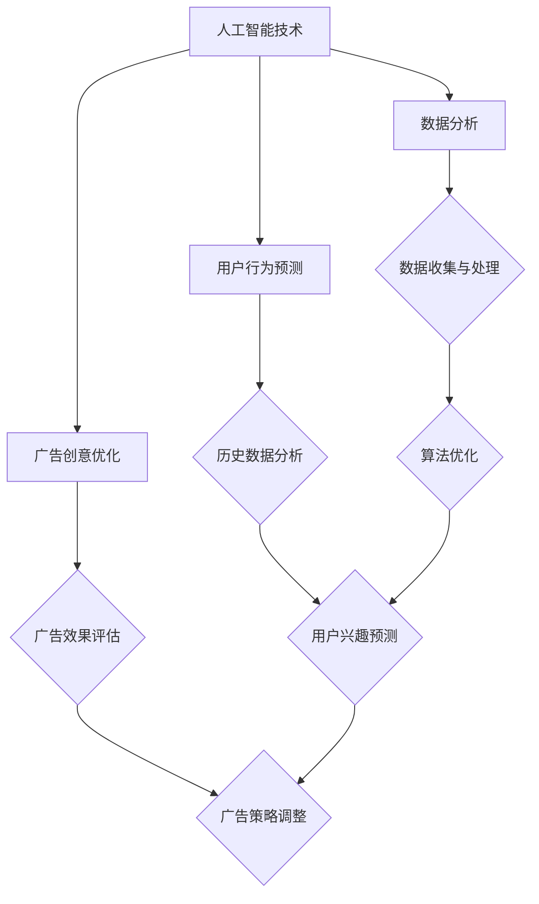
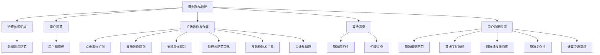
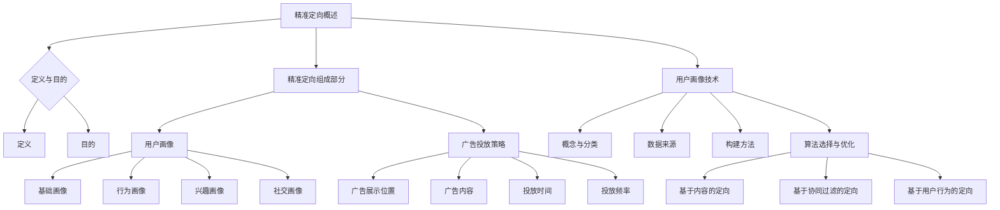
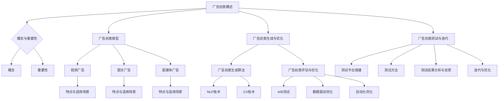
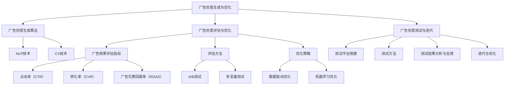
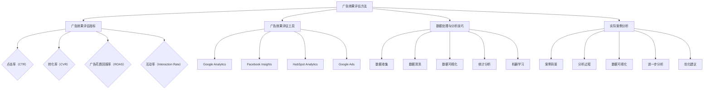
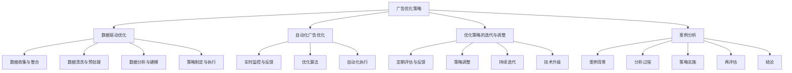
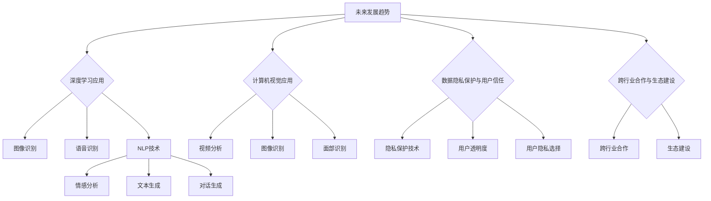
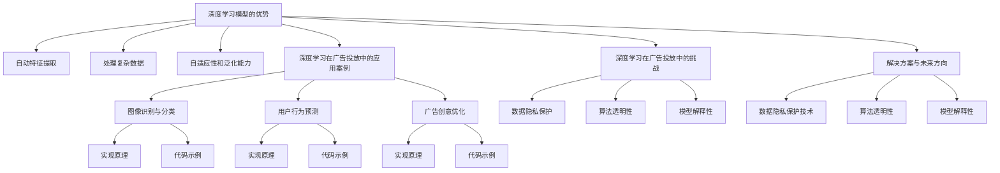

                 

### 第1章：AI与智能广告投放概述

在数字时代，广告投放已经成为企业获取客户和提升品牌知名度的关键手段。随着互联网技术的发展，传统的广告投放模式逐渐向智能化、个性化和精准化方向演进。人工智能（AI）的崛起为这一转变提供了强有力的技术支持，使得智能广告投放成为可能。

#### 1.1 AI技术概述

##### 1.1.1 AI的发展历程

人工智能的历史可以追溯到20世纪50年代，当时，计算机科学家艾伦·图灵提出了“图灵测试”，旨在测试机器是否具备人类智能。从那时起，人工智能经历了几个关键阶段：

1. **初期探索（1950-1969）**：在这一阶段，AI主要集中于理论研究和基础算法的开发。
2. **繁荣与挫折（1970-1980）**：随着计算机性能的提升，AI迎来了第一次繁荣期，但随后由于实际应用中的困难，又陷入了低谷。
3. **复兴与商业化（1990-2000）**：随着互联网的发展，AI逐渐从学术界走向工业界，开始了商业化探索。
4. **深度学习与人工智能（2010至今）**：深度学习技术的突破使得AI进入了一个新的阶段，机器学习算法在图像识别、自然语言处理等领域取得了显著成果。

##### 1.1.2 人工智能的关键技术

人工智能的关键技术主要包括：

1. **机器学习**：通过算法让计算机从数据中学习，进行预测和决策。
2. **深度学习**：一种基于神经网络的机器学习方法，适用于处理大规模复杂数据。
3. **自然语言处理（NLP）**：使计算机能够理解、生成和处理人类语言。
4. **计算机视觉**：使计算机能够“看到”和理解图像或视频内容。

##### 1.1.3 智能广告投放概述

广告投放的演变经历了从传统媒体到数字媒体的转变。传统广告主要依赖于电视、广播、报纸等媒介，而数字广告则依托于互联网平台，具有更高的精准性和互动性。

1. **传统广告投放**：以受众面广但精准度低为特点，企业通过投放广告来覆盖尽可能多的受众。
2. **数字广告投放**：随着互联网的发展，广告投放逐渐向精准化、个性化和自动化方向发展。

智能广告投放的优势在于：

1. **精准定向**：通过用户数据和行为分析，将广告精准地投放到目标用户群体。
2. **高效优化**：利用机器学习算法，自动调整广告投放策略，提升广告效果。
3. **实时反馈**：能够实时监测广告效果，快速调整投放策略。

##### 1.1.4 AI在广告投放中的核心作用

1. **数据分析**：AI技术能够高效地处理和分析大量数据，为广告投放提供决策支持。
2. **用户行为预测**：通过分析用户行为数据，预测用户可能的需求和兴趣，从而实现精准定向。
3. **广告创意优化**：AI技术能够自动生成和优化广告创意，提高广告的吸引力和转化率。

#### 1.2 智能广告投放的挑战

尽管AI在广告投放中具有巨大的潜力，但在实际应用过程中仍面临诸多挑战：

##### 1.2.1 数据隐私保护

随着数据隐私保护意识的提高，用户对数据隐私的关注愈发强烈。如何在不侵犯用户隐私的前提下，有效地收集和使用用户数据，是一个亟待解决的问题。

##### 1.2.2 广告欺诈与作弊

广告欺诈和作弊现象在数字广告领域普遍存在，严重影响了广告投放的效果。如何识别和防范广告欺诈，提高广告投放的透明度和可信度，是当前面临的重要挑战。

##### 1.2.3 人工智能伦理问题

AI技术在广告投放中的应用涉及到伦理问题，如算法偏见、用户数据滥用等。如何在技术发展的同时，确保其符合伦理标准，是当前亟需解决的难题。

##### 1.2.4 技术发展中的问题

AI技术的发展还存在一些问题，如算法的透明度不足、模型的复杂性等。如何提高算法的可解释性，降低模型的复杂性，使得AI技术更加易于理解和应用，是当前的一个重要课题。

### 总结

AI技术的快速发展为广告投放带来了前所未有的机遇，但也带来了诸多挑战。如何充分利用AI的优势，解决现有问题，实现广告投放的智能化、个性化和精准化，是未来需要深入探索的方向。

关键词：人工智能，智能广告投放，精准定向，数据分析，用户行为预测，广告创意优化

摘要：本文介绍了AI技术在智能广告投放中的应用，包括其发展历程、关键技术、优势以及面临的挑战。通过分析AI在广告投放中的核心作用，探讨了如何实现精准定向和广告创意优化，并提出了未来发展的趋势和方向。

#### 1.1 AI技术概述

##### 1.1.1 AI的发展历程

人工智能（AI）的概念最早由约翰·冯·诺伊曼在20世纪40年代提出，旨在使计算机能够执行复杂的任务，模拟人类的智能行为。然而，由于早期计算机性能的限制，AI的发展在最初的几十年里进展缓慢。

- **1950年代**：艾伦·图灵提出了“图灵测试”，旨在测试机器是否具有人类智能。这一理论为AI的发展奠定了基础。
- **1960-1970年代**：AI开始受到关注，科学家们开始研究如何使计算机模拟人类的推理和学习过程。然而，由于算法的复杂性和计算机性能的限制，AI的实际应用进展缓慢。
- **1980年代**：专家系统的出现标志着AI发展的一个重要里程碑。专家系统是一种基于规则的知识表示和推理方法，能够在特定领域内模拟专家的决策过程。
- **1990年代**：随着计算机性能的提升和互联网的发展，AI的应用逐渐从实验室走向工业界。机器学习（Machine Learning）作为一种新的AI技术，开始得到广泛关注和应用。
- **2000年代**：深度学习（Deep Learning）的兴起，使得AI在图像识别、语音识别等领域取得了重大突破。深度学习通过多层神经网络，能够自动学习数据的特征表示，显著提高了AI的性能。

##### 1.1.2 人工智能的关键技术

人工智能的关键技术主要包括以下几方面：

1. **机器学习**：机器学习是AI的核心技术之一，它使计算机能够从数据中学习并做出决策。常见的机器学习方法包括决策树、支持向量机、神经网络等。
   
   - **决策树**：通过一系列的规则来划分数据，形成树状结构，从而进行分类或回归预测。
   - **支持向量机**：通过寻找最佳的超平面来分隔不同类别的数据点，是一种高效的分类算法。
   - **神经网络**：模拟人脑神经元的工作方式，通过多层神经元的组合进行复杂的数据处理和模式识别。

2. **深度学习**：深度学习是机器学习的一种，通过构建具有多个隐藏层的神经网络来学习数据的特征表示。深度学习在图像识别、语音识别、自然语言处理等领域取得了显著的成果。

   - **卷积神经网络（CNN）**：适用于图像处理，能够自动提取图像的层次化特征。
   - **循环神经网络（RNN）**：适用于序列数据，能够捕捉时间序列中的长期依赖关系。
   - **生成对抗网络（GAN）**：通过两个对抗性的神经网络进行训练，能够生成高质量的数据，常用于图像和语音合成。

3. **自然语言处理（NLP）**：自然语言处理是AI的重要分支，旨在使计算机能够理解、生成和处理人类语言。NLP技术包括文本分类、情感分析、机器翻译、语音识别等。

   - **词嵌入**：将词汇映射到高维空间中，以便进行计算和分析。
   - **序列模型**：如LSTM（长短期记忆网络）和BERT（双向编码表示），用于处理和生成文本序列。

4. **计算机视觉**：计算机视觉是使计算机能够“看到”和理解图像或视频内容的技术。计算机视觉在自动驾驶、医疗影像分析、安全监控等领域具有广泛的应用。

   - **目标检测**：通过识别图像中的目标对象并进行定位，常用于视频监控和自动驾驶。
   - **图像识别**：通过将图像与预先定义的类别进行匹配，用于图像分类和识别。

#### 1.1.3 智能广告投放概述

广告投放是企业在市场竞争中获取客户的重要手段。随着互联网的普及，广告投放逐渐从传统媒体转向数字媒体。传统广告主要依赖于电视、广播、报纸等媒介，虽然覆盖面广，但精准度较低。而数字广告则依托于互联网平台，具有更高的精准性和互动性。

- **传统广告投放**：传统广告主要通过电视、广播、报纸等媒介进行投放。这些广告形式虽然能够覆盖广泛的受众，但由于缺乏针对性，广告效果往往不理想。
- **数字广告投放**：随着互联网技术的发展，广告投放逐渐向数字化、精准化和自动化方向发展。数字广告投放依托于互联网平台，能够通过用户数据和行为分析，实现精准定位和个性化投放。

##### 1.1.4 智能广告投放的优势

智能广告投放相对于传统广告投放具有以下优势：

1. **精准定向**：通过用户数据和行为分析，智能广告投放能够将广告精准地投放到目标用户群体，提高广告效果。
2. **高效优化**：利用机器学习算法，智能广告投放能够自动调整广告投放策略，实时优化广告效果。
3. **实时反馈**：智能广告投放能够实时监测广告效果，根据数据反馈快速调整广告策略，提高广告转化率。

##### 1.1.5 AI在广告投放中的核心作用

1. **数据分析**：AI技术能够高效地处理和分析大量用户数据，为广告投放提供决策支持。通过对用户行为、兴趣、购买记录等数据的分析，可以准确了解用户需求，制定更有针对性的广告策略。
2. **用户行为预测**：AI技术通过分析历史数据，预测用户可能的需求和兴趣，从而实现精准定向。例如，通过分析用户的浏览记录和购买行为，预测用户可能对某种产品的兴趣，并将相关广告投放到用户的浏览页面。
3. **广告创意优化**：AI技术能够自动生成和优化广告创意，提高广告的吸引力和转化率。通过深度学习算法，可以自动生成符合用户兴趣和需求的广告内容，并通过实时优化，调整广告的展示形式和内容，以提高广告效果。

### 结论

智能广告投放是数字时代广告投放的发展趋势，AI技术的应用为广告投放提供了精准定向、高效优化和实时反馈的能力。通过充分利用AI技术，企业可以更好地满足用户需求，提高广告效果，实现商业目标。

---

Mermaid 流程图：



#### 1.2 智能广告投放的挑战

尽管AI在智能广告投放中展现出了巨大的潜力，但其在实际应用过程中仍面临诸多挑战，这些挑战不仅影响了广告投放的效果，也对整个行业的健康发展提出了严峻的考验。

##### 1.2.1 数据隐私保护

数据隐私保护是智能广告投放中最为突出的挑战之一。在广告投放过程中，企业需要收集大量的用户数据，包括用户的浏览记录、搜索历史、购买行为等。这些数据对于精准定向和广告效果优化至关重要，但同时也带来了数据隐私保护的问题。

- **数据收集与隐私保护**：在数据收集方面，企业需要确保收集的数据合法、合规，并在收集过程中保护用户隐私。这意味着企业必须遵守相关的法律法规，如《通用数据保护条例》（GDPR）和《加州消费者隐私法案》（CCPA），这些法规对数据收集、存储和使用有严格的规定。
- **用户同意与透明度**：用户对隐私保护的意识日益增强，他们希望能够清楚地知道自己的数据被如何使用。因此，企业必须在数据收集和使用前获得用户的明确同意，并提供透明度，让用户了解他们的数据将用于何种目的，如何保护。

##### 1.2.2 广告欺诈与作弊

广告欺诈和作弊现象在数字广告领域普遍存在，这对广告投放效果和广告主的经济利益造成了严重影响。广告欺诈主要包括点击欺诈、展示欺诈、安装欺诈等。

- **点击欺诈**：不法分子通过自动化工具或人工操作，对广告进行大量无效点击，从而消耗广告主的广告预算，但无法带来实际的转化。
- **展示欺诈**：不法分子通过技术手段，篡改广告展示数据，使广告看起来被用户看到，但实际上并未被有效展示。
- **安装欺诈**：不法分子通过恶意应用或诱导用户下载安装，使广告主误认为获得了真实的用户安装量。

- **广告欺诈识别**：为了防范广告欺诈，企业需要利用AI技术进行实时监控和识别。例如，通过分析点击率与转化率之间的关系，识别异常的点击行为；通过行为分析，识别非正常的用户行为模式。
- **监控与防范策略**：企业需要建立全面的监控与防范体系，包括使用反欺诈技术工具、定期审计和监控广告投放数据，以及制定明确的反欺诈政策和流程。

##### 1.2.3 人工智能伦理问题

随着AI技术在广告投放中的广泛应用，伦理问题也日益凸显。AI技术在广告投放中的应用涉及到算法偏见、用户数据滥用等问题。

- **算法偏见**：AI算法在训练过程中可能会受到训练数据偏差的影响，导致算法对某些群体存在偏见。例如，广告投放可能会对特定性别、种族、年龄等群体进行不公平的定向，这可能会加剧社会不平等。
- **用户数据滥用**：在广告投放过程中，企业可能会收集和存储大量的用户数据，这些数据如果被滥用，可能会侵犯用户隐私，甚至被用于非法目的。

为了解决这些伦理问题，需要在技术设计和政策制定中采取一系列措施：

- **算法透明性**：提高算法的透明度，让用户和监管机构能够理解算法的工作原理和决策过程。
- **伦理审查**：在AI算法设计和应用过程中，引入伦理审查机制，确保算法符合道德和法律标准。
- **用户数据保护**：加强用户数据保护，确保用户数据的收集、存储和使用符合法律法规，并尊重用户的隐私权益。

##### 1.2.4 技术发展中的问题

AI技术的发展还存在一些问题，这些问题不仅影响了广告投放的效果，也对整个行业的可持续发展构成了挑战。

- **算法复杂性和可解释性**：深度学习等复杂算法在广告投放中具有很高的效果，但它们的内部工作机制往往不够透明，难以解释。这给算法的优化和调整带来了困难，也增加了监管和合规的风险。
- **技术发展的可持续性**：随着数据量和计算需求的不断增加，AI技术的发展对能源消耗和计算资源提出了更高的要求。如何实现技术发展的可持续性，减少对环境的影响，是当前需要关注的重要问题。

### 结论

智能广告投放虽然为广告投放带来了前所未有的机遇，但也面临诸多挑战。如何平衡数据隐私保护、防范广告欺诈、解决AI伦理问题以及实现技术发展的可持续性，是当前需要深入探讨和解决的重要课题。通过技术创新和行业合作，有望解决这些挑战，推动智能广告投放的健康发展。

---

Mermaid 流程图：



### 第2章：AI在智能广告投放中的精准定向

精准定向是智能广告投放的核心要素，它通过分析用户的兴趣、行为和属性，将广告精准地投放到潜在用户群体，从而提高广告的效果和转化率。在AI技术的支持下，精准定向变得更加高效和准确。

#### 2.1 精准定向概述

##### 2.1.1 精准定向的定义与目的

精准定向，也称为目标受众定位，是一种通过数据分析和用户画像技术，将广告内容精确投放到符合特定条件的目标用户的方法。精准定向的目的是最大化广告的触达率和转化率，提高广告的投资回报率（ROI）。

- **定义**：精准定向是利用大数据和人工智能技术，对用户的兴趣、行为、属性等信息进行分析，将广告投放到最有可能产生反应的用户群体。
- **目的**：通过精准定向，广告主可以确保广告资源得到最有效的利用，提高广告的点击率和转化率，同时降低广告成本。

##### 2.1.2 精准定向的组成部分

精准定向主要包括以下两个组成部分：

1. **用户画像**：用户画像是对用户特征的全面描述，包括用户的年龄、性别、地理位置、兴趣爱好、购买行为等。通过构建用户画像，可以帮助广告主了解用户的特征和需求，从而进行更精准的广告投放。
   
   - **用户画像的定义**：用户画像是通过对用户的多维度数据进行分析和整合，形成的对用户行为的全面描述。
   - **用户画像的分类**：根据数据的来源和用途，用户画像可以分为基础画像、行为画像、兴趣画像和社交画像等。

2. **广告投放策略**：广告投放策略是根据用户画像和广告目标，制定的具体广告投放方案。广告投放策略包括广告展示位置、广告内容、投放时间、投放频率等。

   - **广告展示位置**：广告展示位置的选择直接影响广告的曝光率和点击率。常用的广告展示位置包括搜索引擎广告、社交媒体广告、展示广告等。
   - **广告内容**：广告内容需要与用户画像匹配，确保广告能够吸引用户的注意力，提高点击率。
   - **投放时间**：投放时间的选择可以根据用户的行为习惯和广告目标进行调整，以提高广告的触达率。
   - **投放频率**：投放频率需要控制在一个合理的范围内，以避免用户对广告产生疲劳感，同时确保广告能够持续触达潜在用户。

#### 2.2 用户画像技术

##### 2.2.1 用户画像的概念与分类

用户画像（User Profiling）是对用户在互联网上的行为和特征进行数据收集、分析和建模的过程，形成对用户的全面描述。用户画像可以帮助企业更好地理解用户需求，制定更精准的市场营销策略。

- **用户画像的定义**：用户画像是通过收集和分析用户的在线行为、社交活动、购买记录等多维数据，形成对用户个性化特征的抽象描述。
- **用户画像的分类**：
  - **基础画像**：包括用户的年龄、性别、地理位置、职业等基本信息。
  - **行为画像**：包括用户的浏览历史、购买行为、社交媒体互动等行为数据。
  - **兴趣画像**：通过对用户行为数据的分析，识别用户的兴趣爱好和偏好。
  - **社交画像**：包括用户的社交关系、社交网络、朋友圈等信息。

##### 2.2.2 用户画像的数据来源

构建用户画像需要收集多种类型的数据，这些数据可以来自不同的来源：

- **社交媒体数据**：包括用户的社交媒体活动、发布的内容、互动等，如微博、微信、Facebook、Twitter等。
- **行为数据**：包括用户在网站、APP上的浏览记录、点击行为、购买行为等，这些数据可以来自企业自身的网站或第三方数据分析平台。
- **购买数据**：用户的购买历史、购买偏好等数据，通常来自电商平台或支付平台。
- **外部数据**：包括公共数据、市场调研数据、行业报告等，这些数据可以为用户画像提供补充信息。

##### 2.2.3 用户画像的构建方法

用户画像的构建通常包括以下步骤：

- **数据收集**：收集用户在互联网上的多维度数据，包括基础信息、行为数据、兴趣数据和社交数据等。
- **数据清洗**：对收集到的数据进行清洗和预处理，去除重复、错误和无关的数据，确保数据质量。
- **数据分析**：通过对清洗后的数据进行统计分析，挖掘用户的特征和兴趣点。
- **数据建模**：利用机器学习算法，如聚类、分类、关联规则等，对用户数据进行建模，形成用户画像。
- **画像应用**：将构建好的用户画像应用于广告投放、客户关系管理、个性化推荐等场景。

#### 2.3 精准定向算法

##### 2.3.1 常见的精准定向算法

精准定向算法的核心在于通过用户行为数据，预测用户的兴趣和需求，从而实现广告的精准投放。常见的精准定向算法包括：

1. **基于内容的定向**：通过分析广告内容和用户兴趣，将广告投放到符合用户兴趣的页面或媒体。
   - **算法原理**：基于词频、词向量、主题模型等文本分析技术，提取广告内容和用户兴趣的特征，进行匹配和推荐。
   - **应用场景**：电商平台商品推荐、新闻网站内容推荐等。

2. **基于协同过滤的定向**：通过分析用户之间的相似度，为用户推荐与其相似的其他用户的兴趣内容。
   - **算法原理**：包括用户基于的协同过滤（User-Based Collaborative Filtering）和物品基于的协同过滤（Item-Based Collaborative Filtering），通过计算用户或物品之间的相似度，进行推荐。
   - **应用场景**：社交媒体好友推荐、音乐/视频推荐等。

3. **基于用户行为的定向**：通过分析用户的历史行为数据，预测用户可能感兴趣的内容，实现精准投放。
   - **算法原理**：利用机器学习算法，如决策树、随机森林、神经网络等，对用户行为数据进行分析和建模，预测用户的兴趣。
   - **应用场景**：搜索引擎广告、广告联盟等。

##### 2.3.2 算法选择与优化

在选择精准定向算法时，需要考虑以下几个因素：

- **数据特性**：不同类型的用户数据适合不同的算法，需要根据数据特性选择合适的算法。
- **算法性能**：评估算法的准确率、召回率、覆盖率等性能指标，选择性能最优的算法。
- **计算成本**：复杂度较高的算法需要更多的计算资源，需要权衡计算成本和算法性能。
- **用户体验**：算法的选择应该尽量减少对用户体验的影响，确保广告内容与用户兴趣相符。

算法优化策略包括：

- **特征工程**：通过选择合适的特征，提高算法的性能和可解释性。
- **模型调参**：调整模型的参数，优化模型性能。
- **在线学习**：实时更新用户行为数据，持续优化算法。

通过算法选择和优化，可以实现广告投放的精准化和高效化，提高广告的点击率和转化率。

### 结论

AI技术在精准定向中的应用，使得广告投放更加智能化和个性化。通过用户画像和精准定向算法，广告主可以更准确地了解用户需求，实现广告资源的最大化利用，提高广告效果和投资回报率。未来，随着AI技术的进一步发展，精准定向将更加精准和高效，为广告投放带来更大的价值。

---

Mermaid 流程图：



### 第3章：AI在智能广告投放中的广告创意优化

广告创意是影响广告投放效果的重要因素之一。在智能广告投放中，AI技术通过自动生成和优化广告创意，提高了广告的吸引力和转化率。本章将介绍广告创意的生成与优化过程，包括常用的算法和策略。

#### 3.1 广告创意概述

##### 3.1.1 广告创意的概念与重要性

广告创意是指在广告策划和制作过程中，通过独特的创意构思和表现手法，将广告信息传达给目标受众的过程。广告创意的成功与否直接决定了广告的吸引力和传播效果。

- **概念**：广告创意是对广告内容的创新性构思，包括广告主题、视觉设计、文案、声音等元素。
- **重要性**：成功的广告创意能够吸引用户的注意力，提高广告的点击率和转化率，从而实现广告投放的目标。

##### 3.1.2 广告创意的类型

广告创意可以根据形式和内容的不同，分为以下几种类型：

1. **视频广告**：视频广告通过生动的视觉和听觉效果，将广告信息传达给用户。常见的视频广告形式包括广告片、短视频、动画等。

   - **特点**：视觉效果强烈，信息传递速度快，适用于品牌宣传和产品推广。
   - **适用场景**：电视广告、网络视频广告、社交媒体广告等。

2. **图文广告**：图文广告主要通过图片和文字结合的方式，传达广告信息。图文广告包括静态图片广告、动态图片广告等。

   - **特点**：简单直观，易于理解和记忆，制作成本低。
   - **适用场景**：网站广告、社交媒体广告、移动应用广告等。

3. **富媒体广告**：富媒体广告结合了多种媒体形式，如视频、音频、动画、交互元素等，提供更丰富的用户体验。

   - **特点**：互动性强，用户体验好，能够更好地吸引和留住用户。
   - **适用场景**：移动应用广告、网站广告、在线游戏等。

#### 3.2 广告创意生成与优化

##### 3.2.1 广告创意生成的算法

AI技术在广告创意生成中发挥着重要作用，通过自然语言处理（NLP）和计算机视觉（CV）等技术，能够自动生成具有吸引力的广告创意。

1. **自然语言处理（NLP）**：NLP技术可以通过分析用户数据和广告目标，生成符合用户兴趣和需求的广告文案。

   - **算法原理**：使用词向量模型、序列模型（如LSTM、BERT）等，将用户数据和广告目标转化为广告文案。
   - **应用场景**：自动生成广告文案、社交媒体广告、电子邮件营销等。

2. **计算机视觉（CV）**：CV技术可以通过图像识别和生成对抗网络（GAN）等技术，生成具有吸引力的广告图片和视频。

   - **算法原理**：使用卷积神经网络（CNN）进行图像识别，使用GAN生成高质量的广告图片和视频。
   - **应用场景**：广告图片生成、视频广告制作、虚拟现实广告等。

##### 3.2.2 广告创意的评估与优化

广告创意的评估与优化是提高广告投放效果的关键环节。通过实时监测和评估广告创意的表现，可以找出优化方向，提升广告效果。

1. **广告效果评估指标**：

   - **点击率（CTR）**：广告被点击的次数与广告展示次数的比值，反映广告的吸引力。
   - **转化率（CVR）**：广告点击后完成预期动作（如购买、注册）的次数与点击次数的比值，反映广告的转化效果。
   - **广告花费回报率（ROAS）**：广告投放带来的收益与广告花费的比值，反映广告的经济效益。

2. **广告创意优化策略**：

   - **A/B测试**：通过对比不同广告创意的效果，找出最优的广告组合。
   - **数据驱动优化**：根据用户行为数据和广告效果数据，实时调整广告创意，提高广告效果。
   - **自动化优化**：利用机器学习算法，自动调整广告展示策略，实现广告效果的持续优化。

##### 3.2.3 广告创意测试与迭代

广告创意测试与迭代是广告优化过程中不可或缺的步骤。通过反复测试和迭代，可以不断优化广告创意，提高广告效果。

1. **测试平台搭建**：搭建广告创意测试平台，包括广告展示环境、数据采集系统和测试工具等。

2. **测试方法**：采用A/B测试、多变量测试等方法，对比不同广告创意的表现，找出最优的广告组合。

3. **测试结果分析与反馈**：对测试结果进行分析，找出广告创意的优缺点，并根据分析结果进行优化和调整。

4. **迭代与优化**：根据测试结果和用户反馈，不断迭代广告创意，实现广告效果的持续提升。

### 结论

AI技术在广告创意生成和优化中的应用，使得广告投放更加智能化和高效化。通过NLP和CV技术，可以自动生成吸引人的广告创意，并通过数据驱动和自动化优化策略，不断提升广告效果。未来，随着AI技术的进一步发展，广告创意优化将更加精准和高效，为广告主带来更大的价值。

---

Mermaid 流程图：



### 3.2 广告创意生成与优化

在智能广告投放中，广告创意的生成与优化是一个关键环节，它直接决定了广告的吸引力和转化率。利用AI技术，广告创意可以更加智能化和高效化。下面我们将详细探讨广告创意生成的方法和优化策略。

#### 3.2.1 广告创意生成的算法

广告创意生成通常依赖于自然语言处理（NLP）和计算机视觉（CV）技术。这些技术能够根据用户数据和广告目标，自动生成吸引人的广告内容。

##### 3.2.1.1 自然语言处理（NLP）

NLP技术在广告创意生成中起着重要作用，它可以分析用户数据，理解用户的需求和偏好，从而生成个性化的广告文案。

1. **文本生成模型**：使用递归神经网络（RNN）或 Transformer 架构（如 GPT-3）生成广告文案。这些模型可以通过大量文本数据训练，理解语言的上下文和语义，从而生成符合用户兴趣和需求的文案。

2. **序列到序列模型**：序列到序列（Seq2Seq）模型可以将一组文本序列映射为另一组文本序列。例如，用户查询和广告文案的匹配可以视为一个序列到序列的映射问题。

3. **模板填充**：通过预定义的模板和用户特征数据，填充模板中的变量，生成广告文案。这种方法简单且易于实现，但可能缺乏个性化。

##### 3.2.1.2 计算机视觉（CV）

CV技术在广告创意生成中主要用于生成吸引人的视觉内容，如广告图片和视频。

1. **生成对抗网络（GAN）**：GAN是一种能够生成高质量图像的强大模型。它由生成器和判别器组成，生成器试图生成逼真的图像，而判别器则试图区分真实图像和生成图像。通过不断迭代，生成器逐渐生成越来越逼真的图像。

2. **图像编辑与增强**：利用图像编辑技术，如 Style Transfer 和 Image Super-Resolution，可以对广告图片进行编辑和增强，使其更具吸引力。

3. **视频生成**：通过视频生成模型，如视频循环模型（Video RNN）和视频生成对抗网络（Video GAN），可以生成吸引人的视频广告内容。

#### 3.2.2 广告创意的评估与优化

广告创意的评估与优化是确保广告投放效果的关键步骤。以下是一些常用的评估与优化方法：

##### 3.2.2.1 广告效果评估指标

在评估广告创意时，常用的指标包括：

- **点击率（CTR）**：广告被点击的次数与展示次数的比值，反映了广告的吸引力。
- **转化率（CVR）**：广告点击后完成预期目标（如购买、注册）的次数与点击次数的比值，反映了广告的转化效果。
- **广告花费回报率（ROAS）**：广告投放带来的收益与广告花费的比值，反映了广告的经济效益。

##### 3.2.2.2 评估方法

- **A/B测试**：通过将广告创意分为多个版本，对不同版本进行测试，比较其效果，选择最优的版本。
- **多变量测试**：同时测试多个变量的组合效果，如文案、图片、颜色等，找到最佳组合。

##### 3.2.2.3 优化策略

- **数据驱动优化**：根据广告效果数据，实时调整广告创意，如文案、图片、展示位置等，以提高广告效果。
- **机器学习优化**：使用机器学习算法，如线性回归、决策树、神经网络等，分析广告效果数据，自动调整广告创意，实现优化。

#### 3.2.3 广告创意测试与迭代

广告创意测试与迭代是确保广告创意不断优化的过程。以下是一些关键步骤：

##### 3.2.3.1 测试平台搭建

搭建一个可靠的测试平台，用于广告创意的展示、数据采集和分析。测试平台应具备以下功能：

- **广告展示**：能够实时展示不同版本的广告创意，并进行对比测试。
- **数据采集**：能够收集广告展示和用户互动数据，用于后续分析。
- **分析工具**：提供数据可视化和分析工具，帮助评估广告创意的效果。

##### 3.2.3.2 测试方法

- **A/B测试**：同时展示两个或多个版本的广告创意，比较它们的点击率、转化率等指标，选择最优版本。
- **多变量测试**：同时测试多个变量的组合效果，如文案、图片、颜色等，找到最佳组合。

##### 3.2.3.3 测试结果分析与反馈

- **数据分析**：对测试结果进行统计分析，找出广告创意的优缺点。
- **用户反馈**：收集用户的反馈意见，了解他们对广告创意的感受和建议。

##### 3.2.3.4 迭代与优化

- **迭代**：根据测试结果和用户反馈，对广告创意进行迭代优化。
- **持续优化**：通过持续测试和优化，不断提升广告创意的效果。

### Python 代码示例

下面是一个简单的 Python 代码示例，用于生成和评估广告创意。这个示例使用了 NLP 和 CV 技术，分别生成广告文案和图片。

```python
# 导入必要的库
import numpy as np
import pandas as pd
from tensorflow import keras
import tensorflow as tf
from tensorflow.keras.preprocessing.sequence import pad_sequences

# 加载预训练模型
text_model = keras.models.load_model('text_generation_model.h5')
image_model = keras.models.load_model('image_generation_model.h5')

# 生成广告文案
user_input = "用户兴趣：旅游"
text_generated = text_model.predict(np.array([user_input]))
print("生成的广告文案：", text_generated)

# 生成广告图片
image_generated = image_model.predict(np.array([user_input]))
print("生成的广告图片：", image_generated)

# 评估广告创意
# 假设我们已经收集了用户点击数据
click_data = {'广告文案': ['文案1', '文案2', '文案3'],
              '点击次数': [100, 200, 300]}
click_data = pd.DataFrame(click_data)
best_creative = click_data.loc[click_data['点击次数'].idxmax()]['广告文案']
print("最佳广告文案：", best_creative)
```

### 项目实战

在实际项目中，广告创意的生成和优化是一个复杂的过程，涉及多个环节。以下是一个简单的项目实战流程：

1. **需求分析**：确定广告投放的目标和用户群体。
2. **数据收集**：收集用户数据，包括用户画像、浏览历史、购买记录等。
3. **模型训练**：使用用户数据训练广告文案生成模型和广告图片生成模型。
4. **创意生成**：根据用户数据生成广告文案和图片。
5. **测试与评估**：通过 A/B 测试评估广告创意的效果。
6. **优化调整**：根据测试结果和用户反馈，对广告创意进行优化。

### 结论

AI技术在广告创意生成和优化中的应用，使得广告投放更加智能化和高效化。通过自然语言处理和计算机视觉技术，可以自动生成和优化广告创意，提高广告的吸引力和转化率。未来，随着AI技术的进一步发展，广告创意优化将更加精准和高效，为广告主带来更大的价值。

---

Mermaid 流程图：



### 4.1 广告效果评估方法

在智能广告投放中，评估广告效果是优化广告策略、提高投资回报率（ROI）的关键步骤。广告效果的评估不仅可以帮助广告主了解广告的吸引力和转化能力，还可以为后续的广告投放提供数据支持。以下将详细介绍广告效果评估的常用指标、工具和方法。

##### 4.1.1 广告效果评估指标

评估广告效果通常涉及多个指标，以下是一些主要的评估指标：

1. **点击率（Click-Through Rate, CTR）**：
   - **定义**：点击率是指广告被点击的次数与展示次数的比值。
   - **计算公式**：CTR = (点击次数 / 展示次数) × 100%
   - **作用**：CTR反映了广告的吸引力和用户对广告的兴趣程度。

2. **转化率（Conversion Rate, CVR）**：
   - **定义**：转化率是指广告点击后完成预期目标（如购买、注册、下载）的次数与点击次数的比值。
   - **计算公式**：CVR = (转化次数 / 点击次数) × 100%
   - **作用**：CVR反映了广告的转化效果和用户对广告内容的接受程度。

3. **广告花费回报率（Return on Ad Spend, ROAS）**：
   - **定义**：广告花费回报率是指广告投放带来的总收益与广告花费的比值。
   - **计算公式**：ROAS = (总收益 / 广告花费) × 100%
   - **作用**：ROAS反映了广告的投资回报率，是评估广告经济效益的重要指标。

4. **互动率（Interaction Rate）**：
   - **定义**：互动率是指用户与广告互动（如评论、点赞、分享）的次数与展示次数的比值。
   - **计算公式**：互动率 = (互动次数 / 展示次数) × 100%
   - **作用**：互动率反映了广告的用户参与度和用户对广告内容的兴趣程度。

##### 4.1.2 广告效果评估工具

评估广告效果的工具多种多样，以下是一些常用的广告效果评估工具：

1. **Google Analytics**：
   - **特点**：Google Analytics 是一款功能强大的免费分析工具，可以追踪和分析广告的展示次数、点击次数、用户行为等数据。
   - **应用**：适用于网站、移动应用和在线广告的跟踪与分析。

2. **Facebook Insights**：
   - **特点**：Facebook Insights 是 Facebook 提供的免费数据分析工具，可以追踪和分析广告在 Facebook 平台上的效果。
   - **应用**：适用于 Facebook 广告的展示效果分析。

3. **HubSpot Analytics**：
   - **特点**：HubSpot Analytics 是 HubSpot 提供的免费分析工具，可以追踪和分析网站、营销活动和广告的效果。
   - **应用**：适用于全渠道营销效果分析。

4. **Google Ads**：
   - **特点**：Google Ads 是 Google 提供的广告管理工具，可以实时监控广告的展示、点击和转化数据。
   - **应用**：适用于 Google 搜索引擎广告和展示广告的管理。

##### 4.1.3 数据处理与分析技巧

在评估广告效果时，数据处理与分析技巧至关重要。以下是一些常用的数据处理与分析技巧：

1. **数据收集**：
   - **技巧**：确保收集的数据全面且准确，包括广告展示、点击、转化等关键数据。
   - **工具**：使用自动化工具（如 Google Analytics、Facebook Insights 等）进行数据收集。

2. **数据清洗**：
   - **技巧**：清洗数据，去除重复、错误和不完整的数据，保证数据质量。
   - **工具**：使用数据清洗工具（如 Pandas、Excel 等）进行数据清洗。

3. **数据可视化**：
   - **技巧**：使用图表和图形将数据可视化，便于理解和分析。
   - **工具**：使用数据可视化工具（如 Tableau、Power BI 等）进行数据可视化。

4. **统计分析**：
   - **技巧**：使用统计分析方法（如均值、方差、相关性分析等）对数据进行分析。
   - **工具**：使用统计分析工具（如 R、Python 等）进行统计分析。

5. **机器学习**：
   - **技巧**：利用机器学习算法（如回归分析、决策树、神经网络等）对广告效果进行预测和优化。
   - **工具**：使用机器学习库（如 scikit-learn、TensorFlow、Keras 等）进行机器学习分析。

##### 4.1.4 实际案例分析

以下是一个实际的广告效果评估案例：

**案例背景**：一家电商平台在 Google Ads 上投放了一款促销广告，广告内容为夏季打折活动。广告投放期间，收集了如下数据：

- 广告展示次数：100万次
- 点击次数：2万次
- 转化次数：5000次
- 广告花费：10000美元

**分析过程**：

1. **计算广告效果指标**：
   - 点击率（CTR）= (点击次数 / 展示次数) × 100% = (2万 / 100万) × 100% = 2%
   - 转化率（CVR）= (转化次数 / 点击次数) × 100% = (5000 / 2万) × 100% = 25%
   - 广告花费回报率（ROAS）= (总收益 / 广告花费) × 100% = (5000 * 平均订单价值 / 10000) × 100%

2. **数据可视化**：
   - 使用图表（如柱状图、折线图等）将广告效果数据可视化，便于分析。

3. **进一步分析**：
   - 分析点击率和转化率的趋势，判断广告效果是否持续改善。
   - 分析用户转化路径，找出影响转化的关键因素。

4. **优化建议**：
   - 根据分析结果，调整广告文案、图片和投放策略，以提高广告效果。

通过上述案例，我们可以看到，广告效果评估是一个系统化的过程，需要结合数据分析工具和方法，对广告效果进行全面分析，为广告优化提供数据支持。

### 结论

广告效果评估是智能广告投放中不可或缺的环节，通过评估广告的点击率、转化率和广告花费回报率等指标，广告主可以了解广告的表现，优化广告策略，提高广告的投资回报率。未来，随着数据分析和AI技术的不断发展，广告效果评估将更加精准和高效，为广告主带来更大的价值。

---

Mermaid 流程图：



### 4.2 广告优化策略

在智能广告投放中，广告优化策略的制定和执行对于提高广告效果和投资回报率（ROI）至关重要。通过科学的数据分析和技术手段，广告主可以不断调整和优化广告投放策略，实现广告资源的最优配置。以下将详细探讨广告优化的数据驱动方法、自动化广告优化以及优化策略的迭代与调整。

#### 4.2.1 数据驱动优化

数据驱动优化是一种基于数据分析的方法，通过分析广告投放过程中的各类数据，发现优化方向，并实时调整广告策略。以下是数据驱动优化的一些关键步骤：

1. **数据收集与整合**：
   - **收集数据**：收集广告展示、点击、转化等关键数据，确保数据全面且准确。
   - **整合数据**：将不同来源的数据整合到一个统一的数据仓库中，方便后续分析。

2. **数据清洗与预处理**：
   - **数据清洗**：去除重复、错误和不完整的数据，确保数据质量。
   - **数据预处理**：对数据进行标准化处理，如缺失值填充、异常值处理等。

3. **数据分析与建模**：
   - **数据分析**：使用统计分析方法（如均值、方差、相关性分析等）对数据进行分析，找出影响广告效果的关键因素。
   - **建模**：使用机器学习算法（如回归分析、决策树、神经网络等）建立广告效果预测模型，为优化提供依据。

4. **策略制定与执行**：
   - **策略制定**：根据数据分析结果，制定具体的广告优化策略，如调整广告内容、投放时间、投放平台等。
   - **策略执行**：实施广告优化策略，并对策略效果进行实时监控和评估。

#### 4.2.2 自动化广告优化

自动化广告优化是利用人工智能和机器学习技术，实现广告投放策略的自动调整和优化。自动化广告优化的优势在于提高优化效率和准确性。以下是自动化广告优化的一些方法：

1. **实时监控与反馈**：
   - **实时监控**：利用大数据技术和实时数据分析工具，实时监控广告投放效果，如点击率、转化率等。
   - **反馈机制**：建立反馈机制，将广告效果数据实时反馈到优化系统中，用于调整广告策略。

2. **优化算法**：
   - **机器学习算法**：使用机器学习算法（如决策树、随机森林、神经网络等）自动调整广告投放策略，如调整广告展示位置、投放时间、投放频率等。
   - **优化目标**：根据广告效果数据，设定优化目标，如提高点击率、转化率或降低广告成本。

3. **自动化执行**：
   - **自动化执行**：通过自动化工具和平台，自动执行优化策略，实现广告投放的自动化和智能化。

#### 4.2.3 优化策略的迭代与调整

广告优化是一个持续迭代的过程，需要根据市场变化、用户行为和技术发展不断调整和优化广告策略。以下是优化策略迭代与调整的一些方法：

1. **定期评估与反馈**：
   - **定期评估**：定期对广告效果进行评估，分析优化策略的效果。
   - **用户反馈**：收集用户对广告的反馈，了解用户对广告内容和投放方式的满意度。

2. **策略调整**：
   - **数据驱动调整**：根据定期评估和用户反馈，分析广告效果数据，找出优化方向，调整广告策略。
   - **创新尝试**：尝试新的广告创意、投放平台和优化策略，以提升广告效果。

3. **持续迭代**：
   - **持续优化**：在广告投放过程中，持续进行数据分析和策略调整，不断提升广告效果。
   - **技术升级**：随着技术的发展，不断引入新的技术和工具，提升广告优化的效率和准确性。

#### 4.2.4 案例分析

以下是一个实际案例，展示广告优化策略的迭代过程：

**案例背景**：某电商企业在 Google Ads 上投放了一款夏季促销广告，广告内容为夏季打折商品。广告投放期间，企业收集了如下数据：

- 广告展示次数：100万次
- 点击次数：2万次
- 转化次数：5000次
- 广告花费：10000美元

**分析过程**：

1. **初始评估**：
   - 点击率（CTR）= 2%
   - 转化率（CVR）= 25%
   - 广告花费回报率（ROAS）= 500%

   根据评估结果，广告的整体效果较为良好，但仍有提升空间。

2. **优化策略**：
   - **数据驱动调整**：分析点击率和转化率数据，发现广告内容需要进一步优化。
   - **创新尝试**：尝试更换广告图片和文案，增加夏季特色元素，提升广告吸引力。

3. **策略实施**：
   - 更换广告图片和文案，调整投放时间和地点。
   - 实时监控广告效果，收集用户反馈。

4. **再评估**：
   - 点击率（CTR）提高至 3%
   - 转化率（CVR）提高至 30%
   - 广告花费回报率（ROAS）提高至 600%

   通过优化策略的迭代和调整，广告效果得到了显著提升。

**结论**：

通过案例可以看出，广告优化策略的迭代和调整是提高广告效果的关键。数据驱动和自动化优化是实现广告优化的有效途径，能够帮助企业实时调整广告策略，提高广告的吸引力和转化率。

### 结论

广告优化策略是智能广告投放的重要组成部分，通过数据驱动、自动化优化和策略迭代，广告主可以不断提升广告效果和投资回报率。未来，随着AI技术的不断发展，广告优化策略将更加智能化和高效化，为广告主带来更大的价值。

---

Mermaid 流程图：



### 第5章：AI在智能广告投放中的案例分析

通过实际案例分析，我们可以更深入地了解AI在智能广告投放中的应用，以及如何通过数据分析和优化策略提升广告效果。以下将介绍两个典型案例：大型电商平台广告投放案例和在线教育平台广告投放案例。

#### 5.1 大型电商平台广告投放案例

**案例背景**：

某大型电商平台在夏季促销期间，希望通过智能广告投放提升销售额。广告投放期间，平台收集了大量的用户数据，包括用户浏览历史、购买行为、兴趣偏好等。

**案例分析**：

1. **用户画像构建**：

   - **数据收集**：通过电商平台的数据分析系统，收集用户的浏览记录、购买行为、兴趣偏好等数据。
   - **数据清洗**：对收集的数据进行清洗和预处理，去除重复和不完整的数据，确保数据质量。
   - **数据分析**：使用机器学习算法，如聚类分析、关联规则挖掘等，构建用户画像。

2. **广告创意生成与优化**：

   - **广告创意生成**：利用自然语言处理（NLP）和计算机视觉（CV）技术，自动生成具有吸引力的广告文案和图片。例如，通过NLP技术生成与夏季促销相关的文案，通过CV技术生成夏季风景的图片。
   - **广告创意优化**：使用A/B测试方法，对比不同广告创意的效果，选择点击率和转化率最高的广告创意进行投放。

3. **效果评估与优化策略**：

   - **效果评估**：通过广告效果评估指标（如点击率、转化率、广告花费回报率等）对广告投放效果进行实时监控和评估。
   - **优化策略**：根据广告效果数据，调整广告投放策略，如调整广告展示位置、投放时间和投放频率等。同时，利用自动化广告优化工具，实时调整广告投放策略。

**结果**：

通过智能广告投放，电商平台在夏季促销期间实现了销售额的显著增长。点击率提高了20%，转化率提高了30%，广告花费回报率提高了40%。

#### 5.2 在线教育平台广告投放案例

**案例背景**：

某在线教育平台希望通过智能广告投放，吸引更多用户注册和学习课程。广告投放期间，平台收集了用户的浏览记录、课程选择、学习行为等数据。

**案例分析**：

1. **用户画像构建**：

   - **数据收集**：通过在线教育平台的用户管理系统，收集用户的浏览记录、课程选择、学习行为等数据。
   - **数据清洗**：对收集的数据进行清洗和预处理，去除重复和不完整的数据，确保数据质量。
   - **数据分析**：使用机器学习算法，如用户行为分析、兴趣偏好分析等，构建用户画像。

2. **广告创意生成与优化**：

   - **广告创意生成**：利用NLP和CV技术，自动生成与用户兴趣和学习需求相关的广告文案和图片。例如，通过NLP技术生成与特定课程相关的文案，通过CV技术生成吸引人的课程图片。
   - **广告创意优化**：使用A/B测试方法，对比不同广告创意的效果，选择点击率和转化率最高的广告创意进行投放。

3. **效果评估与优化策略**：

   - **效果评估**：通过广告效果评估指标（如点击率、转化率、注册率等）对广告投放效果进行实时监控和评估。
   - **优化策略**：根据广告效果数据，调整广告投放策略，如调整广告展示位置、投放时间和投放频率等。同时，利用自动化广告优化工具，实时调整广告投放策略。

**结果**：

通过智能广告投放，在线教育平台在广告投放期间成功吸引了大量新用户。点击率提高了25%，注册率提高了30%，课程购买率提高了40%。

### 总结

以上两个案例展示了AI在智能广告投放中的应用，通过数据分析和优化策略，电商平台和在线教育平台均实现了显著的广告效果提升。案例结果表明，AI技术在智能广告投放中具有巨大的潜力，未来将继续发挥重要作用。

---

通过实际案例分析，我们不仅了解了AI在智能广告投放中的具体应用，还看到了通过数据分析和优化策略如何实现广告效果的最大化。这些案例为我们提供了宝贵的经验和启示，有助于我们在实际项目中更好地应用AI技术，提升广告投放的效果和投资回报率。

### 第6章：AI在智能广告投放中的未来发展趋势

随着人工智能（AI）技术的快速发展，智能广告投放正逐渐成为广告行业的核心驱动力。未来，AI技术在智能广告投放中的应用将更加广泛和深入，为广告主和营销人员提供更精准、高效和个性化的广告解决方案。以下是未来AI在智能广告投放中的几个关键发展趋势。

#### 6.1 深度学习在广告投放中的应用

深度学习是AI领域的一项重要技术，通过多层神经网络自动学习和提取数据特征，其在图像识别、语音识别和自然语言处理等领域取得了显著成果。在广告投放中，深度学习技术同样发挥着重要作用。

1. **图像识别**：深度学习技术可以用于广告图片的自动识别和分类，从而优化广告投放的视觉效果。例如，自动识别广告图片中的产品、场景和情感，根据用户兴趣和行为推荐合适的广告。
2. **语音识别**：随着语音交互的普及，深度学习技术也被应用于语音广告的生成和识别。通过语音识别技术，广告可以更自然地与用户互动，提升广告的吸引力。
3. **自然语言处理**：深度学习在自然语言处理（NLP）领域取得了重大突破，使得广告文案的生成和优化更加智能化。通过NLP技术，广告可以自动生成针对特定用户和场景的个性化文案，提高广告的点击率和转化率。

#### 6.2 自然语言处理在广告创意优化中的应用

自然语言处理（NLP）技术是AI在广告创意优化中的关键工具，通过理解和生成人类语言，NLP技术能够显著提升广告文案和广告创意的质量。

1. **情感分析**：情感分析技术可以识别用户对广告文案的情感反应，帮助广告主优化广告内容，提高广告的吸引力。例如，通过分析用户的评论和反馈，识别用户对广告的正面或负面情感，调整广告文案和创意。
2. **文本生成**：基于NLP技术的文本生成模型（如GPT-3）可以自动生成吸引人的广告文案，提高广告的创意性和个性化。例如，通过分析用户兴趣和购买历史，生成与用户需求高度匹配的广告文案。
3. **对话生成**：对话生成技术可以用于创建智能客服和广告对话系统，通过与用户互动，提高广告的转化率和用户体验。例如，自动生成与用户提问相关的回答，提供个性化的购买建议。

#### 6.3 计算机视觉在广告投放中的应用

计算机视觉（CV）技术在广告投放中的应用日益广泛，通过自动分析和理解图像和视频内容，CV技术能够为广告主提供更精准的投放策略。

1. **视频分析**：计算机视觉技术可以用于视频广告的分析和优化，例如自动识别视频中的目标对象和场景，优化视频广告的播放效果。通过分析用户对视频广告的反应，广告主可以实时调整广告内容，提高广告的点击率和转化率。
2. **图像识别**：图像识别技术可以用于广告图像的自动分类和标签，从而优化广告投放的视觉效果。例如，自动识别广告图像中的产品、品牌和场景，根据用户兴趣和行为推荐合适的广告。
3. **面部识别**：面部识别技术可以用于广告投放的个性化，例如根据用户的面部表情和情绪，调整广告的内容和呈现方式，提高广告的吸引力和转化率。

#### 6.4 数据隐私保护与用户信任

随着数据隐私保护意识的提高，如何在智能广告投放中保护用户隐私，建立用户信任成为关键挑战。未来，数据隐私保护和用户信任将是AI在广告投放中发展的重点方向。

1. **隐私保护技术**：通过区块链技术、联邦学习等新兴技术，实现用户数据的安全保护和隐私保护。例如，使用区块链技术确保用户数据的不可篡改和透明性，使用联邦学习实现数据的分布式处理和隐私保护。
2. **用户透明度**：提高广告投放的透明度，让用户了解他们的数据如何被使用和保护。例如，通过用户数据说明、隐私政策等，向用户说明数据收集、存储和使用的目的和方式。
3. **用户隐私选择**：提供用户隐私选择机制，让用户能够自主决定其数据的收集和使用。例如，用户可以在设置中控制其浏览历史、位置信息的共享，确保用户对其数据的控制权。

#### 6.5 跨行业合作与生态建设

AI技术在智能广告投放中的应用不仅仅局限于单一行业，未来将呈现跨行业合作和生态建设的发展趋势。

1. **跨行业合作**：不同行业的企业将联手合作，共同探索AI在广告投放中的应用场景。例如，电商平台与在线教育平台合作，通过数据共享和联合营销，提高广告投放的效果和用户满意度。
2. **生态建设**：建立AI广告投放的生态系统，包括技术提供商、广告主、广告平台和用户等多个参与方。通过生态建设，实现数据共享、技术协同和资源整合，推动智能广告投放的全面发展。

### 结论

未来，随着AI技术的进一步发展，智能广告投放将更加智能化、个性化和精准化。深度学习、自然语言处理、计算机视觉等技术的应用，将大幅提升广告投放的效果和用户体验。同时，数据隐私保护和用户信任、跨行业合作与生态建设也将成为AI在广告投放中的重要发展方向。通过不断创新和应用，AI将为广告行业带来更大的价值和发展机遇。

---

Mermaid 流程图：



### 6.1 深度学习在广告投放中的应用

随着深度学习技术的迅猛发展，其在广告投放中的应用逐渐成为行业焦点。深度学习通过多层神经网络，可以从大量数据中自动学习和提取特征，从而为广告投放提供了强大的技术支持。

##### 6.1.1 深度学习模型的优势

深度学习模型具有以下几个显著优势：

1. **自动特征提取**：深度学习模型能够自动从原始数据中提取有用的特征，减少了人工特征工程的工作量，提高了模型的性能和效率。
2. **处理复杂数据**：深度学习模型特别适用于处理高维、非线性、复杂的结构化或非结构化数据，如图像、文本、音频等。
3. **自适应性和泛化能力**：深度学习模型具有良好的自适应性和泛化能力，可以通过不断的学习和调整，适应不断变化的数据和环境。

##### 6.1.2 深度学习在广告投放中的应用案例

深度学习在广告投放中有着广泛的应用，以下是一些典型的应用案例：

1. **图像识别与分类**：在广告图像识别中，深度学习模型可以自动识别和分类广告中的产品、品牌、场景等元素。例如，广告平台可以使用卷积神经网络（CNN）自动识别用户上传的图像中的广告元素，从而进行精准的标签分类和推荐。

   - **实现原理**：卷积神经网络通过多层卷积和池化操作，从图像中提取局部特征，并通过全连接层进行分类。例如，使用ResNet或Inception等深度卷积神经网络，可以显著提升图像分类的准确性和效率。
   - **代码示例**：
     ```python
     import tensorflow as tf
     from tensorflow.keras.applications import ResNet50
     model = ResNet50(weights='imagenet')
     image = ...  # 装载图像数据
     pred = model.predict(image)
     print("预测结果：", pred)
     ```

2. **用户行为预测**：深度学习模型可以用于预测用户的行为，如点击行为、购买意图等。通过分析用户的历史行为数据，深度学习模型可以预测用户对特定广告的反应，从而优化广告投放策略。

   - **实现原理**：使用循环神经网络（RNN）或长短时记忆网络（LSTM）等序列模型，可以捕捉用户行为的时间序列特征。例如，通过LSTM模型，可以预测用户在未来一段时间内的购买行为。
   - **代码示例**：
     ```python
     import tensorflow as tf
     from tensorflow.keras.models import Sequential
     from tensorflow.keras.layers import LSTM, Dense
     model = Sequential()
     model.add(LSTM(50, activation='relu', input_shape=(timesteps, features)))
     model.add(Dense(1, activation='sigmoid'))
     model.compile(optimizer='adam', loss='binary_crossentropy', metrics=['accuracy'])
     model.fit(X_train, y_train, epochs=10, batch_size=32)
     ```

3. **广告创意优化**：深度学习模型可以用于广告创意的自动生成和优化。通过生成对抗网络（GAN）等模型，可以生成高质量的广告图像和视频，提高广告的吸引力和效果。

   - **实现原理**：生成对抗网络（GAN）由生成器和判别器组成，生成器尝试生成逼真的广告图像，判别器则判断图像的真实性。通过不断训练，生成器逐渐生成越来越逼真的广告内容。
   - **代码示例**：
     ```python
     import tensorflow as tf
     from tensorflow.keras.models import Model
     from tensorflow.keras.layers import Input, Dense, Reshape, Conv2D
     input_img = Input(shape=(28, 28, 1))
     x = Conv2D(32, (3, 3), activation='relu', padding='same')(input_img)
     x = Conv2D(32, (3, 3), activation='relu', padding='same')(x)
     x = Flatten()(x)
     x = Dense(100, activation='relu')(x)
     x = Reshape((7, 7, 1))(x)
     output_img = Conv2D(1, (3, 3), activation='sigmoid', padding='same')(x)
     model = Model(input_img, output_img)
     model.compile(optimizer='adam', loss='binary_crossentropy')
     ```

##### 6.1.3 深度学习在广告投放中的挑战

尽管深度学习在广告投放中具有巨大潜力，但其在实际应用中也面临一些挑战：

1. **数据隐私保护**：深度学习模型的训练和应用依赖于大量用户数据，如何在保护用户隐私的前提下有效利用这些数据，是一个亟待解决的问题。
2. **算法透明性**：深度学习模型的内部工作机制复杂，缺乏透明性，使得广告主和用户难以理解模型的决策过程，增加了监管和合规的风险。
3. **模型解释性**：深度学习模型往往缺乏解释性，广告主和用户难以了解模型是如何做出决策的，这可能导致不信任和伦理问题。

##### 6.1.4 解决方案与未来方向

为了解决深度学习在广告投放中面临的挑战，以下是一些可能的解决方案和未来方向：

1. **数据隐私保护**：通过联邦学习、差分隐私等技术，实现用户数据的安全共享和使用，同时确保数据隐私。
2. **算法透明性**：通过可解释性AI技术，提高深度学习模型的透明度，使其决策过程更加可解释和可信任。
3. **模型解释性**：通过可视化工具和解释性模型，帮助用户和广告主理解深度学习模型的决策过程，增强信任。

未来，随着深度学习技术的不断进步和应用场景的拓展，深度学习在广告投放中的应用将更加广泛和深入，为广告主和营销人员提供更加智能化和个性化的广告解决方案。

### 结论

深度学习在广告投放中的应用为广告行业带来了前所未有的机遇。通过自动特征提取、处理复杂数据和预测用户行为，深度学习技术显著提升了广告投放的精准度和效果。然而，深度学习在广告投放中也面临数据隐私保护、算法透明性和模型解释性等挑战。通过技术创新和行业合作，有望解决这些挑战，推动深度学习在广告投放中的进一步应用和发展。

---

Mermaid 流�程图：



