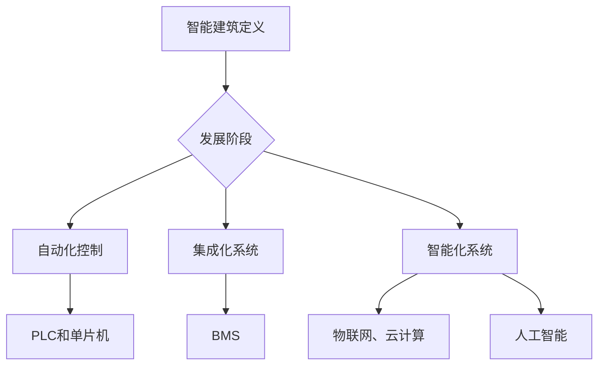

                 

### 1.1 智能建筑的定义与发展

#### 智能建筑的定义

智能建筑是指通过物联网、云计算、大数据、人工智能等高新技术，实现建筑内各种设备和系统的互联互通、智能感知和自动化控制，从而提高建筑运行效率和用户体验的建筑。这种建筑不仅包括传统的建筑功能，还融入了智能化的元素，使得建筑能够自我管理、自我优化，为用户带来更舒适、更便捷的生活和工作环境。

#### 智能建筑的发展历程

智能建筑的发展历程可以划分为三个阶段：

1. **第一阶段：自动化控制（20世纪80年代-2000年代初期）**
   
   在这个阶段，智能建筑主要采用PLC（可编程逻辑控制器）和单片机进行自动化控制，实现了对空调、照明、安防等系统的基本自动化。这一阶段的智能建筑主要集中在工业和商业领域，为建筑的初步智能化奠定了基础。

2. **第二阶段：集成化系统（2000年代初期-2010年代初期）**
   
   随着计算机技术和网络技术的发展，智能建筑开始采用集成化的系统解决方案，实现了建筑内各种系统的集成与协同工作。这一阶段的代表是BMS（Building Management System，建筑管理系统），它将建筑内的各个子系统如空调、照明、安防等进行统一管理，提高了建筑的运行效率。

3. **第三阶段：智能化系统（2010年代初期至今）**
   
   基于物联网、云计算、大数据等技术的快速发展，智能建筑进入了智能化阶段，实现了对建筑内环境的全面感知和智能优化。这一阶段的智能建筑更加注重用户体验，通过人工智能技术，实现建筑内环境的自适应调节和个性化服务。

### 1.2 AI技术的基本概念与分类

人工智能（Artificial Intelligence，简称AI）是指通过计算机程序实现人类智能行为的技术。AI技术主要包括以下几个方面：

1. **机器学习（Machine Learning）**

   机器学习是一种通过数据训练模型，使计算机具备自主学习能力的方法。机器学习可以分为监督学习、无监督学习和强化学习等不同类型。

2. **深度学习（Deep Learning）**

   深度学习是一种基于人工神经网络的深度学习方法，通过多层神经网络的训练，实现复杂模式识别和预测。深度学习在图像识别、自然语言处理等领域取得了显著成果。

3. **自然语言处理（Natural Language Processing，NLP）**

   自然语言处理是一种使计算机理解和处理人类语言的技术，主要包括文本分类、情感分析、机器翻译等任务。

4. **计算机视觉（Computer Vision）**

   计算机视觉是通过计算机对图像和视频进行分析和处理，实现物体识别、场景理解等功能的技术。计算机视觉在自动驾驶、安防监控等领域有广泛应用。

### 1.3 AI在智能建筑中的应用潜力

AI技术在智能建筑中具有广泛的应用潜力，主要体现在以下几个方面：

1. **室内环境优化**

   通过AI技术，可以实现室内环境的自适应调节，提高用户体验。例如，智能空调可以根据人体活动和室内温度自动调节温度，提高室内舒适度。

2. **能源管理**

   AI技术可以实现对建筑内能源的精细化管理，降低能源消耗。例如，智能照明系统可以根据室内光线强度和人员活动自动调节灯光亮度，实现节能。

3. **安防监控**

   通过AI技术，可以实现智能化的安防监控，提高安全性。例如，智能监控摄像头可以自动识别异常行为，实时报警。

4. **设备维护**

   通过AI技术，可以实现设备的智能化维护，降低设备故障率。例如，智能传感器可以实时监测设备状态，提前预警故障。

5. **用户服务**

   通过AI技术，可以提供个性化的用户服务，提升用户体验。例如，智能门禁系统可以根据用户身份自动开门，提供便捷的出入体验。

总的来说，AI技术在智能建筑中的应用，不仅能够提高建筑的运行效率，还能为用户带来更舒适、更便捷的生活和工作环境。随着AI技术的不断发展，智能建筑将在未来发挥越来越重要的作用。

### Mermaid 流程图



### Python 源代码示例

```python
# 智能建筑发展阶段示例代码
def smart_building_stage(stage):
    if stage == '自动化控制':
        print('采用PLC和单片机进行自动化控制')
    elif stage == '集成化系统':
        print('采用BMS实现集成化系统')
    elif stage == '智能化系统':
        print('采用物联网、云计算和人工智能实现智能化系统')
    else:
        print('未知的智能建筑发展阶段')

# 调用函数
smart_building_stage('智能化系统')
```

### 数学公式

$$
1 + 1 = 2
$$

### 结论

智能建筑与AI技术的结合，为建筑行业带来了革命性的变化。通过本文的介绍，我们可以看到AI技术在智能建筑中的广泛应用潜力，以及它如何通过提高室内环境质量、能源管理、安防监控等方面，为用户带来更好的生活和工作体验。随着技术的不断发展，智能建筑将越来越智能化，为人们创造更美好的未来。

### 注意事项

- 在实际应用中，智能建筑的设计和实施需要充分考虑用户需求和建筑特点。
- AI技术在智能建筑中的应用需要大量的数据支持，因此数据质量和数据安全至关重要。
- 智能建筑系统需要具备高度的可靠性和稳定性，以确保正常运行。

### 拓展阅读

- 《智能建筑导论》
- 《人工智能在建筑中的应用》
- 《智能建筑与物联网》

作者：AI天才研究院/AI Genius Institute & 禅与计算机程序设计艺术 /Zen And The Art of Computer Programming

