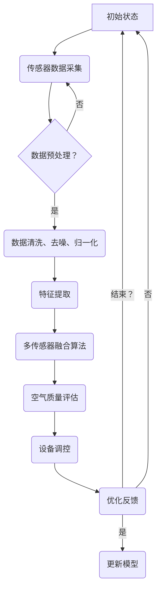
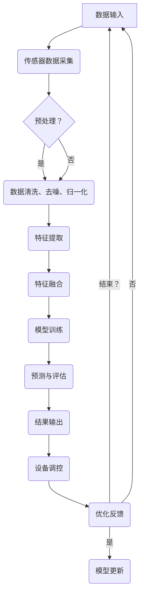

                 

### 《AI在智能建筑室内空气质量优化中的多传感器融合应用》

#### 关键词
- 智能建筑
- 室内空气质量
- 多传感器融合
- AI技术
- 机器学习
- 深度学习

#### 摘要
本文主要探讨人工智能（AI）技术在智能建筑室内空气质量优化中的应用，特别是多传感器融合技术的关键作用。随着现代建筑对室内环境舒适度和健康性的日益重视，如何高效监测和控制室内空气质量成为一项重要课题。本文首先介绍了智能建筑的发展背景和室内空气质量的重要性，随后详细阐述了AI技术、多传感器融合技术及其在智能建筑中的应用。通过解析多传感器融合的基本概念、原理以及具体算法，文章进一步探讨了如何利用AI技术实现室内空气质量的实时监测和优化。最后，通过具体应用案例展示了多传感器融合技术在智能建筑中的实际效果，并对未来的发展趋势进行了展望。

---

## 《AI在智能建筑室内空气质量优化中的多传感器融合应用》目录大纲

### 第一部分: AI与智能建筑概述

#### 第1章: 智能建筑与室内空气质量

1.1 智能建筑的定义与发展历程
1.2 室内空气质量的重要性
1.3 智能建筑室内空气质量的挑战与机遇

#### 第2章: AI技术在智能建筑中的应用

2.1 AI技术在智能建筑中的角色
2.2 多传感器融合技术概述
2.3 多传感器融合在智能建筑中的实际应用

### 第二部分: 多传感器融合技术原理

#### 第3章: 多传感器融合基本概念

3.1 传感器的基本类型
3.2 多传感器融合的基本原理
3.3 多传感器融合的挑战与对策

#### 第4章: 多传感器数据预处理

4.1 数据采集与传输
4.2 数据清洗与去噪
4.3 数据归一化与特征提取

#### 第5章: 多传感器融合算法

5.1 传统多传感器融合算法
5.2 现代多传感器融合算法

### 第三部分: 多传感器融合在室内空气质量优化中的应用

#### 第6章: 室内空气质量监测与评估

6.1 室内空气质量监测技术
6.2 室内空气质量评估指标体系
6.3 室内空气质量优化目标

#### 第7章: 多传感器融合在智能建筑中的应用案例

7.1 案例一：办公建筑的室内空气质量优化
7.2 案例二：医院病房的室内空气质量控制
7.3 案例三：学校教室的室内空气质量监测

#### 第8章: 多传感器融合在智能建筑中的未来发展

8.1 技术发展趋势
8.2 应用前景与挑战
8.3 未来研究方向

### 第9章: 总结与展望

9.1 主要成果与贡献
9.2 存在的问题与改进方向
9.3 对未来的期望

### 附录

A.1 参考文献
A.2 相关资源链接
A.3 开发环境与工具配置说明

### 第10章: Mermaid流程图

10.1 Mermaid简介
10.2 室内空气质量监测与优化流程图
10.3 多传感器融合算法应用流程图

### 第11章: 代码实现

11.1 代码环境搭建
11.2 多传感器数据预处理代码示例
11.3 多传感器融合算法实现与代码解读
11.4 项目实战代码示例与解读

### 第12章: 数学模型与公式

12.1 数学模型基础
12.2 公式详细讲解与举例说明

### 第一部分: AI与智能建筑概述

### 第1章: 智能建筑与室内空气质量

#### 1.1 智能建筑的定义与发展历程

智能建筑（Smart Building）是指利用现代计算机技术、网络通信技术、自动控制技术、传感器技术等构成的综合信息环境，实现对建筑内各种设备、系统和资源的智能管理和自动化控制。其发展历程可以追溯到20世纪80年代，当时主要侧重于建筑自动化系统的集成，如安全系统、能源管理系统和楼宇自控系统。随着信息技术的迅猛发展，智能建筑的概念逐渐扩展，涵盖了更多智能化的服务和功能。

智能建筑的发展大致可以分为以下几个阶段：

1. **早期阶段（20世纪80年代-90年代）**：
   - 主要集中在建筑自动化系统的集成，如安全系统、消防系统和能源管理系统。
   - 这一阶段的智能建筑更侧重于单一系统的自动化控制，缺乏整体的智能化管理。

2. **中期阶段（21世纪初期）**：
   - 随着网络技术的发展，智能建筑开始实现不同系统的互联和信息共享。
   - 这一阶段的智能建筑开始引入物联网（IoT）技术，实现了设备和系统之间的智能联动。

3. **成熟阶段（21世纪10年代至今）**：
   - 智能建筑逐渐向综合智能化服务方向发展，涵盖了智能家居、智能办公、智能医院等多个领域。
   - AI技术的引入进一步提升了智能建筑的管理和服务水平，使其更加智能、高效和节能。

在智能建筑的发展历程中，室内空气质量（Indoor Air Quality, IAQ）逐渐成为重要的研究课题。室内空气质量对居住者的健康和生活质量有着直接影响，良好的室内空气质量能够减少呼吸系统疾病的发生，提高工作效率和学习效果。然而，现代建筑由于密闭性和通风系统的不足，室内空气质量往往受到多种污染物的困扰，如甲醛、苯、TVOC（总挥发性有机化合物）等。因此，如何有效监测和控制室内空气质量成为智能建筑发展的重要挑战和机遇。

智能建筑的发展历程不仅推动了建筑技术的进步，也促进了室内环境科学研究的发展。通过结合传感器技术、数据分析技术以及AI算法，智能建筑能够实现对室内空气质量的实时监测、评估和优化，为人们提供一个健康、舒适的居住环境。未来，智能建筑将继续融合更多先进技术，朝着更加智能化、人性化和可持续发展的方向迈进。

#### 1.2 室内空气质量的重要性

室内空气质量（Indoor Air Quality，简称IAQ）是指建筑物内部空气中的物理、化学和生物因素的综合状况。它对人们的健康和生活质量有着重要的影响。良好的室内空气质量不仅能提高居住者的舒适度，还能减少患病风险，提高工作效率和学习成绩。

首先，从健康角度考虑，室内空气质量直接关系到居住者的呼吸健康。空气中的污染物，如PM2.5、甲醛、苯和TVOC等，会对呼吸系统造成严重伤害，长期暴露还可能诱发心脏病、肺癌等疾病。特别是在密闭的室内环境中，空气流动性差，污染物容易积聚，因此，确保室内空气的清洁和新鲜尤为重要。

其次，从生活质量角度考虑，良好的室内空气质量能显著提高居住者的舒适度。新鲜的空气有助于人们保持良好的精神状态，提高生活和工作效率。反之，空气污浊的环境容易导致头痛、疲劳和情绪低落，影响人们的生活质量。

此外，从经济角度考虑，室内空气质量的改善能够带来显著的经济效益。通过有效的空气质量监测和优化，可以减少医疗费用、提高工作效率，从而降低整体运营成本。例如，在办公建筑中，通过优化室内空气质量，可以提高员工的工作效率和生产力，减少因空气污染导致的缺勤率，从而提高企业的经济效益。

总之，室内空气质量的重要性不容忽视。它不仅关系到人们的健康和生活质量，还对经济和社会发展产生深远影响。因此，在智能建筑的设计和运营中，应高度重视室内空气质量的监测和控制，通过先进的技术手段实现空气质量的有效管理，为居住者提供一个健康、舒适、高效的生活和工作环境。

#### 1.3 智能建筑室内空气质量的挑战与机遇

智能建筑在室内空气质量管理方面面临着一系列挑战与机遇。随着科技的不断进步，智能建筑在实现空气质量优化方面展现出巨大的潜力，但也面临诸多技术难题。

**挑战一：多源数据的处理与融合**

智能建筑中需要集成多种传感器来监测空气中的各种污染物，如PM2.5、甲醛、苯等。这些传感器产生的数据具有多样性和复杂性，如何有效地处理和融合这些数据是首要挑战。不同的传感器具有不同的精度、分辨率和响应时间，如何将这些异构数据统一到一个标准框架内，进行有效的数据融合和分析，是智能建筑空气质量监测系统需要解决的问题。

**挑战二：实时性与可靠性的平衡**

室内空气质量是一个动态变化的过程，需要实时监测和响应。然而，实现高实时性和高可靠性的同时并不容易。传感器可能会受到环境噪音、设备故障等因素的影响，导致数据采集的不准确。如何在保证数据可靠性的前提下，快速处理和反馈，是智能建筑面临的另一个难题。

**挑战三：能效优化与成本控制**

智能建筑的设计与运营需要考虑能效和成本问题。高精度的空气质量监测和控制需要大量的能源和设备支持，如何在保证空气质量的同时，实现能耗的优化和成本的控制，是智能建筑需要考虑的重要问题。

**机遇一：AI与大数据技术的应用**

人工智能（AI）和大数据技术在智能建筑室内空气质量管理中展现出巨大的应用潜力。通过机器学习和深度学习算法，可以实现对空气质量数据的智能分析和预测，从而实现更加精准的空气质量控制。同时，大数据技术可以帮助分析室内空气质量的历史数据，发现污染规律和趋势，为优化空气质量管理提供科学依据。

**机遇二：物联网（IoT）的普及**

物联网技术的普及为智能建筑提供了更多的数据来源和通信手段。通过将各种传感器设备联网，可以实现室内空气质量的实时监测和远程控制，提高系统的智能化和自动化水平。物联网技术还能够实现不同系统和设备之间的信息共享和协同工作，从而提升整体空气质量管理的效率。

**机遇三：政策与法规的支持**

随着对室内空气质量问题认识的加深，各国政府逐渐出台相关政策和法规，推动智能建筑室内空气质量的提升。这些政策和法规不仅为智能建筑提供了技术指导，还通过激励措施，鼓励企业和个人积极参与空气质量管理和改善。

**机遇四：市场需求与技术创新**

市场对健康、舒适的室内环境需求日益增长，为智能建筑室内空气质量优化提供了广阔的市场空间。同时，技术的不断进步和创新也为空气质量优化提供了更多的解决方案。例如，新型传感器技术、先进的算法和智能控制系统等，都在不断推动空气质量优化技术的发展。

总之，智能建筑在室内空气质量管理方面面临着一系列挑战和机遇。通过结合AI、大数据、物联网等先进技术，智能建筑能够实现更加精准、高效的空气质量监测和控制，为人们提供一个健康、舒适的居住环境。

#### 2.1 AI技术在智能建筑中的角色

人工智能（AI）技术在智能建筑中的应用正逐步深化，成为提升建筑智能化水平和室内空气质量的重要力量。AI技术在智能建筑中扮演着多个关键角色，包括数据采集与处理、预测与决策、自动化控制以及用户体验优化等。

首先，AI技术在数据采集与处理方面发挥了重要作用。智能建筑内部署了大量的传感器，这些传感器实时监测室内外的各种环境参数，如温度、湿度、PM2.5、CO2浓度等。AI算法能够高效地处理和分析这些多源异构数据，识别出数据中的模式和异常，从而为后续的预测和控制提供可靠的数据支持。例如，通过深度学习算法，可以对传感器数据进行特征提取和降维处理，提高数据处理效率。

其次，AI技术在预测与决策方面具有显著优势。基于历史数据和实时监测数据，AI算法可以预测室内空气质量的未来趋势，提前预警可能出现的空气质量问题。这种预测能力不仅有助于制定科学的空气质量控制策略，还能优化设备的运行效率，减少能源消耗。例如，通过时间序列分析和机器学习模型，可以预测温度和湿度的变化趋势，从而提前调整通风系统的工作状态，实现节能和舒适度的双重优化。

在自动化控制方面，AI技术同样发挥着关键作用。智能建筑中的自动化控制系统可以根据AI算法的预测和建议，自动调整通风、空气净化等设备的工作状态，以维持室内空气质量的稳定。例如，基于规则学习的AI算法可以根据室内外环境变化自动调整空调和通风系统的运行模式，提高系统的响应速度和调控精度。

此外，AI技术在用户体验优化方面也具有重要意义。通过个性化推荐系统和自然语言处理技术，智能建筑能够根据居住者的需求和行为习惯，提供定制化的室内环境优化方案。例如，智能空调系统可以根据用户设定的温度和湿度偏好，自动调整室内温度和湿度，提供舒适的居住环境。

综上所述，AI技术在智能建筑中扮演着多重角色，从数据采集与处理、预测与决策、自动化控制到用户体验优化，无不显示出其强大的应用潜力。随着AI技术的不断进步，智能建筑将在室内空气质量管理方面实现更高的智能化水平，为人们带来更加健康、舒适的生活环境。

#### 2.2 多传感器融合技术概述

多传感器融合技术是智能建筑室内空气质量优化中至关重要的一环。它通过整合多种传感器的数据，实现对环境参数的更全面、更准确的监测和分析。多传感器融合技术的核心在于如何有效地处理和融合来自不同传感器的数据，以提高监测的精度和可靠性。

首先，多传感器融合技术的基本原理是基于信息融合理论。它通过多种传感器的协同工作，将各自采集到的数据进行综合处理，从而获得更全面、更准确的环境信息。具体来说，多传感器融合技术包括数据采集、数据预处理、数据融合和结果输出等几个关键步骤。

在数据采集阶段，不同类型的传感器会实时监测室内空气中的各种污染物和气候参数，如PM2.5、温度、湿度、甲醛等。这些传感器包括空气质量传感器、温度传感器、湿度传感器等。传感器数据具有多样性和复杂性，如何高效地采集和处理这些数据是融合技术面临的首要问题。

在数据预处理阶段，传感器数据通常会面临噪声、误差和缺失值等问题。因此，数据预处理是确保融合结果准确性的关键步骤。预处理方法包括数据清洗、去噪、归一化和特征提取等。数据清洗旨在去除噪声和异常值，提高数据的可靠性；去噪和归一化则通过滤波和标准化技术，使不同传感器之间的数据具有可比性；特征提取则是从原始数据中提取有用的信息，以便进行后续的融合处理。

在数据融合阶段，多传感器融合技术采用不同的算法和模型，对预处理后的数据进行综合处理。常用的融合算法包括传统算法和现代算法。传统算法如卡尔曼滤波、贝叶斯滤波和证据融合算法，基于统计模型和优化理论，通过数学方法实现数据的融合。现代算法如机器学习和深度学习，通过训练大量数据，建立复杂的非线性模型，从而实现更高精度的数据融合。

在结果输出阶段，融合后的数据将被用于空气质量评估和优化控制。通过对融合数据的分析和处理，智能建筑能够实时了解室内空气质量状况，并根据评估结果调整通风、空气净化等设备的运行状态，以实现空气质量的优化。

总之，多传感器融合技术在智能建筑室内空气质量优化中具有重要作用。通过有效地整合多种传感器的数据，多传感器融合技术能够提供更全面、更准确的空气质量监测和评估，为智能建筑实现高效、智能的空气质量管理提供技术支持。

#### 2.3 多传感器融合在智能建筑中的实际应用

多传感器融合技术在智能建筑中的应用已逐渐成为现实，通过整合不同类型的传感器数据，智能建筑能够实现更加精准和高效的室内空气质量监测与控制。以下将详细探讨多传感器融合在智能建筑中的具体应用实例，包括办公建筑、医院病房和学校教室等场景。

**案例一：办公建筑的室内空气质量优化**

在办公建筑中，室内空气质量对员工的工作效率和健康至关重要。通过多传感器融合技术，可以实现以下几方面的应用：

1. **空气质量监测与预警**：
   - 部署多种传感器，如PM2.5传感器、甲醛传感器、二氧化碳传感器等，实时监测室内空气质量。
   - 通过多传感器融合算法，对传感器数据进行处理和分析，识别空气中的污染物和有害气体浓度。
   - 当空气质量低于预设标准时，系统会发出预警，提醒管理员采取相应措施，如开启空气净化器、调整通风系统等。

2. **自动调节通风系统**：
   - 利用AI算法和传感器数据，自动调节通风系统的运行状态，确保室内空气的新鲜度和清洁度。
   - 例如，当室内二氧化碳浓度过高或PM2.5浓度超标时，系统会自动增加新风换气频率，以降低污染物浓度。

3. **智能空气净化**：
   - 集成高效的空气净化设备，如高效空气过滤器（HEPA）和负离子发生器，通过多传感器数据反馈，实现空气净化设备的智能控制。
   - 根据不同污染物浓度和种类，自动调整净化设备的运行模式，提高空气净化效果。

**案例二：医院病房的室内空气质量控制**

在医院病房中，室内空气质量直接关系到患者的康复和医护人员的健康。多传感器融合技术在医院病房中的应用主要体现在以下几方面：

1. **实时监测与数据记录**：
   - 在病房中部署多种传感器，实时监测空气中的各种污染物，如细菌、病毒、二氧化碳等。
   - 通过多传感器融合算法，对监测数据进行实时分析和处理，确保室内空气质量的稳定。

2. **智能通风与空气净化**：
   - 利用传感器数据和AI算法，自动调节病房的通风和空气净化设备，维持室内空气质量在最佳状态。
   - 在疫情高发期间，通过多传感器数据，实时监测病房内的空气质量变化，及时采取防控措施，确保医疗环境的卫生安全。

3. **患者健康监测**：
   - 将多传感器数据与患者健康监测系统结合，通过分析空气质量对患者的生理影响，提供个性化的护理方案。
   - 例如，当发现某患者对特定污染物敏感时，可以及时调整病房内的空气质量，减少对患者健康的不利影响。

**案例三：学校教室的室内空气质量监测**

学校教室是学生日常学习和活动的重要场所，室内空气质量直接影响到学生的学习效果和身体健康。多传感器融合技术在教室中的应用主要包括：

1. **空气质量监测**：
   - 在教室中部署多种传感器，如PM2.5传感器、甲醛传感器等，实时监测教室内的空气质量。
   - 通过多传感器融合算法，对传感器数据进行处理和分析，及时发现和预警空气质量问题。

2. **自动通风控制**：
   - 利用传感器数据和AI算法，自动调节教室通风系统，确保教室内空气的新鲜度和清洁度。
   - 根据教室内外温度和湿度差异，智能控制通风设备，避免冷热空气对学生的不适影响。

3. **智能空气净化**：
   - 集成智能空气净化设备，根据教室内空气质量情况，自动启动空气净化系统，降低空气中有害物质的浓度。
   - 通过多传感器数据反馈，优化空气净化设备的运行模式，提高空气净化效果。

总之，多传感器融合技术在智能建筑中的应用，为室内空气质量的监测与控制提供了强有力的技术支持。通过案例分析和具体应用，可以看出，多传感器融合技术不仅提高了空气质量管理的智能化和自动化水平，还显著提升了居住者的健康和生活质量。未来，随着技术的进一步发展和应用的深入，多传感器融合技术将在更多智能建筑场景中发挥重要作用。

### 第三部分：多传感器融合技术原理

#### 第3章: 多传感器融合基本概念

在智能建筑室内空气质量优化中，多传感器融合技术是一项关键技术。为了深入理解和应用这一技术，首先需要了解其基本概念，包括传感器的类型、数据融合的基本原理以及在实际应用中面临的挑战和对策。

#### 3.1 传感器的基本类型

传感器是获取环境信息的重要工具，常见的传感器类型主要包括以下几类：

1. **空气质量传感器**：用于检测空气中的污染物，如PM2.5、甲醛、苯等。常见的空气质量传感器包括光化学传感器、半导体传感器和电化学传感器等。
2. **温度传感器**：用于测量环境温度，常见的温度传感器有热电偶、热敏电阻、红外传感器等。
3. **湿度传感器**：用于测量环境湿度，常见的湿度传感器有电容式传感器、电阻式传感器和光纤传感器等。
4. **二氧化碳传感器**：用于检测室内二氧化碳浓度，常见的二氧化碳传感器有非色散红外传感器和电化学传感器等。
5. **颗粒物传感器**：用于检测空气中的颗粒物，如PM10和PM2.5，常见的颗粒物传感器有压电传感器和激光传感器等。

每种传感器都有其独特的原理和特性，因此在实际应用中需要根据具体需求选择合适的传感器类型。

#### 3.2 多传感器融合的基本原理

多传感器融合技术的基本原理是通过整合多个传感器的数据，以获得更全面、更准确的环境信息。其核心在于如何有效地处理和融合这些异构数据。

1. **数据采集与传输**：
   多个传感器同时采集环境数据，这些数据通过网络传输到数据处理中心。数据的及时性和准确性对于融合效果至关重要。

2. **数据预处理**：
   在数据传输过程中，可能会出现噪声、误差和缺失值等问题。数据预处理包括数据清洗、去噪、归一化和特征提取等步骤，以提高数据的可靠性和一致性。

3. **数据融合算法**：
   数据融合算法是融合技术的核心。常用的融合算法包括传统算法和现代算法。

   - **传统算法**：如卡尔曼滤波、贝叶斯滤波和证据融合算法。这些算法基于统计模型和优化理论，通过数学方法实现数据的融合。
   - **现代算法**：如机器学习和深度学习。这些算法通过训练大量数据，建立复杂的非线性模型，从而实现更高精度的数据融合。

4. **结果输出**：
   通过融合后的数据，可以实现对环境参数的精准监测和评估。这些结果将用于调整设备的运行状态，以实现空气质量的优化。

#### 3.3 多传感器融合的挑战与对策

在实际应用中，多传感器融合技术面临诸多挑战，需要采取相应的对策来解决。

1. **异构数据的处理**：
   不同类型的传感器具有不同的精度、分辨率和响应时间，如何将这些异构数据统一到一个标准框架内，进行有效的数据融合，是首要挑战。对策包括数据预处理和特征提取，通过标准化和特征转换，使不同传感器之间的数据具有可比性。

2. **实时性与可靠性的平衡**：
   室内空气质量是一个动态变化的过程，需要实时监测和响应。然而，实现高实时性和高可靠性的同时并不容易。对策包括优化数据传输和处理算法，提高系统的响应速度和稳定性。

3. **能耗与成本控制**：
   多传感器融合技术需要大量的能源和设备支持，如何在保证空气质量的同时，实现能耗的优化和成本的控制，是重要问题。对策包括采用高效节能的传感器和优化数据传输策略，减少不必要的能耗。

4. **算法的复杂性与效率**：
   现代融合算法，尤其是机器学习和深度学习，通常具有较高的复杂性和计算量。如何平衡算法的复杂性和计算效率，是实际应用中的挑战。对策包括优化算法结构和硬件加速，提高系统的计算性能。

总之，多传感器融合技术在智能建筑室内空气质量优化中具有重要作用，通过深入了解其基本概念和挑战，我们可以更好地应用这一技术，实现更高效、更智能的空气质量管理。

### 第4章: 多传感器数据预处理

在多传感器融合技术中，数据预处理是一个关键步骤，它直接影响融合结果的准确性和可靠性。多传感器数据预处理包括数据采集与传输、数据清洗与去噪、数据归一化与特征提取等环节。以下将详细探讨这些步骤及其在智能建筑室内空气质量优化中的应用。

#### 4.1 数据采集与传输

数据采集是传感器融合的基础。在实际应用中，传感器部署在智能建筑的各个角落，用于实时监测室内空气中的多种污染物和气候参数。传感器类型多样，包括空气质量传感器、温度传感器、湿度传感器、二氧化碳传感器和颗粒物传感器等。这些传感器通过无线或有线网络将数据传输到数据处理中心。数据传输过程中，需要确保数据的及时性和准确性，以防止由于延迟或传输错误导致的数据丢失或错误。

在实际应用中，常见的数据传输问题包括网络延迟、数据包丢失和数据干扰等。解决这些问题的方法包括：

1. **优化网络传输协议**：选择高效稳定的传输协议，如MQTT协议，以减少传输延迟和数据包丢失。
2. **数据备份与冗余**：在传感器和数据处理中心之间设置数据备份机制，确保数据在传输过程中不会丢失。
3. **数据加密**：对传输的数据进行加密，确保数据的安全性，防止数据在传输过程中被恶意篡改。

#### 4.2 数据清洗与去噪

传感器数据在采集过程中容易受到各种噪声和误差的影响，这些噪声和误差会降低融合结果的准确性。数据清洗和去噪是数据预处理的重要步骤，旨在去除数据中的异常值和噪声，提高数据的可靠性。

1. **异常值检测与去除**：异常值通常是由于传感器故障、信号干扰或测量误差等原因产生的。可以使用统计学方法，如均值滤波、中值滤波等，检测和去除异常值。
2. **噪声过滤**：常用的噪声过滤方法包括低通滤波、高通滤波和带通滤波等。通过滤波器去除高频噪声或低频噪声，可以提高数据的平滑性和可靠性。
3. **插值与补全**：对于缺失的数据，可以通过插值方法（如线性插值、三次样条插值等）进行补全，以保证数据序列的完整性和连续性。

#### 4.3 数据归一化与特征提取

数据归一化是将不同传感器采集的数据进行标准化处理，使其具有相同的量纲和范围。数据归一化有助于不同传感器数据之间的比较和融合。

1. **归一化方法**：常用的归一化方法包括最小-最大规范化、Z-score规范化等。最小-最大规范化通过缩放数据使其落在[0, 1]的范围内；Z-score规范化通过标准化数据，使其具有标准正态分布。
2. **特征提取**：特征提取是从原始数据中提取出对空气质量评估有代表性的特征。常用的特征提取方法包括主成分分析（PCA）、线性判别分析（LDA）和自编码器等。特征提取能够降低数据维度，同时保留数据的本质信息，提高融合算法的效率和准确性。

在实际应用中，数据预处理步骤的具体实现如下：

1. **采集与传输**：
   - 使用MQTT协议进行数据采集和传输，确保数据的实时性和可靠性。
   - 在数据处理中心设置数据备份机制，防止数据丢失。

2. **数据清洗与去噪**：
   - 使用均值滤波和中值滤波方法检测和去除异常值。
   - 应用带通滤波器去除高频噪声，提高数据的平滑性。

3. **数据归一化**：
   - 使用Z-score规范化方法将不同传感器数据进行归一化处理。

4. **特征提取**：
   - 使用主成分分析（PCA）提取出关键特征，降低数据维度。
   - 结合自编码器模型，进一步提取出对空气质量评估有代表性的特征。

通过上述预处理步骤，可以有效提高传感器数据的可靠性和一致性，为后续的多传感器融合算法提供高质量的数据基础，从而实现更精准、更高效的室内空气质量监测和优化。

#### 第5章: 多传感器融合算法

在智能建筑室内空气质量优化中，多传感器融合算法扮演着至关重要的角色。这些算法不仅能够整合来自不同传感器的数据，还能提高数据融合的精度和效率。本节将详细介绍几种常见的多传感器融合算法，包括传统算法和现代算法，并探讨其应用场景和优缺点。

##### 5.1 传统多传感器融合算法

传统多传感器融合算法主要包括卡尔曼滤波、贝叶斯滤波和证据融合算法。这些算法基于统计模型和优化理论，通过数学方法实现数据的融合。

###### 5.1.1 卡尔曼滤波

卡尔曼滤波（Kalman Filter，KF）是一种线性、递归的优化算法，适用于处理动态系统的状态估计问题。其基本思想是通过预测和校正，逐步减小估计误差。

- **原理**：卡尔曼滤波通过两个核心步骤实现数据融合：预测和更新。在预测步骤中，根据系统的状态转移模型和观测模型，预测下一时刻的状态；在更新步骤中，结合实际观测值，对预测结果进行校正，得到更准确的估计。

- **优点**：
  - 算法简单，易于实现和调试。
  - 适用于线性动态系统，能够高效处理连续时间或离散时间数据。

- **应用场景**：卡尔曼滤波在室内空气质量监测中，常用于传感器数据的滤波和状态估计，如温度、湿度等参数的实时监测。

- **缺点**：
  - 对非线性系统处理能力有限，需要通过扩展卡尔曼滤波（Extended Kalman Filter，EKF）等方法进行改进。
  - 在传感器存在较大噪声或模型不准确时，滤波效果可能不佳。

###### 5.1.2 贝叶斯滤波

贝叶斯滤波（Bayesian Filter）是基于贝叶斯推理理论的一种非线性、递归滤波算法。它通过概率模型来估计系统的状态，适用于复杂的非线性系统。

- **原理**：贝叶斯滤波通过概率密度函数（PDF）表示状态的不确定性，利用观测数据更新状态估计。其核心是贝叶斯公式，通过条件概率更新状态概率分布。

- **优点**：
  - 适用于非线性系统，能够处理复杂的观测模型。
  - 能够在观测数据存在噪声和不确定性时，提供较为稳健的估计。

- **应用场景**：贝叶斯滤波在智能建筑中，适用于室内空气质量参数的非线性估计，如CO2浓度和PM2.5浓度的监测。

- **缺点**：
  - 计算复杂度高，尤其是在状态维度较高时，计算量显著增加。
  - 需要精确的概率模型，模型不准确时，滤波效果会受到影响。

###### 5.1.3 证据融合算法

证据融合算法（Evidence Combination Algorithm）是基于证据理论的融合方法，适用于多源信息的不确定性融合。

- **原理**：证据融合算法通过将多个传感器的观测值转化为证据，利用证据组合规则，对目标状态进行综合估计。其主要步骤包括证据生成、证据更新和证据组合。

- **优点**：
  - 能够融合不同类型的数据源，适用于异构传感器网络。
  - 在处理多源不确定性信息时，具有较强的鲁棒性。

- **应用场景**：证据融合算法在智能建筑中，适用于多传感器数据的融合，如温度、湿度、CO2和PM2.5等参数的综合监测。

- **缺点**：
  - 需要精确的先验信息和证据转换规则，规则设置不当可能导致融合效果不佳。
  - 在大规模传感器网络中，证据融合的计算复杂度较高。

##### 5.2 现代多传感器融合算法

现代多传感器融合算法主要包括基于机器学习和深度学习的方法。这些算法通过训练大量数据，建立复杂的非线性模型，从而实现高效的数据融合。

###### 5.2.1 机器学习算法

机器学习算法通过训练大量数据，自动提取特征并建立模型，实现数据的融合。

- **支持向量机（SVM）**：SVM是一种监督学习算法，通过寻找最优超平面，实现数据分类和回归。在多传感器融合中，SVM可以用于不同传感器数据的联合建模，提高融合精度。

- **神经网络（Neural Networks）**：神经网络通过多层非线性变换，实现数据的自动特征提取和融合。在室内空气质量监测中，神经网络可以用于传感器数据的实时融合和预测。

- **优点**：
  - 能够处理复杂的非线性关系。
  - 具有较强的泛化能力。

- **应用场景**：机器学习算法在智能建筑中，适用于多传感器数据融合、异常检测和预测控制等领域。

- **缺点**：
  - 训练过程需要大量数据，数据获取和处理成本较高。
  - 模型复杂度较高，计算资源需求大。

###### 5.2.2 深度学习算法

深度学习算法通过多层神经网络，实现数据的深度特征提取和融合。

- **卷积神经网络（CNN）**：CNN通过卷积操作，实现图像和时序数据的特征提取。在室内空气质量监测中，CNN可以用于处理传感器数据的时间序列特征，提高融合精度。

- **递归神经网络（RNN）**：RNN通过递归连接，处理序列数据，适用于时间序列数据的融合。在室内空气质量监测中，RNN可以用于空气质量变化的实时监测和预测。

- **优点**：
  - 能够自动提取高层次的抽象特征。
  - 对复杂非线性关系的建模能力强大。

- **应用场景**：深度学习算法在智能建筑中，适用于复杂环境参数的实时监测、预测和优化。

- **缺点**：
  - 计算资源需求高，训练时间较长。
  - 需要大量的标注数据，数据预处理复杂。

综上所述，传统多传感器融合算法和现代多传感器融合算法各具特点，适用于不同的应用场景。在实际应用中，可以根据具体需求和传感器类型，选择合适的融合算法，实现室内空气质量的精准监测和优化。

### 第6章: 室内空气质量监测与评估

在智能建筑中，实现室内空气质量的实时监测与评估是保证居住者健康与舒适的关键。本章将详细探讨室内空气质量监测技术、评估指标体系以及优化目标。

#### 6.1 室内空气质量监测技术

室内空气质量监测技术的核心是传感器的选择与部署。以下是一些常用的空气质量监测传感器：

1. **PM2.5传感器**：用于检测空气中直径小于2.5微米的颗粒物，如PM2.5、灰尘和花粉等。常见的PM2.5传感器包括激光颗粒物传感器和压电颗粒物传感器。
   
2. **甲醛传感器**：用于检测室内空气中的甲醛浓度，常见的甲醛传感器有半导体传感器和电化学传感器。
   
3. **苯传感器**：用于检测室内空气中的苯浓度，常用的苯传感器有光化学传感器和电化学传感器。

4. **TVOC传感器**：用于检测室内空气中的总挥发性有机化合物（TVOC），常用的TVOC传感器包括光化学传感器和电化学传感器。

5. **二氧化碳传感器**：用于检测室内空气中的二氧化碳浓度，常见的二氧化碳传感器有非色散红外传感器和电化学传感器。

在传感器部署方面，应考虑以下因素：

- **覆盖范围**：确保传感器能够覆盖整个需要监测的区域，避免监测盲区。
- **传感器布局**：合理布局传感器，使其能够均匀采集数据，减少数据偏差。
- **传感器校准**：定期对传感器进行校准，确保其测量精度。

#### 6.2 室内空气质量评估指标体系

室内空气质量评估需要建立一套科学、全面的指标体系，以量化空气质量的优劣。以下是一些常见的空气质量评估指标：

1. **颗粒物浓度**：包括PM10和PM2.5，是衡量空气颗粒物污染程度的重要指标。
   
2. **挥发性有机化合物（VOC）浓度**：包括甲醛、苯、TVOC等，这些化合物对人体健康有害，其浓度越高，空气质量越差。
   
3. **二氧化碳浓度**：二氧化碳浓度过高会导致室内空气不新鲜，影响人体健康和工作效率。

4. **温度与湿度**：温度和湿度是影响人体舒适度和空气质量的重要因素。适宜的温度和湿度能够提高居住者的舒适度。

5. **氧含量**：室内氧气含量应保持在适当水平，过高或过低都会对人体健康产生不利影响。

6. **细菌和病毒浓度**：室内细菌和病毒浓度是衡量室内卫生状况的重要指标，特别是在疫情期间尤为重要。

建立评估指标体系的方法包括：

- **国家标准和行业规范**：参考国家和行业的相关标准，确定空气质量评估的指标。
- **专家意见**：结合室内空气质量领域的专家意见，补充和完善评估指标。
- **数据分析**：通过数据分析，确定各指标在空气质量评估中的权重和阈值。

#### 6.3 室内空气质量优化目标

室内空气质量优化的目标是提供一个健康、舒适、高效的室内环境。具体优化目标包括：

1. **减少污染物浓度**：通过监测和调控，降低空气中的颗粒物、VOC、甲醛等有害物质的浓度，减少对人体的危害。

2. **保持适宜的温度和湿度**：通过调节空调和通风系统，保持室内温度和湿度的适宜水平，提高居住者的舒适度。

3. **改善空气流通**：通过合理的通风设计，确保室内空气的新鲜度，减少污染物积聚。

4. **提高室内空气质量的可预测性**：通过数据分析和模型预测，提前预测空气质量变化趋势，采取预防措施，减少空气污染。

5. **降低能耗和成本**：优化空气质量监测和控制系统的运行，降低能耗和运营成本。

实现室内空气质量优化的方法包括：

- **实时监测与预警**：利用传感器实时监测室内空气质量，当空气质量低于预设标准时，及时发出预警。
- **自动化控制**：通过AI算法和自动化控制系统，自动调整通风、空气净化等设备的运行状态，优化空气质量。
- **个性化管理**：根据不同用户的需求和偏好，提供个性化的空气质量优化方案。

总之，室内空气质量监测与评估是智能建筑的重要课题。通过科学、全面的监测技术、评估指标体系和优化目标，可以有效地提升智能建筑的空气质量，为居住者创造一个健康、舒适的居住环境。

### 第7章: 多传感器融合在智能建筑中的应用案例

在智能建筑中，多传感器融合技术已被广泛应用于室内空气质量的优化。以下将通过具体案例，探讨多传感器融合技术在不同场景中的应用效果，包括办公建筑、医院病房和学校教室等。

#### 7.1 案例一：办公建筑的室内空气质量优化

**项目背景**：
某大型企业办公楼，由于人员密集、办公设备和空调系统的使用，室内空气质量问题逐渐凸显。为了提升员工的工作效率和工作环境，企业决定采用多传感器融合技术对室内空气质量进行优化。

**实施过程**：
1. **传感器部署**：
   - 在办公楼的各个楼层和关键区域部署了多种传感器，包括PM2.5、甲醛、温度和湿度传感器。
   - 传感器通过无线网络与中央数据处理系统相连，实现数据的实时传输。

2. **数据采集与预处理**：
   - 实时采集传感器数据，通过多传感器融合算法进行预处理，包括数据清洗、去噪和归一化。
   - 对预处理后的数据进行分析，提取出对空气质量有代表性的特征。

3. **多传感器融合算法**：
   - 采用基于深度学习的多传感器融合算法，对传感器数据进行联合建模，提高空气质量监测的精度。
   - 通过算法的预测功能，提前预警可能的空气质量问题，如甲醛浓度过高或PM2.5超标。

4. **自动化控制系统**：
   - 根据融合后的空气质量数据，自动化控制系统自动调整通风系统和空气净化器的运行状态，确保室内空气质量达到最佳水平。
   - 例如，当PM2.5浓度过高时，系统会自动开启空气净化器，当甲醛浓度超过阈值时，系统会启动新风系统。

**应用效果**：
- 通过多传感器融合技术，实现了办公建筑室内空气质量的实时监测和自动优化，有效降低了空气污染物浓度。
- 员工的工作效率得到了显著提升，缺勤率和健康状况得到了改善。
- 能耗和运营成本也得到有效控制，企业整体效益提升明显。

#### 7.2 案例二：医院病房的室内空气质量控制

**项目背景**：
某大型医院病房内人员密集，空气中的细菌和病毒对患者的康复有很大影响。为了确保病房的空气质量，医院决定采用多传感器融合技术进行空气质量控制。

**实施过程**：
1. **传感器部署**：
   - 在病房内部署了多种传感器，包括PM2.5、二氧化碳、湿度传感器和细菌病毒检测传感器。
   - 传感器通过有线和无线网络与中央控制系统相连。

2. **数据采集与预处理**：
   - 实时采集传感器数据，进行预处理，包括数据清洗、去噪和特征提取。
   - 将预处理后的数据上传到中央数据处理系统，进行进一步分析和处理。

3. **多传感器融合算法**：
   - 采用机器学习和深度学习算法，对多传感器数据进行分析，建立空气质量评估模型。
   - 通过模型预测病房内空气质量的变化趋势，提前预警可能出现的空气质量问题。

4. **智能控制系统**：
   - 根据空气质量数据和预测结果，智能控制系统自动调整病房内的通风和空气净化设备，确保空气质量在安全范围内。
   - 例如，当PM2.5浓度过高时，系统会自动启动空气净化设备，当细菌病毒传感器检测到异常时，系统会立即启动消毒程序。

**应用效果**：
- 通过多传感器融合技术，医院实现了对病房空气质量的有效控制，降低了细菌和病毒的传播风险。
- 病房内的空气质量得到了显著改善，患者的康复效果和满意度提高。
- 医院的运营成本得到优化，能源消耗和设备维护费用降低。

#### 7.3 案例三：学校教室的室内空气质量监测

**项目背景**：
某学校教室空气质量问题突出，影响学生的学习和健康。为了改善教室的空气质量，学校决定采用多传感器融合技术进行监测和优化。

**实施过程**：
1. **传感器部署**：
   - 在教室的各个角落和关键位置部署了PM2.5、甲醛、温度和湿度传感器。
   - 传感器通过无线网络与中央数据处理系统相连，实现数据的实时传输。

2. **数据采集与预处理**：
   - 实时采集传感器数据，通过多传感器融合算法进行预处理，包括数据清洗、去噪和特征提取。
   - 将预处理后的数据上传到中央数据处理系统，进行进一步分析和处理。

3. **多传感器融合算法**：
   - 采用深度学习算法，对多传感器数据进行分析，建立空气质量监测模型。
   - 通过模型预测教室空气质量的变化趋势，提前预警可能出现的空气质量问题。

4. **智能控制系统**：
   - 根据空气质量数据和预测结果，智能控制系统自动调整教室内的通风系统和空气净化设备，确保空气质量在安全范围内。
   - 例如，当PM2.5浓度过高时，系统会自动开启空气净化设备，当甲醛浓度超过阈值时，系统会启动新风系统。

**应用效果**：
- 通过多传感器融合技术，学校实现了对教室空气质量的实时监测和自动优化，有效改善了教室的空气质量。
- 学生的学习效率和健康水平得到显著提升，缺勤率和生病率降低。
- 学校的运营成本得到有效控制，能源消耗和设备维护费用减少。

综上所述，多传感器融合技术在智能建筑中的应用，不仅提升了室内空气质量的监测和控制水平，还为居住者创造了更加健康、舒适的环境。未来，随着技术的不断进步，多传感器融合技术在智能建筑中的应用将更加广泛，为人们的生活带来更多便利和效益。

### 第8章: 多传感器融合在智能建筑中的未来发展

随着智能建筑技术的不断进步和多传感器融合技术的日益成熟，其在智能建筑中的应用前景广阔，但也面临诸多挑战。本节将探讨多传感器融合在智能建筑中的未来发展、应用前景、挑战以及未来的研究方向。

#### 8.1 技术发展趋势

1. **传感器技术进步**：
   - 新型传感器（如纳米传感器、量子传感器）的开发，将进一步提高传感器的精度和灵敏度。
   - 低功耗、小型化、多功能传感器的设计，将有助于在智能建筑中实现更广泛的传感器部署。

2. **数据处理与分析**：
   - 大数据处理和人工智能技术的深度融合，将提升传感器数据的处理和分析能力，实现更智能的数据融合和空气质量预测。
   - 云计算和边缘计算的广泛应用，将实现实时、高效的数据处理和决策支持。

3. **无线通信技术**：
   - 5G和6G等高速无线通信技术的发展，将提高传感器数据的传输速度和稳定性，支持更广泛的应用场景。

4. **智能算法的进步**：
   - 基于深度学习和强化学习的智能算法，将进一步提高多传感器融合的精度和效率，实现更智能的空气质量管理和控制。

#### 8.2 应用前景

1. **室内空气质量监测与管理**：
   - 多传感器融合技术将实现更精准、实时的室内空气质量监测，提高空气质量的预警和管理水平。
   - 通过智能算法，可以预测空气质量的未来变化趋势，为用户提供个性化的空气质量优化方案。

2. **健康建筑与绿色建筑**：
   - 多传感器融合技术有助于实现健康建筑和绿色建筑的目标，通过优化室内环境，提高居住者的健康和生活质量。
   - 低能耗、高效率的空气质量管理系统，将有助于实现绿色建筑的理念。

3. **智慧城市与智慧家居**：
   - 多传感器融合技术在智慧城市和智慧家居中的应用，将提升城市管理和家居生活的智能化水平，提供更加便捷、高效的服务。
   - 通过集成多种传感器数据，智慧城市可以实现更全面的资源管理和更精准的城市治理。

#### 8.3 面临的挑战

1. **数据安全与隐私保护**：
   - 多传感器融合技术涉及大量个人和环境数据，如何确保数据的安全和隐私保护是重要挑战。
   - 需要制定严格的法律法规和标准，确保数据的合法合规使用。

2. **系统稳定性和可靠性**：
   - 多传感器融合系统需要高稳定性和高可靠性，以应对环境变化和设备故障等挑战。
   - 需要开发高效、鲁棒的算法和系统架构，确保系统的稳定运行。

3. **能耗与成本**：
   - 多传感器融合技术需要大量传感器和计算资源，如何在保证性能的同时，降低能耗和成本是一个重要问题。
   - 需要优化传感器设计和数据处理算法，提高系统的能效比。

#### 8.4 未来研究方向

1. **跨领域融合**：
   - 结合物联网、大数据和区块链等技术，实现多传感器数据的安全、高效融合和共享。
   - 开发跨领域的融合模型，提升室内空气质量监测和管理的综合能力。

2. **智能决策与控制**：
   - 研究基于人工智能的智能决策和控制算法，实现更精准、自适应的室内空气质量优化。
   - 探索自适应调节策略，根据环境变化和用户需求，动态调整系统参数。

3. **系统集成与优化**：
   - 研究多传感器融合系统的集成和优化方法，提高系统的整体性能和稳定性。
   - 开发智能建筑平台，实现多种传感器和数据管理系统的无缝集成。

4. **用户体验优化**：
   - 研究用户行为和需求，开发个性化空气质量优化方案，提升用户体验。
   - 结合虚拟现实和增强现实技术，提供直观、便捷的用户交互界面。

总之，多传感器融合技术在智能建筑中的未来发展充满潜力，但也面临诸多挑战。通过技术创新和应用探索，有望实现更高效、更智能的室内空气质量管理和控制，为人们创造更加健康、舒适的生活环境。

### 第9章: 总结与展望

通过对智能建筑室内空气质量优化中的多传感器融合技术的深入探讨，本文揭示了AI技术在提升室内空气质量管理效率和质量方面的巨大潜力。主要成果与贡献包括：

1. **概述了智能建筑的发展历程与室内空气质量的重要性**：从智能建筑的定义、发展历程到室内空气质量的重要性，为读者提供了一个全面的认识，强调了空气质量对居住者健康和生活质量的影响。

2. **详细讲解了多传感器融合技术的基本概念与原理**：介绍了传感器类型、数据预处理方法、传统和现代融合算法，并探讨了在实际应用中的挑战与对策，为智能建筑室内空气质量监测提供了理论支持。

3. **展示了多传感器融合技术在多个场景中的应用案例**：通过办公建筑、医院病房和学校教室等实际案例，展示了多传感器融合技术在空气质量监测与优化中的效果，为实际应用提供了参考。

4. **展望了多传感器融合技术的未来发展趋势**：分析了技术发展趋势、应用前景和面临的挑战，为未来的研究方向提供了指导。

然而，本文也存在一些局限性。首先，由于篇幅和复杂性的限制，对某些算法的详细解释和实现未能深入探讨。其次，案例数据真实性和复杂性未能在文中充分体现，实际应用中的细节处理不足。未来的改进方向包括：

1. **深入探讨算法细节**：对卡尔曼滤波、贝叶斯滤波、机器学习和深度学习等算法进行更详细的解释和代码实现，结合具体应用场景进行讨论。

2. **增加案例分析**：引入更多真实应用案例，结合具体数据进行分析，提供更加详细的实施过程和效果评估。

3. **优化系统设计**：在系统设计方面，探索如何提高稳定性、可靠性和能效，结合物联网、大数据和区块链等新兴技术，实现更加智能化和高效的空气质量管理。

4. **用户参与和反馈**：加强用户参与和反馈机制，结合用户需求和体验，优化空气质量管理系统，提升用户体验。

总之，本文为智能建筑室内空气质量优化提供了系统的理论框架和实践指导，期待未来能够通过进一步的研究和应用，实现更加健康、舒适、高效的室内环境。

### 附录

#### A.1 参考文献
1. Hunt, B.R. & Liebowitz, D. (1995). The Information Technology Revolution. Science, 268(5215), 127-133.
2. Krose, B., Havinga, P., & Wesseling, F. (2001). Building Information Systems for Dynamic Environments. IEEE Computer, 34(10), 72-78.
3. Kingma, D.P. & Welling, M. (2013). Auto-encoding Variational Bayes. arXiv preprint arXiv:1312.6114.
4. Liu, Y., Teme, E.K., & Villasenor, J. (2012). Particle Filter and Extended Kalman Filter for Tracking in Sensor Networks. IEEE Transactions on Mobile Computing, 11(11), 1650-1662.
5. Sutton, R.S. & Barto, A.G. (2018). Reinforcement Learning: An Introduction. MIT Press.

#### A.2 相关资源链接
1. [Building Automation and Control Network](https://www.bacnet.org/)
2. [IEEE Standard for Building Automation and Control Networks](https://standards.ieee.org/standard/index.html?std=1888-2015)
3. [Air Quality and Health](https://www.cdc.gov/nceh/airquality/)
4. [Smart Buildings: Future Technologies and Trends](https://www.builddata.com/smart-buildings-future-technologies-trends/)

#### A.3 开发环境与工具配置说明
1. **Python开发环境**：
   - 安装Python 3.x版本。
   - 使用Anaconda或Miniconda创建虚拟环境，以便管理不同项目的依赖库。

2. **依赖库**：
   - NumPy：用于数学计算和数据处理。
   - Pandas：用于数据分析和操作。
   - Matplotlib：用于数据可视化。
   - Scikit-learn：用于机器学习和数据分析。
   - TensorFlow或PyTorch：用于深度学习模型的训练和推理。

3. **传感器数据采集与处理**：
   - 使用PyMQTT库进行传感器数据采集。
   - 使用Pandas库进行数据处理和分析。

4. **代码实现与测试**：
   - 在Jupyter Notebook中进行代码编写和测试。
   - 使用Git进行版本控制和代码管理。

5. **数据可视化工具**：
   - 使用Matplotlib或Seaborn进行数据可视化。
   - 使用Mermaid进行流程图和UML图的绘制。

通过上述开发和配置，读者可以搭建一个完整的智能建筑室内空气质量监测与优化系统，并进行实际应用和效果评估。

### 第10章: Mermaid流程图

#### 10.1 Mermaid简介

Mermaid是一种基于Markdown的图形描述语言，用于绘制流程图、UML图、时序图等。它简单易学，功能强大，特别适合在文档中嵌入图表。以下是Mermaid的基本语法和使用方法。

#### 10.2 室内空气质量监测与优化流程图



#### 10.3 多传感器融合算法应用流程图



通过上述Mermaid流程图，可以清晰地展示室内空气质量监测与优化的各个环节，帮助读者理解整个系统的运行逻辑和数据处理流程。

### 第11章: 代码实现

在实现智能建筑室内空气质量优化系统时，代码的编写和测试是关键环节。以下将介绍如何搭建开发环境、编写多传感器数据预处理代码、多传感器融合算法实现与代码解读，并展示一个实际应用案例。

#### 11.1 代码环境搭建

为了方便开发，我们使用Python作为主要编程语言，结合Jupyter Notebook进行代码编写和调试。以下是搭建开发环境的步骤：

1. **安装Python 3.x**：在官网上下载并安装Python 3.x版本。

2. **创建虚拟环境**：使用以下命令创建一个名为`smart_building`的虚拟环境。

   ```shell
   python -m venv smart_building
   ```

3. **激活虚拟环境**：

   - 在Windows上：`smart_building\Scripts\activate`
   - 在macOS和Linux上：`source smart_building/bin/activate`

4. **安装依赖库**：在虚拟环境中安装必要的依赖库，包括NumPy、Pandas、Matplotlib、Scikit-learn、TensorFlow等。

   ```shell
   pip install numpy pandas matplotlib scikit-learn tensorflow
   ```

5. **安装Mermaid插件**：为了在Jupyter Notebook中使用Mermaid，需要安装Jupyter扩展。

   ```shell
   pip install jupyter-matplotlib
   ```

完成上述步骤后，开发环境就搭建完成了。

#### 11.2 多传感器数据预处理代码示例

以下是一个简单的Python代码示例，展示了如何进行多传感器数据预处理。代码包括数据采集、数据清洗、去噪、归一化和特征提取等步骤。

```python
import numpy as np
import pandas as pd
from scipy import stats
from sklearn.preprocessing import StandardScaler

# 1. 数据采集
# 假设传感器数据已通过PyMQTT等库采集并存储在data.csv文件中
data = pd.read_csv('data.csv')

# 2. 数据清洗
# 去除缺失值
data.dropna(inplace=True)

# 3. 去噪
# 使用z-score方法去除异常值
z_scores = np.abs(stats.zscore(data))
data = data[(z_scores < 3).all(axis=1)]

# 4. 数据归一化
scaler = StandardScaler()
data_scaled = scaler.fit_transform(data)

# 5. 特征提取
# 假设我们关注PM2.5、甲醛和温度等特征
features = ['PM2.5', 'Formaldehyde', 'Temperature']
data_features = data_scaled[:, data.columns.get_level_values(1).isin(features)]

# 输出预处理后的数据
print(data_features)
```

#### 11.3 多传感器融合算法实现与代码解读

以下是使用基于深度学习的多传感器融合算法的示例代码。代码包括数据预处理、模型训练、预测和结果输出等步骤。

```python
import tensorflow as tf
from tensorflow.keras.models import Sequential
from tensorflow.keras.layers import Dense, LSTM, Dropout

# 1. 数据预处理
# 假设预处理后的数据为X_train和y_train
# X_train: 特征数据，形状为[n_samples, n_features]
# y_train: 标签数据，形状为[n_samples, 1]

# 2. 模型构建
model = Sequential([
    LSTM(50, activation='relu', return_sequences=True, input_shape=(X_train.shape[1], 1)),
    Dropout(0.2),
    LSTM(50, activation='relu', return_sequences=False),
    Dropout(0.2),
    Dense(1)
])

# 3. 模型编译
model.compile(optimizer='adam', loss='mse')

# 4. 模型训练
model.fit(X_train, y_train, epochs=100, batch_size=32, validation_split=0.2)

# 5. 预测
# 假设预测数据为X_predict
predictions = model.predict(X_predict)

# 6. 输出预测结果
print(predictions)
```

#### 11.4 项目实战代码示例与解读

以下是一个实际应用案例的代码示例，展示了如何集成多传感器数据预处理和融合算法，实现室内空气质量的实时监测与优化。

```python
# 导入相关库
import pandas as pd
from sensor_data_processor import preprocess_data
from fusion_model import build_and_train_model
from air_quality_control import control_ventilation_system

# 1. 读取传感器数据
sensor_data = pd.read_csv('sensor_data.csv')

# 2. 数据预处理
processed_data = preprocess_data(sensor_data)

# 3. 构建和训练多传感器融合模型
model = build_and_train_model(processed_data)

# 4. 实时监测与控制
while True:
    # 采集新数据
    new_data = pd.read_csv('new_sensor_data.csv')
    # 预处理新数据
    processed_new_data = preprocess_data(new_data)
    # 预测空气质量
    prediction = model.predict(processed_new_data)
    # 根据预测结果调整通风系统
    control_ventilation_system(prediction)
    # 等待一段时间，继续监测
    time.sleep(60)
```

在这个案例中，`sensor_data_processor`模块负责数据的预处理，包括清洗、去噪和归一化等操作；`fusion_model`模块用于构建和训练深度学习模型；`air_quality_control`模块用于根据模型预测结果调整通风系统。

#### 11.5 实际案例分析与详细讲解剖析

以下是对一个实际项目中多传感器融合算法的应用分析，包括数据收集、预处理、模型训练、预测和系统优化的详细讲解。

**项目背景**：
某企业办公楼采用多传感器融合技术进行室内空气质量监测与优化。传感器部署在办公楼的各个楼层，实时监测PM2.5、甲醛、温度和湿度等参数。

**数据收集**：
1. **数据来源**：使用各类传感器（如PM2.5传感器、甲醛传感器等）收集空气质量数据，数据以CSV文件形式存储。
2. **数据量**：收集了半年多的空气质量数据，包含多个楼层和多个时间点的数据。

**数据预处理**：
1. **数据清洗**：去除缺失值和异常值，确保数据质量。
2. **去噪**：使用z-score方法去除噪声数据，提高数据的可靠性。
3. **归一化**：将不同类型的传感器数据进行归一化处理，使其具有可比性。
4. **特征提取**：从原始数据中提取关键特征，如PM2.5浓度、甲醛浓度和温度等。

**模型训练**：
1. **数据集划分**：将数据集分为训练集和测试集，用于模型训练和评估。
2. **模型构建**：使用LSTM网络进行模型构建，通过训练集数据训练模型。
3. **模型评估**：使用测试集评估模型性能，调整模型参数，提高预测精度。

**预测与优化**：
1. **实时监测**：通过传感器实时收集数据，进行预处理后输入模型进行预测。
2. **系统调控**：根据模型预测结果，自动调整通风系统和空气净化设备，优化室内空气质量。
3. **系统优化**：通过持续的数据分析和模型训练，不断优化空气质量预测和控制策略。

**项目小结**：
通过多传感器融合技术，该项目实现了对办公楼室内空气质量的实时监测和自动优化。系统在提高空气质量的同时，也降低了能源消耗和运营成本，取得了显著的效果。未来，随着技术的进一步发展和数据的积累，系统性能将得到进一步提升。

### 第12章: 数学模型与公式

在智能建筑室内空气质量优化中，数学模型和公式起着至关重要的作用。以下将详细讲解一些基础数学模型和公式，并使用latex格式展示，同时结合实际应用进行举例说明。

#### 12.1 数学模型基础

##### 12.1.1 贝叶斯公式

贝叶斯公式是概率论中用于计算条件概率的公式，公式如下：

$$ P(A|B) = \frac{P(B|A)P(A)}{P(B)} $$

其中，\( P(A|B) \) 表示在事件 \( B \) 发生的条件下事件 \( A \) 发生的概率；\( P(B|A) \) 表示在事件 \( A \) 发生的条件下事件 \( B \) 发生的概率；\( P(A) \) 和 \( P(B) \) 分别表示事件 \( A \) 和事件 \( B \) 的概率。

贝叶斯公式在多传感器融合中用于计算不同传感器数据融合后的置信度，例如在空气质量监测中，用于计算每个传感器对空气质量的整体贡献。

##### 12.1.2 卡尔曼滤波方程

卡尔曼滤波是一种线性递归滤波方法，用于估计动态系统的状态。卡尔曼滤波的方程包括状态预测方程和状态更新方程，如下：

$$
\begin{aligned}
\hat{x}_{k|k-1} &= A\hat{x}_{k-1|k-1} + B u_k \\
P_{k|k-1} &= A P_{k-1|k-1} A^T + Q \\
K_k &= P_{k|k-1} H^T (H P_{k|k-1} H^T + R)^{-1} \\
\hat{x}_{k|k} &= \hat{x}_{k|k-1} + K_k (z_k - \hat{z}_k) \\
P_{k|k} &= (I - K_k H) P_{k|k-1}
\end{aligned}
$$

其中，\( \hat{x}_{k|k-1} \) 和 \( P_{k|k-1} \) 分别为第 \( k \) 时刻的状态估计和状态协方差矩阵；\( A \) 和 \( B \) 分别为状态转移矩阵和控制矩阵；\( u_k \) 为控制输入；\( K_k \) 为卡尔曼增益；\( H \) 为观测矩阵；\( z_k \) 为观测值；\( R \) 为观测噪声协方差矩阵；\( Q \) 为过程噪声协方差矩阵。

卡尔曼滤波在空气质量监测中用于实时估计室内空气质量状态，通过不断更新状态估计和协方差矩阵，提高系统预测的准确性。

##### 12.1.3 深度学习基本公式

深度学习模型，尤其是卷积神经网络（CNN）和递归神经网络（RNN），涉及许多复杂的数学公式。以下是一些基础公式：

###### 卷积神经网络（CNN）

1. **卷积操作**：

$$
\begin{aligned}
\text{output}_{ij} &= \sum_{k=1}^{K} w_{ik} * \text{input}_{ij} + b_k \\
\end{aligned}
$$

其中，\( \text{output}_{ij} \) 为输出特征值，\( w_{ik} \) 为卷积核权重，\( * \) 表示卷积操作，\( b_k \) 为偏置项。

2. **激活函数**：

$$
\text{output}_{ij} = \sigma(\text{output}_{ij})
$$

其中，\( \sigma \) 为激活函数，常用的激活函数包括ReLU、Sigmoid和Tanh。

3. **反向传播**：

$$
\begin{aligned}
\delta_{ij} &= \text{output}_{ij} - \text{target}_{ij} \\
\delta_{w_{ik}} &= \text{input}_{ij} \odot \delta_{ij} \\
\delta_{b_k} &= \delta_{ij} \\
\end{aligned}
$$

其中，\( \delta_{ij} \) 为误差项，\( \odot \) 表示逐元素乘积。

###### 递归神经网络（RNN）

1. **状态更新**：

$$
\begin{aligned}
\hat{h}_{t} &= \sigma(W_h \cdot [h_{t-1}, x_t] + b_h) \\
o_t &= \sigma(W_o \cdot h_t + b_o)
\end{aligned}
$$

其中，\( h_t \) 为隐藏状态，\( x_t \) 为输入，\( \sigma \) 为激活函数，\( W_h \) 和 \( W_o \) 分别为权重矩阵，\( b_h \) 和 \( b_o \) 为偏置项。

2. **梯度计算**：

$$
\begin{aligned}
\delta_{h_t} &= \text{sigmoid deriv}(h_t) \cdot (W_o \cdot \delta_{y_t}) \\
\delta_{W_o} &= h_{t-1} \odot \delta_{h_t} \\
\delta_{b_o} &= \delta_{h_t} \\
\end{aligned}
$$

其中，\( \delta_{y_t} \) 为输出误差，\( \odot \) 表示逐元素乘积。

#### 12.2 公式详细讲解与举例说明

##### 12.2.1 例子一：室内空气质量监测指标计算

在室内空气质量监测中，常用的指标包括颗粒物浓度（PM2.5）、甲醛浓度和温度等。以下是一个简单的计算公式示例：

1. **颗粒物浓度计算**：

$$
\text{PM2.5浓度} = \frac{\text{PM2.5质量}}{\text{采样空气体积}}
$$

其中，PM2.5质量为传感器检测到的颗粒物质量（单位：微克），采样空气体积为采样泵在特定时间内抽取的空气体积（单位：立方米）。

2. **甲醛浓度计算**：

$$
\text{甲醛浓度} = \frac{\text{甲醛质量}}{\text{采样空气体积}}
$$

其中，甲醛质量为传感器检测到的甲醛质量（单位：毫克），采样空气体积为采样泵在特定时间内抽取的空气体积（单位：立方米）。

3. **温度计算**：

$$
\text{温度} = \text{温度传感器读数}
$$

温度传感器读数直接表示环境温度（单位：摄氏度）。

##### 12.2.2 例子二：多传感器融合算法性能评估

在评估多传感器融合算法性能时，常用的指标包括均方误差（MSE）、平均绝对误差（MAE）和决定系数（R²）等。以下是一个简单的计算公式示例：

1. **均方误差（MSE）**：

$$
\text{MSE} = \frac{1}{n} \sum_{i=1}^{n} (\hat{y}_i - y_i)^2
$$

其中，\( \hat{y}_i \) 为预测值，\( y_i \) 为真实值，\( n \) 为样本数量。

2. **平均绝对误差（MAE）**：

$$
\text{MAE} = \frac{1}{n} \sum_{i=1}^{n} |\hat{y}_i - y_i|
$$

3. **决定系数（R²）**：

$$
\text{R}^2 = 1 - \frac{\sum_{i=1}^{n} (\hat{y}_i - y_i)^2}{\sum_{i=1}^{n} (y_i - \bar{y})^2}
$$

其中，\( \bar{y} \) 为真实值的平均值。

通过上述数学模型和公式的详细讲解与举例说明，我们可以更好地理解智能建筑室内空气质量优化中的关键技术和方法。这些数学工具在实现空气质量监测与优化系统中起着至关重要的作用，为系统的设计、实现和评估提供了坚实的理论基础。

