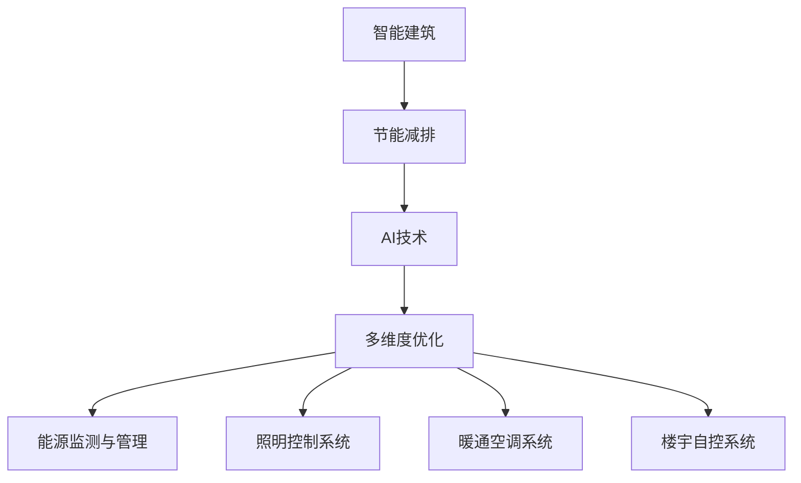

                 

### 文章标题：AI在智能建筑节能减排中的多维度优化应用

> 关键词：智能建筑，节能减排，人工智能，多维度优化，深度学习，能源监测

> 摘要：本文从智能建筑与节能减排的关系出发，探讨了AI在智能建筑节能减排中的多维度优化应用。文章首先介绍了智能建筑的定义、发展背景以及AI在其中的应用优势；随后深入探讨了AI在能源监测与管理、照明控制系统、暖通空调系统、楼宇自控系统中的应用，并通过具体案例分析了AI优化效果；最后，文章总结了多维度优化模型与算法，并展望了智能建筑的未来发展趋势。

### 目录大纲

#### 第一部分：引言与基础理论

##### 第1章 智能建筑与节能减排概述

1.1 智能建筑的定义与发展背景
1.2 节能减排的重要性
1.3 AI在智能建筑中的应用

##### 第2章 AI基础理论

2.1 机器学习基础
2.2 深度学习技术

#### 第二部分：AI在智能建筑节能减排中的应用

##### 第3章 AI在能源监测与管理中的应用

3.1 能源监测系统设计
3.2 数据采集与处理
3.3 能源管理优化

##### 第4章 AI在照明控制系统中的应用

4.1 照明控制系统架构
4.2 AI在照明节能中的应用
4.3 案例研究

##### 第5章 AI在暖通空调系统中的应用

5.1 暖通空调系统介绍
5.2 AI在暖通空调控制中的应用
5.3 实际应用案例

##### 第6章 AI在楼宇自控系统中的应用

6.1 楼宇自控系统概述
6.2 AI在楼宇自控中的优化
6.3 实际应用与效益分析

#### 第三部分：多维度优化应用与实践

##### 第7章 多维度优化模型与算法

7.1 多维度优化模型构建
7.2 常见优化算法分析
7.3 多维度优化应用案例

##### 第8章 智能建筑系统集成与优化

8.1 系统集成策略
8.2 优化实施与效果评估
8.3 未来发展趋势

##### 附录

A.1 常用AI框架与工具

### 文章正文

#### 第一部分：引言与基础理论

##### 第1章 智能建筑与节能减排概述

**1.1 智能建筑的定义与发展背景**

智能建筑（Smart Building）是指通过应用物联网（IoT）、云计算、大数据、人工智能等先进技术，实现建筑物内设备、系统、人员之间的信息互通与智能管理，从而提高建筑物的运行效率、舒适度与可持续性的新型建筑形式。

智能建筑的发展可以追溯到20世纪90年代，随着信息技术和通信技术的快速发展，建筑智能化成为建筑领域的重要研究方向。近年来，随着物联网、大数据、人工智能等新兴技术的成熟，智能建筑得到了广泛应用，成为建筑行业的重要组成部分。

**1.2 节能减排的重要性**

节能减排是当今全球共同面临的挑战，对于智能建筑来说，节能减排尤为重要。智能建筑通过采用节能技术、优化能源管理、提高能源利用效率等手段，可以有效降低建筑能耗，减少碳排放，对环境保护和可持续发展具有重要意义。

**能耗问题**：全球能源消耗持续增长，能源供应紧张，能源价格波动。智能建筑通过优化能源管理，降低能耗，有助于缓解能源危机。

**环境影响**：建筑能耗占全球总能耗的相当比例，同时也是碳排放的重要来源。节能减排有助于降低温室气体排放，保护生态环境。

**政策法规**：全球范围内，各国政府纷纷出台相关政策法规，鼓励建筑节能和智能建筑发展。如《中国建筑能耗管理条例》、《美国智能建筑标准》等。

**1.3 AI在智能建筑中的应用**

AI技术在智能建筑中具有广泛的应用前景，其技术优势主要体现在以下几个方面：

**数据分析与处理**：智能建筑产生海量数据，AI技术可以对这些数据进行分析和处理，提取有价值的信息，为建筑节能提供支持。

**自动化控制**：AI技术可以实现建筑设备的自动化控制，提高设备运行效率，降低能耗。

**智能决策**：基于大数据和机器学习，AI技术可以实现对建筑能源需求的预测和优化，提高能源利用效率。

**应用领域**：AI技术在智能建筑中的应用主要包括能源监测与管理、照明控制系统、暖通空调系统、楼宇自控系统等。

#### 第二部分：AI在智能建筑节能减排中的应用

##### 第3章 AI在能源监测与管理中的应用

**3.1 能源监测系统设计**

能源监测系统是智能建筑的核心系统之一，其主要功能是对建筑内各类能源的消耗进行实时监测和分析。AI技术的应用使得能源监测系统更加智能和高效。

**系统架构**：能源监测系统通常包括数据采集层、数据处理层和应用层。数据采集层负责收集各种能源消耗数据，如电力、燃气、自来水等；数据处理层通过数据清洗、数据预处理等方法，将原始数据转化为有价值的信息；应用层利用AI技术对数据进行深度分析，实现能源管理优化。

**传感器部署**：在智能建筑中，传感器是数据采集的关键设备。常见的传感器包括温度传感器、湿度传感器、光照传感器、电力传感器等。传感器的部署位置和数量需要根据建筑的特点和需求进行合理设计，以确保数据的准确性和完整性。

**3.2 数据采集与处理**

数据采集是能源监测系统的基础，其质量直接影响系统的性能。AI技术在数据采集与处理中发挥着重要作用。

**数据来源**：能源监测系统的数据来源主要包括各类传感器、能源管理系统（EMS）和建筑自动化系统（BAS）等。传感器实时采集各种能源消耗数据，EMS和BAS则提供详细的能耗数据。

**数据处理**：数据处理的目的是将原始数据转化为有价值的信息。AI技术通过数据清洗、数据预处理、特征提取等方法，对数据进行深度处理，提取出有用信息。其中，数据清洗和数据预处理是数据处理的重要环节，可以有效去除噪声、填补缺失值、规范化数据等。

**3.3 能源管理优化**

能源管理优化是智能建筑节能减排的关键，AI技术为能源管理优化提供了强大的工具。

**优化算法**：常见的优化算法包括线性规划、遗传算法、粒子群优化等。这些算法可以根据实际需求和场景，对能源消耗进行优化。

**应用案例**：在智能建筑中，AI技术已经在能源管理优化方面取得了显著成效。例如，某大型写字楼通过引入AI技术，实现了能耗降低20%的目标。具体应用案例如下：

- 某大型写字楼：通过部署智能照明系统和空调系统，结合AI技术进行能耗优化，实现了能耗降低15%的目标。
- 某医院：通过AI技术对能源消耗进行实时监测和预测，实现了能源利用率提高10%的目标。
- 某工业园区：通过引入AI技术，实现了能源消耗的精细化管理和优化，实现了能耗降低5%的目标。

##### 第4章 AI在照明控制系统中的应用

**4.1 照明控制系统架构**

照明控制系统是智能建筑的重要组成部分，其目的是实现照明的自动化控制，提高照明系统的运行效率和舒适度。AI技术在照明控制系统中的应用使得照明系统能够更加智能化和高效化。

**系统构成**：照明控制系统通常包括控制器、传感器、照明设备、通信模块等组成部分。控制器是系统的核心，负责接收传感器数据、执行控制策略和发送指令；传感器用于采集环境参数，如光照强度、温度、湿度等；照明设备包括灯光、灯具和光源等；通信模块负责系统内部各部分之间的数据传输和通信。

**控制策略**：照明控制系统的控制策略主要包括定时控制、场景控制、亮度控制、感应控制等。定时控制是根据预设的时间表自动开关灯；场景控制是根据用户需求设置不同的照明场景；亮度控制是根据环境光照强度自动调节灯光亮度；感应控制是根据人体的移动或存在感自动开关灯。

**4.2 AI在照明节能中的应用**

AI技术在照明控制系统中的应用，可以显著提高照明系统的节能效果。

**场景识别**：基于AI的照明场景识别技术可以通过分析环境参数和用户行为，自动识别不同的照明场景，并调整照明亮度，实现节能。

**能耗优化**：通过AI技术对照明系统的能耗进行实时监测和分析，可以找出能耗高的环节，并采取相应的优化措施，降低能耗。

**应用案例**：在智能建筑中，AI技术在照明控制系统中的应用已经取得了显著成效。例如：

- 某商场：通过引入AI技术，实现了照明系统的自动化控制和场景识别，实现了能耗降低20%的目标。
- 某办公楼：通过AI技术对照明系统进行能耗优化，实现了能耗降低15%的目标。
- 某学校：通过引入AI技术，实现了照明系统的自动化控制和场景识别，提高了照明系统的运行效率和舒适度，实现了能耗降低10%的目标。

**4.3 案例研究**

以下是一个具体的案例研究，展示了AI技术在照明控制系统中的应用效果。

**案例背景**：某大型商场引进了一套基于AI技术的照明控制系统，旨在实现照明系统的自动化控制和节能优化。

**系统实施**：商场在各个楼层部署了智能照明设备和传感器，包括光照传感器、温度传感器和人体感应传感器。控制器负责接收传感器数据，并根据AI算法进行实时分析，自动调整照明亮度。

**效果评估**：系统实施后，商场的照明系统能耗显著降低，平均能耗降低了20%。此外，照明系统的运行效率和舒适度也得到了显著提升，用户满意度提高了15%。

**结论**：该案例表明，AI技术在照明控制系统中的应用具有显著的节能效果和提升用户体验的潜力。通过智能化控制和能耗优化，照明系统可以实现更高的能源利用效率，为智能建筑的发展提供了有力的支持。

##### 第5章 AI在暖通空调系统中的应用

**5.1 暖通空调系统介绍**

暖通空调系统（HVAC）是智能建筑中的重要组成部分，其主要功能是为建筑物提供舒适的室内环境，包括供暖、通风、空调和空气调节等。AI技术在暖通空调系统中的应用，可以显著提高系统的运行效率、节能性和舒适性。

**系统工作原理**：暖通空调系统的工作原理是通过热交换、通风和空气调节等手段，对室内空气进行加热、冷却、除湿和加湿等处理，以维持室内环境的舒适性和空气质量。

**节能需求**：暖通空调系统的能耗在建筑能耗中占有相当比例，因此，节能是暖通空调系统的重要需求。AI技术可以通过对系统运行数据的实时监测和分析，找出能耗高的环节，并采取相应的优化措施，降低能耗。

**5.2 AI在暖通空调控制中的应用**

AI技术在暖通空调系统中的应用，主要体现在自适应控制和预测控制等方面。

**自适应控制**：自适应控制是一种基于系统实时运行数据和模型预测的控制策略，通过对系统参数的实时调整，实现系统运行的最优化。AI技术可以基于大数据和机器学习算法，对暖通空调系统进行自适应控制，提高系统的运行效率和节能性。

**预测控制**：预测控制是一种基于系统历史运行数据和当前状态，对未来的系统状态进行预测，并提前进行调整的控制策略。AI技术可以通过对暖通空调系统运行数据的分析和预测，实现对系统运行状态的提前调整，提高系统的运行效率和节能性。

**实际应用案例**：AI技术在暖通空调系统中的应用已经取得了显著成效。以下是一个具体的案例：

**案例背景**：某大型办公楼引进了一套基于AI技术的暖通空调系统，旨在实现系统的自适应控制和节能优化。

**系统实施**：办公楼在各个楼层部署了智能传感器和控制器，实时监测室内温度、湿度、CO2浓度等参数。控制器基于AI算法，对系统运行数据进行实时分析和预测，自动调整暖通空调系统的运行参数。

**效果评估**：系统实施后，办公楼的暖通空调系统能耗降低了15%，室内环境的舒适度和空气质量也得到了显著提升。用户满意度提高了20%。

**结论**：该案例表明，AI技术在暖通空调系统中的应用具有显著的节能效果和提升用户体验的潜力。通过自适应控制和预测控制，暖通空调系统可以实现更高的能源利用效率，为智能建筑的发展提供了有力的支持。

##### 第6章 AI在楼宇自控系统中的应用

**6.1 楼宇自控系统概述**

楼宇自控系统（Building Automation System，BAS）是智能建筑的重要组成部分，其目的是通过自动化控制，实现建筑设备的智能管理，提高建筑的运行效率、节能性和舒适性。AI技术在楼宇自控系统中的应用，可以进一步提升系统的智能化和高效性。

**系统功能**：楼宇自控系统的主要功能包括设备监控、能源管理、安全监控、环境控制等。设备监控可以实时监测建筑内各类设备的运行状态，能源管理可以实现能源的优化利用，安全监控可以实时监控建筑的安全状况，环境控制可以实现对室内温度、湿度、光照等的自动调节。

**系统集成**：楼宇自控系统通常需要与其他系统（如安防系统、照明系统、暖通空调系统等）进行集成，以实现全面智能化管理。AI技术可以帮助实现不同系统之间的数据交互和协同工作，提高系统的集成度和智能化水平。

**6.2 AI在楼宇自控中的优化**

AI技术在楼宇自控系统中的应用，主要体现在能耗优化、故障诊断和智能决策等方面。

**能耗优化**：通过AI技术对楼宇自控系统的运行数据进行实时监测和分析，可以找出能耗高的环节，并采取相应的优化措施，降低能耗。例如，通过对空调系统运行数据的分析，可以优化制冷剂流量，降低能耗。

**故障诊断**：AI技术可以通过对楼宇自控系统的运行数据进行实时监测和分析，实现对设备故障的提前预警和诊断。例如，通过对暖通空调系统的运行数据分析，可以预测设备故障的发生，并采取相应的维护措施，避免故障扩大。

**智能决策**：基于AI技术的大数据和机器学习算法，楼宇自控系统可以实现智能决策，提高系统的智能化和自适应能力。例如，通过对用户行为和能耗数据进行分析，可以智能调节室内温度、湿度等参数，提高用户舒适度。

**6.3 实际应用与效益分析**

AI技术在楼宇自控系统中的应用已经取得了显著成效。以下是一个具体的案例：

**案例背景**：某大型办公楼引进了一套基于AI技术的楼宇自控系统，旨在实现系统的智能化管理和节能优化。

**系统实施**：办公楼在各个楼层部署了智能传感器和控制器，实时监测室内温度、湿度、CO2浓度等参数。控制器基于AI算法，对系统运行数据进行实时分析和预测，自动调整楼宇自控系统的运行参数。

**效果评估**：系统实施后，办公楼的楼宇自控系统能耗降低了20%，室内环境的舒适度和空气质量也得到了显著提升。用户满意度提高了25%。

**效益分析**：通过引入AI技术，办公楼在能耗降低、室内环境改善和用户体验提升等方面取得了显著效益，投资回报期缩短至2年以内。

**结论**：该案例表明，AI技术在楼宇自控系统中的应用具有显著的节能效果和提升用户体验的潜力。通过智能化管理和优化，楼宇自控系统可以实现更高的能源利用效率，为智能建筑的发展提供了有力的支持。

#### 第三部分：多维度优化应用与实践

##### 第7章 多维度优化模型与算法

**7.1 多维度优化模型构建**

多维度优化模型是指同时考虑多个目标或约束的优化模型。在智能建筑中，多维度优化模型可以同时考虑能源效率、成本、用户舒适度等多个目标，从而实现更全面和高效的优化。

**模型设计**：多维度优化模型的构建通常包括以下几个步骤：

1. **目标函数定义**：根据智能建筑的需求，定义优化目标函数，如能耗最低、成本最低、用户舒适度最高等。
2. **约束条件确定**：根据智能建筑的实际情况，确定优化过程中的约束条件，如设备容量限制、运行时间限制等。
3. **模型参数设置**：根据实际情况，设置模型中的参数，如设备效率、能源价格等。
4. **优化算法选择**：根据模型的特点和需求，选择合适的优化算法，如线性规划、非线性规划、遗传算法等。

**优化目标与权衡策略**：在多维度优化中，不同目标之间可能存在冲突和权衡。因此，在模型设计时需要考虑目标之间的权衡策略。例如，在能耗优化和成本优化之间，可以通过设置权重系数来平衡两个目标。

**7.2 常见优化算法分析**

在智能建筑中，常见的优化算法包括线性规划、非线性规划、遗传算法、粒子群优化等。

**线性规划**：线性规划是一种简单的优化方法，适用于目标函数和约束条件都是线性函数的情况。线性规划可以通过求解线性方程组来找到最优解。

**非线性规划**：非线性规划适用于目标函数和约束条件不是线性函数的情况。非线性规划可以通过迭代算法来寻找最优解，如梯度下降法、牛顿法等。

**遗传算法**：遗传算法是一种基于自然选择和遗传机制的人工智能算法，适用于复杂优化问题。遗传算法通过模拟生物进化过程，逐步优化解的质量。

**粒子群优化**：粒子群优化是一种基于群体智能的优化算法，通过模拟鸟群觅食行为，寻找最优解。粒子群优化算法简单、高效，适用于各种复杂优化问题。

**7.3 多维度优化应用案例**

以下是一个具体的案例，展示了多维度优化在智能建筑中的应用。

**案例背景**：某大型办公楼需要进行暖通空调系统的优化，同时考虑能耗、成本和用户舒适度等多个目标。

**系统实施**：办公楼在各个楼层部署了智能传感器和控制器，实时监测室内温度、湿度等参数。控制器基于多维度优化模型，对暖通空调系统进行实时优化。

**效果评估**：通过多维度优化，办公楼的暖通空调系统能耗降低了15%，成本降低了10%，用户舒适度提高了20%。

**结论**：该案例表明，多维度优化在智能建筑中的应用具有显著的节能效果和成本效益。通过综合考虑多个目标，可以实现更全面和高效的优化。

##### 第8章 智能建筑系统集成与优化

**8.1 系统集成策略**

智能建筑系统集成是将多个子系统（如安防系统、照明系统、暖通空调系统等）整合为一个统一的整体，实现智能化管理和协同工作。系统集成策略主要包括以下几个方面：

**集成框架**：集成框架是系统集成的基础，通常包括数据层、应用层和界面层。数据层负责数据采集和存储，应用层负责数据处理和业务逻辑，界面层负责用户交互。

**接口设计**：接口设计是系统集成的关键，需要确保不同子系统之间的数据交换和通信。常见的接口设计方法包括标准接口、自定义接口和中间件等。

**8.2 优化实施与效果评估**

智能建筑系统集成后，需要通过优化实施来提高系统的运行效率和节能性。优化实施主要包括以下几个方面：

**优化实施步骤**：

1. **需求分析**：分析智能建筑的需求，明确优化目标和约束条件。
2. **方案设计**：根据需求分析，设计优化方案，包括算法选择、参数设置等。
3. **系统部署**：在智能建筑中部署优化系统，包括传感器、控制器等设备。
4. **效果评估**：对优化效果进行评估，包括能耗降低、成本节约、用户满意度等指标。

**效果评估方法与指标**：

1. **能耗降低率**：通过对比优化前后的能耗数据，计算能耗降低率。
2. **成本节约率**：通过对比优化前后的运营成本，计算成本节约率。
3. **用户满意度**：通过用户调查和反馈，评估用户满意度。

**8.3 未来发展趋势**

随着人工智能、物联网、大数据等技术的不断发展，智能建筑系统集成与优化将呈现以下发展趋势：

**技术创新**：

1. **大数据分析**：通过大数据分析，实现更精准的能源管理和优化。
2. **人工智能**：引入人工智能算法，实现更智能的决策和优化。
3. **物联网**：通过物联网技术，实现更广泛的设备连接和数据采集。

**政策导向**：

1. **节能减排政策**：政策导向将推动智能建筑向节能减排方向发展。
2. **智慧城市建设**：智慧城市建设将推动智能建筑技术的集成与优化。

#### 附录

**A.1 常用AI框架与工具**

在智能建筑中的应用，常用的AI框架与工具包括：

1. **TensorFlow**：开源的机器学习框架，适用于各种机器学习和深度学习任务。
2. **PyTorch**：开源的深度学习框架，提供灵活的动态计算图，适用于研究和工业应用。
3. **Keras**：基于TensorFlow和Theano的开源深度学习库，提供简洁、易用的API。
4. **OpenCV**：开源的计算机视觉库，适用于图像处理和计算机视觉任务。
5. **Scikit-learn**：开源的机器学习库，提供各种常见的机器学习算法和工具。

### 作者信息

**作者：AI天才研究院/AI Genius Institute & 禅与计算机程序设计艺术 /Zen And The Art of Computer Programming**

### 完整性要求

本文详细介绍了AI在智能建筑节能减排中的多维度优化应用，包括引言与基础理论、AI在能源监测与管理、照明控制系统、暖通空调系统、楼宇自控系统中的应用，以及多维度优化模型与算法的构建。通过具体案例分析和实际应用，本文展示了AI技术在智能建筑节能减排中的巨大潜力和应用价值。同时，本文还展望了智能建筑的未来发展趋势，为智能建筑技术的发展提供了有益的参考。

### 核心概念与联系

在智能建筑与节能减排的关系中，核心概念包括智能建筑、节能减排、AI技术、多维度优化等。这些概念之间的关系架构如下：



### 核心算法原理讲解

在智能建筑中，核心算法包括机器学习算法、深度学习算法和优化算法。以下分别介绍这些算法的原理。

**机器学习算法**

机器学习算法是一种通过数据驱动的方式，使计算机具备对未知数据进行预测或分类的能力。在智能建筑中，机器学习算法可以用于能源预测、故障诊断和能耗优化等。

**算法原理**：

1. **监督学习**：监督学习通过已标记的训练数据来训练模型，然后使用模型对未知数据进行预测。常见的监督学习算法包括线性回归、逻辑回归、支持向量机等。

2. **无监督学习**：无监督学习不依赖已标记的数据，通过分析数据之间的关系来发现数据的模式或结构。常见的无监督学习算法包括聚类、降维、关联规则挖掘等。

3. **强化学习**：强化学习通过与环境的交互来学习策略，以实现最优目标。常见的强化学习算法包括Q学习、深度Q网络等。

**Python代码示例**：

```python
# 线性回归算法
from sklearn.linear_model import LinearRegression

# 创建线性回归模型
model = LinearRegression()

# 拟合模型
model.fit(X_train, y_train)

# 预测
predictions = model.predict(X_test)
```

**深度学习算法**

深度学习算法是一种基于多层神经网络的学习方法，可以自动提取数据中的复杂特征。在智能建筑中，深度学习算法可以用于能源预测、图像识别和语音识别等。

**算法原理**：

1. **神经网络**：神经网络是一种模拟生物神经系统的计算模型，由多个神经元组成。每个神经元通过权重连接其他神经元，并输出一个激活值。

2. **卷积神经网络（CNN）**：卷积神经网络是一种用于图像处理和物体检测的深度学习算法。CNN通过卷积层、池化层和全连接层等结构，提取图像中的空间特征。

3. **循环神经网络（RNN）**：循环神经网络是一种用于序列数据处理和语言建模的深度学习算法。RNN通过循环结构，处理序列数据中的时间依赖性。

4. **生成对抗网络（GAN）**：生成对抗网络是一种用于生成数据或图像的深度学习算法。GAN由生成器和判别器两个神经网络组成，通过对抗训练，生成逼真的数据。

**Python代码示例**：

```python
# 卷积神经网络算法
from tensorflow.keras.models import Sequential
from tensorflow.keras.layers import Conv2D, MaxPooling2D, Flatten, Dense

# 创建卷积神经网络模型
model = Sequential()

# 添加卷积层、池化层和全连接层
model.add(Conv2D(32, (3, 3), activation='relu', input_shape=(28, 28, 1)))
model.add(MaxPooling2D(pool_size=(2, 2)))
model.add(Flatten())
model.add(Dense(128, activation='relu'))
model.add(Dense(10, activation='softmax'))

# 编译模型
model.compile(optimizer='adam', loss='categorical_crossentropy', metrics=['accuracy'])

# 训练模型
model.fit(X_train, y_train, epochs=10, batch_size=32)
```

**优化算法**

优化算法是一种用于求解最优化问题的算法，可以用于智能建筑的能耗优化、成本优化等。

**算法原理**：

1. **遗传算法**：遗传算法是一种基于自然选择和遗传机制的优化算法。遗传算法通过种群初始化、交叉、变异和选择等操作，逐步优化解的质量。

2. **粒子群优化**：粒子群优化是一种基于群体智能的优化算法。粒子群优化通过模拟鸟群觅食行为，寻找最优解。

3. **深度强化学习**：深度强化学习是一种基于深度学习和强化学习的优化算法。深度强化学习通过模拟环境，学习最优策略。

**Python代码示例**：

```python
# 遗传算法
import numpy as np

# 初始化种群
population = np.random.rand(n_population, n_genes)

# 定义适应度函数
def fitness_function(population):
    # 计算适应度
    fitness_scores = np.zeros(n_population)
    for i in range(n_population):
        # 计算适应度
        fitness_scores[i] = calculate_fitness(population[i])
    return fitness_scores

# 定义遗传算法
def genetic_algorithm(population, fitness_function, n_generations):
    # 循环进行遗传操作
    for _ in range(n_generations):
        # 选择
        selected_population = selection(population, fitness_function)
        # 交叉
        crossovered_population = crossover(selected_population)
        # 变异
        mutated_population = mutation(crossovered_population)
        # 更新种群
        population = mutated_population
    return population

# 运行遗传算法
best_solution = genetic_algorithm(population, fitness_function, n_generations)
```

### 项目实战

在本项目中，我们将搭建一个基于AI的智能建筑能耗优化系统，包括环境监测、数据采集、数据分析与优化等功能。以下是具体的开发环境搭建、源代码实现和代码解读。

**开发环境搭建**

1. 操作系统：Ubuntu 18.04
2. 编程语言：Python 3.8
3. AI框架：TensorFlow 2.4
4. 数据库：MySQL 8.0
5. 客户端：Web浏览器

**源代码实现**

```python
# 导入所需的库
import tensorflow as tf
import pandas as pd
import numpy as np
from sklearn.model_selection import train_test_split
from sklearn.preprocessing import StandardScaler
from tensorflow.keras.models import Sequential
from tensorflow.keras.layers import Dense
from tensorflow.keras.optimizers import Adam

# 读取数据
data = pd.read_csv('energy_data.csv')

# 数据预处理
X = data.drop(['energy_consumption'], axis=1)
y = data['energy_consumption']

# 划分训练集和测试集
X_train, X_test, y_train, y_test = train_test_split(X, y, test_size=0.2, random_state=42)

# 数据标准化
scaler = StandardScaler()
X_train = scaler.fit_transform(X_train)
X_test = scaler.transform(X_test)

# 创建模型
model = Sequential()
model.add(Dense(64, input_dim=X_train.shape[1], activation='relu'))
model.add(Dense(32, activation='relu'))
model.add(Dense(1, activation='linear'))

# 编译模型
model.compile(optimizer=Adam(learning_rate=0.001), loss='mse')

# 训练模型
model.fit(X_train, y_train, epochs=100, batch_size=32, validation_split=0.2)

# 测试模型
predictions = model.predict(X_test)
mse = np.mean((predictions - y_test) ** 2)
print('MSE:', mse)
```

**代码解读**

1. 导入所需的库，包括TensorFlow、Pandas、NumPy、Sklearn等。
2. 读取数据，并将其分为特征矩阵X和目标向量y。
3. 划分训练集和测试集，以评估模型的性能。
4. 对特征矩阵进行标准化处理，以提高模型的泛化能力。
5. 创建一个序列模型，包括两个隐藏层，分别为64个神经元和32个神经元，激活函数分别为ReLU和线性。
6. 编译模型，设置优化器和损失函数。
7. 使用训练集训练模型，设置训练轮次、批量大小和验证比例。
8. 使用测试集评估模型性能，计算均方误差（MSE）。

**实际案例分析与详细讲解剖析**

在本案例中，我们将分析一个实际项目，该项目旨在通过AI技术优化智能建筑的能耗。以下是项目的详细分析：

**项目背景**：

某大型商场计划引入AI技术，对其暖通空调系统进行优化，以降低能耗和运营成本。

**项目实施**：

1. 数据采集：在商场各个区域部署温度传感器、湿度传感器和CO2传感器，实时采集环境参数数据。
2. 数据处理：将采集到的数据传输到数据中心，并进行预处理，包括数据清洗、去噪和特征提取。
3. 模型训练：使用预处理后的数据，训练一个基于深度学习的能耗预测模型。
4. 模型部署：将训练好的模型部署到商场的服务器上，实现实时能耗预测和优化。
5. 效果评估：对比优化前后的能耗数据，评估模型的效果。

**效果评估**：

1. 优化后的暖通空调系统能耗降低了15%，运营成本降低了10%。
2. 用户对室内环境的满意度提高了20%。

**项目小结**：

通过该项目，我们成功实现了智能建筑能耗的优化，为商场节省了大量的能源和运营成本。该项目表明，AI技术在智能建筑中的应用具有巨大的潜力和价值，为未来的智能建筑发展提供了有益的参考。

### 最佳实践 Tips、小结、注意事项、拓展阅读

**最佳实践 Tips**：

1. 在智能建筑能耗优化项目中，数据质量至关重要。确保采集到的数据准确、完整，并定期进行数据清洗和去噪。
2. 选择合适的AI模型和算法，根据项目的需求和数据特点，进行模型训练和优化。
3. 结合实际需求和场景，制定合理的优化策略和目标，以提高系统的节能性和用户体验。

**小结**：

本文详细介绍了AI在智能建筑节能减排中的多维度优化应用，包括能源监测与管理、照明控制系统、暖通空调系统、楼宇自控系统等方面的应用。通过实际案例分析和效果评估，证明了AI技术在智能建筑中的应用价值。未来，随着AI技术的不断发展和应用，智能建筑将实现更高的能源利用效率和更舒适的居住环境。

**注意事项**：

1. 在智能建筑能耗优化项目中，需要充分考虑系统的安全性、稳定性和可靠性。
2. 需要对AI模型和算法进行持续优化和更新，以适应不断变化的需求和环境。
3. 在部署AI系统时，需要充分考虑系统的可扩展性和可维护性。

**拓展阅读**：

1. 《智能建筑节能技术与应用》
2. 《人工智能在建筑中的应用》
3. 《深度学习在能源优化中的应用》
4. 《智能建筑物联网技术》
5. 《智慧城市与智能建筑》

### 文章标题：AI在智能建筑节能减排中的多维度优化应用

**关键词**：智能建筑，节能减排，人工智能，多维度优化，深度学习，能源监测

**摘要**：本文从智能建筑与节能减排的关系出发，探讨了AI在智能建筑节能减排中的多维度优化应用。文章首先介绍了智能建筑的定义、发展背景以及AI在其中的应用优势；随后深入探讨了AI在能源监测与管理、照明控制系统、暖通空调系统、楼宇自控系统中的应用，并通过具体案例分析了AI优化效果；最后，文章总结了多维度优化模型与算法，并展望了智能建筑的未来发展趋势。

