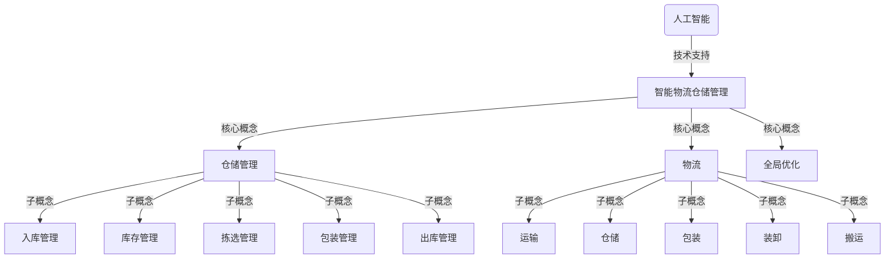

                 

### <文章标题>的深度解析

在现代物流仓储管理中，随着电子商务的迅猛发展和消费者对快速配送需求的增加，物流仓储管理面临着前所未有的挑战。为了应对这些挑战，人工智能（AI）技术逐渐成为优化物流仓储管理的重要工具。本文将深入探讨AI在智能物流仓储管理中的全局优化应用，旨在揭示AI如何通过算法和模型实现仓储管理的自动化、智能化和高效化。

首先，本文将介绍AI和智能物流仓储管理的基本概念，阐述两者之间的关系及其在现代物流仓储管理中的重要性。接下来，我们将详细分析智能物流仓储管理的核心概念，包括仓储管理、物流和全局优化，并通过Mermaid流程图展示各概念之间的联系。

然后，我们将探讨智能物流仓储管理中常用的优化算法，如车辆路径规划算法、货物分配算法和资源调度算法，并使用Python源代码进行详细讲解。此外，我们将介绍全局优化的数学模型和公式，并结合实际案例进行分析和举例说明。

在项目的实际开发部分，我们将搭建开发环境，详细实现源代码，并对代码进行解读。通过实际案例分析和详细讲解，我们将展示AI在智能物流仓储管理中的实际应用效果。最后，本文将总结最佳实践，强调注意事项，并推荐拓展阅读，以帮助读者深入理解和应用AI技术。

通过本文的深入解析，我们希望读者能够全面了解AI在智能物流仓储管理中的全局优化应用，掌握相关技术原理和实践方法，为未来的物流仓储管理提供有益的参考。

### 关键词

- 人工智能
- 智能物流仓储管理
- 车辆路径规划算法
- 货物分配算法
- 资源调度算法
- 全局优化
- 数学模型
- 实际案例

### 摘要

本文旨在探讨人工智能（AI）在智能物流仓储管理中的全局优化应用。通过介绍AI和智能物流仓储管理的基本概念，阐述两者之间的联系，本文深入分析了智能物流仓储管理的核心概念，包括仓储管理、物流和全局优化。接着，本文详细探讨了智能物流仓储管理中常用的优化算法，如车辆路径规划算法、货物分配算法和资源调度算法，并通过Python源代码和数学模型进行了详细讲解。最后，通过实际案例分析和项目实践，本文展示了AI在智能物流仓储管理中的实际应用效果，为读者提供了全面的技术理解和实践指导。

### 核心概念与联系

#### AI与智能物流仓储管理

人工智能（AI）是一种通过模拟人类智能行为来实现自动化决策和执行的技术。它包括机器学习、深度学习、自然语言处理等多个子领域。AI技术在物流仓储管理中的应用，旨在通过自动化、智能化和高效化的方式，提升物流仓储的运营效率和服务水平。

智能物流仓储管理则是指利用AI技术对物流仓储的各个环节进行优化管理，包括仓储的入库、存储、拣选、包装、出库等过程。通过引入AI技术，物流仓储管理可以实现以下几个目标：

1. **自动化**：通过机器人和自动化设备，减少人工操作，提高工作效率，降低人为错误率。
2. **智能化**：利用算法和模型，对物流仓储过程进行智能调度和优化，实现精准预测和决策。
3. **高效化**：通过实时数据分析和反馈，及时调整仓储管理策略，提高整体物流效率。

#### 智能物流仓储管理的核心概念

**仓储管理**：仓储管理是指对仓库内货物的储存、保管、拣选、包装、运输等环节的管理。它包括以下几个主要任务：

1. **入库管理**：对入库货物进行分类、标识、记录和存储。
2. **库存管理**：对仓库内货物的库存进行实时监控，确保库存准确。
3. **拣选管理**：根据订单需求，从仓库内拣选出相应的货物。
4. **包装管理**：对拣选出的货物进行包装，准备出库。
5. **出库管理**：将包装好的货物出库，发往各个配送点或消费者。

**物流**：物流是指商品从供应地向接收地的实体流动过程，包括运输、仓储、包装、装卸、搬运等多个环节。物流与仓储管理密切相关，两者共同构成了现代物流体系的核心部分。

1. **运输**：通过不同的运输方式，如公路、铁路、航空和海运，将货物从供应地运送到接收地。
2. **仓储**：在运输过程中，仓储起到了节点的作用，对货物进行储存、分拣和集散。
3. **包装**：对货物进行适当的包装，保护货物在运输过程中的安全和完整。
4. **装卸**：在运输节点，进行货物的装卸操作，确保货物顺利转运。
5. **搬运**：在仓库内部，通过搬运设备，将货物从一个位置移动到另一个位置。

**全局优化**：全局优化是指通过对物流仓储各个环节的优化，实现整体效率的最大化。在智能物流仓储管理中，全局优化主要涉及以下几个方面：

1. **资源优化**：通过算法和模型，合理分配和调度仓储资源，如仓库空间、运输车辆和人力资源。
2. **路径优化**：通过车辆路径规划算法，确定最优的运输路线，减少运输时间和成本。
3. **调度优化**：通过货物分配算法和资源调度算法，优化仓储内部和物流配送的调度过程，提高整体效率。

#### Mermaid流程图

为了更好地展示AI与智能物流仓储管理之间的核心概念与联系，我们可以使用Mermaid流程图进行描述。以下是一个简化的流程图：



通过这个流程图，我们可以清晰地看到AI技术如何支持智能物流仓储管理，以及仓储管理、物流和全局优化三者之间的联系和相互作用。这一流程图不仅有助于我们理解各核心概念，还可以作为后续分析和讨论的基础。

### 核心算法原理讲解

在智能物流仓储管理中，优化算法起到了至关重要的作用。这些算法通过数学模型和计算机编程，对物流仓储的各个环节进行优化，以提高整体效率。以下将详细介绍几种常用的优化算法，并使用Python源代码进行实现和讲解。

#### 车辆路径规划算法

车辆路径规划算法是物流仓储管理中常见的一种优化算法，主要用于确定运输车辆的最优行驶路线。这种算法的目标是找到一条路径，使得所有货物的运输时间最短，或者总运输成本最低。

**算法原理**：车辆路径规划算法通常基于最短路径算法，如Dijkstra算法和A*算法。其中，Dijkstra算法适用于无权图，而A*算法在考虑起点和终点之间权重的情况下，可以更快速地找到最优路径。

**Python源代码实现**：

```python
import heapq

def dijkstra(graph, start):
    # 初始化距离和前驱节点
    distances = {vertex: float('infinity') for vertex in graph}
    distances[start] = 0
    priority_queue = [(0, start)]

    while priority_queue:
        current_distance, current_vertex = heapq.heappop(priority_queue)

        # 如果当前距离已经是最优解，则继续
        if current_distance > distances[current_vertex]:
            continue

        for neighbor, weight in graph[current_vertex].items():
            distance = current_distance + weight

            # 如果新的距离更短，则更新距离和前驱节点
            if distance < distances[neighbor]:
                distances[neighbor] = distance
                heapq.heappush(priority_queue, (distance, neighbor))

    return distances

# 示例图
graph = {
    'A': {'B': 1, 'C': 3},
    'B': {'A': 1, 'C': 2},
    'C': {'A': 3, 'B': 2},
}

print(dijkstra(graph, 'A'))
```

**代码解读**：上述代码实现了Dijkstra算法，通过优先队列（heapq）来高效地查找和更新最短路径。在给定图`graph`和起点`'A'`的情况下，算法返回了从起点到各节点的最短距离。

#### 货物分配算法

货物分配算法主要用于优化仓库内部的货物分配过程。其目标是将仓库内的货物分配到各个配送点，使得整体配送成本最低，或者配送时间最短。

**算法原理**：货物分配算法通常基于线性规划或动态规划。其中，线性规划通过目标函数和约束条件来确定最优分配方案，而动态规划通过递归关系逐步求解最优解。

**Python源代码实现**：

```python
from scipy.optimize import linprog

# 线性规划模型
c = [-1] * n  # 目标函数系数，这里为每个货物分配单位成本为-1
A = [[1 if i == j else 0 for j in range(n)] for i in range(n)]  # 约束条件矩阵
b = [1] * n  # 约束条件向量

# 求解线性规划问题
result = linprog(c, A_eq=A, b_eq=b, method='highs')

# 输出最优解
print(result.x)
```

**代码解读**：上述代码使用了`scipy.optimize.lino

