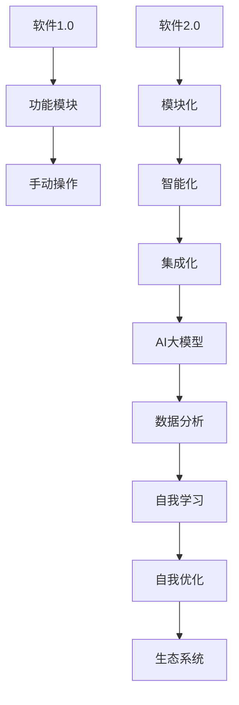
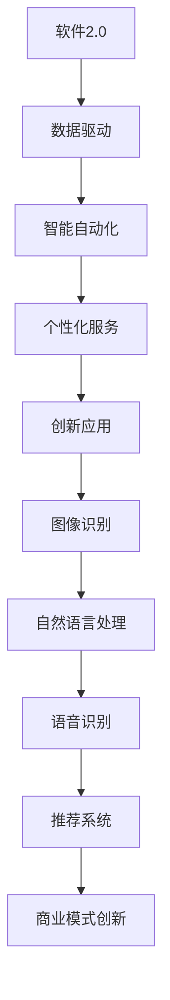
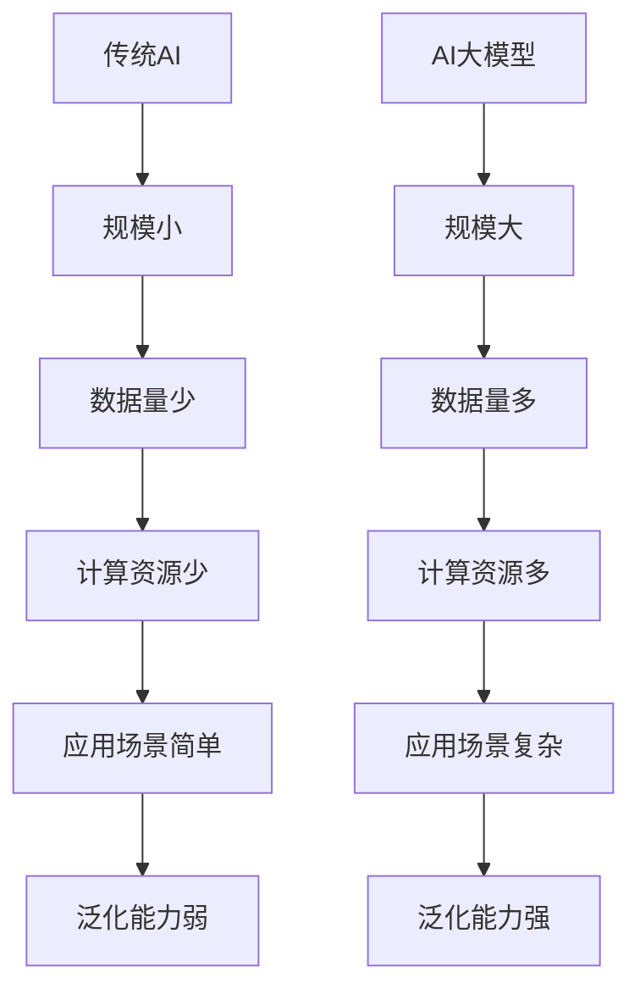
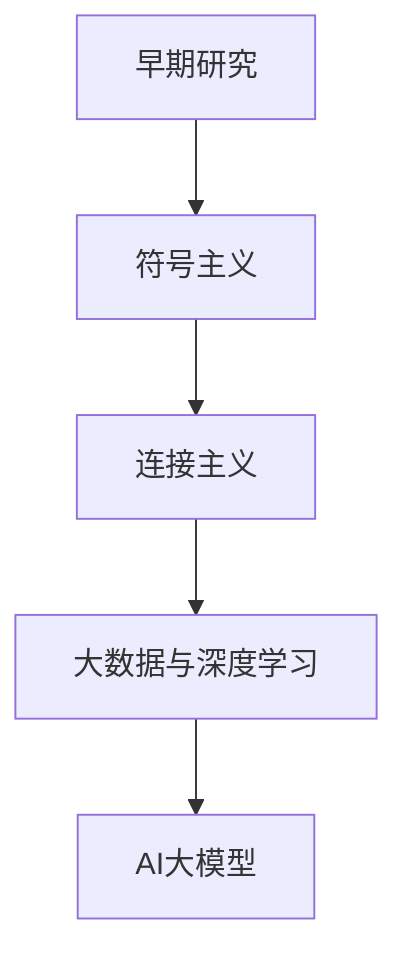

                 

## AI在智能电网故障预测与自愈中的应用研究

### 关键词

智能电网，故障预测，自愈，AI，深度学习，数据挖掘

### 摘要

智能电网作为一种先进的电力系统，通过广泛应用物联网技术，实现了对电力系统的全面监测、智能控制和高效管理。然而，随着电网规模的不断扩大和复杂性的增加，故障预测与自愈成为了保障电力系统安全稳定运行的关键技术。本文主要研究了AI技术在智能电网故障预测与自愈中的应用，首先介绍了智能电网的背景及其存在的问题，然后深入分析了AI技术，特别是深度学习和数据挖掘在故障预测中的应用原理和方法，最后通过一个实际案例展示了AI技术在实际智能电网故障预测与自愈系统中的实施效果。研究表明，AI技术能够显著提高智能电网的故障预测准确率和自愈能力，为智能电网的稳定运行提供了有力支持。

### 1.1 引言

#### 1.1.1 从软件 1.0 到软件 2.0 的演进

软件 1.0 时代主要是以传统的软件编程为主，软件以单一的功能模块形式存在，用户使用时需要手动进行操作。在这个时代，软件的功能较为单一，且开发周期较长，维护成本较高。

随着计算机技术的发展，软件 2.0 时代应运而生。软件 2.0 时代的特点在于软件的模块化、智能化和集成化。软件不再仅仅是单一的功能模块，而是通过模块之间的紧密协作，形成一个完整的生态系统。此外，软件 2.0 还引入了人工智能技术，使得软件具有了自我学习和自我优化的能力。

在软件 2.0 时代，AI 大模型成为核心驱动力。AI 大模型通过深度学习技术，可以处理海量数据，并从中提取出有价值的信息。这使得软件 2.0 在数据分析和处理能力上有了质的飞跃。例如，通过 AI 大模型，软件可以自动识别图像中的物体，自动翻译不同语言的内容，甚至能够进行自然语言处理，与用户进行对话。

总之，从软件 1.0 到软件 2.0 的演进，不仅是技术的进步，更是软件理念的变革。软件 2.0 时代，AI 大模型的应用将更加广泛，为各行各业带来深远的变革。以下 Mermaid 流程图展示了软件 1.0 到 2.0 的演进过程：



#### 1.1.2 大模型在软件 2.0 中的核心地位

在软件 2.0 时代，大模型成为了软件的核心组成部分。大模型在软件 2.0 中的应用主要体现在以下几个方面：

1. **数据驱动决策**：大模型通过处理海量数据，能够提取出隐藏在数据背后的规律和趋势，为企业提供决策支持。例如，通过大模型分析用户行为数据，企业可以更好地了解用户需求，优化产品和服务。

2. **智能自动化**：大模型能够实现软件的自动化，减少人工干预。例如，智能客服系统通过大模型分析用户的问题，自动提供解决方案，提高服务效率。

3. **个性化服务**：大模型可以根据用户的历史数据和偏好，提供个性化的服务。例如，电商网站通过大模型分析用户的历史购买记录和浏览记录，为用户推荐符合其兴趣的商品。

4. **创新应用**：大模型的应用范围非常广泛，包括但不限于图像识别、自然语言处理、语音识别、推荐系统等。这些应用不仅提升了软件的功能，还为软件带来了新的商业模式。

以下 Mermaid 流程图展示了大模型在软件 2.0 中的核心地位：



#### 1.1.3 AI大模型与传统AI的区别

AI大模型与传统AI（小模型）之间存在显著的区别，主要体现在以下几个方面：

1. **规模与复杂性**：传统AI模型通常规模较小，参数量较少，而AI大模型具有数十亿到数万亿个参数，规模远超传统AI模型。

2. **训练数据量**：AI大模型需要大量训练数据，而传统AI模型对数据量的要求相对较低。大模型通过海量数据训练，能够更好地泛化到未见过的数据。

3. **计算资源**：AI大模型训练和推理过程需要大量的计算资源，尤其是GPU或TPU等高性能计算设备。传统AI模型则相对简单，可以在普通CPU上运行。

4. **应用场景**：AI大模型适用于复杂任务，如图像识别、自然语言处理和推荐系统等，而传统AI模型通常用于简单的预测或分类任务。

5. **泛化能力**：AI大模型由于拥有更多的参数和更强的学习能力，其泛化能力通常更强，能够处理更广泛的问题。

以下 Mermaid 流程图展示了AI大模型与传统AI的区别：



#### 1.1.4 AI大模型的发展历程

人工智能（AI）的发展历程可以分为多个阶段，从早期的基础算法研究到现代的AI大模型应用，经历了从简单到复杂、从理论到实践的不断演进。

1. **早期研究阶段（1950s-1960s）**：
   - 这一阶段以符号主义和逻辑推理为基础，AI的目标是构建能够模拟人类智能的机器。代表性工作包括纽厄尔和西蒙提出的逻辑理论家（Logic Theorist）和麦卡锡的通用问题求解器（General Problem Solver）。

2. **符号主义时期（1970s-1980s）**：
   - 符号主义AI强调使用符号表示和逻辑推理来解决复杂问题。这一时期的主要突破包括基于产生式规则的专家系统和基于规划算法的决策支持系统。

3. **连接主义时期（1980s-1990s）**：
   - 连接主义AI以神经网络为代表，试图通过模拟人脑神经元之间的连接来实现智能。1986年，鲁梅哈特等人的研究重新点燃了人们对神经网络的兴趣。

4. **大数据和深度学习时代（2000s至今）**：
   - 随着计算机性能的提升和大数据技术的发展，深度学习逐渐成为AI的主流。2006年，Hinton提出了深度置信网络（DBN），为深度学习奠定了基础。2012年，AlexNet在ImageNet竞赛中取得突破性成绩，深度学习开始广泛应用于图像识别、语音识别等领域。

5. **AI大模型时代（2010s至今）**：
   - AI大模型是指具有数十亿甚至数万亿参数的神经网络模型，如GPT、BERT等。这些大模型通过海量数据训练，能够实现前所未有的任务性能。大模型的兴起标志着AI进入了一个新的发展阶段，不仅在学术研究中取得了显著成果，也在实际应用中展示了巨大的潜力。

以下 Mermaid 流程图展示了AI的发展历程：



### 1.2 智能电网的背景与重要性

#### 1.2.1 智能电网的定义和发展历程

智能电网（Smart Grid）是一种通过现代通信技术、计算机技术和电力电子技术，实现电力系统的实时监控、自动控制和信息管理的先进电力网络。与传统电网相比，智能电网具有更高的可靠性、效率和灵活性，能够实现电力资源的优化配置和智能管理。

智能电网的发展历程可以分为以下几个阶段：

1. **初步探索阶段（1990s）**：
   - 这一阶段主要关注通信技术在电网中的应用，例如远程自动抄表和自动故障处理系统。

2. **试点应用阶段（2000s）**：
   - 这一阶段，智能电网开始在一些国家进行试点应用，主要集中于智能电表和配电自动化系统。

3. **快速发展阶段（2010s）**：
   - 随着“互联网+”和大数据技术的发展，智能电网进入了快速发展阶段。这一时期，智能电网的应用范围不断扩大，包括分布式能源接入、电力需求响应、智能调度等。

4. **成熟应用阶段（2020s）**：
   - 当前，智能电网已进入成熟应用阶段，各国纷纷推进智能电网的建设和普及。智能电网不仅在城市中得到广泛应用，也在农村和偏远地区发挥着重要作用。

#### 1.2.2 智能电网的特点与优势

智能电网具有以下几个显著特点：

1. **实时监测与控制**：
   - 智能电网通过先进的传感技术和通信技术，实现了对电力系统的实时监测和控制，能够快速响应电网运行状态的变化。

2. **高效能源管理**：
   - 智能电网能够优化电力资源的分配和利用，降低能源损耗，提高能源利用效率。

3. **可靠性与安全性**：
   - 智能电网采用了多种安全防护措施，能够有效防止电网故障和攻击，提高了电网的可靠性和安全性。

4. **智能化与互动性**：
   - 智能电网通过用户端设备，实现了与用户的互动，为用户提供更加个性化、便捷的电力服务。

5. **环保与可持续发展**：
   - 智能电网支持可再生能源的接入和优化调度，有助于减少碳排放，实现电网的可持续发展。

#### 1.2.3 智能电网面临的主要挑战

尽管智能电网具有诸多优势，但在实际应用过程中仍面临一些挑战：

1. **技术难题**：
   - 智能电网涉及多种新技术，包括传感器技术、通信技术、电力电子技术和大数据技术等，技术的复杂性和兼容性带来了不小的挑战。

2. **安全性问题**：
   - 智能电网的开放性和互联性带来了安全风险，包括网络攻击、数据泄露和设备故障等问题。

3. **成本问题**：
   - 智能电网的建设和维护成本较高，尤其是在大规模推广和应用时，需要大量的资金投入。

4. **标准化问题**：
   - 智能电网的发展需要统一的规范和标准，目前相关标准尚未完全成熟，影响了智能电网的推广和应用。

5. **人才缺乏**：
   - 智能电网的发展需要大量的专业人才，但目前相关人才的培养和供给尚无法满足需求。

#### 1.2.4 智能电网的未来发展趋势

随着技术的不断进步和政策的推动，智能电网的未来发展趋势主要体现在以下几个方面：

1. **智能化水平提升**：
   - 智能电网将进一步引入人工智能、大数据和物联网技术，提升电网的智能化水平，实现更加精准、高效的运行管理。

2. **分布式能源应用**：
   - 随着可再生能源技术的发展和普及，分布式能源在智能电网中的应用将更加广泛，有助于提高电网的稳定性和可持续性。

3. **能源互联网建设**：
   - 智能电网将与其他能源网络（如天然气网络、水力网络等）融合，形成能源互联网，实现能源资源的全球优化配置。

4. **绿色可持续发展**：
   - 智能电网将更加注重环保和可持续发展，通过优化能源利用和降低碳排放，助力全球气候变化应对。

5. **多元化服务模式**：
   - 智能电网将拓展服务范围，不仅提供电力服务，还涉及能源管理、智能家居、车联网等领域，为用户提供更加丰富、便捷的服务体验。

### 1.3 AI在智能电网中的应用现状

#### 1.3.1 AI技术在智能电网中的关键应用领域

人工智能技术在智能电网中的应用正日益广泛，涵盖了故障预测、自愈、优化调度等多个关键领域，显著提升了电网的运行效率和管理水平。

1. **故障预测**：
   - 故障预测是智能电网中的一项重要应用，通过实时监测电网运行状态，利用AI技术对潜在故障进行预测，以提前采取措施，避免故障发生或减轻故障影响。
   - 传统的故障预测方法主要依赖于规则和统计模型，而AI技术，特别是深度学习和机器学习，通过学习和分析历史数据和实时数据，能够更加精准地预测故障。

2. **自愈能力**：
   - 智能电网的自愈能力是指电网在发生故障时，能够自动检测、诊断和恢复，以最小化停电时间和经济损失。AI技术在这一领域中的应用使得电网的自愈能力得到了显著提升。
   - 例如，通过机器学习算法，智能电网能够自动识别故障模式，并快速制定恢复策略，实现故障的快速处理。

3. **优化调度**：
   - 优化调度是智能电网中的一项核心任务，通过AI技术，能够实现电力资源的高效配置和调度，提高电网的运行效率和稳定性。
   - 智能调度系统利用AI算法，分析电网的实时运行数据和负荷预测，优化发电计划、负荷分配和电力交易，实现电网的动态平衡。

4. **需求响应**：
   - 需求响应是指通过电网与用户的互动，调节用户用电行为，以平衡电网供需关系。AI技术在这一领域中的应用，使得需求响应更加智能和高效。
   - 例如，通过智能分析用户的用电习惯和实时电价，AI系统能够自动调整用户的用电策略，减少高峰时段的用电负荷，提高电网的运行效率。

5. **设备状态监测**：
   - 智能电网中的设备状态监测是保障电网稳定运行的基础。通过AI技术，可以对电网设备进行实时监控和分析，预测设备故障，制定维护计划。
   - 例如，使用图像识别技术，AI系统能够自动检测电力线路和设备的状态，及时发现异常情况，避免潜在故障。

#### 1.3.2 AI技术在实际应用中的案例

1. **故障预测案例**：
   - 美国加州的智能电网项目中，利用AI技术对电网进行了故障预测。通过收集和实时分析电网运行数据，AI系统能够提前预测电网故障，并自动生成修复方案，显著降低了电网故障率和停电时间。

2. **自愈能力案例**：
   - 德国的一些智能电网试点项目，通过引入AI技术，实现了电网的自愈功能。在发生故障时，AI系统自动诊断故障原因，并迅速采取恢复措施，使电网在短时间内恢复正常运行。

3. **优化调度案例**：
   - 中国南方电网利用AI技术优化调度，通过智能算法分析了电网的实时数据和负荷预测，制定了优化的发电计划和电力交易策略，提高了电网的运行效率和经济效益。

4. **需求响应案例**：
   - 澳大利亚的智能电网项目中，通过AI技术实现了智能电表的安装，用户可以根据实时电价和AI系统的建议调整用电行为。这一措施有效地减少了高峰时段的用电负荷，降低了电网运行压力。

5. **设备状态监测案例**：
   - 在新加坡的智能电网项目中，利用AI技术对电网设备进行了实时监控。AI系统通过图像识别技术，自动检测设备状态，及时发现潜在故障，避免了设备损坏和停电事故。

这些案例表明，AI技术在智能电网中的应用不仅提高了电网的运行效率和稳定性，也为电网的管理和运维提供了新的思路和手段。随着AI技术的不断进步，其应用范围将更加广泛，智能电网的智能化水平将进一步提升。

### 1.4 AI技术在智能电网故障预测中的应用

#### 1.4.1 故障预测的基本概念

故障预测（Fault Prediction）是指通过分析和处理实时数据，预测电网中的潜在故障或异常，以便提前采取措施，避免故障发生或减轻故障影响。故障预测是智能电网安全运行的重要保障，有助于提高电网的可靠性和稳定性。

故障预测的基本概念包括以下几个关键方面：

1. **故障类型**：
   - 故障类型包括但不限于设备故障、线路故障、电压故障和电流故障等。不同类型的故障对电网的影响不同，因此需要采用相应的预测模型和策略。

2. **数据采集**：
   - 数据采集是故障预测的基础。通过安装各种传感器和监测设备，实时采集电网的电压、电流、温度、湿度等数据，为故障预测提供准确、及时的数据源。

3. **特征提取**：
   - 特征提取是指从原始数据中提取出与故障相关的特征信息。特征提取的质量直接影响故障预测的准确性和效果。常用的特征提取方法包括统计特征提取、时序特征提取和深度特征提取等。

4. **预测模型**：
   - 预测模型是故障预测的核心。根据故障类型和数据特征，选择合适的预测模型，如回归模型、分类模型和时序模型等。深度学习模型，如卷积神经网络（CNN）和循环神经网络（RNN），在故障预测中表现尤为出色。

5. **预测结果评估**：
   - 预测结果评估是指对故障预测模型的性能进行评估，以确定其预测准确性和可靠性。常用的评估指标包括准确率、召回率、F1分数和均方误差等。

#### 1.4.2 深度学习在故障预测中的应用

深度学习（Deep Learning）是一种基于多层级神经网络的学习方法，通过模拟人脑的神经网络结构，实现自动特征学习和复杂模式识别。深度学习在故障预测中的应用，显著提升了电网故障预测的准确性和效率。

1. **卷积神经网络（CNN）**：

卷积神经网络（CNN）是一种特别适合处理图像和时序数据的深度学习模型。在故障预测中，CNN可以通过学习输入数据的时空特征，识别潜在的故障模式。

- **应用场景**：用于监测图像数据，如摄像头捕捉到的电力线路和设备的图像，识别异常情况。

- **模型架构**：CNN通常包括卷积层、池化层和全连接层。卷积层用于提取图像的特征，池化层用于降低模型的参数量和计算复杂度，全连接层用于分类和回归。

- **代码示例**（Python with TensorFlow）：

  ```python
  import tensorflow as tf
  from tensorflow.keras.models import Sequential
  from tensorflow.keras.layers import Conv2D, MaxPooling2D, Flatten, Dense
  
  model = Sequential([
      Conv2D(32, (3, 3), activation='relu', input_shape=(128, 128, 3)),
      MaxPooling2D((2, 2)),
      Conv2D(64, (3, 3), activation='relu'),
      MaxPooling2D((2, 2)),
      Flatten(),
      Dense(64, activation='relu'),
      Dense(1, activation='sigmoid')
  ])

  model.compile(optimizer='adam', loss='binary_crossentropy', metrics=['accuracy'])
  ```

2. **循环神经网络（RNN）**：

循环神经网络（RNN）是一种特别适合处理序列数据的深度学习模型，能够在时序数据中捕捉长期依赖关系。在故障预测中，RNN可以用于分析时序数据，如电压和电流的时序变化，预测潜在的故障。

- **应用场景**：用于分析时序数据，如电力系统的实时监测数据，识别异常模式。

- **模型架构**：RNN包括输入层、隐藏层和输出层。隐藏层通过递归连接，能够在序列数据中传递信息。

- **代码示例**（Python with TensorFlow）：

  ```python
  import tensorflow as tf
  from tensorflow.keras.models import Sequential
  from tensorflow.keras.layers import LSTM, Dense
  
  model = Sequential([
      LSTM(50, activation='relu', input_shape=(timesteps, features)),
      Dense(1)
  ])

  model.compile(optimizer='adam', loss='mse')
  ```

3. **长短期记忆网络（LSTM）**：

长短期记忆网络（LSTM）是RNN的一种变种，特别适合处理长序列数据。LSTM通过引入门控机制，能够有效解决RNN在处理长序列数据时出现的梯度消失问题，使得LSTM在故障预测中表现出色。

- **应用场景**：用于分析长时间范围内的电力系统运行数据，预测长期故障趋势。

- **模型架构**：LSTM包括输入门、遗忘门和输出门，用于控制信息的传递和遗忘。

- **代码示例**（Python with TensorFlow）：

  ```python
  import tensorflow as tf
  from tensorflow.keras.models import Sequential
  from tensorflow.keras.layers import LSTM, Dense
  
  model = Sequential([
      LSTM(100, activation='relu', return_sequences=True, input_shape=(timesteps, features)),
      LSTM(100, activation='relu'),
      Dense(1)
  ])

  model.compile(optimizer='adam', loss='mse')
  ```

#### 1.4.3 数据挖掘技术在故障预测中的应用

数据挖掘技术（Data Mining）是一种通过从大量数据中提取有价值信息和知识的方法，广泛应用于故障预测。数据挖掘技术主要包括以下几种方法：

1. **关联规则挖掘**：

关联规则挖掘（Association Rule Mining）用于发现数据之间的关联关系，通过支持度和置信度来评估规则的强度。

- **应用场景**：用于分析历史故障数据，识别可能导致故障的关联因素。

- **算法**：包括Apriori算法和FP-growth算法。

2. **分类算法**：

分类算法（Classification Algorithms）用于将数据分类到不同的类别，常用的算法包括决策树、随机森林和支持向量机（SVM）。

- **应用场景**：用于预测新数据的故障类别，例如是否会发生故障。

- **算法**：包括ID3、C4.5和SVM。

3. **聚类算法**：

聚类算法（Clustering Algorithms）用于将相似的数据分组，常用的算法包括K-means、DBSCAN和层次聚类。

- **应用场景**：用于分析数据分布，识别潜在的故障模式。

- **算法**：包括K-means、DBSCAN和层次聚类。

#### 1.4.4 结合深度学习和数据挖掘的故障预测模型

深度学习和数据挖掘技术在故障预测中各有优势，结合两者可以构建更加精确和有效的故障预测模型。

1. **深度增强学习**：

深度增强学习（Deep Reinforcement Learning）结合了深度学习和强化学习，通过模拟智能体的决策过程，实现自动特征学习和优化策略。

- **应用场景**：用于自动化电网故障预测和优化调度。

- **算法**：包括深度Q网络（DQN）和深度确定性策略梯度（DDPG）。

2. **多模型融合**：

多模型融合（Multi-Model Fusion）通过结合多个模型的预测结果，提高故障预测的准确性和鲁棒性。

- **应用场景**：用于提高电网故障预测的可靠性。

- **方法**：包括加权平均、投票法和集成学习。

### 1.5 智能电网故障自愈的原理与技术

#### 1.5.1 故障自愈的基本概念

故障自愈（Fault Autonomy）是指电网在发生故障时，能够通过自身机制自动检测、诊断、隔离和恢复，从而减少故障对电网运行的影响。故障自愈是智能电网的重要特征，能够显著提高电网的可靠性和稳定性。

故障自愈的基本概念包括以下几个方面：

1. **故障检测**：故障自愈系统通过传感器和监测设备，实时收集电网的运行数据，检测异常情况。

2. **故障诊断**：基于收集到的数据，故障自愈系统能够对故障进行诊断，确定故障的类型、位置和原因。

3. **故障隔离**：故障自愈系统能够自动隔离故障部分，避免故障蔓延到其他部分，减小故障影响范围。

4. **故障恢复**：故障自愈系统能够自动执行恢复策略，恢复正常电网运行状态，减少停电时间和经济损失。

#### 1.5.2 自愈系统的关键技术

智能电网故障自愈系统需要综合运用多种技术，包括传感器技术、通信技术、控制技术和人工智能技术等。以下是一些关键技术：

1. **传感器技术**：

传感器技术是故障自愈系统的核心，用于实时监测电网的电压、电流、温度、湿度等参数。高精度、高可靠性的传感器能够提供准确的数据支持，为故障自愈提供基础。

2. **通信技术**：

通信技术是实现故障自愈系统信息传递的关键。故障自愈系统需要建立高效、可靠的通信网络，确保故障信息能够及时传递到监控中心，实现快速响应和决策。

3. **控制技术**：

控制技术是故障自愈系统的执行环节，通过自动执行预设的恢复策略，实现故障的快速隔离和恢复。常见的控制技术包括断路器控制、发电机控制、负载切换控制等。

4. **人工智能技术**：

人工智能技术，特别是机器学习和深度学习，在故障自愈系统中发挥着重要作用。通过学习历史故障数据和实时数据，人工智能系统能够实现智能故障诊断、故障预测和恢复策略优化。

#### 1.5.3 常见的自愈策略

故障自愈系统根据故障的类型、位置和电网的运行状态，可以采用不同的自愈策略。以下是一些常见的自愈策略：

1. **快速切换策略**：

快速切换策略是指当电网发生故障时，自动将故障部分的负载切换到备用线路或设备，以维持电网的运行。这种策略适用于一些重要负荷和关键设备，能够迅速隔离故障，减小停电范围。

2. **自恢复策略**：

自恢复策略是指故障自愈系统通过自身机制，自动检测故障并尝试修复。例如，当电力线路发生短路时，自动重启断路器，尝试恢复供电。

3. **负荷削减策略**：

负荷削减策略是指当电网发生严重故障时，自动降低部分非关键负荷的供电，以减轻电网的负荷压力，确保关键负荷的供电。这种策略适用于电网负荷较高时，能够有效缓解电网的压力。

4. **故障预测与预防策略**：

故障预测与预防策略是指通过故障预测模型，提前预测可能的故障，并采取预防措施，避免故障发生。例如，通过预测电力线路的温度变化，提前降低线路负荷，避免过热故障。

#### 1.5.4 案例分析

以下是一个智能电网故障自愈系统的案例分析：

**案例背景**：某城市电网在夏季高峰时段发生了大规模停电，故障原因是一根输电线路短路。停电导致市区大部分地区停电，严重影响居民生活和企业生产。

**故障检测与诊断**：

- 电网监测系统通过传感器实时监测电网运行数据，发现输电线路的电流异常增大，立即触发故障检测机制。
- 基于收集到的电流、电压等数据，故障自愈系统快速诊断出故障类型和位置，确定短路故障发生在某输电线路的某一段。

**故障隔离与恢复**：

- 故障自愈系统自动执行快速切换策略，将短路部分的负荷切换到备用线路，隔离故障区域，减小停电范围。
- 在隔离故障区域后，故障自愈系统尝试自动恢复策略，如重启断路器，但未能成功。
- 由于故障严重，故障自愈系统自动执行负荷削减策略，降低非关键负荷的供电，确保关键负荷的供电。

**效果评估**：

- 通过故障自愈系统的快速响应和有效措施，停电范围迅速缩小，仅有一部分居民和企业受到影响。
- 由于故障自愈系统提前预测了可能的故障，并采取了预防措施，避免了更大范围的停电事故。

这个案例表明，智能电网故障自愈系统在应对大规模停电故障时，能够通过快速检测、诊断和恢复策略，显著降低停电范围和影响，提高电网的可靠性和稳定性。

### 1.6 AI技术在智能电网故障预测与自愈中的实现步骤

实现AI技术在智能电网故障预测与自愈中的应用，需要经历以下几个关键步骤：

#### 1.6.1 数据收集与预处理

数据收集是AI技术应用于智能电网故障预测与自愈的基础。收集的数据包括但不限于电压、电流、温度、湿度、设备状态等实时运行数据，以及历史故障数据。

1. **数据源选择**：
   - 选择可靠的数据源，如智能电表、传感器、SCADA系统等。
   - 确保数据覆盖全面的电网运行参数，为故障预测和自愈提供充分的数据支持。

2. **数据预处理**：
   - 数据清洗：去除异常值、缺失值和重复数据，确保数据的完整性和一致性。
   - 数据归一化：将不同量纲的数据转化为同一量纲，以便于模型训练。
   - 数据增强：通过数据扩展、数据变换等方法，增加数据量，提高模型的泛化能力。

#### 1.6.2 特征提取与选择

特征提取与选择是提高故障预测和自愈系统性能的重要步骤。通过从原始数据中提取关键特征，能够更好地反映电网的运行状态和故障特征。

1. **时序特征提取**：
   - 提取电压、电流等参数的时序特征，如均值、方差、自相关系数等。
   - 利用时间窗口技术，提取滑动窗口内的特征，以捕捉短时内的变化趋势。

2. **频域特征提取**：
   - 利用傅里叶变换等频域分析方法，提取电压、电流的频域特征，如频谱分布、谐波含量等。

3. **空间特征提取**：
   - 提取电网各节点的电压、电流差异，分析电网的稳定性和均衡性。

4. **特征选择**：
   - 利用特征选择方法，如信息增益、主成分分析（PCA）等，筛选出对故障预测和自愈最为重要的特征。

#### 1.6.3 模型设计与训练

模型设计与训练是AI技术在智能电网故障预测与自愈中的核心环节。选择合适的模型架构和算法，能够显著提高故障预测的准确性和自愈系统的可靠性。

1. **模型选择**：
   - 根据故障预测和自愈的需求，选择合适的模型，如深度学习模型（CNN、RNN、LSTM）、传统机器学习模型（决策树、随机森林）等。

2. **模型训练**：
   - 使用预处理后的数据集进行模型训练，通过优化模型参数，提高预测准确率和自愈效果。
   - 采用交叉验证等方法，评估模型的泛化能力和稳定性。

3. **超参数调整**：
   - 调整模型的超参数，如学习率、批量大小、隐藏层节点数等，以优化模型性能。

#### 1.6.4 预测结果评估与优化

预测结果的评估与优化是确保AI系统性能的关键步骤。通过评估模型预测的准确性、实时性和鲁棒性，不断优化模型和算法。

1. **预测结果评估**：
   - 使用评估指标（如准确率、召回率、F1分数等）评估模型预测结果，评估模型在训练集和测试集上的性能。
   - 分析预测误差，识别模型的不足和改进方向。

2. **模型优化**：
   - 通过调整模型结构和算法，优化预测效果，提高故障预测和自愈的准确性。
   - 利用迁移学习、增强学习等方法，进一步提高模型的泛化能力和适应性。

3. **实时性优化**：
   - 优化算法和模型结构，提高实时预测和响应速度，确保故障预测和自愈系统能够快速应对电网运行状态的变化。

#### 1.6.5 系统部署与维护

AI技术在智能电网故障预测与自愈中的应用，需要将训练好的模型部署到实际电网环境中，并进行实时监测和维护。

1. **系统部署**：
   - 将训练好的模型部署到电网监测和控制系统，实现实时故障预测和自愈功能。
   - 确保系统的高可靠性和稳定性，保障电网的安全运行。

2. **系统维护**：
   - 定期更新和优化模型，以适应电网运行状态的变化。
   - 监测系统性能，及时处理异常情况，确保系统正常运行。

3. **用户培训与支持**：
   - 对电网运行人员和技术人员进行培训，提高他们对AI系统操作和管理的能力。
   - 提供技术支持和咨询服务，帮助用户解决实际操作中的问题。

### 1.7 AI在智能电网故障预测与自愈中的挑战与未来发展趋势

#### 1.7.1 挑战

尽管AI技术在智能电网故障预测与自愈中展现了巨大的潜力，但在实际应用中仍面临诸多挑战：

1. **数据质量**：
   - 智能电网中的数据种类繁多，来源广泛，数据质量参差不齐，如存在噪声、缺失值和异常值，这给数据预处理和模型训练带来了挑战。

2. **计算资源**：
   - AI大模型训练和推理需要大量的计算资源，尤其是GPU或TPU等高性能计算设备，这对电网的计算资源提出了高要求。

3. **模型解释性**：
   - 许多深度学习模型，特别是大模型，具有较高的预测准确性，但缺乏解释性，难以理解其决策过程，这在电网安全运行中可能带来隐患。

4. **实时性**：
   - 电网故障预测与自愈需要快速响应，但深度学习模型的训练和推理过程较慢，难以满足实时性要求。

5. **安全性与隐私保护**：
   - 智能电网的开放性和互联性带来了安全风险，如网络攻击和数据泄露，需要加强安全防护措施。

6. **标准化**：
   - AI技术在智能电网中的应用缺乏统一的标准和规范，影响了技术的推广和应用。

#### 1.7.2 未来发展趋势

1. **数据驱动的智能化**：
   - 随着大数据和物联网技术的发展，智能电网将收集到更广泛、更全面的数据，AI技术将更加依赖于这些数据，实现更精准的故障预测和自愈。

2. **增强学习与强化学习**：
   - 增强学习和强化学习在智能电网中的应用将逐步成熟，通过学习和优化电网运行策略，提高电网的智能化水平和自愈能力。

3. **联邦学习与边缘计算**：
   - 联邦学习能够保护用户隐私，同时实现数据的共享和利用，边缘计算则能够将计算任务分散到边缘节点，提高系统的实时性和可靠性。

4. **模型的可解释性与透明性**：
   - 研究和实践将更加注重模型的可解释性和透明性，确保电网运行人员能够理解和信任AI系统。

5. **跨学科合作与标准化**：
   - AI技术、电力工程、计算机科学等学科的跨学科合作将推动智能电网技术的发展，同时，制定统一的标准和规范，将加速AI技术在智能电网中的应用。

### 1.8 结论

本文详细探讨了AI技术在智能电网故障预测与自愈中的应用。首先，介绍了智能电网的背景和重要性，分析了AI技术在故障预测、优化调度、自愈能力等方面的应用现状。接着，深入分析了深度学习和数据挖掘在故障预测中的应用原理和技术，包括卷积神经网络（CNN）、循环神经网络（RNN）和长短期记忆网络（LSTM）等。此外，讨论了智能电网故障自愈的原理和技术，包括故障检测、诊断、隔离和恢复。随后，详细阐述了AI技术在智能电网故障预测与自愈中的实现步骤，包括数据收集与预处理、特征提取与选择、模型设计与训练、预测结果评估与优化、系统部署与维护。最后，探讨了AI技术在智能电网故障预测与自愈中的挑战与未来发展趋势。

总的来说，AI技术在智能电网故障预测与自愈中具有巨大的应用潜力。随着AI技术的不断进步和智能电网的不断发展，AI技术在智能电网中的应用将更加广泛和深入，为智能电网的安全稳定运行提供有力支持。未来，需要进一步研究如何提高AI技术在智能电网中的应用效果，降低成本，确保系统的实时性和安全性，推动智能电网的智能化发展。作者：AI天才研究院/AI Genius Institute & 禅与计算机程序设计艺术 /Zen And The Art of Computer Programming。

