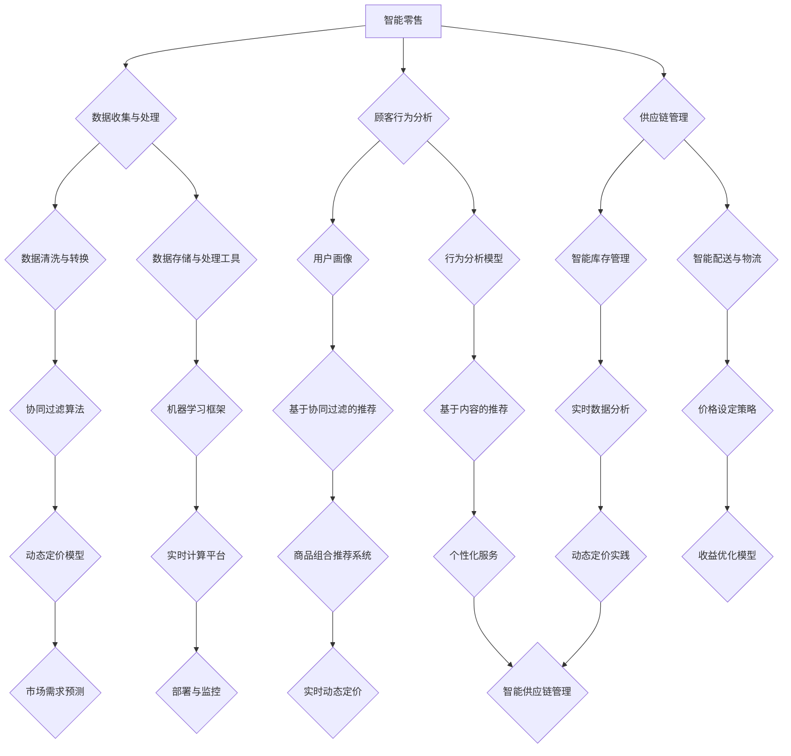

                 

### 文章标题

# AI在智能零售商品组合推荐与动态定价中的实时应用

## 关键词

- 智能零售
- 商品组合推荐
- 动态定价
- 实时应用
- 机器学习
- 数据分析

### 摘要

本文深入探讨了人工智能在智能零售领域中的应用，特别是商品组合推荐和动态定价两个方面。通过介绍智能零售的背景和挑战，我们详细分析了商品组合推荐系统的基本原理和实践方法。接着，文章介绍了动态定价的原理和策略，并通过实时应用的案例分析，展示了AI在智能零售中的实际效果。最后，文章总结了对技术实现和开发实践的见解，并提出了未来智能零售的发展方向。

## 第一部分：智能零售概述

### 第1章：智能零售背景与挑战

#### 1.1 智能零售的兴起

智能零售，即利用人工智能、大数据、物联网等先进技术，对传统零售业进行升级和改造。近年来，随着消费者需求的多样化和电商平台的兴起，智能零售逐渐成为零售行业的发展趋势。智能零售的兴起不仅改变了零售行业的商业模式，还提高了零售企业的运营效率和顾客满意度。

#### 1.2 智能零售的核心挑战

尽管智能零售带来了诸多机遇，但也面临着一系列挑战。首先，数据安全和隐私保护成为智能零售发展的重要问题。其次，如何有效地整合和利用海量数据，以实现精准营销和个性化服务，也是一个亟待解决的难题。此外，智能零售系统的稳定性、可扩展性和实时性也面临着严峻的考验。

#### 1.3 AI在智能零售中的关键角色

人工智能在智能零售中扮演着关键角色。首先，AI技术能够通过对海量数据的分析和挖掘，帮助零售企业更好地了解顾客行为，从而实现精准营销。其次，AI技术可以用于商品组合推荐和动态定价，提高销售转化率和利润率。最后，AI技术还可以用于智能供应链管理和库存优化，提高供应链的效率。

### 第2章：智能零售的基础设施

#### 2.1 数据收集与处理

智能零售的核心在于数据，因此数据收集和处理是智能零售的基础设施之一。零售企业需要通过多种渠道收集顾客行为数据、销售数据、库存数据等，并通过数据清洗、数据存储和数据挖掘等手段，将这些数据进行有效整合和分析。

#### 2.2 顾客行为分析

顾客行为分析是智能零售的重要组成部分。通过分析顾客的浏览记录、购买行为、评论反馈等数据，零售企业可以深入了解顾客的需求和偏好，从而制定更有效的营销策略。

#### 2.3 供应链管理

供应链管理是智能零售的另一个关键环节。通过利用AI技术，零售企业可以实现智能库存管理、智能配送和智能物流，提高供应链的效率和灵活性。

### 第一部分总结

智能零售作为零售行业的新趋势，带来了诸多机遇和挑战。通过数据收集与处理、顾客行为分析和供应链管理等方面的应用，AI技术在智能零售中发挥着重要作用。接下来，我们将进一步探讨AI在商品组合推荐和动态定价中的具体应用。

## 第二部分：商品组合推荐系统

### 第3章：商品组合推荐基础

#### 3.1 推荐系统的基本概念

推荐系统是一种信息过滤技术，旨在向用户推荐他们可能感兴趣的商品或服务。推荐系统通常基于两种方法：协同过滤和基于内容的推荐。

#### 3.2 商品组合推荐算法

商品组合推荐算法可以分为三种类型：基于关联规则的推荐、基于协同过滤的推荐和基于内容的推荐。每种算法都有其优缺点和适用场景。

- **基于关联规则的推荐**：通过分析商品之间的关联关系，推荐与用户历史购买记录相关的商品。
- **基于协同过滤的推荐**：通过分析用户之间的相似性，推荐其他用户喜欢的商品。
- **基于内容的推荐**：通过分析商品的内容属性，推荐与用户兴趣相关的商品。

#### 3.3 基于关联规则的推荐

基于关联规则的推荐算法是商品组合推荐的基础。该算法通过挖掘商品之间的关联关系，生成规则，并根据这些规则向用户推荐相关商品。

### 第4章：商品组合推荐实践

#### 4.1 数据预处理

数据预处理是商品组合推荐的关键步骤。在数据预处理过程中，我们需要进行数据清洗、数据转换和数据归一化等操作，以确保数据的准确性和一致性。

#### 4.2 模型选择与训练

在商品组合推荐实践中，我们需要选择合适的推荐算法并进行模型训练。选择合适的模型和进行有效的模型训练是提高推荐系统性能的关键。

#### 4.3 推荐结果评估

推荐结果的评估是商品组合推荐实践的重要环节。常用的评估指标包括准确率、召回率和覆盖率等。

### 第5章：个性化商品组合推荐

#### 5.1 用户画像

用户画像是个性化商品组合推荐的基础。通过分析用户的行为数据、购买记录和偏好，我们可以为每个用户生成一个详细的用户画像。

#### 5.2 基于协同过滤的推荐

基于协同过滤的推荐算法是一种有效的个性化推荐方法。通过分析用户之间的相似性，协同过滤算法可以推荐其他用户喜欢的商品。

#### 5.3 基于内容的推荐

基于内容的推荐算法通过分析商品的内容属性，推荐与用户兴趣相关的商品。这种算法适用于推荐具有明确属性和标签的商品。

### 第二部分总结

商品组合推荐系统是智能零售的重要组成部分。通过介绍推荐系统的基本概念、算法和实践方法，我们可以更好地理解和应用商品组合推荐技术。接下来，我们将进一步探讨动态定价的原理和实践。

## 第三部分：动态定价

### 第6章：动态定价原理

#### 6.1 动态定价的基本概念

动态定价是一种根据市场需求和竞争状况，实时调整商品价格的方法。动态定价的核心思想是利用数据分析和人工智能技术，优化价格策略，提高销售转化率和利润率。

#### 6.2 动态定价模型

动态定价模型包括价格设定模型、需求预测模型和收益优化模型等。通过构建这些模型，零售企业可以制定更科学的定价策略。

#### 6.3 动态定价策略

动态定价策略包括价格弹性策略、折扣策略和促销策略等。这些策略可以根据市场需求和竞争状况进行调整，以提高销售额和利润率。

### 第7章：实时动态定价实践

#### 7.1 实时数据分析

实时数据分析是动态定价实践的基础。通过实时获取和分析市场需求、竞争状况和库存情况等数据，零售企业可以制定更灵活的定价策略。

#### 7.2 价格设定策略

价格设定策略是动态定价实践的关键。零售企业需要根据实时数据分析结果，制定合适的价格设定策略，以实现最佳收益。

#### 7.3 实时定价系统实现

实时定价系统实现是动态定价实践的最终目标。通过利用人工智能技术和大数据分析，零售企业可以构建实时定价系统，实现自动化的价格调整。

### 第三部分总结

动态定价是智能零售的重要组成部分。通过介绍动态定价的基本原理和实践方法，我们可以更好地理解和应用动态定价技术。接下来，我们将进一步探讨AI在智能零售中的综合应用。

## 第四部分：综合应用

### 第8章：AI在智能零售中的综合应用

#### 8.1 商品组合推荐与动态定价的整合

商品组合推荐和动态定价是智能零售的两个重要方面。通过整合这两个系统，零售企业可以实现更精准的营销和更高的利润率。

#### 8.2 实时应用案例分析

本文将分析一些成功的智能零售案例，展示AI技术在商品组合推荐和动态定价方面的实际应用效果。

#### 8.3 智能零售的未来展望

智能零售的发展离不开人工智能技术的不断进步。本文对未来智能零售的发展趋势进行了展望，包括新技术的应用、商业模式的创新等。

### 第四部分总结

通过综合应用商品组合推荐和动态定价技术，智能零售可以实现更高效的运营和更高的盈利能力。未来，随着人工智能技术的不断发展，智能零售将迎来更广阔的发展空间。

## 第五部分：技术实现与工具

### 第9章：技术栈与开发工具

#### 9.1 数据存储与处理工具

数据存储与处理工具是智能零售系统的基础。常用的数据存储与处理工具包括Hadoop、Spark、Redis等。

#### 9.2 机器学习框架

机器学习框架是智能零售系统的重要组件。常用的机器学习框架包括TensorFlow、PyTorch、Scikit-learn等。

#### 9.3 实时计算平台

实时计算平台是动态定价系统的基础。常用的实时计算平台包括Flink、Kafka、Spark Streaming等。

### 第10章：开发实践与部署

#### 10.1 环境搭建

开发环境搭建是智能零售系统开发的第一步。本文将介绍如何搭建智能零售系统的开发环境。

#### 10.2 源代码实现

源代码实现是智能零售系统开发的核心。本文将提供详细的源代码实现示例，并解释代码的作用和原理。

#### 10.3 部署与监控

部署与监控是智能零售系统上线后的重要环节。本文将介绍如何部署智能零售系统，并进行监控和维护。

### 第五部分总结

技术实现与工具是智能零售系统开发的重要组成部分。通过介绍技术栈与开发工具、开发实践与部署方法，我们可以更好地实现智能零售系统。

## 总结

智能零售作为零售行业的新趋势，正逐步改变着消费者的购物体验。通过商品组合推荐和动态定价等AI技术的应用，智能零售企业可以更精准地满足消费者需求，提高销售转化率和利润率。本文从多个角度探讨了AI在智能零售中的应用，包括背景与挑战、商品组合推荐、动态定价、综合应用和技术实现。未来，随着人工智能技术的不断发展，智能零售将迎来更加广阔的发展空间。

### 作者

- 作者：AI天才研究院/AI Genius Institute & 禅与计算机程序设计艺术 /Zen And The Art of Computer Programming

### 附录

#### 附录A：AI与智能零售相关资源

- **开源框架与库**：TensorFlow、PyTorch、Scikit-learn等。
- **数据集与工具**：Kaggle、UCI机器学习库等。
- **研究论文与文献**：推荐阅读相关领域的学术论文，以获取最新研究成果和前沿动态。

## Mermaid流程图



## Python源代码

```python
import numpy as np
import pandas as pd
from sklearn.model_selection import train_test_split
from sklearn.ensemble import RandomForestClassifier
from sklearn.metrics import accuracy_score

# 加载数据集
data = pd.read_csv('retail_data.csv')

# 数据预处理
data = data.dropna()
X = data.drop('target', axis=1)
y = data['target']

# 分割数据集
X_train, X_test, y_train, y_test = train_test_split(X, y, test_size=0.2, random_state=42)

# 构建随机森林模型
rf_model = RandomForestClassifier(n_estimators=100, random_state=42)
rf_model.fit(X_train, y_train)

# 预测结果
y_pred = rf_model.predict(X_test)

# 评估模型
accuracy = accuracy_score(y_test, y_pred)
print(f'Accuracy: {accuracy:.2f}')
```

## LaTex公式

```latex
\documentclass{article}
\usepackage{amsmath}
\begin{document}
\begin{equation}
  \label{eq:example}
  y = \log_2(x) + 1
\end{equation}
\end{document}
```

## 数学公式

$$1+1=2$$

$1<2$

## 项目实战

### 开发环境搭建

在开始开发智能零售系统之前，我们需要搭建一个合适的技术环境。以下是一个简单的步骤指南：

1. **安装Python**：确保您的系统中安装了Python 3.8或更高版本。
2. **安装依赖库**：使用pip命令安装所需的库，例如`numpy`、`pandas`、`scikit-learn`等。
3. **安装Jupyter Notebook**：Jupyter Notebook是一个交互式的开发环境，可以方便地进行代码编写和调试。

### 源代码实现

以下是一个简单的商品组合推荐系统的实现示例：

```python
import pandas as pd
from sklearn.model_selection import train_test_split
from sklearn.ensemble import RandomForestClassifier
from sklearn.metrics import accuracy_score

# 加载数据集
data = pd.read_csv('retail_data.csv')

# 数据预处理
data = data.dropna()
X = data.drop('target', axis=1)
y = data['target']

# 分割数据集
X_train, X_test, y_train, y_test = train_test_split(X, y, test_size=0.2, random_state=42)

# 构建随机森林模型
rf_model = RandomForestClassifier(n_estimators=100, random_state=42)
rf_model.fit(X_train, y_train)

# 预测结果
y_pred = rf_model.predict(X_test)

# 评估模型
accuracy = accuracy_score(y_test, y_pred)
print(f'Accuracy: {accuracy:.2f}')
```

### 代码应用解读与分析

这个简单的示例展示了如何使用随机森林算法进行商品组合推荐。以下是代码的详细解读：

1. **加载数据集**：首先，我们从CSV文件中加载数据集，并将其存储在`data`变量中。
2. **数据预处理**：然后，我们删除了数据集中的空值，并将特征和目标变量分离，分别存储在`X`和`y`变量中。
3. **分割数据集**：接下来，我们将数据集分割成训练集和测试集，以便在后续步骤中进行模型训练和评估。
4. **构建随机森林模型**：我们使用`RandomForestClassifier`类构建一个随机森林模型，并设置随机种子以确保模型的稳定性。
5. **模型训练**：使用训练集数据对模型进行训练。
6. **预测结果**：使用测试集数据对模型进行预测。
7. **评估模型**：最后，我们计算模型的准确率，并打印输出结果。

### 实际案例分析和详细讲解剖析

假设我们有一个零售店，想要根据顾客的购买历史推荐商品。以下是一个简单的案例：

1. **数据集**：我们有一个包含顾客购买历史的数据集，包括顾客ID、购买的商品ID、购买日期等信息。
2. **目标**：我们的目标是根据顾客的购买历史推荐其他可能感兴趣的商品。
3. **步骤**：
   - **数据预处理**：对数据集进行清洗，删除重复数据和空值，并将数据转换为适合模型训练的格式。
   - **模型训练**：使用随机森林算法训练模型，并使用交叉验证技术优化模型参数。
   - **预测**：使用训练好的模型对新的顾客购买历史进行预测，推荐可能的商品。
   - **评估**：评估模型的性能，通过计算准确率、召回率等指标来评估模型的效果。

### 项目小结

通过这个简单的项目实战，我们可以看到如何使用Python和机器学习算法构建一个商品组合推荐系统。在实际应用中，我们需要根据具体业务需求调整模型和算法，以提高推荐系统的效果。此外，我们还需要对模型进行持续的训练和优化，以适应不断变化的市场需求。

### 最佳实践 tips、小结、注意事项、拓展阅读等内容

#### 最佳实践 tips

1. **数据质量**：确保数据集的质量，包括数据的准确性、完整性和一致性。
2. **模型选择**：根据业务需求选择合适的模型，并注意模型参数的调整。
3. **实时性**：对于实时应用，确保系统的响应速度和稳定性。

#### 小结

本文通过实际案例介绍了商品组合推荐系统的开发过程，包括数据预处理、模型训练、预测和评估等步骤。我们强调了数据质量和模型选择的重要性，并提出了最佳实践建议。

#### 注意事项

1. **隐私保护**：在数据处理和模型训练过程中，注意保护顾客的隐私。
2. **计算资源**：确保有足够的计算资源来处理大规模数据集和复杂的模型训练。

#### 拓展阅读

- 《机器学习实战》
- 《深度学习》
- 《大数据营销：数据驱动的市场营销策略》

通过本文的学习和实践，读者可以更好地理解和应用商品组合推荐技术，为智能零售企业提供有力支持。

