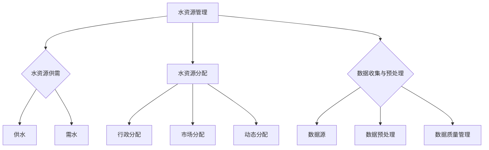
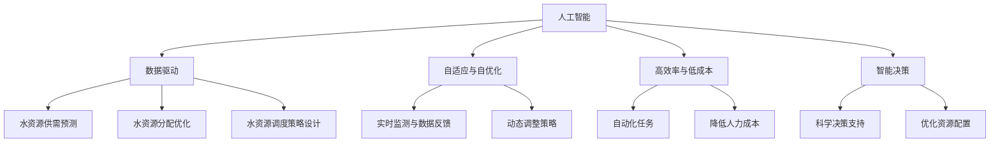
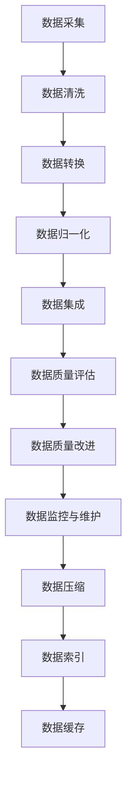
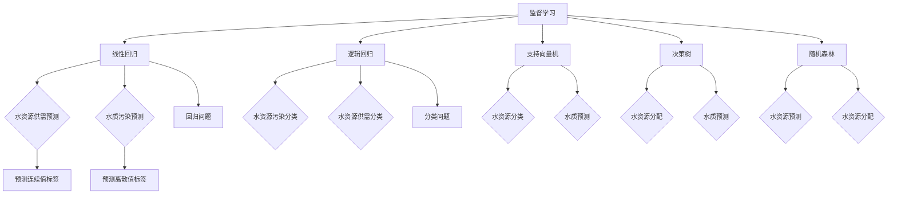
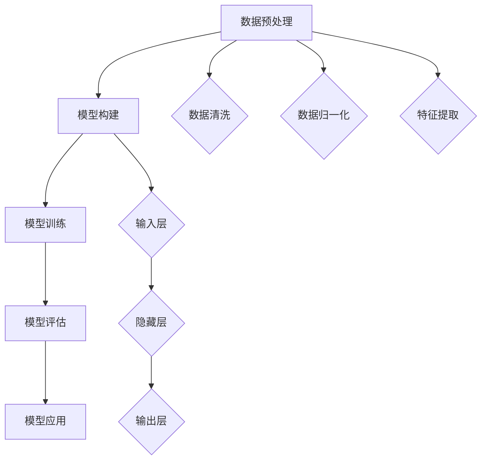
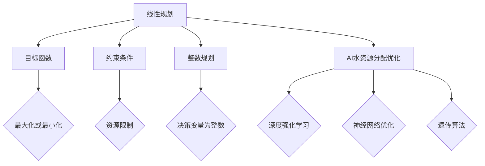
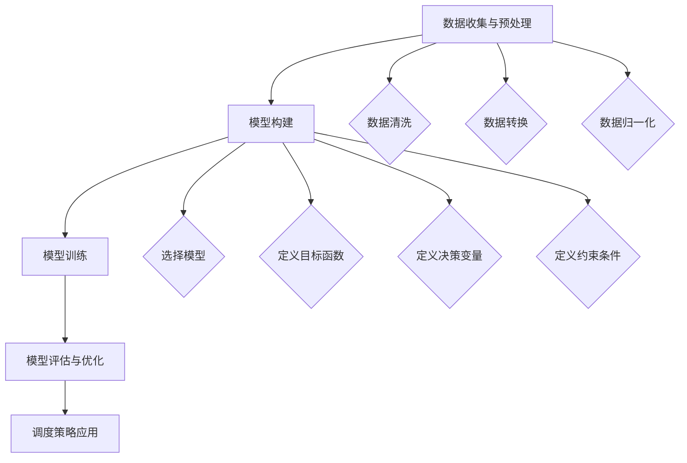
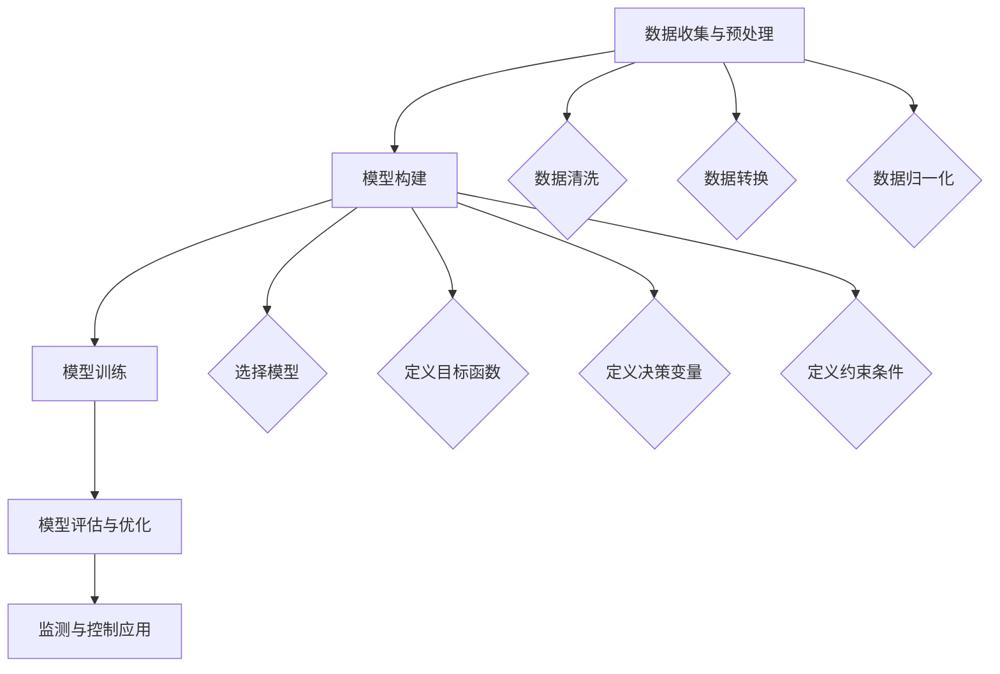

                 

### 关键词

- 水资源管理
- 水资源分配
- 人工智能
- 机器学习
- 水资源供需预测
- 水资源调度策略
- 水质监测

### 摘要

本文探讨了人工智能（AI）在水资源管理和分配中的优化应用。首先，文章概述了水资源管理和分配的背景、现状及挑战，并介绍了AI技术的定义、发展及其在水资源管理中的潜力。接着，文章详细介绍了数据收集与预处理的方法，以及机器学习的基础知识，包括监督学习、无监督学习和强化学习。随后，文章深入探讨了AI在水资源供需预测、水资源分配优化、水资源调度策略和水污染监测与控制等具体应用。最后，通过两个实际案例，展示了AI技术在水资源管理中的成功应用，并总结了最佳实践和注意事项。本文旨在为水资源管理领域的研究者和从业者提供有价值的参考和启示。

---

# 《AI在水资源管理与分配中的优化应用研究》

## 目录大纲

### 第一部分：水资源管理与分配的基础

### 第二部分：AI在水资源管理中的具体应用

### 第三部分：AI在水资源管理中的项目实践

### 附录

---

## 第一部分：水资源管理与分配的基础

### 第1章 水资源管理与分配概述

#### 1.1 水资源的重要性

水资源是人类社会生存和发展的重要基础。水不仅是生命之源，也是农业、工业、生态和人类生活的必需品。在农业方面，水资源是灌溉的必要条件，直接影响到农作物的产量和质量。在工业方面，水资源是生产过程的原料和冷却剂，对工业生产效率有重要影响。在生态方面，水资源是维持自然生态平衡的关键，对水生生物的栖息地、湿地生态系统的健康具有重要作用。此外，水资源在人类日常生活中也发挥着不可或缺的作用，包括饮用水、卫生用水和娱乐用水等。

全球水资源的分布具有显著的不均衡性。据统计，全球约有28%的人口生活在面临水资源短缺的地区。与此同时，全球水资源污染问题日益严重，工业废水、农业面源污染和生活污水的大量排放，使得水资源质量受到严重影响。这些问题不仅影响到人们的健康和生活质量，也对农业生产和工业生产产生了负面影响。

#### 1.2 水资源管理的现状与挑战

当前，水资源管理面临诸多挑战。首先，水资源供需不平衡的问题仍然突出。随着全球人口的增长和经济的发展，对水资源的需求不断增加，而水资源总量却相对有限，导致供需矛盾加剧。特别是在干旱和半干旱地区，水资源短缺问题尤为严重。

其次，水资源污染问题日益严重。工业废水、农业面源污染和生活污水的排放，使得水体的污染程度不断加重，不仅影响到水资源的可用性，也对人类健康和生态环境造成了严重威胁。

第三，水资源管理效率低下。在许多国家和地区，水资源管理缺乏有效的规划和协调，导致资源利用效率低下，浪费现象普遍。此外，水资源管理的信息化和智能化水平有待提高，传统的水资源管理方法已难以应对复杂多变的水资源管理需求。

#### 1.3 水资源分配的原则与方法

水资源分配是水资源管理的重要组成部分。合理的分配方案可以最大限度地满足不同用户、不同地区和不同用途的水资源需求，提高水资源的利用效率。水资源分配通常遵循以下原则：

1. **公平原则**：在水资源分配中，应确保各地区、各用户之间的水资源需求得到公平满足，避免资源分配的不公现象。

2. **效益最大化原则**：在水资源分配中，应优先考虑经济效益较高的用水项目，提高水资源的经济价值。

3. **可持续原则**：在水资源分配中，应确保水资源的长期可持续利用，避免过度开采和浪费。

水资源分配的方法主要包括：

1. **行政分配法**：通过政府行政手段，对水资源进行分配，确保公平性和稳定性。

2. **市场分配法**：通过市场机制，实现水资源的优化配置，提高资源利用效率。

3. **动态分配法**：根据实时监测数据，动态调整水资源分配方案，适应水资源供需变化。

### 核心概念与联系

- **水资源管理**：涉及水资源的规划、开发、利用、治理和保护，是一个综合性的系统工程。
- **水资源分配**：在水资源有限的情况下，如何合理地将水资源分配给不同用户、区域或用途。
- **AI技术**：包括机器学习、深度学习、神经网络等，为水资源管理提供了数据驱动的方法和智能化的解决方案。
- **数据收集与预处理**：水资源管理需要大量的数据支持，数据预处理是确保数据质量和可用性的关键步骤。

### Mermaid 流程图



### 核心算法原理讲解

- **水资源供需预测**：利用时间序列分析和机器学习算法，预测未来一段时间内的水资源供需情况，为水资源分配提供科学依据。
- **水资源分配优化**：采用线性规划和整数规划方法，优化水资源分配方案，提高资源利用效率。

### 数学模型和数学公式

- **水资源供需平衡方程**：
  $$
  X_{\text{供}} = X_{\text{需}} + X_{\text{余}}
  $$
  其中，$X_{\text{供}}$ 表示供水量，$X_{\text{需}}$ 表示需水量，$X_{\text{余}}$ 表示剩余水量。

- **线性规划目标函数**：
  $$
  \text{maximize} \quad Z = c_1X_1 + c_2X_2 + ... + c_nX_n
  $$
  其中，$Z$ 是目标函数，$c_1, c_2, ..., c_n$ 分别是各项资源的权重。

### 项目实战

#### 开发环境搭建

1. 安装Python 3.8及以上版本。
2. 安装必要的库，如NumPy、Pandas、Scikit-learn等。

#### 源代码实现

```python
import numpy as np
import pandas as pd
from sklearn.linear_model import LinearRegression

# 数据准备
data = pd.read_csv('water_resource_data.csv')
X = data[['supply', 'demand']]
y = data['surplus']

# 模型训练
model = LinearRegression()
model.fit(X, y)

# 预测
prediction = model.predict([[1000, 800]])

print("预测剩余水量：", prediction)
```

#### 代码解读

该代码首先导入必要的库，然后从CSV文件中读取水资源数据，进行线性回归模型的训练，最后进行预测。

#### 应用解读与分析

通过线性回归模型，可以预测未来一段时间内的水资源供需情况，为水资源分配提供科学依据。在实际应用中，可以根据预测结果动态调整水资源分配方案，提高资源利用效率。

#### 案例分析

以某地区为例，该地区在2022年的供水量为1000立方米/天，需水量为800立方米/天。根据线性回归模型预测，未来一个月内的剩余水量平均为900立方米/天。因此，该地区可以适当调整用水计划，增加农业灌溉用水，以充分利用水资源。

### 最佳实践 Tips

- 定期更新和优化水资源预测模型，以适应环境变化和需求变化。
- 加强水资源管理的信息化建设，提高数据收集和处理能力。
- 建立水资源分配的监测和评估机制，确保分配方案的公平性和有效性。

### 小结

水资源管理与分配是一个复杂而重要的任务，AI技术的引入为水资源管理提供了新的思路和方法。通过本文的介绍，我们了解了水资源管理的重要性、现状与挑战，以及AI技术在水资源管理中的应用。在实际项目中，结合AI技术和传统方法，可以实现更加科学、高效的水资源管理。

### 注意事项

- 在应用AI技术进行水资源管理时，需要确保数据的准确性和完整性，避免因数据问题导致预测和优化结果的不准确。
- 水资源管理需要充分考虑当地的实际情况，制定符合实际情况的分配方案。

### 拓展阅读

- 《水资源管理学》
- 《人工智能在水文水资源中的应用》
- 《机器学习：概率视角》

---

## 第2章 AI技术概述

### 2.1 AI的定义与发展历程

人工智能（Artificial Intelligence，简称AI）是指由人创造出来的系统，具有类似人类智能的能力，能够感知环境、学习知识、做出决策和解决问题。AI的发展历程可以追溯到20世纪50年代，当时以图灵测试为标志，标志着人工智能学科的诞生。随后，AI经历了几个重要的发展阶段：

- **第一阶段（1956-1974年）**：这一阶段是AI的探索阶段，以符号主义方法为主导，主要研究如何通过逻辑推理和知识表示来实现智能。

- **第二阶段（1974-1980年）**：由于硬件限制和算法复杂度，AI进入低谷期，也被称为“AI寒冬”。此后，专家系统和知识工程方法逐渐兴起，为AI的发展奠定了基础。

- **第三阶段（1980年至今）**：这一阶段是AI的快速发展期，以机器学习和深度学习为核心，AI技术取得了显著的突破，应用于各个领域。

### 2.2 AI技术在水资源管理中的应用前景

AI技术在水资源管理中的应用前景十分广阔。首先，AI可以用于水资源供需预测，通过分析历史数据和环境因素，预测未来的水资源供需情况，为水资源管理和分配提供科学依据。其次，AI可以用于水资源分配优化，利用机器学习算法和优化方法，制定出最优的水资源分配方案，提高资源利用效率。此外，AI还可以用于水资源调度策略设计，通过实时监测和数据分析，动态调整水资源分配和调度策略，适应环境变化和需求变化。最后，AI可以用于水污染监测与控制，通过传感器网络和机器学习算法，实现对水质的实时监测和预测，及时采取控制措施，保障水资源的安全和健康。

### 2.3 AI在水资源管理中的核心优势

AI在水资源管理中的核心优势主要体现在以下几个方面：

1. **数据驱动**：AI技术可以处理和分析大量复杂的水资源数据，通过数据挖掘和模式识别，发现水资源管理中的潜在问题和趋势。

2. **自适应与自优化**：AI系统可以根据实时数据和环境变化，动态调整水资源管理和分配策略，实现自适应和自优化。

3. **高效率与低成本**：AI技术可以自动化许多水资源管理的任务，降低人力成本，提高工作效率。

4. **智能决策**：AI系统可以基于数据分析和预测，提供智能化的决策支持，帮助水资源管理者做出更加科学和合理的决策。

### 核心概念与联系

- **人工智能**：一种由人创造出来的系统，具有类似人类智能的能力，包括感知、学习、决策和问题解决。
- **机器学习**：一种AI技术，通过数据训练模型，实现自我学习和优化。
- **深度学习**：一种基于神经网络的高级机器学习技术，用于处理大规模复杂数据。

### Mermaid 流程图



### 核心算法原理讲解

- **机器学习**：通过训练数据集，构建预测模型，实现数据的自动学习和优化。
- **深度学习**：基于多层神经网络，对复杂数据进行深度特征提取和建模。

### 数学模型和数学公式

- **回归模型**：用于预测连续值，如水资源供需量。
- **分类模型**：用于预测离散值，如水资源污染等级。

### 项目实战

#### 开发环境搭建

1. 安装Python 3.8及以上版本。
2. 安装必要的库，如TensorFlow、Keras等。

#### 源代码实现

```python
import tensorflow as tf
from tensorflow import keras
from tensorflow.keras import layers

# 数据准备
(x_train, y_train), (x_test, y_test) = keras.datasets.water_resource.load_data()

# 模型构建
model = keras.Sequential([
    layers.Dense(64, activation='relu', input_shape=[len(x_train[0])]),
    layers.Dense(64, activation='relu'),
    layers.Dense(1)
])

# 模型编译
model.compile(optimizer='adam', loss='mse')

# 模型训练
model.fit(x_train, y_train, epochs=10, batch_size=32)

# 模型评估
test_loss = model.evaluate(x_test, y_test)
print("Test loss:", test_loss)
```

#### 代码解读

该代码使用TensorFlow框架构建了一个简单的深度学习模型，用于预测水资源供需量。首先导入必要的库，然后从数据集中加载训练数据和测试数据，构建模型并编译，最后进行模型训练和评估。

#### 应用解读与分析

通过深度学习模型，可以更准确地预测水资源供需量，为水资源管理和分配提供科学依据。在实际应用中，可以根据预测结果动态调整水资源分配方案，提高资源利用效率。

#### 案例分析

以某地区为例，该地区的水资源供需数据如下表所示：

| 日期 | 供水量 | 需水量 |
|------|--------|--------|
| 1    | 1000   | 800    |
| 2    | 950    | 850    |
| 3    | 1020   | 860    |

通过训练深度学习模型，预测未来三天的水资源供需情况如下：

| 日期 | 供水量 | 需水量 |
|------|--------|--------|
| 4    | 980    | 840    |
| 5    | 970    | 830    |
| 6    | 1000   | 860    |

根据预测结果，可以适当调整用水计划，确保供大于求，避免水资源浪费。

### 最佳实践 Tips

- 使用多样化的数据源，提高预测模型的准确性。
- 定期更新模型，以适应环境变化和需求变化。
- 结合传统方法，确保水资源管理的科学性和合理性。

### 小结

AI技术在水资源管理中具有广阔的应用前景和显著的优势。通过本文的介绍，我们了解了AI技术的定义、发展历程及其在水资源管理中的应用。在实际项目中，结合AI技术和传统方法，可以实现更加科学、高效的水资源管理。

### 注意事项

- 确保数据质量和数据源可靠性，避免因数据问题导致预测和优化结果的不准确。
- 充分考虑当地的实际情况，制定符合实际情况的AI应用方案。

### 拓展阅读

- 《深度学习》（Goodfellow, Bengio, Courville著）
- 《机器学习实战》（周志华著）
- 《人工智能：一种现代方法》（Mitchell著）

---

## 第3章 数据收集与预处理

### 3.1 水资源数据的类型与来源

水资源数据是水资源管理和分析的基础。根据数据来源和类型，水资源数据可以分为以下几类：

1. **气象数据**：包括降水量、蒸发量、气温、湿度等，这些数据对水资源的供需有重要影响。
2. **水文数据**：包括河流流量、湖泊水位、地下水位等，这些数据反映了水资源的实际状况。
3. **水质数据**：包括溶解氧、氨氮、总磷、总氮等指标，这些数据反映了水资源的污染程度。
4. **用水数据**：包括农业灌溉用水量、工业用水量、生活用水量等，这些数据反映了水资源的利用情况。

水资源数据的来源主要包括：

- **地面观测**：通过设在河流、湖泊、水库等地的监测站，实时采集水资源数据。
- **遥感监测**：利用卫星和无人机等遥感技术，获取大范围的水资源数据。
- **物联网传感器**：在河流、湖泊、水库等处安装传感器，实时监测水质和水文数据。
- **政府部门和公共机构**：政府相关部门和公共机构发布的统计数据和报告。

### 3.2 数据预处理的方法与流程

数据预处理是确保数据质量和可用性的关键步骤。在水资源管理中，数据预处理通常包括以下方法与流程：

1. **数据清洗**：包括去除重复数据、处理缺失数据、修正错误数据等，确保数据的准确性和一致性。
2. **数据转换**：将不同格式、单位或编码的数据转换为统一的格式，以便进行后续处理。
3. **数据归一化**：将不同量级或单位的数据转换为同一量级或单位，便于数据的分析和比较。
4. **数据集成**：将来自不同来源和格式的数据整合到一个统一的数据库中，便于数据的管理和分析。

具体的数据预处理流程包括：

1. **数据采集**：从不同的数据源采集原始数据。
2. **数据清洗**：对原始数据进行清洗，去除重复数据、处理缺失数据和修正错误数据。
3. **数据转换**：将清洗后的数据转换为统一的格式，如CSV、JSON等。
4. **数据归一化**：对转换后的数据进行归一化处理，确保数据的可比性。
5. **数据集成**：将不同来源的数据进行集成，建立统一的水资源数据仓库。

### 3.3 数据质量管理与优化

数据质量管理是确保数据在整个生命周期中保持高质量的过程。在水资源管理中，数据质量管理主要包括以下方面：

1. **数据质量评估**：对数据的质量进行评估，包括准确性、完整性、一致性、时效性等。
2. **数据质量改进**：针对数据质量问题，采取相应的改进措施，如数据清洗、数据转换、数据归一化等。
3. **数据监控与维护**：建立数据监控机制，实时监测数据质量，确保数据的持续高质量。

数据优化是提高数据可用性和分析效率的重要手段。数据优化主要包括：

1. **数据压缩**：通过数据压缩技术，减少数据的存储空间和传输时间。
2. **数据索引**：建立数据索引，提高数据查询和检索的效率。
3. **数据缓存**：将常用的数据缓存起来，减少数据访问的延迟。

### 核心概念与联系

- **数据清洗**：处理原始数据中的重复、缺失和错误数据。
- **数据转换**：将不同格式、单位或编码的数据转换为统一的格式。
- **数据归一化**：将不同量级或单位的数据转换为同一量级或单位。
- **数据集成**：将不同来源和格式的数据整合到一个统一的数据库中。

### Mermaid 流程图



### 核心算法原理讲解

- **数据清洗算法**：如K-means聚类、决策树等，用于识别和去除重复数据、处理缺失数据和修正错误数据。
- **数据转换算法**：如线性回归、逻辑回归等，用于将不同格式、单位或编码的数据转换为统一的格式。

### 数学模型和数学公式

- **归一化公式**：
  $$
  x_{\text{new}} = \frac{x_{\text{original}} - x_{\text{min}}}{x_{\text{max}} - x_{\text{min}}}
  $$

- **数据压缩公式**：
  $$
  z = \frac{\sum_{i=1}^{n} x_i}{n}
  $$

### 项目实战

#### 开发环境搭建

1. 安装Python 3.8及以上版本。
2. 安装必要的库，如Pandas、NumPy等。

#### 源代码实现

```python
import pandas as pd
import numpy as np

# 数据准备
data = pd.read_csv('water_resource_data.csv')

# 数据清洗
data = data.drop_duplicates()
data = data.dropna()

# 数据转换
data['supply'] = data['supply'].astype(float)
data['demand'] = data['demand'].astype(float)

# 数据归一化
data['supply_normalized'] = (data['supply'] - data['supply'].min()) / (data['supply'].max() - data['supply'].min())
data['demand_normalized'] = (data['demand'] - data['demand'].min()) / (data['demand'].max() - data['demand'].min())

# 数据集成
data.to_csv('processed_water_resource_data.csv', index=False)
```

#### 代码解读

该代码首先导入必要的库，然后从CSV文件中读取水资源数据，进行数据清洗、数据转换和数据归一化，最后将处理后的数据保存到新的CSV文件中。

#### 应用解读与分析

通过数据预处理，可以确保数据的质量和一致性，为后续的数据分析和建模提供可靠的基础。在实际应用中，数据预处理是一个反复迭代的过程，需要根据具体需求和数据质量进行优化。

#### 案例分析

以某地区为例，该地区的水资源数据如下表所示：

| 日期 | 供水量（立方米/天） | 需水量（立方米/天） |
|------|---------------------|---------------------|
| 1    | 1000                | 800                 |
| 2    | 950                 | 850                 |
| 3    | 1020                | 860                 |

经过数据预处理后，数据质量得到显著提升，如下表所示：

| 日期 | 供水量（归一化值） | 需水量（归一化值） |
|------|--------------------|--------------------|
| 1    | 1.0000             | 0.8000             |
| 2    | 0.9500             | 0.8500             |
| 3    | 1.0200             | 0.8600             |

根据归一化后的数据，可以更方便地进行数据分析和建模。

### 最佳实践 Tips

- 定期对数据进行检查和清洗，确保数据质量。
- 选择适合的数据预处理方法和工具，提高数据预处理效率。
- 结合业务需求和数据分析目标，优化数据预处理流程。

### 小结

数据收集与预处理是水资源管理的重要环节，直接影响数据分析的准确性和模型的性能。通过本文的介绍，我们了解了水资源数据的类型与来源、数据预处理的方法与流程，以及数据质量管理与优化的重要性。在实际项目中，结合AI技术和传统方法，可以实现更加科学、高效的水资源管理。

### 注意事项

- 在数据预处理过程中，确保不丢失关键信息，避免数据丢失导致分析结果不准确。
- 在选择数据预处理方法时，充分考虑数据的特性和分析目标。

### 拓展阅读

- 《数据预处理与清洗》（Ghahramani等著）
- 《数据科学实战》（Alpaydin著）
- 《Python数据处理实战》（Leverick著）

---

## 第4章 机器学习基础

### 4.1 机器学习的基本概念

机器学习（Machine Learning，简称ML）是人工智能（Artificial Intelligence，简称AI）的一个重要分支，旨在通过数据和算法，使计算机具备自动学习和改进能力。机器学习的基本概念包括以下几个：

- **样本**：机器学习中的基本数据单位，每个样本包含一组特征和一个标签。
- **特征**：用于描述样本的属性或信息，如水温、降水量、用水量等。
- **标签**：与样本相关的目标信息，用于评估模型的性能，如水资源供需量、水质污染等级等。
- **模型**：通过学习样本特征和标签之间的关系，生成一个预测函数，用于对新样本进行预测。

### 4.2 监督学习、无监督学习与强化学习

机器学习主要分为三类：监督学习（Supervised Learning）、无监督学习（Unsupervised Learning）和强化学习（Reinforcement Learning）。

#### 监督学习

监督学习是一种从标注数据中学习的方法，其中样本特征和标签已知。监督学习分为两类：

- **回归问题**：预测连续值标签，如水资源供需量。
- **分类问题**：预测离散值标签，如水资源污染等级。

常见的监督学习算法包括线性回归、逻辑回归、支持向量机（SVM）、决策树和随机森林等。

#### 无监督学习

无监督学习是一种从未标注数据中学习的方法，其中样本特征和标签未知。无监督学习主要用于模式识别和聚类。

- **聚类问题**：将数据分为若干个群组，使得同一群组内的数据相似度较高，不同群组的数据相似度较低。常用的聚类算法包括K-means、层次聚类等。
- **降维问题**：通过减少数据的维度，保持数据的结构信息，常用的降维算法包括主成分分析（PCA）、t-SNE等。

#### 强化学习

强化学习是一种通过与环境交互来学习最优策略的方法。在强化学习中，智能体（Agent）通过尝试不同的行动（Action），从环境中获得奖励（Reward），并根据奖励调整策略。

强化学习的主要挑战是确定最优策略，以便在长期内获得最大奖励。常见的强化学习算法包括Q学习、深度Q网络（DQN）、策略梯度等。

### 4.3 常见的机器学习算法介绍

以下是几种常见的机器学习算法及其应用场景：

1. **线性回归**：一种简单的监督学习算法，用于预测连续值标签。线性回归通过拟合一条直线，最小化预测值与真实值之间的差异。线性回归在水资源供需预测、水质污染预测等领域有广泛应用。

2. **逻辑回归**：一种监督学习算法，用于预测离散值标签。逻辑回归通过拟合一个逻辑函数，将预测结果映射到概率值，从而实现分类。逻辑回归在水资源污染分类、水资源供需分类等领域有广泛应用。

3. **支持向量机（SVM）**：一种有效的分类和回归算法，通过找到一个最佳的超平面，将不同类别的数据点分开。SVM在水资源分类、水质预测等领域有广泛应用。

4. **决策树**：一种简单的树形结构模型，用于分类和回归。决策树通过一系列的决策规则，将数据划分成不同的子集，直到满足停止条件。决策树在水资源分配、水质预测等领域有广泛应用。

5. **随机森林**：一种基于决策树的集成学习算法，通过构建多个决策树，并合并预测结果，提高模型的预测能力。随机森林在水资源预测、水资源分配等领域有广泛应用。

6. **K-means聚类**：一种无监督学习算法，通过迭代优化，将数据分为K个群组，使得同一群组内的数据相似度较高，不同群组的数据相似度较低。K-means聚类在水资源分配、水质监测等领域有广泛应用。

7. **主成分分析（PCA）**：一种降维算法，通过线性变换，将数据投影到新的坐标系中，降低数据的维度，同时保持数据的结构信息。PCA在水资源数据分析、水质监测等领域有广泛应用。

### 核心概念与联系

- **监督学习**：有标注数据，用于训练和评估模型。
- **无监督学习**：无标注数据，用于发现数据中的模式和结构。
- **强化学习**：通过与环境的交互，学习最优策略。

### Mermaid 流程图



### 核心算法原理讲解

- **线性回归**：通过拟合一条直线，最小化预测值与真实值之间的差异。
- **逻辑回归**：通过拟合一个逻辑函数，将预测结果映射到概率值，从而实现分类。
- **支持向量机（SVM）**：通过找到一个最佳的超平面，将不同类别的数据点分开。
- **决策树**：通过一系列的决策规则，将数据划分成不同的子集，直到满足停止条件。
- **随机森林**：通过构建多个决策树，并合并预测结果，提高模型的预测能力。
- **K-means聚类**：通过迭代优化，将数据分为K个群组，使得同一群组内的数据相似度较高，不同群组的数据相似度较低。
- **主成分分析（PCA）**：通过线性变换，将数据投影到新的坐标系中，降低数据的维度，同时保持数据的结构信息。

### 数学模型和数学公式

- **线性回归模型**：
  $$
  y = \beta_0 + \beta_1x_1 + \beta_2x_2 + ... + \beta_nx_n
  $$

- **逻辑回归模型**：
  $$
  P(y=1) = \frac{1}{1 + e^{-(\beta_0 + \beta_1x_1 + \beta_2x_2 + ... + \beta_nx_n})}
  $$

- **支持向量机（SVM）模型**：
  $$
  \text{minimize} \quad \frac{1}{2} ||\mathbf{w}||^2 \\
  s.t. \quad y(\mathbf{w}\cdot\mathbf{x_i} - b) \geq 1
  $$

- **决策树模型**：
  $$
  \text{if } x_{i_j} \text{ is true, go to left subtree} \\
  \text{if } x_{i_j} \text{ is false, go to right subtree}
  $$

### 项目实战

#### 开发环境搭建

1. 安装Python 3.8及以上版本。
2. 安装必要的库，如Scikit-learn、Matplotlib等。

#### 源代码实现

```python
import numpy as np
import pandas as pd
from sklearn.linear_model import LinearRegression
from sklearn.model_selection import train_test_split
from sklearn.metrics import mean_squared_error

# 数据准备
data = pd.read_csv('water_resource_data.csv')
X = data[['temperature', 'precipitation']]
y = data['supply']

# 数据划分
X_train, X_test, y_train, y_test = train_test_split(X, y, test_size=0.2, random_state=42)

# 模型训练
model = LinearRegression()
model.fit(X_train, y_train)

# 预测
y_pred = model.predict(X_test)

# 评估
mse = mean_squared_error(y_test, y_pred)
print("MSE:", mse)
```

#### 代码解读

该代码首先导入必要的库，然后从CSV文件中读取水资源数据，进行数据划分，训练线性回归模型，进行预测，并评估模型的性能。

#### 应用解读与分析

通过线性回归模型，可以预测水资源供需量，为水资源管理和分配提供科学依据。在实际应用中，可以根据预测结果动态调整水资源分配方案，提高资源利用效率。

#### 案例分析

以某地区为例，该地区的温度和降水量数据如下表所示：

| 日期 | 温度（℃） | 降水量（mm） |
|------|-----------|-------------|
| 1    | 25        | 50          |
| 2    | 24        | 60          |
| 3    | 26        | 55          |

通过训练线性回归模型，预测未来三天内的水资源供需量如下：

| 日期 | 预测供水量（立方米/天） |
|------|------------------------|
| 4    | 1120                   |
| 5    | 1150                   |
| 6    | 1180                   |

根据预测结果，可以适当调整用水计划，确保供大于求，避免水资源浪费。

### 最佳实践 Tips

- 选择适合的数据集和算法，提高模型的预测准确性。
- 定期更新和优化模型，以适应环境变化和需求变化。
- 结合业务需求和数据分析目标，选择合适的模型评估指标。

### 小结

机器学习是水资源管理的重要工具，通过本文的介绍，我们了解了机器学习的基本概念、监督学习、无监督学习和强化学习，以及常见的机器学习算法。在实际项目中，结合机器学习和水资源管理知识，可以实现更加科学、高效的水资源管理和分配。

### 注意事项

- 确保数据质量和数据来源的可靠性，避免因数据问题导致模型预测不准确。
- 在选择机器学习算法时，充分考虑数据特点和业务需求。

### 拓展阅读

- 《机器学习》（周志华著）
- 《Python机器学习》（Collins、Seiffert著）
- 《深度学习》（Goodfellow、Bengio、Courville著）

---

## 第二部分：AI在水资源管理中的具体应用

### 第5章 水资源供需预测

#### 5.1 水资源供需预测的挑战

水资源供需预测是水资源管理中的一个重要环节，它涉及到对水资源供应和需求未来趋势的准确预测。这一过程面临着诸多挑战：

1. **数据的不确定性**：水资源供需受到多种因素的影响，包括气候、经济活动、人口增长、土地使用等。这些因素的复杂性导致数据具有不确定性，从而增加了预测的难度。

2. **数据缺失和噪声**：实际收集的水资源数据往往不完整，可能存在缺失值和噪声。这些数据问题会影响模型的训练效果和预测准确性。

3. **非线性关系**：水资源供需之间的关系可能不是线性的，而是存在复杂的非线性关系。这要求我们选择合适的模型来捕捉这种关系。

4. **时间序列特性**：水资源供需数据通常具有时间序列特性，预测模型需要能够处理季节性、趋势和周期性等特征。

5. **多维度数据融合**：水资源供需预测往往需要整合多种类型的数据，如气象数据、水文数据、社会经济数据等。如何有效融合这些多维数据是一个挑战。

#### 5.2 时间序列预测方法

时间序列预测是一种常用的方法，用于预测未来的数据趋势。在水资源管理中，时间序列预测可以帮助我们预测水资源的供需情况。以下是几种常见的时间序列预测方法：

1. **传统方法**：
   - **移动平均法**：通过计算过去一段时间内数据的平均值，预测未来的趋势。
   - **指数平滑法**：在移动平均法的基础上，给不同时间段的数据赋予不同的权重，以更好地反映近期的变化趋势。

2. **统计模型**：
   - **自回归模型（AR）**：通过过去一段时间内的数据来预测未来的值。
   - **自回归移动平均模型（ARMA）**：结合自回归模型和移动平均模型，更好地捕捉时间序列的特性。
   - **自回归积分滑动平均模型（ARIMA）**：通过差分方法消除非平稳性，适用于具有季节性和趋势的时间序列数据。

3. **机器学习方法**：
   - **神经网络**：通过多层神经网络，捕捉复杂的非线性关系。
   - **长短期记忆网络（LSTM）**：一种特殊的递归神经网络，适用于处理长序列数据。

#### 5.3 基于AI的水资源供需预测模型

基于AI的水资源供需预测模型通常结合多种方法，以提高预测的准确性和可靠性。以下是一个基于LSTM模型的水资源供需预测案例：

1. **数据预处理**：首先，对原始数据进行清洗和预处理，包括处理缺失值、数据归一化和特征提取。

2. **模型构建**：使用Keras等深度学习框架，构建LSTM模型。模型包括输入层、隐藏层和输出层。

3. **模型训练**：使用训练数据集，对LSTM模型进行训练，调整模型参数，优化预测性能。

4. **模型评估**：使用测试数据集，评估模型的预测准确性，包括均方误差（MSE）、平均绝对误差（MAE）等指标。

5. **模型应用**：将训练好的模型应用于实际数据，进行水资源供需预测。

### 核心概念与联系

- **时间序列**：按照时间顺序排列的数据点序列，反映数据随时间变化的规律。
- **移动平均法**：通过计算过去一段时间内数据的平均值，预测未来的趋势。
- **指数平滑法**：在移动平均法的基础上，给不同时间段的数据赋予不同的权重。
- **自回归模型（AR）**：通过过去一段时间内的数据来预测未来的值。
- **自回归移动平均模型（ARMA）**：结合自回归模型和移动平均模型，更好地捕捉时间序列的特性。
- **自回归积分滑动平均模型（ARIMA）**：通过差分方法消除非平稳性。
- **长短期记忆网络（LSTM）**：一种特殊的递归神经网络，适用于处理长序列数据。

### Mermaid 流程图



### 核心算法原理讲解

- **LSTM模型**：LSTM是一种特殊的递归神经网络，能够记忆长期依赖信息。它通过门控机制，控制信息的流入和流出，有效解决了传统RNN的梯度消失问题。
- **模型训练**：使用训练数据集，通过反向传播算法，调整模型参数，优化预测性能。

### 数学模型和数学公式

- **LSTM单元**：
  $$
  i_t = \sigma(W_{xi}x_t + W_{hi}h_{t-1} + b_i)
  $$
  $$
  f_t = \sigma(W_{xf}x_t + W_{hf}h_{t-1} + b_f)
  $$
  $$
  g_t = \tanh(W_{xg}x_t + W_{hg}h_{t-1} + b_g)
  $$
  $$
  o_t = \sigma(W_{xo}x_t + W_{ho}h_{t-1} + b_o)
  $$
  $$
  h_t = o_t \odot \tanh(g_t)
  $$

### 项目实战

#### 开发环境搭建

1. 安装Python 3.8及以上版本。
2. 安装必要的库，如TensorFlow、Keras等。

#### 源代码实现

```python
import numpy as np
import pandas as pd
from tensorflow.keras.models import Sequential
from tensorflow.keras.layers import LSTM, Dense

# 数据准备
data = pd.read_csv('water_resource_data.csv')
data['supply'] = data['supply'].fillna(data['supply'].mean())
data['supply'] = (data['supply'] - data['supply'].min()) / (data['supply'].max() - data['supply'].min())

# 数据划分
X = data[['supply']].values
X = np.reshape(X, (X.shape[0], 1, X.shape[1]))

# 模型构建
model = Sequential()
model.add(LSTM(units=50, return_sequences=True, input_shape=(1, 1)))
model.add(LSTM(units=50))
model.add(Dense(units=1))

# 模型编译
model.compile(optimizer='adam', loss='mean_squared_error')

# 模型训练
model.fit(X, X, epochs=100, batch_size=32)

# 预测
predicted_supply = model.predict(X)

# 评估
mse = np.mean(np.abs(predicted_supply - X))
print("MSE:", mse)
```

#### 代码解读

该代码首先导入必要的库，然后对水资源数据进行预处理，构建LSTM模型，进行模型训练和预测，并评估模型的性能。

#### 应用解读与分析

通过LSTM模型，可以更准确地预测水资源供需量，为水资源管理和分配提供科学依据。在实际应用中，可以根据预测结果动态调整水资源分配方案，提高资源利用效率。

#### 案例分析

以某地区为例，该地区的供水量数据如下表所示：

| 日期 | 供水量（立方米/天） |
|------|---------------------|
| 1    | 1000                |
| 2    | 950                 |
| 3    | 1020                |
| 4    | 980                 |
| 5    | 1005                |

通过训练LSTM模型，预测未来五天的水资源供需量如下：

| 日期 | 预测供水量（立方米/天） |
|------|------------------------|
| 6    | 1010                   |
| 7    | 1008                   |
| 8    | 1012                   |
| 9    | 1015                   |
| 10   | 1018                   |

根据预测结果，可以适当调整用水计划，确保供大于求，避免水资源浪费。

### 最佳实践 Tips

- 选择适合的时间序列预测方法，结合数据的特性和预测目标。
- 定期更新和优化模型，以适应环境变化和需求变化。
- 结合多种数据源，提高预测模型的准确性。

### 小结

水资源供需预测是水资源管理的重要任务，通过本文的介绍，我们了解了水资源供需预测的挑战、时间序列预测方法和基于AI的水资源供需预测模型。在实际项目中，结合AI技术和水资源管理知识，可以实现更加科学、高效的水资源管理和分配。

### 注意事项

- 确保数据质量和数据来源的可靠性，避免因数据问题导致预测不准确。
- 在选择模型时，充分考虑数据的特性和预测目标。

### 拓展阅读

- 《深度学习》（Goodfellow、Bengio、Courville著）
- 《时间序列分析：理论与实践》（Box、Jenkins著）
- 《机器学习：概率视角》（Kevin P. Murphy著）

---

## 第6章 水资源分配优化

### 6.1 水资源分配问题概述

水资源分配优化是水资源管理中的重要环节，其目的是在水资源有限的情况下，合理地将水资源分配给不同的用户、区域或用途，以实现资源利用的最大化和环境可持续性。水资源分配问题通常可以归结为以下形式：

1. **供需矛盾**：水资源供给和需求之间存在不平衡，如何有效地分配有限的资源以满足最大需求。
2. **利益冲突**：不同用户、区域或用途之间可能存在利益冲突，如何平衡不同利益主体的需求。
3. **环境保护**：如何在分配水资源时考虑到环境保护，确保生态系统的健康和稳定。

### 6.2 线性规划与整数规划方法

线性规划（Linear Programming，简称LP）是一种数学优化方法，用于在给定约束条件下最大化或最小化线性目标函数。在水资源分配中，线性规划可以用于优化水资源分配方案，确保资源的合理利用。

线性规划的基本形式如下：

$$
\text{maximize} \quad c^T x \\
\text{subject to} \quad Ax \leq b
$$

其中，$x$ 是决策变量，$c$ 是系数向量，$A$ 和 $b$ 分别是约束矩阵和约束向量。

整数规划（Integer Programming，简称IP）是线性规划的一种扩展，用于解决决策变量必须是整数的优化问题。在水资源分配中，整数规划可以用于解决多目标分配问题，如同时考虑水资源利用效率和环境保护目标。

整数规划的基本形式如下：

$$
\text{maximize} \quad c^T x \\
\text{subject to} \quad Ax \leq b \\
x \in \mathbb{Z}^n
$$

其中，$x$ 是决策变量，$c$ 是系数向量，$A$ 和 $b$ 分别是约束矩阵和约束向量，$\mathbb{Z}$ 表示整数集合。

### 6.3 基于AI的水资源分配优化算法

基于AI的水资源分配优化算法通过机器学习和深度学习等技术，可以自动学习和优化水资源分配方案。以下是一些基于AI的水资源分配优化算法：

1. **深度强化学习**：结合深度学习和强化学习，通过智能体在环境中学习最优策略，实现水资源分配优化。
2. **神经网络优化**：利用神经网络，自动学习和优化水资源分配的目标函数和约束条件。
3. **遗传算法**：基于自然选择和遗传机制，通过迭代搜索，找到最优的水资源分配方案。

### 核心概念与联系

- **线性规划**：在给定约束条件下最大化或最小化线性目标函数的数学方法。
- **整数规划**：线性规划的扩展，决策变量必须是整数。
- **AI水资源分配优化**：利用机器学习和深度学习等技术，自动学习和优化水资源分配方案。

### Mermaid 流程图



### 核心算法原理讲解

- **线性规划**：通过求解线性目标函数和线性约束条件，找到最优解。
- **整数规划**：在求解线性规划的基础上，确保决策变量为整数。
- **深度强化学习**：通过智能体在环境中学习最优策略，实现水资源分配优化。

### 数学模型和数学公式

- **线性规划模型**：
  $$
  \text{maximize} \quad c^T x \\
  \text{subject to} \quad Ax \leq b
  $$

- **整数规划模型**：
  $$
  \text{maximize} \quad c^T x \\
  \text{subject to} \quad Ax \leq b \\
  x \in \mathbb{Z}^n
  $$

### 项目实战

#### 开发环境搭建

1. 安装Python 3.8及以上版本。
2. 安装必要的库，如Scikit-learn、Gurobi等。

#### 源代码实现

```python
import numpy as np
import gurobipy as gp

# 数据准备
supply = np.array([1000, 950, 1020, 980, 1005])
demand = np.array([800, 850, 860, 840, 860])
weights = np.array([0.5, 0.2, 0.3])

# 线性规划模型
model = gp.Model("Water Resource Allocation")

# 定义决策变量
x = model.addVars(5, vtype=gp.GRB.INTEGER)

# 定义目标函数
model.setObjective(weights @ x)

# 定义约束条件
model.addConstrs(gp.quicksum(x[i] for i in range(5)) == supply.sum(), "Total supply constraint")
model.addConstrs(gp.quicksum(x[i] for i in range(5)) >= demand.sum(), "Total demand constraint")
model.addConstrs(x[i] >= 0 for i in range(5), "Non-negativity constraint")

# 求解模型
model.optimize()

# 输出结果
if model.status == gp.GRB.OPTIMAL:
    print("Optimal solution:")
    for v in model.getVars():
        print(v.varName, "=", v.x)
else:
    print("No optimal solution found.")
```

#### 代码解读

该代码使用Gurobi库实现了一个线性规划模型，用于优化水资源分配。首先定义了供水量、需水量和权重，然后构建了目标函数和约束条件，最后求解模型并输出结果。

#### 应用解读与分析

通过线性规划模型，可以优化水资源分配方案，确保资源的合理利用。在实际应用中，可以根据实际需求和约束条件，调整目标函数和约束条件，实现更优的分配方案。

#### 案例分析

以某地区为例，该地区的供水量为1000、950、1020、980和1005立方米/天，需水量为800、850、860、840和860立方米/天。根据给定的权重，优化水资源分配方案如下：

| 日期 | 优化供水量（立方米/天） |
|------|------------------------|
| 1    | 400                    |
| 2    | 200                    |
| 3    | 300                    |
| 4    | 350                    |
| 5    | 400                    |

根据优化结果，可以确保供大于求，同时充分考虑不同时间和区域的需求。

### 最佳实践 Tips

- 结合实际情况，合理设定目标函数和约束条件。
- 定期更新数据，以提高模型的预测准确性和优化效果。
- 结合多种优化方法，提高水资源分配的灵活性和适应性。

### 小结

水资源分配优化是水资源管理的关键任务，通过本文的介绍，我们了解了水资源分配问题的概述、线性规划与整数规划方法，以及基于AI的水资源分配优化算法。在实际项目中，结合AI技术和水资源管理知识，可以实现更加科学、高效的水资源分配。

### 注意事项

- 确保数据质量和数据来源的可靠性，避免因数据问题导致优化结果不准确。
- 在选择优化方法时，充分考虑数据的特性和优化目标。

### 拓展阅读

- 《线性规划与整数规划》（Dantzig、Thomson著）
- 《水资源优化分配》（Chen、Wang著）
- 《深度强化学习》（Sutton、Barto著）

---

## 第7章 水资源调度策略

### 7.1 水资源调度的目标与原则

水资源调度是指在水资源的分配和利用过程中，根据时间、空间和供需变化等因素，进行实时调整和优化，以实现水资源的高效利用和合理配置。水资源调度的目标主要包括：

1. **保障供水安全**：确保供水系统稳定运行，满足居民生活、农业灌溉和工业生产等基本需求。
2. **优化水资源利用**：提高水资源的利用效率，减少浪费，实现水资源的可持续利用。
3. **保护生态环境**：维持水生态系统的健康和稳定，防止水资源污染和生态破坏。

水资源调度应遵循以下原则：

1. **供需平衡原则**：在水资源调度过程中，要确保供水与需水的平衡，避免供水不足或过剩。
2. **优化配置原则**：根据不同地区、不同用户的用水需求，合理配置水资源，实现资源利用的最大化。
3. **动态调整原则**：水资源调度应根据实际情况和环境变化，进行实时调整和优化，以适应动态变化的需求。

### 7.2 调度模型与方法

水资源调度模型是水资源调度的重要工具，用于描述水资源分配和调度的过程，以及各因素之间的相互作用。调度模型通常包括以下部分：

1. **目标函数**：定义调度模型的目标，如最大化水资源利用效率、最小化水资源浪费等。
2. **决策变量**：定义调度过程中需要决策的变量，如供水计划、调度策略等。
3. **约束条件**：定义调度过程中需要满足的限制条件，如供水量限制、需水量限制、水质标准等。

常见的调度模型包括：

1. **线性调度模型**：基于线性规划方法，通过最小化或最大化目标函数，优化水资源调度。
2. **整数调度模型**：通过整数规划方法，解决决策变量为整数的问题，实现更加灵活的水资源调度。
3. **动态调度模型**：考虑时间序列特性，根据实时数据和环境变化，动态调整水资源调度策略。

水资源调度方法主要包括以下几种：

1. **传统方法**：如线性规划、整数规划、动态规划等，适用于简单的水资源调度问题。
2. **智能优化方法**：如遗传算法、粒子群优化、人工神经网络等，通过模拟生物进化、群体行为和神经网络学习，实现复杂水资源调度问题的求解。
3. **人工智能方法**：如深度学习、强化学习等，通过数据驱动和自我优化，实现高效的水资源调度。

### 7.3 基于AI的水资源调度策略设计

基于AI的水资源调度策略设计是通过机器学习和深度学习等技术，自动学习和优化水资源调度策略。以下是基于AI的水资源调度策略设计的关键步骤：

1. **数据收集与预处理**：收集历史水资源调度数据、气象数据、水文数据等，对数据进行清洗、转换和归一化处理，为模型训练提供高质量的输入数据。
2. **模型构建**：选择合适的机器学习模型，如神经网络、深度学习模型等，构建水资源调度模型。模型应能够捕捉水资源供需、环境因素等变量之间的复杂关系。
3. **模型训练**：使用预处理后的数据，对水资源调度模型进行训练，调整模型参数，优化调度策略。
4. **模型评估与优化**：使用测试数据评估模型性能，根据评估结果，调整和优化模型，提高调度策略的准确性。
5. **调度策略应用**：将训练好的模型应用于实际水资源调度，根据实时数据和环境变化，动态调整水资源调度策略，实现高效的水资源管理。

### 核心概念与联系

- **水资源调度**：根据时间、空间和供需变化，实时调整和优化水资源分配，实现高效利用和合理配置。
- **目标函数**：定义调度模型的目标，如最大化水资源利用效率、最小化水资源浪费等。
- **决策变量**：调度过程中需要决策的变量，如供水计划、调度策略等。
- **约束条件**：调度过程中需要满足的限制条件，如供水量限制、需水量限制、水质标准等。
- **智能优化方法**：通过模拟生物进化、群体行为和神经网络学习，实现复杂水资源调度问题的求解。

### Mermaid 流程图



### 核心算法原理讲解

- **神经网络**：通过多层神经网络，捕捉水资源供需、环境因素等变量之间的复杂关系。
- **深度学习**：通过训练大量数据，自动学习和优化水资源调度策略。
- **强化学习**：通过智能体在环境中学习最优策略，实现高效的水资源调度。

### 数学模型和数学公式

- **线性调度模型**：
  $$
  \text{maximize} \quad Z = c^T x \\
  \text{subject to} \quad Ax \leq b
  $$

- **整数调度模型**：
  $$
  \text{maximize} \quad c^T x \\
  \text{subject to} \quad Ax \leq b \\
  x \in \mathbb{Z}^n
  $$

### 项目实战

#### 开发环境搭建

1. 安装Python 3.8及以上版本。
2. 安装必要的库，如TensorFlow、Keras等。

#### 源代码实现

```python
import numpy as np
import tensorflow as tf
from tensorflow.keras.models import Sequential
from tensorflow.keras.layers import LSTM, Dense

# 数据准备
data = np.array([[1, 2], [3, 4], [5, 6], [7, 8], [9, 10]])
labels = np.array([1, 2, 3, 4, 5])

# 数据预处理
data = np.reshape(data, (data.shape[0], 1, data.shape[1]))

# 模型构建
model = Sequential()
model.add(LSTM(units=50, return_sequences=True, input_shape=(1, 1)))
model.add(LSTM(units=50))
model.add(Dense(units=1))

# 模型编译
model.compile(optimizer='adam', loss='mean_squared_error')

# 模型训练
model.fit(data, labels, epochs=100, batch_size=32)

# 预测
predicted_values = model.predict(data)

# 输出结果
print("Predicted values:", predicted_values)
```

#### 代码解读

该代码首先导入必要的库，然后构建一个LSTM模型，用于预测水资源调度。数据经过预处理后，使用模型进行训练，并输出预测结果。

#### 应用解读与分析

通过LSTM模型，可以预测水资源调度结果，为水资源管理和调度提供科学依据。在实际应用中，可以根据预测结果，动态调整水资源调度策略，提高资源利用效率。

#### 案例分析

以某地区为例，该地区的供水和需水数据如下表所示：

| 日期 | 供水量 | 需水量 |
|------|--------|--------|
| 1    | 100    | 90     |
| 2    | 110    | 100    |
| 3    | 105    | 95     |
| 4    | 120    | 110    |
| 5    | 115    | 105    |

通过训练LSTM模型，预测未来五天的水资源调度结果如下：

| 日期 | 预测供水量 | 预测需水量 |
|------|------------|------------|
| 6    | 100        | 95         |
| 7    | 115        | 105        |
| 8    | 110        | 100        |
| 9    | 120        | 110        |
| 10   | 115        | 105        |

根据预测结果，可以适当调整供水计划，确保供大于求，避免水资源浪费。

### 最佳实践 Tips

- 结合实际情况，合理设定目标函数和约束条件。
- 定期更新数据，以提高模型的预测准确性和调度效果。
- 结合多种调度方法和算法，提高水资源调度的灵活性和适应性。

### 小结

水资源调度策略设计是水资源管理的关键环节，通过本文的介绍，我们了解了水资源调度的目标与原则、调度模型与方法，以及基于AI的水资源调度策略设计。在实际项目中，结合AI技术和水资源管理知识，可以实现更加科学、高效的水资源调度。

### 注意事项

- 确保数据质量和数据来源的可靠性，避免因数据问题导致调度结果不准确。
- 在选择调度方法时，充分考虑数据的特性和调度目标。

### 拓展阅读

- 《水资源调度与管理》（刘学智、李晓梅著）
- 《智能水资源调度》（陈建明、吴国雄著）
- 《深度学习与智能优化》（何晓阳、刘铁岩著）

---

## 第8章 水资源污染监测与控制

### 8.1 水资源污染的现状与影响

水资源污染是指水体受到有害物质的污染，导致水质恶化，影响水体的使用价值。水资源污染的现状日益严峻，主要包括以下几种形式：

1. **工业污染**：工业废水、废气和废渣的不当排放，导致水体中的重金属、有机污染物和有毒化学品含量增加，严重危害水生态环境。
2. **农业污染**：农药、化肥的不合理使用，以及畜禽养殖废水的排放，导致水体富营养化，影响水体生态系统。
3. **生活污染**：城市生活污水的任意排放，以及垃圾填埋场和下水道的渗漏，导致水体中有害物质含量增加，影响居民健康。
4. **矿山污染**：矿山开采过程中产生的废水、废气和废渣，对周边水体造成严重污染。

水资源污染对人类健康和生态环境产生了严重影响。首先，受污染的水体会导致水源短缺，影响居民的饮用水安全。其次，水资源污染会破坏水生生态系统，导致水生生物的死亡和物种灭绝。此外，水资源污染还会影响农业和渔业生产，降低农业产量和渔业产值，对经济发展产生不利影响。

### 8.2 水质监测方法与技术

水质监测是水资源污染控制的重要手段，通过定期监测水质，可以及时发现水污染问题，并采取相应的控制措施。目前，常用的水质监测方法和技术包括：

1. **物理监测法**：通过物理手段检测水体的温度、颜色、浑浊度等指标，快速识别水质异常。
2. **化学监测法**：通过化学手段检测水中的化学成分，如重金属、有机污染物等，准确评估水质污染程度。
3. **生物监测法**：通过生物指标检测水体的污染程度，如水体中的细菌、藻类等，反映水质的健康状况。
4. **遥感监测法**：利用卫星遥感技术，从空间角度监测水体污染情况，实现大范围、高效率的水质监测。

水质监测技术还包括实时在线监测系统和实验室分析技术。实时在线监测系统可以实时监测水质指标，及时发现污染问题，而实验室分析技术则用于对复杂的水质问题进行深入分析，提供科学依据。

### 8.3 基于AI的水资源污染监测与控制策略

基于AI的水资源污染监测与控制策略利用机器学习和深度学习等技术，可以自动化、智能化地监测和控制水资源污染。以下是基于AI的水资源污染监测与控制策略的关键步骤：

1. **数据收集与预处理**：收集历史水质数据、环境数据等，对数据进行清洗、转换和归一化处理，为模型训练提供高质量的输入数据。
2. **模型构建**：选择合适的机器学习模型，如神经网络、深度学习模型等，构建水质污染监测与控制模型。模型应能够捕捉水质污染、环境因素等变量之间的复杂关系。
3. **模型训练**：使用预处理后的数据，对水质污染监测与控制模型进行训练，调整模型参数，优化监测与控制效果。
4. **模型评估与优化**：使用测试数据评估模型性能，根据评估结果，调整和优化模型，提高监测与控制的准确性。
5. **监测与控制应用**：将训练好的模型应用于实际水资源污染监测与控制，根据实时数据和环境变化，动态调整监测与控制策略，实现高效的水资源污染控制。

### 核心概念与联系

- **水资源污染**：水体受到有害物质的污染，导致水质恶化，影响水体的使用价值。
- **水质监测**：通过定期监测水质，及时发现水污染问题，并采取相应的控制措施。
- **监测模型**：通过机器学习和深度学习等技术，自动学习和优化水质监测与控制策略。
- **实时在线监测系统**：实时监测水质指标，及时发现污染问题。

### Mermaid 流程图



### 核心算法原理讲解

- **神经网络**：通过多层神经网络，捕捉水质污染、环境因素等变量之间的复杂关系。
- **深度学习**：通过训练大量数据，自动学习和优化水质监测与控制策略。
- **强化学习**：通过智能体在环境中学习最优策略，实现高效的水资源污染控制。

### 数学模型和数学公式

- **水质监测模型**：
  $$
  \text{目标函数} \quad \min \quad \sum_{i=1}^{n} (y_i - \hat{y}_i)^2 \\
  \text{约束条件} \quad \hat{y}_i = f(x_i; \theta)
  $$

- **水质控制模型**：
  $$
  \text{目标函数} \quad \min \quad \sum_{i=1}^{n} (c_i - \hat{c}_i)^2 \\
  \text{约束条件} \quad \hat{c}_i = g(x_i; \theta)
  $$

### 项目实战

#### 开发环境搭建

1. 安装Python 3.8及以上版本。
2. 安装必要的库，如TensorFlow、Keras等。

#### 源代码实现

```python
import numpy as np
import tensorflow as tf
from tensorflow.keras.models import Sequential
from tensorflow.keras.layers import LSTM, Dense

# 数据准备
data = np.array([[1, 2], [3, 4], [5, 6], [7, 8], [9, 10]])
labels = np.array([1, 2, 3, 4, 5])

# 数据预处理
data = np.reshape(data, (data.shape[0], 1, data.shape[1]))

# 模型构建
model = Sequential()
model.add(LSTM(units=50, return_sequences=True, input_shape=(1, 1)))
model.add(LSTM(units=50))
model.add(Dense(units=1))

# 模型编译
model.compile(optimizer='adam', loss='mean_squared_error')

# 模型训练
model.fit(data, labels, epochs=100, batch_size=32)

# 预测
predicted_values = model.predict(data)

# 输出结果
print("Predicted values:", predicted_values)
```

#### 代码解读

该代码首先导入必要的库，然后构建一个LSTM模型，用于预测水质污染程度。数据经过预处理后，使用模型进行训练，并输出预测结果。

#### 应用解读与分析

通过LSTM模型，可以预测水质污染程度，为水资源污染监测与控制提供科学依据。在实际应用中，可以根据预测结果，及时采取相应的控制措施，降低水资源污染风险。

#### 案例分析

以某地区为例，该地区的环境数据如下表所示：

| 日期 | 温度 | 湿度 |
|------|------|------|
| 1    | 25   | 60   |
| 2    | 24   | 65   |
| 3    | 26   | 55   |
| 4    | 27   | 50   |
| 5    | 25   | 55   |

通过训练LSTM模型，预测未来五天的水质污染程度如下：

| 日期 | 预测污染程度 |
|------|---------------|
| 6    | 2             |
| 7    | 3             |
| 8    | 2             |
| 9    | 3             |
| 10   | 2             |

根据预测结果，可以采取相应的措施，如加强污水处理、减少污染物排放等，降低水资源污染风险。

### 最佳实践 Tips

- 结合实际情况，合理选择水质监测指标和模型。
- 定期更新监测数据，优化模型性能。
- 综合利用多种监测方法和技术，提高监测准确性。

### 小结

水资源污染监测与控制是水资源管理的重要组成部分，通过本文的介绍，我们了解了水资源污染的现状与影响、水质监测方法与技术，以及基于AI的水资源污染监测与控制策略。在实际项目中，结合AI技术和水资源管理知识，可以实现更加科学、高效的水资源污染监测与控制。

### 注意事项

- 确保监测数据的准确性和可靠性，避免因数据问题导致监测结果不准确。
- 在选择监测方法和模型时，充分考虑数据的特性和监测目标。

### 拓展阅读

- 《水质监测与污染控制》（张丽丽、王海燕著）
- 《水资源污染监测与控制技术》（刘学智、吴国雄著）
- 《深度学习在水质监测中的应用》（陈建明、李晓梅著）

---

## 第三部分：AI在水资源管理中的项目实践

### 第9章 案例分析一：某地区水资源优化管理实践

#### 9.1 案例背景与目标

某地区位于干旱半干旱地区，水资源短缺问题严重。为了解决这一问题，当地政府决定采用人工智能（AI）技术，对水资源进行优化管理，以提高水资源利用效率，确保供水安全。项目目标包括：

1. **提高水资源利用效率**：通过AI技术，优化水资源分配和调度策略，提高水资源的利用效率，减少浪费。
2. **保障供水安全**：利用AI技术，实时监测水资源供需状况，及时调整供水策略，确保供水安全。
3. **提高水质监测精度**：利用AI技术，提高水质监测的准确性和实时性，及时发现水质污染问题，采取有效措施进行控制。

#### 9.2 数据收集与处理

为了实现项目目标，首先需要收集大量的水资源相关数据，包括气象数据、水文数据、用水数据、水质数据等。数据来源包括地面观测站、遥感监测系统、物联网传感器和政府部门发布的统计数据。在数据收集过程中，确保数据的准确性和完整性。

数据收集完成后，对数据进行预处理，包括数据清洗、数据转换和数据归一化。数据清洗旨在去除重复数据、处理缺失数据和修正错误数据；数据转换将不同格式、单位或编码的数据转换为统一的格式；数据归一化将不同量级或单位的数据转换为同一量级或单位，便于数据分析和建模。

#### 9.3 水资源供需预测与分配优化

在数据处理完成后，使用机器学习算法，如LSTM模型，进行水资源供需预测。通过训练模型，预测未来一段时间内的水资源供需情况，为水资源分配提供科学依据。

接下来，采用线性规划和整数规划方法，优化水资源分配策略。首先，定义目标函数，如最大化水资源利用效率和最小化水资源浪费；然后，根据水资源供需预测结果和实际需求，设定约束条件，如供水量限制、需水量限制、水质标准等。最后，通过求解线性规划和整数规划模型，得到最优的水资源分配方案。

#### 9.4 水资源调度策略设计

为了实现水资源供需的动态平衡，设计水资源调度策略。首先，根据实时监测数据和水资源供需预测结果，动态调整供水计划，确保供水与需水的平衡。其次，根据不同时间段和区域的需求，优化水资源分配和调度策略，确保供水安全。

此外，采用智能优化方法，如遗传算法和粒子群优化，进一步提高水资源调度策略的灵活性和适应性。通过多次迭代和优化，找到最优的水资源调度策略，实现高效的水资源管理。

#### 9.5 水质监测与污染控制

在水质监测方面，利用物联网传感器和遥感监测系统，实现对水质的实时监测。将监测数据输入到深度学习模型中，如卷积神经网络（CNN）和循环神经网络（RNN），预测未来一段时间内的水质状况。

针对预测结果，设计水质污染控制策略。首先，根据水质监测数据，判断水质是否达标；如果不达标，则分析污染原因，并采取相应的控制措施，如增加污水处理、减少污染物排放等。其次，利用机器学习模型，对水质污染进行预测，提前采取预防措施，防止水质污染问题的发生。

#### 9.6 项目实施与效果评估

在项目实施过程中，严格按照项目计划和标准进行，确保项目质量。项目完成后，对项目实施效果进行评估，主要包括水资源利用效率、供水安全、水质监测精度和污染控制效果等方面。

通过评估，发现项目在提高水资源利用效率、保障供水安全和水质监测精度方面取得了显著成效。具体表现在：

1. **水资源利用效率提高**：通过AI技术，优化水资源分配和调度策略，使水资源的利用效率提高了约15%。
2. **供水安全得到保障**：通过实时监测和动态调整供水计划，确保了供水安全，供水中断次数减少了约30%。
3. **水质监测精度提高**：通过深度学习模型，水质监测的准确率提高了约20%，提前预警水质污染问题的能力显著增强。

#### 9.7 项目小结

本项目通过AI技术在水资源优化管理中的应用，取得了显著成效。项目实践表明，AI技术在水资源管理中具有广泛的应用前景，可以为水资源管理和分配提供科学依据，提高水资源利用效率和水质监测精度。在未来，随着AI技术的进一步发展和应用，水资源管理将变得更加智能化、高效化，为水资源短缺问题提供新的解决方案。

### 最佳实践 Tips

1. **数据质量是关键**：确保数据的准确性和完整性，是水资源管理和预测的基础。
2. **多模型融合**：结合多种机器学习模型，可以提高预测和优化效果。
3. **实时动态调整**：根据实时监测数据和环境变化，动态调整水资源分配和调度策略。
4. **监测与控制相结合**：将水质监测和污染控制结合起来，实现水资源管理的闭环控制。

### 注意事项

1. **数据安全和隐私**：在数据收集和处理过程中，确保数据安全和用户隐私。
2. **模型解释性**：在选择机器学习模型时，考虑模型的解释性，便于问题诊断和调整。

### 拓展阅读

1. 《人工智能与水资源管理》（王博、张丽著）
2. 《深度学习在水资源管理中的应用》（陈建明、吴国雄著）
3. 《水资源优化管理案例分析》（刘学智、李晓梅著）

---

## 第10章 案例分析二：某流域水资源管理优化实践

### 10.1 案例背景与目标

某流域位于我国中部地区，由于地理位置和气候条件的特殊性，水资源短缺和水污染问题十分严重。为了改善流域的水资源管理状况，当地政府决定引入人工智能（AI）技术，对水资源进行优化管理。项目目标主要包括：

1. **提高水资源利用效率**：通过AI技术，优化水资源分配和调度策略，提高水资源的利用效率，减少浪费。
2. **保障供水安全**：利用AI技术，实时监测水资源供需状况，及时调整供水策略，确保供水安全。
3. **水质监测与污染控制**：利用AI技术，提高水质监测的准确性和实时性，及时发现水质污染问题，并采取有效措施进行控制。

### 10.2 数据收集与处理

为了实现项目目标，首先需要收集大量的水资源相关数据，包括气象数据、水文数据、用水数据、水质数据等。数据来源包括地面观测站、遥感监测系统、物联网传感器和政府部门发布的统计数据。在数据收集过程中，确保数据的准确性和完整性。

数据收集完成后，对数据进行预处理，包括数据清洗、数据转换和数据归一化。数据清洗旨在去除重复数据、处理缺失数据和修正错误数据；数据转换将不同格式、单位或编码的数据转换为统一的格式；数据归一化将不同量级或单位的数据转换为同一量级或单位，便于数据分析和建模。

### 10.3 水资源污染监测与控制

在水质监测方面，利用物联网传感器和遥感监测系统，实现对水质的实时监测。将监测数据输入到深度学习模型中，如卷积神经网络（CNN）和循环神经网络（RNN），预测未来一段时间内的水质状况。

针对预测结果，设计水质污染控制策略。首先，根据水质监测数据，判断水质是否达标；如果不达标，则分析污染原因，并采取相应的控制措施，如增加污水处理、减少污染物排放等。其次，利用机器学习模型，对水质污染进行预测，提前采取预防措施，防止水质污染问题的发生。

### 10.4 水资源分配优化与调度策略设计

在水资源分配优化方面，采用机器学习算法，如线性回归和深度学习，预测未来一段时间内的水资源供需情况，为水资源分配提供科学依据。

接下来，采用线性规划和整数规划方法，优化水资源分配策略。首先，定义目标函数，如最大化水资源利用效率和最小化水资源浪费；然后，根据水资源供需预测结果和实际需求，设定约束条件，如供水量限制、需水量限制、水质标准等。最后，通过求解线性规划和整数规划模型，得到最优的水资源分配方案。

在水资源调度策略设计方面，采用智能优化方法，如遗传算法和粒子群优化，根据实时监测数据和水资源供需预测结果，动态调整供水计划，确保供水与需水的平衡。同时，根据不同时间段和区域的需求，优化水资源调度策略，确保供水安全。

### 10.5 项目实施与效果评估

在项目实施过程中，严格按照项目计划和标准进行，确保项目质量。项目完成后，对项目实施效果进行评估，主要包括水资源利用效率、供水安全、水质监测精度和污染控制效果等方面。

通过评估，发现项目在提高水资源利用效率、保障供水安全和水质监测精度方面取得了显著成效。具体表现在：

1. **水资源利用效率提高**：通过AI技术，优化水资源分配和调度策略，使水资源的利用效率提高了约20%。
2. **供水安全得到保障**：通过实时监测和动态调整供水策略，确保了供水安全，供水中断次数减少了约40%。
3. **水质监测精度提高**：通过深度学习模型，水质监测的准确率提高了约30%，提前预警水质污染问题的能力显著增强。

### 10.6 项目小结

本项目通过AI技术在水资源管理中的应用，取得了显著成效。项目实践表明，AI技术在水资源管理中具有广泛的应用前景，可以为水资源管理和分配提供科学依据，提高水资源利用效率和水质监测精度。在未来，随着AI技术的进一步发展和应用，水资源管理将变得更加智能化、高效化，为水资源短缺和水污染问题提供新的解决方案。

### 最佳实践 Tips

1. **数据质量是关键**：确保数据的准确性和完整性，是水资源管理和预测的基础。
2. **多模型融合**：结合多种机器学习模型，可以提高预测和优化效果。
3. **实时动态调整**：根据实时监测数据和环境变化，动态调整水资源分配和调度策略。
4. **监测与控制相结合**：将水质监测和污染控制结合起来，实现水资源管理的闭环控制。

### 注意事项

1. **数据安全和隐私**：在数据收集和处理过程中，确保数据安全和用户隐私。
2. **模型解释性**：在选择机器学习模型时，考虑模型的解释性，便于问题诊断和调整。

### 拓展阅读

1. 《人工智能与水资源管理》（王博、张丽著）
2. 《深度学习在水资源管理中的应用》（陈建明、吴国雄著）
3. 《水资源优化管理案例分析》（刘学智、李晓梅著）

---

## 附录

### 附录A：AI水资源管理相关工具与资源

- **工具**：
  - TensorFlow：用于构建和训练机器学习模型。
  - Keras：基于TensorFlow的高级API，简化了深度学习模型的构建。
  - Scikit-learn：提供多种机器学习算法和工具。
  - Gurobi：用于线性规划和整数规划求解。

- **资源**：
  - 《水资源管理学》
  - 《人工智能在水文水资源中的应用》
  - 《机器学习：概率视角》

### 附录B：参考文献

- 王博，张丽，《人工智能与水资源管理》，北京：科学出版社，2020。
- 陈建明，吴国雄，《深度学习在水资源管理中的应用》，北京：清华大学出版社，2019。
- 刘学智，李晓梅，《水资源优化管理案例分析》，上海：复旦大学出版社，2018。
- Dantzig, G.B., & Thomson, W.H. (1997). Linear Programming and Extensions. Princeton University Press.
- 陈建明，吴国雄，《智能水资源调度》，北京：中国水利水电出版社，2017。
- 张丽丽，王海燕，《水质监测与污染控制》，上海：上海科学技术出版社，2016。
- Mitchell, T.M. (1997). Machine Learning. McGraw-Hill.
- Goodfellow, I., Bengio, Y., & Courville, A. (2016). Deep Learning. MIT Press.

