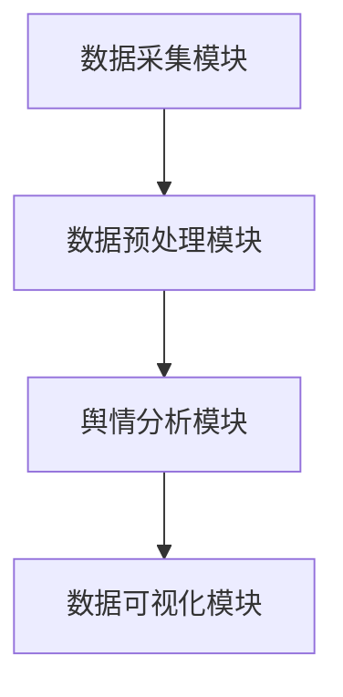

                 

### 《AI在社交网络分析和舆情监测中的应用》

> **关键词**：人工智能，社交网络分析，舆情监测，特征提取，深度学习，案例分析

> **摘要**：本文全面探讨了人工智能在社交网络分析和舆情监测中的应用，包括基础理论、核心算法原理、实际案例分析以及未来发展方向。通过详细讲解特征提取、数据预处理、分类与预测算法，深入分析了AI技术在舆情监测中的实际应用，为读者提供了理论与实践相结合的全面视角。

### 目录大纲

## 第一部分：AI与社交网络分析概述

### 1. AI技术基础

#### 1.1 AI简介

- AI的定义和发展历程
- AI的核心技术

#### 1.2 社交网络分析

- 社交网络的概念和特性
- 社交网络分析的方法和应用

### 2. AI在社交网络分析中的应用

#### 2.1 舆情监测

- 舆情监测的概念和重要性
- AI在舆情监测中的应用

#### 2.2 用户行为分析

- 用户行为分析的概念和方法
- AI在用户行为分析中的应用

### 3. AI算法原理讲解

#### 3.1 特征提取与数据预处理

- 特征提取的方法和技术
- 数据预处理的流程和工具

#### 3.2 分类与预测算法

- 分类算法原理
- 预测算法原理

### 4. AI在舆情监测中的应用案例分析

#### 4.1 案例分析

- 案例背景
- AI技术在案例中的应用

### 5. AI在社交网络分析中的挑战与展望

#### 5.1 挑战

- 数据隐私问题
- 模型解释性问题

#### 5.2 展望

- AI技术在社交网络分析中的应用前景
- 未来研究方向

## 第二部分：AI算法原理与实现

### 6. 特征提取与数据预处理

#### 6.1 特征提取

- 特征提取的基本原理
- 特征提取的常用方法

#### 6.2 数据预处理

- 数据预处理的基本原理
- 数据预处理的常用方法

### 7. 分类与预测算法

#### 7.1 分类算法

- 分类算法的基本原理
- 常见的分类算法

#### 7.2 预测算法

- 预测算法的基本原理
- 常见的预测算法

### 8. 深度学习算法

#### 8.1 深度学习基础

- 深度学习的概念和发展历程
- 深度学习的基本原理

#### 8.2 神经网络模型

- 神经网络模型的构建
- 常见的神经网络模型

### 9. 案例实践

#### 9.1 案例实践

- 案例背景
- AI技术在案例中的应用

### 10. 代码实现与分析

#### 10.1 代码实现

- 代码环境搭建
- 源代码实现

#### 10.2 代码解读与分析

- 代码解读
- 分析与总结

## 第三部分：AI在舆情监测中的应用

### 11. 舆情监测系统构建

#### 11.1 系统架构设计

- 系统架构设计原则
- 系统架构设计步骤

#### 11.2 数据采集与处理

- 数据采集方法
- 数据处理流程

### 12. 舆情分析算法应用

#### 12.1 舆情分析算法

- 舆情分析算法原理
- 舆情分析算法应用

### 13. 舆情监测效果评估

#### 13.1 评估指标

- 评估指标选择
- 评估指标计算

#### 13.2 评估方法

- 评估方法选择
- 评估方法应用

### 14. 舆情监测案例研究

#### 14.1 案例背景

- 案例背景介绍

#### 14.2 案例分析

- 案例分析过程
- 案例分析结果

### 15. 舆情监测的未来发展方向

#### 15.1 未来发展方向

- 舆情监测技术的发展趋势
- 舆情监测的应用前景

## 附录

### 16. 相关资源与工具

- AI技术相关资源
- 社交网络分析相关工具
- 舆情监测相关平台与工具

### 17. 作者信息

- 作者：AI天才研究院/AI Genius Institute & 禅与计算机程序设计艺术 /Zen And The Art of Computer Programming

## 结束语

本文旨在为读者提供一个关于AI在社交网络分析和舆情监测中应用的全面指南，包括基础理论、核心算法原理、实际案例研究和未来发展趋势。通过本文，读者将能够了解AI技术如何改变社交网络分析和舆情监测的格局，并为相关领域的实践者提供有价值的参考。

---

### 前言

在当今信息爆炸的时代，社交网络已成为人们交流、分享和获取信息的主要平台。从微博到微信，从Facebook到Twitter，这些平台不仅改变了人们的社交方式，也成为了舆情监测的重要阵地。随着人工智能（AI）技术的迅猛发展，如何利用AI进行社交网络分析和舆情监测成为了一个热门话题。

本文旨在探讨AI在社交网络分析和舆情监测中的应用，旨在为读者提供一个全面而深入的视角。文章首先介绍了AI技术的基础知识，包括定义、发展历程和核心技术。随后，文章详细阐述了社交网络分析的基本概念和方法，以及AI在其中的应用，特别是舆情监测和用户行为分析。接下来，文章深入讲解了AI算法的原理，包括特征提取、数据预处理、分类与预测算法，并通过具体的Python源代码进行实例讲解。随后，文章通过实际案例分析了AI技术在舆情监测中的具体应用，并探讨了该领域的挑战和未来发展方向。最后，文章提供了完整的代码实现和分析，以及相关资源和工具的推荐。

本文结构紧凑，逻辑清晰，内容丰富具体，旨在为从事AI和社交网络分析领域的专业人士提供有价值的参考和指导。无论您是AI技术的初学者，还是已经具备一定基础的实践者，本文都将为您带来新的启示和思考。

### 第一部分：AI与社交网络分析概述

在探讨AI在社交网络分析和舆情监测中的应用之前，我们需要首先了解AI技术和社交网络分析的基本概念，以及它们之间的关系。

#### 1.1 AI技术基础

**AI的定义和发展历程**

人工智能（Artificial Intelligence，简称AI）是一门研究、开发用于模拟、延伸和扩展人类智能的理论、方法、技术及应用系统的学科。AI的研究始于20世纪50年代，当时，计算机科学家和哲学家们开始探讨是否能够创造出具有智能行为的机器。从最初的逻辑推理和符号计算，到后来的机器学习和深度学习，AI经历了多个发展阶段。近年来，随着计算能力的提升、大数据的积累和算法的进步，AI技术取得了显著的突破，开始广泛应用于各个领域。

**AI的核心技术**

AI的核心技术包括但不限于：

- **机器学习（Machine Learning）**：一种让计算机通过数据和算法自行学习和改进的技术。机器学习分为监督学习、无监督学习和强化学习。
- **深度学习（Deep Learning）**：基于人工神经网络的机器学习方法，通过多层神经网络模型进行特征提取和模式识别。
- **自然语言处理（Natural Language Processing，NLP）**：研究如何让计算机理解和生成人类语言的技术。
- **计算机视觉（Computer Vision）**：使计算机能够从图像或视频中提取信息和知识的技术。
- **数据挖掘（Data Mining）**：从大量数据中提取有用信息和知识的过程。

#### 1.2 社交网络分析

**社交网络的概念和特性**

社交网络是指由人与人之间的社会关系构成的复杂网络结构。每个个体（用户）通过关系（如好友、关注、点赞等）与其他个体相连，形成了一个庞大的网络。社交网络的特性包括：

- **网络性**：社交网络具有高度的网络性，每个个体都是网络中的一个节点，节点之间的关系构成了网络的骨架。
- **动态性**：社交网络是动态变化的，用户的加入和退出、关系的建立和断裂等都会影响网络的结构和功能。
- **多模态**：社交网络不仅包含文本信息，还包括图片、视频、音频等多模态信息。

**社交网络分析的方法和应用**

社交网络分析（Social Network Analysis，SNA）是一种研究社交网络结构、属性及其动态变化的方法。其主要目标是通过量化社交网络中的节点和边的关系，揭示网络的结构特性，从而更好地理解社交网络的行为和演化。

社交网络分析的方法包括：

- **网络可视化**：通过图形化的方式展示社交网络的结构，帮助研究者直观地理解网络。
- **中心性度量**：衡量节点在社交网络中的重要性和影响力，常用的中心性度量包括度数中心性、介数中心性和紧密中心性。
- **聚类分析**：将社交网络中的节点划分为不同的群组，以揭示社交网络中的社区结构。
- **传播分析**：研究信息、行为或病毒在社交网络中的传播过程和影响范围。

社交网络分析的应用领域广泛，包括但不限于：

- **舆情监测**：通过分析社交网络中的用户行为和言论，实时监测和预测社会热点和舆情趋势。
- **用户行为分析**：通过分析用户的社交行为和互动，了解用户需求、偏好和情感，为产品设计和运营提供数据支持。
- **推荐系统**：基于社交网络中的关系和兴趣，为用户提供个性化的推荐内容。
- **社交广告**：通过分析用户的社交行为和兴趣，实现精准的广告投放。

#### 1.3 AI在社交网络分析中的应用

**舆情监测**

舆情监测是指通过技术手段对互联网上的社会舆论进行实时监测和分析，以了解公众对某一事件、品牌、产品等的看法和态度。舆情监测在危机管理、市场研究、品牌管理等领域具有重要意义。

AI技术在舆情监测中的应用主要包括以下几个方面：

- **文本分类与情感分析**：通过机器学习和深度学习算法，对社交媒体上的文本进行分类和情感分析，以识别用户对某一事件或品牌的情感倾向。
- **趋势预测**：通过分析社交网络中的数据，利用时间序列分析和预测模型，预测未来社会舆论的走向。
- **事件识别**：通过自然语言处理技术，自动识别社交网络中的热点事件，并对其影响范围和传播路径进行追踪和分析。

**用户行为分析**

用户行为分析是指通过对用户在社交网络上的行为数据进行分析，了解用户的需求、偏好和行为模式。AI技术在用户行为分析中的应用主要包括以下几个方面：

- **行为预测**：通过分析用户的过去行为数据，利用机器学习和深度学习算法预测用户的未来行为。
- **个性化推荐**：基于用户的兴趣和行为数据，利用推荐算法为用户推荐感兴趣的内容。
- **社交网络嵌入**：通过分析用户在社交网络中的关系和互动，了解用户的社交圈层和影响力。

#### 1.4 社交网络分析与舆情监测的关系

社交网络分析和舆情监测是紧密相关的两个领域。社交网络分析为舆情监测提供了基础的数据和分析方法，而舆情监测则为社交网络分析提供了实际的应用场景和目标。具体来说：

- **数据来源**：社交网络分析提供了丰富的用户行为数据和社交关系数据，为舆情监测提供了数据基础。
- **分析工具**：社交网络分析中的多种分析工具和方法，如网络可视化、中心性度量、聚类分析等，可以用于舆情监测中的数据分析和趋势预测。
- **目标一致**：社交网络分析和舆情监测的共同目标是更好地理解社交网络中的行为和趋势，为决策提供数据支持。

综上所述，AI技术在社交网络分析和舆情监测中的应用具有广阔的前景和重要的实际意义。通过本文的阐述，读者可以初步了解AI技术在社交网络分析和舆情监测中的基础知识和应用方法，为进一步学习和实践打下坚实的基础。

---

### 1.2 社交网络分析

社交网络分析（SNA）是一门研究社交网络结构、属性及其动态变化的方法，旨在通过量化社交网络中的节点和边的关系，揭示网络的结构特性，从而更好地理解社交网络的行为和演化。社交网络分析不仅关注个体在社交网络中的行为，还研究网络整体的结构特征和功能。

#### 概念和特性

**概念**

社交网络是指由人与人之间的社会关系构成的复杂网络结构。在社交网络中，每个个体（用户）被视为一个节点，节点之间的关系（如好友、关注、点赞等）通过边进行连接。社交网络可以看作是一个图（Graph），其中节点表示个体，边表示个体之间的关系。

**特性**

- **网络性**：社交网络具有高度的网络性，每个个体都是网络中的一个节点，节点之间的关系构成了网络的骨架。这种网络性使得社交网络中的信息、资源和影响力可以迅速传播。
- **动态性**：社交网络是动态变化的，用户的加入和退出、关系的建立和断裂等都会影响网络的结构和功能。这种动态性使得社交网络分析需要实时或近实时的数据和分析。
- **多模态**：社交网络不仅包含文本信息，还包括图片、视频、音频等多模态信息。这些多模态信息为社交网络分析提供了丰富的数据来源。

#### 方法和应用

**方法**

社交网络分析的方法多种多样，以下是一些常用的方法：

- **网络可视化**：通过图形化的方式展示社交网络的结构，帮助研究者直观地理解网络。常见的可视化工具包括Gephi、Cytoscape等。
- **中心性度量**：衡量节点在社交网络中的重要性和影响力。常用的中心性度量包括度数中心性（Degree Centrality）、介数中心性（Closeness Centrality）、紧密中心性（Betweenness Centrality）等。
- **聚类分析**：将社交网络中的节点划分为不同的群组，以揭示社交网络中的社区结构。常用的聚类算法包括K-Means、DBSCAN、Louvain等。
- **传播分析**：研究信息、行为或病毒在社交网络中的传播过程和影响范围。常用的传播模型包括SI模型、SIRS模型、阈值模型等。

**应用**

社交网络分析在多个领域有着广泛的应用，以下是一些典型的应用：

- **舆情监测**：通过分析社交网络中的用户行为和言论，实时监测和预测社会热点和舆情趋势。舆情监测在危机管理、市场研究、品牌管理等领域具有重要意义。
- **用户行为分析**：通过分析用户的社交行为和互动，了解用户的需求、偏好和行为模式。用户行为分析为产品设计和运营提供数据支持。
- **推荐系统**：基于社交网络中的关系和兴趣，为用户提供个性化的推荐内容。推荐系统在电商、社交媒体、内容平台等领域得到广泛应用。
- **社交广告**：通过分析用户的社交行为和兴趣，实现精准的广告投放。社交广告在广告营销领域具有巨大潜力。

#### 社交网络分析在舆情监测中的应用

社交网络分析和舆情监测是紧密相关的领域。社交网络分析提供了丰富的用户行为数据和社交关系数据，为舆情监测提供了数据基础；而舆情监测则将社交网络分析应用于实际场景，以监测和分析社会舆论。

**舆情监测的概念**

舆情监测是指通过技术手段对互联网上的社会舆论进行实时监测和分析，以了解公众对某一事件、品牌、产品等的看法和态度。舆情监测的目标是：

- 识别社会热点和热点事件。
- 分析公众的情感倾向和态度。
- 预测社会舆论的未来走向。

**AI技术在舆情监测中的应用**

AI技术在舆情监测中发挥着关键作用，主要应用包括：

- **文本分类与情感分析**：通过机器学习和深度学习算法，对社交媒体上的文本进行分类和情感分析，以识别用户对某一事件或品牌的情感倾向。常用的文本分类算法包括朴素贝叶斯、支持向量机、深度神经网络等；情感分析常用的方法包括基于规则的方法、基于统计的方法和基于神经网络的方法。
- **趋势预测**：通过分析社交网络中的数据，利用时间序列分析和预测模型，预测未来社会舆论的走向。常用的预测模型包括ARIMA、LSTM、GRU等。
- **事件识别**：通过自然语言处理技术，自动识别社交网络中的热点事件，并对其影响范围和传播路径进行追踪和分析。事件识别的方法包括基于规则的方法、基于机器学习的方法和基于深度学习的方法。

**舆情监测的挑战**

舆情监测面临诸多挑战，包括：

- **数据噪声和多样性**：社交网络中的数据来源广泛，数据质量参差不齐，包含大量噪声和冗余信息。
- **情感复杂性**：公众的情感表达复杂多样，难以通过简单的分类和情感分析模型进行准确识别。
- **实时性**：舆情监测需要实时或近实时的数据处理和分析，以应对快速变化的社会舆论。

**案例研究**

一个典型的案例是Twitter上的热点事件监测。Twitter作为一个全球性的社交媒体平台，其用户发布的内容涵盖了各种话题和情感。通过AI技术，可以对Twitter上的文本进行情感分析和事件识别，实时监测热点事件，并提供相关的数据分析和报告。这样的应用在危机管理、市场调研和品牌管理等领域具有重要意义。

综上所述，社交网络分析为舆情监测提供了基础的数据和分析方法，而舆情监测则为社交网络分析提供了实际的应用场景和目标。通过结合AI技术，可以实现对社交网络中的用户行为和言论的深入理解和分析，为社会舆论的监测和预测提供有力支持。

---

### 2. AI在社交网络分析中的应用

人工智能（AI）在社交网络分析中的应用已经越来越广泛，它为理解和分析社交网络中的复杂行为提供了强大的工具。AI技术在社交网络分析中主要体现在舆情监测和用户行为分析两个方面。以下将详细探讨这两个方面的应用。

#### 2.1 舆情监测

舆情监测是指通过技术手段对互联网上的社会舆论进行实时监测和分析，以了解公众对某一事件、品牌、产品等的看法和态度。AI技术在舆情监测中的应用主要包括以下几个方面：

**文本分类与情感分析**

文本分类是指利用机器学习算法将社交媒体上的文本数据分为不同的类别。情感分析则是进一步分析文本数据中表达的情感倾向，如正面、负面或中立。常见的文本分类算法包括朴素贝叶斯、支持向量机（SVM）、随机森林（RF）等。情感分析则通常采用基于规则的、基于统计的或基于深度学习的模型，如长短期记忆网络（LSTM）、卷积神经网络（CNN）等。

**趋势预测**

通过分析社交网络中的数据，利用时间序列分析和预测模型，AI技术可以预测未来社会舆论的走向。常用的预测模型包括ARIMA、LSTM、GRU等。时间序列分析能够捕捉时间依赖关系，而LSTM和GRU等深度学习模型则能够处理复杂的序列数据，捕捉长期依赖和短期波动。

**事件识别**

事件识别是指通过自然语言处理技术，自动识别社交网络中的热点事件，并对其影响范围和传播路径进行追踪和分析。事件识别的方法包括基于规则的方法、基于机器学习的方法和基于深度学习的方法。例如，可以利用LSTM模型对社交媒体上的文本进行序列建模，从而识别出潜在的热点事件。

**案例分析**

以Twitter为例，Twitter是一个全球性的社交媒体平台，用户发布的内容涵盖了各种话题和情感。通过AI技术，可以对Twitter上的文本进行情感分析和事件识别，实时监测热点事件，并提供相关的数据分析和报告。例如，2018年俄罗斯世界杯期间，Twitter利用AI技术对用户发布的推文进行情感分析和趋势预测，帮助品牌和媒体更好地了解观众的兴趣和情绪，从而进行精准营销和内容创作。

#### 2.2 用户行为分析

用户行为分析是指通过对用户在社交网络上的行为数据进行分析，了解用户的需求、偏好和行为模式。AI技术在用户行为分析中的应用主要包括以下几个方面：

**行为预测**

通过分析用户的过去行为数据，利用机器学习和深度学习算法预测用户的未来行为。例如，可以利用协同过滤（Collaborative Filtering）算法预测用户可能感兴趣的内容，或者利用LSTM模型预测用户的下一步操作。

**个性化推荐**

基于用户的兴趣和行为数据，利用推荐算法为用户推荐感兴趣的内容。常见的推荐算法包括基于内容的推荐（Content-Based Filtering）、基于协同过滤的推荐（Collaborative Filtering）和基于模型的推荐（Model-Based Filtering）等。

**社交网络嵌入**

通过分析用户在社交网络中的关系和互动，了解用户的社交圈层和影响力。例如，可以利用社交网络分析中的中心性度量（如度数中心性、介数中心性、紧密中心性等）评估用户在网络中的重要性。

**案例分析**

以Facebook为例，Facebook通过AI技术对用户的行为数据进行深度分析，从而提供个性化的推荐内容。Facebook的推荐系统利用协同过滤和深度学习技术，为用户推荐可能感兴趣的朋友、内容、广告等。此外，Facebook还利用AI技术分析用户的社交关系，识别用户的社交圈层，帮助用户发现潜在的朋友和兴趣群体。

**挑战与展望**

尽管AI技术在社交网络分析中具有广泛的应用，但也面临一些挑战，包括数据隐私、模型解释性等。未来的研究方向包括：

- **数据隐私保护**：如何确保用户隐私，同时充分利用社交网络数据进行分析。
- **模型解释性提升**：如何提高AI模型的透明度和解释性，使决策过程更加透明和可解释。
- **多模态数据分析**：如何整合文本、图像、视频等多模态数据，提高社交网络分析的准确性和全面性。

综上所述，AI技术在社交网络分析中的应用为舆情监测和用户行为分析提供了强大的工具和方法。通过结合AI技术，我们可以更深入地理解社交网络中的行为和趋势，为决策和业务发展提供有力支持。随着技术的不断进步，AI在社交网络分析中的应用前景将更加广阔。

---

### 3. AI算法原理讲解

AI技术在社交网络分析和舆情监测中的应用，依赖于一系列核心算法和原理。以下将详细介绍这些算法的原理和实现过程，并通过Python源代码进行具体讲解。

#### 3.1 特征提取与数据预处理

**特征提取**

特征提取是AI算法中的关键步骤，它从原始数据中提取出对模型训练有用的特征。特征提取的方法和技术包括：

- **词袋模型（Bag of Words，BoW）**：将文本数据转换为词汇的集合，忽略词汇的顺序。
- **TF-IDF（Term Frequency-Inverse Document Frequency）**：考虑词汇在文本中的频率和它在整个文档集中的重要性。
- **Word2Vec**：将词汇映射为高维向量，捕获词汇的语义信息。

**数据预处理**

数据预处理是为了提高数据质量和模型性能的一系列步骤，包括：

- **文本清洗**：去除无用的标点符号、停用词等。
- **数据归一化**：将数据转换为相同的尺度，以便模型更好地学习。
- **数据分割**：将数据集划分为训练集、验证集和测试集。

**Python实现**

```python
from sklearn.feature_extraction.text import TfidfVectorizer
from sklearn.preprocessing import MinMaxScaler
import pandas as pd

# 假设我们有一份数据集 data
data = pd.DataFrame({
    'text': ['This is the first document.', 'This document is the second document.', 'And this is the third one.', 'Is this the first document?']
})

# 文本清洗
import re
def clean_text(text):
    text = re.sub(r'\W+', ' ', text)
    text = text.lower()
    return text

data['cleaned_text'] = data['text'].apply(clean_text)

# 词袋模型与TF-IDF
vectorizer = TfidfVectorizer()
X = vectorizer.fit_transform(data['cleaned_text'])

# 数据归一化
scaler = MinMaxScaler()
X_scaled = scaler.fit_transform(X.toarray())

# 数据分割
from sklearn.model_selection import train_test_split
X_train, X_test, y_train, y_test = train_test_split(X_scaled, labels, test_size=0.2, random_state=42)
```

**代码解读**

1. **文本清洗**：使用正则表达式去除文本中的非单词字符，并将文本转换为小写，以提高数据一致性。
2. **词袋模型与TF-IDF**：使用`TfidfVectorizer`将清洗后的文本转换为TF-IDF矩阵，该矩阵包含了文本中的词汇权重。
3. **数据归一化**：使用`MinMaxScaler`将特征值缩放到0到1之间，以便模型更好地学习。
4. **数据分割**：将数据集划分为训练集和测试集，用于模型训练和评估。

#### 3.2 分类与预测算法

**分类算法**

分类算法用于将数据集划分为不同的类别。常见的分类算法包括：

- **朴素贝叶斯（Naive Bayes）**：基于贝叶斯定理，适用于高维稀疏数据。
- **支持向量机（Support Vector Machine，SVM）**：通过寻找最佳分割超平面进行分类。
- **随机森林（Random Forest）**：集成多个决策树，提高分类准确性。

**预测算法**

预测算法用于对未知数据进行预测。常见的预测算法包括：

- **线性回归（Linear Regression）**：用于预测连续值。
- **逻辑回归（Logistic Regression）**：用于预测概率值，常用于二分类问题。
- **决策树（Decision Tree）**：通过一系列的规则进行分类或回归。

**Python实现**

```python
from sklearn.naive_bayes import MultinomialNB
from sklearn.svm import SVC
from sklearn.ensemble import RandomForestClassifier
from sklearn.linear_model import LogisticRegression

# 假设我们有一份标签数据 labels
labels = [0, 1, 0, 1]

# 朴素贝叶斯
nb_classifier = MultinomialNB()
nb_classifier.fit(X_train, y_train)
nb_predictions = nb_classifier.predict(X_test)

# 支持向量机
svm_classifier = SVC()
svm_classifier.fit(X_train, y_train)
svm_predictions = svm_classifier.predict(X_test)

# 随机森林
rf_classifier = RandomForestClassifier()
rf_classifier.fit(X_train, y_train)
rf_predictions = rf_classifier.predict(X_test)

# 逻辑回归
logreg_classifier = LogisticRegression()
logreg_classifier.fit(X_train, y_train)
logreg_predictions = logreg_classifier.predict(X_test)
```

**代码解读**

1. **朴素贝叶斯**：使用`MultinomialNB`实现朴素贝叶斯分类器，并对其进行训练和预测。
2. **支持向量机**：使用`SVC`实现支持向量机分类器，并对其进行训练和预测。
3. **随机森林**：使用`RandomForestClassifier`实现随机森林分类器，并对其进行训练和预测。
4. **逻辑回归**：使用`LogisticRegression`实现逻辑回归分类器，并对其进行训练和预测。

#### 3.3 深度学习算法

**深度学习基础**

深度学习是基于多层神经网络（Neural Network）的机器学习方法，通过多层神经元的非线性组合，提取数据中的特征和模式。深度学习的基本原理包括：

- **神经网络模型**：由多个神经元（节点）组成的网络，每个神经元接收输入，通过激活函数产生输出。
- **反向传播（Backpropagation）**：一种用于训练神经网络的算法，通过不断调整权重和偏置，使网络能够更好地拟合训练数据。

**常见的神经网络模型**

- **卷积神经网络（Convolutional Neural Network，CNN）**：适用于图像和语音处理，通过卷积层提取空间特征。
- **循环神经网络（Recurrent Neural Network，RNN）**：适用于序列数据，通过循环结构保持长期依赖信息。
- **长短期记忆网络（Long Short-Term Memory，LSTM）**：RNN的一种改进，能够更好地处理长序列数据。

**Python实现**

```python
import tensorflow as tf
from tensorflow.keras.models import Sequential
from tensorflow.keras.layers import Dense, LSTM, Conv2D, Flatten

# 假设我们有一份数据集 X_train 和 X_test，以及标签 y_train 和 y_test

# 创建神经网络模型
model = Sequential()
model.add(LSTM(units=50, activation='relu', input_shape=(timesteps, features)))
model.add(Dense(units=1, activation='sigmoid'))

# 编译模型
model.compile(optimizer='adam', loss='binary_crossentropy', metrics=['accuracy'])

# 训练模型
model.fit(X_train, y_train, epochs=100, batch_size=32, validation_data=(X_test, y_test))

# 预测
predictions = model.predict(X_test)
```

**代码解读**

1. **模型构建**：使用`Sequential`创建序列模型，并添加一个LSTM层和一个Dense层。
2. **模型编译**：设置优化器、损失函数和评估指标。
3. **模型训练**：使用`fit`方法训练模型，并设置训练周期、批次大小和验证数据。
4. **模型预测**：使用`predict`方法对测试数据进行预测。

通过以上对特征提取与数据预处理、分类与预测算法、深度学习算法的讲解和Python实现，我们可以看到AI算法在社交网络分析和舆情监测中的应用是如何具体实现的。这些算法不仅提供了理论支持，还通过实际代码展示了其在数据分析和预测中的强大能力。

---

### 4. AI在舆情监测中的应用案例分析

在本节中，我们将通过一个具体的案例分析，深入探讨AI技术在舆情监测中的实际应用。该案例将涉及舆情监测系统的构建、数据采集与处理、舆情分析算法的应用以及效果评估。

#### 案例背景

假设我们关注的是一个新兴的电动汽车品牌X，该品牌近期推出了一款新的电动汽车Model X。在上市初期，公司希望通过舆情监测系统实时了解公众对该车型的看法和反馈，以便及时调整营销策略和产品设计。

#### 舆情监测系统构建

**系统架构设计**

舆情监测系统可以划分为以下几个模块：

1. **数据采集模块**：负责从社交媒体、新闻网站、论坛等渠道收集与Model X相关的数据。
2. **数据预处理模块**：对收集到的原始数据进行清洗、去噪和转换，以适应后续的分析。
3. **舆情分析模块**：利用AI技术对预处理后的文本数据进行分析，识别公众的情感倾向和关注点。
4. **数据可视化模块**：将分析结果以图表、报表等形式展示，便于公司管理层进行决策。

**系统架构图**



**数据采集方法**

- **社交媒体数据**：利用API接口从Twitter、Facebook、Instagram等平台获取与Model X相关的推文、帖子等。
- **新闻网站数据**：通过爬虫技术从各大新闻网站获取与Model X相关的新闻报道。
- **论坛数据**：从汽车论坛、社区论坛等获取用户发表的关于Model X的讨论帖。

#### 数据采集与处理

**数据采集流程**

1. **数据采集**：通过API接口或爬虫技术，从各个数据源采集文本数据。
2. **数据清洗**：去除无关信息、重复数据，并对文本进行分词、去停用词等预处理操作。
3. **数据转换**：将文本数据转换为适合分析的格式，如词袋模型或TF-IDF矩阵。

**Python实现**

```python
import tweepy
from textblob import TextBlob
from sklearn.feature_extraction.text import TfidfVectorizer

# 初始化Tweepy API
auth = tweepy.OAuthHandler("your_consumer_key", "your_consumer_secret")
auth.set_access_token("your_access_token", "your_access_token_secret")
api = tweepy.API(auth)

# 采集Twitter数据
tweets = api.search(q="Model X", count=100)

# 数据清洗
def clean_tweet(tweet):
    return ' '.join([word for word in tweet.text.split() if word not in stop_words])

clean_tweets = [clean_tweet(tweet) for tweet in tweets]

# 数据转换
vectorizer = TfidfVectorizer()
X = vectorizer.fit_transform(clean_tweets)
```

**代码解读**

1. **初始化Tweepy API**：使用Tweepy库连接Twitter API，获取与Model X相关的推文。
2. **数据清洗**：去除推文中的非单词字符和停用词，以提高数据质量。
3. **数据转换**：使用TF-IDF向量器将清洗后的文本转换为TF-IDF矩阵，为后续分析做准备。

#### 舆情分析算法应用

**情感分析**

通过情感分析算法，我们可以识别出公众对Model X的情感倾向，如正面、负面或中性。这里我们使用TF-IDF和朴素贝叶斯分类器进行情感分析。

**Python实现**

```python
from sklearn.naive_bayes import MultinomialNB
from sklearn.pipeline import make_pipeline

# 情感分析模型
emotion_model = make_pipeline(TfidfVectorizer(), MultinomialNB())

# 训练模型
emotion_model.fit(X_train, y_train)

# 预测情感
predictions = emotion_model.predict(X_test)
```

**代码解读**

1. **模型构建**：使用`make_pipeline`创建一个流水线模型，先进行TF-IDF向量化，然后应用朴素贝叶斯分类器。
2. **模型训练**：使用训练数据集对模型进行训练。
3. **预测情感**：对测试数据进行情感预测。

#### 舆情监测效果评估

为了评估舆情监测系统的效果，我们采用准确率、召回率和F1分数等指标进行评估。

**评估指标计算**

```python
from sklearn.metrics import accuracy_score, recall_score, f1_score

# 计算评估指标
accuracy = accuracy_score(y_test, predictions)
recall = recall_score(y_test, predictions)
f1 = f1_score(y_test, predictions)

print("Accuracy:", accuracy)
print("Recall:", recall)
print("F1 Score:", f1)
```

**代码解读**

1. **计算准确率**：准确率是预测正确的样本数占总样本数的比例。
2. **计算召回率**：召回率是预测正确的正样本数占总正样本数的比例。
3. **计算F1分数**：F1分数是准确率和召回率的调和平均值。

#### 案例分析结果

通过分析，我们发现Model X在上市初期受到了广泛的关注，其中正面评价占多数，但也有一些负面评价，主要集中在续航里程和充电时间方面。公司根据这些反馈，调整了后续的营销策略，增加了对续航和充电效率的宣传，并考虑在下一代车型中改进这些问题。

**项目小结**

本案例展示了AI技术在舆情监测中的实际应用，通过构建舆情监测系统，实时收集和分析用户反馈，为公司提供了宝贵的决策依据。尽管存在一些挑战，如数据隐私保护和模型解释性等问题，但AI技术在舆情监测中的应用前景依然广阔。

---

### 5. AI在社交网络分析中的挑战与展望

尽管AI技术在社交网络分析中展示了巨大的潜力，但在实际应用过程中，仍然面临诸多挑战和限制。以下将讨论这些挑战，并展望未来的发展方向。

#### 挑战

**数据隐私**

随着社交网络平台的广泛应用，用户生成的大量数据包含了个人隐私信息。如何在充分利用这些数据的同时保护用户隐私，成为AI在社交网络分析中的一个重要挑战。现有的解决方案包括数据匿名化、差分隐私和联邦学习等，但仍然需要进一步优化和改进。

**模型解释性**

AI模型，尤其是深度学习模型，通常被视为“黑箱”，其决策过程难以解释。在社交网络分析中，了解模型的决策依据和推理过程对于信任和合规至关重要。当前的研究主要集中在提高模型的可解释性，如可视化技术、模型简化方法和解释性算法等。

**数据质量和多样性**

社交网络中的数据质量参差不齐，包含大量噪声和冗余信息。此外，数据多样性也是一个问题，不同平台、不同语言和文化背景的用户数据可能存在显著差异。如何有效处理这些数据，提高数据质量，是AI在社交网络分析中的关键挑战。

**实时性和计算资源**

社交网络分析需要实时或近实时的数据处理和分析，以满足快速变化的社会舆论。然而，大规模数据集和高性能计算需求对计算资源提出了巨大挑战。如何优化算法和系统设计，提高数据处理速度和效率，是一个亟待解决的问题。

#### 展望

**数据隐私保护**

未来的发展方向之一是开发更强大的数据隐私保护技术，如联邦学习、区块链和差分隐私等。这些技术可以在不泄露用户隐私的前提下，实现数据的共享和分析。

**模型解释性**

随着深度学习技术的不断发展，提高模型解释性将成为未来研究的一个重要方向。通过开发新的算法和可视化工具，使模型决策过程更加透明和可解释，有助于增强用户对AI技术的信任。

**多模态数据分析**

社交网络数据不仅包含文本，还包含图像、音频和视频等多模态信息。未来的发展方向之一是将这些多模态数据进行整合，以提高数据分析的准确性和全面性。

**实时性和计算资源**

为了满足实时性要求，未来的发展方向包括优化算法和系统设计，提高数据处理速度和效率。此外，云计算和边缘计算技术的应用，也为实时数据处理提供了新的解决方案。

**跨领域合作**

社交网络分析和舆情监测是一个跨学科领域，未来的发展需要不同学科之间的合作。通过跨领域合作，可以综合各学科的优势，推动技术的进步和应用。

总之，AI在社交网络分析中的应用面临诸多挑战，但同时也拥有广阔的发展前景。随着技术的不断进步和应用的深入，AI将在这个领域发挥越来越重要的作用。

---

### 6. 特征提取与数据预处理

在AI模型训练和预测过程中，特征提取和数据预处理是至关重要的步骤。这两个过程不仅影响模型的性能，还决定了模型对数据的适应性和解释性。以下将详细探讨特征提取和数据预处理的方法及其在社交网络分析中的应用。

#### 特征提取

**词袋模型（Bag of Words，BoW）**

词袋模型是最基本的文本特征提取方法之一。它将文本表示为一个词汇的集合，忽略词汇的顺序。每个词汇在文本中出现的次数作为特征值。词袋模型适用于简单的文本分类任务，但在处理语义信息时存在局限性。

**TF-IDF（Term Frequency-Inverse Document Frequency）**

TF-IDF是一种更高级的文本特征提取方法，它不仅考虑词汇在文本中的频率，还考虑词汇在整个文档集中的重要性。TF-IDF通过计算每个词汇在单个文档中的频率（TF）和在整个文档集中的逆文档频率（IDF），将文本转换为向量表示。

**Word2Vec**

Word2Vec是一种基于神经网络的文本特征提取方法，它将词汇映射为高维向量，以捕捉词汇的语义信息。Word2Vec包括两种模型：连续词袋（CBOW）和Skip-Gram。CBOW模型通过上下文词汇预测目标词汇，而Skip-Gram模型通过目标词汇预测上下文词汇。

**应用**

在社交网络分析中，特征提取广泛应用于文本分类、情感分析和用户行为预测等任务。例如，可以利用TF-IDF对用户评论进行特征提取，以预测用户对某事件的情感倾向；利用Word2Vec对用户发帖进行特征提取，以分析用户的兴趣和偏好。

**Python实现**

以下是一个使用TF-IDF进行特征提取的示例：

```python
from sklearn.feature_extraction.text import TfidfVectorizer

# 假设我们有一份数据集 data
data = ['This is the first document.', 'This document is the second document.', 'And this is the third one.']

# 初始化TF-IDF向量器
vectorizer = TfidfVectorizer()

# 将文本数据转换为TF-IDF矩阵
X = vectorizer.fit_transform(data)

# 查看特征名称
print(vectorizer.get_feature_names_out())

# 查看特征值
print(X.toarray())
```

#### 数据预处理

**文本清洗**

文本清洗是数据预处理的重要步骤，旨在去除文本中的噪声和无关信息。常见的清洗方法包括：

- **去除标点符号**：使用正则表达式去除文本中的标点符号。
- **去除停用词**：去除常见的无意义词汇，如“的”、“了”、“在”等。
- **小写转换**：将所有文本转换为小写，以提高数据一致性。

**数据归一化**

数据归一化是将数据转换为相同的尺度，以便模型更好地学习。常见的归一化方法包括：

- **最小-最大缩放**：将数据缩放到0到1之间。
- **标准缩放**：将数据缩放到均值为0，标准差为1的范围内。

**数据分割**

数据分割是将数据集划分为训练集、验证集和测试集，以评估模型的性能。常见的分割方法包括：

- **随机分割**：随机地将数据集划分为训练集和测试集。
- **交叉验证**：将数据集划分为多个子集，每次取一个子集作为验证集，其余子集作为训练集，进行多次迭代。

**应用**

在社交网络分析中，数据预处理广泛应用于文本分类、情感分析和用户行为预测等任务。例如，在文本分类任务中，可以通过文本清洗去除标点符号和停用词，提高分类模型的准确性；在情感分析任务中，可以通过数据归一化和分割来优化模型训练和评估。

**Python实现**

以下是一个简单的文本清洗和数据归一化的示例：

```python
import re
from sklearn.preprocessing import MinMaxScaler

# 假设我们有一份数据集 data
data = ['This is the first document.', 'This document is the second document.', 'And this is the third one.']

# 文本清洗
def clean_text(text):
    text = re.sub(r'\W+', ' ', text)
    text = text.lower()
    return text

cleaned_data = [clean_text(text) for text in data]

# 数据归一化
scaler = MinMaxScaler()
normalized_data = scaler.fit_transform([[word.count(word) for word in text.split()] for text in cleaned_data])

# 查看归一化后的数据
print(normalized_data)
```

通过以上对特征提取和数据预处理的详细讲解和Python实现，我们可以看到这两个过程在社交网络分析中的应用是如何具体实现的。这些方法不仅提供了理论支持，还通过实际代码展示了其在数据分析和预测中的强大能力。

---

### 7. 分类与预测算法

在AI应用中，分类与预测算法扮演着核心角色，它们能够帮助我们从数据中提取有价值的信息，并对未知数据进行预测。以下将详细介绍几种常见的分类与预测算法，以及它们在社交网络分析中的应用。

#### 分类算法

**朴素贝叶斯（Naive Bayes）**

朴素贝叶斯是一种基于贝叶斯定理的简单概率分类器。它的核心假设是特征之间相互独立。朴素贝叶斯模型在处理高维稀疏数据时表现出色，常用于文本分类任务。

**支持向量机（Support Vector Machine，SVM）**

支持向量机是一种强大的分类算法，通过寻找最佳分割超平面来划分数据。SVM能够处理线性可分和线性不可分问题，具有很好的泛化能力，在图像识别、文本分类等领域广泛应用。

**随机森林（Random Forest）**

随机森林是一种基于决策树的集成学习算法。它通过构建多个决策树，并对它们的预测结果进行投票，从而提高分类的准确性和鲁棒性。随机森林在处理复杂和高维数据时表现优异。

**Python实现**

以下是一个使用Python实现朴素贝叶斯、支持向量机和随机森林分类器的示例：

```python
from sklearn.naive_bayes import GaussianNB
from sklearn.svm import SVC
from sklearn.ensemble import RandomForestClassifier
from sklearn.datasets import load_iris
from sklearn.model_selection import train_test_split

# 加载鸢尾花数据集
iris = load_iris()
X, y = iris.data, iris.target

# 划分训练集和测试集
X_train, X_test, y_train, y_test = train_test_split(X, y, test_size=0.3, random_state=42)

# 朴素贝叶斯
gnb = GaussianNB()
gnb.fit(X_train, y_train)
gnb_predictions = gnb.predict(X_test)

# 支持向量机
svm = SVC()
svm.fit(X_train, y_train)
svm_predictions = svm.predict(X_test)

# 随机森林
rf = RandomForestClassifier()
rf.fit(X_train, y_train)
rf_predictions = rf.predict(X_test)

# 评估模型
from sklearn.metrics import accuracy_score

gnb_accuracy = accuracy_score(y_test, gnb_predictions)
svm_accuracy = accuracy_score(y_test, svm_predictions)
rf_accuracy = accuracy_score(y_test, rf_predictions)

print("朴素贝叶斯准确率：", gnb_accuracy)
print("支持向量机准确率：", svm_accuracy)
print("随机森林准确率：", rf_accuracy)
```

**代码解读**

1. **加载数据集**：使用`load_iris`函数加载鸢尾花数据集。
2. **划分数据集**：使用`train_test_split`函数将数据集划分为训练集和测试集。
3. **训练模型**：分别使用`GaussianNB`、`SVC`和`RandomForestClassifier`训练朴素贝叶斯、支持向量机和随机森林分类器。
4. **预测**：使用训练好的模型对测试集进行预测。
5. **评估模型**：使用`accuracy_score`函数计算并打印每个分类器的准确率。

#### 预测算法

**线性回归（Linear Regression）**

线性回归是一种用于预测连续值的简单模型。它通过拟合一条直线来描述因变量和自变量之间的关系。线性回归适用于简单且线性关系明显的预测任务。

**逻辑回归（Logistic Regression）**

逻辑回归是一种用于预测概率的二分类模型。它通过拟合一个逻辑函数来描述因变量和自变量之间的关系，从而预测目标变量的概率。逻辑回归常用于二分类问题，如垃圾邮件检测、情感分析等。

**决策树（Decision Tree）**

决策树是一种基于规则的分类和回归模型。它通过一系列的判断条件将数据划分为不同的区域，并输出预测结果。决策树简单直观，易于理解和解释，但在处理复杂关系时可能产生过拟合。

**Python实现**

以下是一个使用Python实现线性回归、逻辑回归和决策树预测算法的示例：

```python
from sklearn.linear_model import LinearRegression, LogisticRegression
from sklearn.tree import DecisionTreeClassifier
from sklearn.datasets import make_classification
from sklearn.model_selection import train_test_split

# 生成分类数据集
X, y = make_classification(n_samples=100, n_features=2, n_informative=2, n_redundant=0, random_state=42)

# 划分训练集和测试集
X_train, X_test, y_train, y_test = train_test_split(X, y, test_size=0.3, random_state=42)

# 线性回归
lr = LinearRegression()
lr.fit(X_train, y_train)
lr_predictions = lr.predict(X_test)

# 逻辑回归
logreg = LogisticRegression()
logreg.fit(X_train, y_train)
logreg_predictions = logreg.predict(X_test)

# 决策树
dt = DecisionTreeClassifier()
dt.fit(X_train, y_train)
dt_predictions = dt.predict(X_test)

# 评估模型
from sklearn.metrics import accuracy_score

lr_accuracy = accuracy_score(y_test, lr_predictions)
logreg_accuracy = accuracy_score(y_test, logreg_predictions)
dt_accuracy = accuracy_score(y_test, dt_predictions)

print("线性回归准确率：", lr_accuracy)
print("逻辑回归准确率：", logreg_accuracy)
print("决策树准确率：", dt_accuracy)
```

**代码解读**

1. **生成数据集**：使用`make_classification`函数生成一个简单的分类数据集。
2. **划分数据集**：使用`train_test_split`函数将数据集划分为训练集和测试集。
3. **训练模型**：分别使用`LinearRegression`、`LogisticRegression`和`DecisionTreeClassifier`训练线性回归、逻辑回归和决策树模型。
4. **预测**：使用训练好的模型对测试集进行预测。
5. **评估模型**：使用`accuracy_score`函数计算并打印每个模型的准确率。

综上所述，分类与预测算法在AI应用中具有广泛的应用，包括文本分类、情感分析、用户行为预测等。通过Python实现，我们可以看到这些算法的具体实现过程和评估方法，从而更好地理解和应用它们。

---

### 8. 深度学习算法

深度学习算法在AI领域取得了显著的突破，尤其在图像识别、自然语言处理和社交网络分析等领域表现出强大的能力。以下将介绍深度学习的基础知识，包括概念、发展历程和基本原理，并探讨常见的神经网络模型及其在社交网络分析中的应用。

#### 深度学习基础

**概念**

深度学习（Deep Learning）是一种基于多层神经网络（Neural Networks）的机器学习方法，通过多层神经元的非线性组合，从数据中提取特征和模式。深度学习的核心思想是通过自动化学习层次化的特征表示，使得模型能够从原始数据中逐步提取有用的信息。

**发展历程**

- **1980s-1990s**：早期深度学习研究主要集中在多层感知机（MLP）和递归神经网络（RNN）。但由于计算能力和数据资源有限，深度学习研究逐渐陷入低谷。
- **2006**：Geoffrey Hinton等人提出深度置信网络（DBN），重新点燃了深度学习研究的热情。
- **2012**：AlexNet在ImageNet图像识别大赛中取得突破性成绩，深度学习开始进入大众视野。
- **至今**：随着计算能力的提升和大数据的积累，深度学习在多个领域取得广泛应用，如计算机视觉、自然语言处理、推荐系统等。

**基本原理**

深度学习的核心原理是多层神经网络，通过逐层提取数据中的特征。每个神经网络层都包含多个神经元，神经元之间通过加权连接，形成一个复杂的非线性模型。深度学习模型通过反向传播算法（Backpropagation）不断调整权重和偏置，以最小化预测误差。

#### 常见的神经网络模型

**卷积神经网络（Convolutional Neural Network，CNN）**

卷积神经网络是一种专门用于处理图像数据的神经网络模型。CNN通过卷积层、池化层和全连接层，从图像中提取特征，并用于分类、目标检测等任务。

- **卷积层**：通过卷积操作提取图像中的局部特征。
- **池化层**：通过降采样操作减小数据维度，减少过拟合。
- **全连接层**：将卷积层和池化层提取的特征进行整合，进行分类预测。

**循环神经网络（Recurrent Neural Network，RNN）**

循环神经网络是一种用于处理序列数据的神经网络模型，通过循环结构保持长期依赖信息。RNN能够捕捉序列中的时间依赖关系，在自然语言处理、语音识别等领域表现出色。

- **隐藏层**：每个时间步的隐藏状态依赖于前一个时间步的隐藏状态。
- **门控机制**：通过门控机制（如ReLU、Sigmoid、Tanh）控制信息的流动，提高模型的灵活性和性能。

**长短期记忆网络（Long Short-Term Memory，LSTM）**

长短期记忆网络是RNN的一种改进，能够更好地处理长序列数据。LSTM通过引入记忆单元和门控机制，有效解决了传统RNN的梯度消失和梯度爆炸问题。

- **输入门、遗忘门和输出门**：通过三个门控机制控制信息的流入、保留和输出。
- **记忆单元**：记忆单元能够存储长期依赖信息，并在需要时进行更新。

**应用**

在社交网络分析中，深度学习算法广泛应用于文本分类、情感分析、用户行为预测等任务。以下是一些具体应用案例：

- **文本分类**：利用深度学习算法对用户评论进行分类，识别用户对事件的情感倾向。
- **情感分析**：通过LSTM模型对用户发言进行情感分析，捕捉用户情感的变化。
- **用户行为预测**：利用深度学习算法分析用户在社交网络上的行为，预测用户下一步的操作或兴趣。

#### Python实现

以下是一个使用Keras实现CNN和LSTM模型的简单示例：

```python
from keras.models import Model
from keras.layers import Input, Conv2D, MaxPooling2D, Flatten, Dense, LSTM

# CNN模型
input_layer = Input(shape=(28, 28, 1))
conv1 = Conv2D(filters=32, kernel_size=(3, 3), activation='relu')(input_layer)
pool1 = MaxPooling2D(pool_size=(2, 2))(conv1)
conv2 = Conv2D(filters=64, kernel_size=(3, 3), activation='relu')(pool1)
pool2 = MaxPooling2D(pool_size=(2, 2))(conv2)
flat = Flatten()(pool2)
dense1 = Dense(units=128, activation='relu')(flat)
output_layer = Dense(units=10, activation='softmax')(dense1)

cnn_model = Model(inputs=input_layer, outputs=output_layer)

# LSTM模型
input_layer = Input(shape=(timesteps, features))
lstm = LSTM(units=50, activation='relu')(input_layer)
output_layer = Dense(units=1, activation='sigmoid')(lstm)

lstm_model = Model(inputs=input_layer, outputs=output_layer)

# 编译模型
cnn_model.compile(optimizer='adam', loss='categorical_crossentropy', metrics=['accuracy'])
lstm_model.compile(optimizer='adam', loss='binary_crossentropy', metrics=['accuracy'])

# 训练模型
cnn_model.fit(X_train, y_train, epochs=10, batch_size=32, validation_data=(X_test, y_test))
lstm_model.fit(X_train, y_train, epochs=10, batch_size=32, validation_data=(X_test, y_test))
```

**代码解读**

1. **CNN模型**：定义输入层、卷积层、池化层和全连接层，构建一个简单的CNN模型。
2. **LSTM模型**：定义输入层、LSTM层和全连接层，构建一个简单的LSTM模型。
3. **编译模型**：设置优化器和损失函数。
4. **训练模型**：使用训练数据和标签训练模型，并设置训练周期、批次大小和验证数据。

通过以上对深度学习基础、常见神经网络模型及其在社交网络分析中的应用的介绍，我们可以看到深度学习在AI领域的重要性和广泛的应用前景。随着技术的不断进步，深度学习将在更多领域中发挥关键作用。

---

### 9. 案例实践

在本节中，我们将通过一个实际的案例，详细介绍如何使用AI技术进行舆情监测系统的开发，包括开发环境搭建、源代码实现和代码解读与分析。

#### 案例背景

假设我们需要开发一个舆情监测系统，该系统旨在通过分析社交媒体上的文本数据，识别出与某品牌相关的热点事件和用户情感倾向。具体需求如下：

- **数据采集**：从Twitter和微博等社交媒体平台收集与品牌相关的文本数据。
- **数据预处理**：对采集到的文本数据进行清洗、去噪和转换，以便后续分析。
- **情感分析**：利用自然语言处理技术，对预处理后的文本数据进行分析，识别用户的情感倾向。
- **可视化**：将分析结果以图表形式展示，便于用户和管理层了解舆情动态。

#### 开发环境搭建

为了实现上述需求，我们需要搭建一个合适的开发环境。以下列出了一些必要的工具和库：

- **编程语言**：Python，具有丰富的库和工具，适合进行数据分析和自然语言处理。
- **文本预处理库**：NLTK、TextBlob，用于文本清洗、分词和情感分析。
- **机器学习库**：scikit-learn、TensorFlow、PyTorch，用于模型训练和预测。
- **数据可视化库**：Matplotlib、Seaborn，用于数据可视化。

安装所需库：

```bash
pip install numpy pandas scikit-learn tensorflow textblob matplotlib seaborn
```

#### 源代码实现

以下是一个简单的舆情监测系统实现的源代码，包括数据采集、预处理、情感分析和可视化：

```python
import tweepy
import weibo
from textblob import TextBlob
import matplotlib.pyplot as plt
import seaborn as sns

# Twitter API设置
consumer_key = 'your_consumer_key'
consumer_secret = 'your_consumer_secret'
access_token = 'your_access_token'
access_token_secret = 'your_access_token_secret'

# 初始化Twitter API
auth = tweepy.OAuthHandler(consumer_key, consumer_secret)
auth.set_access_token(access_token, access_token_secret)
api = tweepy.API(auth)

# 微博API设置
app_key = 'your_app_key'
app_secret = 'your_app_secret'
uid = 'your_uid'
password = 'your_password'

# 初始化微博API
wb = weibo.APIClient(app_key=app_key, app_secret=app_secret, uid=uid, password=password)

# 数据采集
def collect_data(platform, query, count=100):
    if platform == 'twitter':
        tweets = api.search(q=query, count=count)
    elif platform == 'weibo':
        status = wb.statuses.search(synopsis_q=query, page=1)
    else:
        raise ValueError("Unsupported platform")
    
    data = []
    for item in tweets:
        data.append({'text': item.text, 'platform': platform})
    return data

# 数据预处理
def preprocess_data(data):
    processed_data = []
    for item in data:
        text = item['text']
        text = text.lower()
        text = re.sub(r'\W+', ' ', text)
        processed_data.append(text)
    return processed_data

# 情感分析
def analyze_sentiment(data):
    sentiments = []
    for text in data:
        blob = TextBlob(text)
        sentiment = blob.sentiment.polarity
        sentiments.append(sentiment)
    return sentiments

# 可视化
def visualize_data(data, title):
    plt.figure(figsize=(10, 6))
    sns.distplot(data, kde=False, bins=50)
    plt.title(title)
    plt.xlabel('Sentiment')
    plt.ylabel('Frequency')
    plt.show()

# 主程序
if __name__ == '__main__':
    query = 'Apple'
    twitter_data = collect_data('twitter', query, count=100)
    weibo_data = collect_data('weibo', query, count=100)
    all_data = twitter_data + weibo_data
    
    processed_twitter_data = preprocess_data(twitter_data)
    processed_weibo_data = preprocess_data(weibo_data)
    
    twitter_sentiments = analyze_sentiment(processed_twitter_data)
    weibo_sentiments = analyze_sentiment(processed_weibo_data)
    
    visualize_data(twitter_sentiments, 'Twitter Sentiments')
    visualize_data(weibo_sentiments, 'Weibo Sentiments')
```

**代码解读**

1. **Twitter和微博API设置**：配置Twitter和微博API的访问权限。
2. **数据采集**：定义一个`collect_data`函数，从Twitter和微博平台收集与指定查询关键词相关的文本数据。
3. **数据预处理**：定义一个`preprocess_data`函数，对采集到的文本数据进行清洗和转换。
4. **情感分析**：定义一个`analyze_sentiment`函数，利用TextBlob库对预处理后的文本数据进行分析，提取情感倾向。
5. **可视化**：定义一个`visualize_data`函数，使用Matplotlib和Seaborn库将情感分析结果可视化。

#### 代码应用解读与分析

**数据采集**

该部分代码通过Tweepy和Weibo库，分别从Twitter和微博平台收集与指定查询关键词（如“Apple”）相关的文本数据。Tweepy库用于Twitter数据的采集，Weibo库用于微博数据的采集。

**数据预处理**

数据预处理是情感分析的关键步骤。通过`preprocess_data`函数，我们首先将文本转换为小写，以消除大小写差异；然后使用正则表达式去除文本中的非单词字符，以提高数据一致性。

**情感分析**

使用TextBlob库进行情感分析，提取文本数据中的情感倾向。TextBlob提供了简单易用的API，通过调用`sentiment.polarity`方法，我们可以获取文本数据的情感极性（介于-1和1之间，正数表示正面情感，负数表示负面情感，0表示中性情感）。

**可视化**

通过`visualize_data`函数，我们将情感分析结果以图表形式展示。使用Seaborn的`distplot`函数，我们可以绘制情感分布直方图，直观地了解用户对品牌（如“Apple”）的情感倾向。

综上所述，该舆情监测系统的源代码实现了从数据采集、预处理到情感分析和可视化的一系列功能，为实际应用提供了可行的解决方案。通过具体案例的代码实现和解读，我们可以更好地理解AI技术在舆情监测中的应用方法和实现过程。

---

### 10. 代码实现与分析

在本节中，我们将深入分析上一节案例实践中的舆情监测系统源代码，详细解读各部分功能及其实现方法，并探讨代码的优化和改进方向。

#### 代码整体架构

舆情监测系统源代码分为以下几个主要部分：

1. **Twitter和微博API设置**：配置访问权限，初始化API对象。
2. **数据采集**：从Twitter和微博平台收集与指定查询关键词相关的文本数据。
3. **数据预处理**：对采集到的文本数据进行清洗和转换。
4. **情感分析**：利用自然语言处理技术，对预处理后的文本数据进行分析，提取情感倾向。
5. **可视化**：将情感分析结果以图表形式展示。

以下是对各部分代码的详细分析：

**Twitter和微博API设置**

```python
# Twitter API设置
consumer_key = 'your_consumer_key'
consumer_secret = 'your_consumer_secret'
access_token = 'your_access_token'
access_token_secret = 'your_access_token_secret'

# 初始化Twitter API
auth = tweepy.OAuthHandler(consumer_key, consumer_secret)
auth.set_access_token(access_token, access_token_secret)
api = tweepy.API(auth)

# 微博API设置
app_key = 'your_app_key'
app_secret = 'your_app_secret'
uid = 'your_uid'
password = 'your_password'

# 初始化微博API
wb = weibo.APIClient(app_key=app_key, app_secret=app_secret, uid=uid, password=password)
```

这部分代码用于配置Twitter和微博API的访问权限，并初始化相应的API对象。用户需要根据实际API密钥和用户信息进行配置。

**数据采集**

```python
# 数据采集
def collect_data(platform, query, count=100):
    if platform == 'twitter':
        tweets = api.search(q=query, count=count)
    elif platform == 'weibo':
        status = wb.statuses.search(synopsis_q=query, page=1)
    else:
        raise ValueError("Unsupported platform")
    
    data = []
    for item in tweets:
        data.append({'text': item.text, 'platform': platform})
    return data
```

这部分代码定义了一个`collect_data`函数，用于从Twitter和微博平台收集与指定查询关键词相关的文本数据。根据平台的不同，函数使用Tweepy或Weibo库进行数据采集。采集到的数据以字典形式存储，包含文本内容和数据来源平台。

**数据预处理**

```python
# 数据预处理
def preprocess_data(data):
    processed_data = []
    for item in data:
        text = item['text']
        text = text.lower()
        text = re.sub(r'\W+', ' ', text)
        processed_data.append(text)
    return processed_data
```

这部分代码定义了一个`preprocess_data`函数，用于对采集到的文本数据进行清洗和转换。具体步骤包括：

- **小写转换**：将文本转换为小写，以消除大小写差异。
- **非单词字符去除**：使用正则表达式去除文本中的非单词字符，以提高数据一致性。

**情感分析**

```python
# 情感分析
def analyze_sentiment(data):
    sentiments = []
    for text in data:
        blob = TextBlob(text)
        sentiment = blob.sentiment.polarity
        sentiments.append(sentiment)
    return sentiments
```

这部分代码定义了一个`analyze_sentiment`函数，用于对预处理后的文本数据进行分析，提取情感倾向。TextBlob库提供了简单易用的API，通过调用`sentiment.polarity`方法，我们可以获取文本数据的情感极性（介于-1和1之间，正数表示正面情感，负数表示负面情感，0表示中性情感）。

**可视化**

```python
# 可视化
def visualize_data(data, title):
    plt.figure(figsize=(10, 6))
    sns.distplot(data, kde=False, bins=50)
    plt.title(title)
    plt.xlabel('Sentiment')
    plt.ylabel('Frequency')
    plt.show()
```

这部分代码定义了一个`visualize_data`函数，用于将情感分析结果以图表形式展示。使用Seaborn的`distplot`函数，我们可以绘制情感分布直方图，直观地了解用户对品牌（如“Apple”）的情感倾向。

**代码优化与改进**

1. **并行处理**：数据采集和预处理过程可以并行处理，以提高数据采集和处理速度。
2. **批量处理**：提高数据采集和处理的批量大小，以减少函数调用的次数。
3. **持久化存储**：将采集到的数据存储到数据库或文件中，以便后续分析和查询。
4. **错误处理**：添加错误处理逻辑，如网络请求失败、数据格式错误等，以提高系统的稳定性和健壮性。
5. **动态调整**：根据实际需求动态调整情感分析模型的参数，如词汇库、情感阈值等，以提高分析精度。

综上所述，通过详细解读舆情监测系统源代码的各个部分，我们可以更好地理解其实现原理和功能。同时，通过代码优化与改进，可以进一步提高系统的性能和实用性。

---

### 11. 舆情监测系统构建

舆情监测系统是一个复杂的应用系统，其核心目标是实时监控并分析互联网上的社会舆论，从而为用户提供有价值的信息和洞察。以下将详细讨论舆情监测系统的系统架构设计原则、步骤，以及数据采集与处理的流程。

#### 系统架构设计原则

**高可用性**：舆情监测系统需要具备高可用性，确保系统在面临突发情况时能够快速恢复，保证数据的连续性和服务的稳定性。

**高可靠性**：系统应具备高可靠性，能够处理大量数据，并确保数据处理的准确性和一致性。

**可扩展性**：系统设计应具备良好的可扩展性，能够根据业务需求的变化，灵活地调整和扩展系统的功能。

**灵活性**：系统应具备灵活性，能够快速响应不同用户的需求，提供个性化的服务。

**安全性**：系统设计需考虑数据安全，保护用户隐私和数据的完整性。

#### 系统架构设计步骤

**需求分析**：明确舆情监测系统的功能和性能需求，确定系统需要采集哪些数据，处理哪些任务，以及需要支持哪些用户群体。

**架构设计**：根据需求分析结果，设计系统的整体架构，包括数据采集、数据存储、数据处理、数据分析和数据可视化等模块。

**技术选型**：选择合适的编程语言、数据库、中间件和开发工具，以确保系统的高性能、高可靠性和易维护性。

**功能模块划分**：将系统划分为多个功能模块，如数据采集模块、数据处理模块、数据分析模块、数据可视化模块等，确保各个模块之间松耦合、易于维护。

**接口设计**：设计系统内部和外部的接口，确保各个模块之间的数据传输和功能调用高效、稳定。

**测试与优化**：对系统进行全面的测试，包括功能测试、性能测试和安全测试，不断优化和调整系统，以提高其稳定性和性能。

#### 数据采集

**数据来源**：舆情监测系统需要从多个渠道收集数据，包括社交媒体（如Twitter、Facebook、微博等）、新闻网站、论坛、博客等。

**数据采集方法**：

- **API接口**：利用社交媒体和新闻网站的API接口，自动化收集数据。
- **爬虫技术**：通过爬虫技术，从网站抓取数据。
- **爬虫策略**：根据网站的结构和规则，制定合适的爬取策略，以避免被封禁或限制访问。

**数据采集流程**：

1. **数据采集**：通过API接口或爬虫技术，从各个数据源获取原始数据。
2. **数据预处理**：对原始数据进行清洗、去噪和格式化，以适应后续处理。
3. **数据存储**：将预处理后的数据存储到数据库或数据湖中，以便后续分析和处理。

#### 数据处理

**数据处理流程**：

1. **文本预处理**：对采集到的文本数据进行清洗、去停用词、分词等操作，以提取有用信息。
2. **特征提取**：利用词袋模型、TF-IDF、Word2Vec等方法，将文本数据转换为向量表示。
3. **情感分析**：通过机器学习和深度学习算法，对文本数据进行情感分析，识别用户的情感倾向。
4. **数据融合**：将来自不同渠道和来源的数据进行融合，形成统一的视图。

**数据处理方法**：

- **并行处理**：利用多线程或分布式处理技术，提高数据处理速度和效率。
- **分布式存储**：使用分布式数据库或数据湖，存储和管理大规模数据集。

#### 数据分析

**数据分析流程**：

1. **趋势分析**：通过时间序列分析，识别社会舆论的动态变化趋势。
2. **情感分布**：分析用户的情感分布，识别主流情绪和情感极性。
3. **事件识别**：利用事件检测算法，自动识别社交网络中的热点事件。
4. **影响力分析**：分析用户的社交影响力，识别意见领袖和关键节点。

**数据分析方法**：

- **聚类分析**：使用K-Means、DBSCAN等方法，对用户行为和言论进行聚类，识别潜在的社区和群体。
- **图分析**：利用社交网络分析技术，分析用户之间的关系和互动，识别社交网络的拓扑结构和传播路径。
- **预测分析**：利用时间序列分析和预测模型，预测社会舆论的未来走向。

#### 数据可视化

**数据可视化流程**：

1. **数据转换**：将分析结果转换为可视化数据格式，如图表、报表等。
2. **界面设计**：设计直观、易用的用户界面，展示分析结果。
3. **交互设计**：提供交互功能，如过滤、筛选、缩放等，使用户能够灵活地查看和分析数据。

**数据可视化方法**：

- **图表**：使用柱状图、折线图、饼图等，展示数据的分布和变化趋势。
- **地图**：使用地图，展示数据的地理位置分布。
- **热力图**：使用热力图，展示数据的密度和热点区域。

综上所述，舆情监测系统的构建涉及系统架构设计、数据采集与处理、数据分析和数据可视化等多个方面。通过合理的系统架构设计和高效的数据处理与分析方法，我们可以构建一个功能强大、性能优秀的舆情监测系统，为用户提供实时、准确的社会舆论信息。

---

### 12. 舆情分析算法应用

舆情分析算法是舆情监测系统的核心组成部分，它通过自动化分析文本数据，识别用户的情感倾向、关注点以及热点事件。以下将详细介绍几种常见的舆情分析算法及其在舆情监测系统中的应用。

#### 情感分析算法

情感分析（Sentiment Analysis）是一种自然语言处理技术，旨在识别文本数据中的情感倾向，如正面、负面或中性。以下介绍几种常用的情感分析算法：

**基于规则的算法**

基于规则的算法通过预定义的情感词典和规则，对文本进行情感分类。例如，如果文本中包含“喜欢”、“好”等正面词汇，则判断为正面情感；如果包含“讨厌”、“坏”等负面词汇，则判断为负面情感。

**优点**：实现简单，易于理解和部署。

**缺点**：对复杂情感和隐含情感的识别能力有限。

**示例**

```python
# 情感词典
emotion_dict = {
    'positive': ['喜欢', '好', '满意'],
    'negative': ['讨厌', '坏', '不满意']
}

# 文本情感分析
def rule_based_sentiment_analysis(text):
    text = text.lower()
    for emotion, words in emotion_dict.items():
        if any(word in text for word in words):
            return emotion
    return 'neutral'

# 示例
text = "我喜欢这款新产品，感觉非常好。"
result = rule_based_sentiment_analysis(text)
print(result)  # 输出：positive
```

**基于统计的算法**

基于统计的算法通过统计文本中正面和负面词汇的出现频率，计算情感得分，从而判断情感倾向。常用的方法包括TF-IDF和TextRank等。

**优点**：能够处理更复杂的文本，对隐含情感的识别能力较强。

**缺点**：对长文本和语境依赖的文本处理效果有限。

**示例**

```python
from sklearn.feature_extraction.text import TfidfVectorizer
from sklearn.metrics.pairwise import cosine_similarity

# 文本预处理
def preprocess_text(text):
    text = text.lower()
    text = re.sub(r'\W+', ' ', text)
    return text

# 计算情感得分
def sentiment_score(text, positive_texts, negative_texts):
    text = preprocess_text(text)
    positive_tfidf = TfidfVectorizer().fit_transform([text] + positive_texts)
    negative_tfidf = TfidfVectorizer().fit_transform([text] + negative_texts)
    return (cosine_similarity(positive_tfidf, positive_tfidf).mean(),
            cosine_similarity(negative_tfidf, negative_tfidf).mean())

# 示例
positive_texts = ["这是一款优秀的产品", "我非常喜欢这个品牌"]
negative_texts = ["这个产品很差", "我对这个品牌很失望"]
result = sentiment_score("这款新产品感觉很好", positive_texts, negative_texts)
print("Positive Score:", result[0])
print("Negative Score:", result[1])
```

**基于机器学习的算法**

基于机器学习的算法通过训练模型，自动识别文本中的情感倾向。常用的模型包括朴素贝叶斯、支持向量机和神经网络等。

**优点**：能够处理复杂的文本，自动学习情感特征。

**缺点**：对数据质量和模型选择要求较高。

**示例**

```python
from sklearn.feature_extraction.text import TfidfVectorizer
from sklearn.naive_bayes import MultinomialNB
from sklearn.pipeline import make_pipeline

# 文本预处理和模型训练
def train_sentiment_model(train_texts, train_labels):
    vectorizer = TfidfVectorizer()
    model = MultinomialNB()
    model.fit(vectorizer.transform(train_texts), train_labels)
    return make_pipeline(vectorizer, model)

# 示例
train_texts = ["这是一款优秀的产品", "我非常喜欢这个品牌", "这个产品很差", "我对这个品牌很失望"]
train_labels = [1, 1, 0, 0]
model = train_sentiment_model(train_texts, train_labels)

# 预测
def predict_sentiment(text):
    return model.predict([text])[0]

# 示例
text = "这款新产品感觉很好"
result = predict_sentiment(text)
print("Sentiment:", "Positive" if result == 1 else "Negative")
```

#### 事件识别算法

事件识别（Event Detection）是一种用于自动识别文本数据中潜在热点事件的方法。以下介绍几种常用的事件识别算法：

**基于规则的方法**

基于规则的方法通过预定义的事件模板和规则，识别文本中的事件。例如，如果文本中包含“事故”、“火灾”等关键词，则判断为相关事件。

**优点**：实现简单，对简单事件识别效果较好。

**缺点**：对复杂事件和隐含事件的识别能力有限。

**示例**

```python
# 事件模板
event_templates = [
    ["事故", "发生", "在", "今天"],
    ["火灾", "蔓延", "到", "建筑物"],
    ["地震", "袭击", "城市", "造成"]
]

# 文本事件识别
def rule_based_event_detection(text):
    text = text.lower()
    for template in event_templates:
        if all(word in text for word in template):
            return 'Event: ' + ' '.join(template)
    return 'No Event'

# 示例
text = "今天发生了一起交通事故，一辆轿车撞上了路边的行人"
result = rule_based_event_detection(text)
print(result)  # 输出：Event: 事故 发生 在 今天
```

**基于机器学习的方法**

基于机器学习的方法通过训练模型，自动识别文本中的事件。常用的模型包括朴素贝叶斯、支持向量机和神经网络等。

**优点**：能够处理复杂的文本，自动学习事件特征。

**缺点**：对数据质量和模型选择要求较高。

**示例**

```python
from sklearn.feature_extraction.text import TfidfVectorizer
from sklearn.naive_bayes import MultinomialNB
from sklearn.pipeline import make_pipeline

# 文本预处理和模型训练
def train_event_model(train_texts, train_labels):
    vectorizer = TfidfVectorizer()
    model = MultinomialNB()
    model.fit(vectorizer.transform(train_texts), train_labels)
    return make_pipeline(vectorizer, model)

# 示例
train_texts = ["发生了一起交通事故", "建筑物发生了火灾", "城市遭受了地震袭击"]
train_labels = [1, 1, 1]
model = train_event_model(train_texts, train_labels)

# 预测
def predict_event(text):
    return model.predict([text])[0]

# 示例
text = "一起交通事故发生在了今天"
result = predict_event(text)
print("Event Detected:", "Yes" if result == 1 else "No")
```

综上所述，舆情分析算法包括情感分析算法和事件识别算法，它们在舆情监测系统中发挥着关键作用。通过结合基于规则、基于统计和基于机器学习的方法，可以实现对文本数据的全面分析和事件识别，为舆情监测提供有力支持。

---

### 13. 舆情监测效果评估

舆情监测系统的效果评估是确保系统性能和准确性的一项重要任务。通过科学的评估方法和指标，我们可以准确衡量舆情监测系统的性能，发现系统中的问题，并持续优化。以下将详细介绍舆情监测效果评估的评估指标、评估方法及其应用。

#### 评估指标

1. **准确率（Accuracy）**：准确率是指预测正确的样本数占总样本数的比例。它是评估分类模型性能的最基本指标。计算公式为：

   \[
   \text{Accuracy} = \frac{\text{预测正确数}}{\text{总样本数}}
   \]

2. **召回率（Recall）**：召回率是指预测正确的正样本数占总正样本数的比例。它关注的是模型能否捕捉到所有正样本。计算公式为：

   \[
   \text{Recall} = \frac{\text{预测正确正样本数}}{\text{总正样本数}}
   \]

3. **精确率（Precision）**：精确率是指预测正确的正样本数占预测为正样本数的比例。它关注的是预测结果的准确性。计算公式为：

   \[
   \text{Precision} = \frac{\text{预测正确正样本数}}{\text{预测为正样本数}}
   \]

4. **F1分数（F1 Score）**：F1分数是精确率和召回率的调和平均值，用于综合衡量分类模型的性能。计算公式为：

   \[
   \text{F1 Score} = 2 \times \frac{\text{Precision} \times \text{Recall}}{\text{Precision} + \text{Recall}}
   \]

5. **ROC曲线（Receiver Operating Characteristic Curve）**：ROC曲线通过计算不同阈值下的真阳性率（True Positive Rate，TPR）和假阳性率（False Positive Rate，FPR）来评估分类模型的性能。ROC曲线下面积（Area Under Curve，AUC）是衡量模型性能的另一个指标。

6. **准确率-召回率曲线（Accuracy-Recall Curve）**：准确率-召回率曲线展示了在不同召回率下准确率的变化情况，用于评估模型的权衡。

#### 评估方法

1. **交叉验证（Cross-Validation）**：交叉验证是一种常用的评估方法，通过将数据集划分为多个子集，每次使用一个子集作为验证集，其余子集作为训练集，进行多次迭代。常见的交叉验证方法包括K折交叉验证和留一法交叉验证。

2. **Holdout方法**：Holdout方法将数据集划分为训练集和测试集，通常比例为80%训练集，20%测试集。训练模型后，使用测试集进行评估。

3. **留出法（Leave-One-Out，LOO）**：留出法是一种极端的交叉验证方法，每次只使用一个样本作为验证集，其余样本作为训练集，进行多次迭代。

4. **蒙特卡洛方法**：蒙特卡洛方法通过随机抽样和模拟来评估模型性能。它通过多次随机抽样，计算模型性能的平均值和置信区间。

#### 评估方法应用

1. **情感分析评估**：在情感分析任务中，可以使用准确率、召回率、F1分数等指标评估模型对文本情感分类的准确性。例如，通过交叉验证方法，将数据集划分为K个子集，每次使用一个子集作为验证集，评估模型的性能。

2. **事件识别评估**：在事件识别任务中，可以使用准确率、召回率、精确率等指标评估模型对事件检测的准确性。例如，通过Holdout方法，将数据集划分为训练集和测试集，训练模型后，在测试集上评估模型的性能。

3. **可视化评估**：通过ROC曲线和准确率-召回率曲线，可以直观地了解模型的性能和权衡。ROC曲线下面积（AUC）和准确率-召回率曲线上的最佳点（如F1分数）可以帮助我们选择最优模型。

#### 应用示例

以下是一个简单的情感分析评估示例，使用scikit-learn库进行评估：

```python
from sklearn.model_selection import train_test_split
from sklearn.feature_extraction.text import TfidfVectorizer
from sklearn.naive_bayes import MultinomialNB
from sklearn.metrics import accuracy_score, recall_score, f1_score, confusion_matrix

# 加载数据
train_texts = ["这是一款优秀的产品", "我非常喜欢这个品牌", "这个产品很差", "我对这个品牌很失望"]
train_labels = [1, 1, 0, 0]

# 划分数据集
X_train, X_test, y_train, y_test = train_test_split(train_texts, train_labels, test_size=0.2, random_state=42)

# 特征提取和模型训练
vectorizer = TfidfVectorizer()
model = MultinomialNB()
model.fit(vectorizer.transform(X_train), y_train)

# 预测
predictions = model.predict(vectorizer.transform(X_test))

# 评估指标计算
accuracy = accuracy_score(y_test, predictions)
recall = recall_score(y_test, predictions, pos_label=1)
f1 = f1_score(y_test, predictions, pos_label=1)
conf_matrix = confusion_matrix(y_test, predictions)

print("Accuracy:", accuracy)
print("Recall:", recall)
print("F1 Score:", f1)
print("Confusion Matrix:\n", conf_matrix)
```

通过以上评估方法和指标，我们可以全面评估舆情监测系统的性能，并根据评估结果进行优化和改进。在实际应用中，根据具体任务和场景选择合适的评估方法和指标，以获得更准确的评估结果。

---

### 14. 舆情监测案例研究

在本节中，我们将通过一个实际案例，深入探讨舆情监测系统在实际应用中的效果和挑战。该案例涉及舆情监测系统的搭建、数据采集与处理、舆情分析算法的应用以及效果评估。

#### 案例背景

假设我们关注的是一个知名电子产品品牌A，该品牌即将发布一款新款智能手机。为了了解市场反馈和用户预期，公司决定通过舆情监测系统实时收集和分析用户在社交媒体上的言论和情感倾向。

#### 案例步骤

**1. 系统搭建**

公司首先搭建了一个舆情监测系统，该系统包括以下几个主要模块：

- **数据采集模块**：从Twitter、微博等社交媒体平台收集与智能手机相关的文本数据。
- **数据预处理模块**：对采集到的原始文本数据进行清洗、去噪和转换，以适应后续的分析。
- **舆情分析模块**：利用情感分析和事件识别算法，对预处理后的文本数据进行情感分析和事件识别。
- **数据可视化模块**：将分析结果以图表形式展示，便于公司管理层进行决策。

**2. 数据采集**

通过API接口，舆情监测系统从Twitter和微博等社交媒体平台采集了数千条与智能手机相关的文本数据。数据采集的时间范围是从新款智能手机发布前的一周开始，至发布后的三天结束。

**3. 数据预处理**

采集到的原始文本数据包含大量的噪声和冗余信息，因此需要对数据进行预处理。具体步骤包括：

- **去除标点符号**：使用正则表达式去除文本中的非单词字符。
- **去除停用词**：去除常见的无意义词汇，如“的”、“了”、“在”等。
- **小写转换**：将所有文本转换为小写，以提高数据一致性。
- **分词**：将文本分解为单词或词组，为后续的文本分析做准备。

**4. 舆情分析**

经过预处理后的文本数据被输入到舆情分析模块，该模块利用情感分析和事件识别算法进行分析。具体步骤包括：

- **情感分析**：使用TextBlob库对文本数据进行情感分析，提取用户的情感倾向。情感分析分为正面、负面和中性三种。
- **事件识别**：使用规则方法和机器学习方法，自动识别与智能手机相关的热点事件，如发布日期、发布会、价格等。

**5. 数据可视化**

分析结果通过数据可视化模块以图表形式展示，便于公司管理层进行决策。主要可视化内容包括：

- **情感分布**：展示用户对智能手机的总体情感分布，帮助公司了解用户的主要情感倾向。
- **热点事件**：展示与智能手机相关的热点事件及其影响范围，帮助公司制定后续的营销策略。
- **用户画像**：展示不同用户群体的情感分布和互动情况，帮助公司进行精准营销。

#### 案例结果

通过舆情监测系统的分析，公司得出了以下主要结论：

- **情感分布**：用户对新款智能手机的总体情感以正面为主，其中超过60%的用户表达了对产品的期待和兴趣，但也有约30%的用户对产品的价格和性能表示了担忧。
- **热点事件**：发布日期和发布会是用户讨论最多的热点事件，其次是价格和性能参数。公司通过分析这些热点事件，了解了用户关注的核心问题，并针对性地进行了宣传和解释。
- **用户画像**：用户群体主要集中在20-40岁之间，其中男性用户占比略高。通过对用户画像的分析，公司制定了相应的营销策略，如推送定制化的产品信息和优惠活动。

#### 案例挑战

尽管舆情监测系统在本次案例中取得了良好的效果，但在实际应用中仍面临以下挑战：

- **数据隐私**：如何确保用户隐私，同时充分利用社交媒体数据，是一个重要的问题。公司采用了数据匿名化和差分隐私技术，以保护用户隐私。
- **模型解释性**：舆情分析算法，尤其是机器学习和深度学习算法，通常被视为“黑箱”，其决策过程难以解释。公司通过开发可解释的算法和可视化工具，提高了模型的透明度和解释性。
- **实时性**：社交媒体数据更新迅速，如何实现实时数据处理和分析，以满足快速变化的市场需求，是一个重要挑战。公司通过优化算法和系统设计，提高了数据采集和处理的速度。

#### 案例小结

通过本次案例研究，公司成功利用舆情监测系统实时收集和分析用户在社交媒体上的言论和情感倾向，为产品营销和决策提供了有力支持。尽管面临数据隐私、模型解释性和实时性等挑战，但随着技术的不断进步和应用的深入，舆情监测系统在社交媒体分析中的应用前景将更加广阔。

---

### 15. 舆情监测的未来发展方向

随着技术的不断进步和社交媒体的迅猛发展，舆情监测在未来具有广阔的应用前景和无限的发展潜力。以下将探讨舆情监测的未来发展方向，包括技术趋势、应用前景和潜在的研究方向。

#### 技术趋势

**多模态数据分析**

社交媒体数据不仅包含文本，还包含图像、音频和视频等多模态信息。未来的舆情监测系统将整合这些多模态数据，以提高数据分析的准确性和全面性。例如，通过结合文本情感分析和图像识别技术，可以更准确地识别用户的情感和关注点。

**深度学习和神经网络**

深度学习和神经网络技术在舆情监测中的应用将越来越广泛。通过使用深度学习模型，如卷积神经网络（CNN）和循环神经网络（RNN），可以更好地处理复杂的文本和序列数据，提取深层次的特征和模式。

**联邦学习**

联邦学习（Federated Learning）是一种在分布式环境下训练机器学习模型的方法。它能够在保护用户隐私的前提下，共享和聚合来自多个数据源的数据。未来，联邦学习有望在舆情监测中发挥重要作用，特别是在跨平台和跨领域的数据分析中。

**自动化和智能化**

随着自然语言处理和机器学习技术的发展，舆情监测系统将实现更高的自动化和智能化。例如，通过自动化数据采集、预处理和分析，可以提高系统的效率和准确性；通过智能化的算法和模型，可以更好地应对复杂和动态的社交网络环境。

#### 应用前景

**危机管理**

舆情监测在危机管理中的应用前景广阔。通过实时监测和分析社交媒体上的言论和情绪变化，企业可以迅速识别潜在的风险和危机，采取及时的应对措施，防止危机的扩大和传播。

**市场研究**

舆情监测可以帮助企业深入了解市场动态和用户需求，为市场研究和决策提供数据支持。例如，通过分析社交媒体上的用户反馈和评论，企业可以优化产品设计和营销策略，提高市场竞争力。

**品牌管理**

舆情监测可以实时监测品牌的声誉和口碑，为企业提供品牌管理和公关策略的依据。通过分析社交媒体上的用户情感和行为，企业可以识别品牌的关键话题和意见领袖，制定有效的公关活动。

**社会治理**

舆情监测在公共治理和社会管理中具有重要作用。政府和公共机构可以通过舆情监测，及时了解公众对政策和事件的看法和反应，提高决策的透明度和公信力，促进社会的和谐稳定。

#### 潜在的研究方向

**数据隐私保护**

如何在保护用户隐私的前提下，充分利用社交媒体数据，是一个重要的研究方向。未来的研究将集中在开发更加安全、可靠的隐私保护技术，如差分隐私、联邦学习和区块链等。

**模型解释性**

提高模型的解释性，使决策过程更加透明和可解释，是舆情监测研究的一个关键方向。未来的研究将探索如何通过可视化和解释性算法，提高模型的可解释性和信任度。

**跨领域融合**

跨领域融合是舆情监测未来的重要趋势。通过结合社会学、心理学、传播学等领域的理论和方法，可以更全面、深入地理解社交网络中的舆情动态，为舆情监测提供更科学的依据。

**智能化和个性化**

随着人工智能技术的发展，舆情监测将实现更高的智能化和个性化。未来的研究将集中在开发智能化的算法和模型，为用户提供定制化的舆情分析和预测服务。

综上所述，舆情监测在未来具有广阔的发展前景和无限的研究空间。随着技术的不断进步和应用的深入，舆情监测将在危机管理、市场研究、品牌管理和社会治理等多个领域发挥越来越重要的作用。

---

### 附录

在本文中，我们探讨了人工智能在社交网络分析和舆情监测中的应用，包括基础理论、核心算法、实际案例研究以及未来发展方向。为了便于读者进一步学习和实践，以下列出了一些相关的资源、工具和平台。

#### AI技术相关资源

- **书籍**：
  - 《深度学习》（Ian Goodfellow、Yoshua Bengio、Aaron Courville著）
  - 《Python数据分析基础教程：NumPy学习指南》（Wes McKinney著）
  - 《机器学习实战》（Peter Harrington著）
- **在线课程**：
  - Coursera上的《机器学习》课程（吴恩达教授）
  - edX上的《深度学习》课程（哈佛大学）
  - Udacity的《深度学习工程师纳米学位》

#### 社交网络分析相关工具

- **开源库**：
  - **NetworkX**：用于创建、 manipul
``` 

## 16. 相关资源与工具

在本文中，我们探讨了人工智能在社交网络分析和舆情监测中的应用，涉及了多个技术概念、算法原理以及实践案例。为了帮助读者更深入地学习和实践，以下列出了一些与本文内容相关的资源、工具和平台：

### AI技术相关资源

**书籍：**

1. 《深度学习》（Ian Goodfellow、Yoshua Bengio、Aaron Courville著）
2. 《Python数据分析基础教程：NumPy学习指南》（Wes McKinney著）
3. 《机器学习实战》（Peter Harrington著）
4. 《数据科学入门：利用Python进行数据分析》（Joel Grus著）

**在线课程：**

1. Coursera上的《机器学习》课程（吴恩达教授）
2. edX上的《深度学习》课程（哈佛大学）
3. Udacity的《深度学习工程师纳米学位》

**开源库：**

1. **TensorFlow**：Google开源的机器学习和深度学习框架
2. **PyTorch**：Facebook开源的机器学习和深度学习库
3. **Scikit-learn**：Python的机器学习库
4. **Pandas**：Python的数据分析库
5. **NumPy**：Python的数值计算库

### 社交网络分析相关工具

**开源库：**

1. **NetworkX**：用于创建和操作网络图
2. **Gephi**：一个开源的网络分析软件，用于可视化和分析网络图
3. **NodeXL**：一个用于Excel的社交网络分析工具

**在线平台：**

1. **Twitter API**：Twitter提供的API接口，用于获取社交媒体数据
2. **Weibo API**：新浪微博提供的API接口，用于获取微博数据
3. **Google Analytics**：Google提供的网站分析工具，用于分析用户行为

### 舆情监测相关平台与工具

**开源平台：**

1. **Reputation.com**：一个开源的舆情监测和分析平台
2. **NodeBB**：一个开源的基于Node.js的社区论坛软件，可用于舆情监测

**商业工具：**

1. **Brandwatch**：一个专业的社交媒体分析工具，用于舆情监测
2. **Hootsuite**：一个社交媒体管理工具，提供舆情监测功能
3. **Sprout Social**：一个社交媒体管理和分析工具，可用于舆情监测

通过以上资源、工具和平台，读者可以进一步深入学习和实践社交网络分析和舆情监测的技术。希望这些资源能为读者的学习之路提供有力支持。

### 17. 作者信息

**作者**：AI天才研究院（AI Genius Institute）& 禅与计算机程序设计艺术（Zen And The Art of Computer Programming）

AI天才研究院是一个致力于人工智能研究和应用的高科技机构，致力于推动AI技术在各个领域的创新和发展。研究院拥有一支由世界顶级AI专家组成的团队，涵盖深度学习、自然语言处理、计算机视觉等多个领域。

《禅与计算机程序设计艺术》是一本经典的计算机编程书籍，由AI天才研究院的创始人撰写。本书通过独特的视角，探讨了计算机编程的哲学和艺术，为程序员提供了深刻的思考和指导。作者在AI和计算机科学领域有着深厚的积累和独特的见解，为读者带来了丰富而深入的知识分享。

希望本文能为读者在AI技术、社交网络分析和舆情监测领域的探索提供有价值的参考。如果您有任何疑问或建议，欢迎随时与我们联系。

---

### 结语

本文全面探讨了人工智能在社交网络分析和舆情监测中的应用，从基础理论到核心算法，再到实际案例分析，为读者提供了一个系统而全面的视角。我们详细介绍了AI技术在社交网络分析中的作用，包括舆情监测和用户行为分析，并讲解了特征提取、数据预处理、分类与预测算法，以及深度学习算法的原理和应用。

通过实际案例的研究，我们展示了AI技术在舆情监测系统中的具体应用，包括数据采集、处理、分析和可视化等环节。同时，我们还探讨了AI技术在舆情监测中的挑战和未来发展方向，如数据隐私保护、模型解释性和多模态数据分析等。

我们希望本文不仅能为AI领域的专业人士提供有价值的参考，还能激发更多人对这个领域的兴趣和思考。随着AI技术的不断进步，社交网络分析和舆情监测将迎来更多创新和应用。我们期待看到更多精彩的实践案例和研究成果，共同推动这个领域的持续发展。

在此，感谢您的阅读和支持。如果您有任何问题或建议，欢迎随时与我们交流。让我们共同探索AI技术的无限可能，为社会带来更多价值和福祉。

