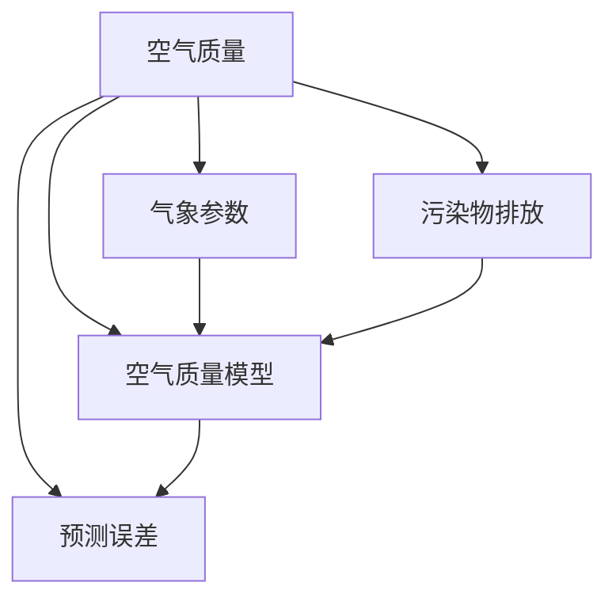

                 

### 1.5 核心概念与联系

在空气质量预测中，理解核心概念及其之间的关系对于深入掌握该领域至关重要。以下是几个关键概念及其相互关系的概述：

- **空气质量**：指大气中的污染物浓度，常用污染物包括颗粒物（PM2.5、PM10）、二氧化硫（SO2）、氮氧化物（NOx）等。空气质量直接影响人类健康和环境质量。
- **气象参数**：包括温度、湿度、风速、风向等。气象参数影响污染物的扩散和化学反应，是空气质量预测的重要输入。
- **污染物排放**：指各类污染源（如工业、交通、家庭等）排放的污染物总量。污染物排放量直接影响空气质量。
- **空气质量模型**：用于预测未来空气质量状况的数学模型，包括统计模型、机器学习模型、物理模型等。
- **预测误差**：指预测值与实际值之间的差异。预测误差是衡量空气质量预测模型性能的重要指标。

#### 关系架构 Mermaid 流程图

为了更清晰地展示这些概念之间的联系，我们可以使用Mermaid流程图来表示：



在这个流程图中，空气质量受到气象参数和污染物排放的影响，通过空气质量模型进行预测，并产生预测误差。这种关系体现了空气质量预测的复杂性和多因素互动性。

### 1.6 空气质量预测算法原理讲解

空气质量预测的算法可以分为传统方法、机器学习方法以及深度学习方法。以下将分别介绍这三种方法的原理和特点。

#### 1.6.1 传统预测方法

传统预测方法主要包括时间序列分析和统计回归分析。

- **时间序列分析**：
  - **原理**：时间序列分析基于时间序列数据，通过分析历史数据中的趋势、周期性、季节性等特征，预测未来的空气质量。
  - **模型**：常用的模型有自回归移动平均模型（ARMA）、自回归积分滑动平均模型（ARIMA）等。
  - **Python代码示例**：
    ```python
    from statsmodels.tsa.arima_model import ARIMA
    model = ARIMA(series, order=(1, 1, 1))
    model_fit = model.fit()
    forecast = model_fit.forecast(steps=5)
    ```
  - **数学模型**：
    $$X_t = c + \phi X_{t-1} + \theta L_t + \varepsilon_t$$
    其中，\(X_t\) 是时间序列，\(\phi\) 和 \(\theta\) 是模型参数，\(L_t\) 是滞后项，\(\varepsilon_t\) 是误差项。

- **统计回归分析**：
  - **原理**：统计回归分析通过建立空气质量与相关因素（如气象参数、污染物排放）之间的回归模型，预测空气质量。
  - **模型**：常用的模型有线性回归、多项式回归等。
  - **Python代码示例**：
    ```python
    from sklearn.linear_model import LinearRegression
    model = LinearRegression()
    model.fit(X, y)
    forecast = model.predict(X_future)
    ```
  - **数学模型**：
    $$y = \beta_0 + \beta_1x_1 + \beta_2x_2 + ... + \beta_nx_n + \varepsilon$$
    其中，\(y\) 是空气质量，\(x_1, x_2, ..., x_n\) 是相关因素，\(\beta_0, \beta_1, ..., \beta_n\) 是模型参数，\(\varepsilon\) 是误差项。

#### 1.6.2 机器学习预测方法

机器学习预测方法通过从大量历史数据中学习，自动发现数据中的模式和规律，从而进行空气质量预测。

- **监督学习模型**：
  - **原理**：监督学习模型利用标签数据，通过训练学习数据中的特征和标签之间的关系，进行预测。
  - **模型**：常用的模型有决策树、支持向量机（SVM）、随机森林等。
  - **Python代码示例**：
    ```python
    from sklearn.ensemble import RandomForestRegressor
    model = RandomForestRegressor()
    model.fit(X, y)
    forecast = model.predict(X_future)
    ```
  - **数学模型**：通常没有明确的数学公式，但可以通过树结构来表示。

- **无监督学习模型**：
  - **原理**：无监督学习模型不依赖标签数据，通过聚类、降维等方法，从数据中提取特征和模式。
  - **模型**：常用的模型有K-均值聚类、主成分分析（PCA）等。
  - **Python代码示例**：
    ```python
    from sklearn.cluster import KMeans
    model = KMeans(n_clusters=3)
    model.fit(X)
    centroids = model.cluster_centers_
    ```
  - **数学模型**：通常使用距离函数来度量数据的相似性。

#### 1.6.3 深度学习预测方法

深度学习预测方法通过多层神经网络，自动提取数据中的高阶特征，实现空气质量预测。

- **卷积神经网络（CNN）**：
  - **原理**：CNN 通过卷积操作和池化操作，提取数据中的局部特征和空间特征。
  - **模型**：常用的模型有LeNet、AlexNet等。
  - **Python代码示例**：
    ```python
    from tensorflow.keras.models import Sequential
    from tensorflow.keras.layers import Conv2D, MaxPooling2D, Flatten, Dense
    model = Sequential([
        Conv2D(filters=32, kernel_size=(3, 3), activation='relu', input_shape=(28, 28, 1)),
        MaxPooling2D(pool_size=(2, 2)),
        Flatten(),
        Dense(units=10, activation='softmax')
    ])
    model.compile(optimizer='adam', loss='categorical_crossentropy', metrics=['accuracy'])
    model.fit(X_train, y_train, epochs=10, batch_size=32)
    ```
  - **数学模型**：CNN 通过卷积操作和反向传播算法，实现特征提取和分类。

- **循环神经网络（RNN）**：
  - **原理**：RNN 通过记忆单元，处理序列数据，捕捉时间序列中的长期依赖关系。
  - **模型**：常用的模型有LSTM、GRU等。
  - **Python代码示例**：
    ```python
    from tensorflow.keras.models import Sequential
    from tensorflow.keras.layers import LSTM, Dense
    model = Sequential([
        LSTM(units=50, return_sequences=True, input_shape=(timesteps, features)),
        LSTM(units=50),
        Dense(units=1)
    ])
    model.compile(optimizer='adam', loss='mean_squared_error')
    model.fit(X_train, y_train, epochs=100, batch_size=32)
    ```
  - **数学模型**：RNN 通过递归关系，更新记忆单元的值，实现序列数据的处理。

### 1.7 小结

空气质量预测是一个涉及多学科、多层次的复杂问题。传统方法如时间序列分析和统计回归分析提供了基础，但机器学习和深度学习方法的引入，显著提升了预测的精度和效率。通过Python代码示例，我们详细讲解了这些方法的原理和应用。在下一章中，我们将进一步探讨空气质量数据收集与处理的方法，为建立更准确的空气质量预测模型奠定基础。

### 1.8 拓展阅读

- [时间序列分析入门](https://www.statisticshowto.com/time-series-analysis/)
- [线性回归与机器学习](https://machinelearningmastery.com/statistical-models-for-regression/)
- [深度学习与空气质量预测](https://towardsdatascience.com/air-quality-prediction-with-deep-learning-2a0ad3c506ca)
- [卷积神经网络与图像识别](https://www.deeplearningbook.org/chapter convolutional-networks/)
- [循环神经网络与序列建模](https://www.deeplearningbook.org/chapter rnns/)

