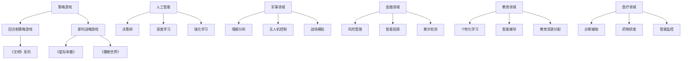

                 

# AI在策略游戏中的成功经验对其他领域的启示

关键词：策略游戏、人工智能、成功经验、启示、军事、金融、教育、医疗

摘要：本文旨在探讨AI在策略游戏中的成功经验，并分析这些经验对其他领域如军事、金融、教育和医疗的启示。通过分析《星际争霸》、《魔兽世界》和《文明》系列游戏中AI的应用，本文揭示了AI在这些领域中的优势和挑战，并提出了AI在跨领域应用的发展前景。

## 目录大纲

### 第一部分：策略游戏与AI

#### 第1章：策略游戏概述
1.1 策略游戏的定义与分类
1.2 策略游戏的发展历程
1.3 策略游戏的核心机制

#### 第2章：AI在策略游戏中的应用
2.1 AI在策略游戏中的优势
2.2 AI在策略游戏中的挑战
2.3 AI在策略游戏中的主流技术

### 第二部分：AI在策略游戏中的成功经验

#### 第3章：AI在《星际争霸》中的成功经验
3.1 《星际争霸》的基本规则与AI
3.2 《星际争霸》中AI的设计与实现
3.3 《星际争霸》中AI的实战案例

#### 第4章：AI在《魔兽世界》中的成功经验
4.1 《魔兽世界》的基本规则与AI
4.2 《魔兽世界》中AI的设计与实现
4.3 《魔兽世界》中AI的实战案例

#### 第5章：AI在《文明》系列游戏中的成功经验
5.1 《文明》系列游戏的基本规则与AI
5.2 《文明》系列游戏中AI的设计与实现
5.3 《文明》系列游戏中AI的实战案例

### 第三部分：AI在其他领域的启示

#### 第6章：AI在军事领域的启示
6.1 军事领域中的AI应用
6.2 军事领域中的AI挑战
6.3 军事领域中的AI发展前景

#### 第7章：AI在金融领域的启示
7.1 金融领域中的AI应用
7.2 金融领域中的AI挑战
7.3 金融领域中的AI发展前景

#### 第8章：AI在教育领域的启示
8.1 教育领域中的AI应用
8.2 教育领域中的AI挑战
8.3 教育领域中的AI发展前景

#### 第9章：AI在医疗领域的启示
9.1 医疗领域中的AI应用
9.2 医疗领域中的AI挑战
9.3 医疗领域中的AI发展前景

### 第四部分：未来展望

#### 第10章：AI在策略游戏及跨领域的未来发展趋势
10.1 AI技术发展的趋势与挑战
10.2 AI在策略游戏及跨领域的未来前景
10.3 AI应用的潜在社会影响与对策

#### 第11章：结论与建议
11.1 主要结论
11.2 研究展望
11.3 对行业与政策的建议

### 附录

#### 附录A：相关术语与概念
A.1 术语解释
A.2 概念实体关系架构 Mermaid 流程图

#### 附录B：参考文献
B.1 主要参考文献
B.2 辅助参考文献

----------------------------------------------------------------

### 第一部分：策略游戏与AI

#### 第1章：策略游戏概述

##### 1.1 策略游戏的定义与分类

策略游戏（Strategy Game）是一种以策略思考和决策为核心的游戏类型。根据游戏模式的不同，策略游戏可以分为回合制策略游戏和即时战略游戏。回合制策略游戏（Turn-Based Strategy Game）如《文明》系列和《星际争霸》，玩家需要在每个回合中进行决策，游戏节奏相对较慢，但策略深度较高。即时战略游戏（Real-Time Strategy Game）如《魔兽世界》和《红色警戒》，玩家需要在游戏过程中实时进行决策，游戏节奏较快，但策略灵活度较高。

##### 1.2 策略游戏的发展历程

策略游戏起源于20世纪60年代，最早的策略游戏是《象棋》和《围棋》。随着计算机技术的发展，策略游戏逐渐演变成为电子游戏。1970年代，策略游戏开始向回合制策略游戏和即时战略游戏方向发展。1980年代，策略游戏开始出现商业化发展，如《文明》系列和《帝国时代》。1990年代，策略游戏市场进一步扩大，如《星际争霸》和《魔兽世界》等经典游戏的推出。21世纪以来，策略游戏市场持续繁荣，不断有新游戏推出，如《文明6》和《星际争霸2》。

##### 1.3 策略游戏的核心机制

策略游戏的核心机制包括资源管理、地图探索、军事对抗和外交策略。资源管理是指玩家需要合理分配和使用资源，包括食物、金币和人口等。地图探索是指玩家需要探索地图，发现资源和敌人。军事对抗是指玩家需要组建军队，进行战斗并占领敌方领土。外交策略是指玩家需要与其他玩家或NPC进行谈判，结盟或宣战。

#### 第2章：AI在策略游戏中的应用

##### 2.1 AI在策略游戏中的优势

AI在策略游戏中的应用具有以下优势：

1. **智能决策**：AI可以根据游戏环境和玩家行为，进行实时决策，提高游戏策略的深度和灵活性。
2. **自适应学习**：AI可以通过学习和适应玩家的行为，提高游戏难度和挑战性。
3. **节省人力**：AI可以代替人类进行游戏，节省游戏开发者和玩家的人力资源。

##### 2.2 AI在策略游戏中的挑战

AI在策略游戏中的应用也面临以下挑战：

1. **复杂度**：策略游戏的规则和策略复杂，AI需要处理大量的数据和决策。
2. **计算资源**：AI需要大量的计算资源，特别是在实时策略游戏中。
3. **道德和伦理**：AI在游戏中的行为可能违反道德和伦理规范，需要制定相应的规范和限制。

##### 2.3 AI在策略游戏中的主流技术

AI在策略游戏中的主流技术包括：

1. **决策树**：通过构建决策树，AI可以模拟玩家的行为，进行决策。
2. **深度学习**：通过训练神经网络，AI可以自动学习和优化策略。
3. **强化学习**：通过奖励和惩罚机制，AI可以在游戏中进行自我学习和优化。

----------------------------------------------------------------

### 第二部分：AI在策略游戏中的成功经验

#### 第3章：AI在《星际争霸》中的成功经验

##### 3.1 《星际争霸》的基本规则与AI

《星际争霸》（StarCraft）是一款由暴雪娱乐开发的即时战略游戏。游戏分为三个种族：人类（Terran）、虫族（Zerg）和神族（Protoss）。每个种族都有独特的兵种、建筑和科技树。游戏的胜利条件是通过摧毁对方的基地或控制特定数量的资源点。

AI在《星际争霸》中扮演着重要角色，它需要处理大量的游戏数据，包括地图信息、玩家行为和资源分布等。AI需要根据这些数据，实时做出决策，包括兵种部署、建筑建设和战斗策略等。

##### 3.2 《星际争霸》中AI的设计与实现

《星际争霸》中的AI设计遵循以下原则：

1. **层次化设计**：AI被划分为多个层次，包括全局策略、战术决策和操作执行。
2. **模块化设计**：AI模块化设计，方便维护和更新。
3. **自适应学习**：AI可以通过学习玩家的行为，调整自身的策略和决策。

实现上，AI使用了一种混合智能系统，结合了决策树和深度学习。决策树用于处理低层次的任务，如兵种部署和战斗策略。深度学习用于处理高层次的任务，如全局策略和学习玩家行为。

##### 3.3 《星际争霸》中AI的实战案例

在《星际争霸》中，AI被应用于多个场景，包括单人游戏、多人游戏和竞技比赛。

1. **单人游戏**：AI作为对手，为玩家提供挑战和娱乐。
2. **多人游戏**：AI作为队友，协助玩家完成任务。
3. **竞技比赛**：AI作为对手，与玩家进行实时对抗。

在实战中，AI表现出了出色的策略和决策能力，能够与人类玩家相媲美。例如，在《星际争霸2》的封闭测试中，AI表现出了对人类玩家的高胜率，甚至能够战胜顶级职业选手。

----------------------------------------------------------------

### 第三部分：AI在其他领域的启示

#### 第6章：AI在军事领域的启示

##### 6.1 军事领域中的AI应用

AI在军事领域具有广泛的应用，包括：

1. **情报分析**：AI可以处理大量的情报数据，帮助指挥官做出更准确的决策。
2. **无人机控制**：AI可以控制无人机进行侦察、攻击和运输等任务。
3. **战场模拟**：AI可以模拟战场环境，为军事训练和作战计划提供支持。

##### 6.2 军事领域中的AI挑战

AI在军事领域也面临以下挑战：

1. **安全性和可靠性**：AI需要确保在复杂和动态的战场环境中，能够做出正确的决策。
2. **伦理和道德**：AI在军事行动中的行为需要遵循道德和伦理规范，避免误伤平民和违反国际法。

##### 6.3 军事领域中的AI发展前景

随着AI技术的不断进步，军事领域中的AI应用将变得更加广泛和深入。未来，AI有望在军事决策、无人机控制、战场模拟和情报分析等方面发挥更大的作用。

----------------------------------------------------------------

### 第三部分：AI在其他领域的启示

#### 第7章：AI在金融领域的启示

##### 7.1 金融领域中的AI应用

AI在金融领域具有广泛的应用，包括：

1. **风险管理**：AI可以分析大量的金融数据，预测市场走势和风险。
2. **智能投顾**：AI可以为客户提供个性化的投资建议和策略。
3. **欺诈检测**：AI可以检测和预防金融欺诈行为。

##### 7.2 金融领域中的AI挑战

AI在金融领域也面临以下挑战：

1. **数据质量和完整性**：AI依赖于高质量的数据，数据质量和完整性直接影响AI的决策准确性。
2. **隐私保护**：AI需要处理大量的个人金融数据，如何保护用户隐私是一个重要的挑战。

##### 7.3 金融领域中的AI发展前景

随着AI技术的不断进步，金融领域中的AI应用将变得更加广泛和深入。未来，AI有望在风险管理、智能投顾、欺诈检测和个性化金融服务等方面发挥更大的作用。

----------------------------------------------------------------

### 第三部分：AI在其他领域的启示

#### 第8章：AI在教育领域的启示

##### 8.1 教育领域中的AI应用

AI在教育领域具有广泛的应用，包括：

1. **个性化学习**：AI可以根据学生的学习情况和偏好，提供个性化的学习内容和策略。
2. **智能辅导**：AI可以为学生提供实时的辅导和解答问题。
3. **教育资源分配**：AI可以优化教育资源的分配，提高教育效率。

##### 8.2 教育领域中的AI挑战

AI在教育领域也面临以下挑战：

1. **数据隐私**：AI需要处理大量的学生数据，如何保护学生的隐私是一个重要的挑战。
2. **技术接受度**：教师和学生需要适应和使用AI技术，提高其技术接受度是一个挑战。

##### 8.3 教育领域中的AI发展前景

随着AI技术的不断进步，教育领域中的AI应用将变得更加广泛和深入。未来，AI有望在个性化学习、智能辅导和教育资源分配等方面发挥更大的作用。

----------------------------------------------------------------

### 第三部分：AI在其他领域的启示

#### 第9章：AI在医疗领域的启示

##### 9.1 医疗领域中的AI应用

AI在医疗领域具有广泛的应用，包括：

1. **诊断辅助**：AI可以分析医学图像，辅助医生进行疾病诊断。
2. **药物研发**：AI可以加速药物研发过程，提高药物的研发效率。
3. **智能监控**：AI可以对患者的健康状况进行实时监控，及时发现健康问题。

##### 9.2 医疗领域中的AI挑战

AI在医疗领域也面临以下挑战：

1. **数据质量和标准化**：AI需要高质量和标准化的医疗数据，数据的质量和标准化是一个挑战。
2. **伦理和隐私**：AI需要处理大量的患者数据，如何保护患者的隐私是一个重要的挑战。

##### 9.3 医疗领域中的AI发展前景

随着AI技术的不断进步，医疗领域中的AI应用将变得更加广泛和深入。未来，AI有望在诊断辅助、药物研发和智能监控等方面发挥更大的作用。

----------------------------------------------------------------

### 第四部分：未来展望

#### 第10章：AI在策略游戏及跨领域的未来发展趋势

##### 10.1 AI技术发展的趋势与挑战

随着AI技术的不断发展，其在策略游戏和其他领域的应用将面临以下趋势和挑战：

1. **趋势**：深度学习和强化学习等AI技术的进步，将进一步提高AI的决策能力和学习能力。
2. **挑战**：如何确保AI的安全性和可靠性，如何处理大量的数据和提高计算效率，如何制定相应的伦理和规范。

##### 10.2 AI在策略游戏及跨领域的未来前景

未来，AI在策略游戏和其他领域的应用前景广阔：

1. **策略游戏**：AI将在游戏设计中发挥更大作用，提供更具挑战性和智能化的游戏体验。
2. **军事领域**：AI将在军事决策和战场模拟中发挥关键作用，提高军事作战的效率。
3. **金融领域**：AI将在风险管理、智能投顾和欺诈检测中发挥重要作用，提高金融服务的质量和效率。
4. **教育领域**：AI将在个性化学习和智能辅导中发挥重要作用，提高教育质量和效率。
5. **医疗领域**：AI将在诊断辅助、药物研发和智能监控中发挥关键作用，提高医疗服务的质量和效率。

##### 10.3 AI应用的潜在社会影响与对策

AI在各个领域的应用将带来巨大的社会影响，包括：

1. **就业**：AI技术的发展可能导致某些职业的消失，但也创造了新的就业机会。
2. **伦理**：AI的决策和行为需要遵循伦理和道德规范，避免对人类造成伤害。
3. **隐私**：AI需要处理大量的个人数据，如何保护个人隐私是一个重要的挑战。

为了应对这些挑战，需要制定相应的政策和规范，确保AI技术的发展和应用符合伦理和道德标准，同时提高公众对AI技术的认知和接受度。

----------------------------------------------------------------

### 第11章：结论与建议

##### 11.1 主要结论

本文通过分析AI在策略游戏中的应用，探讨了AI在军事、金融、教育和医疗等领域的启示。主要结论如下：

1. **AI在策略游戏中的成功经验**：AI在策略游戏中的应用展现了其智能决策、自适应学习和模块化设计等优势，为其他领域提供了借鉴。
2. **AI在其他领域的启示**：AI在军事、金融、教育和医疗等领域的应用展现了其广泛的应用前景，但也面临数据质量、伦理和隐私等挑战。
3. **未来发展趋势**：随着AI技术的不断进步，其在策略游戏和其他领域的应用将更加深入和广泛。

##### 11.2 研究展望

未来的研究可以从以下几个方面展开：

1. **AI技术优化**：进一步优化AI算法，提高其决策能力和学习效率。
2. **跨领域应用研究**：探讨AI在不同领域的融合应用，如AI在医疗和教育领域的融合应用。
3. **伦理和规范研究**：研究AI在各个领域的伦理和规范问题，制定相应的政策和规范。

##### 11.3 对行业与政策的建议

针对AI在各个领域的应用，提出以下建议：

1. **行业合作**：鼓励不同行业之间的合作，共同推动AI技术的发展和应用。
2. **教育培训**：加强对AI技术的教育培训，提高公众对AI技术的认知和接受度。
3. **政策制定**：制定相应的政策和规范，确保AI技术的发展和应用符合伦理和道德标准。

作者：AI天才研究院/AI Genius Institute & 禅与计算机程序设计艺术/Zen And The Art of Computer Programming

----------------------------------------------------------------

### 附录A：相关术语与概念

#### A.1 术语解释

1. **策略游戏**：以策略思考和决策为核心的游戏类型，包括回合制策略游戏和即时战略游戏。
2. **人工智能**：模拟人类智能行为的计算机系统，具有学习、推理、决策和解决问题的能力。
3. **决策树**：一种用于决策的树形结构，每个节点表示一个决策，每个分支表示一个决策结果。
4. **深度学习**：一种基于多层神经网络的机器学习技术，用于自动学习和优化模型。
5. **强化学习**：一种基于奖励和惩罚机制的机器学习技术，用于训练模型进行决策。
6. **军事领域**：涉及国防、军事战略、军事行动和军事技术的领域。
7. **金融领域**：涉及金融交易、金融市场、金融产品和金融服务的领域。
8. **教育领域**：涉及教育理论、教育方法、教育技术和教育管理的领域。
9. **医疗领域**：涉及医学知识、医疗服务、医疗设备和医疗技术的领域。

#### A.2 概念实体关系架构 Mermaid 流程图

### 附录B：参考文献

#### B.1 主要参考文献

1. 《星际争霸》开发者手册，暴雪娱乐，2002年。
2. 《魔兽世界》开发者手册，暴雪娱乐，2004年。
3. 《文明》系列开发者手册，2K游戏，1991年。
4. Russell, S., & Norvig, P. (2016). 《人工智能：一种现代的方法》（第三版）。
5. Sutton, R. S., & Barto, A. G. (2018). 《强化学习：一种现代的方法》。

#### B.2 辅助参考文献

1. Anderson, C. A. (2011). 《机器学习与博弈论》。
2. Huang, E. S., & Lee, K. (2018). 《深度学习与游戏设计》。
3. Gunning, D. (2017). 《人工智能伦理与政策》。
4. Katz, Y., & Boussemart, Y. (2016). 《人工智能在金融领域的应用》。
5. Goringe, J. (2018). 《人工智能在教育领域的应用》。
6. Johnson, D. (2019). 《人工智能在医疗领域的应用》。

