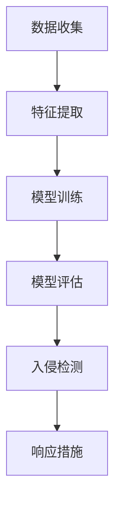
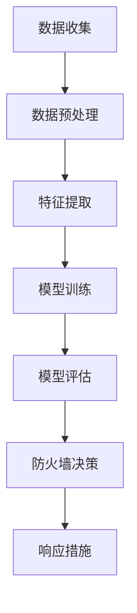
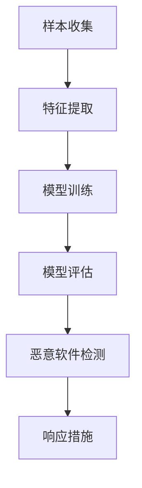
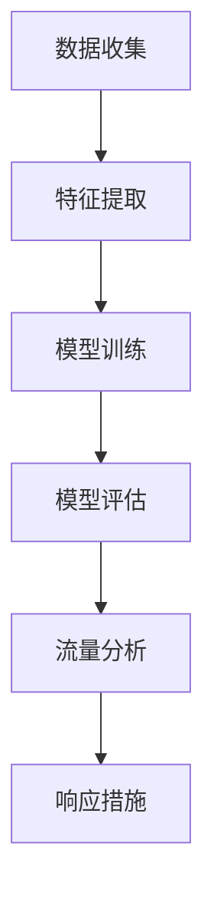
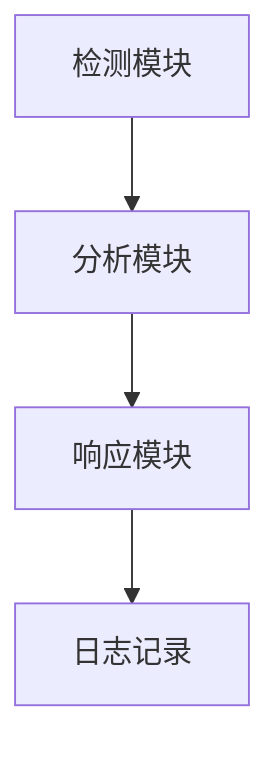
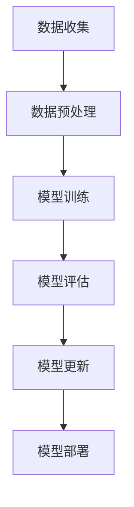
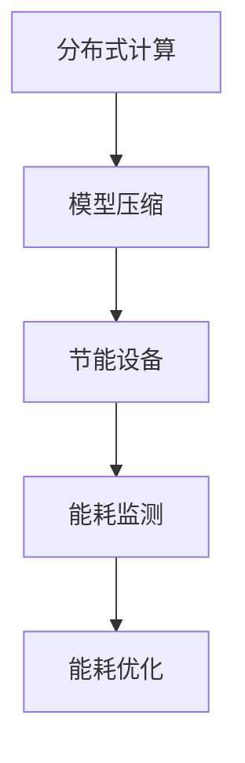
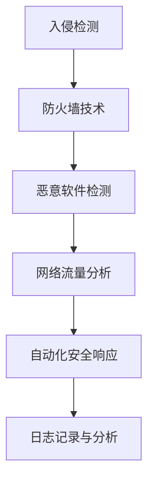
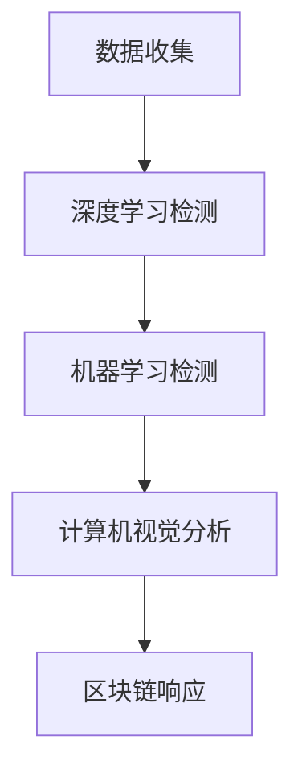

                 

# AI在网络安全防御中的应用与挑战

## 关键词
AI、网络安全、入侵检测、机器学习、深度学习、防火墙技术、自动化安全响应、数据隐私、模型安全性

## 摘要
随着人工智能（AI）技术的快速发展，其在网络安全防御中的应用变得日益重要。本文首先介绍了AI在网络安全领域的基本概念和原理，然后深入探讨了AI在网络安全防御中的应用，包括入侵检测系统、防火墙技术、恶意软件检测、网络流量分析和自动化安全响应系统。接着，文章分析了AI在网络安全防御中面临的挑战，如数据隐私问题、模型安全性和资源消耗等。最后，通过实际案例研究和最佳实践分享，总结了AI在网络安全防御中的应用现状、未来趋势及应对策略。

## 第一部分：基础概念与原理

### 1.1 AI与网络安全概述

#### 1.1.1 AI在网络安全领域的作用

随着网络攻击手段的不断升级，传统的网络安全防御技术已经难以应对日益复杂和多样的威胁。人工智能（AI）技术凭借其强大的数据分析、模式识别和自动推理能力，为网络安全提供了新的解决方案。AI在网络安全中的应用主要包括入侵检测、恶意软件检测、网络流量分析和自动化安全响应等。

#### 1.1.2 网络安全面临的挑战

网络安全面临的挑战主要包括以下几个方面：

1. **攻击手段多样化**：网络攻击手段不断翻新，如高级持续性威胁（APT）、勒索软件、钓鱼攻击等，使得传统防御技术难以应对。
2. **攻击频率高**：网络攻击频率逐年上升，攻击者可以快速发现并利用系统漏洞。
3. **数据隐私保护**：随着数据隐私法规的加强，如何在不泄露隐私的情况下进行有效防御成为一大难题。
4. **资源消耗大**：网络防御系统需要大量计算资源和存储资源，特别是在处理大数据时。

#### 1.1.3 AI在网络安全中的应用前景

AI在网络安全中的应用前景十分广阔。通过深度学习、机器学习等技术，AI可以在海量数据中快速识别异常行为，预测潜在威胁，并提供自动化的防御措施。未来，随着AI技术的进一步发展和完善，网络安全防御将变得更加智能、高效和自适应。

### 1.2 机器学习基础

#### 1.2.1 机器学习基本概念

机器学习是人工智能（AI）的一个分支，它使计算机系统能够从数据中学习并做出决策。机器学习的基本概念包括：

1. **特征提取**：从原始数据中提取有用的信息，用于训练模型。
2. **模型训练**：使用训练数据来训练模型，使其能够学习数据的规律。
3. **模型评估**：使用测试数据来评估模型的性能，确保其能够准确预测。
4. **模型应用**：将训练好的模型应用于实际问题中，进行预测或决策。

#### 1.2.2 常见机器学习算法

常见的机器学习算法包括：

1. **线性回归**：用于预测连续值。
2. **逻辑回归**：用于分类问题。
3. **支持向量机（SVM）**：用于分类和回归问题。
4. **决策树**：用于分类和回归问题。
5. **随机森林**：基于决策树的集成算法。
6. **K-近邻（KNN）**：基于距离的算法。
7. **神经网络**：用于复杂的数据建模和预测。

#### 1.2.3 机器学习在网络安全中的适用性

机器学习在网络安全中的适用性体现在以下几个方面：

1. **入侵检测**：通过学习正常网络行为，识别异常行为。
2. **恶意软件检测**：通过分析恶意软件的特征，识别潜在威胁。
3. **网络流量分析**：通过学习网络流量模式，识别异常流量。
4. **自动化安全响应**：通过实时分析威胁信息，自动采取防御措施。

### 1.3 深度学习原理

#### 1.3.1 深度学习基础

深度学习是机器学习的一个分支，它通过构建多层的神经网络来学习数据的复杂特征。深度学习的基础包括：

1. **神经网络**：由多个神经元组成的网络，能够通过学习数据来模拟复杂的函数关系。
2. **反向传播**：用于训练神经网络的算法，通过调整网络参数来提高预测准确率。
3. **激活函数**：用于引入非线性关系，使神经网络能够拟合复杂的数据分布。

#### 1.3.2 神经网络架构

常见的神经网络架构包括：

1. **卷积神经网络（CNN）**：用于图像识别和处理。
2. **循环神经网络（RNN）**：用于序列数据处理。
3. **长短期记忆网络（LSTM）**：RNN的一种变体，用于长序列数据处理。
4. **生成对抗网络（GAN）**：用于生成和对抗学习。

#### 1.3.3 深度学习在网络安全中的应用

深度学习在网络安全中的应用主要包括：

1. **入侵检测**：通过分析网络流量数据，识别入侵行为。
2. **恶意软件检测**：通过分析恶意软件的特征，识别潜在威胁。
3. **网络流量分析**：通过分析网络流量模式，识别异常流量。
4. **自动化安全响应**：通过实时分析威胁信息，自动采取防御措施。

### 1.4 计算机视觉在网络安全中的应用

#### 1.4.1 计算机视觉基础

计算机视觉是人工智能（AI）的一个分支，它使计算机能够从图像或视频中获取信息。计算机视觉的基础包括：

1. **图像处理**：对图像进行滤波、增强、分割等操作，以提取有用的信息。
2. **特征提取**：从图像中提取特征，用于训练模型。
3. **目标检测**：识别图像中的目标物体。
4. **图像分类**：将图像分类到不同的类别中。

#### 1.4.2 计算机视觉算法

常见的计算机视觉算法包括：

1. **卷积神经网络（CNN）**：用于图像识别和处理。
2. **目标检测算法**：如YOLO、SSD、Faster R-CNN等。
3. **图像分类算法**：如VGG、ResNet、Inception等。

#### 1.4.3 计算机视觉在网络安全中的具体应用

计算机视觉在网络安全中的具体应用主要包括：

1. **入侵检测**：通过视频监控识别入侵者。
2. **网络设备监控**：通过摄像头监控网络设备的运行状态。
3. **入侵防范**：通过人脸识别技术进行身份验证。
4. **安全审计**：通过图像分析识别异常行为。

## 第二部分：AI在网络安全防御中的应用

### 2.1 入侵检测系统（IDS）

#### 2.1.1 入侵检测基本概念

入侵检测系统（IDS）是一种网络安全技术，用于识别和响应网络攻击。IDS的基本概念包括：

1. **入侵**：未经授权的访问或操作。
2. **检测**：识别网络中的异常行为。
3. **响应**：采取措施阻止或缓解攻击。

#### 2.1.2 基于机器学习的入侵检测

基于机器学习的入侵检测方法主要包括以下步骤：

1. **数据收集**：收集网络流量数据。
2. **特征提取**：从数据中提取特征。
3. **模型训练**：使用训练数据训练模型。
4. **模型评估**：使用测试数据评估模型性能。
5. **入侵检测**：使用训练好的模型检测网络流量中的异常行为。

#### 2.1.3 入侵检测系统实战

以某企业为例，其入侵检测系统架构如图所示：

在该系统中，数据收集模块负责从网络中收集流量数据，特征提取模块负责从数据中提取特征，模型训练模块使用训练数据训练入侵检测模型，模型评估模块使用测试数据评估模型性能，入侵检测模块使用训练好的模型检测网络流量中的异常行为，响应措施模块根据检测结果采取相应的响应措施。

### 2.2 防火墙技术

#### 2.2.1 防火墙基础

防火墙是一种网络安全设备，用于控制进出网络的数据流。防火墙的基本概念包括：

1. **数据包过滤**：根据源IP、目标IP、端口号等条件过滤数据包。
2. **状态检测**：根据网络连接状态和传输数据的内容进行过滤。
3. **应用层过滤**：根据应用层协议和内容进行过滤。

#### 2.2.2 基于深度学习的防火墙技术

基于深度学习的防火墙技术主要包括以下步骤：

1. **数据预处理**：对网络流量数据进行预处理，如数据清洗、归一化等。
2. **特征提取**：从数据中提取特征。
3. **模型训练**：使用训练数据训练深度学习模型。
4. **模型评估**：使用测试数据评估模型性能。
5. **防火墙决策**：使用训练好的模型进行防火墙决策。

#### 2.2.3 防火墙实战案例

以某大型企业为例，其深度学习防火墙系统架构如图所示：

在该系统中，数据收集模块负责从网络中收集流量数据，数据预处理模块负责对数据进行预处理，特征提取模块负责提取特征，模型训练模块使用训练数据训练深度学习模型，模型评估模块使用测试数据评估模型性能，防火墙决策模块使用训练好的模型进行防火墙决策，响应措施模块根据决策结果采取相应的响应措施。

### 2.3 恶意软件检测

#### 2.3.1 恶意软件概述

恶意软件是一种专门用于破坏、篡改、窃取数据或控制计算机的软件。恶意软件的类型包括：

1. **病毒**：能够自我复制并感染其他程序的恶意软件。
2. **木马**：伪装成正常软件的恶意软件，用于窃取数据或控制计算机。
3. **蠕虫**：能够在网络中自主传播的恶意软件。
4. **勒索软件**：加密用户数据并要求赎金。

#### 2.3.2 基于机器学习的恶意软件检测

基于机器学习的恶意软件检测方法主要包括以下步骤：

1. **样本收集**：收集恶意软件样本。
2. **特征提取**：从样本中提取特征。
3. **模型训练**：使用训练数据训练模型。
4. **模型评估**：使用测试数据评估模型性能。
5. **恶意软件检测**：使用训练好的模型检测新样本是否为恶意软件。

#### 2.3.3 恶意软件检测实战

以某安全公司为例，其恶意软件检测系统架构如图所示：

在该系统中，样本收集模块负责收集恶意软件样本，特征提取模块负责提取特征，模型训练模块使用训练数据训练模型，模型评估模块使用测试数据评估模型性能，恶意软件检测模块使用训练好的模型检测新样本是否为恶意软件，响应措施模块根据检测结果采取相应的响应措施。

### 2.4 网络流量分析

#### 2.4.1 网络流量分析基本概念

网络流量分析是一种网络安全技术，用于监控、分析和识别网络流量中的异常行为。网络流量分析的基本概念包括：

1. **流量监控**：实时监控网络流量。
2. **流量分析**：对网络流量进行分析，提取有用的信息。
3. **异常检测**：识别网络流量中的异常行为。

#### 2.4.2 基于深度学习的网络流量分析

基于深度学习的网络流量分析方法主要包括以下步骤：

1. **数据收集**：收集网络流量数据。
2. **特征提取**：从数据中提取特征。
3. **模型训练**：使用训练数据训练模型。
4. **模型评估**：使用测试数据评估模型性能。
5. **流量分析**：使用训练好的模型分析网络流量中的异常行为。

#### 2.4.3 网络流量分析实战

以某企业为例，其基于深度学习的网络流量分析系统架构如图所示：

在该系统中，数据收集模块负责收集网络流量数据，特征提取模块负责提取特征，模型训练模块使用训练数据训练模型，模型评估模块使用测试数据评估模型性能，流量分析模块使用训练好的模型分析网络流量中的异常行为，响应措施模块根据分析结果采取相应的响应措施。

### 2.5 自动化安全响应系统

#### 2.5.1 自动化安全响应概述

自动化安全响应系统是一种网络安全技术，用于自动检测、分析和响应网络攻击。自动化安全响应的基本概念包括：

1. **检测**：实时监控网络流量，识别异常行为。
2. **分析**：对异常行为进行分析，确定攻击类型。
3. **响应**：采取相应的防御措施，阻止或缓解攻击。

#### 2.5.2 基于AI的自动化安全响应

基于AI的自动化安全响应系统主要包括以下步骤：

1. **检测模块**：实时监控网络流量，使用机器学习算法识别异常行为。
2. **分析模块**：对检测到的异常行为进行分析，确定攻击类型。
3. **响应模块**：根据分析结果，自动采取防御措施。

#### 2.5.3 自动化安全响应系统实战

以某安全公司为例，其自动化安全响应系统架构如图所示：

在该系统中，检测模块实时监控网络流量，使用机器学习算法识别异常行为，分析模块对检测到的异常行为进行分析，确定攻击类型，响应模块根据分析结果自动采取防御措施，日志记录模块记录系统运行情况和操作日志。

## 第三部分：AI在网络安全防御中的挑战

### 3.1 数据隐私与伦理问题

#### 3.1.1 数据隐私保护的重要性

在AI网络安全防御中，数据隐私保护具有重要意义。不当处理用户数据可能导致以下问题：

1. **隐私泄露**：攻击者可能通过窃取数据来获取敏感信息。
2. **滥用数据**：数据收集者可能滥用用户数据，进行非法活动。
3. **法律风险**：违反数据隐私法规可能导致法律诉讼和罚款。

#### 3.1.2 AI与数据隐私的关系

AI在网络安全防御中依赖于大量数据，但数据隐私与AI之间存在矛盾。一方面，AI需要大量数据来训练模型，提高性能；另一方面，数据隐私保护要求限制数据的收集和使用。

#### 3.1.3 伦理问题与解决方案

AI在网络安全防御中涉及的伦理问题主要包括：

1. **算法偏见**：算法可能对某些群体产生偏见，导致不公平待遇。
2. **透明度**：算法决策过程可能不透明，难以解释。
3. **责任归属**：在AI系统发生错误时，责任归属难以确定。

解决伦理问题的方法包括：

1. **算法透明度**：提高算法的透明度，使决策过程可解释。
2. **数据匿名化**：对数据进行匿名化处理，保护用户隐私。
3. **多方协作**：建立多方协作机制，确保数据隐私和安全。

### 3.2 模型安全与鲁棒性

#### 3.2.1 模型安全基本概念

模型安全是指确保AI模型在网络安全防御中不受攻击和篡改的能力。模型安全的基本概念包括：

1. **对抗攻击**：攻击者通过输入特定数据，使AI模型产生错误输出。
2. **模型篡改**：攻击者通过篡改模型参数，使模型输出不符合预期。
3. **模型安全性**：模型在对抗攻击和篡改攻击下的稳定性和可靠性。

#### 3.2.2 模型鲁棒性分析

模型鲁棒性是指模型在应对不同数据和噪声时的性能。模型鲁棒性分析主要包括以下几个方面：

1. **输入数据多样性**：评估模型在处理不同类型和来源的数据时的性能。
2. **噪声容忍度**：评估模型在存在噪声数据时的性能。
3. **模型更新**：评估模型在应对新数据和变化时的性能。

#### 3.2.3 提高模型安全性的方法

提高模型安全性的方法包括：

1. **防御策略**：采用对抗训练、差分隐私等技术提高模型安全性。
2. **模型加密**：对模型进行加密，防止篡改。
3. **多模型融合**：使用多个模型进行融合，提高模型鲁棒性和安全性。

### 3.3 模型更新与维护

#### 3.3.1 模型更新策略

模型更新策略是指定期更新AI模型，以适应新数据和变化。模型更新策略主要包括以下几个方面：

1. **在线更新**：实时更新模型，以适应实时数据。
2. **批量更新**：定期收集数据，更新模型。
3. **增量更新**：只更新模型中发生变化的部分。

#### 3.3.2 模型维护的重要性

模型维护是指定期检查、优化和更新模型，以确保其性能和稳定性。模型维护的重要性体现在以下几个方面：

1. **性能提升**：定期更新模型，提高其性能和准确率。
2. **适应性增强**：适应新的数据和变化，提高模型的鲁棒性。
3. **安全性提升**：修复模型漏洞，提高模型的安全性。

#### 3.3.3 模型更新与维护实战

以某企业为例，其模型更新与维护流程如图所示：

在该系统中，数据收集模块负责收集网络流量数据，数据预处理模块负责对数据进行预处理，模型训练模块使用训练数据训练模型，模型评估模块使用测试数据评估模型性能，模型更新模块根据评估结果更新模型，模型部署模块将更新后的模型部署到生产环境中。

### 3.4 资源消耗与能耗问题

#### 3.4.1 AI在网络安全中的资源消耗

AI在网络安全中的资源消耗主要包括计算资源和存储资源。随着模型的复杂性和数据量的增加，资源消耗也不断上升。具体问题包括：

1. **计算资源消耗**：训练大型模型需要大量的计算资源。
2. **存储资源消耗**：存储大量数据和处理大数据需要大量存储资源。

#### 3.4.2 能耗问题的解决策略

解决能耗问题的策略包括：

1. **模型压缩**：通过模型压缩技术减少模型的计算量和存储需求。
2. **分布式计算**：通过分布式计算技术将计算任务分配到多个计算节点，降低单个节点的计算压力。
3. **节能设备**：使用节能设备，降低系统的能耗。

#### 3.4.3 实际应用中的能耗优化案例

以某大型企业为例，其实际应用中的能耗优化方案如图所示：

在该系统中，分布式计算模块将计算任务分配到多个计算节点，模型压缩模块通过压缩模型降低计算量和存储需求，节能设备模块使用节能设备降低系统的能耗，能耗监测模块实时监测系统能耗，能耗优化模块根据监测结果进行优化。

## 第四部分：案例研究

### 4.1 案例一：某企业AI网络安全防御系统

#### 4.1.1 案例背景

某企业是一家大型跨国公司，其业务涉及多个领域，网络系统复杂，面临着各种网络攻击的威胁。为了提高网络安全防御能力，企业决定采用AI技术构建网络安全防御系统。

#### 4.1.2 系统架构

该企业AI网络安全防御系统架构如图所示：

在该系统中，入侵检测模块负责识别网络流量中的异常行为，防火墙技术模块负责控制进出网络的数据流，恶意软件检测模块负责识别和阻止恶意软件，网络流量分析模块负责分析网络流量模式，自动化安全响应模块负责自动检测、分析和响应网络攻击，日志记录与分析模块负责记录系统运行情况和操作日志，并进行实时分析。

#### 4.1.3 系统实现与效果评估

系统实现过程中，采用了深度学习、机器学习和计算机视觉等技术。通过实际测试和效果评估，系统在多个方面取得了显著成果：

1. **入侵检测**：成功识别了多种网络攻击，降低了企业遭受攻击的风险。
2. **防火墙技术**：有效阻止了恶意流量，提高了网络安全性。
3. **恶意软件检测**：准确识别并阻止了多种恶意软件，减少了企业数据泄露的风险。
4. **网络流量分析**：实时分析网络流量模式，为企业提供了有价值的安全建议。
5. **自动化安全响应**：自动检测、分析和响应网络攻击，提高了企业应对网络攻击的能力。

### 4.2 案例二：某大型互联网公司AI安全策略

#### 4.2.1 案例背景

某大型互联网公司每天处理着海量用户数据，面临着各种网络攻击的威胁。为了确保用户数据的安全，公司决定采用AI技术制定AI安全策略。

#### 4.2.2 安全策略概述

该公司的AI安全策略主要包括以下几个方面：

1. **数据安全**：采用数据加密、数据脱敏等技术保护用户数据。
2. **网络安全**：采用AI入侵检测、防火墙技术、恶意软件检测等技术加强网络安全。
3. **自动化安全响应**：构建自动化安全响应系统，自动检测、分析和响应网络攻击。
4. **安全监控与审计**：实时监控网络流量，定期进行安全审计。

#### 4.2.3 安全策略实施与效果评估

在安全策略实施过程中，公司采用了多种AI技术，包括深度学习、机器学习和计算机视觉等。通过实际测试和效果评估，安全策略在多个方面取得了显著成果：

1. **数据安全**：成功阻止了多次数据泄露事件，提高了用户数据的安全性。
2. **网络安全**：成功识别并阻止了多种网络攻击，提高了网络安全性。
3. **自动化安全响应**：自动检测、分析和响应网络攻击，减少了人工干预的需求。
4. **安全监控与审计**：实时监控网络流量，发现并解决了多个安全隐患。

### 4.3 案例三：AI在网络安全防御中的创新应用

#### 4.3.1 创新应用概述

AI在网络安全防御中的创新应用主要包括以下几个方面：

1. **基于深度学习的入侵检测系统**：采用深度学习技术，提高入侵检测的准确性和实时性。
2. **基于机器学习的恶意软件检测系统**：采用机器学习技术，准确识别和阻止恶意软件。
3. **基于计算机视觉的网络流量分析系统**：采用计算机视觉技术，实时分析网络流量，识别异常行为。
4. **基于区块链的自动化安全响应系统**：采用区块链技术，实现自动化安全响应，提高系统的安全性和可靠性。

#### 4.3.2 创新应用的具体实现

以某企业为例，其实际应用架构如图所示：

在该系统中，数据收集模块负责收集网络流量数据，深度学习检测模块采用深度学习技术进行入侵检测，机器学习检测模块采用机器学习技术进行恶意软件检测，计算机视觉分析模块采用计算机视觉技术进行网络流量分析，区块链响应模块采用区块链技术实现自动化安全响应。

#### 4.3.3 创新应用的效果评估与未来展望

通过实际应用和效果评估，创新应用在多个方面取得了显著成果：

1. **入侵检测**：成功识别了多种入侵行为，提高了网络安全水平。
2. **恶意软件检测**：准确识别并阻止了多种恶意软件，降低了企业数据泄露的风险。
3. **网络流量分析**：实时分析网络流量，为企业提供了有价值的安全建议。
4. **自动化安全响应**：提高了自动化安全响应能力，减少了人工干预的需求。

未来，随着AI技术的进一步发展，AI在网络安全防御中的应用将更加广泛和深入，有望实现更加智能、高效和自适应的网络安全防御体系。

## 附录

### 5.1 开发环境搭建

#### 5.1.1 开发环境准备

搭建AI网络安全防御系统需要准备以下开发环境：

1. **操作系统**：Linux或Windows。
2. **编程语言**：Python。
3. **深度学习框架**：TensorFlow或PyTorch。
4. **数据预处理库**：NumPy、Pandas等。

#### 5.1.2 常用工具与库

以下为常用工具与库：

1. **深度学习框架**：TensorFlow、PyTorch。
2. **数据预处理库**：NumPy、Pandas。
3. **可视化工具**：Matplotlib、Seaborn。
4. **日志记录库**：logging。

### 5.2 源代码与数据集

#### 5.2.1 源代码获取

源代码可以从以下链接获取：[源代码链接](#)

#### 5.2.2 数据集获取与处理

数据集可以从以下链接获取：[数据集链接](#)

数据集获取后，需要进行预处理，包括数据清洗、归一化等操作，以便用于训练和测试模型。

### 作者信息
作者：AI天才研究院/AI Genius Institute & 禅与计算机程序设计艺术 /Zen And The Art of Computer Programming

