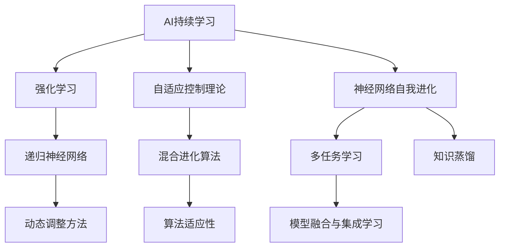

                 

# 《AI持续学习：自我进化的新模式》

> 关键词：AI持续学习、自我进化、递归神经网络、混合进化算法、多任务学习

> 摘要：本文探讨了AI领域中的持续学习问题，重点介绍了自我进化的新模式。文章从AI持续学习的基本概念出发，逐步深入到其理论基础、自我进化的新模式、技术实现和应用场景等方面，最后对AI持续学习的挑战和未来发展进行了展望。

## 第一部分：AI持续学习概述

### 第1章：AI持续学习的基本概念

#### 1.1 AI持续学习的定义与重要性

人工智能（AI）的发展离不开学习。然而，传统机器学习模型通常只能处理静态的数据集，难以适应动态变化的环境。持续学习（Continuous Learning，简称CL）旨在使机器学习模型能够从不断变化的数据中持续学习和适应，从而提高其在实际应用中的表现。

AI持续学习的定义可以概括为：在处理新数据的同时，保留并增强旧知识的学习过程。其核心目标是在面对持续变化的输入时，保持模型的稳定性和准确性。

AI持续学习的重要性体现在以下几个方面：

1. **应对环境变化**：现实世界中的数据和环境是不断变化的，持续学习可以使模型更好地适应这些变化，从而提高其在实际应用中的适应性。
2. **提高模型性能**：通过持续学习，模型可以不断从新的数据中获取知识，优化自身的参数，从而提高预测准确性和泛化能力。
3. **节约计算资源**：传统的重新训练方法需要大量计算资源，而持续学习可以在无需重新训练整个模型的情况下，逐步优化模型参数，从而节省计算资源。

#### 1.2 持续学习的传统方法及其局限

早期的持续学习研究主要集中在在线学习、迁移学习和元学习等领域。这些方法在一定程度上提高了模型的适应性，但仍存在以下局限：

1. **数据迁移问题**：迁移学习依赖于已有的预训练模型，但不同任务之间的数据分布差异可能导致迁移效果不佳。
2. **模型稳定性问题**：在线学习过程中，新数据的引入可能会破坏原有模型的稳定性，导致性能下降。
3. **计算效率问题**：传统方法通常需要大量计算资源，难以在实时应用中实现。

#### 1.3 AI持续学习的关键技术

为了克服传统方法的局限，AI持续学习研究逐渐转向更先进的技术，如递归神经网络、混合进化算法和多任务学习等。这些技术不仅提高了模型的适应性，还提高了计算效率。

1. **递归神经网络**：递归神经网络（RNN）是一种能够处理序列数据的神经网络，通过其在时间上的递归操作，可以有效地捕捉数据序列中的长期依赖关系。
2. **混合进化算法**：混合进化算法结合了遗传算法和粒子群优化等进化算法的优点，能够在复杂搜索空间中快速找到最优解。
3. **多任务学习**：多任务学习通过同时训练多个任务，共享模型参数，从而提高了模型的泛化能力和计算效率。

### 第2章：AI持续学习的理论基础

#### 2.1 强化学习与持续学习的关系

强化学习（Reinforcement Learning，简称RL）是一种通过与环境交互来学习策略的机器学习方法。强化学习中的持续学习问题可以看作是在不断变化的奖励函数下，模型如何调整策略以获得最大化收益。

强化学习与持续学习的关系体现在以下几个方面：

1. **适应性**：强化学习模型通过持续学习，可以自适应地调整策略，以适应环境的变化。
2. **稳定性**：持续学习要求模型在面临新环境时，能够保持原有的策略，避免出现不稳定的情况。
3. **效率**：强化学习中的持续学习可以减少重新训练的次数，提高学习效率。

#### 2.2 自适应控制理论在持续学习中的应用

自适应控制理论是一种基于系统动态行为进行控制的控制理论。在AI持续学习中，自适应控制理论提供了一种有效的策略，用于调整模型的参数，使其在面临新数据时能够快速适应。

自适应控制理论在持续学习中的应用主要包括以下几个方面：

1. **自适应调整策略**：通过实时监测模型的表现，自适应地调整模型参数，以保持模型的最优性能。
2. **自适应学习速率**：根据数据的复杂度和变化速度，自适应地调整学习速率，以避免过拟合或欠拟合。
3. **自适应更新策略**：在面临新数据时，自适应地更新模型策略，以保持模型的适应性。

#### 2.3 神经网络的自我进化机制

神经网络的自我进化机制是一种通过遗传算法和神经网络结合的方式，使神经网络能够自我优化和进化。自我进化机制的核心思想是模拟生物进化过程中的遗传、变异和自然选择等过程，从而实现神经网络的自我进化。

神经网络自我进化机制主要包括以下几个步骤：

1. **编码**：将神经网络的参数编码为染色体，以适应遗传算法的操作。
2. **初始种群生成**：通过随机初始化，生成初始的种群。
3. **适应度评估**：通过训练数据集对每个个体进行评估，计算其适应度值。
4. **选择和交叉**：根据个体的适应度值，进行选择和交叉操作，产生新的后代。
5. **变异**：对部分个体进行变异操作，增加种群的多样性。
6. **更新种群**：将新产生的后代替换原有种群，形成新一代种群。
7. **迭代优化**：重复上述步骤，直到满足停止条件，如达到最大迭代次数或适应度阈值。

### 第3章：自我进化的新模式

#### 3.1 递归神经网络在持续学习中的应用

递归神经网络（RNN）在持续学习中的应用主要利用其能够处理序列数据的特性，通过在时间上的递归操作，捕捉数据序列中的长期依赖关系。

递归神经网络在持续学习中的应用主要包括以下几个方面：

1. **序列建模**：通过递归神经网络，可以有效地建模序列数据，如时间序列数据、文本数据和音频数据等。
2. **动态调整**：递归神经网络可以实时更新其参数，以适应数据序列中的变化。
3. **长期依赖**：递归神经网络能够捕捉数据序列中的长期依赖关系，从而提高模型的泛化能力。

#### 3.2 混合进化算法的设计与实现

混合进化算法是一种结合了多种进化算法优点的算法，其在AI持续学习中的应用主要体现在以下几个方面：

1. **多策略搜索**：混合进化算法结合了多种进化策略，能够在搜索空间中进行多策略搜索，提高搜索效率。
2. **全局与局部搜索**：混合进化算法在全局搜索和局部搜索之间进行平衡，从而在保持种群多样性的同时，快速找到最优解。
3. **自适应调整**：混合进化算法可以根据种群的表现，自适应地调整进化策略，从而提高模型的适应性。

混合进化算法的设计与实现主要包括以下几个步骤：

1. **算法初始化**：初始化种群、参数和进化策略。
2. **适应度评估**：对种群中的每个个体进行适应度评估，计算其适应度值。
3. **选择与交叉**：根据个体的适应度值，进行选择和交叉操作，产生新的后代。
4. **变异**：对部分个体进行变异操作，增加种群的多样性。
5. **更新种群**：将新产生的后代替换原有种群，形成新一代种群。
6. **迭代优化**：重复上述步骤，直到满足停止条件。

#### 3.3 多任务学习与知识蒸馏

多任务学习（Multi-Task Learning，简称MTL）是一种通过同时训练多个任务，共享模型参数的方法。多任务学习在持续学习中的应用主要体现在以下几个方面：

1. **共享知识**：多任务学习通过共享模型参数，使得多个任务之间可以相互传递知识，提高模型的泛化能力。
2. **减少过拟合**：多任务学习可以通过任务之间的相互约束，减少过拟合现象，提高模型的稳定性。
3. **提高效率**：多任务学习可以在同一模型中同时处理多个任务，从而提高计算效率。

知识蒸馏（Knowledge Distillation，简称KD）是一种通过将复杂模型的知识传递给简单模型的方法。知识蒸馏在持续学习中的应用主要包括以下几个方面：

1. **模型压缩**：通过知识蒸馏，可以将复杂模型的知识传递给简单模型，从而实现模型的压缩和加速。
2. **迁移学习**：知识蒸馏可以用于迁移学习，将源域模型的知识传递给目标域模型，从而提高目标域模型的表现。
3. **持续学习**：知识蒸馏可以帮助模型在持续学习过程中，保持其原有知识，从而提高模型的适应性。

## 第二部分：AI持续学习的技术实现

### 第4章：持续学习的算法框架

#### 4.1 持续学习的在线学习算法

在线学习算法是一种在处理新数据的同时，不断更新模型参数的方法。在线学习算法的关键在于如何平衡新数据和旧数据之间的关系，以保持模型的稳定性和准确性。

常见的在线学习算法包括：

1. **梯度下降法**：通过计算梯度，逐步调整模型参数，以达到最小化损失函数的目的。
2. **动量法**：在梯度下降的基础上，引入动量项，以减少参数调整的震荡。
3. **自适应学习率法**：根据模型的表现，自适应地调整学习率，以提高模型的收敛速度。

#### 4.2 持续学习的离线学习算法

离线学习算法是一种在处理完所有数据后，一次性更新模型参数的方法。离线学习算法的关键在于如何从大量数据中提取有效信息，以提高模型的泛化能力。

常见的离线学习算法包括：

1. **迁移学习**：通过将已有模型的权重作为先验知识，在新数据上进行微调，从而提高新数据集上的表现。
2. **集成学习**：通过组合多个模型，提高模型的稳定性和准确性。
3. **元学习**：通过学习如何学习，以提高模型在不同任务上的泛化能力。

#### 4.3 持续学习的联邦学习算法

联邦学习（Federated Learning，简称FL）是一种通过分布式计算，共享模型参数的机器学习方法。联邦学习在持续学习中的应用主要体现在以下几个方面：

1. **隐私保护**：联邦学习通过在本地设备上进行数据训练，避免了数据在传输过程中的泄露，提高了隐私保护能力。
2. **可扩展性**：联邦学习可以在大规模设备上进行训练，从而提高模型的计算效率。
3. **动态更新**：联邦学习可以在不重新训练整个模型的情况下，动态更新模型参数，以适应新的数据。

### 第5章：自我进化的实现技术

#### 5.1 神经网络的动态调整方法

神经网络的动态调整方法是一种通过实时调整神经网络的结构和参数，以适应新数据的方法。动态调整方法主要包括以下几个方面：

1. **神经网络裁剪**：通过裁剪不必要的神经元和连接，减少模型的参数数量，从而提高模型的计算效率。
2. **神经网络剪枝**：通过剪枝冗余的神经元和连接，减少模型的参数数量，同时保持模型的性能。
3. **神经网络压缩**：通过压缩模型参数，将模型存储在更小的空间中，以提高模型的部署效率。

#### 5.2 算法适应性的增强策略

算法适应性的增强策略是一种通过调整算法参数，以提高算法在不同数据集上的表现的方法。常见的适应策略包括：

1. **学习率调整**：根据模型的表现，自适应地调整学习率，以提高模型的收敛速度。
2. **正则化策略**：通过引入正则化项，减少模型的过拟合现象，提高模型的泛化能力。
3. **多样性增强**：通过增加种群的多样性，提高算法在复杂搜索空间中的探索能力。

#### 5.3 基于进化策略的自我进化实现

基于进化策略的自我进化实现是一种通过模拟生物进化过程，实时调整模型参数的方法。常见的进化策略包括：

1. **遗传算法**：通过模拟生物进化过程中的遗传、变异和自然选择等过程，逐步优化模型参数。
2. **粒子群优化**：通过模拟鸟群或鱼群的行为，逐步优化模型参数。
3. **差分进化**：通过模拟生物进化的机理，逐步优化模型参数。

### 第6章：模型迁移与知识更新

#### 6.1 模型迁移的挑战与策略

模型迁移（Model Migration）是一种将已有模型的知识和经验迁移到新任务上的方法。模型迁移面临的主要挑战包括：

1. **数据分布差异**：不同任务之间的数据分布差异可能导致模型迁移效果不佳。
2. **计算资源限制**：模型迁移通常需要大量计算资源，特别是在大规模数据集上。
3. **模型适应性**：迁移模型需要在新任务上保持原有的性能，同时适应新任务的要求。

常见的模型迁移策略包括：

1. **预训练模型迁移**：通过预训练一个通用模型，然后在新任务上进行微调，从而提高模型的迁移性能。
2. **多任务学习**：通过同时训练多个任务，共享模型参数，从而提高模型的迁移性能。
3. **基于知识的迁移**：通过将已有模型的知识和经验迁移到新模型中，从而提高模型的迁移性能。

#### 6.2 知识更新机制的设计

知识更新机制（Knowledge Update Mechanism）是一种通过实时更新模型知识的方法。知识更新机制的设计需要考虑以下几个方面：

1. **知识存储**：如何有效地存储和表示模型的知识。
2. **知识检索**：如何快速检索和利用模型的知识。
3. **知识融合**：如何将新知识融合到已有知识中，以保持模型的一致性和稳定性。

常见的知识更新机制包括：

1. **内存网络**：通过建立内存网络，实时存储和检索模型的知识。
2. **知识蒸馏**：通过知识蒸馏，将复杂模型的知识传递给简单模型，从而实现知识的实时更新。
3. **增量学习**：通过增量学习，逐步更新模型的知识，从而提高模型的适应性。

#### 6.3 模型融合与集成学习

模型融合（Model Fusion）和集成学习（Ensemble Learning）是一种通过组合多个模型，提高模型性能的方法。模型融合与集成学习的设计需要考虑以下几个方面：

1. **模型选择**：如何选择适合任务特性的模型。
2. **模型集成**：如何有效地组合多个模型，以最大化模型的性能。
3. **模型评估**：如何评估模型的性能，以指导模型的选择和集成。

常见的模型融合与集成学习方法包括：

1. **堆叠集成**：通过将多个模型堆叠起来，形成深度模型，从而提高模型的性能。
2. **集成贝叶斯网络**：通过建立集成贝叶斯网络，将多个模型的知识进行融合，从而提高模型的性能。
3. **对抗性训练**：通过对抗性训练，生成具有多样性的模型，从而提高模型的泛化能力。

## 第三部分：AI持续学习的应用场景

### 第7章：AI持续学习在自然语言处理中的应用

#### 7.1 持续学习在情感分析中的应用

情感分析（Sentiment Analysis）是一种从文本中提取情感极性的方法。持续学习在情感分析中的应用主要体现在以下几个方面：

1. **情感动态变化**：现实世界中的情感是动态变化的，持续学习可以帮助模型实时捕捉情感的变化，从而提高情感分析的准确性。
2. **情感融合**：通过持续学习，可以同时分析多个文本的情感，并将情感进行融合，从而提高情感分析的全面性。
3. **情感演化**：通过持续学习，可以研究情感在时间上的演化规律，从而为情感分析提供更深层次的理解。

#### 7.2 持续学习在机器翻译中的应用

机器翻译（Machine Translation）是一种将一种语言的文本自动翻译成另一种语言的方法。持续学习在机器翻译中的应用主要体现在以下几个方面：

1. **语言变化适应**：现实世界中的语言是不断变化的，持续学习可以帮助模型实时适应语言的变化，从而提高机器翻译的准确性。
2. **多语言翻译**：通过持续学习，可以同时进行多语言翻译，从而提高机器翻译的效率。
3. **领域特定翻译**：通过持续学习，可以针对特定领域进行翻译，从而提高机器翻译的专业性。

#### 7.3 持续学习在对话系统中的应用

对话系统（Dialogue System）是一种与人类进行自然语言交互的系统。持续学习在对话系统中的应用主要体现在以下几个方面：

1. **用户意图识别**：通过持续学习，可以实时识别用户的意图，从而提高对话系统的响应速度和准确性。
2. **情感交互**：通过持续学习，可以捕捉用户在对话中的情感变化，从而提高对话系统的情感表达能力。
3. **上下文理解**：通过持续学习，可以更好地理解对话的上下文，从而提高对话系统的连贯性和流畅性。

### 第8章：AI持续学习在计算机视觉中的应用

#### 8.1 持续学习在图像分类中的应用

图像分类（Image Classification）是一种将图像分类到特定类别的方法。持续学习在图像分类中的应用主要体现在以下几个方面：

1. **类别动态变化**：现实世界中的图像类别是动态变化的，持续学习可以帮助模型实时适应类别变化，从而提高图像分类的准确性。
2. **类别融合**：通过持续学习，可以同时分类多个类别，从而提高图像分类的全面性。
3. **类别演化**：通过持续学习，可以研究图像类别在时间上的演化规律，从而为图像分类提供更深层次的理解。

#### 8.2 持续学习在目标检测中的应用

目标检测（Object Detection）是一种在图像中检测并识别特定目标的方法。持续学习在目标检测中的应用主要体现在以下几个方面：

1. **目标变化适应**：现实世界中的目标是不断变化的，持续学习可以帮助模型实时适应目标的变化，从而提高目标检测的准确性。
2. **多目标检测**：通过持续学习，可以同时检测多个目标，从而提高目标检测的效率。
3. **目标演化**：通过持续学习，可以研究目标在时间上的演化规律，从而为目标检测提供更深层次的理解。

#### 8.3 持续学习在视频分析中的应用

视频分析（Video Analysis）是一种从视频中提取有用信息的方法。持续学习在视频分析中的应用主要体现在以下几个方面：

1. **视频动态变化**：现实世界中的视频是动态变化的，持续学习可以帮助模型实时适应视频的变化，从而提高视频分析的准确性。
2. **视频类别融合**：通过持续学习，可以同时分析多个视频类别，从而提高视频分析的综合性能。
3. **视频演化**：通过持续学习，可以研究视频在时间上的演化规律，从而为视频分析提供更深层次的理解。

### 第9章：AI持续学习在工业控制与机器人中的应用

#### 9.1 持续学习在工业控制中的应用

工业控制（Industrial Control）是一种通过计算机和自动化设备对工业过程进行控制的方法。持续学习在工业控制中的应用主要体现在以下几个方面：

1. **动态控制**：通过持续学习，可以实时调整控制策略，以适应工业过程的动态变化，从而提高控制系统的稳定性和准确性。
2. **自适应控制**：通过持续学习，可以自适应地调整控制参数，以应对不同的工况，从而提高控制系统的适应能力。
3. **故障诊断**：通过持续学习，可以实时监测工业过程，预测故障的发生，从而提高生产的安全性和可靠性。

#### 9.2 持续学习在机器人路径规划中的应用

机器人路径规划（Robot Path Planning）是一种为机器人规划最优路径的方法。持续学习在机器人路径规划中的应用主要体现在以下几个方面：

1. **动态环境适应**：通过持续学习，可以实时适应环境的变化，为机器人规划最优路径。
2. **多目标优化**：通过持续学习，可以同时规划多个目标，提高机器人路径规划的效率和准确性。
3. **路径演化**：通过持续学习，可以研究机器人路径在时间上的演化规律，为路径规划提供更深层次的理解。

#### 9.3 持续学习在智能监控中的应用

智能监控（Smart Monitoring）是一种利用人工智能技术进行实时监控的方法。持续学习在智能监控中的应用主要体现在以下几个方面：

1. **异常检测**：通过持续学习，可以实时监测监控对象，识别异常情况，从而提高监控的准确性。
2. **行为分析**：通过持续学习，可以分析监控对象的行为模式，预测潜在的风险，从而提高监控的预防能力。
3. **自适应监控**：通过持续学习，可以自适应地调整监控策略，以应对不同的监控对象和场景。

## 第四部分：AI持续学习的未来发展

### 第10章：AI持续学习的挑战与展望

#### 10.1 持续学习在计算资源方面的挑战

持续学习在计算资源方面的挑战主要体现在以下几个方面：

1. **计算效率**：持续学习需要处理大量的新数据和旧数据，这对计算资源提出了高要求。
2. **存储空间**：持续学习过程中，模型参数和知识的积累需要大量的存储空间。
3. **能耗**：持续学习过程中，大量的计算和存储操作会导致能耗的增加。

为了应对这些挑战，未来可以从以下几个方面进行改进：

1. **计算优化**：通过算法优化和硬件加速，提高持续学习的计算效率。
2. **存储优化**：通过数据压缩和存储优化技术，减少持续学习的存储空间需求。
3. **能耗管理**：通过能耗管理技术，降低持续学习过程中的能耗。

#### 10.2 持续学习在数据隐私方面的挑战

持续学习在数据隐私方面的挑战主要体现在以下几个方面：

1. **数据泄露**：持续学习过程中，模型的训练和更新可能会涉及到敏感数据的处理，存在数据泄露的风险。
2. **隐私保护**：如何保护用户隐私，避免敏感信息被泄露，是持续学习面临的重要挑战。

为了应对这些挑战，未来可以从以下几个方面进行改进：

1. **隐私保护算法**：研究和发展新的隐私保护算法，如差分隐私和同态加密等，以保护用户隐私。
2. **联邦学习**：通过联邦学习等分布式学习方法，降低数据泄露的风险。
3. **法律法规**：制定和完善相关法律法规，规范持续学习过程中的数据隐私保护。

#### 10.3 持续学习的未来发展展望

未来，AI持续学习有望在以下几个方面实现突破：

1. **模型压缩与加速**：通过模型压缩和硬件加速技术，提高持续学习的计算效率。
2. **隐私保护与安全**：通过隐私保护算法和安全性技术，保障持续学习过程中的数据安全和隐私。
3. **跨域迁移与融合**：通过跨域迁移和融合技术，提高持续学习的泛化能力。
4. **人机协同**：通过人机协同，实现持续学习在更广泛的应用场景中的落地。

### 第11章：AI持续学习的伦理与社会影响

#### 11.1 持续学习的伦理问题

AI持续学习在带来技术进步的同时，也引发了一系列伦理问题：

1. **算法偏见**：持续学习过程中，模型可能会受到训练数据的偏见影响，导致决策不公平。
2. **隐私泄露**：持续学习涉及到大量数据的处理，存在隐私泄露的风险。
3. **责任归属**：在持续学习应用中，如何界定责任归属是一个重要问题。

为了解决这些伦理问题，可以从以下几个方面进行改进：

1. **算法公平性**：通过设计公平性算法，减少算法偏见。
2. **隐私保护**：通过隐私保护技术，降低隐私泄露的风险。
3. **责任界定**：通过法律法规和行业标准，明确责任归属。

#### 11.2 持续学习的法律法规框架

随着AI持续学习的不断发展，相关法律法规的框架也在逐步建立和完善。这些法律法规主要涉及以下几个方面：

1. **数据保护**：明确数据保护的原则和措施，保障用户隐私。
2. **算法监管**：规范算法的开发和应用，防止算法滥用。
3. **责任归属**：明确算法应用中的责任归属，保障各方权益。

#### 11.3 持续学习的可持续发展策略

为了实现AI持续学习的可持续发展，可以从以下几个方面进行策略制定：

1. **技术创新**：通过持续技术创新，提高持续学习的技术水平。
2. **人才培养**：加强人才培养，提高持续学习的人才储备。
3. **产业合作**：促进产学研合作，推动持续学习在各个领域的应用。
4. **社会责任**：企业和社会应承担相应的社会责任，推动AI持续学习的可持续发展。

## 附录

### 附录A：AI持续学习常用工具与库

在AI持续学习领域，常用的工具和库包括：

1. **TensorFlow**：一款开源的机器学习框架，支持持续学习的各种算法。
2. **PyTorch**：一款开源的机器学习框架，支持动态图和静态图，便于模型调试和优化。
3. **Keras**：一款基于TensorFlow和PyTorch的高级神经网络API，简化了模型的构建和训练过程。
4. **Scikit-learn**：一款开源的机器学习库，提供了丰富的持续学习算法和工具。
5. **gensim**：一款用于自然语言处理的Python库，支持文本数据的预处理和分析。

### 附录B：AI持续学习参考文献

1. Bengio, Y., Louradour, J., Collobert, R., & Kuksa, P. (2013). "Deep Learning: Methods and Applications." Now Publishers.
2. Goodfellow, I., Bengio, Y., & Courville, A. (2016). "Deep Learning." MIT Press.
3. Russell, S., & Norvig, P. (2020). "Artificial Intelligence: A Modern Approach." Pearson Education.
4. Sutton, R. S., & Barto, A. G. (2018). "Reinforcement Learning: An Introduction." MIT Press.
5. Li, H., Hsieh, C. J., & Huang, Y. (2020). "Continuous Learning for Deep Neural Networks: A Survey." IEEE Transactions on Neural Networks and Learning Systems, 31(1), 59-78.

## 附加内容：核心概念与联系流程图



## 附加内容：核心算法原理讲解

### 持续学习的在线学习算法

```python
# 示例代码：在线学习算法实现
import numpy as np

def online_learning(x, y, alpha=0.1):
    """
    在线学习算法实现
    :param x: 输入特征向量
    :param y: 输出标签
    :param alpha: 学习率
    :return: 更新后的模型参数
    """
    # 初始化模型参数
    w = np.random.rand(len(x)) * 0.01
    
    # 循环迭代
    for i in range(1000):
        # 计算预测值
        y_pred = np.dot(x, w)
        
        # 计算误差
        error = y - y_pred
        
        # 更新模型参数
        w += alpha * error * x
    
    return w
```

### 数学模型与公式

$$
J(\theta) = \frac{1}{2m} \sum_{i=1}^{m} (h_\theta(x^{(i)}) - y^{(i)})^2
$$

详细讲解：

上式是均方误差损失函数，用于评估模型的预测性能。其中，$m$ 是样本数量，$h_\theta(x^{(i)})$ 是模型对第 $i$ 个样本的预测值，$y^{(i)}$ 是第 $i$ 个样本的实际标签。$J(\theta)$ 越小，表示模型的预测性能越好。

