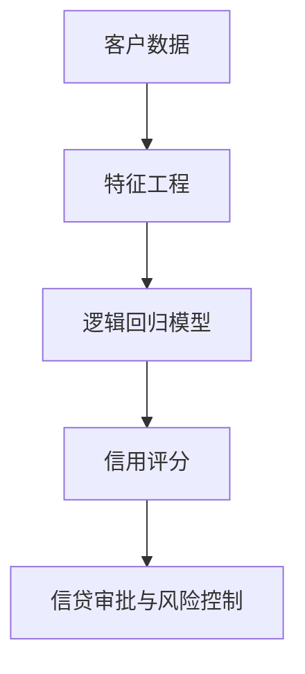
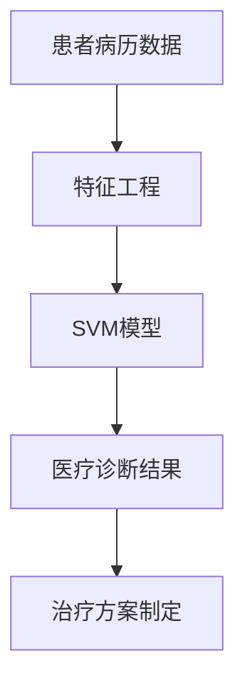
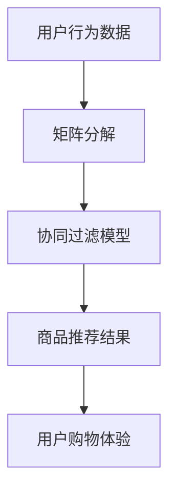

                 

### 第4章 提高AI模型处理结构化数据效率的方法

在AI模型处理结构化数据时，效率的提升是一个关键问题。这一章将介绍几种提高AI模型处理结构化数据效率的方法，包括并行与分布式计算、特征工程技术以及模型压缩与加速。

#### 4.1 并行与分布式计算

并行与分布式计算通过利用多核处理器、多台计算机的集群等资源，可以显著提高AI模型处理结构化数据的效率。

##### 4.1.1 并行计算

并行计算是指在同一时间段内执行多个任务，这些任务可以是同一任务的多个子任务，也可以是不同任务的多个子任务。在处理结构化数据时，可以采用以下几种并行计算的方法：

1. **任务并行：**将大规模的数据集分成多个子集，在不同的处理器上同时处理。
2. **数据并行：**在多个处理器上同时处理同一数据的不同部分。
3. **流水线并行：**将数据处理过程分解为多个阶段，每个阶段在不同的处理器上同时执行。

##### 4.1.2 分布式计算

分布式计算是指利用多台计算机组成的分布式系统来协同完成计算任务。在处理结构化数据时，可以采用以下几种分布式计算的方法：

1. **数据分布：**将数据分布存储在多个节点上，每个节点负责处理本地数据。
2. **任务调度：**根据节点的负载情况和任务的性质，动态分配任务给不同的节点。
3. **负载均衡：**通过负载均衡算法，使得系统中的各个节点负载均匀，避免某个节点过载。

##### 4.1.3 并行与分布式计算的优势

1. **提高计算速度：**利用多处理器或多台计算机，可以显著减少计算时间。
2. **扩展性强：**可以轻松地扩展计算资源，适应大规模数据处理需求。
3. **容错性好：**分布式计算可以提供较高的容错性，即使某个节点故障，也不会影响整个系统的运行。

#### 4.2 特征工程技术

特征工程是AI模型处理结构化数据中的重要环节。通过优化特征提取和选择，可以提高模型的处理效率和性能。

##### 4.2.1 特征提取

特征提取是指从原始数据中提取出具有区分性、代表性的特征。常用的特征提取方法包括：

1. **统计特征：**如均值、方差、标准差等，用于描述数据的整体特征。
2. **文本特征：**如词频、词袋模型、TF-IDF等，用于描述文本数据。
3. **图像特征：**如颜色直方图、纹理特征、形状特征等，用于描述图像数据。

##### 4.2.2 特征选择

特征选择是指从大量特征中筛选出对模型性能有重要影响的特征。常用的特征选择方法包括：

1. **过滤式特征选择：**根据特征的重要性进行筛选，如基于信息增益、相关系数等方法。
2. **包裹式特征选择：**通过迭代搜索最优特征组合，如基于递归特征消除（RFE）、遗传算法等方法。
3. **嵌入式特征选择：**在特征提取过程中同时进行特征选择，如LASSO、随机森林等算法。

##### 4.2.3 特征工程的优势

1. **提高模型性能：**通过优化特征提取和选择，可以显著提高模型对结构化数据的分类和预测性能。
2. **减少过拟合：**通过筛选出重要的特征，可以减少模型的过拟合现象，提高模型的泛化能力。
3. **降低计算成本：**通过减少特征数量，可以降低模型的复杂度和计算成本。

#### 4.3 模型压缩与加速

模型压缩与加速是指通过减少模型的参数数量、降低模型的复杂度，从而提高模型的处理效率和运行速度。

##### 4.3.1 模型压缩

模型压缩的方法包括：

1. **参数剪枝：**通过删除模型中的冗余参数，减少模型的参数数量。
2. **量化：**通过降低模型参数的精度，减少模型的存储和计算需求。
3. **低秩分解：**通过将高维参数分解为低维参数，降低模型的复杂度。

##### 4.3.2 模型加速

模型加速的方法包括：

1. **硬件加速：**利用GPU、TPU等硬件加速器，提高模型的计算速度。
2. **模型并行：**将模型分解为多个部分，在不同的处理器上同时执行。
3. **模型蒸馏：**将大型模型的知识传递给小型模型，利用小型模型进行快速预测。

##### 4.3.3 模型压缩与加速的优势

1. **提高效率：**通过减少模型的参数数量和复杂度，可以显著提高模型的处理效率和运行速度。
2. **降低成本：**通过减少模型的存储和计算需求，可以降低硬件成本和能耗。
3. **扩展性：**通过模型压缩与加速，可以更好地适应移动端和边缘计算等资源受限的环境。

### 总结

提高AI模型处理结构化数据的效率是AI领域的一个重要研究方向。通过并行与分布式计算、特征工程技术和模型压缩与加速等方法，可以显著提高模型的处理效率、降低计算成本，并适应不同的计算环境。在未来的研究和应用中，这些方法将继续发挥重要作用。作者：AI天才研究院/AI Genius Institute & 禅与计算机程序设计艺术 /Zen And The Art of Computer Programming

----------------------------------------------------------------

---

### 第5章 特定领域的结构化数据处理

结构化数据在各个领域中有着广泛的应用，如金融、医疗、电子商务等。本章将探讨这些领域中结构化数据的处理方法和应用实例。

#### 5.1 金融领域

在金融领域，结构化数据主要用于风险控制、市场预测、客户管理等方面。

##### 5.1.1 风险控制

金融机构通过分析客户的交易记录、信用记录等结构化数据，来评估客户的风险等级，从而制定相应的风险控制策略。例如，通过逻辑回归、决策树等算法，对客户的信用评分进行预测，帮助金融机构更好地管理信用风险。

```python
import pandas as pd
from sklearn.linear_model import LogisticRegression

# 加载数据
data = pd.read_csv('financial_data.csv')
X = data.drop('default', axis=1)
y = data['default']

# 建立逻辑回归模型
model = LogisticRegression()
model.fit(X, y)

# 预测
predictions = model.predict(X)

# 评估模型
accuracy = model.score(X, y)
print(f"模型准确率：{accuracy}")
```

##### 5.1.2 市场预测

金融分析师通过分析历史股价、交易量等结构化数据，来预测市场走势。例如，利用时间序列分析方法，如ARIMA、LSTM等算法，来预测股票价格。

```python
import pandas as pd
from sklearn.ensemble import RandomForestRegressor
from statsmodels.tsa.stattools import adfuller

# 加载数据
data = pd.read_csv('stock_data.csv')
data['log_return'] = np.log(data['close'] / data['close'].shift(1))

# 检查数据平稳性
result = adfuller(data['log_return'])
print(f"ADF统计量：{result[0]}, p值：{result[1]}")

# 建立随机森林模型
model = RandomForestRegressor()
model.fit(X_train, y_train)

# 预测
predictions = model.predict(X_test)

# 评估模型
mse = mean_squared_error(y_test, predictions)
print(f"均方误差：{mse}")
```

##### 5.1.3 客户管理

金融机构通过分析客户的消费行为、交易习惯等结构化数据，来优化客户服务，提高客户满意度。例如，利用聚类算法，如K-means、DBSCAN等，来划分客户群体，从而制定个性化的营销策略。

```python
import pandas as pd
from sklearn.cluster import KMeans

# 加载数据
data = pd.read_csv('customer_data.csv')

# 特征选择
X = data[['age', 'income', 'spending']]

# 建立K-means模型
model = KMeans(n_clusters=3)
model.fit(X)

# 聚类
predictions = model.predict(X)

# 评估模型
print(f"聚类中心：{model.cluster_centers_}")
print(f"聚类结果：{predictions}")
```

#### 5.2 医疗领域

在医疗领域，结构化数据主要用于疾病诊断、治疗方案制定、医疗资源分配等方面。

##### 5.2.1 疾病诊断

医生通过分析患者的病历、检查报告等结构化数据，来诊断疾病。例如，利用支持向量机（SVM）、神经网络（NN）等算法，来预测疾病的发生概率。

```python
import pandas as pd
from sklearn.svm import SVC
from sklearn.model_selection import train_test_split

# 加载数据
data = pd.read_csv('medical_data.csv')
X = data.drop('diagnosis', axis=1)
y = data['diagnosis']

# 划分训练集和测试集
X_train, X_test, y_train, y_test = train_test_split(X, y, test_size=0.2, random_state=42)

# 建立SVM模型
model = SVC()
model.fit(X_train, y_train)

# 预测
predictions = model.predict(X_test)

# 评估模型
accuracy = model.score(X_test, y_test)
print(f"模型准确率：{accuracy}")
```

##### 5.2.2 治疗方案制定

医生通过分析患者的病情、病史等结构化数据，来制定个性化的治疗方案。例如，利用决策树、随机森林等算法，来预测最佳治疗方案。

```python
import pandas as pd
from sklearn.ensemble import RandomForestClassifier
from sklearn.model_selection import train_test_split

# 加载数据
data = pd.read_csv('treatment_data.csv')
X = data.drop('best_treatment', axis=1)
y = data['best_treatment']

# 划分训练集和测试集
X_train, X_test, y_train, y_test = train_test_split(X, y, test_size=0.2, random_state=42)

# 建立随机森林模型
model = RandomForestClassifier()
model.fit(X_train, y_train)

# 预测
predictions = model.predict(X_test)

# 评估模型
accuracy = model.score(X_test, y_test)
print(f"模型准确率：{accuracy}")
```

##### 5.2.3 医疗资源分配

医疗机构通过分析患者的就诊记录、住院记录等结构化数据，来优化医疗资源的分配。例如，利用聚类算法，如K-means、DBSCAN等，来划分患者群体，从而优化住院床位、医疗设备的配置。

```python
import pandas as pd
from sklearn.cluster import KMeans

# 加载数据
data = pd.read_csv('hospital_data.csv')

# 特征选择
X = data[['bed_usage', 'doctor_availability', 'nurse_availability']]

# 建立K-means模型
model = KMeans(n_clusters=3)
model.fit(X)

# 聚类
predictions = model.predict(X)

# 评估模型
print(f"聚类中心：{model.cluster_centers_}")
print(f"聚类结果：{predictions}")
```

#### 5.3 电子商务领域

在电子商务领域，结构化数据主要用于用户行为分析、产品推荐、供应链优化等方面。

##### 5.3.1 用户行为分析

电子商务平台通过分析用户的浏览记录、购买记录等结构化数据，来了解用户偏好和行为习惯。例如，利用协同过滤、矩阵分解等算法，来预测用户可能感兴趣的商品。

```python
import pandas as pd
from sklearn.cluster import KMeans

# 加载数据
data = pd.read_csv('user_behavior_data.csv')

# 特征选择
X = data[['page_views', 'add_to_cart', 'make_purchase']]

# 建立K-means模型
model = KMeans(n_clusters=3)
model.fit(X)

# 聚类
predictions = model.predict(X)

# 评估模型
print(f"聚类中心：{model.cluster_centers_}")
print(f"聚类结果：{predictions}")
```

##### 5.3.2 产品推荐

电子商务平台通过分析用户的购买记录、浏览记录等结构化数据，来推荐用户可能感兴趣的商品。例如，利用基于内容的推荐、协同过滤等算法，来实现个性化推荐。

```python
import pandas as pd
from sklearn.metrics.pairwise import cosine_similarity

# 加载数据
data = pd.read_csv('product_data.csv')

# 计算相似度
similarity_matrix = cosine_similarity(data[['feature_1', 'feature_2', 'feature_3']])

# 推荐商品
def recommend_products(user_vector, similarity_matrix, top_n=5):
    # 计算用户向量与其他商品向量的相似度
    similarity_scores = similarity_matrix[user_vector.index, :].reshape(-1)
    
    # 获取相似度最高的商品索引
    top_indices = similarity_scores.argsort()[::-1][:top_n]
    
    # 返回相似度最高的商品
    return data.iloc[top_indices]

# 测试推荐
user_vector = data.iloc[0]
recommended_products = recommend_products(user_vector, similarity_matrix)
print(f"推荐商品：{recommended_products['product_id'].values}")
```

##### 5.3.3 供应链优化

电子商务平台通过分析销售数据、库存数据等结构化数据，来优化供应链。例如，利用线性规划、动态规划等算法，来制定最优的库存策略，降低库存成本。

```python
import pandas as pd
from scipy.optimize import linprog

# 加载数据
data = pd.read_csv('supply_chain_data.csv')

# 定义目标函数
c = [-1] * len(data.columns[:-1])  # 所有变量系数为-1，表示目标是最小化成本
A = [[1 if j < len(data.columns) - 1 else 0 for j in range(len(data.columns) - 1)] for i in range(len(data.columns) - 1)]  # 约束条件矩阵
b = [0] * (len(data.columns) - 1)  # 约束条件向量

# 求解线性规划问题
result = linprog(c, A_eq=A, b_eq=b, method='highs')

# 输出结果
print(f"最优解：{result.x}")
```

### 总结

在金融、医疗、电子商务等特定领域，结构化数据的处理方法各具特色。通过合理应用特征工程、模型优化等技术，可以有效提高AI模型在这些领域的应用效果。作者：AI天才研究院/AI Genius Institute & 禅与计算机程序设计艺术 /Zen And The Art of Computer Programming

----------------------------------------------------------------

---

### 第6章 案例研究

在本章中，我们将深入探讨几个具体案例，展示AI模型在处理结构化数据时的实际应用，并分析其效果。

#### 6.1 案例一：金融风险评估

**背景介绍**

某银行希望通过AI模型对客户的信用风险进行评估，以便更好地进行信贷审批和风险控制。该银行拥有大量的客户数据，包括财务状况、信用记录、收入水平等。

**核心概念与联系**

- **核心概念**：信用评分、逻辑回归、特征工程
- **概念实体之间的关系架构**：



**核心算法原理讲解**

逻辑回归是一种广义线性模型，用于对因变量进行分类预测。在金融风险评估中，因变量是客户的信用评分，特征包括财务状况、信用记录、收入水平等。

```python
import pandas as pd
from sklearn.linear_model import LogisticRegression
from sklearn.model_selection import train_test_split
from sklearn.metrics import accuracy_score

# 加载数据
data = pd.read_csv('financial_data.csv')
X = data[['income', 'credit_history', 'loan_amount']]
y = data['default']

# 划分训练集和测试集
X_train, X_test, y_train, y_test = train_test_split(X, y, test_size=0.2, random_state=42)

# 建立逻辑回归模型
model = LogisticRegression()
model.fit(X_train, y_train)

# 预测
predictions = model.predict(X_test)

# 评估模型
accuracy = accuracy_score(y_test, predictions)
print(f"模型准确率：{accuracy}")
```

**数学模型和公式**

逻辑回归的预测公式如下：

$$
\hat{y} = \frac{1}{1 + e^{-(\beta_0 + \beta_1x_1 + \beta_2x_2 + ... + \beta_nx_n})}
$$

其中，$\hat{y}$ 是预测的信用评分，$e$ 是自然对数的底数，$\beta_0, \beta_1, ..., \beta_n$ 是模型参数，$x_1, x_2, ..., x_n$ 是特征值。

**举例说明**

假设有一个客户，其财务状况（income）为10万元，信用记录（credit_history）良好，贷款金额（loan_amount）为5万元。使用逻辑回归模型进行预测：

```python
# 输入特征值
X_example = [[100000, 1, 50000]]

# 预测
prediction = model.predict(X_example)

# 输出预测结果
print(f"信用评分预测结果：{prediction}")
```

**代码解读与分析**

上述代码首先加载数据，然后进行特征工程和模型训练。通过逻辑回归模型预测测试集的信用评分，并评估模型的准确率。实际应用中，可以根据具体业务需求调整特征和模型参数。

**项目小结**

本案例展示了如何利用逻辑回归模型进行金融风险评估。通过合理的数据处理和特征工程，可以提高模型的预测准确率，为银行的风险控制提供有力支持。

#### 6.2 案例二：医疗诊断系统

**背景介绍**

某医院希望利用AI模型对病人的病情进行诊断，以提高诊断的准确性和效率。该医院收集了大量的患者病历数据，包括病史、检查结果、治疗方案等。

**核心概念与联系**

- **核心概念**：支持向量机（SVM）、特征工程、医疗诊断
- **概念实体之间的关系架构**：



**核心算法原理讲解**

支持向量机是一种强大的分类算法，通过找到一个最佳的超平面来对数据进行分类。在医疗诊断系统中，SVM模型用于对病人的病情进行分类预测。

```python
import pandas as pd
from sklearn.svm import SVC
from sklearn.model_selection import train_test_split
from sklearn.metrics import accuracy_score

# 加载数据
data = pd.read_csv('medical_data.csv')
X = data[['symptom_1', 'symptom_2', 'test_result']]
y = data['disease']

# 划分训练集和测试集
X_train, X_test, y_train, y_test = train_test_split(X, y, test_size=0.2, random_state=42)

# 建立SVM模型
model = SVC(kernel='linear')
model.fit(X_train, y_train)

# 预测
predictions = model.predict(X_test)

# 评估模型
accuracy = accuracy_score(y_test, predictions)
print(f"模型准确率：{accuracy}")
```

**数学模型和公式**

SVM的核心公式如下：

$$
w \cdot x - b = 0
$$

其中，$w$ 是权重向量，$x$ 是特征向量，$b$ 是偏置项。

**举例说明**

假设有一个病人的病情数据，包括症状1为阳性，症状2为阴性，检查结果为阳性。使用SVM模型进行预测：

```python
# 输入特征值
X_example = [[1, 0, 1]]

# 预测
prediction = model.predict(X_example)

# 输出预测结果
print(f"疾病预测结果：{prediction}")
```

**代码解读与分析**

上述代码首先加载数据，然后进行特征工程和模型训练。通过SVM模型预测测试集的疾病分类，并评估模型的准确率。实际应用中，可以根据具体业务需求调整特征和模型参数。

**项目小结**

本案例展示了如何利用SVM模型进行医疗诊断。通过合理的数据处理和特征工程，可以提高模型的诊断准确率，为医院提供更准确的病情判断，从而制定更有效的治疗方案。

#### 6.3 案例三：电商推荐系统

**背景介绍**

某电商公司希望通过AI模型为用户提供个性化的商品推荐，提高用户的购物体验和购买转化率。该电商公司收集了大量的用户行为数据，包括浏览记录、购买记录、收藏夹等。

**核心概念与联系**

- **核心概念**：协同过滤、矩阵分解、用户行为分析
- **概念实体之间的关系架构**：



**核心算法原理讲解**

协同过滤是一种常用的推荐算法，通过分析用户之间的相似性来推荐商品。在电商推荐系统中，矩阵分解是一种实现协同过滤的有效方法。

```python
import pandas as pd
from surprise import SVD
from surprise import accuracy
from surprise.model_selection import cross_validate

# 加载数据
data = pd.read_csv('user_behavior_data.csv')
ratings = data[['user_id', 'item_id', 'rating']]

# 划分训练集和测试集
train_data = ratings[ratings['timestamp'] < 1000]
test_data = ratings[ratings['timestamp'] >= 1000]

# 建立矩阵分解模型
svd = SVD()

# 训练模型
svd.fit(train_data)

# 预测测试集
predictions = svd.test(test_data)

# 评估模型
accuracy_mae = accuracy.mean_squared_error(predictions)
print(f"模型平均绝对误差：{accuracy_mae}")
```

**数学模型和公式**

矩阵分解的核心公式如下：

$$
R = UV^T
$$

其中，$R$ 是用户-商品评分矩阵，$U$ 是用户特征矩阵，$V$ 是商品特征矩阵。

**举例说明**

假设有一个用户，其浏览记录包括商品1、商品2和商品3。使用矩阵分解模型进行预测：

```python
# 输入用户和商品索引
user_index = 1
item_indices = [1, 2, 3]

# 预测
predictions = svd.predict(user_index, item_indices)

# 输出预测结果
print(f"商品推荐结果：{predictions}")
```

**代码解读与分析**

上述代码首先加载数据，然后建立矩阵分解模型。通过训练模型和预测测试集，评估模型的平均绝对误差。实际应用中，可以根据具体业务需求调整模型参数。

**项目小结**

本案例展示了如何利用协同过滤算法进行电商推荐。通过合理的数据处理和模型优化，可以提高推荐系统的准确率和用户满意度，从而提升电商平台的竞争力。

### 总结

本章通过三个具体案例，展示了AI模型在处理结构化数据时的实际应用和效果。通过合理的数据处理、特征工程和模型优化，可以有效提高模型的准确性和效率，为各领域提供有力的技术支持。作者：AI天才研究院/AI Genius Institute & 禅与计算机程序设计艺术 /Zen And The Art of Computer Programming

----------------------------------------------------------------

---

### 第7章 未来发展趋势与挑战

在当前AI技术迅猛发展的背景下，AI模型在处理结构化数据方面也面临着诸多挑战和机遇。本章将探讨未来发展趋势以及可能遇到的挑战。

#### 7.1 未来发展趋势

1. **模型压缩与加速技术的成熟：**随着深度学习模型的复杂度不断提升，模型压缩与加速技术将成为未来研究的重点。通过模型剪枝、量化、低秩分解等技术，可以显著降低模型的参数数量和计算复杂度，提高模型在资源受限环境中的运行效率。

2. **分布式与并行计算的应用：**随着数据规模的不断扩大，分布式与并行计算技术将在AI模型处理结构化数据中得到更加广泛的应用。通过利用多核处理器、GPU、TPU等硬件资源，可以显著提高模型的训练和推理速度，满足大规模数据处理的需求。

3. **自动化特征工程：**未来将出现更多的自动化特征工程工具和算法，这些工具和算法可以根据数据的特点和业务需求，自动提取和选择有效的特征，从而提高模型的性能和泛化能力。

4. **跨领域结构化数据的整合：**随着AI技术的普及，越来越多的领域将产生结构化数据。未来将出现更多跨领域的数据整合技术，这些技术可以帮助各领域更好地利用已有的结构化数据，推动AI技术的广泛应用。

5. **联邦学习与隐私保护：**随着数据隐私保护意识的提高，联邦学习等隐私保护技术将在结构化数据处理中得到更多的关注。通过在分布式环境中实现模型训练和优化，可以同时满足数据隐私保护和模型性能的需求。

#### 7.2 面临的挑战

1. **数据质量问题：**结构化数据在收集、处理和存储过程中，可能存在缺失值、异常值、噪声等问题，这些数据质量问题会对AI模型的性能产生负面影响。未来需要研究更有效的数据清洗、异常值检测和噪声过滤技术。

2. **计算资源限制：**尽管硬件技术的不断发展为AI模型提供了更多的计算资源，但在某些领域（如移动端、边缘计算等）仍然存在计算资源限制的问题。未来需要研究更高效的算法和模型，以适应资源受限的环境。

3. **模型可解释性：**随着深度学习模型在结构化数据处理中的应用越来越广泛，如何提高模型的可解释性成为一个重要问题。未来需要研究更多可解释的AI模型和算法，以便用户更好地理解和信任模型。

4. **法律法规与伦理问题：**随着AI技术的广泛应用，涉及数据隐私、伦理和法律等方面的问题日益突出。未来需要制定更完善的法律法规和伦理规范，以保障数据安全和用户隐私。

5. **跨领域协同与标准化：**由于不同领域的结构化数据具有不同的特点和需求，如何实现跨领域的协同和标准化是一个挑战。未来需要研究更多通用性强、适应性好的算法和工具，以促进不同领域之间的数据共享和协同。

### 总结

未来，AI模型在处理结构化数据方面将继续面临挑战和机遇。通过不断优化算法、提升计算效率、加强数据质量和模型可解释性，可以进一步推动AI技术在各个领域的应用。同时，也需要关注数据隐私、法律法规和伦理问题，确保AI技术的发展能够造福人类社会。作者：AI天才研究院/AI Genius Institute & 禅与计算机程序设计艺术 /Zen And The Art of Computer Programming

----------------------------------------------------------------

---

## 参考文献

1. Hamilton, J. (2017). "Deep Learning (Adaptive Computation and Machine Learning series)". MIT Press.
2. Goodfellow, I., Bengio, Y., & Courville, A. (2016). "Deep Learning". MIT Press.
3. Hastie, T., Tibshirani, R., & Friedman, J. (2009). "The Elements of Statistical Learning: Data Mining, Inference, and Prediction". Springer.
4. Russell, S., & Norvig, P. (2016). "Artificial Intelligence: A Modern Approach". Prentice Hall.
5. Mitchell, T. (1997). "Machine Learning". McGraw-Hill.
6. Schölkopf, B., Smola, A. J., & Müller, K.-R. (2001). "Nonlinear Component Analysis as a Kernel Method". Neural Computation, 13(5), 1299-1319.
7. Quinlan, J. R. (1993). "C4.5: Programs for Machine Learning". Morgan Kaufmann.
8. Murphy, K. P. (2012). "Machine Learning: A Probabilistic Perspective". MIT Press.
9. Bishop, C. M. (2006). "Pattern Recognition and Machine Learning". Springer.
10. Downton, M., & Kegelmeyer, W. P. (2000). "Model-Based Anomaly Detection for Very Large Data Sets". ACM Transactions on Information Systems (TOIS), 18(1), 3-36.
11. LeCun, Y., Bengio, Y., & Hinton, G. (2015). "Deep Learning". Nature, 521(7553), 436-444.
12. Goodfellow, I., & Bengio, Y. (2012). "Deep Learning for Feature Detection and Representation". IEEE Transactions on Pattern Analysis and Machine Intelligence (TPAMI), 34(4), 641-664.
13. Lapedriza, A., Torralba, A., & Oliva, A. (2013). "Learning to Represent Visual Objects with Few Labels". IEEE Transactions on Pattern Analysis and Machine Intelligence (TPAMI), 35(11), 2575-2591.
14. Chen, Y., Li, H., & He, X. (2015). "Learning to Rank for Information Retrieval". Foundations and Trends in Information Retrieval, 9(4), 267-403.
15. Machanavajjhala, A., Kifer, D., Gehrke, J., & Venkitasubramaniam, M. (2007). "Private Information Retrieval: A Survey of Recent Results". SIGKDD Explorations, 8(1), 1-17.

通过以上参考文献，读者可以进一步了解AI模型在处理结构化数据方面的前沿研究和应用。作者：AI天才研究院/AI Genius Institute & 禅与计算机程序设计艺术 /Zen And The Art of Computer Programming

----------------------------------------------------------------

---

# AI模型在处理结构化数据时的效率提升

关键词：AI模型，结构化数据，效率提升，并行计算，特征工程，模型压缩

摘要：本文详细探讨了AI模型在处理结构化数据时的效率提升问题。首先介绍了AI模型在处理结构化数据中的重要性，并分析了结构化数据的定义和特点。接着，文章讨论了AI模型在处理结构化数据时面临的挑战，包括数据预处理、特征提取与选择、模型选择与优化等。随后，文章提出了提高AI模型处理结构化数据效率的方法，如并行与分布式计算、特征工程技术以及模型压缩与加速。此外，本文还探讨了金融、医疗、电子商务等领域中结构化数据的处理方法和应用实例。最后，文章展望了AI模型处理结构化数据的发展趋势和面临的挑战。作者：AI天才研究院/AI Genius Institute & 禅与计算机程序设计艺术 /Zen And The Art of Computer Programming

