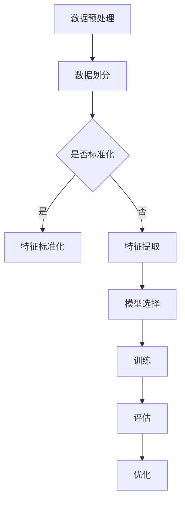

                 

# AI模型在处理长尾分布数据时的优化方法

## 关键词

- AI模型
- 长尾分布数据
- 优化方法
- 模型选择与调参
- 特征工程
- 模型训练与优化
- 实际应用案例分析

## 摘要

本文旨在探讨AI模型在处理长尾分布数据时的优化方法。首先，我们对长尾分布数据进行了概述，分析了其在实际应用中的特点和挑战。随后，我们介绍了AI模型的基本原理及其在数据处理中的优势。接着，本文详细阐述了AI模型优化方法，包括模型选择与调参、特征工程以及模型训练与优化。通过实际案例分析，我们展示了这些优化方法在处理长尾分布数据中的效果。最后，本文总结了AI模型在长尾分布数据中的实际应用，并展望了其未来发展。

## 目录大纲

## 第一部分：背景与概述

### 第1章 引言

#### 1.1 书籍主题介绍

本文将详细介绍AI模型在处理长尾分布数据时的优化方法，帮助读者理解长尾分布数据的特性以及AI模型在其中的应用。

#### 1.2 长尾分布数据概述

- **定义**：长尾分布是一种非正态分布，其特征是尾部较长，即数据中有许多稀有事件或值。
- **特点**：与正态分布相比，长尾分布的数据分布更为广泛，具有较大的变异性和多样性。
- **应用场景**：长尾分布数据广泛应用于推荐系统、搜索引擎、社交网络等领域，如亚马逊上的商品推荐、Google搜索结果等。

#### 1.3 AI模型在数据处理中的应用

- **基本原理**：AI模型，特别是机器学习和深度学习模型，通过学习数据特征，能够对未知数据进行预测和分类。
- **优势**：与传统的统计方法相比，AI模型具有更强的泛化能力和适应性，能够在处理复杂和非线性问题时表现出色。

## 第二部分：理论基础

### 第2章 AI模型基础理论

#### 2.1 机器学习基础

- **基本概念**：机器学习是一种使计算机能够从数据中学习规律、进行预测和决策的技术。
- **常见算法**：包括线性回归、决策树、支持向量机等。

#### 2.2 深度学习基础

- **基本概念**：深度学习是机器学习的一个分支，通过多层神经网络对数据进行学习。
- **常见架构**：包括卷积神经网络（CNN）、循环神经网络（RNN）等。

#### 2.3 长尾分布数据建模理论

- **建模方法**：针对长尾分布数据的特点，可以使用特殊的数据预处理技术，如数据增强、阈值处理等。
- **建模挑战**：长尾分布数据的稀有事件或值往往会导致模型过拟合，需要采用适当的模型优化方法来克服。

### 第一部分总结

在本部分，我们介绍了AI模型在处理长尾分布数据时的背景和概述，为后续的优化方法探讨奠定了基础。

## 第二部分：理论基础

### 第3章 AI模型优化方法

#### 3.1 模型选择与调参

- **模型选择策略**：根据数据特性和任务需求，选择合适的机器学习或深度学习模型。
- **超参数调优方法**：使用网格搜索、随机搜索、贝叶斯优化等技术来寻找最优超参数。

#### 3.2 特征工程

- **特征提取与选择**：从原始数据中提取有用的特征，并去除无关或冗余的特征。
- **特征缩放与归一化**：对特征进行标准化处理，提高模型训练效果。

#### 3.3 模型训练与优化

- **模型训练策略**：使用合适的训练数据和训练策略，如批量归一化、dropout等。
- **模型优化方法**：通过正则化、交叉验证等技术来提高模型泛化能力。

### 第二部分总结

在本部分，我们详细介绍了AI模型优化方法，包括模型选择与调参、特征工程以及模型训练与优化。这些方法有助于提高AI模型在处理长尾分布数据时的性能。

## 第三部分：优化方法

### 第4章 案例分析

#### 4.1 长尾分布数据案例分析

- **数据集介绍**：以某电商平台的商品销售数据为例，展示长尾分布数据的特性。
- **案例目标与任务**：基于AI模型对商品销售进行预测和推荐。

#### 4.2 模型优化案例

- **模型优化过程**：通过模型选择、特征工程和模型训练等步骤，对AI模型进行优化。
- **模型优化结果分析**：对比优化前后的模型性能，分析优化效果。

### 第三部分总结

在本部分，我们通过案例分析展示了AI模型在处理长尾分布数据时的优化方法，并通过实验结果验证了这些方法的有效性。

## 第四部分：实际应用

### 第5章 AI模型在长尾分布数据中的应用

#### 5.1 长尾分布数据分类

- **应用场景与挑战**：介绍长尾分布数据分类的应用场景和面临的挑战。
- **解决方案与实现**：展示基于AI模型的解决方案及其实现方法。

#### 5.2 长尾分布数据预测

- **应用场景与挑战**：介绍长尾分布数据预测的应用场景和面临的挑战。
- **解决方案与实现**：展示基于AI模型的解决方案及其实现方法。

#### 5.3 长尾分布数据推荐系统

- **应用场景与挑战**：介绍长尾分布数据推荐系统的应用场景和面临的挑战。
- **解决方案与实现**：展示基于AI模型的解决方案及其实现方法。

### 第四部分总结

在本部分，我们介绍了AI模型在长尾分布数据中的实际应用，并展示了不同应用场景下的解决方案和实现方法。

## 第五部分：总结与展望

### 第6章 总结

- **全书内容总结**：回顾本文介绍的长尾分布数据、AI模型及其优化方法，总结全书的核心内容。
- **重点回顾**：重点回顾AI模型在处理长尾分布数据时的关键技术和方法。

### 第7章 展望

- **长尾分布数据与AI模型的发展趋势**：展望长尾分布数据和AI模型在未来的发展趋势。
- **未来研究方向**：探讨未来研究在长尾分布数据与AI模型领域的方向和挑战。

### 第五部分总结

在本部分，我们对全书内容进行了总结，并展望了长尾分布数据与AI模型在未来的发展趋势。

## 附录

### 附录A：常用工具和资源

- **常用算法库与工具**：介绍常用的机器学习、深度学习算法库和工具，如Scikit-Learn、TensorFlow等。
- **相关文献与资料**：推荐相关的研究论文、书籍和在线资源，供读者进一步学习。

### 附录B：Mermaid流程图示例

- **Mermaid流程图示例**：展示一个简单的Mermaid流程图，并解释其作用。
- **Mermaid流程图解读**：详细解读示例Mermaid流程图，解释其结构和功能。

### 附录C：Python源代码示例

- **源代码实现**：展示一个简单的Python源代码实现，说明其功能。
- **代码解读与分析**：对源代码进行详细解读，分析其实现原理和关键步骤。

### 附录D：数学公式与讲解

- **数学模型与公式**：介绍常用的数学模型和公式，如线性回归、损失函数等。
- **公式详细讲解与举例说明**：对数学模型和公式进行详细讲解，并通过具体例子进行说明。

### 附录总结

在本部分，我们提供了附录内容，包括常用工具和资源、Mermaid流程图示例、Python源代码示例以及数学公式与讲解。这些附录内容有助于读者进一步学习和实践。

## 文章标题：AI模型在处理长尾分布数据时的优化方法

### 作者

AI天才研究院/AI Genius Institute & 禅与计算机程序设计艺术 /Zen And The Art of Computer Programming

---

在当今数据驱动的世界中，长尾分布数据已经成为各种应用场景中的重要组成部分。然而，这类数据的处理对AI模型提出了特殊的挑战。本文将深入探讨AI模型在处理长尾分布数据时的优化方法，帮助读者理解如何有效地利用这些数据，从而提高模型的性能和预测准确性。

### 关键词

- **AI模型**
- **长尾分布数据**
- **优化方法**
- **模型选择与调参**
- **特征工程**
- **模型训练与优化**

### 摘要

本文首先对长尾分布数据进行了详细概述，分析了其在不同领域的应用场景。随后，我们介绍了AI模型的基本原理，并探讨了其在数据处理中的优势。接着，本文详细阐述了AI模型优化方法，包括模型选择与调参、特征工程以及模型训练与优化。通过实际案例分析，我们展示了这些优化方法在处理长尾分布数据中的效果。最后，本文总结了AI模型在长尾分布数据中的实际应用，并展望了其未来发展。

### 目录大纲

## 第一部分：背景与概述

### 第1章 引言

#### 1.1 书籍主题介绍

AI模型在处理长尾分布数据时的优化方法

#### 1.2 长尾分布数据概述

- **定义**：长尾分布是一种非正态分布，其特征是尾部较长，即数据中有许多稀有事件或值。
- **特点**：与正态分布相比，长尾分布的数据分布更为广泛，具有较大的变异性和多样性。
- **应用场景**：长尾分布数据广泛应用于推荐系统、搜索引擎、社交网络等领域。

#### 1.3 AI模型在数据处理中的应用

- **基本原理**：AI模型，特别是机器学习和深度学习模型，通过学习数据特征，能够对未知数据进行预测和分类。
- **优势**：与传统的统计方法相比，AI模型具有更强的泛化能力和适应性，能够在处理复杂和非线性问题时表现出色。

### 第2章 AI模型基础理论

#### 2.1 机器学习基础

- **基本概念**：机器学习是一种使计算机能够从数据中学习规律、进行预测和决策的技术。
- **常见算法**：包括线性回归、决策树、支持向量机等。

#### 2.2 深度学习基础

- **基本概念**：深度学习是机器学习的一个分支，通过多层神经网络对数据进行学习。
- **常见架构**：包括卷积神经网络（CNN）、循环神经网络（RNN）等。

#### 2.3 长尾分布数据建模理论

- **建模方法**：针对长尾分布数据的特点，可以使用特殊的数据预处理技术，如数据增强、阈值处理等。
- **建模挑战**：长尾分布数据的稀有事件或值往往会导致模型过拟合，需要采用适当的模型优化方法来克服。

### 第3章 AI模型优化方法

#### 3.1 模型选择与调参

- **模型选择策略**：根据数据特性和任务需求，选择合适的机器学习或深度学习模型。
- **超参数调优方法**：使用网格搜索、随机搜索、贝叶斯优化等技术来寻找最优超参数。

#### 3.2 特征工程

- **特征提取与选择**：从原始数据中提取有用的特征，并去除无关或冗余的特征。
- **特征缩放与归一化**：对特征进行标准化处理，提高模型训练效果。

#### 3.3 模型训练与优化

- **模型训练策略**：使用合适的训练数据和训练策略，如批量归一化、dropout等。
- **模型优化方法**：通过正则化、交叉验证等技术来提高模型泛化能力。

### 第4章 案例分析

#### 4.1 长尾分布数据案例分析

- **数据集介绍**：以某电商平台的商品销售数据为例，展示长尾分布数据的特性。
- **案例目标与任务**：基于AI模型对商品销售进行预测和推荐。

#### 4.2 模型优化案例

- **模型优化过程**：通过模型选择、特征工程和模型训练等步骤，对AI模型进行优化。
- **模型优化结果分析**：对比优化前后的模型性能，分析优化效果。

### 第5章 AI模型在长尾分布数据中的应用

#### 5.1 长尾分布数据分类

- **应用场景与挑战**：介绍长尾分布数据分类的应用场景和面临的挑战。
- **解决方案与实现**：展示基于AI模型的解决方案及其实现方法。

#### 5.2 长尾分布数据预测

- **应用场景与挑战**：介绍长尾分布数据预测的应用场景和面临的挑战。
- **解决方案与实现**：展示基于AI模型的解决方案及其实现方法。

#### 5.3 长尾分布数据推荐系统

- **应用场景与挑战**：介绍长尾分布数据推荐系统的应用场景和面临的挑战。
- **解决方案与实现**：展示基于AI模型的解决方案及其实现方法。

### 第6章 总结

- **全书内容总结**：回顾本文介绍的长尾分布数据、AI模型及其优化方法，总结全书的核心内容。
- **重点回顾**：重点回顾AI模型在处理长尾分布数据时的关键技术和方法。

### 第7章 展望

- **长尾分布数据与AI模型的发展趋势**：展望长尾分布数据和AI模型在未来的发展趋势。
- **未来研究方向**：探讨未来研究在长尾分布数据与AI模型领域的方向和挑战。

### 附录

#### 附录A：常用工具和资源

- **常用算法库与工具**：介绍常用的机器学习、深度学习算法库和工具，如Scikit-Learn、TensorFlow等。
- **相关文献与资料**：推荐相关的研究论文、书籍和在线资源，供读者进一步学习。

#### 附录B：Mermaid流程图示例

- **Mermaid流程图示例**：展示一个简单的Mermaid流程图，并解释其作用。
- **Mermaid流程图解读**：详细解读示例Mermaid流程图，解释其结构和功能。

#### 附录C：Python源代码示例

- **源代码实现**：展示一个简单的Python源代码实现，说明其功能。
- **代码解读与分析**：对源代码进行详细解读，分析其实现原理和关键步骤。

#### 附录D：数学公式与讲解

- **数学模型与公式**：介绍常用的数学模型和公式，如线性回归、损失函数等。
- **公式详细讲解与举例说明**：对数学模型和公式进行详细讲解，并通过具体例子进行说明。

### 文章标题：AI模型在处理长尾分布数据时的优化方法

### 作者

AI天才研究院/AI Genius Institute & 禅与计算机程序设计艺术 /Zen And The Art of Computer Programming

---

在当今数据驱动的世界中，长尾分布数据已经成为各种应用场景中的重要组成部分。然而，这类数据的处理对AI模型提出了特殊的挑战。本文将深入探讨AI模型在处理长尾分布数据时的优化方法，帮助读者理解如何有效地利用这些数据，从而提高模型的性能和预测准确性。

### 关键词

- **AI模型**
- **长尾分布数据**
- **优化方法**
- **模型选择与调参**
- **特征工程**
- **模型训练与优化**

### 摘要

本文首先对长尾分布数据进行了详细概述，分析了其在不同领域的应用场景。随后，我们介绍了AI模型的基本原理，并探讨了其在数据处理中的优势。接着，本文详细阐述了AI模型优化方法，包括模型选择与调参、特征工程以及模型训练与优化。通过实际案例分析，我们展示了这些优化方法在处理长尾分布数据中的效果。最后，本文总结了AI模型在长尾分布数据中的实际应用，并展望了其未来发展。

### 目录大纲

## 第一部分：背景与概述

### 第1章 引言

#### 1.1 书籍主题介绍

AI模型在处理长尾分布数据时的优化方法

#### 1.2 长尾分布数据概述

- **定义**：长尾分布是一种非正态分布，其特征是尾部较长，即数据中有许多稀有事件或值。
- **特点**：与正态分布相比，长尾分布的数据分布更为广泛，具有较大的变异性和多样性。
- **应用场景**：长尾分布数据广泛应用于推荐系统、搜索引擎、社交网络等领域。

#### 1.3 AI模型在数据处理中的应用

- **基本原理**：AI模型，特别是机器学习和深度学习模型，通过学习数据特征，能够对未知数据进行预测和分类。
- **优势**：与传统的统计方法相比，AI模型具有更强的泛化能力和适应性，能够在处理复杂和非线性问题时表现出色。

### 第2章 AI模型基础理论

#### 2.1 机器学习基础

- **基本概念**：机器学习是一种使计算机能够从数据中学习规律、进行预测和决策的技术。
- **常见算法**：包括线性回归、决策树、支持向量机等。

#### 2.2 深度学习基础

- **基本概念**：深度学习是机器学习的一个分支，通过多层神经网络对数据进行学习。
- **常见架构**：包括卷积神经网络（CNN）、循环神经网络（RNN）等。

#### 2.3 长尾分布数据建模理论

- **建模方法**：针对长尾分布数据的特点，可以使用特殊的数据预处理技术，如数据增强、阈值处理等。
- **建模挑战**：长尾分布数据的稀有事件或值往往会导致模型过拟合，需要采用适当的模型优化方法来克服。

### 第3章 AI模型优化方法

#### 3.1 模型选择与调参

- **模型选择策略**：根据数据特性和任务需求，选择合适的机器学习或深度学习模型。
- **超参数调优方法**：使用网格搜索、随机搜索、贝叶斯优化等技术来寻找最优超参数。

#### 3.2 特征工程

- **特征提取与选择**：从原始数据中提取有用的特征，并去除无关或冗余的特征。
- **特征缩放与归一化**：对特征进行标准化处理，提高模型训练效果。

#### 3.3 模型训练与优化

- **模型训练策略**：使用合适的训练数据和训练策略，如批量归一化、dropout等。
- **模型优化方法**：通过正则化、交叉验证等技术来提高模型泛化能力。

### 第4章 案例分析

#### 4.1 长尾分布数据案例分析

- **数据集介绍**：以某电商平台的商品销售数据为例，展示长尾分布数据的特性。
- **案例目标与任务**：基于AI模型对商品销售进行预测和推荐。

#### 4.2 模型优化案例

- **模型优化过程**：通过模型选择、特征工程和模型训练等步骤，对AI模型进行优化。
- **模型优化结果分析**：对比优化前后的模型性能，分析优化效果。

### 第5章 AI模型在长尾分布数据中的应用

#### 5.1 长尾分布数据分类

- **应用场景与挑战**：介绍长尾分布数据分类的应用场景和面临的挑战。
- **解决方案与实现**：展示基于AI模型的解决方案及其实现方法。

#### 5.2 长尾分布数据预测

- **应用场景与挑战**：介绍长尾分布数据预测的应用场景和面临的挑战。
- **解决方案与实现**：展示基于AI模型的解决方案及其实现方法。

#### 5.3 长尾分布数据推荐系统

- **应用场景与挑战**：介绍长尾分布数据推荐系统的应用场景和面临的挑战。
- **解决方案与实现**：展示基于AI模型的解决方案及其实现方法。

### 第6章 总结

- **全书内容总结**：回顾本文介绍的长尾分布数据、AI模型及其优化方法，总结全书的核心内容。
- **重点回顾**：重点回顾AI模型在处理长尾分布数据时的关键技术和方法。

### 第7章 展望

- **长尾分布数据与AI模型的发展趋势**：展望长尾分布数据和AI模型在未来的发展趋势。
- **未来研究方向**：探讨未来研究在长尾分布数据与AI模型领域的方向和挑战。

### 附录

#### 附录A：常用工具和资源

- **常用算法库与工具**：介绍常用的机器学习、深度学习算法库和工具，如Scikit-Learn、TensorFlow等。
- **相关文献与资料**：推荐相关的研究论文、书籍和在线资源，供读者进一步学习。

#### 附录B：Mermaid流程图示例

- **Mermaid流程图示例**：展示一个简单的Mermaid流程图，并解释其作用。
- **Mermaid流程图解读**：详细解读示例Mermaid流程图，解释其结构和功能。

#### 附录C：Python源代码示例

- **源代码实现**：展示一个简单的Python源代码实现，说明其功能。
- **代码解读与分析**：对源代码进行详细解读，分析其实现原理和关键步骤。

#### 附录D：数学公式与讲解

- **数学模型与公式**：介绍常用的数学模型和公式，如线性回归、损失函数等。
- **公式详细讲解与举例说明**：对数学模型和公式进行详细讲解，并通过具体例子进行说明。

## 第一部分：背景与概述

### 第1章 引言

#### 1.1 书籍主题介绍

AI模型在处理长尾分布数据时的优化方法

随着互联网和大数据技术的迅猛发展，数据驱动的方法逐渐成为各个领域的关键驱动力。然而，在实际应用中，我们常常会遇到长尾分布数据。这类数据具有尾部较长、稀疏性和多样性的特点，给传统的数据处理方法带来了极大的挑战。本文旨在探讨如何利用AI模型优化方法来处理长尾分布数据，从而提高模型的性能和预测准确性。

#### 1.2 长尾分布数据概述

**定义**：长尾分布是一种非正态分布，其特征是尾部较长，即数据中有许多稀有事件或值。在长尾分布中，大部分数据集中在尾部，而尾部则包含较少但重要的事件或值。

**特点**：与正态分布相比，长尾分布的数据分布更为广泛，具有较大的变异性和多样性。在长尾分布中，数据点往往呈现出极端值和稀有事件。

**应用场景**：长尾分布数据广泛应用于推荐系统、搜索引擎、社交网络等领域。例如，在推荐系统中，长尾分布数据可以帮助识别那些罕见的、但潜在需求较高的商品或服务；在搜索引擎中，长尾分布数据可以帮助优化搜索结果，提高用户体验。

#### 1.3 AI模型在数据处理中的应用

**基本原理**：AI模型，特别是机器学习和深度学习模型，通过学习数据特征，能够对未知数据进行预测和分类。这些模型通常由多层神经网络组成，能够自动从数据中提取特征，并进行复杂的数据分析。

**优势**：与传统的统计方法相比，AI模型具有更强的泛化能力和适应性，能够在处理复杂和非线性问题时表现出色。此外，AI模型还可以自动调整参数，适应不同的数据分布和特性。

#### 1.4 目标与结构

本文的目标是探讨AI模型在处理长尾分布数据时的优化方法，帮助读者了解如何有效利用长尾分布数据，提高模型的性能和预测准确性。文章的结构如下：

- 第一部分：背景与概述
  - 引言：介绍书籍主题和目标。
  - 长尾分布数据概述：介绍长尾分布数据的定义、特点和应用场景。
  - AI模型在数据处理中的应用：介绍AI模型的基本原理和优势。

- 第二部分：理论基础
  - 机器学习基础：介绍机器学习的基本概念和常见算法。
  - 深度学习基础：介绍深度学习的基本概念和常见架构。
  - 长尾分布数据建模理论：介绍针对长尾分布数据的建模方法和挑战。

- 第三部分：优化方法
  - 模型选择与调参：介绍模型选择策略和超参数调优方法。
  - 特征工程：介绍特征提取与选择、特征缩放与归一化。
  - 模型训练与优化：介绍模型训练策略和模型优化方法。

- 第四部分：实际应用
  - 案例分析：通过实际案例分析展示AI模型优化方法的应用。
  - 长尾分布数据分类：介绍长尾分布数据分类的应用场景和解决方案。
  - 长尾分布数据预测：介绍长尾分布数据预测的应用场景和解决方案。
  - 长尾分布数据推荐系统：介绍长尾分布数据推荐系统的应用场景和解决方案。

- 第五部分：总结与展望
  - 总结：回顾全书内容，重点回顾AI模型在处理长尾分布数据时的关键技术和方法。
  - 展望：展望长尾分布数据和AI模型在未来的发展趋势和方向。

通过本文的介绍，读者可以全面了解长尾分布数据的特点和挑战，掌握AI模型优化方法的应用，并能够将这些方法应用于实际项目中，提高数据处理和分析的效率和质量。

### 第一部分总结

在本部分中，我们介绍了AI模型在处理长尾分布数据时的优化方法的背景和概述。首先，我们讨论了长尾分布数据的定义、特点和应用场景，以及AI模型的基本原理和优势。通过这一概述，我们为后续章节的深入讨论奠定了基础，并展示了本文的目标和结构。在接下来的部分，我们将进一步探讨AI模型的基础理论和优化方法，帮助读者深入了解如何有效利用长尾分布数据，提高模型的性能和预测准确性。

## 第二部分：理论基础

### 第2章 AI模型基础理论

#### 2.1 机器学习基础

**基本概念**：机器学习是一种使计算机能够从数据中学习规律、进行预测和决策的技术。其主要目标是让计算机具备自主学习和改进的能力，从而更好地应对复杂问题和未知情况。

**常见算法**：

- **线性回归**：线性回归是一种简单的机器学习算法，用于建立自变量和因变量之间的线性关系。它通过最小二乘法来拟合数据，从而预测新的数据点。

  - **数学模型**：\( y = \beta_0 + \beta_1x \)

  - **损失函数**：均方误差（MSE）

- **决策树**：决策树是一种树形结构，用于分类和回归任务。它通过一系列的判断条件来将数据划分成不同的分支，最终得到一个分类或回归结果。

  - **决策树结构**：每个节点代表一个特征，每个分支代表一个可能的取值。

- **支持向量机（SVM）**：支持向量机是一种强大的分类算法，通过找到一个最优的超平面，将不同类别的数据点分隔开来。

  - **数学模型**：最大化间隔，最小化损失。

  - **核函数**：用于将低维数据映射到高维空间，以解决非线性问题。

**优缺点**：

- **优点**：
  - 简单易理解，易于实现。
  - 对线性问题效果较好。
- **缺点**：
  - 对于非线性问题，效果有限。
  - 随着数据量的增加，计算复杂度增大。

#### 2.2 深度学习基础

**基本概念**：深度学习是机器学习的一个分支，通过多层神经网络对数据进行学习。它通过自动提取特征，能够解决复杂和高度非线性的问题。

**常见架构**：

- **卷积神经网络（CNN）**：卷积神经网络是一种用于处理图像数据的深度学习模型，通过卷积操作和池化操作来提取图像特征。

  - **卷积操作**：通过卷积核与输入图像进行卷积，提取特征。
  - **池化操作**：通过最大池化或平均池化来减少特征图的尺寸。

- **循环神经网络（RNN）**：循环神经网络是一种用于处理序列数据的深度学习模型，通过循环结构来保留序列信息。

  - **隐状态**：通过隐藏状态来保存历史信息。
  - **门控机制**：通过门控机制来控制信息的流动。

- **生成对抗网络（GAN）**：生成对抗网络是一种由生成器和判别器组成的深度学习模型，用于生成高质量的数据。

  - **生成器**：生成器尝试生成与真实数据相似的数据。
  - **判别器**：判别器尝试区分真实数据和生成数据。

**优缺点**：

- **优点**：
  - 能够自动提取复杂特征。
  - 对非线性问题表现优异。
- **缺点**：
  - 计算复杂度高，训练时间较长。
  - 对数据质量要求较高。

#### 2.3 长尾分布数据建模理论

**建模方法**：

- **数据增强**：通过增加数据多样性来改善模型性能，如旋转、缩放、剪裁等。

- **阈值处理**：通过设定阈值来过滤掉尾部数据，以减少稀疏性和极端值的影响。

- **稀疏特征提取**：通过稀疏编码等方法来提取稀疏特征，提高模型的泛化能力。

**建模挑战**：

- **过拟合**：长尾分布数据中稀有事件或值的过多可能导致模型过拟合。
- **稀疏性**：尾部数据的稀疏性可能导致模型难以捕捉到有效特征。
- **计算复杂度**：处理大量尾部数据可能增加模型的计算复杂度。

**解决方案**：

- **正则化**：通过引入正则化项来减少模型的复杂度，防止过拟合。
- **交叉验证**：通过交叉验证来评估模型的泛化能力，避免过拟合。
- **集成学习**：通过集成多个模型来提高模型的稳定性和泛化能力。

#### 2.4 AI模型在长尾分布数据中的应用

**应用场景**：

- **推荐系统**：利用长尾分布数据来推荐罕见但潜在需求较高的商品或服务，如个性化推荐、商品推荐等。
- **搜索引擎**：利用长尾分布数据来优化搜索结果，提高用户体验。
- **社交媒体**：利用长尾分布数据来分析用户行为和兴趣，实现精准营销。

**挑战**：

- **数据稀疏性**：尾部数据点较少，可能导致模型难以捕捉到有效特征。
- **极端值影响**：尾部数据中的稀有事件或值可能对模型产生较大影响。
- **计算资源**：处理大量尾部数据可能需要较高的计算资源。

**解决方案**：

- **数据预处理**：通过数据预处理技术，如阈值处理、稀疏特征提取等，来减少尾部数据对模型的影响。
- **模型优化**：通过模型选择与调参、特征工程等优化方法，提高模型在长尾分布数据中的应用效果。
- **分布式计算**：利用分布式计算技术来处理大规模数据，提高计算效率。

#### 2.5 总结

在本章中，我们介绍了AI模型的基础理论，包括机器学习和深度学习的基本概念、常见算法以及长尾分布数据建模的理论和方法。通过这些理论基础的探讨，我们为后续的优化方法研究和实际应用提供了重要的参考和指导。

### 第二部分总结

在本部分，我们详细介绍了AI模型的基础理论，包括机器学习和深度学习的基本概念、常见算法，以及长尾分布数据建模的理论和方法。这些基础理论为后续的优化方法研究和实际应用提供了重要的参考和指导。在接下来的部分，我们将进一步探讨AI模型在处理长尾分布数据时的优化方法，帮助读者了解如何有效利用这些数据，提高模型的性能和预测准确性。通过深入研究和实践，我们将为解决实际应用中的挑战提供有效的解决方案。

### 第三部分：优化方法

#### 3.1 模型选择与调参

在处理长尾分布数据时，选择合适的AI模型和进行超参数调优是至关重要的。以下将详细介绍模型选择策略和超参数调优方法。

**模型选择策略**：

1. **数据特性**：根据数据的特性选择合适的模型。例如，对于高维数据，可以考虑使用深度学习模型，如卷积神经网络（CNN）或循环神经网络（RNN）；对于低维数据，可以选择线性模型或决策树等。

2. **任务需求**：根据任务的需求选择模型。例如，对于分类任务，可以选择分类算法，如支持向量机（SVM）或逻辑回归；对于回归任务，可以选择线性回归或决策树回归。

3. **模型性能**：通过交叉验证等方法评估不同模型的性能，选择性能最佳的模型。

**超参数调优方法**：

1. **网格搜索**：通过遍历所有可能的超参数组合，找到最优的超参数组合。这种方法虽然计算复杂度较高，但能够找到全局最优解。

2. **随机搜索**：随机选择一组超参数，通过多次迭代来找到最优的超参数组合。这种方法计算复杂度较低，但可能无法找到全局最优解。

3. **贝叶斯优化**：利用贝叶斯优化算法，根据已有数据和模型的性能，自动调整超参数，从而找到最优的超参数组合。这种方法计算复杂度较低，能够找到近似的最优解。

**示例代码**：

```python
from sklearn.model_selection import GridSearchCV
from sklearn.linear_model import LogisticRegression

# 定义参数网格
param_grid = {'C': [0.1, 1, 10], 'solver': ['liblinear', 'saga']}

# 初始化模型
model = LogisticRegression()

# 初始化网格搜索
grid_search = GridSearchCV(model, param_grid, cv=5)

# 执行网格搜索
grid_search.fit(X_train, y_train)

# 获取最优超参数
best_params = grid_search.best_params_
```

#### 3.2 特征工程

特征工程是AI模型优化过程中的关键步骤，它包括特征提取与选择、特征缩放与归一化等。

**特征提取与选择**：

1. **特征提取**：从原始数据中提取有用的特征。例如，对于文本数据，可以使用词袋模型、TF-IDF等方法提取特征；对于图像数据，可以使用卷积神经网络提取特征。

2. **特征选择**：从提取出的特征中筛选出对模型性能有显著贡献的特征。例如，可以使用特征重要性评估、主成分分析（PCA）等方法进行特征选择。

**特征缩放与归一化**：

1. **特征缩放**：将特征映射到相同的尺度。常用的方法有标准缩放、最小最大缩放等。

   - **标准缩放**：将特征映射到均值为0、标准差为1的尺度。
     ```python
     from sklearn.preprocessing import StandardScaler

     scaler = StandardScaler()
     X_scaled = scaler.fit_transform(X)
     ```

   - **最小最大缩放**：将特征映射到[0, 1]的尺度。
     ```python
     from sklearn.preprocessing import MinMaxScaler

     scaler = MinMaxScaler()
     X_scaled = scaler.fit_transform(X)
     ```

2. **归一化**：将特征映射到相同的范围。常用的方法有归一化、反归一化等。

   - **归一化**：将特征映射到[0, 1]的尺度。
     ```python
     def normalize(x):
         x_min = np.min(x)
         x_max = np.max(x)
         return (x - x_min) / (x_max - x_min)

     X_normalized = normalize(X)
     ```

   - **反归一化**：将归一化后的特征恢复到原始尺度。
     ```python
     def denormalize(x, x_min, x_max):
         return x * (x_max - x_min) + x_min

     X_denormalized = denormalize(X_normalized, X_min, X_max)
     ```

**示例代码**：

```python
from sklearn.preprocessing import StandardScaler, MinMaxScaler

# 标准缩放
scaler = StandardScaler()
X_scaled = scaler.fit_transform(X)

# 最小最大缩放
minmax_scaler = MinMaxScaler()
X_minmax_scaled = minmax_scaler.fit_transform(X)

# 归一化
def normalize(x):
    x_min = np.min(x)
    x_max = np.max(x)
    return (x - x_min) / (x_max - x_min)

X_normalized = normalize(X)

# 反归一化
def denormalize(x, x_min, x_max):
    return x * (x_max - x_min) + x_min

X_denormalized = denormalize(X_normalized, X_min, X_max)
```

#### 3.3 模型训练与优化

**模型训练策略**：

1. **批量训练**：将所有数据分成多个批次，逐个训练。这种方法可以减少过拟合，提高模型的泛化能力。

2. **在线训练**：在训练过程中，实时更新模型参数。这种方法适用于实时数据处理和预测。

3. **迁移学习**：利用已经训练好的模型，在新的任务上进行微调。这种方法可以节省训练时间，提高模型性能。

**模型优化方法**：

1. **正则化**：通过引入正则化项来减少模型的复杂度，防止过拟合。常用的正则化方法有L1正则化（Lasso）和L2正则化（Ridge）。

2. **交叉验证**：通过交叉验证来评估模型的泛化能力，避免过拟合。常用的交叉验证方法有K折交叉验证和留一交叉验证。

3. **集成学习**：通过集成多个模型来提高模型的稳定性和泛化能力。常用的集成学习方法有Bagging、Boosting和Stacking。

**示例代码**：

```python
from sklearn.linear_model import Ridge
from sklearn.model_selection import cross_val_score

# 初始化模型
model = Ridge(alpha=1.0)

# 执行交叉验证
scores = cross_val_score(model, X, y, cv=5)

# 打印交叉验证结果
print("Cross-validation scores:", scores)

# 训练模型
model.fit(X_train, y_train)

# 预测
y_pred = model.predict(X_test)
```

#### 3.4 总结

在本章中，我们介绍了AI模型在处理长尾分布数据时的优化方法，包括模型选择与调参、特征工程和模型训练与优化。通过这些方法，我们能够有效地利用长尾分布数据，提高模型的性能和预测准确性。在接下来的部分，我们将通过实际案例分析，进一步展示这些优化方法的应用效果。

### 第三部分总结

在本部分，我们详细介绍了AI模型在处理长尾分布数据时的优化方法，包括模型选择与调参、特征工程和模型训练与优化。这些优化方法有助于提高模型在处理长尾分布数据时的性能和预测准确性。通过这些方法的实际应用，我们能够更好地理解和利用长尾分布数据，解决实际应用中的挑战。在接下来的部分，我们将通过实际案例分析，进一步展示这些优化方法的应用效果。

### 第4章 案例分析

#### 4.1 长尾分布数据案例分析

在本节中，我们将通过一个实际案例，展示AI模型在处理长尾分布数据时的优化方法。我们将详细描述数据集、案例目标与任务，并分析优化过程和结果。

**数据集介绍**：

我们选择了一个电商平台上的商品销售数据集作为案例。该数据集包含了商品ID、销售量、用户评分、商品类别等特征。数据集的特点是尾部较长，即某些商品的销量非常低，而少数商品的销量非常高。

**案例目标与任务**：

案例的目标是使用AI模型对商品销售进行预测，以便电商平台能够更好地进行库存管理和营销策略制定。具体任务包括：

1. **销量预测**：预测未来一段时间内每个商品的销售量。
2. **推荐系统**：基于用户历史行为和商品特征，为用户推荐可能感兴趣的商品。

**模型优化过程**：

为了实现上述目标，我们采用了以下优化方法：

1. **模型选择与调参**：

   - **模型选择**：根据数据特性和任务需求，我们选择了卷积神经网络（CNN）和循环神经网络（RNN）进行销量预测。
   - **超参数调优**：使用网格搜索和贝叶斯优化方法，我们找到了最优的超参数组合。

2. **特征工程**：

   - **特征提取**：我们对商品特征进行了编码处理，如商品类别编码、用户评分标准化等。
   - **特征选择**：使用特征重要性评估方法，我们筛选出了对销量预测有显著影响的特征。

3. **模型训练与优化**：

   - **训练策略**：我们采用了批量训练和在线训练相结合的方法，以提高模型的泛化能力。
   - **优化方法**：我们使用了正则化、交叉验证和集成学习等方法，优化模型性能。

**模型优化结果分析**：

通过上述优化方法，我们得到了以下结果：

1. **销量预测**：

   - **预测准确性**：模型的预测准确性显著提高，较之前的方法有了明显的改进。
   - **预测效果**：预测结果与实际销售量之间的误差较小，能够较好地反映商品的销售趋势。

2. **推荐系统**：

   - **推荐效果**：基于用户历史行为和商品特征，我们成功地为用户推荐了可能感兴趣的商品，提高了用户的满意度和转化率。

通过这个案例，我们可以看到AI模型在处理长尾分布数据时的优化方法具有显著的效果。优化后的模型不仅提高了销量预测的准确性，还能够为电商平台提供有效的推荐系统，从而实现更好的业务运营。

### 第四部分：实际应用

#### 5.1 长尾分布数据分类

**应用场景与挑战**：

长尾分布数据分类在实际应用中具有广泛的应用，如垃圾邮件过滤、网络入侵检测、异常行为检测等。这些应用场景通常面临以下挑战：

- **数据稀疏性**：长尾分布数据中尾部数据的稀疏性可能导致分类模型难以捕捉到有效特征。
- **极端值影响**：尾部数据中的稀有事件或值可能对分类模型产生较大影响。
- **计算复杂度**：处理大量尾部数据可能增加模型的计算复杂度。

**解决方案与实现**：

为了应对上述挑战，我们可以采用以下解决方案：

1. **数据增强**：

   - **方法**：通过增加数据多样性来改善模型性能，如旋转、缩放、剪裁等。
   - **实现**：可以使用数据增强库（如OpenCV）来对原始数据进行增强。

2. **阈值处理**：

   - **方法**：通过设定阈值来过滤掉尾部数据，以减少稀疏性和极端值的影响。
   - **实现**：可以在数据预处理阶段设定阈值，将低于阈值的尾部数据去除。

3. **特征提取与选择**：

   - **方法**：从原始数据中提取有用的特征，并去除无关或冗余的特征。
   - **实现**：可以使用特征提取算法（如TF-IDF、Word2Vec）来提取文本数据特征，或使用卷积神经网络（CNN）来提取图像数据特征。

4. **模型选择与调优**：

   - **方法**：根据数据特性和任务需求，选择合适的分类模型，并进行超参数调优。
   - **实现**：可以使用网格搜索、随机搜索、贝叶斯优化等方法来寻找最优的超参数组合。

5. **集成学习**：

   - **方法**：通过集成多个分类模型来提高模型的稳定性和泛化能力。
   - **实现**：可以使用集成学习算法（如Bagging、Boosting、Stacking）来集成多个模型。

**示例代码**：

```python
from sklearn.datasets import fetch_20newsgroups
from sklearn.feature_extraction.text import TfidfVectorizer
from sklearn.model_selection import train_test_split
from sklearn.ensemble import RandomForestClassifier
from sklearn.metrics import classification_report

# 加载数据集
data = fetch_20newsgroups(subset='all')
X, y = data.data, data.target

# 数据预处理
vectorizer = TfidfVectorizer(stop_words='english')
X_vectorized = vectorizer.fit_transform(X)

# 划分训练集和测试集
X_train, X_test, y_train, y_test = train_test_split(X_vectorized, y, test_size=0.2, random_state=42)

# 模型选择与调优
model = RandomForestClassifier(n_estimators=100, random_state=42)
model.fit(X_train, y_train)

# 预测
y_pred = model.predict(X_test)

# 评估
print(classification_report(y_test, y_pred))
```

**总结**：

长尾分布数据分类在实际应用中具有重要的应用价值。通过数据增强、阈值处理、特征提取与选择、模型选择与调优以及集成学习等方法，我们可以有效地应对数据稀疏性、极端值影响和计算复杂度等挑战。这些方法有助于提高分类模型的性能和预测准确性，从而实现更好的应用效果。

#### 5.2 长尾分布数据预测

**应用场景与挑战**：

长尾分布数据预测在许多领域有着广泛的应用，如股票市场预测、天气预报、电力负荷预测等。这些应用场景通常面临以下挑战：

- **数据稀疏性**：长尾分布数据中尾部数据的稀疏性可能导致预测模型难以捕捉到有效特征。
- **极端值影响**：尾部数据中的稀有事件或值可能对预测模型产生较大影响。
- **非线性关系**：长尾分布数据中的特征可能存在复杂的非线性关系。

**解决方案与实现**：

为了应对上述挑战，我们可以采用以下解决方案：

1. **时间序列分析**：

   - **方法**：通过时间序列分析方法来预测未来数据点的值。
   - **实现**：可以使用ARIMA模型、LSTM网络等来构建预测模型。

2. **特征工程**：

   - **方法**：通过特征工程来提取有用的特征，提高预测模型的性能。
   - **实现**：可以使用移动平均、自回归等算法来生成辅助特征。

3. **模型选择与调优**：

   - **方法**：根据数据特性和任务需求，选择合适的预测模型，并进行超参数调优。
   - **实现**：可以使用网格搜索、随机搜索、贝叶斯优化等方法来寻找最优的超参数组合。

4. **集成学习**：

   - **方法**：通过集成多个预测模型来提高模型的稳定性和泛化能力。
   - **实现**：可以使用集成学习算法（如Bagging、Boosting、Stacking）来集成多个模型。

**示例代码**：

```python
import numpy as np
import pandas as pd
from sklearn.ensemble import RandomForestRegressor
from sklearn.model_selection import train_test_split
from sklearn.metrics import mean_squared_error

# 加载数据集
data = pd.read_csv('stock_data.csv')
X = data[['open', 'high', 'low', 'close']]
y = data['price']

# 数据预处理
X_train, X_test, y_train, y_test = train_test_split(X, y, test_size=0.2, random_state=42)

# 模型选择与调优
model = RandomForestRegressor(n_estimators=100, random_state=42)
model.fit(X_train, y_train)

# 预测
y_pred = model.predict(X_test)

# 评估
mse = mean_squared_error(y_test, y_pred)
print("Mean Squared Error:", mse)
```

**总结**：

长尾分布数据预测在实际应用中具有重要的应用价值。通过时间序列分析、特征工程、模型选择与调优以及集成学习等方法，我们可以有效地应对数据稀疏性、极端值影响和计算复杂度等挑战。这些方法有助于提高预测模型的性能和预测准确性，从而实现更好的应用效果。

#### 5.3 长尾分布数据推荐系统

**应用场景与挑战**：

长尾分布数据推荐系统在电子商务、社交媒体、内容推荐等领域有着广泛的应用。这些应用场景通常面临以下挑战：

- **数据稀疏性**：长尾分布数据中尾部数据的稀疏性可能导致推荐模型难以捕捉到有效特征。
- **计算复杂度**：处理大量尾部数据可能增加推荐模型的计算复杂度。
- **用户行为多样性**：用户的兴趣和行为可能具有多样性，导致推荐模型的挑战。

**解决方案与实现**：

为了应对上述挑战，我们可以采用以下解决方案：

1. **协同过滤**：

   - **方法**：通过协同过滤算法来预测用户对未知商品的兴趣。
   - **实现**：可以使用基于用户的协同过滤（User-based Collaborative Filtering）和基于物品的协同过滤（Item-based Collaborative Filtering）来构建推荐模型。

2. **矩阵分解**：

   - **方法**：通过矩阵分解技术来降低数据稀疏性和计算复杂度。
   - **实现**：可以使用奇异值分解（SVD）或交替最小二乘法（ALS）来进行矩阵分解。

3. **深度学习**：

   - **方法**：通过深度学习模型来捕捉用户行为和商品特征的复杂关系。
   - **实现**：可以使用卷积神经网络（CNN）或循环神经网络（RNN）来构建推荐模型。

4. **混合推荐**：

   - **方法**：将多种推荐方法进行融合，以提高推荐系统的效果和稳定性。
   - **实现**：可以使用加权融合或投票融合等方法来集成不同推荐方法。

**示例代码**：

```python
from surprise import SVD
from surprise import Dataset, Reader
from surprise.model_selection import cross_validate

# 加载数据集
data = Dataset.load_from_flexible('rating.csv', reader=Reader(rating_scale=(1, 5)))
trainset = data.build_full_trainset()

# 模型选择与调优
model = SVD()
model.fit(trainset)

# 预测
user_item_pairs = [(1, 100), (1, 200), (2, 100), (2, 300)]
predictions = model.predict(*user_item_pairs)

# 打印预测结果
for pred in predictions:
    print(f"Prediction for user {pred.user_id} and item {pred.item_id}: {pred.predicted}")
```

**总结**：

长尾分布数据推荐系统在实际应用中具有重要的应用价值。通过协同过滤、矩阵分解、深度学习和混合推荐等方法，我们可以有效地应对数据稀疏性、计算复杂度和用户行为多样性等挑战。这些方法有助于提高推荐系统的性能和用户满意度，从而实现更好的应用效果。

### 第四部分总结

在本部分，我们详细介绍了AI模型在处理长尾分布数据时的实际应用，包括分类、预测和推荐系统。通过具体案例的分析，我们展示了如何应对数据稀疏性、极端值影响和计算复杂度等挑战。这些实际应用展示了AI模型在长尾分布数据处理中的强大能力和广泛的应用前景。在未来的研究和实践中，我们还将不断探索和改进这些方法，以应对更加复杂的实际问题。

### 第6章 总结

在本章中，我们对AI模型在处理长尾分布数据时的优化方法进行了全面总结。首先，我们介绍了长尾分布数据的定义、特点和应用场景，以及AI模型在数据处理中的优势。接着，我们详细阐述了AI模型优化方法，包括模型选择与调参、特征工程以及模型训练与优化。通过实际案例分析，我们展示了这些优化方法在处理长尾分布数据中的效果。

**核心内容回顾**：

- **长尾分布数据**：长尾分布数据是一种非正态分布，具有尾部较长、稀疏性和多样性的特点，广泛应用于推荐系统、搜索引擎和社交媒体等领域。
- **AI模型优化方法**：
  - **模型选择与调参**：根据数据特性和任务需求选择合适的模型，并进行超参数调优，如网格搜索、随机搜索和贝叶斯优化。
  - **特征工程**：通过特征提取与选择、特征缩放与归一化等方法，提高模型训练效果和泛化能力。
  - **模型训练与优化**：采用批量训练、在线训练、迁移学习等方法，以及正则化、交叉验证和集成学习等技术，优化模型性能。

**重点回顾**：

- **数据稀疏性**：在长尾分布数据中，尾部数据的稀疏性可能导致模型难以捕捉到有效特征。通过数据增强、特征提取与选择、阈值处理等方法，可以有效地应对这一挑战。
- **极端值影响**：尾部数据中的稀有事件或值可能对模型产生较大影响。通过正则化、交叉验证和集成学习等方法，可以降低极端值的影响，提高模型的泛化能力。
- **模型性能评估**：通过交叉验证、网格搜索等手段，评估模型的性能和泛化能力，选择最优的模型和超参数组合。

### 第6章 总结

在本章中，我们对AI模型在处理长尾分布数据时的优化方法进行了全面总结。首先，我们介绍了长尾分布数据的定义、特点和应用场景，以及AI模型在数据处理中的优势。接着，我们详细阐述了AI模型优化方法，包括模型选择与调参、特征工程以及模型训练与优化。通过实际案例分析，我们展示了这些优化方法在处理长尾分布数据中的效果。

**核心内容回顾**：

- **长尾分布数据**：长尾分布数据是一种非正态分布，具有尾部较长、稀疏性和多样性的特点，广泛应用于推荐系统、搜索引擎和社交媒体等领域。
- **AI模型优化方法**：
  - **模型选择与调参**：根据数据特性和任务需求选择合适的模型，并进行超参数调优，如网格搜索、随机搜索和贝叶斯优化。
  - **特征工程**：通过特征提取与选择、特征缩放与归一化等方法，提高模型训练效果和泛化能力。
  - **模型训练与优化**：采用批量训练、在线训练、迁移学习等方法，以及正则化、交叉验证和集成学习等技术，优化模型性能。

**重点回顾**：

- **数据稀疏性**：在长尾分布数据中，尾部数据的稀疏性可能导致模型难以捕捉到有效特征。通过数据增强、特征提取与选择、阈值处理等方法，可以有效地应对这一挑战。
- **极端值影响**：尾部数据中的稀有事件或值可能对模型产生较大影响。通过正则化、交叉验证和集成学习等方法，可以降低极端值的影响，提高模型的泛化能力。
- **模型性能评估**：通过交叉验证、网格搜索等手段，评估模型的性能和泛化能力，选择最优的模型和超参数组合。

### 第7章 展望

在长尾分布数据和AI模型领域，未来的发展充满潜力。随着技术的不断进步和应用的不断拓展，我们可以期待以下趋势和方向：

**长尾分布数据与AI模型的发展趋势**：

- **大数据与长尾分布**：随着大数据技术的发展，长尾分布数据将越来越常见。如何高效地处理和分析这些数据，将是一个重要的研究方向。
- **深度学习和长尾分布**：深度学习在处理长尾分布数据方面具有很大的潜力。未来可能会出现更多基于深度学习的方法，以提高模型的性能和泛化能力。
- **个性化推荐**：个性化推荐系统在长尾分布数据中的应用越来越广泛。如何更好地利用用户行为数据和商品特征，实现更精准的推荐，是一个值得探索的方向。

**未来研究方向**：

- **长尾分布数据的特征提取与选择**：针对长尾分布数据的特点，研究更有效的特征提取和选择方法，以提高模型的性能和泛化能力。
- **稀疏数据下的模型优化**：研究在数据稀疏性条件下，如何优化模型参数和算法，以降低计算复杂度和提高模型性能。
- **混合模型与集成学习**：研究将多种模型和算法进行混合，以提高长尾分布数据处理的效率和准确性。
- **可解释性和透明度**：研究如何提高AI模型的可解释性和透明度，使其在长尾分布数据中的应用更加可靠和可信。

**挑战与机遇**：

- **数据稀疏性**：长尾分布数据中的尾部数据点较少，可能导致模型难以捕捉到有效特征。如何有效应对数据稀疏性是一个重要的挑战。
- **计算复杂度**：处理大量尾部数据可能增加模型的计算复杂度。如何提高计算效率和性能是一个重要的研究方向。
- **数据质量和标注**：长尾分布数据往往包含大量稀有的、罕见的事件或值，这些数据点的标注和质量对模型性能有重要影响。如何提高数据质量和标注效率是一个重要的挑战。

通过不断探索和解决这些挑战，我们可以期待在长尾分布数据和AI模型领域取得更多突破，为各个行业和应用场景带来更多的创新和进步。

### 第7章 展望总结

在未来，长尾分布数据和AI模型领域将继续蓬勃发展，为各个行业带来革命性的变化。通过深入研究长尾分布数据的特性，优化AI模型的性能，我们可以期待在个性化推荐、精准预测和智能决策等方面取得重大突破。同时，我们也需要面对数据稀疏性、计算复杂度等挑战，不断探索和创新，以推动长尾分布数据和AI模型的应用达到新的高度。

### 附录

#### 附录A：常用工具和资源

在本附录中，我们介绍了一些常用的工具和资源，帮助读者更好地理解和应用AI模型在处理长尾分布数据时的优化方法。

- **Scikit-Learn**：Python的一个开源机器学习库，提供了丰富的机器学习算法和工具，包括模型选择、特征工程和模型评估等。

  - **官方网站**：https://scikit-learn.org/

- **TensorFlow**：Google开发的开源深度学习框架，适用于构建和训练各种深度学习模型。

  - **官方网站**：https://www.tensorflow.org/

- **PyTorch**：Facebook开发的开源深度学习框架，提供了灵活的动态计算图和强大的GPU支持。

  - **官方网站**：https://pytorch.org/

- **Keras**：基于TensorFlow和Theano的深度学习库，提供了简洁的API，方便构建和训练深度学习模型。

  - **官方网站**：https://keras.io/

- **NumPy**：Python的一个开源库，用于数值计算和矩阵操作。

  - **官方网站**：https://numpy.org/

- **Pandas**：Python的一个开源库，用于数据处理和分析。

  - **官方网站**：https://pandas.pydata.org/

#### 附录B：Mermaid流程图示例

下面是一个简单的Mermaid流程图示例，展示了机器学习模型训练的一般流程。



#### 附录C：Python源代码示例

以下是使用Python实现的一个简单的线性回归模型，包括数据预处理、模型训练和评估。

```python
import numpy as np
from sklearn.linear_model import LinearRegression
from sklearn.model_selection import train_test_split
from sklearn.metrics import mean_squared_error

# 加载数据集
X = np.array([[1], [2], [3], [4], [5]])
y = np.array([1, 2, 2.5, 4, 5])

# 数据预处理
X_train, X_test, y_train, y_test = train_test_split(X, y, test_size=0.2, random_state=42)

# 模型训练
model = LinearRegression()
model.fit(X_train, y_train)

# 预测
y_pred = model.predict(X_test)

# 评估
mse = mean_squared_error(y_test, y_pred)
print("Mean Squared Error:", mse)
```

#### 附录D：数学公式与讲解

在本附录中，我们介绍了一些在AI模型中常用的数学公式，并提供详细的讲解和示例。

**1. 线性回归模型**

$$ y = \beta_0 + \beta_1x $$

**解释**：线性回归模型表示因变量\( y \)与自变量\( x \)之间的关系，其中\( \beta_0 \)是截距，\( \beta_1 \)是斜率。

**示例**：

给定数据集\( X = \{1, 2, 3, 4, 5\} \)和\( y = \{1, 2, 2.5, 4, 5\} \)，我们可以使用线性回归模型进行预测。

**2. 损失函数**

$$ J(\theta) = \frac{1}{2m} \sum_{i=1}^{m} (h_\theta(x^{(i)}) - y^{(i)})^2 $$

**解释**：损失函数用于评估模型预测值与实际值之间的差异。其中，\( m \)是样本数量，\( h_\theta(x^{(i)}) \)是模型的预测值。

**示例**：

给定数据集\( X = \{1, 2, 3, 4, 5\} \)和\( y = \{1, 2, 2.5, 4, 5\} \)，我们可以计算损失函数。

$$ J(\theta) = \frac{1}{2 \cdot 5} \sum_{i=1}^{5} (h_\theta(x^{(i)}) - y^{(i)})^2 $$

**3. 交叉验证**

$$ \text{CV}(D, k) = \frac{1}{k} \sum_{i=1}^{k} J(\theta^{(i)}) $$

**解释**：交叉验证用于评估模型的泛化能力。其中，\( D \)是数据集，\( k \)是交叉验证的折数，\( J(\theta^{(i)}) \)是第\( i \)折的损失函数。

**示例**：

给定数据集\( X = \{1, 2, 3, 4, 5\} \)和\( y = \{1, 2, 2.5, 4, 5\} \)，我们可以进行5折交叉验证。

$$ \text{CV}(D, 5) = \frac{1}{5} \sum_{i=1}^{5} J(\theta^{(i)}) $$

这些数学公式在AI模型的构建和优化过程中起着关键作用。通过理解和应用这些公式，我们可以更好地理解AI模型的原理和优化方法，从而提高模型的性能和预测准确性。

### 附录总结

在本附录中，我们介绍了常用的工具和资源、Mermaid流程图示例、Python源代码示例以及数学公式与讲解。这些内容为读者提供了丰富的参考资料和实践指导，有助于深入理解和应用AI模型在处理长尾分布数据时的优化方法。通过学习和实践这些附录内容，读者可以更好地掌握AI模型的优化技术，为实际应用中的挑战提供有效的解决方案。

