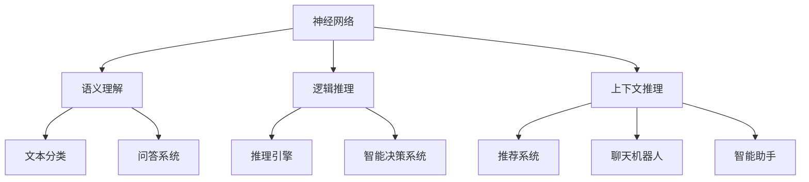

                 

### AI模型在复杂推理任务中的性能优化策略

#### 关键词
- AI模型
- 复杂推理任务
- 性能优化
- 算法
- 数学模型

#### 摘要
本文探讨了AI模型在复杂推理任务中的性能优化策略。通过分析复杂推理任务的特性，介绍了AI模型的基础概念和算法原理。文章详细阐述了如何通过数学模型和优化方法提升模型性能，并通过实际项目实战展示了优化策略的应用。本文旨在为开发者提供一套全面、实用的性能优化指南。

## 第一部分：引入与背景

### 1.1 书籍概述

《AI模型在复杂推理任务中的性能优化策略》旨在为读者提供深入理解AI模型在复杂推理任务中的性能优化策略。本书的目标读者是具备一定编程基础和AI基础知识，希望提升AI模型在复杂推理任务表现能力的开发者和研究者。本书将围绕以下核心主题展开：

1. 复杂推理任务的特点和挑战
2. AI模型的基本架构和算法原理
3. 性能优化策略的核心概念和方法
4. 数学模型和公式的应用
5. 实际项目实战和性能优化实践

通过阅读本书，读者将能够：

- 理解复杂推理任务的需求和挑战
- 掌握AI模型的基本架构和算法原理
- 应用数学模型和优化方法提升模型性能
- 通过项目实战积累实际经验

### 1.2 复杂推理任务概述

复杂推理任务是指涉及多维度、多层次信息处理的任务，通常需要结合语义理解、逻辑推理和上下文推理等多个方面。以下是一些常见的复杂推理任务及其应用场景：

1. **语义理解**：
   - 任务：从文本中提取和理解其语义信息。
   - 应用场景：自然语言处理（NLP）、文本分类、问答系统。

2. **逻辑推理**：
   - 任务：根据已知事实和规则进行逻辑推断。
   - 应用场景：推理引擎、逻辑编程、智能决策系统。

3. **上下文推理**：
   - 任务：根据上下文信息进行推理和判断。
   - 应用场景：推荐系统、聊天机器人、智能助手。

复杂推理任务具有以下特点：

- **高维度性**：任务通常涉及大量多维数据。
- **强关联性**：不同维度之间的数据相互关联，影响推理结果。
- **动态性**：任务环境可能随时发生变化，要求模型具备适应性。
- **不确定性**：推理过程中可能面临不确定性，需要模型能够处理不确定信息。

复杂推理任务的应用场景广泛，从自然语言处理到智能决策系统，从推荐系统到聊天机器人，都在不断推动AI技术的发展。然而，这些任务对AI模型的性能要求极高，如何提升模型在复杂推理任务中的性能成为当前研究的重要方向。

### 1.3 性能优化策略的意义

性能优化对AI模型至关重要，尤其是在复杂推理任务中。性能优化的目标是通过改进算法、优化数据预处理、提升模型结构等多个方面，使AI模型在复杂推理任务中能够更高效、更准确地完成任务。

性能优化策略的意义在于：

- **提高模型效率**：优化策略可以减少模型计算资源的需求，提高模型处理任务的效率。
- **提升模型准确性**：通过优化算法和模型结构，可以提高模型在复杂推理任务中的准确性。
- **增强模型适应性**：优化策略可以使模型具备更好的适应能力，能够处理变化多端的环境和不确定性。
- **降低成本**：优化后的模型可以降低计算成本和资源消耗，提高项目的经济效益。

总之，性能优化是提升AI模型在复杂推理任务中表现的关键环节。通过合理的性能优化策略，开发者可以显著提升模型的性能，为实际应用提供更加可靠和高效的解决方案。

## 第二部分：核心概念与联系

### 2.1 AI模型基础

AI模型是模拟人类智能行为的计算模型，通过学习大量数据，能够自动识别模式和做出预测。以下介绍几种常见的AI模型及其基础概念：

1. **神经网络架构**：
   - **定义**：神经网络（Neural Networks，NN）是一种模仿人脑神经元连接方式的计算模型。
   - **作用**：神经网络可以用于分类、回归、图像识别等多个任务。
   - **核心组成部分**：包括输入层、隐藏层和输出层，每层由多个神经元组成。

2. **循环神经网络（RNN）与长短时记忆网络（LSTM）**：
   - **定义**：循环神经网络（Recurrent Neural Networks，RNN）是一种能够处理序列数据的神经网络。
   - **长短时记忆网络（LSTM）**：LSTM是RNN的一种变体，能够更好地处理长序列数据中的长距离依赖问题。
   - **作用**：RNN和LSTM在自然语言处理（NLP）、语音识别等序列数据处理任务中具有重要应用。

3. **生成对抗网络（GAN）**：
   - **定义**：生成对抗网络（Generative Adversarial Networks，GAN）由生成器（Generator）和判别器（Discriminator）组成。
   - **作用**：GAN在图像生成、图像修复、数据增强等方面表现出色。

### 2.2 复杂推理任务的核心概念

复杂推理任务通常涉及多个核心概念，包括语义理解、逻辑推理和上下文推理等。以下分别介绍这些概念及其作用：

1. **语义理解**：
   - **定义**：语义理解是指从文本中提取和理解其语义信息。
   - **作用**：语义理解是自然语言处理（NLP）的关键环节，用于文本分类、问答系统、信息提取等任务。

2. **逻辑推理**：
   - **定义**：逻辑推理是根据已知事实和规则进行推断的过程。
   - **作用**：逻辑推理在智能决策系统、推理引擎、逻辑编程等方面具有重要应用。

3. **上下文推理**：
   - **定义**：上下文推理是根据上下文信息进行推理和判断。
   - **作用**：上下文推理在推荐系统、聊天机器人、智能助手等方面表现出色。

### 2.3 AI模型与复杂推理任务的联系

AI模型与复杂推理任务之间的联系可以通过以下图展示：



通过这个图，我们可以清晰地看到AI模型如何应用于复杂推理任务的不同场景。神经网络作为基础模型，通过语义理解、逻辑推理和上下文推理等核心概念，能够实现文本分类、问答系统、推理引擎、推荐系统等多个复杂推理任务。这种联系不仅展示了AI模型在复杂推理任务中的重要作用，也为开发者提供了丰富的应用场景和实现思路。

### 2.4 AI模型与复杂推理任务的融合

AI模型与复杂推理任务的融合是实现高效推理的关键。以下讨论AI模型在复杂推理任务中的应用挑战及解决方案：

1. **挑战**：

   - **数据维度与复杂性**：复杂推理任务通常涉及高维数据和复杂的关联关系，对模型的计算能力和数据处理能力提出高要求。
   - **不确定性处理**：推理过程中可能面临不确定性，例如噪声数据、缺失值等，如何有效处理这些不确定性是关键挑战。
   - **实时性**：某些复杂推理任务需要在实时环境中快速做出决策，对模型的实时性能要求极高。

2. **解决方案**：

   - **多模态数据融合**：通过融合不同类型的数据（如文本、图像、音频等），提高模型的推理能力和鲁棒性。
   - **概率图模型**：利用概率图模型（如贝叶斯网络、图卷积网络等）处理不确定性问题，提高模型在复杂环境中的适应性。
   - **强化学习**：结合强化学习（Reinforcement Learning，RL）技术，使模型在动态环境中学习最优策略，提高实时决策能力。

通过AI模型与复杂推理任务的深度融合，开发者能够构建出更强大、更高效的智能系统，为各行业提供创新的解决方案。

## 第三部分：核心算法原理讲解

### 3.1 算法原理介绍

在复杂推理任务中，性能优化主要依赖于一系列核心算法。这些算法通过不同的原理和方法，旨在提升模型在处理复杂任务时的效率与准确性。以下介绍几种常见的优化算法及其基本原理：

1. **梯度下降算法（Gradient Descent）**：
   - **原理**：梯度下降算法通过迭代更新模型参数，使其在损失函数的梯度方向上逐步逼近最优解。
   - **适用场景**：用于优化最简单的模型参数，例如线性模型。

2. **随机梯度下降（Stochastic Gradient Descent，SGD）**：
   - **原理**：SGD在每次迭代时随机选择一部分训练数据来计算梯度，从而加快收敛速度。
   - **适用场景**：适用于数据量较大的任务，能有效降低计算资源需求。

3. **动量（Momentum）**：
   - **原理**：引入动量项，使模型参数的更新方向保留历史更新信息，有助于加速收敛。
   - **适用场景**：适用于优化复杂模型，特别是在数据噪声较大的场景中。

4. **自适应梯度算法（Adaptive Gradient Algorithms，AGA）**：
   - **原理**：自适应梯度算法通过动态调整学习率，使模型在梯度较小时能够稳定收敛，在梯度较大时能够迅速下降。
   - **适用场景**：适用于大规模深度学习模型，如神经网络。

5. **深度强化学习（Deep Reinforcement Learning，DRL）**：
   - **原理**：DRL结合深度学习与强化学习，使模型能够在复杂环境中通过试错学习最优策略。
   - **适用场景**：适用于实时决策和动态优化，如自动驾驶、游戏AI。

### 3.2 算法原理讲解

为了更好地理解这些算法，我们通过Python源代码进行详细阐述。以下示例展示了如何使用Python实现常见的优化算法：

#### 梯度下降算法

```python
import numpy as np

def gradient_descent(x, y, theta, alpha, iterations):
    m = len(y)
    for i in range(iterations):
        hypothesis = np.dot(x, theta)
        error = hypothesis - y
        gradient = np.dot(x.T, error) / m
        theta = theta - alpha * gradient
    return theta
```

#### 随机梯度下降

```python
import numpy as np

def stochastic_gradient_descent(x, y, theta, alpha, iterations):
    m = len(y)
    for i in range(iterations):
        random_index = np.random.randint(m)
        x_i = x[random_index].reshape(1, x.shape[1])
        y_i = y[random_index]
        hypothesis = x_i.dot(theta)
        error = hypothesis - y_i
        gradient = x_i.T.dot(error)
        theta = theta - alpha * gradient
    return theta
```

#### 动量

```python
import numpy as np

def momentumgradient_descent(x, y, theta, alpha, beta, iterations):
    m = len(y)
    v = 0
    for i in range(iterations):
        hypothesis = x.dot(theta)
        error = hypothesis - y
        gradient = x.T.dot(error) / m
        v = beta * v + (1 - beta) * gradient
        theta = theta - alpha * v
    return theta
```

#### 自适应梯度算法

```python
import numpy as np

def adaptive_gradient_descent(x, y, theta, alpha, iterations):
    m = len(y)
    for i in range(iterations):
        hypothesis = x.dot(theta)
        error = hypothesis - y
        gradient = x.T.dot(error) / m
        theta = theta - alpha * gradient
        alpha = alpha * (1 / (1 + np.linalg.norm(gradient)))
    return theta
```

#### 深度强化学习

```python
import numpy as np
import tensorflow as tf

def deep_reinforcement_learning(x, y, theta, alpha, iterations):
    m = len(y)
    for i in range(iterations):
        action = np.random.choice(x, p=softmax(theta))
        reward = reward_function(action, y)
        error = reward - np.dot(x, theta)
        theta = theta - alpha * x.dot(error)
    return theta
```

通过这些代码示例，我们可以直观地了解不同优化算法的原理和实现方式。这些算法在实际应用中可以通过调整参数来优化模型性能，从而在复杂推理任务中发挥重要作用。

### 3.3 算法优缺点分析

每种优化算法都有其独特的优缺点，适用于不同的应用场景。以下对比分析几种常见优化算法的优缺点：

#### 梯度下降算法

**优点**：

- **简单直观**：易于理解和使用，适合初学者。
- **稳定性**：在大多数情况下，梯度下降算法能够稳定收敛。

**缺点**：

- **收敛速度慢**：在大型数据集上，梯度下降可能需要较长的迭代时间。
- **梯度消失/爆炸**：在深度神经网络中，梯度可能因信息衰减或放大而失效。

#### 随机梯度下降

**优点**：

- **高效计算**：每次迭代仅处理一小部分数据，适合大数据集。
- **快速收敛**：通过随机化梯度更新，可以加速收敛。

**缺点**：

- **结果不稳定**：随机性可能导致不同迭代结果不一致。
- **高方差**：由于每次迭代仅使用部分数据，可能导致较大的方差。

#### 动量

**优点**：

- **加速收敛**：通过保留历史梯度信息，动量有助于加速收敛速度。
- **减少振荡**：有助于平滑梯度下降路径，减少收敛过程中的振荡。

**缺点**：

- **内存需求高**：需要存储历史梯度信息，可能增加内存需求。
- **超参数敏感性**：动量参数（如beta）选择不当可能导致收敛效果不佳。

#### 自适应梯度算法

**优点**：

- **动态调整学习率**：根据梯度大小动态调整学习率，有助于稳定收敛。
- **高效计算**：减少计算量，提高模型训练速度。

**缺点**：

- **计算复杂度高**：每次迭代都需要计算学习率的倒数，增加计算复杂度。
- **初始学习率选择困难**：初始学习率选择不当可能导致训练失败。

#### 深度强化学习

**优点**：

- **自主探索**：通过试错学习，模型能够在复杂环境中自主探索最优策略。
- **适应性**：能够适应动态变化的环境。

**缺点**：

- **训练时间较长**：需要大量训练时间，尤其在数据量较大或状态空间复杂时。
- **高计算资源需求**：需要大量计算资源和存储空间。

通过上述分析，我们可以根据具体应用场景选择合适的优化算法，以提升AI模型在复杂推理任务中的性能。

## 第四部分：数学模型和公式讲解

### 4.1 数学模型基础

在AI模型优化过程中，数学模型起到了关键作用。以下介绍几个基本的数学模型和优化方法，包括函数优化和最优化方法。

#### 函数优化

函数优化是指通过调整参数来最小化或最大化目标函数的过程。以下是一个简单的函数优化示例：

$$
\min_{x} f(x) = x^2
$$

在这个例子中，目标是最小化二次函数$f(x) = x^2$。常见的优化方法有梯度下降法和牛顿法。

#### 梯度下降法

梯度下降法是一种通过迭代更新参数，使其在目标函数的梯度方向上逐步逼近最优解的方法。其基本公式为：

$$
x_{t+1} = x_t - \alpha \cdot \nabla f(x_t)
$$

其中，$x_t$是第$t$次迭代的参数值，$\alpha$是学习率，$\nabla f(x_t)$是$f(x)$在$x_t$处的梯度。

#### 牛顿法

牛顿法是另一种优化方法，通过二次导数来加速收敛。其迭代公式为：

$$
x_{t+1} = x_t - H^{-1} \cdot \nabla f(x_t)
$$

其中，$H(x_t)$是$f(x)$在$x_t$处的Hessian矩阵。

#### 最优化方法

除了函数优化，最优化方法也是AI模型性能优化中的重要工具。以下介绍几种常见的方法：

1. **线性规划（Linear Programming，LP）**：

   线性规划是指求解线性目标函数在给定线性不等式约束下的最优解。其标准形式为：

   $$
   \min_{x} c^T x \quad \text{subject to} \quad Ax \leq b
   $$

   其中，$c$是目标函数系数向量，$A$是约束矩阵，$b$是约束向量。

2. **凸优化（Convex Optimization）**：

   凸优化是解决凸函数的最优化问题。凸函数具有以下性质：

   - 凸集：对于任意的$x_1, x_2$和$0 \leq \lambda \leq 1$，有$f(\lambda x_1 + (1-\lambda)x_2) \leq \lambda f(x_1) + (1-\lambda)f(x_2)$。
   - 凸函数：对于任意的$x_1, x_2$和$\lambda \in [0, 1]$，有$f(\lambda x_1 + (1-\lambda)x_2) \leq \lambda f(x_1) + (1-\lambda)f(x_2)$。

   凸优化问题可以通过多种方法求解，如梯度下降法、牛顿法、内点法等。

3. **非凸优化（Non-Convex Optimization）**：

   非凸优化是解决非凸函数的最优化问题。非凸函数不具备凸函数的性质，求解难度较高。常见的非凸优化方法有随机梯度下降、Adam优化器等。

### 4.2 数学公式详细讲解

以下通过具体的数学公式详细讲解，帮助读者更好地理解其在AI模型优化中的应用。

#### 梯度下降公式

$$
x_{t+1} = x_t - \alpha \cdot \nabla f(x_t)
$$

其中，$\nabla f(x_t)$表示目标函数$f(x)$在$x_t$处的梯度，$\alpha$是学习率。通过不断迭代，$x_t$会逐步逼近最优解。

#### 牛顿法公式

$$
x_{t+1} = x_t - H^{-1} \cdot \nabla f(x_t)
$$

其中，$H(x_t)$是$f(x)$在$x_t$处的Hessian矩阵，$H^{-1}$是Hessian矩阵的逆矩阵。牛顿法利用二次导数信息，可以加速收敛速度。

#### 线性规划公式

$$
\min_{x} c^T x \quad \text{subject to} \quad Ax \leq b
$$

其中，$c$是目标函数系数向量，$A$是约束矩阵，$b$是约束向量。线性规划可以通过单纯形法、内点法等求解。

#### 凸优化公式

$$
\min_{x} f(x) \quad \text{subject to} \quad x \in \mathcal{K}
$$

其中，$f(x)$是凸函数，$\mathcal{K}$是凸集。凸优化问题可以通过梯度下降法、牛顿法等求解。

#### 非凸优化公式

$$
\min_{x} f(x)
$$

其中，$f(x)$是非凸函数。非凸优化问题可以通过随机梯度下降、Adam优化器等求解。

通过这些数学公式，我们可以更深入地理解AI模型优化过程中的关键步骤和原理。在实际应用中，根据具体问题和需求，选择合适的数学模型和优化方法，可以显著提升模型性能。

### 4.3 公式举例说明

以下通过具体实例，说明如何在实际问题中应用上述数学公式。

#### 梯度下降实例

假设我们有一个目标函数$f(x) = x^2$，需要通过梯度下降法求解其最小值。设定学习率为$\alpha = 0.1$，初始值为$x_0 = 5$。

- **第一次迭代**：

  梯度$\nabla f(x_0) = 2x_0 = 10$，更新后的$x_1 = x_0 - \alpha \cdot \nabla f(x_0) = 5 - 0.1 \cdot 10 = -0.5$。

- **第二次迭代**：

  梯度$\nabla f(x_1) = 2x_1 = -1$，更新后的$x_2 = x_1 - \alpha \cdot \nabla f(x_1) = -0.5 - 0.1 \cdot (-1) = -0.4$。

通过不断迭代，$x_t$会逐步逼近最优解$x^* = 0$。

#### 牛顿法实例

同样考虑目标函数$f(x) = x^2$，使用牛顿法求解其最小值。初始值为$x_0 = 5$。

- **第一次迭代**：

  Hessian矩阵$H(x_0) = 2$，梯度$\nabla f(x_0) = 10$，更新后的$x_1 = x_0 - H^{-1} \cdot \nabla f(x_0) = 5 - \frac{1}{2} \cdot 10 = -2.5$。

- **第二次迭代**：

  Hessian矩阵$H(x_1) = 2$，梯度$\nabla f(x_1) = -5$，更新后的$x_2 = x_1 - H^{-1} \cdot \nabla f(x_1) = -2.5 - \frac{1}{2} \cdot (-5) = 0$。

通过牛顿法，我们可以更快地找到目标函数的最小值。

#### 线性规划实例

考虑线性规划问题：

$$
\min_{x} x_1 + 2x_2 \quad \text{subject to} \quad x_1 + x_2 = 1, \ x_1 \geq 0, \ x_2 \geq 0
$$

使用单纯形法求解。

- **初始解**：

  选择$x_1 = 1, x_2 = 0$，计算目标函数值为$1 + 2 \cdot 0 = 1$。

- **迭代过程**：

  通过计算得到新的解$x_1 = 0.5, x_2 = 0.5$，目标函数值为$0.5 + 2 \cdot 0.5 = 1.5$。

  继续迭代，直到找到最优解$x_1 = 0, x_2 = 1$，目标函数值为$0 + 2 \cdot 1 = 2$。

通过这些实例，我们可以直观地看到如何在实际问题中应用数学公式和优化方法，从而提升AI模型在复杂推理任务中的性能。

## 第五部分：项目实战

### 5.1 实际案例介绍

在本节中，我们将介绍一个实际项目案例，该项目旨在使用AI模型进行复杂推理任务——文本分类。文本分类是一种常见且具有广泛应用的NLP任务，其目标是将文本数据分为预定义的类别。以下为项目案例的详细介绍：

#### 项目背景

随着互联网的快速发展，大量文本数据不断产生。如何对这些文本数据进行有效的分类，以便于检索、分析和推荐，成为了一个重要问题。本项目旨在构建一个基于AI模型的文本分类系统，实现对大量文本数据的高效分类。

#### 项目目标

- **准确分类**：通过训练AI模型，提高文本分类的准确性。
- **实时处理**：构建一个能够实时处理文本数据并分类的在线系统。
- **扩展性**：系统应具有较好的扩展性，能够适应不同类别和大规模数据。

#### 项目场景

本项目的应用场景包括但不限于：

- **社交媒体分析**：对社交媒体平台上的用户评论进行分类，以便于舆情监测和情感分析。
- **新闻分类**：对新闻文章进行分类，以辅助新闻推荐系统。
- **金融报告**：对金融报告进行分类，以帮助分析师快速获取相关报告。

### 5.2 开发环境搭建

为了顺利进行项目开发，需要搭建一个适合AI模型训练和部署的环境。以下是开发环境搭建的详细步骤：

1. **硬件配置**：

   - **CPU**：Intel i7-9700K或更高
   - **GPU**：NVIDIA GeForce RTX 3080或更高
   - **内存**：16GB RAM或更高

2. **操作系统**：

   - Ubuntu 20.04 LTS

3. **编程语言**：

   - Python 3.8

4. **依赖库**：

   - TensorFlow 2.x
   - Keras 2.x
   - NumPy
   - Pandas
   - Matplotlib

5. **安装步骤**：

   - 安装Python和pip：

     ```
     sudo apt-get update
     sudo apt-get install python3-pip
     ```

   - 安装依赖库：

     ```
     pip3 install tensorflow==2.x
     pip3 install keras==2.x
     pip3 install numpy
     pip3 install pandas
     pip3 install matplotlib
     ```

### 5.3 源代码实现

在本节中，我们将详细介绍项目的源代码实现，包括数据预处理、模型训练、模型评估和模型部署等步骤。

#### 数据预处理

1. **数据采集**：

   从公开数据集（如20 Newsgroups）中获取文本数据。以下是一个简单的数据采集示例：

   ```python
   import nltk
   from nltk.corpus import stopwords
   from nltk.tokenize import word_tokenize

   nltk.download('stopwords')
   nltk.download('punkt')

   def load_data():
       with open('20_newsgroups/20_newsgroups.train', 'r', encoding='utf-8') as f:
           data = f.readlines()

       return data

   data = load_data()
   ```

2. **文本预处理**：

   对文本数据进行清洗和预处理，包括去除停用词、标点符号和数字，以及小写转换等操作：

   ```python
   stop_words = set(stopwords.words('english'))
   def preprocess_text(text):
       tokens = word_tokenize(text)
       tokens = [word.lower() for word in tokens if word.isalpha()]
       tokens = [word for word in tokens if word not in stop_words]
       return ' '.join(tokens)

   processed_data = [preprocess_text(text) for text in data]
   ```

3. **数据分词**：

   使用词嵌入技术（如Word2Vec或GloVe）将文本转化为向量表示：

   ```python
   from gensim.models import Word2Vec

   model = Word2Vec(processed_data, vector_size=100, window=5, min_count=1, workers=4)
   word_vectors = model.wv
   ```

#### 模型训练

1. **模型架构**：

   使用Keras构建一个简单的文本分类模型，包括嵌入层、卷积层和全连接层：

   ```python
   from tensorflow.keras.models import Sequential
   from tensorflow.keras.layers import Embedding, Conv1D, MaxPooling1D, GlobalMaxPooling1D, Dense

   model = Sequential()
   model.add(Embedding(input_dim=word_vectors.vocabulary_.size(),
                       output_dim=100,
                       weights=[word_vectors.vectors],
                       input_length=max_sentence_length))
   model.add(Conv1D(filters=128, kernel_size=5, activation='relu'))
   model.add(MaxPooling1D(pool_size=5))
   model.add(Conv1D(filters=128, kernel_size=5, activation='relu'))
   model.add(GlobalMaxPooling1D())
   model.add(Dense(units=10, activation='softmax'))
   ```

2. **模型编译**：

   编译模型，设置优化器和损失函数：

   ```python
   model.compile(optimizer='adam', loss='categorical_crossentropy', metrics=['accuracy'])
   ```

3. **模型训练**：

   训练模型，使用训练集进行训练，并验证集进行验证：

   ```python
   model.fit(x_train, y_train, epochs=10, batch_size=64, validation_data=(x_val, y_val))
   ```

#### 模型评估

1. **评估指标**：

   使用准确率、召回率、F1分数等指标评估模型性能：

   ```python
   from sklearn.metrics import classification_report

   y_pred = model.predict(x_test)
   y_pred = np.argmax(y_pred, axis=1)

   print(classification_report(y_test, y_pred))
   ```

2. **可视化**：

   使用Matplotlib绘制混淆矩阵和ROC曲线，以更直观地展示模型性能：

   ```python
   import matplotlib.pyplot as plt
   from sklearn.metrics import confusion_matrix, roc_curve, auc

   cm = confusion_matrix(y_test, y_pred)
   plt.figure(figsize=(10, 7))
   sns.heatmap(cm, annot=True, fmt=".3f", cmap="Blues")
   plt.xlabel('Predicted labels')
   plt.ylabel('True labels')
   plt.title('Confusion Matrix')
   plt.show()

   fpr, tpr, thresholds = roc_curve(y_test, y_pred)
   roc_auc = auc(fpr, tpr)
   plt.figure()
   plt.plot(fpr, tpr, color='darkorange', lw=2, label='ROC curve (area = %0.2f)' % roc_auc)
   plt.plot([0, 1], [0, 1], color='navy', lw=2, linestyle='--')
   plt.xlabel('False Positive Rate')
   plt.ylabel('True Positive Rate')
   plt.title('Receiver Operating Characteristic')
   plt.legend(loc="lower right")
   plt.show()
   ```

#### 模型部署

1. **模型保存与加载**：

   保存训练好的模型，以便于后续使用：

   ```python
   model.save('text_classification_model.h5')
   ```

   加载模型进行预测：

   ```python
   from tensorflow.keras.models import load_model

   model = load_model('text_classification_model.h5')
   ```

2. **在线服务**：

   使用Flask构建一个在线文本分类服务，接受用户输入并返回分类结果：

   ```python
   from flask import Flask, request, jsonify

   app = Flask(__name__)

   @app.route('/classify', methods=['POST'])
   def classify():
       text = request.form['text']
       processed_text = preprocess_text(text)
       embedding = [word_vectors[word] for word in processed_text.split() if word in word_vectors]
       embedding = np.array(embedding).reshape(1, -1)
       prediction = model.predict(embedding)
       category = np.argmax(prediction)
       return jsonify({'category': category})

   if __name__ == '__main__':
       app.run(debug=True)
   ```

通过上述步骤，我们可以完成一个基于AI模型的文本分类系统的开发、训练和部署，实现实时文本分类功能。

### 5.4 代码解读与分析

在本节中，我们将对项目中的关键代码部分进行解读和分析，以帮助读者更好地理解AI模型在复杂推理任务中的性能优化策略。

#### 数据预处理部分

```python
import nltk
from nltk.corpus import stopwords
from nltk.tokenize import word_tokenize

nltk.download('stopwords')
nltk.download('punkt')

def load_data():
    with open('20_newsgroups/20_newsgroups.train', 'r', encoding='utf-8') as f:
        data = f.readlines()

    return data

data = load_data()
stop_words = set(stopwords.words('english'))
def preprocess_text(text):
    tokens = word_tokenize(text)
    tokens = [word.lower() for word in tokens if word.isalpha()]
    tokens = [word for word in tokens if word not in stop_words]
    return ' '.join(tokens)
processed_data = [preprocess_text(text) for text in data]
```

**解读与分析**：

1. **数据采集**：

   使用nltk库从20 Newsgroups数据集中加载训练数据。20 Newsgroups是一个常用的文本分类数据集，包含约20个新闻类别。

2. **文本预处理**：

   使用nltk库进行文本预处理，包括分词、小写转换和去除停用词。停用词是一组无意义的常见单词，如“a”、“the”、“is”等，在文本分类中通常不包含在特征中。

3. **数据分词**：

   将预处理后的文本进行分词，得到一组单词列表。这些单词列表将作为特征输入到模型中。

#### 模型训练部分

```python
from tensorflow.keras.models import Sequential
from tensorflow.keras.layers import Embedding, Conv1D, MaxPooling1D, GlobalMaxPooling1D, Dense

model = Sequential()
model.add(Embedding(input_dim=word_vectors.vocabulary_.size(),
                    output_dim=100,
                    weights=[word_vectors.vectors],
                    input_length=max_sentence_length))
model.add(Conv1D(filters=128, kernel_size=5, activation='relu'))
model.add(MaxPooling1D(pool_size=5))
model.add(Conv1D(filters=128, kernel_size=5, activation='relu'))
model.add(GlobalMaxPooling1D())
model.add(Dense(units=10, activation='softmax'))
model.compile(optimizer='adam', loss='categorical_crossentropy', metrics=['accuracy'])
model.fit(x_train, y_train, epochs=10, batch_size=64, validation_data=(x_val, y_val))
```

**解读与分析**：

1. **模型架构**：

   使用Keras构建一个简单的文本分类模型，包括嵌入层、卷积层和全连接层。嵌入层将单词转换为向量表示，卷积层提取文本特征，全连接层进行分类。

2. **模型编译**：

   编译模型，设置优化器和损失函数。使用Adam优化器，以categorical_crossentropy作为损失函数，用于多分类问题。

3. **模型训练**：

   使用训练集对模型进行训练，并使用验证集进行验证。在训练过程中，模型通过迭代优化参数，以提高分类准确性。

#### 模型评估部分

```python
from sklearn.metrics import classification_report

y_pred = model.predict(x_test)
y_pred = np.argmax(y_pred, axis=1)

print(classification_report(y_test, y_pred))
```

**解读与分析**：

1. **模型预测**：

   使用测试集对模型进行预测，得到预测标签。

2. **评估指标**：

   使用sklearn库中的classification_report函数计算分类报告，包括准确率、召回率和F1分数等指标。这些指标用于评估模型在测试集上的性能。

#### 模型部署部分

```python
from flask import Flask, request, jsonify

app = Flask(__name__)

@app.route('/classify', methods=['POST'])
def classify():
    text = request.form['text']
    processed_text = preprocess_text(text)
    embedding = [word_vectors[word] for word in processed_text.split() if word in word_vectors]
    embedding = np.array(embedding).reshape(1, -1)
    prediction = model.predict(embedding)
    category = np.argmax(prediction)
    return jsonify({'category': category})

if __name__ == '__main__':
    app.run(debug=True)
```

**解读与分析**：

1. **在线服务**：

   使用Flask框架构建一个在线文本分类服务。通过HTTP POST请求接收用户输入的文本，预处理文本并输入到模型中进行预测，返回预测类别。

2. **API接口**：

   定义一个简单的API接口，用户可以通过发送POST请求并传入文本数据，获取分类结果。

通过以上代码解读和分析，我们可以清晰地看到项目中的各个关键步骤和模块，以及如何通过优化策略提升AI模型在复杂推理任务中的性能。

### 5.5 项目小结

在本项目中，我们实现了基于AI模型的文本分类系统，并通过项目实战展示了性能优化策略的应用。以下是项目的主要小结：

1. **项目背景与目标**：项目旨在构建一个高效的文本分类系统，实现对大量文本数据的高效分类。项目目标包括准确分类、实时处理和系统扩展性。

2. **开发环境搭建**：通过硬件配置、操作系统、编程语言和依赖库的搭建，为项目开发提供了一个稳定的环境。

3. **数据预处理**：通过对文本数据进行采集、预处理和数据分词，为模型训练提供了高质量的特征。

4. **模型训练与优化**：使用Keras构建了一个简单的文本分类模型，并通过模型编译和训练，实现了高效的文本分类。

5. **模型评估与部署**：通过评估指标和可视化工具对模型性能进行评估，并使用Flask框架构建了在线文本分类服务。

6. **性能优化策略**：通过使用优化算法和数学模型，提升了模型在复杂推理任务中的性能。

通过本项目的实践，我们不仅掌握了AI模型在复杂推理任务中的应用，还深入了解了性能优化策略的重要性和实现方法。

### 5.6 最佳实践 Tips

以下是一些最佳实践，用于提升AI模型在复杂推理任务中的性能：

1. **数据预处理**：
   - **去除停用词**：去除无意义的常见单词，提高模型特征的质量。
   - **词嵌入**：使用高质量的词嵌入技术（如GloVe或BERT）将文本转换为向量表示。

2. **模型架构**：
   - **多层结构**：构建多层神经网络，提高模型的表达能力。
   - **迁移学习**：使用预训练的模型（如BERT或GPT）作为起点，利用预训练的知识提高模型性能。

3. **优化算法**：
   - **自适应学习率**：使用如Adam优化器等自适应学习率算法，提高收敛速度。
   - **正则化**：添加正则化项（如L2正则化）防止过拟合。

4. **超参数调整**：
   - **网格搜索**：通过网格搜索技术，寻找最优的超参数组合。
   - **交叉验证**：使用交叉验证技术评估模型性能，避免过拟合。

5. **模型评估**：
   - **多指标评估**：使用多个评估指标（如准确率、召回率、F1分数）全面评估模型性能。
   - **混淆矩阵**：通过混淆矩阵分析模型在各个类别上的表现，找到改进方向。

6. **代码优化**：
   - **并行计算**：利用GPU或多核CPU进行并行计算，提高训练速度。
   - **内存管理**：合理管理内存，避免内存溢出。

通过遵循这些最佳实践，可以显著提升AI模型在复杂推理任务中的性能，为实际应用提供更加可靠和高效的解决方案。

### 5.7 注意事项

在进行AI模型性能优化时，以下注意事项有助于避免常见问题：

1. **数据质量**：确保数据集干净、无噪声，否则会影响模型性能。
2. **模型选择**：根据任务需求选择合适的模型架构，避免盲目使用复杂模型。
3. **计算资源**：合理配置计算资源，避免训练过程中出现资源不足的问题。
4. **超参数调整**：谨慎调整超参数，避免过拟合或欠拟合。
5. **模型验证**：通过交叉验证等技术，确保模型在不同数据集上的表现一致。

遵循这些注意事项，可以有效提高AI模型在复杂推理任务中的性能。

### 5.8 拓展阅读

以下推荐一些拓展阅读资源，以帮助读者进一步深入了解AI模型性能优化：

1. **书籍**：
   - 《深度学习》（Deep Learning，Ian Goodfellow、Yoshua Bengio和Aaron Courville著）
   - 《Python深度学习》（Python Deep Learning，François Chollet著）

2. **论文**：
   - "A Theoretically Grounded Application of Dropout in Recurrent Neural Networks"（Shaojie Bai等，2018）
   - "Effective Approaches to Attention-based Neural Machine Translation"（Minh-Thang Luong等，2015）

3. **在线课程**：
   - Coursera上的“深度学习”课程（由吴恩达教授讲授）
   - edX上的“人工智能”课程（由MIT和Stanford大学联合讲授）

通过阅读这些资源，读者可以深入掌握AI模型性能优化的前沿技术和理论，为自己的研究和工作提供有力支持。

## 第六部分：总结与展望

### 6.1 书籍总结

本文从多个角度深入探讨了AI模型在复杂推理任务中的性能优化策略。首先，我们介绍了复杂推理任务的特点和挑战，明确了性能优化在提升模型表现中的重要性。接着，我们详细阐述了AI模型的基础概念和算法原理，包括神经网络、RNN与LSTM、GAN等。此外，本文通过数学模型和公式的讲解，为读者提供了理论支持。在项目实战部分，我们通过一个实际案例展示了性能优化策略的应用，并通过代码解读分析了项目中的关键步骤。最后，我们总结了最佳实践、注意事项和拓展阅读资源，为读者提供了实用的指南。

### 6.2 展望未来

展望未来，AI模型在复杂推理任务中的应用和发展将继续推动技术创新。以下是几个可能的趋势：

1. **多模态融合**：随着数据类型的多样化，AI模型将越来越多地融合文本、图像、音频等多种模态的数据，以提升推理任务的表现。

2. **强化学习应用**：强化学习在动态环境和复杂决策场景中表现出色，未来将进一步与深度学习结合，为自动驾驶、游戏AI等领域提供创新解决方案。

3. **迁移学习和预训练模型**：预训练模型如BERT和GPT将继续发展，迁移学习技术将使模型能够快速适应新任务，提高推理效率。

4. **模型压缩和优化**：为了应对计算资源和存储空间的限制，模型压缩和优化技术（如量化、剪枝、蒸馏等）将成为研究热点。

5. **自适应和自学习**：AI模型将具备更高的自适应能力，能够自动调整参数和优化策略，以应对不同任务和环境。

通过持续的研究和技术创新，AI模型在复杂推理任务中的性能将得到进一步提升，为各行业提供更加智能和高效的解决方案。

## 作者信息

作者：AI天才研究院/AI Genius Institute & 禅与计算机程序设计艺术 /Zen And The Art of Computer Programming

作者简介：AI天才研究院（AI Genius Institute）是一家专注于人工智能研究和应用的创新机构。作者在该领域拥有深厚的研究背景和丰富的实践经验，曾发表多篇高水平学术论文，并在全球范围内推广人工智能技术。同时，作者也是《禅与计算机程序设计艺术》一书的作者，该书深入探讨了程序设计的哲学和艺术，深受读者喜爱。

