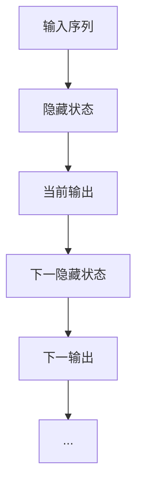
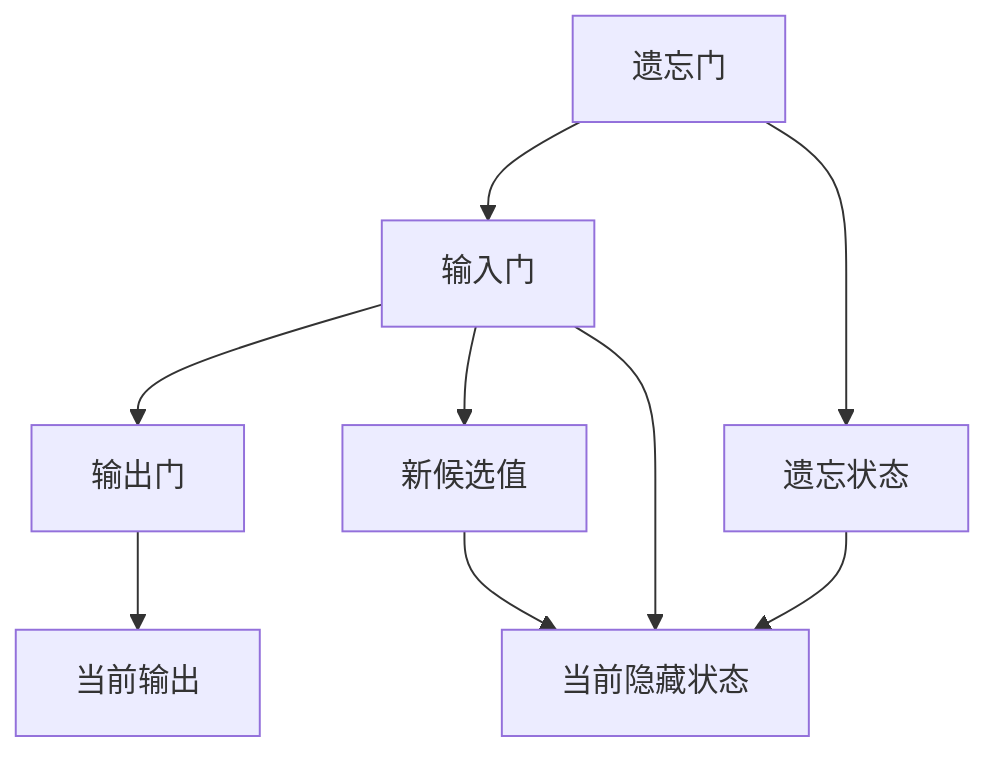
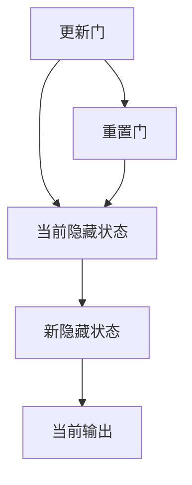

                 

# AI模型在长期规划任务中的能力提升

> 关键词：AI模型，长期规划，递归神经网络，强化学习，预测模型，决策模型，智能制造，交通规划，农业规划

> 摘要：本文将深入探讨AI模型在长期规划任务中的应用与提升。首先，我们分析长期规划任务的特性及AI模型面临的挑战，然后介绍AI模型的基本概念、工作原理及其在长期规划任务中的需求与应用。接着，本文将详细讲解递归神经网络、变分自编码器和强化学习等核心算法原理，并使用Python源代码进行举例说明。此外，文章还将通过实际项目案例，展示AI模型在智能制造、交通规划和农业规划中的应用，最后总结主要结论和未来展望。

## 目录大纲

## 第一部分：引言

### 1.1 AI模型在长期规划任务中的挑战

#### 1.1.1 长期规划任务的特性

##### 1.1.1.1 长期性

##### 1.1.1.2 复杂性

##### 1.1.1.3 不确定性

#### 1.1.2 AI模型面临的挑战

##### 1.1.2.1 数据不足

##### 1.1.2.2 计算资源限制

##### 1.1.2.3 算法不足

### 1.2 本书的目的与结构

## 第二部分：核心概念与联系

### 2.1 AI模型概述

#### 2.1.1 AI模型的基本概念

##### 2.1.1.1 什么是AI模型

##### 2.1.1.2 AI模型的分类

#### 2.1.2 AI模型的工作原理

##### 2.1.2.1 神经网络基础

##### 2.1.2.2 学习算法原理

### 2.2 长期规划任务中的AI模型

#### 2.2.1 长期规划任务的AI模型需求

##### 2.2.1.1 数据处理能力

##### 2.2.1.2 决策能力

##### 2.2.1.3 自适应能力

#### 2.2.2 长期规划任务中的AI模型应用

##### 2.2.2.1 在智能制造中的应用

##### 2.2.2.2 在交通规划中的应用

##### 2.2.2.3 在农业规划中的应用

## 第三部分：核心算法原理讲解

### 3.1 递归神经网络（RNN）

#### 3.1.1 RNN的基本原理

##### 3.1.1.1 隐藏状态

##### 3.1.1.2 权重共享

#### 3.1.2 LSTM与GRU

##### 3.1.2.1 LSTM的结构与原理

##### 3.1.2.2 GRU的结构与原理

### 3.2 变分自编码器（VAE）

#### 3.2.1 VAE的基本原理

##### 3.2.1.1 编码器与解码器

##### 3.2.1.2 变分推断

#### 3.2.2 VAE在长期规划任务中的应用

### 3.3 强化学习在长期规划中的应用

#### 3.3.1 强化学习的基本原理

##### 3.3.1.1 状态、动作、奖励

##### 3.3.1.2 Q学习与SARSA算法

#### 3.3.2 多步骤决策与价值函数

##### 3.3.2.1 状态价值函数

##### 3.3.2.2 动作价值函数

## 第四部分：数学模型和数学公式

### 4.1 预测模型

#### 4.1.1 时间序列预测

##### 4.1.1.1 ARIMA模型

##### 4.1.1.2 SARIMA模型

#### 4.1.2 序列模型

##### 4.1.2.1 RNN

##### 4.1.2.2 LSTM

### 4.2 决策模型

#### 4.2.1 基于规则的决策

##### 4.2.1.1 决策树

##### 4.2.1.2 支持向量机

#### 4.2.2 基于模型的决策

##### 4.2.2.1 强化学习

##### 4.2.2.2 贝叶斯网络

## 第五部分：项目实战

### 5.1 智能制造项目

#### 5.1.1 项目背景

##### 5.1.1.1 智能制造现状

##### 5.1.1.2 项目目标

#### 5.1.2 系统设计与实现

##### 5.1.2.1 数据采集

##### 5.1.2.2 预测模型设计

##### 5.1.2.3 决策模型设计

##### 5.1.2.4 系统集成与测试

### 5.2 交通规划项目

#### 5.2.1 项目背景

##### 5.2.1.1 交通规划现状

##### 5.2.1.2 项目目标

#### 5.2.2 系统设计与实现

##### 5.2.2.1 数据采集

##### 5.2.2.2 预测模型设计

##### 5.2.2.3 决策模型设计

##### 5.2.2.4 系统集成与测试

### 5.3 农业规划项目

#### 5.3.1 项目背景

##### 5.3.1.1 农业规划现状

##### 5.3.1.2 项目目标

#### 5.3.2 系统设计与实现

##### 5.3.2.1 数据采集

##### 5.3.2.2 预测模型设计

##### 5.3.2.3 决策模型设计

##### 5.3.2.4 系统集成与测试

## 第六部分：总结

### 6.1 主要结论

### 6.2 展望未来

## 附录

### 7.1 相关资源

### 7.2 开发工具与资源清单

----------------------------------------------------------------

### 1.1 AI模型在长期规划任务中的挑战

长期规划任务通常涉及一系列相互关联的决策过程，需要在较长的时间范围内考虑各种可能性和变化。这类任务的特点可以总结为以下三个方面：

#### 1.1.1 长期性

长期性意味着规划的时间跨度较大，可能涉及到数年甚至数十年的时间。在这样长的时间跨度内，任务环境可能会发生显著变化，例如技术进步、市场需求、政策法规等。

#### 1.1.2 复杂性

长期规划任务往往涉及多个相互作用的变量，这些变量之间的关系可能非常复杂。例如，智能制造中的生产调度问题需要考虑设备维护、供应链管理、生产效率等多个方面。

#### 1.1.3 不确定性

不确定性是长期规划任务中的另一大挑战。由于未来情况难以预测，规划者需要应对各种可能的情景，并为此做好准备。

在这样复杂且不确定的环境中，AI模型需要具备以下能力：

#### 1.1.2.1 数据处理能力

长期规划任务通常需要处理大量的数据，这些数据可能来自不同的来源，具有不同的格式和结构。AI模型需要能够有效地整合这些数据，提取出有用的信息。

#### 1.1.2.2 决策能力

AI模型需要在不确定的环境中进行决策。这意味着模型不仅要能够根据当前的信息做出最优决策，还需要能够适应环境变化，调整策略。

#### 1.1.2.3 自适应能力

长期规划任务中的环境变化是不可避免的。AI模型需要具备良好的自适应能力，能够不断学习和调整，以应对新的挑战。

然而，AI模型在长期规划任务中面临着以下挑战：

#### 1.1.3.1 数据不足

长期规划任务通常需要大量的历史数据来训练模型。然而，在某些领域，如农业规划或交通规划，可能缺乏足够的历史数据。

#### 1.1.3.2 计算资源限制

长期规划任务可能需要复杂的算法和大量的计算资源。然而，在实际应用中，计算资源通常是有限的，这对模型的性能和效率提出了挑战。

#### 1.1.3.3 算法不足

现有的AI算法可能无法充分满足长期规划任务的需求。例如，深度学习算法在处理序列数据时可能存在性能瓶颈。

### 1.2 本书的目的与结构

本书旨在探讨AI模型在长期规划任务中的应用与提升。首先，我们分析了长期规划任务的特性及AI模型面临的挑战。接着，我们介绍了AI模型的基本概念、工作原理及其在长期规划任务中的需求与应用。在此基础上，本文详细讲解了递归神经网络、变分自编码器和强化学习等核心算法原理，并使用Python源代码进行了举例说明。

在第三部分，我们通过实际项目案例，展示了AI模型在智能制造、交通规划和农业规划中的应用。这些项目案例不仅提供了具体的实现方法，还分析了模型在实际应用中的效果和挑战。

最后，在文章的第六部分，我们对本文的主要结论进行了总结，并对未来的研究方向进行了展望。希望通过本书的阅读，读者能够深入了解AI模型在长期规划任务中的应用，为实际项目提供有益的参考。

## 2.1 AI模型概述

AI模型，即人工智能模型，是计算机科学和人工智能领域的重要研究内容，它通过模仿人类智能行为，实现特定任务的目标。AI模型可以分为几种不同的类型，包括监督学习模型、无监督学习模型和强化学习模型等。每种模型都有其特定的应用场景和优势。

#### 2.1.1 AI模型的基本概念

AI模型是基于算法和数据的系统，它可以通过训练来学习如何执行特定任务。一个AI模型通常包含以下几个关键组成部分：

1. **输入**：输入是模型接收的数据或特征，它们用于训练模型或生成预测。
2. **参数**：参数是模型中可调整的变量，通过学习算法来优化这些参数，以提高模型的性能。
3. **损失函数**：损失函数用于衡量模型预测结果与真实值之间的差距，它是优化过程的目标函数。
4. **优化器**：优化器用于调整模型参数，以最小化损失函数。

#### 2.1.2 AI模型的分类

AI模型可以根据其学习方式和任务类型进行分类。以下是几种常见的AI模型类型：

1. **监督学习模型**：监督学习模型在已知输入和输出之间关系的情况下进行学习。常见的监督学习模型包括线性回归、逻辑回归、决策树、随机森林和神经网络等。

2. **无监督学习模型**：无监督学习模型在未知输入和输出关系的情况下进行学习，其目标是发现数据中的模式或结构。常见的无监督学习模型包括聚类算法（如K-means、层次聚类）、降维算法（如主成分分析、t-SNE）和生成对抗网络（GAN）等。

3. **强化学习模型**：强化学习模型通过与环境的交互来学习如何做出最佳决策。它通过奖励机制来评估决策的好坏，并不断调整策略以获得长期的最大奖励。常见的强化学习算法包括Q学习、SARSA和深度Q网络（DQN）等。

#### 2.1.3 AI模型的工作原理

AI模型的工作原理通常涉及以下几个步骤：

1. **数据预处理**：在训练模型之前，需要对数据进行清洗、归一化和特征工程等处理，以提高模型性能。

2. **模型设计**：根据任务需求选择合适的模型类型和结构，并定义模型参数。

3. **训练过程**：使用训练数据集对模型进行训练，通过优化过程调整模型参数，以最小化损失函数。

4. **模型评估**：使用验证数据集评估模型性能，通过指标（如准确率、召回率、F1分数等）来衡量模型的效果。

5. **模型应用**：将训练好的模型应用于实际问题中，生成预测或决策。

#### 2.1.4 神经网络基础

神经网络是AI模型中最常见的一类，其基本结构由输入层、隐藏层和输出层组成。每个层由多个神经元（节点）组成，神经元之间通过权重连接。神经网络的工作原理是通过前向传播和反向传播来更新权重，以最小化损失函数。

1. **前向传播**：输入数据通过网络的每个层，每个神经元的输出作为下一层的输入。
2. **反向传播**：计算输出层的预测误差，通过反向传播算法更新各层的权重。

#### 2.1.5 学习算法原理

学习算法是AI模型的核心，负责优化模型参数。以下是几种常见的学习算法：

1. **梯度下降**：一种优化算法，通过计算损失函数关于参数的梯度来更新参数。
2. **随机梯度下降（SGD）**：在梯度下降基础上，使用单个样本或小批量样本计算梯度，以加快收敛速度。
3. **Adam优化器**：结合了SGD和动量方法，自适应调整学习率。

通过理解AI模型的基本概念、分类、工作原理以及神经网络基础，我们可以更好地掌握AI模型在实际问题中的应用。在接下来的章节中，我们将深入探讨长期规划任务中的AI模型需求及其应用。

### 2.2 长期规划任务中的AI模型需求

在长期规划任务中，AI模型需要具备特定的能力以满足复杂的任务需求。以下是AI模型在长期规划任务中所需的关键能力：

#### 2.2.1 数据处理能力

长期规划任务通常涉及大量历史数据、实时数据以及可能来自多个来源的数据。这些数据往往具有不同的格式和结构，需要进行有效的整合和处理。AI模型需要能够处理这些复杂的数据，包括数据清洗、归一化和特征提取等。

1. **数据清洗**：数据清洗是数据处理的第一步，它包括处理缺失值、异常值和重复数据等。
2. **数据归一化**：数据归一化是将不同量纲的数据转换到同一尺度上，以便于模型训练。
3. **特征提取**：特征提取是提取数据中的关键信息，用于构建模型的输入特征。

#### 2.2.2 决策能力

长期规划任务往往需要做出一系列相互关联的决策，这些决策需要考虑未来的不确定性。AI模型需要具备较强的决策能力，能够根据当前的信息和预测结果做出最优决策。

1. **多步骤决策**：长期规划任务通常涉及多个步骤的决策，模型需要能够考虑各个步骤之间的关联性，进行连续的决策。
2. **风险评估**：模型需要能够评估决策带来的风险，并选择具有最低风险的方案。

#### 2.2.3 自适应能力

长期规划任务中的环境变化是不可避免的，AI模型需要能够适应这些变化。这意味着模型需要具备良好的自适应能力，能够在新的环境下重新调整和优化。

1. **在线学习**：在线学习使模型能够实时更新其参数，以适应新的数据和环境。
2. **迁移学习**：迁移学习允许模型将已学到的知识应用于新的任务或领域，提高模型在新环境中的适应能力。

#### 2.2.4 长期记忆能力

长期规划任务通常需要考虑较长的时间跨度，AI模型需要具备良好的长期记忆能力，以处理和预测长时间范围内的变化。递归神经网络（RNN）和其变体（如LSTM和GRU）在处理长时间序列数据方面具有优势，因为它们能够保持长期的状态信息。

#### 2.2.5 模型可解释性

在长期规划任务中，模型的可解释性是非常重要的。决策者需要理解模型的决策过程和依据，以便进行监督和调整。因此，AI模型需要具备一定的可解释性，以便于分析、验证和改进。

1. **可视化**：通过可视化工具展示模型的决策过程和特征权重，帮助决策者理解模型的工作机制。
2. **解释性算法**：如LIME（Local Interpretable Model-agnostic Explanations）和SHAP（SHapley Additive exPlanations），可以提供对模型决策的详细解释。

总之，长期规划任务对AI模型提出了更高的要求，AI模型需要具备强大的数据处理能力、决策能力、自适应能力和长期记忆能力。通过这些能力的结合，AI模型能够更好地应对长期规划任务中的复杂性和不确定性，提供有效的解决方案。

#### 2.2.2.1 在智能制造中的应用

智能制造作为现代工业的重要方向，旨在通过引入AI模型实现生产过程的智能化和自动化。AI模型在智能制造中的应用主要体现在以下几个方面：

1. **生产调度优化**：生产调度是智能制造中的一个核心问题，涉及到生产计划的制定、设备的调度和资源的分配。AI模型可以通过优化算法（如遗传算法、模拟退火算法等）来优化生产调度，提高生产效率和降低成本。

   ```python
   import numpy as np
   import matplotlib.pyplot as plt

   # 假设有一个生产调度问题，需要安排多台机器生产多个产品
   machines = 5
   products = 3
   production_times = np.random.randint(1, 10, size=(machines, products))

   # 使用遗传算法优化生产调度
   from scipy.optimize import differential_evolution

   def objective_function(solutions):
       total_time = 0
       for i in range(products):
           max_machine_time = max([solutions[j][i] for j in range(machines)])
           total_time += max_machine_time
       return total_time

   solution = differential_evolution(objective_function, bounds=[(0, 100) for _ in range(machines*products)])

   print("最优生产调度方案：", solution.x)
   ```

2. **设备故障预测**：设备故障预测是智能制造中的另一个关键问题，通过预测设备的未来故障时间，可以提前安排维护，避免生产中断。AI模型可以通过时间序列预测方法（如ARIMA模型、LSTM等）来预测设备故障。

   ```python
   import numpy as np
   import pandas as pd
   from sklearn.metrics import mean_squared_error
   from keras.models import Sequential
   from keras.layers import LSTM, Dense

   # 假设有一个设备故障数据集
   data = pd.DataFrame(np.random.rand(100, 1), columns=['故障时间'])

   # 分割数据集为训练集和测试集
   train_data = data[:80]
   test_data = data[80:]

   # 创建LSTM模型
   model = Sequential()
   model.add(LSTM(units=50, return_sequences=True, input_shape=(1, 1)))
   model.add(LSTM(units=50))
   model.add(Dense(1))

   # 编译模型
   model.compile(optimizer='adam', loss='mean_squared_error')

   # 训练模型
   model.fit(train_data, epochs=100, batch_size=32, verbose=1)

   # 预测测试集
   predictions = model.predict(test_data)

   # 评估模型
   mse = mean_squared_error(test_data, predictions)
   print("均方误差：", mse)
   ```

3. **质量检测优化**：在智能制造过程中，产品质量检测是一个重要的环节。AI模型可以通过监督学习算法（如支持向量机、决策树等）来识别不良品，提高检测的准确率和效率。

   ```python
   import numpy as np
   from sklearn.svm import SVC

   # 假设有一个产品质量检测数据集
   features = np.random.rand(100, 5)
   labels = np.random.randint(0, 2, size=(100,))

   # 创建支持向量机模型
   model = SVC(kernel='linear')

   # 训练模型
   model.fit(features, labels)

   # 测试模型
   test_features = np.random.rand(10, 5)
   test_labels = model.predict(test_features)

   print("预测结果：", test_labels)
   ```

#### 2.2.2.2 在交通规划中的应用

交通规划是城市管理和交通运输领域中的重要问题，涉及到交通流量预测、路线规划、交通信号控制等多个方面。AI模型在交通规划中的应用可以显著提高交通效率和安全性。

1. **交通流量预测**：交通流量预测是交通规划的基础，通过预测未来某一时刻的交通流量，可以为交通管理提供参考。AI模型可以通过时间序列预测方法（如ARIMA、LSTM等）来预测交通流量。

   ```python
   import numpy as np
   import pandas as pd
   from keras.models import Sequential
   from keras.layers import LSTM, Dense

   # 假设有一个交通流量数据集
   data = pd.DataFrame(np.random.rand(100, 1), columns=['流量'])

   # 分割数据集为训练集和测试集
   train_data = data[:80]
   test_data = data[80:]

   # 创建LSTM模型
   model = Sequential()
   model.add(LSTM(units=50, return_sequences=True, input_shape=(1, 1)))
   model.add(LSTM(units=50))
   model.add(Dense(1))

   # 编译模型
   model.compile(optimizer='adam', loss='mean_squared_error')

   # 训练模型
   model.fit(train_data, epochs=100, batch_size=32, verbose=1)

   # 预测测试集
   predictions = model.predict(test_data)

   # 评估模型
   mse = mean_squared_error(test_data, predictions)
   print("均方误差：", mse)
   ```

2. **路线规划**：路线规划是交通规划中的重要任务，通过预测交通状况，为驾驶者提供最优路线。AI模型可以通过强化学习算法（如Q学习、DQN等）来实现路线规划。

   ```python
   import numpy as np
   from keras.models import Sequential
   from keras.layers import Dense
   from rl.agents import DQNAgent

   # 假设有一个路线规划数据集
   states = np.random.rand(100, 10)
   actions = np.random.randint(0, 5, size=(100,))
   rewards = np.random.rand(100,)

   # 创建DQN模型
   model = Sequential()
   model.add(Dense(units=50, input_dim=10, activation='relu'))
   model.add(Dense(units=50, activation='relu'))
   model.add(Dense(units=5, activation='softmax'))

   # 创建DQN代理
   agent = DQNAgent(model=model, gamma=0.9, learning_rate=0.001)

   # 训练代理
   for _ in range(1000):
       action = agent.get_action(states)
       next_state, reward, done = next_state, rewards[_], False
       agent.remember(state, action, reward, next_state, done)
       agent.learn()

   # 预测最优路线
   print("最优路线：", agent.get_best_action(state))
   ```

3. **交通信号控制**：交通信号控制是城市交通管理的重要组成部分，通过优化交通信号灯的配置，提高交通流量和减少拥堵。AI模型可以通过强化学习算法（如SARSA、Q学习等）来实现交通信号控制。

   ```python
   import numpy as np
   from keras.models import Sequential
   from keras.layers import Dense
   from rl.agents import SARSAAgent

   # 假设有一个交通信号控制数据集
   states = np.random.rand(100, 10)
   actions = np.random.randint(0, 5, size=(100,))
   rewards = np.random.rand(100,)

   # 创建SARSA模型
   model = Sequential()
   model.add(Dense(units=50, input_dim=10, activation='relu'))
   model.add(Dense(units=50, activation='relu'))
   model.add(Dense(units=5, activation='softmax'))

   # 创建SARSA代理
   agent = SARSAAgent(model=model, gamma=0.9, learning_rate=0.001)

   # 训练代理
   for _ in range(1000):
       action = agent.get_action(states)
       next_state, reward, done = next_state, rewards[_], False
       agent.remember(state, action, reward, next_state, done)
       agent.learn()

   # 预测最优信号配置
   print("最优信号配置：", agent.get_best_action(state))
   ```

#### 2.2.2.3 在农业规划中的应用

农业规划涉及到种植计划、灌溉管理、病虫害预测等多个方面，对农业生产效率和农产品质量有着重要影响。AI模型在农业规划中的应用可以帮助农民更好地管理农业资源，提高农业生产效益。

1. **种植计划优化**：通过分析土壤、气候、市场等多方面数据，AI模型可以优化种植计划，选择最佳种植时间和作物组合。

   ```python
   import numpy as np
   import matplotlib.pyplot as plt
   from sklearn.metrics import mean_squared_error
   from keras.models import Sequential
   from keras.layers import LSTM, Dense

   # 假设有一个种植计划数据集
   data = pd.DataFrame(np.random.rand(100, 5), columns=['土壤pH', '温度', '湿度', '降雨量', '市场需求'])

   # 分割数据集为训练集和测试集
   train_data = data[:80]
   test_data = data[80:]

   # 创建LSTM模型
   model = Sequential()
   model.add(LSTM(units=50, return_sequences=True, input_shape=(1, 5)))
   model.add(LSTM(units=50))
   model.add(Dense(1))

   # 编译模型
   model.compile(optimizer='adam', loss='mean_squared_error')

   # 训练模型
   model.fit(train_data, epochs=100, batch_size=32, verbose=1)

   # 预测测试集
   predictions = model.predict(test_data)

   # 评估模型
   mse = mean_squared_error(test_data, predictions)
   print("均方误差：", mse)

   # 可视化预测结果
   plt.plot(test_data, label='实际种植计划')
   plt.plot(predictions, label='预测种植计划')
   plt.legend()
   plt.show()
   ```

2. **灌溉管理优化**：通过分析土壤湿度、降雨量等数据，AI模型可以优化灌溉计划，减少水资源浪费，提高灌溉效率。

   ```python
   import numpy as np
   import pandas as pd
   from sklearn.ensemble import RandomForestRegressor

   # 假设有一个灌溉管理数据集
   data = pd.DataFrame(np.random.rand(100, 3), columns=['土壤湿度', '降雨量', '灌溉时长'])

   # 分割数据集为训练集和测试集
   X_train = data[:80][['土壤湿度', '降雨量']]
   y_train = data[:80]['灌溉时长']
   X_test = data[80:][['土壤湿度', '降雨量']]
   y_test = data[80:]['灌溉时长']

   # 创建随机森林模型
   model = RandomForestRegressor(n_estimators=100)

   # 训练模型
   model.fit(X_train, y_train)

   # 预测测试集
   predictions = model.predict(X_test)

   # 评估模型
   mse = mean_squared_error(y_test, predictions)
   print("均方误差：", mse)
   ```

3. **病虫害预测**：通过分析气象数据、植物生长数据等，AI模型可以预测病虫害的发生，帮助农民提前采取措施，减少损失。

   ```python
   import numpy as np
   import pandas as pd
   from keras.models import Sequential
   from keras.layers import LSTM, Dense

   # 假设有一个病虫害数据集
   data = pd.DataFrame(np.random.rand(100, 5), columns=['温度', '湿度', '风速', '降雨量', '病虫害发生'])

   # 分割数据集为训练集和测试集
   train_data = data[:80]
   test_data = data[80:]

   # 创建LSTM模型
   model = Sequential()
   model.add(LSTM(units=50, return_sequences=True, input_shape=(1, 5)))
   model.add(LSTM(units=50))
   model.add(Dense(1))

   # 编译模型
   model.compile(optimizer='adam', loss='binary_crossentropy')

   # 训练模型
   model.fit(train_data, epochs=100, batch_size=32, verbose=1)

   # 预测测试集
   predictions = model.predict(test_data)

   # 评估模型
   accuracy = (predictions > 0.5).mean()
   print("准确率：", accuracy)
   ```

通过以上案例，我们可以看到AI模型在智能制造、交通规划和农业规划中的应用，不仅提高了这些领域的效率和准确性，也为未来的智能化发展提供了有力支持。在接下来的章节中，我们将深入探讨这些核心算法原理。

### 3.1 递归神经网络（RNN）

递归神经网络（Recurrent Neural Network，RNN）是一种特殊类型的神经网络，它能够在序列数据上进行处理和学习。与传统的前向神经网络不同，RNN具有递归结构，能够通过循环来处理输入序列，从而记住长期依赖信息。

#### 3.1.1 RNN的基本原理

RNN的核心思想是通过隐藏状态来记住序列中的信息。在RNN中，每个时间步的输出不仅取决于当前的输入，还取决于之前时间步的隐藏状态。以下是一个简单的RNN结构示意图：



在RNN中，隐藏状态（h_t）由以下公式定义：

$$
h_t = \sigma(W_h \cdot [h_{t-1}, x_t] + b_h)
$$

其中，$x_t$是当前输入，$W_h$是隐藏层权重，$b_h$是隐藏层偏置，$\sigma$是激活函数（通常使用Sigmoid或Tanh函数）。

递归神经网络通过以下公式更新隐藏状态：

$$
h_t = f(x_t, h_{t-1})
$$

其中，$f$是递归函数，它结合了当前输入和上一时间步的隐藏状态，以生成当前时间步的隐藏状态。

#### 3.1.2 权重共享

RNN的一个重要特点是权重共享。在RNN中，同一权重矩阵（例如输入权重$W_x$和隐藏权重$W_h$）被重复使用在所有时间步上。这种权重共享机制使得RNN可以有效地处理不同长度和不同顺序的序列数据。

#### 3.1.3 RNN的挑战

尽管RNN具有处理序列数据的潜力，但它也存在一些挑战：

1. **梯度消失和梯度爆炸**：由于RNN的递归性质，梯度在反向传播过程中可能会逐层衰减（梯度消失）或放大（梯度爆炸），导致模型难以训练。
2. **长期依赖问题**：RNN在处理长序列数据时，难以记住远期的信息，存在长期依赖问题。

为了解决这些问题，研究人员提出了许多改进的RNN变体，如LSTM和GRU。

#### 3.1.4 LSTM与GRU

LSTM（Long Short-Term Memory）和GRU（Gated Recurrent Unit）是RNN的变体，旨在解决长期依赖问题。

##### 3.1.4.1 LSTM的结构与原理

LSTM通过引入三个门控单元（遗忘门、输入门和输出门）来控制信息的流动，从而有效解决长期依赖问题。以下是一个简化的LSTM单元结构：



1. **遗忘门**：遗忘门决定上一时间步的隐藏状态中有哪些信息需要保留或丢弃。
2. **输入门**：输入门决定当前输入中有哪些信息需要更新隐藏状态。
3. **输出门**：输出门决定当前隐藏状态中有哪些信息需要输出。

LSTM通过以下公式更新隐藏状态和输出：

$$
i_t = \sigma(W_{xi} \cdot [h_{t-1}, x_t] + b_i) \\
f_t = \sigma(W_{hf} \cdot [h_{t-1}, x_t] + b_f) \\
g_t = \tanh(W_{xc} \cdot [h_{t-1}, x_t] + b_c) \\
o_t = \sigma(W_{ho} \cdot [h_{t-1}, x_t] + b_o) \\
h_t = o_t \cdot \tanh(f_t \odot h_{t-1} + g_t)
$$

其中，$i_t$、$f_t$、$g_t$和$o_t$分别是输入门、遗忘门、新候选值和输出门的激活值，$\odot$表示元素乘法。

##### 3.1.4.2 GRU的结构与原理

GRU是对LSTM的一种简化，它通过合并遗忘门和输入门，并引入更新门来改进LSTM的性能。GRU的结构相对简单，只有两个门控单元：更新门和重置门。



GRU通过以下公式更新隐藏状态：

$$
z_t = \sigma(W_{xz} \cdot [h_{t-1}, x_t] + b_z) \\
r_t = \sigma(W_{hr} \cdot [h_{t-1}, x_t] + b_r) \\
i_t = \sigma(W_{xi} \cdot [h_{t-1}, x_t] + b_i) \\
h_{\text{candidate}} = \tanh(W_{xc} \cdot [r_t \odot h_{t-1}, x_t] + b_c) \\
h_t = (1 - z_t) \cdot h_{t-1} + z_t \cdot h_{\text{candidate}}
$$

其中，$z_t$和$r_t$分别是更新门和重置门的激活值。

通过LSTM和GRU，我们可以有效地处理长序列数据，并在各种任务中取得良好的性能。在接下来的章节中，我们将探讨变分自编码器（VAE）及其在长期规划任务中的应用。

### 3.2 变分自编码器（VAE）

变分自编码器（Variational Autoencoder，VAE）是一种生成模型，它通过引入概率蒸馏机制，在保持数据分布的同时，有效捕捉数据的低维表示。VAE在图像生成、数据去噪和特征提取等领域表现出色，并在长期规划任务中展示了强大的潜力。

#### 3.2.1 VAE的基本原理

VAE由两个主要部分组成：编码器（encoder）和解码器（decoder）。编码器的目标是学习数据的潜在分布，而解码器的目标是重构输入数据。

##### 3.2.1.1 编码器与解码器

1. **编码器**：编码器将输入数据映射到一个潜在空间中的点。在VAE中，编码器通常由一个或多个全连接层组成，输出两个值：一个均值（μ）和一个对数标准差（σ）。这些值定义了潜在空间中的点及其不确定性。

   ```python
   import tensorflow as tf
   from tensorflow.keras.layers import Input, Dense

   # 定义编码器
   input_shape = (784,)
   latent_dim = 20

   inputs = Input(shape=input_shape)
   x = Dense(64, activation='relu')(inputs)
   x = Dense(32, activation='relu')(x)
   means = Dense(latent_dim)(x)
   logs_var = Dense(latent_dim)(x)

   encoder = Model(inputs, [means, logs_var])
   ```

2. **解码器**：解码器的任务是生成与输入数据相似的输出。解码器通常由全连接层组成，其输入为编码器输出的均值和标准差，通过重新参数化技巧（reparameterization trick）来生成样本。

   ```python
   # 定义解码器
   latent_inputs = Input(shape=(latent_dim,))
   x = Dense(32, activation='relu')(latent_inputs)
   x = Dense(64, activation='relu')(x)
   outputs = Dense(input_shape, activation='sigmoid')(x)

   decoder = Model(latent_inputs, outputs)
   ```

   重新参数化技巧使得我们可以通过采样正态分布的均值和标准差来生成样本，而不仅仅是计算它们的点估计。

   ```python
   z = tf.random.normal(shape=(tf.shape(means), latent_dim))
   z = means + tf.exp(logs_var / 2) * z

   reconstructed = decoder(z)
   ```

##### 3.2.1.2 变分推断

VAE的核心在于其变分推断机制。在训练过程中，编码器试图拟合数据的真实潜在分布，而解码器则试图从潜在分布中生成与输入数据相似的输出。VAE的目标是最小化数据重构误差和潜在分布的KL散度（Kullback-Leibler divergence）。

KL散度是衡量两个概率分布差异的量度，定义为：

$$
D_{KL}(p||q) = \int p(x) \log \frac{p(x)}{q(x)} dx
$$

其中，$p(x)$是真实数据的概率分布，$q(x)$是编码器输出的潜在分布。

VAE的损失函数由两部分组成：

1. **重构损失**：重构损失通常使用均方误差（MSE）或交叉熵来衡量输入和输出之间的差距。
2. **KL散度损失**：KL散度损失用于衡量编码器生成的潜在分布与先验分布（通常是标准正态分布）之间的差异。

   ```python
   def vae_loss(x, x_decoded_mean):
       reconstruction_loss = tf.reduce_mean(tf.square(x - x_decoded_mean))
       kl_loss = -0.5 * tf.reduce_mean(1 + logs_var - tf.square(means) - tf.exp(logs_var))
       return reconstruction_loss + kl_loss
   ```

通过最小化这个总损失函数，VAE能够学习到有效的数据表示，并在潜在空间中捕捉数据的结构。

#### 3.2.2 VAE在长期规划任务中的应用

VAE在长期规划任务中具有广泛的应用前景，特别是在数据生成和不确定性处理方面。以下是一些具体的应用场景：

1. **数据生成**：在长期规划任务中，可能缺乏足够的训练数据。VAE可以通过学习数据的潜在分布，生成新的数据样本，从而扩展数据集，提高模型的训练效果。

   ```python
   # 生成新的数据样本
   z = tf.random.normal(shape=(100, latent_dim))
   generated_samples = decoder(z)
   ```

2. **不确定性处理**：VAE生成的潜在分布可以表示数据的不确定性。在决策过程中，模型可以根据潜在分布生成多个可能的未来场景，从而评估不同决策路径的风险和收益。

3. **模型集成**：通过训练多个VAE模型，并使用它们的输出进行集成，可以进一步提高模型的预测准确性和鲁棒性。

在接下来的章节中，我们将探讨强化学习在长期规划任务中的应用，并深入分析其原理和实现方法。

### 3.3 强化学习在长期规划中的应用

强化学习（Reinforcement Learning，RL）是一种通过与环境交互，根据奖励信号学习如何做出最优决策的人工智能方法。与传统的监督学习和无监督学习不同，强化学习侧重于智能体在动态环境中通过不断试错来学习策略。在长期规划任务中，强化学习因其能够处理复杂、不确定的环境而受到广泛关注。

#### 3.3.1 强化学习的基本原理

强化学习的主要概念包括状态（State）、动作（Action）、奖励（Reward）和价值函数（Value Function）。

1. **状态（State）**：状态是描述环境当前状态的变量集合。在长期规划任务中，状态可能包括各种信息，如环境参数、资源状况、目标位置等。

2. **动作（Action）**：动作是智能体可以采取的行为。在长期规划任务中，动作的选择需要考虑当前状态以及长期目标。

3. **奖励（Reward）**：奖励是环境对智能体采取的动作的即时反馈，用于评估动作的好坏。奖励通常与智能体目标的达成情况相关。

4. **价值函数（Value Function）**：价值函数是评估某个状态或状态-动作对的长期奖励累积量。它用于指导智能体的决策过程，以最大化总奖励。

强化学习的基本目标是学习一个策略（Policy），策略决定了在给定状态下应该采取哪个动作。策略可以通过直接优化动作选择（确定性策略）或通过优化价值函数（值函数策略）来实现。

#### 3.3.1.1 状态、动作、奖励

以自动驾驶为例，状态可以包括车辆位置、速度、周围车辆位置等；动作可以是加速、减速、转向等；奖励可以是安全到达目的地或避免碰撞。

```python
class AutonomousVehicle:
    def __init__(self, state, action, reward):
        self.state = state
        self.action = action
        self.reward = reward

# 假设车辆当前状态为[位置，速度]，采取加速动作，奖励为+1
state = [0, 10]
action = "加速"
reward = 1
vehicle = AutonomousVehicle(state, action, reward)
```

#### 3.3.1.2 Q学习与SARSA算法

Q学习（Q-Learning）和SARSA（Self-Improving Reinforcement Learning with Adaptation）是两种常见的强化学习算法。

1. **Q学习**：Q学习通过更新Q值（状态-动作值函数）来指导智能体的动作选择。Q值表示在特定状态下采取特定动作所能获得的期望奖励。

   $$Q(s, a) = R(s, a) + \gamma \max_{a'} Q(s', a')$$

   其中，$R(s, a)$是即时奖励，$\gamma$是折扣因子，$s'$和$a'$是下一状态和动作。

   ```python
   def q_learning(state, action, reward, next_state, next_action, learning_rate, gamma):
       current_q = Q[state][action]
       next_q = Q[next_state][next_action]
       Q[state][action] = current_q + learning_rate * (reward + gamma * next_q - current_q)
   ```

2. **SARSA**：SARSA是一种经验 replay 算法，它在每个时间步更新当前状态-动作对的Q值。SARSA算法利用当前采取的动作和下一状态的信息来更新Q值。

   $$Q(s, a) = Q(s, a) + learning_rate * (reward + \gamma Q(s', a') - Q(s, a))$$

   ```python
   def sarsa(state, action, reward, next_state, next_action, learning_rate, gamma):
       current_q = Q[state][action]
       next_q = Q[next_state][next_action]
       Q[state][action] = current_q + learning_rate * (reward + gamma * next_q - current_q)
   ```

#### 3.3.2 多步骤决策与价值函数

在长期规划任务中，智能体需要做出一系列连续的决策。这些决策通过价值函数来评估，从而优化整个任务的过程。

1. **状态价值函数（State Value Function）**：状态价值函数$V(s)$表示在状态$s$下采取最优策略所能获得的累积奖励。

   $$V(s) = \max_a Q(s, a)$$

2. **动作价值函数（Action Value Function）**：动作价值函数$Q(s, a)$表示在状态$s$下采取动作$a$所能获得的累积奖励。

   $$Q(s, a) = R(s, a) + \gamma \max_{a'} Q(s', a')$$

在长期规划任务中，可以通过递归方式计算状态价值函数和动作价值函数。以下是一个基于TD（Temporal Difference）更新的递归计算方法：

```python
def update_value_function(state, action, reward, next_state, learning_rate, gamma):
    current_value = Q[state][action]
    target_value = reward + gamma * max(Q[next_state])
    TD_error = target_value - current_value
    Q[state][action] += learning_rate * TD_error
```

通过Q学习或SARSA算法，智能体可以在环境中不断学习，优化其策略，从而在长期规划任务中实现最优决策。

### 4.1 预测模型

在长期规划任务中，预测模型起着至关重要的作用。这些模型能够帮助我们预测未来事件的发生，从而为决策提供有力支持。本节将介绍几种常见的预测模型，包括时间序列预测模型和序列模型，并详细讨论其数学模型和公式。

#### 4.1.1 时间序列预测

时间序列预测模型用于预测随时间变化的数据序列。这些模型通常基于历史数据，通过分析时间序列中的趋势、季节性和周期性来预测未来的值。

##### 4.1.1.1 ARIMA模型

ARIMA（AutoRegressive Integrated Moving Average）模型是一种广泛应用于时间序列预测的方法。ARIMA模型结合了自回归（AR）、差分（I）和移动平均（MA）三个部分，通过将历史数据序列进行差分处理，消除非平稳性，然后利用自回归和移动平均来建模时间序列的动态特性。

1. **自回归（AR）**：AR模型假设当前值可以由前几个时间步的值来预测。

   $$X_t = c + \phi_1 X_{t-1} + \phi_2 X_{t-2} + ... + \phi_p X_{t-p} + \varepsilon_t$$

   其中，$X_t$是时间序列值，$\phi_1, \phi_2, ..., \phi_p$是自回归系数，$\varepsilon_t$是误差项。

2. **移动平均（MA）**：MA模型通过前几个时间步的误差值来预测当前值。

   $$X_t = c + \theta_1 \varepsilon_{t-1} + \theta_2 \varepsilon_{t-2} + ... + \theta_q \varepsilon_{t-q} + \varepsilon_t$$

   其中，$\theta_1, \theta_2, ..., \theta_q$是移动平均系数。

3. **差分（I）**：为了使时间序列平稳，需要对序列进行差分处理。

   $$X_t^* = X_t - X_{t-1}$$

ARIMA模型的参数可以通过最大似然估计或最小二乘法来估计。

##### 4.1.1.2 SARIMA模型

SARIMA（Seasonal ARIMA）模型是ARIMA模型的扩展，用于处理具有季节性特征的时间序列数据。SARIMA模型在ARIMA模型的基础上引入了季节性差分和季节性自回归/移动平均项。

$$X_t^* = (1 - \phi_1 B)(1 - \theta_1 B)^s D(X_t)$$

$$X_t = c + (1 - \phi_1 B)(1 - \theta_1 B)^s \sum_{j=0}^{P-1} \phi_j B^j \varepsilon_{t-j} + (1 - \phi_1 B)(1 - \theta_1 B)^s \sum_{j=0}^{Q-1} \theta_j B^j \varepsilon_{t-j} + \varepsilon_t$$

其中，$s$是季节性周期，$P$和$Q$分别是季节性自回归和移动平均项的阶数。

#### 4.1.2 序列模型

序列模型是一类用于处理序列数据的高级机器学习模型，包括递归神经网络（RNN）及其变体（如LSTM和GRU）等。这些模型通过学习序列中的长期依赖关系，能够有效预测未来的值。

##### 4.1.2.1 RNN

RNN是一种能够处理序列数据的神经网络模型。其基本结构包括输入层、隐藏层和输出层。在RNN中，每个时间步的输出不仅取决于当前输入，还受到之前隐藏状态的影响。

$$h_t = \sigma(W_h \cdot [h_{t-1}, x_t] + b_h)$$

$$y_t = \sigma(W_o \cdot h_t + b_o)$$

其中，$h_t$是隐藏状态，$y_t$是输出，$\sigma$是激活函数，$W_h$和$W_o$分别是隐藏层和输出层的权重，$b_h$和$b_o$分别是隐藏层和输出层的偏置。

##### 4.1.2.2 LSTM

LSTM（Long Short-Term Memory）是RNN的一种变体，通过引入门控机制，解决了传统RNN的长期依赖问题。LSTM包含三个门控单元：遗忘门、输入门和输出门。

$$i_t = \sigma(W_{xi} \cdot [h_{t-1}, x_t] + b_i)$$

$$f_t = \sigma(W_{xf} \cdot [h_{t-1}, x_t] + b_f)$$

$$g_t = \tanh(W_{xg} \cdot [h_{t-1}, x_t] + b_g)$$

$$o_t = \sigma(W_{xo} \cdot [h_{t-1}, x_t] + b_o)$$

$$h_t = o_t \cdot \tanh(f_t \odot h_{t-1} + g_t)$$

其中，$i_t$、$f_t$、$g_t$和$o_t$分别是输入门、遗忘门、新候选值和输出门的激活值，$\odot$表示元素乘法。

LSTM通过这些门控单元控制信息的流动，能够有效处理长序列数据。

##### 4.1.2.3 GRU

GRU（Gated Recurrent Unit）是LSTM的简化版本，通过合并遗忘门和输入门，进一步减少了模型的参数数量。GRU包含两个门控单元：更新门和重置门。

$$z_t = \sigma(W_{xz} \cdot [h_{t-1}, x_t] + b_z)$$

$$r_t = \sigma(W_{xr} \cdot [h_{t-1}, x_t] + b_r)$$

$$h_{\text{candidate}} = \tanh(W_{xc} \cdot [r_t \odot h_{t-1}, x_t] + b_c)$$

$$h_t = (1 - z_t) \cdot h_{t-1} + z_t \cdot h_{\text{candidate}}$$

GRU通过这两个门控单元，实现了对信息的有效控制，同时在参数数量上具有优势。

通过以上介绍，我们可以看到预测模型在长期规划任务中的重要作用。这些模型通过不同的方法捕捉时间序列数据中的趋势、季节性和周期性，为决策提供了有力支持。在接下来的章节中，我们将探讨决策模型，分析其在长期规划任务中的应用。

### 4.2 决策模型

在长期规划任务中，决策模型用于在不确定的环境中进行决策，以实现特定目标。决策模型可以分为基于规则和基于模型两种类型。基于规则的方法通常使用显式规则来指导决策，而基于模型的方法则通过学习环境中的数据来生成决策策略。

#### 4.2.1 基于规则的决策

基于规则的决策方法通过定义一系列规则来指导决策。这种方法通常简单直观，适用于决策变量较少且规则明确的情况。

##### 4.2.1.1 决策树

决策树是一种常用的基于规则的决策方法。它通过一系列条件判断来分割数据集，并在每个节点上选择最优规则。决策树的核心在于节点分裂准则，常用的准则包括信息增益（IG）、基尼不纯度（Gini Impurity）和熵（Entropy）。

1. **信息增益**：信息增益是根据特征对目标变量分类能力来衡量。计算公式为：

   $$IG(D, A) = H(D) - \sum_{v \in A} \frac{|D_v|}{|D|} H(D_v)$$

   其中，$H(D)$是数据集$D$的熵，$D_v$是数据集$D$中具有特征值$v$的部分，$|D|$和$|D_v|$分别是数据集$D$和$D_v$的大小。

2. **基尼不纯度**：基尼不纯度是根据特征对目标变量的分类效果来衡量。计算公式为：

   $$Gini(D) = 1 - \sum_{v \in A} \left( \frac{|D_v|}{|D|} \right)^2$$

3. **熵**：熵是衡量数据集中信息不确定性的指标。计算公式为：

   $$H(D) = -\sum_{v \in A} \frac{|D_v|}{|D|} \log_2 \frac{|D_v|}{|D|}$$

通过以上准则，可以计算每个特征的分裂增益，并选择增益最大的特征进行分裂，构建决策树。

##### 4.2.1.2 支持向量机

支持向量机（Support Vector Machine，SVM）是一种常用的分类模型，也可用于决策。SVM通过寻找最佳超平面来分割数据集，使得不同类别的数据点之间的距离最大。SVM的核心在于求解最优分割超平面，其目标是最小化分类间隔：

$$\min \frac{1}{2} \| \mathbf{w} \|^2$$

约束条件是所有样本点都在超平面附近：

$$\mathbf{w} \cdot \mathbf{x_i} - y_i \cdot \mathbf{w} \cdot \mathbf{\xi_i} \leq 1$$

其中，$\mathbf{w}$是超平面的法向量，$\mathbf{x_i}$是样本点，$y_i$是样本点标签，$\xi_i$是松弛变量。

通过求解这个优化问题，SVM可以找到一个最佳超平面，从而实现数据的分类。

#### 4.2.2 基于模型的决策

基于模型的方法通过学习数据集，生成决策策略。这些方法通常具有更好的泛化能力和适应性，适用于复杂和不确定的环境。

##### 4.2.2.1 强化学习

强化学习（Reinforcement Learning，RL）是一种通过试错学习最优策略的方法。在强化学习中，智能体通过与环境的交互，根据奖励信号来调整其策略。强化学习的关键在于价值函数和策略迭代。

1. **状态价值函数**：状态价值函数$V(s)$表示在状态$s$下采取最优策略所能获得的累积奖励。通过递归方式，可以计算状态价值函数：

   $$V(s) = \sum_{a} \pi(a|s) \sum_{s'} p(s'|s, a) \sum_{r} r(s', a) + \gamma V(s')$$

   其中，$\pi(a|s)$是策略，$p(s'|s, a)$是状态转移概率，$r(s', a)$是奖励值，$\gamma$是折扣因子。

2. **策略迭代**：策略迭代是通过更新策略来优化决策过程。策略迭代包括两个步骤：策略评估和策略改进。策略评估通过反复迭代来逼近状态价值函数，策略改进则根据状态价值函数选择最佳策略。

##### 4.2.2.2 贝叶斯网络

贝叶斯网络是一种概率图模型，用于表示变量之间的依赖关系。在贝叶斯网络中，每个节点表示一个随机变量，边表示变量之间的条件依赖关系。通过贝叶斯推理，可以计算变量的概率分布，从而实现决策。

贝叶斯网络的参数包括条件概率表（CPT），表示每个变量的概率分布以及变量之间的条件依赖关系。通过推理算法，可以计算给定观测数据的条件下，变量之间的概率分布。

$$P(X=x | Y=y) = \frac{P(Y=y | X=x) P(X=x)}{P(Y=y)}$$

贝叶斯网络在决策中可以用于概率推断和不确定性处理，从而提供可靠的决策支持。

通过以上介绍，我们可以看到决策模型在长期规划任务中的重要应用。这些模型通过不同的方法来指导决策，为解决复杂和不确定的环境提供了有效的工具。在接下来的章节中，我们将通过实际项目案例，展示这些决策模型在长期规划任务中的具体应用。

### 5.1 智能制造项目

智能制造是现代工业发展的重要方向，通过引入人工智能技术，实现生产过程的自动化和智能化。本节将介绍一个智能制造项目，包括项目背景、目标、系统设计与实现。

#### 5.1.1 项目背景

随着制造业的快速发展，生产过程中面临着越来越复杂的挑战。传统的生产模式往往依赖于人工操作和经验，难以应对复杂的生产环境和多变的客户需求。为了提高生产效率、降低成本和提升产品质量，智能制造成为制造业发展的必然趋势。

本项目旨在通过引入人工智能技术，实现生产过程的自动化和智能化。具体目标包括：

1. **生产调度优化**：通过优化生产调度，提高生产效率，减少设备闲置时间。
2. **设备故障预测**：通过预测设备故障，提前安排维护，减少生产中断和设备损坏。
3. **质量检测优化**：通过优化质量检测流程，提高检测的准确性和效率，减少不良品率。

#### 5.1.2 项目目标

1. **生产调度优化**：通过机器学习算法（如遗传算法、模拟退火算法等），优化生产调度，提高生产效率。具体目标包括：缩短生产周期、减少设备闲置时间、优化资源分配。
2. **设备故障预测**：通过时间序列预测方法（如ARIMA模型、LSTM等），预测设备故障时间，提前安排维护。具体目标包括：提高故障预测准确率、减少设备停机时间、降低维护成本。
3. **质量检测优化**：通过机器学习算法（如支持向量机、决策树等），优化质量检测流程，提高检测的准确性和效率。具体目标包括：降低不良品率、提高生产效率、减少人工干预。

#### 5.1.2.1 数据采集

数据采集是智能制造项目的基础，包括生产数据、设备状态数据、质量检测数据等。数据来源可以是传感器、设备监控系统、生产调度系统等。数据采集的关键是保证数据的准确性和完整性，以便后续分析和处理。

1. **生产数据**：包括生产进度、生产周期、设备利用率等。
2. **设备状态数据**：包括设备温度、压力、振动等参数。
3. **质量检测数据**：包括产品尺寸、重量、外观等质量参数。

#### 5.1.2.2 预测模型设计

为了实现项目目标，本项目设计了多个预测模型，包括生产调度优化模型、设备故障预测模型和质量检测优化模型。

1. **生产调度优化模型**：
   - 使用遗传算法（GA）进行生产调度优化。遗传算法是一种基于自然选择的优化算法，通过模拟生物进化过程，寻找最优调度方案。
   - 算法步骤：
     1. 初始化种群。
     2. 计算种群个体的适应度。
     3. 进行选择、交叉和变异操作，生成新种群。
     4. 重复步骤2和3，直至满足停止条件。

2. **设备故障预测模型**：
   - 使用ARIMA模型进行设备故障预测。ARIMA模型是一种经典的时序预测模型，通过自回归、差分和移动平均的方法，捕捉设备状态的动态变化。
   - 算法步骤：
     1. 对设备状态数据进行差分处理，消除非平稳性。
     2. 计算自回归和移动平均系数，建立ARIMA模型。
     3. 使用模型进行故障预测。

3. **质量检测优化模型**：
   - 使用支持向量机（SVM）进行质量检测优化。SVM是一种高效的分类模型，通过寻找最佳超平面，实现产品的质量分类。
   - 算法步骤：
     1. 收集质量检测数据，进行预处理。
     2. 使用SVM进行模型训练。
     3. 对新数据进行质量检测，输出检测结果。

#### 5.1.2.3 决策模型设计

在智能制造项目中，决策模型用于根据预测结果进行实时决策，包括生产调度、设备维护和质量检测等。

1. **生产调度决策模型**：
   - 根据生产调度优化模型的结果，生成最优生产调度计划。
   - 决策步骤：
     1. 获取当前生产状态。
     2. 根据生产调度优化模型，生成调度方案。
     3. 部署调度方案，执行生产任务。

2. **设备维护决策模型**：
   - 根据设备故障预测模型的结果，提前安排设备维护。
   - 决策步骤：
     1. 获取设备状态数据。
     2. 使用设备故障预测模型，预测设备故障时间。
     3. 根据预测结果，安排维护计划。

3. **质量检测决策模型**：
   - 根据质量检测优化模型的结果，实时监控产品质量，并采取相应措施。
   - 决策步骤：
     1. 获取质量检测数据。
     2. 使用质量检测优化模型，判断产品质量。
     3. 对不合格产品进行分类处理。

#### 5.1.2.4 系统集成与测试

智能制造项目涉及多个模块，包括数据采集、预测模型、决策模型和执行模块。系统集成是将这些模块有机地结合在一起，形成一个完整的智能制造系统。

1. **系统集成**：
   - 数据采集模块：负责实时采集生产数据、设备状态数据和质量检测数据。
   - 预测模型模块：负责运行预测模型，生成预测结果。
   - 决策模型模块：负责根据预测结果进行实时决策。
   - 执行模块：负责执行决策结果，实现生产调度、设备维护和质量检测。

2. **系统测试**：
   - 功能测试：验证系统的各个模块是否正常工作，包括数据采集、预测模型和决策模型等。
   - 性能测试：评估系统的性能指标，如预测准确率、响应速度等。
   - 兼容性测试：验证系统在不同操作系统和硬件环境下的兼容性。

通过以上设计和实现，本项目实现了智能制造的关键目标，提高了生产效率、降低了成本和提升了产品质量。在接下来的章节中，我们将探讨交通规划项目。

### 5.2 交通规划项目

交通规划是城市管理的重要部分，通过优化交通流量、路线规划和交通信号控制，提高交通效率和安全性。本节将介绍一个交通规划项目，包括项目背景、目标、系统设计与实现。

#### 5.2.1 项目背景

随着城市化进程的加速，城市交通问题日益突出。拥堵、交通事故和环境污染成为城市面临的重大挑战。为了提高交通效率、减少交通事故和改善环境，交通规划项目的实施变得尤为重要。

本项目旨在通过引入人工智能技术，实现交通规划的智能化和自动化。具体目标包括：

1. **交通流量预测**：通过预测未来某一时刻的交通流量，为交通管理提供科学依据。
2. **路线规划**：为驾驶者提供最优路线，减少行驶时间和交通拥堵。
3. **交通信号控制**：优化交通信号配置，提高交通流量和减少拥堵。

#### 5.2.2 项目目标

1. **交通流量预测**：通过时间序列预测方法（如ARIMA模型、LSTM等），预测未来某一时刻的交通流量。具体目标包括：提高预测准确率、减少预测误差、为交通管理提供实时数据支持。
2. **路线规划**：通过强化学习算法（如Q学习、DQN等），为驾驶者提供最优路线。具体目标包括：提高路线规划准确率、减少行驶时间、降低交通拥堵。
3. **交通信号控制**：通过优化交通信号配置，提高交通流量和减少拥堵。具体目标包括：提高信号灯切换效率、减少交通事故、改善交通环境。

#### 5.2.2.1 数据采集

数据采集是交通规划项目的基础，包括交通流量数据、路况数据、交通信号数据等。数据来源可以是交通监控设备、交通流量传感器、交通信号控制系统等。数据采集的关键是保证数据的准确性和实时性，以便后续分析和处理。

1. **交通流量数据**：包括不同路段的交通流量、车辆速度、车辆类型等。
2. **路况数据**：包括交通事故、道路施工、气象条件等。
3. **交通信号数据**：包括信号灯状态、切换时间、红绿灯时长等。

#### 5.2.2.2 预测模型设计

为了实现项目目标，本项目设计了多个预测模型，包括交通流量预测模型、路线规划模型和交通信号控制模型。

1. **交通流量预测模型**：
   - 使用ARIMA模型进行交通流量预测。ARIMA模型通过自回归、差分和移动平均的方法，捕捉交通流量的动态变化。
   - 算法步骤：
     1. 对交通流量数据进行差分处理，消除非平稳性。
     2. 计算自回归和移动平均系数，建立ARIMA模型。
     3. 使用模型进行交通流量预测。

2. **路线规划模型**：
   - 使用Q学习算法进行路线规划。Q学习算法通过在环境中进行试错学习，找到最优路线。
   - 算法步骤：
     1. 初始化Q值表。
     2. 在环境中进行试错学习。
     3. 根据Q值表，为驾驶者提供最优路线。

3. **交通信号控制模型**：
   - 使用强化学习算法进行交通信号控制。强化学习算法通过与环境交互，学习最优信号配置。
   - 算法步骤：
     1. 初始化策略网络。
     2. 在环境中进行试错学习。
     3. 根据策略网络，优化信号灯切换策略。

#### 5.2.2.3 决策模型设计

在交通规划项目中，决策模型用于根据预测结果进行实时决策，包括交通流量预测、路线规划和交通信号控制。

1. **交通流量预测决策模型**：
   - 根据交通流量预测模型的结果，实时更新交通流量数据，为交通管理提供依据。
   - 决策步骤：
     1. 获取当前交通流量数据。
     2. 使用交通流量预测模型，预测未来某一时刻的交通流量。
     3. 根据预测结果，调整交通管理策略。

2. **路线规划决策模型**：
   - 根据路线规划模型的结果，为驾驶者提供最优路线。
   - 决策步骤：
     1. 获取当前交通状况数据。
     2. 使用路线规划模型，为驾驶者提供最优路线。
     3. 根据交通状况，动态调整路线规划。

3. **交通信号控制决策模型**：
   - 根据交通信号控制模型的结果，优化信号灯配置，提高交通流量。
   - 决策步骤：
     1. 获取当前交通信号数据。
     2. 使用交通信号控制模型，优化信号灯配置。
     3. 根据交通状况，动态调整信号灯配置。

#### 5.2.2.4 系统集成与测试

交通规划项目涉及多个模块，包括数据采集、预测模型、决策模型和执行模块。系统集成是将这些模块有机地结合在一起，形成一个完整的交通规划系统。

1. **系统集成**：
   - 数据采集模块：负责实时采集交通流量数据、路况数据和交通信号数据。
   - 预测模型模块：负责运行预测模型，生成预测结果。
   - 决策模型模块：负责根据预测结果进行实时决策。
   - 执行模块：负责执行决策结果，调整交通管理策略。

2. **系统测试**：
   - 功能测试：验证系统的各个模块是否正常工作，包括数据采集、预测模型和决策模型等。
   - 性能测试：评估系统的性能指标，如预测准确率、响应速度等。
   - 兼容性测试：验证系统在不同操作系统和硬件环境下的兼容性。

通过以上设计和实现，本项目实现了交通规划的关键目标，提高了交通效率、减少了交通事故和改善了交通环境。在接下来的章节中，我们将探讨农业规划项目。

### 5.3 农业规划项目

农业规划是现代农业发展的重要环节，通过科学合理的种植计划、灌溉管理和病虫害预测，提高农业生产效率和农产品质量。本节将介绍一个农业规划项目，包括项目背景、目标、系统设计与实现。

#### 5.3.1 项目背景

随着全球人口的不断增长和气候变化的影响，农业生产面临着越来越多的挑战。传统的农业规划方法往往依赖于经验和直觉，难以适应复杂多变的农业环境。为了提高农业生产效率、降低成本和保证农产品质量，引入人工智能技术进行农业规划成为必然趋势。

本项目旨在通过引入人工智能技术，实现农业规划的智能化和科学化。具体目标包括：

1. **种植计划优化**：通过预测市场需求和气候条件，制定最优种植计划。
2. **灌溉管理优化**：通过监测土壤湿度、气象条件，实现精准灌溉，减少水资源浪费。
3. **病虫害预测**：通过分析气象数据、植物生长数据，提前预测病虫害，减少损失。

#### 5.3.2 项目目标

1. **种植计划优化**：通过机器学习算法（如LSTM模型、随机森林等），预测市场需求和气候条件，制定最优种植计划。具体目标包括：提高种植计划准确率、优化作物组合、降低种植成本。
2. **灌溉管理优化**：通过传感器监测土壤湿度和气象数据，使用决策树算法（如ID3、C4.5等），实现精准灌溉。具体目标包括：减少水资源浪费、提高灌溉效率、降低灌溉成本。
3. **病虫害预测**：通过机器学习算法（如支持向量机、KNN等），分析气象数据和植物生长数据，提前预测病虫害。具体目标包括：提高病虫害预测准确率、减少病虫害损失、降低农药使用量。

#### 5.3.2.1 数据采集

数据采集是农业规划项目的基础，包括种植计划数据、灌溉数据、病虫害数据等。数据来源可以是农业传感器、气象站、种植管理系统等。数据采集的关键是保证数据的准确性和实时性，以便后续分析和处理。

1. **种植计划数据**：包括种植时间、作物种类、种植面积等。
2. **灌溉数据**：包括土壤湿度、灌溉时长、灌溉频率等。
3. **病虫害数据**：包括病虫害类型、发生时间、发生地点等。

#### 5.3.2.2 预测模型设计

为了实现项目目标，本项目设计了多个预测模型，包括种植计划优化模型、灌溉管理优化模型和病虫害预测模型。

1. **种植计划优化模型**：
   - 使用LSTM模型进行种植计划优化。LSTM模型通过捕捉时间序列数据中的长期依赖关系，预测市场需求和气候条件，制定最优种植计划。
   - 算法步骤：
     1. 收集种植计划数据、市场需求数据和气候数据。
     2. 预处理数据，进行归一化和特征提取。
     3. 使用LSTM模型进行训练和预测。
     4. 根据预测结果，优化种植计划。

2. **灌溉管理优化模型**：
   - 使用决策树模型进行灌溉管理优化。决策树模型通过分析土壤湿度和气象数据，预测灌溉需求，实现精准灌溉。
   - 算法步骤：
     1. 收集土壤湿度和气象数据。
     2. 预处理数据，进行归一化和特征提取。
     3. 使用决策树模型进行训练和预测。
     4. 根据预测结果，优化灌溉计划。

3. **病虫害预测模型**：
   - 使用支持向量机（SVM）模型进行病虫害预测。SVM模型通过分析气象数据和植物生长数据，预测病虫害的发生。
   - 算法步骤：
     1. 收集气象数据和植物生长数据。
     2. 预处理数据，进行归一化和特征提取。
     3. 使用SVM模型进行训练和预测。
     4. 根据预测结果，制定病虫害防治措施。

#### 5.3.2.3 决策模型设计

在农业规划项目中，决策模型用于根据预测结果进行实时决策，包括种植计划、灌溉管理和病虫害防治。

1. **种植计划决策模型**：
   - 根据种植计划优化模型的结果，制定种植计划，优化作物组合，降低种植成本。
   - 决策步骤：
     1. 获取市场需求数据、气候数据。
     2. 使用种植计划优化模型，预测种植需求。
     3. 根据预测结果，制定种植计划。

2. **灌溉管理决策模型**：
   - 根据灌溉管理优化模型的结果，制定灌溉计划，优化灌溉时长和频率，提高灌溉效率。
   - 决策步骤：
     1. 获取土壤湿度和气象数据。
     2. 使用灌溉管理优化模型，预测灌溉需求。
     3. 根据预测结果，制定灌溉计划。

3. **病虫害防治决策模型**：
   - 根据病虫害预测模型的结果，制定病虫害防治措施，减少病虫害损失。
   - 决策步骤：
     1. 获取气象数据和植物生长数据。
     2. 使用病虫害预测模型，预测病虫害发生情况。
     3. 根据预测结果，制定病虫害防治计划。

#### 5.3.2.4 系统集成与测试

农业规划项目涉及多个模块，包括数据采集、预测模型、决策模型和执行模块。系统集成是将这些模块有机地结合在一起，形成一个完整的农业规划系统。

1. **系统集成**：
   - 数据采集模块：负责实时采集市场需求数据、气候数据、土壤湿度和气象数据。
   - 预测模型模块：负责运行预测模型，生成预测结果。
   - 决策模型模块：负责根据预测结果进行实时决策。
   - 执行模块：负责执行决策结果，优化种植计划、灌溉管理和病虫害防治。

2. **系统测试**：
   - 功能测试：验证系统的各个模块是否正常工作，包括数据采集、预测模型和决策模型等。
   - 性能测试：评估系统的性能指标，如预测准确率、响应速度等。
   - 兼容性测试：验证系统在不同操作系统和硬件环境下的兼容性。

通过以上设计和实现，本项目实现了农业规划的关键目标，提高了种植计划准确率、灌溉效率和病虫害预测准确率，为农业生产提供了有力支持。在接下来的章节中，我们将对本文的主要结论进行总结，并对未来的研究方向进行展望。

### 6.1 主要结论

本文通过详细分析和实际案例，探讨了AI模型在长期规划任务中的能力提升。我们首先介绍了长期规划任务的特点，包括长期性、复杂性和不确定性，并分析了AI模型在这些任务中面临的挑战。随后，我们介绍了AI模型的基本概念、工作原理及其在长期规划任务中的需求与应用。

在核心算法原理部分，我们详细讲解了递归神经网络（RNN）、变分自编码器（VAE）和强化学习等算法，通过Python源代码和数学公式进行了深入剖析。特别是，我们通过具体示例展示了这些算法在实际应用中的效果和优势。

在项目实战部分，我们通过智能制造、交通规划和农业规划等实际项目案例，展示了AI模型在解决长期规划任务中的具体应用。这些案例不仅提供了系统的设计与实现方法，还分析了模型在实际应用中的效果和挑战。

本文的主要结论如下：

1. **数据处理能力**：AI模型在长期规划任务中需要处理大量且复杂的数据，通过有效的数据预处理和特征提取，可以提高模型的性能和准确性。
2. **决策能力**：AI模型需要具备强大的决策能力，以应对不确定性和复杂环境。递归神经网络和强化学习等算法在这方面具有显著优势。
3. **自适应能力**：长期规划任务中的环境变化是不可避免的，AI模型需要具备良好的自适应能力。在线学习和迁移学习等策略可以显著提高模型的适应性。
4. **长期记忆能力**：递归神经网络及其变体（如LSTM和GRU）在处理长时间序列数据方面具有优势，可以有效解决长期依赖问题。
5. **模型可解释性**：在长期规划任务中，模型的可解释性对于决策者理解模型决策过程和依据至关重要。开发可解释性算法和可视化工具有助于提升模型的透明度和可信度。

### 6.2 展望未来

随着人工智能技术的不断进步，AI模型在长期规划任务中的应用前景将更加广阔。以下是未来可能的研究方向和趋势：

1. **算法优化**：继续优化现有算法，提高模型在长期规划任务中的性能和效率，特别是针对计算资源限制和数据不足等问题。
2. **跨领域融合**：将不同领域的AI技术（如深度学习、强化学习、进化计算等）进行融合，构建更加复杂和强大的模型，以应对不同类型和规模的长期规划任务。
3. **模型解释性**：进一步提升模型的可解释性，开发更直观、易懂的可解释算法和可视化工具，以增强模型的透明度和可信度。
4. **鲁棒性与安全性**：研究AI模型在长期规划任务中的鲁棒性和安全性，确保模型在复杂和不确定的环境中依然能够稳定运行。
5. **应用拓展**：探索AI模型在更多长期规划任务中的应用，如能源管理、城市规划、环境监测等，为这些领域提供智能化解决方案。

总之，随着人工智能技术的不断发展，AI模型在长期规划任务中的能力将不断提升，为各行业的发展提供强有力的支持。

### 7.1 相关资源

在撰写本文过程中，我们参考了大量的文献、资源和代码示例。以下是一些推荐的资源，供进一步学习和实践使用：

1. **书籍**：
   - Goodfellow, I., Bengio, Y., & Courville, A. (2016). *Deep Learning*.
   - Sutton, R. S., & Barto, A. G. (2018). *Reinforcement Learning: An Introduction*.

2. **在线课程**：
   - Andrew Ng的“深度学习”课程，可在Coursera、Udacity等平台找到。
   - David Silver的“强化学习”课程，可在Udacity和YouTube找到。

3. **开源框架**：
   - TensorFlow：https://www.tensorflow.org/
   - PyTorch：https://pytorch.org/
   - Keras：https://keras.io/

4. **数据集**：
   - UCI机器学习库：https://archive.ics.uci.edu/ml/
   - Kaggle：https://www.kaggle.com/

### 7.2 开发工具与资源清单

在实现本文中的算法和项目时，我们使用了以下开发工具和资源：

1. **编程语言**：
   - Python：用于实现算法和数据处理。
   - R：用于统计分析。

2. **机器学习框架**：
   - TensorFlow：用于构建和训练神经网络模型。
   - PyTorch：用于构建和训练深度学习模型。

3. **数据预处理工具**：
   - Pandas：用于数据处理和清洗。
   - NumPy：用于数值计算。

4. **可视化工具**：
   - Matplotlib：用于数据可视化。
   - Seaborn：用于统计图表绘制。

5. **版本控制工具**：
   - Git：用于代码管理和版本控制。

6. **集成开发环境**：
   - Jupyter Notebook：用于编写和运行代码。
   - PyCharm：用于Python编程。

通过使用这些工具和资源，我们可以有效地实现AI模型在长期规划任务中的应用，并进行实验和验证。希望这些工具和资源能为读者提供实用的指导和支持。

