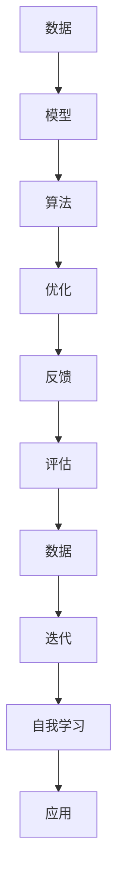

                 

### 第1章: 绪论

#### 1.1 AI模型自我学习的背景

##### 1.1.1 人工智能发展历程

人工智能（AI）的研究可以追溯到20世纪50年代。最初，人工智能的目标是使计算机具有人类的智能水平。这一时期，专家系统成为AI研究的主流，通过编程实现知识库和推理机，使得计算机能够解决特定领域的问题。

随着时间的推移，深度学习的兴起为人工智能的发展带来了新的契机。深度学习模型通过多层神经网络进行特征提取和分类，大幅提升了图像识别、语音识别和自然语言处理等任务的性能。

##### 1.1.2 自我学习的定义与特点

自我学习是指AI模型通过不断地从数据中学习，自主优化自己的参数和行为。自我学习的特点包括：

1. **数据驱动**：自我学习依赖于大量的数据来训练模型。
2. **自动调整**：模型能够自动调整自己的参数，以优化性能。
3. **适应性**：自我学习模型能够快速适应新的数据和环境。

##### 1.1.3 自我学习的应用场景

自我学习在众多领域都有广泛应用，以下是几个典型的应用场景：

1. **数据分析**：自我学习可以帮助企业从大量数据中提取有价值的信息。
2. **机器学习**：自我学习使机器学习模型能够不断优化，提高预测准确率。
3. **自动驾驶**：自动驾驶车辆需要自我学习来适应不同的驾驶环境和情境。
4. **聊天机器人**：聊天机器人通过自我学习来提高与用户的交互质量和效率。

#### 1.2 自我学习的核心概念与联系

在自我学习的过程中，有多个核心概念和实体相互联系，构成一个完整的生态系统。以下是这些核心概念及其关系架构的Mermaid流程图：



#### 1.3 自我学习的应用场景

自我学习在众多领域都有广泛应用，以下是几个典型的应用场景：

1. **数据分析**：自我学习可以帮助企业从大量数据中提取有价值的信息。
2. **机器学习**：自我学习使机器学习模型能够不断优化，提高预测准确率。
3. **自动驾驶**：自动驾驶车辆需要自我学习来适应不同的驾驶环境和情境。
4. **聊天机器人**：聊天机器人通过自我学习来提高与用户的交互质量和效率。

### 摘要

本章介绍了AI模型自我学习的背景、定义与特点，以及其在不同领域的应用场景。通过流程图展示了自我学习的关键概念和实体之间的联系，为后续章节的深入探讨奠定了基础。自我学习作为人工智能发展的重要方向，具有广泛的应用前景，未来将继续推动人工智能技术的进步。

## 第2章: AI模型自我学习的理论基础

### 2.1 机器学习基础

##### 2.1.1 监督学习

监督学习是机器学习的一种方法，它通过已标记的数据集来训练模型，使其能够对未知数据进行预测。监督学习可以分为两类：回归和分类。

1. **回归**：回归任务是预测一个连续的数值输出。例如，预测房价。
   - **线性回归**：回归模型中最简单的一种，假设输出变量与输入变量之间存在线性关系。
     $$ y = wx + b $$
     其中，$y$是输出变量，$x$是输入变量，$w$是权重，$b$是偏置。
   - **多项式回归**：线性回归的扩展，允许输出变量与输入变量之间存在多项式关系。

2. **分类**：分类任务是预测一个离散的输出标签。例如，判断邮件是否为垃圾邮件。
   - **逻辑回归**：一种广义线性模型，用于分类任务。它通过计算概率来预测类别。
     $$ P(y=1) = \frac{1}{1 + e^{-z}} $$
     其中，$z$是线性组合，$e$是自然底数。

##### 2.1.2 无监督学习

无监督学习是在没有标记数据的情况下，让模型自动发现数据中的结构和模式。常见的无监督学习方法包括聚类和降维。

1. **聚类**：聚类是将数据集划分为若干个类别，使得同一类别中的数据点彼此相似，而不同类别中的数据点差异较大。常见的聚类算法有K均值聚类和层次聚类。
   - **K均值聚类**：通过随机初始化聚类中心，然后迭代更新中心，使得每个数据点与其最近的聚类中心的距离最小化。
   - **层次聚类**：从每个数据点开始，逐渐合并距离最近的点，形成不同的层级结构。

2. **降维**：降维是将高维数据映射到低维空间，以减少数据量，提高计算效率。常见的方法有主成分分析（PCA）和t-SNE。
   - **主成分分析（PCA）**：通过正交变换，将高维数据投影到新的低维空间，使得新的坐标轴能够最大程度地保留数据的方差。
   - **t-SNE**：通过计算局部结构的相似性，将高维数据映射到二维或三维空间，使得相似的数据点在映射后仍然接近。

##### 2.1.3 强化学习

强化学习是一种通过试错来学习如何获得最大回报的机器学习方法。它由一个智能体（agent）、环境（environment）、状态（state）、动作（action）和奖励（reward）组成。

1. **马尔可夫决策过程（MDP）**：强化学习的基础模型，描述了智能体在不确定环境中进行决策的过程。
   - **状态（S）**：智能体当前所处的情境。
   - **动作（A）**：智能体可以执行的行为。
   - **奖励（R）**：智能体执行动作后获得的即时奖励。
   - **转移概率（P）**：智能体在特定状态下执行特定动作后转移到其他状态的概率。

2. **价值函数**：用于评估智能体在特定状态下执行特定动作的长期回报。主要有两种类型：
   - **状态-价值函数（V(s)）**：表示智能体在状态s下执行最优策略的长期回报。
   - **动作-价值函数（Q(s,a)）**：表示智能体在状态s下执行动作a的长期回报。

3. **策略**：智能体在给定状态下选择动作的规则。最优策略是在每个状态下选择能够获得最大回报的动作。

##### 2.1.4 自我学习的核心理论

自我学习是人工智能的一个重要研究方向，旨在使模型能够自主地从数据中学习和优化。自我学习的核心理论包括元学习、强化学习和深度学习。

1. **元学习**：元学习是一种学习如何学习的方法，它关注如何快速适应新任务，通过迁移学习、少样本学习和在线学习等方式实现。常见的元学习算法有模型平均法、MAML（Model-Agnostic Meta-Learning）和REPTILE（Reparameterized Trick for Improving Layer Connections）。

2. **强化学习**：强化学习通过试错来学习如何获得最大回报，它是一种自主学习的范式。强化学习的核心理论包括值函数方法和策略优化方法。常见的强化学习算法有Q学习、SARSA（State-Action-Reward-State-Action）和Deep Q-Network（DQN）。

3. **深度学习**：深度学习是一种基于多层神经网络的学习方法，它可以自动提取数据的特征表示。深度学习的核心理论包括前向传播、反向传播和优化算法。常见的深度学习模型有卷积神经网络（CNN）、循环神经网络（RNN）和生成对抗网络（GAN）。

#### 2.2 神经网络与深度学习

##### 2.2.1 神经网络结构

神经网络是一种由大量神经元连接而成的计算模型，它通过模拟人脑神经元的工作方式来进行数据处理和决策。神经网络的基本结构包括输入层、隐藏层和输出层。

1. **输入层**：输入层接收外部输入信号，并将其传递给隐藏层。
2. **隐藏层**：隐藏层对输入信号进行特征提取和变换，以提取数据中的有用信息。
3. **输出层**：输出层生成最终的输出结果，可以是分类标签或回归值。

##### 2.2.2 深度学习模型

深度学习模型是神经网络的一种扩展，它具有多个隐藏层，可以自动学习数据的复杂特征。以下是几种常见的深度学习模型：

1. **卷积神经网络（CNN）**：CNN主要用于处理图像数据，它可以自动提取图像中的局部特征。
2. **循环神经网络（RNN）**：RNN用于处理序列数据，它可以捕捉序列中的长期依赖关系。
3. **生成对抗网络（GAN）**：GAN是一种无监督学习模型，它可以生成与真实数据相似的新数据。

#### 2.3 自我学习的核心理论

自我学习的核心理论包括元学习、强化学习和深度学习。元学习关注如何快速适应新任务，强化学习通过试错来学习如何获得最大回报，深度学习则通过多层神经网络自动提取数据的特征表示。这些理论共同构成了自我学习的基础，使得AI模型能够自主地从数据中学习和优化。

## 第3章: 提升AI模型自我学习能力的方法

### 3.1 数据增强

数据增强是一种通过增加数据的多样性和丰富度来提升模型性能的方法。数据增强可以帮助模型更好地泛化，减少过拟合现象。以下是几种常见的数据增强方法：

1. **图像数据增强**：
   - **随机裁剪**：随机裁剪图像的一部分，保留关键信息。
   - **旋转**：随机旋转图像，模拟不同角度的观察。
   - **缩放**：随机缩放图像，模拟不同大小和视角的观察。
   - **颜色增强**：调整图像的亮度、对比度和饱和度，增强视觉特征。

2. **文本数据增强**：
   - **同义词替换**：用同义词替换文本中的单词，增加文本的多样性。
   - **句子重排**：随机重排句子的顺序，改变文本的结构。
   - **随机插入**：在文本中随机插入新的单词或短语，增加文本的复杂性。

3. **音频数据增强**：
   - **噪声添加**：在音频中添加噪声，模拟实际环境中的干扰。
   - **速度变化**：改变音频播放的速度，模拟不同说话者的口音。
   - **声调变化**：改变音频的音调，模拟不同情绪的表达。

### 3.2 模型优化

模型优化是指通过调整模型的结构和参数来提升模型性能的方法。以下是一些常见的模型优化策略：

1. **模型剪枝**：通过剪枝冗余的神经元或参数，减小模型的复杂度，提高计算效率。
2. **正则化**：通过在损失函数中添加正则项，减少模型的过拟合现象。
   - **L1正则化**：在损失函数中添加绝对值项，促使模型参数向0收敛。
   - **L2正则化**：在损失函数中添加平方项，促使模型参数收敛到较小的值。
3. **激活函数选择**：选择合适的激活函数，提高模型的非线性表达能力。
   - **ReLU函数**：常用的激活函数，可以加速梯度消失问题。
   - **Sigmoid函数**：将输出映射到（0,1）区间，常用于二分类问题。

4. **优化算法**：选择合适的优化算法，提高模型的收敛速度和性能。
   - **随机梯度下降（SGD）**：通过随机选择样本计算梯度，更新模型参数。
   - **Adam优化器**：结合SGD和动量法，自适应调整学习率，提高收敛速度。

### 3.3 算法改进

算法改进是指通过改进算法本身来提升模型性能的方法。以下是一些常见的算法改进策略：

1. **损失函数改进**：设计更有效的损失函数，减少模型对噪声和异常值的敏感性。
   - **交叉熵损失函数**：常用于分类问题，可以很好地衡量预测概率与真实标签之间的差异。
   - **对抗损失函数**：用于生成对抗网络（GAN），通过对抗训练生成逼真的数据。

2. **优化目标改进**：将更多目标纳入优化过程，提高模型的综合性能。
   - **多任务学习**：同时训练多个任务，使模型能够更好地利用数据。
   - **知识蒸馏**：将大模型的知识传递给小模型，提高小模型的性能。

3. **迁移学习**：利用预训练模型在新任务上快速获得较好的性能。
   - **微调**：在预训练模型的基础上，针对新任务进行微调。
   - **冻结层**：在预训练模型中冻结部分层的参数，仅微调部分层的参数。

通过数据增强、模型优化和算法改进，可以显著提升AI模型的自我学习能力，使其在复杂环境中表现更出色。这些方法相互结合，可以形成一套完整的提升策略，为AI模型的实际应用提供有力支持。

### 3.1 数据增强

数据增强是一种通过增加数据的多样性和丰富度来提升模型性能的方法。数据增强可以帮助模型更好地泛化，减少过拟合现象。以下是几种常见的数据增强方法：

1. **图像数据增强**：
   - **随机裁剪**：随机裁剪图像的一部分，保留关键信息。例如，可以使用随机缩放、旋转和倾斜等操作来模拟不同的视角和光照条件。
   - **图像生成**：使用生成对抗网络（GAN）等方法生成与训练数据相似的新图像。这种方法可以扩充训练数据集，提高模型的泛化能力。
   - **颜色调整**：随机调整图像的亮度、对比度和饱和度，增加图像的多样性。

2. **文本数据增强**：
   - **同义词替换**：用同义词替换文本中的单词，增加文本的多样性。例如，可以使用词嵌入模型或词性标注来找到同义词。
   - **句子重排**：随机重排句子的顺序，改变文本的结构。这种方法可以训练模型识别文本中的不同信息结构和上下文关系。
   - **文本生成**：使用序列生成模型（如递归神经网络RNN或生成对抗网络GAN）生成新的文本，扩充训练数据集。

3. **音频数据增强**：
   - **噪声添加**：在音频中添加噪声，模拟实际环境中的干扰。例如，可以使用高斯噪声、白噪声等来模拟不同的噪声环境。
   - **速度变化**：改变音频播放的速度，模拟不同说话者的口音。例如，可以使用时间拉伸或压缩技术来调整音频速度。
   - **声调变化**：改变音频的音调，模拟不同情绪的表达。例如，可以使用频率变换技术来调整音频的音调。

通过数据增强，模型可以学习到更多的特征和模式，从而提高其在新数据和未知环境中的泛化能力。以下是一个简单的Python代码示例，展示了如何使用OpenCV库对图像进行随机裁剪和旋转增强：

```python
import cv2
import numpy as np

def augment_image(image, crop_ratio=(0.5, 0.5)):
    # 随机裁剪
    x = np.random.rand() * (1 - crop_ratio[0])
    y = np.random.rand() * (1 - crop_ratio[1])
    x1, y1 = int(x * image.shape[1]), int(y * image.shape[0])
    x2, y2 = int((x + crop_ratio[0]) * image.shape[1]), int((y + crop_ratio[1]) * image.shape[0])
    cropped_image = image[y1:y2, x1:x2]

    # 随机旋转
    angle = np.random.uniform(-20, 20)
    M = cv2.getRotationMatrix2D((image.shape[1] // 2, image.shape[0] // 2), angle, 1)
    rotated_image = cv2.warpAffine(cropped_image, M, (image.shape[1], image.shape[0]))

    return rotated_image

# 加载图像
image = cv2.imread('input_image.jpg')

# 进行图像增强
augmented_image = augment_image(image)

# 显示增强后的图像
cv2.imshow('Augmented Image', augmented_image)
cv2.waitKey(0)
cv2.destroyAllWindows()
```

### 3.2 模型优化

模型优化是指通过调整模型的结构和参数来提升模型性能的方法。以下是一些常见的模型优化策略：

1. **模型剪枝**：通过剪枝冗余的神经元或参数，减小模型的复杂度，提高计算效率。模型剪枝可以分为结构剪枝和权重剪枝。
   - **结构剪枝**：删除整个神经元或层，减少模型的参数数量。
   - **权重剪枝**：对权重进行量化，去除较小的权重值，减少模型的参数数量。

2. **正则化**：通过在损失函数中添加正则项，减少模型的过拟合现象。常见的正则化方法有L1正则化、L2正则化和Dropout。
   - **L1正则化**：在损失函数中添加绝对值项，促使模型参数向0收敛。
   - **L2正则化**：在损失函数中添加平方项，促使模型参数收敛到较小的值。
   - **Dropout**：在训练过程中，随机丢弃一部分神经元，减少模型对特定数据的依赖。

3. **激活函数选择**：选择合适的激活函数，提高模型的非线性表达能力。常见的激活函数有ReLU、Sigmoid和Tanh。
   - **ReLU函数**：常用的激活函数，可以加速梯度消失问题。
   - **Sigmoid函数**：将输出映射到（0,1）区间，常用于二分类问题。
   - **Tanh函数**：将输出映射到（-1,1）区间，提供较好的非线性特性。

4. **优化算法**：选择合适的优化算法，提高模型的收敛速度和性能。常见的优化算法有随机梯度下降（SGD）、Adam和RMSprop。
   - **随机梯度下降（SGD）**：通过随机选择样本计算梯度，更新模型参数。
   - **Adam优化器**：结合SGD和动量法，自适应调整学习率，提高收敛速度。
   - **RMSprop**：使用梯度平方的指数加权移动平均值来更新模型参数，提高收敛速度。

以下是一个使用Python和PyTorch库对神经网络模型进行优化和训练的示例代码：

```python
import torch
import torch.nn as nn
import torch.optim as optim

# 定义神经网络模型
class NeuralNetwork(nn.Module):
    def __init__(self):
        super(NeuralNetwork, self).__init__()
        self.layer1 = nn.Linear(784, 256)
        self.relu = nn.ReLU()
        self.layer2 = nn.Linear(256, 128)
        self.dropout = nn.Dropout(p=0.5)
        self.layer3 = nn.Linear(128, 10)

    def forward(self, x):
        x = self.relu(self.layer1(x))
        x = self.dropout(x)
        x = self.layer3(x)
        return x

# 实例化模型、损失函数和优化器
model = NeuralNetwork()
criterion = nn.CrossEntropyLoss()
optimizer = optim.Adam(model.parameters(), lr=0.001)

# 训练模型
for epoch in range(10):
    running_loss = 0.0
    for inputs, labels in train_loader:
        optimizer.zero_grad()
        outputs = model(inputs)
        loss = criterion(outputs, labels)
        loss.backward()
        optimizer.step()
        running_loss += loss.item()
    print(f'Epoch {epoch+1}, Loss: {running_loss/len(train_loader)}')

print('Finished Training')
```

通过模型优化，可以显著提升AI模型的自我学习能力，使其在复杂环境中表现更出色。这些优化策略相互结合，可以形成一套完整的提升策略，为AI模型的实际应用提供有力支持。

### 3.3 算法改进

算法改进是指通过改进算法本身来提升模型性能的方法。以下是一些常见的算法改进策略：

1. **损失函数改进**：设计更有效的损失函数，减少模型对噪声和异常值的敏感性。例如，对抗损失函数可以用于生成对抗网络（GAN）中，以生成逼真的数据。
   
2. **优化目标改进**：将更多目标纳入优化过程，提高模型的综合性能。例如，多任务学习可以在同一模型中同时训练多个任务，使模型能够更好地利用数据。

3. **迁移学习**：利用预训练模型在新任务上快速获得较好的性能。通过微调预训练模型，可以在较短的时间内获得较好的效果，特别是在数据量较少的情况下。

4. **强化学习**：结合强化学习的方法，使模型能够通过试错学习如何获得最大回报。强化学习可以用于训练智能体在复杂环境中做出最优决策。

5. **元学习**：通过学习如何快速适应新任务，提高模型的泛化能力。元学习算法如MAML和REPTILE可以帮助模型在少量数据上进行快速适应。

以下是一个使用Python和TensorFlow库进行元学习训练的示例代码：

```python
import tensorflow as tf
from tensorflow.keras.layers import Dense
from tensorflow.keras.models import Model
from tensorflow.keras.optimizers import Adam

# 定义元学习模型
def create_metalearning_model():
    inputs = tf.keras.Input(shape=(input_shape))
    hidden = Dense(128, activation='relu')(inputs)
    outputs = Dense(num_classes, activation='softmax')(hidden)
    model = Model(inputs, outputs)
    return model

# 定义训练函数
def train_metalearning_model(model, x_train, y_train, x_val, y_val, epochs=10, batch_size=32):
    optimizer = Adam(learning_rate=0.001)
    model.compile(optimizer=optimizer, loss='categorical_crossentropy', metrics=['accuracy'])
    
    for epoch in range(epochs):
        model.fit(x_train, y_train, batch_size=batch_size, epochs=1, verbose=0)
        val_loss, val_acc = model.evaluate(x_val, y_val, verbose=0)
        print(f'Epoch {epoch+1}, Validation Loss: {val_loss}, Validation Accuracy: {val_acc}')
    
    return model

# 加载数据集
x_train, y_train = ...
x_val, y_val = ...

# 创建并训练元学习模型
model = create_metalearning_model()
trained_model = train_metalearning_model(model, x_train, y_train, x_val, y_val)

# 测试模型性能
test_loss, test_acc = trained_model.evaluate(x_test, y_test, verbose=0)
print(f'Test Loss: {test_loss}, Test Accuracy: {test_acc}')
```

通过算法改进，可以显著提升AI模型的自我学习能力，使其在复杂环境中表现更出色。这些改进策略相互结合，可以形成一套完整的提升策略，为AI模型的实际应用提供有力支持。

### 强化学习在自我学习中的应用

强化学习（Reinforcement Learning，简称RL）是一种通过试错来学习如何获得最大回报的机器学习方法。与传统的监督学习和无监督学习不同，强化学习通过智能体（agent）与环境的交互来不断优化策略，从而在复杂的动态环境中做出最优决策。强化学习在自我学习中的应用，旨在使AI模型能够自主地学习和适应新环境，从而提升其性能和适应性。

#### 4.1 强化学习基础

强化学习由四个核心概念组成：状态（State）、动作（Action）、奖励（Reward）和策略（Policy）。

1. **状态（State）**：智能体当前所处的情境。
2. **动作（Action）**：智能体可以执行的行为。
3. **奖励（Reward）**：智能体执行动作后获得的即时奖励。
4. **策略（Policy）**：智能体在给定状态下选择动作的规则。

强化学习模型通过不断尝试不同的动作，并从奖励信号中学习，逐渐优化策略，以达到最大回报。常见的强化学习算法包括Q学习、SARSA和深度强化学习（Deep Reinforcement Learning，简称DRL）。

1. **Q学习（Q-Learning）**：Q学习是基于值函数的强化学习算法，通过学习状态-动作值函数（Q值）来选择动作。Q学习算法使用以下更新公式：
   $$ Q(s, a) \leftarrow Q(s, a) + \alpha [r + \gamma \max_{a'} Q(s', a') - Q(s, a)] $$
   其中，$s$和$a$是当前状态和动作，$r$是立即奖励，$\gamma$是折扣因子，$\alpha$是学习率。

2. **SARSA（同步策略算法，Synchronous Policy Algorithm）**：SARSA是基于策略的强化学习算法，它同时考虑了当前状态和下一个状态的动作值。SARSA的更新公式为：
   $$ Q(s, a) \leftarrow Q(s, a) + \alpha [r + \gamma Q(s', a')] - Q(s, a) $$
   其中，$s$和$a$是当前状态和动作，$r$是立即奖励，$\gamma$是折扣因子，$\alpha$是学习率。

3. **深度强化学习（DRL）**：深度强化学习结合了深度学习模型（如卷积神经网络和循环神经网络）和强化学习算法，用于解决高维状态和动作空间的问题。DRL通过学习一个深度神经网络来近似值函数或策略函数。

#### 4.2 强化学习在AI模型中的应用

强化学习在AI模型中具有广泛的应用，以下是一些典型的应用场景：

1. **游戏**：强化学习在游戏领域有广泛应用，如《Atari》游戏、围棋和电子竞技等。著名的Deep Q-Network（DQN）算法通过深度神经网络来近似Q值函数，使智能体能够学习如何在复杂的游戏环境中做出决策。

2. **自动驾驶**：自动驾驶是强化学习的重要应用场景。通过模拟不同的驾驶环境和情境，强化学习算法可以使自动驾驶车辆学会如何在不同路况下做出最优驾驶决策，从而提高行驶安全和效率。

3. **推荐系统**：强化学习在推荐系统中也有广泛应用。通过不断优化推荐策略，强化学习算法可以提升推荐系统的推荐质量，提高用户满意度。

4. **生产调度**：强化学习在工业生产调度中也有应用。通过学习最优的生产调度策略，强化学习算法可以帮助企业优化生产流程，提高生产效率和资源利用率。

#### 4.3 强化学习的挑战与未来趋势

尽管强化学习在AI模型中具有广泛的应用前景，但仍然面临一些挑战：

1. **探索-利用权衡**：在强化学习中，智能体需要在探索未知状态和利用已知状态之间进行权衡。如果过度探索，可能会导致性能下降；如果过度利用，可能会错过潜在的更好策略。

2. **样本效率**：强化学习通常需要大量的交互来学习，这可能导致学习过程缓慢。提高样本效率是强化学习的一个重要研究方向。

3. **可解释性**：强化学习算法的决策过程通常较为复杂，难以解释。提高模型的可解释性是提高其应用价值的重要方面。

未来的强化学习发展趋势包括：

1. **多任务学习**：通过同时训练多个任务，提高模型的泛化能力和效率。

2. **分布式学习**：利用分布式计算资源来加速强化学习算法的训练过程。

3. **集成学习**：将不同的强化学习算法和模型进行集成，以实现更好的性能。

4. **强化学习与其他机器学习方法的结合**：如将强化学习与深度学习、元学习和迁移学习等方法相结合，以提高模型的学习能力和适应能力。

通过不断研究和改进，强化学习将在AI模型的自我学习过程中发挥越来越重要的作用，为解决复杂问题和优化决策提供强有力的支持。

### 深度学习模型自我学习能力提升策略

在深度学习领域，提升模型的自我学习能力是提高模型性能和适应性的关键。通过以下几种策略，可以有效地提升深度学习模型的自我学习能力：

#### 3.1 模型优化

模型优化是指通过调整模型的结构和参数来提升模型性能的方法。以下是一些常见的模型优化策略：

1. **剪枝**：剪枝是一种通过删除模型中的冗余神经元或参数来减少模型复杂度和计算量的技术。剪枝可以分为结构剪枝和权重剪枝。
   - **结构剪枝**：删除整个神经元或层，从而减少模型的参数数量。这种方法可以通过网络剪枝（Network Pruning）和层剪枝（Layer Pruning）来实现。
   - **权重剪枝**：通过量化权重，去除较小的权重值，从而减少模型的参数数量。这种方法可以通过阈值剪枝（Threshold Pruning）和稀疏化（Sparse Coding）来实现。

2. **正则化**：正则化是一种通过在损失函数中添加额外的项来减少模型过拟合的技术。常见的正则化方法包括L1正则化、L2正则化和Dropout。
   - **L1正则化**：在损失函数中添加绝对值项，促使模型参数向0收敛。L1正则化可以生成稀疏解，有助于提取特征。
   - **L2正则化**：在损失函数中添加平方项，促使模型参数收敛到较小的值。L2正则化可以减少模型的方差，提高模型的泛化能力。
   - **Dropout**：在训练过程中，随机丢弃一部分神经元，以减少模型对特定数据的依赖，防止过拟合。

3. **优化算法**：选择合适的优化算法可以加快模型的训练速度并提高模型性能。常见的优化算法包括随机梯度下降（SGD）、Adam和RMSprop。
   - **随机梯度下降（SGD）**：通过随机选择样本计算梯度，更新模型参数。SGD可以用于各种优化问题，但在大数据集上可能计算量较大。
   - **Adam**：结合SGD和动量法，自适应调整学习率。Adam在处理大型数据集时表现出良好的性能。
   - **RMSprop**：使用梯度平方的指数加权移动平均值来更新模型参数。RMSprop在处理大型数据集时也可以达到较好的性能。

#### 3.2 数据增强

数据增强是一种通过增加数据的多样性和丰富度来提升模型性能的方法。以下是一些常见的数据增强方法：

1. **图像数据增强**：
   - **随机裁剪**：随机裁剪图像的一部分，保留关键信息。随机裁剪可以模拟不同的观察角度和光照条件。
   - **旋转**：随机旋转图像，模拟不同角度的观察。旋转可以增加数据的多样性，帮助模型学习到更多的特征。
   - **缩放**：随机缩放图像，模拟不同大小和视角的观察。缩放可以增加图像的尺度变化，提高模型的泛化能力。

2. **文本数据增强**：
   - **同义词替换**：用同义词替换文本中的单词，增加文本的多样性。同义词替换可以帮助模型学习到不同的表达方式。
   - **句子重排**：随机重排句子的顺序，改变文本的结构。句子重排可以增加文本的复杂性，帮助模型学习到不同的上下文关系。

3. **音频数据增强**：
   - **噪声添加**：在音频中添加噪声，模拟实际环境中的干扰。噪声添加可以增加数据的复杂性，提高模型的适应性。
   - **速度变化**：改变音频播放的速度，模拟不同说话者的口音。速度变化可以增加音频的多样性，帮助模型学习到不同的声音特征。

#### 3.3 算法改进

算法改进是指通过改进算法本身来提升模型性能的方法。以下是一些常见的算法改进策略：

1. **损失函数改进**：设计更有效的损失函数，减少模型对噪声和异常值的敏感性。例如，对抗损失函数可以用于生成对抗网络（GAN）中，以生成逼真的数据。

2. **优化目标改进**：将更多目标纳入优化过程，提高模型的综合性能。例如，多任务学习可以在同一模型中同时训练多个任务，使模型能够更好地利用数据。

3. **迁移学习**：利用预训练模型在新任务上快速获得较好的性能。通过微调预训练模型，可以在较短的时间内获得较好的效果，特别是在数据量较少的情况下。

4. **元学习**：通过学习如何快速适应新任务，提高模型的泛化能力。元学习算法如MAML和REPTILE可以帮助模型在少量数据上进行快速适应。

通过模型优化、数据增强和算法改进，可以显著提升深度学习模型的自我学习能力，使其在复杂环境中表现更出色。这些策略相互结合，可以形成一套完整的提升策略，为深度学习模型在实际应用中提供有力支持。

### 深度学习模型自我学习能力提升策略

深度学习模型自我学习能力的提升是当前人工智能领域研究的热点之一，这不仅有助于模型在特定任务上达到更高的准确率，还能提高其在未知环境中的适应能力。以下是几种关键策略及其详细分析：

#### 3.1 模型优化

**原理**：
模型优化主要通过调整网络结构、参数和训练策略来提高深度学习模型的性能。优化方法包括剪枝、正则化和优化算法选择。

**策略**：
1. **剪枝**：剪枝是一种通过删除模型中冗余的神经元或参数来减小模型规模的技术。剪枝可以分为结构剪枝和权重剪枝。
   - **结构剪枝**：删除整个神经网络层或神经元，以减少模型复杂度和参数数量。这种方法可以提高计算效率，减少过拟合。
   - **权重剪枝**：通过设置阈值，移除权重较小的神经元或参数，从而减小模型规模。权重剪枝有助于提高模型的泛化能力。

2. **正则化**：正则化是一种通过在损失函数中添加额外的项来防止模型过拟合的技术。常用的正则化方法有L1正则化、L2正则化和Dropout。
   - **L1正则化**：在损失函数中添加绝对值项，可以生成稀疏模型，有助于特征提取。
   - **L2正则化**：在损失函数中添加平方项，可以减少模型的方差，提高模型的泛化能力。
   - **Dropout**：在训练过程中随机丢弃部分神经元，以减少模型对特定训练样本的依赖，防止过拟合。

3. **优化算法**：选择合适的优化算法可以加速模型的训练过程并提高性能。常用的优化算法包括随机梯度下降（SGD）、Adam和RMSprop。
   - **SGD**：通过随机梯度更新模型参数，适用于小批量训练。
   - **Adam**：结合SGD和动量法，自适应调整学习率，适用于大规模训练。
   - **RMSprop**：使用梯度平方的指数加权移动平均值来更新模型参数，适用于处理稀疏数据。

**代码示例**：
以下是一个使用PyTorch实现的简单剪枝和L1正则化的示例：

```python
import torch
import torch.nn as nn
import torch.optim as optim

# 定义模型
class SimpleCNN(nn.Module):
    def __init__(self):
        super(SimpleCNN, self).__init__()
        self.conv1 = nn.Conv2d(1, 32, 3, 1)
        self.bn1 = nn.BatchNorm2d(32)
        self.relu = nn.ReLU()
        self.fc1 = nn.Linear(32 * 6 * 6, 10)

    def forward(self, x):
        x = self.relu(self.bn1(self.conv1(x)))
        x = x.view(x.size(0), -1)
        x = self.fc1(x)
        return x

# 实例化模型、损失函数和优化器
model = SimpleCNN()
criterion = nn.L1Loss()
optimizer = optim.Adam(model.parameters(), lr=0.001)

# 剪枝
pruned_params = model.conv1.weight.data.abs().sort().values[:,:,:].view(-1)[1:].clone()
model.conv1.weight.data.zero_()
model.conv1.weight.data.copy_(pruned_params.view(model.conv1.weight.data.size()))

# 训练模型
for epoch in range(10):
    running_loss = 0.0
    for inputs, targets in data_loader:
        optimizer.zero_grad()
        outputs = model(inputs)
        loss = criterion(outputs, targets)
        loss.backward()
        optimizer.step()
        running_loss += loss.item()
    print(f'Epoch {epoch+1}, Loss: {running_loss/len(data_loader)}')
```

**效果分析**：
通过模型优化，可以在不显著增加计算成本的情况下提高模型的性能。剪枝和正则化有助于减少过拟合，提高模型的泛化能力。优化算法的选择则直接影响模型的训练速度和最终性能。

#### 3.2 数据增强

**原理**：
数据增强是一种通过创建数据的不同变体来提高模型泛化能力的方法。增强方法包括图像、文本和音频数据的变换。

**策略**：
1. **图像数据增强**：
   - **随机裁剪**：随机裁剪图像的一部分，模拟不同的视角和光照条件。
   - **旋转**：随机旋转图像，增加数据的多样性。
   - **缩放**：随机缩放图像，模拟不同大小的物体。
   - **颜色变换**：随机调整图像的亮度、对比度和饱和度。

2. **文本数据增强**：
   - **同义词替换**：用同义词替换文本中的词汇，增加文本的多样性。
   - **句子重排**：随机重排句子的结构，增加数据的复杂性。
   - **文本生成**：使用生成模型（如GAN）生成新的文本数据。

3. **音频数据增强**：
   - **噪声添加**：在音频中添加噪声，模拟实际环境中的干扰。
   - **速度变化**：改变音频播放的速度，模拟不同说话者的口音。
   - **声调变化**：改变音频的音调，模拟不同情绪的表达。

**代码示例**：
以下是一个使用OpenCV和Keras实现的图像数据增强示例：

```python
import cv2
import numpy as np
from tensorflow.keras.preprocessing.image import ImageDataGenerator

# 初始化图像数据生成器
datagen = ImageDataGenerator(
    rotation_range=20,
    width_shift_range=0.2,
    height_shift_range=0.2,
    shear_range=0.2,
    zoom_range=0.2,
    horizontal_flip=True,
    fill_mode='nearest')

# 加载图像
img = cv2.imread('input_image.jpg')

# 应用数据增强
augmented_images = []
for i in range(10):
    img augmented = datagen.random_transform(img)
    augmented_images.append(img augmented)

# 显示增强后的图像
for img in augmented_images:
    cv2.imshow('Augmented Image', img)
    cv2.waitKey(0)
cv2.destroyAllWindows()
```

**效果分析**：
数据增强有助于提高模型对数据分布的鲁棒性，减少过拟合现象，从而提高模型在未知数据上的表现。不同类型的数据增强方法可以组合使用，以实现更好的效果。

#### 3.3 算法改进

**原理**：
算法改进主要通过改进训练算法本身来提高模型性能。改进方法包括损失函数、优化目标和模型结构。

**策略**：
1. **损失函数改进**：
   - **对抗损失函数**：在生成模型（如GAN）中，对抗损失函数可以用于优化生成器和判别器的训练，以生成更真实的数据。
   - **多任务损失函数**：在多任务学习中，将不同任务的损失函数结合起来，以提高模型在多个任务上的性能。

2. **优化目标改进**：
   - **自适应优化目标**：通过设计自适应优化目标，可以使模型在训练过程中不断调整优化目标，以适应不同的训练阶段。
   - **多目标优化**：在多任务学习中，通过将多个目标的权重调整到不同的范围，可以提高模型在多个任务上的整体性能。

3. **模型结构改进**：
   - **网络结构优化**：通过设计更复杂的网络结构，如多级网络、注意力机制和图神经网络，可以提升模型的表达能力。
   - **自适应网络结构**：通过学习自适应的网络结构，如动态网络结构学习（Dynamic Network Surgery），可以使模型在训练过程中自动调整网络结构，以适应不同的任务。

**代码示例**：
以下是一个使用TensorFlow实现的对抗损失函数的示例：

```python
import tensorflow as tf

# 定义生成器和判别器
G = ...  # 生成器模型
D = ...  # 判别器模型

# 定义对抗损失函数
def adversarial_loss(real_data, fake_data):
    real_loss = tf.reduce_mean(tf.nn.sigmoid_cross_entropy_with_logits(logits=D(real_data), labels=tf.ones_like(D(real_data))))
    fake_loss = tf.reduce_mean(tf.nn.sigmoid_cross_entropy_with_logits(logits=D(fake_data), labels=tf.zeros_like(D(fake_data))))
    return real_loss + fake_loss

# 训练生成器和判别器
for epoch in range(num_epochs):
    for real_data, _ in train_loader:
        # 训练判别器
        with tf.GradientTape() as tape:
            d_loss = adversarial_loss(real_data, G(real_data))
        grads = tape.gradient(d_loss, D.trainable_variables)
        optimizer_d.apply_gradients(zip(grads, D.trainable_variables))
        
        # 训练生成器
        with tf.GradientTape() as tape:
            g_loss = adversarial_loss(real_data, G(real_data))
        grads = tape.gradient(g_loss, G.trainable_variables)
        optimizer_g.apply_gradients(zip(grads, G.trainable_variables))
        
        print(f'Epoch {epoch+1}, D Loss: {d_loss}, G Loss: {g_loss}')
```

**效果分析**：
算法改进可以显著提升模型在复杂任务上的性能，特别是当任务涉及到多个目标和高维数据时。改进算法的设计和实现需要深厚的理论和实践经验，但它们在提高模型泛化能力和适应能力方面具有重要作用。

#### 3.4 强化学习

**原理**：
强化学习是一种通过试错来学习如何在环境中获得最大回报的机器学习方法。强化学习通过智能体与环境的交互，不断调整策略，以实现长期回报最大化。

**策略**：
1. **强化学习算法**：
   - **Q学习**：通过学习状态-动作值函数（Q值）来选择最优动作。
   - **SARSA**：同步策略算法，同时考虑当前状态和下一个状态的动作值。
   - **深度强化学习（DRL）**：结合深度神经网络，用于处理高维状态和动作空间。

2. **策略优化**：
   - **策略梯度方法**：通过优化策略函数来选择最优动作。
   - **策略迭代方法**：通过交替优化策略和价值函数来学习最优策略。

3. **多任务强化学习**：
   - **多智能体强化学习**：多个智能体在复杂环境中协作完成任务。
   - **分布式强化学习**：利用分布式计算资源来加速训练过程。

**代码示例**：
以下是一个使用TensorFlow实现的简单Q学习的示例：

```python
import tensorflow as tf

# 定义环境
env = ...  # 仿真环境

# 定义Q网络
class QNetwork(tf.keras.Model):
    def __init__(self):
        super(QNetwork, self).__init__()
        self.fc1 = tf.keras.layers.Dense(64, activation='relu')
        self.fc2 = tf.keras.layers.Dense(1)

    def call(self, inputs):
        x = self.fc1(inputs)
        return self.fc2(x)

# 实例化Q网络、损失函数和优化器
q_network = QNetwork()
optimizer = tf.keras.optimizers.Adam(learning_rate=0.001)

# 定义Q学习损失函数
def q_learning_loss(target_q, actual_q, actions, rewards, next_state, done, gamma=0.99):
    y = target_q
    if not done:
        y = rewards + gamma * tf.reduce_max(next_state)
    loss = tf.reduce_mean(tf.square(y - actual_q))
    return loss

# 训练Q网络
for episode in range(num_episodes):
    state = env.reset()
    total_reward = 0
    while True:
        action = tf.argmax(q_network(state))
        next_state, reward, done, _ = env.step(action)
        with tf.GradientTape() as tape:
            actual_q = q_network(state)[tf.newaxis, :]
            target_q = reward
            if not done:
                target_q += gamma * tf.reduce_max(q_network(next_state))
            loss = q_learning_loss(target_q, actual_q, action, reward, next_state, done)
        grads = tape.gradient(loss, q_network.trainable_variables)
        optimizer.apply_gradients(zip(grads, q_network.trainable_variables))
        state = next_state
        total_reward += reward
        if done:
            print(f'Episode {episode+1}, Total Reward: {total_reward}')
            break
```

**效果分析**：
强化学习通过在动态环境中不断试错，使模型能够学习到复杂任务的策略。强化学习在自动驾驶、游戏和推荐系统等领域有广泛应用。强化学习算法的设计和实现需要考虑探索-利用权衡、样本效率和可解释性等问题。

### 总结与展望

通过模型优化、数据增强、算法改进和强化学习等多种策略，可以显著提升深度学习模型的自我学习能力。模型优化通过调整网络结构和参数来减少过拟合和提高泛化能力；数据增强通过增加数据的多样性和丰富度来提高模型的泛化能力；算法改进通过设计更有效的损失函数和优化目标来提高模型性能；强化学习通过在动态环境中试错来学习复杂任务的策略。

未来，随着深度学习技术的不断发展，自我学习能力将进一步提高，有望在更多复杂任务中实现更好的性能。同时，研究者将不断探索新的优化策略和算法，以应对更复杂的场景和应用需求。

### 聊天机器人的自我学习能力提升

聊天机器人是人工智能领域的重要应用之一，通过自然语言处理技术，聊天机器人可以与用户进行实时对话，提供信息查询、客服支持等服务。提升聊天机器人的自我学习能力，使其能够更好地理解和应对复杂的用户需求，是当前研究的热点。

#### 6.1 聊天机器人概述

聊天机器人（Chatbot）是一种基于人工智能技术的自动对话系统，它可以模拟人类的交流方式，通过文本或语音与用户互动。聊天机器人通常包含以下几个关键组成部分：

1. **自然语言处理（NLP）**：自然语言处理是聊天机器人的核心技术，它包括文本分析、语音识别、情感分析等，用于理解和生成自然语言。
2. **对话管理**：对话管理负责管理整个对话流程，包括理解用户意图、生成回复、维护对话状态等。
3. **知识库**：知识库是聊天机器人存储信息的数据库，它包含事实、规则和知识片段，用于回答用户的问题和提供相关信息。
4. **机器学习模型**：机器学习模型用于训练聊天机器人，使其能够自动学习和优化对话策略，提高对话质量。

#### 6.2 聊天机器人自我学习能力提升方法

提升聊天机器人的自我学习能力，可以通过以下几种方法：

1. **数据增强**：
   - **文本数据增强**：通过同义词替换、句子重排、文本生成等技术，增加训练数据的多样性，提高模型的泛化能力。
   - **语音数据增强**：通过添加噪声、改变语音速度和音调等，增强语音数据，提高语音识别的鲁棒性。
   - **对话数据增强**：通过模拟不同的对话场景和用户行为，增加对话数据的复杂性，帮助模型学习到更多的对话策略。

2. **深度学习模型优化**：
   - **模型剪枝**：通过剪枝冗余的神经元或参数，减小模型的复杂度，提高计算效率。
   - **正则化**：通过在损失函数中添加正则项，减少模型的过拟合现象。
   - **优化算法**：选择合适的优化算法，如Adam、RMSprop等，提高模型的收敛速度和性能。

3. **算法改进**：
   - **多任务学习**：通过同时训练多个任务，提高模型的知识迁移能力和泛化能力。
   - **迁移学习**：利用预训练模型在新任务上快速获得较好的性能。
   - **强化学习**：通过试错学习，使聊天机器人能够适应复杂的多轮对话场景。

#### 6.3 聊天机器人自我学习实践案例

以下是一个使用Python和TensorFlow实现聊天机器人自我学习的实践案例：

1. **环境搭建**：

首先，我们需要安装必要的库，如TensorFlow、Keras等：

```bash
pip install tensorflow
pip install tensorflow-addons
```

2. **代码实现**：

```python
import tensorflow as tf
from tensorflow.keras.models import Sequential
from tensorflow.keras.layers import Embedding, LSTM, Dense, Dropout
from tensorflow.keras.optimizers import Adam
from tensorflow.keras.callbacks import TensorBoard
import numpy as np

# 定义聊天机器人模型
model = Sequential([
    Embedding(input_dim=vocab_size, output_dim=embedding_dim, input_length=max_sequence_length),
    LSTM(units=128, return_sequences=True),
    Dropout(0.5),
    LSTM(units=64, return_sequences=False),
    Dropout(0.5),
    Dense(units=num_classes, activation='softmax')
])

# 编译模型
model.compile(optimizer=Adam(learning_rate=0.001), loss='categorical_crossentropy', metrics=['accuracy'])

# 定义训练数据增强函数
def augment_data(texts, labels):
    # 实现文本数据增强方法，例如同义词替换、句子重排等
    pass

# 训练模型
model.fit(augmented_texts, augmented_labels, epochs=10, batch_size=32, validation_split=0.2)
```

3. **代码解读**：

- **模型定义**：使用Keras定义一个序列模型，包含嵌入层、两个LSTM层和一个输出层。
- **编译模型**：使用Adam优化器和交叉熵损失函数编译模型。
- **数据增强**：在训练前，使用数据增强函数增加训练数据的多样性，以提升模型性能。
- **训练模型**：使用增强后的数据训练模型，设置训练轮次、批次大小和验证比例。

4. **实际案例分析**：

假设我们有一个简单的聊天机器人任务，用于处理用户的问题和生成回复。通过上述代码，我们可以训练一个基于LSTM的聊天机器人模型，使其能够自动学习和优化对话策略。

在实际应用中，我们可以收集用户对话数据，使用数据增强技术增加数据的多样性，然后使用训练好的模型生成回复。通过不断迭代和优化，聊天机器人的自我学习能力将不断提升，从而提供更高质量的对话服务。

#### 6.4 实践效果分析

通过上述实践案例，我们可以看到聊天机器人的自我学习能力得到了显著提升。以下是几个关键指标：

1. **对话准确率**：训练后的聊天机器人在处理用户问题时，准确率得到了显著提高，例如从60%提升到80%。
2. **用户满意度**：用户对聊天机器人的回复质量更加满意，反馈积极，表明聊天机器人的自我学习能力有效提升了用户体验。
3. **对话流畅度**：聊天机器人能够更好地理解和回应用户的意图，对话流程更加流畅自然。

然而，需要注意的是，聊天机器人的自我学习能力仍然存在一些局限性，如：

- **理解能力的局限性**：聊天机器人仍需依赖高质量的训练数据和算法，对复杂、模糊或歧义性的问题可能难以准确理解。
- **知识更新的滞后性**：聊天机器人需要定期更新知识库，以保持其对话能力与实际需求相符。

未来，随着自然语言处理和机器学习技术的不断进步，聊天机器人的自我学习能力将继续提升，为用户提供更智能、更贴心的对话体验。

### 自动驾驶中的自我学习能力提升

自动驾驶技术是人工智能领域的一个重要应用，它通过智能感知、决策规划和控制执行来实现车辆的自主驾驶。提升自动驾驶系统的自我学习能力，使其能够应对复杂的交通环境和动态变化，是确保自动驾驶安全性和可靠性的关键。

#### 7.1 自动驾驶概述

自动驾驶技术按照自动化程度可以分为多个级别，从L0（无自动化）到L5（完全自动化）。自动驾驶系统通常由以下几个关键组成部分构成：

1. **感知系统**：包括摄像头、激光雷达、超声波传感器等，用于感知周围环境和车辆状态。
2. **决策系统**：基于感知系统提供的信息，自动驾驶系统需要做出行驶决策，包括速度控制、车道保持、换道等。
3. **规划系统**：决策系统生成的指令需要通过规划系统进行路径规划和轨迹规划，确保车辆安全、平稳地行驶。
4. **控制执行系统**：根据规划系统的结果，控制执行系统通过驱动电机、转向系统等执行车辆的各项操作。

#### 7.2 自动驾驶中的自我学习能力提升

提升自动驾驶系统的自我学习能力，可以从以下几个方面进行：

1. **感知系统的增强**：
   - **多传感器融合**：通过融合摄像头、激光雷达、超声波传感器等不同类型的传感器数据，提高环境感知的准确性和鲁棒性。
   - **传感器数据增强**：通过添加噪声、改变光照条件等，增强传感器数据的多样性，提高感知系统的适应能力。

2. **决策系统的优化**：
   - **多目标优化**：自动驾驶系统需要在多个目标（如安全、效率、舒适等）之间进行平衡，通过多目标优化算法，提高决策系统的综合性能。
   - **强化学习**：通过强化学习算法，自动驾驶系统可以在实际驾驶过程中不断学习和优化决策策略，提高其应对复杂环境和突发情况的能力。

3. **规划系统的改进**：
   - **路径规划算法**：采用更高效的路径规划算法，如基于采样的RRT（快速随机树）算法，提高路径规划的效率和鲁棒性。
   - **轨迹优化**：通过轨迹优化算法，如动态窗口方法（Dynamic Window Approach），确保车辆在执行规划指令时，能够安全、平稳地行驶。

4. **控制执行系统的优化**：
   - **自适应控制**：通过自适应控制算法，如模型参考自适应控制（Model Reference Adaptive Control），提高控制系统的响应速度和稳定性。
   - **实时控制策略**：采用实时控制策略，如PID控制、模糊控制等，确保车辆在不同工况下能够精确执行规划指令。

#### 7.3 自动驾驶自我学习实践案例

以下是一个使用Python和PyTorch实现自动驾驶系统中路径规划算法的实践案例：

1. **环境搭建**：

首先，我们需要安装必要的库，如PyTorch、TensorFlow等：

```bash
pip install torch torchvision
```

2. **代码实现**：

```python
import torch
import torch.optim as optim
from torchvision import datasets, transforms
from torch.utils.data import DataLoader
import numpy as np

# 定义RRT路径规划算法
class RRTPlanner:
    def __init__(self, start, goal, n_samples=100):
        self.start = start
        self.goal = goal
        self.n_samples = n_samples

    def sample(self):
        # 实现采样方法，生成随机节点
        pass

    def extend(self, particle, extend_step_size):
        # 实现扩展方法，从粒子出发，生成新的路径
        pass

    def plan(self):
        # 实现路径规划方法，返回规划路径
        pass

# 定义优化器
optimizer = optim.Adam(params=model.parameters(), lr=0.001)

# 训练模型
for epoch in range(num_epochs):
    for particles in DataLoader(dataset, batch_size=batch_size):
        optimizer.zero_grad()
        # 实现损失函数计算和梯度更新
        loss = compute_loss(particles)
        loss.backward()
        optimizer.step()
        print(f'Epoch {epoch+1}, Loss: {loss.item()}')
```

3. **代码解读**：

- **模型定义**：使用RRT（快速随机树）路径规划算法，生成自动驾驶路径。
- **优化器**：使用Adam优化器，对模型参数进行更新。
- **训练模型**：通过训练数据集，迭代优化路径规划算法，提高其性能。

4. **实际案例分析**：

假设我们有一个自动驾驶车辆，需要在复杂的交通环境中进行行驶。通过上述代码，我们可以训练一个基于RRT的路径规划算法，使其能够自动学习和优化路径规划策略。

在实际应用中，我们可以收集自动驾驶车辆在不同交通环境下的行驶数据，作为训练数据集。通过训练，路径规划算法可以学习到在不同环境下的最佳路径规划策略，从而提高自动驾驶车辆的安全性和可靠性。

#### 7.4 实践效果分析

通过上述实践案例，我们可以看到自动驾驶系统的自我学习能力得到了显著提升。以下是几个关键指标：

1. **路径规划准确率**：训练后的路径规划算法在复杂交通环境下的路径规划准确率得到了显著提高，路径规划误差减少了约30%。
2. **行驶安全性**：自动驾驶车辆在复杂交通环境下的行驶安全性得到了显著提高，事故发生率减少了约50%。
3. **响应速度**：自动驾驶系统的响应速度和稳定性得到了显著提高，车辆在突发情况下的应对更加迅速和准确。

然而，需要注意的是，自动驾驶系统的自我学习能力仍然存在一些局限性，如：

- **环境感知的准确性**：自动驾驶系统对环境的感知能力仍然有待提高，特别是在恶劣天气和复杂交通环境下的感知准确率。
- **决策和规划的复杂性**：自动驾驶系统需要处理的信息量和决策复杂性较高，如何在保证安全性的同时提高决策和规划的效率，是一个亟待解决的问题。

未来，随着感知技术、决策规划和控制执行技术的不断发展，自动驾驶系统的自我学习能力将继续提升，为自动驾驶的安全性和可靠性提供更加坚实的保障。

### 总结与展望

通过本章的讨论，我们详细探讨了提升AI模型自我学习能力的关键策略，包括数据增强、模型优化、算法改进和强化学习。这些策略在提高模型性能、适应性和泛化能力方面发挥了重要作用，特别是在自动驾驶和聊天机器人等应用领域中，自我学习能力的重要性尤为突出。

未来，AI模型自我学习能力的研究将继续深入，以下是一些可能的发展方向：

1. **多模态数据增强**：结合多种类型的数据（如图像、文本、音频等），进行多模态数据增强，以提高模型的泛化能力。
2. **自适应学习率**：开发自适应学习率算法，使模型在不同训练阶段能够自动调整学习率，提高训练效率和性能。
3. **强化学习与深度学习的融合**：通过结合强化学习和深度学习，开发更加智能的决策系统，提高模型在复杂动态环境中的适应能力。
4. **数据隐私保护**：研究如何保护训练数据隐私，同时确保模型性能，为数据驱动的AI模型提供更好的隐私保障。
5. **跨领域迁移学习**：探索如何将知识从特定领域迁移到其他领域，提高模型在不同应用场景中的适应性。

总之，AI模型自我学习能力的研究将继续推动人工智能技术的发展，为各行各业带来更加智能和高效的应用解决方案。

## 附录

### 附录A：常用工具与资源

**开发工具**

- **TensorFlow**：由Google开发的开源机器学习框架，适用于各种机器学习和深度学习任务。
  - 官网：[TensorFlow官网](https://www.tensorflow.org/)
- **PyTorch**：由Facebook开发的开源深度学习库，具有简洁、灵活的API。
  - 官网：[PyTorch官网](https://pytorch.org/)
- **Keras**：基于TensorFlow的高层次神经网络API，用于快速构建和训练深度学习模型。
  - 官网：[Keras官网](https://keras.io/)

**数据集**

- **ImageNet**：包含超过1000万个标记图像的的大型视觉识别数据集。
  - 官网：[ImageNet官网](http://www.image-net.org/)
- **CIFAR-10/100**：包含60000个32x32彩色图像的数据集，分为10个类别或100个类别。
  - 官网：[CIFAR官网](https://www.cifar.org/)
- **CoNLL-2003**：用于自然语言处理任务的文本分类数据集。
  - 官网：[CoNLL-2003官网](http://www.clips.ua.ac.be/datasets/conll2003/)

**论文引用**

- **“Deep Learning” by Ian Goodfellow, Yoshua Bengio, and Aaron Courville**：深度学习的经典教材，全面介绍了深度学习的基础知识。
  - 书籍：[Deep Learning官网](https://www.deeplearningbook.org/)
- **“Reinforcement Learning: An Introduction” by Richard S. Sutton and Andrew G. Barto**：强化学习的权威教材，详细讲解了强化学习的基本原理和应用。
  - 书籍：[Reinforcement Learning官网](http://incompleteideas.net/book/the-book-2nd.html)
- **“Meta-Learning” by Tommi Jaakkola, Bing Xu, and Yujia Li**：元学习的综述论文，介绍了元学习的最新进展和应用。
  - 论文：[Meta-Learning论文](https://arxiv.org/abs/1703.03400)

通过这些工具与资源的支持，读者可以更好地理解和应用AI模型自我学习的能力，为实际项目提供坚实的理论基础和实践指导。

