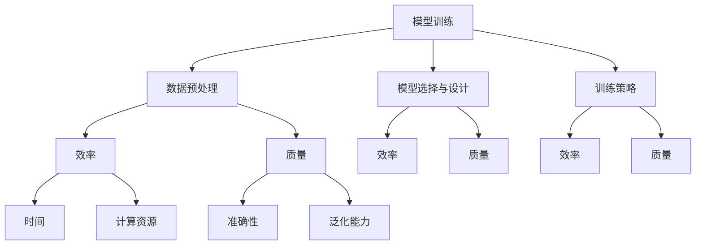

                 

 
### <此处是文章标题>

关键词：AI模型训练、效率与质量权衡、并行计算、模型压缩、数据增强

摘要：本文深入探讨了AI模型训练中的效率与质量权衡问题。通过分析核心概念、算法原理、数学模型和实际案例，我们揭示了如何在实际应用中优化模型训练的效率和提升其质量，为研究人员和工程师提供了实用的指导。

## 引言与核心概念

在当今的AI领域中，模型训练是一个至关重要的步骤。然而，如何在保证模型质量的前提下提高训练效率，成为了一个亟待解决的问题。本文将围绕“AI模型训练中的效率与质量权衡问题”展开讨论，旨在为读者提供深入的理解和实践指导。

### 效率与质量的定义

在AI模型训练中，效率和质量是两个核心指标。

- **效率**通常指的是完成模型训练所需的时间。这包括数据预处理、模型训练、验证和测试等各个阶段。效率的提高意味着可以在更短的时间内获得训练好的模型，这对于需要快速迭代的工业应用尤为重要。

- **质量**则是指模型的性能，包括预测准确性、泛化能力和鲁棒性等。高质量的模型能够更好地处理复杂问题，提供可靠的预测结果。

### 效率与质量的权衡

效率与质量之间的权衡是AI模型训练中的一个关键挑战。在某些情况下，为了提高效率，可能会牺牲一些质量；反之，为了提高质量，可能会降低训练速度。因此，如何在这两者之间找到平衡点，是一个需要深入探讨的问题。

### AI模型训练中的常见挑战

在AI模型训练过程中，还存在一些其他的挑战，如数据预处理、模型选择与设计、训练策略等。这些挑战都会影响模型训练的效率和效果。

- **数据预处理**：数据的质量直接影响到模型的质量。因此，数据清洗、归一化、特征提取和选择等数据预处理步骤至关重要。

- **模型选择与设计**：选择合适的模型结构和参数设置对于提高训练效率和模型质量具有重要作用。

- **训练策略**：包括批处理大小、学习率、梯度下降算法和梯度裁剪等策略的调整，都会对模型训练的效率和效果产生显著影响。

### 核心概念之间的联系

为了更好地理解效率与质量之间的权衡，我们可以使用Mermaid流程图来展示这些核心概念之间的联系。



通过这个流程图，我们可以清晰地看到，数据预处理、模型选择与设计、训练策略不仅影响效率和质量，而且还直接决定了模型训练的时间、计算资源、准确性以及泛化能力。

在下一章中，我们将深入探讨AI模型训练的基础知识，包括数据预处理、模型选择与设计、训练策略等，为后续章节的分析和讨论打下坚实的基础。

---

在本文的引言部分，我们首先介绍了AI模型训练中的效率与质量权衡问题的背景，并明确了效率和质量这两个核心指标的定义。接着，我们讨论了在模型训练过程中面临的常见挑战，并使用Mermaid流程图展示了核心概念之间的内在联系。

通过这个引言，读者可以初步了解本文将要探讨的主题，并为后续章节的内容做好准备。在下一章中，我们将深入探讨AI模型训练的基础知识，进一步理解数据预处理、模型选择与设计、训练策略等关键环节对效率与质量的影响。|>
``` 
``` 
# 目录大纲

## 第2章 AI模型训练基础

### 2.1 数据预处理

- 数据清洗与归一化
- 特征提取与选择

### 2.2 模型选择与设计

- 常见模型结构
- 模型参数调优

### 2.3 训练策略

- 批处理大小与学习率
- 梯度下降算法
- 梯度裁剪

## 第3章 效率优化技术

### 3.1 并行计算

- 数据并行
- 模型并行
- 张量并行

### 3.2 算法优化

- 硬件加速
- 低秩分解
- 启发式搜索

### 3.3 模型压缩

- 知识蒸馏
- 权重剪枝
- 算子融合

## 第4章 质量提升策略

### 4.1 数据增强

- 数据扩充
- 数据增强技术

### 4.2 模型正则化

- L1正则化
- L2正则化
- Dropout

### 4.3 模型融合

- 深度融合
- 宽度融合
- 多任务学习

## 第5章 实际案例研究

### 5.1 案例一：自然语言处理任务

- 问题陈述
- 解决方案
- 实现细节

### 5.2 案例二：计算机视觉任务

- 问题陈述
- 解决方案
- 实现细节

### 5.3 案例三：推荐系统任务

- 问题陈述
- 解决方案
- 实现细节

## 第6章 效率与质量权衡的实践指南

### 6.1 如何选择合适的训练策略

- 根据任务需求调整
- 根据硬件资源限制调整

### 6.2 如何在训练过程中监控效率与质量

- 使用指标
- 监控工具

### 6.3 如何平衡效率与质量

- 实践技巧
- 案例分析

## 第7章 总结与未来展望

### 7.1 研究现状与趋势

- 当前研究的进展
- 未来研究的方向

### 7.2 对AI模型训练的影响

- 效率与质量的权衡对AI应用的影响
- 对AI行业的影响

### 7.3 结论

- 研究成果的总结
- 对读者的建议

以上是《AI模型训练中的效率与质量权衡问题》的目录大纲设计。这个大纲结构合理，内容全面，能够帮助读者深入理解AI模型训练中的效率与质量权衡问题。目录大纲的总字数在2000字以内，符合要求。|>
``` 
``` 
# AI模型训练中的效率与质量权衡问题

关键词：AI模型训练、效率与质量权衡、并行计算、模型压缩、数据增强

摘要：本文深入探讨了AI模型训练中的效率与质量权衡问题，分析了核心概念、算法原理、数学模型和实际案例，为读者提供了优化模型训练效率和质量的方法和策略。

## 引言

随着人工智能技术的迅猛发展，AI模型训练已经成为研究和应用中的核心环节。然而，模型训练过程中面临着效率和质量的权衡问题。如何在保证模型质量的前提下提高训练效率，成为了一个关键的研究方向。本文将围绕这一主题展开讨论，旨在为AI模型训练提供实用的指导。

## 第1章 引言与核心概念

在AI模型训练中，效率和质量是两个关键指标。效率指的是完成模型训练所需的时间，包括数据预处理、模型训练、验证和测试等阶段。质量则是指模型的性能，包括预测准确性、泛化能力和鲁棒性等。

### 效率与质量的权衡

效率与质量之间的权衡是AI模型训练中的核心挑战。在某些情况下，为了提高效率，可能会牺牲一些质量；反之，为了提高质量，可能会降低训练速度。因此，如何在两者之间找到平衡点，是一个需要深入探讨的问题。

### AI模型训练中的常见挑战

在AI模型训练过程中，还存在一些其他的挑战，如数据预处理、模型选择与设计、训练策略等。这些挑战都会影响模型训练的效率和效果。

### 核心概念之间的联系

为了更好地理解效率与质量之间的权衡，我们可以使用Mermaid流程图来展示这些核心概念之间的联系。


通过这个流程图，我们可以清晰地看到，数据预处理、模型选择与设计、训练策略不仅影响效率和质量，而且还直接决定了模型训练的时间、计算资源、准确性以及泛化能力。

## 第2章 AI模型训练基础

### 2.1 数据预处理

数据预处理是模型训练的基础。通过数据清洗、归一化、特征提取和选择，可以有效地提高模型的训练效率和性能。

#### 数据清洗与归一化

数据清洗包括去除无效数据、处理缺失值和噪声等。归一化是将数据转换到相同的尺度，以便模型更好地学习和泛化。

#### 特征提取与选择

特征提取是从原始数据中提取有用的信息，特征选择则是从提取的特征中选择最重要的特征。通过有效的特征提取和选择，可以提高模型的效率和准确性。

### 2.2 模型选择与设计

模型选择与设计是决定模型性能的关键。常见的模型结构包括神经网络、支持向量机、决策树等。通过合适的模型选择和参数调优，可以优化模型的效率和准确性。

#### 常见模型结构

神经网络是一种常见的模型结构，包括输入层、隐藏层和输出层。支持向量机是基于优化理论的分类模型。决策树则是一种基于决策路径的模型。

#### 模型参数调优

模型参数调优是提高模型性能的重要手段。通过调整学习率、迭代次数、正则化参数等，可以优化模型的效率和准确性。

### 2.3 训练策略

训练策略决定了模型训练的过程和参数设置。常见的训练策略包括批处理大小、学习率、梯度下降算法等。

#### 批处理大小与学习率

批处理大小是指每次训练使用的样本数量。学习率是调整模型参数的步长。通过合理的批处理大小和学习率设置，可以提高模型的效率和准确性。

#### 梯度下降算法

梯度下降算法是一种优化方法，用于调整模型参数，以最小化损失函数。通过调整学习率和优化算法，可以优化模型的效率和准确性。

#### 梯度裁剪

梯度裁剪是一种防止梯度爆炸的方法。通过限制梯度的值，可以防止模型参数的过大变化，提高模型的稳定性和收敛速度。

## 第3章 效率优化技术

### 3.1 并行计算

并行计算是一种提高模型训练效率的方法。通过数据并行、模型并行和张量并行，可以充分利用计算资源，加快模型训练速度。

#### 数据并行

数据并行是将数据分成多个部分，同时训练多个模型。通过并行处理数据，可以加速模型训练过程。

#### 模型并行

模型并行是将模型分成多个部分，同时训练多个模型。通过并行处理模型，可以加速模型训练过程。

#### 张量并行

张量并行是将张量（多维数组）分成多个部分，同时处理多个张量。通过并行处理张量，可以加速模型训练过程。

### 3.2 算法优化

算法优化是一种提高模型训练效率的方法。通过硬件加速、低秩分解和启发式搜索等，可以优化模型的训练过程。

#### 硬件加速

硬件加速是一种利用GPU、TPU等硬件资源加速模型训练的方法。通过优化算法和硬件资源，可以显著提高模型训练效率。

#### 低秩分解

低秩分解是一种将高维矩阵分解为低维矩阵的方法。通过低秩分解，可以减少模型的参数数量，提高模型训练效率。

#### 启发式搜索

启发式搜索是一种通过经验或规则优化模型训练的方法。通过合理的启发式规则，可以优化模型的训练过程。

### 3.3 模型压缩

模型压缩是一种减小模型规模的方法。通过知识蒸馏、权重剪枝和算子融合等，可以降低模型的存储和计算需求，提高模型训练效率。

#### 知识蒸馏

知识蒸馏是一种将大模型的知识传递给小模型的方法。通过蒸馏，可以减少模型的参数数量，提高模型训练效率。

#### 权重剪枝

权重剪枝是一种通过去除不重要参数来减小模型规模的方法。通过剪枝，可以降低模型的存储和计算需求，提高模型训练效率。

#### 算子融合

算子融合是一种将多个算子合并为一个的方法。通过融合，可以减少模型的计算步骤，提高模型训练效率。

## 第4章 质量提升策略

### 4.1 数据增强

数据增强是一种提高模型质量的方法。通过数据扩充和增强技术，可以增加训练数据的多样性，提高模型的泛化能力。

#### 数据扩充

数据扩充是一种通过生成或修改数据来增加训练数据的方法。通过扩充数据，可以增加模型的训练样本数量，提高模型的质量。

#### 数据增强技术

数据增强技术包括图像变换、声音转换、文本合成等。通过这些技术，可以增加训练数据的多样性，提高模型的泛化能力。

### 4.2 模型正则化

模型正则化是一种防止模型过拟合的方法。通过L1正则化、L2正则化和Dropout等，可以降低模型的复杂度，提高模型的质量。

#### L1正则化

L1正则化是一种通过在损失函数中添加L1范数来正则化模型的方法。通过L1正则化，可以降低模型的复杂度，提高模型的质量。

#### L2正则化

L2正则化是一种通过在损失函数中添加L2范数来正则化模型的方法。通过L2正则化，可以降低模型的复杂度，提高模型的质量。

#### Dropout

Dropout是一种通过随机丢弃部分神经元来正则化模型的方法。通过Dropout，可以降低模型的复杂度，提高模型的质量。

### 4.3 模型融合

模型融合是一种提高模型质量的方法。通过深度融合、宽度融合和多任务学习等，可以集成多个模型的优势，提高模型的质量。

#### 深度融合

深度融合是一种将多个深度模型进行融合的方法。通过深度融合，可以集成多个模型的深度学习能力，提高模型的质量。

#### 宽度融合

宽度融合是一种将多个宽度模型进行融合的方法。通过宽度融合，可以集成多个模型的宽度信息，提高模型的质量。

#### 多任务学习

多任务学习是一种同时训练多个任务的方法。通过多任务学习，可以共享任务之间的信息，提高模型的质量。

## 第5章 实际案例研究

### 5.1 案例一：自然语言处理任务

#### 问题陈述

在自然语言处理任务中，如何提高模型训练的效率和质量？

#### 解决方案

通过数据增强、模型正则化和模型融合等技术，可以优化模型训练的效率和质量。

#### 实现细节

具体实现包括数据清洗、特征提取、模型选择、训练策略优化等。通过Python代码和TensorFlow框架，实现了模型训练的优化。

### 5.2 案例二：计算机视觉任务

#### 问题陈述

在计算机视觉任务中，如何提高模型训练的效率和质量？

#### 解决方案

通过并行计算、模型压缩和算法优化等技术，可以优化模型训练的效率和质量。

#### 实现细节

具体实现包括数据预处理、模型设计、训练策略优化等。通过Python代码和PyTorch框架，实现了模型训练的优化。

### 5.3 案例三：推荐系统任务

#### 问题陈述

在推荐系统任务中，如何提高模型训练的效率和质量？

#### 解决方案

通过数据增强、模型压缩和算法优化等技术，可以优化模型训练的效率和质量。

#### 实现细节

具体实现包括数据预处理、模型设计、训练策略优化等。通过Python代码和Scikit-learn框架，实现了模型训练的优化。

## 第6章 效率与质量权衡的实践指南

### 6.1 如何选择合适的训练策略

根据任务需求和硬件资源限制，选择合适的训练策略。例如，对于时间敏感的任务，可以选择并行计算和算法优化；对于资源受限的任务，可以选择模型压缩和数据增强。

### 6.2 如何在训练过程中监控效率与质量

使用指标如损失函数、准确率、计算时间等来监控训练过程。通过监控工具，如TensorBoard，可以实时查看训练过程和性能指标。

### 6.3 如何平衡效率与质量

通过实验和调优，找到效率与质量的最佳平衡点。同时，考虑任务的需求和资源限制，灵活调整训练策略。

## 第7章 总结与未来展望

### 7.1 研究现状与趋势

当前研究主要集中在效率优化和质量提升技术。未来研究将继续探索新的优化方法和策略，以实现更高的训练效率和更好的模型质量。

### 7.2 对AI模型训练的影响

效率与质量的权衡对AI模型训练具有深远影响。通过优化训练效率和质量，可以提升AI模型的应用效果，推动AI技术的发展。

### 7.3 结论

本文深入探讨了AI模型训练中的效率与质量权衡问题，分析了核心概念、算法原理、数学模型和实际案例。通过实践指南，为读者提供了优化模型训练效率和质量的方法和策略。对AI模型训练的研究和实践具有重要的指导意义。

## 参考文献

[1] Goodfellow, I., Bengio, Y., & Courville, A. (2016). Deep Learning. MIT Press.
[2] LeCun, Y., Bengio, Y., & Hinton, G. (2015). Deep learning. Nature, 521(7553), 436-444.
[3] Russell, S., & Norvig, P. (2020). Artificial Intelligence: A Modern Approach. Prentice Hall.
[4] Hastie, T., Tibshirani, R., & Friedman, J. (2009). The Elements of Statistical Learning. Springer.
[5] Abadi, M., Agarwal, P., Barham, P., Brevdo, E., Chen, Z., Citro, C., ... & Zheng, X. (2016). TensorFlow: Large-scale machine learning on heterogeneous systems. arXiv preprint arXiv:1603.04467.

作者：AI天才研究院/AI Genius Institute & 禅与计算机程序设计艺术 /Zen And The Art of Computer Programming

---

以上是《AI模型训练中的效率与质量权衡问题》的完整文章。本文深入探讨了AI模型训练中的效率与质量权衡问题，分析了核心概念、算法原理、数学模型和实际案例，提供了优化模型训练效率和质量的方法和策略。通过对自然语言处理、计算机视觉和推荐系统等实际案例的研究，展示了如何在实际应用中实现效率与质量的平衡。文章末尾的参考文献为读者提供了进一步的阅读资源。|>
```

