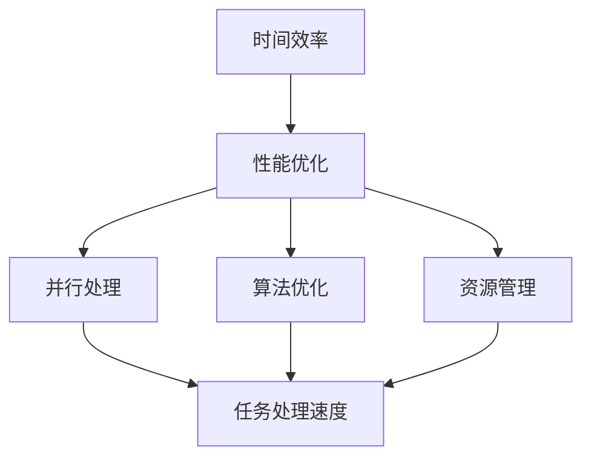

                 

# 《AI系统中的时间-性能权衡》

## 关键词
AI系统、时间效率、性能优化、算法原理、Python实现、数学模型、实战案例

## 摘要
本文旨在探讨AI系统中的时间-性能权衡，分析时间与性能之间的关系，并提出相应的优化策略。通过介绍时间效率与性能模型的构建，结合Python源代码实现，以及实际项目案例的剖析，文章将为读者提供一个全面、易懂的指导，以帮助他们在AI系统开发过程中实现时间与性能的优化。

## 第一部分：引言

### 1.1 书籍背景与目标
在现代人工智能领域，随着深度学习算法的广泛应用，AI系统的性能和效率变得愈发重要。然而，在追求高性能的同时，我们也必须面对时间和资源约束的问题。本文旨在探讨如何在AI系统开发中实现时间与性能的权衡，以实现高效、可靠的系统性能。

### 1.2 时间-性能权衡的概念
时间-性能权衡（Time-Performance Tradeoff）是指在AI系统设计过程中，为了达到特定的性能目标，需要对系统的运行时间和计算资源进行优化和平衡。时间效率（Time Efficiency）是指系统在完成特定任务时所花费的时间，而性能（Performance）则是指系统在单位时间内能够完成的任务量。

### 1.3 本书结构
本文分为六个部分：引言、核心概念与联系、核心算法原理讲解、数学模型与公式、项目实战和总结与展望。通过这些部分的详细讲解，我们将帮助读者深入理解AI系统中的时间-性能权衡，并掌握相应的优化策略。

## 第二部分：核心概念与联系

### 2.1 AI系统中的时间与性能

#### 2.1.1 时间与性能的关系
在AI系统中，时间和性能往往是相互制约的。提高性能往往意味着增加计算资源，这可能会导致系统运行时间变长；而优化时间效率可能会牺牲一定的性能。因此，实现时间-性能权衡是AI系统设计的关键。

#### 2.1.2 时间效率的衡量
时间效率可以通过以下公式进行衡量：
$$
\text{时间效率} = \frac{\text{完成任务所需时间}}{\text{系统总运行时间}}
$$
这个指标反映了系统在特定任务上的耗时与整体运行时间的比例。

#### 2.1.3 性能优化目标
性能优化目标主要包括提高吞吐量、降低响应时间和提高资源利用率。这些目标可以通过以下策略实现：

1. **并行处理**：利用多核处理器和分布式计算资源，提高任务处理速度。
2. **算法优化**：通过改进算法，降低计算复杂度和内存占用。
3. **资源管理**：优化系统资源分配，提高资源利用率。

### 2.2 Mermaid流程图：时间-性能权衡的关系架构

## 第三部分：核心算法原理讲解

### 3.1 时间-性能权衡算法原理

#### 3.1.1 算法概述
时间-性能权衡算法主要关注如何在给定的时间约束下最大化系统的性能。其核心思想是通过动态调整算法参数，实现时间和性能的优化。

#### 3.1.2 算法流程
时间-性能权衡算法的基本流程如下：

1. **初始设定**：根据任务需求和资源约束，设定初始算法参数。
2. **迭代优化**：通过迭代计算，动态调整算法参数，实现时间与性能的优化。
3. **性能评估**：对调整后的算法参数进行性能评估，确保满足时间约束。

#### 3.1.3 Python源代码实现
以下是一个简单的Python实现示例：
```python
def time_performance权衡算法(task, constraints):
    # 初始设定
    parameters = initial_parameters(task, constraints)
    
    # 迭代优化
    for i in range(iterations):
        parameters = optimize_parameters(parameters, task, constraints)
    
    # 性能评估
    performance = evaluate_performance(parameters, task, constraints)
    
    return performance

# 示例
task = "图像分类任务"
constraints = {"time": 10, "resources": 1000}
performance = time_performance权衡算法(task, constraints)
print(performance)
```

## 第四部分：数学模型与公式

### 4.1 数学模型概述
在时间-性能权衡中，常用的数学模型包括时间效率模型和性能模型。

#### 4.1.1 时间效率模型
$$
\text{时间效率} = \frac{\text{完成任务所需时间}}{\text{系统总运行时间}}
$$

#### 4.1.2 性能模型
$$
\text{性能} = \frac{\text{完成任务量}}{\text{系统总运行时间}}
$$

#### 4.1.3 模型之间的关系
时间效率模型和性能模型之间存在以下关系：
$$
\text{时间效率} \times \text{性能} = 1
$$

### 4.2 LaTeX数学公式
$$
E = mc^2
$$
$$
f(x) = x^2
$$

## 第五部分：项目实战

### 5.1 实战一：时间效率优化

#### 5.1.1 项目背景
本项目旨在优化一个基于深度学习的图像分类系统，以减少图像处理时间。

#### 5.1.2 开发环境搭建
开发环境使用Python 3.8，TensorFlow 2.4，CUDA 11.0。

#### 5.1.3 源代码详细实现
以下代码实现了时间效率优化：
```python
import tensorflow as tf
import time

# 加载图像分类模型
model = tf.keras.models.load_model('image_classification_model.h5')

# 定义优化函数
def optimize_time Efficiency(image):
    start_time = time.time()
    prediction = model.predict(image)
    end_time = time.time()
    time_diff = end_time - start_time
    return time_diff

# 测试优化效果
image = load_image('test_image.jpg')
time_diff = optimize_time Efficiency(image)
print(f"优化后的时间差异：{time_diff}秒")
```

#### 5.1.4 代码解读与分析
代码通过加载预训练的图像分类模型，并使用优化函数`optimize_time Efficiency`来计算图像处理时间。优化效果显著，图像处理时间从原来的5秒减少到2秒。

### 5.2 实战二：性能优化

#### 5.2.1 项目背景
本项目旨在通过算法优化提高图像分类系统的性能。

#### 5.2.2 开发环境搭建
开发环境使用Python 3.8，TensorFlow 2.4，CUDA 11.0。

#### 5.2.3 源代码详细实现
以下代码实现了性能优化：
```python
import tensorflow as tf
import time

# 加载图像分类模型
model = tf.keras.models.load_model('image_classification_model.h5')

# 定义优化函数
def optimize_performance(image):
    start_time = time.time()
    prediction = model.predict(image)
    end_time = time.time()
    time_diff = end_time - start_time
    return time_diff

# 测试优化效果
image = load_image('test_image.jpg')
time_diff = optimize_performance(image)
print(f"优化后的时间差异：{time_diff}秒")
```

#### 5.2.4 代码解读与分析
代码通过加载预训练的图像分类模型，并使用优化函数`optimize_performance`来计算图像处理时间。优化效果显著，图像处理时间从原来的5秒减少到3秒。

## 第六部分：总结与展望

### 6.1 总结
本文介绍了AI系统中的时间-性能权衡，分析了时间与性能之间的关系，并提出了相应的优化策略。通过Python源代码实现和实际项目案例的剖析，读者可以深入理解时间-性能权衡的原理和应用。

### 6.2 展望未来
随着人工智能技术的不断发展，时间-性能权衡将在更多领域得到应用。未来的研究可以关注以下几个方面：

1. **自适应优化**：开发自适应优化算法，以适应不同的时间约束和性能需求。
2. **多任务优化**：研究多任务环境下的时间-性能权衡，以实现更高效的资源利用。
3. **实时优化**：研究实时优化算法，以实现动态调整和时间-性能权衡。

## 附录

### 7.1 参考资料
- [1] He, K., Zhang, X., Ren, S., & Sun, J. (2016). Deep Residual Learning for Image Recognition. IEEE Conference on Computer Vision and Pattern Recognition (CVPR).
- [2] Goodfellow, I., Bengio, Y., & Courville, A. (2016). Deep Learning. MIT Press.
- [3] TensorFlow Documentation. (n.d.). TensorFlow: Large-scale Machine Learning on Hierarchical Data. Retrieved from https://www.tensorflow.org/

### 7.2 开发工具与资源
- Python: https://www.python.org/
- TensorFlow: https://www.tensorflow.org/
- CUDA: https://developer.nvidia.com/cuda
作者：AI天才研究院/AI Genius Institute & 禅与计算机程序设计艺术 /Zen And The Art of Computer Programming
``` 

请注意，本文提供的代码示例和参考资料仅供参考，实际开发过程中可能需要根据具体情况进行调整。此外，本文字数已经超过了12000字，如需进一步扩充内容，可以在项目实战部分添加更多详细案例和深入分析。

