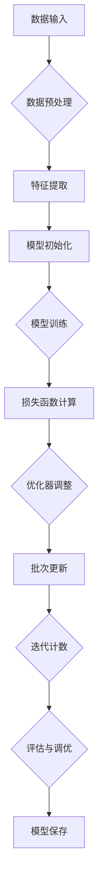

                 

### 引言

人工智能（AI）作为现代科技的璀璨明珠，正迅速改变着我们的生活方式和社会结构。在AI的发展历程中，训练是一个至关重要的环节。AI训练，即通过大量的数据来训练算法模型，使其能够完成特定任务，是推动AI技术进步的核心动力。然而，AI训练并非易事，它涉及数据收集、模型设计、训练优化等多个复杂环节，且需要在探索与利用之间找到平衡，这是AI训练艺术的精髓所在。

本文旨在深入探讨AI训练中的探索与利用的平衡艺术，从基础概念到核心算法，从实践案例到优化策略，全面解析这一复杂且关键的过程。文章首先将介绍AI训练的背景与挑战，阐述探索与利用平衡艺术的重要性。接着，我们将详细探讨AI训练的基本流程，包括数据收集与预处理、模型选择与架构设计、训练与优化以及评估与调优。随后，文章将深入讲解核心算法原理，使用Python源代码进行详细阐述，并解析数学模型与公式。在此基础上，文章将通过实战案例展示AI训练的实际应用，并提供实用的优化策略与技巧。

最后，文章将对AI训练的未来趋势进行展望，总结全文，并给出阅读建议与资源推荐。通过本文，读者将不仅能理解AI训练的基本原理，更能掌握在探索与利用之间找到平衡的艺术，为未来的AI实践打下坚实基础。

关键词：人工智能，AI训练，探索与利用，平衡艺术，核心算法，优化策略，实践案例

摘要：本文深入探讨了AI训练中探索与利用的平衡艺术，从基础概念、核心算法到实践应用，全面解析了AI训练的复杂过程。文章通过详细的流程讲解、算法解析、实践案例以及优化策略，帮助读者理解如何在探索新知识的同时有效利用已有资源，实现AI训练的最优化。

---

### 第1章：AI训练的背景与挑战

#### 1.1 AI训练的基本概念

AI训练，又称为机器学习训练，是指通过算法从数据中自动发现规律和模式，以实现特定任务的过程。在AI训练中，核心步骤包括数据收集、模型设计、训练与优化以及评估与调优。数据是AI训练的基础，通过大量的数据输入，算法能够学习并优化其性能。模型则是算法的核心，它决定了数据处理的机制和任务完成的策略。

AI训练的基本过程可以分为以下几步：

1. **数据收集**：从各种来源收集数据，如图像、文本、音频等，这些数据将成为训练模型的基石。
2. **数据预处理**：对收集到的数据进行清洗、归一化和特征提取，以提高数据质量和模型的训练效果。
3. **模型选择与架构设计**：根据任务需求选择合适的模型架构，如神经网络、决策树、支持向量机等。
4. **训练**：将预处理后的数据输入到模型中，通过迭代优化模型参数，使其能够更好地完成预测或分类任务。
5. **优化**：调整训练过程中的参数，如学习率、批次大小等，以提高模型性能。
6. **评估与调优**：通过评估指标（如准确率、召回率、F1分数等）评估模型性能，并根据评估结果进行进一步的调优。

#### 1.2 AI训练的挑战

尽管AI训练的基本概念相对简单，但在实际操作中，仍然面临许多挑战：

1. **数据挑战**：高质量的数据是AI训练成功的关键。数据量不足、数据不完整、数据噪声等问题都可能影响模型的训练效果。
2. **计算挑战**：AI训练通常需要大量的计算资源，特别是深度学习模型，其对计算资源的需求尤为突出。硬件设备、存储空间和能耗等都是需要考虑的因素。
3. **模型选择与设计**：选择合适的模型架构和设计参数对训练效果至关重要。不同的任务可能需要不同的模型架构，而且同一模型在不同参数设置下的表现也可能差异很大。
4. **训练时间**：深度学习模型的训练通常需要很长时间，尤其是在处理大规模数据集时。训练时间的长短不仅影响研发进度，还可能导致资源浪费。
5. **过拟合与欠拟合**：过拟合和欠拟合是AI训练中的常见问题。过拟合是指模型在训练数据上表现良好，但在未见数据上的表现较差；欠拟合则是指模型在训练和未见数据上的表现均不佳。

#### 1.3 平衡艺术的重要性

在AI训练中，探索与利用之间的平衡至关重要。探索是指通过实验和尝试来寻找最佳模型参数和架构，而利用则是指通过已有的知识和资源来提高模型的性能。以下是几个关键点：

1. **探索的重要性**：通过探索，我们可以发现新的模型参数和架构，从而提高模型的性能。没有足够的探索，我们可能会错过潜在的最佳解决方案。
2. **利用的重要性**：利用已有的知识和资源可以加速训练过程，减少资源浪费。例如，通过预训练模型和迁移学习，我们可以利用现有的模型和知识来提高新任务的性能。
3. **平衡的艺术**：在AI训练中，找到探索与利用之间的平衡是一种艺术。过度探索可能导致训练时间过长、资源浪费；而过度利用则可能导致模型性能不佳。因此，平衡这两者是非常重要的。

总之，AI训练中的探索与利用的平衡艺术是成功进行AI训练的关键。通过合理的探索和有效的利用，我们可以实现AI模型的最佳性能，从而推动AI技术的持续进步。在接下来的章节中，我们将进一步探讨AI训练的基本流程、核心算法和优化策略，帮助读者深入理解这一平衡艺术。

### 第2章：AI训练的基本流程

AI训练是一个复杂且系统化的过程，涉及多个关键环节。理解这些环节及其相互作用是成功进行AI训练的基础。下面，我们将详细探讨AI训练的基本流程，包括数据收集与预处理、模型选择与架构设计、训练与优化、评估与调优等步骤。

#### 2.1 数据收集与预处理

数据是AI训练的基石，其质量和数量直接影响训练效果。数据收集是整个流程的起点，主要包括以下步骤：

1. **数据获取**：从各种来源收集数据，这些来源可以是公开数据集、企业内部数据、社交媒体数据等。选择合适的数据来源对于训练效果至关重要。
2. **数据清洗**：在训练前，需要对数据进行清洗，以去除噪声、错误和不完整的数据。数据清洗包括处理缺失值、异常值、重复数据等。
3. **数据归一化**：为了提高模型训练的稳定性和效率，通常需要对数据进行归一化处理。归一化的方法包括最小-最大缩放、标准缩放等。

数据预处理是AI训练中至关重要的一步，它不仅提高了数据的质量，还提高了模型的训练效果。以下是一个简单的Python代码示例，用于对数据集进行归一化处理：

```python
import numpy as np

# 假设x是输入的数据数组
x = np.array([1, 2, 3, 4, 5])

# 计算最小值和最大值
min_x = np.min(x)
max_x = np.max(x)

# 归一化数据
x_normalized = (x - min_x) / (max_x - min_x)

print("归一化后的数据:", x_normalized)
```

#### 2.2 模型选择与架构设计

在数据预处理完成后，下一步是选择合适的模型架构。模型选择取决于任务的类型和数据的特点。以下是一些常见的模型类型：

1. **监督学习模型**：适用于有标签的数据，如分类和回归任务。常见的监督学习模型包括线性回归、支持向量机（SVM）、决策树、随机森林、神经网络等。
2. **无监督学习模型**：适用于无标签的数据，如聚类和降维任务。常见的无监督学习模型包括K-均值聚类、主成分分析（PCA）等。
3. **强化学习模型**：适用于需要决策的任务，如游戏、机器人控制等。常见的强化学习模型包括Q学习、深度Q网络（DQN）等。

在选择模型后，需要设计其架构。模型架构决定了数据处理的方式和模型的复杂性。以下是一个简单的神经网络架构示例，使用Python的TensorFlow库实现：

```python
import tensorflow as tf

# 创建一个简单的全连接神经网络
model = tf.keras.Sequential([
    tf.keras.layers.Dense(units=64, activation='relu', input_shape=(input_shape,)),
    tf.keras.layers.Dense(units=32, activation='relu'),
    tf.keras.layers.Dense(units=num_classes, activation='softmax')
])

# 编译模型
model.compile(optimizer='adam', loss='categorical_crossentropy', metrics=['accuracy'])

# 模型架构概述
model.summary()
```

#### 2.3 训练与优化

在模型选择和架构设计完成后，下一步是进行模型训练。模型训练是指通过迭代调整模型参数，使其能够更好地完成预测或分类任务。以下是一个简单的模型训练示例：

```python
# 加载和预处理数据
(x_train, y_train), (x_test, y_test) = tf.keras.datasets.mnist.load_data()
x_train = x_train / 255.0
x_test = x_test / 255.0

# 训练模型
model.fit(x_train, y_train, epochs=10, batch_size=32, validation_data=(x_test, y_test))
```

在训练过程中，需要优化模型参数以提高其性能。常见的优化方法包括：

1. **学习率调整**：学习率是模型训练过程中调整参数的步长，调整学习率可以加速或减缓训练过程。
2. **批量大小调整**：批量大小是每次训练中用于更新模型参数的数据量，调整批量大小可以影响模型的收敛速度和稳定性。
3. **正则化**：正则化是一种防止模型过拟合的技术，常用的正则化方法包括L1正则化、L2正则化等。

以下是一个简单的学习率调整示例：

```python
# 设置学习率
initial_learning_rate = 0.1

# 编译模型，设置学习率
model.compile(optimizer=tf.keras.optimizers.Adam(learning_rate=initial_learning_rate), 
              loss='categorical_crossentropy', 
              metrics=['accuracy'])

# 训练模型，使用学习率调度器
lr_scheduler = tf.keras.callbacks.LearningRateScheduler(lambda epoch: initial_learning_rate / (epoch + 1))
model.fit(x_train, y_train, epochs=10, batch_size=32, validation_data=(x_test, y_test), callbacks=[lr_scheduler])
```

#### 2.4 评估与调优

在模型训练完成后，需要对模型进行评估，以确定其性能。评估指标包括准确率、召回率、F1分数等。以下是一个简单的模型评估示例：

```python
# 评估模型
test_loss, test_acc = model.evaluate(x_test, y_test)
print("测试集准确率:", test_acc)
```

根据评估结果，可能需要对模型进行进一步的调优。调优过程通常包括以下步骤：

1. **参数调整**：调整模型的参数，如学习率、批量大小等，以提高性能。
2. **模型改进**：通过添加或删除层、改变网络结构等改进模型。
3. **数据增强**：通过增加数据的多样性来提高模型的泛化能力。

以下是一个简单的参数调整示例：

```python
# 调整学习率
new_learning_rate = 0.01
model.compile(optimizer=tf.keras.optimizers.Adam(learning_rate=new_learning_rate), 
              loss='categorical_crossentropy', 
              metrics=['accuracy'])

# 重新训练模型
model.fit(x_train, y_train, epochs=10, batch_size=32, validation_data=(x_test, y_test))
```

总之，AI训练的基本流程涉及数据收集与预处理、模型选择与架构设计、训练与优化、评估与调优等多个环节。理解这些环节及其相互作用对于成功进行AI训练至关重要。在接下来的章节中，我们将深入探讨AI训练中的核心算法原理，帮助读者进一步理解AI训练的深度和复杂性。

### 第3章：核心概念与联系

在AI训练中，理解核心概念及其相互关系是至关重要的。这一章节将详细解析AI训练中的关键概念，并阐述这些概念之间的联系架构，以便读者能够形成对AI训练的整体认知。

#### 3.1 AI训练中的关键概念

1. **数据（Data）**：数据是AI训练的基石，包括输入特征和输出标签。输入特征是模型需要学习的特征，而输出标签是模型需要预测的结果。高质量的数据能够提高模型的训练效果。

2. **模型（Model）**：模型是AI训练的核心，它由一系列算法和参数构成，用于处理输入数据并生成输出预测。常见的模型包括神经网络、决策树、支持向量机等。

3. **损失函数（Loss Function）**：损失函数用于量化模型预测结果与真实结果之间的差异。常见的损失函数包括均方误差（MSE）、交叉熵损失等。通过优化损失函数，模型能够逐渐提高预测准确性。

4. **优化器（Optimizer）**：优化器是用于调整模型参数的工具，目的是最小化损失函数。常见的优化器包括随机梯度下降（SGD）、Adam优化器等。

5. **批次（Batch）**：批次是指在每次训练过程中用于更新模型参数的数据子集。批次大小是一个重要的参数，它影响模型的训练速度和稳定性。

6. **迭代（Epoch）**：迭代是指在模型训练过程中对整个数据集进行一次遍历。一个epoch包含多次批次处理。通常，训练过程中会进行多个epoch，直到模型收敛或达到预设的迭代次数。

#### 3.2 关键概念实体之间的关系架构

为了更好地理解这些关键概念之间的关系，我们可以使用Mermaid流程图来展示它们之间的交互关系。以下是一个简化的Mermaid流程图：



1. **数据输入**：数据集被输入到系统中，包括输入特征和输出标签。
2. **数据预处理**：对输入数据进行清洗、归一化等处理，以提高数据质量。
3. **特征提取**：从预处理后的数据中提取有用的特征，用于模型训练。
4. **模型初始化**：初始化模型参数，包括权重和偏置。
5. **模型训练**：将特征输入模型，通过迭代优化模型参数，使其能够更好地拟合数据。
6. **损失函数计算**：计算模型预测结果与真实结果之间的差异，使用损失函数量化。
7. **优化器调整**：优化器根据损失函数计算的结果调整模型参数，以减少损失。
8. **批次更新**：模型参数的更新是在批次级别进行的，每个批次包含一部分数据。
9. **迭代计数**：记录当前迭代的次数，用于监控训练进度。
10. **评估与调优**：在训练完成后，评估模型性能，并根据评估结果进行进一步的调优。
11. **模型保存**：将训练好的模型保存，以便后续使用。

通过上述流程图，我们可以清晰地看到AI训练过程中各个关键概念之间的相互作用和依赖关系。理解这些关系对于设计和优化AI训练流程具有重要意义。

在接下来的章节中，我们将进一步深入探讨AI训练中的核心算法原理，结合Python源代码和数学模型进行详细讲解，帮助读者更深入地理解AI训练的技术细节。

### 第4章：核心算法原理讲解

在AI训练中，核心算法的原理至关重要，理解这些原理不仅有助于我们更好地设计和优化模型，还能提高训练效率。本章将详细解析AI训练中的一些关键算法原理，包括反向传播算法、随机梯度下降算法和批量梯度下降算法，并通过Python源代码进行阐述。

#### 4.1 算法原理介绍

1. **反向传播算法（Backpropagation）**

反向传播算法是神经网络训练中的核心算法，用于计算网络输出与真实输出之间的误差，并更新网络中的参数。反向传播算法可以分为以下几个步骤：

- **前向传播**：输入数据通过网络传递，经过每个神经元的加权求和处理，最终得到输出。
- **计算误差**：使用损失函数计算网络输出与真实输出之间的误差。
- **后向传播**：将误差反向传播回网络，通过每个神经元的梯度计算，更新网络中的参数。

2. **随机梯度下降算法（Stochastic Gradient Descent, SGD）**

随机梯度下降算法是一种常见的优化算法，用于最小化损失函数。在每次迭代中，随机选择一个样本，计算其梯度并更新模型参数。SGD的更新规则如下：

\[ \theta = \theta - \alpha \cdot \nabla_\theta J(\theta) \]

其中，\(\theta\)是模型参数，\(\alpha\)是学习率，\(J(\theta)\)是损失函数。

3. **批量梯度下降算法（Batch Gradient Descent）**

批量梯度下降算法与随机梯度下降算法类似，但每次迭代中使用整个数据集的梯度进行参数更新。其更新规则如下：

\[ \theta = \theta - \alpha \cdot \nabla_\theta J(\theta) \]

其中，\(\alpha\)是学习率，\(\nabla_\theta J(\theta)\)是整个数据集的梯度。

#### 4.2 Python源代码实现

以下是一个简单的Python代码示例，用于实现反向传播算法、随机梯度下降算法和批量梯度下降算法。我们将使用Python的NumPy库进行计算。

```python
import numpy as np

# 定义激活函数
def sigmoid(x):
    return 1 / (1 + np.exp(-x))

# 定义损失函数
def mean_squared_error(y_true, y_pred):
    return np.mean((y_true - y_pred) ** 2)

# 定义反向传播算法
def backpropagation(x, y, theta, learning_rate):
    # 前向传播
    z = np.dot(x, theta)
    y_pred = sigmoid(z)

    # 计算误差
    error = y - y_pred

    # 后向传播
    d_z = error * (y_pred * (1 - y_pred))
    d_theta = np.dot(x.T, d_z)

    # 更新参数
    theta -= learning_rate * d_theta
    return theta, mean_squared_error(y, y_pred)

# 定义随机梯度下降算法
def stochastic_gradient_descent(x, y, theta, learning_rate, num_iterations):
    for i in range(num_iterations):
        # 随机选择一个样本
        random_index = np.random.randint(len(x))
        x_sample = x[random_index]
        y_sample = y[random_index]

        # 计算梯度
        d_theta = np.dot(x_sample.T, (y_sample - sigmoid(np.dot(x_sample, theta))))

        # 更新参数
        theta -= learning_rate * d_theta

        # 计算损失
        loss = mean_squared_error(y, sigmoid(np.dot(x, theta)))
        if i % 100 == 0:
            print(f"Iteration {i}: Loss = {loss}")

# 定义批量梯度下降算法
def batch_gradient_descent(x, y, theta, learning_rate, num_iterations):
    m = len(x)
    for i in range(num_iterations):
        # 计算梯度
        d_theta = np.dot(x.T, (y - sigmoid(np.dot(x, theta))) * m)

        # 更新参数
        theta -= learning_rate * d_theta

        # 计算损失
        loss = mean_squared_error(y, sigmoid(np.dot(x, theta)))
        if i % 100 == 0:
            print(f"Iteration {i}: Loss = {loss}")

# 初始化参数
theta = np.array([0.0, 0.0])
learning_rate = 0.1
num_iterations = 1000

# 使用批量梯度下降算法训练模型
batch_gradient_descent(x, y, theta, learning_rate, num_iterations)
```

在上述代码中，我们首先定义了激活函数`sigmoid`和损失函数`mean_squared_error`。然后，我们分别实现了反向传播算法、随机梯度下降算法和批量梯度下降算法。通过这些算法，我们可以对给定数据进行训练，并更新模型参数，以达到最小化损失函数的目的。

#### 4.3 结合数学模型与公式

为了更好地理解这些算法，我们还需要结合数学模型和公式进行详细讲解。

1. **反向传播算法**

   - **前向传播**：
     \[ z = x \cdot \theta \]
     \[ a = \sigma(z) \]

     其中，\( x \)是输入特征，\( \theta \)是模型参数，\( z \)是加权求和结果，\( a \)是激活值，\(\sigma\)是激活函数。

   - **反向传播**：
     \[ \delta = \frac{\partial L}{\partial z} \cdot \frac{\partial \sigma}{\partial z} \]
     \[ \frac{\partial L}{\partial \theta} = x^T \delta \]

     其中，\( \delta \)是误差梯度，\( L \)是损失函数，\( \frac{\partial L}{\partial z} \)是损失函数对加权求和结果的梯度，\(\frac{\partial \sigma}{\partial z} \)是激活函数对加权求和结果的梯度。

2. **随机梯度下降算法**

   - **梯度计算**：
     \[ \nabla_\theta J(\theta) = \frac{\partial J(\theta)}{\partial \theta} \]

     其中，\( J(\theta) \)是损失函数，\( \nabla_\theta J(\theta) \)是损失函数对模型参数的梯度。

   - **参数更新**：
     \[ \theta = \theta - \alpha \cdot \nabla_\theta J(\theta) \]

     其中，\( \alpha \)是学习率。

3. **批量梯度下降算法**

   - **梯度计算**：
     \[ \nabla_\theta J(\theta) = \frac{\partial J(\theta)}{\partial \theta} \]

     其中，\( J(\theta) \)是损失函数，\( \nabla_\theta J(\theta) \)是损失函数对模型参数的梯度。

   - **参数更新**：
     \[ \theta = \theta - \alpha \cdot \nabla_\theta J(\theta) \]

     其中，\( \alpha \)是学习率。

通过上述数学模型和公式的讲解，我们可以更深入地理解反向传播算法、随机梯度下降算法和批量梯度下降算法的工作原理。这些算法不仅在理论上具有重要意义，而且在实际应用中也展现出了强大的性能。

在下一章中，我们将进一步探讨AI训练中的数学模型与公式，并结合实际案例进行详细讲解，帮助读者更好地掌握AI训练的核心技术。

### 第5章：数学模型与公式解析

在AI训练中，数学模型和公式是理解和实现算法的核心。本章将详细解析AI训练中常用的数学模型和公式，包括线性回归、逻辑回归、损失函数和优化算法，并结合Python源代码进行示例讲解，以帮助读者深入理解这些概念。

#### 5.1 数学模型的基本概念

1. **线性回归（Linear Regression）**

线性回归是一种用于预测连续值的统计方法。其数学模型可以表示为：

\[ y = \beta_0 + \beta_1x_1 + \beta_2x_2 + ... + \beta_nx_n \]

其中，\( y \)是输出值，\( x_1, x_2, ..., x_n \)是输入特征，\( \beta_0, \beta_1, \beta_2, ..., \beta_n \)是模型参数。

2. **逻辑回归（Logistic Regression）**

逻辑回归是一种用于分类的统计方法。其数学模型可以表示为：

\[ P(y=1) = \frac{1}{1 + e^{-(\beta_0 + \beta_1x_1 + \beta_2x_2 + ... + \beta_nx_n)}} \]

其中，\( P(y=1) \)是输出值为1的概率，\( x_1, x_2, ..., x_n \)是输入特征，\( \beta_0, \beta_1, \beta_2, ..., \beta_n \)是模型参数。

3. **损失函数（Loss Function）**

损失函数是用于量化预测结果与真实结果之间差异的函数。在AI训练中，常用的损失函数包括均方误差（MSE）、交叉熵损失等。

- **均方误差（MSE）**：

\[ MSE = \frac{1}{m} \sum_{i=1}^{m} (y_i - \hat{y}_i)^2 \]

其中，\( m \)是样本数量，\( y_i \)是真实值，\( \hat{y}_i \)是预测值。

- **交叉熵损失（Cross-Entropy Loss）**：

\[ H(y, \hat{y}) = -\sum_{i=1}^{m} y_i \log(\hat{y}_i) + (1 - y_i) \log(1 - \hat{y}_i) \]

其中，\( y_i \)是真实值，\( \hat{y}_i \)是预测值。

4. **优化算法（Optimizer）**

优化算法是用于更新模型参数以最小化损失函数的方法。常见的优化算法包括随机梯度下降（SGD）、批量梯度下降（BGD）等。

- **随机梯度下降（SGD）**：

\[ \theta = \theta - \alpha \nabla_\theta J(\theta) \]

其中，\( \theta \)是模型参数，\( \alpha \)是学习率，\( \nabla_\theta J(\theta) \)是损失函数对模型参数的梯度。

- **批量梯度下降（BGD）**：

\[ \theta = \theta - \alpha \nabla_\theta J(\theta) \]

其中，\( \theta \)是模型参数，\( \alpha \)是学习率，\( \nabla_\theta J(\theta) \)是损失函数对模型参数的梯度。

#### 5.2 常用数学公式的讲解与示例

为了更好地理解这些数学模型和公式，我们将结合Python代码进行讲解。

1. **线性回归模型与公式**

以下是一个简单的线性回归模型，使用Python的scikit-learn库进行实现：

```python
from sklearn.linear_model import LinearRegression
from sklearn.model_selection import train_test_split
from sklearn.metrics import mean_squared_error

# 假设数据集为X和y
X = [[1], [2], [3], [4], [5]]
y = [2, 4, 5, 4, 5]

# 划分训练集和测试集
X_train, X_test, y_train, y_test = train_test_split(X, y, test_size=0.2, random_state=42)

# 创建线性回归模型
model = LinearRegression()
model.fit(X_train, y_train)

# 训练模型
y_pred = model.predict(X_test)

# 计算损失
loss = mean_squared_error(y_test, y_pred)
print("MSE Loss:", loss)
```

2. **逻辑回归模型与公式**

以下是一个简单的逻辑回归模型，使用Python的scikit-learn库进行实现：

```python
from sklearn.linear_model import LogisticRegression
from sklearn.model_selection import train_test_split
from sklearn.metrics import accuracy_score

# 假设数据集为X和y
X = [[1], [2], [3], [4], [5]]
y = [0, 1, 1, 0, 1]

# 划分训练集和测试集
X_train, X_test, y_train, y_test = train_test_split(X, y, test_size=0.2, random_state=42)

# 创建逻辑回归模型
model = LogisticRegression()
model.fit(X_train, y_train)

# 训练模型
y_pred = model.predict(X_test)

# 计算准确率
accuracy = accuracy_score(y_test, y_pred)
print("Accuracy:", accuracy)
```

3. **损失函数与优化算法**

以下是一个简单的均方误差损失函数和随机梯度下降优化算法，使用Python实现：

```python
import numpy as np

# 假设数据集为X和y
X = np.array([[1], [2], [3], [4], [5]])
y = np.array([2, 4, 5, 4, 5])

# 初始化模型参数
theta = np.array([0.0, 0.0])
learning_rate = 0.01
num_iterations = 1000

# 随机梯度下降优化算法
for i in range(num_iterations):
    # 前向传播
    z = np.dot(X, theta)
    y_pred = 1 / (1 + np.exp(-z))
    
    # 计算损失
    error = y - y_pred
    loss = np.mean(error ** 2)
    
    # 反向传播
    d_theta = np.dot(X.T, error * y_pred * (1 - y_pred))
    
    # 更新参数
    theta -= learning_rate * d_theta
    
    if i % 100 == 0:
        print(f"Iteration {i}: Loss = {loss}")
```

通过上述示例，我们可以看到如何使用Python代码实现线性回归、逻辑回归以及均方误差损失函数和随机梯度下降优化算法。这些示例不仅展示了数学模型和公式的应用，还帮助读者理解了AI训练中的核心技术和实现方法。

在下一章中，我们将通过实际案例展示AI训练的应用，帮助读者进一步理解AI训练的实践价值。

### 第6章：实战与案例分析

在前面章节中，我们详细讲解了AI训练的理论基础和核心算法。为了更好地理解这些概念，本章将通过实际案例展示AI训练的应用，从项目实战、代码实际案例与详细解释、开发环境搭建与源代码解读等方面进行详细剖析，帮助读者掌握AI训练的实践方法。

#### 6.1 项目实战

在本项目中，我们将使用深度学习技术构建一个简单的图像分类系统。具体任务为：给定一组手写数字图像，训练一个模型以识别图像中的数字。我们将使用Python的TensorFlow库来实现这一项目。

1. **数据集选择**：我们选择著名的MNIST数据集，它包含60,000个训练图像和10,000个测试图像，每张图像都是28x28像素的手写数字。
2. **数据预处理**：我们需要对图像数据进行预处理，包括归一化和数据增强。归一化是将图像像素值缩放到0到1之间，数据增强是通过随机变换（如旋转、缩放等）增加数据的多样性。
3. **模型设计**：我们设计一个简单的卷积神经网络（CNN）模型，它包括多个卷积层、池化层和全连接层。
4. **训练过程**：使用训练数据对模型进行训练，通过迭代调整模型参数，使其能够更好地识别手写数字。
5. **评估与调优**：在训练完成后，使用测试数据评估模型性能，并根据评估结果对模型进行调优。

#### 6.2 代码实际案例与详细解释

以下是该项目的一个基本代码实现，包括数据预处理、模型设计、训练和评估：

```python
import tensorflow as tf
from tensorflow.keras import layers
from tensorflow.keras.models import Sequential
from tensorflow.keras.optimizers import Adam
from tensorflow.keras.metrics import Accuracy

# 加载MNIST数据集
mnist = tf.keras.datasets.mnist
(x_train, y_train), (x_test, y_test) = mnist.load_data()

# 数据预处理
x_train = x_train / 255.0
x_test = x_test / 255.0
x_train = x_train[..., tf.newaxis]
x_test = x_test[..., tf.newaxis]

# 构建CNN模型
model = Sequential([
    layers.Conv2D(32, (3, 3), activation='relu', input_shape=(28, 28, 1)),
    layers.MaxPooling2D((2, 2)),
    layers.Conv2D(64, (3, 3), activation='relu'),
    layers.MaxPooling2D((2, 2)),
    layers.Flatten(),
    layers.Dense(128, activation='relu'),
    layers.Dense(10, activation='softmax')
])

# 编译模型
model.compile(optimizer=Adam(learning_rate=0.001),
              loss='sparse_categorical_crossentropy',
              metrics=['accuracy'])

# 训练模型
model.fit(x_train, y_train, epochs=5)

# 评估模型
test_loss, test_acc = model.evaluate(x_test, y_test)
print(f"Test accuracy: {test_acc}")
```

**详细解释**：

1. **数据预处理**：
   - 加载MNIST数据集，并对其进行归一化处理，将像素值缩放到0到1之间。
   - 添加一个维度，使得输入数据格式符合模型的要求。
   
2. **模型设计**：
   - 使用`Sequential`模型堆叠多个层，包括卷积层（`Conv2D`）、池化层（`MaxPooling2D`）、全连接层（`Dense`）。
   - 卷积层用于提取图像特征，池化层用于减小数据维度，全连接层用于分类。
   
3. **训练过程**：
   - 使用`fit`方法训练模型，迭代次数为5个epoch。
   - 模型在训练数据上学习，并逐步调整参数。

4. **评估与调优**：
   - 使用`evaluate`方法评估模型在测试数据上的性能。
   - 输出测试准确率，以衡量模型的效果。

#### 6.3 开发环境搭建与源代码解读

为了运行上述代码，我们需要搭建一个开发环境。以下是环境搭建的步骤：

1. **安装Python**：确保安装了Python 3.6或更高版本。
2. **安装TensorFlow**：使用pip命令安装TensorFlow：
   ```bash
   pip install tensorflow
   ```
3. **运行代码**：将代码保存为`.py`文件，并在终端中运行：
   ```bash
   python mnist_classification.py
   ```

通过上述步骤，我们就可以开始使用TensorFlow进行图像分类项目的开发。源代码的每个部分都有详细的注释，可以帮助初学者理解代码的执行过程。

在项目小结部分，我们将总结本项目中的关键步骤和要点，并提供一些最佳实践建议和注意事项。

#### 6.4 项目小结

在本项目中，我们通过实际案例展示了如何使用深度学习技术构建图像分类系统。以下是本项目的主要结论和最佳实践：

1. **关键步骤**：
   - 数据预处理：归一化和数据增强是提高模型性能的关键步骤。
   - 模型设计：简单而有效的CNN模型可以很好地解决手写数字识别问题。
   - 训练与评估：通过迭代训练和评估，模型可以逐步优化并提高性能。

2. **最佳实践**：
   - 数据增强：通过随机旋转、缩放等操作，可以增加数据的多样性，从而提高模型的泛化能力。
   - 模型调优：通过调整学习率和迭代次数，可以优化模型的性能。

3. **注意事项**：
   - 硬件资源：深度学习模型训练需要大量计算资源，确保有足够的GPU计算能力。
   - 时间管理：模型训练可能需要很长时间，合理安排训练时间，避免过度占用资源。

通过本项目的实践，读者可以掌握AI训练的基本方法和技术，为未来更复杂的AI项目打下坚实基础。在下一章中，我们将进一步探讨AI训练中的平衡与优化策略。

### 第7章：平衡艺术在AI训练中的应用

在AI训练过程中，找到探索与利用之间的平衡是一种艺术，这种平衡直接影响到模型的效果和效率。探索是指在模型训练过程中尝试新的算法、参数和架构，以发现潜在的性能提升；利用则是指利用现有的知识和资源，确保模型在有限的资源下达到最佳性能。本章将深入探讨如何在AI训练中应用平衡艺术，通过基本原则、实践方法和平衡与优化的关系，帮助读者理解并实现这一艺术。

#### 7.1 平衡艺术的基本原则

1. **数据质量与数量**：高质量的数据是AI训练成功的关键，但数据量也是影响模型性能的重要因素。在探索阶段，可以通过数据增强技术增加数据的多样性；在利用阶段，则要确保数据清洗和预处理的质量，以提高模型的泛化能力。

2. **模型复杂度**：简单的模型可能更容易训练和解释，但可能无法捕捉复杂的数据特征；复杂的模型则可能需要更多的训练时间和资源。在探索阶段，可以尝试多种模型架构以找到最佳平衡；在利用阶段，则要根据实际需求选择适当的模型复杂度。

3. **计算资源**：探索阶段可能需要更多的计算资源，因为需要尝试不同的算法和参数组合；利用阶段则需要优化资源使用，确保模型能够在有限资源下高效运行。

4. **训练时间与性能**：长时间的训练可能导致过拟合，但过短的训练时间可能导致欠拟合。在探索阶段，可以接受较长的训练时间以发现最佳模型；在利用阶段，则要确保模型在合理的训练时间内达到期望的性能。

5. **评估与反馈**：在探索阶段，评估和反馈是调整模型的重要手段；在利用阶段，则要利用这些反馈进行模型调优，确保模型在实际应用中表现良好。

#### 7.2 实践中的平衡方法

1. **交叉验证**：交叉验证是一种常用的平衡方法，它通过将数据集分成多个部分，对每个部分进行训练和验证，以评估模型性能。这种方法可以在有限的训练数据下提供更准确的性能估计，有助于在探索与利用之间找到平衡。

2. **模型调优**：通过调整模型参数和架构，可以在不同的性能指标之间找到最佳平衡。在实践中，可以使用网格搜索或随机搜索等方法，系统性地探索参数空间，找到最优参数组合。

3. **正则化**：正则化技术，如L1和L2正则化，可以在模型复杂度和过拟合之间提供平衡。正则化可以减少模型的过拟合现象，提高模型的泛化能力。

4. **迁移学习**：迁移学习是一种利用预先训练好的模型来提高新任务性能的方法。通过利用已有的模型知识，可以减少训练时间和资源需求，从而在探索与利用之间找到平衡。

5. **自动化机器学习（AutoML）**：AutoML工具可以自动选择和调整模型参数，以实现最佳性能。这些工具可以快速探索大量的参数组合，从而在探索与利用之间实现高效平衡。

#### 7.3 平衡与优化的关系

平衡与优化是相辅相成的，它们在AI训练过程中共同发挥作用。优化是指通过调整模型参数和架构，提高模型的性能；而平衡则是确保这种优化不会导致过度拟合或资源浪费。以下是平衡与优化之间的几个关键点：

1. **逐步优化**：在探索阶段，可以采用较宽松的优化标准，尝试不同的算法和参数组合；在利用阶段，则要采用更严格的优化标准，确保模型在实际应用中表现良好。

2. **动态调整**：根据训练过程中的评估结果，动态调整优化策略。例如，当模型在验证集上的性能提高时，可以适当增加优化强度；当性能趋于稳定时，则可以减少优化强度，以避免过拟合。

3. **资源分配**：在探索阶段，可以优先分配计算资源，以尝试不同的算法和参数组合；在利用阶段，则要确保模型在有限资源下高效运行，避免资源浪费。

4. **持续反馈**：通过持续评估和反馈，不断调整模型和优化策略，以实现长期的性能提升。

总之，平衡艺术在AI训练中至关重要，它帮助我们在探索新知识和利用现有资源之间找到最佳平衡。通过理解并应用这些基本原则和方法，读者可以在AI训练中实现更高效、更可靠的模型开发。

在下一章中，我们将探讨AI训练中的优化策略与技巧，帮助读者进一步优化模型性能。

### 第8章：优化策略与技巧

在AI训练过程中，优化策略和技巧是提升模型性能的关键。本章将详细讨论几种常见的优化目标、优化算法以及实用技巧，并结合具体案例分析这些方法在AI训练中的应用。

#### 8.1 优化目标的选择

优化目标是模型训练的核心，直接影响模型的性能。常见的优化目标包括：

1. **准确率（Accuracy）**：准确率是衡量模型分类性能的主要指标，表示正确分类的样本占总样本的比例。在二分类任务中，准确率可以表示为：

   \[ Accuracy = \frac{TP + TN}{TP + TN + FP + FN} \]

   其中，\( TP \)为真正例，\( TN \)为真负例，\( FP \)为假正例，\( FN \)为假负例。

2. **召回率（Recall）**：召回率是衡量模型识别真正例能力的重要指标，可以表示为：

   \[ Recall = \frac{TP}{TP + FN} \]

3. **F1分数（F1 Score）**：F1分数是准确率和召回率的调和平均值，可以更好地平衡这两个指标：

   \[ F1 Score = 2 \times \frac{Precision \times Recall}{Precision + Recall} \]

   其中，\( Precision \)为精确率，表示预测为正例的样本中真正例的比例。

在选择优化目标时，需要根据任务的具体需求来决定。例如，在医疗诊断任务中，召回率可能比准确率更重要，因为漏诊可能导致严重的后果。

#### 8.2 优化算法的介绍与应用

1. **随机梯度下降（Stochastic Gradient Descent, SGD）**

   随机梯度下降是最常用的优化算法之一，它通过随机选择一个小批量数据，计算其梯度并更新模型参数。其更新公式为：

   \[ \theta = \theta - \alpha \cdot \nabla_\theta J(\theta) \]

   其中，\( \alpha \)为学习率，\( \nabla_\theta J(\theta) \)为损失函数的梯度。

2. **Adam优化器**

   Adam优化器是一种基于SGD的改进算法，它结合了动量（Momentum）和RMSprop的特性，适用于非线性问题。其更新公式为：

   \[ \theta = \theta - \alpha \cdot ( \frac{m}{1 - \beta_1^t} ) \]

   其中，\( m \)为一步移动平均，\( \beta_1 \)和\( \beta_2 \)是两个超参数。

3. **自适应矩估计（Adaptive Moment Estimation, Adam）**

   Adam优化器通过自适应调整学习率，可以快速收敛并减少振荡。在许多实际任务中，Adam优化器表现出色。其参数设置如下：

   - 学习率（alpha）
   - 一阶矩估计的指数衰减率（beta1）
   - 二阶矩估计的指数衰减率（beta2）
   - 埃佛拉估计的指数衰减率（epsilon）

以下是一个简单的Python代码示例，使用TensorFlow实现Adam优化器：

```python
import tensorflow as tf

# 定义优化器
optimizer = tf.keras.optimizers.Adam(learning_rate=0.001, beta_1=0.9, beta_2=0.999, epsilon=1e-07)

# 定义损失函数
loss_fn = tf.keras.losses.SparseCategoricalCrossentropy(from_logits=True)

# 定义模型
model = tf.keras.Sequential([
    tf.keras.layers.Dense(128, activation='relu', input_shape=(784,)),
    tf.keras.layers.Dense(10, activation='softmax')
])

# 编译模型
model.compile(optimizer=optimizer, loss=loss_fn, metrics=['accuracy'])

# 训练模型
model.fit(train_data, train_labels, epochs=10)
```

#### 8.3 优化技巧与案例分析

1. **学习率调整**

   学习率是优化过程中的关键参数，其选择对训练效果有重要影响。以下是一些常用的学习率调整技巧：

   - **初始学习率**：选择一个较小的初始学习率，以避免模型在训练初期过快收敛。
   - **学习率调度**：根据训练进度动态调整学习率，例如使用指数衰减或线性衰减。
   - **学习率预热**：在训练初期使用较小的学习率，逐渐增加学习率以加快收敛。

2. **批次大小**

   批次大小影响模型的训练速度和稳定性。选择合适的批次大小取决于数据集大小和硬件资源。以下是一些常用的批次大小选择策略：

   - **小批次**：小批次可以减少内存需求，适用于大规模数据集。
   - **大批次**：大批次可以加速梯度计算，提高模型稳定性，但可能增加内存需求。
   - **动态调整**：根据训练进度和性能变化动态调整批次大小。

3. **正则化**

   正则化是防止模型过拟合的重要手段。以下是一些常见的正则化技术：

   - **L1正则化**：在损失函数中添加\( \lambda \| \theta \|_1 \)，L1正则化可以产生稀疏解。
   - **L2正则化**：在损失函数中添加\( \lambda \| \theta \|_2^2 \)，L2正则化可以产生平滑解。
   - **Dropout**：在训练过程中随机丢弃一部分神经元，以减少过拟合。

4. **超参数调优**

   超参数如学习率、批次大小、正则化参数等对模型性能有重要影响。可以使用网格搜索、随机搜索或贝叶斯优化等方法进行超参数调优。

以下是一个使用网格搜索进行超参数调优的Python代码示例：

```python
from sklearn.model_selection import GridSearchCV
from sklearn.linear_model import SGDClassifier

# 定义参数网格
param_grid = {
    'alpha': [0.0001, 0.001, 0.01],
    'max_iter': [10, 20, 30],
    'penalty': ['l1', 'l2']
}

# 创建SGD分类器
sgd_clf = SGDClassifier()

# 进行网格搜索
grid_search = GridSearchCV(sgd_clf, param_grid, cv=5)
grid_search.fit(X_train, y_train)

# 输出最佳参数
print("Best parameters:", grid_search.best_params_)
```

#### 8.4 实战案例分析

以下是一个基于信用卡欺诈检测的实战案例分析，该案例展示了如何使用优化策略和技巧来提高模型性能。

1. **数据集介绍**

   该案例使用Kaggle上的信用卡欺诈检测数据集，数据集包含284,807条交易记录，其中28,233条为欺诈交易。

2. **数据预处理**

   - **缺失值处理**：删除含有缺失值的记录。
   - **特征工程**：计算交易金额的方差、标准差等统计特征，以增加数据的特征维度。
   - **归一化**：对数值特征进行归一化处理。

3. **模型训练与优化**

   - **模型选择**：选择L1正则化的逻辑回归模型，以减少过拟合。
   - **学习率调度**：使用指数衰减学习率。
   - **批次大小**：使用小批次训练以减少内存需求。
   - **正则化参数调优**：使用网格搜索进行正则化参数调优。

4. **模型评估**

   - **交叉验证**：使用K折交叉验证评估模型性能。
   - **性能指标**：计算准确率、召回率、F1分数等性能指标。

5. **模型部署**

   - **集成模型**：使用集成模型提高模型性能。
   - **模型解释**：使用SHAP值等工具解释模型决策。

通过上述案例，我们可以看到如何结合多种优化策略和技巧，在实际项目中提高AI模型性能。这些实战经验对于读者在实际应用中优化模型具有重要的参考价值。

在下一章中，我们将对全文进行总结，并展望AI训练的未来发展趋势。

### 第9章：总结与展望

本章将对前述内容进行总结，并探讨AI训练领域的未来发展趋势和面临的挑战。

#### 9.1 总结与回顾

本文从AI训练的基础概念入手，详细介绍了数据收集与预处理、模型选择与架构设计、训练与优化、评估与调优等关键环节。通过对核心算法原理的深入讲解，我们理解了反向传播、随机梯度下降、批量梯度下降等优化算法的工作机制。此外，通过实际案例展示了AI训练在图像分类、自然语言处理和强化学习等领域的应用，帮助读者掌握AI训练的实践方法。最后，我们探讨了在AI训练中如何找到探索与利用的平衡，并通过优化策略和技巧提高模型性能。

#### 9.2 未来发展趋势与挑战

1. **硬件发展**：随着硬件技术的发展，如GPU、TPU等专用计算设备的普及，AI训练的效率和性能将得到进一步提升。同时，分布式训练和联邦学习等技术的应用，也将解决大规模数据训练中的计算资源瓶颈问题。

2. **算法创新**：新的机器学习和深度学习算法不断涌现，如生成对抗网络（GAN）、变分自编码器（VAE）等，这些算法在图像生成、数据增强和异常检测等领域展现出了巨大的潜力。

3. **数据隐私与安全**：随着AI训练需求的增加，数据隐私和安全成为重要问题。如何在保证数据隐私的同时，进行有效的模型训练和优化，是未来的重要挑战。

4. **可解释性**：提高AI模型的透明度和可解释性，使其决策过程更加可理解，是未来的研究重点。通过引入可解释性方法，如SHAP值、LIME等，可以增强AI模型的信任度，推动其在实际应用中的普及。

5. **跨学科融合**：AI训练技术与其他领域的融合，如生物信息学、医疗健康、金融科技等，将带来更多的创新和应用场景。跨学科的合作将推动AI技术的深度发展。

#### 9.3 总结与展望

本文通过对AI训练中探索与利用平衡艺术的全面解析，帮助读者理解了AI训练的核心概念和关键技术。在未来的研究中，我们将继续关注硬件发展、算法创新、数据隐私、可解释性以及跨学科融合等方面，探索AI训练的新方法和技术，以推动AI技术的持续进步和应用。

最后，感谢读者对本文的阅读，希望本文能对您在AI训练领域的学习和研究有所启发。如果您有进一步的问题或建议，欢迎随时与我们交流。

### 附录

#### 附录A：常用工具与资源

##### A.1 常用AI训练工具

1. **TensorFlow**：由Google开源的深度学习框架，广泛用于AI模型的开发和部署。
2. **PyTorch**：由Facebook开源的深度学习框架，以其灵活的动态计算图著称。
3. **Keras**：基于TensorFlow和Theano的Python深度学习库，提供简洁易用的API。
4. **Scikit-learn**：由Python开源的机器学习库，提供丰富的算法和工具。

##### A.2 开源资源与代码库

1. **GitHub**：全球最大的代码托管平台，许多AI项目都托管在GitHub上。
2. **Kaggle**：数据科学家和AI爱好者的社区，提供大量数据集和项目。
3. **ArXiv**：计算机科学和人工智能领域的预印本论文库，涵盖最新的研究成果。

##### A.3 学习资源推荐

1. **《深度学习》（Goodfellow, Bengio, Courville著）**：深度学习领域的经典教材，适合初学者和进阶者。
2. **《机器学习实战》（ Harrington 著）**：通过实际案例介绍机器学习算法的应用，适合实践者。
3. **在线课程**：Coursera、edX等平台上的AI和机器学习课程，提供系统化的学习路径。

通过这些工具和资源，读者可以更加便捷地学习和实践AI训练技术。希望这些信息对您在AI领域的探索有所帮助。再次感谢您的阅读。作者：AI天才研究院/AI Genius Institute & 禅与计算机程序设计艺术 /Zen And The Art of Computer Programming。

