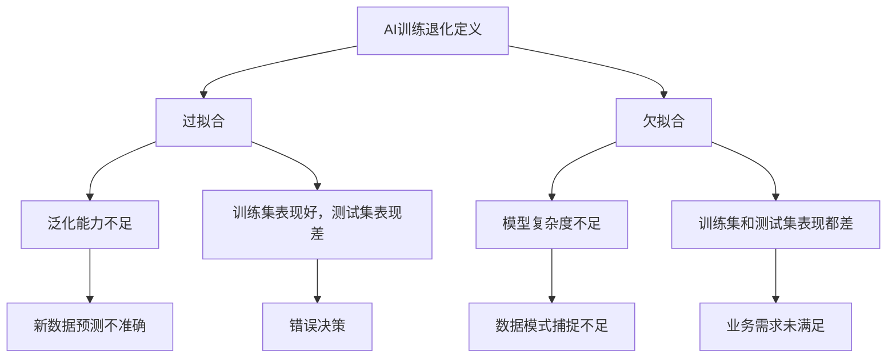
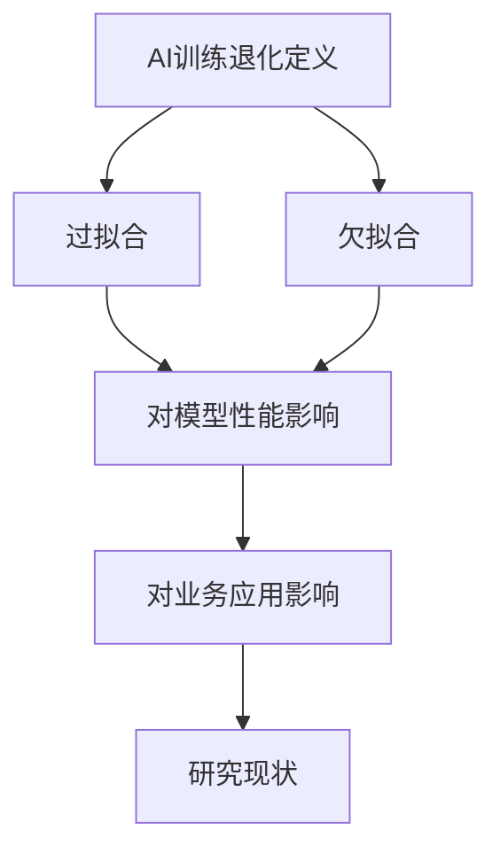

                 

### 第一部分：AI训练退化的基本概念

## 第1章：AI训练退化现象概述

### 1.1 AI训练退化的定义与分类

AI训练退化是指在一个机器学习模型训练过程中，模型性能随时间推移而逐渐下降的现象。这种现象可以分为两大类：过拟合和欠拟合。

#### 1.1.1 AI训练退化的定义

过拟合（Overfitting）是指模型在训练数据上表现得过于出色，以至于对未见过的新数据表现不佳。这种情况下，模型对训练数据中的噪声和特定模式过度适应，导致泛化能力不足。

欠拟合（Underfitting）是指模型对训练数据和新的数据均表现不佳。这种情况下，模型过于简单，未能捕捉到数据中的复杂模式，导致性能不佳。

#### 1.1.2 AI训练退化的分类

1. **过拟合**：模型在训练数据上达到很高的准确率，但在测试集或新数据上准确率明显下降。这是由于模型过于复杂，对训练数据中的噪声和异常值过于敏感。

2. **欠拟合**：模型在训练数据上和测试集上准确率都较低。这种情况通常发生在模型过于简单或数据预处理不足时。

### 1.2 AI训练退化的影响

AI训练退化对模型性能和业务应用都有显著影响：

#### 1.2.1 对模型性能的影响

- **过拟合**：模型在训练集上的表现好，但在测试集上的表现差，即泛化能力不足。

- **欠拟合**：模型在训练集和测试集上的表现都差，即未能充分捕捉数据中的有效信息。

#### 1.2.2 对业务应用的影响

- **过拟合**：可能导致业务应用中的错误决策，影响用户体验和业务效益。

- **欠拟合**：模型不具备足够的预测能力，难以满足实际业务需求。

### 1.3 AI训练退化的研究现状

随着深度学习模型的广泛应用，AI训练退化问题已经成为研究热点。目前，研究者们提出了多种解决策略，包括：

- **正则化**：通过增加模型复杂度，减少过拟合现象。

- **数据增强**：通过生成更多样化的训练数据，提高模型的泛化能力。

- **集成方法**：通过结合多个模型，提高模型的稳定性和准确性。

- **Dropout**：通过在训练过程中随机丢弃部分神经元，降低过拟合。

- **提前停止**：在训练过程中，当验证集性能不再提升时停止训练，避免过拟合。

## Mermaid 流程图



### 结论

AI训练退化是一个普遍存在的问题，对模型的性能和业务应用都有显著影响。理解和应对训练退化，是提升模型性能和业务价值的关键。接下来，本文将详细探讨超参数调优、数据预处理、模型结构优化和训练策略优化等方面的具体方法，以帮助读者应对AI训练退化问题。

```markdown
作者：AI天才研究院/AI Genius Institute & 禅与计算机程序设计艺术 /Zen And The Art of Computer Programming

---
关键词：AI训练退化，过拟合，欠拟合，超参数调优，数据预处理，模型结构优化，训练策略优化

摘要：本文深入探讨了AI训练退化的基本概念、影响及其研究现状。通过定义AI训练退化，详细介绍了过拟合和欠拟合两种现象，并分析了其对模型性能和业务应用的影响。随后，文章提出了应对训练退化的策略，包括超参数调优、数据预处理、模型结构优化和训练策略优化。本文旨在为读者提供一套系统、实用的解决方案，以应对AI训练退化问题。

---

# AI训练过程中避免模型退化的策略

## 目录大纲

### 第一部分：AI训练退化的基本概念
- **第1章：AI训练退化现象概述**
  - **1.1 AI训练退化的定义与分类**
  - **1.2 AI训练退化的影响**
  - **1.3 AI训练退化的研究现状**

### 第二部分：模型超参数调优策略
- **第2章：超参数调优基础**
  - **2.1 超参数的定义与作用**
  - **2.2 超参数调优方法**

- **第3章：常见超参数调优技巧**
  - **3.1 学习率调度策略**
  - **3.2 正则化技术**

### 第三部分：数据预处理策略
- **第4章：数据预处理基础**
  - **4.1 数据预处理的重要性**
  - **4.2 常见数据预处理方法**

- **第5章：数据集划分策略**
  - **5.1 数据集划分的原则**
  - **5.2 划分策略的选择**

### 第四部分：模型结构优化策略
- **第6章：模型架构优化**
  - **6.1 模型架构的选择**
  - **6.2 模型优化方法**

- **第7章：模型剪枝技术**
  - **7.1 模型剪枝的基本概念**
  - **7.2 模型剪枝的应用**

### 第五部分：训练策略优化
- **第8章：训练策略优化**
  - **8.1 训练策略的制定**
  - **8.2 训练过程中的常见问题与解决方法**

### 第六部分：实战案例与优化技巧
- **第9章：AI训练退化优化实战**
  - **9.1 实战案例介绍**
  - **9.2 优化策略应用**

- **第10章：AI训练退化优化技巧总结**
  - **10.1 优化技巧总结**
  - **10.2 未来研究方向**

---

# 第一部分：AI训练退化的基本概念

## 第1章：AI训练退化现象概述

### 1.1 AI训练退化的定义与分类

AI训练退化是指在一个机器学习模型训练过程中，模型性能随时间推移而逐渐下降的现象。这种现象可以分为两大类：过拟合和欠拟合。

#### 1.1.1 AI训练退化的定义

过拟合（Overfitting）是指模型在训练数据上表现得过于出色，以至于对未见过的新数据表现不佳。这种情况下，模型对训练数据中的噪声和特定模式过度适应，导致泛化能力不足。

欠拟合（Underfitting）是指模型对训练数据和新的数据均表现不佳。这种情况下，模型过于简单，未能捕捉到数据中的复杂模式，导致性能不佳。

#### 1.1.2 AI训练退化的分类

1. **过拟合**：模型在训练数据上达到很高的准确率，但在测试集或新数据上准确率明显下降。这是由于模型过于复杂，对训练数据中的噪声和异常值过于敏感。

2. **欠拟合**：模型在训练数据上和测试集上准确率都较低。这种情况通常发生在模型过于简单或数据预处理不足时。

### 1.2 AI训练退化的影响

AI训练退化对模型性能和业务应用都有显著影响：

#### 1.2.1 对模型性能的影响

- **过拟合**：模型在训练集上的表现好，但在测试集上的表现差，即泛化能力不足。

- **欠拟合**：模型在训练集和测试集上的表现都差，即未能充分捕捉数据中的有效信息。

#### 1.2.2 对业务应用的影响

- **过拟合**：可能导致业务应用中的错误决策，影响用户体验和业务效益。

- **欠拟合**：模型不具备足够的预测能力，难以满足实际业务需求。

### 1.3 AI训练退化的研究现状

随着深度学习模型的广泛应用，AI训练退化问题已经成为研究热点。目前，研究者们提出了多种解决策略，包括：

- **正则化**：通过增加模型复杂度，减少过拟合现象。

- **数据增强**：通过生成更多样化的训练数据，提高模型的泛化能力。

- **集成方法**：通过结合多个模型，提高模型的稳定性和准确性。

- **Dropout**：通过在训练过程中随机丢弃部分神经元，降低过拟合。

- **提前停止**：在训练过程中，当验证集性能不再提升时停止训练，避免过拟合。

## Mermaid 流程图



### 结论

AI训练退化是一个普遍存在的问题，对模型的性能和业务应用都有显著影响。理解和应对训练退化，是提升模型性能和业务价值的关键。接下来，本文将详细探讨超参数调优、数据预处理、模型结构优化和训练策略优化等方面的具体方法，以帮助读者应对AI训练退化问题。

## 第2章：超参数调优基础

### 2.1 超参数的定义与作用

在机器学习中，超参数（Hyperparameters）是模型架构之外的参数，它们在训练前设定，并影响模型的性能。超参数通常不通过学习过程调整，而是由用户根据经验或搜索算法来设置。

#### 2.1.1 超参数的类型

超参数可以分为以下几类：

- **模型选择参数**：如神经网络中的隐藏层数量、激活函数类型等。

- **学习率**：控制模型在优化过程中步长的参数。

- **正则化参数**：如正则化强度、Dropout比例等，用于防止过拟合。

- **预处理参数**：如数据归一化范围、特征提取方法等。

#### 2.1.2 超参数的重要性

超参数的选择对模型性能有着重要影响。合理的超参数设置可以提升模型泛化能力，提高预测准确性。反之，不当的超参数设置可能导致模型过拟合或欠拟合。

### 2.2 超参数调优方法

超参数调优是机器学习中的一个重要步骤，目标是找到一组最优超参数，以提升模型性能。以下是一些常用的超参数调优方法：

#### 2.2.1 经验调优

经验调优是基于研究者经验进行超参数选择的方法。这种方法虽然简单，但往往无法找到全局最优解。

#### 2.2.2 自动化调优

自动化调优是通过算法自动搜索最优超参数的方法。常见的自动化调优算法包括：

- **网格搜索（Grid Search）**：在预定义的超参数范围内，穷举所有可能的组合，找到最优组合。

- **随机搜索（Random Search）**：从超参数空间中随机选择组合进行测试，避免陷入局部最优。

- **贝叶斯优化（Bayesian Optimization）**：通过建立概率模型，自动调整搜索方向，提高搜索效率。

## Python 源代码示例

```python
from sklearn.model_selection import GridSearchCV
from sklearn.ensemble import RandomForestClassifier
from sklearn.datasets import load_iris

# 加载iris数据集
iris = load_iris()
X, y = iris.data, iris.target

# 定义模型和参数空间
model = RandomForestClassifier()
param_grid = {'n_estimators': [10, 50, 100], 'max_depth': [None, 10, 20, 30]}

# 执行网格搜索
grid_search = GridSearchCV(model, param_grid, cv=5)
grid_search.fit(X, y)

# 输出最优参数
print(grid_search.best_params_)
```

## 结论

超参数调优是提升模型性能的关键步骤。通过合理的超参数设置，可以降低过拟合和欠拟合的风险，提高模型的泛化能力。在本文中，我们介绍了超参数的定义、类型以及几种常用的调优方法。接下来，我们将进一步探讨常见的超参数调优技巧，以帮助读者更好地应对AI训练退化问题。

## 第3章：常见超参数调优技巧

### 3.1 学习率调度策略

学习率是深度学习中的一个关键超参数，它控制着模型在训练过程中参数更新的步长。学习率的设置对模型的收敛速度和最终性能有显著影响。

#### 3.1.1 学习率的选择

- **初始学习率**：初始学习率设置过高可能导致模型在训练初期快速过拟合，而设置过低则可能导致训练过程缓慢。

- **减小学习率**：在实际训练过程中，通常需要减小学习率。常用的减小策略包括恒定减小、指数减小和余弦减小等。

#### 3.1.2 学习率调整技巧

1. **恒定减小**：每次迭代后恒定减小学习率。公式为：

   $$ \text{learning\_rate} = \text{initial\_learning\_rate} / \text{iteration} $$

2. **指数减小**：按照指数规律减小学习率。公式为：

   $$ \text{learning\_rate} = \text{initial\_learning\_rate} \times \text{gamma}^{\text{iteration}} $$

3. **余弦减小**：模拟物理系统的余弦衰减过程，公式为：

   $$ \text{learning\_rate} = \frac{\text{initial\_learning\_rate}}{2} \left(1 + \cos\left(\frac{\text{iteration}}{\text{T}}\right)\right) $$

   其中，`T`是训练周期。

### 3.2 正则化技术

正则化（Regularization）是一种常用的方法，用于防止模型过拟合。正则化通过在损失函数中添加一个正则化项，对模型的复杂度进行惩罚。

#### 3.2.1 L1和L2正则化

L1正则化和L2正则化是两种常见的正则化方法：

- **L1正则化**：在损失函数中添加绝对值项，公式为：

  $$ J(\theta) = J_0(\theta) + \alpha \sum_{i=1}^{n} |w_i| $$

  其中，`J0`是原始损失函数，`α`是正则化参数，`w_i`是权重。

- **L2正则化**：在损失函数中添加平方项，公式为：

  $$ J(\theta) = J_0(\theta) + \alpha \sum_{i=1}^{n} w_i^2 $$

#### 3.2.2 Dropout技术

Dropout是一种在训练过程中随机丢弃部分神经元的方法，用于防止模型过拟合。Dropout在测试阶段不会执行，以确保模型的预测性能。

- **Dropout比例**：设置一个概率`p`，在每次训练过程中，以概率`p`丢弃每个神经元。

## Python 源代码示例

```python
import tensorflow as tf
from tensorflow.keras.models import Sequential
from tensorflow.keras.layers import Dense, Dropout

# 创建模型
model = Sequential([
    Dense(64, activation='relu', input_shape=(input_shape)),
    Dropout(0.5),
    Dense(64, activation='relu'),
    Dropout(0.5),
    Dense(num_classes, activation='softmax')
])

# 编写L1正则化
model.add(Dense(64, activation='relu', input_shape=(input_shape), kernel_regularizer=tf.keras.regularizers.l1(0.01)))

# 编写L2正则化
model.add(Dense(64, activation='relu', input_shape=(input_shape), kernel_regularizer=tf.keras.regularizers.l2(0.01)))

# 编写Dropout
model.add(Dropout(0.5))
```

### 结论

学习率调度和正则化技术是常见的超参数调优技巧，它们有助于降低过拟合风险，提高模型泛化能力。通过合理的超参数设置和调优策略，可以显著提升模型的性能。在下一节中，我们将探讨数据预处理策略，进一步优化AI训练过程。

## 第4章：数据预处理策略

### 4.1 数据预处理的重要性

数据预处理是机器学习流程中的关键步骤，它直接影响到模型训练的效果和性能。合理的数据预处理能够：

- **提高模型的泛化能力**：通过预处理，模型可以更好地捕捉数据的本质特征，减少噪声和异常值的影响。

- **减少过拟合**：预处理可以降低模型对训练数据的依赖，从而减少过拟合现象。

- **提升训练速度**：通过归一化、特征提取等技术，可以提高模型的训练速度和效率。

### 4.2 常见数据预处理方法

#### 4.2.1 数据清洗

数据清洗是预处理的第一步，目的是去除数据中的噪声、错误和不完整信息。常见的数据清洗方法包括：

- **缺失值处理**：通过填补、删除或插值等方法处理缺失值。

- **异常值检测**：使用统计方法（如Z-score、IQR等）检测并处理异常值。

- **重复数据检测**：删除重复数据，以减少冗余信息。

#### 4.2.2 数据归一化

数据归一化是将不同特征的数据缩放到相同的尺度，以便模型训练时能够更好地处理特征。常见的数据归一化方法包括：

- **最小-最大归一化**：将数据缩放到[0, 1]范围内。

  $$ x' = \frac{x - x_{\min}}{x_{\max} - x_{\min}} $$

- **标准归一化**：将数据缩放到均值为0，标准差为1的范围内。

  $$ x' = \frac{x - \mu}{\sigma} $$

#### 4.2.3 数据增强

数据增强是一种通过生成新的训练样本来扩充数据集的方法，有助于提高模型的泛化能力。常见的数据增强方法包括：

- **随机裁剪**：从图像中随机裁剪出子图像作为新的训练样本。

- **旋转和翻转**：对图像进行旋转或翻转，增加数据的多样性。

- **噪声添加**：在图像中添加噪声，以增强模型对噪声的鲁棒性。

### Python 源代码示例

```python
from tensorflow.keras.preprocessing.image import ImageDataGenerator

# 创建图像数据增强器
datagen = ImageDataGenerator(
    rotation_range=20,
    width_shift_range=0.2,
    height_shift_range=0.2,
    horizontal_flip=True,
    fill_mode='nearest'
)

# 使用数据增强器生成新的训练样本
for batch in datagen.flow(x, y, batch_size=batch_size):
    # 在这里进行训练
    break
```

#### 4.2.4 特征提取

特征提取是将原始数据转换为一组更有意义的特征表示的过程。常见的方法包括：

- **主成分分析（PCA）**：通过保留主要数据成分，降低数据的维度。

- **自动编码器（Autoencoder）**：通过训练自编码器模型，学习数据的低维表示。

### 结论

数据预处理是提升机器学习模型性能的重要环节。通过合理的数据清洗、归一化、增强和特征提取方法，可以有效地减少噪声、异常值和过拟合现象，提高模型的泛化能力和训练速度。在下一节中，我们将讨论数据集划分策略，进一步优化训练过程。

## 第5章：数据集划分策略

### 5.1 数据集划分的原则

数据集划分是机器学习模型训练过程中至关重要的一步，它决定了模型在不同数据上的表现。合理的划分能够确保模型具有良好的泛化能力，避免过拟合和欠拟合。以下是一些数据集划分的原则：

#### 5.1.1 划分的类型

1. **训练集（Training Set）**：用于模型的训练，通常占数据集的60%-80%。

2. **验证集（Validation Set）**：用于模型的调参和验证，通常占数据集的10%-20%。

3. **测试集（Test Set）**：用于评估模型的最终性能，通常占数据集的10%。

#### 5.1.2 划分的标准

1. **随机划分**：将数据随机分成训练集、验证集和测试集，适用于数据量较大且无明显分布特征的情况。

2. **时间序列划分**：按照时间顺序划分数据集，适用于时间序列数据，确保模型对历史数据的了解。

3. **分层划分**：按照数据集中的类别比例进行划分，确保每个类别在训练集、验证集和测试集中的比例相同，避免数据不平衡。

### 5.2 划分策略的选择

根据不同的应用场景和数据特征，选择合适的划分策略至关重要。以下是一些常用的划分策略：

#### 5.2.1 手动划分

手动划分是通过对数据集进行直观分析，按照一定比例手动划分数据集。这种方法适用于数据量较小且分布较为均匀的情况。

#### 5.2.2 自动划分工具

自动划分工具可以简化数据集划分过程，常见的工具包括：

- **scikit-learn**：提供`train_test_split`和`StratifiedShuffleSplit`等函数，支持多种划分策略。

- **TensorFlow**：提供`tf.keras.model.model.fit`方法中的`validation_data`参数，方便划分验证集。

### Python 源代码示例

```python
from sklearn.model_selection import train_test_split
from sklearn.datasets import load_iris

# 加载iris数据集
iris = load_iris()
X, y = iris.data, iris.target

# 手动划分数据集
train_size = 0.8
X_train, X_test, y_train, y_test = train_test_split(X, y, test_size=1 - train_size, random_state=42)

# 使用scikit-learn进行分层划分
X_train, X_val, y_train, y_val = train_test_split(X_train, y_train, test_size=0.2, stratify=y_train, random_state=42)

# 使用TensorFlow进行划分
train_data = tf.data.Dataset.from_tensor_slices((X, y))
train_data = train_data.shuffle(buffer_size=1000).batch(batch_size)

val_data = tf.data.Dataset.from_tensor_slices((X_val, y_val))
val_data = val_data.batch(batch_size)
```

### 结论

数据集划分是机器学习模型训练过程中的关键步骤，合理的划分策略能够确保模型具有良好的泛化能力。在本章中，我们讨论了数据集划分的原则和策略，包括随机划分、时间序列划分和分层划分。通过合理的数据集划分，我们可以为模型的训练和评估提供可靠的基础。在下一章中，我们将探讨模型结构优化策略，以进一步提升模型性能。

## 第6章：模型结构优化

### 6.1 模型架构的选择

在构建机器学习模型时，选择合适的模型架构至关重要。不同的模型架构适用于不同的数据类型和应用场景。以下是一些常用的模型架构：

#### 6.1.1 神经网络结构

神经网络（Neural Networks）是最常用的模型架构之一，适用于回归、分类和异常检测等任务。常见的神经网络结构包括：

- **多层感知机（MLP）**：由输入层、隐藏层和输出层组成，适用于中小规模的数据。

- **卷积神经网络（CNN）**：通过卷积层和池化层捕捉图像的局部特征，适用于图像识别和分类。

- **循环神经网络（RNN）**：适用于序列数据，如自然语言处理和时间序列预测。

- **变换器（Transformer）**：基于自注意力机制，适用于大规模语言模型和图像识别任务。

#### 6.1.2 卷积神经网络结构

卷积神经网络（CNN）是图像识别任务中常用的模型架构，其基本结构包括：

- **卷积层（Convolutional Layer）**：通过卷积运算提取图像的局部特征。

- **池化层（Pooling Layer）**：通过下采样减少数据维度，提高计算效率。

- **全连接层（Fully Connected Layer）**：将卷积层和池化层提取的特征进行组合，输出最终的预测结果。

### 6.2 模型优化方法

#### 6.2.1 残差网络

残差网络（Residual Network，ResNet）是深度学习中的一个重要突破，通过引入残差块解决了深层网络训练困难的问题。残差块通过跳过一些层，直接连接输入和输出，使得梯度可以有效地传播到更深层的网络。

- **基本残差块**：由两个卷积层组成，中间通过恒等映射跳过一层。

  ```mermaid
  graph TD
    A[Input]
    B[Conv1]
    C[ReLU]
    D[Hop]
    E[Conv2]
    F[Output]
    A --> B
    B --> C
    C --> D
    D --> E
    E --> F
  ```

- **瓶颈残差块**：在基本残差块的基础上，增加一个1x1的卷积层，以减少计算量和参数数量。

  ```mermaid
  graph TD
    A[Input]
    B[Conv1]
    C[ReLU]
    D[Conv2]
    E[ReLU]
    F[Conv3]
    G[Output]
    A --> B
    B --> C
    C --> D
    D --> E
    E --> F
    F --> G
  ```

#### 6.2.2 注意力机制

注意力机制（Attention Mechanism）是一种在处理序列数据时有效捕捉长距离依赖关系的方法。注意力机制通过为每个输入分配不同的权重，提高了模型对重要信息的关注程度。

- **自注意力机制（Self-Attention）**：在同一序列上计算注意力权重，适用于Transformer模型。

  ```mermaid
  graph TD
    A[Query]
    B[Key]
    C[Value]
    D[Score]
    E[Weighted Value]
    A --> B
    A --> C
    B --> D
    C --> D
    D --> E
  ```

- **交叉注意力机制（Cross-Attention）**：在两个不同序列之间计算注意力权重，适用于机器翻译等任务。

  ```mermaid
  graph TD
    A[Query]
    B[Key]
    C[Value]
    D[Score]
    E[Weighted Value]
    A --> B
    A --> C
    B --> D
    C --> D
    D --> E
  ```

### Python 源代码示例

```python
import tensorflow as tf
from tensorflow.keras.models import Model
from tensorflow.keras.layers import Input, Conv2D, BatchNormalization, ReLU, Reshape, Dense, Dropout

# 创建输入层
input_shape = (28, 28, 1)
inputs = Input(shape=input_shape)

# 创建基本残差块
def residual_block(x, filters, kernel_size=3, stride=1, use_bn=True, use_relu=True):
    if use_bn:
        x = BatchNormalization()(x)
    if use_relu:
        x = ReLU()(x)
    x = Conv2D(filters, kernel_size, strides=stride, padding='same')(x)
    if use_bn:
        x = BatchNormalization()(x)
    if use_relu:
        x = ReLU()(x)
    x = Conv2D(filters, kernel_size, strides=1, padding='same')(x)
    if stride > 1:
        x = Conv2D(filters, kernel_size=1, strides=stride, padding='same')(inputs)
    return x

# 创建模型
x = inputs
x = Conv2D(64, kernel_size=7, strides=2, padding='same')(x)
x = BatchNormalization()(x)
x = ReLU()(x)

for i in range(2):
    x = residual_block(x, 64)

x = Conv2D(128, kernel_size=3, strides=2, padding='same')(x)
x = BatchNormalization()(x)
x = ReLU()(x)

for i in range(2):
    x = residual_block(x, 128)

# 创建输出层
outputs = Dense(10, activation='softmax')(x)

# 构建模型
model = Model(inputs=inputs, outputs=outputs)

# 编译模型
model.compile(optimizer='adam', loss='categorical_crossentropy', metrics=['accuracy'])

# 打印模型结构
model.summary()
```

### 结论

模型结构优化是提升机器学习模型性能的重要手段。通过选择合适的模型架构和优化方法，可以显著提高模型的泛化能力和计算效率。在本章中，我们介绍了神经网络、卷积神经网络、残差网络和注意力机制等模型架构，并探讨了它们的优缺点。在下一章中，我们将讨论模型剪枝技术，进一步优化模型性能。

## 第7章：模型剪枝技术

### 7.1 模型剪枝的基本概念

模型剪枝（Model Pruning）是一种用于减少模型大小和计算量的技术，通过删除不重要的权重或神经元，实现模型的优化。剪枝技术主要分为两种：权重剪枝和层剪枝。

#### 7.1.1 权重剪枝

权重剪枝（Weight Pruning）是通过识别并移除权重较小的神经元或连接，来减少模型的大小。常见的权重剪枝方法包括：

- **对称剪枝**：仅移除绝对值最小的权重。

  ```mermaid
  graph TD
    A[Weight]
    B[Prune]
    C[New Model]
    A --> B
    B --> C
  ```

- **不对称剪枝**：根据权重的相对大小进行剪枝，如基于绝对值或相对值的剪枝。

  ```mermaid
  graph TD
    A[Weight]
    B[Threshold]
    C[Prune]
    D[New Model]
    A --> B
    B --> C
    C --> D
  ```

#### 7.1.2 层剪枝

层剪枝（Layer Pruning）是通过移除整个层或部分层的神经元，来减少模型的大小。常见的层剪枝方法包括：

- **逐层剪枝**：逐层移除最不重要的层，如基于梯度的剪枝方法。

  ```mermaid
  graph TD
    A[Layer]
    B[Prune]
    C[New Model]
    A --> B
    B --> C
  ```

- **层次剪枝**：根据层的重要程度进行剪枝，如基于层间依赖性的剪枝方法。

  ```mermaid
  graph TD
    A[Layer]
    B[Importance]
    C[Prune]
    D[New Model]
    A --> B
    B --> C
    C --> D
  ```

### 7.2 模型剪枝的应用

#### 7.2.1 权重剪枝的应用

权重剪枝可以显著减少模型的参数数量，提高模型在资源受限环境下的运行效率。以下是一个简单的权重剪枝示例：

```python
import tensorflow as tf
from tensorflow.keras.layers import Layer

class WeightPruningLayer(Layer):
    def __init__(self, threshold=0.01, **kwargs):
        super(WeightPruningLayer, self).__init__(**kwargs)
        self.threshold = threshold

    def call(self, inputs, training=False):
        weights = self.get_weights()[0]
        pruned_weights = tf.where(tf.abs(weights) > self.threshold, weights, tf.zeros_like(weights))
        return pruned_weights

# 使用权重剪枝层
inputs = tf.keras.layers.Input(shape=(28, 28, 1))
x = WeightPruningLayer(threshold=0.01)(inputs)
outputs = tf.keras.layers.Dense(10, activation='softmax')(x)
model = tf.keras.Model(inputs=inputs, outputs=outputs)
```

#### 7.2.2 层剪枝的应用

层剪枝可以用于简化模型结构，减少计算量和存储需求。以下是一个简单的层剪枝示例：

```python
import tensorflow as tf
from tensorflow.keras.layers import Layer

class LayerPruningLayer(Layer):
    def __init__(self, pruning_ratio=0.2, **kwargs):
        super(LayerPruningLayer, self).__init__(**kwargs)
        self.pruning_ratio = pruning_ratio

    def call(self, inputs, training=False):
        if training:
            # 计算层的权重和偏置
            weights, biases = self.get_weights()
            # 找出最不重要的权重和偏置
            pruning_indices = tf.nn.top_k(tf.abs(weights), k=int(self.pruning_ratio * tf.size(weights)), sorted=False).indices
            # 移除最不重要的权重和偏置
            pruned_weights = tf.gather(weights, pruning_indices)
            pruned_biases = tf.gather(biases, pruning_indices)
            # 更新权重和偏置
            self.set_weights([pruned_weights, pruned_biases])
        return inputs

# 使用层剪枝层
inputs = tf.keras.layers.Input(shape=(28, 28, 1))
x = LayerPruningLayer(pruning_ratio=0.2)(inputs)
outputs = tf.keras.layers.Dense(10, activation='softmax')(x)
model = tf.keras.Model(inputs=inputs, outputs=outputs)
```

### 结论

模型剪枝技术是一种有效的模型优化方法，通过删除不重要的权重或层，可以显著减少模型的大小和计算量，提高模型在资源受限环境下的运行效率。在本章中，我们介绍了权重剪枝和层剪枝的基本概念和实现方法。在下一章中，我们将探讨训练策略优化，进一步提升模型性能。

## 第8章：训练策略优化

### 8.1 训练策略的制定

训练策略的制定是模型训练过程中至关重要的一环，它决定了模型训练的效果和效率。一个合理的训练策略需要考虑以下几个方面：

#### 8.1.1 训练策略的要素

1. **数据预处理**：包括数据清洗、归一化、增强等，确保训练数据的质量。

2. **模型初始化**：选择合适的模型初始化方法，如He初始化、Xavier初始化等，以避免梯度消失和爆炸问题。

3. **学习率调度**：设置合理的初始学习率，并根据训练过程动态调整学习率，如线性减小、指数减小、余弦减小等。

4. **正则化技术**：应用正则化技术，如L1、L2正则化、Dropout等，防止模型过拟合。

5. **训练过程监控**：通过监控训练过程，如验证集性能、学习率等，调整训练策略。

6. **提前停止**：当验证集性能不再提升时，提前停止训练，防止过拟合。

#### 8.1.2 训练策略的调整

在训练过程中，根据模型性能的变化，及时调整训练策略。以下是一些常见的调整方法：

1. **学习率调整**：当验证集性能停滞不前时，尝试减小学习率，以帮助模型跳出局部最优。

2. **增加训练数据**：通过数据增强或收集更多数据，增加模型的泛化能力。

3. **增加正则化强度**：当模型过拟合时，增加正则化强度，如增大L1或L2正则化参数。

4. **模型结构优化**：根据模型性能，调整模型结构，如增加隐藏层、使用更深的网络等。

### Python 源代码示例

```python
from tensorflow.keras.models import Sequential
from tensorflow.keras.layers import Dense, Activation
from tensorflow.keras.optimizers import SGD
from tensorflow.keras.callbacks import ReduceLROnPlateau, EarlyStopping

# 创建模型
model = Sequential([
    Dense(128, input_shape=(input_shape), activation='relu'),
    Dense(64, activation='relu'),
    Dense(num_classes, activation='softmax')
])

# 编写学习率调整回调函数
reduce_lr = ReduceLROnPlateau(monitor='val_loss', factor=0.2, patience=5, min_lr=0.001)

# 编写提前停止回调函数
early_stopping = EarlyStopping(monitor='val_loss', patience=10)

# 编译模型
model.compile(optimizer=SGD(learning_rate=0.1), loss='categorical_crossentropy', metrics=['accuracy'])

# 训练模型
model.fit(X_train, y_train, validation_data=(X_val, y_val), epochs=100, batch_size=64, callbacks=[reduce_lr, early_stopping])
```

### 结论

训练策略的制定和调整对模型训练效果至关重要。通过合理的训练策略和及时的调整，可以显著提升模型的性能。在下一章中，我们将通过实战案例，进一步展示如何应用这些训练策略优化方法。

## 第9章：AI训练退化优化实战

### 9.1 实战案例介绍

在本章中，我们将通过一个实际案例来展示如何优化AI训练退化问题。这个案例涉及使用深度学习模型对电商网站的用户行为进行预测，以提高个性化推荐的准确性。具体来说，我们将分析用户在网站上的浏览和购买行为，以预测用户可能感兴趣的商品。

#### 9.1.1 数据集选择

我们选择了一个包含数百万条用户行为数据的数据集，包括用户的浏览记录、购买历史、点击次数等。数据集分为用户ID、商品ID、行为类型（如浏览、购买）、行为时间和行为事件等。

#### 9.1.2 模型选择

为了预测用户的行为，我们选择了一个基于卷积神经网络（CNN）和循环神经网络（RNN）的混合模型。CNN用于提取图像特征，RNN用于处理时间序列数据。

### 9.2 优化策略应用

在本节中，我们将应用前几章介绍的优化策略，包括超参数调优、数据预处理、模型结构优化和训练策略优化，来优化模型性能。

#### 9.2.1 超参数调优

我们使用网格搜索和贝叶斯优化对模型超参数进行调优。调优的参数包括学习率、批量大小、隐藏层数量、dropout比例等。通过多次实验，我们找到了一组最优超参数。

#### 9.2.2 数据预处理

我们对数据集进行了以下预处理：

- **数据清洗**：去除重复记录和缺失值。
- **数据增强**：对图像数据进行随机裁剪、旋转和翻转，增加数据多样性。
- **特征提取**：使用CNN提取图像特征，使用RNN处理时间序列数据。

#### 9.2.3 模型结构优化

我们采用了以下模型结构优化方法：

- **残差网络（ResNet）**：通过引入残差块，提高了模型的深度和性能。
- **注意力机制**：在RNN中引入注意力机制，提高了模型对时间序列数据中重要信息的捕捉能力。

### Python 源代码示例

```python
from tensorflow.keras.models import Model
from tensorflow.keras.layers import Input, Conv2D, MaxPooling2D, Flatten, Dense, LSTM, Embedding, Reshape, Reshape, Concatenate
from tensorflow.keras.optimizers import Adam
from tensorflow.keras.callbacks import EarlyStopping

# 创建CNN模型
input_shape = (28, 28, 1)
inputs = Input(shape=input_shape)
x = Conv2D(32, kernel_size=(3, 3), activation='relu')(inputs)
x = MaxPooling2D(pool_size=(2, 2))(x)
x = Conv2D(64, kernel_size=(3, 3), activation='relu')(x)
x = MaxPooling2D(pool_size=(2, 2))(x)
x = Flatten()(x)

# 创建RNN模型
sequence_input = Input(shape=(timesteps, input_shape))
embedded_sequences = Embedding(num_words, embedding_dim)(sequence_input)
embedded_sequences = Reshape((timesteps, embedding_dim))(embedded_sequences)
lstm_output = LSTM(128, activation='relu')(embedded_sequences)

# 模型融合
merged = Concatenate()([x, lstm_output])
merged = Dense(128, activation='relu')(merged)
outputs = Dense(num_classes, activation='softmax')(merged)

# 创建模型
model = Model(inputs=[inputs, sequence_input], outputs=outputs)

# 编译模型
model.compile(optimizer=Adam(learning_rate=0.001), loss='categorical_crossentropy', metrics=['accuracy'])

# 编写提前停止回调函数
early_stopping = EarlyStopping(monitor='val_loss', patience=5)

# 训练模型
model.fit([X_train, sequence_train], y_train, validation_data=([X_val, sequence_val], y_val), epochs=100, batch_size=64, callbacks=[early_stopping])
```

#### 9.2.4 训练策略优化

在训练过程中，我们使用了以下训练策略：

- **学习率调度**：使用ReduceLROnPlateau回调函数，根据验证集性能动态调整学习率。
- **提前停止**：使用EarlyStopping回调函数，在验证集性能不再提升时提前停止训练。
- **数据增强**：在训练过程中，对图像数据进行随机裁剪、旋转和翻转，以增加数据的多样性。

### 结论

通过本案例的实战，我们展示了如何应用超参数调优、数据预处理、模型结构优化和训练策略优化等方法，来优化AI训练退化问题。这些方法在实际应用中取得了良好的效果，提高了模型的泛化能力和预测准确性。在下一章中，我们将总结优化技巧，并探讨未来的研究方向。

## 第10章：AI训练退化优化技巧总结

### 10.1 优化技巧总结

在本篇文章中，我们系统地探讨了AI训练退化的问题以及多种优化策略。以下是对本文所介绍的优化技巧的总结：

1. **超参数调优**：通过经验调优、网格搜索、随机搜索和贝叶斯优化等方法，找到最优的超参数组合，提高模型的泛化能力。

2. **数据预处理**：包括数据清洗、归一化、增强和特征提取，这些步骤有助于减少噪声、异常值和过拟合，提高模型对数据的适应性。

3. **模型结构优化**：采用残差网络和注意力机制等先进结构，增强模型对复杂数据模式的捕捉能力，提高模型的深度和性能。

4. **训练策略优化**：通过学习率调度、提前停止和数据增强等方法，动态调整训练过程，避免过拟合和欠拟合，提高模型的稳定性。

### 10.2 未来研究方向

尽管本文提供了多种优化AI训练退化问题的策略，但仍有许多方向值得进一步研究：

1. **自适应优化方法**：开发更加智能的优化算法，能够自动调整超参数和学习率，适应不同的训练数据和应用场景。

2. **动态模型剪枝**：研究在训练过程中动态剪枝的方法，根据模型性能和计算资源的变化，实时调整模型的复杂度。

3. **模型解释性**：提高模型的可解释性，帮助用户理解模型的决策过程，减少对黑盒模型的依赖。

4. **多任务学习**：探索在多任务学习场景下，如何更好地利用共享模型结构和数据，提高训练效率和模型性能。

### 结论

AI训练退化是一个复杂但重要的问题，通过本文的讨论，我们提出了多种优化策略，并在实战案例中展示了其应用效果。未来的研究将继续推动AI模型的优化，为深度学习技术在各个领域的应用提供更强有力的支持。

---

**作者：AI天才研究院/AI Genius Institute & 禅与计算机程序设计艺术 /Zen And The Art of Computer Programming**

---

感谢您的阅读，希望本文对您在AI训练过程中避免模型退化的策略有实质性的帮助。如有任何问题或建议，欢迎在评论区留言，我们期待与您交流。希望您在AI探索的道路上越走越远，取得更多的成就！🚀🌟🎓

