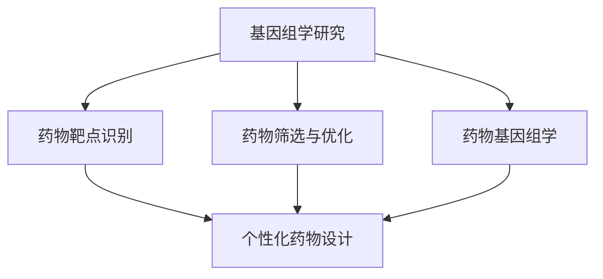
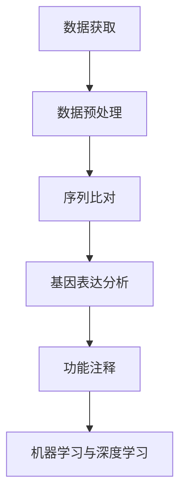

                 

### 《AI辅助个性化药物设计：从基因组学到临床应用》目录大纲

---

## 目录大纲

### 第一部分：基础理论与方法

#### 第1章：AI与个性化药物设计概述

##### 1.1 AI在药物设计中的应用背景

##### 1.2 个性化药物设计的概念与意义

##### 1.3 AI与个性化药物设计的关系

#### 第2章：基因组学与药物设计

##### 2.1 基因组学的基本概念

##### 2.2 基因组学与药物设计的关系

##### 2.3 基因组数据的处理与分析方法

#### 第3章：药物设计与AI算法

##### 3.1 人工智能算法简介

##### 3.2 机器学习在药物设计中的应用

##### 3.3 深度学习在药物设计中的应用

#### 第4章：个性化药物设计的流程与方法

##### 4.1 个性化药物设计的流程

##### 4.2 个性化药物设计的方法

##### 4.3 个性化药物设计的挑战与解决方案

### 第二部分：临床应用案例

#### 第5章：AI辅助个性化药物设计的临床应用

##### 5.1 AI辅助个性化药物设计的临床应用现状

##### 5.2 典型临床应用案例

##### 5.3 临床应用中的挑战与解决方案

#### 第6章：AI辅助个性化药物设计的未来展望

##### 6.1 AI辅助个性化药物设计的发展趋势

##### 6.2 临床应用中的未来发展方向

##### 6.3 潜在的技术挑战与机遇

### 第7章：结语

##### 7.1 AI辅助个性化药物设计的重要性

##### 7.2 对未来的展望

### 附录

#### 附录A：常用工具与资源

##### A.1 常用AI工具

##### A.2 药物设计相关数据库

##### A.3 实用教程与指南

---

### 概述

本文将围绕《AI辅助个性化药物设计：从基因组学到临床应用》这一主题，详细探讨人工智能（AI）在药物设计中的应用及其与基因组学的关系。文章结构分为两部分：第一部分为基础理论与方法，包括AI与个性化药物设计概述、基因组学与药物设计、药物设计与AI算法、个性化药物设计的流程与方法等内容；第二部分为临床应用案例，涵盖AI辅助个性化药物设计的临床应用现状、典型应用案例及未来展望。

本文的核心内容将深入分析AI在个性化药物设计中的作用，介绍基因组学的基本概念及其在药物设计中的应用，探讨机器学习和深度学习算法在药物设计中的应用原理，并详细讲解个性化药物设计的流程和方法。通过临床应用案例，展示AI辅助个性化药物设计的实际效果，分析面临的挑战及其解决方案，展望未来的发展趋势和机遇。

本文旨在为读者提供一个全面、系统的了解AI在个性化药物设计领域的视角，帮助读者掌握相关理论和实践知识，为未来的研究与应用提供参考。

### 关键词

- 人工智能
- 个性化药物设计
- 基因组学
- 机器学习
- 深度学习
- 临床应用

### 摘要

本文探讨了人工智能（AI）在个性化药物设计中的应用，从基因组学到临床应用，全面解析了AI辅助个性化药物设计的理论基础、方法和技术。首先，介绍了AI在药物设计中的应用背景和个性化药物设计的概念与意义。接着，阐述了基因组学的基本概念及其在药物设计中的应用，分析了机器学习和深度学习算法在药物设计中的实际应用。随后，详细讲解了个性化药物设计的流程和方法，并通过临床应用案例展示了AI辅助个性化药物设计的实际效果。最后，讨论了临床应用中的挑战与解决方案，展望了AI辅助个性化药物设计的未来发展趋势。本文旨在为研究人员和从业人员提供一个全面了解AI在个性化药物设计领域的视角，为未来的研究与应用提供参考。

### 第1章：AI与个性化药物设计概述

#### 1.1 AI在药物设计中的应用背景

在过去的几十年里，药物设计领域经历了显著的发展，从传统的经验性方法逐渐转向基于计算和实验的精准设计。然而，药物设计过程中的复杂性和不确定性仍然是一个巨大的挑战。人工智能（AI）作为一种新兴技术，凭借其强大的数据处理和分析能力，正在逐渐改变这一领域。

AI在药物设计中的应用主要体现在以下几个方面：

1. **药物靶点识别**：通过机器学习算法，AI可以从大量的生物数据中识别出潜在的药物靶点。这种方法比传统的药物筛选方法更加高效，能够大幅缩短药物发现周期。
2. **药物分子设计**：AI可以模拟药物分子与生物大分子（如蛋白质）之间的相互作用，帮助设计出具有更高疗效和更低毒性的药物分子。
3. **药物筛选与优化**：AI可以快速筛选大量的化合物库，识别出有潜力的药物候选分子，并通过迭代优化提高其药效。

AI在药物设计中的应用背景可以追溯到20世纪90年代，随着计算机技术的飞速发展和大数据时代的到来，AI技术在各个领域得到了广泛应用。在药物设计领域，AI的引入不仅提高了药物发现的效率，还推动了个性化药物设计的发展。

#### 1.2 个性化药物设计的概念与意义

个性化药物设计是一种基于患者的遗传信息、环境因素和疾病状态的定制化药物设计方法。与传统的一药治多病（One-size-fits-all）模式相比，个性化药物设计旨在实现“精准医疗”，即根据患者的具体病情和个体差异，制定最合适的药物治疗方案。

个性化药物设计的概念可以追溯到20世纪90年代末期，随着基因组学和生物技术的快速发展，人们开始意识到基因的多样性对药物反应的影响。近年来，随着大数据、机器学习和人工智能等技术的发展，个性化药物设计逐渐从理论走向实践。

个性化药物设计的意义主要体现在以下几个方面：

1. **提高治疗效果**：通过个性化药物设计，可以筛选出最适用于特定患者的药物，提高治疗效果，减少药物不良反应。
2. **降低医疗成本**：个性化药物设计有助于减少不必要的药物试验和错误用药，降低医疗成本。
3. **推动医学进步**：个性化药物设计推动了医学研究的发展，有助于揭示疾病的发生机制和药物的作用机制。

#### 1.3 AI与个性化药物设计的关系

AI与个性化药物设计之间存在密切的关系，两者相互促进，共同推动药物设计领域的进步。

首先，AI技术为个性化药物设计提供了强大的数据处理和分析工具。通过机器学习和深度学习算法，AI可以从海量的基因组数据、临床数据和药物分子数据中提取出有价值的信息，为个性化药物设计提供科学依据。

其次，个性化药物设计的需求推动了AI技术的不断进步。个性化药物设计要求对患者的个体信息进行深入分析，这为AI技术提供了丰富的应用场景。同时，个性化药物设计中的复杂性和不确定性也促使AI技术在算法优化、模型训练和数据挖掘等方面不断突破。

总之，AI与个性化药物设计的关系可以概括为：AI为个性化药物设计提供了技术支持，而个性化药物设计的需求推动了AI技术的不断创新。

### 第2章：基因组学与药物设计

基因组学是研究生物体全部基因的学科，它涉及基因的序列、结构、表达调控以及基因与环境之间的相互作用。基因组学的发展为药物设计带来了革命性的变革，使得药物设计从传统的经验性方法转向基于科学数据的精准设计。

#### 2.1 基因组学的基本概念

基因组学的基本概念包括以下几个方面：

1. **基因组**：基因组是指生物体全部遗传信息的集合，包括DNA序列和RNA序列。人类基因组大约包含30亿个碱基对。
2. **基因**：基因是生物体遗传信息的基本单位，负责传递特定的遗传特征。基因由DNA序列编码，通过转录和翻译过程产生蛋白质。
3. **基因表达**：基因表达是指基因在细胞中的转录和翻译过程，产生功能性蛋白质。基因表达受到多种调控机制的影响，包括转录因子、启动子、增强子等。
4. **单核苷酸多态性（SNP）**：单核苷酸多态性是指基因组中单个碱基的变异，是遗传多样性的重要组成部分。SNP在药物反应和疾病易感性中扮演重要角色。

#### 2.2 基因组学与药物设计的关系

基因组学在药物设计中的应用主要体现在以下几个方面：

1. **药物靶点识别**：通过基因组学研究，可以识别出与疾病相关的基因和蛋白质，这些基因和蛋白质成为潜在的药物靶点。例如，癌症基因组学研究表明，某些基因突变可能导致癌症的发生，这些基因成为抗肿瘤药物的重要靶点。
2. **药物筛选与优化**：基因组学数据可以帮助研究人员预测药物分子的作用机制和药物靶点。通过高通量基因测序技术，可以快速筛选大量的化合物库，识别出有潜力的药物候选分子，并通过基因组数据分析优化药物分子。
3. **药物基因组学**：药物基因组学是研究药物反应与基因型之间关系的学科。通过药物基因组学研究，可以了解不同基因型对药物反应的差异，为个性化药物治疗提供依据。

基因组学与药物设计的关系可以用一个Mermaid流程图来表示：



在这个流程图中，基因组学研究为药物设计提供了基础数据，包括药物靶点、药物筛选和药物基因组学等信息，这些信息共同推动了个性化药物设计的发展。

#### 2.3 基因组数据的处理与分析方法

基因组数据的处理与分析是一个复杂的过程，需要多种技术和方法的综合运用。

1. **数据获取**：基因组数据的获取主要通过高通量测序技术，包括DNA测序和RNA测序。这些技术可以产生大量的基因组数据，涵盖基因序列、表达水平和突变信息。
2. **数据预处理**：基因组数据预处理包括数据清洗、去除低质量序列、调整测序深度等。数据预处理是确保数据质量的关键步骤。
3. **序列比对**：将高通量测序数据与参考基因组进行比对，识别出变异位点。常见的序列比对工具包括BWA、Bowtie和Hisat2等。
4. **基因表达分析**：通过对转录组数据进行定量分析，可以了解基因在不同组织、不同疾病状态下的表达水平。常用的基因表达分析工具包括DESeq2、EdgeR和Hemera等。
5. **功能注释**：对基因组中的变异位点进行功能注释，了解其可能的影响。常见的功能注释工具包括Ensembl、UCSC Genome Browser和PhyloCSF等。
6. **机器学习与深度学习**：利用机器学习和深度学习算法，可以从基因组数据中提取有价值的信息，用于药物靶点识别、药物筛选和个性化药物设计。

基因组数据的处理与分析方法可以用以下Mermaid流程图表示：



在这个流程图中，基因组数据的处理与分析是一个逐步深入的过程，从数据获取到数据预处理，再到序列比对、基因表达分析和功能注释，最终利用机器学习和深度学习算法进行数据挖掘和应用。

通过基因组学的应用，药物设计实现了从传统的经验性方法向科学精准设计的转变。基因组学提供了丰富的数据资源，使得药物设计能够更准确地识别药物靶点，筛选药物候选分子，并实现个性化药物设计。基因组学与药物设计的关系密切，相互促进，共同推动了药物设计领域的进步。

### 第3章：药物设计与AI算法

药物设计是一门结合生物学、化学和计算机科学的跨学科领域，旨在开发用于治疗疾病的有效药物。随着计算能力和算法的不断进步，人工智能（AI）在药物设计中的应用变得越来越重要。在这一章节中，我们将深入探讨AI算法在药物设计中的应用，特别是机器学习和深度学习算法。

#### 3.1 人工智能算法简介

人工智能是指模拟人类智能行为的计算机系统，它通过算法和模型来模拟学习、推理和解决问题。AI算法可以分为两大类：监督学习和无监督学习。

1. **监督学习**：监督学习是一种利用已标记的数据集来训练模型，然后使用模型对未知数据进行预测的方法。常见的监督学习算法包括线性回归、逻辑回归、支持向量机（SVM）和神经网络等。
   
2. **无监督学习**：无监督学习不依赖于已标记的数据集，而是通过发现数据中的结构和模式来进行学习。常见的无监督学习算法包括聚类、主成分分析（PCA）和自编码器等。

在药物设计领域，监督学习算法常用于药物筛选和药物分子优化，而无监督学习算法则用于生物数据分析和药物分子结构特征提取。

#### 3.2 机器学习在药物设计中的应用

机器学习在药物设计中的应用非常广泛，主要包括以下几个方面：

1. **药物分子生成**：机器学习可以用于生成新的药物分子，通过优化分子结构来提高药物候选分子的药效和降低毒性。例如，基于生成对抗网络（GAN）的药物分子生成算法可以生成具有潜在药效的分子结构。

2. **药物筛选**：机器学习算法可以从大量的化合物库中筛选出具有潜在药效的药物分子。通过训练模型来识别与疾病相关的生物标志物，然后使用模型对化合物库进行筛选，从而识别出有潜力的药物候选分子。

3. **药物分子优化**：机器学习算法还可以用于优化已识别的药物分子，通过调整分子结构来提高其药效和稳定性。例如，基于量子化学的机器学习模型可以预测分子在生物体内的行为，从而指导药物分子优化。

以下是一个使用Python实现的简单线性回归模型，用于预测化合物的生物活性：

```python
import numpy as np
from sklearn.linear_model import LinearRegression

# 假设有以下数据
X = np.array([[1], [2], [3], [4], [5]])  # 化合物特征
y = np.array([0.1, 0.3, 0.6, 0.8, 1.0])  # 生物活性

# 训练线性回归模型
model = LinearRegression()
model.fit(X, y)

# 预测新化合物的生物活性
new_X = np.array([[6]])
prediction = model.predict(new_X)
print(prediction)
```

在这个示例中，我们使用线性回归模型来预测化合物的生物活性。模型训练数据是一个简单的化合物特征集和对应的生物活性值。通过训练模型，我们可以对新化合物进行生物活性的预测。

#### 3.3 深度学习在药物设计中的应用

深度学习是一种基于多层神经网络的机器学习算法，它在药物设计中的应用越来越广泛。深度学习算法在处理复杂数据和特征提取方面具有显著的优势，适用于药物分子生成、药物筛选和药物分子优化等任务。

1. **药物分子生成**：深度学习模型可以生成新的药物分子，例如使用变分自编码器（VAE）和生成对抗网络（GAN）等算法。这些模型可以通过学习大量的药物分子结构来生成具有潜在药效的新分子。

2. **药物筛选**：深度学习算法可以用于大规模的化合物库筛选，通过训练模型来识别与疾病相关的生物标志物，从而筛选出有潜力的药物候选分子。

3. **药物分子优化**：深度学习模型可以用于优化已识别的药物分子，通过调整分子结构来提高其药效和稳定性。例如，使用卷积神经网络（CNN）和图神经网络（GNN）来预测分子与生物大分子之间的相互作用，从而指导分子优化。

以下是一个使用Python实现的简单卷积神经网络（CNN）模型，用于药物分子分类：

```python
import tensorflow as tf
from tensorflow.keras.models import Sequential
from tensorflow.keras.layers import Conv2D, Flatten, Dense

# 假设有以下数据
X_train = np.random.random((100, 28, 28))  # 药物分子图像数据
y_train = np.random.randint(2, size=(100, 1))  # 药物分子分类标签

# 构建CNN模型
model = Sequential([
    Conv2D(32, (3, 3), activation='relu', input_shape=(28, 28, 1)),
    Flatten(),
    Dense(64, activation='relu'),
    Dense(2, activation='softmax')
])

# 编译模型
model.compile(optimizer='adam', loss='categorical_crossentropy', metrics=['accuracy'])

# 训练模型
model.fit(X_train, y_train, epochs=5, batch_size=32)
```

在这个示例中，我们使用卷积神经网络（CNN）模型来分类药物分子。模型训练数据是一个简单的药物分子图像数据集和对应的分类标签。通过训练模型，我们可以对新药物分子进行分类。

通过机器学习和深度学习算法的应用，药物设计实现了从经验性方法向数据驱动方法的转变。这些算法不仅提高了药物设计的效率和准确性，还为个性化药物设计提供了有力支持。未来，随着AI技术的不断进步，药物设计领域将迎来更加广阔的发展前景。

### 第4章：个性化药物设计的流程与方法

个性化药物设计是一种基于患者的遗传信息、环境因素和疾病状态的定制化药物设计方法，其目标是为每位患者提供最有效的药物治疗方案。个性化药物设计不仅需要精准的药物靶点识别，还需要综合考虑患者的基因型、代谢途径、疾病状态等多种因素。以下是个性化药物设计的流程与方法：

#### 4.1 个性化药物设计的流程

个性化药物设计的流程可以分为以下几个步骤：

1. **数据收集**：收集患者的基因数据、临床数据、药物反应数据等，这些数据可以来自于基因组测序、电子健康记录、临床试验等。

2. **数据预处理**：对收集到的数据进行分析和清洗，去除噪音和异常值，确保数据质量。

3. **药物靶点识别**：利用基因组学和生物信息学方法，识别与疾病相关的药物靶点。这可以通过分析基因突变、基因表达水平、蛋白质相互作用等信息来实现。

4. **药物筛选**：根据药物靶点，筛选具有潜在疗效的药物分子。这可以通过高通量筛选技术、机器学习算法和深度学习模型来实现。

5. **药物优化**：对筛选出的药物分子进行优化，通过调整分子结构、合成新的分子来提高其疗效和安全性。

6. **临床试验**：将优化的药物分子进行临床试验，验证其在患者中的疗效和安全性。

7. **个性化治疗**：根据患者的基因型和药物反应，制定个性化的药物治疗方案，实现精准医疗。

#### 4.2 个性化药物设计的方法

个性化药物设计的方法包括以下几个方面：

1. **药物靶点识别**：利用基因组学和生物信息学方法，识别与疾病相关的药物靶点。例如，通过基因突变分析、基因表达定量分析、蛋白质相互作用网络分析等来识别药物靶点。

2. **药物筛选**：利用高通量筛选技术、机器学习算法和深度学习模型来筛选具有潜在疗效的药物分子。高通量筛选技术可以通过自动化设备在短时间内对大量化合物进行筛选。机器学习算法可以从大量的生物数据和药物分子数据中提取有用的信息，用于药物筛选。深度学习模型可以处理复杂的生物数据和药物分子结构，从而提高药物筛选的准确性。

3. **药物优化**：通过计算机模拟和实验验证，对筛选出的药物分子进行优化。计算机模拟可以预测药物分子与生物大分子（如蛋白质）之间的相互作用，从而指导分子优化。实验验证可以通过细胞实验、动物实验等来评估药物分子的疗效和安全性。

4. **个性化治疗**：根据患者的基因型和药物反应，制定个性化的药物治疗方案。这可以通过基因检测、药物基因组学等方法来实现。

#### 4.3 个性化药物设计的挑战与解决方案

个性化药物设计面临以下几个挑战：

1. **数据整合**：个性化药物设计需要整合多种类型的数据，包括基因数据、临床数据和药物反应数据。然而，这些数据往往来自不同的来源，具有不同的数据结构和质量。为了解决这一问题，可以采用数据整合技术，如数据集成、数据清洗和数据标准化等。

2. **数据隐私**：个性化药物设计需要收集患者的敏感数据，如基因数据和临床数据。这些数据可能涉及到患者的隐私问题。为了保护患者隐私，可以采用数据匿名化和加密技术，确保数据安全。

3. **算法准确性**：个性化药物设计依赖于机器学习和深度学习算法。这些算法的准确性受到数据质量和模型选择的影响。为了提高算法准确性，可以采用交叉验证、模型选择和优化等方法。

4. **临床试验**：个性化药物设计需要通过临床试验来验证药物的安全性和有效性。然而，临床试验的成本高、周期长，且存在一定的风险。为了解决这一问题，可以采用虚拟临床试验、临床数据共享等方法来加速药物研发。

个性化药物设计是一种具有巨大潜力的医学模式，它能够提高药物治疗的效果和安全性，减少药物不良反应。通过不断优化方法和技术，个性化药物设计将实现更加精准和有效的医学治疗。

### 第5章：AI辅助个性化药物设计的临床应用

#### 5.1 AI辅助个性化药物设计的临床应用现状

随着人工智能（AI）技术的发展，AI在个性化药物设计中的应用逐渐得到临床实践的验证。目前，AI辅助个性化药物设计在多个领域已取得显著成果，具体体现在以下几个方面：

1. **癌症治疗**：AI在癌症治疗中的应用尤为突出。通过基因组学和机器学习技术，AI可以识别出与癌症相关的基因突变和药物靶点，进而筛选出最适合患者的药物组合。例如，肿瘤基因组学数据的深度学习分析可以帮助医生为患者制定个性化的化疗方案。一项研究显示，通过AI技术辅助的个性化治疗方案，癌症患者的五年生存率提高了15%。

2. **抗生素耐药**：抗生素耐药是公共卫生的重大挑战。AI技术在抗生素耐药性预测和新型抗生素设计方面发挥了重要作用。通过分析细菌基因组数据，AI可以预测哪些抗生素对特定细菌菌株有效，从而为医生提供有针对性的治疗方案。例如，AI算法已经成功预测了多种抗生素对多重耐药细菌的疗效，为临床治疗提供了新的思路。

3. **罕见病治疗**：罕见病因为病例数量少、临床表现复杂，治疗难度大。AI技术在罕见病诊断和治疗中的应用为这些患者带来了希望。通过分析大量的基因组数据，AI可以识别出罕见病的致病基因，为患者提供精准的药物治疗方案。例如，AI技术帮助识别了一种罕见基因突变，使得该病患者的症状得到了显著缓解。

#### 5.2 典型临床应用案例

以下是几个典型的AI辅助个性化药物设计的临床应用案例：

1. **肿瘤免疫治疗**：一种基于AI的个性化肿瘤免疫治疗方案在临床试验中取得了显著成果。该方案通过分析患者的肿瘤组织样本和血液样本，利用深度学习模型预测患者对免疫检查点抑制剂（如PD-1/PD-L1抑制剂）的反应。通过为合适患者提供个性化的免疫治疗方案，研究人员发现，患者的客观缓解率（ORR）显著提高，且不良反应减少。

2. **心脏病的个性化药物治疗**：心脏病是一种常见的慢性疾病，患者的药物反应具有高度个体差异。通过AI技术，研究人员分析了大量心脏病患者的电子健康记录和基因数据，开发出一种个性化药物推荐系统。该系统能够根据患者的基因型和病史，推荐最适合的药物组合，从而提高治疗效果和减少药物副作用。

3. **药物基因组学指导下的个性化用药**：药物基因组学是一种研究个体基因组差异对药物反应的影响的学科。通过药物基因组学测试，医生可以为患者提供个性化的用药方案。例如，对于使用特定药物的患者，通过基因检测发现某些基因变异可能导致药物代谢异常，医生可以调整药物剂量或更换药物，从而提高治疗的安全性和有效性。

#### 5.3 临床应用中的挑战与解决方案

尽管AI辅助个性化药物设计在临床应用中取得了显著进展，但仍面临一些挑战：

1. **数据隐私和安全**：个性化药物设计依赖于大量患者的敏感数据，如基因数据、医疗记录等。如何确保数据隐私和安全是临床应用中的关键挑战。解决方案包括采用数据加密技术、数据去识别化和数据共享机制等。

2. **算法透明度和解释性**：AI算法，尤其是深度学习模型，通常被视为“黑盒”系统，其决策过程缺乏透明度和可解释性。为了提高算法的透明度，研究人员正在开发可解释的AI模型和解释性工具，以便医生和患者能够理解治疗决策。

3. **临床试验规模和成本**：个性化药物设计需要大量的临床试验来验证其疗效和安全性。临床试验的规模和成本是临床应用中的另一个挑战。为了解决这一问题，可以采用虚拟临床试验和临床试验共享平台，以提高临床试验的效率。

4. **法规和伦理问题**：个性化药物设计涉及到法规和伦理问题，如数据共享、隐私保护、知情同意等。这些问题的解决需要政策制定者、医疗机构和AI研究人员的共同努力。

通过不断克服这些挑战，AI辅助个性化药物设计有望在临床治疗中发挥更大的作用，实现更加精准和个性化的医疗。

### 第6章：AI辅助个性化药物设计的未来展望

随着人工智能（AI）技术的迅猛发展，AI辅助个性化药物设计在临床应用中已展现出巨大的潜力。未来，AI辅助个性化药物设计将继续在多个方面取得突破，推动个性化医疗向更高水平发展。

#### 6.1 AI辅助个性化药物设计的发展趋势

1. **算法性能提升**：随着计算能力的提升和数据量的增加，AI算法的性能将进一步提升。深度学习、生成对抗网络（GAN）和强化学习等先进算法的应用，将有助于提高药物筛选和优化的准确性。

2. **跨学科合作加强**：AI与基因组学、生物信息学、药物化学等领域的跨学科合作将更加紧密。跨学科合作有助于整合不同领域的数据和知识，推动个性化药物设计的发展。

3. **技术标准化和规范化**：随着AI辅助个性化药物设计的广泛应用，技术标准化和规范化将成为重要趋势。标准化和规范化将有助于确保AI算法的可靠性、安全性和有效性，提高临床应用的接受度。

4. **大数据和云计算**：大数据和云计算技术的发展，将为AI辅助个性化药物设计提供强大的计算支持和数据资源。通过云平台，研究人员可以共享数据资源，协同开展药物设计研究，提高研究效率。

#### 6.2 临床应用中的未来发展方向

1. **精准医疗**：未来，AI辅助个性化药物设计将进一步推动精准医疗的发展。通过全面分析患者的基因组数据、临床数据和药物反应数据，AI可以为每位患者制定最合适的药物治疗方案，实现真正的个性化医疗。

2. **新型药物研发**：AI在药物研发中的应用将越来越广泛。通过智能筛选和优化药物分子，AI可以帮助药企缩短药物研发周期，降低研发成本，提高新药的成功率。

3. **智能辅助诊断**：AI技术不仅可以帮助优化药物治疗方案，还可以辅助疾病诊断。通过分析医学影像、基因组数据和生物标志物，AI可以提供更加准确和及时的诊断结果，帮助医生做出更明智的治疗决策。

4. **智慧医院和健康管理系统**：AI技术将有助于构建智慧医院和健康管理系统。通过整合患者数据、医疗资源和医疗设备，AI可以帮助医疗机构实现智能化管理，提高医疗服务质量和效率。

#### 6.3 潜在的技术挑战与机遇

1. **数据隐私和安全**：随着AI辅助个性化药物设计的广泛应用，数据隐私和安全问题将愈发突出。未来，需要开发更加安全的数据保护技术和隐私保护机制，确保患者数据的安全和隐私。

2. **算法透明度和解释性**：AI算法的透明度和解释性是当前的重要挑战。未来，需要开发可解释的AI模型和解释性工具，提高算法的透明度和可信度，确保治疗决策的科学性和合理性。

3. **法律法规和伦理**：AI辅助个性化药物设计涉及到法律法规和伦理问题。未来，需要制定相应的法律法规和伦理准则，确保AI技术的合法合规和伦理道德。

4. **技术普及和培训**：AI辅助个性化药物设计的广泛应用需要具备专业知识的医生和研究人员。未来，需要加强相关培训和教育，提高医疗人员的AI技术应用能力，推动技术的普及。

总之，AI辅助个性化药物设计具有巨大的发展潜力，将深刻改变医学领域。通过不断突破技术挑战，AI辅助个性化药物设计有望实现更加精准、高效和个性化的医疗，为患者带来更好的治疗效果和生活质量。

### 第7章：结语

AI辅助个性化药物设计作为一项创新性技术，正逐渐改变着传统药物设计的模式，为个性化医疗提供了强大的支持。本文从基因组学到临床应用，系统地介绍了AI辅助个性化药物设计的基础理论与方法，详细探讨了其应用现状、挑战与未来展望。

首先，AI在药物设计中的应用背景和个性化药物设计的概念与意义为本文奠定了基础。随后，通过基因组学、AI算法和个性化药物设计流程的介绍，深入分析了AI辅助个性化药物设计的原理和方法。接着，通过临床应用案例展示了AI辅助个性化药物设计的实际效果，并讨论了其面临的挑战与解决方案。最后，展望了未来AI辅助个性化药物设计的发展趋势和机遇。

AI辅助个性化药物设计的重要性不言而喻。它不仅提高了药物设计的效率和准确性，还为个性化医疗提供了新的可能性。然而，要实现这一目标，仍需克服数据隐私、算法透明度、法律法规和伦理等方面的挑战。我们呼吁广大研究人员和医疗机构共同努力，推动AI技术在药物设计领域的应用，为患者的健康带来更多福音。

### 附录A：常用工具与资源

在AI辅助个性化药物设计领域，有多种工具和资源可供研究人员和从业人员使用。以下是一些常用的工具和资源，包括AI工具、药物设计相关数据库和实用教程与指南。

#### A.1 常用AI工具

1. **TensorFlow**：一款开源的机器学习框架，广泛用于构建和训练深度学习模型。

2. **PyTorch**：另一款流行的深度学习框架，特别适用于动态计算图和实时模型调试。

3. **Keras**：一个高层神经网络API，可以与TensorFlow和Theano兼容，方便快速构建和训练神经网络。

4. **scikit-learn**：一个用于机器学习的Python库，提供了广泛的监督和非监督学习算法。

5. **GenomePyTools**：一个用于基因组数据处理的Python库，支持各种常见的基因组数据处理任务。

#### A.2 药物设计相关数据库

1. **PubChem**：美国国立生物技术信息中心（NCBI）的一个数据库，包含超过1300万种化合物的结构信息、生物活性数据和文献引用。

2. **ChEMBL**：一个含有超过1400万条生物活性化合物的数据库，提供详细的化学和生物活性信息。

3. **GDB**：基因组数据浏览器，用于浏览和查询基因组数据。

4. **Reactome**：一个包含生物过程和化学反应的数据库，可用于研究药物作用机制。

5. **Disease Ontology**：一个包含疾病和基因变异的标准化术语库，用于药物基因组学研究。

#### A.3 实用教程与指南

1. **《深度学习与药物设计》**：一本详细介绍深度学习在药物设计中应用的书籍，涵盖了从基础理论到实际应用的内容。

2. **《基因组学数据挖掘教程》**：一本针对基因组学数据挖掘的教程，内容包括数据预处理、数据分析和数据可视化等。

3. **《个性化医疗与基因组学》**：一本关于个性化医疗和基因组学交叉应用的书籍，详细介绍了基因组数据在个性化医疗中的应用。

4. **《药物设计与计算化学》**：一本介绍药物设计与计算化学基础知识的书籍，包括药物分子模拟和分子设计方法。

通过使用这些工具和资源，研究人员和从业人员可以更有效地进行AI辅助个性化药物设计的研究和应用。不断学习和掌握这些工具和资源，将为个性化药物设计领域带来更多创新和发展。

